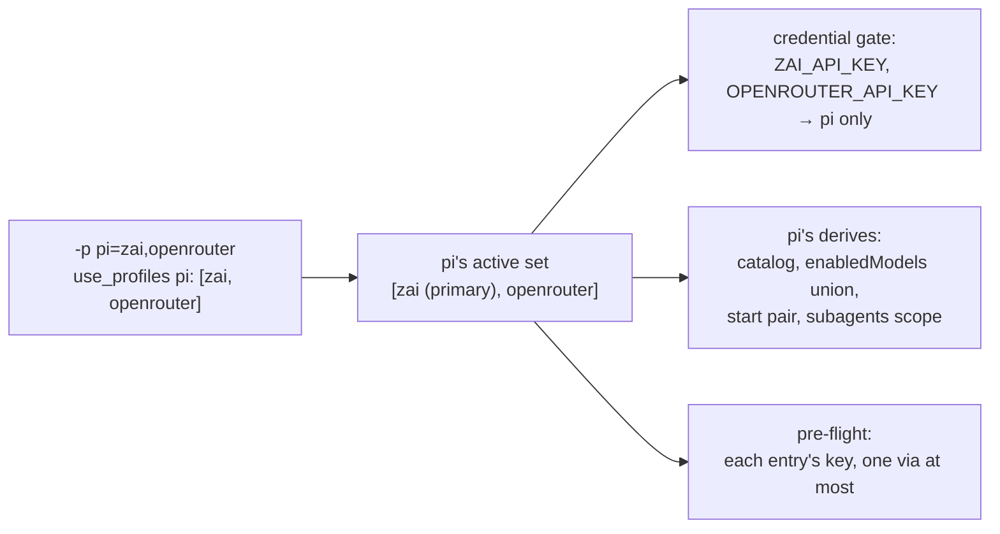

# Several providers in one agent session: an ordered set per agent, and the first entry decides where it starts

**Status:** DESIGN, 2026-09-29. Nothing built. The code evidence was read at `f26397cc`, and the
per-agent capabilities were read from each agent's config format and its derive, not from a run.

> **In short.** An agent's selection stops being one profile and becomes an ordered **active
> set** of them. Every provider in the set is live for that agent, which means its catalog, its
> key and its models. The first entry is where a session starts when yolo has to pick at all.

**Why it matters.** The maintainer, 2026-09-29: *"you should be able to use two providers within
Pi and switch freely between them."* Today `-p pi=zai,openrouter` exits 0, runs pi on zai
alone, and drops `openrouter` without a word ([§2](#2-what-exists-today)).

**The shape.** One ordered list per CLI name, through the same resolution, credential gate and
derives as today. Only an agent whose pack declares it can take more than one entry.

**Cost.** The `-p` grammar gains a meaning for a comma and loses one, since a profile name may no
longer contain a comma. The contract that tells a jail which profiles are active changes
shape, so an attach to an older jail restarts it. claude, codex and copilot get no set in the
first slice.

**Start at [§4](#4-the-proposed-shape).** [§3](#3-what-each-agent-can-hold) is the per-agent
finding it rests on.

**Needs your ruling:** [OQ-AP1](#OQ-AP1), [OQ-AP2](#OQ-AP2), [OQ-AP3](#OQ-AP3).

**Reads with:** [`model-lists-and-pickers.md`](model-lists-and-pickers.md) (the parent: its
[OQ-ML1](model-lists-and-pickers.md#OQ-ML1) ruling split this doc off, and its
[OQ-ML2](model-lists-and-pickers.md#OQ-ML2) rule picks the start model),
[`providers.md`](../reference/providers.md) (the as-built selection, gate and derives this
extends), [`providers-and-profiles-redesign.md`](providers-and-profiles-redesign.md) (what `-p`
names, [OQ-PP1](providers-and-profiles-redesign.md#OQ-PP1), which this doc survives either way).
No implementation sketch is open. The first slice ([§8](#8-what-i-would-build-in-order)) is small
enough to plan cold once the questions rule.

---

## 1. The verdict, and the words it uses

**Build the active set, pi first.** Three principles carry it, numbered so the questions can
cite them:

- **AP-P1. A set is the single selection generalized, never a second
  mechanism.** A one-entry set behaves exactly as today's one profile, on every notch, with no
  migration. Every rule in [`providers.md`](../reference/providers.md) that names "the selected
  provider" reads "each provider in the set" unless this doc says otherwise.
- **AP-P2. yolo never accepts a set and quietly runs one entry.** That is
  [declaration parity's P1](declaration-parity.md#1-the-principle-and-what-it-does-not-say)
  applied to selection: *"The one state that is never legal is accepting a declaration and doing
  nothing."* An agent that cannot hold a set is refused by name, or given a mechanism that holds
  it ([OQ-AP2](#OQ-AP2)). It is never handed the first entry in silence.
- **AP-P3. The set is the boundary.** Credentials, the picker, the start model
  and child agents all stay inside it. [OQ-XM3](../research/extension-model-defaults.md#OQ-XM3)'s
  *"it shouldn't be able to cross providers"* becomes: nothing crosses out of the set.

### 1.1 Terms

- **Active set** *(coined here)*: the ordered list of profiles one agent (one CLI name) runs on
  for one launch, and the providers they resolve to. It is not a new kind of profile and not a
  group declared anywhere. It is the value of that CLI's `use_profiles` entry or `-p` pair.
- **Primary** *(coined here)*: the set's first entry. Its provider is the **primary provider**.
  It decides where a session starts when [OQ-ML2](model-lists-and-pickers.md#OQ-ML2)'s rule has
  to pick ([§4.4](#44-models-the-union-and-the-start-model)), and it is what every derive that
  predates sets sees as `ctx.selected_provider`. It is not a preference the other entries lose
  to. Once a session runs, every entry is equally live.
- **Set-capable agent** *(coined here)*: an agent whose pack declares that its derives read the
  whole set ([§4.3](#43-which-agents-take-a-set)). An agent whose pack declares nothing is
  single-provider.
- **Provider**, **profile**, **derive**, **catalog** and **selection** are
  [`providers.md`](../reference/providers.md)'s. **Via profile** and **via route** are
  [`wire-bridge.md`](../reference/wire-bridge.md#the-via-route--one-route-per-agent-under-agentname)'s.

## 2. What exists today

Read at `f26397cc`. One CLI name maps to one profile everywhere along the chain:

| Stage | What it holds | Where |
| :--- | :--- | :--- |
| `-p` grammar | a bare name, or comma-separated `cli=name` pairs, later pairs winning | `parseProfileValue` in [`runcmd.go`](../../internal/cli/runcmd.go) |
| `use_profiles` | CLI name → one profile name, a string | `validateUseProfiles` in [`validate.go`](../../internal/config/validate.go) |
| The contract into the jail | `YOLO_USE_PROFILES`, CLI name → profile name | [`providers.md`](../reference/providers.md#what-crosses-to-the-jail) |
| The derive's input | `ctx.selected_provider`, one string, and `ctx.profile`, one table | `buildDeriveCtxTable` in [`derive.go`](../../internal/agentcfg/luahook/derive.go) |
| The credential gate | a provider's claimed key reaches *"each agent whose selected profile resolves to a claiming provider"* | `packload.ScopeCredentials`, [the gate](../reference/providers.md#the-credential-gate) |
| The model helper | `yolo.model_for(alias)` answers for the selected provider only | [XM-D1](../research/extension-model-defaults.md#XM-D1) |

**The silent drop.** `parseProfileValue` splits a value containing `=` on commas and keeps only
the elements that contain `=`. So `-p pi=zai,openrouter` selects zai for pi and discards
`openrouter`, with no message. That is the state [AP-P2](#AP-P2) forbids, and the maintainer's
own spelling reaches it today.

**What already works for a set.** Catalog rides presence: each of the four derives that write
a provider catalog writes a row for every composed provider its agent can reach, selected or not
(`yolo.derive("pi", "models", …)`, `yolo.derive("opencode", "config", …)`,
`yolo.derive("codex", "config", …)` and `yolo.derive("oh-omp", "models", …)` all loop over
`ctx.providers`). claude and copilot have no catalog. What stops pi from using an unselected row is the gate withholding its key, and
pi's availability *is* credential presence
([`provider-credential-scope.md` §2.4](provider-credential-scope.md#24-the-agents-disagree-about-what-a-credential-even-decides)).
So for pi, most of a set is delivering more keys.

## 3. What each agent can hold

Read from each agent's config format and its derive in `packs/*/derive.lua`. No agent was run.

| Agent | Several providers in one session? | Why | Its picker, across providers |
| :--- | :--- | :--- | :--- |
| **pi** | **yes** | `models.json` holds a row per provider; `settings.json` names one `defaultProvider`/`defaultModel` pair for the start, and `enabledModels` is a list of `provider/id` patterns | `/model` opens on the scoped list and Tab shows every credentialed model; switching checks auth only, never the scope ([§2.4.1 there](provider-credential-scope.md#241-what-pis-enabledmodels-actually-constrains)) |
| **opencode** | **yes** | `opencode.json` holds `provider.<id>` per provider; `enabled_providers` is an array, which the derive today fills with the one selected provider; `model` is one `provider/model` start | its schema: *"When set, ONLY these providers will be enabled"*, so the picker spans every provider named there (read, not observed with two) |
| **oh-omp** | **yes**, already | its derive writes a catalog and no selection key ([per-agent delivery](../reference/providers.md#per-agent-delivery)); the user picks inside the agent | its own |
| **codex** | **no** | `config.toml` holds many `[model_providers.<id>]` rows but one top-level `model_provider`, and a session records one: codex 0.145.0's binary carries *"Model provider used for this thread (for example, 'openai')"* (read with `strings`, not run) | `/model` offers the active provider's models (INFERRED from the one-provider thread, not observed) |
| **claude** | **no, natively** | one process has one `ANTHROPIC_BASE_URL` (`yolo.env("claude", …)`), and no provider directory | only through a bridge that routes by model id, the shape [`wire-bridge-gateway.md` Part 2](wire-bridge-gateway.md#3-part-2--routing-by-model-id-for-claudes-everything-profile-ruled) rules for the everything profile and has not built |
| **copilot** | **no** | BYOK is one `COPILOT_PROVIDER_BASE_URL` and one `COPILOT_MODEL` (`yolo.env("copilot", …)`) | none |
| **agy** | not applicable | its derive renders MCP only | — |

My read: the maintainer's example is exactly the agent where a set is nearly free, and the two
agents people most expect to switch in (claude, codex) are the ones whose format forbids it.

## 4. The proposed shape

### 4.1 The spelling

The leaning of [OQ-AP1](#OQ-AP1), which rules it:

- **The list names profiles, not providers**, because `-p` names a profile today and a profile
  carries options (the start model among them). Shipped profiles are named for their provider
  (`zai`, `openrouter`, `kilo`), so the maintainer's example reads the same either way.
- **On the command line:** inside the pair grammar, an element with no `=` continues the
  previous pair's list. `-p pi=zai,openrouter,claude=codex` gives pi `[zai, openrouter]` and
  claude `[codex]`.
- **In config:** `use_profiles` takes a string, as today, or an array of names. The array is the
  set, in order. There is no comma-string form in config: a JSON array already is a list, and a
  second grammar inside a string would be one more thing to parse two ways.

What changes around the grammar:

- **A profile name may not contain `,`**, refused in both schemas where `=` is refused today,
  with the same message shape. No shipped profile contains one (checked at `f26397cc`).
- **An element with no `=` before any pair** (`-p zai,pi=openrouter`) has no CLI to join, so it
  is refused, naming the element. Today it is dropped silently.
- **A bare list** (`-p zai,openrouter`, no `=`) is today refused as an undeclared profile named
  `zai,openrouter`. What it should mean is [OQ-AP3](#OQ-AP3).

### 4.2 The set's rules

- **Order is meaning.** The first entry is the primary ([§1.1](#11-terms)). The rest keep their
  written order wherever an order shows: the picker, the credential disclosure, `yolo check`.
- **One entry** is today's selection exactly ([AP-P1](#AP-P1)).
- **Empty** (`[]`) is refused, naming `null` as the way to select nothing, so "no selection" has
  one spelling.
- **A duplicate name** is refused, naming it.
- **Two entries resolving to one provider** (a user's `zai-fast` beside `zai`) are refused,
  naming both. One provider has one catalog row and one key, and two option sets for it have no
  meaning once a session can switch.
- **Every entry must be declared**, as today ([OQ-CS6](../reference/providers.md#oq-cs6)). One
  undeclared entry refuses the launch; yolo never runs the declared rest.
- **Precedence:** a typed `-p` pair for a CLI replaces that CLI's whole set for the launch. It
  never appends to the `use_profiles` set. A later mention of the same CLI in the same `-p`
  value, or in a repeated `-p`, replaces the earlier, as later pairs win today.
- **Scope:** `use_profiles` stays user-scope-only
  ([OQ-CS5](../reference/providers.md#oq-cs5)). No pack can activate a provider for an agent.

### 4.3 Which agents take a set

- **An agent's pack declares that it is set-capable.** Absent the declaration, the agent is
  single-provider and a set of more than one for it is handled as [OQ-AP2](#OQ-AP2) rules. The
  spelling of the declaration is the implementer's. It sits on the pack, because core does not
  know what an agent is.
- **The first slice declares it for pi.** opencode follows ([§8](#8-what-i-would-build-in-order)).
  oh-omp needs only its keys, since it writes no selection.
- **A set-capable agent's derives read the whole set** through a new derive input that lists
  each entry's provider, profile name and profile options, in order. `ctx.selected_provider` and
  `ctx.profile` stay, holding the primary, so a derive that predates sets reads a one-entry set
  exactly as today and a set-capable one reads the list. Only a set-capable agent is ever handed
  a set longer than one, which is what makes the old input safe to keep.
- **`yolo.model_for`** gains an optional provider argument, answering only for a provider in the
  calling agent's set and `nil` for any other, so the XM-D1 guarantee (never borrow another
  provider's alias) holds for the set. With no argument it answers for the primary.

### 4.4 Models: the union, and the start model

- **The picker offers the union** of the set's models, rendered by each agent's derive into its
  own surface:
  - **pi:** `enabledModels` lists the primary's default first, then the primary's other models,
    then each later entry's models in set order, the default of each leading its own run. A
    provider with no declared list contributes `<provider>/*`, as the single case does today.
    **An `openai-codex` entry in a set of more than one adds its declared ids** to
    `enabledModels`: [ML-D2](model-lists-and-pickers.md#ML-D2)'s "no `enabledModels` for
    `openai-codex`" holds only when codex is the whole set, since otherwise the scoped view pi
    opens on would hide the subscription's models.
  - **opencode:** `enabled_providers` names every provider in the set, in order.
- **The start model follows [OQ-ML2](model-lists-and-pickers.md#OQ-ML2), read over the union.**
  yolo picks only when the model the agent would start on is not one of the set's models (a
  wrong-family id, a model of a provider that left the set, or none). A valid choice on any
  entry, the user's or the agent's own, is never steered unless config opts in.
- **When yolo must pick, it picks the primary's default**, by ML2's ladder: the agent's upstream
  default when it is one of the primary provider's models, else the primary provider's declared
  default, else the first model it lists. A primary with no declared models (openrouter and kilo
  ship none) has no pick to give, so yolo names the primary provider and no model, and the agent
  chooses within it, as a one-entry set on those providers does today.
- **Which models count as "the set's".** A provider with a declared list contributes that list.
  A provider with none contributes every model of that provider, the reading
  [XM-D4](../research/extension-model-defaults.md#XM-D4) already gives its `<provider>/*`.
- **What ML2 does not change here:** how yolo learns what model an agent "would start on" is
  ML2's to build, in [`model-lists-and-pickers.md`](model-lists-and-pickers.md). This doc only
  widens the set that model is checked against.

### 4.5 Credentials

- **Each entry's claimed key reaches that agent, and only that agent.** The gate's rule becomes
  *"each agent whose active set contains a claiming provider"*. Nothing else about
  [the gate](../reference/providers.md#the-credential-gate) moves: an unclaimed value still
  reaches every process, and a claimed one still reaches no bare shell.
- **The disclosure names each key separately**, in set order:
  `ZAI_API_KEY (provider zai): pi only`, then `OPENROUTER_API_KEY (provider openrouter): pi only`.
- **The credential pre-flight demands every entry's key.** An entry whose provider has an
  endpoint and no deliverable key refuses the launch, naming the entry, its position and the
  agent. It never drops the entry and runs the rest ([AP-P2](#AP-P2)).
  `YOLO_ALLOW_MISSING_PROVIDERS=1` keeps its meaning.
- **A derive's copy of the table** carries the `api_key` of each provider in that agent's set and
  no other, generalizing *"the `api_key` of that agent's provider only"*.
- **The menu half of [OQ-CN4](provider-credential-scope.md#OQ-CN4)** follows: opencode's
  `enabled_providers` is the set, and pi's shortlist is the union. pi's Tab view is still every
  credentialed model, stored logins included, as today.

### 4.6 Child agents

[OQ-XM3](../research/extension-model-defaults.md#OQ-XM3)'s rule, read for a set:

- **`subagents.defaultModel`** is the model the chat selection starts on, as today, so a child
  that names no model starts where its parent starts.
- **`subagents.modelScope.allow`** is the union: each entry's configured ids as
  `<provider>/<id>`, or `<provider>/*` for an entry with no list. It stays strict and enforced.
- **So a child may run on any provider in the set, and on nothing outside it.** That is what
  "never cross providers" means once one session may use several.

### 4.7 Defaults, layered

Per [OQ-ML1](model-lists-and-pickers.md#OQ-ML1)'s ruling, each provider declares its own
default in its own pack, and a company pack, a user pack or user config overrides it. A set adds
nothing to that: each entry's provider carries its own layered default, and the primary's is the
one [§4.4](#44-models-the-union-and-the-start-model) reads when yolo must pick. The other
entries' defaults order their own runs in the picker and nothing else.

### 4.8 Via, and the wire bridge

- **A via profile may sit in a set, at most one per set** in the first slice. The via route is
  one per agent, `/agent/<agent>/`, with one upstream provider
  ([`wire-bridge.md`](../reference/wire-bridge.md#the-via-route--one-route-per-agent-under-agentname)),
  so two via entries for one agent have one route between them. A second is refused, naming both.
  Only the via entry's provider row points at the route. The other rows keep their own URLs, as
  every other row does today.
- **A bridged pairing** (an entry only a service's adaptation resolves for this agent, such as
  claude on `openai-codex`) counts toward the same limit of one per set. That keeps
  [`host-notch-services.md` §4.2](host-notch-services.md#42-the-trigger)'s *"a launch starts
  zero or one service"* true. In practice it arises only for claude and copilot, which are
  single-provider anyway, since pi and opencode speak each shipped provider's wire natively.
- **The bridge as the way claude holds a set** is [OQ-AP2](#OQ-AP2)'s option C.

### 4.9 At every notch

One behavior per concern at every notch, per [NC-D1](../plans/notch-convergence.md#7-decision-ledger)
and [declaration parity](declaration-parity.md#1-the-principle-and-what-it-does-not-say):

| Notch | What a set does |
| :--- | :--- |
| Container jail (podman, Apple Container) | The agent's own env file carries every entry's key. The channel carries the set in order. The derives render it at boot |
| `macos-user` | The same per-agent env file, written by the same writer, and the per-invocation plan env for the launched program. [HS-D14](host-notch-services.md#HS-D14)'s "every profiled agent's pairing counts" reads each entry |
| `yolo host -- <agent>` | The one command's set: a pair naming that command, or `use_profiles`. A bridged entry starts its launch-owned service as today, within the limit of one ([§4.8](#48-via-and-the-wire-bridge)) |
| `yolo host env --agent <agent>` | Exports every entry's key and shape for that agent. A bridged entry is refused, as a bridged profile is today ([OQ-HS3](host-notch-services.md#OQ-HS3)) |
| `yolo host apply` | Renders the `use_profiles` set into the agent's files, as the host runs the jail's derives ([OQ-HC1](host-computed-layer.md#OQ-HC1)). Keys are not in files, so an agent started without yolo sees the union and holds only the keys its own shell exports, which the [OQ-HS3](host-notch-services.md#OQ-HS3) ruling accepts |

### 4.10 State that already exists

- **Every existing config keeps working.** A string `use_profiles` value is a one-entry set. No
  file is migrated.
- **The contract into a jail changes shape**, since it must carry a list per CLI. An attach to a
  jail launched before this cannot receive a set, so the change ships behind a new contract tag
  and takes the existing disposition: at a terminal, `Restart jail now? [Y/n]`; elsewhere, a
  refusal naming `yolo stop` ([attach guardrails](attach-skew-and-contract-guardrails.md#what-was-built-2026-09-26)).
  An attach whose every set has one entry needs no tag, as an entry scoping nothing needs none
  today.
- **Removing an entry deselects it** through the existing rules
  ([deselection](../reference/providers.md#deselection-clear-what-yolo-wrote-keep-what-the-user-wrote)):
  its key stops arriving, the arrays yolo wrote (`enabledModels`, `enabled_providers`) are
  rewritten whole, and a user's own edit of them is kept. A saved start model on the removed
  provider is no longer valid, so ML2's pick applies on the next boot.
- **Concurrency** is today's: each entry composes once, and an attach rewrites the agent's env
  file whole. A set adds no new writer.

## 5. Alternatives considered

| Alternative | Verdict |
| :--- | :--- |
| Name providers in the list, not profiles | **Rejected for now.** It loses a profile's options, the start model among them, and forks `-p` into two nouns. [OQ-PP1](providers-and-profiles-redesign.md#OQ-PP1) may still rename what `-p` names; this design follows whatever it names |
| A declared group (`"profile_sets": {"work": ["zai", "openrouter"]}`), selected by one name | **Rejected.** A second declaration kind for what a list says in place. A user wanting a short name can declare it later without changing the set's semantics |
| First entry wins for an agent that cannot hold a set, with no message | **Rejected.** It is the silent drop of [§2](#2-what-exists-today), which [AP-P2](#AP-P2) forbids |
| Let each derive refuse a set it cannot read | **Rejected.** A derive older than sets would not refuse; it would read `ctx.selected_provider` and run the primary silently. The declaration fails closed where the derive would fail open |
| Deliver every cataloged provider's key to pi and let pi's credential check do the rest | **Rejected.** It undoes [OQ-BR4](provider-credential-scope.md#OQ-BR4)'s *"as specific as possible"*. The set is the explicit act the gate keys on |
| A `+` separator (`pi=zai+openrouter`) instead of continuing commas | **Considered, in [OQ-AP1](#OQ-AP1).** It keeps names free to hold a comma, and costs a second separator in one flag |

## 6. Costs and risks

**Costs:**

- A comma leaves the profile-name alphabet, in both schemas.
- The derive input and the jail contract each gain a list, and every attach to an older jail with
  a real set restarts it.
- pi's `enabledModels` for `openai-codex` is written again, but only in a set of more than one
  ([§4.4](#44-models-the-union-and-the-start-model)).
- claude and codex users get nothing from the first slice.

| Risk | Mitigation |
| :--- | :--- |
| A user reads `pi=zai,codex` as a selection for the codex CLI, since `codex` is both a CLI and a profile | The grammar has one reading, since a CLI is always spelled `cli=`. The launch disclosure and `yolo check` print each agent's set in order, so the reading shows before anything runs |
| pi's Tab view still shows a provider outside the set through a stored login | Unchanged from today and stated in [§4.5](#45-credentials); a stored credential owns the provider in pi |
| A child agent pinned by a workflow to a model of a provider not in the set | The strict scope refuses it, as today for one provider ([§4.6](#46-child-agents)) |
| An `openai-codex` entry beside another provider puts GPT ids in pi's scoped list the user did not expect | That is the set's meaning. A user who wants codex off the shortlist removes it from the set |

## 7. What this does not cover

- **Picking a model when the start model is valid.** ML2 rules it out, and this doc inherits the
  ruling ([§4.4](#44-models-the-union-and-the-start-model)).
- **How yolo learns the model an agent would start on.** That is ML2's build, in
  [`model-lists-and-pickers.md`](model-lists-and-pickers.md).
- **A `models` kind, or a company pack narrowing a list.** That is
  [OQ-BR12](model-lists-and-pickers.md#OQ-BR12). A narrowed list narrows its provider's share of
  the union and nothing else.
- **A pack activating a provider.** `use_profiles` is user-scope-only
  ([OQ-CS5](../reference/providers.md#oq-cs5)).
- **Several via routes per agent** (`/agent/<agent>/<provider>/`), and a bridge that holds a set
  for claude. The first is a later wire-bridge change. The second is [OQ-AP2](#OQ-AP2) option C.
- **What `-p` names at all**, [OQ-PP1](providers-and-profiles-redesign.md#OQ-PP1).
- **The `guest` notch**, which has no launch path.

## 8. What I would build, in order

1. **The grammar and the config shape** ([§4.1](#41-the-spelling), [§4.2](#42-the-sets-rules)),
   refusing every set of more than one until step 2 lands. This alone closes the silent drop of
   [§2](#2-what-exists-today), and it is worth landing even if everything after it waits.
2. **The first slice: pi.** The set-capable declaration, the new derive input, the gate and
   pre-flight over the set, and pi's derive rendering the union, the start pair and the child
   scope. At every notch in the same change, per [§4.9](#49-at-every-notch), since the gate and
   the derives already run through one code path per concern.
3. **opencode**: `enabled_providers` as the set, and its start `model` from the primary.
4. **The single-provider arm**, whatever [OQ-AP2](#OQ-AP2) rules for claude, codex and copilot.
5. **Several via routes per agent**, only if a user asks for two via entries in one set.

## 9. What done looks like

- With `"packs": ["pi", "zai", "openrouter"]` and both keys in `env_sources`,
  `yolo -p pi=zai,openrouter -- pi` starts pi on zai's declared default, and both providers'
  models are in pi's scoped `/model` list, zai's first.
- In that jail, pi's env holds `ZAI_API_KEY` and `OPENROUTER_API_KEY`. A bare shell holds
  neither, and the launch discloses each as `pi only`.
- With `OPENROUTER_API_KEY` unset, the same launch refuses, naming `openrouter`, second in pi's
  set, and does not start pi on zai.
- A pi-subagents child that names an openrouter model runs. One that names a codex model is
  refused.
- A saved pi model on openrouter survives the next launch unchanged. After `openrouter` leaves
  the set, the next launch starts on zai's default.
- `use_profiles: {pi: "zai"}` renders byte-identically to today.
- `-p claude=zai,openrouter` does what [OQ-AP2](#OQ-AP2) rules, and never runs claude on zai
  alone in silence.
- `yolo host -p pi=zai,openrouter -- pi` and `yolo host env --agent pi -p zai,openrouter` compose
  the same keys and shape as the jail launch.

## 10. Open Questions

1. 💬 **[OQ-AP1](#OQ-AP1): How is a set spelled, and what does it list?** The
   answer is the user-facing grammar, which is expensive to change once it ships, and it decides
   whether a comma leaves the profile-name alphabet.

   - **A. Profiles; commas continue a pair on the command line; an array in config.**
     `-p pi=zai,openrouter` and `use_profiles: {pi: ["zai", "openrouter"]}`. It is the
     maintainer's own spelling and keeps `-p` naming one noun. Profile names lose `,`.
   - **B. Profiles; a `+` separator on the command line; an array in config.**
     `-p pi=zai+openrouter,claude=codex`. Names keep `,` and lose `+`. It is unambiguous at a
     glance, and it is a second separator in one flag.
   - **C. Providers, not profiles.** `-p pi=zai,openrouter` names providers directly. It drops
     per-entry options such as the start model, and it answers
     [OQ-PP1](providers-and-profiles-redesign.md#OQ-PP1) in passing.

   A comma string in config (`"zai,openrouter"`) is offered by none of these, since a JSON array
   already is a list.

   <!-- vantage: oq id=OQ-AP1 leaning="A: the list names profiles, a comma after a cli=name pair continues that pair's list, config takes a string or an array, the first entry is the primary, and a profile name may no longer contain a comma." -->

   _Leaning:_ A. It is what the maintainer typed, it fixes today's silent drop of exactly that
   input, and the first entry is the primary with no extra key.

   **Answer:**
   > _(empty — fill in when decided)_

2. 💬 **[OQ-AP2](#OQ-AP2): What does yolo do with a set of more than one for
   claude, codex or copilot?** None of them can hold two providers natively
   ([§3](#3-what-each-agent-can-hold)). This decides whether `-p claude=zai,openrouter` is an
   error, a narrowing, or a bridge feature.

   - **A. Refuse, by name.** The launch refuses before anything runs, naming the agent, saying it
     runs one provider per session, and naming the one-entry spelling. It follows
     [AP-P2](#AP-P2) with no new mechanism. The cost: claude users get nothing from sets.
   - **B. The first entry wins, loudly.** One launch line names the entries that do not run for
     that agent. It lets one `use_profiles` list serve every agent, and it is a declaration
     accepted and partly ignored, which P1 permits only because it is disclosed.
   - **C. The bridge, for claude.** A set for claude points it at a wire-bridge route that sends
     each request to the provider whose model it names, the everything profile's routing
     ([`wire-bridge-gateway.md` Part 2](wire-bridge-gateway.md#3-part-2--routing-by-model-id-for-claudes-everything-profile-ruled))
     generalized from one provider to the set, with each route's credential from its own
     provider. claude's picker renders the union. It is the only option that gives claude what pi
     gets, and it is unbuilt, unmeasured, and a new route kind. codex and copilot would still
     take A or B.

   <!-- vantage: oq id=OQ-AP2 leaning="A now, C for claude later: refuse a set of more than one for an agent whose pack does not declare it set-capable, naming the one-entry spelling; once the wire bridge routes by model id, claude may declare itself set-capable through that route, and codex and copilot stay refused." -->

   _Leaning:_ A now, C for claude later. Refusal costs nothing to build and closes the silent
   drop. C is the real answer for claude, but it waits on the bridge's model-id routing, which is
   itself unmeasured. B is the one I would not pick, because it makes a list mean different things
   to different agents in one config.

   **Answer:**
   > _(empty — fill in when decided)_

3. 💬 **[OQ-AP3](#OQ-AP3): What does a bare list mean?** A bare name
   (`-p zai`) selects that profile for every selected pack today. A bare list
   (`-p zai,openrouter`) is refused today, as an undeclared name. This decides whether one list
   can switch every agent at once, which interacts with
   [OQ-AP2](#OQ-AP2) and with [OQ-PP3](providers-and-profiles-redesign.md#OQ-PP3) (what a bare
   `-p X` does for an agent that cannot reach X, open).

   - **A. Refused, as today.** A set is always per CLI. At `yolo host`, where there is one
     command, a bare list is that command's set, since a pair naming the command already means
     its bare form there.
   - **B. The set for every set-capable agent**, and each single-provider agent handled as
     [OQ-AP2](#OQ-AP2) rules. Under AP2's leaning that refuses the launch whenever claude is
     selected, which is most launches.
   - **C. The set for every set-capable agent, and the primary for every single-provider agent**,
     disclosed on one line. Convenient, and it is [OQ-AP2](#OQ-AP2)'s option B for the bare form
     only.

   <!-- vantage: oq id=OQ-AP3 leaning="A: a bare list stays refused in a jail launch, so a set is always spelled per CLI; at yolo host, which composes one command, a bare list is that command's set." -->

   _Leaning:_ A. The per-CLI form is what the maintainer asked for, B makes the bare form refuse
   almost everywhere, and C imports the one behavior [OQ-AP2](#OQ-AP2)'s leaning rejects. A can be
   widened later without breaking anything that works.

   **Answer:**
   > _(empty — fill in when decided)_

## 11. Decision Ledger

The direction is the maintainer's. The rows after it are implementation decisions under it,
made in this doc, and every one yields to a ruling on the questions above.

| ID | Ruling / Decision | Date | Settled in | Built |
| :--- | :--- | :--- | :--- | :--- |
| DIR-AP1 | **Maintainer direction:** an agent may run on several explicitly activated providers and switch freely between them in pi, spelled as a list; providers scope the models, and every session starts on one of them. *"we will want to be able to activate multiple providers explicitly. Like if you want, you should be able to use two providers within Pi and switch freely between them. We should allow like, you know, a comma list or something like that … providers will scope to models. And whenever you start up a session, we always want to make sure that we have picked one of those models. You just want a valid configuration, basically."* Split off from [OQ-ML1](model-lists-and-pickers.md#OQ-ML1). A direction, so no question id | 2026-09-29 | [§1](#1-the-verdict-and-the-words-it-uses) | — |
| AP-D1 | *Implementation decision.* The first entry is the primary: its provider is `ctx.selected_provider` for every derive, and its default is the one [OQ-ML2](model-lists-and-pickers.md#OQ-ML2)'s pick reads | 2026-09-29 | [§4.4](#44-models-the-union-and-the-start-model) | — |
| AP-D2 | *Implementation decision.* An agent is set-capable only when its pack declares it; the declaration fails closed where a derive older than sets would fail open | 2026-09-29 | [§4.3](#43-which-agents-take-a-set) | — |
| AP-D3 | *Implementation decision.* A set is refused when empty, when it names a profile twice, when two entries resolve to one provider, or when any entry is undeclared or lacks its key; yolo never runs the valid remainder | 2026-09-29 | [§4.2](#42-the-sets-rules), [§4.5](#45-credentials) | — |
| AP-D4 | *Implementation decision.* A typed `-p` pair replaces a CLI's `use_profiles` set whole for the launch, never appending | 2026-09-29 | [§4.2](#42-the-sets-rules) | — |
| AP-D5 | *Implementation decision.* The picker, the credential gate and pi-subagents' scope all read the union of the set, so a child agent may run on any provider in the set and on none outside it ([OQ-XM3](../research/extension-model-defaults.md#OQ-XM3) read for a set) | 2026-09-29 | [§4.4](#44-models-the-union-and-the-start-model), [§4.6](#46-child-agents) | — |
| AP-D6 | *Implementation decision.* In a pi set of more than one, `enabledModels` carries an `openai-codex` entry's declared ids; [ML-D2](model-lists-and-pickers.md#ML-D2)'s omission holds when codex is the whole set | 2026-09-29 | [§4.4](#44-models-the-union-and-the-start-model) | — |
| AP-D7 | *Implementation decision.* At most one via or bridged entry per set, so the per-agent via route keeps one upstream and a host launch still starts zero or one service | 2026-09-29 | [§4.8](#48-via-and-the-wire-bridge) | — |
| AP-D8 | *Implementation decision.* The set crosses into a jail behind a new contract tag; an attach to an older jail with a real set takes the existing restart-or-refuse disposition, and a set of one needs no tag | 2026-09-29 | [§4.10](#410-state-that-already-exists) | — |

## 12. The neighbors

| Doc | Why it reads with this one |
| :--- | :--- |
| [`model-lists-and-pickers.md`](model-lists-and-pickers.md) | [OQ-ML1](model-lists-and-pickers.md#OQ-ML1) split this doc off and layers the per-provider default; [OQ-ML2](model-lists-and-pickers.md#OQ-ML2) is the start-model rule [§4.4](#44-models-the-union-and-the-start-model) reads over the union |
| [`provider-credential-scope.md`](provider-credential-scope.md) | the gate [§4.5](#45-credentials) widens from one provider to the set, and [OQ-CN4](provider-credential-scope.md#OQ-CN4)'s menu half |
| [`extension-model-defaults.md`](../research/extension-model-defaults.md#OQ-XM3) | [OQ-XM3](../research/extension-model-defaults.md#OQ-XM3), the child-agent rule [§4.6](#46-child-agents) reads for a set, and [XM-D1](../research/extension-model-defaults.md#XM-D1)'s helper |
| [`providers-and-profiles-redesign.md`](providers-and-profiles-redesign.md) | [OQ-PP1](providers-and-profiles-redesign.md#OQ-PP1), what `-p` names, and [OQ-PP3](providers-and-profiles-redesign.md#OQ-PP3), which [OQ-AP3](#OQ-AP3) meets |
| [`wire-bridge-gateway.md`](wire-bridge-gateway.md#3-part-2--routing-by-model-id-for-claudes-everything-profile-ruled) | the model-id routing [OQ-AP2](#OQ-AP2)'s option C generalizes |
| [`host-notch-services.md`](host-notch-services.md) | the launch-owned service a bridged entry starts at the host, and its "zero or one" |
