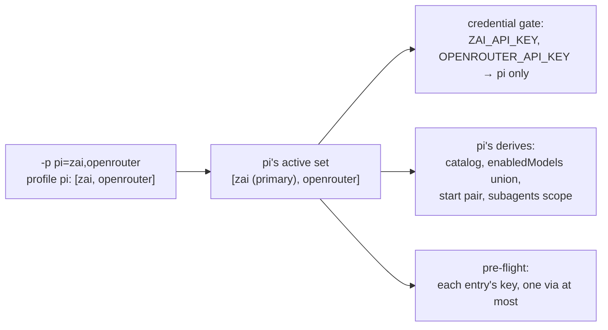

# Several providers in one agent session: an ordered set per agent, and the first entry decides where it starts

**Status:** 2026-09-29 — the first slice is built ([§8](#8-what-i-would-build-in-order)
steps 1, 2 and 4; [§13](#13-what-was-built-2026-09-29)): the grammar, the config list, the
single-provider refusal, the bare-list narrowing, and pi holding a set at every notch. The build
first spelled the config list under `use_profiles`; it lands on the `profile` key that replaced
that key the same day ([PP-D10](providers-and-profiles-redesign.md#PP-D10)), as the key's list
form ([AP-D13](#AP-D13)). opencode (step 3) was built on 2026-09-30
([§14](#14-what-was-built-2026-09-30-opencode), [AP-D15](#AP-D15), [AP-D16](#AP-D16)), and oh-omp
on 2026-10-01 ([§15](#15-what-was-built-2026-10-01-oh-omp), [AP-D18](#AP-D18)). Not built: several
via routes (step 5), which wait on a user asking for two, and the two gaps [§13](#13-what-was-built-2026-09-29)
lists last. MEASURED: unit tests pin each rule, every call site the review
cut to the set's first entry now fails one, and integration launches rendered pi's,
opencode's and oh-omp's files for a set in a real jail ([§13](#13-what-was-built-2026-09-29),
[§14](#14-what-was-built-2026-09-30-opencode), [§15](#15-what-was-built-2026-10-01-oh-omp)).
UNMEASURED: no pi, opencode or oh-omp session was run, so none switched providers, and no request
reached a provider. The code
evidence for [§2](#2-what-exists-today) and [§3](#3-what-each-agent-can-hold) was read at `f26397cc`, and the per-agent capabilities from each agent's
config format and its derive, not from a run.

> **In short.** An agent's selection stops being one profile and becomes an ordered **active
> set** of them. Every provider in the set is live for that agent, which means its catalog, its
> key and its models. The first entry is where a session starts when yolo has to pick at all.

**Why it matters.** The maintainer, 2026-09-29: *"you should be able to use two providers within
Pi and switch freely between them."* Today `-p pi=zai,openrouter` exits 0, runs pi on zai
alone, and drops `openrouter` without a word ([§2](#2-what-exists-today)).

**The shape.** One ordered list per CLI name, through the same resolution, credential gate and
derives as today. Only an agent whose pack declares it can take more than one entry.

**Cost.** The `-p` grammar gains a meaning for a comma and loses one, since a profile name may no
longer contain a comma. The contract that tells a jail which profiles are active changes
shape, so an attach to an older jail restarts it. claude, codex and copilot get no set in the
first slice.

**Start at [§4](#4-the-proposed-shape).** [§3](#3-what-each-agent-can-hold) is the per-agent
finding it rests on.

**Needs your ruling:** none; [OQ-AP1](#OQ-AP1), [OQ-AP2](#OQ-AP2) and [OQ-AP3](#OQ-AP3) were ruled 2026-09-29 and are built, for pi and, since 2026-09-30, for opencode.

**Reads with:** [`model-lists-and-pickers.md`](model-lists-and-pickers.md) (the parent: its
[OQ-ML1](model-lists-and-pickers.md#OQ-ML1) ruling split this doc off, and its
[OQ-ML2](model-lists-and-pickers.md#OQ-ML2) rule picks the start model),
[`providers.md`](../reference/providers.md) (the as-built selection, gate and derives this
extends), [`providers-and-profiles-redesign.md`](providers-and-profiles-redesign.md) (what `-p`
names, [OQ-PP1](providers-and-profiles-redesign.md#OQ-PP1), which this doc survives either way).
No implementation sketch is open. The first slice ([§8](#8-what-i-would-build-in-order)) is small
enough to plan cold once the questions rule.

---

## 1. The verdict, and the words it uses

**Build the active set, pi first.** Three principles carry it, numbered so the questions can
cite them:

- **AP-P1. A set is the single selection generalized, never a second
  mechanism.** A one-entry set behaves exactly as today's one profile, on every notch, with no
  migration. Every rule in [`providers.md`](../reference/providers.md) that names "the selected
  provider" reads "each provider in the set" unless this doc says otherwise.
- **AP-P2. yolo never accepts a set and quietly runs one entry.** That is
  [declaration parity's P1](declaration-parity.md#1-the-principle-and-what-it-does-not-say)
  applied to selection: *"The one state that is never legal is accepting a declaration and doing
  nothing."* An agent that cannot hold a set is refused by name, or given a mechanism that holds
  it ([OQ-AP2](#OQ-AP2)). It is never handed the first entry in silence.
- **AP-P3. The set is the boundary.** Credentials, the picker, the start model
  and child agents all stay inside it. [OQ-XM3](../research/extension-model-defaults.md#OQ-XM3)'s
  *"it shouldn't be able to cross providers"* becomes: nothing crosses out of the set.

### 1.1 Terms

- **Active set** *(coined here)*: the ordered list of profiles one agent (one CLI name) runs on
  for one launch, and the providers they resolve to. It is not a new kind of profile and not a
  group declared anywhere. It is the value of that CLI's entry in the `profile` config key (it
  was `use_profiles` until [PP-D10](providers-and-profiles-redesign.md#PP-D10)) or its `-p` pair.
- **Primary** *(coined here)*: the set's first entry. Its provider is the **primary provider**.
  It decides where a session starts when [OQ-ML2](model-lists-and-pickers.md#OQ-ML2)'s rule has
  to pick ([§4.4](#44-models-the-union-and-the-start-model)), and it is what every derive that
  predates sets sees as `ctx.selected_provider`. It is not a preference the other entries lose
  to. Once a session runs, every entry is equally live.
- **Set-capable agent** *(coined here)*: an agent whose pack declares that its derives read the
  whole set ([§4.3](#43-which-agents-take-a-set)). An agent whose pack declares nothing is
  single-provider.
- **Provider**, **profile**, **derive**, **catalog** and **selection** are
  [`providers.md`](../reference/providers.md)'s. **Via profile** and **via route** are
  [`wire-bridge.md`](../reference/wire-bridge.md#the-via-route--one-route-per-agent-under-agentname)'s.

## 2. What exists today

Read at `f26397cc`. One CLI name maps to one profile everywhere along the chain:

| Stage | What it holds | Where |
| :--- | :--- | :--- |
| `-p` grammar | a bare name, or comma-separated `cli=name` pairs, later pairs winning | `parseProfileValue` in [`runcmd.go`](../../internal/cli/runcmd.go) |
| `use_profiles` | CLI name → one profile name, a string | `validateUseProfiles` in [`validate.go`](../../internal/config/validate.go) |
| The contract into the jail | `YOLO_USE_PROFILES`, CLI name → profile name | [`providers.md`](../reference/providers.md#what-crosses-to-the-jail) |
| The derive's input | `ctx.selected_provider`, one string, and `ctx.profile`, one table | `buildDeriveCtxTable` in [`derive.go`](../../internal/agentcfg/luahook/derive.go) |
| The credential gate | a provider's claimed key reaches *"each agent whose selected profile resolves to a claiming provider"* | `packload.ScopeCredentials`, [the gate](../reference/providers.md#the-credential-gate) |
| The model helper | `yolo.model_for(alias)` answers for the selected provider only | [XM-D1](../research/extension-model-defaults.md#XM-D1) |

**The silent drop.** `parseProfileValue` splits a value containing `=` on commas and keeps only
the elements that contain `=`. So `-p pi=zai,openrouter` selects zai for pi and discards
`openrouter`, with no message. That is the state [AP-P2](#AP-P2) forbids, and the maintainer's
own spelling reaches it today.

**What already works for a set.** Catalog rides presence: each of the four derives that write
a provider catalog writes a row for every composed provider its agent can reach, selected or not
(`yolo.derive("pi", "models", …)`, `yolo.derive("opencode", "config", …)`,
`yolo.derive("codex", "config", …)` and `yolo.derive("oh-omp", "models", …)` all loop over
`ctx.providers`). claude and copilot have no catalog. What stops pi from using an unselected row is the gate withholding its key, and
pi's availability *is* credential presence
([`provider-credential-scope.md` §2.4](provider-credential-scope.md#24-the-agents-disagree-about-what-a-credential-even-decides)).
So for pi, most of a set is delivering more keys.

## 3. What each agent can hold

Read from each agent's config format and its derive in `packs/*/derive.lua`. No agent was run.

| Agent | Several providers in one session? | Why | Its picker, across providers |
| :--- | :--- | :--- | :--- |
| **pi** | **yes** | `models.json` holds a row per provider; `settings.json` names one `defaultProvider`/`defaultModel` pair for the start, and `enabledModels` is a list of `provider/id` patterns | `/model` opens on the scoped list and Tab shows every credentialed model; switching checks auth only, never the scope ([§2.4.1 there](provider-credential-scope.md#241-what-pis-enabledmodels-actually-constrains)) |
| **opencode** | **yes** | `opencode.json` holds `provider.<id>` per provider; `enabled_providers` is an array, which the derive today fills with the one selected provider; `model` is one `provider/model` start | its schema: *"When set, ONLY these providers will be enabled"*, so the picker spans every provider named there (read, not observed with two) |
| **oh-omp** | **yes**, already | its derive writes a catalog and no selection key ([per-agent delivery](../reference/providers.md#per-agent-delivery)); the user picks inside the agent | its own |
| **codex** | **no** | `config.toml` holds many `[model_providers.<id>]` rows but one top-level `model_provider`, and a session records one: codex 0.145.0's binary carries *"Model provider used for this thread (for example, 'openai')"* (read with `strings`, not run) | `/model` offers the active provider's models (INFERRED from the one-provider thread, not observed) |
| **claude** | **no, natively** | one process has one `ANTHROPIC_BASE_URL` (`yolo.env("claude", …)`), and no provider directory | only through a bridge that routes by model id, the shape [`wire-bridge-gateway.md` Part 2](wire-bridge-gateway.md#3-part-2--routing-by-model-id-for-claudes-everything-profile-ruled) rules for the everything profile; built 2026-09-29 within one Bedrock provider (Anthropic models untranslated, the rest translated), which is one provider's list and not a set of providers |
| **copilot** | **no** | BYOK is one `COPILOT_PROVIDER_BASE_URL` and one `COPILOT_MODEL` (`yolo.env("copilot", …)`) | none |
| **agy** | not applicable | its derive renders MCP only | — |

My read: the maintainer's example is exactly the agent where a set is nearly free, and the two
agents people most expect to switch in (claude, codex) are the ones whose format forbids it.

## 4. The proposed shape

### 4.1 The spelling

The leaning of [OQ-AP1](#OQ-AP1), which rules it:

- **The list names profiles, not providers**, because `-p` names a profile today and a profile
  carries options (the start model among them). Shipped profiles are named for their provider
  (`zai`, `openrouter`, `kilo`), so the maintainer's example reads the same either way.
- **On the command line:** inside the pair grammar, an element with no `=` continues the
  previous pair's list. `-p pi=zai,openrouter,claude=codex` gives pi `[zai, openrouter]` and
  claude `[codex]`.
- **In config:** the selection key (`use_profiles` when this was written, `profile` since
  [PP-D10](providers-and-profiles-redesign.md#PP-D10)) takes a string, as today, or an array of
  names. The array is the set, in order. There is no comma-string form in config: a JSON array already is a list, and a
  second grammar inside a string would be one more thing to parse two ways.

What changes around the grammar:

- **A profile name may not contain `,`**, refused in both schemas where `=` is refused today,
  with the same message shape. No shipped profile contains one (checked at `f26397cc`).
- **An element with no `=` before any pair** (`-p zai,pi=openrouter`) has no CLI to join, so it
  is refused, naming the element. Today it is dropped silently.
- **A bare list** (`-p zai,openrouter`, no `=`) is today refused as an undeclared profile named
  `zai,openrouter`. What it should mean is [OQ-AP3](#OQ-AP3).

### 4.2 The set's rules

- **Order is meaning.** The first entry is the primary ([§1.1](#11-terms)). The rest keep their
  written order wherever an order shows: the picker, the credential disclosure, `yolo check`.
- **One entry** is today's selection exactly ([AP-P1](#AP-P1)).
- **Empty** (`[]`) is refused, naming `null` as the way to select nothing, so "no selection" has
  one spelling.
- **A duplicate name** is refused, naming it.
- **Two entries resolving to one provider** (a user's `zai-fast` beside `zai`) are refused,
  naming both. One provider has one catalog row and one key, and two option sets for it have no
  meaning once a session can switch.
- **Every entry must be declared**, as today ([OQ-CS6](../reference/providers.md#oq-cs6)). One
  undeclared entry refuses the launch; yolo never runs the declared rest.
- **Precedence:** a typed `-p` pair for a CLI replaces that CLI's whole set for the launch. It
  never appends to the config key's set. A later mention of the same CLI in the same `-p`
  value, or in a repeated `-p`, replaces the earlier, as later pairs win today.
- **Scope:** the `profile` key stays user-scope-only
  ([OQ-CS5](../reference/providers.md#oq-cs5)). No pack can activate a provider for an agent.

### 4.3 Which agents take a set

- **An agent's pack declares that it is set-capable.** Absent the declaration, the agent is
  single-provider and a set of more than one for it is handled as [OQ-AP2](#OQ-AP2) rules. The
  spelling of the declaration is the implementer's. It sits on the pack, because core does not
  know what an agent is.
- **The first slice declares it for pi.** opencode followed on 2026-09-30
  ([§8](#8-what-i-would-build-in-order) step 3, [AP-D15](#AP-D15)), and oh-omp on 2026-10-01
  ([AP-D18](#AP-D18)). oh-omp writes no start model, so its set is its keys, its catalog rows and,
  under an `only`, its picker scope.
- **A set-capable agent's derives read the whole set** through a new derive input that lists
  each entry's provider, profile name and profile options, in order. `ctx.selected_provider` and
  `ctx.profile` stay, holding the primary, so a derive that predates sets reads a one-entry set
  exactly as today and a set-capable one reads the list. Only a set-capable agent is ever handed
  a set longer than one, which is what makes the old input safe to keep.
- **`yolo.model_for`** gains an optional provider argument, answering only for a provider in the
  calling agent's set and `nil` for any other, so the XM-D1 guarantee (never borrow another
  provider's alias) holds for the set. With no argument it answers for the primary.

### 4.4 Models: the union, and the start model

- **The picker offers the union** of the set's models, rendered by each agent's derive into its
  own surface:
  - **pi:** `enabledModels` lists the primary's default first, then the primary's other models,
    then each later entry's models in set order, the default of each leading its own run. A
    provider with no declared list contributes `<provider>/*`, as the single case does today.
    **An `openai-codex` entry in a set of more than one adds its declared ids** to
    `enabledModels`: [ML-D2](model-lists-and-pickers.md#ML-D2)'s "no `enabledModels` for
    `openai-codex`" holds only when codex is the whole set, since otherwise the scoped view pi
    opens on would hide the subscription's models.
  - **opencode:** `enabled_providers` names every provider in the set, in order. opencode reads
    the key as a filter, not a list, so the order states the set and does not order opencode's
    menu ([AP-D15](#AP-D15)).
  - **oh-omp:** its own picker already offers every provider its catalog holds, so nothing is
    written unless an `only` narrowed an entry's list. Then `enabledModels` holds every entry in
    set order, a narrowed entry's run with its default first and `<provider>/*` for any other,
    because oh-omp's selector shows only the scope ([AP-D18](#AP-D18)).
- **The start model follows [OQ-ML2](model-lists-and-pickers.md#OQ-ML2), read over the union.**
  yolo picks only when the model the agent would start on is not one of the set's models (a
  wrong-family id, a model of a provider that left the set, or none). A valid choice on any
  entry, the user's or the agent's own, is never steered unless config opts in. opencode is the
  exception as built: it starts each time on the `model` yolo writes for the primary, which its
  start order tries before its saved picks ([AP-D15](#AP-D15)).
- **When yolo must pick, it picks the primary's default**, by ML2's ladder: the agent's upstream
  default when it is one of the primary provider's models, else the primary provider's declared
  default, else the first model it lists. A primary with no declared models (openrouter and kilo
  ship none) has no pick to give, so yolo names the primary provider and no model, and the agent
  chooses within it, as a one-entry set on those providers does today.
- **Which models count as "the set's".** A provider with a declared list contributes that list.
  A provider with none contributes every model of that provider, the reading
  [XM-D4](../research/extension-model-defaults.md#XM-D4) already gives its `<provider>/*`.
- **What ML2 does not change here:** how yolo learns what model an agent "would start on" is
  ML2's to build, in [`model-lists-and-pickers.md`](model-lists-and-pickers.md). This doc only
  widens the set that model is checked against.

### 4.5 Credentials

- **Each entry's claimed key reaches that agent, and only that agent.** The gate's rule becomes
  *"each agent whose active set contains a claiming provider"*. Nothing else about
  [the gate](../reference/providers.md#the-credential-gate) moves: an unclaimed value still
  reaches every process, and a claimed one still reaches no bare shell.
- **The disclosure names each key separately**, in set order:
  `ZAI_API_KEY (provider zai): pi only`, then `OPENROUTER_API_KEY (provider openrouter): pi only`.
- **The credential pre-flight demands every entry's key.** An entry whose provider has an
  endpoint and no deliverable key refuses the launch, naming the entry, its position and the
  agent. It never drops the entry and runs the rest ([AP-P2](#AP-P2)).
  `YOLO_ALLOW_MISSING_PROVIDERS=1` keeps its meaning.
- **A derive's copy of the table** carries the `api_key` of each provider in that agent's set and
  no other, generalizing *"the `api_key` of that agent's provider only"*.
- **The menu half of [OQ-CN4](provider-credential-scope.md#OQ-CN4)** follows: opencode's
  `enabled_providers` is the set, and pi's shortlist is the union. pi's Tab view is still every
  credentialed model, stored logins included, as today.

### 4.6 Child agents

[OQ-XM3](../research/extension-model-defaults.md#OQ-XM3)'s rule, read for a set:

- **`subagents.defaultModel`** is the model the chat selection starts on, as today, so a child
  that names no model starts where its parent starts.
- **`subagents.modelScope.allow`** is the union: each entry's configured ids as
  `<provider>/<id>`, or `<provider>/*` for an entry with no list. It stays strict and enforced.
- **So a child may run on any provider in the set, and on nothing outside it.** That is what
  "never cross providers" means once one session may use several.

### 4.7 Defaults, layered

Per [OQ-ML1](model-lists-and-pickers.md#OQ-ML1)'s ruling, each provider declares its own
default in its own pack, and a company pack, a user pack or user config overrides it. A set adds
nothing to that: each entry's provider carries its own layered default, and the primary's is the
one [§4.4](#44-models-the-union-and-the-start-model) reads when yolo must pick. The other
entries' defaults order their own runs in the picker and nothing else.

### 4.8 Via, and the wire bridge

- **A via profile may sit in a set, at most one per set** in the first slice. The via route is
  one per agent, `/agent/<agent>/`, with one upstream provider
  ([`wire-bridge.md`](../reference/wire-bridge.md#the-via-route--one-route-per-agent-under-agentname)),
  so two via entries for one agent have one route between them. A second is refused, naming both.
  Only the via entry's provider row points at the route. The other rows keep their own URLs, as
  every other row does today.
- **A bridged pairing** (an entry only a service's adaptation resolves for this agent, such as
  claude on `openai-codex`) counts toward the same limit of one per set. That keeps
  [`host-notch-services.md` §4.2](host-notch-services.md#42-the-trigger)'s *"a launch starts
  zero or one service"* true. In practice it arises only for claude and copilot, which are
  single-provider anyway, since pi and opencode speak each shipped provider's wire natively.
- **The bridge as the way claude holds a set** is [OQ-AP2](#OQ-AP2)'s option C.

### 4.9 At every notch

One behavior per concern at every notch, per [NC-D1](../plans/notch-convergence.md#7-decision-ledger)
and [declaration parity](declaration-parity.md#1-the-principle-and-what-it-does-not-say):

| Notch | What a set does |
| :--- | :--- |
| Container jail (podman, Apple Container) | The agent's own env file carries every entry's key. The channel carries the set in order. The derives render it at boot |
| `macos-user` | The same per-agent env file, written by the same writer, and the per-invocation plan env for the launched program. [HS-D14](host-notch-services.md#HS-D14)'s "every profiled agent's pairing counts" reads each entry |
| `yolo host -- <agent>` | The one command's set: a pair naming that command, or the `profile` key. A bridged entry starts its launch-owned service as today, within the limit of one ([§4.8](#48-via-and-the-wire-bridge)) |
| `yolo host env --agent <agent>` | Exports every entry's key and shape for that agent. A bridged entry is refused, as a bridged profile is today ([OQ-HS3](host-notch-services.md#OQ-HS3)) |
| `yolo host apply` | Renders the `profile` key's set into the agent's files, as the host runs the jail's derives ([OQ-HC1](host-computed-layer.md#OQ-HC1)). Keys are not in files, so an agent started without yolo sees the union and holds only the keys its own shell exports, which the [OQ-HS3](host-notch-services.md#OQ-HS3) ruling accepts |

### 4.10 State that already exists

- **Every existing config keeps working.** A string value in the `profile` key is a one-entry set. No
  file is migrated.
- **The contract into a jail changes shape**, since it must carry a list per CLI. An attach to a
  jail launched before this cannot receive a set, so the change ships behind a new contract tag
  and takes the existing disposition: at a terminal, `Restart jail now? [Y/n]`; elsewhere, a
  refusal naming `yolo stop` ([attach guardrails](attach-skew-and-contract-guardrails.md#what-was-built-2026-09-26)).
  An attach whose every set has one entry needs no tag, as an entry scoping nothing needs none
  today.
- **Removing an entry deselects it** through the existing rules
  ([deselection](../reference/providers.md#deselection-clear-what-yolo-wrote-keep-what-the-user-wrote)):
  its key stops arriving, the arrays yolo wrote (`enabledModels`, `enabled_providers`) are
  rewritten whole, and a user's own edit of them is kept. A saved start model on the removed
  provider is no longer valid, so ML2's pick applies on the next boot.
- **Concurrency** is today's: each entry composes once, and an attach rewrites the agent's env
  file whole. A set adds no new writer.

## 5. Alternatives considered

| Alternative | Verdict |
| :--- | :--- |
| Name providers in the list, not profiles | **Rejected for now.** It loses a profile's options, the start model among them, and forks `-p` into two nouns. [OQ-PP1](providers-and-profiles-redesign.md#OQ-PP1) may still rename what `-p` names; this design follows whatever it names |
| A declared group (`"profile_sets": {"work": ["zai", "openrouter"]}`), selected by one name | **Rejected.** A second declaration kind for what a list says in place. A user wanting a short name can declare it later without changing the set's semantics |
| First entry wins for an agent that cannot hold a set, with no message | **Rejected.** It is the silent drop of [§2](#2-what-exists-today), which [AP-P2](#AP-P2) forbids |
| Let each derive refuse a set it cannot read | **Rejected.** A derive older than sets would not refuse; it would read `ctx.selected_provider` and run the primary silently. The declaration fails closed where the derive would fail open |
| Deliver every cataloged provider's key to pi and let pi's credential check do the rest | **Rejected.** It undoes [OQ-BR4](provider-credential-scope.md#OQ-BR4)'s *"as specific as possible"*. The set is the explicit act the gate keys on |
| A `+` separator (`pi=zai+openrouter`) instead of continuing commas | **Considered, in [OQ-AP1](#OQ-AP1).** It keeps names free to hold a comma, and costs a second separator in one flag |

## 6. Costs and risks

**Costs:**

- A comma leaves the profile-name alphabet, in both schemas.
- The derive input and the jail contract each gain a list, and every attach to an older jail with
  a real set restarts it.
- pi's `enabledModels` for `openai-codex` is written again, but only in a set of more than one
  ([§4.4](#44-models-the-union-and-the-start-model)).
- claude and codex users get nothing from the first slice.

| Risk | Mitigation |
| :--- | :--- |
| A user reads `pi=zai,codex` as a selection for the codex CLI, since `codex` is both a CLI and a profile | The grammar has one reading, since a CLI is always spelled `cli=`. The launch disclosure and `yolo check` print each agent's set in order, so the reading shows before anything runs |
| pi's Tab view still shows a provider outside the set through a stored login | Unchanged from today and stated in [§4.5](#45-credentials); a stored credential owns the provider in pi |
| A child agent pinned by a workflow to a model of a provider not in the set | The strict scope refuses it, as today for one provider ([§4.6](#46-child-agents)) |
| An `openai-codex` entry beside another provider puts GPT ids in pi's scoped list the user did not expect | That is the set's meaning. A user who wants codex off the shortlist removes it from the set |

## 7. What this does not cover

- **Picking a model when the start model is valid.** ML2 rules it out, and this doc inherits the
  ruling ([§4.4](#44-models-the-union-and-the-start-model)).
- **How yolo learns the model an agent would start on.** That is ML2's build, in
  [`model-lists-and-pickers.md`](model-lists-and-pickers.md).
- **A `models` kind, or a company pack narrowing a list.** That is
  [OQ-BR12](model-lists-and-pickers.md#OQ-BR12). A narrowed list narrows its provider's share of
  the union and nothing else.
- **A pack activating a provider.** The `profile` key is user-scope-only
  ([OQ-CS5](../reference/providers.md#oq-cs5)).
- **Several via routes per agent** (`/agent/<agent>/<provider>/`), and a bridge that holds a set
  for claude. The first is a later wire-bridge change. The second is [OQ-AP2](#OQ-AP2) option C.
- **What `-p` names at all**, [OQ-PP1](providers-and-profiles-redesign.md#OQ-PP1).
- **The `guest` notch**, which has no launch path.

## 8. What I would build, in order

1. **The grammar and the config shape** ([§4.1](#41-the-spelling), [§4.2](#42-the-sets-rules)),
   refusing every set of more than one until step 2 lands. This alone closes the silent drop of
   [§2](#2-what-exists-today), and it is worth landing even if everything after it waits.
2. **The first slice: pi.** The set-capable declaration, the new derive input, the gate and
   pre-flight over the set, and pi's derive rendering the union, the start pair and the child
   scope. At every notch in the same change, per [§4.9](#49-at-every-notch), since the gate and
   the derives already run through one code path per concern.
3. **opencode**: `enabled_providers` as the set, and its start `model` from the primary.
4. **The single-provider arm**, whatever [OQ-AP2](#OQ-AP2) rules for claude, codex and copilot.
5. **Several via routes per agent**, only if a user asks for two via entries in one set.

## 9. What done looks like

- With `"packs": ["pi", "zai", "openrouter"]` and both keys in `env_sources`,
  `yolo -p pi=zai,openrouter -- pi` starts pi on zai's declared default, and both providers'
  models are in pi's scoped `/model` list, zai's first.
- In that jail, pi's env holds `ZAI_API_KEY` and `OPENROUTER_API_KEY`. A bare shell holds
  neither, and the launch discloses each as `pi only`.
- With `OPENROUTER_API_KEY` unset, the same launch refuses, naming `openrouter`, second in pi's
  set, and does not start pi on zai.
- A pi-subagents child that names an openrouter model runs. One that names a codex model is
  refused.
- A saved pi model on openrouter survives the next launch unchanged. After `openrouter` leaves
  the set, the next launch starts on zai's default.
- `profile: {pi: "zai"}` renders byte-identically to today.
- `-p claude=zai,openrouter` does what [OQ-AP2](#OQ-AP2) rules, and never runs claude on zai
  alone in silence.
- `yolo host -p pi=zai,openrouter -- pi` and `yolo host env --agent pi -p zai,openrouter` compose
  the same keys and shape as the jail launch.

## 10. Open Questions

1. ✅ **[OQ-AP1](#OQ-AP1): How is a set spelled, and what does it list?** The
   answer is the user-facing grammar, which is expensive to change once it ships, and it decides
   whether a comma leaves the profile-name alphabet.

   - **A. Profiles; commas continue a pair on the command line; an array in config.**
     `-p pi=zai,openrouter` and `use_profiles: {pi: ["zai", "openrouter"]}`. It is the
     maintainer's own spelling and keeps `-p` naming one noun. Profile names lose `,`.
   - **B. Profiles; a `+` separator on the command line; an array in config.**
     `-p pi=zai+openrouter,claude=codex`. Names keep `,` and lose `+`. It is unambiguous at a
     glance, and it is a second separator in one flag.
   - **C. Providers, not profiles.** `-p pi=zai,openrouter` names providers directly. It drops
     per-entry options such as the start model, and it answers
     [OQ-PP1](providers-and-profiles-redesign.md#OQ-PP1) in passing.

   A comma string in config (`"zai,openrouter"`) is offered by none of these, since a JSON array
   already is a list.

   _Leaning:_ A. It is what the maintainer typed, it fixes today's silent drop of exactly that
   input, and the first entry is the primary with no extra key.

   <!-- vantage: oq id=OQ-AP1 -->

   **Answer:**
   > **Ruled 2026-09-29, as leaned: A.** A comma continues one agent's list (`-p
   > pi=zai,openrouter,claude=codex`); in config the value is an array (`"use_profiles": {"pi":
   > ["zai", "openrouter"]}`), a plain string still works, and the first entry is where a fresh
   > session starts. (Relayed from the conversational walkthrough: *"46A."*)

   The config key was renamed `profile` the same day
   ([PP-D10](providers-and-profiles-redesign.md#PP-D10)), so the array is now written
   `"profile": {"pi": ["zai", "openrouter"]}`, and the key's string, list and `"*"` forms name no
   agent ([AP-D13](#AP-D13)).

2. ✅ **[OQ-AP2](#OQ-AP2): What does yolo do with a set of more than one for
   claude, codex or copilot?** None of them can hold two providers natively
   ([§3](#3-what-each-agent-can-hold)). This decides whether `-p claude=zai,openrouter` is an
   error, a narrowing, or a bridge feature.

   - **A. Refuse, by name.** The launch refuses before anything runs, naming the agent, saying it
     runs one provider per session, and naming the one-entry spelling. It follows
     [AP-P2](#AP-P2) with no new mechanism. The cost: claude users get nothing from sets.
   - **B. The first entry wins, loudly.** One launch line names the entries that do not run for
     that agent. It lets one `use_profiles` list serve every agent, and it is a declaration
     accepted and partly ignored, which P1 permits only because it is disclosed.
   - **C. The bridge, for claude.** A set for claude points it at a wire-bridge route that sends
     each request to the provider whose model it names, the everything profile's routing
     ([`wire-bridge-gateway.md` Part 2](wire-bridge-gateway.md#3-part-2--routing-by-model-id-for-claudes-everything-profile-ruled))
     generalized from one provider to the set, with each route's credential from its own
     provider. claude's picker renders the union. It is the only option that gives claude what pi
     gets, and it is unbuilt, unmeasured, and a new route kind. codex and copilot would still
     take A or B.

   _Leaning:_ A now, C for claude later. Refusal costs nothing to build and closes the silent
   drop. C is the real answer for claude, but it waits on the bridge's model-id routing, which is
   itself unmeasured. B is the one I would not pick, because it makes a list mean different things
   to different agents in one config.

   <!-- vantage: oq id=OQ-AP2 -->

   **Answer:**
   > **Ruled 2026-09-29, as leaned: A.** A set of more than one provider given to an agent that
   > runs one provider per session (Claude, Codex, Copilot) is refused before anything starts,
   > naming the agent and the single-provider fix. Claude may take a list later through the wire
   > bridge once it can route per model. (Relayed: *"47 A."*)

3. ✅ **[OQ-AP3](#OQ-AP3): What does a bare list mean?** A bare name
   (`-p zai`) selects that profile for every selected pack today. A bare list
   (`-p zai,openrouter`) is refused today, as an undeclared name. This decides whether one list
   can switch every agent at once, which interacts with
   [OQ-AP2](#OQ-AP2) and with [OQ-PP3](providers-and-profiles-redesign.md#OQ-PP3) (what a bare
   `-p X` does for an agent that cannot reach X, open).

   - **A. Refused, as today.** A set is always per CLI. At `yolo host`, where there is one
     command, a bare list is that command's set, since a pair naming the command already means
     its bare form there.
   - **B. The set for every set-capable agent**, and each single-provider agent handled as
     [OQ-AP2](#OQ-AP2) rules. Under AP2's leaning that refuses the launch whenever claude is
     selected, which is most launches.
   - **C. The set for every set-capable agent, and the primary for every single-provider agent**,
     disclosed on one line. Convenient, and it is [OQ-AP2](#OQ-AP2)'s option B for the bare form
     only.

   _Leaning:_ A. The per-CLI form is what the maintainer asked for, B makes the bare form refuse
   almost everywhere, and C imports the one behavior [OQ-AP2](#OQ-AP2)'s leaning rejects. A can be
   widened later without breaking anything that works.

   <!-- vantage: oq id=OQ-AP3 -->

   **Answer:**
   > **Ruled 2026-09-29: C, in the maintainer's words.** *"if you don't direct it at a specific
   > agent, then we should print out a message showing you if you give a comma separated list, if
   > you have agents that don't support it on your pack list, we're going to print out that these
   > will only get the first one and the others will be ignored."* A bare list (no `agent=` in
   > front) goes to every set-capable agent whole, and every single-provider agent gets its first
   > entry, with one launch line naming those agents and the entries they ignore. This does not
   > contradict [OQ-AP2](#OQ-AP2): a list NAMED at a single-provider agent is refused, because
   > the user asked that agent for something it cannot do; a bare list asked no agent in
   > particular.

## 11. Decision Ledger

The direction is the maintainer's. The rows after it are implementation decisions under it,
made in this doc, and every one yields to a ruling on the questions above.

| ID | Ruling / Decision | Date | Settled in | Built |
| :--- | :--- | :--- | :--- | :--- |
| [OQ-AP1](#OQ-AP1) | **Maintainer ruling:** A; a comma continues an agent's list, first entry is where a session starts | 2026-09-29 | [§10](#10-open-questions) | ✅ 2026-09-29 (`config.ParseProfileFlag`, read through `parseProfileValue`; `validateProfile` on the `profile` key, [AP-D13](#AP-D13)); review fix: an empty pair beside another (`-p pi=,claude=zai`) selects nothing for its CLI again |
| [OQ-AP2](#OQ-AP2) | **Maintainer ruling:** A; a list named at a single-provider agent is refused, naming the fix | 2026-09-29 | [§10](#10-open-questions) | ✅ 2026-09-29 (`validateProfile`, for a list named in the `profile` key; `checkProfileTargets`, `packload.ProfileSetProblems` at both notches); review fix: the refusal names the missing `provider_sets`, since opencode and oh-omp can hold several providers |
| [OQ-AP3](#OQ-AP3) | **Maintainer ruling:** C; a bare list goes whole to set-capable agents and its first entry to single-provider agents, with one launch line naming what they ignore | 2026-09-29 | [§10](#10-open-questions) | ✅ 2026-09-29 (`config.FoldProfiles`, for a bare `-p` and the key's list form and `"*"` alike; `narrowHostBareList` for a typed bare list at `yolo host`; `packload.BareListNote`); review fixes: an ignored entry must still be declared (`checkProfileDeclarations`, `hostBareListUndeclared`, `composeHostVarsWith`), and the line names the missing `provider_sets` rather than saying the agent runs one provider |
| DIR-AP1 | **Maintainer direction:** an agent may run on several explicitly activated providers and switch freely between them in pi, spelled as a list; providers scope the models, and every session starts on one of them. *"we will want to be able to activate multiple providers explicitly. Like if you want, you should be able to use two providers within Pi and switch freely between them. We should allow like, you know, a comma list or something like that … providers will scope to models. And whenever you start up a session, we always want to make sure that we have picked one of those models. You just want a valid configuration, basically."* Split off from [OQ-ML1](model-lists-and-pickers.md#OQ-ML1). A direction, so no question id | 2026-09-29 | [§1](#1-the-verdict-and-the-words-it-uses) | — |
| AP-D1 | *Implementation decision.* The first entry is the primary: its provider is `ctx.selected_provider` for every derive, and its default is the one [OQ-ML2](model-lists-and-pickers.md#OQ-ML2)'s pick reads | 2026-09-29 | [§4.4](#44-models-the-union-and-the-start-model) | ✅ 2026-09-29 (`packload.ProfileTable` lowers a list to its primary) |
| AP-D2 | *Implementation decision.* An agent is set-capable only when its pack declares it; the declaration fails closed where a derive older than sets would fail open | 2026-09-29 | [§4.3](#43-which-agents-take-a-set) | ✅ 2026-09-29 (`provider_sets` on `program`; `packs/pi` declares it, and `packs/opencode` since 2026-09-30, [AP-D15](#AP-D15)) |
| AP-D3 | *Implementation decision.* A set is refused when empty, when it names a profile twice, when two entries resolve to one provider, or when any entry is undeclared or lacks its key; yolo never runs the valid remainder | 2026-09-29 | [§4.2](#42-the-sets-rules), [§4.5](#45-credentials) | ✅ 2026-09-29 (`packload.ProfileSetProblems`; each entry declared, a bare list's ignored entries included; `packload.ProviderCredentialGapsIn`) |
| AP-D4 | *Implementation decision.* A typed `-p` pair replaces a CLI's set in the config key whole for the launch, never appending | 2026-09-29 | [§4.2](#42-the-sets-rules) | ✅ 2026-09-29 (`config.FoldProfiles`, at `effectiveUseProfiles` and `effectiveHostProfiles`) |
| AP-D5 | *Implementation decision.* The picker, the credential gate and pi-subagents' scope all read the union of the set, so a child agent may run on any provider in the set and on none outside it ([OQ-XM3](../research/extension-model-defaults.md#OQ-XM3) read for a set) | 2026-09-29 | [§4.4](#44-models-the-union-and-the-start-model), [§4.6](#46-child-agents) | ✅ 2026-09-29 (`ScopeInput.Sets`; pi's `piSetSettings`); opencode's picker half 2026-09-30 (`opencodeSetProviders`, [AP-D15](#AP-D15)) |
| AP-D6 | *Implementation decision.* In a pi set of more than one, `enabledModels` carries an `openai-codex` entry's declared ids; [ML-D2](model-lists-and-pickers.md#ML-D2)'s omission holds when codex is the whole set | 2026-09-29 | [§4.4](#44-models-the-union-and-the-start-model) | ✅ 2026-09-29 (base ids only, [§13](#13-what-was-built-2026-09-29)) |
| AP-D7 | *Implementation decision.* At most one via or bridged entry per set, so the per-agent via route keeps one upstream and a host launch still starts zero or one service | 2026-09-29 | [§4.8](#48-via-and-the-wire-bridge) | ✅ 2026-09-29, narrowed by [AP-D9](#AP-D9) |
| AP-D8 | *Implementation decision.* The set crosses into a jail behind a new contract tag; an attach to an older jail with a real set takes the existing restart-or-refuse disposition, and a set of one needs no tag | 2026-09-29 | [§4.10](#410-state-that-already-exists) | ✅ 2026-09-29 (the `profile-sets` contract tag) |
| AP-D9 | *Implementation decision.* In this build a via entry may sit in a set only as its FIRST entry: an agent has one via route, whose upstream the bridge resolves from the agent's primary, and every derive re-points the row of `ctx.selected_provider`. A via entry anywhere else is refused, naming the reorder. It narrows [AP-D7](#AP-D7)'s "at most one per set" (a first entry is the only one) and yields to it once the route learns a non-primary upstream | 2026-09-29 | [§13](#13-what-was-built-2026-09-29) | ✅ 2026-09-29 |
| AP-D10 | *Implementation decision.* A later entry whose pairing needs a pack service's adaptation that this notch does not run (the host, macos-user) is refused as a plain error naming the entry, never handed to the service planner, which plans one service for the primary's pairing. It keeps [host-notch-services.md §4.2](host-notch-services.md#42-the-trigger)'s "zero or one" without a second planner | 2026-09-29 | [§13](#13-what-was-built-2026-09-29) | ✅ 2026-09-29 |
| AP-D11 | *Implementation decision.* The `-p` list is carried in `run.Options` comma-joined, the value's own spelling after the parser checked it, and split by `packload.SplitProfileList`; a profile name may not contain a comma, so the split has one reading. A one-entry set crosses as the plain string and a config list of one is canonicalized to it | 2026-09-29 | [§13](#13-what-was-built-2026-09-29) | ✅ 2026-09-29 (`Options.ProfileFlags` splits the fields into `config.ProfileSelection`'s lists, `Options.SetProfileFlags` joins them back) |
| AP-D12 | *Implementation decision.* Two entries on one REGIONAL platform (a platform some pack says is reached through a region: a provider declaring `platform` and `region_env_name`, `aws-bedrock` today) are refused, naming both. The agent reads the platform's region and credential chain from its process environment, which holds one `AWS_REGION`, and pi binds the platform to its one built-in `amazon-bedrock` provider; so two Bedrock providers in one set would share one region and one catalog row. A Bedrock entry anywhere in pi's set otherwise binds to pi's own client, as the primary does | 2026-09-29 | [§13](#13-what-was-built-2026-09-29) | ✅ 2026-09-29 (`packload.ProfileSetProblems`; `piNativeBedrockEntry` in [`packs/pi/derive.lua`](../../packs/pi/derive.lua)); opencode's binding 2026-09-30 (`opencodeNativeBedrockEntry` in [`packs/opencode/derive.lua`](../../packs/opencode/derive.lua), [AP-D15](#AP-D15)) |
| AP-D13 | *Implementation decision.* The list form lands on the `profile` key ([PP-D10](providers-and-profiles-redesign.md#PP-D10)), through its one shape and one fold ([PP-D11](providers-and-profiles-redesign.md#PP-D11)): `config.ProfileSelection`'s default and per-CLI entries are ordered lists, `config.ParseProfileFlag` is the comma grammar, `ProfileSelectionOf` reads a JSON array, and `config.FoldProfiles` emits a set as `packload.ProfileSetWire` spells it. `{"pi": ["zai", "openrouter"]}` is `-p pi=zai,openrouter`; the key's list form `["zai", "openrouter"]` and a list under `"*"` name no agent, so each is a BARE list: whole for a set-capable agent, its first entry for every other, with [OQ-AP3](#OQ-AP3)'s one line naming the key and its per-agent spelling (at a launch and at `yolo host apply`), and every entry declared. The fold narrows at the receivers it folds over (the selected packs' CLIs, `config.ReceiversOf`); a CLI a named entry or a later source takes is not narrowed. Every `-p` form still beats every key form, and a pair keeps its CLI beside a bare `-p` in either order. A comma inside a string (`"zai,openrouter"`) is refused and respelled as the array. `use_profiles` stays refused, and its refusal respells a list under the new key | 2026-09-29 | [§13](#13-what-was-built-2026-09-29) | ✅ 2026-09-30 (`config.FoldProfiles`; `TestTheProfileKeyAndItsFlagSelectTheSame`, `TestFoldProfilesRecordsWhatABareListNarrowed`, `TestTheProfileKeysBareListGoesWholeToPiAndFirstToClaude`, `TestHostNarrowsTheProfileKeysBareListForClaudeAndSaysSo`) |
| AP-D14 | *Implementation decision.* What landed beside the set reads the whole set, per [AP-P1](#AP-P1): the region fill from `~/.aws/config` ([BR-DIR1](bedrock-plumbing.md#BR-DIR1)) fills the first entry that needs a region, and the region pre-flight's ask for that entry carries the file it read; `yolo host` plans aws-auth's doorway ([HS-D15](host-notch-services.md#HS-D15)) over the set, blanking an entry on a platform the agent has no client of; the per-agent profile line answers each entry; the host footer asks the first entry's pairing. One region-file lookup per agent: a set names a regional platform once ([AP-D12](#AP-D12)) | 2026-09-30 | [§13](#13-what-was-built-2026-09-29) | ✅ 2026-09-30 (`AgentDelivery.RegionFileFor`; `withoutClientlessPlatforms`; `ProfileDisclosureInput.Sets`; `TestTheRegionFillReadsForABedrockEntryAfterTheFirst`, `TestHostPiWithABedrockEntryAfterTheFirstGetsTheDoorway`; for opencode, `TestABedrockEntryAfterTheFirstOfOpencodesSetGetsItsRegion`) |
| AP-D15 | *Implementation decision.* **opencode holds a set** ([§8](#8-what-i-would-build-in-order) step 3): `packs/opencode` declares `provider_sets`, and its derive renders the set as three facts of `opencode.json`. `enabled_providers` names every entry in set order, the primary first, a Bedrock entry as `amazon-bedrock` (opencode's own client) wherever it sits, and an entry on opencode's own first-party provider by that provider's name. A first-party entry is one whose provider names no endpoint: it repoints nothing, so the protocol gate lets it through as the plain bring-your-own-key launch ([OQ-PR2](../reference/protocol-resolution.md#oq-pr2)), and opencode reaches it through its own built-in provider of that id, for which yolo writes no row. Its name must therefore be opencode's id for that provider (`anthropic`, `openai`); a name opencode has no provider of enables nothing. Any other entry the catalog wrote no row for is not named, since a bare name would enable opencode's own catalog provider of that id in place of the one the entry composed. *Corrected 2026-09-30 by the review:* the first build named only entries with a row, so `[zai, anthropic]` on a first-party `anthropic` disabled opencode's own anthropic provider while `[anthropic, zai]` kept it, and the derive said the launch refused such an entry, which no pre-flight does. `model` and `small_model` stay the primary's ([AP-D1](#AP-D1)). All three ride the selection. `model` and `small_model` are written only when the primary's model resolves, and `enabled_providers` whether or not one does ([AP-D17](#AP-D17), which corrected the first build). The native `amazon-bedrock` row belongs to the set's Bedrock entry wherever it sits, with that provider's `region` as `options.region`; a region only `~/.aws/config` holds reaches opencode as `AWS_REGION` through the region fill ([AP-D14](#AP-D14)), and one only `AWS_DEFAULT_REGION` carries is refused ([BR-D18](bedrock-plumbing.md#BR-D18)). opencode reads `enabled_providers` as a filter: its 1.18.32 schema describes the key as *"When set, ONLY these providers will be enabled. All other providers will be ignored"*, and its provider loader keeps a provider only when the key's `Set` has it (both read from the installed binary's strings, never run). So the order states the set and does not order opencode's menu. **A pick does not outlast opencode's run while yolo writes `model`** (found by the review, 2026-09-30): opencode saves its recent and favorite picks and not its current one, and its start order tries the config's `model` before them (both read from the 1.18.32 binary's strings), so each time opencode starts it is on the primary's model again whenever that model resolves. That is the exception to [§4.4](#44-models-the-union-and-the-start-model)'s *"a valid choice on any entry … is never steered"*. One profile had it before sets; a set makes it visible, since switching providers is the feature. With no `model` written ([AP-D17](#AP-D17)) opencode's recent picks decide, within the set | 2026-09-30 | [§14](#14-what-was-built-2026-09-30-opencode) | ✅ 2026-09-30 (`opencodeSetProviders`, `opencodeNativeBedrockEntry` in [`packs/opencode/derive.lua`](../../packs/opencode/derive.lua); `TestOpencodeRendersItsWholeActiveSet`, `TestOpencodeOnASetWithBedrockSecondBindsItNatively`, `TestAFirstPartyEntryAfterTheFirstIsInOpencodesFilter`, `TestAnOpencodeSetWhosePrimaryHasNoModelIsStillHeldToTheSet`, `TestOpencodesFlagAndKeyListRenderTheSame`, `TestOpencodeRunsOnEveryProviderOfItsSet`) |
| AP-D16 | *Implementation decision.* **Each `ctx.active_set` entry carries its own profile's `enforce_models`** ([MM-D5](model-lists-and-pickers.md#MM-D5)), beside `profile_name`, `provider`, `platform` and `profile`, so a derive that renders a refusal for a list a `models` contribution narrowed renders it on each entry's provider by that entry's switch, never the primary's ([AP-P1](#AP-P1)). opencode's `whitelist` is the one such refusal a set-capable agent renders today. A row for a provider outside the set still follows the primary's switch, as every row did before sets. The switch is a profile field, not an option, so the entry's `profile` table did not carry it | 2026-09-30 | [§14](#14-what-was-built-2026-09-30-opencode) | ✅ 2026-09-30 (`luahook.SetEntry.ModelsNotEnforced`, `packload.ActiveSetFor`; `opencodeEnforceFor`; `TestEachSetEntryCarriesItsOwnModelSwitch`, `TestEachOpencodeSetEntryKeepsItsOwnModelSwitch`, and on opencode's own Bedrock row `TestABedrockEntryAfterTheFirstKeepsItsOwnModelSwitch`) |
| AP-D17 | *Implementation decision.* **opencode's `enabled_providers` is written whenever the primary is a provider opencode's config holds, whether or not a model resolves**, for a set and for one profile alike ([AP-P1](#AP-P1)). A primary that declares no models (openrouter and kilo ship none) has no pick to give, so yolo names the providers and no model, and opencode chooses within them: [§4.4](#44-models-the-union-and-the-start-model)'s reading, and [DIR-AP1](#DIR-AP1)'s *"whenever you start up a session, we always want to make sure that we have picked one of those models"*. opencode's start order, read from the strings of the installed 1.18.32 binary and never run, is the config's `model`, then the first recent pick whose provider is loaded, then the first loaded provider's default; so under the filter a saved pick inside the set is kept and one outside it is passed over ([AP-P3](#AP-P3)). The first build wrote the filter only beside a model, reasoning that it would disable the provider opencode's saved choice names; when that choice lies outside the set, that is what the set asks for. The row amends [CN-D17](provider-credential-scope.md#7-decision-ledger)'s *"only when a model is written"* for opencode on one profile too, so a profile on openrouter or kilo now narrows opencode's menu to that provider. A primary whose provider names no endpoint still writes nothing: it is opencode's own first-party provider, which yolo leaves to opencode, so a set led by one is not held to the set | 2026-09-30 | [§14](#14-what-was-built-2026-09-30-opencode) | ✅ 2026-09-30 (the selection in [`packs/opencode/derive.lua`](../../packs/opencode/derive.lua); `TestAnOpencodeSetWhosePrimaryHasNoModelIsStillHeldToTheSet`, `TestOpencodeDeriveWritesTheSelectionKey`) |
| AP-D18 | *Implementation decision.* **oh-omp holds a set.** `packs/omp` declares `provider_sets`, so a list named at oh-omp is taken whole, a bare list reaches it whole, and each entry's key reaches oh-omp alone through the gate that already reads the set. Its catalog needed nothing, since it writes a row for every provider oh-omp reaches, selected or not. Its picker scope, `enabledModels` in `config.yml`, is written only when an `only` narrowed some entry, as for one profile ([MM-D8](model-lists-and-pickers.md#MM-D8)). Once written, the scope must hold every entry, since oh-omp's selector shows nothing outside it: a narrowed entry contributes its run with its default first, and any other entry contributes `<provider>/*`. That is every model oh-omp has for the entry, which is what it shows with no scope. oh-omp 0.15.3 matches the scope as globs over `<provider>/<id>` (`resolveModelScope`, read in the strings of the published linux-x64 binary, never run). Runs follow set order, so when nothing saved is in the scope, oh-omp's start rule (the scope's first entry) lands on the primary. **A carried entry sits only first, as a via entry does** ([AP-D9](#AP-D9)). oh-omp has no Bedrock client, so plain `bedrock` reaches it through the wire bridge's route for oh-omp, the agent's one route, whose upstream is the primary's provider. The first build accepted `-p oh-omp=zai,bedrock`, said both were live, and rendered no `bedrock` row, so the session ran on zai alone. `packload.ProfileSetProblems` now asks `ResolvedProfile.ViaFor`, not the profile's own `via`, and refuses the entry naming the reorder. A bare list that puts such an entry after the first is refused for oh-omp too, since a bare list reaches it whole now: `-p zai,bedrock` beside claude and oh-omp refuses, naming `-p oh-omp=bedrock,zai` (observed 2026-10-01), where before this build oh-omp took the list's first entry and the launch said so | 2026-10-01 | [§15](#15-what-was-built-2026-10-01-oh-omp) | ✅ 2026-10-01 (`"provider_sets": true` in [`packs/omp/pack.json`](../../packs/omp/pack.json); `ompNarrowedRun` and the set branch of `yolo.derive("oh-omp", "settings")` in [`packs/omp/derive.lua`](../../packs/omp/derive.lua); `ViaFor` in `packload.ProfileSetProblems`; `TestOmpScopesTheWholeSetWhenAnEntryIsNarrowed`, `TestAnOmpSetOfOneRendersExactlyTheSingleProfile`, `TestACarriedEntryCanSitInASetOnlyFirst`, `TestTheShippedPacksDeclareWhichAgentsHoldASet`, `TestTheProfileKeyTakesAListForOmp`; in a real launch, `TestOmpRunsOnEveryProviderOfItsSet` and `TestOmpRefusesACarriedEntryAfterItsFirst`) |

## 12. The neighbors

| Doc | Why it reads with this one |
| :--- | :--- |
| [`model-lists-and-pickers.md`](model-lists-and-pickers.md) | [OQ-ML1](model-lists-and-pickers.md#OQ-ML1) split this doc off and layers the per-provider default; [OQ-ML2](model-lists-and-pickers.md#OQ-ML2) is the start-model rule [§4.4](#44-models-the-union-and-the-start-model) reads over the union |
| [`provider-credential-scope.md`](provider-credential-scope.md) | the gate [§4.5](#45-credentials) widens from one provider to the set, and [OQ-CN4](provider-credential-scope.md#OQ-CN4)'s menu half |
| [`extension-model-defaults.md`](../research/extension-model-defaults.md#OQ-XM3) | [OQ-XM3](../research/extension-model-defaults.md#OQ-XM3), the child-agent rule [§4.6](#46-child-agents) reads for a set, and [XM-D1](../research/extension-model-defaults.md#XM-D1)'s helper |
| [`providers-and-profiles-redesign.md`](providers-and-profiles-redesign.md) | [OQ-PP1](providers-and-profiles-redesign.md#OQ-PP1), what `-p` names, and [OQ-PP3](providers-and-profiles-redesign.md#OQ-PP3), which [OQ-AP3](#OQ-AP3) meets |
| [`wire-bridge-gateway.md`](wire-bridge-gateway.md#3-part-2--routing-by-model-id-for-claudes-everything-profile-ruled) | the model-id routing [OQ-AP2](#OQ-AP2)'s option C generalizes |
| [`host-notch-services.md`](host-notch-services.md) | the launch-owned service a bridged entry starts at the host, and its "zero or one" |

## 13. What was built, 2026-09-29

The first slice ([§8](#8-what-i-would-build-in-order) steps 1, 2 and 4), at every notch.
MEASURED: each rule below is pinned by a unit test over the shipped packs, and every call site
the review cut to the set's first entry, one at a time (listed below), now fails a test. Two
integration launches in a real jail, `TestPiRunsOnEveryProviderOfItsSet`
(`-p pi=zai,openrouter`) and `TestPiRunsOnABedrockEntryAfterItsFirst` (`-p pi=zai,bedrock`),
rendered pi's files and environment for a set. UNMEASURED: no pi session was run, so none was
watched switching providers, and no request reached any provider.

| Piece | Where it lives |
| :--- | :--- |
| The `-p` grammar: a comma continues the previous pair's list; an element before any pair, an empty entry and a name after an empty pair are misuse, exit 2; an empty pair (`pi=`) still selects nothing for its CLI, beside other pairs too, crossing as null | `config.ParseProfileFlag` in [`profileselection.go`](../../internal/config/profileselection.go), read through `parseProfileValue` by the jail launch and `yolo host` alike |
| The `profile` key takes an array, per agent, under `"*"` or as the whole value ([AP-D13](#AP-D13)); an empty one, a repeated name and a non-name are refused, as is a comma inside a string; a profile name may not contain `,` | `validateProfile` and `profileSetOf` in [`validate.go`](../../internal/config/validate.go); `ProfileSelectionOf`; `checkProfileEntry`; packdecl's profile validation |
| The set-capable declaration, `provider_sets` on `program` ([AP-D2](#AP-D2)); `packs/pi` declares it | `packdecl.Contribution.ProviderSets`, `Manifest.HoldsProviderSets` |
| A list named at an agent that holds no set is refused, naming the fix ([OQ-AP2](#OQ-AP2)) | config validation over every resolvable pack (`config.SetCapableCLINames`); `checkProfileTargets`; `packload.ProfileSetProblems` after resolution |
| A bare list (a bare `-p`, the key's list form, a list under `"*"`) goes whole to set-capable agents and its first entry to the rest, with one line ([OQ-AP3](#OQ-AP3)); every entry must be declared, the ignored ones too | `config.FoldProfiles` (`ProfileFold.BareListNote`), at `effectiveUseProfiles` and `hostProfileFold`; `narrowHostBareList` for a typed bare list at `yolo host`; `packload.BareListNote`; `checkProfileDeclarations`, `hostBareListUndeclared` and `composeHostVarsWith` |
| The set's own refusals ([AP-D3](#AP-D3), [AP-D9](#AP-D9), [AP-D12](#AP-D12)) | `packload.ProfileSetProblems`, at the jail notch (`composePackChannelWith`), the host (`composeHostVarsWith`), `yolo host apply` (`hostSetOmission`) and `yolo check` |
| The gate: each entry's key to that agent alone, disclosed in set order; gates satisfied by any entry | `ScopeInput.Sets`, `GateSelection.Sets` in [`internal/packload`](../../internal/packload/credentialscope.go) |
| The credential pre-flight names a missing entry's position; the region pre-flight asks each entry, and the region fill reads for the first entry needing a region ([AP-D14](#AP-D14)) | `packload.ProviderCredentialGapsIn`; `checkProviderRegions`, `regionGaps`; `fillRegions`, `AgentDelivery.RegionFileFor` |
| Every later entry is asked the protocol gate's question | `refuseUnspeakableSetEntries` (AgentEnv); `packload.SetEntryPairingRefusals` (`yolo check`) |
| The derive input ([§4.3](#43-which-agents-take-a-set)): `ctx.active_set`, and `yolo.model_for(alias, provider)` answering only inside the set | [`luahook`](../../internal/agentcfg/luahook/derive.go); the boot and host renders (`surfaceSelectionFor`) and the env composition (`WithActiveSet`) |
| pi's render ([§4.4](#44-models-the-union-and-the-start-model), [§4.6](#46-child-agents)), a Bedrock entry in any position bound to pi's own client with its region | `piSetSettings`, `piProfileFor` and `piNativeBedrockEntry` in [`packs/pi/derive.lua`](../../packs/pi/derive.lua) |
| The jail contract ([AP-D8](#AP-D8)) | the `profile-sets` tag in [`contracttags.go`](../../internal/cli/run/contracttags.go) |

Four facts the build settled that the design left open:

- **An `openai-codex` entry adds its declared BASE ids to `enabledModels`, never a `[1m]`
  variant.** pi matches `enabledModels` as minimatch patterns
  ([`pi-model-selection-ux.md`](../research/pi-model-selection-ux.md)), in which `[1m]` is a
  character class: `openai-codex/gpt-x[1m]` would match `gpt-x1` or `gpt-xm`, never the variant. The variants
  stay in the pi-subagents scope, whose matcher escapes brackets, and one Tab away in pi's all view.
- **A via entry may sit only first** ([AP-D9](#AP-D9)), which narrows [AP-D7](#AP-D7).
- **A later entry that needs an unserved adaptation is refused** ([AP-D10](#AP-D10)) rather than
  planned as a second service.
- **A set names a regional platform once** ([AP-D12](#AP-D12)): two Bedrock providers would share
  the agent's one `AWS_REGION` and pi's one `amazon-bedrock` row. One Bedrock entry works in any
  position.

The review of the first cut, 2026-09-29, found three behaviors and a set of unpinned call sites,
each fixed with a test that fails without the fix:

- **An ignored entry of a bare list went unchecked.** With no set-capable agent selected,
  `-p zai,typo` started claude on zai; it now refuses naming `typo` at every notch.
- **`-p pi=,claude=zai` was refused** as an empty entry. An empty pair selects nothing for its CLI
  again, and only a name after one (`-p pi=,openrouter`) is refused.
- **The refusal said opencode and oh-omp "run one provider per session"**, which [§3](#3-what-each-agent-can-hold)
  contradicts; it now names the missing `provider_sets` declaration.
- **Reading only the primary passed every test** at the declaration check (both notches), the
  host's `yolo host env` narrowing, `yolo host apply`'s omission, the region pre-flight (both
  notches), the jail-daemon selection, the env-override selection (host and `yolo check`), a
  `profile` gate, the host's profile lines and the attach's stand-in comparison. Each is pinned.

Not built, and each is a known gap rather than a silent one:

- ~~**oh-omp**~~, which did not declare `provider_sets`, so a list named at it was refused like
  one named at claude, and a bare list gave it its first entry. It holds a set since 2026-10-01
  ([§15](#15-what-was-built-2026-10-01-oh-omp)), as opencode, which this bullet named beside it,
  has since 2026-09-30 ([§14](#14-what-was-built-2026-09-30-opencode)).
- **Several via routes per agent** (step 5), and so a via entry after the first.
- **The config-overlay `profile` modifier** still gates on the primary alone
  (`packoverlay.Collect` takes the primary table); an `env` gate reads every entry.
- **The host remedy line** ("run pi on the zai profile for one launch, replacing its … profile")
  names the primary only.

## 14. What was built, 2026-09-30: opencode

[§8](#8-what-i-would-build-in-order) step 3, at every notch, through the same grammar, fold, gate
and pre-flights as pi's slice ([§13](#13-what-was-built-2026-09-29)), none of which names an
agent. MEASURED: unit tests pin each piece below through its call site, over the shipped packs,
at the jail's channel and boot render, `yolo host -- opencode` and `yolo host apply` (macos-user
composes the jail's channel, and no opencode case runs it), and two integration launches in a real jail, `TestOpencodeRunsOnEveryProviderOfItsSet`
(`-p opencode=zai,openrouter`) and `TestOpencodeRunsOnABedrockEntryAfterItsFirst`
(`-p opencode=zai,bedrock`), rendered opencode's file for a set. The first also read both keys
in opencode's own env file and neither in a bare shell. UNMEASURED: no opencode session was run,
so none was watched switching providers, and no request reached any provider. opencode's reading
of `enabled_providers` and `model` comes from the strings of an installed opencode 1.18.32
binary, not from a run.

| Piece | Where it lives |
| :--- | :--- |
| The declaration ([AP-D2](#AP-D2)): a list named at opencode is taken, and a bare list reaches it whole | `"provider_sets": true` on the program in [`packs/opencode/pack.json`](../../packs/opencode/pack.json) |
| `enabled_providers` as the set, the primary first, a Bedrock entry as `amazon-bedrock` and a first-party entry by its own id ([AP-D15](#AP-D15)) | `opencodeSetProviders` in [`packs/opencode/derive.lua`](../../packs/opencode/derive.lua) |
| The start `model` and `small_model` from the first entry ([AP-D1](#AP-D1)) | the derive's selection, unchanged: it reads `ctx.selected_provider` and `ctx.profile` |
| The native `amazon-bedrock` row for a Bedrock entry in any position, with its provider's region ([AP-D12](#AP-D12), [AP-D14](#AP-D14)) | `opencodeNativeBedrockEntry`; the region fill and pre-flight are core's and already read each entry |
| Each entry's own model-list switch ([AP-D16](#AP-D16)) | `ctx.active_set[i].enforce_models` (`luahook.SetEntry.ModelsNotEnforced`, `packload.ActiveSetFor`); `opencodeEnforceFor` |

Two facts the build settled:

- **The order of `enabled_providers` is yolo's statement, not opencode's menu.** opencode keeps a
  provider when the key's `Set` has it, so writing the set in order costs nothing and reads as
  the set, but opencode's picker does not list the primary first because of it.
- **A primary with no declared models writes no `model` and still writes the filter**
  ([AP-D17](#AP-D17)), so `-p opencode=openrouter,zai` holds opencode to openrouter and zai and
  leaves the model to opencode: a saved pick on either is kept, and otherwise opencode opens on a
  default of its own among them. The first build wrote no filter there, which left opencode free
  to start outside the set. Both keys still reach opencode alone.

Not built:

- ~~**oh-omp**~~, built 2026-10-01 ([§15](#15-what-was-built-2026-10-01-oh-omp)).
- **A per-entry `small_model`.** opencode has one `small_model`, which stays the primary's.
- **Keeping opencode's own pick from one run to the next.** yolo writes the primary's `model` at
  every boot that resolves one, and opencode tries it before its saved recent picks, so a model
  picked in opencode lasts until opencode quits ([AP-D15](#AP-D15)). pi keeps a pick across
  launches. Closing this needs the render to see opencode's saved picks, which it does not read.

## 15. What was built, 2026-10-01: oh-omp

oh-omp's slice, at every notch, through the same grammar, fold, gate and pre-flights as pi's
([§13](#13-what-was-built-2026-09-29)) and opencode's ([§14](#14-what-was-built-2026-09-30-opencode)),
none of which names an agent. MEASURED: unit tests pin each piece below through its call site
over the shipped packs, and two integration launches in a real jail.
`TestOmpRunsOnEveryProviderOfItsSet` (`-p oh-omp=zai,openrouter`) read both keys in oh-omp's own
env file, neither in a bare shell, the launch's "Active set for oh-omp: zai, openrouter" line, and a
`models.yml` row per entry. `TestOmpRefusesACarriedEntryAfterItsFirst` (`-p oh-omp=zai,bedrock`
beside claude) read the refusal. Each was revert-checked: with `provider_sets` dropped the first
launch refused, and the second started before the refusal existed (observed 2026-10-01).
UNMEASURED: no oh-omp session was run, so none switched providers, and no request reached a
provider. oh-omp's reading of `enabledModels` as globs comes from the strings of the published
oh-omp 0.15.3 linux-x64 binary, not from a run.

| Piece | Where it lives |
| :--- | :--- |
| The declaration ([AP-D2](#AP-D2), [AP-D18](#AP-D18)): a list named at oh-omp is taken, and a bare list reaches it whole | `"provider_sets": true` on the program in [`packs/omp/pack.json`](../../packs/omp/pack.json) |
| Each entry's catalog row and key | unchanged: the `models` derive already writes a row for every provider oh-omp reaches, and the gate delivers each entry's key |
| The scope over the set when any entry is narrowed: each narrowed run with its default first, `<provider>/*` for the rest, in set order | `ompNarrowedRun` and the set branch of `yolo.derive("oh-omp", "settings")` in [`packs/omp/derive.lua`](../../packs/omp/derive.lua) |
| A carried entry anywhere but first is refused, naming the reorder | `ResolvedProfile.ViaFor` in `packload.ProfileSetProblems`, at every notch and in `yolo check` |

One fact the build settled:

- **A carried pairing is a via route in all but name.** [AP-D7](#AP-D7) already counted a bridged
  pairing toward the one-route limit, but the refusal [AP-D9](#AP-D9) built read only a
  profile's own `via`. No set-capable agent was carried until oh-omp, since pi and opencode bind
  Bedrock to their own clients, so nothing showed the gap until oh-omp's set ran.
