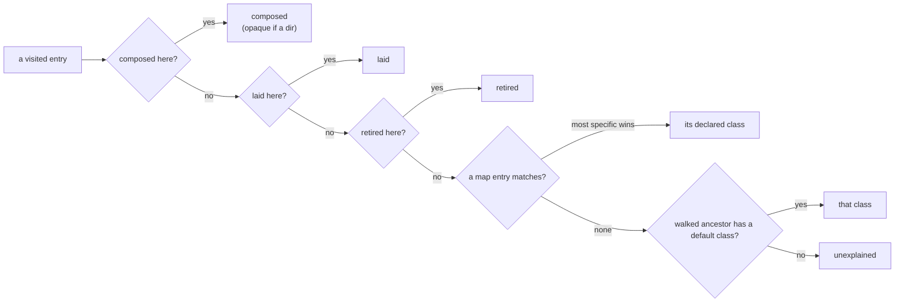

# Every path in an agent's directory gets a class, and yolo names the ones that fit none

**Status:** 2026-09-28. The map is not built (re-checked 2026-09-30: `packdecl` has no
`directory` kind). Two rulings on pi's MCP files that the
surveys raised are built, in `a4cc690b` ([AM-R1, AM-R2](#13-decision-ledger)). On 2026-10-01 pi/mcp
moved to pi's own `mcp.json`, because pi 0.99.0 has an MCP client that reads it, and AM-R1's
match-guarded retire now names `mcp-adapter.json` ([AM-D20](#AM-D20)). Evidence read at
`daac6eb4`. The jail-launch line ([§6.4](#64-exactly-what-ships-in-the-pi-slice) item 5) is
independent of the map and of every question below, and is **built** (2026-09-30,
[AM-D19](#AM-D19)): a jail launch names a `readsHost`, `reads-host` or `after: host:` source that
is there and cannot be read, a dangling link above all, on podman, Apple Container and macos-user,
and still starts. Pi, claude, codex, opencode, copilot, agy and omp were surveyed read-only the same day
([Appendix A](#appendix-a-evidence)).

> **In short.** yolo should own each agent directory's **map**, meaning what every path in it is,
> and not its contents. When the directory is declared whole, and yolo's own writes are derived from
> the declarations that already make them, three things follow. The boundary stops being "whatever a
> surface happened to name". The rcm incident is caught with no per-path knowledge at all. And
> "can I wipe `~/.pi`?" becomes a lookup.

**Why it matters.** On the maintainer's host, rcm left three links into a deleted directory under
`~/.pi/agent`. Pi crashed writing through the third one, and yolo noticed none of them, because it
looks only at paths some contribution names ([§2](#2-todays-boundary-is-incidental)).

**The shape.** Each agent pack adds one `directory` contribution: a root, plus entries that class
each path as state, cache or yours. The statuses *composed*, *laid* and *retired* are derived from
the kinds that already cause them. One read-only evaluator, run where the agent runs, reports what it
finds ([§3](#3-the-classes)).

**Cost.** One new kind. Each agent pack carries a map that has to be kept current with its vendor.
The first run on an existing home prints the residue yolo itself left there. Nothing is deleted and
nothing is refused.

**Start at [§3](#3-the-classes)**, the classes. Everything else falls out of them.

**Needs your ruling:** [OQ-AM1](#OQ-AM1), [OQ-AM2](#OQ-AM2), [OQ-AM3](#OQ-AM3), [OQ-AM4](#OQ-AM4), [OQ-AM5](#OQ-AM5), [OQ-AM6](#OQ-AM6), [OQ-AM7](#OQ-AM7), [OQ-AM8](#OQ-AM8), [OQ-AM9](#OQ-AM9), [OQ-AM10](#OQ-AM10).

**Reads with:** [`agent-directory-map-plan.md`](agent-directory-map-plan.md) (the implementation
sketch, incomplete while any question is open),
[`pack-declared-file-diagnostics.md`](pack-declared-file-diagnostics.md) (the `traps` proposal
[OQ-AM8](#OQ-AM8) would absorb), and
[`../reference/composed-file-permissions.md`](../reference/composed-file-permissions.md) (the
Derived/Shared/State postures this doc reuses).

---

## Terms, in plain words

Every term below is coined here unless it links to where it is defined.

- **Notch.** A setting of yolo's confinement dial: jail, guest or host
  ([the dial](yolo-as-environment-manager.md#4-confinement-a-dial-with-three-notches)). This doc
  treats **macos-user** separately from the container jail wherever the two differ.
- **Surface.** One agent config file a pack declares, with a **mode** of `stateful`, `computed`,
  `rmw` or `unrendered` ([the four modes](config-ownership-and-promotion.md#22-the-four-surface-modes)).
- **Agent directory.** A home-relative directory, or single file, that an agent reads and writes as
  its own: `~/.pi`, `~/.claude`, `~/.claude.json`, `~/.codex`. It is not the same thing as a `state`
  contribution. A `state` contribution is a jail mount ([§5.1](#51-a-new-kind-not-an-extension-of-state)),
  and one agent (opencode) has none at all.
- **Root.** The agent directory as a pack declares it: the top of one map. A declared root is always
  home-relative.
- **Derived root.** A directory yolo's own launch points an agent at by setting the agent's
  relocation variable, such as codex's managed home under `yolo host --`. It is never declared, it
  is evaluated with the entries of the root the variable relocates, and it is the only kind of root
  that may lie outside `$HOME` ([AM-D13](#AM-D13)).
- **Map.** A pack's declaration of every path under a root, with a class for each.
- **Entry.** One line of a map: a path or glob relative to the root, plus its class.
- **Class.** What a path is and whose it is. There are three **declared** classes (state, cache,
  yours), three **derived statuses** (composed, laid, retired), and one residual case (unexplained).
  All seven are defined in [§3](#3-the-classes).
- **Finding.** Something the evaluator reports. It is always a line and never a refusal.
- **Broken link.** A symlink on a destination's path whose chain ends in a directory that does not
  exist. [`report-tiers.md`](../reference/report-tiers.md#broken-links) coined it for the files a
  host apply writes through, and it exempts a link at the destination itself whose target's
  directory exists. The map does **not** reuse it unchanged ([AM-D5](#AM-D5)).
- **Dangling link.** A symlink whose chain does not end at an existing entry, or loops. The map's
  term, in the plain sense the rest of the corpus already uses it. Every broken link is dangling;
  a dangling link whose target's directory exists is not broken.
- **Wipe answer.** What deleting a root would lose, entry by entry, at the notch where it is asked.

---

## 1. The verdict, and the principles it rests on

On 2026-09-28 the maintainer wrote: *"I think it's wrong to rely on incidentally having configured a
surface to bring it under management. but maybe that's the best we can do."*

**My answer is that it is not the best we can do.** The instinct behind the second sentence is
still right, and it shapes this design. yolo cannot know a vendor's layout unless someone writes it
down, and anything written down by hand drifts from the vendor. What changes the answer is that the
most damaging failure needs no vendor knowledge. All three of the incident's paths were dangling
links, and a dangling link is visible to anyone who walks the directory. So the design has two
halves with very different costs:

1. **The root.** The pack says "this directory is my agent's". That is enough to find every dangling
   link, a wrong file type and a relocated root, with no per-path knowledge. This half alone would
   have caught the whole incident.
2. **The entries.** The pack says what each path is. That is what answers "can I wipe it?", names
   the unknown file, and says which file is a credential. It drifts with the vendor, and the design
   makes that drift loud once rather than silent forever
   ([§4.5](#45-print-when-new)).

The principles, numbered so later sections can cite them:

- **P1. The map describes the vendor's directory, and yolo's writes are derived.** An entry carries
  the class the path has **when yolo does not render it**. That yolo renders it, lays a link there,
  or deletes it is read from the contribution that causes it (a surface, `files`, a hook,
  `retireOnFirstRender`) and is never declared again. So there is one source for each fact.
- **P2. The map observes.** The evaluator lists directories (`ReadDir`) and inspects entries
  (`Lstat`). To classify a link, and only then, it may read the link's chain hop by hop
  (`Readlink`) and `Stat` where the chain ends. It never opens a file, never descends through a
  link, and never writes, moves or deletes anything under a root. This is the rule
  [`basehome`](../../internal/basehome/classify.go) already follows (*"THIS PACKAGE OBSERVES"*).
- **P3. The map is evaluated where the agent runs.** Links resolve only through the mount table of
  the agent's own namespace ([the jail-home invariant](../reference/jail-home.md#invariants)). A
  host-side walk of a container jail's sidecar sees mountpoint placeholders, and it sees yolo's own
  absolute links dangling, so it is never the view that is reported.
- **P4. Findings are warnings, never refusals.** A vendor adding a file must not be able to break a
  launch. The one existing refusal, the host-apply rule for a destination behind a broken link,
  refuses a **write** yolo was about to make and stays exactly as it is.
- **P5. Only harm repeats.** A dangling link, or a file that shadows a composed one, is printed every
  time, because each one makes the agent fail or ignore yolo's file. An unexplained entry is printed once,
  when it first appears. This is [ST-N2](../reference/pack-system.md#st-n2)'s "new or changed" rule
  applied to a whole directory.
- **P6. Core knows no agent.** Every vendor name comes from a pack: a path, a credential file, the
  variable that relocates a root. [`OQ-ST2`](../reference/pack-system.md#oq-st2) set that rule for the
  `reserved` fence ([the precedent](../reference/pack-system.md#skills)),
  and the map extends it to the whole directory
  ([pack-system principles](../reference/pack-system.md#principles)).

---

## 2. Today's boundary is incidental

### 2.1 What yolo looks at under an agent's directory today

Checked against `daac6eb4`:

| What is examined | Jail (podman, Apple Container) | macos-user | Host |
| :--- | :--- | :--- | :--- |
| Config surface destinations | rendered at boot | rendered at boot | rendered by `yolo host apply`. A destination behind a broken link is refused by name ([`hostbrokenlink.go`](../../internal/entrypoint/hostbrokenlink.go), `9ca34974`) |
| `files`, `skills`, `briefing` destinations | `:ro` binds, whose mountpoints are recorded only for `files` ([`packfiles.go`](../../internal/cli/run/packfiles.go)) | copies, listed in the overlay manifest | written where an ownership record shows they are yolo's |
| Hook paths (`shared_credentials`, `shared_directory`, `unshare_directory`, `per_jail_history`) | acted on at every boot | acted on at every boot | **refused**: hooks are jail provisioning ([`fieldset.go`](../../internal/render/fieldset.go)) |
| Host files a jail reads (a surface's `readsHost`, a briefing's `after: host:`) | an absent **or dangling** source is skipped **silently** (`isFile` in [`probes.go`](../../internal/cli/run/probes.go); `PrependHostBriefing` in [`briefing.go`](../../internal/jailcontent/briefing.go)). ✅ Since [AM-D19](#AM-D19) only an absent one is | same | — |
| Credential writers before a launch | pi's and codex's `auth.json` under the `codex` profile ([`pi.go`](../../internal/openauthclient/pi.go)); the Claude login seed synced into the workspace's `claude.json` | same | codex's managed home only ([§7.3](#73-codex)) |
| Reclaimers | `yolo prune` age-purges `copilot/logs` and `gemini/tmp` in each workspace sidecar, from a hand-written list ([`agentlogs.go`](../../internal/prune/agentlogs.go)); the launcher keeps two versions under `~/.local/share/<bin>/versions` | same | the launcher's version prune |
| **Every other path** | **nothing reads, checks or reports it** | **nothing** | **nothing** |
| Legacy per-workspace state | — | — | the base home only, detection-only, in `yolo check` ([`basehome`](../../internal/basehome/classify.go)) |

Each row names a path because something writes it. Nothing looks at a path merely because it is in
the agent's directory.

### 2.2 The incident, path by path

The maintainer reported it on 2026-09-28. The `settings.json` half is recorded in
[`hostbrokenlink.go`](../../internal/entrypoint/hostbrokenlink.go)'s header and
[`hostapplybrokenlink_test.go`](../../internal/cli/hostapplybrokenlink_test.go)'s. `~/.dotfiles/pi`
moved into the maintainer's content pack, and rcm left three links into it:

| Link | What pi does with it | What yolo saw |
| :--- | :--- | :--- |
| `~/.pi/agent/settings.json` | reads it, and rewrites fields under a lock | Host apply failed the whole pi pack, then the launch gate refused an unrelated claude launch. Since `9ca34974` host apply refuses that one destination by name. **A jail launch still composes without the host layer, and says nothing**. ✅ It now says so in one line ([AM-D19](#AM-D19)) |
| `~/.pi/agent/models-store.json` | `ensureFileExists` writes through the link, and the write fails with `ENOENT` | nothing, because no surface names the file |
| `~/.pi/agent/npm/` | `ensureNpmProject` writes `npm/package.json` through the link, and **pi crashes** | nothing. At the host the `shared_directory` hook is refused, so this path is pi's own and no contribution names it |

Answering "can I wipe `~/.pi`?" afterwards took a code read.

### 2.3 Why "incidental" is the right word

The managed boundary today is the union of paths that some contribution happens to name, and the
seven surveys ([Appendix A](#appendix-a-evidence)) show how far that is from the agent's directory:

- **opencode declares no `state` at all.** Its four XDG directories
  (`~/.config/opencode`, `~/.local/share/opencode`, `~/.local/state/opencode`, `~/.cache/opencode`)
  reach a jail only because core overlays `.config`, `.local` and `.cache`. That is exactly the
  maintainer's case: managed because of something configured for another reason.
- **Codex's login is classed as a credential by coincidence.** `basehome` protects
  `.codex/auth.json` only because its core list of basenames includes `auth.json`. No pack declares
  it ([`classify.go`](../../internal/basehome/classify.go), `coreCredentialBasenames`).
- **yolo's own residue goes unreported.** Examples: a retired verification fixture in pi's
  directory (`mantle/mint-token.mjs`), a stale top-level copy of a moved script in claude's
  (`file-suggestion.sh`), a sidecar the claude pack never retires (`yolo-managed-mcp-servers.json`),
  three codex releases (1.2 GiB) that the launcher's prune could not see (since fixed, see
  [Appendix B](#appendix-b-defects-the-surveys-found-that-the-map-does-not-fix)), and a removed agent's OAuth
  file in agy's `~/.gemini`.
- **A proposal is already in flight for one symptom.**
  [`pack-declared-file-diagnostics.md`](pack-declared-file-diagnostics.md) wants a `traps` kind so
  that a host `APPEND_SYSTEM.md` the jail never sees gets named. That is one entry of a map, argued
  on its own.

---

## 3. The classes

This is the load-bearing section. Every path the evaluator visits ends in exactly one of the classes
below, in the precedence order [§3.4](#34-precedence) gives.

### 3.1 Declared classes: what the vendor's path is

| Class | Definition | What losing it costs | What it is not |
| :--- | :--- | :--- | :--- |
| **state** | Bytes the agent writes that cannot come back without the user: logins, sessions, trust decisions, databases | data | not something regenerable from the network (that is cache), and not something the user authors (that is yours), **even when the agent also writes it** |
| **cache** | Bytes the agent, or a tool acting for it, regenerates without the user: downloaded packages, catalogs, logs, crash records, installed program bytes | time or network, never work | not anything that records a decision: `trust.json` is state |
| **yours** | Bytes the user authors, by hand or by asking the agent: prompts, keybindings, custom extensions, the user's own settings file where yolo does not render it | the user's work | **not "untouched by the vendor".** Pi rewrites `keybindings.json` when its format migrates, and the file is still yours |

yolo never writes a state or yours path. The one exception is a **declared merge**: a key yolo writes
into a file the agent owns, because a contribution says to. Two examples: pi's `auth.json` gets its
`openai-codex` key from the prelaunch writer, and `~/.claude.json` gets its workspace keys from an
`rmw` surface. yolo never removes a path of any declared class.

### 3.2 Derived statuses: what yolo does to the path at this notch

These never appear in a map, by [P1](#1-the-verdict-and-the-principles-it-rests-on). They are
computed per notch from the declarations that cause them:

| Status | The path is… | Derived from |
| :--- | :--- | :--- |
| **composed** | rendered by yolo at this notch | every selected pack's config surfaces and `files`, `skills` and `briefing` destinations, at the notch the kind runs at. A `skills` destination's `reserved` children are excluded |
| **laid** | a link or placeholder yolo itself places, recognized by its **exact expected target**, never by its name alone | the hooks' `from`→`at` links; macos-user's layout links and overlay siblings; core's home-file redirects (`~/.claude.json` → `.claude/claude.json`); entries named with the `.yolo-` bookkeeping prefix (`packdecl.StoreBookkeepingPrefix`) |
| **retired** | a name yolo deletes at this notch | a surface's `retireOnFirstRender` **per the surface's mode** (jail only: the host path never retires a sidecar), and the old link an `unshare_directory` hook recognizes. A `computed` or `rmw` surface retires its names at every boot. A `stateful` surface retires them only on the boot that migrates it, which the map cannot observe, so a copy present when the map runs is **not** retired: it falls through to its declared class or to unexplained ([AM-D12](#AM-D12)). A `retireIfMatchesRender` name is **never** derived retired: it is deleted only while its content matches the render, and the map never reads content ([AM-D3](#AM-D3)), so a copy present when the map runs is one that did not match, and its declared class stands ([AM-R1](#AM-R1)) |

**The mountpoint manifest is not a source.** In the agent's own view a recorded `files` placeholder
that is still claimed sits under its live bind, where the path is composed. One that is no longer
claimed is removed, and its record dropped, before every launch (`retirePackFileMountpoints` in
[`packfiles.go`](../../internal/cli/run/packfiles.go)). Briefing and skills placeholders are never
recorded. So the manifest never proves a visible entry is yolo's, and yolo's residue surfaces as
unexplained ([§9](#9-risks)).

**What losing a composed path costs is its surface mode's answer, not the map's.** A `computed`
file regenerates. A `stateful` file regenerates, and its captured edits, which live outside the
directory in `<workspace>/.yolo/prism`, apply again. An `rmw` file regenerates only yolo's keys, and
the rest is the declared class's loss. That is how `~/.claude.json` works out: composed `rmw` over
state, so its wipe answer is state's. The corpus already models it as the *State* posture
([What yolo injects into a State file](../reference/composed-file-permissions.md#what-yolo-injects-into-a-state-file-and-why-it-must)).

**A composed directory is opaque to the map.** The kind that composes it (skills adoption, the
`reserved` fence, `files` ownership records) already reports on its contents, so the map does not
report them a second time.

### 3.3 Unexplained, and the structural findings

An entry is **unexplained** when the walk visits it and it matches no entry from any selected pack,
has no derived status, and sits under no opaque ancestor. Two things are not unexplained: an absent
entry (**absence is never a finding**, since a map lists what may exist), and a foreign link that
resolves at a declared name (see [AM-D4](#AM-D4)).

The **structural findings** apply to every visited entry, whatever its class, and need no entry to
exist:

| Finding | When | Printed |
| :--- | :--- | :--- |
| **dangling link** | the entry is a [dangling link](#terms-in-plain-words). Two cases are exempt: a laid link ([§3.6](#36-the-hard-cases)), and a **composed file at the host notch** whose chain ends in a directory that exists, because host apply creates the file through the link ([HC-D4](host-computed-layer.md#HC-D4)). Nothing else is exempt, and a directory entry never is | every time ([P5](#1-the-verdict-and-the-principles-it-rests-on)) |
| **wrong type** | the entry's declared shape (a trailing `/` means a directory) differs from what it **resolves to**: for a plain entry its `Lstat` type, and for a link the type where its chain ends. A link at `npm/` that ends at a regular file is wrong type. A dangling link has no resolved type, so it is reported as dangling only | every time |
| **shadow** | an entry declared `shadows: <path>` is present, so the agent loads it **instead of** a composed file | every time |
| **relocated** | a variable the entry names as relocating it is set in the agent's environment, so the agent reads somewhere else while yolo still writes the literal path. **A variable yolo's own launch sets is never this finding**: the directory it names is a derived root ([AM-D6](#AM-D6)) | every time, once per variable |
| **unexplained** | [above](#33-unexplained-and-the-structural-findings) | once, when new ([§4.5](#45-print-when-new)) |

**Why the destination rule is not reused unchanged.** `FindBrokenLink` exempts a link at the
destination itself whenever the directory holding its target exists
([`hostbrokenlink.go`](../../internal/entrypoint/hostbrokenlink.go)). That exemption was made for a
file host apply writes through ([HC-D4](host-computed-layer.md#HC-D4)), and it holds only there. For a
directory it hides the incident's own crash: with `npm -> dot/npm`, `dot/` present and `dot/npm`
absent, pi's `ensureNpmProject` sees `existsSync` false, and then `mkdirSync` and `writeFileSync`
both fail `ENOENT`, which is the error pi crashed with. The maintainer's links broke one after
another, so a partial move that leaves `~/.dotfiles/pi` in place without `~/.dotfiles/pi/npm` is a
realistic state, and the destination rule would report nothing in it.

### 3.4 Precedence



Structural findings are checked alongside all of this and do not replace the class. A dangling link
at `settings.json` is still yours, and it is also a dangling link.

### 3.5 Marks and attributes on an entry

A mark adds rules to an entry's class. It does not change the class. The pi slice needs these:

| Mark / attribute | Means | Effect |
| :--- | :--- | :--- |
| `credential` | holds login material or an API key | the wipe answer names it as a logout. No present or future verb copies, captures, archives or lists its contents. It is exempt from every reclaimer |
| `transient` | a pattern of in-flight writes: lock directories, temp siblings | never reported, and never removed by any verb. Removing a live lock breaks mutual exclusion |
| `executes` | the agent runs what sits here at startup (pi's `extensions/`) | an unexplained entry here gets its own louder line: *"runs at every pi start"* ([OQ-AM2](#OQ-AM2)) |
| `shadows: <path>` | when present, the agent loads this file instead of `<path>` | a **shadow** finding |
| `relocated_by: [VAR…]` | the vendor moves this entry when a variable is set | a **relocated** finding when the user sets it, and the entry is then not walked. When yolo's own launch sets it, no finding: the named directory is a derived root ([AM-D6](#AM-D6)) |
| `note` | one sentence, in the vendor's terms, printed with the entry's line | how a trap from [`pack-declared-file-diagnostics.md`](pack-declared-file-diagnostics.md) becomes a map entry ([OQ-AM8](#OQ-AM8)) |

### 3.6 The hard cases

| Case | Example | The map's answer |
| :--- | :--- | :--- |
| A composed file the agent rewrites | pi's `settings.json`. Pi rewrites `theme` and `defaultModel`, and pi-subagents writes profiles into it | composed (`stateful`), and pi's writes are captured as edits: the Shared posture. The entry says **yours**, which is what the file is under `host_management: "none"`. Whether an agent's own write should be captured at all is the config-ownership axis ([who is writing](../reference/composed-file-permissions.md#who-is-writing-program-operation-vs-directed-agent)), not the map's. The live `{"theme": null}` capture in this workspace is that question, found again |
| A state file yolo merges one key into | pi's `auth.json`. The prelaunch writer merges `openai-codex` under the `codex` profile | state + `credential`. The merge is disclosed, derived from the pack's prelaunch declaration. The wipe answer loses **every other provider's** login |
| An `rmw` surface on a vendor state file | `~/.claude.json` | composed `rmw` over state, so its wipe answer is state's ([§3.2](#32-derived-statuses-what-yolo-does-to-the-path-at-this-notch)) |
| One path, different class per notch | codex's `auth.json`: a view yolo rewrites every launch in a jail, and the user's only real login at the host | one declaration: state + `credential`. The notch difference is a derived fact (the jail's prelaunch writer), so the wipe answer differs per notch while the class does not |
| A path an environment variable relocates | `PI_CODING_AGENT_DIR` moves `~/.pi/agent` | `relocated_by`. When the user sets it, a **relocated** finding names it and says yolo's surfaces still write the literal path. When yolo's own launch sets it (codex's `CODEX_HOME` under `yolo host --`), there is no finding, and the directory it names is a derived root ([AM-D6](#AM-D6)) |
| A link yolo lays in a jail | `~/.pi/agent/npm` → `../../.pi-shared-npm` | laid, from the `shared_directory` hook, recognized by its exact target and never descended through. A laid link with the wrong target is the hook's to report, not the map's |
| A laid link that dangles by design | agy's OAuth-token link before the first login, and claude's `.credentials.json` seen from the host side | laid, so not a finding even while dangling. [P3](#1-the-verdict-and-the-principles-it-rests-on) keeps the host-side view out anyway |
| yolo's residue at a vendor name | the 0-byte, `0700` `APPEND_SYSTEM.md` in this workspace | yours, because the map classes by name. The map view prints its size. **This is an accepted limit**: residue at a declared name looks the same as the user's file |
| A legacy layout the vendor migrates | pi's `tools/`, `commands/`, `oauth.json.migrated` | declared with the class of what it holds, plus `note: legacy — pi migrates it` |
| A file an extension writes | `mcp-cache.json` from pi-mcp-adapter | declared by whoever adds the extension ([OQ-AM1](#OQ-AM1)). Otherwise it is unexplained, printed once |
| Another pack delivers into a yours directory | `themes/` from a content pack | composed wherever that pack is selected, and yours everywhere else |
| A yours file that defeats a composed one | `AGENTS.override.md` (pi, codex) | `shadows`. A finding every time it is present |

---

## 4. What yolo does with each class, by notch and by verb

### 4.1 Where the map is evaluated

| Notch | The view that is walked | Why |
| :--- | :--- | :--- |
| Jail (podman, Apple Container) | the jail's own `/home/agent`, **from inside the jail**, by in-jail `yolo check` ([OQ-AM6](#OQ-AM6)) | [P3](#1-the-verdict-and-the-principles-it-rests-on). Host-side, `<ws>/.yolo/home/pi` shows 0-byte mountpoints where the jail sees delivered code, and yolo's absolute links dangle |
| macos-user | the sandbox account's home as its agent sees it, whether walked in the sandbox or by the launcher through the workspace sidecar the layout links point into | there is no mount namespace, so a link resolves the same from either side, and the sidecar holds real copies rather than mountpoints |
| Host | the real `$HOME` | at **every** `host_management` value, `none` included ([AM-D7](#AM-D7)). Observing writes nothing, and the rcm case is precisely a home yolo does not manage |

Only the **selected** packs' roots are walked, which is [`OQ-BH14`](base-home-legacy-state.md#OQ-BH14)'s
rule: an unselected pack is treated as if it does not exist.

### 4.2 Each verb

| Verb | What it does with the map | Never |
| :--- | :--- | :--- |
| `yolo check` (host, and in-jail) | One section per root. Every finding is a WARN row: dangling links, wrong types, shadows, relocations and **every** unexplained entry. A header line gives counts by class. Findings also appear in the JSON report | changes the exit code for a finding. Prints file contents |
| `yolo host apply` | Renders what it renders today. After the verdict block it adds one group, *"In your agent directories"*, itemizing dangling links, shadows and relocations, and **new** unexplained entries up to 5 per root, then *"and N more — `yolo check`"*. Its remedy is stated once, and the same findings appear in the `--format json` document | changes the verdict token or the exit code for a map finding. Map findings are not tier-3 blockers ([the tiers](../reference/report-tiers.md#the-tiers)) |
| `yolo host -- <agent>` preflight | Evaluates only the roots of the pack whose program is `<agent>`, plus entries other selected packs add under them. It prints structural findings and new unexplained entries (capped as above) to stderr and the launch log, **before** the launch gate, so a dangling link it names can explain a refusal the gate goes on to make. It never depends on the gate's result. Budget: **250 ms**. On overrun it prints one line naming the skip ([AM-D11](#AM-D11)) | refuses, blocks, prompts, or sits inside the `host_apply_on_launch` gate's refusal path ([the gate](../reference/host-apply-staleness.md#the-launch-gate)) |
| Jail launch (host side) | **One new line, independent of the map:** a `readsHost` or `after: host:` source that is a dangling link is named, saying the jail composes without it. ✅ Built ([AM-D19](#AM-D19)) | walks the host's agent directories: the jail uses nothing else from them |
| Jail boot | nothing new ([OQ-AM6](#OQ-AM6)) | runs the walk as a `genStep`, which would turn a finding into a refused boot |
| `yolo pack map <pack>` (new, read-only) | The full evaluated map at this notch. Every present entry is listed with its class, marks, derived status and size, and the root ends with a **wipe answer** ([§4.4](#44-the-wipe-answer)). It also says which notch it evaluated ([AM-D9](#AM-D9)) | opens a file. Offers to delete anything |
| `yolo config ls` | Unchanged per row, since it lists surfaces, which are all composed. A surface whose destination is shadowed says so. One footer line appears when the map has findings: *"~/.pi: 1 dangling link, 1 unexplained — `yolo pack map pi`"* | lists non-surface paths |
| `yolo config reset` | Unchanged: it resets one surface's captured edits | touches a path of any declared class |
| A wipe or reset of a whole root | **No verb exists, and this design builds none** ([OQ-AM5](#OQ-AM5)). The wipe answer is a report, and the user runs `rm` | — |
| `yolo prune` | Unchanged in the pi slice ([OQ-AM7](#OQ-AM7)) | — |

### 4.3 Each class, across the verbs

| | check / apply / preflight | map view | wipe answer |
| :--- | :--- | :--- | :--- |
| **composed** | counted | the owning surface or kind, and its mode | the mode's answer ([§3.2](#32-derived-statuses-what-yolo-does-to-the-path-at-this-notch)) |
| **laid** | silent | the declaration that lays it, and "never follow it" when it points outside the root | regenerates at the next launch. A laid link **must not be followed** by whoever wipes: deleting through `npm/` in a jail empties the machine store every workspace uses |
| **retired** | a present retired name is a disclosure line in check and the map view (*"yolo deletes this at every boot"*). Only a `computed` or `rmw` surface's names are ever retired when the map runs ([§3.2](#32-derived-statuses-what-yolo-does-to-the-path-at-this-notch)) | the surface that retires it | nothing, because yolo deletes it anyway |
| **state** | counted | listed, marks included | **lost**. A `credential` entry is named as a logout |
| **cache** | counted | listed | regenerates, at the named cost (a network reinstall, a re-clone) |
| **yours** | counted | listed | **lost** |
| **unexplained** | a finding | listed, first | **unknown**: "look before deleting" |

### 4.4 The wipe answer

Each root ends with one block, computed from the classes and the derived statuses at this notch:

```text
Wiping ~/.pi (host, host_management: assert) loses:
  state      auth.json [credential: every provider's login], sessions/, trust.json
  yours      settings.json (yolo's keys come back, yours do not), keybindings.json, prompts/,
             extensions/my-tool.ts
  unknown    old-backup/ — nothing explains it; look before deleting
Regenerates: models-store.json, npm/ (a reinstall), git/ (a re-clone)
Stop pi first: lock directories and temp files are live while it runs.
```

The wording and the layout are the implementer's. The content is fixed: every present entry falls
into **loses**, **regenerates** or **unknown**, and an `rmw` file falls into **loses**, since only
yolo's keys come back. A credential is named as one. Notch-specific
consequences are stated. In a jail, captured edits in `<ws>/.yolo/prism` apply again, and
`yolo config reset` is the verb for that half. A laid link is flagged as one not to follow.

### 4.5 Print-when-new

An unexplained entry is **new** until a verb that prints-when-new has printed it on this home. The
**seen record** *(coined here)* is keyed by root, relative path and finding kind, and it lives beside
the existing host records. This is the same device as [ST-N2](../reference/pack-system.md#st-n2)'s
`host-reserved-trees.json`.

- **Two verbs read and write it, and only two**: `yolo host apply` and the `yolo host --`
  preflight. They share one record per home, so an entry printed by either is seen by both.
- **`yolo check` (host or in-jail) and `yolo pack map` neither read nor write it.** They always list
  everything, and running one never marks anything seen. So [§6.5](#65-what-done-looks-like)
  item 6 holds with a `yolo check` in between.
- **There is no in-jail record.** No in-jail verb prints-when-new: the boot adds nothing and in-jail
  `yolo check` lists everything ([OQ-AM6](#OQ-AM6)).
- **First run on a home** (no record yet): the first of the two writing verbs prints one summary
  line per root with counts and the pointer, and marks every present entry seen. Dangling links,
  shadows and relocations are always itemized in full
  ([P5](#1-the-verdict-and-the-principles-it-rests-on)).
- **An unreadable or corrupt record** means every entry is new. The verb never fails on it.
- **Two verbs at once**: the last writer wins, and a lost update only means a line prints again.

---

## 5. The declaration

### 5.1 A new kind, not an extension of `state`

**Verdict: a new contribution kind, `directory`** ([AM-D1](#AM-D1)). Each existing kind that looks
like a host for it fails on a fact about that kind:

| Candidate | Why not |
| :--- | :--- |
| a field on `state` | `state` says **what the jail mounts and persists, at which scope**. The host refuses it ([`fieldset.go`](../../internal/render/fieldset.go)), and the map must run at the host. opencode has no `state` to hang a map on. Pi's second root (`.pi-shared-npm`) is a machine-scope `state` whose map means something only in a jail. And a map on `state` would make every map a mount decision |
| config surfaces | a surface is **one file yolo renders**. The whole point is the paths no surface names |
| `skills.reserved` | a fence for **one** composed directory's children. The map derives from it ([§3.2](#32-derived-statuses-what-yolo-does-to-the-path-at-this-notch)), and it cannot describe a directory yolo does not compose |
| `traps` ([`pack-declared-file-diagnostics.md`](pack-declared-file-diagnostics.md)) | one diagnostic per path, with no classes. It becomes a map entry with a `note` ([OQ-AM8](#OQ-AM8)) |

The new kind **grants nothing**. It reads no host file contents, mounts nothing and runs nothing, so
its footprint line is never review-worthy. At the host it lists directory entries the agent already
owns. Its combine rule is **exclusive per root, merge per entry** ([§5.4](#54-more-than-one-pack-under-one-root)).

**The evaluator is not `basehome.Decls`, but it reads what `Decls` reads.** `Decls` already
derives credential files, surface paths, content destinations and redirects from pack declarations
([`decls.go`](../../internal/basehome/decls.go)). It cannot be the map's evaluator, for three reasons:

- it classifies a base home for migration over the **shipped** pack union, while the map evaluates
  the **selected** packs ([`OQ-BH14`](base-home-legacy-state.md#OQ-BH14));
- it reads surfaces in one posture and carries no notch field set, while composed is per notch;
- it matches a credential **by basename anywhere**, which [§8](#8-degenerate-inputs-failure-paths-and-forbidden-behavior)
  forbids the map.

So the evaluator and `basehome` share **one projection** of the pack declarations (hook `from`
paths, content destinations, surface paths, redirects), with the pack set and the notch as inputs.
Neither keeps a second reader of the same manifests. How the projection is factored is the
implementer's.

### 5.2 What the map derives, and from where

**Nothing below is written in a map.** The class set is closed ([§3.1](#31-declared-classes-what-the-vendors-path-is),
[§5.5](#55-validation-and-the-footprint)), so a map cannot spell composed, laid or retired at all.
Plain validation refuses them as unknown class values, and its error says they are derived.
**An entry at a composed, laid or retired path is expected and never refused.**
[P1](#1-the-verdict-and-the-principles-it-rests-on) requires it, because the entry carries the class
the path has when yolo does not render it. The shipped pi map has such entries at
`agent/settings.json`, `models.json`, `mcp-adapter.json`, `AGENTS.md`, `skills/` and `npm/`.

| Derived fact | Its one source |
| :--- | :--- |
| composed | `config` surfaces (with `path`), `files.into`, `skills.into`, `briefing.into`, over the selected packs, per the notch's kind field set |
| excluded from composed | `skills.reserved` |
| laid | `hook` declarations (`shared_credentials` and `shared_directory` give a relative `from`→`at` link; `per_jail_history` gives an absolute link into its history dir); the macos-user layout and overlay installer; core's home-file redirects; the `.yolo-` bookkeeping prefix |
| retired | `retireOnFirstRender` per the surface's mode ([§3.2](#32-derived-statuses-what-yolo-does-to-the-path-at-this-notch)), and the `unshare_directory` hook's old link |
| the `credential` mark | a `shared_credentials` hook's `from`, matched by **exact path**, never by basename ([AM-D14](#AM-D14)). The claude pack's `.claude/.credentials.json` and agy's OAuth token are credentials this way |
| merged (disclosure only) | the pack's prelaunch declaration naming the file its credential writer merges into |

**The one restatement a map can make is refused at load ("declared twice").** A mark is not a
class, so an entry *can* say `credential: true` at a path that a `shared_credentials` hook already
makes a credential. When the entry and the hook are in the **same pack**, that is refused at load:
it is the pack author's own second source for one fact. Both declarations sit in one manifest, so
the check needs nothing outside it. From **another pack**, such as the local pack, the mark is
accepted and changes nothing, because a mark only adds. No other input is refused as declared
twice.

### 5.3 The shape, at altitude

```jsonc
{
  "kind": "directory",
  "at": ".pi",
  "measured_against": "pi 0.87.1",
  "entries": {
    "agent/":                  { "relocated_by": ["PI_CODING_AGENT_DIR"] },   // walked, strict
    "agent/settings.json":     "yours",
    "agent/auth.json":         { "class": "state", "credential": true },
    "agent/sessions/":         { "class": "state", "relocated_by": ["PI_CODING_AGENT_SESSION_DIR"] },
    "agent/npm/":              "cache",
    "agent/*.lock/":           { "class": "state", "transient": true },
    "agent/AGENTS.override.md":{ "class": "yours", "shadows": "agent/AGENTS.md" },
    "agent/extensions/":       { "executes": true }                            // walked, strict
  }
}
```

The field spellings are the sketch's ([`agent-directory-map-plan.md`](agent-directory-map-plan.md)).
The behavior is fixed here:

- **A path is relative to the root, and a trailing `/` means a directory.** An entry may be a glob
  over one path segment (`*`, `?`). It may not escape the root or name the root itself.
- **A directory entry takes one of three shapes**:
  - with a class and no child entries, it is **opaque** and never descended;
  - with child entries and a class, it is **walked**, and an unmatched child takes that class as its
    default;
  - with child entries and no class, it is **walked strictly**, and an unmatched child is
    unexplained. The root itself is walked strictly.
- **The most specific entry wins**: a literal beats a glob, and a longer path beats a shorter one.
  Two entries equally specific with different classes are a load problem, and that entry is
  skipped with a warning ([AM-D8](#AM-D8)).
- **A root may be a single file** (`~/.claude.json`). It then has a class and no entries.
- **A root that is a link is resolved** and walked at its target. This covers macos-user's layout
  and a dotfiles manager linking the whole directory. A link **below** a root is classified from
  its chain ([P2](#1-the-verdict-and-the-principles-it-rests-on)) and never descended through.
- **A root may not be** the home itself, a core-owned directory whole (`.config`, `.local`,
  `.cache`, `.yolo`), or a path under another pack's root. A subdirectory of `.config` is fine, and
  that is opencode's case.

### 5.4 More than one pack under one root

The agent pack **owns** the root. Any other selected pack may add entries under it, and that is how a
content pack that adds pi-subagents to pi's `packages` declares what pi-subagents writes
([OQ-AM1](#OQ-AM1)). **A contribution that adds entries says so, and names the root it adds to**,
the way a `config-overlay` names the surface it overlays. Without that, a contribution naming a root
is a claim to own it. The rules:

- Entries **merge** by path. The same path with the same class from two packs is fine.
- A **different class** for one path is a conflict that names both packs. The entry is skipped and
  its path reported unexplained, which is never fatal ([P4](#1-the-verdict-and-the-principles-it-rests-on)).
- A second pack **claiming the same root** is a collision. That root is not evaluated, and a warning
  names both packs, which is again never fatal. It is exclusive in the footprint's sense, and
  reported the way the footprint reports collisions.
- The **local pack** (`~/.config/yolo-jail/local`) is a pack like any other, so it is where a user
  explains their own files.

### 5.5 Validation and the footprint

Validation is **host-side at authoring**, like every other kind. Unknown classes, marks and fields
are load errors, and escaping paths and malformed globs are refused. Across the version boundary
the in-jail tolerant read skips an unknown field and reports it, the rule
[unknown kinds](../reference/pack-system.md#unknown-kinds-across-the-version-boundary) already sets.
`yolo pack footprint` prints one line per root, naming it and its entry count, and that line is
not review-worthy.

---

## 6. Pi first: the measured map, and exactly what ships

Pi goes first by the maintainer's instruction. It also has the incident, the machine-scope store, a
third-party package ecosystem that writes into its directory, and the one relocation variable that
moves both pi's paths and some of yolo's. So if the model survives pi, it will survive the easier
agents.

### 6.1 The roots

- **`~/.pi`**, walked strictly ([OQ-AM9](#OQ-AM9)). It is the parent of pi's `agentDir`, and it
  also holds pi's **project scope** whenever pi runs with its cwd at `$HOME`, plus a few files
  extensions write regardless of cwd.
- **`~/.pi-shared-npm`**, jail only. This is yolo's machine-scope store behind the `npm/` link:
  cache, opaque, and shared by every workspace on the machine. Its `.yolo-` entries (the refresh
  lock, the copy marker) are laid. At the host the store lives under yolo's state directory, not in
  `$HOME`, so the root is simply absent there.
- **Outside every pi root**: `~/.pi-lens` belongs to whichever pack adds pi-lens, as a root of its
  own. `~/.agents/skills` is read by several agents and belongs to nobody's map in v1. Nor does
  `~/.config/mcp/mcp.json`, a cross-tool MCP file that pi-mcp-adapter and pi-subagents both read.
  The pi pack composes it while pi-subagents is selected ([AM-R2](#AM-R2)), and a surface path
  needs no map entry to be composed ([§5.2](#52-what-the-map-derives-and-from-where)). It sits
  under `.config`, which no map may take whole ([§5.3](#53-the-shape-at-altitude)).

### 6.2 The map

Measured from pi 0.87.1's `dist/` and the live directory in this jail on 2026-09-28
([Appendix A](#appendix-a-evidence)); the `mcp` rows re-read from pi 0.99.2's `dist/` on
2026-10-01. "—" means no derived status, so the declared class stands.

**Pi's own layout** (the pi pack declares these):

| Entry (under `~/.pi`) | Declared | Jail | macos-user | Host | Wiping it costs |
| :--- | :--- | :--- | :--- | :--- | :--- |
| `agent/` | walked strictly; `relocated_by: PI_CODING_AGENT_DIR` | — | — | — | — |
| `agent/settings.json` | yours | composed (`stateful`, `pi/settings`) | composed (`stateful`) | composed (`rmw` under `assert`, `stateful` under `own`); yours under `none` | jail: nothing, since captured edits re-apply. Host: your settings |
| `agent/models.json` | yours | composed (`computed`) | composed | composed (`rmw` under `assert`) | jail: nothing. Host: your custom providers |
| `agent/yolo-openai-codex-models.json` | cache | composed (`computed`) | composed | composed under `assert` (`{}`) | nothing |
| `agent/mcp.json` | yours; `note`: pi's own MCP client reads it (pi 0.99.0 and later), and `pi mcp add` and `/mcp` write it | composed (`stateful`, `pi/mcp`), adopting what is there ([AM-D20](#AM-D20)) | composed (`stateful`) | composed (`rmw` per key under `assert`, `stateful` under `own`) | jail: nothing, since captured edits re-apply. Host: the MCP servers you added |
| `agent/mcp-auth.json` | state, `credential`; `note`: pi's OAuth tokens for remote MCP servers, mode `0600` | — | — | — | every remote MCP server's sign-in |
| `agent/{mcp.log,mcp.log.1}` | cache | — | — | — | nothing |
| `agent/mcp-adapter.json` | yours; `note`: pi-mcp-adapter's own config | retired only while it holds exactly the `pi/mcp` render, which is the copy 0.11 wrote ([AM-D20](#AM-D20)); any other content is yours and stays | same | — (host apply deletes nothing) | your adapter's MCP table |
| `agent/yolo-host-synced-settings.json` | — | retired only by the boot that migrates the `stateful` surface. A copy present when the map runs is not deleted, so it is unexplained | same | — (unexplained if present) | nothing |
| `agent/AGENTS.md` | yours | composed (briefing, `:ro`, with the host file prepended) | composed (a copy, write-denied) | composed (wholesale; prose already adopted into the local pack) | nothing |
| `agent/AGENTS.override.md` | yours; `shadows: agent/AGENTS.md` | shadow finding | shadow finding | shadow finding | your override |
| `agent/{AGENTS.MD,CLAUDE.md,CLAUDE.MD}` | yours; `note`: pi reads only the first of `AGENTS.override.md`, `AGENTS.md`, `AGENTS.MD`, `CLAUDE.md`, `CLAUDE.MD`, so these are inert while yolo composes `AGENTS.md` | — | — | — | your prompts |
| `agent/{SYSTEM.md,APPEND_SYSTEM.md}` | yours | — | — | — | your system-prompt replacement or addition |
| `agent/auth.json` | state, `credential` | merged: `openai-codex` under the `codex` profile | merged (lands in the sidecar) | — (pi itself persists the broker's view that yolo's extension returns) | **every provider's login and API key** |
| `agent/{oauth.json,oauth.json.migrated}` | state, `credential`; `note`: legacy, pi migrates it | — | — | — | a legacy login |
| `agent/models-store.json` | cache (despite sharing `auth.json`'s `0600` mode and lock) | — | — | — | a catalog refresh |
| `agent/trust.json` | state (written only under the guarded posture) | — | — | — | every project-trust decision |
| `agent/keybindings.json` | yours | — | — | — | your bindings |
| `agent/{crashes.json,pi-debug.log,pi-tui-crash.log,pi-tui-debug.log}` | cache | — | — | — | the next-start crash notice |
| `agent/sessions/` | state, opaque; `relocated_by: PI_CODING_AGENT_SESSION_DIR` | — | — | — | **every transcript** |
| `agent/*.jsonl` | state; `note`: legacy sessions, pi migrates them | — | — | — | old transcripts |
| `agent/extensions/` | walked strictly; `executes` | children composed where delivered | same | same | your extensions |
| `agent/skills/` | yours | composed (skills, `:ro`) | composed (a copy) | composed (per child, with adoption) | nothing |
| `agent/prompts/` | yours | — | — | — | your prompt templates |
| `agent/themes/` | yours | composed while a selected pack delivers there | same | same | your themes |
| `agent/npm/` | cache, opaque | **laid**: `../../.pi-shared-npm`. Never follow it | laid (resolves through the mirror) | — (pi's own real directory) | jail: nothing of this workspace's, **and deleting through the link empties every workspace's store**. Host: a reinstall |
| `agent/git/` | cache, opaque | — (per workspace; the `unshare_directory` hook turns the retired shared link into a real directory) | — | — | a re-clone. Pi's updater resets it anyway |
| `agent/{tmp/,bin/}` | cache, opaque; `bin/` is `executes` (pi prepends it to its bash tool's PATH) | — | — | — | a download |
| `agent/{tools/,hooks/,commands/}` | yours; `note`: legacy, pi migrates or warns | — | — | — | your old customizations |
| `agent/*.lock/`, `agent/.auth.json.*` | state, `transient` | — | — | — | never while pi runs |
| `agent/*.yolo-overlay-{new,old}` | — | — | laid (overlay install siblings) | — | nothing |
| `{settings.json,extensions/,skills/,prompts/,themes/,SYSTEM.md,APPEND_SYSTEM.md}` | yours; `note`: pi's project scope when run from `$HOME` | — | — | — | your project config |
| `{npm/,git/}` | cache (the same project scope) | — | — | — | a reinstall |

**What pi's package ecosystem writes.** Measured from the installed packages in
`~/.pi-shared-npm` (pi-mcp-adapter 3.1.0, pi-subagents 0.35.1). These are declared by whichever pack
adds the package ([OQ-AM1](#OQ-AM1)); for the maintainer, that is the personal content pack:

| Entry | Declared | Package |
| :--- | :--- | :--- |
| `agent/{mcp-cache.json,mcp-npx-cache.json}` | cache | pi-mcp-adapter |
| `agent/{mcp-oauth/,mcp-oauth-encrypted/}` | state, `credential`; `mcp-oauth/` has `relocated_by: MCP_OAUTH_DIR` | pi-mcp-adapter |
| `agent/agent-plugin-data/`, `agent/run-history.jsonl` | state | pi-mcp-adapter, pi-subagents |
| `agent/{chains/,agents/,profiles/}`, `agent/extensions/subagent/` | yours | pi-subagents |
| `agent/web-search.json`, `web-search.json` | yours, `credential` (search-provider API keys) | pi-web-access |
| `agent/extensions/pi-automode/` | walked with default yours; `logs/` cache | pi-automode (host, guarded posture only) |
| `{workflows/,agents/}` | yours | pi-dynamic-workflows, legacy pi-subagents |
| `agent/*.tmp` | cache, `transient` | pi-mcp-adapter's atomic writes |
| `agent/mcp-project-approvals.json` | state (per-project MCP server trust decisions, written `0600`) | pi-mcp-adapter |
| `agent/mcp-onboarding.json` | state (whether setup finished and the hint was shown; losing it only re-runs onboarding) | pi-mcp-adapter |
| `agent/agent-memory/` | state, opaque (each subagent's own `MEMORY.md`, written by the subagent) | pi-subagents |
| `agent/subagent-tool-description.md` | yours (read only: the user's replacement tool description) | pi-subagents |

### 6.3 What the map finds today

- **In this jail**, measured from inside by listing `~/.pi` on 2026-09-28: **one** unexplained
  entry, `agent/mantle/`. It is a 32-byte fixture from the retired `host_pi_files` key's nested-jail
  verification (`2291add7`, retired by `a84b11c9`). `APPEND_SYSTEM.md` classes as yours at 0 bytes,
  although it is yolo's own crun placeholder, which is the accepted limit in
  [§3.6](#36-the-hard-cases). `npm` is laid, all ten `extensions/` children are composed, and
  `themes/` is composed.
- **On the maintainer's host**, as reported and not measured here: three **dangling links**
  (`settings.json`, `models-store.json`, `npm/`), printed at every `yolo host -- pi`, `yolo check`
  and `yolo host apply` until they are removed.
- **Invisible to the map, and said so**: `settings.sessionDir` can relocate sessions from a
  project's settings **before** trust, but it is a value inside a file, and reading it would break
  [P2](#1-the-verdict-and-the-principles-it-rests-on). The map view names this as a known blind spot.

### 6.4 Exactly what ships in the pi slice

1. **The `directory` kind**: declaration, validation (which refuses `composed`, `laid` and
   `retired` as unknown classes), the footprint line, the same-pack `credential` refusal
   ([§5.2](#52-what-the-map-derives-and-from-where)), and cross-pack entry merge
   ([§5](#5-the-declaration)).
2. **The evaluator**: the walk, the derived facts from every source in
   [§5.2](#52-what-the-map-derives-and-from-where), the structural findings, and the precedence in
   [§3.4](#34-precedence). The dangling-link predicate is the map's own
   ([§3.3](#33-unexplained-and-the-structural-findings)), and it shares one link-chain walker with
   `FindBrokenLink` rather than a second one ([AM-D5](#AM-D5)).
3. **Reporting** at every verb in [§4.2](#42-each-verb): `yolo check` (host and in-jail), the host
   apply group, the `yolo host -- pi` preflight, `yolo pack map`, and the `config ls` footer, plus
   the print-when-new record.
4. **Pi's map** exactly as in [§6.2](#62-the-map), and the ecosystem entries in the maintainer's
   personal content pack. That pack lives outside this repository, and adding its entries is the
   maintainer's step.
5. **The jail-launch line** for a dangling `readsHost` or `after: host:` source. It is independent of
   the map, but it is the incident's jail half, so it ships here. ✅ **Built** 2026-09-30, ahead of
   the rest of the slice ([AM-D19](#AM-D19)).
6. **Tests**: a fixture tree recorded from the measured layout, including the incident's three
   links, and the partial move: `npm -> dot/npm` with `dot/` present and `dot/npm` absent. And a test that **fails if a call site is deleted** (the preflight, check, apply), per
   [AGENTS.md's rule](../../AGENTS.md#testing) that pinning the callee alone is not a test.

**Not in the slice**: any other agent's map, any verb that deletes, `prune` integration, `basehome`
reading `credential` marks, the claude-only attributes ([§7.2](#72-claude)), and a jail boot line.

### 6.5 What done looks like

1. On a host where `~/.pi/agent/settings.json`, `models-store.json` and `npm` are links into a
   deleted `~/.dotfiles/pi`, `yolo host -- pi` prints three lines, each naming the link and its
   target, and then **launches pi** when `host_apply_on_launch` is unset. With it set, the gate
   decides exactly as it does today, and the three lines have already been printed before it
   does. `yolo check` shows the same three as WARN rows and exits as it did before. With
   `~/.dotfiles/pi` restored as an empty directory, `npm` and `models-store.json` are still named
   as dangling links. `settings.json` is not while host apply composes it, because apply creates it
   through the link.
2. A jail launch on that host prints one line saying the host's pi settings were not read because
   the source is a dangling link. The jail still starts.
3. `yolo pack map pi` on the host lists every present entry with its class, and ends with a wipe
   answer that names `auth.json` as a logout and `npm/` as a reinstall.
4. In this jail, in-jail `yolo check` names `agent/mantle/` as unexplained and names nothing else.
5. Creating `~/.pi/agent/AGENTS.override.md` makes every verb print that it shadows the composed
   `AGENTS.md`, every time.
6. Dropping an unknown file into `~/.pi/agent` prints once at the next `yolo host -- pi` and not at
   the one after, even when a `yolo check` ran first. `yolo check` keeps listing it.
7. No map finding changes any exit code or refuses anything.

---

## 7. Rollout after pi, and each agent's hard parts

**The order, and why:** opencode, claude, codex, copilot, agy, omp ([OQ-AM10](#OQ-AM10)).

- **opencode** comes second because it has no `state` at all. That proves the root does not depend
  on one, and its vendor set is small and already self-classified (its `uninstall` sorts Data,
  Cache, Config and State).
- **claude** is the most-used agent and the largest map, so it goes third, once the churn handling
  has been exercised on two smaller ones.
- **codex** needs two model calls that nobody else does: program bytes inside the directory, and a
  second home at the host.
- **copilot** must first have its `config.json` loop measured, because that may be a live defect.
- **agy** and **omp** come last. They have the fewest users, and omp reuses pi's shape.

**How every slice is surveyed.** Run the agent's binary **by absolute path, against a scratch
home**. Never go through yolo's launcher. A `codex --version` through `~/.yolo/bin/launch/codex`
triggered the launcher's hourly update and installed a new release into a live workspace during
this doc's survey ([Appendix A](#appendix-a-evidence)).

### 7.1 opencode

- **Four roots, all XDG** (`.config/opencode`, `.local/share/opencode`, `.local/state/opencode`,
  `.cache/opencode`), and no `state` contribution. Each root is a subdirectory of a core overlay,
  which [§5.3](#53-the-shape-at-altitude) allows.
- **`relocated_by`** is needed on every root (`XDG_CONFIG_HOME`, `XDG_DATA_HOME`,
  `OPENCODE_CONFIG_DIR`, `OPENCODE_DB`). yolo's host render writes the literal paths
  ([`OQ-6`](../reference/host-agent-environment.md#oq-6) rules that yolo honors no XDG variable), so
  a set variable is a relocated finding at the host.
- **A partial shadow**: a sibling `opencode.jsonc` outranks yolo's `opencode.json` key by key.
  opencode also **creates** `opencode.jsonc` on a first run before any render, so the shadow can be
  the vendor's own doing.
- **A cache inside a composed directory.** Every config load background-installs
  `@opencode-ai/plugin` into `.config/opencode` (`package.json`, `node_modules/`, `bun.lock`). That
  is pi's `npm/` crash shape again.
- `auth.json` and `mcp-auth.json` sit in the data root as state + `credential`, per workspace in a
  jail. `.cache/opencode/bin/` holds downloaded LSP servers, and it is **machine-shared** in a jail.

### 7.2 Claude

- **Two roots that relocate by different rules.** `CLAUDE_CONFIG_DIR` moves `~/.claude` to `X`, and
  it moves `~/.claude.json` to `X/.claude.json`. `.device-keys.json` stays pinned to
  `~/.claude` regardless. The global file also has per-OAuth-environment name variants, and a
  legacy `~/.claude/.config.json` that wins when present.
- **`~/.claude.json` is composed `rmw` over state**, which is its existing posture. On podman and
  macos-user it is a laid redirect into `.claude/claude.json`, and on Apple Container it is a real
  file. At the host, a `.claude/claude.json` file is unexplained, because it is a jail's layout
  copied onto a real home.
- **Links need a per-path rule.** Claude writes `~/.claude.json` through a link on purpose, but
  **refuses** to write `settings.json` through one. So an rcm-linked `settings.json` reads fine and
  breaks every settings write Claude makes. The claude slice adds a `no_link` attribute: a link
  there is a finding **even when it resolves**.
- **At least sixty vendor names, and they churn per release.** The bundle carries Claude's own
  classification sets (the snapshot-exclusion and runtime-directory lists). Use them as an
  **authoring aid**, offline, never at runtime ([§10](#10-alternatives-considered)).
- **`skills/`**: composed, with vendor-owned children. `synced` is already `reserved`. The bundle's
  sync-owned prefixes make `.trash` and `.staging` **siblings** of `synced`, while
  [`synced-skill-trees.md` §2.3](synced-skill-trees.md#23-reserved-siblings) says they are **inside**
  it. Measure which before the slice. `.trash` holds recoverable skills, so it is state.
- **Credentials in four places**, and one of them has no path: `.credentials.json` (laid in a jail,
  and a credential by derivation from the claude pack's `shared_credentials` hook, so the claude map
  does not mark it; [§5.2](#52-what-the-map-derives-and-from-where)),
  `.device-keys.json`, `~/.config/anthropic/credentials/`, and the **macOS Keychain**. The wipe
  answer must say that on a Mac, wiping `~/.claude` does not log you out.
- **`projects/` is the most precious state** (transcripts and auto-memory). The cwd slug is
  `-workspace` in every jail, so one repository has two disjoint memories, one per notch.
- **yolo's residue to expect**: `yolo-managed-mcp-servers.json` (which the claude pack does not
  retire), a top-level `file-suggestion.sh` from a moved destination, and orphaned
  `jail-history/<key>.jsonl` files left by the `per_jail_history` hook.
- Runtime registries (`sessions/`, `session-env/`, `ide/`, `*.lock`) are `transient`. `plugins/` is
  four classes in one directory. Outside the roots are `~/.local/share/claude/versions` (program
  bytes) and `~/.cache/claude-cli-nodejs` (per-project MCP logs, machine-shared in a jail).

### 7.3 Codex

- **Program bytes inside the directory.** `packages/standalone/` is codex itself, and
  `~/.local/bin/codex` is an absolute link into it. The class is cache with a reinstall cost
  ([OQ-AM2](#OQ-AM2)). The launcher's keep-two prune looked in `~/.local/share/codex/versions`, so it
  never pruned codex. This workspace held three releases, 1.2 GiB, one of them installed by this
  doc's own survey. Fixed in `b0cb2678`: the codex pack declares
  `versions_dir: ".codex/packages/standalone/releases"`, and the prune follows
  `~/.local/bin/codex` through `current` to the live release
  ([`shims.go`](../../internal/entrypoint/shims.go), `_prune_versions`).
- **A credential whose meaning flips by notch.** `auth.json` is a broker view rewritten at every jail
  launch, and the user's only real login at the host. It is one class with two wipe answers
  ([§3.6](#36-the-hard-cases)).
- **A second home at the host.** `yolo host -- codex` sets `CODEX_HOME` to
  `<state>/host-agents/codex`. There `config.toml` is rebuilt from `~/.codex/config.toml` at every
  launch, which drops codex's own edits, and the `AGENTS.md` and `skills` links go stale when their
  sources go ([`host.go`](../../internal/openaiauthhost/host.go)). Nothing in `stores`, `prune` or
  `check` knows that directory exists. Because **yolo's own launch** sets `CODEX_HOME`, that is not
  a relocated finding. The managed home is a **derived root**, found from that launch and evaluated
  with the codex pack's entries, and `~/.codex` is still walked, since yolo reads its `config.toml`
  ([AM-D6](#AM-D6), [AM-D13](#AM-D13)). The managed home is outside `$HOME`, which only a derived root
  may be. How its wipe answer reads, given that yolo rebuilds part of it every launch, is the codex
  slice's to settle.
- **Schema numbers in file names** (`state_5.sqlite`, `logs_2.sqlite`), plus `-wal` and `-shm`, need
  globbed families. An old schema file is unexplained once, which is correct.
- **`skills/.system/`** is vendor cache inside a composed directory. Today it survives only because
  adoption skips dot-names by accident. It should become `reserved: [".system"]`.
- `AGENTS.override.md` shadows. `CODEX_HOME`, `CODEX_SQLITE_HOME` and `log_dir` relocate when the
  user sets them. The
  app-server daemon outlives the TUI, so its pid and lock files are `transient`. `shell_snapshots/`
  is cache that can hold exported secrets, so it gets `credential`.

### 7.4 Copilot

- **Measure first.** Copilot 1.0.48 moves settings out of `config.json` into `settings.json`, then
  rewrites `config.json` with a `//` comment header at every launch. yolo composes `statusLine` into
  `config.json`, and yolo's `rmw` decode is strict JSON. So the likely loop is that yolo writes the
  key, copilot migrates it and adds the header, and yolo refuses the file. That was read from source
  and **not measured**. If it holds, it is a live defect that deserves its own fix before any map.
- `config.json` is now vendor-managed state that holds tokens when there is no system vault, and
  `settings.json` is undeclared. The class of both follows from the measurement.
- At the host, copilot's reverse XDG migration lays **absolute links outside `~/.copilot`**. A reset
  of `~/.copilot` leaves them dangling, and a map of `~/.copilot` alone never sees them.
- `mcp-oauth-config` and `mcp-secrets` are credentials without a `.json` name. `~/.cache/copilot/pkg`
  is the running program, and it is already in `cachePurgeForbidden`. The sidecar holds yolo's
  retired per-file overlays (`copilot-*.json`, `copilot-sessions/`).

### 7.5 agy

- **`~/.gemini` is not agy's alone.** At the host it is also gemini-cli's and the Antigravity IDE's.
  So agy's roots are `~/.gemini/antigravity-cli` and `~/.gemini/config`, and the rest of
  `~/.gemini` is outside the map. This contradicts
  [`agent-credentials.md`](../reference/agent-credentials.md#agys-paths-under-gemini)'s *"a path under
  `~/.gemini` is agy's"*, which the agy slice corrects.
- **A removed agent's credential sits in agy's jail state.** gemini-cli's `oauth_creds.json` and
  friends remain from yolo's removed gemini agent. They are unexplained, not agy's.
- agy replaces its declared `mcp_config.json` path with an **absolute link** into `~/.gemini/config`.
  The laid credential link dangles by design until the first login, and its `credential` mark is
  derived from agy's `shared_credentials` hook, never restated in the map. `cache/onboarding.json` is
  composed inside a directory named `cache`. At the host the token may live in a keyring, with no
  file at all.

### 7.6 omp

- A pi fork (`~/.oh-omp/agent`), so pi's shape carries over with different names.
- **Relocation depends on whether a directory exists**: data, state and cache move to
  `$XDG_*_HOME/oh-omp` **only if that directory already exists**. A `relocated_by` that names only
  a variable cannot express this, so the omp slice needs a "relocated when this path exists" form.
- **Credentials inside a database** (`agent.db`) that also holds other state, so the `credential`
  mark lands on a mixed file. `wt/` holds **uncommitted user work**, and its gitdir records
  `/home/agent/...` paths that do not exist at the host. omp also reads `~/.env`, which is not its
  own. It is not installed in this jail, and was surveyed from the npm tarball.

---

## 8. Degenerate inputs, failure paths, and forbidden behavior

| Input | Behavior |
| :--- | :--- |
| Root absent | nothing. The map view says "absent" |
| Root is a dangling link | one dangling-link finding, and nothing else under it |
| An entry is a link that resolves to the wrong type (`npm/` → a regular file) | one wrong-type finding ([§3.3](#33-unexplained-and-the-structural-findings)) |
| Root is a file where a directory is declared, or the reverse | one wrong-type finding |
| Root empty | nothing |
| A directory cannot be read (`EACCES`) | one line, "could not read", and never a failure |
| An entry vanishes between `ReadDir` and `Lstat` | skipped silently. The agent is running |
| Thousands of unexplained entries | capped at 5 per root in apply and the preflight, then a count and the pointer. `yolo check` lists every one, which the walk bounds, since only walked directories are listed |
| A contribution that adds entries to another pack's root | its entries merge under the owner's root. With no owner selected they are inert and reported, like an ownerless overlay |
| Two packs claim one root | that root is not evaluated, and a warning names both. Never fatal |
| An entry conflicts across packs | skipped and reported ([§5.4](#54-more-than-one-pack-under-one-root)) |
| A relocating variable is set by the user | a relocated finding. The entry, or the root, is not walked |
| A relocating variable is set by yolo's own launch | no finding. The directory it names is a derived root, walked with the same entries ([AM-D13](#AM-D13)) |
| The preflight overruns 250 ms | one line naming the skip, then the launch continues |
| The seen record is unreadable | every entry is new ([§4.5](#45-print-when-new)) |

**Forbidden, where a reasonable implementation might do it anyway:**

- opening, parsing or hashing a file under a root. Pi's `auth.json` can hold `!command` values, and
  reading them is the first step to running them;
- descending through a link below a root, or through a laid link out of it. Reading a link's chain
  (`Readlink`) and `Stat`ing where it ends, to classify that one link, is not descending
  ([P2](#1-the-verdict-and-the-principles-it-rests-on));
- writing, moving, deleting or `chmod`ing anything under a root;
- walking into an opaque or composed directory;
- walking a container jail's sidecar from the host ([P3](#1-the-verdict-and-the-principles-it-rests-on));
- running, probing or `--version`-ing the agent;
- turning any finding into a refusal, a prompt or a changed exit code
  ([P4](#1-the-verdict-and-the-principles-it-rests-on));
- inferring `credential` from a name or a file mode. `models-store.json` has `auth.json`'s mode and
  lock, and it is cache.

---

## 9. Risks

| Risk | What goes wrong | Mitigation |
| :--- | :--- | :--- |
| **False positives on vendor releases** | Claude's recent releases added `routines/`, `rules/` and `storage-v2/`, and codex mints a new file name for each schema bump. A strict map warns on every release | Print-when-new: one line per new name, once. Opaque subtrees for everything the vendor churns inside. A default class on walked directories where extensions write freely. `measured_against` shown in the map view. Per-pack fixture tests |
| **A reset deletes something precious** | "Can I wipe it" answered wrongly loses sessions, logins or memory. G36 on macos-user already shipped exactly this: the overlay install deleted pi's sign-in and sessions at every launch ([the overlay rule](../reference/macos-user-home-tiers.md#the-overlay-replaces-its-destinations-and-nothing-else)) | No deleting verb exists ([OQ-AM5](#OQ-AM5)). The wipe answer is a report. `credential` is named as a logout. A laid link is flagged "never follow". Anything unexplained is "look before deleting" |
| **Credentials misclassified** | An MCP OAuth store, `oauth.json.migrated` or a search-API-key file classed as cache. Or `models-store.json` classed as a credential because of its mode | `credential` is **declared**, never inferred ([§8](#8-degenerate-inputs-failure-paths-and-forbidden-behavior)). The map reads no contents. `basehome`'s core basename floor stays until every agent has a map. The first mutating verb, if one is ever built, refuses any path whose class it cannot prove |
| **Races with a running agent** | Pi writes `settings.json` and `auth.json` without atomic renames, lock directories survive `SIGKILL`, and codex's daemon outlives the TUI. A walk sees half-states | `Lstat`-only snapshots. A vanished entry is skipped. `transient` patterns are silent. Nothing acts on a snapshot. The wipe answer says to stop the agent first |
| **Cross-notch divergence** | One path is a link in a jail, a real directory at the host, a copy on macos-user and composed only where a pack delivers | One declaration. The derived statuses are computed per notch. The walk runs in the agent's own namespace ([P3](#1-the-verdict-and-the-principles-it-rests-on)). The map view names the notch it evaluated |
| **The map drifts from the vendor** | A hand-kept list goes stale, so a new file is unexplained, or a moved file leaves a stale entry | Staleness is **loud once**, never silent. An absent entry costs nothing. A new name surfaces once. The authoring aid compares a measured tree against the map offline ([§10](#10-alternatives-considered)) |
| **Performance on big directories** | Claude's `projects/`, pi's `sessions/`, npm's `node_modules` and codex's releases hold tens of thousands of entries | Those are opaque: one `Lstat` each. The walk lists only the root and walked directories, which is tens of entries for pi. The preflight has a 250 ms budget, and `yolo check` has none |
| **Blast radius** | One agent's finding refuses a different agent's launch, which the incident already produced once through the launch gate | Warnings only ([P4](#1-the-verdict-and-the-principles-it-rests-on)). The preflight evaluates only the launching agent's roots and sits outside the gate |
| **Noise teaches users to skip yolo's output** | A line every launch about a file nobody cares about | Only harm repeats ([P5](#1-the-verdict-and-the-principles-it-rests-on)). A first run prints a summary, not a flood |
| **yolo is its own first finding** | Most of the unexplained entries the surveys found are yolo's own residue | That is the correct outcome, and each one prints once, as unexplained. No record today proves an entry is yolo's: an unclaimed `files` placeholder is removed and its record dropped before every launch, and briefing and skills placeholders are never recorded ([§3.2](#32-derived-statuses-what-yolo-does-to-the-path-at-this-notch)). Neither residue found here (`mantle/`, the 0-byte `APPEND_SYSTEM.md`) was ever recorded. A "yolo's leftover" line would need a record that outlives retirement, and none is proposed |
| **Planted executable code** | In a jail the agent can write a new `*.js` into pi's `extensions/`, and it runs at every later launch in that workspace | `executes` gives an unexplained entry there its own line ([OQ-AM2](#OQ-AM2)) |

---

## 10. Alternatives considered

| Alternative | Verdict |
| :--- | :--- |
| **More destination checks**: extend `FindBrokenLink` to every path any contribution names | **Rejected.** This is still the incidental boundary. `models-store.json` and `npm/`, the incident's second and third links, stay invisible |
| **Root only**: structural checks with no classes | **Kept as half of the pi slice.** On its own it cannot answer "can I wipe it" or name `mantle/` |
| **The vendor's own classification at runtime** (Claude's bundle sets, opencode's uninstall classes, omp's directory resolver, `codex doctor --json`) | **Rejected for runtime.** The sources are private, minified and unversioned. `doctor` may use the network, and yolo never runs an agent to learn about it. **Kept as an offline authoring aid** for the pack maintainer |
| **An observed baseline**: snapshot after the first boot and report drift from it | **Rejected.** It baselines the rot, so the incident's links would have been recorded as normal on day one, and it never says what anything is |
| **A field on `state`** | **Rejected** ([§5.1](#51-a-new-kind-not-an-extension-of-state)) |
| **The proposal's four declared classes**, with composed written in the map | **Rejected.** It makes a second source for what a surface already says, and the two go out of step the first time a destination moves. Composed is derived ([P1](#1-the-verdict-and-the-principles-it-rests-on)) |
| **Flag every foreign link** | **Rejected.** Every rcm or stow user's whole directory becomes a finding, while all three of the incident's links were **dangling**, which is already a finding ([AM-D4](#AM-D4)) |
| **Unknown files default to yours**, so nothing is ever unexplained | **Rejected as the default**, because it gives up the signal that found `mantle/`. It is available per subtree as a walked directory's default class ([§5.3](#53-the-shape-at-altitude)) |
| **Refuse a launch on a dangling link** | **Rejected by default** ([OQ-AM4](#OQ-AM4)) |

---

## 11. What this does not propose

- **No verb that deletes, moves or resets a directory.** The wipe question gets a report
  ([OQ-AM5](#OQ-AM5)).
- **No change to what yolo renders, mounts or links.** Every composed, laid or retired path keeps
  its current behavior, and the map only makes it visible.
- **No capture policy for agent-written keys.** Whether pi's own `theme` write should outrank a pack
  is the config-ownership axis's question.
- **No XDG or vendor-variable support in yolo's writers.** The map names a relocation. It does not
  follow one ([AM-D6](#AM-D6)).
- **No cross-agent directories in v1.** `~/.agents/skills`, and other agents' files that one agent
  reads (opencode reads `~/.claude/CLAUDE.md`), belong to nobody's map.
- **No change to `yolo prune`** in the pi slice ([OQ-AM7](#OQ-AM7)).

---

## 12. Open questions

1. 💬 <a id="OQ-AM1"></a>**OQ-AM1: What "yours" means, and who declares it.** Pi's own layout is the pi pack's to
   declare. Pi's package ecosystem writes into the same directory, and the pi pack cannot know which
   packages a user installs. The answer decides whether the unknown-file signal survives
   extensions.

   - **A: The agent pack declares everything**, including the common third-party packages' names.
     The shipped pi pack then names packages yolo does not ship, and goes stale with each of them.
   - **B: The agent pack declares the vendor's names. The pack that adds a package** (through a
     `config-list` into pi's `packages`) **declares what that package writes, and the local pack is
     where a user explains their own files.** Every content-pack author has to learn the kind.
   - **C: Unmatched children of `agent/` default to yours.** This is quiet, and it loses the signal
     that found `mantle/`.

   <!-- vantage: oq id=OQ-AM1 leaning="B — the pack that adds a package declares what it writes, and the local pack explains the user's own files; yours means authored by the user, not untouched by the vendor." -->

   _Leaning:_ B. "Yours" means the user authored it. It does not mean the vendor never touches it.

   **Answer:**
   > _(empty — fill in when decided)_

2. 💬 <a id="OQ-AM2"></a>**OQ-AM2: The class set.** The surveys asked for credential, transient, retired, legacy,
   program and view as classes of their own. This decides what every map entry can say, and what
   every later verb has to handle.

   - **A: Three declared classes** (state, cache, yours), **marks** (`credential`, `transient`,
     `executes`), **derived statuses** (composed, laid, retired), and unexplained. Legacy is a note,
     and program is cache with a reinstall cost. This is the smallest vocabulary, and the classes
     answer exactly one question: whose bytes are these.
   - **B: Promote credential, transient, program and retired to classes.** Each verb's rule table
     grows by four columns, and a credential that is also state has to pick one class.
   - **C: The proposal's four declared classes, including composed.** This rules out
     [P1](#1-the-verdict-and-the-principles-it-rests-on).

   <!-- vantage: oq id=OQ-AM2 leaning="A — three declared classes plus credential, transient and executes marks, with composed, laid and retired derived; legacy is a note and program is cache." -->

   _Leaning:_ A, with `executes` in the pi slice because pi's `extensions/` is the case.

   **Answer:**
   > _(empty — fill in when decided)_

3. 💬 <a id="OQ-AM3"></a>**OQ-AM3: How strict the map is when a vendor adds files.** Claude and codex add names every
   release. This decides how much a user hears on an upgrade.

   - **A: Strict at every walked level, printed when new.** One line per new name, once.
   - **B: Strict at the root's top level only.** Every subdirectory is opaque unless declared, so
     there is less noise and less signal.
   - **C: Structural findings only** at launch and apply. Unexplained entries appear only in
     `yolo check` and the map view.

   <!-- vantage: oq id=OQ-AM3 leaning="A — strict at every walked level, with each new name printed once; opaque subtrees and walked-directory defaults are the per-agent volume control." -->

   _Leaning:_ A. Opaque subtrees and per-directory defaults are the per-agent volume control.

   **Answer:**
   > _(empty — fill in when decided)_

4. 💬 <a id="OQ-AM4"></a>**OQ-AM4: Is any finding ever refused?** Pi crashed on the dangling `npm` link, so refusing
   `yolo host -- pi` would have been truthful. This decides whether the map can ever stop a launch.

   - **A: Never, at any verb.** Every finding is a warning.
   - **B: A dangling link under the launching agent's root refuses that launch**, with a hatch. This
     meets the hatch criterion, since it is broken user config, but it refuses launches where the
     link is harmless.
   - **C: Never refused, but `yolo check` exits non-zero on a dangling link.**

   <!-- vantage: oq id=OQ-AM4 leaning="A — never refused anywhere; the agent's own failure is louder than any refusal yolo could add, and a vendor file must never break a launch." -->

   _Leaning:_ A.

   **Answer:**
   > _(empty — fill in when decided)_

5. 💬 <a id="OQ-AM5"></a>**OQ-AM5: Is there ever a wipe or reset verb, and may it touch state?** This decides whether
   the map is only ever a report, or also the authority for a deletion.

   - **A: Report only, permanently.** The wipe answer is printed, and the user runs `rm`.
   - **B: A verb that removes cache entries only**, refuses while the agent runs, and never follows a
     laid link.
   - **C: A verb that resets a whole root**, moving state and yours into an archive the way host
     adoption does.

   <!-- vantage: oq id=OQ-AM5 leaning="A for the pi slice; B later only if asked. No verb ever removes state, yours or a credential." -->

   _Leaning:_ A for the pi slice, and B later only if asked for. No verb ever removes state, yours
   or a credential.

   **Answer:**
   > _(empty — fill in when decided)_

6. 💬 <a id="OQ-AM6"></a>**OQ-AM6: Does the map govern the jail's per-workspace copy?** yolo's own residue lives there
   (`mantle/`), but a host-side view of it is wrong by construction
   ([P3](#1-the-verdict-and-the-principles-it-rests-on)).

   - **A: Yes, evaluated in-jail by `yolo check`.** Never host-side over `<ws>/.yolo/home`, and no
     boot line.
   - **B: Yes, host-side over the sidecar**, with enough knowledge of placeholders and laid links to
     suppress the false findings.
   - **C: No, host notch only in v1.**

   <!-- vantage: oq id=OQ-AM6 leaning="A — the jail's copy is walked from inside the jail by yolo check, never host-side, and the boot prints nothing new." -->

   _Leaning:_ A.

   **Answer:**
   > _(empty — fill in when decided)_

7. 💬 <a id="OQ-AM7"></a>**OQ-AM7: Does `yolo prune` reclaim the map's caches?** Prune keeps hand-written per-agent
   lists today (`copilot/logs`, `gemini/tmp`), and those are exactly what a map replaces
   ([`agentlogs.go`](../../internal/prune/agentlogs.go)).

   - **A: No. Prune keeps its own lists.**
   - **B: Later, once every agent has a map.** A cache entry marked reclaimable-by-age is purged by
     `prune --apply` host-side, regular files only, never following a link. That is safe host-side
     because it classifies nothing.
   - **C: Prune reclaims every cache entry.**

   <!-- vantage: oq id=OQ-AM7 leaning="B, after every agent has a map — cache entries opt in to age-based reclaim, and prune's per-agent lists are deleted." -->

   _Leaning:_ B, and never in the pi slice.

   **Answer:**
   > _(empty — fill in when decided)_

8. 💬 <a id="OQ-AM8"></a>**OQ-AM8: Does the map absorb [`pack-declared-file-diagnostics.md`](pack-declared-file-diagnostics.md)'s `traps`?**
   Its three questions ([`OQ-1`](pack-declared-file-diagnostics.md#oq-1),
   [`OQ-2`](pack-declared-file-diagnostics.md#oq-2), [`OQ-3`](pack-declared-file-diagnostics.md#oq-3))
   ask for a declarative kind, where it runs, and which home it scans. This doc answers all three:
   declarative, at check, apply and the preflight, and in the home where the agent runs.

   - **A: Absorb it.** A trap is a map entry with a `note`, that doc is superseded, and its three
     questions close into this one.
   - **B: Keep both.** `traps` for "inert here" diagnostics, and the map for classification. That is
     two kinds naming the same paths.

   <!-- vantage: oq id=OQ-AM8 leaning="A — a trap is a map entry with a note, and pack-declared-file-diagnostics.md is superseded by this doc." -->

   _Leaning:_ A.

   **Answer:**
   > _(empty — fill in when decided)_

9. 💬 <a id="OQ-AM9"></a>**OQ-AM9: Where pi's map is rooted.** `~/.pi` is the declared state directory, and
   `~/.pi/agent` is pi's `agentDir`. This decides whether the project-scope and extension files
   directly under `~/.pi` are seen at all.

   - **A: `~/.pi`, walked strictly, with `agent/` as a walked child.** `~/.pi-shared-npm` is a
     jail-only second root, `~/.pi-lens` belongs to whichever pack adds pi-lens, and
     `~/.agents/skills` belongs to nobody.
   - **B: `~/.pi/agent` only.** A smaller map, and `~/.pi/workflows`, `~/.pi/web-search.json` and
     pi's `$HOME` project scope go unexamined.

   <!-- vantage: oq id=OQ-AM9 leaning="A — root at ~/.pi so the project scope and extension files beside agent/ are covered; ~/.pi-shared-npm is a jail-only second root." -->

   _Leaning:_ A.

   **Answer:**
   > _(empty — fill in when decided)_

10. 💬 <a id="OQ-AM10"></a>**OQ-AM10: The rollout order after pi.** This decides which agent's hard parts are faced
    second, and whether claude's churn is met before or after the handling has been exercised on
    smaller maps.

    - **A: opencode, claude, codex, copilot, agy, omp** ([§7](#7-rollout-after-pi-and-each-agents-hard-parts)).
    - **B: claude second**, because it is the most-used agent, accepting the largest map as the
      second test of the model.
    - **C: copilot second**, because its `config.json` loop may be a live defect.

    <!-- vantage: oq id=OQ-AM10 leaning="A — opencode proves the root needs no state kind on a small map, then claude, codex, copilot once measured, agy, omp." -->

    _Leaning:_ A. Copilot's measurement should happen immediately either way, because it is a
    measurement and not a map.

    **Answer:**
    > _(empty — fill in when decided)_

---

## 13. Decision Ledger

**Ruled by the maintainer.** Both came from [Appendix B](#appendix-b-defects-the-surveys-found-that-the-map-does-not-fix)'s
first row and are independent of the map.

| ID | Ruling | Date | Built |
| :--- | :--- | :--- | :--- |
| <a id="AM-R1"></a>AM-R1 | *"yes, we should clean up mcp.json."* yolo deletes the `~/.pi/agent/mcp.json` it wrote, but only when the file is yolo's own, and leaves it untouched otherwise. The match rule is [AM-D15](#AM-D15) | 2026-09-28 | `a4cc690b`: the `retireIfMatchesRender` surface field, on `pi/mcp` |
| <a id="AM-R2"></a>AM-R2 | *"yes we should write that file if subagents needs it. subagents should have access to them if the subagents extension is selected."* While pi-subagents is selected for pi, yolo writes the MCP servers it gives pi-mcp-adapter into a file pi-subagents reads, in its `{mcpServers: {...}}` shape, and writes nothing otherwise. The file, the selection signal and the host behavior are [AM-D16](#AM-D16), [AM-D17](#AM-D17) and [AM-D18](#AM-D18) | 2026-09-28 | `a4cc690b`: the `pi/subagents-mcp` surface and the `whenListed` and `notAtHost` surface fields |

**Decided here without a ruling. Object to any that is wrong.**

| ID | Decision | Date | Settled in | Built |
| :--- | :--- | :--- | :--- | :--- |
| <a id="AM-D1"></a>AM-D1 | The map is a new `directory` kind, not a field on `state`, a surface, `reserved` or `traps` | 2026-09-28 | [§5.1](#51-a-new-kind-not-an-extension-of-state) | — |
| <a id="AM-D2"></a>AM-D2 | Composed, laid and retired are derived. The closed class set cannot spell them, so plain validation refuses them as unknown classes; an entry at a composed, laid or retired path is expected and never refused, and carries the vendor's class there. The one "declared twice" refusal is a `credential` mark that the same pack's `shared_credentials` hook already derives | 2026-09-28 | [§3.2](#32-derived-statuses-what-yolo-does-to-the-path-at-this-notch), [§5.2](#52-what-the-map-derives-and-from-where) | — |
| <a id="AM-D3"></a>AM-D3 | The evaluator uses `ReadDir` and `Lstat`, plus `Readlink` and `Stat` along one link's chain to classify that link. It never opens a file, never descends through a link below a root, and never writes under one | 2026-09-28 | [§8](#8-degenerate-inputs-failure-paths-and-forbidden-behavior) | — |
| <a id="AM-D4"></a>AM-D4 | A foreign link that resolves is classified by its name and is not a finding. Only a dangling link is, plus a link at a `no_link` entry from the claude slice on. This refines the proposal's "foreign symlink" | 2026-09-28 | [§3.3](#33-unexplained-and-the-structural-findings) | — |
| <a id="AM-D5"></a>AM-D5 | The map's finding is the **dangling link**, not `FindBrokenLink`'s broken link reused unchanged: that predicate's exemption for a link whose target's directory exists holds only for a composed file at the host notch, which host apply creates through the link ([HC-D4](host-computed-layer.md#HC-D4)), and never for a directory entry. Wrong type compares the declared shape against the link's resolved type. The link-chain walk is one shared implementation, not a second copy | 2026-09-28 | [§3.3](#33-unexplained-and-the-structural-findings) | — |
| <a id="AM-D6"></a>AM-D6 | A vendor relocation variable **the user sets** is named, not followed. The entry is not walked, and the finding says yolo still writes the literal path. One that **yolo's own launch sets** is never a finding: the directory it names is a derived root ([AM-D13](#AM-D13)) | 2026-09-28 | [§3.5](#35-marks-and-attributes-on-an-entry) | — |
| <a id="AM-D7"></a>AM-D7 | The map runs at every `host_management` value, `none` included | 2026-09-28 | [§4.1](#41-where-the-map-is-evaluated) | — |
| <a id="AM-D8"></a>AM-D8 | The most specific entry wins. An equal-specificity conflict is skipped with a warning and is never fatal | 2026-09-28 | [§5.3](#53-the-shape-at-altitude) | — |
| <a id="AM-D9"></a>AM-D9 | The full evaluated view is `yolo pack map <pack>`. `yolo check` carries the findings | 2026-09-28 | [§4.2](#42-each-verb) | — |
| <a id="AM-D10"></a>AM-D10 | Dangling links, shadows and relocations print every time. An unexplained entry prints once, in a seen record per home that only host apply and the `yolo host --` preflight read and write. `yolo check` and `yolo pack map` never touch it, and there is no in-jail record | 2026-09-28 | [§4.5](#45-print-when-new) | — |
| <a id="AM-D11"></a>AM-D11 | The `yolo host --` preflight runs before the launch gate and independently of it, with a 250 ms budget. An overrun prints one line and the launch continues | 2026-09-28 | [§4.2](#42-each-verb) | — |
| <a id="AM-D12"></a>AM-D12 | A `retireOnFirstRender` name is retired at every boot only for a `computed` or `rmw` surface. For a `stateful` surface it is retired only by the migrating boot, so a copy present when the map runs is not retired and falls through to its declared class or unexplained | 2026-09-28 | [§3.2](#32-derived-statuses-what-yolo-does-to-the-path-at-this-notch) | — |
| <a id="AM-D13"></a>AM-D13 | A directory yolo's own launch names through an agent's relocation variable is a **derived root**: never declared, found from the launch, evaluated with the entries of the root the variable relocates, and the only root that may lie outside `$HOME`. A declared root is always home-relative | 2026-09-28 | [§7.3](#73-codex) | — |
| <a id="AM-D14"></a>AM-D14 | The `credential` mark is derived from a `shared_credentials` hook's `from` by exact path, never by basename. The evaluator and `basehome` share one projection of the pack declarations, but not `basehome`'s shipped pack set or its basename match | 2026-09-28 | [§5.1](#51-a-new-kind-not-an-extension-of-state), [§5.2](#52-what-the-map-derives-and-from-where) | — |
| <a id="AM-D15"></a>AM-D15 | [AM-R1](#AM-R1)'s match is **decoded equality with what the `pi/mcp` surface renders at the same boot**. v0.10.0 rendered that same surface to `mcp.json` (`git show v0.10.0:packs/pi/pack.json`, and its derive `{ mcpServers = ctx.mcp_servers }` over `defaults: {mcpServers: {}}`), and wrote no marker, since a JSON surface carries no banner and a `computed` surface keeps no last-render record. So the only proof of ownership is that the file holds what that surface writes from today's inputs. Decoded, not byte-equal, so an encoder change between versions cannot make yolo's copy look foreign. The cost is stated rather than hidden: a 0.10.0 copy written from MCP settings that have changed since no longer matches, and stays for the user to remove. `{"mcpServers": {}}` matches when no server is configured; it carries nothing to lose. The mechanism is general: a surface field that deletes a named sibling only on that match, the one form a shipped vendor file name may be retired in (`TestShippedRetireNamesAreYolosOwn`) | 2026-09-28 | [§6.2](#62-the-map) | `a4cc690b` |
| <a id="AM-D16"></a>AM-D16 | [AM-R2](#AM-R2)'s file is **`~/.config/mcp/mcp.json`**, as the maintainer named it, and not `~/.pi/agent/mcp.json`. The pi-local file would put pi-mcp-adapter 3.1.0's "no longer reads … Merge … then remove" notice in front of the user at every session, because the adapter reserves that name for pi's future built-in MCP, and it would undo [AM-R1](#AM-R1). Who else reads the cross-tool path was measured by searching every installed agent CLI in this jail (Claude Code, Codex, Copilot, opencode, agy, pi) and the shared pi extension store: only pi-mcp-adapter and pi-subagents name it. pi-mcp-adapter reads it at the lowest precedence, below `mcp-adapter.json`, so it sees each server twice with one definition and its setup panel counts a same-name conflict. Because its setup panel's "Add globally" writes there and a user may keep one, the surface is **`stateful` and not declared in full**: a file already there is adopted and merged into, and a later edit is captured, never replaced. A deselect removes only yolo's own unedited render | 2026-09-28 | [§6.1](#61-the-roots) | `a4cc690b` |
| <a id="AM-D17"></a>AM-D17 | **"Selected" is pi's own `packages` list** in `pi/settings`, read from the settings file as the same render left it: a pack's `config-list` (the maintainer's fork arrives that way), the host's settings and an in-jail `pi install` all count. The match is a regular expression the pack declares, covering `npm:pi-subagents` with or without a version, a git or URL source ending in `/pi-subagents`, and a package-filter object's `source`. No existing condition fit: `when_bins` is about installed binaries, a profile about the active variant, and a derive cannot see another surface or write nothing. So one small generic field, `whenListed`, gates a surface on a list another surface of the **same pack, declared earlier**, holds (packload refuses anything else, since a later one would be read a boot stale) | 2026-09-28 | [Pi's MCP files](../reference/mcp-configuration.md#pis-mcp-files) | `a4cc690b` |
| <a id="AM-D18"></a>AM-D18 | **At the host the surface is never rendered**, under every `host_management` value, and host apply prints the reason. Host apply renders no derive's content ([`host-agent-environment.md`'s computed layer at the host](../reference/host-agent-environment.md#what-yolo-host-apply-renders-into-a-derived-surface)), so the file could hold none of yolo's servers there. Measured before this field existed: with pi-subagents in the host's pi settings, both `assert` and `own` re-encoded the user's real `~/.config/mcp/mcp.json`. The mechanism is a generic surface field, `notAtHost`, carrying its reason. `mcp-adapter.json`'s host behavior is unchanged | 2026-09-28 | [Pi's MCP files](../reference/mcp-configuration.md#pis-mcp-files) | `a4cc690b` |
| <a id="AM-D19"></a>AM-D19 | *Implementation decision.* The jail-launch line covers **every source a launch was declared to read and did not, except an absent one**: a dangling link, which is the file's own link or a link on a directory above it (a dotfiles manager that linked the whole directory leaves the file's path absent), named with the end of its chain; something that is not a regular file; and a stat or read that fails. An absent file stays silent, since it is the normal state. It covers a pack's `reads-host` grants and `readsHost` surfaces on podman and Apple Container (`hostFileArgs`) and macos-user (`buildMacosCtxTree`), and a briefing's `after: host:` file (`refreshJailBriefings`), which also reads only once that check passes, so a FIFO there can no longer stall the launch. `PrependHostBriefing` now returns a read error instead of swallowing it. The read-side predicate is `entrypoint.FindDanglingLink`, beside `FindBrokenLink` and on its chain walk, with no write-through exemption: a read through a link to a missing file fails whether or not the target's directory exists ([AM-D5](#AM-D5)). Never a refusal, and the user's own `host_files` config key is not covered (it has its own probe) | 2026-09-30 | [§4.2](#42-each-verb) | built: `run.unreadHostSource`, `run.prependHostBriefing`, `entrypoint.FindDanglingLink`, pinned by `TestAJailLaunchNamesADanglingHostSettingsLink`, `TestAJailLaunchNamesADanglingAncestorLink`, `TestAMacosUserLaunchNamesADanglingHostSettingsLink`, `TestAJailLaunchNamesADanglingHostBriefingLink` and `TestAJailLaunchNamesAHostBriefingThatIsNotAFile`, and in a launched jail by the integration test `TestAJailLaunchNamesADanglingHostSettingsLinkAndStarts` |
| <a id="AM-D20"></a>AM-D20 | **pi/mcp renders pi's own `~/.pi/agent/mcp.json` again**, `stateful` and not declared in full, and retires `mcp-adapter.json` by [AM-D15](#AM-D15)'s match. pi 0.99.0 reads `mcp.json` with a client of its own and never reads `mcp-adapter.json` (`dist/extensions/mcp/config.js`), so yolo's servers reached pi only through a user-installed pi-mcp-adapter. pi writes the file itself (`pi mcp add`, `/mcp`), so it is adopted and merged into, never replaced, in a jail and at the host. This inverts [AM-D16](#AM-D16)'s reason for keeping off `mcp.json`: the adapter's notice and AM-R1's retire were both about a file that is now pi's live config. Whether [AM-R2](#AM-R2)'s `~/.config/mcp/mcp.json` is still needed is open ([pi's MCP files](../reference/mcp-configuration.md#unbuilt)) | 2026-10-01 | [pi's MCP files](../reference/mcp-configuration.md#pis-mcp-files) | the pi pack's `mcp` surface |

---

## Appendix A: Evidence

**Code**, read at `daac6eb4`, 2026-09-28:

- A dangling host source is skipped silently at a jail launch. `hostFileArgs` skips any source for
  which `isFile` is false, and `isFile` is an `os.Stat` ([`packhostgrants.go`](../../internal/cli/run/packhostgrants.go),
  [`probes.go`](../../internal/cli/run/probes.go)). `PrependHostBriefing` returns the jail content
  on any read error ([`briefing.go`](../../internal/jailcontent/briefing.go)).
- A computed surface retires its sidecars after **every** write. `retireOrphanSidecars` runs
  whenever the mechanism is not `stateful` ([`packsurfaces.go`](../../internal/entrypoint/packsurfaces.go)),
  and it deleted pi's `mcp.json` at every boot until `af5ebc21`. Its docstring says the file is "already unread", but
  pi-subagents 0.35.1 reads `agentDir/mcp.json`
  (`src/runs/shared/mcp-direct-tool-allowlist.ts`, `getConfigPaths`, read in this jail's shared npm
  store). A `stateful` surface retires its sidecars only on the write that migrates it
  (`pl.mechanism != manifest.ModeStateful || w.firstMigration`, same file). Since `a4cc690b` a
  vendor name is retired only by `retireMatchingCopies` (`surfaceretire.go`), which deletes a
  file only while it decodes to exactly the surface's own render ([AM-R1](#AM-R1)).
- `FindBrokenLink` returns nil for a link at the destination itself whenever `dirExists` holds for
  the directory of the chain's end ([`hostbrokenlink.go`](../../internal/entrypoint/hostbrokenlink.go)).
  Pi 0.87.1's `ensureNpmProject` (`dist/core/package-manager.js`) calls `mkdirSync(installRoot,
  { recursive: true })` when `existsSync` is false, then writes `package.json`: through a dangling
  link whose target's parent exists, both fail `ENOENT`.
- `retirePackFileMountpoints` ([`packfiles.go`](../../internal/cli/run/packfiles.go)) runs before
  every launch, removes each recorded `files` mountpoint that is no longer claimed and unchanged,
  and deletes its record either way.
- `yolo host --` sets `CODEX_HOME` to the managed home itself (`launch.vars["CODEX_HOME"]` in
  [`host.go`](../../internal/openaiauthhost/host.go)). No other relocation variable a surveyed
  pack names (`PI_CODING_AGENT_DIR`, `CLAUDE_CONFIG_DIR`, `OPENCODE_CONFIG_DIR`) is set by yolo.
- `basehome.DeclsFromPacks` derives `CredentialFiles` from the `shared_credentials` hooks' `from`
  paths over the shipped set, and matches them by basename too
  ([`decls.go`](../../internal/basehome/decls.go), [`classify.go`](../../internal/basehome/classify.go)).
  `packs/claude` and `packs/agy` each declare one such hook; `packs/pi` declares none.
- `WritePiAuth` breaks `auth.json.lock` after 10 s (`piLockStale` in [`pi.go`](../../internal/openauthclient/pi.go)),
  while pi's `acquireLockAsync` uses a 30 s stale window (pi 0.87.1 `dist/core/auth-storage.js`).
  `2559f559` fixed this after the survey ([Appendix B](#appendix-b-defects-the-surveys-found-that-the-map-does-not-fix)).
- The host refuses hooks (`fieldset.go`'s `KindHook` reason), and the launcher prunes only
  `~/.local/share/$BIN/versions` (`_prune_versions` in [`shims.go`](../../internal/entrypoint/shims.go)).
  The managed codex home is `<state>/host-agents/<key>` (`prepare`, `prepareCodexHome` and
  `writeManagedCodexConfig` in [`host.go`](../../internal/openaiauthhost/host.go)).
- `basehome` falls back to a core list of credential basenames (`coreCredentialBasenames`)
  ([`classify.go`](../../internal/basehome/classify.go)). No contribution kind is named `cache`,
  `traps` or `directory` (`footprints` in [`kinds.go`](../../internal/packdecl/kinds.go)).

**The live directory**, listed read-only from inside this jail and from its host-side sidecar
(`/workspace/.yolo/home/pi`) on 2026-09-28. The listing showed `mantle/mint-token.mjs` (32 bytes,
dated Jul 21), a 0-byte `0700` `APPEND_SYSTEM.md` visible in both views, `AGENTS.md` at 0 bytes in
the sidecar under an 11 KB bind in the jail, ten zero-byte `extensions/` placeholders in the sidecar,
and `npm -> ../../.pi-shared-npm`.

**Vendor code**: pi 0.87.1 (`~/.npm-global/lib/node_modules/@earendil-works/pi-coding-agent/dist`,
with `getAgentDir` and `ENV_AGENT_DIR` spot-checked in `config.js`), plus the extensions in
`~/.pi-shared-npm/node_modules`. The other surveys used Claude Code 2.1.283 (`strings` of the
native build), codex-cli 0.158.0 (its binary's strings, and `--help` against a scratch `CODEX_HOME`),
opencode-ai 1.18.32, `@github/copilot` 1.0.48, agy 1.2.9 and `@oh-labs/oh-omp` 0.15.3 (from the npm
cache tarball; not installed here). All were read-only, and no agent CLI was started, with one
exception:

> [!WARNING]
> **A surveyor's `codex --version` was not read-only.** It resolved to yolo's lazy launcher, whose
> hourly update ran `codex update` and moved this workspace's codex from 0.157.0 to 0.158.0, writing
> about 424 MiB under `~/.codex/packages/standalone`. Nothing was undone, because undoing it would
> mean more writes into a live home. **Survey an agent by its binary's absolute path against a
> scratch home, and never through `~/.yolo/bin/launch/`.**

## Appendix B: Defects the surveys found that the map does not fix

The map makes each of these visible. Fixing them belongs elsewhere:

| Found | Where it belongs |
| :--- | :--- |
| yolo deletes pi's `mcp.json` at every jail boot, though pi-subagents reads it | ✅ **Fixed** in `af5ebc21`: the pi pack no longer retires `mcp.json`, and every shipped `retireOnFirstRender` name must carry a `yolo-` prefix (`TestShippedRetireNamesAreYolosOwn`), since the delete never reads the bytes. ✅ **Follow-ups done** in `a4cc690b`: the copy yolo 0.10.0 wrote is retired again, but only while it holds exactly the `pi/mcp` render, the one form in which a shipped pack may retire a vendor name ([AM-R1](#AM-R1)); and pi-subagents, which never reads `mcp-adapter.json`, gets the same servers in `~/.config/mcp/mcp.json` while it is selected ([AM-R2](#AM-R2)) |
| `WritePiAuth`'s 10 s lock break against pi's 30 s stale window can lose an OAuth rotation | **Fixed in `2559f559`.** [`pi.go`](../../internal/openauthclient/pi.go) now uses pi's rule: it breaks `auth.json.lock` only after 30 s without an mtime refresh, and waits at most 32 s for a live holder |
| ✅ **Fixed in `b0cb2678`.** The launcher's keep-two prune never saw codex's releases. It looked only in `~/.local/share/<bin>/versions`, and `~/.local/bin/codex` names the vendor's `current` selector, not a release. The codex pack now declares `versions_dir`, and the prune resolves the whole link chain | [`shims.go`](../../internal/entrypoint/shims.go) `_prune_versions`, [`packs/codex`](../../packs/codex/pack.json) `versions_dir` |
| The managed codex home drops codex's `config.toml` edits and leaves stale links | [`agent-credentials.md`'s OpenAI service](../reference/agent-credentials.md#the-openai-subscription-credential-service) |
| The claude pack does not retire `yolo-managed-mcp-servers.json`, though codex and opencode do | `packs/claude` `retireOnFirstRender` |
| The `per_jail_history` hook is redundant now that `~/.claude` is per workspace, and leaves orphans | the claude slice ([§7.2](#72-claude)) |
| ✅ **Fixed** 2026-09-30. `configuring-the-jail` said pi's overlay is `<workspace>/.yolo/state/pi`; it is `<workspace>/.yolo/home/pi`, and `.yolo/home/.pi` on Apple Container. [`agent-briefings.md`](../reference/agent-briefings.md) said the same and is fixed with it | the built-in skill, now checked against the launch's own bind by `TestConfiguringTheJailSkillNamesPisRealOverlay` |
| ✅ **Fixed** 2026-09-30. Core exported `PI_TELEMETRY=0`, naming an agent's variable, in every container jail (an `-e` and the generated `.bashrc`), pi selected or not. The pi pack's `env` sets it now, and `TestPiTelemetryComesFromThePiPackNotCore`, `TestBashrcExportsNoAgentsVariable` and, in a launched jail, the integration tests `TestAJailLaunchNamesADanglingHostSettingsLinkAndStarts` and `TestAJailWithoutThePiPackCarriesNoPiTelemetry` pin it. It reaches every process of a jail through the shared env file, as the `-e` did, and, being an ungated pack `env`, every notch that delivers the fold: `yolo host -- pi`, `yolo host env` and macos-user now set it too, and a sealed fork build, which gets no pack env, no longer does | the pi pack's `env` |
| Copilot's `config.json` migration may loop against yolo's strict `rmw` decode (unmeasured) | measure first ([§7.4](#74-copilot)) |
| `agent-credentials.md` says every path under `~/.gemini` is agy's; gemini-cli's leftover login contradicts it | the agy slice ([§7.5](#75-agy)) |
