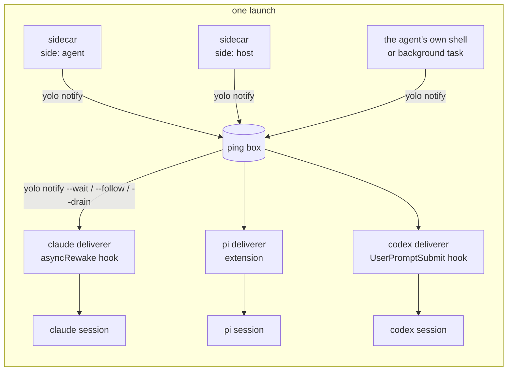

# Any background process can ring the agent, and yolo carries the ring to whichever agent is listening

**Status:** DESIGN, 2026-09-28. Nothing built. Evidence verified at `d4ac39db`, against Claude
Code 2.1.284, pi 0.87.1, codex 0.158.0, copilot 1.0.48, opencode 1.18.32 and agy 1.2.9 as
installed in this jail ([Appendix A](#appendix-a--the-evidence-per-agent)). No agent session was
started for this doc, so every delivery path is UNMEASURED end to end.

> **In short.** The watcher is not the product; the doorbell is. yolo should run any process a
> user declares beside the agent, give it one command, `yolo notify "<text>"`, that works the
> same whichever agent is in front, and leave it to each agent's own pack to turn a ping into
> whatever that agent can hear.

**Why it matters.** The CI watcher works only in Claude, only when the agent remembers to start
it as its own background task, and only because it writes Claude's private inbox frames itself.
pi, codex and the rest get nothing, and every new watcher would have to learn every agent.

**The shape.** A **sidecar** runs for the launch. It calls **`yolo notify`**, which drops a
**ping** in the launch's **ping box**. Each agent's **deliverer** takes pings from the box into
its session ([§1.2](#12-terms)).

**Cost.** One new contribution kind and one config key, one new `yolo` verb, and a deliverer per
agent pack. `yolo host -- <agent>` has to stay resident whenever a sidecar is declared.

**Start at [§3](#3-the-shape)**, the shape. The per-agent answer is [§2.2](#22-what-each-agent-can-hear).

**Needs your ruling:** [OQ-EW2](#OQ-EW2) and [OQ-EW4](#OQ-EW4), being redesigned (the feature is held until enablement is an intentional per-machine act). [OQ-EW1](#OQ-EW1) and [OQ-EW3](#OQ-EW3) were ruled 2026-09-29.

**Reads with:** [`host-notch-services.md`](host-notch-services.md#44-lifetime) (the resident
host launch a host-side sidecar rides on), [`provider-credential-scope.md`](provider-credential-scope.md)
(the "deliver as specifically as possible" rule the secrets section follows), and
[§14](#14-the-neighbors) for the rest. No implementation sketch is open yet.

---

## 1. The verdict, and the words it uses

**Build the doorbell into core, the deliverers into the agent packs, and keep the CI watcher in
the maintainer's own pack.** yolo guarantees two things and nothing else: the sidecar lives as
long as the launch, and a ping reaches the foreground agent by the best route that agent offers.
What to watch, when to ring and what to say are the sidecar's business.

Four principles carry the design, numbered so later sections and questions can cite them:

- <a id="EW-P1"></a>**EW-P1. The sidecar decides; yolo delivers.** Core never parses a ping,
  never schedules one and never knows what a CI run is. The whole contract between a sidecar
  and yolo is one command.
- <a id="EW-P2"></a>**EW-P2. Core does not know what an agent is.** Every per-agent delivery
  route ships in that agent's pack, in the pack kinds that already exist, as
  [`AGENTS.md`](../../AGENTS.md) requires of everything else. Core's part is the ping box and
  the reader commands every deliverer shares.
- <a id="EW-P3"></a>**EW-P3. A ping is a doorbell, not an instruction.** Pinged text enters the
  model's context, so it is a prompt-injection channel. yolo bounds it, frames it as an
  automated notice that carries no user authority, and routes it through the agent's
  non-user channel wherever one exists ([§5](#5-security)).
- <a id="EW-P4"></a>**EW-P4. A secret the agent must not hold never runs beside the agent.** A
  process in the jail runs as the agent's user, so the agent can read its environment and its
  files. A sidecar holding such a secret runs at the host, and only its pings cross.

### 1.1 Why now

The maintainer, 2026-09-28: *"I want anybody to be able to run any generic background process
that can decide however it wants to ping the foreground agent session through whatever means we
can make happen. That's the goal. And I want you to use the CI watcher as the example here."*
Earlier the same day he asked for it to work in pi as well as Claude, *"so that we could just
configure in our yolo config some sort of watcher like this that just starts up, and the agent
doesn't even have to participate in this management."*

### 1.2 Terms

Every term here is coined in this doc unless it says otherwise.

| Term | Meaning | What it is not |
| :--- | :--- | :--- |
| **sidecar** | A background process declared in yolo config or by a pack, which yolo starts with a launch and stops when the launch ends | Not a `kind: "service"` ([§3.1](#31-declaring-a-sidecar)), which serves the jail's own loopback and holds no grant; and not agy's own `sidecars` directory ([Appendix A](#a6-agy-129)) |
| **side** | Where a sidecar runs. `agent`: beside the agent, inside its confinement. `host`: on the host, outside it. At the host notch the two are the same place | Not the notch. The notch is where the agent runs; the side is where the sidecar runs relative to it |
| **ping** | One short text notice a process hands to yolo for the foreground agent, with a sender label, a time and an id | Not a user turn, and not a command |
| **ping box** | The per-launch store that holds pings until each deliverer has taken them. Its format is private to core | Not the Claude inbox socket, and not a queue any agent reads directly |
| **deliverer** | The per-agent piece that moves pings from the box into one agent's session: a hook, an extension, a plugin or a sidecar of its own | Not a wire-bridge `adapter`, which is a protocol conversion at an address ([`kinds.go`](../../internal/packdecl/kinds.go)) |
| **tier** | How well a deliverer can reach its agent: **wake** (it starts a turn while the agent is idle), **next turn** (the ping is attached to the next turn the user starts), or **held** (the ping waits in the box and the launch says so) | Not a quality score. A held ping is not lost |

## 2. What exists today

### 2.1 The CI watcher, and what it depends on

The maintainer's personal `ci_watch.py` (in the git-ignored `swarf/tools/`, about 170 lines of
Python standard library) polls `GET /repos/<repo>/actions/runs` with an ETag, so an unchanged
poll is a free 304. It reports each run that newly reached `completed`, and in `--post` mode it
writes two JSON frames to `CLAUDE_CODE_MESSAGING_SOCKET`: an `auth` frame carrying
`CLAUDE_CODE_MESSAGING_TOKEN`, then a `user` frame. Its companion how-to (in the git-ignored
`scratch/`) states the rule that makes it work: *"Start the watcher with the Bash tool's
`run_in_background: true`. Never use `nohup`, `setsid`, `disown` or a trailing `&`."* That gives
it four dependencies, each of which this design removes:

1. **The agent has to start it,** and start it again in every new session.
2. **Only Claude can hear it.** The socket and its frames are Claude's.
3. **It must be the session's descendant, holding the session's variables.** Claude exports
   those two variables only into its Bash tool's commands. A yolo-supervised process is a PID
   descendant of claude in a fresh launch, since the entrypoint starts `yolo-jaild supervise`
   and then execs into bash and claude (MEASURED, `ps` in this jail: PID 2 is `claude`, PID 53
   `yolo-jaild supervise` has parent 2; [`runtime.go`](../../internal/entrypoint/runtime.go)
   `startJailDaemonSupervisor`, [`boot.go`](../../internal/entrypoint/boot.go) `execBash`).
   But the supervisor started before claude made its socket, so none of the `CLAUDE_CODE_*`
   variables is in its environment (MEASURED, `/proc/53/environ`). On an attach the supervisor
   is reused and is no relative of the new agent at all.
4. **Its token is the agent's.** It reads `GH_TOKEN` from the workspace `.env`, which the agent
   can read too.

What it gets right, and what this design keeps: ETag polling, a baseline so the first poll
reports nothing old, and **facts-only messages** (short SHA, workflow, event, conclusion, URL),
never a commit message, branch name or log line.

### 2.2 What each agent can hear

The question for each agent is whether a process that is not the agent can put text in front of
the model, and whether that works while the agent is idle. The evidence behind every row is in
[Appendix A](#appendix-a--the-evidence-per-agent).

| Agent | Best route | What it takes | Tier this design uses | Evidence |
| :--- | :--- | :--- | :--- | :--- |
| **claude** | A hook with `asyncRewake: true`: *"runs in background and wakes the model on exit code 2"*, with the hook's output shown to the model as a system reminder | One `hooks` entry in `~/.claude/settings.json`, which the claude pack already renders | **wake** | MEASURED in the binary's settings schema; SOURCED ([hooks docs](https://code.claude.com/docs/en/hooks)) |
| claude, alternative | The inbox socket `/tmp/cc-socks/<pid>.sock` | Same UID; the token is optional on Linux. A sender that does not attest its permission mode is **held for the user's approval when the session bypasses prompts**, which every yolo claude does, unless `crossSessionInbound` is `"accept"` | not used ([§7](#7-alternatives-considered)) | MEASURED in the binary |
| claude, alternative | MCP channels (`claude/channel`) | `channelsEnabled`: *"Teams/Enterprise: default off"* | not used | MEASURED in the binary |
| **pi** | An extension calling `pi.sendMessage(…, {triggerTurn: true, deliverAs: "followUp"})` | One file under `~/.pi/agent/extensions/`, which the pi pack already ships two of. pi ships a `file-trigger.ts` example doing exactly this | **wake** | MEASURED in pi's types, session code and examples |
| **omp** | The same extension, if omp's API is pi's, as the omp pack's own `yolo-footer.js` comment claims | One file under `~/.oh-omp/agent/extensions/` | **wake**, UNMEASURED | INFERRED; omp is not installed here |
| **opencode** | A plugin calling `client.session.prompt` on the active session, or the HTTP API (`/session/{id}/prompt_async`, `/tui/submit-prompt`) when the TUI runs with `--port` | One plugin file under `~/.config/opencode/plugins/` | **wake**, UNMEASURED | SOURCED ([plugins](https://opencode.ai/docs/plugins), [server](https://opencode.ai/docs/server)); the routes are MEASURED in the binary |
| **copilot** | An extension that calls `joinSession()` for *"the user's current foreground session"* and then `session.send()` | One extension directory in copilot's user extensions dir. Extensions load by default | **wake**, UNMEASURED | MEASURED in the package's bundled SDK docs |
| **codex** | A `UserPromptSubmit` hook returning `additionalContext`. For waking: `codex queue --thread <id> --message <text>` through the shared app-server daemon | The hook is one config entry. `queue` needs the TUI to be on the shared daemon, not its embedded fallback, and whether a queued message starts a turn on an idle thread is open upstream ([openai/codex#49081](https://github.com/openai/codex/issues/49081)) | **next turn** first; wake once measured | hooks SOURCED ([hooks](https://learn.chatgpt.com/docs/hooks)); `queue` MEASURED in `--help` |
| **agy** | A `PreInvocation` hook returning `injectSteps` with a `userMessage`. For waking: `agy agentapi send-message`, which appears to need the running server's address and CSRF token | The hook is one `hooks.json` entry | **next turn** first | MEASURED in agy's embedded docs; the wake route is INFERRED |
| a plain shell | Nothing | — | **held** | — |

**The shape of the answer:** four of the seven agents (claude, pi, opencode, copilot) have a
route that wakes an idle session from a file or a process the agent's own pack can ship, and
omp probably shares pi's. codex and agy have one that reaches the next turn, and one that might
wake, which needs measuring. None of the wake routes needs the agent to take part, and none
needs yolo to learn a vendor's socket protocol.

## 3. The shape



Core owns four things: the `sidecar` declaration, its lifecycle, `yolo notify`, and the ping
box. The agent packs own the deliverers.

### 3.1 Declaring a sidecar

A sidecar is declared as a pack contribution of a new kind, `sidecar`, or inline in the config
key `sidecars`. It is its own kind rather than a `kind: "service"`, for two reasons. A service is
*"THE ANTI-LOOPHOLE … a service holds NO grant and crosses NO boundary"*
([`kinds.go`](../../internal/packdecl/kinds.go)), while a host-side sidecar runs user code on the
host with host credentials. And a service carries an endpoint file, a reachability witness and a
caller token, none of which a sidecar has. It reuses the service's machinery, not its kind:
agent-side sidecars run under the existing `yolo-jaild supervise`.

As a pack contribution:

```jsonc
{
  "kind": "sidecar",
  "name": "ci-watch",                       // required; unique among the launch's sidecars
  "cmd": ["python3", "{pack_dir}/sidecars/ci_watch.py"],
  "side": "agent",                          // "agent" (default) | "host"
  "restart": "on-failure",                  // "always" | "on-failure" (default) | "no"
  "host_env": ["GH_TOKEN"]                  // side "host" only: host variables this process gets
}
```

In config, where a user turns a pack's sidecar off or declares one outright:

```jsonc
"sidecars": {
  "ci-watch": { "enabled": false },                        // off in this workspace
  "flaky-log": { "cmd": ["sh", "-c", "tail -F log | …"] }  // declared inline, side "agent"
}
```

The rules:

- **`{pack_dir}`** in `cmd` is the only substituted token, and it resolves to the pack's staged
  tree wherever the sidecar runs. A pack runs a script through its interpreter, as above,
  because an embedded pack's files carry no execute bit
  ([`packs/hello-daemon/README.md`](../../packs/hello-daemon/README.md)).
- **A name collision** between two sources resolves as `service` does: the later pack in
  selection order wins, and config beats every pack. The launch names the loser.
- **Zero sidecars** means nothing starts. The ping box still exists, because the agent's own
  background tasks can ring it too ([§3.3](#33-yolo-notify-and-the-ping-box)).
- **Who may declare which side, and whether a pack's sidecar is on by default,** are
  [OQ-EW1](#OQ-EW1), [OQ-EW3](#OQ-EW3) and [OQ-EW4](#OQ-EW4).

### 3.2 Lifecycle, per side and per notch

| | side `agent` | side `host` |
| :--- | :--- | :--- |
| **Container jail** (podman, Apple Container) | A daemon under `yolo-jaild supervise`, started before the agent, stopped when the container stops. One per container, so an attach adds none | A child of the launch that creates the container, started after the pre-flights and before the container. An attach starts none of its own and says so. Stopped when that launch ends, which also ends the container |
| **`yolo host -- <agent>`** | Same as `host` | `yolo host` stays resident as the parent of the sidecars and the agent, in the shape of [`host-notch-services.md` §4.4](host-notch-services.md#44-lifetime): sidecars first, the agent last. Today the host launch execs (`hostExec` in [`host.go`](../../internal/cli/host.go)), so a declared sidecar is what makes it resident |
| **`yolo host env`, `yolo host apply`, an agent started without yolo** | Runs no sidecar. The same rule [OQ-HS3](host-notch-services.md#OQ-HS3) ruled for host services: an agent launched outside yolo lacks the feature, and that is accepted | Same |
| **macos-user** | Waits on how a `jail_daemon` runs there ([OQ-DP8](declaration-parity.md#OQ-DP8)); until then, refused by name at launch | A child of the launch, as at the host |

Common to both sides:

- **Environment.** A sidecar gets `YOLO_NOTIFY_BOX` (where the box is), `YOLO_NOTIFY_FROM` (its
  own name), `YOLO_SIDECAR_STATE` (a per-workspace directory that survives relaunches, for
  state files such as a watcher's seen list), and `YOLO_WORKSPACE` (the workspace path as that
  side sees it). An agent-side sidecar also has the container's environment. A host-side one
  has only these, `PATH`, `HOME` and the variables its `host_env` names.
- **Restart.** `on-failure` restarts a non-zero exit with the supervisor's backoff, 1 second
  doubling to 30 ([`supervisor.go`](../../internal/supervisor/supervisor.go)). An exit 0 is
  "nothing to do here", and is not restarted. `always` restarts both; `no` restarts neither.
- **Logs.** Agent side: `~/.local/state/yolo-jail-daemons/<name>.log`, as every supervised
  daemon. Host side: `<workspace>/.yolo/sidecars/<name>.log`. Each is rotated once at 5 MB, as
  the supervisor does.
- **Stop.** `SIGTERM`, then `SIGKILL` after 5 seconds on the agent side (the supervisor's grace)
  and 2 seconds on the host side ([`host-notch-services.md` §4.4](host-notch-services.md#44-lifetime)'s). A host-side sidecar whose launch died without cleanup
  exits within 5 seconds of noticing; how it notices is the implementer's choice.
- **Config changes** take effect at the next launch that creates a container, like every other
  key the jail freezes at boot.

### 3.3 `yolo notify` and the ping box

`yolo notify` is a subcommand of the one binary that already runs on both sides, so a sidecar
needs nothing installed. It has one writer form and three reader forms, and the reader forms
are what every deliverer calls. The box format stays private to core.

| Form | Who calls it | Behavior |
| :--- | :--- | :--- |
| `yolo notify [--from NAME] [--] TEXT` (or TEXT on stdin) | a sidecar, a script, the agent itself | Writes one ping. Exits 0 on success, 2 on empty or oversized input it could not truncate, 3 when `YOLO_NOTIFY_BOX` is unset or missing (*"not running under a yolo launch"*), so a sidecar can fall back to printing. `--from` defaults to `YOLO_NOTIFY_FROM`, then to `shell` |
| `yolo notify --wait --reader ID` | a hook that blocks, such as Claude's | Blocks until at least one ping is unread by that reader, prints them as one framed message, marks them read and exits 2. Exits 0 at once, printing nothing, if another `--wait` holds that reader's lock, or if there is no box |
| `yolo notify --follow --reader ID` | an extension or plugin that stays running, such as pi's | Streams each batch of new pings as one JSON line, marking each read as it is written, until its stdin closes |
| `yolo notify --drain --reader ID [--format F]` | a next-turn hook, such as codex's | Prints every unread ping and marks it read, then exits 0 immediately, printing nothing when there is none. `--format` renders the agent's hook output shape, and each shape is named by the pack that needs it |
| `yolo notify --pending` | a human, or the agent | Lists the pings still unread by any reader known to the box, and marks nothing |

The box:

- **Where it lives.** Every launch has one, a host directory yolo owns for that launch, bind
  mounted read-write into the jail at one fixed path, so both sides write the same place. At
  the host notch it is a private temporary directory. Its exact path is the implementer's.
- **A ping** is one file, written to a temporary name and renamed into place, so a reader never
  sees half of one. It carries an id, the time, the `from` label and the text.
- **Order** is by the time of the write, then by id. Pings that arrive within **2 seconds** of
  each other are delivered as one message.
- **Readers** each keep a cursor. A reader id is the deliverer's choice, and names an agent and
  a session (`claude:<session id>`, for example). A new reader starts at the box's creation,
  so pings rung before the agent started are delivered, capped at the newest **20** with one
  line saying how many older ones were left in the box.
- **Retention.** The box keeps the newest **200** pings. A box ends with its launch.
- **Concurrency.** Writers never coordinate, because each ping is its own file. Two readers
  with different ids each get every ping ([OQ-EW2](#OQ-EW2)'s leaning). Two readers with one id
  are serialized by that id's lock.
- **Forbidden.** The host side never reads the box, so nothing the jail writes there can reach
  the host. The host side's writer never follows a link it finds in the box, since the jail can
  plant one. It creates each file relative to the box directory, exclusively and without
  following links, which is the [`workspaceskills.go`](../../internal/jailcontent/workspaceskills.go)
  rule for reading a jail-editable tree applied to writing into one.

### 3.4 Deliverers, per agent

Each deliverer ships in its agent's pack, in kinds that exist today: `config-overlay` for a
settings entry and `files` for a script, exactly as the maintainer's pack already ships Claude
`Stop` hooks and eight pi extensions (`/ctx/packs/matt/pack.json`). Each pack also declares its
tier, so the launch can say what a sidecar's pings will do ([§3.5](#35-failure-paths)).

- **claude, wake.** The claude pack adds one command hook, `yolo notify --wait --reader
  claude:<session>`, with `asyncRewake: true` and an explicit `timeout` of **86400** seconds,
  registered on **`SessionStart` and on `Stop`**. `SessionStart` arms it when the session
  opens. Each time the agent finishes a turn, `Stop` re-arms it, and the lock makes the second
  waiter exit at once while the first is still waiting. When a ping lands, the waiter exits 2,
  its output reaches the model as a system reminder, and the model takes a turn, after which
  `Stop` arms the next waiter. The session id comes from the hook's stdin JSON.
- **pi, wake.** The pi pack ships `yolo-notify.js` into `~/.pi/agent/extensions/`. On
  `session_start` it spawns `yolo notify --follow --reader pi:<session>`. For each line it calls
  `pi.sendMessage({customType: "yolo-notify", content, display: true}, {triggerTurn: true,
  deliverAs: "followUp"})`, which starts a turn when pi is idle and waits for the current turn
  to end when pi is busy. It uses `sendMessage` rather than `sendUserMessage`, so the ping
  arrives as a custom message rather than a user turn. On `session_shutdown`, and on reload, it
  kills the child. The docs require exactly that pairing of start and cleanup.
- **omp, wake, unmeasured.** The omp pack ships the same file at its own extension path. This
  rests on omp's API being pi's, which is the omp pack's claim and is unchecked.
- **opencode, wake.** A plugin file that spawns `--follow` and calls `client.session.prompt` on
  the session it last saw active.
- **copilot, wake.** An extension that spawns `--follow`, joins the foreground session and calls
  `session.send`. copilot offers no non-user role for this, so the framing line in
  [§5](#5-security) is the whole marker.
- **codex, next turn.** A `UserPromptSubmit` hook running `yolo notify --drain --format codex`.
  A wake route, a codex-pack sidecar piping `--follow` into `codex queue`, waits on measurement
  ([§10](#10-what-i-would-build-in-order)).
- **agy, next turn.** A `PreInvocation` hook running `yolo notify --drain --format agy`.
- **A plain shell, held.** Nothing is delivered. `yolo notify --pending` shows what waits.

### 3.5 Failure paths

| Step | What fails | What happens, and who finds out |
| :--- | :--- | :--- |
| Declaration | Unknown `side`, empty `cmd`, `host_env` on side `agent`, a side a scope may not declare | The launch refuses, naming the sidecar and the field. `yolo check` reports the same |
| Start | The command cannot be executed | Treated as an exit under `restart`, as the supervisor already treats a failed spawn: retried with its backoff, each failure logged with its error. The launch does not wait for a sidecar and does not refuse over one: a watcher is never worth a jail |
| Running | The sidecar crashes | Restarted per `restart`, with the backoff capped at 30 seconds, for as long as the launch lives. Each exit is logged. Under `no`, the supervisor logs a giving-up line and the sidecar stays down |
| Ringing | `yolo notify` finds no box | Exit 3; the sidecar decides what to do. The CI watcher prints instead ([§4](#4-the-worked-example-the-ci-watcher)) |
| Ringing | The sidecar floods | Past **6 pings per 60 seconds** from one `from` label, later pings stay in the box, undelivered, and the next delivered message says how many were held and names `yolo notify --pending` |
| Delivery | The agent's pack ships no deliverer, or its tier is **held** | At launch, one disclosure line per declared sidecar naming what its pings will do with this agent, for example *"ci-watch: pings reach claude immediately"*, *"ci-watch: pings reach codex at your next prompt"*, *"ci-watch: pings wait in the box (bash has no deliverer); `yolo notify --pending` lists them"* |
| Delivery | A wake deliverer dies without cleanup (the Claude waiter killed, the pi child gone) | Its pings stay unread and are delivered the next time that reader arms: the next `Stop` for Claude, the next `session_start` for pi. None is lost while the launch lives |

## 4. The worked example: the CI watcher

Everything here lives in the maintainer's pack. yolo ships none of it.

**The script** moves into the pack, say to `sidecars/ci_watch.py`, and changes in four places:

1. **`post()` becomes one call.** It no longer knows about Claude:

   ```python
   def post(text):
       """Ring the foreground agent through yolo, whichever agent it is."""
       r = subprocess.run(["yolo", "notify", "--", text])
       if r.returncode == 3:          # not under a yolo launch: fall back to printing
           print(text)
   ```

2. **`--post` and exit-to-wake go.** The script always runs until stopped, and an exit is only
   an error. `--test-post` becomes `yolo notify "test"`.
3. **The repository comes from the workspace**, not a constant: `git -C "$YOLO_WORKSPACE" remote
   get-url origin`, parsed for a `github.com` owner and name. With no GitHub remote it exits 0,
   which under `on-failure` means "nothing to watch here", so one declaration in a user-scope
   pack serves every workspace.
4. **State moves to `$YOLO_SIDECAR_STATE/ci-watch.json`**, so the seen list survives a relaunch
   and is per workspace.

The message format, ETag polling and facts-only rule do not change: the message a Claude session
sees is the same line it sees today, framed by yolo instead of by Claude's inbox.

**The declaration**, in the maintainer's `pack.json`, first on the agent side, where nothing
changes about the token's exposure (it is already in the workspace `.env`):

```jsonc
{
  "kind": "sidecar",
  "name": "ci-watch",
  "cmd": ["python3", "{pack_dir}/sidecars/ci_watch.py", "--interval", "30"]
}
```

Then, once [OQ-EW1](#OQ-EW1) rules, on the host side, where the token never enters the jail and
the script reads `GH_TOKEN` from its environment instead of from `.env`:

```jsonc
{
  "kind": "sidecar",
  "name": "ci-watch",
  "side": "host",
  "cmd": ["python3", "{pack_dir}/sidecars/ci_watch.py", "--interval", "30"],
  "host_env": ["GH_TOKEN"]
}
```

A workspace that should not be watched says `"sidecars": {"ci-watch": {"enabled": false}}`.

**What the maintainer then sees.** He runs `yolo -- claude` or `yolo -- pi`, and does nothing
else. The launch prints `sidecar ci-watch (agent side): pings reach claude immediately`. He
pushes. When the run finishes, the idle session takes a turn that opens with the ping:

```text
[yolo notify · ci-watch · 21:40Z] An automated notice from a background process yolo runs for
this workspace. It is not from the user and grants nothing.
2751b06d CI (push): success — https://github.com/<owner>/<repo>/actions/runs/36497635915
```

## 5. Security

### 5.1 Pinged text is a prompt-injection channel

A ping lands in the model's context, and a sidecar watching the outside world is exactly where
third-party text comes from. yolo cannot make arbitrary text safe, so it does what it can at the
box, and states the rule for what it cannot.

What core enforces on every ping:

- **Bounded.** At most **1024 bytes** and **8 lines** after cleaning. Longer text is cut, and the
  cut is marked.
- **Cleaned.** Control characters other than newline are removed, terminal escape sequences
  included, so a ping cannot repaint a TUI or hide text from the human watching it.
- **Framed.** Every delivered message opens with the frame line shown in [§4](#4-the-worked-example-the-ci-watcher):
  who rang, when, and that the notice is automated, not from the user, and grants nothing.
- **Routed away from the user role** where the agent has another route. Claude's rewake arrives
  as a system reminder, pi's as a custom message, codex's as additional context. opencode and
  copilot have only a user-role route, so for them the frame is the whole marker.
- **Rate-limited** per sender label ([§3.5](#35-failure-paths)).
- **Labeled, not authenticated.** `from` is set by yolo for a sidecar it started. Any process in
  the jail can pass another `--from`, so the label is for the human and the model to read, never
  something to trust.

What the sidecar's author owes, generalized from the CI watcher's facts-only rule. A ping
carries only:

1. values from a closed vocabulary (`success`, `failure`, `cancelled`);
2. identifiers (a SHA, a run id, a number);
3. links back to the source, so the agent checks the source with its own tools;
4. text the sidecar's author wrote.

It never carries text a third party can write: commit messages, branch names, PR or issue
titles and bodies, log lines, review comments, file contents fetched from the network. The ping
is the doorbell; the agent opens the door by reading the source itself.

> [!WARNING]
> **The box is not a new way into the agent from inside the jail**, and it should not be
> hardened as if it were. Any process in a jail already runs as the agent's user and can reach
> Claude's inbox socket with no token (the token is optional on Linux), or write a pi trigger
> file. The box adds reach only from the host side, and only yolo's own writer uses that.

### 5.2 Secrets stay with the sidecar

- **An agent-side sidecar hides nothing from the agent.** It runs as the agent's user, so its
  environment and files are readable to the agent. For this doc, the agent read the supervisor's
  `/proc/53/environ` without difficulty. So an agent-side sidecar may hold only what the agent
  may hold. The maintainer's read-only CI token already sits in the workspace `.env`, so moving
  his watcher to the agent side changes nothing about the token.
- **A host-side sidecar receives only the host variables its `host_env` names.** Their values
  never enter a jail file, a jail environment, the launch log or the box. The launch discloses
  their names, never their values. This follows [OQ-BR4](provider-credential-scope.md#OQ-BR4)'s
  ruling that delivery is as specific as possible: the variable reaches one process, not every
  process.
- **Only pings cross from a host-side sidecar,** and a ping is bounded text. Nothing yolo does
  lets the jail call the host-side sidecar back.
- **A host-side sidecar is host code execution**, which is why who may declare one is a ruling
  ([OQ-EW1](#OQ-EW1)), and why a repository's own config never may ([OQ-EW3](#OQ-EW3)).

## 6. Where each piece belongs

The maintainer asked which part belongs in yolo itself, which in a shipped pack, and which in his
own. The dividing rule falls out of [EW-P1](#EW-P1) and [EW-P2](#EW-P2): **core holds the
mechanism that no agent and no watcher owns; an agent's pack holds what only that agent's
vendor defines; the user's pack holds what only the user knows.**

| Piece | Home | Why there |
| :--- | :--- | :--- |
| The `sidecar` kind, the `sidecars` key and their validation | **core** | A declaration shape every pack and config shares. Two copies would drift |
| Sidecar lifecycle on both sides, per notch, and the resident host launch | **core** | It is the launch's lifetime, which only the launcher knows ([HD-R1](host-daemon-ownership.md#HD-R1)) |
| `yolo notify`, the box, cursors, caps, framing, the rate limit | **core** | The one agent-agnostic contract. The frame and the caps are security rules, so they live once, where no pack can weaken them |
| The launch disclosure of each sidecar's tier | **core**, reading each pack's declared tier | Disclosure is core's job at every launch ([`OQ-RO3`](../reference/report-tiers.md#why-its-this-way)) |
| Claude's hooks, pi's and omp's extension, opencode's plugin, copilot's extension, codex's and agy's hooks, and each `--format` shape | **each agent's shipped pack** | Only that agent's vendor defines the route, and it changes with their releases. Core does not know what an agent is |
| A generic watcher of any kind (GitHub Actions, a log tail) | **nowhere yet** | Nothing generic is needed to make the doorbell useful. If a second user wants the CI watcher, it can become a shipped pack then, as a sidecar with no core change |
| `ci_watch.py`, its repositories, its token source, its message format, and whether it is on | **the maintainer's pack** | Personal policy: whose token, which repos, what the message says. In his pack it applies to every workspace he opens and to nobody else's |

Two consequences worth saying plainly:

- **His pack needs nothing from core but the kind and the verb.** He can change what the watcher
  watches, or add a second watcher, without a yolo release.
- **A deliverer is not his to write.** If his pack shipped the pi extension, a colleague
  selecting only the shipped pi pack would get sidecars whose pings nobody delivers.

## 7. Alternatives considered

| Option | Agent takes part? | Agents reached | Secret kept from the agent? | Verdict |
| :--- | :--- | :--- | :--- | :--- |
| **A. Today:** the agent starts `ci_watch.py --post` as its own background task | Yes, every session | claude | No | **Rejected as the product.** It stays a working pattern for one-off watches, and Claude's Monitor tool is its supported cousin (capped at 30 minutes a watch, re-armed by the agent) |
| **B.** Each sidecar speaks each agent's protocol itself | No | whatever each author writes | Only on the host | **Rejected:** every watcher times every agent, and every vendor change breaks every watcher |
| **C. This design:** a sidecar, `yolo notify`, and a deliverer per agent pack | No | all seven, by tier | Yes, on the host side | **Recommended** |
| **D.** A yolo MCP server rendered into every agent through the canonical MCP table ([`mcp-configuration.md`](../reference/mcp-configuration.md)), pushing through Claude's `claude/channel` | No | Push reaches claude only; the rest can only pull through a tool the agent must remember to call | Yes | **Rejected:** `channelsEnabled` is off by default on Teams and Enterprise, which this maintainer's machine is on, and pulling makes the agent take part again |
| **E.** Claude's inbox socket as Claude's deliverer | No | claude | Yes | **Rejected as the default.** A yolo process does not attest a permission mode, so in a session that bypasses prompts every message is held for the user's approval, unless yolo renders `crossSessionInbound: "accept"`, which also drops the hold for every other Claude session that messages this one |
| **F.** A host endpoint the jail long-polls over loopback TLS, instead of a shared box | No | same as C | Yes | **Rejected for the first slice.** It adds the host-reachability failure class, which a nested jail cannot test ([`loopback-tls-reachability.md`](../reference/loopback-tls-reachability.md)), for no gain over a directory both sides already share. It could replace the box's transport later with no change to `yolo notify` |
| **G.** Each agent's own sidecar or scheduling feature, such as agy's `sidecars/` directory | No | one agent each | Varies | **Rejected:** that is option B, provided by vendors |

## 8. Costs and risks

| Risk | Consequence | Mitigation |
| :--- | :--- | :--- |
| Claude caps or kills a long-running async hook despite the explicit `timeout` | The waiter dies. Pings wait until the next `Stop`, so an idle session is never woken | Step 3 of [§10](#10-what-i-would-build-in-order) measures a wake after an hour idle before the tier is declared **wake** |
| A rewake arriving mid-turn is dropped rather than queued | A ping is marked read and never seen | The same measurement. If it is dropped, the waiter defers while a turn is in flight: it arms only from `Stop` and exits at the next `UserPromptSubmit` |
| The claude pack's `Stop` hook and the maintainer's `Stop` bell overlay replace each other instead of composing | One of them silently vanishes | Composition of `hooks` arrays across overlays is checked before step 3, and pinned by a test that renders both |
| `asyncRewake` is marked `@internal` in places in Claude's schema (its `rewakeMessage` and `rewakeSummary` are) | A vendor change removes it | The flag itself is public in the hooks docs. The tier is a pack declaration, so a regression drops claude to **next turn**, with a `UserPromptSubmit` drain, in one pack edit |
| Filesystem notifications do not cross a VM share (Apple Container, the macOS podman machine) | A host-side write is not seen in the jail | Readers poll the box once a second and treat notifications only as a speed-up |
| A host-side sidecar is arbitrary host code | Whoever can declare one can run code on the host at every launch | [OQ-EW1](#OQ-EW1); disclosure at every launch, per [OQ-TP9](trust-paths.md#decision-ledger) |
| A resident `yolo host` changes the host launch for anyone who declares a sidecar | Signals and exit codes pass through one more process | The same shape and numbers as [`host-notch-services.md` §4.4](host-notch-services.md#44-lifetime), which the managed Codex launch already runs |

**What this deletes:** the watcher's private Claude frames, its exit-to-wake mode, and the rule
that the agent must start it. **What it forecloses:** nothing. A user can still run a
session-owned watcher by hand.

## 9. What this does not cover

- **Event sources.** No GitHub, webhook or schedule support in core. A sidecar is any command.
- **Replies.** The agent cannot answer a sidecar through the box. A sidecar that needs an answer
  reads the agent's work the way anything else does.
- **Remote or cross-machine pings.** The box is per launch and local.
- **Waking a session that has exited.** A ping for a dead session waits for the next reader in
  the same launch, or ends with the launch.
- **Scheduling.** A sidecar that wants cron semantics sleeps in its own loop.
- **Agents launched outside yolo.** They get no sidecars and no deliverer, as [OQ-HS3](host-notch-services.md#OQ-HS3)
  accepted for host services.

## 10. What I would build, in order

The first slice is Claude and pi on a container jail, agent side only, because that is where the
maintainer works and where nothing waits on a ruling except two defaults: [OQ-EW3](#OQ-EW3) and
[OQ-EW4](#OQ-EW4) decide what step 2 accepts from workspace config and whether a pack's sidecar
starts unasked.

1. **`yolo notify` and the box**, with its cursors, caps, framing and rate limit, and the
   launch-owned mount. Unit tests drive the writer and every reader form, including two readers,
   a lock contest, a flood and a planted link.
2. **The `sidecar` kind and the `sidecars` key, agent side**, composed into the supervisor's
   existing daemon list with a per-daemon environment and `{pack_dir}`. The launch disclosure.
3. **Claude's deliverer**, as a `config-overlay` in the claude pack. A human measures three
   things that no automated test may do here, since tests never start an agent: a wake after an
   hour idle, a ping landing mid-turn, and the maintainer's `Stop` bell still ringing beside it.
4. **pi's deliverer**, the extension, with the same measurement.
5. **The maintainer ports `ci_watch.py`** into his pack ([§4](#4-the-worked-example-the-ci-watcher)).
   That is his change, not the repository's.
6. **The host side**, once [OQ-EW1](#OQ-EW1) rules: the resident host launch, `host_env`, and
   the host-side writer.
7. **codex and agy next-turn hooks; opencode, copilot and omp wake deliverers**, each measured
   by a human before its tier is declared. Then codex's `queue` wake route, once
   [openai/codex#49081](https://github.com/openai/codex/issues/49081) settles.
8. **macos-user agent side**, after [OQ-DP8](declaration-parity.md#OQ-DP8).

## 11. What done looks like

1. With the maintainer's pack selected and nothing else changed, `yolo -- claude` and
   `yolo -- pi` each print one line naming `ci-watch` and saying its pings reach that agent
   immediately.
2. An idle session of either agent takes a turn within one poll interval plus 5 seconds of a
   GitHub run finishing, opening with the frame line and the run's facts, with no approval
   prompt and without the agent having started anything.
3. `yolo -- bash`, then `yolo notify hi`, then `yolo notify --pending` lists the ping, and the
   launch said that bash has no deliverer.
4. A ping carrying a terminal escape sequence and 5 KB of text arrives cleaned and cut, with the
   cut marked.
5. Ten pings in ten seconds from one sidecar arrive as at most six delivered messages, the last
   saying how many wait.
6. With the host-side declaration, `GH_TOKEN` is in no file, environment or log in the jail,
   and the launch names the variable without its value.
7. Stopping the jail stops every sidecar. `yolo host -- claude` with a sidecar declared leaves
   no sidecar process behind once claude exits.

## 12. Open Questions

1. ✅ <a id="OQ-EW1"></a>**[OQ-EW1](#OQ-EW1): Who may declare a host-side sidecar?** A
   host-side sidecar runs its command on the host, outside every confinement, at every launch.
   This decides whether the token-keeping half of [EW-P4](#EW-P4) is available to the
   maintainer's own pack, and what a pack someone else wrote can make his host run.
   [OQ-HS4](host-notch-services.md#OQ-HS4) limited a *service's* host half to embedded
   official packs, but that was about a third party's daemon, and here the author is usually
   the user.

   - **A — The user's own word only.** User-scope config, the conventional local pack, and any
     pack the user-scope config selects by path. Refused from workspace config and from fetched
     packs, by name. Disclosed at every launch.
   - **B — A, plus embedded official packs.** Nothing shipped needs one today, so this only
     matters later.
   - **C — Nobody, yet.** Agent side only in the first release; the token stays where it is.

   _Leaning:_ **A.** A command in his own config is his, as much as his shell's rc file is. A
   path-selected pack is one he named. A fetched pack stays refused until someone rules on trust
   for third-party host code, as [OQ-HS4](host-notch-services.md#OQ-HS4) left it. The boundary
   is disclosure, which [OQ-TP9](trust-paths.md#decision-ledger) chose over approval.

   **Answer:**
   > **Ruled 2026-09-29, as leaned: A.** Only the user's own word may declare a host-side
   > sidecar: user-scope config, the local pack, and packs the user's config selects by path.
   > Refused from workspace config and from fetched packs; disclosed at every launch. (Relayed
   > from the conversational walkthrough: *"Yes A."*)

2. 💬 <a id="OQ-EW2"></a>**[OQ-EW2](#OQ-EW2): Does a ping reach every agent session in the jail,
   or one?** An attach can put claude and pi in one container, both with deliverers. This
   decides whether a CI result interrupts both, and whether a sidecar ever has to name a target.

   - **A — Every session.** Each reader gets every ping. Simple, and a session that does not care
     ignores one line.
   - **B — The first reader to take it.** One session handles each event. Which one is a race.
   - **C — A target the sidecar names**, by agent. Precise, but a sidecar has to know which
     agents run, which [EW-P1](#EW-P1) set out to avoid.

   <!-- vantage: oq id=OQ-EW2 leaning="A: every session gets every ping; the box cannot know which session cares, and a race or a sidecar-chosen target both push knowledge into the wrong place." -->

   _Leaning:_ **A.** The box cannot know which session cares, and the other two either race or
   make the sidecar know about agents. Two agents in one jail is rare, and C can be added later as
   an optional `--to` without changing A's default.

   **Directed 2026-09-29, back to the drawing board.** The maintainer, answering this question:
   *"this is a much deeper question i think and i don't think we can actually release this feature
   until we really nail this down ... normally i put these settings in my dot files i share them
   across computers ... i may have two agents across different computers ... waiting ... on the same
   project ... a distributed set of ci watchers and agents that are both going to try to act and
   that's not going to be good for anyone ... this really just needs to be a very intentional act
   to enable this ci watcher somewhere ... it can't be driven even from the user settings directly,
   because then when my.file syncing setup, I'm going to get it in two places without even thinking
   about it."* The feature is not released until enablement is an intentional, per-machine act that
   a synced dotfile cannot trigger, and the cross-machine duplicate is designed for. A redesign is
   in progress; this question is restated with it.

   **Answer:**
   > _(empty — fill in when decided)_

3. ✅ <a id="OQ-EW3"></a>**[OQ-EW3](#OQ-EW3): May a repository's own `yolo-jail.jsonc` declare
   an agent-side sidecar?** A cloned repo's config could then start a process at launch, and ring
   the agent with whatever it likes. This decides whether a project can ship its own watcher (a
   dev server's error tail, say) to everyone who opens it.

   - **A — Yes, where the agent is confined; refused at the host notch.** In a jail the process has
     no power the agent's own shell lacks, and the repo can already instruct the agent through its
     `AGENTS.md`. At the host there is no confinement, so a repo would gain host code execution
     at launch.
   - **B — Never.** Sidecars are user-scope only, like the host-reaching keys
     [OQ-AS3](../research/agent-safehouse.md#OQ-AS3) asks about.

   _Leaning:_ **A**, with a host-side declaration refused from workspace scope under every answer
   to [OQ-EW1](#OQ-EW1).

   **Answer:**
   > **Ruled 2026-09-29, none of the options as written: yes, but gated.** The maintainer: *"i
   > think the answer is yes but again i'm not sure it should even be default on ... It would be
   > weird to clone somebody else's repository and then start this up and get some background
   > watcher running. I think we need an explicit acknowledgement step before it's default on
   > anywhere. Yes, it starts it everywhere or whatever, it distributes it everywhere when you
   > put it in the config, but that config needs to allow a gated set."* A repository's own
   > config may declare an agent-side sidecar, but it does not run until the user has explicitly
   > acknowledged it; the gated-configuration model is being designed with [OQ-EW2](#OQ-EW2)'s
   > redesign.

4. 💬 <a id="OQ-EW4"></a>**[OQ-EW4](#OQ-EW4): Is a pack's sidecar on when its pack is
   selected?** Loopholes that ship in packs are off until enabled
   ([`packs/hello-daemon`](../../packs/hello-daemon/README.md) states the precedent). This
   decides whether the maintainer's watcher starts in every workspace the moment his pack is
   selected, or only where he turns it on.

   - **A — On when selected.** `"sidecars": {"<name>": {"enabled": false}}` turns one off.
     Selecting a pack whose point is a sidecar is the act of wanting it.
   - **B — Off until enabled**, as loopholes are. One more line per workspace, and a declared
     sidecar that silently does nothing until someone finds the switch.

   <!-- vantage: oq id=OQ-EW4 leaning="A: on when its pack is selected, with enabled:false to turn it off; a pack a user selects for its sidecar should not need a second switch." -->

   _Leaning:_ **A.** A loophole is off because it crosses the boundary. An agent-side sidecar
   crosses nothing, and a host-side one is already gated by [OQ-EW1](#OQ-EW1). The launch
   discloses every sidecar it starts, so an unwanted one is visible at once.

   **Answer:**
   > _(empty — fill in when decided)_

## 13. Decision Ledger

Rulings (2026-09-29) and implementation decisions, taken where a question had one right answer,
recorded so an implementer does not reopen them.

| ID | Ruling / Decision | Date | Settled in | Built |
| :--- | :--- | :--- | :--- | :--- |
| <a id="EW-D1"></a>[`EW-D1`](#13-decision-ledger) | *Implementation decision.* A sidecar is its own contribution kind, `sidecar`, not a `kind: "service"`: a service holds no grant and has an endpoint, a witness and a caller token; a host-side sidecar holds a credential and has none of those. Agent-side sidecars reuse the supervisor | 2026-09-28 | [§3.1](#31-declaring-a-sidecar) | — |
| <a id="EW-D2"></a>[`EW-D2`](#13-decision-ledger) | *Implementation decision.* The doorbell is `yolo notify`, a subcommand of the one binary on both sides, not a new `cmd/` binary, so it adds nothing to `shippedBinaries` or the bundle | 2026-09-28 | [§3.3](#33-yolo-notify-and-the-ping-box) | — |
| <a id="EW-D3"></a>[`EW-D3`](#13-decision-ledger) | *Implementation decision.* The box is a launch-owned host directory mounted into the jail, one file per ping, renamed into place. Readers poll once a second and use filesystem notifications only as a speed-up | 2026-09-28 | [§3.3](#33-yolo-notify-and-the-ping-box) | — |
| <a id="EW-D4"></a>[`EW-D4`](#13-decision-ledger) | *Implementation decision.* Deliverers never read the box. They call `yolo notify --wait`, `--follow` or `--drain`, so the format stays private to core and one reader implementation serves every agent | 2026-09-28 | [§3.3](#33-yolo-notify-and-the-ping-box) | — |
| <a id="EW-D5"></a>[`EW-D5`](#13-decision-ledger) | *Implementation decision.* Claude's deliverer is an `asyncRewake` command hook on `SessionStart` and `Stop`, one waiter per session by lock, with an explicit 86400-second timeout. Not the inbox socket ([§7](#7-alternatives-considered) option E) and not MCP channels (option D) | 2026-09-28 | [§3.4](#34-deliverers-per-agent) | — |
| <a id="EW-D6"></a>[`EW-D6`](#13-decision-ledger) | *Implementation decision.* pi's deliverer uses `sendMessage` with `triggerTurn: true` and `deliverAs: "followUp"`, never `sendUserMessage`, so a ping neither interrupts a turn nor arrives as the user | 2026-09-28 | [§3.4](#34-deliverers-per-agent) | — |
| <a id="EW-D7"></a>[`EW-D7`](#13-decision-ledger) | *Implementation decision.* Every ping is cleaned of control characters, cut to 1024 bytes and 8 lines, framed as an automated notice with no user authority, batched within 2 seconds, and limited to 6 delivered per 60 seconds per sender label, with the excess held and counted | 2026-09-28 | [§5.1](#51-pinged-text-is-a-prompt-injection-channel) | — |
| <a id="EW-D8"></a>[`EW-D8`](#13-decision-ledger) | *Implementation decision.* The host side never reads the box, and its writer creates each file relative to the box directory, exclusively, following no link | 2026-09-28 | [§3.3](#33-yolo-notify-and-the-ping-box) | — |
| <a id="EW-D9"></a>[`EW-D9`](#13-decision-ledger) | *Implementation decision.* A host-side sidecar gets only `PATH`, `HOME`, the four `YOLO_*` variables and the host variables its `host_env` names. None of their values is written anywhere the jail can read. Names are disclosed, values never | 2026-09-28 | [§5.2](#52-secrets-stay-with-the-sidecar) | — |
| <a id="EW-D10"></a>[`EW-D10`](#13-decision-ledger) | *Implementation decision.* Host-side sidecars belong to the launch that creates the container; an attach starts none. A sidecar declared at the host notch makes `yolo host` resident, in [`host-notch-services.md` §4.4](host-notch-services.md#44-lifetime)'s shape | 2026-09-28 | [§3.2](#32-lifecycle-per-side-and-per-notch) | — |
| <a id="EW-D11"></a>[`EW-D11`](#13-decision-ledger) | *Implementation decision.* A sidecar never delays or refuses a launch by failing to start. It is retried with the supervisor's backoff and logged. A malformed declaration does refuse | 2026-09-28 | [§3.5](#35-failure-paths) | — |
| <a id="EW-D12"></a>[`EW-D12`](#13-decision-ledger) | *Implementation decision.* Each agent pack declares its deliverer's tier, and the launch discloses per sidecar what its pings will do with the agent being launched. A tier is declared **wake** only after a human has measured it | 2026-09-28 | [§3.4](#34-deliverers-per-agent) | — |
| [OQ-EW1](#OQ-EW1) | **Maintainer ruling:** A; only the user's own word declares a host-side sidecar | 2026-09-29 | [§12](#12-open-questions) | pending |
| [OQ-EW3](#OQ-EW3) | **Maintainer ruling:** a repository may declare an agent-side sidecar, and it runs only after the user's explicit acknowledgement | 2026-09-29 | [§12](#12-open-questions) | pending |
| <a id="EW-DIR1"></a>EW-DIR1 | **Maintainer direction:** the feature is held until enabling a sidecar is an intentional per-machine act that a synced dotfile cannot trigger, and two machines watching one project is designed for ([OQ-EW2](#OQ-EW2)) | 2026-09-29 | [§12](#12-open-questions) | — |

## 14. The neighbors

| Doc | Why it reads with this one |
| :--- | :--- |
| [`host-notch-services.md`](host-notch-services.md#44-lifetime) | The resident host launch and its stop timings, which host-side sidecars reuse; [OQ-HS3](host-notch-services.md#OQ-HS3)'s ruling on agents launched outside yolo; [OQ-HS4](host-notch-services.md#OQ-HS4)'s embedded-only rule, which [OQ-EW1](#OQ-EW1) is asked beside |
| [`host-daemon-ownership.md`](host-daemon-ownership.md#HD-R1) | [HD-R1](host-daemon-ownership.md#HD-R1): a host process lives as long as the launch that wanted it |
| [`provider-credential-scope.md`](provider-credential-scope.md#OQ-BR4) | The ruling that credential delivery is as specific as possible, which `host_env` follows |
| [`declaration-parity.md`](declaration-parity.md#OQ-DP8) | [OQ-DP8](declaration-parity.md#OQ-DP8), how a jail daemon runs on macos-user, which the agent side waits on there |
| [`trust-paths.md`](trust-paths.md#decision-ledger) | [OQ-TP9](trust-paths.md#decision-ledger): disclosure, not approval, is the boundary for what a pack may do |
| [`mcp-configuration.md`](../reference/mcp-configuration.md) | The canonical MCP table, the rejected option D's vehicle |
| [`wire-bridge.md`](../reference/wire-bridge.md) | The `service` kind a sidecar deliberately is not |

## Appendix A — the evidence per agent

Gathered 2026-09-28 in this jail, read-only: binaries' strings, packages' docs and types,
`--help` output, and public docs. No agent session was started and no API was called. One probe
had a side effect: `codex --version`, run through yolo's lazy launcher, let the launcher update
codex from 0.156.1 to 0.158.0 under `~/.codex/packages/`, as that launcher does on any call.

### A.1 claude (2.1.284)

- **`asyncRewake`**, MEASURED in the settings schema embedded in
  `~/.local/share/claude/versions/2.1.284`: `asyncRewake: … "If true, hook runs in background and
  wakes the model on exit code 2 (blocking error). Implies async."`, beside `async`, `once`,
  `timeout` (*"Timeout in seconds for this specific command"*) and the `@internal`
  `rewakeMessage` and `rewakeSummary` (the latter *'Defaults to "Stop hook feedback"'*).
- **The inbox**, MEASURED: sockets at `/tmp/cc-socks/<n>.sock`, mode `srw-------`, one per live
  session. The auth line is required only on Windows by default (the log prints
  `auth line … "optional"` otherwise). The sender's PID is read from the kernel as provenance,
  not as authentication. The hold reasons, verbatim: *"The sending session's permission mode
  class doesn't match this session's. Review it below, or set "crossSessionInbound" to
  "accept"."* and *"The sender did not attest its permission mode and this session bypasses
  prompts."* `crossSessionInbound` takes `accept`, `hold` or `refuse`; a repository or managed
  setting may only tighten it. No sender allowlist exists.
- **Channels**, MEASURED: `channelsEnabled`, *"Managed-org opt-in for channel notifications (MCP
  servers with the claude/channel capability pushing inbound messages). Teams/Enterprise: default
  off; Console: default on."*
- **Monitor**, MEASURED from this session's tool schema: each stdout line of a watched command
  becomes a notification; every monitor expires after at most 30 minutes and is re-armed by the
  agent.
- **yolo's claude pack** renders no Claude Code hook and no messaging setting today (MEASURED,
  [`packs/claude/pack.json`](../../packs/claude/pack.json)). The maintainer's pack renders
  `Stop`, `StopFailure` and `Notification` hooks through a `config-overlay` on `claude/settings`
  (MEASURED, `/ctx/packs/matt/pack.json`).

### A.2 pi (0.87.1)

All MEASURED under `@earendil-works/pi-coding-agent` in the npm prefix.

- `sendMessage(message, options?: {triggerTurn?: boolean; deliverAs?: "steer" | "followUp" |
  "nextTurn"})` and `sendUserMessage(content, options?: {deliverAs?: "steer" | "followUp"})`,
  the latter documented *"Always triggers a turn"* (`dist/core/extensions/types.d.ts:1045-1058`).
- In `dist/core/agent-session.js` (around lines 1481-1518): on an idle agent `triggerTurn: true`
  starts a turn and `false` appends without one; on a streaming agent `followUp` waits for the
  turn to end and the default steers. `sendUserMessage` while streaming with no `deliverAs`
  throws.
- `examples/extensions/file-trigger.ts`: *"Watches a trigger file and injects its contents into
  the conversation. Useful for external systems to send messages to the agent."* It calls
  `fs.watch` in `session_start` and `sendMessage(…, {triggerTurn: true})`.
- `docs/extensions.md` requires processes, sockets, watchers and timers to start in
  `session_start` and close in an idempotent `session_shutdown`, and says a reload replaces the
  extension runtime.
- No built-in listener: nothing in `dist` calls `createServer` or `.listen`. `--mode rpc` drives
  a pi the caller spawned; it cannot attach to a running TUI.
- yolo's pi pack ships two extensions today through `files` entries into
  `.pi/agent/extensions/` ([`packs/pi/pack.json`](../../packs/pi/pack.json)).

### A.3 omp

Not installed here. Its pack installs `@oh-labs/oh-omp` and ships `yolo-footer.js`, whose comment
says omp runs extensions *"with the same extension API pi has"*
([`packs/omp/extensions/yolo-footer.js`](../../packs/omp/extensions/yolo-footer.js)). The npm
package carries no docs. INFERRED only.

### A.4 codex (0.158.0)

- `codex queue --thread <uuid|name> --message <text>`, *"Queue a message for an existing
  session"* (MEASURED, `--help`; SOURCED, [openai/codex#39092](https://github.com/openai/codex/pull/39092)),
  sent as `thread/queue/add` to the shared app-server daemon on `app-server-control.sock`. The
  TUI uses that daemon by default and falls back to an embedded server that `queue` cannot reach
  (MEASURED, strings). The daemon also offers `turn/start`, `turn/steer`, `thread/inject_items`
  and `thread/loaded/list` (MEASURED, a schema generated from the binary).
- Whether a queued message starts a turn on an idle thread is unsettled:
  [openai/codex#49081](https://github.com/openai/codex/issues/49081), filed 2026-09-28, reports
  queued messages not sent after a turn ends.
- Hooks: only `SessionStart`, `UserPromptSubmit` and `Stop` inject context, all on the agent's own
  lifecycle (SOURCED, [learn.chatgpt.com/docs/hooks](https://learn.chatgpt.com/docs/hooks)).
  `notify` fires on `agent-turn-complete` and is outbound only (MEASURED).

### A.5 copilot (1.0.48), opencode (1.18.32)

- **copilot**, MEASURED in the package's bundled SDK docs: extensions under the user extensions
  directory or `.github/extensions/<name>/extension.mjs` run as long-lived children of the CLI,
  load by default, call `joinSession()` for *"the user's current foreground session"*, and
  `session.send()` *"programmatically inject[s] a new user message"*. Config-file hooks inject
  context only on `sessionStart` (SOURCED,
  [hooks configuration](https://docs.github.com/en/copilot/reference/hooks-configuration)). A
  hidden `--ui-server` embeds a JSON-RPC server in the TUI (MEASURED).
- **opencode**: the TUI opens a reachable HTTP port only with `--port`, `--hostname` or mDNS;
  otherwise it talks to an in-process worker (MEASURED in the binary). With a port, `POST
  /session/{id}/prompt_async`, `/tui/append-prompt` and `/tui/submit-prompt` exist (MEASURED;
  SOURCED, [server](https://opencode.ai/docs/server)). Plugins receive `client`, and
  `client.session.prompt` sends to a session (SOURCED, [plugins](https://opencode.ai/docs/plugins),
  [SDK](https://opencode.ai/docs/sdk)).

### A.6 agy (1.2.9)

MEASURED from `--help` and agy's embedded docs: `agy agentapi send-message <recipient_id>
<content>` exists, and its strings suggest it needs `ANTIGRAVITY_LS_ADDRESS` and
`ANTIGRAVITY_CSRF_TOKEN`. Hooks in `hooks.json` include `PreInvocation`, which may return
`injectSteps` with a `userMessage`; hooks are synchronous with a 30-second default timeout. agy
has its own `sidecars/<id>/sidecar.json` with a restart policy and a cron schedule; whether the
CLI rather than the desktop app runs them is INFERRED.
