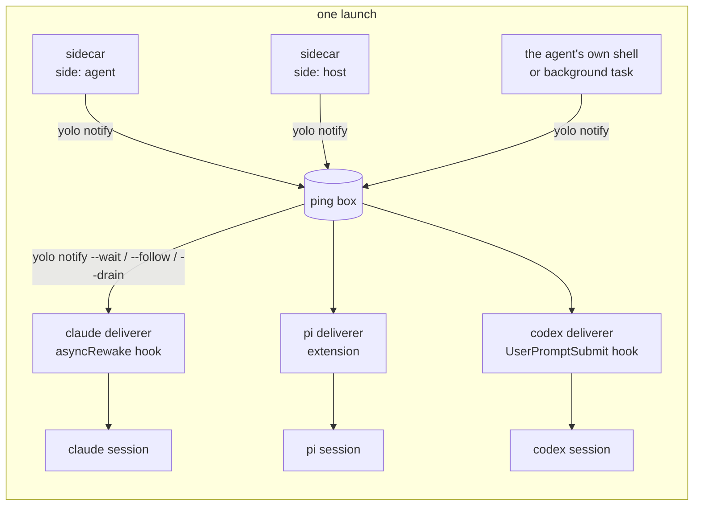

# Any background process can ring the agent, and yolo carries the ring to whichever agent is listening

**Status:** DESIGN, 2026-09-28. Nothing built. Evidence verified at `d4ac39db`, against Claude
Code 2.1.284, pi 0.87.1, codex 0.158.0, copilot 1.0.48, opencode 1.18.32 and agy 1.2.9 as
installed in this jail ([Appendix A](#appendix-a--the-evidence-per-agent)). No agent session was
started for this doc, so every delivery path is UNMEASURED end to end. **Revised 2026-09-29:**
declaring a sidecar no longer starts it; enabling one is a per-machine act
([§12](#12-enabling-a-sidecar-redesign-2026-09-29)), and the sections before it are updated to
match.

> **In short.** The watcher is not the product; the doorbell is. yolo should run any process a
> user declares beside the agent, give it one command, `yolo notify "<text>"`, that works the
> same whichever agent is in front, and leave it to each agent's own pack to turn a ping into
> whatever that agent can hear.

**Why it matters.** The CI watcher works only in Claude, only when the agent remembers to start
it as its own background task, and only because it writes Claude's private inbox frames itself.
pi, codex and the rest get nothing, and every new watcher would have to learn every agent.

**The shape.** A **sidecar** runs for the launch. It calls **`yolo notify`**, which drops a
**ping** in the launch's **ping box**. Each agent's **deliverer** takes pings from the box into
its session ([§1.2](#12-terms)).

**Turning one on.** Declaring a sidecar, in config, a pack or a repository, never starts it. It
runs on a machine only after `yolo sidecar enable <name>` on that machine, which writes a record
into yolo's machine-local state, where no synced dotfile reaches. A repository's own sidecar is
also bound to its current declaration, so a changed one stops until acknowledged again
([§12](#12-enabling-a-sidecar-redesign-2026-09-29)).

**Cost.** One new contribution kind and one config key, two new `yolo` verbs (`notify` and
`sidecar`), and a deliverer per agent pack. `yolo host -- <agent>` has to stay resident whenever
a sidecar is enabled.

**Start at [§3](#3-the-shape)**, the shape. The per-agent answer is [§2.2](#22-what-each-agent-can-hear).

**Needs your ruling:** nothing open. [OQ-EW10](#OQ-EW10) was ruled 2026-09-29 (A, and the jail's own
agent may turn on an agent-side sidecar); [OQ-EW9](#OQ-EW9) was directed ([EW-DIR3](#EW-DIR3)) and is
being designed;
[OQ-EW5](#OQ-EW5) to [OQ-EW8](#OQ-EW8) were ruled 2026-09-29. The feature stays held until they are
ruled ([EW-DIR1](#EW-DIR1)). [OQ-EW1](#OQ-EW1), [OQ-EW3](#OQ-EW3) and [OQ-EW4](#OQ-EW4) were ruled
2026-09-29, and [OQ-EW2](#OQ-EW2) is superseded by [OQ-EW8](#OQ-EW8) and [OQ-EW9](#OQ-EW9).

**Reads with:** [`host-notch-services.md`](host-notch-services.md#44-lifetime) (the resident
host launch a host-side sidecar rides on), [`provider-credential-scope.md`](provider-credential-scope.md)
(the "deliver as specifically as possible" rule the secrets section follows),
[`config-safety.md`](../reference/config-safety.md) (the host-side approval record the
enablement record sits beside), and [§15](#15-the-neighbors) for the rest. No implementation
sketch is open yet.

---

## 1. The verdict, and the words it uses

**Build the doorbell into core, the deliverers into the agent packs, and keep the CI watcher in
the maintainer's own pack.** yolo guarantees two things and nothing else: the sidecar lives as
long as the launch, and a ping reaches the foreground agent by the best route that agent offers.
What to watch, when to ring and what to say are the sidecar's business.

Four principles carry the design, numbered so later sections and questions can cite them:

- <a id="EW-P1"></a>**EW-P1. The sidecar decides; yolo delivers.** Core never parses a ping,
  never schedules one and never knows what a CI run is. The whole contract between a sidecar
  and yolo is one command.
- <a id="EW-P2"></a>**EW-P2. Core does not know what an agent is.** Every per-agent delivery
  route ships in that agent's pack, in the pack kinds that already exist, as
  [`AGENTS.md`](../../AGENTS.md) requires of everything else. Core's part is the ping box and
  the reader commands every deliverer shares.
- <a id="EW-P3"></a>**EW-P3. A ping is a doorbell, not an instruction.** Pinged text enters the
  model's context, so it is a prompt-injection channel. yolo bounds it, frames it as an
  automated notice that carries no user authority, and routes it through the agent's
  non-user channel wherever one exists ([§5](#5-security)).
- <a id="EW-P4"></a>**EW-P4. A secret the agent must not hold never runs beside the agent.** A
  process in the jail runs as the agent's user, so the agent can read its environment and its
  files. A sidecar holding such a secret runs at the host, and only its pings cross.

### 1.1 Why now

The maintainer, 2026-09-28: *"I want anybody to be able to run any generic background process
that can decide however it wants to ping the foreground agent session through whatever means we
can make happen. That's the goal. And I want you to use the CI watcher as the example here."*
Earlier the same day he asked for it to work in pi as well as Claude, *"so that we could just
configure in our yolo config some sort of watcher like this that just starts up, and the agent
doesn't even have to participate in this management."*

### 1.2 Terms

Every term here is coined in this doc unless it says otherwise.

| Term | Meaning | What it is not |
| :--- | :--- | :--- |
| **sidecar** | A background process declared in yolo config or by a pack, which yolo starts with a launch once it is enabled on that machine ([§12](#12-enabling-a-sidecar-redesign-2026-09-29)), and stops when the launch ends | Not a `kind: "service"` ([§3.1](#31-declaring-a-sidecar)), which serves the jail's own loopback and holds no grant; and not agy's own `sidecars` directory ([Appendix A](#a6-agy-129)) |
| **side** | Where a sidecar runs. `agent`: beside the agent, inside its confinement. `host`: on the host, outside it. At the host notch the two are the same place | Not the notch. The notch is where the agent runs; the side is where the sidecar runs relative to it |
| **ping** | One short text notice a process hands to yolo for the foreground agent, with a sender label, a time and an id | Not a user turn, and not a command |
| **ping box** | The store that holds pings until each deliverer has taken them: one per container, and at the host notch and on macos-user one per workspace on the machine ([EW-D19](#EW-D19)). Its format is private to core | Not the Claude inbox socket, and not a queue any agent reads directly |
| **deliverer** | The per-agent piece that moves pings from the box into one agent's session: a hook, an extension, a plugin or a sidecar of its own | Not a wire-bridge `adapter`, which is a protocol conversion at an address ([`kinds.go`](../../internal/packdecl/kinds.go)) |
| **tier** | How well a deliverer can reach its agent: **wake** (it starts a turn while the agent is idle), **next turn** (the ping is attached to the next turn the user starts), or **held** (the ping waits in the box and the launch says so) | Not a quality score. A held ping is not lost |
| **replicator** | Whatever copies config between machines: a git-synced dotfiles repository, GNU Stow, Syncthing, chezmoi. It writes `~/.config` exactly as the user does, and it cannot know which machine the user meant | Not the agent. It is the actor the enablement gate stands against ([§12.2](#122-where-the-record-lives-and-why-there)) |
| **enablement record** | A host-side file in yolo's machine-local state saying that sidecar N, from source S, may run (or, from `disable`, may not) for workspace W, or for every workspace, on this machine. Written only by the enabling act, which under [OQ-EW5](#OQ-EW5)'s leaning is `yolo sidecar enable` and `disable` ([§12.3](#123-the-command)) | Not config, and not synced by yolo: it sits beside the config-change gate's approval record ([EW-D14](#EW-D14)) |
| **gated set** | The maintainer's phrase, from the [OQ-EW3](#OQ-EW3) and [OQ-EW4](#OQ-EW4) rulings: the declared sidecars that wait for an explicit act before they run. Under [OQ-EW10](#OQ-EW10)'s leaning it is every declared sidecar ([EW-D13](#EW-D13)) | Not a list anyone writes. The config declares the set; each machine's records decide which members run there |
| **acknowledgement** | The enablement record of a sidecar that a workspace's own config or a fetched pack declares, which also holds a hash of that declaration, so a changed declaration is not started ([§12.4](#124-a-sidecar-a-repository-declares)) | Not the config-change prompt, under [OQ-EW7](#OQ-EW7)'s leaning |
| **authorship filter** | A watcher reporting only CI runs whose commit this checkout pushed, read from git's local record of its own pushes ([§12.6](#126-two-machines-one-project)) | Not a lock. It narrows what one watcher reports and promises nothing about another |

## 2. What exists today

### 2.1 The CI watcher, and what it depends on

The maintainer's personal `ci_watch.py` (in the git-ignored `swarf/tools/`, about 170 lines of
Python standard library) polls `GET /repos/<repo>/actions/runs` with an ETag, so an unchanged
poll is a free 304. It reports each run that newly reached `completed`, and in `--post` mode it
writes two JSON frames to `CLAUDE_CODE_MESSAGING_SOCKET`: an `auth` frame carrying
`CLAUDE_CODE_MESSAGING_TOKEN`, then a `user` frame. Its companion how-to (in the git-ignored
`scratch/`) states the rule that makes it work: *"Start the watcher with the Bash tool's
`run_in_background: true`. Never use `nohup`, `setsid`, `disown` or a trailing `&`."* That gives
it four dependencies, each of which this design removes:

1. **The agent has to start it,** and start it again in every new session.
2. **Only Claude can hear it.** The socket and its frames are Claude's.
3. **It must be the session's descendant, holding the session's variables.** Claude exports
   those two variables only into its Bash tool's commands. A yolo-supervised process is a PID
   descendant of claude in a fresh launch, since the entrypoint starts `yolo-jaild supervise`
   and then execs into bash and claude (MEASURED, `ps` in this jail: PID 2 is `claude`, PID 53
   `yolo-jaild supervise` has parent 2; [`runtime.go`](../../internal/entrypoint/runtime.go)
   `startJailDaemonSupervisor`, [`boot.go`](../../internal/entrypoint/boot.go) `execBash`).
   But the supervisor started before claude made its socket, so none of the `CLAUDE_CODE_*`
   variables is in its environment (MEASURED, `/proc/53/environ`). On an attach the supervisor
   is reused and is no relative of the new agent at all.
4. **Its token is the agent's.** It reads `GH_TOKEN` from the workspace `.env`, which the agent
   can read too.

What it gets right, and what this design keeps: ETag polling, a baseline so the first poll
reports nothing old, and **facts-only messages** (short SHA, workflow, event, conclusion, URL),
never a commit message, branch name or log line.

### 2.2 What each agent can hear

The question for each agent is whether a process that is not the agent can put text in front of
the model, and whether that works while the agent is idle. The evidence behind every row is in
[Appendix A](#appendix-a--the-evidence-per-agent).

| Agent | Best route | What it takes | Tier this design uses | Evidence |
| :--- | :--- | :--- | :--- | :--- |
| **claude** | A hook with `asyncRewake: true`: *"runs in background and wakes the model on exit code 2"*, with the hook's output shown to the model as a system reminder | One `hooks` entry in `~/.claude/settings.json`, which the claude pack already renders | **wake** | MEASURED in the binary's settings schema; SOURCED ([hooks docs](https://code.claude.com/docs/en/hooks)) |
| claude, alternative | The inbox socket `/tmp/cc-socks/<pid>.sock` | Same UID; the token is optional on Linux. A sender that does not attest its permission mode is **held for the user's approval when the session bypasses prompts**, which every yolo claude does, unless `crossSessionInbound` is `"accept"` | not used ([§7](#7-alternatives-considered)) | MEASURED in the binary |
| claude, alternative | MCP channels (`claude/channel`) | `channelsEnabled`: *"Teams/Enterprise: default off"* | not used | MEASURED in the binary |
| **pi** | An extension calling `pi.sendMessage(…, {triggerTurn: true, deliverAs: "followUp"})` | One file under `~/.pi/agent/extensions/`, which the pi pack already ships two of. pi ships a `file-trigger.ts` example doing exactly this | **wake** | MEASURED in pi's types, session code and examples |
| **omp** | The same extension, if omp's API is pi's, as the omp pack's own `yolo-footer.js` comment claims | One file under `~/.oh-omp/agent/extensions/` | **wake**, UNMEASURED | INFERRED; omp is not installed here |
| **opencode** | A plugin calling `client.session.prompt` on the active session, or the HTTP API (`/session/{id}/prompt_async`, `/tui/submit-prompt`) when the TUI runs with `--port` | One plugin file under `~/.config/opencode/plugins/` | **wake**, UNMEASURED | SOURCED ([plugins](https://opencode.ai/docs/plugins), [server](https://opencode.ai/docs/server)); the routes are MEASURED in the binary |
| **copilot** | An extension that calls `joinSession()` for *"the user's current foreground session"* and then `session.send()` | One extension directory in copilot's user extensions dir. Extensions load by default | **wake**, UNMEASURED | MEASURED in the package's bundled SDK docs |
| **codex** | A `UserPromptSubmit` hook returning `additionalContext`. For waking: `codex queue --thread <id> --message <text>` through the shared app-server daemon | The hook is one config entry. `queue` needs the TUI to be on the shared daemon, not its embedded fallback, and whether a queued message starts a turn on an idle thread is open upstream ([openai/codex#49081](https://github.com/openai/codex/issues/49081)) | **next turn** first; wake once measured | hooks SOURCED ([hooks](https://learn.chatgpt.com/docs/hooks)); `queue` MEASURED in `--help` |
| **agy** | A `PreInvocation` hook returning `injectSteps` with a `userMessage`. For waking: `agy agentapi send-message`, which appears to need the running server's address and CSRF token | The hook is one `hooks.json` entry | **next turn** first | MEASURED in agy's embedded docs; the wake route is INFERRED |
| a plain shell | Nothing | — | **held** | — |

**The shape of the answer:** four of the seven agents (claude, pi, opencode, copilot) have a
route that wakes an idle session from a file or a process the agent's own pack can ship, and
omp probably shares pi's. codex and agy have one that reaches the next turn, and one that might
wake, which needs measuring. None of the wake routes needs the agent to take part, and none
needs yolo to learn a vendor's socket protocol.

## 3. The shape



Core owns five things: the `sidecar` declaration, its enablement on each machine
([§12](#12-enabling-a-sidecar-redesign-2026-09-29)), its lifecycle, `yolo notify`, and the ping
box. The agent packs own the deliverers. Only enabled sidecars appear in the picture above; a
declared one that is not enabled on this machine starts nothing.

### 3.1 Declaring a sidecar

A sidecar is declared as a pack contribution of a new kind, `sidecar`, or inline in the config
key `sidecars`. It is its own kind rather than a `kind: "service"`, for two reasons. A service is
*"THE ANTI-LOOPHOLE … a service holds NO grant and crosses NO boundary"*
([`kinds.go`](../../internal/packdecl/kinds.go)), while a host-side sidecar runs user code on the
host with host credentials. And a service carries an endpoint file, a reachability witness and a
caller token, none of which a sidecar has. It reuses the service's machinery, not its kind:
agent-side sidecars run under the existing `yolo-jaild supervise`.

As a pack contribution:

```jsonc
{
  "kind": "sidecar",
  "name": "ci-watch",                       // required; unique among the launch's sidecars
  "cmd": ["python3", "{pack_dir}/sidecars/ci_watch.py"],
  "side": "agent",                          // "agent" (default) | "host"
  "restart": "on-failure",                  // "always" | "on-failure" (default) | "no"
  "host_env": ["GH_TOKEN"]                  // side "host" only: host variables this process gets
}
```

In config, where a user turns a pack's sidecar off or declares one outright:

```jsonc
"sidecars": {
  "ci-watch": { "enabled": false },                        // off in this workspace
  "flaky-log": { "cmd": ["sh", "-c", "tail -F log | …"] }  // declared inline, side "agent"
}
```

**A declaration starts nothing by itself.** Either form above distributes wherever the config or
pack goes, and a sidecar runs on a machine only once `yolo sidecar enable` has recorded it there
([§12](#12-enabling-a-sidecar-redesign-2026-09-29)). `enabled` can only veto: `false` at any scope
keeps a sidecar off, and `true` at any scope starts nothing ([EW-D13](#EW-D13)).

The rules:

- **`{pack_dir}`** in `cmd` is the only substituted token, and it resolves to the pack's staged
  tree wherever the sidecar runs. A pack runs a script through its interpreter, as above,
  because an embedded pack's files carry no execute bit
  ([`packs/hello-daemon/README.md`](../../packs/hello-daemon/README.md)).
- **A name collision** between two packs resolves as `service` does: the later pack in
  selection order wins. User config beats every pack, and only by writing a whole declaration of
  its own. A workspace config never takes a name that user config, the local pack or a selected
  pack declares; it may only veto it (the table below). The launch names the loser. An
  enablement record names the source it was made for, a pack by the source address its entry
  is written with rather than by its name, so neither the winner of a collision nor a renamed
  pack entry inherits another source's record ([§12.3](#123-the-command)).
- **Zero sidecars**, or none enabled, means nothing starts. The ping box still exists, because
  the agent's own background tasks can ring it too ([§3.3](#33-yolo-notify-and-the-ping-box)).
- **Who may declare which side** is [OQ-EW1](#OQ-EW1) (ruled: host side from the user's own word
  only) and [OQ-EW3](#OQ-EW3) (ruled: a repository may declare an agent-side one, which runs only
  once acknowledged). **Whether a declared sidecar runs** is its enablement on the machine
  ([§12](#12-enabling-a-sidecar-redesign-2026-09-29)), which carries out [OQ-EW4](#OQ-EW4).
- **A host-side `cmd` obeys the loophole placement rule.** It is refused, by name, when
  `{pack_dir}` or its program resolves inside the workspace this launch mounts or inside the jail
  home yolo manages ([EW-D20](#EW-D20)).

**Which scope may set which key.** Config is merged field by field, recursively, and the merge
keeps no record of which file a field came from (`MergeConfig` in
[`load.go`](../../internal/config/load.go)). Without a rule per key, a workspace entry
`"ci-watch": {"cmd": [...]}` would merge into a user-declared host-side `ci-watch`, keep its
`side: "host"` and `host_env`, and run the repository's command on the host looking
user-declared. So each key's scope is checked against each config file as written, before the
merge, as the loophole scope pass does ([`validate_loopholes.go`](../../internal/config/validate_loopholes.go)
re-reads the workspace files for the same reason) ([EW-D22](#EW-D22)):

| Key | User config | Workspace config (`yolo-jail.jsonc`, `yolo-jail.local.jsonc`) |
| :--- | :--- | :--- |
| `cmd`, which makes the entry a whole declaration | Allowed. Under a pack's name it replaces that pack's declaration whole, and the declaration's source becomes user config | Allowed, agent side only, and only under a name that user config, the local pack and every selected pack leave undeclared |
| `side: "host"`, `host_env` | Only in an entry that has its own `cmd` ([OQ-EW1](#OQ-EW1)) | Refused ([OQ-EW1](#OQ-EW1)) |
| `restart` | Only in an entry that has its own `cmd` | Only in an entry that has its own `cmd` |
| `enabled` | Allowed: `false` vetoes, `true` starts nothing | Allowed: `false` vetoes, `true` starts nothing |

An entry without `cmd` may carry only `enabled`. Changing any other field of a sidecar someone
else declared means writing a whole declaration, which then belongs to the scope that wrote it.
A violation is refused by key name: an error on the host and a warning in-jail, as loopholes'
scope violations are, and either way the refused entry never reaches a spawn. A veto is read
per file too, so a workspace `"enabled": true` cannot undo a user-config `false`.

### 3.2 Lifecycle, per side and per notch

Everything in this table applies only to a sidecar that is enabled on this machine and not
vetoed ([§12.1](#121-declaring-is-not-enabling)). An **attach** is a second `yolo` launch that
joins a container already running for the workspace.

| | side `agent` | side `host` |
| :--- | :--- | :--- |
| **Container jail** (podman, Apple Container) | A daemon under `yolo-jaild supervise`, started before the agent, stopped when the container stops. One per container, so an attach adds none. Not started when another launch on this machine already runs it for this workspace ([EW-D19](#EW-D19)) | A child of the launch that creates the container, started after the pre-flights and before the container. An attach starts none of its own and says so. Stopped when that launch ends, which also ends the container. The same one-instance rule ([EW-D19](#EW-D19)) |
| **`yolo host -- <agent>`** | Same as `host`. A sidecar a workspace declares does not run here ([EW-D18](#EW-D18)) | `yolo host` stays resident as the parent of the sidecars and the agent, in the shape of [`host-notch-services.md` §4.4](host-notch-services.md#44-lifetime): sidecars first, the agent last. Today the host launch execs (`hostExec` in [`host.go`](../../internal/cli/host.go)), so an enabled sidecar is what makes it resident. At most one instance per workspace on the machine: a second `yolo host` in the same workspace starts none, shares the box, and takes the sidecar over when the first exits ([EW-D19](#EW-D19)) |
| **`yolo host env`, `yolo host apply`, an agent started without yolo** | Runs no sidecar. The same rule [OQ-HS3](host-notch-services.md#OQ-HS3) ruled for host services: an agent launched outside yolo lacks the feature, and that is accepted | Same |
| **macos-user** | Waits on how a `jail_daemon` runs there ([OQ-DP8](declaration-parity.md#OQ-DP8)); until then it is not started, and the launch line says it does not run on macos-user yet ([§12.5](#125-what-the-launch-says)). The launch is not refused | A child of the launch, as at the host, with the same one-instance rule ([EW-D19](#EW-D19)), since macos-user has no attach |

The container row changes with
[`jail-lifetime-last-session-wins.md`](jail-lifetime-last-session-wins.md), whose
[OQ-JL1](jail-lifetime-last-session-wins.md#OQ-JL1) the maintainer directed on 2026-09-29. A
shared jail's host services move out of the first launcher into a **keeper**: one small
background process per running container jail, spawned by the fresh launch before any host
service or the container exists, that ends itself with the jail
([its §9](jail-lifetime-last-session-wins.md#9-the-keeper-design-2026-09-29)). Host-side sidecars
move with those services and become the keeper's
([its §9.2](jail-lifetime-last-session-wins.md#92-what-it-owns)), so a host-side sidecar at a
container backend is stopped when the jail ends, not when the launch that created the container
does. That is [HD-R1](host-daemon-ownership.md#HD-R1)'s unit: a host daemon *"ends with that
jail"*. Neither is built.

Whether `yolo host` and macos-user get a keeper too is
[OQ-JL5](jail-lifetime-last-session-wins.md#OQ-JL5), still open, and [EW-D19](#EW-D19) is the
trap that question names. At those notches EW-D19's lock hands one sidecar from launch to launch,
which is sharing, and is the handoff shape
[JL-D14](jail-lifetime-last-session-wins.md#JL-D14) rejected for container jails. Under
[OQ-JL5](jail-lifetime-last-session-wins.md#OQ-JL5)'s leaning, EW-D19 would be brought under the same
ownership rule rather than given a second one.

Common to both sides:

- **Environment.** A sidecar gets `YOLO_NOTIFY_BOX` (where the box is), `YOLO_NOTIFY_FROM` (its
  own name), `YOLO_SIDECAR_STATE` (a per-workspace directory that survives relaunches, for
  state files such as a watcher's seen list), and `YOLO_WORKSPACE` (the workspace path as that
  side sees it). An agent-side sidecar also has the container's environment. A host-side one
  has only these, `PATH`, `HOME` and the variables its `host_env` names.
- **Restart.** `on-failure` restarts a non-zero exit with the supervisor's backoff, 1 second
  doubling to 30 ([`supervisor.go`](../../internal/supervisor/supervisor.go)). An exit 0 is
  "nothing to do here", and is not restarted. `always` restarts both; `no` restarts neither.
- **Logs.** Agent side: `~/.local/state/yolo-jail-daemons/<name>.log`, as every supervised
  daemon. Host side: `<workspace>/.yolo/sidecars/<name>.log`. Each is rotated once at 5 MB, as
  the supervisor does.
- **Stop.** `SIGTERM`, then `SIGKILL` after 5 seconds on the agent side (the supervisor's grace)
  and 2 seconds on the host side ([`host-notch-services.md` §4.4](host-notch-services.md#44-lifetime)'s). A host-side sidecar whose launch died without cleanup
  exits within 5 seconds of noticing; how it notices is the implementer's choice.
- **Config changes** take effect at the next launch that creates a container, like every other
  key the jail freezes at boot. So do `yolo sidecar enable` and `disable`, which say so
  ([§12.3](#123-the-command)).

### 3.3 `yolo notify` and the ping box

`yolo notify` is a subcommand of the one binary that already runs on both sides, so a sidecar
needs nothing installed. It has one writer form and three reader forms, and the reader forms
are what every deliverer calls. The box format stays private to core.

| Form | Who calls it | Behavior |
| :--- | :--- | :--- |
| `yolo notify [--from NAME] [--] TEXT` (or TEXT on stdin) | a sidecar, a script, the agent itself | Writes one ping. Exits 0 on success, 2 on empty or oversized input it could not truncate, 3 when `YOLO_NOTIFY_BOX` is unset or missing (*"not running under a yolo launch"*), so a sidecar can fall back to printing. `--from` defaults to `YOLO_NOTIFY_FROM`, then to `shell` |
| `yolo notify --wait --reader ID` | a hook that blocks, such as Claude's | Blocks until at least one ping is unread by that reader, prints them as one framed message, marks them read and exits 2. Exits 0 at once, printing nothing, if another `--wait` holds that reader's lock, or if there is no box |
| `yolo notify --follow --reader ID` | an extension or plugin that stays running, such as pi's | Streams each batch of new pings as one JSON line, marking each read as it is written, until its stdin closes |
| `yolo notify --drain --reader ID [--format F]` | a next-turn hook, such as codex's | Prints every unread ping and marks it read, then exits 0 immediately, printing nothing when there is none. `--format` renders the agent's hook output shape, and each shape is named by the pack that needs it |
| `yolo notify --pending` | a human, or the agent | Lists the pings still unread by any reader known to the box, and marks nothing |

The box:

- **Where it lives.** Every container has one, a host directory yolo owns for the launch that
  creates the container, bind mounted read-write into the jail at one fixed path, so both sides
  write the same place. At the host notch and on macos-user it is one host directory per
  workspace on this machine, shared by every launch of that workspace there, and cleared only
  once no launch is known to hold it ([EW-D19](#EW-D19)). Its exact path is the implementer's.
- **A ping** is one file, written to a temporary name and renamed into place, so a reader never
  sees half of one. It carries an id, the time, the `from` label and the text.
- **Order** is by the time of the write, then by id. Pings that arrive within **2 seconds** of
  each other are delivered as one message.
- **Readers** each keep a cursor. A reader id is the deliverer's choice, and names an agent and
  a session (`claude:<session id>`, for example). A new reader starts at the box's creation,
  so pings rung before the agent started are delivered, capped at the newest **20** with one
  line saying how many older ones were left in the box.
- **Retention.** The box keeps the newest **200** pings. A box ends with its container, or at
  the host notch with the last launch holding it.
- **Concurrency.** Writers never coordinate, because each ping is its own file. Whether two
  readers with different ids each get every ping, or one is woken and the rest are told, is
  [OQ-EW9](#OQ-EW9). Two readers with one id are serialized by that id's lock.
- **Forbidden.** The host side never reads the box, so nothing the jail writes there can reach
  the host. The host side's writer never follows a link it finds in the box, since the jail can
  plant one. It creates each file relative to the box directory, exclusively and without
  following links, which is the [`workspaceskills.go`](../../internal/jailcontent/workspaceskills.go)
  rule for reading a jail-editable tree applied to writing into one.

### 3.4 Deliverers, per agent

Each deliverer ships in its agent's pack, in kinds that exist today: `config-overlay` for a
settings entry and `files` for a script, exactly as the maintainer's pack already ships Claude
`Stop` hooks and eight pi extensions (`/ctx/packs/matt/pack.json`). Each pack also declares its
tier, so the launch can say what a sidecar's pings will do ([§3.5](#35-failure-paths)).

- **claude, wake.** The claude pack adds one command hook, `yolo notify --wait --reader
  claude:<session>`, with `asyncRewake: true` and an explicit `timeout` of **86400** seconds,
  registered on **`SessionStart` and on `Stop`**. `SessionStart` arms it when the session
  opens. Each time the agent finishes a turn, `Stop` re-arms it, and the lock makes the second
  waiter exit at once while the first is still waiting. When a ping lands, the waiter exits 2,
  its output reaches the model as a system reminder, and the model takes a turn, after which
  `Stop` arms the next waiter. The session id comes from the hook's stdin JSON.
- **pi, wake.** The pi pack ships `yolo-notify.js` into `~/.pi/agent/extensions/`. On
  `session_start` it spawns `yolo notify --follow --reader pi:<session>`. For each line it calls
  `pi.sendMessage({customType: "yolo-notify", content, display: true}, {triggerTurn: true,
  deliverAs: "followUp"})`, which starts a turn when pi is idle and waits for the current turn
  to end when pi is busy. It uses `sendMessage` rather than `sendUserMessage`, so the ping
  arrives as a custom message rather than a user turn. On `session_shutdown`, and on reload, it
  kills the child. The docs require exactly that pairing of start and cleanup.
- **omp, wake, unmeasured.** The omp pack ships the same file at its own extension path. This
  rests on omp's API being pi's, which is the omp pack's claim and is unchecked.
- **opencode, wake.** A plugin file that spawns `--follow` and calls `client.session.prompt` on
  the session it last saw active.
- **copilot, wake.** An extension that spawns `--follow`, joins the foreground session and calls
  `session.send`. copilot offers no non-user role for this, so the framing line in
  [§5](#5-security) is the whole marker.
- **codex, next turn.** A `UserPromptSubmit` hook running `yolo notify --drain --format codex`.
  A wake route, a codex-pack sidecar piping `--follow` into `codex queue`, waits on measurement
  ([§10](#10-what-i-would-build-in-order)).
- **agy, next turn.** A `PreInvocation` hook running `yolo notify --drain --format agy`.
- **A plain shell, held.** Nothing is delivered. `yolo notify --pending` shows what waits.

### 3.5 Failure paths

| Step | What fails | What happens, and who finds out |
| :--- | :--- | :--- |
| Declaration | Unknown `side`, empty `cmd`, `host_env` on side `agent`, a side a scope may not declare, a key a scope may not set ([§3.1](#31-declaring-a-sidecar)'s table) | The launch refuses, naming the sidecar and the field (in-jail, a scope violation warns instead, and the entry still never reaches a spawn). `yolo check` reports the same |
| Enablement | Declared but not enabled on this machine; a record made on another machine; a repository's or a fetched pack's declaration changed since it was acknowledged; a workspace-declared sidecar at the host notch; an agent-side sidecar on macos-user | Nothing starts. The launch never refuses over it, and under [OQ-EW5](#OQ-EW5)'s leaning never prompts: one line per sidecar names its state and the command that would start it ([§12.5](#125-what-the-launch-says), [EW-D16](#EW-D16)) |
| Start | The command cannot be executed | Treated as an exit under `restart`, as the supervisor already treats a failed spawn: retried with its backoff, each failure logged with its error. The launch does not wait for a sidecar and does not refuse over one: a watcher is never worth a jail |
| Running | The sidecar crashes | Restarted per `restart`, with the backoff capped at 30 seconds, for as long as the launch lives. Each exit is logged. Under `no`, the supervisor logs a giving-up line and the sidecar stays down |
| Ringing | `yolo notify` finds no box | Exit 3; the sidecar decides what to do. The CI watcher prints instead ([§4](#4-the-worked-example-the-ci-watcher)) |
| Ringing | The sidecar floods | Past **6 pings per 60 seconds** from one `from` label, later pings stay in the box, undelivered, and the next delivered message says how many were held and names `yolo notify --pending` |
| Delivery | The agent's pack ships no deliverer, or its tier is **held** | At launch, one disclosure line per enabled sidecar naming what its pings will do with this agent, for example *"ci-watch: pings reach claude immediately"*, *"ci-watch: pings reach codex at your next prompt"*, *"ci-watch: pings wait in the box (bash has no deliverer); `yolo notify --pending` lists them"* |
| Delivery | A wake deliverer dies without cleanup (the Claude waiter killed, the pi child gone) | Its pings stay unread and are delivered the next time that reader arms: the next `Stop` for Claude, the next `session_start` for pi. None is lost while the launch lives |

## 4. The worked example: the CI watcher

Everything here lives in the maintainer's pack. yolo ships none of it.

**The script** moves into the pack, say to `sidecars/ci_watch.py`, and changes in four places:

1. **`post()` becomes one call.** It no longer knows about Claude:

   ```python
   def post(text):
       """Ring the foreground agent through yolo, whichever agent it is."""
       r = subprocess.run(["yolo", "notify", "--", text])
       if r.returncode == 3:          # not under a yolo launch: fall back to printing
           print(text)
   ```

2. **`--post` and exit-to-wake go.** The script always runs until stopped, and an exit is only
   an error. `--test-post` becomes `yolo notify "test"`.
3. **The repository comes from the workspace**, not a constant: the script reads
   `$YOLO_WORKSPACE/.git/config` as text and takes the `github.com` owner and name from its
   `origin` remote. It opens only a regular file, follows no link and ignores `include`
   directives, so a planted link cannot point it at a host file and a planted FIFO cannot hang
   it. It never runs `git` there: on the host side that would be host `git` reading
   an agent-writable `.git/config`, which is how an agent runs code on the host
   ([`boundary-broker.md` §9.5](boundary-broker.md#95-host-code-execution-through-gh),
   [EW-D21](#EW-D21)). With no GitHub remote it exits 0, which under `on-failure` means "nothing
   to watch here", so one declaration in a user-scope pack serves every workspace it is enabled
   for.
4. **State moves to `$YOLO_SIDECAR_STATE/ci-watch.json`**, so the seen list survives a relaunch
   and is per workspace.

The message format, ETag polling and facts-only rule do not change: the message a Claude session
sees is the same line it sees today, framed by yolo instead of by Claude's inbox.

**The declaration**, in the maintainer's `pack.json`, first on the agent side, where nothing
changes about the token's exposure (it is already in the workspace `.env`):

```jsonc
{
  "kind": "sidecar",
  "name": "ci-watch",
  "cmd": ["python3", "{pack_dir}/sidecars/ci_watch.py", "--interval", "30"]
}
```

Then on the host side, which [OQ-EW1](#OQ-EW1)'s ruling allows because his user config selects
the pack by path. There the token never enters the jail, and the script reads `GH_TOKEN` from
its environment instead of from `.env`:

```jsonc
{
  "kind": "sidecar",
  "name": "ci-watch",
  "side": "host",
  "cmd": ["python3", "{pack_dir}/sidecars/ci_watch.py", "--interval", "30"],
  "host_env": ["GH_TOKEN"]
}
```

**The declaration starts nothing.** His pack syncs to every machine he uses, so the first
launch on each prints `sidecar ci-watch (pack matt, agent side): not enabled on this machine;
to start it here: yolo sidecar enable ci-watch`, and starts nothing
([§12](#12-enabling-a-sidecar-redesign-2026-09-29)). On the machine that should watch, he runs,
once, at the host:

```console
$ yolo sidecar enable ci-watch --all-workspaces
```

or, in one workspace, the same command without the flag (the scope is [OQ-EW6](#OQ-EW6)). A
workspace that should never be watched on any machine says
`"sidecars": {"ci-watch": {"enabled": false}}`, and one that should not be watched on this
machine alone gets `yolo sidecar disable ci-watch` there. The config veto is one the agent can
delete; the `disable` record is not ([§12.1](#121-declaring-is-not-enabling)). A machine that
should never watch gets `yolo sidecar disable ci-watch --all-workspaces`.

**What the maintainer then sees.** He runs `yolo -- claude` or `yolo -- pi`, in a launch that
creates the container, and does nothing else. The launch prints
`sidecar ci-watch (pack matt, agent side): enabled on this machine for every workspace since
2026-09-29; pings reach claude immediately`. On his other machines the not-enabled line stays.
He pushes. When the run finishes, the idle session takes a turn that opens with the ping:

```text
[yolo notify · ci-watch · 21:40Z] An automated notice from a background process yolo runs for
this workspace. It is not from the user and grants nothing.
2751b06d CI (push): success — https://github.com/<owner>/<repo>/actions/runs/36497635915
```

## 5. Security

### 5.1 Pinged text is a prompt-injection channel

A ping lands in the model's context, and a sidecar watching the outside world is exactly where
third-party text comes from. yolo cannot make arbitrary text safe, so it does what it can at the
box, and states the rule for what it cannot.

What core enforces on every ping:

- **Bounded.** At most **1024 bytes** and **8 lines** after cleaning. Longer text is cut, and the
  cut is marked.
- **Cleaned.** Control characters other than newline are removed, terminal escape sequences
  included, so a ping cannot repaint a TUI or hide text from the human watching it.
- **Framed.** Every delivered message opens with the frame line shown in [§4](#4-the-worked-example-the-ci-watcher):
  who rang, when, and that the notice is automated, not from the user, and grants nothing.
- **Routed away from the user role** where the agent has another route. Claude's rewake arrives
  as a system reminder, pi's as a custom message, codex's as additional context. opencode and
  copilot have only a user-role route, so for them the frame is the whole marker.
- **Rate-limited** per sender label ([§3.5](#35-failure-paths)).
- **Labeled, not authenticated.** `from` is set by yolo for a sidecar it started. Any process in
  the jail can pass another `--from`, so the label is for the human and the model to read, never
  something to trust.

What the sidecar's author owes, generalized from the CI watcher's facts-only rule. A ping
carries only:

1. values from a closed vocabulary (`success`, `failure`, `cancelled`);
2. identifiers (a SHA, a run id, a number);
3. links back to the source, so the agent checks the source with its own tools;
4. text the sidecar's author wrote.

It never carries text a third party can write: commit messages, branch names, PR or issue
titles and bodies, log lines, review comments, file contents fetched from the network. The ping
is the doorbell; the agent opens the door by reading the source itself.

> [!WARNING]
> **The box is not a new way into the agent from inside the jail**, and it should not be
> hardened as if it were. Any process in a jail already runs as the agent's user and can reach
> Claude's inbox socket with no token (the token is optional on Linux), or write a pi trigger
> file. The box adds reach only from the host side, and only yolo's own writer uses that.

### 5.2 Secrets stay with the sidecar

- **An agent-side sidecar hides nothing from the agent.** It runs as the agent's user, so its
  environment and files are readable to the agent. For this doc, the agent read the supervisor's
  `/proc/53/environ` without difficulty. So an agent-side sidecar may hold only what the agent
  may hold. The maintainer's read-only CI token already sits in the workspace `.env`, so moving
  his watcher to the agent side changes nothing about the token.
- **A host-side sidecar receives only the host variables its `host_env` names.** Their values
  never enter a jail file, a jail environment, the launch log or the box. The launch discloses
  their names, never their values. This follows [OQ-BR4](provider-credential-scope.md#OQ-BR4)'s
  ruling that delivery is as specific as possible: the variable reaches one process, not every
  process.
- **Only pings cross from a host-side sidecar,** and a ping is bounded text. Nothing yolo does
  lets the jail call the host-side sidecar back.
- **A host-side sidecar is host code execution**, which is why who may declare one is a ruling
  ([OQ-EW1](#OQ-EW1)), why a repository's own config never may, and why a repository's
  agent-side one does not run at the host notch, where the two sides are one place
  ([EW-D18](#EW-D18)).

## 6. Where each piece belongs

The maintainer asked which part belongs in yolo itself, which in a shipped pack, and which in his
own. The dividing rule falls out of [EW-P1](#EW-P1) and [EW-P2](#EW-P2): **core holds the
mechanism that no agent and no watcher owns; an agent's pack holds what only that agent's
vendor defines; the user's pack holds what only the user knows.**

| Piece | Home | Why there |
| :--- | :--- | :--- |
| The `sidecar` kind, the `sidecars` key and their validation | **core** | A declaration shape every pack and config shares. Two copies would drift |
| Sidecar lifecycle on both sides, per notch, and the resident host launch | **core** | It is the launch's lifetime, which only the launcher knows ([HD-R1](host-daemon-ownership.md#HD-R1)) |
| `yolo notify`, the box, cursors, caps, framing, the rate limit | **core** | The one agent-agnostic contract. The frame and the caps are security rules, so they live once, where no pack can weaken them |
| The launch disclosure of each sidecar's tier | **core**, reading each pack's declared tier | Disclosure is core's job at every launch ([`OQ-RO3`](../reference/report-tiers.md#why-its-this-way)) |
| Claude's hooks, pi's and omp's extension, opencode's plugin, copilot's extension, codex's and agy's hooks, and each `--format` shape | **each agent's shipped pack** | Only that agent's vendor defines the route, and it changes with their releases. Core does not know what an agent is |
| A generic watcher of any kind (GitHub Actions, a log tail) | **nowhere yet** | Nothing generic is needed to make the doorbell useful. If a second user wants the CI watcher, it can become a shipped pack then, as a sidecar with no core change |
| `ci_watch.py`, its repositories, its token source, its message format, and its declaration | **the maintainer's pack** | Personal policy: whose token, which repos, what the message says. In his pack it reaches every machine he syncs it to and nobody else's |
| Whether it runs on a given machine, and for which workspaces there | **that machine's enablement records** ([§12](#12-enabling-a-sidecar-redesign-2026-09-29)) | Only the person at that machine knows it is the one that should watch. A pack or a config that syncs cannot say so ([EW-DIR1](#EW-DIR1)) |

Two consequences worth saying plainly:

- **His pack needs nothing from core but the kind and the verb.** He can change what the watcher
  watches, or add a second watcher, without a yolo release.
- **A deliverer is not his to write.** If his pack shipped the pi extension, a colleague
  selecting only the shipped pi pack would get sidecars whose pings nobody delivers.

## 7. Alternatives considered

| Option | Agent takes part? | Agents reached | Secret kept from the agent? | Verdict |
| :--- | :--- | :--- | :--- | :--- |
| **A. Today:** the agent starts `ci_watch.py --post` as its own background task | Yes, every session | claude | No | **Rejected as the product.** It stays a working pattern for one-off watches, and Claude's Monitor tool is its supported cousin (capped at 30 minutes a watch, re-armed by the agent) |
| **B.** Each sidecar speaks each agent's protocol itself | No | whatever each author writes | Only on the host | **Rejected:** every watcher times every agent, and every vendor change breaks every watcher |
| **C. This design:** a sidecar, `yolo notify`, and a deliverer per agent pack | No | all seven, by tier | Yes, on the host side | **Recommended** |
| **D.** A yolo MCP server rendered into every agent through the canonical MCP table ([`mcp-configuration.md`](../reference/mcp-configuration.md)), pushing through Claude's `claude/channel` | No | Push reaches claude only; the rest can only pull through a tool the agent must remember to call | Yes | **Rejected:** `channelsEnabled` is off by default on Teams and Enterprise, which this maintainer's machine is on, and pulling makes the agent take part again |
| **E.** Claude's inbox socket as Claude's deliverer | No | claude | Yes | **Rejected as the default.** A yolo process does not attest a permission mode, so in a session that bypasses prompts every message is held for the user's approval, unless yolo renders `crossSessionInbound: "accept"`, which also drops the hold for every other Claude session that messages this one |
| **F.** A host endpoint the jail long-polls over loopback TLS, instead of a shared box | No | same as C | Yes | **Rejected for the first slice.** It adds the host-reachability failure class, which a nested jail cannot test ([`loopback-tls-reachability.md`](../reference/loopback-tls-reachability.md)), for no gain over a directory both sides already share. It could replace the box's transport later with no change to `yolo notify` |
| **G.** Each agent's own sidecar or scheduling feature, such as agy's `sidecars/` directory | No | one agent each | Varies | **Rejected:** that is option B, provided by vendors |

## 8. Costs and risks

| Risk | Consequence | Mitigation |
| :--- | :--- | :--- |
| Claude caps or kills a long-running async hook despite the explicit `timeout` | The waiter dies. Pings wait until the next `Stop`, so an idle session is never woken | Step 3 of [§10](#10-what-i-would-build-in-order) measures a wake after an hour idle before the tier is declared **wake** |
| A rewake arriving mid-turn is dropped rather than queued | A ping is marked read and never seen | The same measurement. If it is dropped, the waiter defers while a turn is in flight: it arms only from `Stop` and exits at the next `UserPromptSubmit` |
| The claude pack's `Stop` hook and the maintainer's `Stop` bell overlay replace each other instead of composing | One of them silently vanishes | Composition of `hooks` arrays across overlays is checked before step 3, and pinned by a test that renders both |
| `asyncRewake` is marked `@internal` in places in Claude's schema (its `rewakeMessage` and `rewakeSummary` are) | A vendor change removes it | The flag itself is public in the hooks docs. The tier is a pack declaration, so a regression drops claude to **next turn**, with a `UserPromptSubmit` drain, in one pack edit |
| Filesystem notifications do not cross a VM share (Apple Container, the macOS podman machine) | A host-side write is not seen in the jail | Readers poll the box once a second and treat notifications only as a speed-up |
| A host-side sidecar is arbitrary host code | Whoever can declare one can run code on the host at every launch where it is enabled | [OQ-EW1](#OQ-EW1); the placement rule ([EW-D20](#EW-D20)); disclosure at every launch, per [OQ-TP9](trust-paths.md#decision-ledger) |
| A replicator syncs yolo's machine-local state too, for example Syncthing over the whole home | An enablement record reaches a second machine, and the watcher starts there unasked | The record carries the id of the machine it was made on, and a record naming another machine is not honored ([EW-D15](#EW-D15)) |
| Two machines are both enabled for one project | Both agents act on one CI failure | Not prevented, by direction ([EW-DIR2](#EW-DIR2)); disclosed on each machine; an authorship filter in the watcher narrows it ([OQ-EW8](#OQ-EW8)) |
| A resident `yolo host` changes the host launch for anyone who declares a sidecar | Signals and exit codes pass through one more process | The same shape and numbers as [`host-notch-services.md` §4.4](host-notch-services.md#44-lifetime), which the managed Codex launch already runs |

**What this deletes:** the watcher's private Claude frames, its exit-to-wake mode, and the rule
that the agent must start it. **What it forecloses:** nothing. A user can still run a
session-owned watcher by hand.

## 9. What this does not cover

- **Event sources.** No GitHub, webhook or schedule support in core. A sidecar is any command.
- **Replies.** The agent cannot answer a sidecar through the box. A sidecar that needs an answer
  reads the agent's work the way anything else does.
- **Remote or cross-machine pings.** The box is local to one machine. Two machines watching one
  project is in scope, but it is handled by enablement and disclosure, not by the box, and no
  cross-machine exclusivity is attempted ([§12.6](#126-two-machines-one-project)).
- **Waking a session that has exited.** A ping for a dead session waits for the next reader in
  the same launch, or ends with the launch.
- **Scheduling.** A sidecar that wants cron semantics sleeps in its own loop.
- **Agents launched outside yolo.** They get no sidecars and no deliverer, as [OQ-HS3](host-notch-services.md#OQ-HS3)
  accepted for host services.

## 10. What I would build, in order

The feature is held until enablement exists ([EW-DIR1](#EW-DIR1)), so enablement is part of the
first slice, not a later step: the `sidecar` kind never lands able to start something nothing
enabled. The first slice is Claude and pi on a container jail, agent side only, because that is
where the maintainer works. Steps 1, 3 and 4 wait on no ruling. Step 2 waits on
[OQ-EW10](#OQ-EW10), [OQ-EW5](#OQ-EW5), [OQ-EW6](#OQ-EW6) and [OQ-EW7](#OQ-EW7), which set which
sidecars are gated, the act's form, its scope and how a repository's sidecar is acknowledged;
step 4's session rule waits on [OQ-EW9](#OQ-EW9).

1. **`yolo notify` and the box**, with its cursors, caps, framing and rate limit, and the
   launch-owned mount. Unit tests drive the writer and every reader form, including two readers,
   a lock contest, a flood and a planted link.
2. **The `sidecar` kind, the `sidecars` key and enablement, agent side.** The enablement record
   ([EW-D14](#EW-D14), [EW-D15](#EW-D15)) and `yolo sidecar enable`, `disable` and `list` land
   with the kind, and the launch composes into the supervisor's daemon list only the sidecars
   that pass [§12.1](#121-declaring-is-not-enabling), with a per-daemon environment and
   `{pack_dir}`. The launch disclosure covers every state in [§12.5](#125-what-the-launch-says).
   Unit tests: a declared sidecar with no record starts nothing; `"enabled": true` at either
   scope starts nothing; a record carrying another machine's id starts nothing; a repository
   declaration changed since its record starts nothing; a fetched pack's sidecar whose
   declaration or locked commit changed starts nothing; a record made for a pack entry's source
   address starts nothing once that name points at another source; a workspace `cmd` under a
   name user config declares as host side is refused by key and never reaches the spawn, and so
   is a workspace `cmd` under a selected pack's name; a user-config entry without `cmd` that
   sets `side` is refused; a workspace `"enabled": true` does not undo a user-config veto; on a
   host with no readable machine id the command refuses and no record is honored; the in-jail
   command refuses for the jail's own workspace; the record's path is outside
   `~/.config/yolo-jail` and outside every mount the launch hands the jail. At least one test
   goes through the launch's composition, not the record reader alone, so deleting the call site
   fails it.
3. **Claude's deliverer**, as a `config-overlay` in the claude pack. A human measures three
   things that no automated test may do here, since tests never start an agent: a wake after an
   hour idle, a ping landing mid-turn, and the maintainer's `Stop` bell still ringing beside it.
4. **pi's deliverer**, the extension, with the same measurement. Under
   [OQ-EW9](#OQ-EW9)'s leaning, both deliverers also report when the user last prompted their
   session.
5. **The maintainer ports `ci_watch.py`** into his pack ([§4](#4-the-worked-example-the-ci-watcher)),
   with the authorship filter if [OQ-EW8](#OQ-EW8) goes that way, and runs `yolo sidecar enable`
   on the machine that should watch. That is his change, not the repository's.
6. **The host side**: the resident host launch, `host_env`, the host-side writer, the placement
   rule ([EW-D20](#EW-D20)), and one instance per workspace per machine across every notch,
   container launches included ([EW-D19](#EW-D19)). [OQ-EW1](#OQ-EW1) has ruled who may declare it.
7. **codex and agy next-turn hooks; opencode, copilot and omp wake deliverers**, each measured
   by a human before its tier is declared. Then codex's `queue` wake route, once
   [openai/codex#49081](https://github.com/openai/codex/issues/49081) settles.
8. **macos-user agent side**, after [OQ-DP8](declaration-parity.md#OQ-DP8).

## 11. What done looks like

1. With the maintainer's pack selected and nothing else changed, `yolo -- claude` starts no
   sidecar and prints one line naming `ci-watch`, saying it is not enabled on this machine, and
   (under [OQ-EW5](#OQ-EW5)'s leaning) naming the command that would start it. Adding
   `"enabled": true` to either config changes neither.
2. After `yolo sidecar enable ci-watch` at the host, the next launch that creates the container,
   `yolo -- claude` or `yolo -- pi`, prints one line saying `ci-watch` is enabled on this machine,
   since when, and that its pings reach that agent immediately.
3. An idle session of either agent takes a turn within one poll interval plus 5 seconds of a
   GitHub run finishing, opening with the frame line and the run's facts, with no approval
   prompt and without the agent having started anything.
4. On a second machine with the same synced config and pack, nothing starts. A copy of the
   first machine's record placed in the second machine's store starts nothing either, and the
   launch says the record was made on another machine.
5. A sidecar declared in a workspace's own `yolo-jail.jsonc` starts only after it is
   acknowledged on this machine. Editing its `cmd` stops it being started at the next fresh
   launch, with a line naming the change, and `--accept-config-changes` never starts one (under
   [OQ-EW7](#OQ-EW7)'s leaning). Under `yolo host` it does not run at all, and the launch says
   why.
6. Under [OQ-EW5](#OQ-EW5)'s leaning: in-jail, `yolo sidecar enable` for the jail's own
   workspace refuses and names the host command.
7. `yolo -- bash`, then `yolo notify hi`, then `yolo notify --pending` lists the ping, and the
   launch said that bash has no deliverer.
8. A ping carrying a terminal escape sequence and 5 KB of text arrives cleaned and cut, with the
   cut marked.
9. Ten pings in ten seconds from one sidecar arrive as at most six delivered messages, the last
   saying how many wait.
10. With the host-side declaration, `GH_TOKEN` is in no file, environment or log in the jail,
    and the launch names the variable without its value.
11. Stopping the jail stops every sidecar. `yolo host -- claude` with a sidecar enabled leaves
    no sidecar process behind once claude exits.
12. Two `yolo host -- claude` terminals in one workspace run one `ci-watch` between them, and
    when the first exits, the second takes it over, unless `yolo sidecar disable ci-watch` ran
    in between. A `yolo -- claude` container launch of the same workspace beside them starts
    no `ci-watch` of its own and says which launch runs it.

## 12. Enabling a sidecar (redesign, 2026-09-29)

**Declaring a sidecar never starts it. A sidecar runs on a machine only after an explicit act on
that machine turns it on, and the act is recorded where no synced dotfile reaches.** This is the
redesign [EW-DIR1](#EW-DIR1) asked for, and it carries out three rulings from the same day:

- [OQ-EW3](#OQ-EW3): a repository's own sidecar runs only after the user's explicit
  acknowledgement.
- [OQ-EW4](#OQ-EW4): a declared sidecar starts wherever it is configured, *"but that config
  needs to allow a gated set."*
- The second direction on [OQ-EW2](#OQ-EW2), recorded as [EW-DIR2](#EW-DIR2): *"you can define
  the shape of a watcher, but it needs explicit permission to activate it"*, and *"we can't
  guarantee a single watcher across machines. We're not going to do that."*

The terms it adds, **replicator**, **enablement record**, **gated set**, **acknowledgement** and
**authorship filter**, are defined in [§1.2](#12-terms). The questions it leaves are
[OQ-EW5](#OQ-EW5) to [OQ-EW10](#OQ-EW10); the examples below follow their leanings.

### 12.1 Declaring is not enabling

The case this is built for is the maintainer's own. His user config selects his pack by a
`file://` path into a dotfiles tree he shares between machines, and it already includes a
machine-local `overrides.jsonc` only if that file is found
([`macos-revival-and-distribution-plan.md`](../plans/macos-revival-and-distribution-plan.md)
records the layout). A `ci-watch` declaration he adds to that pack on one machine reaches every
other machine at the next sync. Under this doc as first written, it would then start
everywhere, with nobody having chosen that.

A sidecar starts on a machine only when all five of these hold:

1. **It is declared**, by user config, a pack, or the workspace's own config
   ([§3.1](#31-declaring-a-sidecar)). Declarations are config, so they sync, and that is
   allowed: declaring is how a sidecar's shape distributes ([OQ-EW4](#OQ-EW4)).
2. **No config vetoes it.** `"enabled": false` at any scope keeps it off. A veto that syncs is
   harmless, because turning something off everywhere cannot duplicate anything. `"enabled":
   true` at any scope starts nothing ([EW-D13](#EW-D13)). **A config veto is one the agent can
   remove:** the untracked `yolo-jail.local.jsonc` is writable from inside the jail even under
   `workspace_readonly`, which protects the committed `yolo-jail.jsonc` and no other config file, and the
   committed file is writable too when that option is off
   ([`workspace-config-trust.md` §1.3](workspace-config-trust.md#13-the-local-file-is-writable-from-inside-the-jail-even-under-workspace_readonly)).
   Deleting one restarts a sidecar this machine enabled at the next fresh launch, with only the
   config-change prompt's y, or `--accept-config-changes`, in the way. The off switch the agent
   cannot touch is a `yolo sidecar disable` record, which lives on the host
   ([§12.3](#123-the-command)).
3. **It is enabled on this machine.** An enablement record for it exists in this machine's own
   yolo state, written by an explicit act here ([§12.3](#123-the-command), [OQ-EW5](#OQ-EW5))
   and carrying this machine's id ([EW-D15](#EW-D15)).
4. **If the workspace's own config declares it, it is acknowledged** here, against its current
   declaration ([§12.4](#124-a-sidecar-a-repository-declares), [OQ-EW7](#OQ-EW7)).
5. **Its source may declare its side at this notch**: host side from the user's own word only
   ([OQ-EW1](#OQ-EW1)), and no workspace-declared sidecar under `yolo host` ([EW-D18](#EW-D18)).

Under [OQ-EW10](#OQ-EW10)'s leaning, the **gated set** of the [OQ-EW4](#OQ-EW4) ruling is every
declared sidecar. The config declares the set, and no member runs on a machine until that
machine enables it. No declaration can mark itself exempt, because an exemption written in a
synced declaration is the synced dotfile starting a process, which is what EW-DIR1 said of the
CI watcher: *"it can't be driven even from the user settings directly."* Whether that holds for
every sidecar, or the config may mark some ungated, is the maintainer's to rule
([OQ-EW10](#OQ-EW10)): his words on [OQ-EW4](#OQ-EW4) leave it open.

The gate governs sidecars, not the doorbell. `yolo notify` rung from the agent's own shell, from
a script, or by the boundary broker ([BB-D14](boundary-broker.md#BB-D14)) is not a sidecar and
needs no enablement. The box exists in every launch ([§3.1](#31-declaring-a-sidecar)).

### 12.2 Where the record lives, and why there

The actor this gate stands against is the **replicator**, not the agent.
[`gate-placement-principle.md`](../reference/gate-placement-principle.md#test-1--the-authority-test-could-this-actor-already-do-it)'s
Test 1 asks whether the actor could already do the act. A replicator writes `~/.config` as the
user does, so a switch kept there is a switch the replicator throws. The record has to live
where yolo keeps machine-local state and nothing is expected to copy it.

| Where | What is there today | Who else writes it | Role for sidecars |
| :--- | :--- | :--- | :--- |
| `~/.config/yolo-jail/` | The user config (`userConfigSuffix` in [`paths.go`](../../internal/paths/paths.go)), the local pack (`LocalPackDir`), and `packs.lock.json`, kept beside the config so a setup can be reproduced on another machine (`LockPath` in [`lock.go`](../../internal/packsrc/lock.go)) | A replicator. This is the directory people sync | Declarations and vetoes only |
| `~/.local/share/yolo-jail/approvals/` | The config-change gate's approval record, one `<container-name>.json` per workspace (`ApprovalSnapshotPath` in [`snapshot.go`](../../internal/config/snapshot.go); [`config-safety.md`](../reference/config-safety.md#invariants)), and, once built, BB-D30's `.scope.json` part beside it ([BB-D30](boundary-broker.md#BB-D30)) | Nobody: it is never mounted into any jail, and yolo's machine-local state is not what people sync | **The enablement record** ([EW-D14](#EW-D14)) |
| `~/.local/share/yolo-jail/cache/` | A shared download cache | Every jail, read-write ([`storage-and-config.md`](../reference/storage-and-config.md)) | Nothing: a jail could forge a record |
| The workspace's `yolo-jail.jsonc` and `yolo-jail.local.jsonc` | Workspace config | The repository's authors, and the agent: the local file is writable from inside the jail even under `workspace_readonly` ([`workspace-config-trust.md` §1.3](workspace-config-trust.md#13-the-local-file-is-writable-from-inside-the-jail-even-under-workspace_readonly)) | Agent-side declarations, gated by acknowledgement, and vetoes |

Two limits, stated plainly:

- **"Not synced" is a convention yolo follows, not one it can enforce.** A user who syncs the
  whole home, or restores one machine's backup onto another, carries the record along. So the
  record names the machine it was made on, and a record naming another machine is not honored
  ([EW-D15](#EW-D15)). The cost is that moving to a new laptop asks once more, and the launch
  says why. A host with no readable machine id cannot tell itself from another such host, so
  there the command refuses and no record is honored. Machines cloned from one image with the
  id left in place share it, and there a copied record is honored; regenerating the id is the
  fix.
- **At the host notch the agent can run the command itself.** There it runs as the user with no
  confinement and could equally write a crontab, so by Test 1 a gate against it would be
  theatre. The gate is against the replicator, the actor EW-DIR1 names. In a jail the agent
  cannot: the record is not mounted, and the command refuses in-jail for the jail's own
  workspace ([EW-D17](#EW-D17)).

The same principle explains why the act is a command rather than a launch prompt
([OQ-EW5](#OQ-EW5)'s leaning). What makes running a watcher here safe is someone having said
*this is the machine*, which is knowledge, and a prompt proves only that a person is present
([`gate-placement-principle.md`](../reference/gate-placement-principle.md#what-this-principle-does-not-say),
the stale-image case).

What this deliberately does not copy:

- **A command that writes config.** `yolo host wrappers enable|disable` was deleted because *"a
  command that edits a config file is a second writer of that file"* (`hostWrappers` in
  [`host.go`](../../internal/cli/host.go)), and `yolo loopholes enable` refuses and points at
  config (`CmdSetEnabled` in [`loopholescmd.go`](../../internal/loopholes/loopholescmd.go)).
  `yolo sidecar enable` writes state, never config, so it is no second writer ([EW-D14](#EW-D14)).
- **A blanket in config.** direnv's `[whitelist]` in `direnv.toml` and mise's
  `trusted_config_paths` each let one line in `~/.config` stand in for the per-machine act, and
  in a synced home that line turns the per-machine record back into a synced switch. yolo offers
  no such key.
- **The lockfile.** It carries no approval record by ruling ("DO NOT REINTRODUCE" in
  [`lock.go`](../../internal/packsrc/lock.go), pinned by `TestTheLockfileHoldsNoApprovalRecord`),
  and it syncs.
- **Loopholes' `enabled`**, which turns a loophole on from either scope
  ([`loophole-system.md`](../reference/loophole-system.md), R5). For sidecars, `enabled` only
  vetoes.

### 12.3 The command

```console
$ yolo sidecar enable ci-watch                    # this workspace, on this machine
$ yolo sidecar enable ci-watch --all-workspaces   # every workspace on this machine that declares it
$ yolo sidecar disable ci-watch                   # off in this workspace, even under --all-workspaces
$ yolo sidecar disable ci-watch --all-workspaces  # off on this machine, wherever no workspace record enables it
$ yolo sidecar list                               # what this workspace declares, and what this machine enabled
```

The command is [OQ-EW5](#OQ-EW5)'s leaning and the scope forms are [OQ-EW6](#OQ-EW6)'s. The
rules:

- **It runs at the host.** In-jail, for the jail's own workspace, it refuses and names the host
  command, as `yolo check --accept-config-changes` does in-jail
  ([OQ-S2](../reference/config-safety.md#oq-s2)): recording a permission must not be reachable
  from the side being permitted. For a nested workspace it writes the jail's own store, because
  inside a jail the jail is the machine
  ([Test 2](../reference/gate-placement-principle.md#test-2--the-blast-radius-test-trusted-relative-to-what))
  ([EW-D17](#EW-D17)).
- **It names something declared.** The per-workspace form resolves the workspace's effective
  config and refuses a name nothing declares, listing the names that are declared.
  `--all-workspaces` takes sidecars from user config and packs only, since a repository's own
  sidecar is acknowledged one repository at a time ([§12.4](#124-a-sidecar-a-repository-declares)).
- **It records the source.** The record keeps the name and what declared it: user config, the
  local pack, a pack identified by the source address its entry is written with, or this
  workspace's config. A pack is never identified by its name, because the synced user config
  assigns the name: pointing `"name": "tools"` at a different source must not inherit the old
  source's record. A record is honored only for a declaration from the same source
  ([EW-D14](#EW-D14)). A workspace config cannot declare a sidecar under a name declared
  elsewhere at all ([§3.1](#31-declaring-a-sidecar)).
- **Precedence**, first match wins: a config veto; this workspace's record, on or off; the
  machine-wide record, on or off; otherwise off. A machine-wide off record changes the launch
  line from "not enabled" to "off on this machine" ([§12.5](#125-what-the-launch-says)), so a
  machine that should never watch can say so once.
- **It takes effect at the next launch that creates the container**, or the next `yolo host`
  launch, and says so. A running jail keeps the sidecars it started with.
- **A lost record fails safe.** Deleting it, or moving the workspace, which changes the container
  name the record is keyed on (`FromWorkspace` in [`naming.go`](../../internal/runtime/naming.go)),
  leaves the sidecar off, and the next launch says it is not enabled. The name is the path's
  last element plus a hash of the resolved path, so a re-clone at the same path keeps its
  record; a repository's own sidecar is still held back there by its declaration hash
  ([§12.4](#124-a-sidecar-a-repository-declares)).

### 12.4 A sidecar a repository declares

[OQ-EW3](#OQ-EW3) ruled that a repository's own config may declare an agent-side sidecar and
that it runs only after the user's explicit acknowledgement: *"It would be weird to clone
somebody else's repository and then start this up and get some background watcher running."*

- **The acknowledgement is the enablement record, bound to content.** For a sidecar the
  workspace declares, the record also holds a hash of every field of the declaration as
  resolved. That is direnv's shape: consent keyed on what was approved, not only on where
  ([EW-D14](#EW-D14)).
- **What is acknowledged is what was shown.** The launch line cuts the command short, and a pull
  or an agent edit to `yolo-jail.local.jsonc` can land between that line and the command, so
  hashing whatever is declared when the command runs would acknowledge something nobody read.
  So for a hash-bound sidecar the command prints the whole resolved declaration and the file it
  came from, asks `Run this on this machine? [y/N]`, and records the hash of exactly what it
  printed. With no terminal it refuses. This is a question inside a command the user chose to
  run, not a question at launch, so it is not [OQ-EW5](#OQ-EW5)'s option B ([EW-D23](#EW-D23)).
- **A changed declaration is not started.** A pull or the agent editing any field leaves the
  record naming a different hash. The next fresh launch starts nothing and names the field that
  changed.
- **A fetched pack's sidecar is bound the same way.** A fetched pack is not the user's own word
  ([OQ-EW1](#OQ-EW1)), and an upstream edit reaches every machine that enabled it with no act
  on that machine: `yolo pack update` on the desk, the synced `packs.lock.json` on the laptop.
  So its record holds the hash of its resolved declaration and the pack's locked commit
  (`Commit` in [`lock.go`](../../internal/packsrc/lock.go)), which also covers the pack's own
  scripts. When either changes, the sidecar stops and the launch line names the change.
- **The user's own sidecars are recorded by name, not by hash.** That is [OQ-EW1](#OQ-EW1)'s
  set: user config, the local pack, and packs the user config selects by path. The user editing
  their own config or pack needs no gate (Test 1), and asking again at every edit would be the
  prompt fatigue that [`config-safety.md`](../reference/config-safety.md#principles)'s P3 rules
  out.
- **It binds the declaration, not the script the declaration runs.** A `cmd` of
  `["npm", "run", "watch"]` or `["sh", "scripts/x.sh"]` pins nothing about what actually runs,
  so a pull that changes `package.json` or the script keeps the acknowledged sidecar running.
  That is accepted on the agent side, where the process has no power the agent's own shell
  lacks, which is the premise [OQ-EW3](#OQ-EW3) was asked on, and it is said at the command
  when the user acknowledges.
- **It never runs at the host notch.** There the agent side and the host side are one place
  ([§1.2](#12-terms)), so a repository's sidecar would be host code a workspace declared, which
  [OQ-EW1](#OQ-EW1) refuses. `yolo host` does not start it and says why ([EW-D18](#EW-D18)).
- **Whether acknowledging is that command or a section of the config-change prompt** is
  [OQ-EW7](#OQ-EW7).

### 12.5 What the launch says

Every fresh launch, meaning one that creates the container or any `yolo host` launch, prints one
line per declared sidecar, whatever its state. The line is a disclosure, so no flag hides it
([OQ-RO3](../reference/report-tiers.md#why-its-this-way)). A sidecar that is not enabled never
refuses a launch, and under [OQ-EW5](#OQ-EW5)'s leaning never prompts ([EW-D16](#EW-D16)).
`yolo check` and `yolo sidecar list` report the same states. An attach starts none and names the
ones running.

| State | What the launch prints |
| :--- | :--- |
| Declared, not enabled here | `sidecar ci-watch (pack matt, agent side): not enabled on this machine; to start it here: yolo sidecar enable ci-watch` |
| Enabled for this workspace | `sidecar ci-watch (pack matt, agent side): enabled on this machine for this workspace since 2026-09-29; pings reach claude immediately` |
| Enabled for every workspace | `sidecar ci-watch (pack matt, agent side): enabled on this machine for every workspace since 2026-09-29; pings reach claude immediately` |
| Record made on another machine | `sidecar ci-watch (pack matt, agent side): the record enabling it was made on another machine; to start it here: yolo sidecar enable ci-watch` |
| Declared by the workspace, not acknowledged | `sidecar devserver-errors (this workspace's yolo-jail.jsonc, agent side): not acknowledged on this machine; it would run: sh -c 'tail -F …'; to start it: yolo sidecar enable devserver-errors` |
| Acknowledged, then changed | `sidecar devserver-errors (this workspace's yolo-jail.jsonc): its cmd changed since you acknowledged it on 2026-09-29; not started; to start the new one: yolo sidecar enable devserver-errors`. A fetched pack's reads the same, naming the changed field or the new locked commit |
| Off in this workspace on this machine | `sidecar ci-watch (pack matt): off in this workspace on this machine (yolo sidecar disable, 2026-09-29)` |
| Off on this machine | `sidecar ci-watch (pack matt): off on this machine (yolo sidecar disable --all-workspaces, 2026-09-29)` |
| Vetoed | `sidecar ci-watch (pack matt): off in this workspace ("enabled": false in yolo-jail.jsonc)` |
| Not at this notch | `sidecar devserver-errors (this workspace's yolo-jail.jsonc): does not run under yolo host, where it would be unconfined` |
| Not on this backend yet | `sidecar ci-watch (pack matt, agent side): does not run on macos-user yet; not started` |
| Running under another launch here | `sidecar ci-watch (pack matt, host side): already running for this workspace under another launch on this machine (yolo host, pid 48121); this launch starts none` |

### 12.6 Two machines, one project

**yolo does not try to guarantee one watcher per project across machines** ([EW-DIR2](#EW-DIR2)).
What it guarantees is narrower: **a replicator never adds a watcher.** Two machines watch one
project only if someone enabled it on both, and every launch on each machine says so.

Why a cross-machine lock is not on offer:

- yolo's state is per machine by design ([§12.2](#122-where-the-record-lives-and-why-there)), so
  neither machine can see the other's record.
- Synced dotfiles are eventually consistent, so they cannot serve as a lock, and a lock written
  there would make the replicator part of the gate.
- GitHub is the one store both machines see consistently. The one atomic primitive there that a
  watcher could use is creating a ref, where a second create of the same name is refused. That needs a write token beside
  the watcher, which today holds a read-only one in the agent-readable `.env`
  ([§2.1](#21-the-ci-watcher-and-what-it-depends-on)), and it leaves refs in the repository.
  Commit statuses have no compare-and-swap, and check runs are *"only available to GitHub
  Apps"* ([GitHub docs](https://docs.github.com/rest/checks/runs)). This is the guarantee
  EW-DIR2 declined.

What happens when both machines are enabled anyway:

- **A ping is a fact**, so a duplicate costs attention, not correctness.
- **The agents' reactions are what collide.** An unforced push is already a compare-and-swap on
  the branch, so the second agent's fix is refused as non-fast-forward, although both did the
  work. Comments and issues do duplicate. The harm is duplicated work and noise, not corrupted
  shared state, as long as agents do not force-push.
- **A watcher can narrow itself without shared state**, with an authorship filter: it reports
  only runs whose commit this checkout pushed. Git records that locally. In this repository's
  `git reflog show refs/remotes/origin/main`, this checkout's own pushes read `update by push`,
  and commits pushed from anywhere else arrive as `fetch … fast-forward` or `pull: fast-forward`
  (MEASURED, 2026-09-29). Runs of commits that no checkout pushed, such as the merge button's,
  bots' and other people's, then reach no machine unless one opts in. Whether the maintainer's
  watcher does this is [OQ-EW8](#OQ-EW8). It would live in his pack, because core does not know
  what a CI run is ([EW-P1](#EW-P1)).
- **A host-side watcher reads git's files as text.** It reads `.git/config` and the reflog under
  `.git/logs/` and never runs host `git` in the workspace. It opens only regular files, follows
  no link and ignores `include` directives, so the agent cannot point it at a host file of its
  choosing or hang it on a planted FIFO ([EW-D21](#EW-D21)).

### 12.7 One machine, several launches or sessions

Per-machine enablement settles which machine runs a watcher. The same duplicate can still arise
inside one machine, and there a lock is cheap, because everything is on one filesystem.

- **Several launches of one workspace.** A container jail already runs one set of sidecars per
  container, and an attach starts none ([EW-D10](#EW-D10)). The host notch and macos-user had no
  such limit: each terminal started its own set and its own box. Nothing stopped a container
  launch and a `yolo host` launch of the same workspace from each running `ci-watch` on one
  machine either. Now each sidecar runs at most once per workspace per machine, across every
  notch. Every launch that starts sidecars, the launch that creates a container included, holds a
  kernel lock per sidecar it starts, on either side, under `~/.local/share/yolo-jail/locks/`,
  beside the workspace launch lock (`launchLockPath` in
  [`flock.go`](../../internal/cli/run/flock.go)). A launch that finds a sidecar's lock held starts
  none and names the launch holding it ([§12.5](#125-what-the-launch-says)). A second `yolo host`
  or macos-user launch of the same workspace shares the first one's box and waits on the lock, so
  when the first exits the kernel hands the lock on and the second starts the sidecar
  ([EW-D19](#EW-D19)). A container launch does not wait: its supervisor's set is fixed at boot, so
  a sidecar held elsewhere does not run in that container. **A takeover checks the gate again**:
  it re-reads the config vetoes and this machine's records, and, where the record holds a hash,
  compares the declaration it would start with it, so a `yolo sidecar disable`, a new veto or a
  changed declaration since the waiting launch began starts nothing, and the launch log says why.
- **Several agent sessions in one jail.** Two agents attached to one jail share its box, the
  case [`jail-lifetime-last-session-wins.md`](jail-lifetime-last-session-wins.md) is about.
  Which sessions a ping wakes is [OQ-EW9](#OQ-EW9), which restates [OQ-EW2](#OQ-EW2). Its
  old leaning, *"a session that does not care ignores one line"*, answered a smaller worry than
  two sessions that both care and share one checkout.

## 13. Open Questions

1. ✅ <a id="OQ-EW1"></a>**[OQ-EW1](#OQ-EW1): Who may declare a host-side sidecar?** A
   host-side sidecar runs its command on the host, outside every confinement, at every launch.
   This decides whether the token-keeping half of [EW-P4](#EW-P4) is available to the
   maintainer's own pack, and what a pack someone else wrote can make his host run.
   [OQ-HS4](host-notch-services.md#OQ-HS4) limited a *service's* host half to embedded
   official packs, but that was about a third party's daemon, and here the author is usually
   the user.

   - **A — The user's own word only.** User-scope config, the conventional local pack, and any
     pack the user-scope config selects by path. Refused from workspace config and from fetched
     packs, by name. Disclosed at every launch.
   - **B — A, plus embedded official packs.** Nothing shipped needs one today, so this only
     matters later.
   - **C — Nobody, yet.** Agent side only in the first release; the token stays where it is.

   _Leaning:_ **A.** A command in his own config is his, as much as his shell's rc file is. A
   path-selected pack is one he named. A fetched pack stays refused until someone rules on trust
   for third-party host code, as [OQ-HS4](host-notch-services.md#OQ-HS4) left it. The boundary
   is disclosure, which [OQ-TP9](trust-paths.md#decision-ledger) chose over approval.

   **Answer:**
   > **Ruled 2026-09-29, as leaned: A.** Only the user's own word may declare a host-side
   > sidecar: user-scope config, the local pack, and packs the user's config selects by path.
   > Refused from workspace config and from fetched packs; disclosed at every launch. (Relayed
   > from the conversational walkthrough: *"Yes A."*)

2. ✅ <a id="OQ-EW2"></a>**[OQ-EW2](#OQ-EW2): Does a ping reach every agent session in the jail,
   or one?** **Superseded 2026-09-29 by [OQ-EW8](#OQ-EW8) (two machines) and [OQ-EW9](#OQ-EW9)
   (sessions in one jail).** The text below is kept as asked. An attach can put claude and pi in
   one container, both with deliverers. This decides whether a CI result interrupts both, and
   whether a sidecar ever has to name a target.

   - **A — Every session.** Each reader gets every ping. Simple, and a session that does not care
     ignores one line.
   - **B — The first reader to take it.** One session handles each event. Which one is a race.
   - **C — A target the sidecar names**, by agent. Precise, but a sidecar has to know which
     agents run, which [EW-P1](#EW-P1) set out to avoid.

   _Leaning:_ **A.** The box cannot know which session cares, and the other two either race or
   make the sidecar know about agents. Two agents in one jail is rare, and C can be added later as
   an optional `--to` without changing A's default.

   **Directed 2026-09-29, back to the drawing board.** The maintainer, answering this question:
   *"this is a much deeper question i think and i don't think we can actually release this feature
   until we really nail this down ... normally i put these settings in my dot files i share them
   across computers ... i may have two agents across different computers ... waiting ... on the same
   project ... a distributed set of ci watchers and agents that are both going to try to act and
   that's not going to be good for anyone ... this really just needs to be a very intentional act
   to enable this ci watcher somewhere ... it can't be driven even from the user settings directly,
   because then when my.file syncing setup, I'm going to get it in two places without even thinking
   about it."* The feature is not released until enablement is an intentional, per-machine act that
   a synced dotfile cannot trigger, and the cross-machine duplicate is designed for. A redesign is
   in progress; this question is restated with it.

   **Directed again 2026-09-29.** The maintainer: *"I understand that we can't guarantee a single
   watcher across machines. We're not going to do that. But I do like your clarification that you
   can define the shape of a watcher, but it needs explicit permission to activate it. That is
   definitely the right route to go."* Recorded as [EW-DIR2](#EW-DIR2).

   **Answer:**
   > **Superseded 2026-09-29, not ruled.** The redesign is
   > [§12](#12-enabling-a-sidecar-redesign-2026-09-29). What this question asked is restated as
   > [OQ-EW8](#OQ-EW8) (what, if anything, stops two machines acting on one event) and
   > [OQ-EW9](#OQ-EW9) (which sessions in one jail a ping wakes).

3. ✅ <a id="OQ-EW3"></a>**[OQ-EW3](#OQ-EW3): May a repository's own `yolo-jail.jsonc` declare
   an agent-side sidecar?** A cloned repo's config could then start a process at launch, and ring
   the agent with whatever it likes. This decides whether a project can ship its own watcher (a
   dev server's error tail, say) to everyone who opens it.

   - **A — Yes, where the agent is confined; refused at the host notch.** In a jail the process has
     no power the agent's own shell lacks, and the repo can already instruct the agent through its
     `AGENTS.md`. At the host there is no confinement, so a repo would gain host code execution
     at launch.
   - **B — Never.** Sidecars are user-scope only, like the host-reaching keys
     [OQ-AS3](../research/agent-safehouse.md#OQ-AS3) asks about.

   _Leaning:_ **A**, with a host-side declaration refused from workspace scope under every answer
   to [OQ-EW1](#OQ-EW1).

   **Answer:**
   > **Ruled 2026-09-29, none of the options as written: yes, but gated.** The maintainer: *"i
   > think the answer is yes but again i'm not sure it should even be default on ... It would be
   > weird to clone somebody else's repository and then start this up and get some background
   > watcher running. I think we need an explicit acknowledgement step before it's default on
   > anywhere. Yes, it starts it everywhere or whatever, it distributes it everywhere when you
   > put it in the config, but that config needs to allow a gated set."* A repository's own
   > config may declare an agent-side sidecar, but it does not run until the user has explicitly
   > acknowledged it; the gated-configuration model is being designed with [OQ-EW2](#OQ-EW2)'s
   > redesign.

   Designed in [§12.4](#124-a-sidecar-a-repository-declares); how the acknowledgement is given is
   [OQ-EW7](#OQ-EW7).

4. ✅ <a id="OQ-EW4"></a>**[OQ-EW4](#OQ-EW4): Is a pack's sidecar on when its pack is
   selected?** **Ruled 2026-09-29, and its mechanics superseded by [OQ-EW5](#OQ-EW5),
   [OQ-EW6](#OQ-EW6) and [OQ-EW7](#OQ-EW7).** The text below is kept as asked. Loopholes that
   ship in packs are off until enabled
   ([`packs/hello-daemon`](../../packs/hello-daemon/README.md) states the precedent). This
   decides whether the maintainer's watcher starts in every workspace the moment his pack is
   selected, or only where he turns it on.

   - **A — On when selected.** `"sidecars": {"<name>": {"enabled": false}}` turns one off.
     Selecting a pack whose point is a sidecar is the act of wanting it.
   - **B — Off until enabled**, as loopholes are. One more line per workspace, and a declared
     sidecar that silently does nothing until someone finds the switch.

   _Leaning:_ **A.** A loophole is off because it crosses the boundary. An agent-side sidecar
   crosses nothing, and a host-side one is already gated by [OQ-EW1](#OQ-EW1). The launch
   discloses every sidecar it starts, so an unwanted one is visible at once.

   **Answer:**
   > **Ruled 2026-09-29: A, inside a gate.** The maintainer: *"The answer is yes. That was when I
   > mentioned, yes, it starts everywhere you specify the config needs to allow a gated set."*

   _Carried out as_ (the doc's reading, not his words): a declared sidecar needs no second config
   switch per workspace, and it starts wherever it is configured once the gate passes. The
   per-machine enablement record that gate became came later, from [EW-DIR1](#EW-DIR1), and the
   acknowledgement from [OQ-EW3](#OQ-EW3). Designed in [§12.1](#121-declaring-is-not-enabling)
   and [EW-D13](#EW-D13). Which sidecars the gate covers is [OQ-EW10](#OQ-EW10); the gate's
   other open parts are [OQ-EW5](#OQ-EW5), [OQ-EW6](#OQ-EW6) and [OQ-EW7](#OQ-EW7).

5. ✅ <a id="OQ-EW5"></a>**[OQ-EW5](#OQ-EW5): What act turns a sidecar on for a machine: a
   command, or a question at launch?** This decides what the maintainer does on each machine,
   and whether a synced declaration can ever reach a running watcher through a reflexive answer.

   _Setup:_ Matt keeps his yolo user config and his pack in a dotfiles tree that syncs between
   his desk and his laptop. On the desk he adds `ci-watch` to the pack. The laptop pulls it
   overnight. The next morning he runs `yolo -- claude` in yolo-jail on the laptop. Under
   [§12](#12-enabling-a-sidecar-redesign-2026-09-29) the watcher does not start there, because
   nothing on the laptop has turned it on, and the launch says so. The question is what that act
   on a machine is: a command he types, or a question the launch asks him.

   - **A — A command at the host.** `yolo sidecar enable ci-watch` writes the enablement record.
     Until then each launch prints `sidecar ci-watch (pack matt, agent side): not enabled on this
     machine; to start it here: yolo sidecar enable ci-watch` and starts nothing. No launch ever
     asks.
   - **B — The launch asks, once per machine.** The first launch that finds `ci-watch` declared
     and not enabled asks `Start ci-watch on this machine for this workspace? [y/N]` and records
     either answer. A launch with no terminal starts nothing and asks next time. One step fewer,
     but the question appears on every machine the dotfiles reach, at the first launch after a
     sync, which is where a reflexive y lands.
   - **C — A config file that stays on the machine**, such as the `overrides.jsonc` his config
     includes only if found. Nothing new to build, but yolo cannot tell a file that syncs from
     one that does not, and it is user settings, which [EW-DIR1](#EW-DIR1)'s words rule out.

   _Leaning:_ **A.** It is the shape of direnv's `direnv allow` and launchd's `launchctl
   disable`: a verb that writes state outside the synced tree, and a launch that names the verb
   instead of asking. What makes a watcher safe to run here is knowing this is the machine that
   should watch, and a prompt proves only that someone is at a terminal
   ([§12.2](#122-where-the-record-lives-and-why-there)). B is the fallback if a command is too
   much friction. The ledger rows that assume A, [EW-D14](#EW-D14)'s writer,
   [EW-D16](#EW-D16)'s no-prompt rule and [EW-D17](#EW-D17), change under B.

   **Answer:**
   > **Ruled 2026-09-29: A, with the command's scope narrowed.** The maintainer: *"yes, I think
   > this should be a command you run on the host. I guess you can, in the special case, you can
   > name the jail path that you're talking about, but otherwise this is a command that must be
   > run on the host, but also must be run in a workspace … you would have to do this on a per
   > repository basis on that machine, and then when you start up, it's going to fire it up."*
   > `yolo sidecar enable <name>` runs at the host, in the workspace it enables (its cwd), or
   > names that workspace's path explicitly as the one exception; it writes the machine-local
   > record, and the next launch of that workspace starts the sidecar. The launch never asks.

6. ✅ <a id="OQ-EW6"></a>**[OQ-EW6](#OQ-EW6): Does turning a sidecar on cover one workspace, or
   every workspace on the machine?** This decides how many commands each machine takes, and how
   much one mistaken command duplicates.

   _Setup:_ Matt wants his desk to watch CI for all 12 of his GitHub repositories. On the laptop
   he wants only his dotfiles repository watched, although he sometimes works on yolo-jail there
   too. Both machines have the same pack, so both see `ci-watch` declared in every workspace.

   **How each option sits with [OQ-EW4](#OQ-EW4)'s ruling.** He ruled there that a selected
   sidecar needs no second switch per workspace, and rejected *"one more line per workspace"*.
   B keeps that ruling, and so does A's `--all-workspaces`. A's default and C bring a
   per-workspace act back, and D a per-launch one, so choosing any of them narrows what he
   ruled.

   - **A — One workspace by default, with a machine-wide form.** `yolo sidecar enable ci-watch`
     in a workspace covers that workspace on this machine. `--all-workspaces` covers every
     workspace here that declares it, and `yolo sidecar disable ci-watch` in one workspace turns
     it off there even under the machine-wide form. The desk takes one `--all-workspaces`, and
     the laptop one command in the dotfiles checkout. A moved workspace loses its own record and
     says so; a re-clone at the same path keeps it, since the record is keyed on the path (a
     repository's own sidecar is still held back by its declaration hash).
   - **B — The whole machine only.** One command covers every workspace on the machine. The
     laptop case then needs an `"enabled": false` veto in each workspace that should not be
     watched there, and the only veto that stays on the laptop is each checkout's untracked
     `yolo-jail.local.jsonc`, since the committed file travels with the repository to the desk.
     That file is one the agent can edit or delete from inside the jail
     ([§12.1](#121-declaring-is-not-enabling)), so under B every laptop-only off switch is one
     the agent can remove, with only the config-change prompt's y in the way.
   - **C — One workspace only.** Twelve commands on the desk, and one more for every repository
     he clones.
   - **D — One launch.** `yolo --sidecar ci-watch -- claude` starts it for that launch and records
     nothing. Nothing to forget to turn off, but a launch without the flag has no watcher, which
     loses the *"just starts up"* of [§1.1](#11-why-now).

   _Leaning:_ **A**, and it narrows [OQ-EW4](#OQ-EW4)'s ruling on purpose rather than fitting
   it. The duplicate [EW-DIR1](#EW-DIR1) raised is two machines acting on one project, so the
   default act should be no wider than one project, even though that brings back one act per
   workspace, which [OQ-EW4](#OQ-EW4) ruled out for a config switch. "The desk is my watch
   machine" is also a real wish, and `--all-workspaces` says it and keeps that ruling whole:
   after it, the sidecar starts wherever it is configured, with no further step per workspace.
   Both off switches A adds, `disable` for one workspace and `disable --all-workspaces` for the
   machine, are host records the agent cannot touch.

   **Answer:**
   > **Ruled 2026-09-29, as leaned: A.** One workspace by default; a whole-machine option
   > (`--all-workspaces`) is kept for users who want it, and a per-workspace disable overrides
   > it. The maintainer: *"Let's default to just one workspace but give whole machine as an
   > option. Who knows, maybe somebody will want it."*

7. ✅ <a id="OQ-EW7"></a>**[OQ-EW7](#OQ-EW7): For a repository's own sidecar, is acknowledging it
   the same command, or part of the config-change prompt?** This decides whether "launch with
   this config" and "run this background process here" are one answer or two.

   _Setup:_ Matt clones a colleague's repository whose committed `yolo-jail.jsonc` declares
   `devserver-errors`, an agent-side sidecar that tails the dev server's log and pings on each
   error. Its first launch shows the config diff and asks y/N, as every fresh workspace with a
   non-empty config does ([OQ-S3](../reference/config-safety.md#oq-s3)). The question is whether
   that y also acknowledges the sidecar.

   - **A — The same command as every other sidecar.** Answering y launches the jail without the
     sidecar, and a line shows its `cmd` and names `yolo sidecar enable devserver-errors`. The
     command prints the whole declaration and the file it came from, asks y/N, and records the
     hash of exactly what it printed, so a later change to any field stops it being started,
     with a line saying why. The hash covers the declaration, not the script it runs: a pull
     that edits `scripts/x.sh` under an unchanged `cmd` keeps it running
     ([§12.4](#124-a-sidecar-a-repository-declares)). `--accept-config-changes` never starts a
     sidecar.
   - **B — The config prompt is the acknowledgement.** The diff shows sidecars in a section of
     their own, recorded as another part of the approval record in [BB-D30](boundary-broker.md#BB-D30)'s
     shape, and a y starts them. One prompt instead of a prompt and a command, but a script or a
     CI launch passing `--accept-config-changes` then starts a stranger's background process that
     nobody read.

   _Leaning:_ **A.** One act covers every source, and the two answers stay separate. It is the
   leaning [`workspace-config-trust.md`](workspace-config-trust.md#OQ-WT5) took for a similar
   grant: refuse and name the verb, and `--accept-config-changes` never grants it.

   **Answer:**
   > **Ruled 2026-09-29: B.** (Relayed: *"71 B."*) A repository's own sidecars get their own
   > labeled section in the config-change diff, and approving that diff acknowledges them: the
   > "y" starts them, with no separate `yolo sidecar enable`. The acknowledgement is host-side
   > and per machine, like every config approval, so a synced dotfile still cannot start one. As
   > the option stated, `--accept-config-changes` (the scripted form of that "y") acknowledges
   > them too; the section names each sidecar's command line so the prompt shows what is being
   > started.

8. ✅ <a id="OQ-EW8"></a>**[OQ-EW8](#OQ-EW8): If two machines are both enabled for one project,
   does anything stop both agents acting on one event?** This decides whether the maintainer's
   watcher narrows what it reports, given that yolo will not guarantee one watcher.

   _Setup:_ Matt enables `ci-watch` for yolo-jail on the desk, and weeks later on the laptop,
   having forgotten. He pushes from the laptop and CI fails. Both watchers see it, both agents
   start fixing it, and neither can see the other. The maintainer ruled that yolo will not try to
   guarantee one watcher across machines ([EW-DIR2](#EW-DIR2)), so the question is only whether
   anything short of that is worth having.

   - **A — Disclosure, plus an authorship filter in his own watcher.** Each launch on each
     machine says `ci-watch … enabled on this machine … since <date>`, and `yolo sidecar list`
     shows that machine's records. The watcher also reports only runs of commits this checkout
     pushed, which git records locally ([§12.6](#126-two-machines-one-project)). The machine that
     pushed hears, and the other stays silent. Runs of commits that no checkout pushed (the merge
     button, bots, other people's pull requests) reach no machine unless one opts in with a flag.
     No core change, no shared state, no write token.
   - **B — Disclosure only.** The same launch lines and list, and both agents act. The worst case
     is duplicated work: the second unforced push is refused as non-fast-forward, so nothing
     shared is corrupted unless an agent force-pushes.

   A lease on GitHub, such as creating one ref per run so that the second create fails, is not
   offered: it is the guarantee EW-DIR2 declined, and it needs a write token the watcher does not
   hold.

   _Leaning:_ **A.** It removes the common case, where the machine that pushed is the one whose
   agent should react, with no credential and no shared state, and core stays blind to CI
   ([EW-P1](#EW-P1)). B is the fallback if a merge-button run that no machine hears is worse
   than a duplicate.

   **Answer:**
   > **Ruled 2026-09-29: B.** (Relayed: *"72 B."*) No filter keeps two machines from acting on
   > the same result: each launch's disclosure line and `yolo sidecar list` on each machine are
   > the whole answer, and a duplicate is at worst duplicate work (the second push is rejected
   > because the branch moved). Consistent with [EW-DIR2](#EW-DIR2): nothing guarantees one
   > watcher across machines.

9. 💬 <a id="OQ-EW9"></a>**[OQ-EW9](#OQ-EW9): In one jail with several agent sessions, which
   sessions does a ping wake?** This restates [OQ-EW2](#OQ-EW2) after the redesign: enabling a
   sidecar on a machine settles which machine hears, not which session.

   _Setup:_ On the desk, claude and pi are attached to one yolo-jail jail in two terminals,
   working in the same checkout. `ci-watch` reports a failure on main. Both agents have
   deliverers that can wake an idle session.

   - **A — One session is woken, and the rest are told.** The woken one is the session the user
     last typed into, among those whose agent can be woken. The others see the ping at their
     next turn, marked `delivered to claude (session …)`. The box hands each ping to one waker
     atomically. The cost is one more hook per agent pack, recording when the user last prompted
     that session.
   - **B — Every session is woken.** Both agents take a turn on the failure. In one checkout
     their fixes can edit the same files at once, which is worse than two machines, where at
     least the working trees are separate.
   - **C — The enable command names the agent.** `yolo sidecar enable ci-watch --to claude` wakes
     every claude session and never pings pi.

   <!-- vantage: oq id=OQ-EW9 leaning="A: wake only the session the user last typed into, among those that can be woken, and show the ping to the others at their next turn marked with who got it; two sessions sharing one checkout must not both act." -->

   _Leaning:_ **A.** [OQ-EW2](#OQ-EW2)'s old leaning, *"a session that does not care ignores
   one line"*, answered a smaller worry than two sessions that both care and share one checkout.
   A answers it where a lock is cheap, on one filesystem, and C can be added later as a filter.
   Two `yolo host` terminals share one box and one watcher under [EW-D19](#EW-D19), so the same
   answer covers them.

   **Answer:** directed, not ruled ([EW-DIR3](#EW-DIR3)), 2026-09-29. None of A to C as written:
   > "I don't really know what to do. The best thing I can come up with is pick one at random. Let the first one that gets there take it. We could have multiple clawed agents in one. We could have multiple pies. So it's not even clear what you would do here. Yeah, I mean, this makes me question entirely. Even trying to enable this by default, because of exactly this, I mean, like, we need to be able to somehow identify a message. Master here. We need a way of saying this is the one that gets it. So I guess we need to be able to have agents elect to be the Master. Otherwise, we need to just like pick the first one launched to have rules. I think that's pretty good. probably the way to go. But we need some inside jail YOLO command where agents can poke and see who is the Master and claim it for themselves if they need to, likely on request of the user."

   Read as: one session per jail is the **master** (the maintainer's word) and is the one a ping
   wakes; by default it is the first session launched; an in-jail `yolo` command shows which session
   is master and lets an agent claim it, usually because the user asked it to; and whether sidecars
   should be on by default is to be reconsidered in that light. The design comes back as new
   questions.

10. ✅ <a id="OQ-EW10"></a>**[OQ-EW10](#OQ-EW10): Does every declared sidecar wait for a
    machine's explicit act, or may the config exempt some?** This decides whether a sidecar that
    is harmless to run twice can start on every machine the dotfiles reach, as
    [OQ-EW4](#OQ-EW4)'s answer, *"it starts everywhere you specify"*, reads on its own, or
    whether every sidecar needs the per-machine act the CI watcher does. His words on
    [OQ-EW4](#OQ-EW4), *"the config needs to allow a gated set"*, can be read either way, so
    [EW-D13](#EW-D13) and [§12.1](#121-declaring-is-not-enabling) follow the leaning below until
    this is ruled.

    _Setup:_ Matt's synced pack declares two sidecars: `ci-watch`, which he wants on one machine
    only, and `flaky-log`, which tails a local test log and pings when a test flakes. Running
    `flaky-log` on both his desk and his laptop duplicates nothing, because each machine's log is
    its own. He adds both to the pack on the desk, and the laptop pulls it overnight. The question
    is whether `flaky-log` also waits for `yolo sidecar enable flaky-log` on each machine.

    - **A — Every sidecar is gated.** Neither starts on either machine until that machine enables
      it. `flaky-log` costs one command per machine (one `--all-workspaces` under
      [OQ-EW6](#OQ-EW6)'s leaning), and no declaration can exempt itself.
    - **B — The config marks which are gated.** Taken literally, only marked sidecars wait, and
      an unmarked one starts on every machine the dotfiles reach, which is the duplicate
      [EW-DIR1](#EW-DIR1) was about whenever the author forgets the mark. So B is only safe with
      gated as the default and an explicit `"gated": false` that only the user's own word
      ([OQ-EW1](#OQ-EW1)'s set) may write. `flaky-log` then starts everywhere with no command.
      That one line is a synced setting starting a process, which EW-DIR1 ruled out for the CI
      watcher; a repository's own sidecar and a fetched pack's stay gated under every answer
      ([OQ-EW3](#OQ-EW3)).

    <!-- vantage: oq id=OQ-EW10 leaning="A: every declared sidecar waits for a machine's explicit act, and no declaration can exempt itself, because an exemption in a synced file is the synced file starting a process; EW-DIR2 said a watcher's shape may be declared but it needs explicit permission to activate it." -->

    _Leaning:_ **A.** [EW-DIR2](#EW-DIR2) says it for a watcher in general: *"you can define the
    shape of a watcher, but it needs explicit permission to activate it."* An exemption written in
    a synced declaration is the synced file starting a process, and the harm of a sidecar that
    should have been gated is one the author learns about on the second machine, after it ran.
    The cost is one command per machine for a sidecar that could safely run everywhere.

    **Answer:** **A, with one change to who may turn it on** (maintainer, 2026-09-29):
    > "I think they should all require explicitly turning on. But if we're talking about something running inside the jail, then the agent inside the jail should be able to be the one that turns it on."

    Every declared sidecar waits for an explicit turn-on, and no declaration can exempt itself. For
    an **agent-side** sidecar (one that runs inside the jail), the agent in that jail may be the one
    that turns it on. That revises [EW-D17](#EW-D17), under which the command refuses in-jail for
    the jail's own workspace. A **host-side** sidecar keeps the host-only act ([OQ-EW5](#OQ-EW5)).
    This fits the gate's stated purpose: it is against the replicator, the synced dotfile
    ([EW-DIR1](#EW-DIR1)), and an agent-side sidecar can hold nothing the agent could not already
    run itself. How the in-jail turn-on records itself per machine is being designed.

## 14. Decision Ledger

Rulings (2026-09-29) and implementation decisions, taken where a question had one right answer,
recorded so an implementer does not reopen them.

| ID | Ruling / Decision | Date | Settled in | Built |
| :--- | :--- | :--- | :--- | :--- |
| <a id="EW-D1"></a>[`EW-D1`](#14-decision-ledger) | *Implementation decision.* A sidecar is its own contribution kind, `sidecar`, not a `kind: "service"`: a service holds no grant and has an endpoint, a witness and a caller token; a host-side sidecar holds a credential and has none of those. Agent-side sidecars reuse the supervisor | 2026-09-28 | [§3.1](#31-declaring-a-sidecar) | — |
| <a id="EW-D2"></a>[`EW-D2`](#14-decision-ledger) | *Implementation decision.* The doorbell is `yolo notify`, a subcommand of the one binary on both sides, not a new `cmd/` binary, so it adds nothing to `shippedBinaries` or the bundle | 2026-09-28 | [§3.3](#33-yolo-notify-and-the-ping-box) | — |
| <a id="EW-D3"></a>[`EW-D3`](#14-decision-ledger) | *Implementation decision.* The box is a launch-owned host directory mounted into the jail, one file per ping, renamed into place. Readers poll once a second and use filesystem notifications only as a speed-up. *Revised 2026-09-29:* at the host notch and on macos-user the box is per workspace on the machine, not per launch ([EW-D19](#EW-D19)) | 2026-09-28 · revised 2026-09-29 | [§3.3](#33-yolo-notify-and-the-ping-box) | — |
| <a id="EW-D4"></a>[`EW-D4`](#14-decision-ledger) | *Implementation decision.* Deliverers never read the box. They call `yolo notify --wait`, `--follow` or `--drain`, so the format stays private to core and one reader implementation serves every agent | 2026-09-28 | [§3.3](#33-yolo-notify-and-the-ping-box) | — |
| <a id="EW-D5"></a>[`EW-D5`](#14-decision-ledger) | *Implementation decision.* Claude's deliverer is an `asyncRewake` command hook on `SessionStart` and `Stop`, one waiter per session by lock, with an explicit 86400-second timeout. Not the inbox socket ([§7](#7-alternatives-considered) option E) and not MCP channels (option D) | 2026-09-28 | [§3.4](#34-deliverers-per-agent) | — |
| <a id="EW-D6"></a>[`EW-D6`](#14-decision-ledger) | *Implementation decision.* pi's deliverer uses `sendMessage` with `triggerTurn: true` and `deliverAs: "followUp"`, never `sendUserMessage`, so a ping neither interrupts a turn nor arrives as the user | 2026-09-28 | [§3.4](#34-deliverers-per-agent) | — |
| <a id="EW-D7"></a>[`EW-D7`](#14-decision-ledger) | *Implementation decision.* Every ping is cleaned of control characters, cut to 1024 bytes and 8 lines, framed as an automated notice with no user authority, batched within 2 seconds, and limited to 6 delivered per 60 seconds per sender label, with the excess held and counted | 2026-09-28 | [§5.1](#51-pinged-text-is-a-prompt-injection-channel) | — |
| <a id="EW-D8"></a>[`EW-D8`](#14-decision-ledger) | *Implementation decision.* The host side never reads the box, and its writer creates each file relative to the box directory, exclusively, following no link | 2026-09-28 | [§3.3](#33-yolo-notify-and-the-ping-box) | — |
| <a id="EW-D9"></a>[`EW-D9`](#14-decision-ledger) | *Implementation decision.* A host-side sidecar gets only `PATH`, `HOME`, the four `YOLO_*` variables and the host variables its `host_env` names. None of their values is written anywhere the jail can read. Names are disclosed, values never | 2026-09-28 | [§5.2](#52-secrets-stay-with-the-sidecar) | — |
| <a id="EW-D10"></a>[`EW-D10`](#14-decision-ledger) | *Implementation decision.* Host-side sidecars belong to the launch that creates the container; an attach starts none. A sidecar enabled at the host notch makes `yolo host` resident, in [`host-notch-services.md` §4.4](host-notch-services.md#44-lifetime)'s shape. *Revised 2026-09-29:* "declared" became "enabled" ([EW-D13](#EW-D13)), and at the host notch and on macos-user one instance per workspace per machine is shared across launches ([EW-D19](#EW-D19)) | 2026-09-28 · revised 2026-09-29 | [§3.2](#32-lifecycle-per-side-and-per-notch) | — |
| <a id="EW-D11"></a>[`EW-D11`](#14-decision-ledger) | *Implementation decision.* A sidecar never delays or refuses a launch by failing to start. It is retried with the supervisor's backoff and logged. A malformed declaration does refuse | 2026-09-28 | [§3.5](#35-failure-paths) | — |
| <a id="EW-D12"></a>[`EW-D12`](#14-decision-ledger) | *Implementation decision.* Each agent pack declares its deliverer's tier, and the launch discloses per sidecar what its pings will do with the agent being launched. A tier is declared **wake** only after a human has measured it | 2026-09-28 | [§3.4](#34-deliverers-per-agent) | — |
| [OQ-EW1](#OQ-EW1) | **Maintainer ruling:** A; only the user's own word declares a host-side sidecar | 2026-09-29 | [§13](#13-open-questions) | pending |
| [OQ-EW3](#OQ-EW3) | **Maintainer ruling:** a repository may declare an agent-side sidecar, and it runs only after the user's explicit acknowledgement | 2026-09-29 | [§13](#13-open-questions) | pending |
| [OQ-EW5](#OQ-EW5) | **Maintainer ruling:** A, narrowed; `yolo sidecar enable` runs at the host in the workspace it enables (or names that workspace's path), per repository per machine; the next launch starts it | 2026-09-29 | [§12](#12-enabling-a-sidecar-redesign-2026-09-29) | pending |
| [OQ-EW6](#OQ-EW6) | **Maintainer ruling:** A; one workspace by default, `--all-workspaces` kept as an option | 2026-09-29 | [§12](#12-enabling-a-sidecar-redesign-2026-09-29) | pending |
| [OQ-EW7](#OQ-EW7) | **Maintainer ruling:** B; approving a repository's config diff acknowledges its sidecars, shown in their own section | 2026-09-29 | [§12](#12-enabling-a-sidecar-redesign-2026-09-29) | pending |
| [OQ-EW8](#OQ-EW8) | **Maintainer ruling:** B; no cross-machine filter, disclosure and `yolo sidecar list` only | 2026-09-29 | [§12](#12-enabling-a-sidecar-redesign-2026-09-29) | pending |
| [OQ-EW10](#OQ-EW10) | **Maintainer ruling:** A; every declared sidecar waits for an explicit turn-on and none is exempt. For an agent-side sidecar the jail's own agent may turn it on, which revises [EW-D17](#EW-D17); a host-side sidecar keeps the host-only act | 2026-09-29 | [§13](#13-open-questions) | pending (the in-jail turn-on is being designed) |
| <a id="EW-DIR1"></a>EW-DIR1 | **Maintainer direction:** the feature is held until enabling a sidecar is an intentional per-machine act that a synced dotfile cannot trigger, and two machines watching one project is designed for ([OQ-EW2](#OQ-EW2)) | 2026-09-29 | [§12](#12-enabling-a-sidecar-redesign-2026-09-29) | — |
| <a id="EW-DIR2"></a>EW-DIR2 | **Maintainer direction,** the second on [OQ-EW2](#OQ-EW2): declaring a watcher's shape is separate from the explicit permission that activates it, and yolo does not try to guarantee a single watcher across machines | 2026-09-29 | [§12.6](#126-two-machines-one-project) | — |
| <a id="EW-DIR3"></a>EW-DIR3 | **Maintainer direction** on [OQ-EW9](#OQ-EW9): a ping wakes one session per jail, the **master** (the maintainer's word); by default the first session launched; an in-jail `yolo` command shows the master and lets an agent claim it, likely at the user's request; and whether sidecars are on by default is to be reconsidered given this | 2026-09-29 | [§13](#13-open-questions) | designing |
| [OQ-EW4](#OQ-EW4) | **Maintainer ruling:** A, inside a gate: *"it starts everywhere you specify the config needs to allow a gated set."* Read as: no second config switch per workspace. Which sidecars the gate covers is [OQ-EW10](#OQ-EW10), and its mechanics are [OQ-EW5](#OQ-EW5) to [OQ-EW7](#OQ-EW7) | 2026-09-29 | [§12.1](#121-declaring-is-not-enabling) | pending |
| <a id="EW-D13"></a>[`EW-D13`](#14-decision-ledger) | *Implementation decision, under [OQ-EW10](#OQ-EW10)'s leaning (A),* carrying out [OQ-EW4](#OQ-EW4), [EW-DIR1](#EW-DIR1) and [EW-DIR2](#EW-DIR2); it changes if [OQ-EW10](#OQ-EW10) is ruled otherwise. The gated set is every declared sidecar, from every source: none runs on a machine without that machine's enablement record, and no declaration can exempt itself. Config's `enabled` can only veto: `false` at any scope keeps a sidecar off, and `true` at any scope starts nothing, since otherwise the replicator is the trigger. This deliberately differs from loopholes, whose `enabled` switches on from either scope | 2026-09-29 | [§12.1](#121-declaring-is-not-enabling) | — |
| <a id="EW-D14"></a>[`EW-D14`](#14-decision-ledger) | *Implementation decision.* The enablement record lives under `paths.ApprovalsDir()`, as a part beside the approval record for one workspace and as one machine-wide file whose name no container name can take (every container name begins `yolo-`, `FromResolved` in [`naming.go`](../../internal/runtime/naming.go)). Never under `~/.config/yolo-jail`, never under `cache/`, never mounted into a jail. Under [OQ-EW5](#OQ-EW5)'s leaning (A), only `yolo sidecar enable` and `disable` write it; under every answer, nothing that writes it writes config. It holds, per sidecar, on or off, the name, the declaring source (user config, the local pack, a pack identified by the source address its entry is written with and never by its name, or the workspace), the time, and for a sidecar the workspace or a fetched pack declares a hash of every field of the resolved declaration, plus, for a fetched pack, its locked commit. A record is honored only for a declaration from the same source and, where it holds a hash or a commit, the same ones. A missing record fails safe, and a path that deletes the approval record deletes this part too. *Revised 2026-09-29:* a pack is keyed by source address rather than name, fetched packs are hash-bound, the hash covers every field rather than `cmd`, `side` and `restart`, and a record can say off | 2026-09-29 · revised 2026-09-29 | [§12.2](#122-where-the-record-lives-and-why-there) | — |
| <a id="EW-D15"></a>[`EW-D15`](#14-decision-ledger) | *Implementation decision.* The record carries the id of the machine it was made on (`/etc/machine-id` on Linux, `IOPlatformUUID` on macOS). A record naming another machine is not honored, and the launch says so and names the command, so a synced home or a restored backup carries no enablement. *Revised 2026-09-29:* on a host with no readable id the command refuses and says why, and no record is honored there, because every id-less host would otherwise count as one machine. In-jail, where no id is readable either (MEASURED: this jail has no `/etc/machine-id`), an id-less record is allowed, since that store is the jail's own and per workspace, and the jail is the blast radius ([EW-D17](#EW-D17)). Machines cloned from one image with the id left in place share it, a stated limit | 2026-09-29 · revised 2026-09-29 | [§12.2](#122-where-the-record-lives-and-why-there) | — |
| <a id="EW-D16"></a>[`EW-D16`](#14-decision-ledger) | *Implementation decision.* A sidecar that is not enabled, not acknowledged, vetoed, off, not allowed at this notch, not yet available on this backend, or running under another launch never refuses a launch. Under [OQ-EW5](#OQ-EW5)'s leaning (A) it also never prompts. Every fresh launch prints one line per declared sidecar naming its state and, where one exists, the command that would start it; `yolo check` and `yolo sidecar list` report the same. The line is a disclosure and no flag hides it | 2026-09-29 | [§12.5](#125-what-the-launch-says) | — |
| <a id="EW-D17"></a>[`EW-D17`](#14-decision-ledger) | *Implementation decision, under [OQ-EW5](#OQ-EW5)'s leaning (A).* In-jail, `yolo sidecar enable` and `disable` for the jail's own workspace refuse and name the host command, the [OQ-S2](../reference/config-safety.md#oq-s2) precedent. For a nested workspace they write the jail's own store, since inside a jail the jail is the machine. **Revised by [OQ-EW10](#OQ-EW10) (2026-09-29):** for an agent-side sidecar the jail's own agent may turn it on in-jail; the refusal stands for a host-side one | 2026-09-29 | [§12.3](#123-the-command) | — |
| <a id="EW-D18"></a>[`EW-D18`](#14-decision-ledger) | *Implementation decision,* following from [OQ-EW1](#OQ-EW1). A sidecar the workspace's own config declares does not run under `yolo host`, where the agent side and the host side are one place and it would be host code a workspace declared. It is not started and the launch says why; the launch is not refused | 2026-09-29 | [§12.4](#124-a-sidecar-a-repository-declares) | — |
| <a id="EW-D19"></a>[`EW-D19`](#14-decision-ledger) | *Implementation decision.* At most one instance of each sidecar runs per workspace per machine, across every notch. Every launch that starts sidecars, the launch that creates a container included, holds a kernel lock per sidecar it starts, on either side, under `~/.local/share/yolo-jail/locks/`, beside the launch lock. A launch that finds one held starts none and names the launch holding it. At the host notch and on macos-user a second launch of the workspace shares the first one's box and waits on the lock, so the kernel hands the sidecar to it when the first exits; a container launch does not wait, since its supervisor's set is fixed at boot. A takeover re-reads the vetoes and the records and checks the declaration's hash before it starts anything. The box at the host notch and on macos-user is per workspace, and it is cleared only once no launch is known to hold it. *Revised 2026-09-29:* the lock first covered only the host notch and macos-user, which left a container launch and a `yolo host` launch each running the sidecar | 2026-09-29 · revised 2026-09-29 | [§12.7](#127-one-machine-several-launches-or-sessions) | — |
| <a id="EW-D20"></a>[`EW-D20`](#14-decision-ledger) | *Implementation decision.* A host-side sidecar obeys the loophole placement rule ([`loophole-system.md`](../reference/loophole-system.md#the-placement-rule)): refused by name, at the spawn, when `{pack_dir}` or its program resolves inside the workspace the launch mounts or the jail home yolo manages, so an agent cannot edit the host code a host-side sidecar runs | 2026-09-29 | [§3.1](#31-declaring-a-sidecar) | — |
| <a id="EW-D21"></a>[`EW-D21`](#14-decision-ledger) | *Implementation decision,* stated for sidecar authors in the kind's documentation, since yolo cannot see what a script does. A host-side sidecar reads the workspace's git state (`.git/config`, the reflog under `.git/logs/`) as text and never runs host `git` there. It opens only regular files, follows no link and ignores `include` directives, so the agent can neither point it at a host file nor hang it on a FIFO. These are the rules [BB-D19](boundary-broker.md#BB-D19) set for the broker. The worked example follows them | 2026-09-29 | [§4](#4-the-worked-example-the-ci-watcher) | — |
| <a id="EW-D22"></a>[`EW-D22`](#14-decision-ledger) | *Implementation decision.* `sidecars` has a key-by-key scope table ([§3.1](#31-declaring-a-sidecar)), checked against each config file as written, before the field-by-field merge. A workspace entry under a name that user config, the local pack or a selected pack declares may carry only `enabled`. At any scope, an entry without `cmd` may carry only `enabled`, so changing another field means writing a whole declaration, which then belongs to that scope. Vetoes are read per file, so a workspace `true` never undoes a user `false`. A violation is refused by key name, an error on the host and a warning in-jail, as loopholes' scope violations are, and never reaches a spawn | 2026-09-29 | [§3.1](#31-declaring-a-sidecar) | — |
| <a id="EW-D23"></a>[`EW-D23`](#14-decision-ledger) | *Implementation decision, under [OQ-EW7](#OQ-EW7)'s leaning (A).* For a hash-bound sidecar, the acknowledging command prints the whole resolved declaration and the file it came from, asks y/N, and records the hash of exactly what it printed; with no terminal it refuses. So a pull or an agent edit landing between the launch line and the command is never acknowledged unseen. The hash covers the declaration, not a script its `cmd` names, and the command says so | 2026-09-29 | [§12.4](#124-a-sidecar-a-repository-declares) | — |

## 15. The neighbors

| Doc | Why it reads with this one |
| :--- | :--- |
| [`host-notch-services.md`](host-notch-services.md#44-lifetime) | The resident host launch and its stop timings, which host-side sidecars reuse; [OQ-HS3](host-notch-services.md#OQ-HS3)'s ruling on agents launched outside yolo; [OQ-HS4](host-notch-services.md#OQ-HS4)'s embedded-only rule, which [OQ-EW1](#OQ-EW1) is asked beside |
| [`host-daemon-ownership.md`](host-daemon-ownership.md#HD-R1) | [HD-R1](host-daemon-ownership.md#HD-R1): a host process lives as long as the launch that wanted it |
| [`provider-credential-scope.md`](provider-credential-scope.md#OQ-BR4) | The ruling that credential delivery is as specific as possible, which `host_env` follows |
| [`declaration-parity.md`](declaration-parity.md#OQ-DP8) | [OQ-DP8](declaration-parity.md#OQ-DP8), how a jail daemon runs on macos-user, which the agent side waits on there |
| [`trust-paths.md`](trust-paths.md#decision-ledger) | [OQ-TP9](trust-paths.md#decision-ledger): disclosure, not approval, is the boundary for what a pack may do |
| [`mcp-configuration.md`](../reference/mcp-configuration.md) | The canonical MCP table, the rejected option D's vehicle |
| [`wire-bridge.md`](../reference/wire-bridge.md) | The `service` kind a sidecar deliberately is not |
| [`config-safety.md`](../reference/config-safety.md) | The host-side approval record the enablement record sits beside, [OQ-S2](../reference/config-safety.md#oq-s2)'s in-jail refusal, and P3's rule against prompting on the user's own edits |
| [`gate-placement-principle.md`](../reference/gate-placement-principle.md) | Test 1 applied to the replicator, and why a declaration beats a prompt here |
| [`workspace-config-trust.md`](workspace-config-trust.md) | The iced `yolo trust` design: a host-side record keyed on workspace and content, and a refusal that names the verb, which the acknowledgement follows |
| [`boundary-broker.md`](boundary-broker.md#BB-D30) | [BB-D30](boundary-broker.md#BB-D30)'s second part of the approval record, and [BB-D19](boundary-broker.md#BB-D19)'s rule that the host reads a workspace's git state as text |
| [`loophole-system.md`](../reference/loophole-system.md#the-placement-rule) | The placement rule host-side sidecars obey, and R5, which sidecars' `enabled` deliberately does not follow |
| [`jail-lifetime-last-session-wins.md`](jail-lifetime-last-session-wins.md) | Several sessions in one jail, which [OQ-EW9](#OQ-EW9) is about; the keeper that [OQ-JL1](jail-lifetime-last-session-wins.md#OQ-JL1)'s direction made the owner of a shared jail's host services, which host-side sidecars follow ([§3.2](#32-lifecycle-per-side-and-per-notch)); and [OQ-JL5](jail-lifetime-last-session-wins.md#OQ-JL5), whose trap is [EW-D19](#EW-D19) |

## Appendix A — the evidence per agent

Gathered 2026-09-28 in this jail, read-only: binaries' strings, packages' docs and types,
`--help` output, and public docs. No agent session was started and no API was called. One probe
had a side effect: `codex --version`, run through yolo's lazy launcher, let the launcher update
codex from 0.156.1 to 0.158.0 under `~/.codex/packages/`, as that launcher does on any call.

### A.1 claude (2.1.284)

- **`asyncRewake`**, MEASURED in the settings schema embedded in
  `~/.local/share/claude/versions/2.1.284`: `asyncRewake: … "If true, hook runs in background and
  wakes the model on exit code 2 (blocking error). Implies async."`, beside `async`, `once`,
  `timeout` (*"Timeout in seconds for this specific command"*) and the `@internal`
  `rewakeMessage` and `rewakeSummary` (the latter *'Defaults to "Stop hook feedback"'*).
- **The inbox**, MEASURED: sockets at `/tmp/cc-socks/<n>.sock`, mode `srw-------`, one per live
  session. The auth line is required only on Windows by default (the log prints
  `auth line … "optional"` otherwise). The sender's PID is read from the kernel as provenance,
  not as authentication. The hold reasons, verbatim: *"The sending session's permission mode
  class doesn't match this session's. Review it below, or set "crossSessionInbound" to
  "accept"."* and *"The sender did not attest its permission mode and this session bypasses
  prompts."* `crossSessionInbound` takes `accept`, `hold` or `refuse`; a repository or managed
  setting may only tighten it. No sender allowlist exists.
- **Channels**, MEASURED: `channelsEnabled`, *"Managed-org opt-in for channel notifications (MCP
  servers with the claude/channel capability pushing inbound messages). Teams/Enterprise: default
  off; Console: default on."*
- **Monitor**, MEASURED from this session's tool schema: each stdout line of a watched command
  becomes a notification; every monitor expires after at most 30 minutes and is re-armed by the
  agent.
- **yolo's claude pack** renders no Claude Code hook and no messaging setting today (MEASURED,
  [`packs/claude/pack.json`](../../packs/claude/pack.json)). The maintainer's pack renders
  `Stop`, `StopFailure` and `Notification` hooks through a `config-overlay` on `claude/settings`
  (MEASURED, `/ctx/packs/matt/pack.json`).

### A.2 pi (0.87.1)

All MEASURED under `@earendil-works/pi-coding-agent` in the npm prefix.

- `sendMessage(message, options?: {triggerTurn?: boolean; deliverAs?: "steer" | "followUp" |
  "nextTurn"})` and `sendUserMessage(content, options?: {deliverAs?: "steer" | "followUp"})`,
  the latter documented *"Always triggers a turn"* (`dist/core/extensions/types.d.ts:1045-1058`).
- In `dist/core/agent-session.js` (around lines 1481-1518): on an idle agent `triggerTurn: true`
  starts a turn and `false` appends without one; on a streaming agent `followUp` waits for the
  turn to end and the default steers. `sendUserMessage` while streaming with no `deliverAs`
  throws.
- `examples/extensions/file-trigger.ts`: *"Watches a trigger file and injects its contents into
  the conversation. Useful for external systems to send messages to the agent."* It calls
  `fs.watch` in `session_start` and `sendMessage(…, {triggerTurn: true})`.
- `docs/extensions.md` requires processes, sockets, watchers and timers to start in
  `session_start` and close in an idempotent `session_shutdown`, and says a reload replaces the
  extension runtime.
- No built-in listener: nothing in `dist` calls `createServer` or `.listen`. `--mode rpc` drives
  a pi the caller spawned; it cannot attach to a running TUI.
- yolo's pi pack ships two extensions today through `files` entries into
  `.pi/agent/extensions/` ([`packs/pi/pack.json`](../../packs/pi/pack.json)).

### A.3 omp

Not installed here. Its pack installs `@oh-labs/oh-omp` and ships `yolo-footer.js`, whose comment
says omp runs extensions *"with the same extension API pi has"*
([`packs/omp/extensions/yolo-footer.js`](../../packs/omp/extensions/yolo-footer.js)). The npm
package carries no docs. INFERRED only.

### A.4 codex (0.158.0)

- `codex queue --thread <uuid|name> --message <text>`, *"Queue a message for an existing
  session"* (MEASURED, `--help`; SOURCED, [openai/codex#39092](https://github.com/openai/codex/pull/39092)),
  sent as `thread/queue/add` to the shared app-server daemon on `app-server-control.sock`. The
  TUI uses that daemon by default and falls back to an embedded server that `queue` cannot reach
  (MEASURED, strings). The daemon also offers `turn/start`, `turn/steer`, `thread/inject_items`
  and `thread/loaded/list` (MEASURED, a schema generated from the binary).
- Whether a queued message starts a turn on an idle thread is unsettled:
  [openai/codex#49081](https://github.com/openai/codex/issues/49081), filed 2026-09-28, reports
  queued messages not sent after a turn ends.
- Hooks: only `SessionStart`, `UserPromptSubmit` and `Stop` inject context, all on the agent's own
  lifecycle (SOURCED, [learn.chatgpt.com/docs/hooks](https://learn.chatgpt.com/docs/hooks)).
  `notify` fires on `agent-turn-complete` and is outbound only (MEASURED).

### A.5 copilot (1.0.48), opencode (1.18.32)

- **copilot**, MEASURED in the package's bundled SDK docs: extensions under the user extensions
  directory or `.github/extensions/<name>/extension.mjs` run as long-lived children of the CLI,
  load by default, call `joinSession()` for *"the user's current foreground session"*, and
  `session.send()` *"programmatically inject[s] a new user message"*. Config-file hooks inject
  context only on `sessionStart` (SOURCED,
  [hooks configuration](https://docs.github.com/en/copilot/reference/hooks-configuration)). A
  hidden `--ui-server` embeds a JSON-RPC server in the TUI (MEASURED).
- **opencode**: the TUI opens a reachable HTTP port only with `--port`, `--hostname` or mDNS;
  otherwise it talks to an in-process worker (MEASURED in the binary). With a port, `POST
  /session/{id}/prompt_async`, `/tui/append-prompt` and `/tui/submit-prompt` exist (MEASURED;
  SOURCED, [server](https://opencode.ai/docs/server)). Plugins receive `client`, and
  `client.session.prompt` sends to a session (SOURCED, [plugins](https://opencode.ai/docs/plugins),
  [SDK](https://opencode.ai/docs/sdk)).

### A.6 agy (1.2.9)

MEASURED from `--help` and agy's embedded docs: `agy agentapi send-message <recipient_id>
<content>` exists, and its strings suggest it needs `ANTIGRAVITY_LS_ADDRESS` and
`ANTIGRAVITY_CSRF_TOKEN`. Hooks in `hooks.json` include `PreInvocation`, which may return
`injectSteps` with a `userMessage`; hooks are synchronous with a 30-second default timeout. agy
has its own `sidecars/<id>/sidecar.json` with a restart policy and a cron schedule; whether the
CLI rather than the desktop app runs them is INFERRED.
