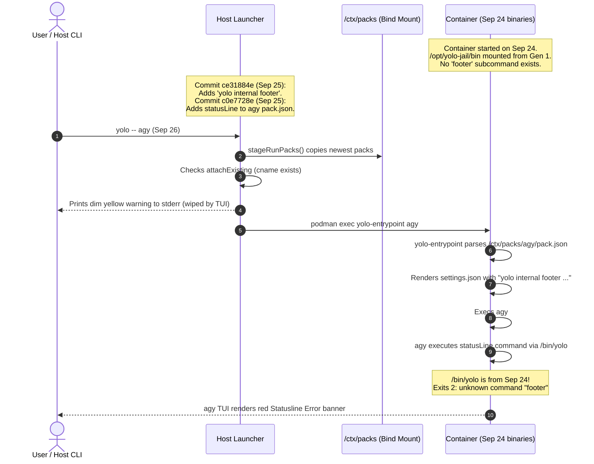
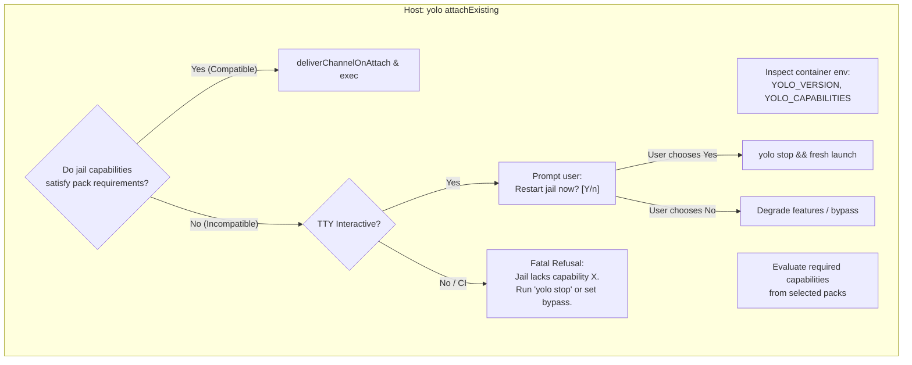

# Why host-jail version skew breaks running sessions — and how to prevent contract drift

**Status:** DESIGN, 2026-09-26. Nothing built. Evidence verified at `7b572b6c`.

> **In short.** When an existing container is attached to after a host update, the
> host re-stages current packs into an immutable prefix whose binaries predate them.
> Replacing the silent, dim attach notice with an explicit capability preflight and
> selective fallback prevents contract drift from bricking live agent sessions.

**Why it matters.** An agent session (like Antigravity or Claude) launched into an
attached container immediately errors on startup — e.g., `unknown command "footer"` —
because the newly rendered settings reference CLI verbs, flags, or daemons that the
container's older mounted binaries do not possess.

**The shape.** A three-layer guard: (1) capability advertising in the container's
inspect environment, (2) a pre-attach capability compatibility check in
[`deliverChannelOnAttach`](../../internal/cli/run/run.go), and
(3) automated remediation (interactive restart prompt in a TTY, loud refusal in CI,
and safe feature degradation in pack rendering).

**Cost.** Breaking attach to a severely outdated jail requires either an interactive
restart confirmation or an explicit bypass hatch (`YOLO_ALLOW_ATTACH_SKEW=1`).

**Start at [§3](#3-the-contract-skew-problem-why-attaching-is-not-a-bare-reconnect)** — how staging
into an immutable prefix creates the gap. The rest falls out of it.

**Needs your ruling:** [OQ-SK1](#OQ-SK1), [OQ-SK2](#OQ-SK2), [OQ-SK3](#OQ-SK3), [OQ-SK4](#OQ-SK4).

**Reads with:** [`attach-skew-and-contract-guardrails-plan.md`](attach-skew-and-contract-guardrails-plan.md) (the companion sketch — incomplete while questions are open),
[`agent-footer.md`](agent-footer.md) (the footer contract whose addition triggered this finding),
[`../reference/image-staging-vs-baking.md`](../reference/image-staging-vs-baking.md) (how mounted prefixes and generations work).

---

## Terms, in plain words

- **Attached jail.** A container that was started during an earlier invocation and
  re-entered via `attachExisting` (`podman exec`) rather than launched fresh.
- **Prefix generation.** An immutable directory
  (`~/.local/share/yolo-jail/flake-bundles/<stamp>/bin/linux-<arch>`) bind-mounted
  into `/opt/yolo-jail/bin` at container creation time.
- **Attach skew.** The state where the host `yolo` binary running an attach is newer
  than the in-jail binaries running inside the container.
- **Contract skew** *(coined here)*. The specific form of attach skew where host-staged
  pack manifests, configuration defaults, or channel deliveries require capabilities
  (`internal/cli` subcommands, entrypoint flags, daemon protocols) that the in-jail
  binaries do not implement.
- **Capability preflight** *(coined here)*. A check performed on the host before
  `podman exec`, comparing the container's advertised capabilities against the
  requirements of the staged packs and entrypoint argv.

---

## 1. The Incident: Anatomy of a statusline failure

On 2026-09-26, launching Antigravity via `yolo -- agy` in an active workspace
(`backplane`) immediately greeted the user with a fatal statusline error:

```
⚠ Statusline Error
  ⎿  ⚠ Statusline error:
     command failed: exit status 2 (stderr: yolo internal: unknown command "footer")
     Full logs at: /home/agent/.gemini/antigravity-cli/log/cli-20260926_104613.log
```

The statusline implementation in [`internal/footer`](../../internal/footer/footer.go)
was completely healthy. In a freshly launched jail, running the exact command
succeeded with code 0:

```console
$ yolo internal footer --agent agy --login 'Google AI subscription' --template 'yolo: {yolo.billing} · {yolo.notch}'
yolo: Google AI subscription · jail
```

### What actually happened

The failure was caused by the intersection of three design choices across two days:



1. **2026-09-24**: Container `yolo-backplane-d78933d7` was started. Its `/opt/yolo-jail/bin`
   mount pinned the Linux binaries from bundle generation G1. At this time, `yolo internal`
   had no `footer` subcommand.
2. **2026-09-25**: Commits [`ce31884e`](../../internal/cli/internal.go)
   and [`c0e7728e`](../../packs/agy/pack.json) landed on the host, adding
   `yolo internal footer` and updating the default statusline across Claude, Antigravity,
   and Copilot. The host ran `just install`, activating generation G2.
3. **2026-09-26**: The user executed `yolo -- agy` in `backplane`.
4. **Attach execution**:
   - The host launcher ran `stageRunPacks(cname)`, copying the **newest** pack manifests
     (G2) from the host into the workspace's `/ctx/packs`.
   - The host identified that container `yolo-backplane-d78933d7` was already running and
     diverted to [`attachExisting`](../../internal/cli/run/run.go).
   - It printed a single dim yellow line on stderr:
     `⚠ This jail runs yolo 0.10.0+...; this launcher is 0.10.0+483...`
   - It invoked `podman exec ... /opt/yolo-jail/bin/yolo-entrypoint agy`.
5. **In-jail execution**:
   - The container's `yolo-entrypoint` re-rendered `~/.gemini/antigravity-cli/settings.json`,
     faithfully writing the new `statusLine` default declared in `/ctx/packs/agy/pack.json`.
   - `yolo-entrypoint` exec'd `agy`.
   - `agy` immediately initialized its alternate-screen terminal (erasing the host's dim
     stderr warning).
   - `agy` executed the configured command:
     `yolo internal footer --agent agy --login 'Google AI subscription' ...`
   - The in-jail `/bin/yolo` binary — frozen at G1 — did not recognize `footer` and
     exited with status 2: `yolo internal: unknown command "footer"`.

---

## 2. Why existing skew controls failed

The repository already maintains several gates against version skew. None of them
caught or prevented this breakage:

| Gate | Where it lives | What it compares | Why it was blind to this incident |
| :--- | :--- | :--- | :--- |
| **`SourceSkew`** | [`internal/version/srcskew.go`](../../internal/version/srcskew.go) | Host binary vs source tree | Only runs when developing against a live git checkout (`YOLO_REPO_ROOT`). The host was running an installed binary against a distinct workspace. |
| **`ImageSkew`** | [`integration/imageskew_test.go`](../../integration/imageskew_test.go) | OCI base image hash vs nix eval | Guards the base NixOS layer (packages, glibc, systemd-free init). The prefix `/opt/yolo-jail` is mounted, not baked in the image. |
| **`AttachSkew`** | [`internal/cli/run/attachskew.go`](../../internal/cli/run/attachskew.go) | Host binary version vs container's baked `YOLO_VERSION` | By design ([`39b7b7a7`](../../internal/cli/run/attachskew.go)), it is **informational only** ("ONE DIM LINE, never a refusal"). Furthermore, printing to stderr before a full-screen curses/TUI exec is completely invisible. |
| **`ChannelDelivery`** | [`internal/cli/run/run.go:1907`](../../internal/cli/run/run.go) | Profile/provider environment against container's frozen `YOLO_PROVIDERS` | Checks only credential pointer collisions and un-hydrated provider keys. Does not inspect CLI subcommands or pack capabilities. |

The crucial flaw in [`attachskew.go`](../../internal/cli/run/attachskew.go)
was the premise that *any* version difference between host and jail is benign enough
to ignore:

> *"The overwhelmingly common case is a maintainer who installs several times a day
> and whose jails are hours older than the launcher; refusing that, or shouting about it,
> would make the honest outcome (the jail still works) feel like a failure."*

That premise holds when a commit changes documentation, refactors internal Go helpers,
or tweaks CLI formatting. **It fails catastrophically when a new contract is staged
into a running jail whose binaries do not support it.**

---

## 3. The Contract Skew problem: Why attaching is not a bare reconnect

In simple container systems, "attaching" is merely opening a pty to a running shell.
In `yolo`, however, **an attach is an entry event**:

```
Host Run()
  ├── stageRunPacks()         <-- Writes latest host packs to /ctx/packs
  ├── deliverChannelOnAttach() <-- Writes latest profile env to yolo-user-env.sh
  └── podman exec yolo-entrypoint
        ├── prism.Render()    <-- Re-renders agent config from /ctx/packs!
        └── exec <agent>      <-- Executes agent against FROZEN /opt/yolo-jail/bin
```

Because an attach re-provisions agent configurations using the **host's current packs**,
the host is actively pushing new expectations into an environment whose engine is
frozen in the past.

### The prefix immutability invariant

Could we simply update the container's mounted `/opt/yolo-jail/bin` directory on the host?

**No.** The entire flake-bundle generation mechanism exists because bind mounts pin
an **inode**, not a directory path:
1. `just install` stages into `flake-bundles/<stamp>/` and atomically updates the
   symlink `flake-bundle`.
2. A running container has an open mount to `<stamp1>/bin/linux-<arch>`.
3. If the host were to restage or mutate `<stamp1>` in place, running processes (including
   PID 1 / `yolo-entrypoint`) would crash with `ETXTBSY` or execute corrupted binary segments.

Therefore, **a running container's `/opt/yolo-jail/bin` is immutable by physical necessity.**
Any solution must respect that the container's binaries cannot change without restarting
the container.

---

## 4. The Architecture of Contract Guardrails

To prevent contract skew while preserving the frictionless maintainer workflow for
minor commits, yolo requires three architectural layers:



### Layer 1: Capability Advertising

Instead of treating `YOLO_VERSION` as an opaque string, `yolo` must track concrete
contract capabilities.

A jail's capabilities are determined at container creation and baked into its environment
(e.g., in `commonEnvBlock` in [`internal/cli/run/assemble.go`](../../internal/cli/run/assemble.go)):

```bash
YOLO_VERSION=0.10.0+483.g74d830f2
YOLO_CAPABILITIES=internal-footer,wirebridge-sigv4,channel-v2
```

For backwards compatibility with existing running containers that lack `YOLO_CAPABILITIES`,
the host launcher infers capabilities from `YOLO_VERSION` using a historical capability
matrix (e.g. `version >= 0.10.0+480` implies `internal-footer`).

### Layer 2: Pack and Surface Capability Requirements

When a pack manifest or internal surface introduces a dependency on a yolo binary feature,
it declares what capability it requires.

For example, in [`packs/agy/pack.json`](../../packs/agy/pack.json):

```jsonc
{
  "name": "agy",
  "contributes": [
    {
      "kind": "config",
      "config": [
        {
          "name": "settings",
          "path": "~/.gemini/antigravity-cli/settings.json",
          "defaults": {
            "statusLine": {
              "command": "yolo internal footer --agent agy ...",
              "type": "command"
            }
          },
          "requires_capabilities": ["internal-footer"]
        }
      ]
    }
  ]
}
```

### Layer 3: Pre-Attach Capability Gate

During [`attachExisting`](../../internal/cli/run/run.go), before
`stageRunPacks` or `deliverChannelOnAttach` modifies live configuration, the host compares
the container's capabilities against the requirements of the selected packs:

```go
func (o *Options) verifyAttachCapabilities(envLines []string, staged stagedPacks) (missing []string, ok bool)
```

If `missing` is empty, attach proceeds with zero friction.
If `missing` contains required capabilities, yolo halts the blind execution and initiates
remediation.

---

## 5. Remediation: What happens when skew is detected

When an attach encounters a contract mismatch, yolo must not silently proceed into a crash.
The response depends on the session context:

### 1. Interactive TTY (Developer at terminal)

If `o.IsTTYStdin() && o.IsTTYStdout()`, yolo presents an immediate, actionable prompt:

```text
⚠ This jail was started with yolo 0.10.0+470 and lacks capabilities: [internal-footer].
  The current host packs require these capabilities. Running without them will cause
  agent status lines or tools to fail.

Restart jail in this workspace now? [Y/n] 
```

- If the user confirms (`Y` or enter): yolo executes `stopJail(cname)` and seamlessly
  falls through to a fresh launch (`runContainer`). The entire transition takes ~1.5s,
  mounts the current prefix generation, and boots the agent cleanly.
- If the user declines (`n`): yolo logs a persistent warning and either degrades
  unsupported pack contributions ([OQ-SK3](#OQ-SK3)) or runs with
  `YOLO_ALLOW_ATTACH_SKEW=1`.

### 2. Non-interactive or Headless (CI, scripts, IDE background tasks)

If running without a terminal, prompting is impossible. To prevent confusing downstream
crashes, yolo exits with status 1 and prints an explicit error:

```text
Cannot attach to jail 'yolo-backplane-d78933d7': container binary skew detected.
  Container runs:  0.10.0+470 (lacks: internal-footer)
  Host launcher:   0.10.0+483
Run 'yolo stop' in this workspace to update the jail binaries,
or pass YOLO_ALLOW_ATTACH_SKEW=1 to ignore this check.
```

### 3. In-Session Visibility

To ensure the user is not blindsided even when skew is tolerated (e.g. via escape hatch),
skew must not be reported solely on ephemeral pre-exec stderr.

The entrypoint injects a persistent skew indicator into:
- The agent briefing (`AGENTS.md` / system prompt instructions), warning the agent that
  the sandbox binaries are outdated.
- The in-jail footer segment (if footer is supported): `yolo: Google AI · jail (skewed)`.

---

## 6. Non-Goals

- **No live binary mutation of running containers.** We will not attempt to mutate or
  re-bind files under `/opt/yolo-jail/bin` inside a live container. That reintroduces
  the `ETXTBSY` / bricked PID 1 flaw generations were invented to eliminate.
- **No re-baking yolo into container images.** The mounted prefix architecture saves
  ~2.7 GB of layer pushes per Go commit. We will not compromise that build-speed win
  to fix attach skew.
- **No fatal refusals on cosmetic commit drift.** If the host is commit `ABC` and the
  jail is commit `ABB`, but neither contract nor capabilities changed, attach must
  continue to succeed without user interruption.

---

## 7. Alternatives Considered

### Alternative 1: Freeze `/ctx/packs` for the life of the container
- *Concept:* Only stage packs on container creation; do not update `/ctx/packs` on attach.
- *Verdict:* **Rejected.** Attaching is explicitly how users apply changes to `yolo-jail.jsonc`,
  switch profiles (`yolo -p <name>`), or receive skill edits. Freezing packs would mean
  any config change requires an explicit container destruction.

### Alternative 2: Defensive shell wrappers around all pack commands
- *Concept:* Require every pack command to be wrapped in shell error suppression:
  `command -v yolo >/dev/null && yolo internal footer ... || true`.
- *Verdict:* **Rejected as a complete solution.** While good practice for status lines,
  silent suppression conceals real configuration breakages, does not help if an agent
  actively relies on the tool, and fails completely when the skew touches entrypoint
  flags or daemon protocols.

### Alternative 3: Unconditional fatal refusal on any version mismatch
- *Concept:* Treat attach skew exactly like `SourceSkew`: if `baked != host`, fail immediately.
- *Verdict:* **Rejected.** Maintainers running `just install` multiple times a day across
  a dozen workspaces would have their long-running background tasks killed constantly.
  The gate must distinguish benign commit drift from breaking contract changes.

---

## Open Questions

1. 💬 **OQ-SK1: Disposition on Incompatible Contract Skew.**
   When `yolo` attaches to an existing running jail whose binaries lack a capability
   required by the host's current packs, what should the default behavior be?

   <!-- vantage: oq id=OQ-SK1 leaning="Interactive restart prompt in TTY, fatal refusal in non-interactive/CI. Preserves flow for humans while preventing silent corruption in automated pipelines." -->

   _Leaning:_ Interactive restart prompt in TTY (`Restart jail now? [Y/n]`), fatal refusal
   in non-interactive/CI unless `YOLO_ALLOW_ATTACH_SKEW=1` is passed.

   **Answer:**
   > _(empty — fill in when decided)_

2. 💬 **OQ-SK2: Granularity of Capability Tracking.**
   Should yolo track contract versions as a single monotonic epoch counter
   (`YOLO_CONTRACT_EPOCH=4`), or as discrete feature capability tags
   (`YOLO_CAPABILITIES=internal-footer,wirebridge-sigv4`)?

   <!-- vantage: oq id=OQ-SK2 leaning="Discrete named capability tags. Feature tags allow independent evolution across branches and packs without requiring a single centralized counter." -->

   _Leaning:_ Discrete named capability tags (`internal-footer`, `profile-channel-v2`).
   Tags make requirements explicit in pack manifests and avoid merge collisions on a single
   monotonic number.

   **Answer:**
   > _(empty — fill in when decided)_

3. 💬 **OQ-SK3: Staging Behavior for Unsupported Pack Features.**
   If a user declines to restart an older jail (or passes `YOLO_ALLOW_ATTACH_SKEW=1`),
   should `stageRunPacks` filter out unsupported pack surfaces (e.g. omitting the
   `statusLine` setting that requires `internal-footer`), or write the full configuration
   and allow downstream commands to fail?

   <!-- vantage: oq id=OQ-SK3 leaning="Filter out unsupported features during prism render. Omitting a new statusLine leaves the agent functional with its default UI, whereas writing it guarantees a crash." -->

   _Leaning:_ Filter out unsupported surfaces during prism render when capability is missing.
   Degrading gracefully (e.g., omitting the yolo status line) allows the agent to run
   without crashing.

   **Answer:**
   > _(empty — fill in when decided)_

4. 💬 **OQ-SK4: In-Session Visibility Channel.**
   How should an attached agent session be made aware that it is running in a skewed jail
   when skew is tolerated?

   <!-- vantage: oq id=OQ-SK4 leaning="Briefing injection into AGENTS.md. Ensures both human developers inspecting briefings and agents diagnosing tool issues have visible evidence without relying on pre-exec stderr." -->

   _Leaning:_ Briefing injection into `AGENTS.md`. It survives TUI screen clears and provides
   ground truth to both the agent and developer.

   **Answer:**
   > _(empty — fill in when decided)_
