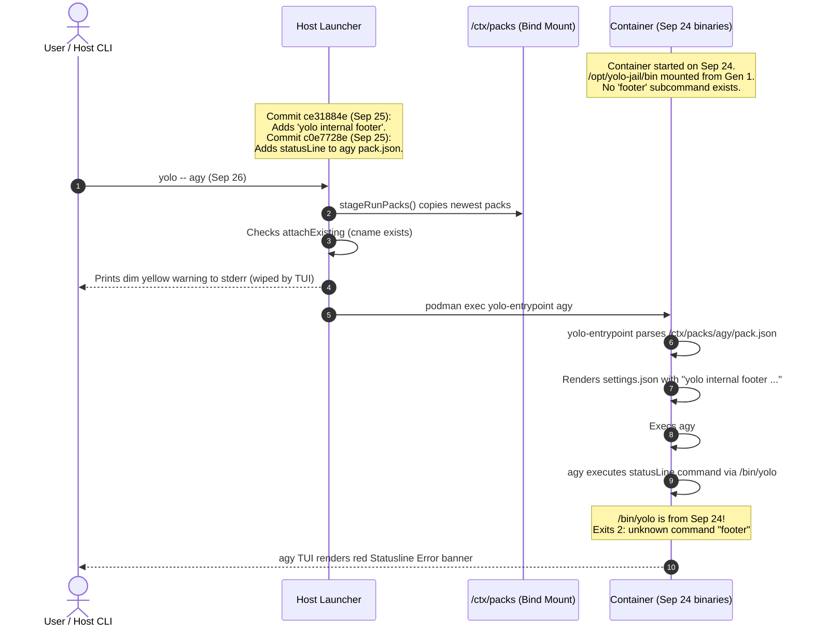
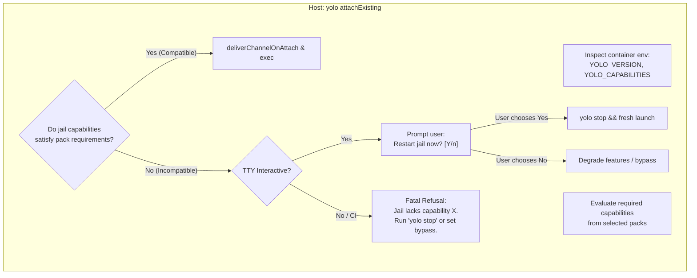

# Why host-jail version skew breaks running sessions — and how to prevent contract drift

**Status:** 2026-09-26. [OQ-SK1](#OQ-SK1)–[OQ-SK3](#OQ-SK3) ruled the same day (never silent: a terminal restart prompt, a refusal elsewhere, one explicit acknowledgment; named tags); [OQ-SK4](#OQ-SK4) was decided on 2026-09-30 as an implementation choice ([SK-D15](#decision-ledger)), and is **built** the same day: an acknowledged attach names the skew in the briefing it refreshes ([what was built](#the-acknowledged-attach-in-the-briefing-2026-09-30)). **The attach gate is built** for the contracts an attach delivers today, the provider/profile channel and the per-agent env files, together with the CI check that decodes the shipped packs with the last release's reader ([what was built](#what-was-built-2026-09-26), [ledger](#decision-ledger)). **Pack-contract skew on attach is CLOSED** by [`OQ-PK2`](../reference/pack-system.md#oq-pk2)'s per-launch pack trees, built the same day: an attach writes into no pack tree, so a jail an older yolo launched never reads a newer yolo's packs, and the release-decode allowlist now cites that guard with a test that pins it ([closed](#pack-contract-skew-closed-2026-09-26)). Layer 2 (pack `requires_capabilities`) is not built, and those trees make it unnecessary. MEASURED on a real podman, against a stand-in older jail: a container named for the workspace whose frozen environment an older launch would have left. Without a terminal the attach refused and counted the live sessions (`TestAttachRefusesAJailThatCannotReceiveTheSelection`). At a real pty, answering `y` stopped the jail, and the same launch started a fresh one carrying the tags and ran the command (`TestAttachRestartsAnOlderJailAtATerminal`). The acknowledgment was unit-tested only until 2026-09-30, when `TestAnAcknowledgedAttachNamesTheSkewInTheBriefing` pinned it against the same stand-in on a real podman ([the briefing section](#the-acknowledged-attach-in-the-briefing-2026-09-30)). MEASURED 2026-10-01 against a jail v0.11.0 itself launched, attached to by this tree's build with no terminal: the plain attach and two profile selections v0.11.0's packs carry went ahead, a selection they cannot carry refused, and its acknowledged twin wrote the skew section into the jail's briefing ([the run](#an-attach-to-a-jail-v0110-launched-2026-10-01)). Evidence verified at `7b572b6c`; [what changed since](#findings-since-filing-2026-09-26) is checked at `7da7993b`.

> **In short.** When an existing container is attached to after a host update, the
> host re-stages current packs into an immutable prefix whose binaries predate them.
> Replacing the silent, dim attach notice with an explicit capability preflight and
> selective fallback prevents contract drift from bricking live agent sessions.

**Why it matters.** An agent session (like Antigravity or Claude) launched into an
attached container immediately errors on startup — e.g., `unknown command "footer"` —
because the newly rendered settings reference CLI verbs, flags, or daemons that the
container's older mounted binaries do not possess.

**The shape.** A three-layer guard:

1. capability advertising in the container's inspect environment;
2. a pre-attach capability compatibility check in
   [`deliverChannelOnAttach`](../../internal/cli/run/run.go);
3. automated remediation (interactive restart prompt in a TTY, loud refusal in CI,
   and safe feature degradation in pack rendering).

**Cost.** Breaking attach to a severely outdated jail requires either an interactive
restart confirmation or an explicit bypass hatch (`YOLO_ALLOW_ATTACH_SKEW=1`).

**Start at [§3](#3-the-contract-skew-problem-why-attaching-is-not-a-bare-reconnect)** — how staging
into an immutable prefix creates the gap. The rest falls out of it.

**Needs your ruling:** nothing. [OQ-SK4](#OQ-SK4) was decided as an implementation choice on 2026-09-30.

**Reads with:** [`attach-skew-and-contract-guardrails-plan.md`](attach-skew-and-contract-guardrails-plan.md) (the companion sketch, now a record of what was built where),
[`agent-footer.md`](agent-footer.md) (the footer contract whose addition triggered this finding),
[`../reference/image-staging-vs-baking.md`](../reference/image-staging-vs-baking.md) (how mounted prefixes and generations work).

---

## Terms, in plain words

- **Attached jail.** A container that was started during an earlier invocation and
  re-entered via `attachExisting` (`podman exec`) rather than launched fresh.
- **Prefix generation.** An immutable directory
  (`~/.local/share/yolo-jail/flake-bundles/<stamp>/bin/linux-<arch>`) bind-mounted
  into `/opt/yolo-jail/bin` at container creation time.
- **Attach skew.** The state where the host `yolo` binary running an attach is newer
  than the in-jail binaries running inside the container.
- **Contract skew** *(coined here)*. The specific form of attach skew where host-staged
  pack manifests, configuration defaults, or channel deliveries require capabilities
  (`internal/cli` subcommands, entrypoint flags, daemon protocols) that the in-jail
  binaries do not implement.
- **Capability preflight** *(coined here)*. A check performed on the host before
  `podman exec`, comparing the container's advertised capabilities against the
  requirements of the staged packs and entrypoint argv.

---

## 1. The Incident: Anatomy of a statusline failure

On 2026-09-26, launching Antigravity via `yolo -- agy` in an active workspace
(`backplane`) immediately greeted the user with a fatal statusline error:

```
⚠ Statusline Error
  ⎿  ⚠ Statusline error:
     command failed: exit status 2 (stderr: yolo internal: unknown command "footer")
     Full logs at: /home/agent/.gemini/antigravity-cli/log/cli-20260926_104613.log
```

The statusline implementation in [`internal/footer`](../../internal/footer/footer.go)
was completely healthy. In a freshly launched jail, running the exact command
succeeded with code 0:

```console
$ yolo internal footer --agent agy --login 'Google AI subscription' --template 'yolo: {yolo.billing} · {yolo.notch}'
yolo: Google AI subscription · jail
```

### What actually happened

The failure was caused by the intersection of three design choices across two days:


```mermaid
sequenceDiagram
    autonumber
    actor User as User / Host CLI
    participant Host as Host Launcher
    participant Staging as /ctx/packs (Bind Mount)
    participant Jail as Container (Sep 24 binaries)

    Note over Jail: Container started on Sep 24.<br/>/opt/yolo-jail/bin mounted from Gen 1.<br/>No 'footer' subcommand exists.
    Note over Host: Commit ce31884e (Sep 25):<br/>Adds 'yolo internal footer'.<br/>Commit c0e7728e (Sep 25):<br/>Adds statusLine to agy pack.json.

    User->>Host: yolo -- agy (Sep 26)
    Host->>Staging: stageRunPacks() copies newest packs
    Host->>Host: Checks attachExisting (cname exists)
    Host-->>User: Prints dim yellow warning to stderr (wiped by TUI)
    Host->>Jail: podman exec yolo-entrypoint agy
    Jail->>Jail: yolo-entrypoint parses /ctx/packs/agy/pack.json
    Jail->>Jail: Renders settings.json with "yolo internal footer ..."
    Jail->>Jail: Execs agy
    Jail->>Jail: agy executes statusLine.command via /bin/yolo
    Note over Jail: /bin/yolo is from Sep 24!<br/>Exits 2: unknown command "footer"
    Jail-->>User: agy TUI renders red Statusline Error banner
```

1. **2026-09-24**: Container `yolo-backplane-d78933d7` was started. Its `/opt/yolo-jail/bin`
   mount pinned the Linux binaries from bundle generation G1. At this time, `yolo internal`
   had no `footer` subcommand.
2. **2026-09-25**: Commits [`ce31884e`](../../internal/cli/internal.go)
   and [`c0e7728e`](../../packs/agy/pack.json) landed on the host, adding
   `yolo internal footer` and updating the default statusline across Claude, Antigravity,
   and Copilot. The host ran `just install`, activating generation G2.
3. **2026-09-26**: The user executed `yolo -- agy` in `backplane`.
4. **Attach execution**:
   - The host launcher ran `stageRunPacks(cname)`, copying the **newest** pack manifests
     (G2) from the host into the workspace's `/ctx/packs`.
   - The host identified that container `yolo-backplane-d78933d7` was already running and
     diverted to [`attachExisting`](../../internal/cli/run/run.go).
   - It printed a single dim yellow line on stderr:
     `⚠ This jail runs yolo 0.10.0+...; this launcher is 0.10.0+483...`
   - It invoked `podman exec ... /opt/yolo-jail/bin/yolo-entrypoint agy`.
5. **In-jail execution**:
   - The container's `yolo-entrypoint` re-rendered `~/.gemini/antigravity-cli/settings.json`,
     faithfully writing the new `statusLine` default declared in `/ctx/packs/agy/pack.json`.
   - `yolo-entrypoint` exec'd `agy`.
   - `agy` immediately initialized its alternate-screen terminal (erasing the host's dim
     stderr warning).
   - `agy` executed the configured command:
     `yolo internal footer --agent agy --login 'Google AI subscription' ...`
   - The in-jail `/bin/yolo` binary — frozen at G1 — did not recognize `footer` and
     exited with status 2: `yolo internal: unknown command "footer"`.

---

## 2. Why existing skew controls failed

The repository already maintains several gates against version skew. None of them
caught or prevented this breakage:

| Gate | Where it lives | What it compares | Why it was blind to this incident |
| :--- | :--- | :--- | :--- |
| **`SourceSkew`** | [`internal/version/srcskew.go`](../../internal/version/srcskew.go) | Host binary vs source tree | Only runs when developing against a live git checkout (`YOLO_REPO_ROOT`). The host was running an installed binary against a distinct workspace. |
| **`ImageSkew`** | [`integration/imageskew_test.go`](../../integration/imageskew_test.go) | OCI base image hash vs nix eval | Guards the base NixOS layer (packages, glibc, systemd-free init). The prefix `/opt/yolo-jail` is mounted, not baked in the image. |
| **`AttachSkew`** | [`internal/cli/run/attachskew.go`](../../internal/cli/run/attachskew.go) | Host binary version vs container's baked `YOLO_VERSION` | By design ([`39b7b7a7`](../../internal/cli/run/attachskew.go)), it is **informational only** ("ONE DIM LINE, never a refusal"). Furthermore, printing to stderr before a full-screen curses/TUI exec is completely invisible. |
| **`ChannelDelivery`** | [`internal/cli/run/run.go:1907`](../../internal/cli/run/run.go) | Profile/provider environment against container's frozen `YOLO_PROVIDERS` | Checks only credential pointer collisions and un-hydrated provider keys. Does not inspect CLI subcommands or pack capabilities. |

The crucial flaw in [`attachskew.go`](../../internal/cli/run/attachskew.go)
was the premise that *any* version difference between host and jail is benign enough
to ignore:

> *"The overwhelmingly common case is a maintainer who installs several times a day
> and whose jails are hours older than the launcher; refusing that, or shouting about it,
> would make the honest outcome (the jail still works) feel like a failure."*

That premise holds when a commit changes documentation, refactors internal Go helpers,
or tweaks CLI formatting. **It fails catastrophically when a new contract is staged
into a running jail whose binaries do not support it.**

---

## 3. The Contract Skew problem: Why attaching is not a bare reconnect

In simple container systems, "attaching" is merely opening a pty to a running shell.
In `yolo`, however, **an attach is an entry event**:

```
Host Run()
  ├── stageRunPacks()         <-- Writes latest host packs to /ctx/packs
  ├── deliverChannelOnAttach() <-- Writes latest profile env to yolo-user-env.sh
  └── podman exec yolo-entrypoint
        ├── prism.Render()    <-- Re-renders agent config from /ctx/packs!
        └── exec <agent>      <-- Executes agent against FROZEN /opt/yolo-jail/bin
```

Because an attach re-provisions agent configurations using the **host's current packs**,
the host is actively pushing new expectations into an environment whose engine is
frozen in the past.

### The prefix immutability invariant

Could we simply update the container's mounted `/opt/yolo-jail/bin` directory on the host?

**No.** The entire flake-bundle generation mechanism exists because bind mounts pin
an **inode**, not a directory path:
1. `just install` stages into `flake-bundles/<stamp>/` and atomically updates the
   symlink `flake-bundle`.
2. A running container has an open mount to `<stamp1>/bin/linux-<arch>`.
3. If the host were to restage or mutate `<stamp1>` in place, running processes (including
   PID 1 / `yolo-entrypoint`) would crash with `ETXTBSY` or execute corrupted binary segments.

Therefore, **a running container's `/opt/yolo-jail/bin` is immutable by physical necessity.**
Any solution must respect that the container's binaries cannot change without restarting
the container.

---

## 4. The Architecture of Contract Guardrails

To prevent contract skew while preserving the frictionless maintainer workflow for
minor commits, yolo requires three architectural layers:


```mermaid
flowchart TD
    subgraph Host["Host: yolo attachExisting"]
        Inspect[Inspect container env:<br/>YOLO_VERSION, YOLO_CAPABILITIES]
        Packs[Evaluate required capabilities<br/>from selected packs]
        Compare{Do jail capabilities<br/>satisfy pack requirements?}
        
        Compare -- Yes (Compatible) --> Deliver[deliverChannelOnAttach & exec]
        Compare -- No (Incompatible) --> ActionGate{TTY Interactive?}
        
        ActionGate -- Yes --> Prompt["Prompt user:<br/>Restart jail now? [Y/n]"]
        ActionGate -- No / CI --> Refuse["Fatal Refusal:<br/>Jail lacks capability X.<br/>Run 'yolo stop' or set bypass."]
        
        Prompt -- User chooses Yes --> Restart[yolo stop && fresh launch]
        Prompt -- User chooses No --> Fallback[Degrade features / bypass]
    end
```

### Layer 1: Capability Advertising

Instead of treating `YOLO_VERSION` as an opaque string, `yolo` must track concrete
contract capabilities.

A jail's capabilities are determined at container creation and baked into its environment
(e.g., in `commonEnvBlock` in [`internal/cli/run/assemble.go`](../../internal/cli/run/assemble.go)):

```bash
YOLO_VERSION=0.10.0+483.g74d830f2
YOLO_CAPABILITIES=internal-footer,wirebridge-sigv4,channel-v2
```

For backwards compatibility with existing running containers that lack `YOLO_CAPABILITIES`,
the host launcher infers capabilities from `YOLO_VERSION` using a historical capability
matrix (e.g. `version >= 0.10.0+480` implies `internal-footer`).

### Layer 2: Pack and Surface Capability Requirements

When a pack manifest or internal surface introduces a dependency on a yolo binary feature,
it declares what capability it requires.

For example, in [`packs/agy/pack.json`](../../packs/agy/pack.json):

```jsonc
{
  "name": "agy",
  "contributes": [
    {
      "kind": "config",
      "config": [
        {
          "name": "settings",
          "path": "~/.gemini/antigravity-cli/settings.json",
          "defaults": {
            "statusLine": {
              "command": "yolo internal footer --agent agy ...",
              "type": "command"
            }
          },
          "requires_capabilities": ["internal-footer"]
        }
      ]
    }
  ]
}
```

### Layer 3: Pre-Attach Capability Gate

During [`attachExisting`](../../internal/cli/run/run.go), before
`stageRunPacks` or `deliverChannelOnAttach` modifies live configuration, the host compares
the container's capabilities against the requirements of the selected packs:

```go
func (o *Options) verifyAttachCapabilities(envLines []string, staged stagedPacks) (missing []string, ok bool)
```

If `missing` is empty, attach proceeds with zero friction.
If `missing` contains required capabilities, yolo halts the blind execution and initiates
remediation.

---

## 5. Remediation: What happens when skew is detected

When an attach encounters a contract mismatch, yolo must not silently proceed into a crash.
The response depends on the session context:

### 1. Interactive TTY (Developer at terminal)

If `o.IsTTYStdin() && o.IsTTYStdout()`, yolo presents an immediate, actionable prompt:

```text
⚠ This jail was started with yolo 0.10.0+470 and lacks capabilities: [internal-footer].
  The current host packs require these capabilities. Running without them will cause
  agent status lines or tools to fail.

Restart jail in this workspace now? [Y/n] 
```

- If the user confirms (`Y` or enter): yolo executes `stopJail(cname)` and seamlessly
  falls through to a fresh launch (`runContainer`). The entire transition takes ~1.5s,
  mounts the current prefix generation, and boots the agent cleanly.
- If the user declines (`n`): yolo logs a persistent warning and either degrades
  unsupported pack contributions ([OQ-SK3](#OQ-SK3)) or runs with
  `YOLO_ALLOW_ATTACH_SKEW=1`.

### 2. Non-interactive or Headless (CI, scripts, IDE background tasks)

If running without a terminal, prompting is impossible. To prevent confusing downstream
crashes, yolo exits with status 1 and prints an explicit error:

```text
Cannot attach to jail 'yolo-backplane-d78933d7': container binary skew detected.
  Container runs:  0.10.0+470 (lacks: internal-footer)
  Host launcher:   0.10.0+483
Run 'yolo stop' in this workspace to update the jail binaries,
or pass YOLO_ALLOW_ATTACH_SKEW=1 to ignore this check.
```

### 3. In-Session Visibility

To ensure the user is not blindsided even when skew is tolerated (e.g. via escape hatch),
skew must not be reported solely on ephemeral pre-exec stderr.

The entrypoint injects a persistent skew indicator into:
- The agent briefing (`AGENTS.md` / system prompt instructions), warning the agent that
  the sandbox binaries are outdated.
- The in-jail footer segment (if footer is supported): `yolo: Google AI · jail (skewed)`.

> [!NOTE]
> **Decided 2026-09-30 ([OQ-SK4](#OQ-SK4), SK-D15): the briefing only**, and built the same day
> ([what was built](#the-acknowledged-attach-in-the-briefing-2026-09-30)). The footer segment is
> dropped, because an old jail's footer runs its own frozen binary and cannot learn a new segment;
> the host-written briefing is the one channel such a session shows.

---

## 6. Non-Goals

- **No live binary mutation of running containers.** We will not attempt to mutate or
  re-bind files under `/opt/yolo-jail/bin` inside a live container. That reintroduces
  the `ETXTBSY` / bricked PID 1 flaw generations were invented to eliminate.
- **No re-baking yolo into container images.** The mounted prefix architecture saves
  ~2.7 GB of layer pushes per Go commit. We will not compromise that build-speed win
  to fix attach skew.
- **No fatal refusals on cosmetic commit drift.** If the host is commit `ABC` and the
  jail is commit `ABB`, but neither contract nor capabilities changed, attach must
  continue to succeed without user interruption.

---

## 7. Alternatives Considered

### Alternative 1: Freeze `/ctx/packs` for the life of the container
- *Concept:* Only stage packs on container creation; do not update `/ctx/packs` on attach.
- *Verdict:* **Rejected.** Attaching is explicitly how users apply changes to `yolo-jail.jsonc`,
  switch profiles (`yolo -p <name>`), or receive skill edits. Freezing packs would mean
  any config change requires an explicit container destruction.
- *Reversed* by the maintainer's [`OQ-PK2`](../reference/pack-system.md#oq-pk2) ruling (c) on
  2026-09-26, and built: a running jail keeps its pack tree, an attach says what differs, and a
  restart picks it up. A profile selection still reaches a running jail on attach, composed over
  the packs that jail has.

### Alternative 2: Defensive shell wrappers around all pack commands
- *Concept:* Require every pack command to be wrapped in shell error suppression:
  `command -v yolo >/dev/null && yolo internal footer ... || true`.
- *Verdict:* **Rejected as a complete solution.** While good practice for status lines,
  silent suppression conceals real configuration breakages, does not help if an agent
  actively relies on the tool, and fails completely when the skew touches entrypoint
  flags or daemon protocols.

### Alternative 3: Unconditional fatal refusal on any version mismatch
- *Concept:* Treat attach skew exactly like `SourceSkew`: if `baked != host`, fail immediately.
- *Verdict:* **Rejected.** Maintainers running `just install` multiple times a day across
  a dozen workspaces would have their long-running background tasks killed constantly.
  The gate must distinguish benign commit drift from breaking contract changes.

---

## Findings since filing (2026-09-26)

Checked against `7da7993b` by three independent readers and by hand; each claim cites where it was read.

- **The live case is a boot failure, not a broken statusline.** Two contracts landed the same day
  that a pre-2026-09-26 jail cannot decode: claude's bedrock provider declares `api_key_env_name`
  as a list ([`OQ-CN1`](../reference/providers.md#oq-cn1); `packs/claude/pack.json`), where
  v0.10.0's `packdecl` declares a string, and pi declares the `unshare_directory` hook, which
  v0.10.0 reports as `unknown hook`. v0.10.0's in-jail loader treats any decode problem as fatal
  (`LoadJailPacks` returns `pack <name>: <problem>`, `internal/entrypoint/packsurfaces.go` at
  v0.10.0), and an attach re-stages the host's packs and re-runs the jail's boot, so an attach to
  such a jail refuses to boot. Reproduced at the decoder level, not in a live container.
- **It still reproduces on podman at `7da7993b`.** Staging runs before the attach decision and
  the attach re-stages by diff-sync ([`pack-system.md`, concurrent launches](../reference/pack-system.md#concurrent-launches-of-one-workspace));
  the entrypoint re-runs the whole boot on attach. Apple Container copies packs only at a fresh
  launch, and macos-user has no attach.
- **A precedent for Layer 1 exists.** The credential gate freezes `YOLO_AGENT_ENV_FILES=1` into
  every container it launches, and an attach reads its absence as "this jail predates the
  per-agent env files" ([`providers.md`'s credential gate](../reference/providers.md#the-credential-gate), CN-D18):
  one named marker per contract, no version matrix, and no hatch.
- **[`OQ-PK2`](../reference/pack-system.md#oq-pk2) is ruled (c)** the same day: one immutable pack
  tree per launch, kept until the jail stops, plus a notice on attach when the configured pack set
  differs. That is [§7](#7-alternatives-considered)'s rejected Alternative 1, and it removes pack-contract skew on attach
  entirely: an attach no longer re-stages.
- **Claims here that are stale or wrong at `7da7993b`:** [§2](#2-why-existing-skew-controls-failed)'s channel check already probes skew
  (twice, since the credential gate); Layer 3's "gate before `stageRunPacks`" cannot be built as
  drawn, since the launch lock now surrounds staging; in-jail filtering (the old [OQ-SK3](#OQ-SK3)
  leaning) cannot protect an old jail, whose tolerant decoder drops unknown fields; the proposed
  capability names collide with the existing `required_capabilities` gate; and the plan cites
  `internal/packdecl/manifest.go`, which does not exist.
- **The v0.10.0 breaks are three, not two** (measured 2026-09-26 by the release-decode test
  below): pi also declares the `shared_directory` hook, which v0.10.0's reader reports as
  `unknown hook` beside `unshare_directory`. And v0.10.0 SKIPS both of wire-bridge's `adapter`
  contributions, an unknown kind to it, without failing: an old jail handed this tree boots with
  no bridge adapters and says so only on its boot's stderr. That is a degraded jail rather than
  a refused one, and per-launch trees close it the same way.

## What was built (2026-09-26)

The gate for what an attach delivers today, and a check on what the next release ships. The
[ledger](#decision-ledger) holds each mechanism choice and why.

- **Contract tags** ("contract tag" is this build's term for the doc's named capability tag,
  chosen because "capability" is already `required_capabilities`' word). Every container launch
  freezes `YOLO_CONTRACT_TAGS=entry-channel,agent-env-files` into its environment
  ([`contracttags.go`](../../internal/cli/run/contracttags.go),
  [`assemble.go`](../../internal/cli/run/assemble.go)). `entry-channel` means the jail's boot
  applies a later entry's provider selection. `agent-env-files` means its launchers source the
  per-agent env files. A jail launched before the tags gets each tag inferred from the marker its
  contract left: the credential gate's `YOLO_AGENT_ENV_FILES=1`, and the absence of a frozen
  `YOLO_PROVIDERS`.
- **The attach computes what it needs.** It needs `entry-channel` whenever it delivers a profile
  selection, and `agent-env-files` whenever the credential gate scoped a value to an agent. A tag
  the jail lacks is resolved in `attachExisting`, before any write:
  - `YOLO_ALLOW_ATTACH_SKEW` set: the attach proceeds, prints on stderr what differs and each
    withheld variable's name, and delivers no part of this entry's channel.
  - A terminal on stdin and stdout: `Restart jail now? [Y/n]`, naming the sessions the stop
    ends (`every session in it (3 running now)` on podman). Yes stops the jail and the launch
    continues as a fresh one; no, or end of input, refuses.
  - Anything else: a refusal naming `yolo stop`, then a launch, and the acknowledgment.

  No other override implies the acknowledgment, which a test pins by setting every other `YOLO_*`
  variable the tree spells, and every override-style `Options` field, such as
  `AcceptConfigChanges`.
- **It replaced two ride-alongs.** The credential gate's CN-D18 arm warned and delivered nothing
  for a config-only selection a pre-gate jail could not receive. The pre-change jail's arm
  ([`OQ-CS6`](../reference/providers.md#oq-cs6)) did the same for a config-side selection a
  frozen `YOLO_PROVIDERS` would beat. Both now take the disposition above, whether or not the
  selection was typed. The plain re-entry into a pre-change jail, with its launch-time selection
  or none, still needs nothing and delivers nothing.
- **The release-decode check.** `TestShippedPacksDecodeUnderTheLastRelease`
  ([`packs/releasedecode_test.go`](../../packs/releasedecode_test.go)) builds the last release
  tag's in-jail reader from `git archive` and decodes this tree's embedded packs with it, the
  way that release's boot does. Every known break is listed with its guard, and an unlisted one
  fails the short suite in CI.

**Not built, and why.** Layer 2's pack `requires_capabilities` would ask each pack contract to be
declared twice, and per-launch pack trees remove the need, since an attach hands an old jail no new
manifest at all.

### Pack-contract skew, closed (2026-09-26)

[`OQ-PK2`](../reference/pack-system.md#oq-pk2) is built (the mechanism and its ledger are there,
in the doc that owns the ruling). Every launch stages a tree of its own and an attach re-stages
nothing, so the boot an attach re-runs in a jail reads the tree that jail booted with. A jail
launched before the change binds the one shared tree every launch used to re-stage, and nothing
writes that tree any more, so a v0.10.0 jail attached to after the next install keeps booting on
the packs v0.10.0 staged. The three release-decode entries now name the test that fails if that
stops being true (`TestAnAttachToAJailTheLastReleaseLaunchedNeverRidesAlong`, which stages
v0.10.0's own packs as that tree), and [SK-D12](#decision-ledger) records the fix that let the
check find it. The attach also stops delivering anything composed from packs the jail does not
have: it composes over the jail's own tree. A selection only the configured packs satisfy, and a
jail tree this build cannot read, take [OQ-SK1](#OQ-SK1)'s disposition like a missing tag: the
restart prompt at a terminal, a refusal elsewhere, the acknowledgment delivering nothing. The
second is every jail v0.10.0 launched with claude, whose manifest declares a hook this build
removed ([`pack-system.md`](../reference/pack-system.md#oq-pk2), items 11 to 13). No contract
tag was added: an attach that writes no pack tree asks nothing of an older jail's binaries.
MEASURED on a real podman: a jail launched with `zai` still saw it at `/ctx/packs` after the config
dropped it and an attach ran, and the attach said so
(`TestAnAttachKeepsThePackTreeTheJailBootedWith`). Still not attached to: a jail an actual older
yolo launched.

### The acknowledged attach in the briefing (2026-09-30)

[OQ-SK4](#OQ-SK4)'s channel, as [SK-D15](#decision-ledger) decided it. An attach that goes ahead
under `YOLO_ALLOW_ATTACH_SKEW` hands the briefing refresh it already runs
(`refreshJailBriefings`) an account of what it acknowledged, and that refresh writes a section near
the top of every briefing the running jail's packs declare, beside the provisioning-failed one:

- the version the jail was launched with, and the attaching yolo's;
- each contract tag the jail lacks, with what a jail without it cannot do;
- every other difference the acknowledgment covered: a pack set the selection cannot be composed
  over, or a profile-served daemon the jail's launch never started;
- what this entry withheld, by name ([SK-D9](#decision-ledger)'s list, never a value);
- the restart that ends the difference, named as the attach's own messages name it, for the agent
  to pass to the user.

Every other entry's refresh writes no section, so it lasts until the next entry into the jail. The
acknowledgment's last stderr line says that the briefing carries it, or why none does: the jail's
packs could not be read (nothing is refreshed then), they declare no briefing, or the jail is on
Apple Container, where a running jail's briefing is the copy its launch made. The mechanism
choices are [SK-D16](#decision-ledger) and [SK-D17](#decision-ledger). The code is
[`attachskewbriefing.go`](../../internal/cli/run/attachskewbriefing.go) and the renderer
[`attachskewsection.go`](../../internal/jailcontent/attachskewsection.go). Pinned for all three
skews through `attachExisting` (`TestAnAcknowledgedAttachNamesItsSkewInTheBriefing`,
`TestAnAcknowledgedAttachNamesAnUnstartedDaemonInTheBriefing`, and the acknowledged cases of
`TestAnAttachWhoseJailLacksTheSelectedPackTakesTheDisposition` and
`TestAnAttachToAJailWhoseTreeWillNotLoadTakesTheDisposition`), and against a real podman by
`TestAnAcknowledgedAttachNamesTheSkewInTheBriefing`, which attaches to the stand-in older jail and
reads the claude briefing staged for it. The section in a jail an actual older yolo launched was
first seen on 2026-10-01 ([below](#an-attach-to-a-jail-v0110-launched-2026-10-01)). Not yet seen:
an agent reading it there.

### An attach to a jail v0.11.0 launched (2026-10-01)

**MEASURED** in nested podman jails, so `--net=host` and `--userns=host` (the two carve-outs in
[AGENTS.md](../../AGENTS.md#testing) do not touch what this reads). The older jail was v0.11.0's
own: its shipped binaries built from `git archive v0.11.0` with `VERSION=v0.11.0
COMMIT=0d1865b8d scripts/build-go.sh`, launched by that `yolo` with `YOLO_REPO_ROOT` naming the
export, so its flake built its own install prefix and image, from a throwaway workspace and an
isolated `HOME` selecting `claude`. Inside it, `YOLO_CONTRACT_TAGS` was
`entry-channel,agent-env-files` and `yolo --version` said `0.11.0`. Every attach was this tree's
`just build-go` binary at `d4e435a3`, from the same workspace and home, with stdin `/dev/null` and
stdout a file, so no terminal:

| Attach | rc | What it said and did |
| :--- | :--- | :--- |
| Plain | 0 | `⚠ This jail runs yolo 0.11.0; this launcher is 0.11.0+996.gd4e435a3d.dirty`, then the [`OQ-PK2`](../reference/pack-system.md#oq-pk2) notice (`added bedrock; changed aws-auth, claude, openai-auth, wire-bridge`). The jail still read v0.11.0's own `/ctx/packs` |
| `-p claude=codex` | 0 | Delivered: the jail's `~/.config/yolo-agent-env/claude.sh` pointed `ANTHROPIC_BASE_URL` at `127.0.0.1:36473`, and the jail's v0.11.0 `wire-bridge` logged `serving provider "openai-codex": anthropic on 127.0.0.1:36473`. The profile is in v0.11.0's own claude pack |
| `-p claude=bedrock` | 0 | Delivered (`Profile bedrock: declared by claude`), from v0.11.0's own claude pack, though this tree moved Bedrock into a pack of its own |
| `-p claude=zai`, `zai` added to the config | 1 | `Refusing to attach: this jail was launched without bedrock, zai, and what this entry selects cannot be composed over the packs it has`, naming `yolo stop`, `(1 running now)` and `YOLO_ALLOW_ATTACH_SKEW=1` |
| The same, with `YOLO_ALLOW_ATTACH_SKEW=1` | 0 | `This entry delivers nothing`, and claude's briefing in the jail opened with `## ⚠ This session runs in a jail that could not take what started it`, naming both versions, the added and changed packs, and `yolo stop` |

So the gate behaves against a real older jail as it does against the stand-in: the older
binaries received a channel this tree composed over their own tree, and the one selection their
tree could not carry took [OQ-SK1](#OQ-SK1)'s refusal. `yolo stop` from this tree then stopped the
jail (`Stopped yolo-ws-22ba5f25`). UNMEASURED: an agent session in the attached jail, and the
restart prompt at a real terminal against this older jail.

Two side effects of the run, neither the gate's. The v0.11.0 launch retagged the nested store's
`localhost/yolo-jail:latest` to its own image, so the next integration run in this jail refused as
a stale image until the tag was put back. And the older launch's host-side front logged `dial
upstream /tmp/yolo-claude-oauth-broker.sock failed: … connection refused` from about a minute after
it started; that socket path is shared by every launch in this jail's `/tmp`, other agents'
included, so the cause was not attributed.

## Open Questions

1. ✅ <a id="OQ-SK1"></a>**OQ-SK1: Disposition on Incompatible Contract Skew.**
   When `yolo` attaches to an existing running jail whose binaries lack a capability
   required by the host's current packs, what should the default behavior be?


   _Leaning:_ Interactive restart prompt in TTY (`Restart jail now? [Y/n]`), fatal refusal
   in non-interactive/CI unless `YOLO_ALLOW_ATTACH_SKEW=1` is passed.

   <!-- vantage: question id=OQ-SK1 -->

   **Answer:**
   > **As leaned, and never silent**, ruled 2026-09-26 in review (*"Interactive restart prompt in
   > TTY, fatal refusal in non-interactive/CI"*) and in conversation (*"it's fine if new jails refuse
   > to launch if we can't make it compatible. that should be always. not crazy to restart jails
   > after an app upgrade"*). An attach that cannot be made compatible never proceeds on its own:
   > in a terminal it asks `Restart jail now? [Y/n]`, and declining refuses; anywhere else it
   > refuses and names the restart (`yolo stop`, then launch again). The restart ends every session
   > in the jail, so the prompt names what it will end. `YOLO_ALLOW_ATTACH_SKEW=1` is the one
   > acknowledgment that proceeds, loudly; no other override implies it (*"if you pass an override
   > flag acknowledging it, that's fine, but it shouldn't just silently ride along, even if there's
   > another similar override flag"*).

2. ✅ <a id="OQ-SK2"></a>**OQ-SK2: Granularity of Capability Tracking.**
   Should yolo track contract versions as a single monotonic epoch counter
   (`YOLO_CONTRACT_EPOCH=4`), or as discrete feature capability tags
   (`YOLO_CAPABILITIES=internal-footer,wirebridge-sigv4`)?


   _Leaning:_ Discrete named capability tags (`internal-footer`, `profile-channel-v2`).
   Tags make requirements explicit in pack manifests and avoid merge collisions on a single
   monotonic number.

   <!-- vantage: question id=OQ-SK2 -->

   **Answer:**
   > **Named capability tags, as leaned**, ruled 2026-09-26 in review: *"Feature tags allow
   > independent evolution across branches and packs without requiring a single centralized
   > counter."* The credential gate's `YOLO_AGENT_ENV_FILES=1` is the first such tag in practice;
   > the tag set folds it in rather than inventing a second spelling.

3. ✅ <a id="OQ-SK3"></a>**OQ-SK3: Staging Behavior for Unsupported Pack Features.**
   If a user declines to restart an older jail (or passes `YOLO_ALLOW_ATTACH_SKEW=1`),
   should `stageRunPacks` filter out unsupported pack surfaces (e.g. omitting the
   `statusLine` setting that requires `internal-footer`), or write the full configuration
   and allow downstream commands to fail?


   _Leaning:_ Filter out unsupported surfaces during prism render when capability is missing.
   Degrading gracefully (e.g., omitting the yolo status line) allows the agent to run
   without crashing.

   <!-- vantage: question id=OQ-SK3 -->

   **Answer:**
   > **Only under the explicit acknowledgment, never silently**, ruled 2026-09-26 in review: *"Is
   > this going to be another case of the running environment differs and we know that it differs,
   > but we're still going to run it anyway? That sounds dangerous. ... if you pass an override flag
   > acknowledging it, that's fine, but it shouldn't just silently ride along, even if there's
   > another similar override flag."* A declined restart refuses ([OQ-SK1](#OQ-SK1)); only
   > `YOLO_ALLOW_ATTACH_SKEW=1` reaches a degraded attach. Any filtering happens on the host, since
   > an old jail's tolerant decoder cannot filter what it does not know ([findings](#findings-since-filing-2026-09-26)),
   > and [`OQ-PK2`](../reference/pack-system.md#oq-pk2)'s per-launch trees keep new pack contracts
   > from reaching a running jail at all.

4. ✅ <a id="OQ-SK4"></a>**OQ-SK4: In-Session Visibility Channel.**
   How should an attached agent session be made aware that it is running in a skewed jail
   when skew is tolerated?


   _Leaning:_ Briefing injection into `AGENTS.md`. It survives TUI screen clears and provides
   ground truth to both the agent and developer.

   <!-- vantage: question id=OQ-SK4 -->

   **Answer:**
   > Decided as an implementation choice (SK-D15, [ledger](#decision-ledger)), reversible: the
   > briefing. An attach that proceeds under `YOLO_ALLOW_ATTACH_SKEW` writes a section into the
   > briefing it already refreshes host-side, naming the version the jail was launched with, the
   > contract tags it lacks and what this attach withheld. [OQ-SK1](#OQ-SK1) and [OQ-SK3](#OQ-SK3)
   > ruled that an acknowledged attach proceeds loudly and never rides along silently, so the only
   > choice left was the channel, and the host-written briefing is the one an old jail's session
   > shows ([findings](#findings-since-filing-2026-09-26)); an old jail's footer is its own frozen
   > binary's and cannot learn a new segment. Recorded 2026-09-30, and built the same day
   > ([what was built](#the-acknowledged-attach-in-the-briefing-2026-09-30)).
   >
   > Live again since [OQ-SK3](#OQ-SK3): an acknowledged attach is a skewed session.

## Decision ledger

The rulings are [OQ-SK1](#OQ-SK1)–[OQ-SK3](#OQ-SK3) above. Each row below is a mechanism choice
made to build them, and none changes what they rule.

| ID | Decision | Date | Built |
| :--- | :--- | :--- | :--- |
| SK-D1 | *Implementation decision.* The tags cross as `YOLO_CONTRACT_TAGS`, comma-separated (`entrypoint.ContractTagsEnv`). The vocabulary, the launch's own set and both halves of the comparison live in [`contracttags.go`](../../internal/cli/run/contracttags.go): assembly freezes the value it returns, and the attach reads it back. Nothing in the jail reads the variable. The first two tags are `entry-channel` and `agent-env-files`. "Contract tag", not "capability", because `required_capabilities` already owns that word ([findings](#findings-since-filing-2026-09-26)). The launch writes its own set because the jail it launches runs binaries built from the same source, which the source-skew gate enforces | 2026-09-26 | ✅ `TestJailContractTags`, `TestEveryTagAnAttachCanNeedIsFrozenByTheLaunch` |
| SK-D2 | *Implementation decision.* A present `YOLO_CONTRACT_TAGS` is authoritative, even empty. A jail without it gets each tag inferred from the marker its contract left: `agent-env-files` from `YOLO_AGENT_ENV_FILES`, which [OQ-SK2](#OQ-SK2)'s answer folded in, and `entry-channel` from the absence of a frozen `YOLO_PROVIDERS`. An inspect that returned nothing proves nothing, and the jail is treated as current, which was the credential gate's rule too. New launches stop writing `YOLO_AGENT_ENV_FILES`, so the tag has one spelling. The cost: an OLDER host attaching to a jail a newer one launched reads that jail as pre-gate and refuses a scoped delivery, which is the safe direction | 2026-09-26 | ✅ `TestJailContractTags`, `TestAttachDeliversWhenNothingItNeedsIsMissing` |
| SK-D3 | *Implementation decision.* An attach needs `entry-channel` whenever it delivers a profile selection, and `agent-env-files` whenever the credential gate scoped any value to an agent. A pre-change jail re-entered with the selection it froze, or with none, needs nothing and is written nothing, because its launch-time delivery stands in for this entry's. That plain re-entry has to stay silent: its first cut refused, and every plain attach of a config carrying `use_profiles` broke (measured 2026-09-05) | 2026-09-26 | ✅ `TestAttachContractNeeds`, `TestAttachToAPreChangeJailWithMatchingSelectionIsSilent` |
| SK-D4 | *Implementation decision.* The pre-change jail's config-side drift arm ([`OQ-CS6`](../reference/providers.md#oq-cs6)) takes the same disposition as the CN-D18 arm ([`provider-credential-scope.md`](provider-credential-scope.md#7-decision-ledger)). It warned and proceeded on the jail's launch-time providers, which is the ride-along [OQ-SK1](#OQ-SK1) forbids. Typed and config-only selections are no longer told apart: both ask in a terminal and refuse elsewhere | 2026-09-26 | ✅ `TestAttachRefusesADifferingSelectionOnAPreChangeJail`, `TestAttachRefusesAPreGateJailItCannotDeliverTo` |
| SK-D5 | *Implementation decision.* The gate sits in `attachExisting`, after the one inspect and the launch line and before anything is written. The launch lock is held through it and released once the attach settles on proceeding, or on a refusal. A restart keeps the lock, and `runContainer` continues into the fresh launch at each of its three attach sites (the first look, the raced re-check, and the stale removal's wait). The lock is what makes the stopped jail's teardown leave its host-services dir to the relaunch (`stopLoopholes`) | 2026-09-26 | ✅ `TestAnAttachReleasesTheLaunchLockBeforeItsSession`, `TestARestartedAttachContinuesAsAFreshLaunch`, `TestEveryAttachSiteKeepsTheRestart` |
| SK-D6 | *Implementation decision.* A restart is the teardown's bounded `stop`, then a wait of up to 15 s for the stopped container's `--rm` removal, then the fresh path's stale removal for a stopped leftover. A container still running refuses the launch with `did not stop` rather than create a second one beside it | 2026-09-26 | ✅ `restartJailForAttach`, pinned by `TestARestartThatCannotStopTheJailRefuses` |
| SK-D7 | *Implementation decision.* The prompt counts sessions as one plus `inspect --format '{{len .ExecIDs}}'`: the launching session and each live exec. A finished exec leaves `ExecIDs` and a running one stays (measured on podman 5.8.6). Any other answer prints `every session in it` with no number. Apple Container's `ExecIDs` has not been measured, so there the prompt names no number. The environment read on Apple Container was wrong as first built and is [SK-D14](#decision-ledger)'s | 2026-09-26 | ✅ `jailSessionCount`, pinned by `TestAttachSkewPromptsARestartInATerminal` |
| SK-D8 | *Implementation decision.* The prompt needs a terminal on stdin and on stdout (`o.IsTTYStdin`, `o.IsTTYStdout`, both `internal/tty`). The answer is read by `tty.Confirm`, a new shared reader that `internal/cli`'s `promptYesNo` now calls too. Enter takes the capital letter, yes. End of input is no, because a closed stdin is not a person accepting the default | 2026-09-26 | ✅ the reader, `tty.Confirm`, pinned by `TestConfirmAnswers`; the prompt, `TestAttachSkewPromptsARestartInATerminal`, `TestAttachSkewDeclinedRefuses` and `TestAttachSkewWithoutATerminalRefuses` |
| SK-D9 | *Implementation decision.* Under the acknowledgment, the host degrades by writing no part of this entry's channel. Writing the shared half alone would strip every scoped credential the jail holds while naming agents as recipients (CN-D18's reasoning). `YOLO_ALLOW_ATTACH_SKEW` counts when set to any non-empty value, as every `YOLO_ALLOW_*` does. The disclosure went to stderr and nowhere else until [SK-D15](#decision-ledger), [OQ-SK4](#OQ-SK4)'s briefing section, which is built | 2026-09-26 | ✅ `TestAttachSkewAcknowledgedProceedsWithoutDelivery` |
| SK-D10 | *Implementation decision.* The prompt and its account go to stdout, as the config-change prompt's do. Refusals and the acknowledgment's disclosure go to stderr, as the credential gate's attach refusals did | 2026-09-26 | ✅ `TestAttachSkewPromptsARestartInATerminal`, `TestAttachSkewWithoutATerminalRefuses` |
| SK-D11 | *Implementation decision.* The release-decode check lives in `packs/` and runs in the short suite, so the pre-commit gate and CI's `check-go` run it. The baseline is `git describe --tags --abbrev=0 --match 'v[0-9]*' HEAD^`, so a release commit is compared with the release before it. The old tree comes from `git archive`, and the probe builds with `GOFLAGS=-mod=vendor GOTOOLCHAIN=local GOPROXY=off`, calling `packload.TolerateSkew` and then `LoadDir`, as every in-jail boot since v0.9.0 has (and, since [SK-D13](#decision-ledger), that boot's surface and overlay passes). HEAD's copies of what it calls are pinned (`TestReleaseDecodeProbeAPIIsStable`). Allowlist entries are keyed by release and carry a guard, plus an optional `pinnedBy` test that must exist. An unlisted break fails, and so does a listed one that no longer occurs. Entries for another release are logged as removable, so the next tag needs no edit. Under GitHub Actions a missing tag fails the check instead of skipping it | 2026-09-26 | ✅ `TestShippedPacksDecodeUnderTheLastRelease` and its allowlist, `knownReleaseBreaks` |
| SK-D12 | *Implementation decision.* Each v0.10.0 entry's `pinnedBy` names the case a jail a release launched is in: first `TestAnAttachToAJailLaunchedBeforePerLaunchTreesLeavesItsSharedTreeAlone`, whose synthetic tree this build can read, and since [SK-D13](#decision-ledger)'s change `TestAnAttachToAJailTheLastReleaseLaunchedNeverRidesAlong`, which stages the last release's own packs (`git archive <tag> packs`) as the shared tree and so takes the path a real v0.10.0 jail does. The same guard for a jail this tree launched is `TestAnAttachWritesNothingIntoTheRunningJailsPackTree`. The check finds the module root from the package directory `go test` runs it in, not from `git rev-parse --show-toplevel`: inside a git hook, which is where the pre-commit gate runs it, git exports `GIT_DIR` without a work tree, and `--show-toplevel` answers `packs/`, so the first pin cited failed the gate while passing from a shell | 2026-09-26 | ✅ the module root, `lastRelease`; each entry's `pinnedBy`, `pinAttachLeavesAnOlderJailsTree`, checked by `TestShippedPacksDecodeUnderTheLastRelease` |
| SK-D13 | *Implementation decision.* The release-decode probe runs the three decode passes the release's boot runs, not only the manifest one: `LoadDir` under `TolerateSkew`, then each pack's `SurfacesForReport` under both postures, then `packoverlay.Collect` over the whole set. A surface field or `mode` value the release does not know stops its boot through `genStep` as surely as a manifest break, and the first cut, which ran only `LoadDir`, passed both. An allowlisted break that `encoding/json` refuses (`json: cannot unmarshal`, `json: unknown field`) stops the old reader before the rest of that document, so such an entry carries a `repair` that puts the field back in the shape the release reads, and the probe decodes a repaired copy again until nothing stops it. Without that, claude's `api_key_env_name` entry covered every other break in claude's manifest. HEAD's copies of the functions and fields the probe reads are pinned in `internal/packload` and `internal/packoverlay` (`TestReleaseDecodeProbeAPIIsStable`), `Pack.SkewNotes` included | 2026-09-26 | ✅ the three passes, `releaseDecodeProbe`, and the repair, `repairManifest`, run by `TestShippedPacksDecodeUnderTheLastRelease` |
| SK-D14 | *Implementation decision.* On Apple Container the attach reads the jail's environment with `container inspect <name>` and no `--format`, from the JSON it answers: `configuration.initProcess.environment`, the payload measured on 2026-09-16 ([`setup-support-gaps.md`](../plans/setup-support-gaps.md) [§5.1](../plans/setup-support-gaps.md#51-what-is-now-measured) row 5), or `config.env`, which `yolo ps` read (`runtime.EnvFromContainerInspectJSON`, which `ps` now shares). The first build sent podman's template to every runtime, so the gate read nothing there and treated every Apple Container jail as current, and an older one received a scoped delivery its launchers never source. Every remedy an attach names on Apple Container was `container stop <name>`, since `yolo stop` said "No jail running" there ([G11](../plans/setup-support-gaps.md)). Since 2026-10-03 it is `yolo stop`, as on every other runtime (`stopRemedy`), because [JL-D79](jail-lifetime-last-session-wins.md#JL-D79) made `yolo stop` end an Apple Container jail, and it waits for the jail's keeper to finish, which a bare `container stop` does not | 2026-09-26 | ✅ `TestTheContractGateReadsAnAppleContainerJail`, `TestEnvFromContainerInspectJSON` |
| SK-D15 | *Implementation decision*, under [OQ-SK1](#OQ-SK1) and [OQ-SK3](#OQ-SK3), deciding [OQ-SK4](#OQ-SK4). **An attach that proceeds under `YOLO_ALLOW_ATTACH_SKEW` also discloses the skew in the briefing**: `refreshJailBriefings`, which every attach already runs host-side with inode-preserving writes into the running jail's staging, adds a section naming the version the jail was launched with, the contract tags it lacks, and the variables this attach withheld (SK-D9's list). Each acknowledged attach writes it; an attach that needs no missing tag writes none. **Why:** the rulings make an acknowledged attach loud and never silent, and stderr scrolls away before the agent starts; the briefing survives screen clears and is read by the agent and a human alike. It is the one channel an old jail's session shows, because the host writes it; the footer segment [§5](#5-remediation-what-happens-when-skew-is-detected)'s third part names is not used, since an old jail's footer runs its own frozen binary. A jail whose packs declare no briefing destination has only the stderr line, and the disclosure says so. Reversible: one section in one composer | 2026-09-30 | ✅ `attachSkewBriefing`, `attachSkewSection`; `TestAnAcknowledgedAttachNamesItsSkewInTheBriefing`, `TestTheAttachSkewSectionIsAnAcknowledgedAttachsAlone`, `TestAnAcknowledgedAttachNamesTheSkewInTheBriefing` (integration) |
| SK-D16 | *Implementation decision*, building [SK-D15](#decision-ledger). **Every skew the acknowledgment covers reaches the section, not only a missing contract tag**: a pack set the selection cannot be composed over and a profile-served daemon the jail's launch never started take the same acknowledgment, withhold the same channel, and leave the session as short of what it selected. So the skew each arm of `attachExisting` settles keeps its account unrendered beside its stderr lines (`attachSkew.missing`, `attachSkew.differences`), and the one that was acknowledged is handed to the refresh through `Options.attachSkewNotice`, set just before `refreshJailBriefings` and cleared after it, the way the durable dir crosses, so no other briefing can carry it. At most one per attach: the first acknowledgment withholds the whole channel and nothing after it asks again. The section sits near the top, beside the provisioning-failed one, since both say the environment is not what it should be; it names the restart as the attach's own messages do (`stopRemedy`) and tells the agent to pass it on, because the agent cannot run a host command | 2026-09-30 | ✅ `TestAnAcknowledgedAttachNamesAnUnstartedDaemonInTheBriefing`, the acknowledged case of `TestAnAttachWhoseJailLacksTheSelectedPackTakesTheDisposition` |
| SK-D17 | *Implementation decision*, building [SK-D15](#decision-ledger)'s "the disclosure says so". **The acknowledgment's last stderr line, printed once the briefing is refreshed, says whether the briefing carries the difference, and names each case where none does**: packs this yolo could not read (`attachExisting` refreshes nothing then), packs that declare no briefing destination, and an Apple Container jail. The third is not in SK-D15's text and is the same fact: on that backend a launch copies the staged briefing into the jail's home (`acMaterialize` in `assembleRunCmd`), and a re-entry's refresh reaches only the staging, so the briefing a session reads there is its launch's ([`settings-per-setup.md`](../../userguide/reference/settings-per-setup.md), briefings on a `container` re-entry). The positive case is said too, so the account always ends by saying where else it is recorded | 2026-09-30 | ✅ `noteAttachSkewBriefing`; `TestAnAcknowledgedAttachSaysWhenNoBriefingCarriesTheSkew`, the acknowledged case of `TestAnAttachToAJailWhoseTreeWillNotLoadTakesTheDisposition` |
