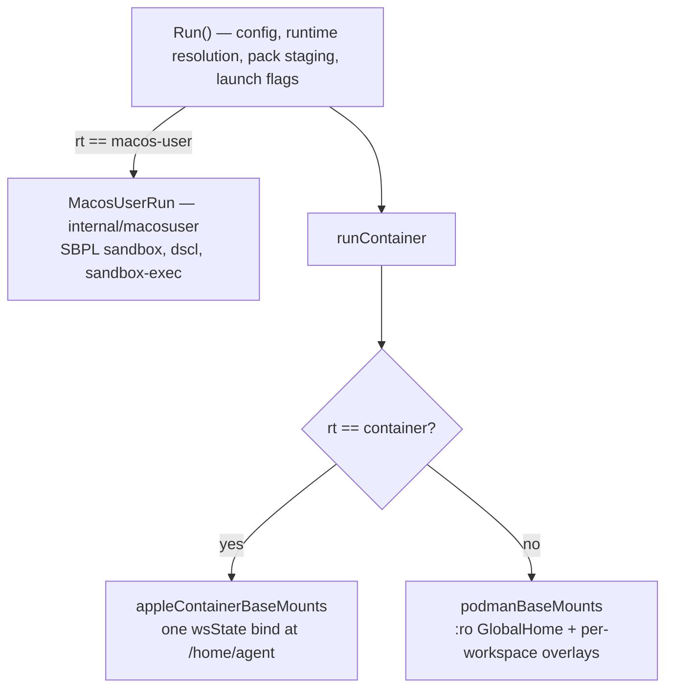

# Three backends, one pipeline, and no census — why a mechanism goes missing quietly

**Status:** DIAGNOSIS + PROPOSAL, 2026-08-24. **Ten fixes are shipped** (§5); the census in
§4 is proposed and unbuilt. Every code claim was verified against the tree on 2026-08-24
unless dated otherwise.

**The short version.** yolo has three backends. `podman` and `container` (Apple Container)
share `runContainer`; `macos-user` returns from `Run()` before it and re-implements a
subset. **Every difference between them is an `if rt == …` branch, and nothing enumerates
what each backend owes.** So a mechanism added to the podman branch is absent elsewhere
with no error, no warning, and — in the worst cases — a launch line or briefing section
asserting it worked. Issue #39 (pack shared dirs never mounted on Apple Container) is one
instance; a sweep found sixteen more.

**The most important section is §3** — the four dispositions. A boolean "does this backend
support X" cannot express the case that made half this audit worth doing: *achieved, but by
a different mechanism*. Get that wrong and the census either flags working code or hides
broken code.

**Reads with:** [`macos-user-nix-and-features.md`](macos-user-nix-and-features.md) (that
backend's own inert-feature inventory, which this generalises),
[`host-render-target.md`](host-render-target.md) (`render.FieldSet` — the same idea one
notch over, and the template §4 copies), [`../guides/macos.md`](../guides/macos.md) (the
user-facing consequence).

---

## 1. The verdict

**Build the census (§4), but do the briefing fix (§6) first** — it is smaller and it closes
the sub-class the census structurally cannot reach.

Three claims, argued below:

1. **This is one defect class, not seventeen bugs.** Every instance has the same shape and
   the same cause: backend differences are expressed as scattered conditionals, and no
   artifact says what a backend owes.
2. **A census makes the SILENT half unrepresentable** — but only the silent half. It cannot
   catch a mechanism that emits an argv the backend then fails to execute, which is exactly
   what the two most serious findings were.
3. **The expensive part is already done.** The census's ~35 non-trivial cells are decided;
   the sweep's per-finding reasoning is the cell text.

---

## 2. What exists today, stated precisely

Two structural facts do all the damage:

**F1. `macos-user` returns before `runContainer`.** Anything living there is absent unless
`internal/macosuser` rebuilds it. That is not a bug in itself — it is how a non-container
backend must work — but nothing lists what was left behind. Pack staging (B-0), the
config-change approval gate, launch flags and the inert-loophole report have each been
hoisted above the dispatch *after* being found missing, one at a time, by a human noticing.

**F2. Apple Container shares the pipeline but not the mount model.** It binds all of
`wsState` at `/home/agent` in one mount (a device-count workaround) instead of podman's
`:ro` GlobalHome base plus per-workspace overlays. That single bind silently *satisfies*
some mechanisms and silently *defeats* others, and the difference is not obvious from the
call site — which is precisely why #39 shipped.

> [!IMPORTANT]
> **The tell that separates them, and the sentence I wish had been in the code:** ask which
> SIDE of the podman mount the argv reads from. `wsState` → the AC bind already covers it.
> `paths.GlobalHome()` → it does not, because that is a different directory and no bind on
> that backend reaches it. `appleContainerBaseMounts` had reasoned this out correctly for
> per-workspace dirs and never asked the question about the machine-wide ones.

---

## 3. The four dispositions — the most important section

A mechanism on a backend is in exactly one of these states. **Three is not enough.**

| Disposition | Meaning | Example |
| :--- | :--- | :--- |
| **Honored** | works, by the same mechanism | `network.ports` on Apple Container |
| **HonoredBy** | works, by a *different* mechanism — which must be named | pack `state` scope:workspace on AC: the single wsState bind already puts it in the per-workspace tier |
| **Warned** | absent, and the launch says so | `cache_relocations` on Apple Container |
| **Refused** | the launch refuses and names the key | *(none today — see §7)* |

**`HonoredBy` is the load-bearing one.** Of 42 candidate silent drops, **11 were refuted**
— every one because the backend reached the same outcome another way. A boolean census
would have flagged all eleven as gaps, and a census that cries wolf eleven times out of
forty-two gets switched off in a week.

> [!WARNING]
> **The `HonoredBy` reason is not documentation, it is the check.** "Apple Container mounts
> wsState whole, so declared writable dirs are already writable" is *true* and was *also*
> the reasoning that hid #39 — because the same sentence is false for the machine-wide
> tier and nobody re-asked it per tier. A `HonoredBy` cell must name the mechanism, so the
> next reader can ask whether that mechanism covers *their* case rather than inheriting a
> conclusion.

---

## 4. The proposal — a backend census, sibling to `render.FieldSet`

`render.FieldSet` already does this **per notch** (jail / guest / host): a kind absent from
the set produces a refusal that names it, *"rather than a silent skip — the silent skip is
the failure mode G3 shipped, a backend rendering zero surfaces every launch with nothing in
the output to say so"* (`internal/render/fieldset.go`). That is this bug, described a year
early, one axis over.

It must be a **sibling, not an extension**: `FieldSet` is deliberately platform-blind
(`internal/render/confinement.go` says so, and warns that adding a platform re-opens D2).

**Shape.** A new leaf package both `run` and `macosuser` can import, mapping
`(backend, vocab) → Cell{Disposition, Reason}`, where the vocabulary is the union of two
**already-closed** sets:

- `packdecl.KnownKinds()` — closed, and already exhaustiveness-tested by
  `TestDisclosureClassifiesEveryKnownKind`.
- `config.knownTopLevelConfigKeys` — the nearest precedent is `internal/config/inherit.go`,
  which already maintains a per-key classification table *with a drift test*. Extend that
  shape rather than inventing one.

**Two call sites, both of which already exist** and are already the "what will this launch
not do for you" surface: the macos-user notice block in `run.go`, and the
`cache_relocations` skip in `appleContainerBaseMounts`. The ~15 warn strings the sweep
produced become census data instead of fifteen scattered `if`s.

**Cost, honestly.** ~3 backends × (15 kinds + ~30 keys) ≈ 135 cells, of which only ~35 are
non-`Honored` and need prose. The *deciding* is the expensive part and the sweep already did
it. Call it 2–3 days including the exhaustiveness test.

**What the census would NOT cover — four things, and they are why it is not a silver bullet:**

1. **Correctness of an honored mechanism.** `reads-host` on AC *did* emit an argv; the
   census would mark it Honored and be wrong, because the backend cannot execute that argv.
   A census prevents SILENT; it cannot prevent WRONG. **The two most serious findings in the
   whole sweep were this shape.**
2. **Sub-mechanism drops inside an honored parent** — `resources.pids_limit` on AC while
   memory and cpus are emitted; `network.ports` honored but its DNAT fixup podman-only. The
   vocabulary is per-key; these are per-sub-key.
3. **Anything needing a Mac.** Whether Apple Container *drops* or *errors* on a single-file
   bind is unknowable from here, and it decides whether §5's two P0 fixes were preventing
   silent loss or a useless error message.
4. **The affirmative lies** — §6.

---

## 5. What is already fixed (2026-08-24)

| # | Defect | Backend | Fix | Commit |
| :--- | :--- | :--- | :--- | :--- |
| 1 | Pack machine-wide `state` dirs never mounted — cross-jail credential sharing degraded to per-workspace | AC | mount from GlobalHome | `3e2cde0c` |
| 2 | …and the fix shadows the stranded copy | AC | copy-if-missing rescue | `db2e096c` |
| 3 | `reads-host` grants never crossed, while the launch asserted they did | AC | materialize + `YOLO_CTX_ROOT` | `e3c995b6` |
| 4 | `host_files` file sources MASKED by an empty 0o444 file | AC | same seam | `c22e25b5` |
| 5 | Pack `launch` flags never applied | macos-user | hoist above the dispatch | `dc1349a6` |
| 6 | Inert loopholes never reported | macos-user | second call site | `35448719` |
| 7 | Config-declared loopholes never reported | AC + macos-user | report both sources | `6a53a2a3` |
| 8 | Briefing advertised loopholes that never started | AC + macos-user | backend gate | `a639394d` |
| 9 | `resources`, `cache_relocations`, machine-wide workspace state | macos-user | warn | `8ab03d2e` |
| 10 | Explicit `network.mode: host` silently worse than the default | AC | warn | `8ab03d2e` |

**The parity test** (`e8ba7d16`) pins the narrow invariant the census would generalise:
every mount whose host side is under the machine-wide store and whose container side nests
below `/home/agent` must be emitted by both container backends. A **diff of the two
backends' own argvs**, not an expected list — the failure mode is an *absent* mount, and
absence is invisible to a list you also forgot to update.

### 5.1 Confirmed drops I deliberately did NOT warn about

Seven of the seventeen are real and left silent on purpose, because **ten new launch lines is
already the number OQ-BP-3 asks about**, and warning about a drop whose absence is the correct
outcome trains the reader to skip the ones that matter.

| Mechanism | Backend | Why no warning |
| :--- | :--- | :--- |
| pack `env` contributions | macos-user | The only shipped one is `audio`'s `PULSE_SERVER` / `PIPEWIRE_REMOTE`, pointing at sockets that do not exist there. **Setting them would be worse than dropping them**, and the inert-loophole line for `audio` already fires. A third-party pack declaring `env` is a genuine silent drop — revisit when one exists |
| `resources.pids_limit` | AC | memory and cpus ARE emitted; a per-sub-key warning inside an honored parent is exactly the noise §4's residue 2 describes |
| `ephemeral_storage` | AC | Scratch is always `--tmpfs` there. Recorded as the repo's own position in `config_ref.txt` and unverified on hardware |
| config `mounts` | AC | A deliberate DECLINE to hand out a writable `/ctx` given apple/container#889 — not an oversight, and already documented |
| `gpu`, `kvm` | macos-user | Commonly set in a config shared with a Linux box; podman-on-macOS and AC both merely warn, and making the native backend stricter than its siblings buys no safety |
| `confinement` | macos-user | Needs a refusal in the run pipeline rather than a warning, and refusing a key on one platform of a shared config is the trap `config/inherit.go` already documents |

**Every one of these belongs in the census as a `Warned` or `HonoredBy` cell with this reason
attached** — which is the argument for building it. A table can hold seven quiet rows; a launch
cannot hold seven quiet lines.

> [!NOTE]
> **None of the Apple Container or macos-user fixes are verified on hardware.** Every one is
> unit-tested and mutation-checked; none has run on a Mac. AGENTS.md's nested-jail carve-out
> applies with extra force here — podman-in-podman cannot exercise either backend at all.

---

## 6. The second shared fix: compose the briefing from what was APPLIED

Smaller than the census, and it kills a sub-class the census cannot touch.

`refreshJailBriefings` took the runtime and **discarded it** — `_ = rt` — while every
`BriefingInput` field was read straight from the config map. So the briefing describes what
was *configured*, not what was *applied*, and on a non-podman backend it says things that
are false:

- `network.mode: host` → *"localhost resolves directly to the host"* where no `--net` was
  emitted;
- `resources` → *"kernel-enforced"* where the flag was never passed;
- loopholes → a section headed *"host capabilities wired into this jail"* listing daemons
  that never started.

The third is fixed (`a639394d`); the first two are live. **The real fix is to feed
`BriefingContent` from what `assembleRunCmd` actually emitted** — it already computes all of
it — which makes the class unrepresentable rather than fixed case by case.

**Why this outranks the census in sequencing:** an absent capability is a jail that is
missing something. A false briefing is a jail that **told the agent something untrue**, and
an agent plans around it.

---

## 7. What this does NOT propose

- **Not a refusal.** No backend should start refusing a config key it has always tolerated.
  A shared config is legitimately used on a Linux box and a Mac — the reasoning
  `internal/config/inherit.go` already applies to `runtime`. `Refused` exists in the
  vocabulary for completeness and has no members today.
- **Not per-workspace homes on macos-user.** The single shared home is load-bearing: it *is*
  that backend's shared-credentials mechanism. Splitting it breaks the machine tier to fix
  the workspace tier, and would have to restore both explicitly.
- **Not enforcing `resources` on macos-user.** `RLIMIT_AS` is not what `--memory` means and
  `RLIMIT_NPROC` is per-user, so it would collide across concurrent sessions on the shared
  account. A cap a user believes in but that does not hold is worse than a documented
  absence.
- **Not reimplementing volumes, cgroups, or mount namespaces** on backends that lack them.
  The goal is that a setting stops lying, not that every backend grows every feature.
- **Not a doc.** `macos-user-nix-and-features.md`'s matrix should eventually be *generated*
  from the census rather than maintained beside it — it has already drifted once.

---

## Open Questions

1. 💬 **OQ-BP-1: Is the census worth 2–3 days, given it cannot catch the two worst findings?**
   §4's residue is real: the P0s in §5 (`reads-host`, `host_files`) emitted an argv and were
   *wrong*, not silent, and a census marks both Honored. What it buys is that the other
   fifteen become unwritable.

   _Leaning:_ **Yes, but after §6.** The class has now produced seventeen instances and each
   was found by a human noticing. The census converts that into a compile-or-test-time
   answer, and the deciding work is already done. But if only one thing gets built, build §6.

   **Answer:**
   > _(empty — fill in when decided)_

2. 💬 **OQ-BP-2: Do briefings and skills get DELIVERED to macos-user, or stay a documented absence?**
   Today the agent starts there with no AGENTS.md, no CLAUDE.md and no skills — including the
   built-in suite — while the blocked-tool shims *are* generated, so `grep -r` exits 127 with
   nothing explaining it. Warned as of `6a53a2a3`. A fix means composing above the dispatch
   and delivering by copy into the sandbox home, which is a real delivery mechanism.

   _Leaning:_ **Deliver it.** This is the largest capability gap on that backend and the
   recipe is known (`StagePackCommands` already has the right replace-by-rename semantics).
   The reason it is not already done is that it writes into a shared root as another user and
   nobody here can test it on hardware — which argues for landing it *with* a Mac session,
   not for leaving it.

   **Answer:**
   > _(empty — fill in when decided)_

3. 💬 **OQ-BP-3: Does a `Warned` disposition need to be suppressible?**
   Ten new launch lines exist as of today. A user on macos-user who has read them once may
   not want them every launch, and a warning people learn to skip is worse than none.

   _Leaning:_ **Not yet.** Add the suppression when someone asks, and make it per-key rather
   than global — a blanket "quiet" flag would hide the next silent drop too. But this is a
   judgement about your own tolerance for launch noise, so it is yours.

   **Answer:**
   > _(empty — fill in when decided)_
