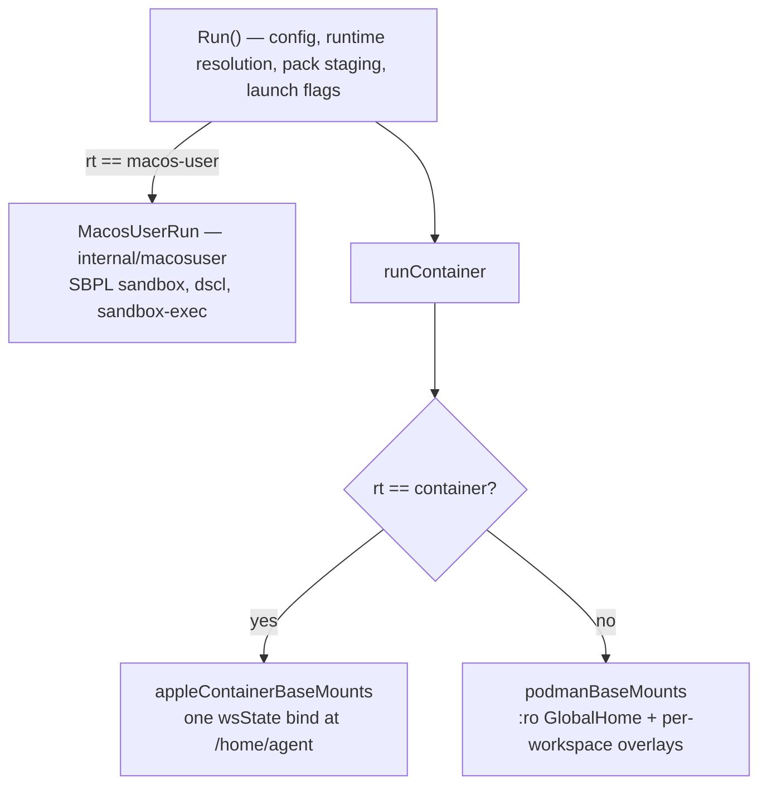

# Three backends, one pipeline, and no census — why a mechanism goes missing quietly

**Status:** DESIGN, 2026-08-24 — a diagnosis and a proposal. **Fourteen fixes are shipped** ([§5](#5-what-is-already-fixed-2026-08-24)), and since
2026-09-25 each has a named hardware test or a stated reason for having none, most of them still
unrun ([§5.4](#54-which-test-answers-which-row)); the census
in [§4](#4-the-proposal--a-backend-census-sibling-to-renderfieldset) is unbuilt **as a data structure** and **built as an
enforced annotation** — `internal/cli/run/backendparity_test.go` (2026-09-14) has required a
`// parity: <Disposition> — <reason>` on every runtime-gated line in the run pipeline since,
which is [§4](#4-the-proposal--a-backend-census-sibling-to-renderfieldset)'s vocabulary made
executable without its `Cell` type ([§4.1](#41-what-shipped-instead-the-census-as-an-annotation)).
Every code claim was verified against the tree on 2026-08-24
unless dated otherwise.

**Needs your ruling:** [OQ-BP-1](#OQ-BP-1) (whether the census data structure is worth building), [OQ-BP-3](#OQ-BP-3) (whether a `Warned` disposition needs to be suppressible).

> [!NOTE]
> **2026-09-09: [OQ-BP-2](#decision-ledger) was answered by CODE, not by a ruling** — skills and briefings have been
> delivered to macos-user since 2026-09-03 (`ef0282ab`), on the leaning's own terms, and the
> question sat open for six days describing a gap that no longer existed. Recorded in the
> [Decision Ledger](#decision-ledger); [Open Questions](#open-questions) item 2 has the chain and the smaller warning that
> survives. **Three questions were live that day** — [OQ-BP-1](#OQ-BP-1) (the census), [OQ-BP-3](#OQ-BP-3) (suppressible
> warnings) and [OQ-BP-4](#open-questions) (the Apple Container loophole skip). The census in [§4](#4-the-proposal--a-backend-census-sibling-to-renderfieldset) is
> untouched by this: the fix moved one cell from `Warned` to `HonoredBy`, which is the
> [§3](#3-the-dispositions--the-most-important-section) vocabulary doing exactly what [§4](#4-the-proposal--a-backend-census-sibling-to-renderfieldset) argues it is for.
>
> **Two are live now.** [OQ-BP-4](#decision-ledger) was ruled on 2026-09-14 and
> [OQ-BP-5](#OQ-BP-5), which that ruling opened, was answered by code on 2026-09-15 — the second
> question in this file to be settled by a commit rather than by a decision, which is why the
> [Decision Ledger](#decision-ledger) is the only place to read the current state from.

**The short version.** yolo has three backends. `podman` and `container` (Apple Container)
share `runContainer`; `macos-user` returns from `Run()` before it and re-implements a
subset. **Every difference between them is an `if rt == …` branch, and nothing enumerates
what each backend owes.** So a mechanism added to the podman branch is absent elsewhere
with no error, no warning, and — in the worst cases — a launch line or briefing section
asserting it worked. Issue #39 (pack shared dirs never mounted on Apple Container) is one
instance; a sweep found sixteen more.

**The most important section is [§3](#3-the-dispositions--the-most-important-section)** — the dispositions. A boolean "does this backend
support X" cannot express the case that made half this audit worth doing: *achieved, but by
a different mechanism*. Get that wrong and the census either flags working code or hides
broken code.

**Reads with:** [`macos-user-nix-and-features.md`](../reference/macos-user-nix-and-features.md) (that
backend's own inert-feature inventory, which this generalises),
[`host-render-target.md`](host-render-target.md) (`render.FieldSet` — the same idea one
notch over, and the template [§4](#4-the-proposal--a-backend-census-sibling-to-renderfieldset) copies), [`../guides/macos.md`](../../userguide/guides/macos.md) (the
user-facing consequence).

---

## 1. The verdict

**Build the census ([§4](#4-the-proposal--a-backend-census-sibling-to-renderfieldset)), but do the briefing fix ([§6](#6-the-second-shared-fix-compose-the-briefing-from-what-was-applied)) first** — it is smaller and it closes
the sub-class the census structurally cannot reach. *(Status 2026-09-02: the briefing fix is
DONE — `28ddea11` shipped it the day this verdict was written; see [§6](#6-the-second-shared-fix-compose-the-briefing-from-what-was-applied). The census is the whole
remainder, and it waits on [OQ-BP-1](#OQ-BP-1).)*

Three claims, argued below:

1. **This is one defect class, not twenty-one bugs.** Every instance has the same shape and
   the same cause: backend differences are expressed as scattered conditionals, and no
   artifact says what a backend owes. The count moved from seventeen to twenty-one *after*
   the sweep ended, when a class test written for three known instances failed on a fourth
   ([§5.2](#52-the-rule-that-had-no-home)) — which is the argument in miniature: the sweep found what it looked for, and the
   invariant found what nobody had.
2. **A census makes the SILENT half unrepresentable** — but only the silent half. It cannot
   catch a mechanism that emits an argv the backend then fails to execute, which is exactly
   what the two most serious findings were.
3. **The expensive part is already done.** The census's ~35 non-trivial cells are decided;
   the sweep's per-finding reasoning is the cell text.

---

## 2. What exists today, stated precisely

Two structural facts do all the damage:

**F1. `macos-user` returns before `runContainer`.** Anything living there is absent unless
`internal/macosuser` rebuilds it. That is not a bug in itself — it is how a non-container
backend must work — but nothing lists what was left behind. Pack staging (B-0), the
config-change approval gate, launch flags and the inert-loophole report have each been
hoisted above the dispatch *after* being found missing, one at a time, by a human noticing.

**F2. Apple Container shares the pipeline but not the mount model.** It binds all of
`wsState` at `/home/agent` in one mount (a device-count workaround) instead of podman's
`:ro` GlobalHome base plus per-workspace overlays. That single bind silently *satisfies*
some mechanisms and silently *defeats* others, and the difference is not obvious from the
call site — which is precisely why #39 shipped.

> [!IMPORTANT]
> **The tell that separates them, and the sentence I wish had been in the code:** ask which
> SIDE of the podman mount the argv reads from. `wsState` → the AC bind already covers it.
> `paths.GlobalHome()` → it does not, because that is a different directory and no bind on
> that backend reaches it. `appleContainerBaseMounts` had reasoned this out correctly for
> per-workspace dirs and never asked the question about the machine-wide ones.
>
> ⚠ **Ask the same of every `-e` that carries a path** — that is issue #44, and it is the
> harder half, because a `-v` puts both sides of the question on one line and an `-e` puts
> the container side on one line and the host side nowhere. `YOLO_PACK_ROOT` named a tree the
> podman path bind-mounts and the AC path never materialized, so the entrypoint resolved an
> absolute path into an empty directory and rendered zero pack surfaces, silently. An env var
> holding a container path is a mount the argv does not show you; the fix (`d6e7684f`) was to
> put the tree on the side the single AC bind already reaches. Every `-e` whose value starts
> with `/` is one of these until someone has asked.
---

## 3. The dispositions — the most important section

A mechanism on a backend is in exactly one of these states. **Three is not enough**, and the
last two were added by the thing that had to use the vocabulary rather than describe it — see
below.

| Disposition | Meaning | Example |
| :--- | :--- | :--- |
| **Honored** | works, by the same mechanism | `network.ports` on Apple Container |
| **HonoredBy** | works, by a *different* mechanism — which must be named | pack `state` scope:workspace on AC: the single wsState bind already puts it in the per-workspace tier |
| **Warned** | absent, and the launch says so | `cache_relocations` on Apple Container |
| **Dropped** | absent, silently, **and deliberately so** | [§5.1](#51-confirmed-drops-i-deliberately-did-not-warn-about)'s rows — `resources.pids_limit` on AC, pack `env` on macos-user |
| **Refused** | **the launch** refuses and names the key | *(none today — see [§7](#7-what-this-does-not-propose))* |
| **NotApplicable** | the capability question does not arise on the other backends | `canNest(rt)` is a fact about podman-in-podman, not a gap in Apple Container |

> [!WARNING]
> **`Refused` is about the LAUNCH, and [§5.2](#52-the-rule-that-had-no-home) uses the word for something else.** There, *"refuse
> rather than downgrade"* refuses the **mount** and prints a skip line — which is a `Warned`
> cell, not a `Refused` one. Nothing in this repo refuses a launch over a parity gap today, and
> [§7](#7-what-this-does-not-propose) argues nothing should.

**Why the last two exist.** `Dropped` and `NotApplicable` are not refinements of the original
four; they are what the first *executable* census
(`internal/cli/run/backendparity_test.go`, which requires every runtime-identity branch in the
run pipeline to carry a disposition) could not express without them. The four above classify a
mechanism **a user asked for**, and every one of those is in one of four states. A code SITE is
a smaller thing, and many sites answer no user-facing question at all. Without the two, both
would have to be spelled `Honored` — and `Honored` would then mean two different things, which
is the exact defect `HonoredBy` exists to prevent one level up.

**`HonoredBy` is the load-bearing one.** Of 42 candidate silent drops, **11 were refuted**
— every one because the backend reached the same outcome another way. A boolean census
would have flagged all eleven as gaps, and a census that cries wolf eleven times out of
forty-two gets switched off in a week.

> [!WARNING]
> **The `HonoredBy` reason is not documentation, it is the check.** "Apple Container mounts
> wsState whole, so declared writable dirs are already writable" is *true* and was *also*
> the reasoning that hid #39 — because the same sentence is false for the machine-wide
> tier and nobody re-asked it per tier. A `HonoredBy` cell must name the mechanism, so the
> next reader can ask whether that mechanism covers *their* case rather than inheriting a
> conclusion.

---

## 4. The proposal — a backend census, sibling to `render.FieldSet`

`render.FieldSet` already does this **per notch** (jail / guest / host): a kind absent from
the set produces a refusal that names it, *"rather than a silent skip — the silent skip is
the failure mode G3 shipped, a backend rendering zero surfaces every launch with nothing in
the output to say so"* (`internal/render/fieldset.go`). That is this bug, described a year
early, one axis over.

It must be a **sibling, not an extension**: `FieldSet` is deliberately platform-blind
(`internal/render/confinement.go` says so, and warns that adding a platform re-opens D2).

**Shape.** A new leaf package both `run` and `macosuser` can import, mapping
`(backend, vocab) → Cell{Disposition, Reason}`, where the vocabulary is the union of two
**already-closed** sets:

- `packdecl.KnownKinds()` — closed, and already exhaustiveness-tested by
  `TestDisclosureClassifiesEveryKnownKind`.
- `config.knownTopLevelConfigKeys` — the nearest precedent is `internal/config/inherit.go`,
  which already maintains a per-key classification table *with a drift test*. Extend that
  shape rather than inventing one.

**Two call sites, both of which already exist** and are already the "what will this launch
not do for you" surface: the macos-user notice block in `run.go`, and the
`cache_relocations` skip in `appleContainerBaseMounts`. The ~15 warn strings the sweep
produced become census data instead of fifteen scattered `if`s.

**Cost, honestly.** ~3 backends × (15 kinds + ~30 keys) ≈ 135 cells, of which only ~35 are
non-`Honored` and need prose. The *deciding* is the expensive part and the sweep already did
it. Call it 2–3 days including the exhaustiveness test.

**What the census would NOT cover — four things, and they are why it is not a silver bullet:**

1. **Correctness of an honored mechanism.** `reads-host` on AC *did* emit an argv; the
   census would mark it Honored and be wrong, because the backend cannot execute that argv.
   A census prevents SILENT; it cannot prevent WRONG. **The two most serious findings in the
   whole sweep were this shape.**
2. **Sub-mechanism drops inside an honored parent** — `resources.pids_limit` on AC while
   memory and cpus are emitted; `network.ports` honored but its DNAT fixup podman-only. The
   vocabulary is per-key; these are per-sub-key.
3. **Anything needing a Mac.** Whether Apple Container *drops* or *errors* on a single-file
   bind is unknowable from here, and it decides whether [§5](#5-what-is-already-fixed-2026-08-24)'s two P0 fixes were preventing
   silent loss or a useless error message.
4. **The affirmative lies** — [§6](#6-the-second-shared-fix-compose-the-briefing-from-what-was-applied).

### 4.1 What shipped instead: the census as an annotation

**2026-09-14 (`180c7cf1`).** No `Cell`, no `Disposition` type, no leaf package — and the
enforcement this section asks for exists anyway. `internal/cli/run/backendparity_test.go` scans
`internal/cli/run` for every line that branches on the runtime's identity and requires each one
to carry a trailing `// parity: <Disposition> — <reason>` drawn from
[§3](#3-the-dispositions--the-most-important-section)'s six, or to be counted in a written-down
`parityBacklog` as NOT YET CLASSIFIED. A new undeclared branch fails the test, naming its file,
its line and what to write. It is the census
[§3](#3-the-dispositions--the-most-important-section) already credits with driving `Dropped` and
`NotApplicable` into that vocabulary; this sub-section is where its relationship to the proposal
above is stated.

**What it changes about [§4](#4-the-proposal--a-backend-census-sibling-to-renderfieldset)'s
proposal.** The keying is different in the way that decides the cost: the shipped census is per
CODE SITE, enumerated out of the tree, so only the CARVE-OUTS are maintained — where
[§4](#4-the-proposal--a-backend-census-sibling-to-renderfieldset) proposes a table per
`(backend, config key or pack kind)` that a human keeps in step with the code.

**What it does NOT deliver, so read [OQ-BP-1](#OQ-BP-1) as still open.** It cannot see a
divergence with **no branch** (issue #39 was an ABSENT mount, and an absent thing has no line to
mark), it marks a branch that is DECLARED AND WRONG as classified (#44's site is declared), it
ignores forks on `o.IsMacOS` / `runtime.GOOS` / a capability probe, and its scope is
`internal/cli/run` only — `internal/cli/check`, `internal/prune`, `internal/runtime` and
`internal/image` all branch on the runtime and are outside it. The test's own header says all
four; in one sentence, it makes an UNCLASSIFIED branch impossible, not a WRONG one — which is
residue 1 of this section, unmoved.

---

## 5. What is already fixed (2026-08-24)

| # | Defect | Backend | Fix | Commit |
| :--- | :--- | :--- | :--- | :--- |
| 1 | Pack machine-wide `state` dirs never mounted — cross-jail credential sharing degraded to per-workspace | AC | mount from GlobalHome | `3e2cde0c` |
| 2 | …and the fix shadows the stranded copy | AC | copy-if-missing rescue | `db2e096c` |
| 3 | `reads-host` grants never crossed, while the launch asserted they did | AC | materialize + `YOLO_CTX_ROOT` | `e3c995b6` |
| 4 | `host_files` file sources MASKED by an empty 0o444 file | AC | same seam | `c22e25b5` |
| 5 | Pack `launch` flags never applied | macos-user | hoist above the dispatch | `dc1349a6` |
| 6 | Inert loopholes never reported | macos-user | second call site | `35448719` |
| 7 | Config-declared loopholes never reported | AC + macos-user | report both sources | `6a53a2a3` |
| 8 | Briefing advertised loopholes that never started | AC + macos-user | backend gate | `a639394d` |
| 9 | `resources`, `cache_relocations`, machine-wide workspace state | macos-user | warn | `8ab03d2e` |
| 10 | Explicit `network.mode: host` silently worse than the default | AC | warn | `8ab03d2e` |
| 11 | Pack `mount` grants land WRITABLE — a `:ro` the backend ignored, on a grant a human approved as read-only | AC | refuse + reason | `0d7e8f58` ⚠ [§5.3](#53-the-premise-under-defects-11-and-13-was-measured-and-inverted) |
| 12 | …and a single-FILE pack `mount` cannot arrive at all, silently | AC | same seam | `0d7e8f58` |
| 13 | Host nvim config bound `:ro` into `/ctx` — same writable-grant defect, found by the class test rather than the sweep | AC | refuse + reason | `0d7e8f58` ⚠ [§5.3](#53-the-premise-under-defects-11-and-13-was-measured-and-inverted) |
| 14 | Pack `reads-host` renders from DEFAULTS and `host_files` sources are dropped from the wire — both silent | macos-user | warn | `4402e33a` |

### 5.2 The rule that had no home

Defects 11–13 are one defect told three times, and the cause is worth stating because it is
the smallest possible version of the whole argument for [§4](#4-the-proposal--a-backend-census-sibling-to-renderfieldset).

The rule they all needed already existed. It was `ctxMountsUnsafe := rt == "container"` — **a
local variable inside `assemble.go`'s config-`mounts` loop**. That is a perfectly good place
to put a rule you believe has one call site. It is a bad place to put one that turns out to
have four, and nothing about the arrival of the second emitter (the pack `mount` kind, whose
argv is character-for-character the same shape) made anyone look at the first.

So the rule is now `roBindsUnsupported` in `internal/cli/run/backendcaps.go`, with its
evidence and its verdict attached: **refuse rather than downgrade**, because there is no
read-only bind to fall back to, and handing over a writable one on the backend a user chose
*for* isolation is not a degradation anyone consented to.

`mount` is the one host grant with no relocation available, which is why it is refused where
`reads-host` and `host_files` were fixed. Those two materialize a copy into `.yolo-ctx`
because their reader is the ENTRYPOINT, which `YOLO_CTX_ROOT` can redirect. A `mount`'s
reader is the AGENT, following the `/ctx` path its own briefing names — there is nowhere else
to put it.

> [!WARNING]
> **A backend capability predicate is only worth extracting when at least two call sites must
> agree on it.** `backendcaps.go` is not an invitation to hoist every `rt ==` check; a
> single-site one is still fine at its site. The test for whether a rule belongs there is
> whether a second emitter of the same argv could plausibly appear — and for `:ro` binds
> sourced from the user's home, four already had.

**The parity test** (`e8ba7d16`) pins the narrow invariant the census would generalise:
every mount whose host side is under the machine-wide store and whose container side nests
below `/home/agent` must be emitted by both container backends. A **diff of the two
backends' own argvs**, not an expected list — the failure mode is an *absent* mount, and
absence is invisible to a list you also forgot to update.

**Its sibling** (`0d7e8f58`, `hosthometier_test.go`) pins the class behind defects 11–13 the
same way: on Apple Container, no bind may have its source under the user's real host home.
Two escapes are permitted — materialize a copy, or refuse with a reason — and the third
option, emitting the bind and trusting a suffix the backend ignored, is the one every
instance of the defect took. It earned its place on the first run: written for the two
`mount` defects, it immediately failed on a third I had not found.

### 5.3 The premise under defects 11 and 13 was measured, and inverted

**Measured 2026-09-14** — macOS 26.5 arm64, `container` 1.1.0, on the first self-hosted runner
this project has ever had: *"MEASURED: Apple Container HONORED a `:ro` bind."*

Defects 11 and 13 refused a mount because Apple Container was believed to accept `-v src:dest:ro`
and ignore the suffix ([apple/container#889](https://github.com/apple/container/issues/889), last
observed on 0.12.3). That belief was written into this document and into four Go files, and
`roBindsUnsupported` is now **version-gated** (`acROBindsFloor = "1.1.0"`): honored at or above the
floor, still refused below it, and **still refused when the version cannot be read at all**, because
the safe error costs a feature and the unsafe one hands an agent write access to a directory the
user granted read-only.

> [!WARNING]
> **The lesson is about this document's method, not about Apple.** [§4](#4-the-proposal--a-backend-census-sibling-to-renderfieldset)'s residue 1 says a census
> *"prevents SILENT; it cannot prevent WRONG"* — and this is residue 1 arriving in the one place
> nobody was watching for it. Every cell resting on #889 was **correctly classified and factually
> wrong**, for seven months, because the classification was inherited from an upstream issue number
> rather than measured. `TestAppleContainerIgnoresReadOnlyBinds` existed the whole time and had
> **never once executed** — its runtime probe could not speak that CLI, so it skipped every run, and
> a test that only ever skips is indistinguishable from a test that passes.
>
> ⚠ **The same shape was live a second time, and the same run measured it.** [apple/container#1089](https://github.com/apple/container/issues/1089) — *a single-file bind cannot arrive* —
> was cited the same way and drove the `acMaterialize` copies plus the `/dev/null` shadow skip.
> It is **refuted on `container` 1.1.0** (measured 2026-09-14, `TestAppleContainerBindsASingleFile`
> in [`applecontainer_test.go`](../../integration/applecontainer_test.go); `run.acMaterialize`'s
> comment in `helpers.go` records it): a regular-file bind arrives. The copies are **kept by
> choice**, because a copy needs no version floor
> ([`macos.md`](../../userguide/guides/macos.md)'s Apple Container table says the same to users). The
> `/dev/null` shadow skip is a different fault — the bind arrives but reads `ENXIO` — and stands.

---

### 5.1 Confirmed drops I deliberately did NOT warn about

Six of the twenty-one are real and left silent on purpose, because **fourteen new launch lines
is well past the number [OQ-BP-3](#OQ-BP-3) asks about**, and warning about a drop whose absence is the
correct outcome trains the reader to skip the ones that matter.

| Mechanism | Backend | Why no warning |
| :--- | :--- | :--- |
| pack `env` contributions | macos-user | The only shipped one is `audio`'s `PULSE_SERVER` / `PIPEWIRE_REMOTE`, pointing at sockets that do not exist there. **Setting them would be worse than dropping them**, and the inert-loophole line for `audio` already fires. A third-party pack declaring `env` is a genuine silent drop — revisit when one exists |
| `resources.pids_limit` | AC | memory and cpus ARE emitted; a per-sub-key warning inside an honored parent is exactly the noise [§4](#4-the-proposal--a-backend-census-sibling-to-renderfieldset)'s residue 2 describes |
| `ephemeral_storage` | AC | Scratch is always `--tmpfs` there. Recorded as the repo's own position in `config_ref.txt` and unverified on hardware |
| `gpu`, `kvm` | macos-user | Commonly set in a config shared with a Linux box; podman-on-macOS and AC both merely warn, and making the native backend stricter than its siblings buys no safety |
| `confinement` | macos-user | Needs a refusal in the run pipeline rather than a warning, and refusing a key on one platform of a shared config is the trap `config/inherit.go` already documents |

Config `mounts` on Apple Container **left this table on 2026-08-24** — not because the drop
changed, but because I had it filed wrong. It was listed here as a deliberate silent decline;
it has always printed a skip line, and as of `0d7e8f58` that line is the shared
`roBindsUnsupported` rule three further emitters now use ([§5.2](#52-the-rule-that-had-no-home)). A mechanism recorded as
silent when it is not is the same bookkeeping error as the census exists to prevent, one
level up.

**Every one of these belongs in the census with this reason attached** — which is the argument
for building it. A table can hold seven quiet rows; a launch cannot hold seven quiet lines.

> [!NOTE]
> This paragraph said *"as a `Warned` or `HonoredBy` cell"* until the census was built, and that
> was wrong in the way this document is about. These rows are neither: the whole point of the
> table above is that **no launch line exists**, so spelling one `Warned` would make the census
> assert a disclosure that was deliberately not written. They are [§3](#3-the-dispositions--the-most-important-section)'s `Dropped` — a state the
> vocabulary did not have until something had to classify these rows rather than describe them.

> [!NOTE]
> **When [§5](#5-what-is-already-fixed-2026-08-24) was written, none of these fixes had run on a
> Mac** — each was unit-tested and mutation-checked only. That changed in mid-September: the
> `macos-user` job ([`macos-user.yml`](../../.github/workflows/macos-user.yml), 2026-09-12) and
> the Apple Container parity job
> ([`apple-container.yml`](../../.github/workflows/apple-container.yml), 2026-09-14) run on
> hardware, and the second one's first run overturned two of this doc's premises
> ([§5.3](#53-the-premise-under-defects-11-and-13-was-measured-and-inverted)). Read a row here as
> verified on hardware only where a named integration test says so. AGENTS.md's nested-jail
> carve-out still applies with extra force — podman-in-podman cannot exercise either backend.
>
> ⚠ **"Four ran green on 2026-09-14" meant four Apple Container TESTS, not four of these
> fixes.** The job's first subset (`d9f76b40`) was `TestAppleContainerJailStarts`,
> `…PackTreeIsReadable`, `…MachineWideTierArrives` and `…IgnoresReadOnlyBinds` (now
> `…HonorsReadOnlyBinds`). Only one of them checks a row of this table, #1. A second checks the
> premise under #11 and #13 ([§5.3](#53-the-premise-under-defects-11-and-13-was-measured-and-inverted)),
> and `…BindsASingleFile`, added the same day, refuted #12's premise. None of the macos-user
> rows had a test.

### 5.4 Which test answers which row

As of 2026-09-25, every row now has a named hardware test or a
stated reason for having none. The tests landed together, all of them UNRUN.

| # | Hardware test | Shape | Workflow |
| :--- | :--- | :--- | :--- |
| 1 | `TestAppleContainerMachineWideTierArrives` | check, green since 2026-09-14 | `apple-container.yml` |
| 2 | `TestAppleContainerRescuesAStrandedSharedDir` | experiment | `apple-container.yml` |
| 3 | `TestAppleContainerReadsHostGrantArrives` | experiment | `apple-container.yml` |
| 4 | `TestAppleContainerHostFilesSourceArrivesUnmasked` | experiment | `apple-container.yml` |
| 5 | none: pinned at argv level on Linux, and an argv is the whole of the fix | — | — |
| 6 | `TestMacosUserReportsOnlyPlatformInertLoopholes` | check | `macos-user.yml` |
| 7 | `TestMacosUserStartsAConfigDeclaredLoophole` (macos-user half; the AC half is a launch line) | check | `macos-user.yml` |
| 8 | `TestAppleContainerBriefingAdvertisesNoLoopholes` | experiment | `apple-container.yml` |
| 9 | `TestMacosUserSaysResourcesAndRelocationsAreIgnored` | check | `macos-user.yml` |
| 10 | `TestAppleContainerExplicitHostModeKeepsPublishedPorts` | experiment | `apple-container.yml` |
| 11, 13 | `TestAppleContainerHonorsReadOnlyBinds`: the refusal became the `acROBindsFloor` version gate ([§5.3](#53-the-premise-under-defects-11-and-13-was-measured-and-inverted)) | check | `apple-container.yml` |
| 12 | `TestAppleContainerBindsASingleFile`: the premise was refuted | check | `apple-container.yml` |
| 14 | `TestMacosUserDeliversHostBytesByCopy` | check | `macos-user.yml` |

"Experiment" here uses `TestAppleContainerReachesHostLoopback`'s rule. Both answers pass, and
only a run that fails to conduct the experiment is red. Each test logs one
`AC-PARITY #<n> VERDICT: HOLDS` or `… DOES NOT HOLD` line with its evidence
([`applecontainerparity_test.go`](../../integration/applecontainerparity_test.go)). The Apple
Container rows are experiments because that file's header allows a new test there only after it
has passed on the Mac. The macos-user rows are REAL ASSERTIONS
([`macosuserparity_test.go`](../../integration/macosuserparity_test.go)), each one a claim a
comment or launch line already makes. Three of those four (#6, #7, #14) were REWRITTEN after
2026-08-24, so each asserts today's behavior, not the original fix. So a red there is a defect or
a stale claim, and the failure message names the comment to read.

**First Mac run of the experiments, 2026-09-25** (`apple-container.yml` run 36170072271,
`container` 1.1.0): #2, #4 and #8 **HOLD**. #3's `DOES NOT HOLD` is **not a measurement of #3**.
The runner runs as the maintainer's account, and the test's isolated home re-links the machine's
`~/.local/share/yolo-jail`. So the Mac's real host-render mark (`host-provenance/`) labeled the
test's hand-written `settings.json` as yolo's own render, and the surface composed without it by
design. The cause is inferred from the log's shape: the copy was present under `YOLO_CTX_ROOT`.
The test now hides that mark, and fails as "NOTHING WOULD BE MEASURED" if the mark still shows, so
#3 waits on the next Mac run. #10's `DOES NOT HOLD` is **unresolved rather than a defect found**.
Every dial to the host port, in both modes, connected and then got EOF: the forwarder accepted,
and nothing answered behind it. yolo's `-p` argv is right. The probe could not tell Apple's
forwarder from a test fault, because its one `socat TCP-LISTEN` binds IPv4 only, while Apple's
`--publish` examples all bind `::`, and it never checked the server was alive. It now publishes an
IPv4-only and a dual-stack listener, with the jail's own view of both, so the next run names the
cause:
- only dual-stack answers: an in-jail server must bind `::` on this backend, which the user guide
  then says;
- neither answers but the jail reaches itself: Apple's forwarder is at fault;
- a listener is dead: the test is at fault.

**The second Mac run, 2026-09-25** (run 36186125172 at `bd240b73`), took the middle arm. Both
listeners were alive, held LISTEN sockets, and answered the jail on its own vmnet address
(`192.168.64.x`). Every Mac dial to `127.0.0.1:<host port>` was **refused** in both modes, where
the first run had seen "connected, then EOF". So the family is not the cause and nothing listens
on the Mac's loopback. The probe now also dials the container's vmnet address directly, the
published port on the vmnet gateway and on `[::1]`, and records `container inspect`. That
separates three causes: Apple never bound the port, Apple bound it on another address, or the
vmnet path itself is down. #3 **HOLDS** on the same run, which confirms its isolation fix.

**The third Mac run, 2026-09-25** (run 36190500657 at `5e462de4`), found faults on both sides.
- The published port is bound on the vmnet gateway (`192.168.64.1`), not on `127.0.0.1`: a
  connection there is accepted and then **reset**, while loopback and `[::1]` refuse.
- The Mac cannot reach the container's own address at all: dials to `192.168.64.x` fail with
  **"no route to host"**, although the jail reaches that address itself.

A forwarder that cannot reach its container resets exactly like that.

**The "no route to host" is macOS Local Network privacy, measured on the runner's Mac the same
day** (macOS 26.5, `container` 1.1.0 from Homebrew). Local Network privacy is Apple's per-process
gate on connections to hosts on the Mac's local networks
([TN3179](https://developer.apple.com/documentation/technotes/tn3179-understanding-local-network-privacy)):
a process it has not granted gets `EHOSTUNREACH` before any packet leaves the Mac. Apple's own
platform binaries and root processes are exempt. The measurement was hand dials, each target
tried from both kinds of binary:

| Target | Apple binaries (`/usr/bin/nc`, `/usr/bin/python3`) | Non-Apple binaries (an ad-hoc-signed Go dialer, Homebrew and pyenv `python3`) |
|---|---|---|
| a container, `192.168.64.3` | reached: port 22 connects, a closed port refuses | `no route to host` on every port |
| other hosts on the Mac's LAN, `192.168.1.12` and `.14` | reached: refused or timed out | `no route to host` |
| the Mac's own vmnet address `192.168.64.1`, and the LAN gateway | reached | reached |

`route -n get 192.168.64.3` names `bridge100` and `ping` answers throughout, so the route exists.
The block is per BINARY, not per session. An interactive tmux shell was denied exactly as a
launchd job shaped like the runner's service was, so the earlier guess that only a
non-interactive service is affected was wrong. It also covers the whole LAN, not only the vmnet
subnet. The runner's nix daemon reaches the builder because it runs as root.

Apple's forwarder is in the same class. Every Homebrew `container` helper
(`container-apiserver`, `container-runtime-linux`, `container-network-vmnet`) is ad-hoc signed,
meaning signed with no developer identity, and runs as a user LaunchAgent. So the forwarder can
accept on `192.168.64.1`, its own address, and is then denied the dial to the container. That
matches the accept-then-reset. This part is **inferred from the pattern**: the unified log holds
nothing from the helpers for the run's window, and no published-port container was dialed by
hand.

Two things remain open. First, the loopback refusal is not evidence that nothing listens there.
The fourth Mac run (run 36193230191 at `74d830f2`) shows `container inspect` publishing both
ports with `hostAddress 0.0.0.0`, and `lsof` showing the `container` process listening on
`*:<port>` (IPv4), which includes `127.0.0.1`. That run's probe kept only each listener's last
error, and its last loopback dials land after the jail has exited, so the recorded `refused` is
the probe's own artifact. Whether loopback also resets while the jail runs is unmeasured.
`[::1]` is genuinely refused, because the listener is IPv4 only. Second, it is **unverified**
that granting the permission makes #10 hold. A grant is keyed to a binary's code signature, so an
ad-hoc-signed helper's grant may not survive a `brew upgrade`, and a background helper may never
raise a prompt. Apple's Developer-ID-signed release package may behave differently. The next step
is a grant in System Settings → Privacy & Security → Local Network, or that package on the
runner, then a #10 rerun. Until then #10 measures the runner's Local Network permissions, not
yolo.

**Since 2026-09-26 the probe records what that rerun needs.** The change is unit-tested on Linux
and unrun on the Mac.
- **Every dial, not the last one.** Each dial keeps its time, the kind of answer, and the jail's
  phase when it started (`acListenerResult`). The kinds are refused, no route to host, accepted
  then reset, accepted then EOF, and a few rarer ones. The phases are before the jail reported
  listening, while it ran, and after its script ended. The jail marks each boundary by writing a
  file into the shared workspace: the first once both servers have had a second to bind, the
  second as its script's last act. Each target's record is run-length encoded, so a run prints
  lines such as "while the jail ran: 12× accepted, then reset" and "after the jail's script
  ended: 3× refused". That answers the loopback question above.
- **Local Network privacy, named in the verdict.** When no dial to the container's own address
  reaches it, at least one fails `EHOSTUNREACH`, and `route -n get` shows a live route, the
  evidence opens with a diagnosis naming Local Network privacy and the fix: a Local Network grant
  for the runner and the container helpers, or Apple's signed package (`acLocalNetworkFinding`).
  A live route here is one that is flagged `UP` and not `GATEWAY`, meaning directly attached, as
  `bridge100` is for the vmnet subnet. A route through a gateway does not count, because a Mac
  with a default route has one for every address. The diagnosis speaks for the test process, the
  one binary whose dials are recorded; that the helpers are denied stays inferred. If neither mode
  reached the Mac, the verdict line points to the diagnosis instead of naming `-p` itself as the
  finding (`acPortVerdict`). If a published port did answer, the diagnosis says the denial is the
  test process's own and does not decide #10. That is the likely shape of a run where the helpers
  are granted and the `go test` binary is not. Both verdicts still pass.

The macos-user checks #6, #7, #9 and #14 are still unrun: the last `macos-user.yml` run, on
2026-09-25, did not select them.

---

## 6. The second shared fix: compose the briefing from what was APPLIED

Smaller than the census, and it kills a sub-class the census cannot touch.

`refreshJailBriefings` took the runtime and **discarded it** — `_ = rt` — while every
`BriefingInput` field was read straight from the config map. So the briefing describes what
was *configured*, not what was *applied*, and on a non-podman backend it says things that
are false:

- `network.mode: host` → *"localhost resolves directly to the host"* where no `--net` was
  emitted;
- `resources` → *"kernel-enforced"* where the flag was never passed;
- loopholes → a section headed *"host capabilities wired into this jail"* listing daemons
  that never started.

The third is fixed (`a639394d`); ~~the first two are live~~ — **[§6](#6-the-second-shared-fix-compose-the-briefing-from-what-was-applied) SHIPPED the same day this doc
was last edited** (`28ddea11`, 2026-08-24, *"fix(run): compose the briefing from what the launch
applies, not the config"* — its commit message names this section), and this paragraph was never
updated. `appliedNetMode`, `appliedCtxMounts` and `appliedResourceLimits` live in
`internal/cli/run/backendcaps.go`, wired through `assemble.go` and `prepare.go`, which is exactly the
"feed `BriefingContent` from what `assembleRunCmd` actually emitted" fix this section asked for.
*(Verified 2026-09-02. No `Cell`/`Disposition` TYPE exists anywhere in the tree, and that is no
longer the same statement as "the census is unbuilt": since 2026-09-14 the dispositions are
enforced as line annotations instead — [§4.1](#41-what-shipped-instead-the-census-as-an-annotation).)*

**Why this outranked the census in sequencing:** an absent capability is a jail that is
missing something. A false briefing is a jail that **told the agent something untrue**, and
an agent plans around it.

---

## 7. What this does NOT propose

- **Not a refusal.** No backend should start refusing a config key it has always tolerated.
  A shared config is legitimately used on a Linux box and a Mac — the reasoning
  `internal/config/inherit.go` already applies to `runtime`. `Refused` exists in the
  vocabulary for completeness and has no members today.
- **Not per-workspace homes on macos-user.** `HOME` stays `/Users/_yolojail`; the
  per-workspace tier arrives as SYMLINKS out of it into `<workspace>/.yolo/home`
  ([`../reference/macos-user-home-tiers.md`](../reference/macos-user-home-tiers.md), [`OQ-HT4`](../reference/macos-user-home-tiers.md#oq-ht4)).
  ⚠ The reason stated here before — that the single home *is* that backend's
  shared-credentials mechanism — is **retracted**: the mechanism is the `shared_credentials`
  hook, identical on every backend, and the home supplied only the backing of the directory
  a pack declared at `scope: machine`. The refusal stands on parity instead, which is this
  document's own argument: no other backend puts a project's state under the account home.
- **Not enforcing `resources` on macos-user.** `RLIMIT_AS` is not what `--memory` means and
  `RLIMIT_NPROC` is per-user, so it would collide across concurrent sessions on the shared
  account. A cap a user believes in but that does not hold is worse than a documented
  absence.
- **Not reimplementing volumes, cgroups, or mount namespaces** on backends that lack them.
  The goal is that a setting stops lying, not that every backend grows every feature.
- **Not a doc.** [`macos-user-nix-and-features.md`](../reference/macos-user-nix-and-features.md)'s matrix should eventually be *generated*
  from the census rather than maintained beside it — it has already drifted once.

---

## Open Questions

1. ✅ **[OQ-BP-5](#OQ-BP-5): which uid may read a loophole's endpoint file, once the jail is not root in a container? — ANSWERED BY CODE 2026-09-15**, see the [Decision Ledger](#decision-ledger). The question stood open for one day and was settled by a fifth candidate nobody had listed: a **macOS ACL entry**, so the mode never widens and nothing is copied.

   Opened 2026-09-14 by [`OQ-BP-4`](#decision-ledger)'s ruling — *loopholes as fully as possible on
   every backend* — which this is the last thing standing between and the **macos-user** half. Filed
   separately because it is not a parity gap: it is a decision about where a bearer token may go, and
   answering it wrong is a credential leak rather than a missing feature.

   **What is already settled.** macos-user needs no reachability measurement: `sharesLauncherNetns`
   returns true for it (`paths.NativeRuntimes`), the jail is a native process so `127.0.0.1` IS the
   host loopback, and the Seatbelt profile is `(allow default)`, which permits network. The transport
   works there by construction.

   **The blocker, stated exactly.** `svcendpoint.Publish` writes the **per-jail** endpoint file
   **0600**, and the type's own doc says why: *"Token IS A SECRET. An Endpoint value must never be
   logged, formatted into a diagnostic, or written anywhere but the per-jail file Publish writes
   0600."* `DialLocal` then names the property that mode buys — *"it reads the same 0600 file as the
   same uid that published it, a property that exists only because the token lives in that file
   rather than in the jail's environment."*

   **Why the existing backends do not meet it.** On podman and Apple Container the jail is root in a
   container and the file arrives through a bind mount, so one 0600 file serves one reader. On
   macos-user the jail runs as `_yolojail` — a different uid from the human who published it — and
   there is no mount to reshape.

   ⚠ **TWO readers want it, under two uids, and that is what makes this a decision rather than a
   chmod.** Besides the jail, `yolo check`'s loophole health probe reads the same file as the human
   (two call sites in `internal/cli/check/sections_loopholes.go`, both via `svcendpoint.DialLocal`). So chowning the file
   to the sandbox user does not "just work" — it moves the problem to the probe.

   | | Candidate | Cost |
   | :--- | :--- | :--- |
   | **(a)** | A shared group (`_yolojail`) and mode 0640 | Smallest change. Widens the token to every process running as that group — and the sandbox account is exactly where untrusted agent code runs, so this grants the token to the population it is meant to be scoped away from |
   | **(b)** | Publish TWICE — the human's 0600 file, plus a second copy chowned to `_yolojail` 0600 | Each copy is 0600 to its own reader and the probe keeps working. Costs a second write of a secret, and a second thing to remove at teardown; a leaked copy is indistinguishable from the original |
   | **(c)** | A per-reader TOKEN, not a per-reader file — mint a second token for the sandbox uid | Strongest: revocable independently, and a leak names its holder. Costs a token model the daemon side does not have today |
   | **(d)** | Decline macos-user, and say so | Free, and leaves the broker's race live on that backend — concurrent jails each refreshing a single-use OAuth token, which is what [`OQ-BP-4`](#decision-ledger) called the reason to act |

   _Leaning:_ **(b), with (c) as the shape to grow into.** (b) preserves the invariant the code
   states — one 0600 file per reader, never a widened mode — and needs no new token model, so it is
   buildable now and does not prejudge (c). (a) should be rejected on the record: it hands the token
   to the account whose isolation is the point. (d) is the honest fallback if (b)'s teardown cannot be
   made reliable, because a stale copy of a bearer token is worse than an absent feature.

   ⚠ **Whoever rules this should check whether the token is per-jail-per-service or per-jail** —
   `Publish`'s file is per-jail, but if one file carries several services' tokens then (b) copies more
   than the sandbox needs and (c) becomes the only clean answer.

   **Answer (2026-09-15, `6d118252`): (e) — an ACE. None of the four.** The macos-user arm now
   starts the `openai-auth-broker` and `macosuser.BuildRunPlan` stages
   `macosuser.EndpointGrantCommands` for its published endpoint file: two `chmod +a` entries, `user:`
   and not `group:` — `read,readattr,readextattr,readsecurity` on the FILE, and `search` (traverse,
   not list) on the one ancestor that blocks the sandbox, the 0700 sockets directory yolo created.
   **The file stays 0600 and stays the publisher's**, so the ⚠ above dissolves rather than being
   traded off: `yolo check`'s probe reads it exactly as before, and there is no second copy to leak
   or to sweep. The sub-question is answered too — the endpoint file is per-jail **per service**
   (`<sockets-dir>/<service><paths.ServiceEndpointExt>`), so the grant names one service's token.

   **What this does and does not settle.** It is the MINIMAL form of the grant (a) described and
   the reason (a) was rejected is intact: an ACE naming one uid does not widen the token to
   `SandboxGroup`, which contains the host user. What it does not dissolve is the substance of (a)'s
   objection — the sandbox account, which is where untrusted agent code runs, can read that
   service's bearer token, because dialling the service is what the jail is being given. (c) remains
   the shape to grow into for exactly that reason, and it is now the only candidate left with
   anything to add. ⚠ **Untested on hardware:** `chmod +a` is a macOS ACL extension, so
   `EndpointGrantCommands` is unit-tested on the argv it emits and has never executed —
   [§5.1](#51-confirmed-drops-i-deliberately-did-not-warn-about)'s standing caveat, with the
   consequence that a wrong right-set fails closed as a jail that cannot reach its own broker.

1. 💬 **[OQ-BP-1](#OQ-BP-1): Is the census worth 2–3 days, given it cannot catch the two worst findings?**
   [§4](#4-the-proposal--a-backend-census-sibling-to-renderfieldset)'s residue is real: the P0s in [§5](#5-what-is-already-fixed-2026-08-24) (`reads-host`, `host_files`) emitted an argv and were
   *wrong*, not silent, and a census marks both Honored. What it buys is that the other
   nineteen become unwritable.

   _Leaning:_ **Yes — and its "after [§6](#6-the-second-shared-fix-compose-the-briefing-from-what-was-applied)" condition is now discharged, since [§6](#6-the-second-shared-fix-compose-the-briefing-from-what-was-applied) shipped**
   (`28ddea11`). The class has now produced twenty-one instances, and
   twenty of them were found by a human noticing. The twenty-first was found by an invariant
   ([§5.2](#52-the-rule-that-had-no-home)) — one narrow one, written in an afternoon, over a single argv shape. The census converts that into a compile-or-test-time
   answer, and the deciding work is already done.

   ⚠ **2026-09-14: part of the leaning was taken, in a cheaper shape, and the question survives
   it.** `internal/cli/run/backendparity_test.go` enforces the dispositions as LINE ANNOTATIONS
   over the run pipeline ([§4.1](#41-what-shipped-instead-the-census-as-an-annotation)) — an
   afternoon rather than 2–3 days, no `Cell` type, and it makes an unclassified BRANCH impossible.
   What it does not buy is the part this question was actually about: a per-`(backend, key)` table
   that can be walked to ask *"what does this backend owe?"*, which is the surface
   [§4](#4-the-proposal--a-backend-census-sibling-to-renderfieldset)'s two existing call sites and
   [`macos-user-nix-and-features.md`](../reference/macos-user-nix-and-features.md)'s
   hand-maintained matrix both want. So the question narrows to **whether the DATA STRUCTURE is
   worth the remaining days now that the enforcement is not** — and it is no longer the whole 2–3.

   **Answer:**
   > _(empty — fill in when decided)_

2. ✅ **[OQ-BP-2](#decision-ledger): Do briefings and skills get DELIVERED to macos-user, or stay a documented absence?
   — ANSWERED BY CODE 2026-09-03 (noticed 2026-09-09).** Delivered, on the leaning's own terms.
   The question described an agent starting there with no AGENTS.md, no CLAUDE.md and no skills —
   including the built-in suite — while the blocked-tool shims *were* generated, so `grep -r`
   exited 127 with nothing explaining it (warned as of `6a53a2a3`). **That description is no
   longer true of any part of the code.**

   What shipped, verified 2026-09-09 (`ef0282ab`, 2026-09-03; a call-site guard test followed in
   `ef5945e3`): the host composes the same skills trees and briefing bodies the container path
   composes and lays them out **by destination** — `buildMacosHomeOverlay`
   ([`macoshomeoverlay.go`](../../internal/cli/run/macoshomeoverlay.go)), reading the same two
   declaration lists the mount assembler reads, so a pack's destination is honored on both
   backends or on neither. The launch stages that tree and names it in `YOLO_DARWIN_HOME_OVERLAY`
   ([`runplan.go`](../../internal/macosuser/runplan.go)), and the boot copies it over the sandbox
   home — `InstallHomeOverlay` ([`darwin.go`](../../internal/entrypoint/darwin.go)), overwrite per
   destination subtree so a dropped pack's skills DISAPPEAR rather than being served forever.
   The tree carries no schema on purpose: the paths ARE the manifest, which is what keeps this
   from being a second implementation of the mount assembler's mapping.

   **The fourteen in [§5](#5-what-is-already-fixed-2026-08-24) does not move.** This defect was
   already in the fixed-or-warned half as a WARNING (`6a53a2a3`); what changed is its
   disposition, from `Warned` to `Honored` by a different mechanism — [§3](#3-the-dispositions--the-most-important-section)'s `HonoredBy`, which is the
   state this doc exists to argue for, arriving as its own worked example.

   > [!WARNING]
   > **A smaller statement survives, and it is not "never delivered" — do not read the launch
   > note as the old gap.** ONE thing is still true and still warned about: the copy is WRITABLE
   > where every other backend's bind is `:ro`, so an agent here can edit its own skills and
   > briefing and the next launch overwrites them. The second half — the destination home being
   > machine-wide, so a second workspace launching while this one runs replaces them mid-session
   > — went when [`../reference/macos-user-home-tiers.md`](../reference/macos-user-home-tiers.md)'s
   > layout shipped: the
   > destination is a symlink into that workspace's own sidecar now. `noteMacosUserContentGaps`
   > ([`loopholeinert.go`](../../internal/cli/run/loopholeinert.go)) says the surviving half. Separately, `InstallHomeOverlay` warns rather than failing
   > the boot when the staged tree is missing — an agent is better off starting with no skills
   > than not starting. This is the narrow surviving warning
   > [`macos-user-nix-and-features.md`](../reference/macos-user-nix-and-features.md)'s 2026-09-09 amendment
   > names.

   **Answer (2026-09-09):**
   > **Deliver it — and it is delivered.** The leaning was taken and its stated blocker did not
   > hold up: *"nobody here can test it on hardware, which argues for landing it with a Mac
   > session"*. It landed without one, unit-tested and mutation-checked like the rest of [§5](#5-what-is-already-fixed-2026-08-24)'s
   > fixes, and [§5.1](#51-confirmed-drops-i-deliberately-did-not-warn-about)'s note still applies with full force — **none of it has run on a
   > Mac.** So the ruling is answered and the hardware verification is not; they were separate
   > questions all along.

3. ✅ **OQ-BP-4: Is the Apple Container loophole skip still justified, or is its reason stale?** — **RULED 2026-09-14**, see the [Decision Ledger](#decision-ledger).
   This is the maintainer's own question — *"shouldn't the broker be in use here?"* — generalised,
   and the stakes are real: with no `claude-oauth-broker` on that backend there is **no OAuth
   refresh serialization**, so concurrent jails on a Mac each refresh their own single-use token.
   That is precisely the race the broker exists to prevent.

   **The stated reason may predate the transport it describes.** `startLoopholes` skips the whole
   backend because there is *"no socket bind-mount there"* — true of the **unix-socket** era. Under
   loopback-TLS there is no socket to mount: a jail learns its service from a **0600 endpoint FILE**
   in a bind-mounted DIRECTORY (`hostServicesMountArgs` → `/run/yolo-services`), and Apple Container
   mounts directories fine — `paths.GlobalCache()` at `/home/agent/.cache` proves it, and it is the
   same nesting depth.

   **What genuinely blocks it, and what does not.** `--add-host` is unsupported there
   (apple/container#673), which blocks **intercepting** loopholes only — and the broker intercepts.
   The non-intercepting ones (`journal`, `host-processes`) have no such dependency. The open
   question underneath is what a daemon should ADVERTISE: `advertiseHostFor` returns `127.0.0.1`
   only when the jail shares the launcher's netns, and Apple Container is excluded from that check
   before the mode is even read, so nothing currently answers "what address does an AC container
   reach the host on".

   _Leaning:_ **Split the skip.** It is one gate doing two jobs — an intercept limitation and a
   transport assumption — and only the first still holds. Start with `host-processes` and `journal`,
   which need no `--add-host` and would prove or kill the reachability question cheaply. The broker
   is the harder case and probably does need intercepts, so it may stay off regardless — but then
   the reason should say *"it intercepts"*, not *"there is no socket to mount"*.

   ⚠ **A Mac settles this and nothing here can.** Whether an AC container reaches a host loopback
   listener at all is exactly the class AGENTS.md's nested-jail carve-out says gets a free green
   from podman-in-podman.

   **Answer: STALE — support loopholes as fully as possible on every backend.** The maintainer's
   direction, 2026-09-14. The leaning above is adopted whole; the [Decision Ledger](#decision-ledger)
   carries the per-loophole census that says how far "as fully as possible" reaches, and the
   measurement that has to come first.

4. 💬 **[OQ-BP-3](#OQ-BP-3): Does a `Warned` disposition need to be suppressible?**
Fourteen new launch lines exist as of today — the number was ten when this question was
   written, and it grew by four in the same afternoon, which is itself part of the answer. A
   user on macos-user who has read them once may not want them every launch, and a warning
   people learn to skip is worse than none.

   _Leaning:_ **Not yet, and the growth does not change that.** Add the suppression when
   someone asks, and make it per-key rather than global — a blanket "quiet" flag would hide
   the next silent drop too. Worth noting the lines are not uniform in cost: most fire only
   when the user declared the thing (`lsp_servers`, `host_files`, a pack `mount`), so a
   config that declares little sees few. The unconditional ones are the briefings/skills note
   and the shared-home note, both macos-user, both once per launch. But this is a judgement
   about your own tolerance for launch noise, so it is yours.

   **Answer:**
   > _(empty — fill in when decided)_

---

## Decision Ledger

| ID | Ruling / Decision | Date | Settled in |
| :--- | :--- | :--- | :--- |
| OQ-BP-5 | **An ACE — a fifth candidate, and the mode never widens.** ANSWERED BY CODE one day after being opened: `6d118252` starts the `openai-auth-broker` on the macos-user arm and `macosuser.BuildRunPlan` stages `macosuser.EndpointGrantCommands` for its endpoint file — two `chmod +a` entries, `user:` and not `group:`, granting `read,readattr,readextattr,readsecurity` on the file and `search` on its 0700 directory. The file stays **0600 and the publisher's**, so the two-readers-two-uids objection dissolves instead of being traded off: `yolo check`'s probe is unaffected and there is no second copy to leak or sweep. (b) — publish twice — was the leaning and is not what shipped; the ACE is the minimal form of (a) with (a)'s actual defect removed, since it names one uid rather than a group containing the host user. (c) survives as the shape to grow into, for the part an ACE cannot fix: the sandbox account can read that service's token, because dialling the service is the capability being granted. ⚠ **Never executed** — `chmod +a` is macOS-only, so this is argv verified by unit test and nothing more; a wrong right-set fails closed, as a jail that cannot reach its own broker | 2026-09-15 | [`OQ-BP-5`](#OQ-BP-5); `internal/macosuser/runplan.go`, `internal/macosuser/macosuser.go` |
| OQ-BP-4 | **The reason is STALE; the goal is loopholes as fully as possible on EVERY backend** (maintainer's direction). The blanket skip is justified in `loopholeinert.go` by *"no socket bind-mount there"*, and that is true of almost nothing shipped: **four of six shipped loopholes declare `transport: loopback-tls`** — `claude-oauth-broker`, `host-processes`, `journal`, `serial` — which reach the host over the NETWORK and learn their endpoint from a 0600 file in a bind-mounted DIRECTORY, which Apple Container mounts fine. The other two (`audio`, `cgroup-delegate`) declare `transport: none`, so there is no socket to mount for them either. The socket-era reason survives for **zero** of the six. ⚠ **macos-user's reason is different and only half wrong:** *"a native process already reaches the host directly, so the whole mechanism is bypassed"* answers REACHABILITY and is silent on SERIALIZATION — the broker exists to serialise refreshes of a single-use OAuth token across concurrent jails, which reaching the host directly does not do, so that race is live on macos-user too. **The real limits are per-LOOPHOLE, not per-backend:** `--add-host` is unsupported on AC (apple/container#673), which blocks an *intercepting* loophole only; `cgroup-delegate` is Linux + cgroup-v2 and AF_UNIX + SO_PEERCRED, hence NotApplicable on both macOS backends; `audio`'s sockets do not exist on macOS. **Sequencing is part of the ruling:** whether an AC container reaches a host loopback listener is the one thing no Linux test can answer, and it must be MEASURED before the skip is lifted — the in-jail reachability witness is FATAL, so enabling an unreachable service converts a working AC launch into a refusing one. ⚠ **MEASURED 2026-09-15, AND THE ANSWER INVERTS THIS FOR APPLE CONTAINER: the skip is CONFIRMED, for a reason nobody had.** On `container` 1.1.0 a container→host connection completes its TCP handshake and then carries nothing — two mechanisms alternating on the same address: *TEARDOWN* (the host reads `ENOTCONN` on a socket `Accept()` had just returned) and *PHANTOM* (the container reports CONNECTED to a port the test holds bound while no accept ever happens, so the runtime's NAT answered it). **No bind address helps** — `bridge` and `wildcard` connect and die exactly like `127.0.0.1`, and `host.containers.internal` does not resolve there at all. Verified with **no yolo in the path** (a `python3` listener holding the connection open reads `Broken pipe`; a bare `container run … /dev/tcp` prints CONNECTED then instant EOF), and BOUNDED in the same session so it is not the larger claim: container→internet WORKS, Mac→container WORKS, container→Mac does not. `TestAppleContainerReachesHostLoopback` records it as a passing measurement. **So the ruling's direction stands and its consequence for THIS backend is: do not split.** The old reason (*"no socket bind-mount there"*) was still wrong, and the true one is narrower and testable — it will expire with an upstream release, which is why the test's positive branches are already written. **macos-user is untouched by this**: a native process is not a container, so none of it applies there, and [`OQ-BP-5`](#OQ-BP-5) remains the live path. Original sequencing, kept as the record: measure first, then split. ⚠ **The two backends have DIFFERENT blockers and only one is a measurement** (established 2026-09-14): **AC** waits on the reachability probe (`TestAppleContainerReachesHostLoopback`, unrun). **macos-user does NOT** — `sharesLauncherNetns` already returns true for it (`paths.NativeRuntimes`), the jail is a native process on the host so `127.0.0.1` IS the host loopback, and the Seatbelt profile is `(allow default)`, which permits network. Its blocker is a CREDENTIAL-BOUNDARY decision instead: `svcendpoint.Publish` writes the endpoint file **0600**, and `DialLocal` documents the property that mode buys — *"it reads the same 0600 file as the same uid that published it"*. On podman and AC the jail is root in a container with that file bind-mounted; on macos-user it runs as `_yolojail`, **a different uid from the human who published it**, so a 0600 file is unreadable and there is no mount to reshape. The token in that file is the whole reason for the mode, so widening it, adding a group, or copying it per jail is a decision about the credential boundary and not a hoist. **Whoever builds the macos-user half rules that first** — and they did, one day later: [`OQ-BP-5`](#OQ-BP-5) is answered by an ACE (the row above), and the macos-user half was started **one loophole deep** — `openai-auth-broker` alone, through a hardcoded allow-list. ⚠ **Superseded 2026-09-17:** that arm now goes through `startLoopholesDisclosed` like a container launch and starts **every** admitted host daemon, ACL-granting each endpoint; what is inert there is the JAIL half, declined by name ([`jail-daemon-on-macos-user-plan.md`](jail-daemon-on-macos-user-plan.md), [reference](../reference/macos-user-nix-and-features.md)) | 2026-09-14 | the OQ above; [§7](#7-what-this-does-not-propose) |
| OQ-BP-2 | **Deliver them, and they are delivered** — ANSWERED BY CODE. The host composes skills + briefings by destination (`buildMacosHomeOverlay`), the launch stages the tree as `YOLO_DARWIN_HOME_OVERLAY`, the boot copies it over the sandbox home (`InstallHomeOverlay`). Disposition moves `Warned` → `HonoredBy`; [§5](#5-what-is-already-fixed-2026-08-24)'s fourteen is unchanged. What survives is smaller: the copy is writable where a bind is `:ro`. (It also said *"and the home is machine-wide"*; that half went when the per-workspace home-tier layout shipped — [Open Questions](#open-questions) item 2's warning.) | shipped 2026-09-03 (`ef0282ab`), noticed here 2026-09-09 | [Open Questions](#open-questions) item 2 |
