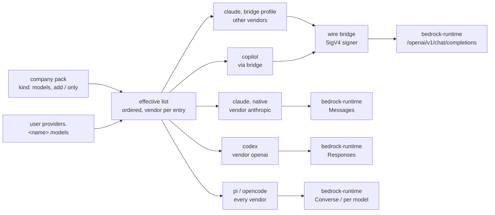

# Bedrock plumbing: every Bedrock model, in every agent

**Status:** DESIGN, 2026-09-24. Fifteen rulings are owed. **Nothing of this design is built,
while the credential half is.** Drafted 2026-09-04, amended 2026-09-18, [OQ-BR8](#OQ-BR8) opened
2026-09-23, refreshed 2026-09-24 against the maintainer's credential ruling, and widened the
same day by the maintainer's direction that every agent reach every Bedrock model
([§6.6](#66-every-bedrock-model-in-every-agent--the-direction)).
**UNMEASURED:** no one has sent a request to Bedrock from any agent, through the wire bridge,
or with any of the three credentials. Nothing has exercised runtime's `/openai/v1/chat/completions`
for a non-Anthropic model, mantle's SigV4 service name or base path, codex 0.156.1's
`amazon-bedrock-runtime` provider, Claude Code's gateway model discovery under
`CLAUDE_CODE_DISABLE_NONESSENTIAL_TRAFFIC=1`, or `aws-auth` against a live `aws sso login`. The
SigV4 signer [§6.6](#66-every-bedrock-model-in-every-agent--the-direction) proposes does not exist.

Bedrock reaches yolo through two designs, and they are siblings, not alternatives:

- **This doc** answers *how every shipped agent reaches every model Bedrock serves*, and
  *which models each agent's picker offers*. An agent takes one of two transports. It goes
  **native** where it ships a Bedrock client of its own: codex, opencode and pi for every model
  their client can call, and claude for Anthropic models. It goes **through the wire bridge**
  where it has none: claude for every non-Anthropic model, and copilot. The **wire bridge** is
  the in-jail daemon that gives claude and copilot an Anthropic endpoint on the jail's loopback
  and translates it to an OpenAI chat-completions upstream
  ([`wire-bridge.md`](../reference/wire-bridge.md)).
- **[`sso-backed-bedrock.md`](sso-backed-bedrock.md)** answers *where the credential comes
  from*. Its host credential service, its jail-side adapter and `packs/aws-auth` landed on
  2026-09-18 (`b94351fe`, `e76e43b2`, `9fc4879d`), and a podman jail has been able to reach
  the service since 2026-09-20 (`62e553a8`). It has not yet been run against a live
  `aws sso login` ([the pack README](../../packs/aws-auth/README.md)).

The two meet at one seam. Every transport here consumes whichever credential that doc delivers,
and this doc mints none. But if the bridge signs its own requests
([OQ-BR10](#OQ-BR10)), that doc's option D is no longer needed by any shipped agent. Option D
is a Bedrock API key minted from the SSO session, and today the only agents that need it are
the ones reaching Bedrock through a bearer-only route. Whether to retire option D stays that
doc's call.

That doc's plan has done-condition 7 blocked on this one: codex, pi and opencode have no
Bedrock provider or region until this arm lands. Nothing of THIS doc is built, apart from the
[D1](#7-traps--read-before-writing-code) fix (`f7b14308`, 2026-09-15). Code claims verified
against `f491d192` on 2026-09-24; those about the wire bridge and the model lists, which
[§3](#3-what-yolo-has-today) and [§6.6](#66-every-bedrock-model-in-every-agent--the-direction)
add, against `5e8e64f6` the same day. Every vendor claim carries its source and date in
[§14](#14-evidence-and-how-to-re-check-it).

**The short version.** Bedrock reaches an agent three ways. yolo should build the first and
the third, and document the second.

- The **native arm** *(coined here)* is the path where the agent's own client speaks to AWS.
  codex, opencode and pi each ship a built-in Bedrock provider, and claude has its Bedrock
  mode, so yolo supplies a **region and a model id**, and never a URL. The credential is not
  the native arm's to supply: each native client takes a Bedrock API key if one is set, and
  otherwise whatever the
  [AWS credential chain](https://docs.aws.amazon.com/sdkref/latest/guide/standardized-credentials.html)
  resolves, so any credential yolo supports works unchanged
  ([§6.5](#65-the-credential-three-are-supported)).
- The **gateway arm** *(coined here)* is Bedrock's own OpenAI-compatible `/openai/v1` route.
  It is already an ordinary yolo provider today and needs no new machinery at all.
- The **bridge arm** *(coined here)* is the gateway arm with the wire bridge in front of it. It
  is how claude reaches a non-Anthropic model and how copilot reaches any model. It works today
  with a Bedrock API key ([§6.4](#64-the-gateway-arm-ships-as-documentation)).
  [§6.6](#66-every-bedrock-model-in-every-agent--the-direction) proposes that the bridge sign
  its own requests, so that it takes the same three credentials the native arm does.

For the native arm the hard part is none of those. **The three native clients default to different
Bedrock endpoint families, and the model-id spelling differs between them**:
`openai.gpt-5.6-sol` on `bedrock-mantle`, `global.openai.gpt-5.6-sol` on `bedrock-runtime`. So
the family and the model ids are **one entry, shipped twice**: `-p bedrock-gpt` for runtime and
`-p bedrock-gpt-mantle` for mantle, both available to measure against each other.

**Which credential — ruled 2026-09-24 by the maintainer**, and recorded as
[`OQ-SSO7`](sso-backed-bedrock.md#13-decision-ledger) in the sso-backed Bedrock design's Decision
Ledger: *"We will support bearer tokens, we will support secret and key, and we also need to
support sessions through single sign-on. That's the big one."* So yolo supports three Bedrock
credentials:

1. a Bedrock API key, as `AWS_BEARER_TOKEN_BEDROCK`;
2. a static access key and secret, as `AWS_ACCESS_KEY_ID` / `AWS_SECRET_ACCESS_KEY` — for
   example through `env_sources`, which is the maintainer's current setup;
3. an SSO session through an assumed role, which `packs/aws-auth` delivers through the
   container-credentials endpoint. **This is the primary one.**

The native arm takes any of the three, one at a time: given two, every client silently picks
one.
[§6.5](#65-the-credential-three-are-supported) has what that means, what AWS itself says about
the three, and the one place a credential choice does bite: today the gateway and bridge arms
can carry only an API key.

**The most important sections are [§5](#5-two-families-two-providers--because-the-family-and-the-ids-are-one-entry)**, on why the family is a provider entry rather than a
knob, **and [§6.6](#66-every-bedrock-model-in-every-agent--the-direction)**, on how every model reaches every
agent and every picker. **[§7](#7-traps--read-before-writing-code) is the one to read before writing code**: six
traps. Three of them are live in shipped code or docs today, and a fourth was fixed on 2026-09-15.

**Needs your ruling:** [OQ-BR9](#OQ-BR9), [OQ-BR12](#OQ-BR12), [OQ-BR13](#OQ-BR13), [OQ-BR14](#OQ-BR14), [OQ-BR15](#OQ-BR15), [OQ-BR1](#OQ-BR1), [OQ-BR2](#OQ-BR2), [OQ-BR3](#OQ-BR3), [OQ-BR4](#OQ-BR4), [OQ-BR8](#OQ-BR8), [OQ-BR5](#OQ-BR5), [OQ-BR6](#OQ-BR6), [OQ-BR7](#OQ-BR7).
The seven new questions come first because they carry the maintainer's direction, and
[OQ-BR9](#OQ-BR9) (the provider shape) decides the premise of [OQ-BR1](#OQ-BR1),
[OQ-BR3](#OQ-BR3) and [OQ-BR7](#OQ-BR7). Rule [OQ-BR4](#OQ-BR4) and [OQ-BR8](#OQ-BR8) together;
they are one function. The 2026-09-24
refresh changed the premise of five of them, and each says how in a ⚠ note:
[OQ-BR2](#OQ-BR2), [OQ-BR3](#OQ-BR3), [OQ-BR4](#OQ-BR4), [OQ-BR5](#OQ-BR5) and
[OQ-BR6](#OQ-BR6). **One more question is owed but is not this doc's to ask:** whether static
keys delivered beside `aws-auth`'s pointer should be refused the way a bearer beside it already
is ([§6.5](#65-the-credential-three-are-supported)). It belongs to
[`sso-backed-bedrock.md`](sso-backed-bedrock.md), which owns where credentials come from.

**Scope note.** The general problem this doc's P1 names — *a model id is provider-local, so
every provider switch is a rename, and yolo only does half of it* — is split out into
[`provider-switching.md`](provider-switching.md). Nothing about it is Bedrock-specific and
its fix lands in the provider system rather than in a pack. This doc neither depends on that
one nor blocks it.

**Reads with:** [`../reference/providers.md`](../reference/providers.md) (the provider
system this extends — catalog, selection, derives, the canonical `wire_api` vocabulary),
[`../reference/protocol-resolution.md`](../reference/protocol-resolution.md) (how an agent
and a provider are paired by wire protocol, and why an endpoint-less provider passes),
[`zai-plumbing.md`](../reference/zai-plumbing.md) (the same exercise for a plain HTTP provider; this doc
is its sequel and borrows its resolution vocabulary),
[`../research/local-model-endpoints.md`](../research/local-model-endpoints.md) (the
per-agent config surfaces, source-verified),
[`provider-switching.md`](provider-switching.md) (the sibling this doc's P1 spawned — tier
aliases, and the id a deselected profile leaves behind),
[`provider-credential-scope.md`](provider-credential-scope.md) (why a credential delivered
through `env_sources` reaches every agent in the jail, whichever profile is selected).

---

## 1. Verdict and principles

**Build the native arm as endpoint-less providers, one per endpoint family, each holding every
model family the org selected, plus a derive binding per agent. Put the wire bridge in front of
the same providers for every agent or model the native arm cannot carry, and have it sign its
own requests. Ship the gateway arm as a documented config recipe, not as code.** The
one-provider-per-endpoint-family shape is [OQ-BR9](#OQ-BR9)'s to rule; until it does,
[§6.1](#61-three-providers-because-a-models-map-cannot-hold-two-model-families) states the
earlier split by model family.

The native arm is where the leverage is. Three agents already implement Bedrock, and what they
implement is better than what a gateway gives them:
[SigV4](https://docs.aws.amazon.com/IAM/latest/UserGuide/reference_sigv.html) (AWS's request
signing, done with whatever the credential chain resolves) or an API key, cross-Region
inference, and in codex's case a first-class `bedrock_api_key` auth mode stored in `auth.json`.
Reimplementing that as "a base URL plus an API key" throws away work someone else already did,
pins yolo to a URL it must keep current, and — [§6.5](#65-the-credential-three-are-supported)
— shuts out the SSO credential that is the primary one.

Three principles the rest of the doc leans on.

**P1. An auth mode is a BUNDLE of `{credential channel, environment, model ids}`, and the
three move together.** This is not new — it is the lesson of the 2026-05 Bedrock→Teams
switch on this machine, where the credential channel and the env moved and the
Bedrock-shaped model pin stayed behind, failing later as a 404 on an unknown model rather
than as an auth error. Bedrock hands us the same shape one layer down: the endpoint family
and the model id are one decision, and a design that lets them be set independently has
built the same trap again. The general form of this — and the live defect it has already
left in the selection mechanism — is [`provider-switching.md`](provider-switching.md).

**P2. Where the agent already knows the service, yolo supplies facts, not plumbing.** A
provider entry with no endpoints is not a degenerate provider — it is the correct
representation of "the client composes its own URL from a region." packs/claude's `bedrock`
provider has been exactly this since it shipped (its `kind: "provider"` contribution is a name
and nothing else), and the rest of the system already treats it correctly:

- [the credential preflight](../reference/providers.md#the-credential-preflight) demands no
  credential for an entry with no endpoints;
- [protocol resolution](../reference/protocol-resolution.md) treats a provider that names no
  endpoint as having "repointed nothing", so it resolves for every agent rather than being
  refused (`ResolveProtocol` in `internal/packload/protocolresolution.go`).

**P3. One model-id spelling per provider entry, and every agent that selects it gets that
one.** The `models` map is one map and the alias a profile names resolves through it once,
so an agent-dependent spelling is not a configuration — it is a `models` map that is wrong
somewhere. The corollary is the shape of [§5](#5-two-families-two-providers--because-the-family-and-the-ids-are-one-entry): two endpoint families means two entries, never
one entry with a switch, because a switch is exactly the thing that could move the endpoint
and leave the ids.

---

## 2. What Bedrock is now — measured 2026-09-04

Two endpoints, both OpenAI-compatible, and they are **not** interchangeable.

| | `bedrock-runtime` | `bedrock-mantle` |
| :--- | :--- | :--- |
| Base URL | `https://bedrock-runtime.{region}.amazonaws.com/openai/v1` | `https://bedrock-mantle.{region}.api.aws/openai/v1` (⚠ AWS's own pages disagree on `/openai/v1` versus `/v1` — [§14](#14-evidence-and-how-to-re-check-it)) |
| GPT-5.6 Sol model id | `us.openai.gpt-5.6-sol` / `global.openai.gpt-5.6-sol` — **in-Region is not available** | `openai.gpt-5.6-sol` — **Geo and Global are not supported** |
| Regions serving GPT-5.6 Sol | 25+, via Geo/Global cross-Region inference | `us-east-1`, `us-east-2` only |
| APIs | Responses, Chat Completions, Converse, InvokeModel, Messages | Responses, Chat Completions, Messages |
| Auth | SigV4 **or** Bedrock API key (bearer) | SigV4 **or** Bedrock API key (bearer) — re-read 2026-09-24, [§6.5](#65-the-credential-three-are-supported) |
| Server-side tools, `background=true` | Not supported | Supported |
| Structured outputs (this model) | Not supported | Not supported |
| Price | Global CRIS ≈10% cheaper per token than In-Region/Geo | same per-token rates |

> [!IMPORTANT]
> **The model id is a function of the endpoint family, and AWS says so explicitly.** From
> the GPT-5.6 Sol model card: *"On `bedrock-runtime`, name a cross-Region inference profile
> as the model — `us.openai.gpt-5.6-sol` or `global.openai.gpt-5.6-sol`. This model is not
> available for in-Region inference on that endpoint."* The bare `openai.gpt-5.6-sol` is
> the **mantle** spelling. Sending it to `bedrock-runtime` is the P1 failure, and it
> surfaces as a model error, not an endpoint error.

Two more facts that shape the design:

- **The credential is not this design's choice.** Both endpoints accept a SigV4-signed
  request or a Bedrock API key (the Auth row above). Which credential a jail carries is
  [`sso-backed-bedrock.md`](sso-backed-bedrock.md)'s question, and
  [§6.5](#65-the-credential-three-are-supported) is how this design meets each of the three it
  supports.
- **Bedrock is not only OpenAI models.** Both endpoints serve Chat Completions, Responses and
  the Anthropic Messages API. Runtime's `/openai/v1/chat/completions` serves many families:
  DeepSeek, Qwen3 and Qwen3 Coder, Kimi, GLM, MiniMax, Mistral and Devstral, Grok, Nemotron,
  Gemma 3 and GPT-5.x/6. It streams, it is signed as the service `bedrock`, and it needs
  `bedrock:InvokeModel` (plus `InvokeModelWithResponseStream`). A closed GPT model needs a `us.`
  or `global.` inference-profile id there. The same route serves Anthropic models too (AWS's own
  example calls it with `model="us.anthropic.claude-sonnet-4-6"`). **Messages serves Claude
  models only**, so a non-Anthropic model reaches claude only through a translation. SOURCED
  2026-09-24 from AWS's endpoints and model API compatibility pages
  ([§14](#14-evidence-and-how-to-re-check-it)); no request was made.
- **Only mantle lists its models.** Runtime has no `GET /openai/v1/models`. Mantle has
  `GET /v1/models`, authorized by `bedrock-mantle:ListModels`, and its inference action is
  `bedrock-mantle:CreateInference`. AWS documents neither mantle's SigV4 service name nor
  whether its base path is `/v1` or `/openai/v1`. Third-party clients sign it as `bedrock-mantle`:
  codex's `mantle.rs` source, oh-my-pi and LiteLLM issue #31475, per the 2026-09-24 research
  pass. None of the three was re-read here, and the string is absent from codex 0.156.1's
  binary apart from the URL.

---

## 3. What yolo has today

The provider system is fully built and is described in
[`../reference/providers.md`](../reference/providers.md); this section states only the
parts Bedrock lands on.

- **One `bedrock` provider exists, and it is claude's.** `packs/claude/pack.json` ships four
  contributions as a set: `kind: "provider"` named `bedrock` (no endpoints, no
  `api_key_env_name`, no models), `kind: "profile"` named `bedrock` selecting it, a
  `profile`-gated `kind: "env"` setting `CLAUDE_CODE_USE_BEDROCK=1`, and a `profile`-gated
  `config-overlay` writing the same key into `claude/settings`. It is the worked example
  the reference doc names
  ([Two channels, split by payload type](../reference/providers.md#two-channels-split-by-payload-type)).
- **The credential service is a separate pack.** `packs/aws-auth` ships the `aws-auth`
  loophole and one `kind: "env"` contribution, gated on the profile name `bedrock`, that sets
  `AWS_CONTAINER_CREDENTIALS_FULL_URI`. packs/claude does not `need` it yet (the plan's step
  5), so a user selects both, as the pack README's example does.
- **Only the claude derive reads `region`.** claude's `yolo.env` producer in
  `packs/claude/derive.lua` maps `p.region` → `AWS_REGION`. The schema field is documented as
  exactly this: the provider `Region` field's comment in `internal/packdecl/contributes.go`
  reads *"Region is the region a regional provider is reached through — Bedrock's address
  half"*. No other derive reads it.
- **Every other derive drops an endpoint-less provider on the floor.** codex, pi, opencode and
  oh-omp each have a `providerEndpoint` helper returning nil when the provider names no URL for
  the protocol that agent speaks, and each gates its catalog row and its selection on that one
  predicate. copilot's derive composes nothing for a provider with no endpoint, and says so in
  a comment naming Bedrock. A provider with no URL is therefore invisible to every agent but
  claude — correctly, today, because they had no other way to reach it.
- **The single-protocol `base_url` shorthand is gone from user config**
  ([protocol-resolution.md](../reference/protocol-resolution.md#the-single-protocol-base_url-shorthand-is-removed)).
  codex's and copilot's derives keep a read arm for it, only because a jail launched by an
  older host can still carry it in its config snapshot.
- **Provider names are sole-owned across packs** (the `KindProvider` row in
  `internal/packdecl/kinds.go`, `CombineExclusive`): two packs shipping one provider name is a
  launch-refusing collision; one pack shipping two names is the ordinary multi-provider pack.

**The wire bridge already carries a declared provider to claude and copilot.** MEASURED from
the code at `5e8e64f6`:

- `adaptEndpoints` (`internal/packload/providers.go`) gives every provider that offers an
  endpoint named `openai` an `anthropic` endpoint at the bridge's loopback address. It runs
  whenever a selected agent speaks `anthropic` and the provider has no `anthropic` route of its
  own. `packs/claude` `needs` `packs/wire-bridge` unconditionally.
- `routeFor` (`internal/wirebridged/boot.go`) takes that provider's `openai` endpoint as the
  bridge's one upstream. It refuses any `wire_api` other than `openai-chat-completions`. The
  bridge's other route, Responses, serves claude's `openai-codex` subscription profile alone.
- The bridge passes model ids through, stripping only Claude's `[1m]` suffix
  ([`wire-bridge.md`, the protocol surface](../reference/wire-bridge.md#the-protocol-surface)).
  It sends `Authorization: Bearer` with the key the provider's `api_key_env_name` names, and it
  ignores whatever credential the agent sends ([WB-D4](../reference/wire-bridge.md#wb-d4)). The
  upstream request is built in `bridgeHandler.doUpstream` (`internal/wirebridged/handler.go`)
  from a request body already read into memory.
- What the translation loses: `cache_control`, `thinking` and every other unmapped key are
  dropped, and `count_tokens` is refused with a 404
  ([WB-D14](../reference/wire-bridge.md#wb-d14)). The bridge answers `POST /v1/messages` and
  nothing else.
- copilot's derive prefers a provider's `anthropic` endpoint over its `openai` one
  (`packs/copilot/derive.lua`), so a bridged provider reaches copilot through the bridge too.

So a user provider whose `endpoints.openai` is runtime's `/openai/v1`, with
`wire_api: "openai-chat-completions"` and a Bedrock API key, should give claude and copilot
every chat-completions model Bedrock serves today, with no yolo change
([§6.4](#64-the-gateway-arm-ships-as-documentation)). INFERRED: no request has been made. Nothing in
the tree signs SigV4: `vendor/` holds no AWS module, and nothing under `internal/` or `cmd/`
signs. So today the bridge can carry only that key.

**Model lists today are per-pack maps and two hard-coded lists.** MEASURED at `5e8e64f6`:

- A pack's provider `models` is a flat alias → id map (`Models map[string]string` in
  `internal/packdecl/contributes.go`). claude's `bedrock` provider ships none. The object form
  of a model, with `name`, `context_window`, `cost` and the rest, is **user config only**
  (`knownModelKeys` in `internal/config/config.go`).
- `packs/claude/derive.lua` hard-codes three GPT-6 ids into `availableModels`
  (with `enforceAvailableModels`) and `modelPicker`, and `packs/pi/derive.lua` hard-codes the
  same three into `enabledModels`. Both do it only for the `openai-codex` provider. For every
  other provider pi renders `enabledModels` from the provider's `models` map, sorted.
- `KindProvider` combines exclusively, so an org's pack cannot add to or narrow another pack's
  provider. The `config-list` kind appends to a list but cannot narrow one, and it refuses a
  `profile` gate (`internal/packdecl`, `configlist_test.go`).

So: claude on Bedrock is wired, though end to end it is unmeasured
([providers.md](../reference/providers.md#two-channels-split-by-payload-type)). copilot and
claude can reach Bedrock's other models through the bridge with a Bedrock API key. The native
clients of codex, opencode and pi cannot see Bedrock at all.

---

## 4. What each agent can actually do

Verified from the shipped artifacts, not from documentation, except where noted.

| Agent | Native Bedrock support | How it authenticates | Evidence |
| :--- | :--- | :--- | :--- |
| **claude** | **Anthropic models only** — `CLAUDE_CODE_USE_BEDROCK=1` drives the Messages API, which serves Claude models alone. Every other model goes through the wire bridge ([§3](#3-what-yolo-has-today)) | the AWS credential chain; `AWS_REGION`. The string `AWS_BEARER_TOKEN_BEDROCK` is also in the binary (presence only; its precedence is not read here) | already shipped in yolo; claude 2.1.282 binary, 2026-09-24 |
| **codex** | Yes — two built-in provider ids, `amazon-bedrock` (mantle) and `amazon-bedrock-runtime`, both `wire_api = responses`; plus a `model_catalog_json` setting | `AWS_BEARER_TOKEN_BEDROCK` first, else the AWS SDK credential chain; region from `model_providers.amazon-bedrock.aws.region`, `AWS_REGION` or `AWS_DEFAULT_REGION` | codex-cli **0.156.1** binary, read 2026-09-24, [§14](#14-evidence-and-how-to-re-check-it) |
| **opencode** | Yes — built-in provider `amazon-bedrock` with `options: {region, profile, endpoint}` | a bearer (`AWS_BEARER_TOKEN_BEDROCK` or `/connect`) takes precedence over the credential chain; region from `options.region`, else `AWS_REGION`, **else `us-east-1`** | opencode 1.18.32 bundle, 2026-09-22 and 2026-09-24 |
| **pi** | Yes — built-in provider `amazon-bedrock` on the API `bedrock-converse-stream` | a stored key, else `AWS_BEARER_TOKEN_BEDROCK`, else `AWS_PROFILE`, else access keys, else the container-credentials variables, else a web-identity token file; `AWS_BEDROCK_SKIP_AUTH=1` disables | pi-ai **0.87.1**, `dist/providers/amazon-bedrock.js`, 2026-09-24 |
| **copilot** | No — through the wire bridge, whose `anthropic` endpoint its derive prefers | its bring-your-own-key mode takes a URL and `COPILOT_PROVIDER_API_KEY`. The bridge ignores that key and sends its own ([§3](#3-what-yolo-has-today)) | `packs/copilot/derive.lua` |
| **oh-omp** | **Unverified** — not installed in this jail | — | shipped as `packs/omp` after this doc was drafted |
| **agy** | No — model transport is a closed enum (`ccpa`/`gemini`/`stubby`) | — | `local-model-endpoints.md` §"agy" |

**The convergence is the finding.** codex, opencode and — since the provider it ships in pi-ai
0.87.1 — pi chose the same provider id (`amazon-bedrock`), the same API-key variable
(`AWS_BEARER_TOKEN_BEDROCK`), the same precedence (an API key over the credential chain) and
the same region knobs. That is not a coincidence to design around — it is a de-facto interface,
and yolo's job is to feed it. The precedence is also why a jail must never carry an API key
beside a chain credential ([§6.5](#65-the-credential-three-are-supported)).

**Where they diverge is the endpoint family**, and that divergence is invisible until the
first request:

- codex's `amazon-bedrock` provider is a **mantle** client: its baked base URL is
  `https://bedrock-mantle.{region}.api.aws/openai/v1`, beside `amazon_bedrock/mantle.rs`, and
  its bundled catalog maps the slug `gpt-5.6-sol` to the bare id `openai.gpt-5.6-sol`. It
  carries its own region allowlist (*"Amazon Bedrock does not support region …"*). Between 0.145.0 and
  0.156.1 codex gained a second built-in, **`amazon-bedrock-runtime`**, beside an `amazon_bedrock/runtime.rs` module and
  a `.amazonaws.com/openai/v1` URL suffix. Its catalog carries `global.` ids for `gpt-5.6-terra`
  and `gpt-5.6-luna`. Read from strings in the 0.156.1 binary; codex was not run, so what that
  provider sends is INFERRED.
- opencode routes **per model**: its bundled catalog sends bare-spelled OpenAI ids to mantle
  and geo-prefixed ones to runtime ([§6.3](#63-what-each-derive-emits)'s measurement).
- pi drives Converse, which is served on **`bedrock-runtime`** only. ⚠ Its 0.87.1 catalog lists
  the bare `openai.gpt-5.6-sol` against a `bedrock-runtime` base URL too — the P1 failure, shipped
  in a vendor's catalog. Read client-side only; no request was made.

So with no intervention, `-p bedrock-gpt -- codex` and `-p bedrock-gpt -- pi` want
*different model id spellings for the same model*. P3 says that cannot stand.

---

## 5. Two families, two providers — because the family and the ids are one entry

**The proposal: ship BOTH endpoint families, each as its own provider entry, and let a
profile name pick between them.** `-p bedrock-gpt` is runtime; `-p bedrock-gpt-mantle` is
mantle. One word apart at the CLI, and both available to try.

The reason this is two *providers* rather than one provider with an `endpoint_family`
option is structural, not stylistic. [§2](#2-what-bedrock-is-now--measured-2026-09-04) established that the model id is a function of the
family — `openai.gpt-5.6-sol` on mantle, `global.openai.gpt-5.6-sol` on runtime — and an
option **cannot** carry model ids: `options` is a flat name→value map a derive reads, while
`models` is a provider field the option layer never touches. A family option would therefore
let a user move the endpoint and leave the ids behind, which is P1's failure with a knob
attached. Two entries make that unrepresentable: the family and its ids sit in the same
object, and switching families is switching objects.

Reaching runtime from codex no longer needs an override. codex 0.156.1 ships a runtime
built-in, `amazon-bedrock-runtime` ([§4](#4-what-each-agent-can-actually-do)), so for the
runtime provider the codex derive selects that id and writes only `aws.region`. For the mantle
provider it selects `amazon-bedrock` and lets codex's own default URL stand. Either way codex's
built-in Bedrock client — SigV4, API-key support, `auth.json` integration — is what does the
talking. INFERRED from the binary's strings; codex was not run.

The override is the fallback for a codex older than the runtime built-in. codex permits it:
its guard on built-in providers reads, verbatim from the 0.156.1 binary:

> `` model_providers.<id> only supports changing `base_url`, `auth`, `http_headers`, `aws.profile`, `aws.region`, `aws.credential_export`, and `aws.auth_refresh`; ``

So an older codex takes
`model_providers.amazon-bedrock.base_url = https://bedrock-runtime.{region}.amazonaws.com/openai/v1`
beside `aws.region`. The list grew by the two `aws.*` keys between 0.145.0 and 0.156.1, which
is why [R1](#11-risks) pins the version.

Which family you would reach for:

| | runtime | mantle |
| :--- | :--- | :--- |
| Regions for GPT-5.6 | 25+ | 2 (`us-east-1`, `us-east-2`) |
| Cross-Region inference (capacity headroom) | yes | no |
| Global CRIS price | ≈10% cheaper | n/a |
| Server-side tools / `background=true` | no | yes |
| Guardrails, intelligent prompt routing | yes | no |
| codex | its `amazon-bedrock-runtime` built-in (0.156.1) | its `amazon-bedrock` built-in |

**Not every agent can reach both**, and the derives drop what they cannot — the ordinary
behaviour for an unreachable provider, no new machinery:

| Agent | runtime | mantle |
| :--- | :--- | :--- |
| codex | yes, natively since 0.156.1; via the `base_url` override before | yes, natively |
| opencode | yes, natively (its SDK resolves runtime) | yes per its catalog's per-model markers ([§6.3](#63-what-each-derive-emits)); no request made |
| pi | yes, via `bedrock-converse-stream` | **no** — the model card marks Converse unsupported on mantle |
| gateway arm ([§6.4](#64-the-gateway-arm-ships-as-documentation)) | yes | yes |

**Runtime is the one I would make the recommended default**, and the doc should say so in
the pack README: 25 regions against two, Global CRIS a little cheaper, reachable by all
three agents. The column mantle wins — server-side tool use and background inference — is a
column no coding agent in this repo uses; all four drive **client-side** tools, which both
endpoints serve. But "recommended" is a sentence in a README, not a constraint in the code:
both profiles ship, and the maintainer's stated reason for asking is to measure them against
each other rather than take my word for it.

---

## 6. The proposed shape

### 6.1 Three providers, because a `models` map cannot hold two model families

> [!NOTE]
> **[OQ-BR9](#OQ-BR9) would replace this split.** Under the maintainer's direction
> ([§6.6](#66-every-bedrock-model-in-every-agent--the-direction)), one provider per endpoint
> family holds every model family, and each derive filters by a per-model vendor fact. This
> section is the shape that ships if [OQ-BR9](#OQ-BR9) rules the other way.

claude on Bedrock wants Anthropic ids (`us.anthropic.claude-opus-5`); codex wants GPT ids;
and the two Bedrock families spell the same GPT model differently. All of them resolve the
alias `default` through *a* map, so each needs its own — which the provider `Name` field's
comment in `internal/packdecl/contributes.go` already calls the ordinary case ("one pack
shipping two names is two contributions").

| Provider | Owner | Models | Reachable by |
| :--- | :--- | :--- | :--- |
| `bedrock` | packs/claude, **unchanged** | Anthropic ids | claude |
| `bedrock-openai` *(new)* | a new `bedrock` pack | `global.openai.gpt-5.6-*` | codex, pi, opencode |
| `bedrock-openai-mantle` *(new)* | the same pack | `openai.gpt-5.6-*` | codex, opencode (unverified) |

Keeping `bedrock` exactly where it is avoids renaming a name users already type and
sidesteps the sole-ownership collision entirely. The new pack ships two providers, two
profiles and no CLI — the same shape as `packs/zai`, the precedent for a pack whose whole
content is declarative facts.

```jsonc
// packs/bedrock/pack.json — the shape, not the file
{
  "name": "bedrock",
  "contributes": [
    { "kind": "provider", "name": "bedrock-openai",
      "service": "aws-bedrock",                  // the marker — see §6.2, OQ-BR2
      "endpoint_family": "runtime",              // decides the URL, not the ids
      "region": "us-east-1",
      "models": {
        "default":  "global.openai.gpt-5.6-sol",
        "balanced": "global.openai.gpt-5.6-terra",
        "fast":     "global.openai.gpt-5.6-luna"
      },
      "options": { "model": "default", "aws_profile": null }
    },
    { "kind": "provider", "name": "bedrock-openai-mantle",
      "service": "aws-bedrock",
      "endpoint_family": "mantle",
      "region": "us-east-1",
      "models": {
        "default":  "openai.gpt-5.6-sol",
        "balanced": "openai.gpt-5.6-terra",
        "fast":     "openai.gpt-5.6-luna"
      },
      "options": { "model": "default", "aws_profile": null }
    },
    { "kind": "profile", "name": "bedrock-gpt",        "provider": "bedrock-openai" },
    { "kind": "profile", "name": "bedrock-gpt-mantle", "provider": "bedrock-openai-mantle" }
  ]
}
```

`endpoint_family` is a **provider field, beside `region`**, not a profile option — same
reasoning as [§5](#5-two-families-two-providers--because-the-family-and-the-ids-are-one-entry), and the same reasoning that put `region` there
(the `Region` field's comment in `internal/packdecl/contributes.go`: a service fact, saying
where the provider lives). A field a profile cannot reach is a field that cannot drift away from the `models`
map next to it. **[OQ-BR7](#OQ-BR7)** asks whether it is a distinct field at all or just falls out of
`service`.

`yolo -p bedrock-gpt -- codex` is then the whole user gesture. The credential arrives by
whichever of the three supported routes the user has set up
([§6.5](#65-the-credential-three-are-supported)), and neither entry above names any of them:
an entry with no `api_key_env_name` points at no credential, which is what lets one entry
serve all three. `-p bedrock-gpt-mantle` is the same gesture against the other family, and
the two can be compared back to back in one session.

### 6.2 How a derive recognizes "this is Bedrock"

An endpoint-less provider needs a marker, because every derive but claude's currently keys
reachability on a URL ([§3](#3-what-yolo-has-today)). Three candidates, and this is a real fork — **[OQ-BR2](#OQ-BR2)**.

The leaning is a new open-vocabulary `service` field on the provider kind: `"aws-bedrock"`
here, unknown values inert (no derive claims them, nothing renders — the same tolerance the
open `endpoints` key set already has, for the same version-skew reason the `Endpoints`
field's comment in `internal/packdecl/contributes.go` records). It is explicit, it is
greppable, and it survives a second regional service arriving later. Two costs the leaning
did not state when it was written are in [OQ-BR2](#OQ-BR2)'s ⚠ note: the word `service`
already names a contribution kind, and a user-declared provider's key set is closed, so the
field lands in two schemas rather than one.

What it is **not**: a `wire_api` value. Bedrock is not a protocol — its native clients speak
Responses, Converse and the AWS SDK's own shapes — and putting a service name in the
canonical protocol enum is the pass-through mistake [OQ-PT1](../reference/providers.md#oq-pt1) closed, one field over.

> [!WARNING]
> **An `endpoints` key cannot be the marker.** `validateProviderEndpoints` in
> `internal/packdecl/contributes.go` refuses an endpoint entry with no `base_url` (`endpoints[%q]: needs a "base_url"`), and a
> pack cannot ship a Bedrock URL because the URL contains a region it does not know. A
> `service` field or nothing.

### 6.3 What each derive emits

Each agent's binding lives in that agent's own derive — [OQ-CS8](../reference/providers.md#oq-cs8), unchanged: core learns no
agent's vocabulary, and core resolves no model.

| Agent | Catalog | Selection | Region / profile |
| :--- | :--- | :--- | :--- |
| **codex** | `[model_providers.<id>]` with `aws.region`, where `<id>` is `amazon-bedrock-runtime` for the runtime family and `amazon-bedrock` for mantle; `base_url` only for a runtime entry on a codex older than 0.156.1; **no other fields** — codex refuses them | `model_provider = "<id>"`, `model = <resolved id>` | `aws.region` from `region`; `aws.profile` from the `aws_profile` option when set |
| **opencode** | ⚠ **This cell is WRONG as written — see the measurement below.** It proposes `provider["amazon-bedrock"] = { npm: "@ai-sdk/amazon-bedrock", options: { region, profile? }, models: {…} }`, and both of those fields would break the mantle family | `model = "amazon-bedrock/<resolved id>"` | `options.region`, `options.profile` |
| **pi** | `providers["bedrock-openai"] = { api: "bedrock-converse-stream", models: [...] }` — **runtime family only**; the mantle provider yields no pi row, because Converse is not served there. ⚠ Written against pi-ai 0.82.1, which had only the API id; 0.87.1 ships a built-in `amazon-bedrock` provider ([§4](#4-what-each-agent-can-actually-do)), so the row may bind to that the way codex's does — re-read before writing ([§14](#14-evidence-and-how-to-re-check-it)) | `defaultProvider` / `defaultModel` | region via `AWS_REGION` in the jail env |
| **claude** | none (claude has no catalog) | env, as today | `AWS_REGION` from `region` |

> [!WARNING]
> **MEASURED 2026-09-22 against the installed opencode 1.18.32, and the opencode row above would
> ship a defect.** Read statically from its bundle; no agent was started.
>
> **opencode already routes Bedrock's OpenAI-shaped models to mantle by default, with no user
> config.** Its vendored `@ai-sdk/amazon-bedrock` 4.0.166 ships a first-class
> `@ai-sdk/amazon-bedrock/mantle` factory, and its embedded models.dev catalog marks **13** bedrock
> models with `provider:{npm:"@ai-sdk/amazon-bedrock/mantle", api:"…bedrock-mantle.${AWS_REGION}.api.aws/openai/v1"}`
> — including all three GPT-5.6 ids in **bare** spelling. The geo-prefixed ids (`global.`, `us.`,
> `in.`) carry no override and so take the provider default, which is runtime. **So [§5](#5-two-families-two-providers--because-the-family-and-the-ids-are-one-entry)'s
> model-id premise is not merely right, opencode enforces it structurally.**
>
> **Which is why the proposed cell is a defect.** The config→catalog merge resolves
> `npm = config.provider?.npm ?? … ?? model.api.npm`, so a **provider-level** `npm:"@ai-sdk/amazon-bedrock"`
> **overrides the catalog's per-model mantle markers** and silently drags every bare-spelled id onto
> the runtime endpoint, where that spelling is wrong. `options.endpoint`/`baseURL` does the same via
> `baseURL !== "" ? baseURL : model.api.url`. The derive must therefore set mantle **per model**, or
> **omit `npm` entirely** and let the catalog decide.
>
> ⚠ **And `options.region` alone does not enable the provider.** Autoload gates on six credential
> signals — `AWS_PROFILE`/`options.profile`, `AWS_ACCESS_KEY_ID`, a bearer token, `options.apiKey`,
> `AWS_WEB_IDENTITY_TOKEN_FILE`, or the container-credentials vars — and **region is not one of them**.
> A derive that writes only `region` yields `autoload: false`.
>
> **What this measurement cannot show:** whether any of it reaches AWS. This is client-side intent
> only — no request was made, so whether that endpoint accepts those ids is still unmeasured.

Selection keys keep riding the reserved `selection` namespace with the edge-triggered apply
— nothing about Bedrock changes the "write on activation, never on absence" rule, and an
interactive `/model` still stands.

### 6.4 The gateway arm ships as documentation

For any agent or model with no native path — copilot, and claude on a non-Anthropic model — or
for a user who wants a plain HTTP provider, the gateway arm needs **no yolo code at all**. The one defect that stood in its way,
[D1](#7-traps--read-before-writing-code), was fixed on 2026-09-15. It is an ordinary
`providers` entry, and it goes in the **user** config (`~/.config/yolo-jail/config.jsonc`):
an `endpoints.<protocol>.base_url` is user-scope only, and a workspace file carrying one is a
fatal config error ([providers.md, Current values](../reference/providers.md#current-values)).

```jsonc
"providers": {
  "bedrock-gw": {
    "endpoints": { "openai": {
      "base_url": "https://bedrock-runtime.us-east-1.amazonaws.com/openai/v1",
      "wire_api": "openai-chat-completions"
    }},
    "api_key_env_name": "AWS_BEARER_TOKEN_BEDROCK",
    "models": { "default": "global.openai.gpt-5.6-sol" }
  }
}
```

**The `wire_api` must be `openai-chat-completions`.** That is the one dialect the wire bridge
translates to, and in any jail that selects `packs/claude` the bridge fronts this entry
([§3](#3-what-yolo-has-today)): `routeFor` refuses an `openai` endpoint declaring any other
`wire_api`. Through the bridge, claude and copilot both reach it, and pi catalogs it directly.
codex gets no row from it, because codex speaks Responses only and has its native arm. The
model can be any id runtime's chat completions serves, which is far more than GPT
([§2](#2-what-bedrock-is-now--measured-2026-09-04)). INFERRED end to end: no request has been
made.

The user writes the region into the URL themselves. That is deliberate: it is the one place
the region genuinely has to be a URL, and templating it in core would need a `${region}`
interpolation the composer does not have and the URL validator would reject. Two lines of
config beats a core feature.

> [!WARNING]
> **Today this arm carries an API key and nothing else.** `api_key_env_name` is the only
> credential field a yolo provider has. Every derive hands the variable it names to its agent
> as an API key, and the bridge sends it as a bearer. So on this arm the credential is (1) of
> the three, whatever the jail's other credentials are. If the bridge signs
> ([OQ-BR10](#OQ-BR10)), all three consequences below fall away for claude and copilot. Three
> consequences:
>
> - An SSO user (credential 3) or a static-key user (credential 2) has no way onto this arm
>   except a short-term key minted from their credentials. yolo does not mint one: that is
>   [`sso-backed-bedrock.md`](sso-backed-bedrock.md)'s option D, unbuilt
>   ([§6.5](#65-the-credential-three-are-supported) says why it is only this arm that needs it).
> - The credential preflight demands `AWS_BEARER_TOKEN_BEDROCK` for this entry, and a jail that
>   also carries `aws-auth`'s pointer is refused at launch. So this arm and the SSO arm cannot
>   share a jail today.
> - An AWS account that denies `bedrock:CallWithBearerToken` and
>   `bedrock-mantle:CallWithBearerToken` rejects every request this arm makes.

### 6.5 The credential: three are supported

**The ruling, and where it lives.** The maintainer ruled on 2026-09-24 that yolo supports three
Bedrock credentials, and [`sso-backed-bedrock.md`](sso-backed-bedrock.md#13-decision-ledger)
records it as [`OQ-SSO7`](sso-backed-bedrock.md#13-decision-ledger), because that doc owns where credentials come from. This section is
what the ruling means for the two arms here. It rules nothing.

Two terms, used in this section and throughout the doc:

- A **Bedrock API key** is AWS's name for a Bedrock-only credential that a client sends as-is,
  as an HTTP `Authorization: Bearer` header, and every client in [§4](#4-what-each-agent-can-actually-do)
  reads it from `AWS_BEARER_TOKEN_BEDROCK`. "Bearer" in this doc means this and nothing else.
  It comes in two kinds: a **long-term** key is an IAM service-specific credential with an
  expiry from one day to never; a **short-term** key is a SigV4-presigned token that lives at
  most twelve hours. It is **not** an access key.
- A **chain credential** *(coined here)* is anything the
  [AWS credential chain](https://docs.aws.amazon.com/sdkref/latest/guide/standardized-credentials.html)
  resolves — the ordered list of places an AWS SDK looks for signing keys — and signs onto each
  request with [SigV4](https://docs.aws.amazon.com/IAM/latest/UserGuide/reference_sigv.html). It
  is never sent as-is, which is what separates it from a bearer.

| | Credential | How it reaches a jail today | What the agent does with it | Refreshes inside a running jail? |
| :--- | :--- | :--- | :--- | :--- |
| **1** | a Bedrock API key | `env_sources` → `AWS_BEARER_TOKEN_BEDROCK` | sends it as a bearer | **no** — frozen at launch |
| **2** | a static access key and secret | `env_sources` → `AWS_ACCESS_KEY_ID` / `AWS_SECRET_ACCESS_KEY` | a chain credential: the chain's environment provider finds it, and the SDK signs with it | nothing to refresh — it is long-lived |
| **3** | an SSO session through an assumed role — **the primary one** | `packs/aws-auth`: the pointer `AWS_CONTAINER_CREDENTIALS_FULL_URI` ([`sso-backed-bedrock.md` §5](sso-backed-bedrock.md#5-the-recommended-shape)) | a chain credential: the chain's container-credentials provider fetches it | **yes** — the host service re-mints it |

**What the native arm needs from this: nothing.** codex, opencode and pi each take a bearer if
one is set and a chain credential otherwise ([§4](#4-what-each-agent-can-actually-do)), so any
one of the three works with no per-credential code in this design. The native entries declare
no `api_key_env_name`, so the credential preflight demands none of them, and the design writes
no credential anywhere.

> [!WARNING]
> **Never two at once.** In every client measured a bearer beats the chain, so a jail carrying
> credential 1 beside credential 3 authenticates with the frozen bearer and the SSO service is
> never asked — a silent wrong answer. yolo refuses that launch, with no escape hatch
> (`internal/awschain`). The rule and its reasons are
> [`sso-backed-bedrock.md` §8](sso-backed-bedrock.md#8-behaviour-this-design-specifies) and
> [the `aws-auth` README](../../packs/aws-auth/README.md); they are not restated here.
>
> ⚠ **Credential 2 beside credential 3 is the same failure, and nothing refuses it.** The
> chain's environment provider comes FIRST, ahead of the container-credentials provider (the
> order measured in [`sso-backed-bedrock.md` §11](sso-backed-bedrock.md#11-evidence-and-how-to-re-check-it)
> from pi's vendored AWS SDK). So static keys in the jail environment win, and the SSO arm
> never runs. `internal/awschain`'s refusal checks only the bearer variable. Whether it should
> also check the access-key pair is a question for [`sso-backed-bedrock.md`](sso-backed-bedrock.md), and it is not
> ruled here. MEASURED: the refusal's code. INFERRED for codex and opencode: they use the same
> environment-first order every AWS SDK documents; only pi's was read.

**What AWS says about the three** (read 2026-09-24; sources in
[§14](#14-evidence-and-how-to-re-check-it)):

- **API keys are not deprecated.** None of the pages read says so, and AWS updated its guidance
  on them in July 2026.
- **AWS prefers temporary STS credentials.** Its security blog: *"Our recommendation is to use
  temporary security credentials provided by AWS Security Token Service (AWS STS) service
  whenever possible as a preferred authentication method."* Credential 3 is exactly that
  ([STS](https://docs.aws.amazon.com/STS/latest/APIReference/welcome.html) is the AWS service
  that issues short-lived credentials, including the assumed-role ones `aws-auth` serves).
- **Short-term keys for production, long-term keys for exploration.** The user guide says a
  short-term key is *"Recommended for production use"* and a long-term key is *"Recommended
  only for exploration"*. The blog ranks both below STS: use one *"when your use case blocks the
  use of temporary AWS STS credentials"*.
- **An organization can switch API keys off entirely**, with a
  [service control policy](https://docs.aws.amazon.com/organizations/latest/userguide/orgs_manage_policies_scps.html)
  (an organization-wide deny) on `bedrock:CallWithBearerToken` and
  `bedrock-mantle:CallWithBearerToken` — one action per endpoint, and AWS says both must be
  denied. On such an account credential 1 fails, and so does anything built on it: the
  gateway arm, and [`sso-backed-bedrock.md`](sso-backed-bedrock.md#4-five-options)'s option D. Credentials 2 and 3 are unaffected.
- The pages read do not rank credential 2, a long-lived IAM user key signed with SigV4.

**Can a bearer be made from an SSO session? Yes.** A short-term key is a SigV4-presigned token
made from whatever AWS credentials the generator is handed. AWS's generator libraries document
it with an assumed-role provider, and the Java one says *"Generate tokens with any credential
provider."* No page read names IAM Identity Center (AWS's SSO service) as a source; that it
works from an SSO session is INFERRED, because the generator reads the default credential
chain and the chain includes SSO. Its lifetime is *"the minimum of the requested expiration
time and the AWS credentials' expiry time"*, capped at twelve hours, and it cannot be refreshed
or revoked on its own.

> [!IMPORTANT]
> **A bearer minted from `aws-auth`'s narrowed session lives at most an hour.** The narrowed
> credential is an assumed role taken from an SSO role session, which is
> [role chaining](sso-backed-bedrock.md#33-four-aws-words-this-doc-leans-on), capped at one
> hour by STS. A bearer inherits that expiry, and a bearer in the jail is frozen for the
> launch. So option D over a narrowed session would hand a jail a key that dies within an hour
> of launch; from an un-narrowed permission-set session it lasts that session's remaining 1–12
> hours. INFERRED from the two documented caps; not measured.

**Where that answer matters.** Not on the native arm: every native client takes a chain
credential, and `aws-auth` keeps credential 3 fresh, so an SSO user never needs a bearer there.
It matters only for a route or a client that accepts **only** a bearer:

- **AWS does not make the gateway bearer-only.** Its endpoints page marks *"AWS SigV4
  authentication"* supported on both `bedrock-runtime` and `bedrock-mantle`, and its Chat
  Completions page says *"The `bedrock-runtime` endpoint supports AWS SigV4 authentication and
  Amazon Bedrock API key authentication"*, with a SigV4 example signed for the service
  `bedrock` against `/openai/v1/chat/completions`. For mantle it says the endpoint *"supports
  Amazon Bedrock API key authentication, AWS credentials, and the OpenAI SDK"*, and names no
  signing service; OpenAI's own Go SDK and third-party gateways sign it as `bedrock-mantle`.
  One AWS page, the Responses API page, says an API key is *"required for OpenAI SDK"* while
  plain HTTP requests may use AWS credentials.
- **yolo makes the gateway bearer-only, today.** The gateway arm is a yolo provider, whose
  only credential field is `api_key_env_name`. No derive tells an agent's generic
  OpenAI-compatible client to sign, and the wire bridge sends a bearer
  ([§6.4](#64-the-gateway-arm-ships-as-documentation)). MEASURED: the schema, the derives and
  the bridge. Whether any agent's generic client *could* sign is per-client and unread here.
- **So today option D is necessary exactly where the gateway or bridge arm is the only
  path**: copilot, which has no native Bedrock support, claude on any non-Anthropic model, and
  any agent a user deliberately points at the gateway. An SSO user there needs a bearer minted
  from the session, which is
  [`sso-backed-bedrock.md`](sso-backed-bedrock.md#4-five-options)'s option D, unbuilt — and,
  per the note above, short-lived if minted from the narrowed session.
- **A bridge that signs removes that need for every shipped agent**
  ([§6.6](#66-every-bedrock-model-in-every-agent--the-direction), [OQ-BR10](#OQ-BR10)). claude
  and copilot reach the gateway only through the bridge, and every other agent has a native
  arm. Option D would then serve only a user who points an agent's own generic client at the
  gateway.

### 6.6 Every Bedrock model, in every agent — the direction

**The maintainer's direction, 2026-09-24**, given in review of this doc's scope paragraph. In
substance: when Claude Code launches, its model choices should be up to date, and the same for
codex and the rest. A company would ship a pack that selects just the interesting models and
presents them everywhere. And with Bedrock, *"we can probably put all the models through
Claude… just like all of the other sources work, they connect to whatever agents can support
them, and I think everything should be able to support Bedrock. So Claude should be able to use
all of those models with basically no change."*

This section plans on that being the case. It is a direction, not a question. What stays open
is how to build it, in [OQ-BR9](#OQ-BR9) through [OQ-BR15](#OQ-BR15).

Two terms this section uses:

- A **company pack** *(coined here, from the maintainer's phrasing)* is a pack an organization publishes to its own
  people that carries policy rather than a program. Here the policy is which models they see,
  in what order. It reaches a jail like any other selected pack, usually fetched from a git
  remote.
- An agent's **effective list** *(coined here)* is the ordered list of models its picker
  offers for the selected provider. It is composed from every pack and the user's config, then
  filtered to what that agent's transport can call. It is not a catalog of what Bedrock serves.

#### 6.6.1 What already makes most of it true

claude and copilot can already reach every chat-completions model on runtime through the
bridge, with a Bedrock API key and a user provider
([§3](#3-what-yolo-has-today), [§6.4](#64-the-gateway-arm-ships-as-documentation)). The
direction needs three things that are missing:

1. the bridge taking the other two credentials,
2. one provider shape that every agent reads, and
3. a model list that an org can ship and every picker renders.

#### 6.6.2 The recommended design, in eight parts

1. **One provider per endpoint family, holding every model family.** A runtime provider and a
   mantle provider. Each carries every model the org selected on that family: Anthropic,
   OpenAI, DeepSeek, Qwen, Kimi, GLM, MiniMax, Mistral, Grok, Nemotron, Gemma. Each entry
   declares its **vendor** *(coined here)*: the model's maker, as an open-vocabulary lowercase
   string (`anthropic`, `openai`, `deepseek`, …) that the derives read and core does not
   interpret. This replaces [§6.1](#61-three-providers-because-a-models-map-cannot-hold-two-model-families)'s
   split by model family. [§6.1](#61-three-providers-because-a-models-map-cannot-hold-two-model-families)'s reason was that one `default` alias cannot name an Anthropic
   id for claude and a GPT id for codex. A vendor fact answers that, because each derive
   resolves the default among the entries its agent can call (part 2). P3 survives
   unchanged: the endpoint family still splits providers, because the id spelling is a function
   of it. [OQ-BR9](#OQ-BR9).
2. **Derives filter by what their agent can call.** No agent is offered a model its transport
   cannot reach:

   | Agent and transport | Entries it takes | Evidence for the filter |
   | :--- | :--- | :--- |
   | claude, native | vendor `anthropic` | Messages serves Claude models only ([§2](#2-what-bedrock-is-now--measured-2026-09-04)) |
   | claude, through the bridge | every vendor except `anthropic` | those are better native; the bridge drops `cache_control` and `thinking` ([§3](#3-what-yolo-has-today)) |
   | copilot, through the bridge | every vendor | copilot has no native arm |
   | codex, native (Responses) | vendor `openai` | this doc's evidence of Bedrock's Responses covers GPT only; widen when another family is read |
   | pi, native (Converse, runtime only) | every vendor, runtime family only | pi-ai 0.87.1's catalog carries 165 Bedrock ids, all on Converse |
   | opencode, native | every vendor | its SDK routes per model ([§6.3](#63-what-each-derive-emits)) |
   | oh-omp | none until its Bedrock support is read | [§4](#4-what-each-agent-can-actually-do) |

   An entry with no vendor (a user's string-form entry) is offered to every agent, which is
   today's behavior.
3. **The bridge signs its own upstream requests with SigV4.** SigV4 is AWS's request signing
   ([§1](#1-verdict-and-principles)). This is a signer written on the standard library, since
   nothing SigV4 is vendored, and checked against AWS's published test vectors. It resolves
   credentials in the AWS SDK's order:

   - static `AWS_ACCESS_KEY_ID` / `AWS_SECRET_ACCESS_KEY` first;
   - then the container-credentials endpoint `aws-auth` serves, cached until five minutes
     before its `Expiration`;
   - then `AWS_BEARER_TOKEN_BEDROCK`, sent unsigned as a bearer.

   The seam is `bridgeHandler.doUpstream`. The request body is already in memory there, which
   SigV4 needs in order to hash it. The response is OpenAI server-sent events, so signing the
   request is the whole job: there is no AWS binary event stream to decode.

   What it buys: the SSO credential refreshes itself inside a running jail, and an org whose
   service control policy denies `CallWithBearerToken` still works. Option D becomes
   unnecessary for every shipped agent, copilot included ([§6.5](#65-the-credential-three-are-supported)).
   This is **not** [`sso-backed-bedrock.md`](sso-backed-bedrock.md#4-five-options)'s rejected
   option E, the host-side signing proxy. The credential still crosses as the `aws-auth`
   pointer, the signer runs inside the jail, and the host sees no prompt. It amends
   [WB-D4](../reference/wire-bridge.md#wb-d4), whose outbound credential is today one key file
   read at boot. INFERRED throughout: no request has been made to Bedrock. [OQ-BR10](#OQ-BR10).
4. **claude gets both: a native profile and an everything profile** (ruled 2026-09-24,
   [OQ-BR11](#OQ-BR11)). The **everything profile** *(coined here; its name is
   [OQ-BR1](#OQ-BR1)'s)* is one claude session that can switch between Anthropic and every other
   Bedrock model — claude to an OpenAI model and back without leaving the session, which
   neither profile alone allows. One claude process has one transport, so the everything
   profile points claude at the bridge (`ANTHROPIC_BASE_URL`, never `CLAUDE_CODE_USE_BEDROCK`)
   and **the bridge routes by model id**: an Anthropic id (by the entry's declared `vendor`,
   never by parsing the id) is forwarded **untranslated** to Bedrock's own Anthropic Messages
   route, signed like every other request, so `cache_control`, `thinking` and `count_tokens`
   survive; every other id is translated to chat-completions as today. The native profile is
   the shipped `bedrock` one: claude's own Bedrock mode, Anthropic models only, for a user who
   wants nothing between claude and AWS. This **amends** the wire bridge's rule that it dials
   only the upstream selected at boot
   ([`wire-bridge.md`, Lifecycle and failure behavior](../reference/wire-bridge.md#lifecycle-and-failure-behavior)):
   the everything route has two upstreams under one provider, chosen per request. UNMEASURED,
   and the first thing to measure: which Bedrock endpoint serves the Anthropic Messages API for
   the pass-through (mantle's `/anthropic/v1/messages` is sourced; runtime's is not), and
   whether it streams Anthropic SSE or AWS's binary event-stream, which the bridge would then
   have to re-frame.
5. **A `models` contribution kind, for the company pack.** It names a provider and carries an
   ordered list of object-form entries: `id`, `vendor`, and the existing optional `name`,
   `context_window`, `cost`, `reasoning`, `input` and `max_tokens`. Its verb is either `add`,
   which appends entries, or `only`, which narrows the list to the ids named. It exists because
   nothing today lets one pack shape another pack's model list: `KindProvider` is sole-owned,
   and `config-list` appends but cannot narrow ([§3](#3-what-yolo-has-today)).
   [OQ-BR12](#OQ-BR12).
6. **Derives render the effective list into each picker.** Each derive writes the list into
   its agent's own picker surface. This replaces the hard-coded GPT-6 lists in the claude and
   pi derives, whose three ids become the `openai-codex` provider's own ordered list:

   | Agent | Picker surface |
   | :--- | :--- |
   | claude | `modelPicker.options`, `availableModels` |
   | pi | `enabledModels` |
   | opencode | its provider `whitelist` |
   | oh-omp | `models.yml` |
   | codex | `model_catalog_json`, whose file format is unread |
   | copilot | one `COPILOT_MODEL`, the first entry it can call |

   [OQ-BR13](#OQ-BR13).
7. **Currency comes from the agents' own catalogs, plus a `yolo check` staleness warning.** With
   no pack or user narrowing, an agent with a vendor catalog shows its own. pi-ai 0.87.1 ships
   165 Bedrock ids; opencode's embedded models.dev has 179 Bedrock entries, per the 2026-09-24
   research pass, not re-counted here. That list is current with the agent's version, and yolo
   adds nothing to it. A list yolo *does* carry is checked by `yolo check`, which warns about
   any id no installed agent's catalog knows. yolo fetches no model list from AWS at launch.
   [OQ-BR14](#OQ-BR14).
8. **Later: a bridge `/v1/models`.** Claude Code's `CLAUDE_CODE_ENABLE_GATEWAY_MODEL_DISCOVERY`
   fills its picker from a gateway's `/v1/models`. The bridge serving that from the effective
   list would let claude's picker follow the list with no settings write. The bridge answers
   only `POST /v1/messages` today. Whether discovery survives the
   `CLAUDE_CODE_DISABLE_NONESSENTIAL_TRAFFIC=1` the claude derive sets on every routed launch is
   unmeasured. [OQ-BR15](#OQ-BR15).

The shape, for one runtime provider:



#### 6.6.3 Behavior these parts fix

Written for the implementer, on top of [§8](#8-behaviour-this-design-fixes). Anything not here
and not an open question is theirs.

**Composing the list** (part 5):

- **Order.** Packs apply in `packs` order, then the user's config. `add` appends entries not
  already present. A duplicate `id` keeps the first writer's position and fields whole, and
  `yolo check` names the duplicate.
- **`only`.** It narrows to the ids it names and never adds one. Two `only` contributions for
  one provider intersect. An id that `only` names and no one added is dropped, and
  `yolo check` names it.
- **The user is the last writer.** A user's `providers.<name>.models` replaces the composed
  list for that provider. Today's string-form maps keep working unchanged.
- **Degenerate lists.** An empty effective list for one agent writes no catalog row and no
  selection for that agent, as for any unreachable provider ([§8](#8-behaviour-this-design-fixes)), and `yolo check` names the
  agent and provider. The exception is claude's native profile, where an empty list is
  today's shipped case: the derive writes no model variables, and claude chooses its own. A pack's `models` entry with no `vendor` is refused at load, naming the
  entry.

**Resolving the default** (part 1): the profile's `model` option if it names an entry this
agent can call, else the provider's `default` alias if callable, else the first callable entry
in list order. No error when nothing is callable: that is the empty case above.

**Rendering pickers** (part 6):

- Written once per launch at the boot render, as managed layers, like every derive output
  today.
- An interactive `/model` choice still wins until yolo's own selection changes (the
  `selection` namespace, unchanged).
- `enforceAvailableModels` is set only when an `only` narrowed the list. A list that merely
  adds must never lock a user out of the agent's built-in choices.
- Existing state: the three hard-coded GPT-6 ids move into data, and the rendered
  `openai-codex` output stays byte-identical. A test pins that.

**Signing** (part 3):

- The bridge signs only for a provider carrying the Bedrock marker
  ([OQ-BR2](#OQ-BR2)). It never sends both a signature and a bearer, and never logs a
  credential (the existing forbidden list).
- **Resolution is lazy**, on the first request, not at boot: `aws-auth`'s adapter may start
  after the bridge.
- **Concurrent requests share one credential fetch**, and the cached set is replaced whole.
- **The container-credentials fetch** times out at 5 s, with no retry inside one request.
- **No credential resolvable** → an Anthropic-shaped 401 naming the three sources it tried.
- **Adapter unreachable** → a 503 naming `aws-auth` and the `aws sso login` its lapsed-session
  message already names.
- **AWS rejects the signature as expired** → the bridge refreshes once and retries once. That
  is safe because a rejected request did not run, and `doUpstream` already builds a fresh
  request per attempt.
- Any other AWS error passes through, as today.
- **The upstream URL** for a provider carrying the Bedrock marker is composed from its `region` and endpoint
  family, never shipped as a literal. [§6.2](#62-how-a-derive-recognizes-this-is-bedrock)'s
  warning holds: a pack cannot know the region.

**Staleness** (part 7):

- Only `yolo check` runs it, never a launch.
- An id absent from every installed agent's catalog is a warning, and never a refusal.
- When no catalog could be read, the check says it could not ask. It does not report "not
  found": "unreferenced" and "could not ask" are different answers.

**Forbidden:**

- a model list in core;
- a network call for models at launch;
- the bridge dialing anything but its boot-selected upstream;
- `enforceAvailableModels` without an `only`.

**IAM, per family.** SOURCED from AWS's endpoints and model API compatibility pages, 2026-09-24:

| Use | Actions |
| :--- | :--- |
| runtime: native clients, chat completions, Messages | `bedrock:InvokeModel`, `bedrock:InvokeModelWithResponseStream`, plus the `project/default` resource in [R5](#11-risks) |
| mantle: inference | `bedrock-mantle:CreateInference` |
| mantle: listing models | `bedrock-mantle:ListModels` |

The `aws-auth` README's example session policy grants the first row alone
([D6](#7-traps--read-before-writing-code)).

#### 6.6.4 What this reopens

| Settled or leaning | Reopened or touched by |
| :--- | :--- |
| [§6.1](#61-three-providers-because-a-models-map-cannot-hold-two-model-families)'s split by model family, and [§10](#10-alternatives-considered)'s rejection of "one `bedrock` provider for all four agents" | [OQ-BR9](#OQ-BR9) — reopened |
| [§10](#10-alternatives-considered)'s rejection of moving `bedrock` out of packs/claude | [OQ-BR9](#OQ-BR9) — a shared provider needs a shared owner |
| [OQ-BR1](#OQ-BR1) (names), [OQ-BR7](#OQ-BR7) (`endpoint_family`) | [OQ-BR9](#OQ-BR9) — touched |
| [OQ-BR2](#OQ-BR2) (the marker) | [OQ-BR10](#OQ-BR10) — the marker becomes what the bridge signs for |
| [OQ-BR5](#OQ-BR5) (pi through the gateway needs a bearer) | [OQ-BR10](#OQ-BR10) — not if the bridge signs; pi does not use the bridge, though |
| [OQ-BR8](#OQ-BR8) (gates key on names) | [OQ-BR11](#OQ-BR11) — a second claude profile over one provider is D5's shape |
| [OQ-GP2](gateway-provider-packs.md#decision-ledger) (*"ship no models"*), [OQ-BR3](#OQ-BR3), [OQ-PS3](provider-switching.md#OQ-PS3) | [OQ-BR12](#OQ-BR12), [OQ-BR14](#OQ-BR14) — reopened |
| [WB-D4](../reference/wire-bridge.md#wb-d4), [WB-D14](../reference/wire-bridge.md#wb-d14) | [OQ-BR10](#OQ-BR10), [OQ-BR15](#OQ-BR15) — amended |
| [providers.md](../reference/providers.md#what-this-does-not-license)'s "no provider registry or discovery" | [OQ-BR14](#OQ-BR14), [OQ-BR15](#OQ-BR15) — touched |


---

### 6.7 The whole matrix — every agent, every model, every credential

**The requirement** (the maintainer, 2026-09-24, recorded as [DIR-BR2](#decision-ledger)):
*"We need to support single sign on through all of the methods so I can use any model. I want to
use Kimi in Claude through Bedrock by just choosing it in the menu, or I want to use OpenAI and
then I want to switch to Claude. So we got to support everything everywhere, the whole matrix."*
So a cell of this matrix is one agent, one Bedrock model family and one of the three supported
credentials ([§6.5](#65-the-credential-three-are-supported)): a Bedrock API key, a static key
pair, or an SSO session through `aws-auth`. **Every cell must work**, and a model must be one
pick in the agent's own model menu, not a config edit.

| Agent | Anthropic models | Every other model | API key | Static keys | SSO session | State |
| :--- | :--- | :--- | :--- | :--- | :--- | :--- |
| **claude** | native profile, or the everything profile's pass-through ([OQ-BR11](#OQ-BR11)) | everything profile, through the bridge | native: yes · bridge: yes | native: yes · bridge: needs the signer | native: yes · bridge: needs the signer | native built; everything profile, signer and picker unbuilt |
| **codex** | native | native (its Responses catalog) | yes | yes | yes, through the chain | native provider binding unbuilt ([§6.3](#63-what-each-derive-emits)) |
| **opencode** | native | native | yes | yes | yes, through the chain | binding unbuilt |
| **pi** | native (Converse) | native (Converse) | yes | yes | yes, through the chain | binding unbuilt |
| **copilot** | through the bridge | through the bridge | yes | needs the signer | needs the signer | unbuilt |
| **oh-omp** | its `bedrock-mantle` provider (SOURCED, not installed here) | same | yes | needs the bridge's signing pass-through | needs the bridge's signing pass-through | unverified |
| **agy** | no Bedrock transport at all | — | — | — | — | **the one hole**: agy's closed transport enum admits no Bedrock ([§4](#4-what-each-agent-can-actually-do)) |

**What the matrix adds to [§6.6](#66-every-bedrock-model-in-every-agent--the-direction):**

1. **The bridge signs — [OQ-BR10](#OQ-BR10) is answered by the requirement.** SSO on the bridge
   route can only be a signer or a minted key, and a key minted from `aws-auth`'s role-chained
   session lives at most an hour ([§6.5](#65-the-credential-three-are-supported)), so it cannot
   serve a working day. The signer it is.
2. **The bridge also signs for an OpenAI-wire client, without translating.** oh-omp's Bedrock
   provider takes a bearer only, and any agent a user points at the gateway route speaks OpenAI
   already. So the bridge offers a second route beside the Anthropic one: an OpenAI
   chat-completions endpoint on the jail's loopback that forwards unchanged and adds only the
   signature. INFERRED; it is the same signer at the same seam, with no translation step.
3. **The model must be in the menu.** "Kimi in Claude by choosing it in the menu" needs three
   pieces at once: the everything profile ([OQ-BR11](#OQ-BR11)); a list that contains Kimi
   ([OQ-BR12](#OQ-BR12), [OQ-BR14](#OQ-BR14)); and the claude derive rendering that list into
   `modelPicker` ([OQ-BR13](#OQ-BR13)). Switching from an OpenAI model to Claude mid-session is
   the everything profile's whole purpose.
4. **Done means the matrix, measured.** A cell counts as built only when one request has gone
   through it on a real host. That is a manual runbook, not a test: automated tests never make
   API calls. [§8](#8-behaviour-this-design-fixes) carries it as a done-condition.

## 7. Traps — read before writing code

**D1 (FIXED 2026-09-15, `f7b14308`). The codex derive wrote a key codex does not read.** It
emitted `api_key_env = <var name>`, and codex's `ModelProviderInfo` has no such field: its
credential-variable field is **`env_key`**, and in the codex 0.145.0 and 0.156.1 binaries the
string `api_key_env` occurs only inside `enable_codex_api_key_env`, an unrelated setting. Every custom provider yolo configured for codex therefore shipped with no
credential binding. The derive now writes `env_key`, and
`TestCodexDeriveUsesCodexCredentialField` (`internal/entrypoint/providerderive_test.go`) runs
the shipped derive and fails if `env_key` is missing or `api_key_env` returns. Kept here as the
worked example of the trap AGENTS.md names: the old test asserted the TOML yolo wrote, not
that codex reads it.

**D2 (live hazard). The profile env gate leaks across agents.**
`profileActive` in `internal/packload/packload.go` returns true if the profile is
active for a bin *this* pack installs **or for any bin the launch installs at all**. The
wide pass exists so a CLI-less pack's gated env is reachable, and it is correct for that.
But it means `-p codex=bedrock` in a jail that also selects packs/claude fires claude's
gated `CLAUDE_CODE_USE_BEDROCK=1` into the jail-wide environment, pointing claude at Bedrock
that nobody configured it for — and, since 2026-09-18, fires `packs/aws-auth`'s gated
`AWS_CONTAINER_CREDENTIALS_FULL_URI` jail-wide too, since that pack installs no bin at all. The
config-overlay twin does **not** have this problem: the profile gate in `packoverlay.Collect`
(`internal/packoverlay/packoverlay.go`) checks `profiles[key.Agent]`, agent-scoped. A shared
Bedrock profile name makes this routine rather than theoretical. **[OQ-BR4](#OQ-BR4).**

**D5 (live hazard). A second profile over `bedrock` silently loses every gated fact.** D2's
twin, pointing the other way: where D2 fires a gate for the wrong agent, D5 fails to fire it
for the right one. Every `profile:`-gated contribution matches the profile NAME literally, while
every derive matches the PROVIDER the name resolves to. A user profile `bedrock-sso` over
provider `bedrock` validates and selects, and then `-p bedrock-sso` delivers at most the
provider's region: no `CLAUDE_CODE_USE_BEDROCK`, no `claude/settings` overlay, no
credential pointer. Nothing reports it, by rule. **[OQ-BR8](#OQ-BR8)** has the evidence and
the options.

**D3. codex actively manages its `amazon-bedrock` entry.** The 0.156.1 binary carries
*"Amazon Bedrock login cannot select `X` because `Y` sets `model_provider` to `Z`"*,
*"selected Codex-managed Amazon Bedrock API key is no longer available"*, and *"Amazon Bedrock is
configured to use `aws.credential_export`. Please clear this setting to use another sign-in
method."* (0.145.0 also carried *"configuration changed while clearing the managed Amazon
Bedrock model provider; retrying once"*, which the same search does not find in 0.156.1.) Two
consequences: writing fields beyond the permitted seven is refused, not ignored;
and yolo pinning `model_provider` will block `codex login` for Bedrock while the profile is
active. The second is acceptable — a jail whose profile names the provider is not the place
to run an interactive login — but it must be in the briefing, not discovered.

⚠ **The derive's generic catalog row cannot be reused for it.** Today every row the codex
derive writes carries `name` and `wire_api` (and `env_key` when a variable is named) — `name`
because codex refuses a row whose name is empty (`TestCodexDeriveSetsModelProviderName`). None
of the three is in the permitted seven, so a Bedrock row needs its own shape.
Whether codex accepts one of them set to its built-in default value is unmeasured.

**D4. codex may not know the pinned model ids.** Its bundled catalog holds the mantle
spellings (`gpt-5.6-sol` → `openai.gpt-5.6-sol`). In 0.156.1 it also holds `global.` ids for
`gpt-5.6-terra` and `gpt-5.6-luna`, and a search finds none for `-sol`. An id it does not know it
reports: *"Unknown model … is used. This will use fallback model metadata."* The request
works; the context-window and pricing metadata are wrong. That is an accepted cost
of the [§5](#5-two-families-two-providers--because-the-family-and-the-ids-are-one-entry) pin, and the alternative — pinning mantle to keep codex's metadata — costs 23
regions and every other agent.

**D6 (live, in docs). The `aws-auth` example policy denies half of this design.**
[The pack README](../../packs/aws-auth/README.md)'s example `session_policy` allows
`bedrock:InvokeModel` and `bedrock:InvokeModelWithResponseStream` and nothing else. That is
enough for runtime's chat completions and for every native client on runtime. It denies every
`bedrock-mantle` action (`bedrock-mantle:CreateInference`, `bedrock-mantle:ListModels`), so both
`-mantle` profiles fail with AccessDenied under it. It also denies any model-listing call that
[OQ-BR14](#OQ-BR14) or [OQ-BR15](#OQ-BR15) might add. The README is
[`sso-backed-bedrock.md`](sso-backed-bedrock.md)'s to change. What this doc owes is the list of
actions each family needs, stated where the README can copy it: the IAM paragraph in
[§6.6.3](#663-behavior-these-parts-fix). SOURCED from AWS's endpoints page, 2026-09-24; the
denial is INFERRED, since no request was made.

---

## 8. Behaviour this design fixes

Written for the implementer. Anything not here and not an OQ is theirs.

**Degenerate inputs.**
- Provider selected, `region` absent and no `AWS_REGION`/`AWS_DEFAULT_REGION` in the jail
  env → **refuse the launch**, naming the three places a region may come from. codex fails on
  this, and its own error text already enumerates them; a jail that boots and dies at first
  request is the worse outcome. ⚠ Not every native client fails: opencode and pi fall back to
  `us-east-1` silently, which is a region nobody chose rather than a refusal
  ([OQ-BR6](#OQ-BR6)).
- `models` map empty, or the alias the profile names is absent → emit the catalog row and
  **omit the model key**, exactly as the existing derives do. The agent resolves its own.
- Profile selected for an agent with no native path (agy; oh-omp until its support is read;
  copilot until the bridge serves a provider carrying the Bedrock marker, per [OQ-BR10](#OQ-BR10)) → **nothing written**, no warning. Same as any unreachable provider today.
- Two providers both marked `service: "aws-bedrock"` → both are ordinary catalog rows; only
  the selected one gets a selection key. Not a collision — and it is the **shipped** case,
  since the two endpoint families are two entries.
- A provider whose `endpoint_family` an agent cannot serve (mantle for pi) → **no catalog
  row and no selection key**, through the same gate that drops any unreachable provider. It
  is not an error: the other agents in the same jail still get theirs.

**Failure paths.**
- Credential absent: the provider declares no `api_key_env_name` — the native arm's
  credential is whichever of the three the jail carries
  ([§6.5](#65-the-credential-three-are-supported)) — so the credential preflight demands
  nothing and the launch proceeds. Failure surfaces at first request, as an AWS auth error, from the agent. This is
  a deliberate asymmetry with the gateway arm, where `api_key_env_name` **is** declared and
  the preflight does demand it.
- A credential that expires inside a running jail. Only two of the three can: a Bedrock API
  key (credential 1: long-term keys carry an expiry, short-term ones last ≤12h) and the SSO
  session behind credential 3. An expired key surfaces as codex's *"Amazon Bedrock rejected
  the request because its AWS signature has expired… If `AWS_BEARER_TOKEN_BEDROCK` is set,
  update or unset it, then restart Codex."* **This design refreshes nothing**, and that is
  named rather than overlooked: refresh is [`sso-backed-bedrock.md`](sso-backed-bedrock.md)'s, whose service re-mints
  credential 3 and whose lapsed-session message names the `aws sso login` to run
  ([its §7](sso-backed-bedrock.md#7-refresh--what-happens-when-you-log-in-again)). Nothing
  refreshes a bearer.
- Region unsupported for the chosen family (mantle outside `us-east-*`): surfaces as
  codex's own *"Amazon Bedrock Mantle does not support region …"*. yolo carries no region
  allowlist of its own — a list that would rot within a quarter.

**Defaults, with units.** `endpoint_family` is a provider FIELD with no default — each
shipped entry states its own (`runtime`, `mantle`), and an entry omitting it is refused
rather than guessed, because a guessed family is a wrong model id (P1). `region:
"us-east-1"` (shipped on both entries; overridable per user). `aws_profile: null` — declared, no
default, meaning "use the chain". Model alias fallback: the profile's `model` option, else
`default` — the existing [`OQ-CS3`](../reference/providers.md#oq-cs3) ladder,
unchanged. No timeouts and no retries are introduced by this design.

**Trigger.** Everything renders in the ordinary boot render, once per launch, from the
composed provider table — plus the host notch's env derive at `yolo host -- <agent>`. There
is no watcher, no refresh and no second write.

**One writer.** yolo owns the catalog rows it renders (`model_providers.amazon-bedrock`,
`provider["amazon-bedrock"]`, pi's `providers` entry) as managed layers, re-asserted every
boot. It does **not** own the selection keys in the same sense: those ride the reserved
`selection` namespace, and a user's interactive model change wins until yolo's own selection
value changes. codex owns its `auth.json`; yolo never writes it.

**Forbidden.** Never write a codex Bedrock provider field outside codex's
permitted seven. Never put a credential value in the composed table or in `YOLO_PROVIDERS` —
the name crosses, the value is hydrated per derive invocation. Never emit a selection whose
provider the catalog dropped. Never carry a region allowlist or a model catalog in core.

**What done looks like.**
1. `yolo -p bedrock-gpt -- codex` in a jail carrying one supported credential and a region
   completes one turn against GPT-5.6, and `codex doctor` reports provider
   `amazon-bedrock`, wire api `responses`, endpoint `bedrock-runtime.<region>`.
1b. Condition 1 holds for each of the three credentials in turn — a Bedrock API key, static
   keys, and `aws-auth`'s pointer — one per jail, never two
   ([§6.5](#65-the-credential-three-are-supported)).
2. The same flag on `opencode` and on `pi` completes one turn against the same model id.
2b. `yolo -p bedrock-gpt-mantle -- codex` completes one turn, and `codex doctor` reports the
   `bedrock-mantle` endpoint — the two families demonstrably side by side, which is the
   point of shipping both.
3. `yolo -p codex=bedrock-gpt -- codex` leaves `CLAUDE_CODE_USE_BEDROCK` **unset** in the
   jail env (D2 closed) — or, if [OQ-BR4](#OQ-BR4) rules otherwise, the briefing says why it is set.
4. Dropping the profile leaves each agent's interactively-chosen model untouched.
5. A user overriding `providers.bedrock-openai.models` to Anthropic ids reaches Claude on
   Bedrock through codex, with no yolo change — the "not just GPT" claim, demonstrated.

For the direction ([§6.6](#66-every-bedrock-model-in-every-agent--the-direction)), once
[OQ-BR9](#OQ-BR9) through [OQ-BR13](#OQ-BR13) rule:

6. claude's everything profile completes one turn against a non-Anthropic model on runtime (a
   DeepSeek or Qwen id, say), once under each of the three credentials. copilot does the same.
   Under the SSO credential the turn still succeeds after the first credential set expires,
   with no relaunch.
7. claude's native `bedrock` profile, in the same jail, completes a turn against an Anthropic
   id, and its picker lists only Anthropic entries.
8. A company pack with `only` over five ids makes exactly those five, in its order, appear in
   claude's, pi's and opencode's pickers, each filtered to what that agent can call. copilot's
   `COPILOT_MODEL` is the first entry it can call.
9. The `openai-codex` pickers render byte-identically to today after the GPT-6 lists move into
   data.
10. `yolo check` warns about an id no installed catalog knows. With no agent installed, it says
    it could not check.
11. **The matrix** ([§6.7](#67-the-whole-matrix--every-agent-every-model-every-credential)): on a real host, one request per
    cell — each agent, an Anthropic and a non-Anthropic model where its transport carries both, and
    each of the three credentials — completes, and each model was chosen from the agent's own menu.
    Run by hand from a runbook; automated tests never make API calls.

---

## 9. Non-goals

- **No credential lifecycle.** No key rotation, no short-term-key minting, no refresh
  daemon, no broker — not in this design. That half is
  [`sso-backed-bedrock.md`](sso-backed-bedrock.md)'s, and its service is built. This design
  mints no credential and names none in a provider entry; it works with whichever of the three
  supported credentials the jail carries ([§6.5](#65-the-credential-three-are-supported)). The
  bridge's signer ([§6.6](#66-every-bedrock-model-in-every-agent--the-direction)) reads the
  chain the way any AWS SDK does, and caches what it reads until it expires. That is
  consumption, not lifecycle.
- **No `~/.aws` mount.** This design assumes only environment variables and the
  container-credentials pointer. A grant of `~/.aws` is worse than out of scope: it
  **disables** the SSO arm while looking like it works, and yolo refuses it as a config error
  wherever a loophole serves container credentials
  ([`sso-backed-bedrock.md` §8](sso-backed-bedrock.md#8-behaviour-this-design-specifies)).
- **No model catalog in yolo.** yolo will not track Bedrock's model list, its region matrix,
  or its pricing. The lists an agent shows come from packs and the user
  ([§6.6](#66-every-bedrock-model-in-every-agent--the-direction)), and their currency from each
  agent's own vendor catalog. yolo checks a list against those catalogs; it does not keep one.
- **No new agent.** copilot and agy have no native Bedrock path and this design does not
  invent one. copilot takes the bridge arm ([§6.4](#64-the-gateway-arm-ships-as-documentation)),
  and agy's closed transport enum admits no Bedrock at all.
  oh-omp shipped after this design was drafted, and whether it has a native path is unread.
- **No Converse-for-everyone.** pi's `bedrock-converse-stream` is used because pi ships it;
  no canonical `wire_api` name is coined for Converse (**[OQ-BR5](#OQ-BR5)** if that changes).
- **No bridge for an agent that has a native arm.** codex, opencode and pi keep their own
  Bedrock clients. The bridge is for claude's non-Anthropic models and for copilot, and the
  bridge arm is never a second route to a model an agent can already call natively — with one
  exception: claude's everything profile carries Anthropic ids through the bridge, untranslated,
  so that one session can switch vendors ([OQ-BR11](#OQ-BR11)).
- **Not a rewrite of claude's native mode.** packs/claude's four Bedrock contributions stay
  as they are, except as D2's fix may narrow the env gate. What the direction adds for claude
  is the everything profile and a picker rendered from the effective list
  ([OQ-BR11](#OQ-BR11), [OQ-BR13](#OQ-BR13)).

---

## 10. Alternatives considered

| Alternative | Verdict |
| :--- | :--- |
| **Gateway arm only** — one provider with a full `/openai/v1` base URL, no native bindings, no new pack | **Rejected as the primary path, adopted as the escape hatch ([§6.4](#64-the-gateway-arm-ships-as-documentation)).** It works and costs almost nothing, but it discards SigV4, the credential chain, codex's `auth.json` Bedrock mode and opencode's region/profile options, and it makes yolo the owner of a URL it must keep current. Since the 2026-09-24 credential ruling it has a sharper cost: it carries only an API key, so it cannot use the SSO credential the maintainer called the primary one ([§6.5](#65-the-credential-three-are-supported)). It is the right answer for an agent with no native path. |
| **Ship one family only** — pick runtime, document mantle as a manual config | **Rejected on the maintainer's ask.** Both are wanted for comparison, and the second entry costs one JSON object plus one line in each derive. Runtime remains the *recommended* one, in the README. |
| **One provider, `endpoint_family` as a profile OPTION** | **Rejected — it cannot work.** Options are a flat name→value map; `models` is a provider field the option layer never reaches. The option would move the endpoint and leave the ids, which is P1's failure with a knob attached ([§5](#5-two-families-two-providers--because-the-family-and-the-ids-are-one-entry)). |
| **One `bedrock` provider for all four agents** | **Reopened by [OQ-BR9](#OQ-BR9), now per endpoint family.** It was rejected because claude wants Anthropic ids and codex wants GPT ids through the same `default` alias. A per-model vendor fact answers that: each derive resolves the default among the entries its agent can call ([§6.6](#66-every-bedrock-model-in-every-agent--the-direction)). |
| **Move `bedrock` out of packs/claude into the new pack** | **Reopened by [OQ-BR9](#OQ-BR9).** It was rejected as churn while only claude read the provider. A runtime provider every agent reads needs an owner every agent's jail selects, and sole ownership means that cannot be packs/claude. |
| **Bridge routes by model id**, so one claude session mixes native Anthropic and bridged models | **Adopted for the everything profile ([OQ-BR11](#OQ-BR11), ruled 2026-09-24).** It amends the bridge's one-upstream rule and adds a pass-through path for Anthropic Messages; the maintainer wants one claude session that switches between Anthropic and OpenAI models, which two profiles alone cannot give. The native profile stays beside it. |
| **Mint a Bedrock API key for the bridge** ([`sso-backed-bedrock.md`](sso-backed-bedrock.md#4-five-options)'s option D) | **Superseded if [OQ-BR10](#OQ-BR10) rules to sign.** It lives at most an hour over the narrowed session ([§6.5](#65-the-credential-three-are-supported)), is frozen for the launch, and fails on an account that denies `CallWithBearerToken`. |
| **A host-side signing proxy** (that doc's option E) | **Not needed.** An in-jail signer gets the refresh and the SCP resilience without the host seeing any prompt. |
| **yolo fetches Bedrock's model list at launch** | **Leaning against ([OQ-BR14](#OQ-BR14)).** Runtime has no list endpoint. Mantle's needs an IAM action the example policy lacks. And a launch-time network call makes a jail's model list depend on the network at boot. |
| **Match the provider by NAME in each derive** (`if name == "bedrock-openai"`) | **Rejected** — [`stringly-typed-references-principle.md`](../reference/stringly-typed-references-principle.md) exists for this, and it would silently break the moment a user declares their own Bedrock provider under another name. |
| **A `bedrock` key in the open `endpoints` map, with no URL** | **Rejected — unrepresentable.** `validateProviderEndpoints` in `internal/packdecl/contributes.go` refuses an endpoint with no `base_url`. |
| **Coin `bedrock-converse` as a fourth canonical `wire_api`** | **Deferred ([OQ-BR5](#OQ-BR5)).** Only pi consumes it, and pi is reachable through the native marker without it. Coin it if a second Converse consumer appears. |

---

## 11. Risks

| Risk | Mitigation |
| :--- | :--- |
| **R1.** codex renames or drops `amazon-bedrock-runtime`, or tightens its override list so `base_url` stops being permitted — the runtime entry loses its way in. The list already changed once, between 0.145.0 and 0.156.1. | Both are strings in the binary and re-checkable in seconds ([§14](#14-evidence-and-how-to-re-check-it)). Pin the codex version in the evidence table and re-verify on upgrade; the fallback is the gateway arm under a non-reserved id. |
| **R2.** D4's fallback metadata makes codex mis-estimate the context window and compact too early or too late against a 1M-token model. | Measurable in one session. If it bites, the escape is already shipped: `-p bedrock-gpt-mantle` is the family whose ids codex's catalog knows, and it moves both halves at once. |
| **R3.** The three agents' shared `amazon-bedrock` id drifts apart (one renames it). | Each derive already owns its agent's spelling; a rename is one line in one derive, with provenance. |
| **R4.** No end-to-end request is made during implementation, and this ships on schema reading alone — the standing weakness of every provider integration in this repo. | The done-conditions in [§8](#8-behaviour-this-design-fixes) are all live turns. `codex doctor` settles codex without burning a turn; the other two need one real request each. |
| **R5.** Bedrock IAM needs `bedrock:InvokeModel` on the account's **default project** (`arn:aws:bedrock:{region}:{account}:project/default`) in addition to the inference profile — a policy the existing invoke-only `matt-bedrock` IAM user may not carry. | Test with the real account before declaring the arm done; the failure is an AccessDenied naming the project ARN, which is self-diagnosing. |
| **R6.** A bug in the bridge's SigV4 signer fails every bridged request with a 403, and it fails the same way for every user. | AWS's published SigV4 test vectors pin the signer before any live request. The 403 body names the signature mismatch, and the bridge log carries it. |
| **R7.** Translation loses something a non-Anthropic model needs: tool-call fidelity, reasoning, or a streaming quirk per vendor. | The bridge already fails closed on unknown block types ([WB-D5](../reference/wire-bridge.md#wb-d5)). Measure one turn per vendor in the org's list before shipping that vendor in a company pack. |
| **R8.** A company pack's list goes stale: AWS retires an id, and every agent's picker offers a model that 404s. | The `yolo check` staleness warning ([§6.6](#66-every-bedrock-model-in-every-agent--the-direction)). The failure itself is AWS's model error, naming the id. |
| **R9.** The effective list and an agent's own catalog disagree about an id's context window or cost. | The object-form entry's fields win where the agent reads them, and a pack states them only where it has a source. |

---

## 12. What I would build, in order

1. ~~**Fix D1**~~ — **done 2026-09-15** (`f7b14308`), with its regression test
   ([§7](#7-traps--read-before-writing-code)). The gateway arm no longer waits on anything.
2. **Rule [OQ-BR2](#OQ-BR2)** (the marker) and add the field to `packdecl` with its tolerance
   behaviour. Nothing renders yet; the schema is the thing three derives will key on.
3. **The `bedrock` pack** — both providers, both profiles, README (including which family
   is recommended and why). Selecting either changes nothing observable until step 4, which
   makes it a safe landing.
4. **The codex derive binding** — the pin, `aws.region`, the selection. codex first because
   it is the motivating case and because `codex doctor` verifies it cheaply.
5. **opencode and pi bindings** — mechanically similar, each with its own provenance
   comment recording the version its spelling was read from.
6. **Close D2 and D5 together** (per [OQ-BR4](#OQ-BR4) and [OQ-BR8](#OQ-BR8), ruled as one),
   each with a test that fails when the call site is deleted.
7. **The gateway-arm recipe** in the user guide, and the model-id/endpoint-family pairing
   (P1) stated where a user will hit it.
8. **The direction, after [OQ-BR9](#OQ-BR9) through [OQ-BR13](#OQ-BR13) rule** — in this order:
   1. the bridge's SigV4 signer with its test vectors, and the lazy credential resolution
      ([OQ-BR10](#OQ-BR10)). It is the piece with no dependency on the model-list work, and
      it closes the SSO gap for copilot and claude's everything profile on its own;
   2. the shared runtime and mantle providers with per-model `vendor`, and the derive filters
      ([OQ-BR9](#OQ-BR9));
   3. claude's everything profile ([OQ-BR11](#OQ-BR11));
   4. the `models` kind ([OQ-BR12](#OQ-BR12)), then picker rendering, moving the GPT-6 lists
      into data under a byte-identical test ([OQ-BR13](#OQ-BR13));
   5. the `yolo check` staleness warning ([OQ-BR14](#OQ-BR14)). A bridge `/v1/models`
      ([OQ-BR15](#OQ-BR15)) waits on its measurement.
9. **Fold the settled parts into `docs/reference/providers.md`** and retire this doc via
   `system-doc`.

---

## 13. Open Questions

Questions 1–8 are the native arm's. Questions 9–15 carry the maintainer's 2026-09-24
direction ([§6.6](#66-every-bedrock-model-in-every-agent--the-direction)), and
[OQ-BR9](#OQ-BR9) sets the premise of [OQ-BR1](#OQ-BR1), [OQ-BR3](#OQ-BR3) and
[OQ-BR7](#OQ-BR7). No question here is ruled yet; the direction itself is recorded in the
[Decision Ledger](#decision-ledger) below.

1. 💬 **OQ-BR1: Provider and profile naming.** The proposal ships providers
   `bedrock-openai` / `bedrock-openai-mantle` and profiles `bedrock-gpt` /
   `bedrock-gpt-mantle`, alongside claude's existing `bedrock`/`bedrock`. The profile names
   are what a user types, so they are a surface, not internal ids. Stakes: these are the
   strings in this design that are expensive to change later, `bedrock-gpt-mantle` is long
   for something typed often, and `bedrock` for claude vs `bedrock-gpt` for everything else
   is an asymmetry a reader will trip on. **Depends on [OQ-BR9](#OQ-BR9):** under one
   provider per endpoint family, `-p bedrock` serves every agent and these names shrink to at
   most a `model` option, plus the everything profile's name ([OQ-BR11](#OQ-BR11)).

   _Leaning:_ Ship them as proposed. They read correctly at the point of use and leave
   claude's shipped name alone. A shorter `-p gpt` is tempting but would collide with a
   future first-party OpenAI provider, and the mantle one is typed rarely enough that
   explicit beats short.

   <!-- vantage: oq id=OQ-BR1 leaning="Ship bedrock-openai / bedrock-openai-mantle and bedrock-gpt / bedrock-gpt-mantle as proposed. They read correctly at the point of use and leave claude's shipped bedrock name alone. A shorter -p gpt would collide with a future first-party OpenAI provider, and the mantle profile is typed rarely enough that explicit beats short." -->

   **Answer:**
   > _(empty — fill in when decided)_

2. 💬 **OQ-BR2: How a derive recognizes a native-Bedrock provider.** An endpoint-less
   provider needs a marker, since all three derives currently gate on a URL. Candidates: a
   new open-vocabulary `service` field on the provider kind; matching the provider name;
   treating "has `region`, has no `endpoints`" as the marker implicitly. Stakes: this is the
   schema addition the whole native arm keys on, and it is the one piece of this design that
   touches core rather than a pack. **[OQ-BR10](#OQ-BR10) adds a consumer:** the marker is
   also what tells the wire bridge to sign.

   > [!WARNING]
   > **⚠ Premise changed since the leaning was written (re-read 2026-09-24).** Two facts it
   > did not account for:
   >
   > - **`service` already names something.** `kind: "service"` is a contribution kind — the
   >   in-jail daemon `packs/wire-bridge` ships. A provider FIELD called `service` would give
   >   one word two meanings in one manifest vocabulary.
   > - **The field lands in two schemas.** A user-declared provider's key set is CLOSED
   >   (`knownProviderKeys` in `internal/config/config.go` refuses anything else), so a user's
   >   own Bedrock provider could not carry the marker until it is added there as well as to
   >   `internal/packdecl`.
   >
   > Neither decides the question; both are costs of the leaning's spelling.

   _Leaning:_ The `service` field, open vocabulary, unknown values inert. Explicit,
   greppable, survives a second regional service, and it is the only candidate that does not
   put a service name where a protocol name belongs. The implicit "region and no endpoints"
   reading fails today: packs/claude's `bedrock` provider ships neither.

   <!-- vantage: oq id=OQ-BR2 leaning="The `service` field, open vocabulary, unknown values inert. Explicit, greppable, survives a second regional service, and it is the only candidate that does not put a service name where a protocol name belongs. The implicit 'region and no endpoints' reading fails today: packs/claude's `bedrock` provider ships neither." -->

   **Answer:**
   > _(empty — fill in when decided)_

3. 💬 **OQ-BR3: Does yolo ship model aliases at all, or only the marker?** The proposal
   ships three (`default`/`balanced`/`fast` → `global.openai.gpt-5.6-{sol,terra,luna}`). The
   alternative is an empty `models` map, leaving every user to write their own ids. Stakes:
   shipped aliases are the difference between `-p bedrock-gpt` working out of the box and
   being a two-step setup — but they are also a model list yolo now has to not-let-rot, and
   [§9](#9-non-goals) says yolo tracks no catalog. **Touched by [OQ-BR12](#OQ-BR12) and
   [OQ-BR14](#OQ-BR14):** with a `models` kind for company packs and a staleness check, what
   yolo's own pack ships matters less, and what it ships gets checked.

   > [!WARNING]
   > **⚠ Premise changed (read 2026-09-24): the proposed aliases may be stale before they
   > ship.** pi-ai 0.87.1's bundled Bedrock catalog lists `openai.gpt-6-astra` — bare,
   > `us.` and `global.` — beside the GPT-5.6 ids, and yolo's own codex-subscription defaults
   > moved to GPT-6 in September (`2f11de95`, `7ad8358c`). Whether Bedrock serves GPT-6 was not
   > checked against AWS. It sharpens the stakes this question already names — a shipped model
   > list is one yolo has to keep from rotting — without choosing between them.

   _Leaning:_ Ship the three. They are a *default*, not a catalog: a wrong one is overridden
   in two lines, and the alternative makes the flag useless on first use. Say in the pack
   README when they were checked and against what.

   <!-- vantage: oq id=OQ-BR3 leaning="Ship the three aliases. They are a default, not a catalog: a wrong one is overridden in two lines, and the alternative makes the flag useless on first use. Record in the pack README when they were checked and against what." -->

   **Answer:**
   > _(empty — fill in when decided)_

4. 💬 **OQ-BR4: Fix D2's wide env gate, or accept the leak and document it?** Selecting
   `bedrock` for one CLI fires every pack's `bedrock`-gated env, jail-wide — so
   `-p codex=bedrock-gpt` today would also set `CLAUDE_CODE_USE_BEDROCK=1` if a pack gated
   on that name. Options: narrow the gate to the pack's own bins (breaks the CLI-less pack
   case the wide pass exists for); scope the env by agent the way `packoverlay` already does
   (env has no surface naming an agent, so this needs a new binding); or accept it and say
   so in the briefing. Stakes: it is a correctness question about a shipped mechanism, and
   a cross-agent Bedrock profile is what turns it from theoretical into routine.

   > [!WARNING]
   > **It stopped being theoretical on 2026-09-18, and the stakes changed from a flag to a
   > credential.** `packs/aws-auth` (`9fc4879d`) ships
   > `{"kind":"env","profile":"bedrock","vars":{"AWS_CONTAINER_CREDENTIALS_FULL_URI":…}}`, and
   > `packs/claude` ships a profile named `bedrock`. That pack installs no bin, so it takes the
   > SECOND pass of the rule stated on the `Profile` field in
   > [`contributes.go`](../../internal/packdecl/contributes.go) — *"the profile active for a
   > bin the pack installs, else active for ANY bin … the second pass is what makes a CLI-less
   > pack's gated env reachable"*. So selecting `bedrock` for
   > claude points **every** AWS SDK in the jail at the credential adapter, whichever agent the
   > user chose it for.
   >
   > **It is also the first case where both horns bite.** Narrowing the gate to the pack's own
   > bins — this question's first option — would not merely break "the CLI-less pack case" in
   > the abstract; it would break `aws-auth` specifically, since CLI-less is exactly what that
   > pack is. So the first option is now disqualified by an instance rather than by an argument,
   > and the choice is between scoping by agent and accepting a credential-shaped leak.
   >
   > **⚠ And the 2026-09-24 credential ruling bounds what fixing it buys.** Of the three
   > supported credentials only the SSO one reaches the jail through a pack; the other two
   > arrive through `env_sources`, which is profile-blind and reaches every agent in the jail
   > whatever this gate does ([`provider-credential-scope.md`](provider-credential-scope.md)).
   > So scoping the gate narrows `aws-auth`'s pointer and claude's flag, and no other
   > credential. That is a fact about the stakes, not a vote for either option.

   _Leaning:_ Scope it, following the precedent of `packoverlay.Collect`'s profile gate — the wide pass was a
   reachability fix for CLI-less packs, and "reachable" should not have meant "global". The
   2026-09-18 instance strengthens this rather than changing it: `config-overlay` already keys
   its gate on the target surface's owning agent, and the reason `env` cannot is stated in the
   same comment — env has no surface to name an agent — which is the binding that has to be
   invented. It remains a change to a shipped rule with its own OQ history, so it is the
   maintainer's call whether it rides this work or gets its own.

   <!-- vantage: oq id=OQ-BR4 leaning="Scope the env gate by agent, following the precedent of packoverlay.Collect's profile gate — the wide pass was a reachability fix for CLI-less packs, and 'reachable' should not have meant 'global'. But it changes a shipped rule with its own OQ history, so it is your call whether it rides this work or gets its own." -->

   **Answer:**
   > _(empty — fill in when decided)_

5. 💬 **OQ-BR8: What does a contribution's gate key on — the profile NAME, or the provider it
   selects?** Depends on [OQ-BR2](#OQ-BR2), whose marker is what a provider-keyed fact would
   match; rule it with [OQ-BR4](#OQ-BR4), which is the same function asked from the other
   side ([D5](#7-traps--read-before-writing-code) and D2). Stakes: whether a user's second intent over a shipped provider is a
   supported case or a silent trap, and whether the credential adapter's port stays written in
   three places. **[OQ-BR10](#OQ-BR10) and [OQ-BR11](#OQ-BR11) lean on this one's leaning:** a
   bridged claude profile over the shared provider is D5's shape, and the bridge's signer needs
   the adapter address from the provider row rather than from a name-gated variable.

   **The split, measured at `7ad8358c` and re-read at `f491d192`.** Gates and derives answer "is Bedrock selected?"
   through different keys:

   | Consumer | Keys on | Where |
   | :--- | :--- | :--- |
   | `env` gate | the literal NAME: `EnvFold` → `profileActive` → `installsActiveBin`, `profiles[bin] == name` | [`packload.go`](../../internal/packload/packload.go), in `installsActiveBin` |
   | `config-overlay` gate | the literal NAME: `profiles[key.Agent] != ov.Profile` | [`packoverlay.go`](../../internal/packoverlay/packoverlay.go), in `Collect` |
   | surface derive | the resolved PROVIDER: `packload.ProviderFor(resolved, profiles[s.Agent])` | [`packsurfaces.go`](../../internal/entrypoint/packsurfaces.go), in `surfaceSelectionFor` |
   | env derive | the resolved PROVIDER: `selected := ProviderFor(cfg.resolved, profile)` | [`deriveenv.go`](../../internal/packload/deriveenv.go) |

   MEASURED: neither gate file calls `ProviderFor`. An inactive gate is a clean skip by rule,
   with no error or report (the doc comment on `Collect` in
   [`packoverlay.go`](../../internal/packoverlay/packoverlay.go), and the `Profile` field's
   comment in [`contributes.go`](../../internal/packdecl/contributes.go): *"It is a SKIP, not
   an error"*).

   **What that does to a second profile.** A user profile `bedrock-sso` over provider
   `bedrock` validates and selects. `-p bedrock-sso` then exports `AWS_REGION` only, where the
   provider declares a region. That comes from claude's derive, which keys on `ctx.selected_provider`
   (the `yolo.env` producer in [`packs/claude/derive.lua`](../../packs/claude/derive.lua)). Three
   things are lost, silently:

   - `CLAUDE_CODE_USE_BEDROCK` from claude's `bedrock`-gated `env` ([`packs/claude/pack.json`](../../packs/claude/pack.json))
   - the `bedrock`-gated `claude/settings` overlay, in the same file
   - aws-auth's `AWS_CONTAINER_CREDENTIALS_FULL_URI` pointer, its one `env` contribution ([`packs/aws-auth/pack.json`](../../packs/aws-auth/pack.json))

   MEASURED by a triage on 2026-09-23; re-derived here by reading the gates at HEAD, not
   re-run. So claude may run first-party on whatever login it holds. INFERRED: no request was
   made.

   **Not Bedrock-specific.** The same shape ships twice more, MEASURED:

   - [`packs/pi/pack.json`](../../packs/pi/pack.json) gates the codex prelaunch env on the name `codex`
   - [`packs/llamacpp/pack.json`](../../packs/llamacpp/pack.json) gates `CLAUDE_CODE_ATTRIBUTION_HEADER=0` on the name `llamacpp`

   **The port is written three times.** The adapter's `127.0.0.1:1461` appears in
   [`handler.go`](../../internal/awscredadapter/handler.go) (`DefaultListen`), in the
   loophole's
   [`manifest.jsonc`](../../packs/aws-auth/loopholes/aws-auth/manifest.jsonc) (the jail
   daemon's `--listen` argument) and in
   [`packs/aws-auth/pack.json`](../../packs/aws-auth/pack.json) (the pointer's value). MEASURED:
   they are pinned against each other by `TestAWSAuthPointerAndAdapterAgreeOnThePort` in
   [`aws_auth_pointer_test.go`](../../packs/aws_auth_pointer_test.go), which reads the embedded
   copies of the two manifests and nothing else. INFERRED: a user pack's copy is checked by
   nothing, and the workaround below writes exactly that copy.

   **It breaks a case the design called supported.** The deleted
   `provider-catalog-and-selection.md`, under *What a profile is*, names *"a user adding a second intent over the
   same provider"* as the case selection resolution exists for (`git show
   4e4ca2d1^:docs/design/provider-catalog-and-selection.md`, line 398). The SELECTION half was
   fixed there: `ProviderFor` reads the resolved table, user profiles included. The GATE half
   never moved.

   **Prior rulings, each checked for whether it already answers this:**

   | Ruling | What it settled | Does it answer this? |
   | :--- | :--- | :--- |
   | [`OQ-PT8`](../reference/providers.md#oq-pt8), 2026-09-01 | Moved profile bodies onto name-keyed `profile:` contributions | **No.** It settled what a profile carries. Name versus provider was a consequence, never a choice |
   | [`OQ-CS9`](../reference/providers.md#oq-cs9) | Profiles point at a provider; no `extends` | **Yes, for one option:** it rules out `bedrock-sso extends bedrock` |
   | [`OQ-PT3`](../reference/providers.md#oq-pt3) | A provider's fact is composed from the provider, not restated in a gated overlay — zai's URL literal left the overlay | **It is the precedent** the leaning follows |

   **Options:**

   | Option | Verdict |
   | :--- | :--- |
   | **Key provider facts on the provider**, mostly in the agent's derive keyed on `ctx.selected_provider`, then on [OQ-BR2](#OQ-BR2)'s marker once it rules | **Leaning** |
   | Let a profile `extends` another, so `bedrock-sso` inherits `bedrock`'s gates | **Rejected**: it reopens [`OQ-CS9`](../reference/providers.md#oq-cs9) |
   | Make the gate match the selected provider's NAME instead | **Weaker than the leaning.** The fact stays in a manifest, keyed on one provider name, so a second provider for a variant loses it again |
   | Warn at launch when a gate's name differs from the selected profile over the same provider | **Rejected as the fix**: it reports the trap instead of removing it. The one piece kept is a `yolo check` note for a USER pack whose name gate differs from the selected profile over the same provider |

   **The leaning, concretely:**

   - claude's `CLAUDE_CODE_USE_BEDROCK` moves into claude's derive, in both env and settings.
   - llamacpp's attribution header becomes a provider option.
   - pi's codex prelaunch env moves into a pi derive.
   - aws-auth's adapter address is composed into the provider row, as codex's Responses
     address already is (the `endpoints` of the `openai-codex` provider in [`packs/openai-auth/pack.json`](../../packs/openai-auth/pack.json)).
     That removes the duplicated `1461` and makes the pointer per-agent rather than jail-wide,
     which is also [OQ-BR4](#OQ-BR4)'s leak. ⚠ Provider names are sole-owned across packs
     ([§3](#3-what-yolo-has-today)), so aws-auth cannot add a field to claude's `bedrock` row.
     It ships its own provider, which is the next bullet.
   - Two variants of one service are modelled as two PROVIDERS, not two profiles over one.

   **Working today, as a workaround.** Declare a second provider in user `providers` (for
   example `bedrock-sso`, with its own `region`) and a profile over it. Then add a local pack
   (`~/.config/yolo-jail/local`) whose `env` and `config-overlay` contributions are gated on
   the new name. They restate `CLAUDE_CODE_USE_BEDROCK=1` in both places, plus
   `AWS_CONTAINER_CREDENTIALS_FULL_URI=http://127.0.0.1:1461/credentials`. That is the fourth,
   unchecked copy of the port. MEASURED working by the 2026-09-23 triage.

   _Leaning:_ Key provider facts on the provider. Put them in each agent's derive, keyed on
   `ctx.selected_provider` today and on [OQ-BR2](#OQ-BR2)'s marker once it rules. Compose
   aws-auth's adapter address into its own provider row, and model variants as providers. Rule
   it with [OQ-BR4](#OQ-BR4). Keep only a `yolo check` note for a user pack whose name gate
   disagrees with the selected profile.

   <!-- vantage: oq id=OQ-BR8 leaning="Key provider facts on the PROVIDER, mostly in the agent's derive keyed on ctx.selected_provider and on OQ-BR2's service marker once it rules: claude's CLAUDE_CODE_USE_BEDROCK in env and settings, llamacpp's header as a provider option, pi's codex prelaunch env via a pi derive. Compose aws-auth's adapter address into its own provider row, removing the duplicated 1461, and model two variants as two providers. Rule with OQ-BR4. Not extends (reopens OQ-CS9); not a warning alone (reports the trap instead of removing it) — keep only a yolo check note for a user pack whose name gate differs from the selected profile over the same provider." -->

   **Answer:**
   > _(empty — fill in when decided)_

6. 💬 **OQ-BR5: Is pi bound through `bedrock-converse-stream`, or through the gateway?** pi
   ships a native Converse client, but reaching it means the derive emits an `api` value
   with no canonical `wire_api` behind it — a per-agent fact with no cross-agent vocabulary.
   The alternative is pointing pi at `/openai/v1` with `openai-responses`, which stays
   entirely inside the existing three-name enum. Stakes: whether this design coins a fourth
   canonical protocol name, and whether pi gets SigV4 or needs a bearer token.

   > [!WARNING]
   > **⚠ Premise changed (read 2026-09-24).** Two facts sharpen the stakes:
   >
   > - **Through the gateway, pi needs a bearer — but because of yolo, not AWS.** AWS accepts
   >   SigV4 on `/openai/v1`; yolo's gateway arm carries only an API key
   >   ([§6.5](#65-the-credential-three-are-supported)). So the gateway option leaves an SSO
   >   user's pi needing a short-term key minted from the session — [`sso-backed-bedrock.md`](sso-backed-bedrock.md#4-five-options)'s
   >   option D, unbuilt — where the native option takes credential 3 as it is.
   > - **"Native" now has a built-in to bind to.** pi-ai 0.87.1 ships an `amazon-bedrock`
   >   provider on `bedrock-converse-stream` ([§4](#4-what-each-agent-can-actually-do)); in
   >   0.82.1, when this question was written, there was only the API id.

   _Leaning:_ Native Converse, no new canonical name — the `service` marker already says
   "this is Bedrock", and what pi does with that is pi's derive's business ([OQ-CS8](../reference/providers.md#oq-cs8)). Coining
   `bedrock-converse` for one consumer would be the enum growing to describe a client, not a
   protocol.

   <!-- vantage: oq id=OQ-BR5 leaning="Native Converse for pi, no new canonical `wire_api` name — the `service` marker already says 'this is Bedrock', and what pi does with that is pi's derive's business (OQ-CS8). Coining `bedrock-converse` for one consumer would be the enum growing to describe a client, not a protocol." -->

   **Answer:**
   > _(empty — fill in when decided)_

7. 💬 **OQ-BR6: Should the launch refuse when no region is resolvable?** [§8](#8-behaviour-this-design-fixes) proposes
   refusing, on the grounds that every native client fails without one and a boot that dies
   at first request is worse. The counter: yolo cannot see `AWS_REGION` arriving from an
   ambient chain the agent can read, so a refusal could be wrong — the same
   "unproven fact emits nothing" discipline `hostloopback.go` follows. Stakes: a false
   refusal blocks a working setup; a missing one costs a confusing first-request failure.

   > [!WARNING]
   > **⚠ Premise changed (read 2026-09-24): not every native client fails without a region.**
   > codex refuses and names the three sources. opencode 1.18.32 falls back to `us-east-1`
   > silently, and pi-ai 0.87.1, given no region, pins the model's own base URL — `us-east-1`
   > for every model in its bundled catalog (read from its source; not run). So for those two
   > a missing region is not a first-request failure but a request to a region nobody chose,
   > which may well succeed. The refusal's case rests on codex alone, or on that outcome being
   > worth refusing.

   _Leaning:_ Refuse only when the provider declares no `region` **and** no `AWS_REGION` /
   `AWS_DEFAULT_REGION` is in the composed jail environment — both of which yolo can see at
   launch. Anything beyond that (an `~/.aws/config` region) is unproven, and unproven emits
   nothing.

   <!-- vantage: oq id=OQ-BR6 leaning="Refuse only when the provider declares no `region` AND no `AWS_REGION` / `AWS_DEFAULT_REGION` is in the composed jail environment — both of which yolo can see at launch. Anything beyond that (an `~/.aws/config` region) is unproven, and unproven emits nothing." -->

   **Answer:**
   > _(empty — fill in when decided)_

8. 💬 **OQ-BR7: Is `endpoint_family` its own provider field, or does it fall out of the
   marker?** [§6.1](#61-three-providers-because-a-models-map-cannot-hold-two-model-families) proposes a field beside `region` holding `runtime` | `mantle`, which each
   derive reads to decide whether to override codex's `base_url` and whether it can serve
   the entry at all. The alternative is folding it into `service` (`aws-bedrock-runtime` vs
   `aws-bedrock-mantle`), which adds no field but makes the marker carry two facts. Stakes:
   one schema field, and whether "is this Bedrock?" and "which Bedrock?" are one question or
   two — pi has to answer them separately, since it serves one family and not the other.
   **Touched by [OQ-BR9](#OQ-BR9):** the family still splits providers under its leaning, and
   the bridge's upstream URL is composed from this field and `region`
   ([§6.6.3](#663-behavior-these-parts-fix)).

   <!-- vantage: oq id=OQ-BR7 leaning="Its own field. pi answers 'is this Bedrock' and 'which family' separately — it serves runtime and cannot serve mantle — so a marker carrying both facts would have to be destructured by every consumer anyway. A field beside region also keeps it out of a profile's reach, which is what makes the family and its model ids inseparable." -->

   _Leaning:_ Its own field. pi answers "is this Bedrock?" and "which family?" separately —
   it serves runtime and cannot serve mantle — so a marker carrying both facts would be
   destructured by every consumer anyway. A field beside `region` also keeps it out of a
   profile's reach, which is exactly what makes the family and its ids inseparable ([§5](#5-two-families-two-providers--because-the-family-and-the-ids-are-one-entry)).

   **Answer:**
   > _(empty — fill in when decided)_

9. 💬 **OQ-BR9: One provider per endpoint family, holding every model family?**
   [§6.6](#66-every-bedrock-model-in-every-agent--the-direction) part 1 proposes a runtime
   provider and a mantle provider, each carrying every model family the org selected. Each
   entry would declare a `vendor`, and each derive would resolve the default among the entries
   its agent can call. Stakes: this is the shape every other new question builds on. It decides
   whether a new vendor on Bedrock is a list entry or a new provider plus a new profile, and
   whether `-p bedrock` means one thing for every agent.

   | Option | Verdict |
   | :--- | :--- |
   | **A.** One provider per endpoint family, every model family in it, a declared `vendor` per entry | **Leaning** |
   | **B.** Keep [§6.1](#61-three-providers-because-a-models-map-cannot-hold-two-model-families): one provider per model family per endpoint family | Two providers per vendor, and a company pack must know which one to extend |
   | **C.** Option A, but infer the vendor from the id prefix (`anthropic.`, `us.anthropic.`) | Weaker: the prefixes vary by inference profile, a user's own id defeats it, and it is the stringly-typed match [`stringly-typed-references-principle.md`](../reference/stringly-typed-references-principle.md) forbids |

   **Reopens** [§6.1](#61-three-providers-because-a-models-map-cannot-hold-two-model-families)'s split and two [§10](#10-alternatives-considered) rows: "one `bedrock`
   provider for all four agents", and "move `bedrock` out of packs/claude". Under option A the
   runtime provider has to move. A provider every agent reads needs an owner that every agent's
   jail selects, and sole ownership means that cannot be packs/claude. So a new `bedrock` pack
   owns it, and packs/claude `needs` that pack, as it does `openai-auth`.
   **Touches** [OQ-BR1](#OQ-BR1): the `bedrock-gpt` profiles become at most a `model` option
   over the shared provider. It touches [OQ-BR7](#OQ-BR7): `endpoint_family` stays a provider
   field, since the family still splits providers. And it touches [OQ-BR3](#OQ-BR3): which ids
   yolo's own pack ships. It also makes [OQ-BR4](#OQ-BR4)'s leak routine: `-p codex=bedrock`
   becomes the ordinary gesture.

   _Leaning:_ A, with the runtime provider moving into a new `bedrock` pack under its existing
   name, so `-p bedrock` keeps working for claude and starts working for every other agent.
   The vendor is declared, never parsed.

   <!-- vantage: oq id=OQ-BR9 leaning="A: one provider per endpoint family holding every model family, with a declared per-entry vendor that each derive filters on. The runtime provider moves out of packs/claude into a new bedrock pack under its existing name, which packs/claude needs, so -p bedrock works for every agent. Never parse the vendor from the id prefix." -->

   **Answer:**
   > _(empty — fill in when decided)_

10. <a id="OQ-BR10"></a>[**OQ-BR10**](#OQ-BR10) (answered 2026-09-24 by [DIR-BR2](#decision-ledger)):
    **Should the wire bridge sign its own upstream requests with SigV4?** Yes. The whole-matrix
    requirement puts SSO on the bridge route, and the alternative, a key minted from the SSO
    session, lives at most an hour. A standard-library signer pinned by AWS's published test
    vectors, credentials resolved as static keys, then the `aws-auth` container endpoint (cached
    until five minutes before expiry), then a bearer; runtime first, mantle once its service name
    and base path are measured ([§6.7](#67-the-whole-matrix--every-agent-every-model-every-credential)).
    **Still touches** [OQ-BR2](#OQ-BR2) (the marker is what the bridge signs for) and
    [OQ-BR8](#OQ-BR8) (the bridge reads the adapter address from the composed provider row).
    Amends WB-D4. Retiring [`sso-backed-bedrock.md`](sso-backed-bedrock.md)'s option D stays that doc's call.

11. <a id="OQ-BR11"></a>[**OQ-BR11**](#OQ-BR11) (ruled 2026-09-24): **How does claude use
    native Bedrock for Anthropic ids and the bridge for the rest?** Both: a native profile and an
    everything profile in which the bridge routes by model id
    ([§6.6](#66-every-bedrock-model-in-every-agent--the-direction) part 4;
    [Decision Ledger](#decision-ledger)). The options were two profiles only (the leaning), two
    providers, routing by model id, and the bridge for everything including Anthropic.
    **Still touches** [OQ-BR8](#OQ-BR8): the everything profile must not set the name-gated
    `CLAUDE_CODE_USE_BEDROCK`, yet the credential pointer must still reach the bridge, which holds
    only under [OQ-BR8](#OQ-BR8)'s provider-keyed leaning.

12. 💬 **OQ-BR12: Is there a `models` contribution kind, so a company pack can shape another
    pack's provider?** [§6.6](#66-every-bedrock-model-in-every-agent--the-direction) part 5 and
    its composition rules in [§6.6.3](#663-behavior-these-parts-fix). Stakes: whether an org
    can ship its model selection once, or every user copies it into their own config.

    | Option | Verdict |
    | :--- | :--- |
    | **A.** A new kind: it names a provider, verbs `add` and `only`, ordered object-form entries carrying `vendor` | **Leaning** |
    | **B.** Let `provider` combine as an overlay across packs | Ends sole ownership for every provider field, and needs a merge rule per field, to get one list |
    | **C.** Widen `config-list` to narrow, and to target a provider's models | `config-list` writes an agent's config surface, so the org would restate the list per agent, the very thing the direction removes |
    | **D.** User config only, as [OQ-GP2](gateway-provider-packs.md#decision-ledger) ruled for gateway packs | The org cannot ship it |

    **Reopens** [OQ-GP2](gateway-provider-packs.md#decision-ledger)'s *"ship no models"*, though
    only in part. That ruling was about what *yolo's* gateway packs ship, and yolo's own packs
    could still ship none. What changes is that a pack *may* carry an ordered, object-form list.
    **Touches** [OQ-BR3](#OQ-BR3) and [OQ-PS3](provider-switching.md#OQ-PS3): once an org can
    ship the list, the question there becomes whether yolo's own `bedrock` pack uses the kind at
    all. A `models` contribution reads nothing from the host, so it needs no fetched-pack
    approval.

    _Leaning:_ A. Use a `models` kind with `add` and `only`, ordered, in object form. `add`
    unions in pack order, `only` intersects, and the user's config is the last writer. yolo's
    own packs keep shipping as few ids as [OQ-BR3](#OQ-BR3) rules. The company pack carries the real list.

    <!-- vantage: oq id=OQ-BR12 leaning="A: a new models contribution kind naming a provider, with add and only verbs and ordered object-form entries carrying vendor; add unions in pack order, only intersects, the user's providers.<name>.models is the last writer. Reopens OQ-GP2 only in that a pack may now carry a list — yolo's own packs still ship as few ids as OQ-BR3 rules." -->

    **Answer:**
    > _(empty — fill in when decided)_

13. 💬 **OQ-BR13: How does each derive render the effective list into its agent's picker?**
    [§6.6](#66-every-bedrock-model-in-every-agent--the-direction) part 6. Stakes: what a user
    actually sees on launch, whether an org's `only` can lock a picker, and whether the
    hard-coded GPT-6 lists become data. Four sub-choices ride on it:

    - **claude's built-ins.** `replaceBuiltInOptions` on the everything profile, whose built-ins
      are Anthropic names that profile should not serve. Keep them on the native profile, where
      they are the current Anthropic models, and add the list's entries beside them.
    - **Enforcement.** `availableModels` with `enforceAvailableModels` only when an `only`
      narrowed the list.
    - **Tiers.** claude's `ANTHROPIC_DEFAULT_OPUS/SONNET/HAIKU_MODEL` from aliases, as today.
      The Fable tier, `ANTHROPIC_DEFAULT_FABLE_MODEL`, is present in claude 2.1.282 and mapped
      by no derive. It would be mapped from a `fable` alias when one is declared, and left unset
      otherwise.
    - **codex.** codex gets selection only until `model_catalog_json`'s file format has been
      read.

    | Option | Verdict |
    | :--- | :--- |
    | **A.** Render into each agent's own picker surface from the one list, with the four sub-choices above | **Leaning** |
    | **B.** Render the default only, and leave each picker to the agent's own catalog | claude and copilot have no Bedrock catalog, and an org's `only` would mean nothing |
    | **C.** For claude, a bridge `/v1/models` instead of settings | [OQ-BR15](#OQ-BR15); unmeasured |

    **Touches** [OQ-BR3](#OQ-BR3): the openai-codex GPT-6 list is the same rot risk, moved
    into data. It also touches the picker names measured present in claude 2.1.282
    ([§14](#14-evidence-and-how-to-re-check-it)).

    _Leaning:_ A. Render from the one list into each agent's own surface. Replace built-ins
    only on the everything profile, enforce only under `only`, and map Fable only from a declared
    alias. Move the GPT-6 lists into the `openai-codex` provider's data under a byte-identical
    test.

    <!-- vantage: oq id=OQ-BR13 leaning="A: each derive renders the one effective list into its agent's own picker — claude modelPicker/availableModels, pi enabledModels, opencode whitelist, omp models.yml, copilot's first callable entry. Replace built-ins only on claude's bridged profile, set enforceAvailableModels only under an only, map the Fable tier only from a declared fable alias, and hold codex's model_catalog_json until its format is read. Move the hard-coded GPT-6 lists into data under a byte-identical test." -->

    **Answer:**
    > _(empty — fill in when decided)_

14. 💬 **OQ-BR14: How do the lists stay current?**
    [§6.6](#66-every-bedrock-model-in-every-agent--the-direction) part 7. Stakes: the
    maintainer's "up to date when it launches", against [§9](#9-non-goals)'s "no model catalog
    in yolo" and [providers.md](../reference/providers.md#what-this-does-not-license)'s "no
    provider registry or discovery".

    | Option | Verdict |
    | :--- | :--- |
    | **A.** Each agent's vendor catalog is the source, plus a `yolo check` warning for any listed id that no installed catalog knows | **Leaning** |
    | **B.** yolo asks AWS at launch (mantle's `/v1/models`, or the Bedrock control plane) and filters by the answer | Runtime has no list endpoint, the example IAM policy denies the call ([D6](#7-traps--read-before-writing-code)), and a jail's models would depend on the network at boot |
    | **C.** yolo ships a dated catalog snapshot | A catalog in yolo, which rots on a schedule nobody runs |
    | **D.** A dated README only | Today's state; a retired id is a 404 at first request |

    A sub-choice: whether the check also reports "a newer model exists in this family". I lean
    no. It needs a notion of family that no catalog states, and it would warn on every list,
    all the time.
    **Touches** [OQ-BR3](#OQ-BR3) and [OQ-PS3](provider-switching.md#OQ-PS3): the warning is
    what makes a shipped id safe to ship. It touches
    [OQ-GP2](gateway-provider-packs.md#decision-ledger), and [§9](#9-non-goals)'s bullet,
    reworded to match.

    _Leaning:_ A. Vendor catalogs supply the currency, and `yolo check` warns, never refuses,
    about an id absent from every installed catalog. It says so when it could read no catalog
    at all. There is no network call for models at launch.

    <!-- vantage: oq id=OQ-BR14 leaning="A: currency comes from each agent's own vendor catalog (pi-ai's Bedrock catalog, opencode's embedded models.dev, codex's bundled catalog), plus a yolo check warning — never a refusal — for any listed id no installed catalog knows, saying so when no catalog could be read. No network call for models at launch, and no newer-model-exists report." -->

    **Answer:**
    > _(empty — fill in when decided)_

15. 💬 **OQ-BR15: Does the bridge serve `GET /v1/models`, and when?**
    [§6.6](#66-every-bedrock-model-in-every-agent--the-direction) part 8. Claude Code's
    `CLAUDE_CODE_ENABLE_GATEWAY_MODEL_DISCOVERY` fills its picker from a gateway's `/v1/models`,
    and the bridge answers only `POST /v1/messages`
    ([WB-D14](../reference/wire-bridge.md#wb-d14)'s refusal path). Stakes: whether claude's
    picker follows the effective list with no settings write. Also whether the bridge grows a
    second endpoint whose value is unproven: discovery's interaction with the
    `CLAUDE_CODE_DISABLE_NONESSENTIAL_TRAFFIC=1` the claude derive sets on every routed launch is
    unmeasured.

    | Option | Verdict |
    | :--- | :--- |
    | **A.** Later: measure discovery under that setting first, then serve the composed effective list with no upstream call | **Leaning** |
    | **B.** Now, beside [OQ-BR13](#OQ-BR13)'s settings rendering | Ships on an unmeasured dependency |
    | **C.** Proxy mantle's `/v1/models` | Lists everything the account can see rather than the org's list, runtime has no such endpoint, and it needs `bedrock-mantle:ListModels` |
    | **D.** Never; settings rendering suffices | Fine if it does. It forecloses nothing that A does not defer |

    **Amends** the bridge's one-route surface (WB-D14's refusal would still cover every other
    path). **Touches** [providers.md](../reference/providers.md#what-this-does-not-license)'s
    "no discovery": serving a list yolo composed is not discovering one.

    _Leaning:_ A. Measure first. If discovery survives, serve the effective list from memory
    and never call upstream for it.

    <!-- vantage: oq id=OQ-BR15 leaning="A, later: first measure whether CLAUDE_CODE_ENABLE_GATEWAY_MODEL_DISCOVERY survives CLAUDE_CODE_DISABLE_NONESSENTIAL_TRAFFIC=1; if it does, the bridge serves GET /v1/models from the composed effective list with no upstream call. Not a mantle proxy." -->

    **Answer:**
    > _(empty — fill in when decided)_

### Decision Ledger

| ID | Ruling / Decision | Date | Settled in | Built |
| :--- | :--- | :--- | :--- | :--- |
| DIR-BR1 | **Every agent reaches every Bedrock model its transport can carry, and every picker shows a current list an org can shape with one pack.** The maintainer's direction in review, given as a direction rather than a question: *"Claude should be able to use all of those models with basically no change."* How it is built is [OQ-BR9](#OQ-BR9)–[OQ-BR15](#OQ-BR15). The id is not a question id, because nothing was asked | 2026-09-24 | [§6.6](#66-every-bedrock-model-in-every-agent--the-direction) | — |
| DIR-BR2 | **The whole matrix: every agent, every Bedrock model its transport can carry, every supported credential, SSO included, and every model one pick in the agent's own menu.** *"We need to support single sign on through all of the methods so I can use any model… So we got to support everything everywhere, the whole matrix."* agy is the one agent with no Bedrock transport ([§6.7](#67-the-whole-matrix--every-agent-every-model-every-credential)) | 2026-09-24 | [§6.7](#67-the-whole-matrix--every-agent-every-model-every-credential) | — |
| OQ-BR10 | **The bridge signs its own requests (option A: a standard-library signer pinned by AWS's test vectors).** Answered by DIR-BR2: SSO on the bridge route rules out option B, whose minted key lives at most an hour. A over C (vendoring the AWS SDK's signer) is the implementer's call, taken to keep the hermetic build free of an AWS module | 2026-09-24 | [§6.7](#67-the-whole-matrix--every-agent-every-model-every-credential) | — |
| OQ-BR11 | **Both claude profiles: native, and an everything profile.** *"if you only do native or the rest, then you'll never be able to switch between Claude and, say, OpenAI in one Claude session, which I think we'll want. So I guess just both options."* The everything profile routes by model id at the bridge: Anthropic ids pass through untranslated to Bedrock's Anthropic Messages route, everything else is translated. Amends the bridge's one-upstream rule. The leaning (two profiles, no routing) was overruled | 2026-09-24 | [§6.6](#66-every-bedrock-model-in-every-agent--the-direction) part 4 | — |

---

## 14. Evidence, and how to re-check it

Everything in [§2](#2-what-bedrock-is-now--measured-2026-09-04), [§4](#4-what-each-agent-can-actually-do) and [§6.5](#65-the-credential-three-are-supported) is a fact about a third party, so it carries its source and its
date. Re-run these rather than trusting the table. Repo claims are verified at `f491d192`
(2026-09-24) and cited by symbol rather than by line, because a line number is the first thing
to go stale.

**codex** — all codex claims are from the shipped binary of **codex-cli 0.156.1**, the
standalone release yolo's launcher installs
(`~/.codex/packages/standalone/releases/0.156.1-x86_64-unknown-linux-musl/bin/codex`). It was
read on 2026-09-24 with `strings` and never executed. `codex --version` on PATH reports
0.156.1. A stale npm-global copy of 0.145.0 is also present in this jail, and it was read the
same day for the version comparisons below. The 2026-09-04 reading was of 0.145.0.

| Claim | String found in 0.156.1 |
| :--- | :--- |
| Built-in provider ids | `responses` `openai` `amazon-bedrock` `amazon-bedrock-runtime` `ollama`, adjacent. 0.145.0 has no `amazon-bedrock-runtime` |
| Bedrock modules | `amazon_bedrock/` `auth.rs` `auth_refresh.rs` `catalog.rs` `credential_export.rs` `mantle.rs` `mod.rs` `runtime.rs` |
| Override list | `` model_providers.<id> only supports changing `base_url`, `auth`, `http_headers`, `aws.profile`, `aws.region`, `aws.credential_export`, and `aws.auth_refresh`; `` — 0.145.0's stopped at `aws.region` |
| Base URLs | `https://bedrock-mantle.` with `.api.aws/openai/v1`; `https://bedrock-runtime.` with `.amazonaws.com/openai/v1` |
| Region sources | ``Amazon Bedrock bearer token auth requires `model_providers.amazon-bedrock.aws.region`, `AWS_REGION`, or `AWS_DEFAULT_REGION` `` |
| Bearer first, then chain | `AWS_BEARER_TOKEN_BEDROCK`; *"Bedrock API key auth is only supported by the Amazon Bedrock model provider"*; *"selected Codex-managed Amazon Bedrock API key is no longer available"* |
| Model catalog | `openai.gpt-5.6-{sol,terra,luna}`, `global.openai.gpt-5.6-{terra,luna}` (no `global.` `-sol` found), `openai.gpt-6-astra`; a `model_catalog_json` setting (present in 0.145.0 too) |
| Provider struct | `struct ModelProviderInfo with 20 elements` (17 in 0.145.0); **no `api_key_env`** field in either; the string occurs only inside `enable_codex_api_key_env` |
| Managed entry | *"Amazon Bedrock login cannot select `…`"*; *"Amazon Bedrock is configured to use `aws.credential_export`. Please clear this setting to use another sign-in method."* 0.145.0's *"configuration changed while clearing the managed Amazon Bedrock model provider; retrying once"* is not found |
| Unknown model tolerance | *"Unknown model … is used. This will use fallback model metadata."* |
| Region allowlist | *"Amazon Bedrock does not support region `…`"* (0.145.0: *"Amazon Bedrock Mantle does not support region"*) |
| Expired signature | *"Amazon Bedrock rejected the request because its AWS signature has expired"* |

**pi** — pi-ai **0.87.1**, the copy installed in this jail under
`@earendil-works/pi-coding-agent` (read, never run), 2026-09-24:

- `dist/providers/amazon-bedrock.js` defines the built-in provider `amazon-bedrock` on
  `bedrockConverseStreamApi()`, and its `resolve` order: a stored key, then
  `AWS_BEARER_TOKEN_BEDROCK`, then `AWS_PROFILE`, then `AWS_ACCESS_KEY_ID` +
  `AWS_SECRET_ACCESS_KEY`, then the two container-credentials variables, then
  `AWS_WEB_IDENTITY_TOKEN_FILE`.
- `dist/compat.js` still lists `bedrock-converse-stream` among its built-in APIs.
- `dist/api/bedrock-converse-stream.js` resolves the bearer from `options.bearerToken` or
  `AWS_BEARER_TOKEN_BEDROCK`, honours `AWS_BEDROCK_SKIP_AUTH=1`, and pins the model's catalog
  base URL when no region or `AWS_PROFILE` is configured.
- `dist/providers/data/amazon-bedrock.json` lists `openai.gpt-5.6-*` (bare, `us.`, `global.`)
  and `openai.gpt-6-astra` (the same three spellings), every one against a
  `bedrock-runtime.us-east-1` base URL.

The 2026-09-04 reading was of 0.82.1 (`dist/compat.js:108-119`,
`dist/api/bedrock-converse-stream.js:1-60`), which had the API id and no provider. pi changes
fast — `local-model-endpoints.md` measured its compat block changing between 0.82.1 and 0.84.4
within one doc's lifetime — so **re-read at whatever version ships before writing pi's derive**.

**opencode** — opencode **1.18.32** (`opencode-ai`, the `opencode-linux-x64-baseline` binary),
read statically on 2026-09-22 ([§6.3](#63-what-each-derive-emits)'s measurement) and again on
2026-09-24. The 2026-09-24 reading found the precedence comment *"1. Bearer token
(`AWS_BEARER_TOKEN_BEDROCK` or /connect)"*, the provider using the bearer when set and the
AWS SDK credential chain otherwise, and a region resolved as `options.region`, else
`AWS_REGION`, else `"us-east-1"`. The 2026-09-04 row was vendor documentation only.

**claude** — claude 2.1.282 (`~/.local/share/claude/versions/2.1.282`), 2026-09-24:
`AWS_BEARER_TOKEN_BEDROCK` occurs in the binary (12 matches of `grep -c -a`). Presence only;
its precedence against the chain was not read. The picker settings
[§6.6](#66-every-bedrock-model-in-every-agent--the-direction) renders into are documented at
code.claude.com (per the 2026-09-24 research pass), and each name was MEASURED present in the
same binary by `grep -c -a`: `modelPicker` (15), `replaceBuiltInOptions` (5),
`enforceAvailableModels` (9), `ANTHROPIC_CUSTOM_MODEL_OPTION` (12),
`CLAUDE_CODE_ENABLE_GATEWAY_MODEL_DISCOVERY` (6), `ANTHROPIC_DEFAULT_FABLE_MODEL` (15).
Presence only: none was exercised, and what discovery does under
`CLAUDE_CODE_DISABLE_NONESSENTIAL_TRAFFIC=1` is unread.

**Model catalogs** — read 2026-09-24:

- pi-ai 0.87.1's `dist/providers/data/amazon-bedrock.json` holds 165 model entries, every one
  on the API `bedrock-converse-stream` (counted here; 0.85.1, also installed, holds 121).
- opencode 1.18.32's embedded models.dev catalog has 179 Bedrock entries, per the research
  pass. That was not re-counted here.
- The other pickers named in [§6.6](#66-every-bedrock-model-in-every-agent--the-direction) —
  opencode's provider `whitelist`/`blacklist`, pi's `enabledModels`, oh-omp's `models.yml`,
  copilot's single `COPILOT_MODEL` — come from the same research pass. pi's and copilot's are
  also what their derives write today.

**AWS: the endpoints and the model** — the GPT-5.6 Sol model card and the endpoints page, both
read 2026-09-04: endpoint URLs, the runtime/mantle model-id split, the region matrices, the API
support tables, the `project/default` IAM requirement, and the Global CRIS discount. ⚠ **AWS's
pages disagree on the mantle path**: the model card says *"On `bedrock-mantle`, both APIs use
the `/openai/v1` base path, not `/v1`"*, while the Chat Completions and Responses API pages give
`https://bedrock-mantle.{region}.api.aws/v1` (read 2026-09-24).

**AWS: the model families and their APIs** — the endpoints page and the model API
compatibility page, read 2026-09-24 by the research pass:

- both endpoints serve Chat Completions, Responses and Messages;
- runtime's `/openai/v1/chat/completions` serves the families listed in
  [§2](#2-what-bedrock-is-now--measured-2026-09-04), with closed GPT models needing a `us.` or
  `global.` inference-profile id;
- SigV4 service `bedrock`, and IAM `bedrock:InvokeModel` / `InvokeModelWithResponseStream`;
- runtime has no `GET /openai/v1/models`, while mantle has `GET /v1/models`
  (`bedrock-mantle:ListModels`) and `bedrock-mantle:CreateInference`;
- Messages serves Claude models only.

Mantle's SigV4 service name and base path are not in AWS's pages. The `bedrock-mantle`
spelling comes from codex's `mantle.rs`, oh-my-pi and LiteLLM issue #31475, per the same pass.

**AWS: authentication** — all read 2026-09-24:

| Claim | Source |
| :--- | :--- |
| SigV4 and API keys both supported on `bedrock-runtime` and `bedrock-mantle`; *"Whether you use SigV4 or a Bedrock API key, the associated IAM principal must have permission for the required action"* | Bedrock endpoints page |
| *"The `bedrock-runtime` endpoint supports AWS SigV4 authentication and Amazon Bedrock API key authentication"*; a SigV4 `curl` example with `--aws-sigv4 "aws:amz:us-east-1:bedrock"` against `/openai/v1/chat/completions`; mantle *"supports Amazon Bedrock API key authentication, AWS credentials, and the OpenAI SDK"* | Chat Completions page |
| *"Amazon Bedrock API key (required for OpenAI SDK)"*, *"AWS credentials (supported for HTTP requests)"* | Responses API page |
| The mantle SigV4 signing service is `bedrock-mantle` (no AWS page read names it) | OpenAI's Go SDK `bedrock` package docs, 2026-09-23 |
| Short-term key: *"Recommended for production use"*; long-term key: *"Recommended only for exploration"*; no deprecation notice | Bedrock API keys page |
| Short-term key *"Valid for the shorter of … 12 hours; The duration of the session generated by the IAM principal used to generate the key"*, single-Region | How Bedrock API keys work; Generate API keys |
| `bedrock:CallWithBearerToken` and `bedrock-mantle:CallWithBearerToken` control API-key use, one per endpoint; *"To fully prevent all API key-based access, you must deny both actions"* | API keys permissions page |
| *"Our recommendation is to use temporary security credentials provided by AWS Security Token Service (AWS STS) service whenever possible as a preferred authentication method"*; keys *"when your use case blocks the use of temporary AWS STS credentials"*; SCPs to block `bedrock:CallWithBearerToken` and `bedrock-mantle:CallWithBearerToken`. Posted 2025-10-17, updated 2026-07-01 | AWS Security Blog, *Securing Amazon Bedrock API keys* |
| *"the actual token validity period will always be the minimum of the requested expiration time and the AWS credentials' expiry time"*, maximum 12 hours; AssumeRole examples; *"Generate tokens with any credential provider"* (Java) | the `aws-bedrock-token-generator` READMEs (Python, JavaScript, Java) |

The long-term key mechanics (one IAM user per key, two per user for rotation, an expiry from
one day to never) are from the IAM user guide, read 2026-09-04. No request was made to AWS for
any row above.

**Sources:**
[Bedrock endpoints](https://docs.aws.amazon.com/bedrock/latest/userguide/endpoints.html) ·
[Bedrock model API compatibility](https://docs.aws.amazon.com/bedrock/latest/userguide/models-api-compatibility.html) ·
[GPT-5.6 Sol model card](https://docs.aws.amazon.com/bedrock/latest/userguide/model-card-openai-gpt-56-sol.html) ·
[Cross-Region inference for GPT-5.6](https://aws.amazon.com/blogs/machine-learning/introducing-cross-region-inference-for-openai-gpt-5-6-models-on-amazon-bedrock/) ·
[Bedrock API keys](https://docs.aws.amazon.com/bedrock/latest/userguide/api-keys.html) ·
[How Bedrock API keys work](https://docs.aws.amazon.com/bedrock/latest/userguide/api-keys-how.html) ·
[Generate Bedrock API keys](https://docs.aws.amazon.com/bedrock/latest/userguide/api-keys-generate.html) ·
[Bedrock API key permissions](https://docs.aws.amazon.com/bedrock/latest/userguide/api-keys-permissions.html) ·
[Chat Completions on Bedrock](https://docs.aws.amazon.com/bedrock/latest/userguide/inference-chat-completions.html) ·
[Responses API on Bedrock](https://docs.aws.amazon.com/bedrock/latest/userguide/inference-responses-api.html) ·
[Securing Amazon Bedrock API keys](https://aws.amazon.com/blogs/security/securing-amazon-bedrock-api-keys-best-practices-for-implementation-and-management/) ·
[aws-bedrock-token-generator (Python)](https://github.com/aws/aws-bedrock-token-generator-python) ·
[aws-bedrock-token-generator (JavaScript)](https://github.com/aws/aws-bedrock-token-generator-js) ·
[aws-bedrock-token-generator (Java)](https://github.com/aws/aws-bedrock-token-generator-java) ·
[openai-go `bedrock` package](https://pkg.go.dev/github.com/openai/openai-go/v3/bedrock) ·
[Bedrock API keys (IAM)](https://docs.aws.amazon.com/IAM/latest/UserGuide/id_credentials_bedrock.html) ·
[AWS SDK credential providers](https://docs.aws.amazon.com/sdkref/latest/guide/standardized-credentials.html) ·
[Codex with Amazon Bedrock](https://learn.chatgpt.com/docs/amazon-bedrock) ·
[codex PR #18744 — built-in Bedrock provider](https://github.com/openai/codex/pull/18744) ·
[opencode providers](https://opencode.ai/docs/providers/)
