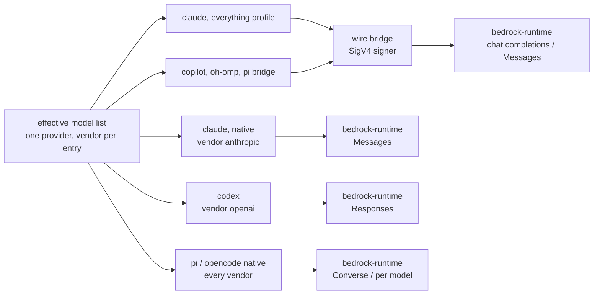

# Bedrock plumbing: which transport reaches Bedrock in each agent, and what you type

**The question.** When you type `yolo -p bedrock -- <agent>`, how does that agent reach Amazon
Bedrock? It can go through its own built-in Bedrock client, or through yolo's wire bridge. This doc
also covers what you type to pick one, and what shape yolo's Bedrock provider takes so that every
agent can read it.

**Status:** DESIGN, 2026-09-25, rewritten after the maintainer's review of that day.
- DECIDED: yolo ships one endpoint family, `bedrock-runtime` ([DIR-BR3](#DIR-BR3)). Every agent
  reaches every Bedrock model, across the whole matrix ([DIR-BR1](#DIR-BR1), [DIR-BR2](#DIR-BR2)).
  claude gets a native profile and an everything profile ([OQ-BR11](#OQ-BR11)). pi gets its native
  Converse client and a bridge route ([OQ-BR5](#OQ-BR5)). A launch refuses when no region is
  visible ([OQ-BR6](#OQ-BR6)).
- BUILT: nothing of this design except the D1 fix (`f7b14308`, 2026-09-15): the codex derive
  now writes codex's own credential field, `env_key`. The credential half, [`sso-backed-bedrock.md`](sso-backed-bedrock.md), is built.
- MEASURED: yolo's code at `f491d192` and `5e8e64f6` (2026-09-24). The codex, opencode and pi
  Bedrock clients were read statically from their shipped artifacts and never run
  ([§14](#14-evidence-and-how-to-re-check-it)).
- UNMEASURED: no request has reached Bedrock from any agent, through the bridge, or with any of
  the three credentials.

**Needs your ruling:** rule these two together, because the second leans on the first.
- [OQ-BR9](#OQ-BR9): one `bedrock` provider holding every model family? Leaning yes.
- [OQ-BR1](#OQ-BR1): what you type. Leaning `-p bedrock` everywhere, plus one name that forces the
  bridge. It holds only if [OQ-BR9](#OQ-BR9) goes A.

## The Bedrock and provider design set

Yes, the weekly list's three rows are one set of questions. On 2026-09-25 they, and the rest of
this doc's former questions, were split across these eight docs. **34 questions are open across the
set.** Rule them in this order, because each later doc leans on the earlier ones:

| Order | Doc | Its one question | Open |
| :--- | :--- | :--- | :--- |
| 1 | [`provider-switching.md`](provider-switching.md) | what happens to the model id yolo wrote when you drop a profile ([OQ-PS2](provider-switching.md#OQ-PS2), [OQ-PS4](provider-switching.md#OQ-PS4)) | 2 |
| 2 | this doc | one Bedrock provider, and what you type ([OQ-BR9](#OQ-BR9) with [OQ-BR1](#OQ-BR1)) | 2 |
| 3 | [`provider-credential-scope.md`](provider-credential-scope.md) | which credentials and env a profile lets through to which agent ([OQ-CN6](provider-credential-scope.md#OQ-CN6) with [OQ-CN2](provider-credential-scope.md#OQ-CN2) first) | 6 |
| 4 | [`providers-and-profiles-redesign.md`](providers-and-profiles-redesign.md) | what a provider and a profile should mean ([OQ-BR2](providers-and-profiles-redesign.md#OQ-BR2), then [OQ-BR8](providers-and-profiles-redesign.md#OQ-BR8), then the PP questions) | 5 |
| 5 | [`model-lists-and-pickers.md`](model-lists-and-pickers.md) | which models each picker shows, and which yolo picks ([OQ-ML2](model-lists-and-pickers.md#OQ-ML2) first) | 7 |
| 6 | [`wire-bridge-gateway.md`](wire-bridge-gateway.md) | how the bridge signs, and sending all traffic through it ([OQ-WG1](wire-bridge-gateway.md#OQ-WG1) first) | 5 |
| 7 | [`bedrock-web-search.md`](bedrock-web-search.md) | web search on Bedrock profiles | 5 |
| 8 | [`sso-backed-bedrock.md`](sso-backed-bedrock.md) | the SSO credential's last two edges ([OQ-SSO8](sso-backed-bedrock.md#OQ-SSO8), [OQ-SSO9](sso-backed-bedrock.md#OQ-SSO9)), both ruled 2026-09-25 | 0 |

## Where the split ended up

The maintainer asked for this in plain words (*"I'm actually not sure where the split ended up"*).
First, two words, as [`providers.md`](../reference/providers.md) defines them:
- A **provider** is a declaration of where models come from: its region, model ids, and endpoint
  URLs if it has any. You never type it.
- A **profile** is the name you type after `-p`, and it selects one provider. `-p bedrock` picks
  the profile `bedrock` for every agent in the launch, and `-p codex=bedrock` picks it for codex
  alone.

Whether yolo should keep both concepts is
[`providers-and-profiles-redesign.md`](providers-and-profiles-redesign.md)'s question.

1. **One endpoint family, `bedrock-runtime`** ([DIR-BR3](#DIR-BR3)). Mantle, AWS's other
   OpenAI-compatible endpoint, is not shipped, so no name has to say which one.
2. **One provider, `bedrock`, holding every model family.** Each model entry declares its maker
   (its `vendor`). This holds if [OQ-BR9](#OQ-BR9) rules its leaning. Otherwise
   [§6.1](#61-the-provider-shape-one-bedrock-provider-or-two)'s two-provider split ships.
3. **Two transports, and this is the real axis.**
   - The **native client** is the agent's own built-in Bedrock code talking to AWS. yolo supplies
     a region and a model id, never a URL. codex (OpenAI models only), opencode and pi (every
     model) have one; claude has one for Anthropic models only.
   - The **wire bridge** is yolo's in-jail daemon ([`wire-bridge.md`](../reference/wire-bridge.md)).
     The agent speaks its own dialect to the bridge on the jail's loopback. The bridge forwards to
     runtime's OpenAI-compatible route, and will sign the request itself
     ([OQ-BR10](wire-bridge-gateway.md#OQ-BR10), ruled).

   Earlier drafts, and some sibling docs, call these two the *native arm* and the *bridge arm*.
   Those words are retired here and mean exactly the native client and the wire bridge. A third
   route, a plain user provider with an API key and no bridge, is documentation only
   ([§6.3](#63-a-hand-written-api-key-provider-documentation-only)).
4. **claude has two profiles** ([OQ-BR11](#OQ-BR11)).
   - **native** is `-p bedrock` as shipped today: claude's own Bedrock mode, Anthropic models only.
   - **everything** *(coined here)* points claude at the bridge. The bridge forwards Anthropic ids
     untranslated and translates the rest, so one session can switch between Claude and GPT.

   pi likewise gets a native route and a bridge route ([OQ-BR5](#OQ-BR5)).

Each cell below names the transport, then the models it can call. The names are
[OQ-BR1](#OQ-BR1)'s leaning; under [OQ-BR9](#OQ-BR9) B, codex, opencode and pi type
`-p bedrock-gpt` instead ([§6.1](#61-the-provider-shape-one-bedrock-provider-or-two)).

| Agent | You type `-p bedrock` | You type `-p bedrock-bridge` | Delivered by |
| :--- | :--- | :--- | :--- |
| **claude** | native (`CLAUDE_CODE_USE_BEDROCK=1`): **Anthropic models only**, because Messages serves Claude only ([§2](#2-what-bedrock-is--sourced-from-awss-pages)). Shipped today | the everything profile: the bridge, **every model**, Anthropic ids passed untranslated ([OQ-BR11](#OQ-BR11)) | native: shipped; everything: [`wire-bridge-gateway.md`](wire-bridge-gateway.md) |
| **codex** | native (`amazon-bedrock-runtime`, Responses): **OpenAI models only**, since the evidence covers GPT alone; widened when done-condition 5 measures another family | nothing yet. The bridge's one Responses route serves claude's `openai-codex` subscription profile; a Responses pass-through for codex comes later ([OQ-WG5](wire-bridge-gateway.md#OQ-WG5)) | [§6.2](#62-what-each-derive-emits) |
| **opencode** | native (`amazon-bedrock`, routed per model): **every model** | nothing, unless [OQ-WG5](wire-bridge-gateway.md#OQ-WG5) adds a profile | [§6.2](#62-what-each-derive-emits) |
| **pi** | native (`amazon-bedrock` on Converse): **every model**; pi-ai 0.87.1's 165 Bedrock ids are all Converse | the bridge's sign-only chat-completions route, **every model** ([OQ-BR5](#OQ-BR5)) | native [§6.2](#62-what-each-derive-emits); bridge [`wire-bridge-gateway.md`](wire-bridge-gateway.md) |
| **copilot** | no native client, so the bridge: **every model** | the same | [`wire-bridge-gateway.md`](wire-bridge-gateway.md) |
| **oh-omp** | the bridge's [sign-only route](wire-bridge-gateway.md#4-part-3--the-sign-only-openai-chat-completions-route-ruled); its own client speaks mantle (SOURCED, not installed). Models unverified | the same | [`wire-bridge-gateway.md`](wire-bridge-gateway.md); unverified |
| **agy** | nothing: its transport is a closed enum | nothing | nobody; it is the one hole ([§4](#4-what-each-agent-can-actually-do)) |

"Every model" means every entry of the provider's list; which models each filter takes is by the
entry's declared vendor ([§6.1](#61-the-provider-shape-one-bedrock-provider-or-two)).

**Reads with** [`providers.md`](../reference/providers.md) (catalog, selection, derives,
`wire_api`), [`protocol-resolution.md`](../reference/protocol-resolution.md) (why an endpoint-less
provider passes), [`zai-plumbing.md`](../reference/zai-plumbing.md) (the predecessor) and
[`local-model-endpoints.md`](../research/local-model-endpoints.md) (per-agent config surfaces). The
sibling [`sso-backed-bedrock.md`](sso-backed-bedrock.md) owns where the credential comes from. Its
service, adapter and `packs/aws-auth` landed 2026-09-18 (`b94351fe`, `e76e43b2`, `9fc4879d`), and a
podman jail has reached them since 2026-09-20 (`62e553a8`), though never against a live
`aws sso login` ([README](../../packs/aws-auth/README.md)). Its plan's done-condition 7 waits on
this doc's native clients.

---

## 1. Verdict and principles

**Use each agent's own Bedrock client where it has one** (codex, opencode, pi, and claude for
Anthropic models): an endpoint-less provider plus one derive binding per agent. **Put the wire
bridge in front of the same provider** for every agent or model that has no native client; the
bridge signs its own requests. **Ship the hand-written API-key provider and mantle as documented
recipes, not code.**

The native clients are where the leverage is. Three agents already implement Bedrock better than a
plain HTTP provider would: [SigV4](https://docs.aws.amazon.com/IAM/latest/UserGuide/reference_sigv.html) (AWS's
request signing) from whatever the credential chain resolves, or an API key; cross-Region
inference; and in codex's case a first-class `bedrock_api_key` mode in `auth.json`. Rewriting that as "a base URL plus an API key" throws the work away, pins yolo to a URL, and shuts
out the SSO credential, the primary one ([§6.4](#64-the-credential-three-are-supported)).

**P1. An auth mode is a bundle of `{credential channel, environment, model ids}` that moves
together.** This machine's 2026-05 switch from Bedrock to Teams left the Bedrock-shaped model pin
behind, and it failed later as a 404. For Bedrock, the endpoint family and the model id are one
decision. The general form, and the defect it left in selection, is
[`provider-switching.md`](provider-switching.md).

**P2. Where the agent already knows the service, yolo supplies facts, not plumbing.** A provider
with no endpoints says "the client composes its own URL from a region", and packs/claude's
`bedrock` is exactly that. [The credential preflight](../reference/providers.md#the-credential-preflight)
demands nothing for it, and [protocol resolution](../reference/protocol-resolution.md) treats it as
"repointed nothing" and resolves it for every agent (`ResolveProtocol`,
`internal/packload/protocolresolution.go`).

**P3. One model-id spelling per provider entry.** A profile's alias resolves through the one
`models` map once. So an agent-dependent spelling means the map is wrong somewhere, and an
endpoint family is a provider entry, never a switch
([§5](#5-one-endpoint-family--runtime-ships-and-why-not-mantle)).

---

## 2. What Bedrock is — sourced from AWS's pages

SOURCED from AWS's documentation on 2026-09-04, with some rows re-read 2026-09-24/25
([§14](#14-evidence-and-how-to-re-check-it)). No request was made.

| | `bedrock-runtime` (shipped) | `bedrock-mantle` (a recipe) |
| :--- | :--- | :--- |
| Base URL | `https://bedrock-runtime.{region}.amazonaws.com/openai/v1` | `https://bedrock-mantle.{region}.api.aws/openai/v1` per the model cards, `/v1` per the API pages (⚠ disputed) |
| GPT-5.6 Sol id | `us.`/`global.openai.gpt-5.6-sol`; **no in-Region** | bare `openai.gpt-5.6-sol`; **no Geo/Global** |
| GPT-6 Astra | `us.`/`global.openai.gpt-6-astra`, Converse included | `openai.gpt-6-astra`, **`us-west-2` only**, no Converse |
| APIs | Responses, Chat Completions, Converse, InvokeModel, Messages | Responses, Chat Completions, Messages |
| Auth | SigV4 or a Bedrock API key | the same; its SigV4 service name is undocumented |
| IAM | `bedrock:InvokeModel`, `…WithResponseStream` | `bedrock-mantle:CreateInference`, `CountTokens`, `ListModels` |
| Server-side tools (Web Search), `background` | no | yes |
| Price | Global cross-Region inference ≈10% cheaper ($10 vs $11/M input, GPT-6 Astra) | In-Region rate only; per-token otherwise identical |
| AWS's advice | *"For most new applications, use the `bedrock-runtime` endpoint"* | when you need a capability only it has |

> [!IMPORTANT]
> **The model id is a function of the endpoint family, and AWS says so.** The GPT-5.6 Sol card:
> *"On `bedrock-runtime`, name a cross-Region inference profile as the model —
> `us.openai.gpt-5.6-sol` or `global.openai.gpt-5.6-sol`."* The bare id is mantle's spelling.
> Sending it to runtime is the P1 failure, and it surfaces as a model error rather than an
> endpoint error.

- **Bedrock is not only OpenAI.** SOURCED 2026-09-24. Runtime's `/openai/v1/chat/completions`
  serves DeepSeek, Qwen3/Qwen3 Coder, Kimi, GLM, MiniMax, Mistral/Devstral, Grok, Nemotron,
  Gemma 3, GPT-5.x/6, and Anthropic models (AWS's example uses `us.anthropic.claude-sonnet-4-6`).
  It streams and is signed as the service `bedrock`. **Messages serves Claude only**, so a
  non-Anthropic model reaches claude only by translation.
- **The credential is not this design's choice.** Both endpoints take SigV4 or a Bedrock API key.
  Which one a jail carries is [`sso-backed-bedrock.md`](sso-backed-bedrock.md)'s question.
- **Runtime has no model-list endpoint and no search.** There is no `GET /openai/v1/models`, and
  Web Search is mantle-only. The replacements are in
  [`model-lists-and-pickers.md`](model-lists-and-pickers.md) and
  [`bedrock-web-search.md`](bedrock-web-search.md).

---

## 3. What yolo has today

Only the parts of the built provider system that Bedrock lands on. MEASURED at `f491d192` and
`5e8e64f6`.

- **One `bedrock` provider exists, and it is claude's.** `packs/claude/pack.json` ships four
  contributions as a set: a provider `bedrock` (no endpoints, no `api_key_env_name`, no models); a
  profile `bedrock` selecting it; a profile-gated `env` setting `CLAUDE_CODE_USE_BEDROCK=1`; and a
  profile-gated `config-overlay` writing the same key into `claude/settings`. It is
  [the worked example](../reference/providers.md#two-channels-split-by-payload-type) in
  `providers.md`. `packs/aws-auth` gates its credential pointer on the profile name `bedrock`;
  [`provider-credential-scope.md`](provider-credential-scope.md) has why that leaks.
- **Only the claude derive reads `region`**, mapping `p.region` to `AWS_REGION`. The `Region`
  field's comment in `internal/packdecl/contributes.go` reads *"Region is the region a regional
  provider is reached through — Bedrock's address half"*.
- **Every other derive drops an endpoint-less provider.** codex, pi, opencode and oh-omp gate
  their catalog row and selection on a `providerEndpoint` helper, which returns nil when no URL is
  named. copilot's derive composes nothing for such a provider, and a comment there names Bedrock.
- **Provider names are sole-owned across packs** (`KindProvider`, `CombineExclusive`,
  `internal/packdecl/kinds.go`). Two packs shipping one name refuse the launch; one pack shipping
  two names is ordinary.
- **The wire bridge carries a declared provider to claude and copilot, with an API key only.**
  `adaptEndpoints` gives an `openai` endpoint an `anthropic` twin at the bridge's loopback.
  `routeFor` accepts only `openai-chat-completions`. The bridge sends the key that
  `api_key_env_name` names, and nothing in the tree signs SigV4
  ([`wire-bridge-gateway.md`](wire-bridge-gateway.md)).

**So:** claude on Bedrock is wired but unmeasured. claude and copilot reach Bedrock's other models
through the bridge with an API key. codex, opencode and pi cannot see Bedrock at all.

---

## 4. What each agent can actually do

Verified from shipped artifacts, not documentation, except where noted
([§14](#14-evidence-and-how-to-re-check-it)).

| Agent | Native Bedrock support | How it authenticates | Evidence |
| :--- | :--- | :--- | :--- |
| **claude** | **Anthropic only**: `CLAUDE_CODE_USE_BEDROCK=1` drives Messages | the AWS chain plus `AWS_REGION`; `AWS_BEARER_TOKEN_BEDROCK` present in the binary, precedence not read | claude 2.1.282, 2026-09-24 |
| **codex** | built-ins `amazon-bedrock` (mantle) and `amazon-bedrock-runtime`, both `wire_api = responses`; `model_catalog_json` | `AWS_BEARER_TOKEN_BEDROCK` first, else the SDK chain; region from `aws.region`, `AWS_REGION` or `AWS_DEFAULT_REGION` | codex-cli **0.156.1**, 2026-09-24 |
| **opencode** | built-in `amazon-bedrock`, `options: {region, profile, endpoint}` | bearer over chain; region from `options.region`, else `AWS_REGION`, **else silently `us-east-1`** | opencode 1.18.32, 2026-09-22/24 |
| **pi** | built-in `amazon-bedrock` on `bedrock-converse-stream` | stored key, `AWS_BEARER_TOKEN_BEDROCK`, `AWS_PROFILE`, access keys, container-credentials vars, web identity; `AWS_BEDROCK_SKIP_AUTH=1` disables | pi-ai **0.87.1** |
| **copilot** | none; the bridge, whose `anthropic` endpoint its derive prefers | the bridge ignores `COPILOT_PROVIDER_API_KEY` and sends its own | `packs/copilot/derive.lua` |
| **oh-omp** | **unverified**; not installed here, and `packs/omp` shipped after drafting | — | — |
| **agy** | none; its transport is a closed enum (`ccpa`/`gemini`/`stubby`) | — | [`local-model-endpoints.md`](../research/local-model-endpoints.md) §"agy" |

**The convergence is the finding** (INFERRED from the SOURCED reads). codex, opencode and pi
(since pi-ai 0.87.1) agree on the provider id `amazon-bedrock`, the API-key variable
`AWS_BEARER_TOKEN_BEDROCK`, the precedence (an API key over the chain) and the region knobs. That
is a de-facto interface, and yolo's job is to feed it. The precedence is why a jail never
carries a key beside a chain credential.

**Where they diverge is the endpoint family**, which stays invisible until the first request.
- **codex.** Its `amazon-bedrock` is a mantle client: it bakes
  `https://bedrock-mantle.{region}.api.aws/openai/v1` (`amazon_bedrock/mantle.rs`), maps
  `gpt-5.6-sol` to bare `openai.gpt-5.6-sol`, and keeps its own region allowlist. Between 0.145.0
  and 0.156.1 it gained `amazon-bedrock-runtime` (`runtime.rs`, a `.amazonaws.com/openai/v1`
  suffix), whose catalog has `global.` ids for `-terra` and `-luna`. Read from strings; what it
  sends is INFERRED.
- **opencode** routes per model: bare ids to mantle, geo-prefixed ids to runtime
  ([§14](#14-evidence-and-how-to-re-check-it)).
- **pi** drives Converse, which runtime alone serves. ⚠ Its catalog lists bare
  `openai.gpt-5.6-sol` against a runtime URL: the P1 failure, shipped by a vendor.

So without intervention, codex and pi want different spellings of the same model, which P3 forbids.

---

## 5. One endpoint family — runtime ships, and why not mantle

**The ruling: yolo ships `bedrock-runtime` only.** The maintainer, 2026-09-25: *"let's skip
mantle"* ([DIR-BR3](#DIR-BR3)). Mantle is not refused. It is a documented manual recipe, revisited
when someone needs a model or feature only mantle serves. SOURCED
([§14](#14-evidence-and-how-to-re-check-it)):

- **Runtime serves every model family mantle does, plus Converse**, and is ≈10% cheaper through
  Global cross-Region inference, which is runtime's alone. That holds per family, not per model:
  a model only mantle serves is the revisit trigger.
- **AWS recommends runtime**, and mantle's signing is undocumented and its base path disputed.
- **Mantle needs its own IAM set** and would double the
  [matrix](#67-the-whole-matrix--every-agent-every-model-every-credential).

The evidence for each is in [§14](#14-evidence-and-how-to-re-check-it).

**What mantle alone offers:** server-side tools, background inference, and Projects and
Workspaces. The one a coding agent would use is Web Search, which covers GPT-5.4 to 5.6 in three
US Regions. The agents here drive client-side tools, which runtime serves, and search comes from
AgentCore instead ([`bedrock-web-search.md`](bedrock-web-search.md)).

**The mantle recipe** is [§6.3](#63-a-hand-written-api-key-provider-documentation-only)'s entry with mantle's
base URL and bare ids, declared as its own provider (P3). It carries only a Bedrock API key,
because the bridge's signer signs for runtime's host alone. Claude Code's
`CLAUDE_CODE_USE_MANTLE=1`, with `anthropic.`-prefixed ids, is the claude half. It goes in the user
guide ([§12](#12-what-i-would-build-in-order), step 7).

**A family is a provider entry, never an option.** The model id is a function of the family.
`options` is a flat map a derive reads, while `models` is a provider field the option layer never
touches. A family option would move the endpoint and leave the ids behind, which is P1 with a knob.

**codex reaches runtime with no override** (INFERRED from 0.156.1 strings; codex was not run). The
derive selects `amazon-bedrock-runtime` and writes only `aws.region`, and nothing yolo ships
selects the mantle built-in. An older codex falls back to an override its guard permits
(verbatim, 0.156.1):

> `` model_providers.<id> only supports changing `base_url`, `auth`, `http_headers`, `aws.profile`, `aws.region`, `aws.credential_export`, and `aws.auth_refresh`; ``

The override is `model_providers.amazon-bedrock.base_url =
https://bedrock-runtime.{region}.amazonaws.com/openai/v1`, beside `aws.region`. The list grew by two
`aws.*` keys between 0.145.0 and 0.156.1, which is why [R1](#11-risks) pins the version.

---

## 6. The proposed shape

### 6.1 The provider shape: one `bedrock` provider, or two

**Under [OQ-BR9](#OQ-BR9)'s leaning (A), one runtime provider holds every model family.** It keeps
the name `bedrock` and moves out of packs/claude into a new `bedrock` pack, which packs/claude
`needs` (as it needs `openai-auth`). It must move, because a provider every agent reads needs an
owner every jail selects, and sole ownership rules out packs/claude. The new pack has no CLI; it
is declarative facts, like `packs/zai`.

Each model entry declares its **vendor** *(coined here)*: the model's maker, as an open-vocabulary
lowercase string (`anthropic`, `openai`, `deepseek`, …). Derives read it, core does not interpret
it, and it is never parsed from the id. Each derive resolves the default among the entries its
agent can call; which vendors each agent and transport takes, and the evidence for each filter, is
the "models it can call" half of [the per-agent table](#where-the-split-ended-up).

An entry with no vendor, such as a user's string-form entry, is offered to every agent, as today.
The shipped entries come from a built-in pack, ruled 2026-09-25
([OQ-BR3](model-lists-and-pickers.md#OQ-BR3)). How a pack carries object-form entries with a
`vendor` is [`model-lists-and-pickers.md`](model-lists-and-pickers.md)'s. How a derive recognizes
the provider as Bedrock without matching its name is
[OQ-BR2](providers-and-profiles-redesign.md#OQ-BR2), and **the native derives are built after that
rules**.

```jsonc
// packs/bedrock/pack.json under option A: the shape, not the file
{ "name": "bedrock", "contributes": [
    { "kind": "provider", "name": "bedrock",       // the Bedrock marker is OQ-BR2's
      "region": "us-east-1",
      "options": { "model": "default", "aws_profile": null } },   // entries: model-lists doc
    { "kind": "profile", "name": "bedrock", "provider": "bedrock" } ] }
```

There is no endpoint-family field ([OQ-BR7](#OQ-BR7)): consumers compose runtime's host from
`region`, and a mantle recipe carries its own URL. No entry declares `api_key_env_name`, so it
points at no credential, and one entry serves all three
([§6.4](#64-the-credential-three-are-supported)).

**What ships if [OQ-BR9](#OQ-BR9) goes B.** claude's `bedrock` stays in packs/claude with
Anthropic ids. A new `bedrock` pack ships a provider `bedrock-openai` with
`global.openai.gpt-5.6-*` ids for codex, pi and opencode, selected by the profile `bedrock-gpt`.
The reason: one `default` alias cannot name an Anthropic id for claude and a GPT id for codex. The
`Name` field's comment calls that the ordinary case (*"one pack shipping two names is two
contributions"*).

### 6.2 What each derive emits

Each binding lives in its agent's own derive: core learns no agent's vocabulary and resolves no
model ([OQ-CS8](../reference/providers.md#oq-cs8)).

| Agent | Catalog | Selection | Region / profile |
| :--- | :--- | :--- | :--- |
| **codex** | `[model_providers.amazon-bedrock-runtime]` with `aws.region`. `base_url` only for codex older than 0.156.1, and then on `amazon-bedrock`. No other field: codex refuses them (D3) | `model_provider = "amazon-bedrock-runtime"`, `model = <id>` | `aws.region` from `region`; `aws.profile` from `aws_profile` |
| **opencode** | `provider["amazon-bedrock"] = { options: { region, profile? }, models: {…runtime-spelled ids…} }`, with **no `npm` and no `endpoint`/`baseURL`** | `model = "amazon-bedrock/<id>"` | `options.region`, `options.profile` |
| **pi** (native half of [OQ-BR5](#OQ-BR5)) | bind to pi's built-in `amazon-bedrock`, with no `baseUrl` and no `api`. `providers["amazon-bedrock"].models` adds only runtime-spelled ids the built-in lacks; pi's docs say a `models` entry *"adds or replaces a model with the same ID on that provider"* | `defaultProvider = "amazon-bedrock"`, `defaultModel = <id>` | `AWS_REGION` in the jail env |
| **claude** | none; claude has no catalog | env, as today | `AWS_REGION` from `region` |

**codex's row** is INFERRED from binary strings. **pi's row** was re-read for this rewrite at
pi-ai 0.87.1, the copy yolo's launcher installed here (read, not run). `amazon-bedrock` sits on
`bedrockConverseStreamApi()`, and its catalog holds 165 ids, all Converse. Its region comes from an
inference-profile ARN in the id, else `options.region`/`AWS_REGION`/`AWS_DEFAULT_REGION`, else the
catalog entry's endpoint region, else `us-east-1`. The earlier row targeted 0.82.1's bare API id;
pi changes fast, so re-read it at the shipping version.

**opencode's row** omits a provider-level `npm` and any `endpoint`/`baseURL`, because either one
drags opencode's bare ids off mantle and onto runtime; a bare id a user adds still reaches mantle
through opencode's own catalog. ⚠ `options.region` alone does not enable the provider: it needs one
of six credential signals, and each supported credential supplies one. The reading behind both is
in [§14](#14-evidence-and-how-to-re-check-it).

Selection keys ride the reserved `selection` namespace, unchanged: they are written on activation
and never on absence, and an interactive `/model` still stands.

### 6.3 A hand-written API-key provider (documentation only)

An agent or model with no native path, or a user who wants a plain HTTP provider, needs no yolo
code. It needs an ordinary user-scope `providers` entry. A workspace file carrying
`endpoints.<protocol>.base_url` is a fatal config error
([providers.md, Current values](../reference/providers.md#current-values)).

```jsonc
"providers": { "bedrock-gw": {
  "endpoints": { "openai": { "base_url": "https://bedrock-runtime.us-east-1.amazonaws.com/openai/v1",
                             "wire_api": "openai-chat-completions" } },
  "api_key_env_name": "AWS_BEARER_TOKEN_BEDROCK",
  "models": { "default": "global.openai.gpt-5.6-sol" } } }
```

**The `wire_api` must be `openai-chat-completions`**, the one dialect the bridge translates to. In
a jail with packs/claude the bridge fronts the entry, so claude and copilot reach it and pi
catalogs it directly. codex gets no row, because it speaks Responses only. Any runtime
chat-completions id works. INFERRED end to end. The user writes the region into the URL: a
`${region}` template would need interpolation the composer lacks and the URL validator rejects.

> [!WARNING]
> **Today this provider carries an API key and nothing else.** That has three consequences:
> - an SSO or static-key user needs a minted key, which is
>   [option D](sso-backed-bedrock.md#4-five-options) and unbuilt;
> - a bearer beside `aws-auth`'s pointer is refused, so this provider and SSO cannot share a jail;
> - an account denying `bedrock:CallWithBearerToken` rejects every request.
>
> For claude and copilot, the bridge's signer ([OQ-BR10](wire-bridge-gateway.md#OQ-BR10)) removes
> all three.

<a id="65-the-credential-three-are-supported"></a>

### 6.4 The credential: three are supported

The maintainer ruled on 2026-09-24 that yolo supports three Bedrock credentials. The ruling is
recorded as [OQ-SSO7](sso-backed-bedrock.md#13-decision-ledger) in the doc that owns credentials:
*"We will support bearer tokens, we will support secret and key, and we also need to support
sessions through single sign-on. That's the big one."* This section rules nothing.

- A **Bedrock API key** is AWS's Bedrock-only credential. It is sent as-is as
  `Authorization: Bearer`, read from `AWS_BEARER_TOKEN_BEDROCK`, and "bearer" here means only
  this. A long-term key expires in anywhere from a day to never; a short-term key is a
  SigV4-presigned token that lives at most 12 hours. It is not an access key.
- A **chain credential** *(coined here)* is anything the
  [AWS credential chain](https://docs.aws.amazon.com/sdkref/latest/guide/standardized-credentials.html)
  resolves. It is signed onto each request with SigV4 and never sent as-is.

| | Credential | Reaches a jail through | The agent | Refreshes in a running jail? |
| :--- | :--- | :--- | :--- | :--- |
| **1** | a Bedrock API key | `env_sources` → `AWS_BEARER_TOKEN_BEDROCK` | sends it as a bearer | no, frozen at launch |
| **2** | a static key and secret | `env_sources` → `AWS_ACCESS_KEY_ID` / `AWS_SECRET_ACCESS_KEY` | signs (chain credential) | nothing to refresh |
| **3** | an SSO session via an assumed role (**primary**) | `packs/aws-auth`'s pointer `AWS_CONTAINER_CREDENTIALS_FULL_URI` | fetches and signs (chain credential) | yes, the host re-mints it |

**The native clients need nothing credential-specific.** Every native client takes a bearer if one is
set, and a chain credential otherwise. So any one of the three works, the preflight demands none,
and this design writes no credential anywhere.

> [!WARNING]
> **Never two at once.** Every measured client prefers a bearer, so credential 1 beside credential
> 3 silently uses the frozen bearer. yolo refuses that launch, with no hatch (`internal/awschain`;
> [`sso-backed-bedrock.md` §8](sso-backed-bedrock.md#8-behaviour-this-design-specifies)).
> ⚠ Static keys beside the pointer fail the same way, because the chain's environment provider
> comes first. Nothing refuses that yet; [OQ-SSO8](sso-backed-bedrock.md#OQ-SSO8) ruled that it
> will, declared by `aws-auth` rather than hardcoded in core, and never with a false positive.

A bearer minted from `aws-auth`'s narrowed, role-chained session lives at most an hour (INFERRED
from STS's caps). That is why the bridge signs rather than carrying a minted key. AWS's guidance on
each credential, and option D's retirement ([OQ-SSO9](sso-backed-bedrock.md#OQ-SSO9), ruled
2026-09-25: yolo mints no bearer), are [`sso-backed-bedrock.md`](sso-backed-bedrock.md)'s.

### 6.5 Every Bedrock model, in every agent — the direction

**The maintainer's direction, 2026-09-24** ([DIR-BR1](#DIR-BR1)): model choices are current at
launch for claude, codex and the rest, and a company pack selects the interesting models and
presents them everywhere. *"Claude should be able to use all of those models with basically no
change."* Most of it is true already: claude and copilot reach every runtime chat-completions
model through the bridge with an API key ([§3](#3-what-yolo-has-today)). Three pieces are missing:

| Missing piece | Where it is designed |
| :--- | :--- |
| the bridge taking the other two credentials (a SigV4 signer, ruled but unbuilt) | [`wire-bridge-gateway.md`](wire-bridge-gateway.md) |
| one provider shape every agent reads | [§6.1](#61-the-provider-shape-one-bedrock-provider-or-two) |
| a model list an org can ship and every picker renders | [`model-lists-and-pickers.md`](model-lists-and-pickers.md) |



### 6.6 IAM, per use

SOURCED from AWS's endpoints, model API compatibility and AgentCore gateway pages, 2026-09-24/25.

| Use | Actions the jail's credential needs |
| :--- | :--- |
| runtime: native clients, chat completions, Messages | `bedrock:InvokeModel`, `bedrock:InvokeModelWithResponseStream`, plus `project/default` ([R5](#11-risks)) |
| web search through an AgentCore gateway | `bedrock-agentcore:InvokeGateway` on the gateway ARN; `InvokeWebSearch` belongs to the gateway's own role |

The `aws-auth` README's example policy grants only the first row, and
[`bedrock-web-search.md`](bedrock-web-search.md) carries that trap. Mantle's `bedrock-mantle:*`
actions are the recipe user's to grant.

### 6.7 The whole matrix — every agent, every model, every credential

**The requirement** ([DIR-BR2](#DIR-BR2), 2026-09-24): *"We need to support single sign on through
all of the methods so I can use any model. I want to use Kimi in Claude through Bedrock by just
choosing it in the menu, or I want to use OpenAI and then I want to switch to Claude. So we got to
support everything everywhere, the whole matrix."* A cell is one agent, one model family and one
credential. Every cell must work, and each model must be one pick in the agent's own menu. This is
the umbrella acceptance runbook.

| Agent | Anthropic models | Other models | API key | Static / SSO | Web search | Delivered by |
| :--- | :--- | :--- | :--- | :--- | :--- | :--- |
| **claude** | native, or everything pass-through | everything, bridge | yes | native yes; bridge needs the signer | AgentCore preset | native shipped; rest [`wire-bridge-gateway.md`](wire-bridge-gateway.md), [`model-lists-and-pickers.md`](model-lists-and-pickers.md) |
| **codex** | native (measure: done 5) | native | yes | yes, via the chain | preset | [§6.2](#62-what-each-derive-emits) |
| **opencode** | native | native | yes | yes | preset | [§6.2](#62-what-each-derive-emits) |
| **pi** | native Converse, or bridge | native Converse, or bridge | yes | yes | preset, via pi's MCP adapter | [§6.2](#62-what-each-derive-emits); [`wire-bridge-gateway.md`](wire-bridge-gateway.md) |
| **copilot** | bridge | bridge | yes | needs the signer | preset | [`wire-bridge-gateway.md`](wire-bridge-gateway.md) |
| **oh-omp** | the bridge's sign-only route | same | yes | needs that route | **none**: no MCP table | [`wire-bridge-gateway.md`](wire-bridge-gateway.md); unverified |
| **agy** | no Bedrock transport | — | — | — | — | **the one hole** |

The search column is [`bedrock-web-search.md`](bedrock-web-search.md)'s. Under an API key alone
there is no search, because a bearer cannot sign. **Done means the matrix, measured:** a cell counts
as built only once a request has gone through it on a real host. That is checked by a manual
runbook, not a test, because automated tests never make API calls (done-condition 11).

---

## 7. Traps — read before writing code

**D3. codex actively manages its `amazon-bedrock` entry.** MEASURED by a string search of the
0.156.1 binary, which carries *"Amazon Bedrock login cannot select `X` because `Y` sets
`model_provider` to `Z`"*, *"selected Codex-managed Amazon Bedrock API key is no longer
available"* and *"…configured to use `aws.credential_export`. Please clear this setting…"*.
(0.145.0's *"retrying once"* message is gone.) So a field beyond the permitted seven is refused,
not ignored. And pinning `model_provider` blocks `codex login` for Bedrock while the profile is
active, which is acceptable but must be in the briefing.

⚠ The derive's generic catalog row cannot be reused. Every row carries `name` and `wire_api`, plus
`env_key` when a variable is named; `name` is there because codex refuses an empty one
(`TestCodexDeriveSetsModelProviderName`). None of the three is among the seven. Whether codex
accepts one set to its built-in default is UNMEASURED.

**D4. codex may not know the pinned runtime ids.** Its catalog holds mantle spellings, plus
`global.` ids for `-terra` and `-luna` but none for `-sol` (MEASURED by binary search). An unknown
id yields *"Unknown model … This will use fallback model metadata"*: the request works, but the
context-window and pricing metadata are wrong. That is the accepted cost of the runtime pin.

D2, D5, D6 and D7 moved with their questions ([Where the rest went](#where-the-rest-went--moved-on-2026-09-25)).

---

## 8. Behaviour this design fixes

Written for the implementer. Anything not here and not an open question is theirs.

**Degenerate inputs.**
- **No region: refuse the launch** ([OQ-BR6](#OQ-BR6), ruled). Refuse only when the selected
  Bedrock provider declares no `region` **and** the composed jail environment holds neither
  `AWS_REGION` nor `AWS_DEFAULT_REGION`, both of which yolo can see. The refusal names the three
  places. An `~/.aws/config` region is unproven, and unproven emits nothing. Without the refusal,
  codex fails at first request, and opencode and pi silently use `us-east-1`, a region nobody chose.
- **An empty `models` map, or a missing alias:** emit the catalog row and omit the model key. The
  agent resolves its own model.
- **A profile for an agent with no path** writes nothing and warns nothing, like any unreachable
  provider today. That covers agy; oh-omp until its support is read; copilot until the bridge
  serves a Bedrock provider; and codex and opencode under a bridge-forcing profile
  ([OQ-BR1](#OQ-BR1)).
- **Two Bedrock-marked providers** are two catalog rows, and only the selected one gets a selection.

**Failure paths.**
- **Credential absent.** The native provider declares no `api_key_env_name`, so the preflight
  demands nothing. Failure is the agent's AWS auth error at first request. The hand-written API-key
  provider ([§6.3](#63-a-hand-written-api-key-provider-documentation-only)) declares one, and is
  preflighted.
- **Credential expiry.** Only credential 1 and credential 3's SSO session can expire. codex reports
  *"…its AWS signature has expired… If `AWS_BEARER_TOKEN_BEDROCK` is set, update or unset it, then
  restart Codex."* This design refreshes nothing: refresh is
  [`sso-backed-bedrock.md` §7](sso-backed-bedrock.md#7-refresh--what-happens-when-you-log-in-again)'s,
  and nothing refreshes a bearer.
- **Region does not serve the model.** The user sees AWS's model error, or codex's *"Amazon Bedrock
  does not support region …"*. yolo carries no region allowlist, since one would rot within a
  quarter.

**Defaults.** The endpoint family is not a setting. `region` is `"us-east-1"`, shipped and
user-overridable. `aws_profile` is `null`, meaning use the chain. The model alias is the profile's
`model` option, else `default` ([OQ-CS3](../reference/providers.md#oq-cs3)). The native bindings add no
timeouts or retries.

**Trigger:** once per launch in the ordinary boot render, plus the host notch's env derive at
`yolo host -- <agent>`. There is no watcher. **One writer:** yolo owns the catalog rows it renders
(`model_providers.amazon-bedrock-runtime`, `provider["amazon-bedrock"]`, pi's `providers` entry)
as managed layers re-asserted every boot. Selection keys ride `selection`, so a user's interactive
choice wins until yolo's own value changes. codex owns `auth.json`.

**Forbidden:** a codex Bedrock field outside the seven; a credential value in the composed table
or `YOLO_PROVIDERS` (the name crosses, and the value is hydrated per derive); a selection whose
provider the catalog dropped; a region allowlist or model catalog in core (the ruled built-in model
pack is a pack).

**What done looks like.** The numbers are kept from the earlier draft; the rest moved.
- **1.** `yolo -p bedrock -- codex` completes one turn against GPT-5.6, in a jail with one
  credential and a region, and `codex doctor` reports `amazon-bedrock-runtime`, `responses` and
  `bedrock-runtime.<region>`. The name is [OQ-BR1](#OQ-BR1)'s; it would be `-p bedrock-gpt` under
  [OQ-BR9](#OQ-BR9) B.
- **1b.** Condition 1 holds under each of the three credentials, one per jail.
- **2.** The same flag completes one turn on opencode and on pi, against the same id.
- **5.** A user entry with no vendor naming an Anthropic id reaches Claude through codex with no
  yolo change. That turn is also the measurement that widens codex's filter
  ([§6.1](#61-the-provider-shape-one-bedrock-provider-or-two)). *(Restated 2026-09-25: the old
  wording, overriding `providers.bedrock-openai.models` to Anthropic ids, contradicted the vendor
  filter.)*
- **7.** claude's native `bedrock` profile completes a turn against an Anthropic id, and its picker
  lists only Anthropic entries.
- **11.** The matrix ([§6.7](#67-the-whole-matrix--every-agent-every-model-every-credential)). On
  a real host, one request per cell completes: each agent, an Anthropic and a non-Anthropic model
  where its transport carries both, and each credential, with each model picked from the agent's
  own menu. It is run by hand from a runbook.

---

## 9. Non-goals

- **No credential lifecycle**: no rotation, minting, refresh daemon or broker. That is
  [`sso-backed-bedrock.md`](sso-backed-bedrock.md)'s, and it is built. The signer reading the chain
  and caching until expiry is consumption.
- **No `~/.aws` mount.** It disables the SSO credential while looking like it works, and yolo refuses it
  wherever a loophole serves container credentials
  ([`sso-backed-bedrock.md` §8](sso-backed-bedrock.md#8-behaviour-this-design-specifies)).
- **No new agent.** copilot and agy get no invented native path.
- **No canonical Converse `wire_api`.** [OQ-BR5](#OQ-BR5) ruled that pi gets both routes. As a
  design consequence, not part of the ruling, the native route binds pi's own
  `bedrock-converse-stream` as a per-agent fact, and the bridge version speaks OpenAI
  chat-completions.
- **No mantle in what yolo ships**: no shipped provider, profile or derive branch names it.
- **Not a rewrite of claude's native mode.** packs/claude's four contributions stay, except as the
  gate fix in [`provider-credential-scope.md`](provider-credential-scope.md) narrows them.

"No bridge for an agent that has a native client" is **withdrawn for pi** by
[OQ-BR5](#OQ-BR5)'s ruling (claude's everything profile was already its exception). For codex,
opencode and every other agent it stands until [OQ-WG5](wire-bridge-gateway.md#OQ-WG5) rules.

---

## 10. Alternatives considered

| Alternative | Verdict |
| :--- | :--- |
| **A hand-written API-key provider only** | **Rejected as primary; kept as a recipe** ([§6.3](#63-a-hand-written-api-key-provider-documentation-only)). It discards SigV4, the chain, codex's `auth.json` mode and opencode's options, makes yolo own a URL, and carries only an API key, so no SSO |
| **Ship mantle too** | **Rejected by [DIR-BR3](#DIR-BR3)** ([§5](#5-one-endpoint-family--runtime-ships-and-why-not-mantle)) |
| **`endpoint_family` as a profile option** | **Cannot work**: it moves the endpoint and leaves the ids |
| **One `bedrock` provider for every agent** | **Reopened by [OQ-BR9](#OQ-BR9)**: the shared-`default` objection is answered by a per-entry vendor |
| **Move `bedrock` out of packs/claude** | **Reopened by [OQ-BR9](#OQ-BR9)**: a provider every agent reads needs an owner every jail selects |
| **Coin `bedrock-converse` as a fourth `wire_api`** | **Not needed** under [OQ-BR5](#OQ-BR5)'s ruling: native is per-agent, and the bridge route is chat-completions |

---

## 11. Risks

| Risk | Mitigation |
| :--- | :--- |
| **R1.** codex renames `amazon-bedrock-runtime` or stops permitting `base_url`; the list changed between 0.145.0 and 0.156.1 | Both are binary strings ([§14](#14-evidence-and-how-to-re-check-it)). Pin the version and re-verify on upgrade; fall back to a hand-written API-key provider ([§6.3](#63-a-hand-written-api-key-provider-documentation-only)) under a non-reserved id |
| **R2.** D4's fallback metadata mis-estimates a 1M-token context window | Measurable in one session. Fix it with an object-form `context_window` ([`model-lists-and-pickers.md`](model-lists-and-pickers.md)); the mantle recipe is the escape meanwhile |
| **R3.** The shared `amazon-bedrock` id drifts between agents | Each derive owns its spelling, so a rename is one line with provenance |
| **R4.** The design ships on schema reading alone | Every done-condition is a live turn, and `codex doctor` settles codex |
| **R5.** IAM also needs `bedrock:InvokeModel` on `arn:aws:bedrock:{region}:{account}:project/default`, which the invoke-only `matt-bedrock` user may lack | Test with the real account; the AccessDenied names the ARN |

R6 to R11 moved with the bridge, model-list and search designs.

---

## 12. What I would build, in order

1. ~~Fix D1~~: done 2026-09-15.
2. **Rule [OQ-BR2](providers-and-profiles-redesign.md#OQ-BR2)**, whose marker the native derives key
   on.
3. **The `bedrock` pack**: the runtime provider, its profile, and a README on why runtime is the
   one family. It changes nothing observable until step 4. Its entries follow the built-in pack
   ([OQ-BR3](model-lists-and-pickers.md#OQ-BR3)).
4. **The codex binding**: the pin, `aws.region` and the selection, which `codex doctor` verifies
   cheaply.
5. **The opencode and pi native bindings**, each with a provenance comment naming the version read.
6. **Close the gate leaks**, per [`provider-credential-scope.md`](provider-credential-scope.md) and
   [`providers-and-profiles-redesign.md`](providers-and-profiles-redesign.md).
7. **The hand-written API-key provider and mantle recipes** in the user guide, with P1 stated where users hit it.
8. **The direction**, once [OQ-BR9](#OQ-BR9) rules:
   1. the signer ([`wire-bridge-gateway.md`](wire-bridge-gateway.md));
   2. **the shared provider with per-entry `vendor` and the derive filters**, here;
   3. claude's everything profile and pi's bridge route ([`wire-bridge-gateway.md`](wire-bridge-gateway.md));
   4. lists and pickers ([`model-lists-and-pickers.md`](model-lists-and-pickers.md)).
9. **Search**: [`bedrock-web-search.md`](bedrock-web-search.md).
10. **Fold the settled parts into [`providers.md`](../reference/providers.md)**, and retire this doc
    via `system-doc`.

---

## 13. Open Questions

1. 💬 **OQ-BR9: One Bedrock provider, holding every model family, in its own pack?** With mantle
   not shipped, the question is whether one runtime provider carries every family the org selected,
   and who owns it ([§6.1](#61-the-provider-shape-one-bedrock-provider-or-two)). Stakes: whether a
   new vendor is a list entry or a new provider plus profile; whether `-p bedrock` means one thing
   for every agent; and whether claude's `bedrock` leaves packs/claude.

   | Option | Verdict |
   | :--- | :--- |
   | **A.** One runtime provider, every family, a declared `vendor` per entry, owned by a new `bedrock` pack | **Leaning** |
   | **B.** Keep the split: claude's `bedrock` for Anthropic ids, `bedrock-openai` for the rest | A provider per vendor group and a profile per provider; a company pack must know which one to extend |
   | **C.** A, but infer the vendor from the id prefix | Weaker: prefixes vary by inference profile, user ids defeat it, and [`stringly-typed-references-principle.md`](../reference/stringly-typed-references-principle.md) forbids the match |

   It reopens two [§10](#10-alternatives-considered) rows and decides [OQ-BR1](#OQ-BR1)'s premise.
   It sets which ids the built-in pack targets ([OQ-BR3](model-lists-and-pickers.md#OQ-BR3)). It
   makes `-p codex=bedrock` the ordinary gesture, which
   [OQ-BR4](provider-credential-scope.md#OQ-BR4)'s ruling (*"no I don't want it to leak"*) makes
   safe once built. The provider must not declare `web_search`, since on runtime that is false.
   [OQ-PP2](providers-and-profiles-redesign.md#OQ-PP2) may later reshape providers, and does not
   block this.

   _Leaning:_ A. The provider moves into a new `bedrock` pack under its existing name, so
   `-p bedrock` keeps working for claude and starts working for everyone. The same pack ships the
   AgentCore search preset ([`bedrock-web-search.md`](bedrock-web-search.md)). The vendor is
   declared, never parsed.

   <!-- vantage: oq id=OQ-BR9 leaning="A: one runtime provider holding every model family, with a declared per-entry vendor that each derive filters on. It moves out of packs/claude into a new bedrock pack under its existing name, which packs/claude needs, so -p bedrock works for every agent; the same pack ships the AgentCore search preset (bedrock-web-search.md). Never parse the vendor from the id prefix. Rule with OQ-BR1." -->

   **Answer:**
   > _(empty — fill in when decided)_

2. 💬 **OQ-BR1: What does a user type to put an agent on Bedrock, and is "native client or wire
   bridge" something they name?** The maintainer, 2026-09-25, on the earlier version: *"I have no
   idea what any of these are. This is very unclear … maybe bedrock-codex would be the native,
   which is really only useful against the codex agent? would you want that against claude code?
   straight bedrock is better? isn't it really provider native and then the wire bridge. I'm
   actually not sure where the split ended up."*
   [Where the split ended up](#where-the-split-ended-up) answers the last sentence.

   The earlier version weighed vendor names (`bedrock-gpt`, `bedrock-openai`) and `-mantle` names.
   [DIR-BR3](#DIR-BR3) removed the second, and [OQ-BR9](#OQ-BR9)'s leaning removes the need for the
   first. What remains is the axis the maintainer named. Stakes: profile names are typed, and
   expensive to change, and a name that means different things per agent is the confusion itself.

   | Option | Verdict |
   | :--- | :--- |
   | **A.** `-p bedrock` means Bedrock in every agent: its native client where one exists (codex, opencode, pi, and claude for Anthropic), the bridge where none does (copilot, oh-omp). One more profile forces the bridge, spelled for the transport (proposed `bedrock-bridge`) | **Leaning** |
   | **B.** A profile per agent (`bedrock-codex`) | Adds nothing: native is already each agent's default, and `-p codex=bedrock` already scopes a pick |
   | **C.** A profile per vendor (`bedrock-gpt`) | Meaningful only under [OQ-BR9](#OQ-BR9) B; under A the vendor is on each entry and the picker chooses |
   | **D.** `bedrock-native` beside `bedrock-bridge` | The native name is a synonym of `bedrock` everywhere |

   Under A, `-p bedrock-bridge` means claude's everything profile and pi's bridge version
   ([OQ-BR5](#OQ-BR5)). For copilot and oh-omp it is the same as `-p bedrock`. For codex and
   opencode it writes nothing until [OQ-WG5](wire-bridge-gateway.md#OQ-WG5) gives them a bridge
   route, and for agy it writes nothing. claude's
   `-p bedrock` keeps its shipped meaning. Two later questions do not block this:
   - how all-traffic mode is switched on, [OQ-WG2](wire-bridge-gateway.md#OQ-WG2), and which
     native-client agents get a bridge route, [OQ-WG5](wire-bridge-gateway.md#OQ-WG5);
   - whether transport becomes a first-class provider fact,
     [OQ-PP2](providers-and-profiles-redesign.md#OQ-PP2), which may later subsume this.

   _Leaning:_ A. One name, `-p bedrock`, means Bedrock everywhere, by each agent's native client
   where it has one and the bridge where it does not. The only second name forces the bridge, and
   its spelling is yours to rule. No profile is named for an agent or a vendor. Rule it with
   [OQ-BR9](#OQ-BR9).

   <!-- vantage: oq id=OQ-BR1 leaning="One name, -p bedrock, means Bedrock in every agent: the agent's own native client where one exists (codex, opencode, pi, and claude for Anthropic models), the wire bridge where none does (copilot, oh-omp). The only second name is one profile that forces the bridge, spelled for the transport (proposed bedrock-bridge; the spelling is yours): it is claude's everything profile and pi's bridge version. No profile named for an agent (bedrock-codex) or a vendor (bedrock-gpt). Depends on OQ-BR9 going A; rule the two together." -->

   **Answer:**
   > _(empty — fill in when decided)_

3. ✅ <a id="OQ-BR5"></a>[**OQ-BR5**](#OQ-BR5) (ruled 2026-09-25): **Is pi bound through its native
   Converse client, or through runtime's OpenAI-compatible route?** Both ([Decision Ledger](#decision-ledger)). The
   native half is [§6.2](#62-what-each-derive-emits)'s pi row. The bridge half is pi's OpenAI
   chat-completions client pointed at the bridge's sign-only route
   ([`wire-bridge-gateway.md`](wire-bridge-gateway.md)). Its premise: a hand-written API-key provider
   would leave pi needing a bearer because of yolo, not AWS (INFERRED); pi-ai 0.87.1 ships the built-in
   (SOURCED).
4. ✅ <a id="OQ-BR6"></a>[**OQ-BR6**](#OQ-BR6) (ruled 2026-09-25, as its leaning): **Refuse the
   launch when no region is resolvable?** Only when yolo can see none; the rule is in
   [§8](#8-behaviour-this-design-fixes). Its premise: codex refuses and names the sources, while
   opencode 1.18.32 and pi-ai 0.87.1 fall silently to `us-east-1` (read, not run).
5. ✅ <a id="OQ-BR7"></a>[**OQ-BR7**](#OQ-BR7) (answered 2026-09-25 by [DIR-BR3](#DIR-BR3)): **Is
   `endpoint_family` its own field?** No; with one family there is nothing to name. The fact it
   protected now shows as the mantle recipe being its own provider.
6. ✅ <a id="OQ-BR11"></a>[**OQ-BR11**](#OQ-BR11) (ruled 2026-09-24): **How does claude use native
   Bedrock for Anthropic ids and the bridge for the rest?** Both profiles, with the everything
   profile routing by model id; [`wire-bridge-gateway.md`](wire-bridge-gateway.md) owns the routing
   mechanism. It still touches [OQ-BR8](providers-and-profiles-redesign.md#OQ-BR8): the everything
   profile must not set the name-gated `CLAUDE_CODE_USE_BEDROCK`, yet the credential pointer must
   reach the bridge.

### Decision Ledger

| ID | Ruling / Decision | Date | Settled in | Built |
| :--- | :--- | :--- | :--- | :--- |
| <a id="DIR-BR1"></a>DIR-BR1 | **Every agent reaches every Bedrock model its transport can carry, and every picker shows a current list an org can shape with one pack.** Given as a direction in review: *"Claude should be able to use all of those models with basically no change."* | 2026-09-24 | [§6.5](#65-every-bedrock-model-in-every-agent--the-direction) | — |
| <a id="DIR-BR2"></a>DIR-BR2 | **The whole matrix**: every agent, every model its transport carries, every supported credential with SSO included, and every model one pick in the agent's menu. *"We need to support single sign on through all of the methods so I can use any model… So we got to support everything everywhere, the whole matrix."* agy is the one hole | 2026-09-24 | [§6.7](#67-the-whole-matrix--every-agent-every-model-every-credential) | — |
| [OQ-BR11](#OQ-BR11) | **Both claude profiles: native and everything.** *"if you only do native or the rest, then you'll never be able to switch between Claude and, say, OpenAI in one Claude session, which I think we'll want. So I guess just both options."* The bridge routes by model id: Anthropic ids pass untranslated to runtime's Messages, and the rest are translated. It amends the bridge's one-upstream rule. The leaning (two profiles, no routing) was overruled | 2026-09-24 | [Where the split ended up](#where-the-split-ended-up); routing in [`wire-bridge-gateway.md`](wire-bridge-gateway.md) | — |
| <a id="DIR-BR3"></a>DIR-BR3 | **yolo ships `bedrock-runtime` only; mantle is a documented manual recipe.** *"let's skip mantle"*. The reasons are in [§5](#5-one-endpoint-family--runtime-ships-and-why-not-mantle). It is revisited when a model or feature only mantle serves is needed. `-p bedrock-gpt-mantle` and every mantle provider are gone. A direction, so no question id | 2026-09-25 | [§5](#5-one-endpoint-family--runtime-ships-and-why-not-mantle) | — |
| [OQ-BR7](#OQ-BR7) | **Moot under DIR-BR3**: one family, so no `endpoint_family` field. The leaning (its own field) had nothing left to decide | 2026-09-25 | [§6.1](#61-the-provider-shape-one-bedrock-provider-or-two) | — |
| [OQ-BR5](#OQ-BR5) | **Both: pi's native Converse, and a bridge version.** *"native converse is just basically the pi agent's native which we're supplying for all the others and then also there will be the bridge version because I'm sure there will be some different features we can offer and we're just going to want to support both as fully as possible."* | 2026-09-25 | [§6.2](#62-what-each-derive-emits) (native); [`wire-bridge-gateway.md`](wire-bridge-gateway.md) (bridge). Design consequence, not part of the ruling: no canonical Converse `wire_api` is coined, and the bridge version speaks OpenAI chat-completions ([§9](#9-non-goals)) | — |
| [OQ-BR6](#OQ-BR6) | **As its leaning:** *"Refuse only when the provider declares no region AND no AWS_REGION / AWS_DEFAULT_REGION is in the composed jail environment — both of which yolo can see at launch. Anything beyond that (an ~/.aws/config region) is unproven, and unproven emits nothing."* | 2026-09-25 | [§8](#8-behaviour-this-design-fixes) | — |
| [OQ-BR10](#OQ-BR10) | Moved to [`wire-bridge-gateway.md`](wire-bridge-gateway.md#OQ-BR10): the bridge signs its own requests | 2026-09-24 | there | — |
| [OQ-BR16](#OQ-BR16) | Moved to [`wire-bridge-gateway.md`](wire-bridge-gateway.md#OQ-BR16): the everything profile carries the subscription | 2026-09-24 | there | — |
| [OQ-BR17](#OQ-BR17) | Moved to [`wire-bridge-gateway.md`](wire-bridge-gateway.md#OQ-BR17): opt-in per-model failover | 2026-09-24 | there | — |
| [OQ-BR18](#OQ-BR18) | Moved to [`wire-bridge-gateway.md`](wire-bridge-gateway.md#OQ-BR18): the bridge may carry a Claude subscription | 2026-09-24 | there | — |
| [DIR-BR4](#DIR-BR4) | Moved to [`bedrock-web-search.md`](bedrock-web-search.md#DIR-BR4): AgentCore web search on every Bedrock profile | 2026-09-25 | there | — |

---

## Where the rest went — moved on 2026-09-25

The maintainer's review split this doc. Every id keeps its number, and these anchors catch old
links.

| Moved | Home | Notes |
| :--- | :--- | :--- |
| <a id="OQ-BR2"></a>[OQ-BR2](providers-and-profiles-redesign.md#OQ-BR2), the Bedrock marker (the `service` field), and the former section 6.2 | [`providers-and-profiles-redesign.md`](providers-and-profiles-redesign.md) | not ruled; it seeds the redesign |
| <a id="OQ-BR8"></a>[OQ-BR8](providers-and-profiles-redesign.md#OQ-BR8), does a gate key on the name or the provider, and trap D5 | [`providers-and-profiles-redesign.md`](providers-and-profiles-redesign.md) | [OQ-BR4](provider-credential-scope.md#OQ-BR4)'s other direction |
| <a id="OQ-BR4"></a>[OQ-BR4](provider-credential-scope.md#OQ-BR4), the wide env gate, trap D2 and done-condition 3 | [`provider-credential-scope.md`](provider-credential-scope.md) | ruled 2026-09-25: no leak, *"as specific as possible"*; the all-traffic direction it spawned is [DIR-WG1](wire-bridge-gateway.md#DIR-WG1) |
| <a id="OQ-BR3"></a>[OQ-BR3](model-lists-and-pickers.md#OQ-BR3), <a id="OQ-BR12"></a>[OQ-BR12](model-lists-and-pickers.md#OQ-BR12), <a id="OQ-BR13"></a>[OQ-BR13](model-lists-and-pickers.md#OQ-BR13), <a id="OQ-BR14"></a>[OQ-BR14](model-lists-and-pickers.md#OQ-BR14), <a id="OQ-BR15"></a>[OQ-BR15](model-lists-and-pickers.md#OQ-BR15); parts 5 to 8 of the former section 6.6; done-conditions 8 to 10; R8 and R9; the "no model catalog" non-goal | [`model-lists-and-pickers.md`](model-lists-and-pickers.md) | [OQ-BR3](model-lists-and-pickers.md#OQ-BR3) ruled 2026-09-25: a built-in pack picks the models |
| <a id="OQ-BR10"></a>[OQ-BR10](wire-bridge-gateway.md#OQ-BR10), <a id="OQ-BR16"></a>[OQ-BR16](wire-bridge-gateway.md#OQ-BR16), <a id="OQ-BR17"></a>[OQ-BR17](wire-bridge-gateway.md#OQ-BR17), <a id="OQ-BR18"></a>[OQ-BR18](wire-bridge-gateway.md#OQ-BR18); the signer and everything-profile routing (parts 3 and 4 of the former section 6.6); the Claude-subscription route (former section 6.8); done-condition 6; R6 and R7 | [`wire-bridge-gateway.md`](wire-bridge-gateway.md) | all ruled 2026-09-24 |
| <a id="OQ-BR19"></a>[OQ-BR19](bedrock-web-search.md#OQ-BR19), <a id="OQ-BR20"></a>[OQ-BR20](bedrock-web-search.md#OQ-BR20), <a id="OQ-BR21"></a>[OQ-BR21](bedrock-web-search.md#OQ-BR21), <a id="OQ-BR22"></a>[OQ-BR22](bedrock-web-search.md#OQ-BR22), <a id="OQ-BR23"></a>[OQ-BR23](bedrock-web-search.md#OQ-BR23), <a id="DIR-BR4"></a>[DIR-BR4](bedrock-web-search.md#DIR-BR4); the former section 6.9; D6 and D7; done-condition 12; R10 and R11; the AgentCore evidence | [`bedrock-web-search.md`](bedrock-web-search.md) | DIR-BR4 ruled 2026-09-25 |
| static keys beside `aws-auth`'s pointer ([OQ-SSO8](sso-backed-bedrock.md#OQ-SSO8)), option D's retirement ([OQ-SSO9](sso-backed-bedrock.md#OQ-SSO9)), AWS's guidance on the three credentials | [`sso-backed-bedrock.md`](sso-backed-bedrock.md) | ruled there |
| deselection and the id a dropped profile leaves (P1's general form, done-condition 4) | [`provider-switching.md`](provider-switching.md) | — |

---

## 14. Evidence, and how to re-check it

Every third-party fact carries its source and date; re-run these rather than trusting the tables.
Repo claims were verified at `f491d192` (2026-09-24), cited by symbol. No request was made to AWS.

**codex**: the standalone **codex-cli 0.156.1** yolo's launcher installs
(`~/.codex/packages/standalone/releases/0.156.1-x86_64-unknown-linux-musl/bin/codex`). It was read
with `strings` on 2026-09-24 and never executed. A stale npm-global 0.145.0 was read for the
comparisons, and the 2026-09-04 reading was of 0.145.0.

| Claim | String found in 0.156.1 |
| :--- | :--- |
| Built-in provider ids | `responses` `openai` `amazon-bedrock` `amazon-bedrock-runtime` `ollama`; 0.145.0 has no `-runtime` |
| Bedrock modules | `amazon_bedrock/` `auth.rs` `auth_refresh.rs` `catalog.rs` `credential_export.rs` `mantle.rs` `mod.rs` `runtime.rs` |
| Override list | the seven keys quoted in [§5](#5-one-endpoint-family--runtime-ships-and-why-not-mantle); 0.145.0's stopped at `aws.region` |
| Base URLs | `https://bedrock-mantle.` + `.api.aws/openai/v1`; `https://bedrock-runtime.` + `.amazonaws.com/openai/v1` |
| Region sources | ``Amazon Bedrock bearer token auth requires `model_providers.amazon-bedrock.aws.region`, `AWS_REGION`, or `AWS_DEFAULT_REGION` `` |
| Bearer first | `AWS_BEARER_TOKEN_BEDROCK`; *"Bedrock API key auth is only supported by the Amazon Bedrock model provider"* |
| Catalog | `openai.gpt-5.6-{sol,terra,luna}`, `global.openai.gpt-5.6-{terra,luna}` (no `global.` `-sol`), `openai.gpt-6-astra`; `model_catalog_json` (also in 0.145.0) |
| Managed entry, unknown model, region, expiry | the D3/D4 strings ([§7](#7-traps--read-before-writing-code)); *"Amazon Bedrock does not support region …"* (0.145.0: *"…Mantle does not support region"*); *"…its AWS signature has expired"* |

**pi**: pi-ai **0.87.1** (`@earendil-works/pi-coding-agent`, this jail's npm-global), read and never
run on 2026-09-24, then re-read for this rewrite. `dist/providers/amazon-bedrock.js` defines
`amazon-bedrock` on `bedrockConverseStreamApi()` with [§4](#4-what-each-agent-can-actually-do)'s auth
order. `dist/api/bedrock-converse-stream.js` takes the bearer from options or
`AWS_BEARER_TOKEN_BEDROCK`, honours `AWS_BEDROCK_SKIP_AUTH=1`, and resolves the region as in
[§6.2](#62-what-each-derive-emits). The bundled catalog has 165 ids, all Converse, and it lists
`openai.gpt-5.6-*` and `openai.gpt-6-astra` bare and `us.`/`global.` against
`bedrock-runtime.us-east-1`. Its `docs/models.md` says a `models` entry *"adds or replaces a model
with the same ID on that provider"*. The 2026-09-04 reading was of 0.82.1, which had only the API
id, and [`local-model-endpoints.md`](../research/local-model-endpoints.md) saw pi's compat block
change within one doc's lifetime. **Re-read pi at the shipping version before writing its derive.**

**opencode**: 1.18.32 (`opencode-linux-x64-baseline`), read statically on 2026-09-22 and 2026-09-24.
It has the comment *"1. Bearer token (`AWS_BEARER_TOKEN_BEDROCK` or /connect)"*, falls back to the
chain, and takes the region from `options.region`, else `AWS_REGION`, else `"us-east-1"`.

> [!WARNING]
> **opencode, MEASURED 2026-09-22 statically from the installed 1.18.32 bundle; no agent was
> started.** It already routes Bedrock's OpenAI-shaped models to mantle by default:
> - its vendored `@ai-sdk/amazon-bedrock` 4.0.166 ships a mantle factory;
> - its models.dev catalog marks 13 models, all three bare GPT-5.6 ids among them, with a
>   per-model mantle `npm`/`api` override;
> - geo-prefixed ids take the runtime default.
>
> A provider-level `npm` overrides those markers (`config.provider?.npm ?? … ?? model.api.npm`),
> and so does `options.endpoint`/`baseURL`. Either one drags bare ids onto runtime. So the derive
> omits both and emits runtime-spelled ids, and a bare id a user adds reaches mantle through
> opencode's own catalog.
>
> ⚠ **`options.region` alone does not enable the provider.** Autoload gates on six credential
> signals: `AWS_PROFILE`/`options.profile`, `AWS_ACCESS_KEY_ID`, a bearer, `options.apiKey`,
> `AWS_WEB_IDENTITY_TOKEN_FILE`, and the container-credentials variables. Each supported
> credential supplies one. Not shown: whether a request reaches AWS.

**claude**: 2.1.282, 2026-09-24. `AWS_BEARER_TOKEN_BEDROCK` occurs in the binary (12 `grep -c -a`
matches), which shows presence only.

**Why runtime ships and mantle does not** ([§5](#5-one-endpoint-family--runtime-ships-and-why-not-mantle)), SOURCED:

| Reason | Evidence |
| :--- | :--- |
| Runtime serves every model family mantle does, plus Converse | ⚠ That holds per family, not per model. AWS names *"a model that is available only on `bedrock-mantle`"* as a reason to use it, and Claude Code says mantle *"has its own model lineup"*. That is the revisit trigger |
| GPT-6 Astra is broad on runtime | US Geo and Global inference on runtime; mantle serves it in `us-west-2` only |
| ≈10% cheaper through Global inference | $10.00 vs $11.00 per M input for GPT-6 Astra, $4.00 vs $4.40 for GPT-5.6 Sol; cross-Region inference is runtime's alone |
| AWS recommends runtime | the endpoints page and the Sol card |
| Mantle's signing is undocumented | third parties sign it as `bedrock-mantle`; its base path is disputed between AWS's own pages |
| Mantle needs its own IAM set | the `bedrock-mantle:*` actions, which `aws-auth`'s example policy does not grant |
| It doubles the matrix | [§6.7](#67-the-whole-matrix--every-agent-every-model-every-credential) |

**AWS** (every row is documentation; nothing was called):

| Claim | Source | Read |
| :--- | :--- | :--- |
| URLs, the id split, region matrices, API tables, `project/default`, the Global discount | GPT-5.6 Sol card, endpoints page | 2026-09-04 |
| ⚠ mantle's path: `/openai/v1` (Sol and Astra cards) against `/v1` (Chat Completions and Responses pages) | those pages | 2026-09-25 / 09-24 |
| Astra: runtime `us.`/`global.` with Converse; mantle *"available only in `us-west-2`"*, no Converse; $10.00 vs $11.00 | GPT-6 Astra card | 2026-09-25 |
| *"For most new applications, use the `bedrock-runtime` endpoint…"*; cross-Region inference is runtime-only; per-token price identical; `bedrock-mantle:CreateInference`; *"Whenever possible, we recommend using the `bedrock-runtime` endpoint"* | endpoints page; Sol card | 2026-09-25 |
| Web Search: mantle Responses only, five GPT models, three US Regions | Bedrock Web Search | 2026-09-25 |
| no WebSearch on Bedrock; mantle has its own Anthropic lineup under `CLAUDE_CODE_USE_MANTLE` | Claude Code on Bedrock | 2026-09-25 |
| all three APIs on both endpoints; runtime chat completions serve the [§2](#2-what-bedrock-is--sourced-from-awss-pages) families; closed GPT needs `us.`/`global.`; signed as `bedrock` under `InvokeModel`(`WithResponseStream`); no `GET /openai/v1/models` on runtime, `GET /v1/models` on mantle; Messages is Claude-only | endpoints, model API compatibility | 2026-09-24 |
| mantle's SigV4 name `bedrock-mantle`, which no AWS page read names | codex `mantle.rs`, oh-my-pi, LiteLLM #31475, openai-go `bedrock` docs | 2026-09-23/24 |
| SigV4 and API keys on both endpoints; the SigV4 `curl` example `--aws-sigv4 "aws:amz:us-east-1:bedrock"`; an API key *"required for OpenAI SDK"* on Responses | endpoints, Chat Completions, Responses pages | 2026-09-24 |
| short-term keys ≤12 h; one `CallWithBearerToken` action per endpoint; long-term key mechanics | API-key pages; IAM user guide | 2026-09-24; 2026-09-04 |

**Sources:**
[Bedrock endpoints](https://docs.aws.amazon.com/bedrock/latest/userguide/endpoints.html) ·
[Model API compatibility](https://docs.aws.amazon.com/bedrock/latest/userguide/models-api-compatibility.html) ·
[GPT-5.6 Sol card](https://docs.aws.amazon.com/bedrock/latest/userguide/model-card-openai-gpt-56-sol.html) ·
[GPT-6 Astra card](https://docs.aws.amazon.com/bedrock/latest/userguide/model-card-openai-gpt-6-astra.html) ·
[Cross-Region inference for GPT-5.6](https://aws.amazon.com/blogs/machine-learning/introducing-cross-region-inference-for-openai-gpt-5-6-models-on-amazon-bedrock/) ·
[Bedrock API keys](https://docs.aws.amazon.com/bedrock/latest/userguide/api-keys.html) ·
[How API keys work](https://docs.aws.amazon.com/bedrock/latest/userguide/api-keys-how.html) ·
[API key permissions](https://docs.aws.amazon.com/bedrock/latest/userguide/api-keys-permissions.html) ·
[Chat Completions](https://docs.aws.amazon.com/bedrock/latest/userguide/inference-chat-completions.html) ·
[Responses API](https://docs.aws.amazon.com/bedrock/latest/userguide/inference-responses-api.html) ·
[openai-go `bedrock`](https://pkg.go.dev/github.com/openai/openai-go/v3/bedrock) ·
[Bedrock API keys (IAM)](https://docs.aws.amazon.com/IAM/latest/UserGuide/id_credentials_bedrock.html) ·
[AWS SDK credential providers](https://docs.aws.amazon.com/sdkref/latest/guide/standardized-credentials.html) ·
[Codex with Amazon Bedrock](https://learn.chatgpt.com/docs/amazon-bedrock) ·
[codex PR #18744](https://github.com/openai/codex/pull/18744) ·
[opencode providers](https://opencode.ai/docs/providers/) ·
[Bedrock Web Search](https://docs.aws.amazon.com/bedrock/latest/userguide/web-search.html) ·
[Claude Code on Amazon Bedrock](https://code.claude.com/docs/en/amazon-bedrock)
