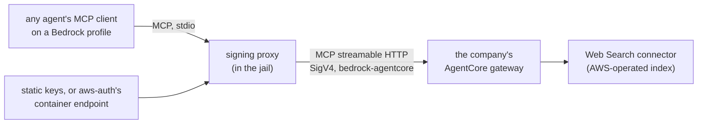

# Web search on every Bedrock profile: the AgentCore MCP preset

**Status:** DESIGN, 2026-09-25. The direction is ruled ([DIR-BR4](#DIR-BR4)) and nothing of it is
built. Split out of [`bedrock-plumbing.md`](bedrock-plumbing.md) on 2026-09-25, where it was section 6.9;
question ids are unchanged. **MEASURED:** yolo's MCP pipeline, read at `6f21b82c` ([§3](#3-what-yolos-mcp-pipeline-does-today)).
**UNMEASURED:** no one has called an AgentCore gateway, and whether each agent offers a native
search tool it cannot use, or passes its environment to an MCP server, is unread
([D7](#d7-unmeasured-two-search-traps-a-derive-can-walk-into)). Every AWS fact is SOURCED from
AWS's pages on the date given in the [evidence appendix](#evidence-and-how-to-re-check-it).

**The question this doc answers.** When an agent talks to Bedrock, how does it search the web,
and when a user's own Tavily search server is also eligible, which one does it get?

**Where things stand.**

- **Ruled:** every Bedrock profile gets web search as an MCP tool served by AWS's AgentCore, on by
  default, *"just like we can include tavily optionally by capability"* ([DIR-BR4](#DIR-BR4)).
- **Also ruled, elsewhere, and it narrows this doc:** a pack may contribute an MCP server entry
  through a new `mcp` kind ([`OQ-MP3`](mcp-presets-removal.md#decision-ledger), 2026-09-20), and the
  core `mcp_presets` list retires ([`OQ-MP6`](mcp-presets-removal.md#decision-ledger)). Neither is
  built. So "a preset like devtools" now means *a pack-shipped `mcp` entry*, the shape
  chrome-devtools itself is moving to.
- **Built:** nothing. The signer this reuses is not built either
  ([`wire-bridge-gateway.md`](wire-bridge-gateway.md#OQ-BR10)).

**Needs your ruling:** [OQ-BR19](#OQ-BR19), [OQ-BR20](#OQ-BR20), [OQ-BR21](#OQ-BR21), [OQ-BR22](#OQ-BR22), [OQ-BR23](#OQ-BR23).

- [OQ-BR19](#OQ-BR19) — where the gateway URL lives. *Leaning:* an environment variable the entry
  lists in `requires_env`.
- [OQ-BR20](#OQ-BR20) — does yolo create the AgentCore gateway? *Leaning:* no; the company does.
- [OQ-BR21](#OQ-BR21) — what shape the signing proxy takes. *Leaning:* a stdio proxy that is a hidden
  `yolo` subcommand, on the bridge's signer.
- [OQ-BR22](#OQ-BR22) — how the Bedrock pack delivers the entry, and only on Bedrock. *Leaning:* an
  `mcp` entry plus a gate on "the selected provider is Bedrock", however that is spelled. Rulable
  now; only build step 9.3 waits on the spelling.
- [OQ-BR23](#OQ-BR23) — AgentCore or the user's Tavily when both are eligible. *Leaning:* AgentCore
  only, with a notice naming what was dropped.

**Reads with:** [`bedrock-plumbing.md`](bedrock-plumbing.md) (how each agent reaches Bedrock at
all), [`mcp-configuration.md`](../reference/mcp-configuration.md) (the MCP pipeline this amends:
pack-contributed entries, the closed preset list; the settled parts fold in there at graduation),
[`mcp-presets-removal.md`](mcp-presets-removal.md) (the `mcp` kind),
[capability-driven MCP delivery](../reference/mcp-configuration.md#capability-driven-mcp-delivery) (the delivery rule this
reuses), [`providers-and-profiles-redesign.md`](providers-and-profiles-redesign.md) (how "this is
Bedrock" gets spelled), [`provider-credential-scope.md`](provider-credential-scope.md) (why nothing
selected for one agent reaches another), [`sso-backed-bedrock.md`](sso-backed-bedrock.md) (where
the AWS credential comes from, and owner of `packs/aws-auth`'s README).

**Words used here.**

- **Bedrock profile** — any launch in which an agent's selected provider is a Bedrock one. A
  **provider** is a declared service (where traffic goes, which credential); a **profile** is the
  name you pick with `-p` that selects a provider for an agent ([`providers.md`](../reference/providers.md)).
  An agent on a Bedrock profile reaches Bedrock one of two ways: its own **native** Bedrock client
  (codex, opencode, pi; claude's *native* profile, which is Claude Code's Bedrock mode), or the
  **wire bridge**, the in-jail daemon that fronts an agent's model traffic
  ([`wire-bridge.md`](../reference/wire-bridge.md)): copilot, and claude's *everything* profile,
  which points `ANTHROPIC_BASE_URL` at the bridge. **Search does not care which**: it is a separate
  MCP connection either way.
- **Runtime** and **mantle** — Bedrock's two endpoint families, `bedrock-runtime` and
  `bedrock-mantle`. yolo ships runtime only ([DIR-BR3](bedrock-plumbing.md#decision-ledger)).
- **MCP** — the Model Context Protocol, by which an agent lists and calls tools a separate server
  offers. **stdio** means the agent spawns the server and speaks over its stdin/stdout;
  **streamable HTTP** is MCP over an HTTPS URL.
- **SigV4** — AWS's request-signing scheme. A signature names a *service* (here
  `bedrock-agentcore`) and a Region. A **bearer** (a Bedrock API key, `AWS_BEARER_TOKEN_BEDROCK`)
  is a token sent as-is and cannot produce a signature.
- **Render target** — one agent's config as rendered for one launch. Gates are evaluated per render
  target, so one agent's selection never decides another's.

---

## 1. Why a Bedrock profile has no search today

| Source of search | On a Bedrock profile |
| :--- | :--- |
| Bedrock's built-in Web Search | **mantle only**: a server-side tool on mantle's Responses API, for `openai.gpt-5.4`, `openai.gpt-5.5` and the three GPT-5.6 models, in `us-east-1`, `us-east-2` and `us-west-2`. Runtime serves no server-side or pre-configured tools |
| Claude Code's WebSearch tool | **absent**: *"The WebSearch tool is not available on Amazon Bedrock"* ([Claude Code on Amazon Bedrock](https://code.claude.com/docs/en/amazon-bedrock)) |
| codex's search | AWS documents it on mantle only (*"Codex … connects to Amazon Bedrock through the `bedrock-mantle` endpoint and can use Web Search"*, CLI 0.147.0 or later) |
| opencode, pi, copilot | nothing Bedrock-specific that has been read |
| Tavily | works anywhere, as a user's own `mcp_servers` entry with a Tavily key ([§3](#3-what-yolos-mcp-pipeline-does-today)) |

So on runtime **no agent has native search, whatever its model**, and search is one mechanism for
every agent that projects yolo's MCP table. SOURCED 2026-09-25 from AWS's endpoints and Web Search pages.

**There is no search under a Bedrock API key alone.** The mechanism below signs, a bearer cannot
sign, and whether AgentCore accepts a Bedrock API key at all is unknown: AWS's API-key actions
(`bedrock:CallWithBearerToken`, `bedrock-mantle:CallWithBearerToken`) name only Bedrock's two
endpoints. Search therefore works under the two signing credentials, static keys and the SSO
session `packs/aws-auth` delivers.

## 2. What AgentCore Web Search is

SOURCED 2026-09-25 from AWS's AgentCore guide and launch post; nothing was called.

- **A managed MCP tool behind a gateway.** An **AgentCore gateway** is an AWS-hosted MCP endpoint
  an account creates. Web Search is one of its built-in **connector targets**
  (`connectorId: "web-search"`). An agent finds it with MCP `tools/list` and calls it with
  `tools/call`, as the tool `WebSearch`: *"Works with … any MCP-compatible client."*
- **Any model.** The gateway serves a tool, and the model that decides to call it is whatever the
  agent runs. That is why it answers "search for every model", where mantle's Web Search answers it
  for five.
- **Data stays in AWS.** *"Customer queries are not sent to a third-party search engine or routed
  outside AWS."* The launch post adds that the query is served in an AWS service account, not the
  customer's.
- **Transport.** MCP streamable HTTP at
  `https://gateway-<id>.gateway.bedrock-agentcore.<region>.amazonaws.com/mcp`. A gateway with IAM
  inbound authorization takes SigV4 requests signed as `bedrock-agentcore`.
- **Inbound authorization** is one of IAM identity, a JWT, authenticate-only (SigV4 checked, no
  authorization decision), or none. **This design serves the two SigV4 types. A JWT-authorized
  gateway is out of scope**: its credential is an OAuth token, not an AWS one.
- **IAM.** The *caller* needs `bedrock-agentcore:InvokeGateway` on the gateway's ARN. The gateway's
  own service role needs `bedrock-agentcore:InvokeWebSearch` on
  `arn:aws:bedrock-agentcore:<region>:aws:tool/web-search.v1`; that role is the company's.
- **Limits.** `query` at most 200 characters; `maxResults` 1–25, default 10. Connector 1.2.0 adds
  per-request domain and date filters; an administrator's domain lists on the target cannot be
  relaxed by the agent.
- **Regions.** `us-east-1`, `eu-west-1`, `ap-northeast-1`. The gateway's Region need not be the
  Bedrock Region a profile uses.
- **Acceptable use.** A user of the results *"must retain and display the source citations and
  links"*.

**IAM per use**, for [`sso-backed-bedrock.md`](sso-backed-bedrock.md) to copy into the
`aws-auth` README ([D6](#d6-live-in-docs-the-aws-auth-example-policy-denies-search)):

| Use | Actions the jail's credential needs |
| :--- | :--- |
| runtime chat (every native client, the bridge) | `bedrock:InvokeModel`, `bedrock:InvokeModelWithResponseStream` |
| web search through an AgentCore gateway | `bedrock-agentcore:InvokeGateway` on the gateway's ARN |

## 3. What yolo's MCP pipeline does today

MEASURED at `6f21b82c`, from the code and [`mcp-configuration.md`](../reference/mcp-configuration.md):

- **One table.** `Env.LoadMCPServers` (`internal/entrypoint/mcp.go`) builds one canonical table
  in-jail from two inputs: the **presets** a user opts into with `mcp_presets`, a closed list core
  owns (`validMCPPresets` in `internal/config/config.go`: `chrome-devtools`, `sequential-thinking`),
  and the user's own `mcp_servers`. `requires_env` drops an entry whose variable is unset, with a
  notice, before any derive (an agent pack's Lua renderer) sees it.
- **Stdio only.** An entry's keys are closed: `command`, `args`, `env`, `requires_env`, `provides`
  (`knownMCPServerKeys`). There is no `url` or `type` key, and none of the six derives that project
  the table (claude, codex, copilot, opencode, pi, agy) writes one. yolo delivers an MCP server only
  as a command the agent spawns.
- **No pack can contribute one.** `ValidateKind` refuses `mcp-server` as an unknown kind
  (`internal/packdecl/kinds_test.go`). The `mcp` kind [`OQ-MP3`](mcp-presets-removal.md#decision-ledger)
  ruled is not built.
- **`${VAR}` is never interpolated by yolo.** It is written verbatim, and the agent that launches
  the server resolves it ([`mcp-configuration.md`](../reference/mcp-configuration.md#the-rules-the-one-loader-enforces)).
- **Capability-driven MCP delivery** — the rule, and the term **authentication source**, are both
  defined in [`mcp-configuration.md`](../reference/mcp-configuration.md#what-the-derive-boundary-removes). A server
  whose `provides` names a capability the launch's authentication source already has is dropped.
  `sourceCapabilities` (`internal/agentcfg/luahook/derive.go`) reads the selected provider row's
  `capabilities`, or with none selected the agent's `kind: "program"` contribution
  (`NativeCapabilities`). `eligibleMCPServers` drops the match inside `buildDeriveCtxTable`, and
  `withoutProvidesKey` strips `provides`. `validate.go` refuses two `mcp_servers` entries with the
  same `provides`.
- **Tavily is the worked example; yolo ships no Tavily server.** A user's `mcp_servers.tavily`
  with `provides: "web_search"` and `requires_env: ["TAVILY_API_KEY"]` is delivered under Kilo and
  suppressed where `web_search` is declared (`rg -n web_search packs/*/pack.json`: the claude and
  agy program contributions, the `zai` provider, and `openai-codex` in `packs/openai-auth`).
  claude's `bedrock` provider declares no capabilities, so under `-p bedrock` such a server already
  reaches claude. INFERRED from the resolver; not run.
- **pi projects the table** into `~/.pi/agent/mcp.json`, which pi reads only through an MCP adapter
  extension yolo does not install ([`mcp-configuration.md`](../reference/mcp-configuration.md#unbuilt)).

## 4. The shape

**The ruling** ([DIR-BR4](#DIR-BR4)): every Bedrock profile, in every agent that takes MCP servers
and for every model, gets web search as an MCP tool served by an AgentCore gateway the company
creates once, shipped by the Bedrock pack, on by default, keyed the way Tavily is keyed.

Four components, the last three new, and each name coined here:

1. **The gateway** — an AWS resource the company creates once: a gateway with IAM inbound
   authorization and a Web Search target. yolo creates nothing in AWS ([OQ-BR20](#OQ-BR20)).
2. **The gateway URL** *(coined here)* — the one piece of configuration the entry needs. Where it
   lives is [OQ-BR19](#OQ-BR19). With no URL the entry is absent, and the launch says so.
3. **The AgentCore search preset** *(coined here)* — an MCP server entry, `agentcore-web-search`,
   with `provides: "web_search"`, which the Bedrock pack contributes and every Bedrock profile gets.
   "Preset" is the maintainer's word (*"a mcp preconfig like devtools"*); it is **not** an
   `mcp_presets` entry, a list that retires. The Bedrock pack is proposed, not yet in the tree
   ([OQ-BR9](bedrock-plumbing.md#OQ-BR9) decides its provider). How it contributes the entry is
   [OQ-BR22](#OQ-BR22).
4. **The signing proxy** *(coined here)* — the in-jail program the entry runs. Agents' MCP clients
   cannot sign SigV4, so the proxy speaks MCP to the agent and MCP streamable HTTP to the gateway,
   signing each request as `bedrock-agentcore`. It uses the same standard-library signer the wire
   bridge gets ([`wire-bridge-gateway.md`](wire-bridge-gateway.md#OQ-BR10)), as a third route: MCP
   pass-through, sign only, no translation. Its shape is [OQ-BR21](#OQ-BR21).

## 5. Keyed the way Tavily is keyed, gated to Bedrock

Capability-driven MCP delivery already does most of "on by default on Bedrock, off where search is
native", with no new rule:

- The preset declares `provides: "web_search"`.
- **No Bedrock provider row declares `web_search`.** claude's `bedrock` provider declares no
  capabilities, and the shared runtime provider [OQ-BR9](bedrock-plumbing.md#OQ-BR9) proposes must
  not declare it either, because on runtime it is not true. So `sourceCapabilities` lacks
  `web_search` under every Bedrock profile, and `eligibleMCPServers` keeps the preset.
- **Native search keeps winning where it is native.** claude with no profile runs on its built-in
  login, whose program contribution declares `web_search`, so the preset is dropped there and
  claude's own WebSearch applies. The same holds under `openai-codex` and `zai`.

**What the capability rule cannot do is confine the preset to Bedrock.** Kilo declares no
`web_search` either, so an entry sitting in every launch's table would reach Kilo. The preset is
therefore gated on **the selected provider being Bedrock**, per render target. That gate is the one
mechanism this design adds, and [OQ-BR22](#OQ-BR22) decides where it lives.

Two constraints on the gate, both already ruled or leaned elsewhere:

- **It keys on the provider, never a profile or provider name.** A `profile:`-gated contribution
  matches the profile NAME literally, so a user profile `bedrock-sso` over the Bedrock provider
  would silently lose it ([trap D5](providers-and-profiles-redesign.md#D5), carried from bedrock-plumbing). Keying facts on the provider rather than the
  name is [OQ-BR8](providers-and-profiles-redesign.md#OQ-BR8); *how* a derive recognizes "this is
  Bedrock" (the old `service` marker) is [OQ-BR2](providers-and-profiles-redesign.md#OQ-BR2). This
  doc is written so that neither spelling changes it.
- **It is as specific as possible.** The maintainer ruled that a profile's facts must not leak to an
  agent that did not select it: *"certainly not Claude Code gets Bedrock"* because another agent did
  ([OQ-BR4](provider-credential-scope.md#OQ-BR4)). Per render target means codex on Bedrock gives
  codex search, and gives claude on its subscription nothing.

## 6. What today's mechanisms can and cannot express

MEASURED at `6f21b82c` ([§3](#3-what-yolos-mcp-pipeline-does-today)):

| The preset needs | Today | Verdict |
| :--- | :--- | :--- |
| An MCP entry a pack ships | presets are core's closed list; no contribution kind carries an MCP server | **missing**, but ruled: the `mcp` kind ([`OQ-MP3`](mcp-presets-removal.md#decision-ledger)) |
| On by default | presets are opt-in through `mcp_presets` | **missing**; a pack's `mcp` entry is on whenever the pack is selected |
| Delivered only on a Bedrock profile | the capability rule keys on capabilities, not identity; name-keyed gates are [trap D5](providers-and-profiles-redesign.md#D5) | **missing** — [OQ-BR22](#OQ-BR22) |
| Suppressed where search is native | capability-driven MCP delivery | **present**, reused unchanged |
| Absent, with a notice, when unconfigured | `requires_env` drops the entry with a notice | **present** if the URL is a variable — [OQ-BR19](#OQ-BR19) |
| Reached through a local proxy | an entry is `command`, `args`, `env`; no derive writes a `url` | **present only for a stdio proxy.** A loopback HTTP route needs a URL transport in `knownMCPServerKeys` and six derives — [OQ-BR21](#OQ-BR21) |

## 7. Behavior of the preset and the proxy

Written for the implementer. Anything not here and not an open question is theirs.

- **Credentials** resolve as the bridge's signer resolves them
  ([`wire-bridge-gateway.md`](wire-bridge-gateway.md#OQ-BR10)): static `AWS_ACCESS_KEY_ID` /
  `AWS_SECRET_ACCESS_KEY` first, then `aws-auth`'s container-credentials endpoint
  (`AWS_CONTAINER_CREDENTIALS_FULL_URI`), cached until five minutes before its `Expiration`,
  fetched lazily on the first request, and shared by concurrent requests. The proxy never sends a
  bearer to the gateway.
- **The Region** is read from the gateway URL's host. There is no separate Region knob, and the
  Bedrock provider's `region` is not used, since the two may differ.
- **Degenerate inputs.**
  - No URL: the preset is absent, and the launch prints one line naming where the URL goes.
    `yolo check` says the same.
  - A URL whose host is not `*.gateway.bedrock-agentcore.<region>.amazonaws.com`: the proxy refuses
    at start and names the pattern. The agent reports a failed MCP server.
  - No signing credential: every `tools/list` and `tools/call` answers a JSON-RPC error naming the
    two sources tried, and saying that a Bedrock API key cannot sign.
- **Failure paths.**
  - AccessDenied: AWS's error passes through as the tool error, naming
    `bedrock-agentcore:InvokeGateway` ([D6](#d6-live-in-docs-the-aws-auth-example-policy-denies-search)).
  - A JWT-authorized gateway: its `401` carries `WWW-Authenticate`, and the proxy says the gateway
    is not IAM-authorized.
  - An expired signature: refresh once and retry once, the bridge's rule.
  - Anything else, including a timeout: a tool error. Each call is bounded at 30 s, with no other
    retry.
- **Concurrency.** Each agent process spawns its own proxy for its MCP session, with its own
  credential cache. Nothing is shared across agents; the only lock is one in-flight fetch per proxy.
- **One writer.** The gateway and its target are the company's. yolo writes only the preset's
  entry, as a managed layer like every MCP projection. A user's `mcp_servers` entry of the same name
  overrides it, and `null` there removes it.
- **Disclosure.** When the preset is delivered, the launch names the gateway host once. The host
  decides where every query goes, and a launch's disclosures are never quiet
  ([`report-tiers.md`](../reference/report-tiers.md#the-launch-stream)).
- **Forbidden:**
  - signing for any host outside the AgentCore gateway pattern;
  - sending a bearer, or any credential, to the gateway unsigned;
  - logging a credential;
  - creating or changing anything in AWS;
  - delivering the preset to a render target whose selected provider is not Bedrock.

**Tavily stays the non-AWS alternative.** A user's Tavily entry with `provides: "web_search"` is
delivered wherever the source lacks search, Kilo included. On a Bedrock profile it and the preset
are both eligible, and which one the agent gets is [OQ-BR23](#OQ-BR23).

## 8. Traps — read before writing code

### D6 (live, in docs): the aws-auth example policy denies search

[`packs/aws-auth/README.md`](../../packs/aws-auth/README.md)'s example `session_policy` allows
`bedrock:InvokeModel` and `bedrock:InvokeModelWithResponseStream` and nothing else: enough for
runtime chat and every native client. It denies:

- `bedrock-agentcore:InvokeGateway`, so a jail that follows the README gets AccessDenied on every
  search;
- any model-listing call [OQ-BR14](model-lists-and-pickers.md#OQ-BR14) or
  [OQ-BR15](model-lists-and-pickers.md#OQ-BR15) might add;
- every `bedrock-mantle` action, which matters only to the mantle recipe.

The README is [`sso-backed-bedrock.md`](sso-backed-bedrock.md)'s to change; this doc owes the
per-use action list ([§2](#2-what-agentcore-web-search-is)) and build step 9.4's patch. A session
policy narrows only as far as the role allows, so the role behind `aws-auth` must grant
`InvokeGateway` too. SOURCED from AWS's endpoints and AgentCore gateway pages, 2026-09-24 and
2026-09-25; the denial is INFERRED, since no request was made.

### D7 (unmeasured): two search traps a derive can walk into

Measure both before the preset ships (build step 9.1).

- **(a) An agent may offer a native search tool its transport cannot serve.** Claude Code's
  WebSearch is unavailable in Bedrock mode, but claude's everything profile is not Bedrock mode: it
  is `ANTHROPIC_BASE_URL` pointed at the bridge. Whether claude then still offers WebSearch, and
  sends that server tool through the bridge to Bedrock, is unread. So is whether codex's
  `amazon-bedrock-runtime` provider sends Bedrock's `web_search` tool to runtime, which serves no
  server-side tools. Either would fail at the first search, or give the agent two search tools.
- **(b) An agent's MCP client may not pass the jail's environment to the proxy.** The proxy needs
  the credential variables and the gateway URL, and some MCP clients spawn a stdio server with an
  allowlisted environment. So the entry names every variable it needs in its `env`, as `${VAR}`
  references the agent resolves (yolo interpolates nothing), the shape a Tavily entry already
  takes. Whether each of the six projecting agents resolves `${VAR}` in an MCP `env` is unmeasured.

## 9. What done looks like

12. *(numbered as in bedrock-plumbing.md's done list.)* After [OQ-BR19](#OQ-BR19)–[OQ-BR23](#OQ-BR23)
    rule: with a gateway URL configured and a gateway carrying a Web Search target, every agent that
    projects MCP servers (claude on both Bedrock profiles, codex, opencode, pi through its MCP
    adapter, copilot) lists the search tool and completes one search under static keys and under
    the SSO credential, on a real host, and the answer cites its sources. Under a Bedrock API key
    alone the tool's error says a bearer cannot sign. With no URL the preset is absent and the
    launch says where the URL goes. Under claude's subscription with no profile, the preset is
    absent and claude's own WebSearch applies. A unit test that drives the boot render (the
    `capabilitymcp_test.go` pattern) pins delivery: present on a Bedrock profile, absent under Kilo
    and under a native-search source. The live searches are a manual runbook; automated tests never
    make API calls.

## 10. Non-goals

- **No AWS resources.** yolo creates no AgentCore gateway, target or role, and holds no
  control-plane permission ([OQ-BR20](#OQ-BR20) if that changes). It does not serve a JWT-authorized
  gateway.
- **No change to search where it is native.** claude's subscription, `openai-codex` and `zai` keep
  their own search; the capability rule drops the preset for them ([§5](#5-keyed-the-way-tavily-is-keyed-gated-to-bedrock)).

## 11. Alternatives considered

| Alternative | Verdict |
| :--- | :--- |
| **Bedrock's own Web Search** | **Rejected with mantle** ([DIR-BR3](bedrock-plumbing.md#decision-ledger)). It is a mantle server-side tool for five GPT models in three US Regions, so it would search for codex on GPT and nobody else |
| **Tavily as the Bedrock profiles' search** | **Kept as the alternative, not the default.** It works with any model and is already how a user adds search, but it needs a second credential and sends queries outside AWS. AgentCore uses the credential the jail already has and keeps queries in AWS. [OQ-BR23](#OQ-BR23) decides which wins where both are eligible |

## 12. Risks

| Risk | Mitigation |
| :--- | :--- |
| **R10.** AgentCore Web Search is new (generally available 2026-06-19) and serves three Regions; a company outside them, or an account where it is not enabled, has no search | The gateway's Region is independent of the Bedrock Region, so any account can place it in one of the three. Without it the preset is absent and says so, and Tavily remains. SOURCED |
| **R11.** The proxy's signer drifts from the bridge's, and one fails for a credential the other handles | One signer package, pinned by AWS's SigV4 test vectors, used by both ([OQ-BR21](#OQ-BR21)) |

## 13. What I would build, in order

9. **Search, after [OQ-BR19](#OQ-BR19)–[OQ-BR23](#OQ-BR23) rule and after the bridge's signer
   ships** (bedrock-plumbing's build step 8.1; [`wire-bridge-gateway.md`](wire-bridge-gateway.md#OQ-BR10)):
   1. measure [D7](#d7-unmeasured-two-search-traps-a-derive-can-walk-into) first: which agents
      offer a native search tool on a Bedrock profile, and which pass `${VAR}` references in an MCP
      `env`;
   2. the signing proxy ([OQ-BR21](#OQ-BR21)), on the shared signer;
   3. the preset and its Bedrock gate ([OQ-BR22](#OQ-BR22)), with a boot-render test that fails when
      the gate's call site is deleted. This step alone waits on [OQ-BR2](providers-and-profiles-redesign.md#OQ-BR2)'s
      spelling, and on the `mcp` kind being built;
   4. the `aws-auth` README's policy gaining `bedrock-agentcore:InvokeGateway`
      ([D6](#d6-live-in-docs-the-aws-auth-example-policy-denies-search)), and a README section on
      the three AWS calls that create the gateway.

## 14. Open questions

19. 💬 **OQ-BR19: Where does the gateway URL live?** The entry needs one value,
    the gateway's URL, and the company that created the gateway is the one who knows it. Stakes:
    whether a company can ship it once or every user copies it, and who may point a jail's
    searches somewhere. That value decides where every query goes, so a checked-in workspace file
    should not be able to set it.

    | Option | Verdict |
    | :--- | :--- |
    | **A.** An environment variable (proposed: `AGENTCORE_WEB_SEARCH_GATEWAY`) the entry lists in `requires_env`. A company pack sets it with a `kind: "env"` contribution; a user with a local pack or `env_sources` | **Leaning** |
    | **B.** A provider option on the Bedrock provider (`options.web_search_gateway`), set in user config | A company pack cannot set another pack's provider option, the sole-ownership wall [OQ-BR12](model-lists-and-pickers.md#OQ-BR12) also hits, and "no URL, no preset" would need a new gate |
    | **C.** A new top-level config key | Core would learn an AWS service by name |

    Under A, "no URL, no preset, and say so" is `requires_env`'s existing behavior. The proxy reads
    the URL from the variable the entry's `env` names ([D7](#d7-unmeasured-two-search-traps-a-derive-can-walk-into)).

    _Leaning:_ A. It is the one home a company pack and a user can both write today, and it needs
    no new gate. The launch discloses the gateway host whenever the preset is delivered.

    <!-- vantage: oq id=OQ-BR19 leaning="A: an environment variable (proposed AGENTCORE_WEB_SEARCH_GATEWAY) the preset lists in requires_env — a company pack sets it with a kind: env contribution, a user with a local pack or env_sources. requires_env already drops the entry with a notice when it is unset, so no new gate is needed; the launch discloses the gateway host when the preset is delivered." -->

    **Answer:**
    > _(empty — fill in when decided)_

20. 💬 **OQ-BR20: Does yolo ever create the gateway?** The gateway, its Web
    Search target and its service role are AWS resources. Creating them takes
    `bedrock-agentcore-control` permissions, an IAM role with a trust policy, and an account-level
    decision about who may search. Stakes: first-use friction against yolo holding control-plane
    permissions and writing into an organization's AWS account.

    _Leaning:_ No. It is an organization's resource, made once per company, and yolo consumes AWS
    rather than administering it. The pack README carries the three calls that make one (a gateway
    with IAM inbound authorization, a `web-search` connector target, an `InvokeGateway` grant) and
    `yolo check` names what is missing.

    <!-- vantage: oq id=OQ-BR20 leaning="No: the gateway, its web-search target and its service role are an organization's AWS resources, created once per company; yolo consumes AWS and does not administer it. The pack README documents the three calls that create one, and yolo check names what is missing." -->

    **Answer:**
    > _(empty — fill in when decided)_

21. 💬 **OQ-BR21: What shape is the signing proxy?** Agents' MCP clients cannot
    sign SigV4, so the entry runs something that does. The maintainer's framing is the wire bridge's
    signer as a third route. The signer is shared whichever option wins; what differs is how the
    agent reaches it, and yolo's MCP table can express only a stdio command
    ([§6](#6-what-todays-mechanisms-can-and-cannot-express)). Stakes: whether this needs an MCP
    schema change and six derive changes, and how many processes hold credentials.

    | Option | Verdict |
    | :--- | :--- |
    | **A.** A stdio MCP proxy that is a hidden `yolo` subcommand, run by the entry's `command`, built on the bridge's signer package | **Leaning** |
    | **B.** A route on the wire bridge's loopback: MCP streamable HTTP in, signed pass-through out | One process and one credential cache for every agent, but the MCP table has no URL transport: `knownMCPServerKeys` and all six projecting derives would change, and each agent's streamable-HTTP support is unread |
    | **C.** AWS's own [`mcp-proxy-for-aws`](https://github.com/aws/mcp-proxy-for-aws) (Apache-2.0, stdio to SigV4, the boto3 credential chain), run through `uvx` | No yolo signing code, but a third-party Python dependency fetched at first use, needing `uvx` and the network at run time |

    ⚠ New since the leaning was written: the maintainer wants an option to send *all* of an agent's
    traffic through the wire bridge, routed per agent (DIR-WG1 in
    [`wire-bridge-gateway.md`](wire-bridge-gateway.md)). If that lands, B stops being a special case,
    but it still needs the URL transport, so the leaning is unchanged.

    _Leaning:_ A. It is expressible with today's `command`/`args`/`env`, reuses the one signer the
    bridge needs ([R11](#12-risks)), and keeps a credential in no process the agent did not start.
    B stays the upgrade if a per-agent proxy process proves costly.

    <!-- vantage: oq id=OQ-BR21 leaning="A: a stdio MCP proxy that is a hidden yolo subcommand, named by the preset's command and built on the wire bridge's signer package. It is expressible today (command/args/env only, no schema change) and shares one signer with the bridge. A loopback bridge route (B) needs a URL transport in knownMCPServerKeys and six derives; AWS's mcp-proxy-for-aws via uvx (C) adds a Python dependency fetched at run time." -->

    **Answer:**
    > _(empty — fill in when decided)_

22. 💬 **OQ-BR22: How does the Bedrock pack put the preset in the MCP table, gated
    to Bedrock?** Today only core has presets, they are opt-in, and no gate keys on the selected
    provider ([§6](#6-what-todays-mechanisms-can-and-cannot-express)). Since this question was
    written, [`OQ-MP3`](mcp-presets-removal.md#decision-ledger) ruled the `mcp` kind (a named server
    entry composed into `mcp_servers` as `provider` composes into `providers`, pack facts under user
    overrides), so what is left to decide is the gate. Stakes: whether "on by default on Bedrock" is
    a pack fact or a core fact, and whether the same mechanism later carries a pack's Tavily
    *"optionally by capability"*, as the maintainer put it.

    | Option | Verdict |
    | :--- | :--- |
    | **A.** The Bedrock pack ships `agentcore-web-search` as an `mcp` entry with a gate that fires only when the render target's selected provider is Bedrock, however [`providers-and-profiles-redesign.md`](providers-and-profiles-redesign.md#OQ-BR2) spells that. Evaluated per render target, merged before the capability filter, under the user's `mcp_servers` as last writer | **Leaning** |
    | **B.** A core preset in `validMCPPresets`, switched on when a Bedrock provider is selected | Core would learn one AWS service and one provider's fact, where [OQ-BR8](providers-and-profiles-redesign.md#OQ-BR8) leans toward provider facts living with the provider; and [`OQ-MP6`](mcp-presets-removal.md#decision-ledger) retires that list |
    | **C.** No preset: a documented `mcp_servers` recipe | Not on by default, which [DIR-BR4](#DIR-BR4) requires |

    ⚠ Premise changed 2026-09-25: the leaning was first written as "a new pack contribution kind
    carrying one MCP entry". [`OQ-MP3`](mcp-presets-removal.md#decision-ledger) has since ruled that
    kind (`mcp`) and [`OQ-MP6`](mcp-presets-removal.md#decision-ledger) retires the core preset list,
    so A now names the ruled kind and only the Bedrock gate is still open. The choice of A is
    unchanged.

    Under A, a user's `mcp_servers.agentcore-web-search: null` removes it. A pack's Tavily entry
    would be the same kind with no provider gate.

    _Leaning:_ A. Default-on for a provider is a fact about that provider, so the pack that owns it
    ships it. The gate keys on what the provider IS, never on a provider or profile name ([trap D5](providers-and-profiles-redesign.md#D5)).
    It is written spelling-neutral so it can be ruled before [OQ-BR2](providers-and-profiles-redesign.md#OQ-BR2);
    only build step 9.3 waits on that.

    <!-- vantage: oq id=OQ-BR22 leaning="A: packs/bedrock ships agentcore-web-search as an mcp entry (the kind OQ-MP3 ruled) with a gate that fires only when the render target's selected provider is Bedrock, however providers-and-profiles-redesign.md spells that; evaluated per render target, merged before the capability filter, the user's mcp_servers the last writer. Never keyed on a name. Not a core preset (core would learn an AWS service; mcp_presets retires); not a recipe (not default-on)." -->

    **Answer:**
    > _(empty — fill in when decided)_

23. 💬 **OQ-BR23: When a user's Tavily entry and the AgentCore preset are both
    eligible, which does the agent get?** On a Bedrock profile neither is suppressed by the
    capability rule, since the source lacks `web_search`. `validate.go` refuses two `mcp_servers`
    entries with one `provides`, but that check sees only the user's config, not a pack's entry.
    Stakes: an agent with two search tools, one sending queries outside AWS.

    | Option | Verdict |
    | :--- | :--- |
    | **A.** The preset only: on a render where it is delivered, other `web_search` servers are dropped, with a notice naming them | **Leaning** |
    | **B.** Both are delivered | Two search tools; the agent picks per call, and queries may leave AWS unpredictably |
    | **C.** The user's Tavily entry wins | Honors the user's explicit entry, but a company's "search stays in AWS" is one config line from undone, silently |

    _Leaning:_ A. One search tool per render, matching the rule `validate.go` already enforces, and
    queries stay in AWS. A user who prefers Tavily removes the preset by name, visibly, in their own
    config.

    <!-- vantage: oq id=OQ-BR23 leaning="A: where the AgentCore preset is delivered, other web_search servers are dropped for that render with a notice naming them — one search tool per render, as validate.go's one-server-per-provides rule already intends, and queries stay in AWS. A user who prefers Tavily removes the preset by name (mcp_servers.agentcore-web-search: null)." -->

    **Answer:**
    > _(empty — fill in when decided)_

## Decision Ledger

| ID | Ruling / Decision | Date | Settled in | Built |
| :--- | :--- | :--- | :--- | :--- |
| DIR-BR4 | **Every Bedrock profile, in every agent and for every model, gets web search as an MCP tool served by an AgentCore gateway the company creates once.** *"we could also integrate search for agent core and get search for all models?"*, then *"let's skip mantle"*, refined: *"it'll probably just be a mcp preconfig like devtools, and easy to include with bedrock by default just like we can include tavily optionally by capability."* So the tool is an MCP preset the Bedrock pack contributes, on by default on Bedrock profiles and keyed the way Tavily is keyed, reached through an in-jail signing proxy. How it is built is [OQ-BR19](#OQ-BR19)–[OQ-BR23](#OQ-BR23). A direction, so no question id | 2026-09-25 | [§4](#4-the-shape) (was [`bedrock-plumbing.md`](bedrock-plumbing.md) section 6.9) | — |

---

## Evidence, and how to re-check it

Every AWS claim is a fact about a third party; re-read the source rather than trusting the table.
Repo claims were read at `6f21b82c` and are cited by symbol, not line.

Read 2026-09-25 unless noted; nothing was called. The claims themselves are stated in
[§1](#1-why-a-bedrock-profile-has-no-search-today) and [§2](#2-what-agentcore-web-search-is);
this table maps each to its source.

| Claim | Source |
| :--- | :--- |
| Web Search is mantle-Responses-only, for five GPT models in three US Regions: *"it isn't available when you call the Responses API on the `bedrock-runtime` endpoint"*; Codex on mantle uses it from CLI 0.147.0 | [Bedrock Web Search](https://docs.aws.amazon.com/bedrock/latest/userguide/web-search.html) |
| Server-side and pre-configured tools, web search among them, are mantle-only | [Bedrock endpoints](https://docs.aws.amazon.com/bedrock/latest/userguide/endpoints.html) |
| *"The WebSearch tool is not available on Amazon Bedrock"*; mantle has its own `bedrock-mantle:` actions and model lineup (`CLAUDE_CODE_USE_MANTLE`) | [Claude Code on Amazon Bedrock](https://code.claude.com/docs/en/amazon-bedrock) |
| The connector target (`connectorId: "web-search"`), `tools/list` / `tools/call`, *"any MCP-compatible client"*, the query and result limits, filters from 1.2.0, *"Queries never leave AWS"*, the three Regions, the citation rule | [AgentCore guide, Web Search Tool](https://docs.aws.amazon.com/bedrock-agentcore/latest/devguide/gateway-target-connector-web-search-tool.html) |
| The service role's `InvokeGateway` + `InvokeWebSearch` on `…:aws:tool/web-search.v1`; connector targets take only `GATEWAY_IAM_ROLE`; *"`bedrock-agentcore:InvokeGateway` … belongs to the caller"* | [AgentCore guide, gateway target configuration](https://docs.aws.amazon.com/bedrock-agentcore/latest/devguide/gateway-add-target-api-target-config.html) |
| The four inbound authorization types; an IAM caller needs `InvokeGateway` on the gateway ARN | [AgentCore guide, inbound authorization](https://docs.aws.amazon.com/bedrock-agentcore/latest/devguide/gateway-inbound-auth.html) |
| GA posted 2026-06-19; `aws_iam_streamablehttp_client(endpoint=gateway_url, aws_region="us-east-1", aws_service="bedrock-agentcore")` from `mcp_proxy_for_aws`; the URL form; queries served in an AWS service account | AWS Machine Learning Blog, [*Introducing Web Search on Amazon Bedrock AgentCore*](https://aws.amazon.com/blogs/machine-learning/introducing-web-search-on-amazon-bedrock-agentcore) |
| MCP Proxy for AWS: stdio to the client, SigV4 to the server, the boto3 chain, fresh credentials per request, Apache-2.0, `uvx mcp-proxy-for-aws-cli@latest <endpoint>` | the [`aws/mcp-proxy-for-aws`](https://github.com/aws/mcp-proxy-for-aws) README |
| `aws-auth`'s example policy and the IAM-per-use table | [Bedrock endpoints](https://docs.aws.amazon.com/bedrock/latest/userguide/endpoints.html) and the [AgentCore gateway target configuration](https://docs.aws.amazon.com/bedrock-agentcore/latest/devguide/gateway-add-target-api-target-config.html) and [inbound authorization](https://docs.aws.amazon.com/bedrock-agentcore/latest/devguide/gateway-inbound-auth.html) pages, 2026-09-24 and 2026-09-25 |

**Repo re-checks:**

- `rg -n web_search packs/*/pack.json` — which sources declare native search.
- `rg -n 'validMCPPresets|knownMCPServerKeys' internal/config/config.go` — the closed preset list
  and entry keys.
- `rg -n 'mcp-server' internal/packdecl/kinds_test.go` — no MCP contribution kind yet.
- `rg -n InvokeModel packs/aws-auth/README.md` — D6's policy text.
