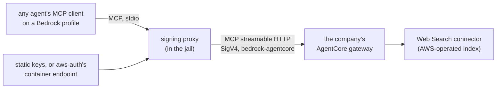

# Web search on every Bedrock profile: the AgentCore MCP preset

**Status:** 2026-10-01. The direction is ruled ([DIR-BR4](#DIR-BR4)). On 2026-09-29
[OQ-BR21](#OQ-BR21) was decided and [OQ-BR22](#OQ-BR22) answered; three questions remain. On
2026-10-01 both traps in [D7](#d7-read-2026-10-01-two-search-traps-a-derive-can-walk-into) were
read from the agents' shipped packages and found real: they bear on [OQ-BR19](#OQ-BR19)'s option A
and widen [OQ-BR23](#OQ-BR23). None of the search feature is built; the signer it reuses is. Split
out of [`bedrock-plumbing.md`](bedrock-plumbing.md) on 2026-09-25, where it was section 6.9;
question ids are unchanged. **MEASURED:** yolo's MCP pipeline, read at `6f21b82c`
([§3](#3-what-yolos-mcp-pipeline-does-today)); the bridge refusing Claude's search server tool on
its translating route, and the `${VAR}` references this jail's own agent configs carry (D7).
**MEASURED live, 2026-10-01:** runtime's Messages route answers Claude's search server tool with
a 400, *"tool type 'web_search_20250305' is not supported for this model"*, whether it is sent
directly or through the bridge, which relays the 400 unchanged
([D7](#measured-live-2026-10-01-runtime-refuses-claudes-search-tool)).
**UNMEASURED:** no one has called an AgentCore gateway or started an agent. Every per-agent fact
in D7 is read from shipped code, not run, and what runtime answers to codex's hosted `web_search`
tool on its Responses route is undocumented and unsent. Every AWS fact is SOURCED from AWS's pages on the date given in the
[evidence appendix](#evidence-and-how-to-re-check-it).

**The question this doc answers.** When an agent talks to Bedrock, how does it search the web,
and when a user's own Tavily search server is also eligible, which one does it get?

**Where things stand.**

- **Ruled:** every Bedrock profile gets web search as an MCP tool served by AWS's AgentCore, on by
  default, *"just like we can include tavily optionally by capability"* ([DIR-BR4](#DIR-BR4)).
- **Also ruled, elsewhere, and it narrows this doc:** a pack may contribute an MCP server entry
  through a new `mcp` kind ([`OQ-MP3`](mcp-presets-removal.md#decision-ledger), 2026-09-20), and the
  core `mcp_presets` list retires ([`OQ-MP6`](mcp-presets-removal.md#decision-ledger)). Neither is
  built. So "a preset like devtools" now means *a pack-shipped `mcp` entry*, the shape
  chrome-devtools itself is moving to.
- **Settled 2026-09-29:** the signing proxy is a stdio MCP server that is a hidden `yolo`
  subcommand ([OQ-BR21](#OQ-BR21), an implementation decision), and the Bedrock pack ships the
  preset as an `mcp` entry gated on the selected provider's `platform` being `"aws-bedrock"`
  ([OQ-BR22](#OQ-BR22), answered by rulings).
- **Built:** none of the search feature. The signer it reuses is built: `internal/sigv4`, the
  standard-library SigV4 signer the wire bridge has used since 2026-09-25 (commit `226d2b3a`;
  [`wire-bridge-gateway.md`](wire-bridge-gateway.md#OQ-BR10)). It already exports the AgentCore
  service name and gateway-host matcher for this proxy.
- **Read 2026-10-01** ([D7](#d7-read-2026-10-01-two-search-traps-a-derive-can-walk-into)): on
  `-p bedrock-bridge`, claude and codex each offer a search that runtime cannot serve, and
  runtime refuses claude's with a 400 (MEASURED the same day); codex and
  opencode pass a `${VAR}` in an MCP server's `env` through as literal text; pi's own MCP client
  read a file yolo did not write, which the pi pack now writes
  ([AM-D20](agent-directory-map.md#AM-D20)). AWS documents Bedrock's server-side web search for none
  of the three models `packs/bedrock` lists, on either endpoint.

**Needs your ruling:** [OQ-BR19](#OQ-BR19), [OQ-BR20](#OQ-BR20), [OQ-BR23](#OQ-BR23).

- [OQ-BR19](#OQ-BR19) — where the gateway URL lives. *Leaning:* an environment variable the entry
  lists in `requires_env`.
- [OQ-BR20](#OQ-BR20) — does yolo create the AgentCore gateway? *Leaning:* no; the company does.
- [OQ-BR23](#OQ-BR23) — AgentCore or the user's Tavily when both are eligible. *Leaning:* AgentCore
  only, with a notice naming what was dropped.

**Reads with:** [`bedrock-plumbing.md`](bedrock-plumbing.md) (how each agent reaches Bedrock at
all), [`mcp-configuration.md`](../reference/mcp-configuration.md) (the MCP pipeline this amends:
pack-contributed entries, the closed preset list; the settled parts fold in there at graduation),
[`mcp-presets-removal.md`](mcp-presets-removal.md) (the `mcp` kind),
[capability-driven MCP delivery](../reference/mcp-configuration.md#capability-driven-mcp-delivery) (the delivery rule this
reuses), [`providers-and-profiles-redesign.md`](providers-and-profiles-redesign.md) (how "this is
Bedrock" gets spelled), [`providers.md`'s credential gate](../reference/providers.md#the-credential-gate) (why nothing
selected for one agent reaches another), [`sso-backed-bedrock.md`](sso-backed-bedrock.md) (where
the AWS credential comes from, and owner of `packs/aws-auth`'s README).

**Words used here.**

- **Bedrock profile** — any launch in which an agent's selected provider is a Bedrock one. A
  **provider** is a declared service (where traffic goes, which credential); a **profile** is the
  name you pick with `-p` that selects a provider for an agent ([`providers.md`](../reference/providers.md)).
  An agent on a Bedrock profile reaches Bedrock one of two ways: its own **native** Bedrock client
  (codex, opencode, pi; claude's *native* profile, which is Claude Code's Bedrock mode), or the
  **wire bridge**, the in-jail daemon that fronts an agent's model traffic
  ([`wire-bridge.md`](../reference/wire-bridge.md)): copilot, and claude's *everything* profile,
  which points `ANTHROPIC_BASE_URL` at the bridge. **Search does not care which**: it is a separate
  MCP connection either way.
- **Runtime** and **mantle** — Bedrock's two endpoint families, `bedrock-runtime` and
  `bedrock-mantle`. yolo ships runtime only ([DIR-BR3](bedrock-plumbing.md#decision-ledger)).
- **MCP** — the Model Context Protocol, by which an agent lists and calls tools a separate server
  offers. **stdio** means the agent spawns the server and speaks over its stdin/stdout;
  **streamable HTTP** is MCP over an HTTPS URL.
- **SigV4** — AWS's request-signing scheme. A signature names a *service* (here
  `bedrock-agentcore`) and a Region. A **bearer** (a Bedrock API key, `AWS_BEARER_TOKEN_BEDROCK`)
  is a token sent as-is and cannot produce a signature.
- **Render target** — one agent's config as rendered for one launch. Gates are evaluated per render
  target, so one agent's selection never decides another's.

---

## 1. Why a Bedrock profile has no search today

| Source of search | On a Bedrock profile |
| :--- | :--- |
| Bedrock's built-in Web Search | **mantle only**: a server-side tool on mantle's Responses API, for `openai.gpt-5.4`, `openai.gpt-5.5` and the three GPT-5.6 models, in `us-east-1`, `us-east-2` and `us-west-2` (and three of them in `us-gov-west-1`). Runtime serves no server-side or pre-configured tools. **None of the three models `packs/bedrock` lists is among them** ([D7](#d7-read-2026-10-01-two-search-traps-a-derive-can-walk-into)) |
| Amazon Nova Web Grounding | the one server-side search AWS documents on runtime: a Converse `systemTool`, `nova_grounding`, for Nova models on US cross-Region profiles only. yolo lists no Nova model, and no agent yolo ships sends it |
| Claude Code's WebSearch tool | **absent in Bedrock mode**: *"The WebSearch tool is not available on Amazon Bedrock"* ([Claude Code on Amazon Bedrock](https://code.claude.com/docs/en/amazon-bedrock)). **Offered, and cannot work, on `-p bedrock-bridge`**: runtime refuses its server tool with a 400, MEASURED (D7 (a)) |
| codex's search | AWS documents it on mantle only (*"Codex … connects to Amazon Bedrock through the `bedrock-mantle` endpoint and can use Web Search"*, CLI 0.147.0 or later). codex 0.158.0 turns it off for its runtime provider and **sends it on `-p bedrock-bridge`**, where runtime cannot serve it (D7 (a)) |
| copilot | nothing from Bedrock; GitHub's hosted `web_search` MCP tool whenever copilot holds a GitHub login (D7 (a)) |
| opencode, pi | nothing, unless the user turns on opencode's Exa or Parallel search or installs a pi search package (D7 (a)) |
| oh-omp | nothing from Bedrock; its own `web_search` through whichever third-party search credential it finds (D7 (a)) |
| Tavily | works anywhere, as a user's own `mcp_servers` entry with a Tavily key ([§3](#3-what-yolos-mcp-pipeline-does-today)), **except that codex and opencode hand the server the literal text `${TAVILY_API_KEY}`** (D7 (b)) |

So on runtime **no agent gets search from Bedrock, whatever its model**. What search an agent has
there comes from a service outside Bedrock (GitHub for copilot, a third-party key for oh-omp) or
from yolo's MCP table. SOURCED 2026-09-25 from AWS's endpoints and Web Search pages, re-read
2026-10-01 with the three listed models' cards and Nova's Web Grounding page.

**There is no search under a Bedrock API key alone.** The mechanism below signs, a bearer cannot
sign, and whether AgentCore accepts a Bedrock API key at all is unknown: AWS's API-key actions
(`bedrock:CallWithBearerToken`, `bedrock-mantle:CallWithBearerToken`) name only Bedrock's two
endpoints. Search therefore works under the two signing credentials, static keys and the SSO
session `packs/aws-auth` delivers.

## 2. What AgentCore Web Search is

SOURCED 2026-09-25 from AWS's AgentCore guide and launch post; nothing was called.

- **A managed MCP tool behind a gateway.** An **AgentCore gateway** is an AWS-hosted MCP endpoint
  an account creates. Web Search is one of its built-in **connector targets**
  (`connectorId: "web-search"`). An agent finds it with MCP `tools/list` and calls it with
  `tools/call`, as the tool `WebSearch`: *"Works with … any MCP-compatible client."*
- **Any model.** The gateway serves a tool, and the model that decides to call it is whatever the
  agent runs. That is why it answers "search for every model", where mantle's Web Search answers it
  for five.
- **Data stays in AWS.** *"Customer queries are not sent to a third-party search engine or routed
  outside AWS."* The launch post adds that the query is served in an AWS service account, not the
  customer's.
- **Transport.** MCP streamable HTTP at
  `https://gateway-<id>.gateway.bedrock-agentcore.<region>.amazonaws.com/mcp`. A gateway with IAM
  inbound authorization takes SigV4 requests signed as `bedrock-agentcore`.
- **Inbound authorization** is one of IAM identity, a JWT, authenticate-only (SigV4 checked, no
  authorization decision), or none. **This design serves the two SigV4 types. A JWT-authorized
  gateway is out of scope**: its credential is an OAuth token, not an AWS one.
- **IAM.** The *caller* needs `bedrock-agentcore:InvokeGateway` on the gateway's ARN. The gateway's
  own service role needs `bedrock-agentcore:InvokeWebSearch` on
  `arn:aws:bedrock-agentcore:<region>:aws:tool/web-search.v1`; that role is the company's.
- **Limits.** `query` at most 200 characters; `maxResults` 1–25, default 10. Connector 1.2.0 adds
  per-request domain and date filters; an administrator's domain lists on the target cannot be
  relaxed by the agent.
- **Regions.** `us-east-1`, `eu-west-1`, `ap-northeast-1`. The gateway's Region need not be the
  Bedrock Region a profile uses.
- **Acceptable use.** A user of the results *"must retain and display the source citations and
  links"*.

**IAM per use**, for [`sso-backed-bedrock.md`](sso-backed-bedrock.md) to copy into the
`aws-auth` README ([D6](#d6-live-in-docs-the-aws-auth-example-policy-denies-search)):

| Use | Actions the jail's credential needs |
| :--- | :--- |
| runtime chat (every native client, the bridge) | `bedrock:InvokeModel`, `bedrock:InvokeModelWithResponseStream` |
| web search through an AgentCore gateway | `bedrock-agentcore:InvokeGateway` on the gateway's ARN |

## 3. What yolo's MCP pipeline does today

MEASURED at `6f21b82c`, from the code and [`mcp-configuration.md`](../reference/mcp-configuration.md):

- **One table.** `Env.LoadMCPServers` (`internal/entrypoint/mcp.go`) builds one canonical table
  in-jail from two inputs: the **presets** a user opts into with `mcp_presets`, a closed list core
  owns (`validMCPPresets` in `internal/config/config.go`: `chrome-devtools`, `sequential-thinking`),
  and the user's own `mcp_servers`. `requires_env` drops an entry whose variable is unset, with a
  notice, before any derive (an agent pack's Lua renderer) sees it.
- **Stdio only.** An entry's keys are closed: `command`, `args`, `env`, `requires_env`, `provides`
  (`knownMCPServerKeys`). There is no `url` or `type` key, and none of the six derives that project
  the table (claude, codex, copilot, opencode, pi, agy) writes one. yolo delivers an MCP server only
  as a command the agent spawns.
- **No pack can contribute one.** `ValidateKind` refuses `mcp-server` as an unknown kind
  (`internal/packdecl/kinds_test.go`). The `mcp` kind [`OQ-MP3`](mcp-presets-removal.md#decision-ledger)
  ruled is not built.
- **`${VAR}` is never interpolated by yolo.** It is written verbatim, and the agent that launches
  the server resolves it ([`mcp-configuration.md`](../reference/mcp-configuration.md#the-rules-the-one-loader-enforces)).
  ⚠ Read 2026-10-01: claude and copilot resolve it; codex and opencode do not
  ([D7 (b)](#d7-read-2026-10-01-two-search-traps-a-derive-can-walk-into)).
- **Capability-driven MCP delivery** — the rule, and the term **authentication source**, are both
  defined in [`mcp-configuration.md`](../reference/mcp-configuration.md#what-the-derive-boundary-removes). A server
  whose `provides` names a capability the launch's authentication source already has is dropped.
  `sourceCapabilities` (`internal/agentcfg/luahook/derive.go`) reads the selected provider row's
  `capabilities`, or with none selected the agent's `kind: "program"` contribution
  (`NativeCapabilities`). `eligibleMCPServers` drops the match inside `buildDeriveCtxTable`, and
  `withoutProvidesKey` strips `provides`. `validate.go` refuses two `mcp_servers` entries with the
  same `provides`.
- **Tavily is the worked example; yolo ships no Tavily server.** A user's `mcp_servers.tavily`
  with `provides: "web_search"` and `requires_env: ["TAVILY_API_KEY"]` is delivered under Kilo and
  suppressed where `web_search` is declared (`rg -n web_search packs/*/pack.json`: the claude and
  agy program contributions, the `zai` provider, and `openai-codex` in `packs/openai-auth`).
  claude's `bedrock` provider declares no capabilities, so under `-p bedrock` such a server already
  reaches claude. INFERRED from the resolver; not run.
- **pi projects the table** into `~/.pi/agent/mcp.json`, the file pi's own MCP client (0.99.0 and
  later) reads ([pi's MCP files](../reference/mcp-configuration.md#pis-mcp-files)). Until
  2026-10-01 the pack wrote `~/.pi/agent/mcp-adapter.json` instead, which pi read only through an
  adapter extension yolo does not install, so pi's own client started none of yolo's servers
  ([D7 (b)](#d7-read-2026-10-01-two-search-traps-a-derive-can-walk-into)).

## 4. The shape

**The ruling** ([DIR-BR4](#DIR-BR4)): every Bedrock profile, in every agent that takes MCP servers
and for every model, gets web search as an MCP tool served by an AgentCore gateway the company
creates once, shipped by the Bedrock pack, on by default, keyed the way Tavily is keyed.

Four components, the last three new, and each name coined here:

1. **The gateway** — an AWS resource the company creates once: a gateway with IAM inbound
   authorization and a Web Search target. yolo creates nothing in AWS ([OQ-BR20](#OQ-BR20)).
2. **The gateway URL** *(coined here)* — the one piece of configuration the entry needs. Where it
   lives is [OQ-BR19](#OQ-BR19). With no URL the entry is absent, and the launch says so.
3. **The AgentCore search preset** *(coined here)* — an MCP server entry, `agentcore-web-search`,
   with `provides: "web_search"`, which the Bedrock pack contributes and every Bedrock profile gets.
   "Preset" is the maintainer's word (*"a mcp preconfig like devtools"*); it is **not** an
   `mcp_presets` entry, a list that retires. The Bedrock pack is proposed, not yet in the tree
   ([OQ-BR9](bedrock-plumbing.md#OQ-BR9) decides its provider). It ships the preset as an `mcp`
   entry gated on the selected provider's `platform` ([OQ-BR22](#OQ-BR22)).
4. **The signing proxy** *(coined here)* — the in-jail program the entry runs. Agents' MCP clients
   cannot sign SigV4, so the proxy speaks MCP to the agent and MCP streamable HTTP to the gateway,
   signing each request as `bedrock-agentcore`. It uses the same standard-library signer the wire
   bridge uses, `internal/sigv4` ([`wire-bridge-gateway.md`](wire-bridge-gateway.md#OQ-BR10)), as a
   third route: MCP pass-through, sign only, no translation. It is a hidden `yolo` subcommand the
   entry's `command` runs ([OQ-BR21](#OQ-BR21)).


```mermaid
flowchart LR
  agent["any agent's MCP client<br/>on a Bedrock profile"] -->|MCP, stdio| proxy["signing proxy<br/>(in the jail)"]
  creds["static keys, or aws-auth's<br/>container endpoint"] --> proxy
  proxy -->|MCP streamable HTTP<br/>SigV4, bedrock-agentcore| gw["the company's<br/>AgentCore gateway"]
  gw --> ws["Web Search connector<br/>(AWS-operated index)"]
```

## 5. Keyed the way Tavily is keyed, gated to Bedrock

Capability-driven MCP delivery already does most of "on by default on Bedrock, off where search is
native", with no new rule:

- The preset declares `provides: "web_search"`.
- **No Bedrock provider row declares `web_search`.** claude's `bedrock` provider declares no
  capabilities, and the shared runtime provider [OQ-BR9](bedrock-plumbing.md#OQ-BR9) proposes must
  not declare it either, because on runtime it is not true. So `sourceCapabilities` lacks
  `web_search` under every Bedrock profile, and `eligibleMCPServers` keeps the preset.
- **Native search keeps winning where it is native.** claude with no profile runs on its built-in
  login, whose program contribution declares `web_search`, so the preset is dropped there and
  claude's own WebSearch applies. The same holds under `openai-codex` and `zai`.

**What the capability rule cannot do is confine the preset to Bedrock.** Kilo declares no
`web_search` either, so an entry sitting in every launch's table would reach Kilo. The preset is
therefore gated on **the selected provider being Bedrock**, per render target. That gate is the one
mechanism this design adds; [OQ-BR22](#OQ-BR22) puts it on the Bedrock pack's `mcp` entry.

Two constraints on the gate, both ruled elsewhere:

- **It keys on the provider, never a profile or provider name.** A `profile:`-gated contribution
  matches the profile NAME literally, so a user profile `bedrock-sso` over the Bedrock provider
  would silently lose it ([trap D5](providers-and-profiles-redesign.md#D5), carried from bedrock-plumbing). Keying facts on the provider rather than the
  name is [OQ-BR8](providers-and-profiles-redesign.md#OQ-BR8); *how* a derive recognizes "this is
  Bedrock" (the old `service` marker) is [OQ-BR2](providers-and-profiles-redesign.md#OQ-BR2),
  ruled 2026-09-29 as a declared provider field, `platform` (for Bedrock, `"aws-bedrock"`). This
  doc was written so that neither spelling changes it.
- **It is as specific as possible.** The maintainer ruled that a profile's facts must not leak to an
  agent that did not select it: *"certainly not Claude Code gets Bedrock"* because another agent did
  ([OQ-BR4](../reference/providers.md#oq-br4)). Per render target means codex on Bedrock gives
  codex search, and gives claude on its subscription nothing.

## 6. What today's mechanisms can and cannot express

MEASURED at `6f21b82c` ([§3](#3-what-yolos-mcp-pipeline-does-today)):

| The preset needs | Today | Verdict |
| :--- | :--- | :--- |
| An MCP entry a pack ships | presets are core's closed list; no contribution kind carries an MCP server | **missing**, but ruled: the `mcp` kind ([`OQ-MP3`](mcp-presets-removal.md#decision-ledger)) |
| On by default | presets are opt-in through `mcp_presets` | **missing**; a pack's `mcp` entry is on whenever the pack is selected |
| Delivered only on a Bedrock profile | the capability rule keys on capabilities, not identity; name-keyed gates are [trap D5](providers-and-profiles-redesign.md#D5) | **missing**; answered by a gate on the provider's `platform` ([OQ-BR22](#OQ-BR22)) |
| Suppressed where search is native | capability-driven MCP delivery | **present**, reused unchanged |
| Absent, with a notice, when unconfigured | `requires_env` drops the entry with a notice | **present** if the URL is a variable — [OQ-BR19](#OQ-BR19) |
| Reached through a local proxy | an entry is `command`, `args`, `env`; no derive writes a `url` | **present only for a stdio proxy**, the shape [OQ-BR21](#OQ-BR21) took. A loopback HTTP route needs a URL transport in `knownMCPServerKeys` and six derives |

## 7. Behavior of the preset and the proxy

Written for the implementer. Anything not here and not an open question is theirs.

- **Credentials** resolve as the bridge's signer resolves them
  ([`wire-bridge-gateway.md`](wire-bridge-gateway.md#OQ-BR10)): static `AWS_ACCESS_KEY_ID` /
  `AWS_SECRET_ACCESS_KEY` first, then `aws-auth`'s container-credentials endpoint
  (`AWS_CONTAINER_CREDENTIALS_FULL_URI`), cached until five minutes before its `Expiration`,
  fetched lazily on the first request, and shared by concurrent requests. The proxy never sends a
  bearer to the gateway.
- **The Region** is read from the gateway URL's host. There is no separate Region knob, and the
  Bedrock provider's `region` is not used, since the two may differ.
- **Degenerate inputs.**
  - No URL: the preset is absent, and the launch prints one line naming where the URL goes.
    `yolo check` says the same.
  - A URL whose host is not `*.gateway.bedrock-agentcore.<region>.amazonaws.com`: the proxy refuses
    at start and names the pattern. The agent reports a failed MCP server.
  - No signing credential: every `tools/list` and `tools/call` answers a JSON-RPC error naming the
    two sources tried, and saying that a Bedrock API key cannot sign.
- **Failure paths.**
  - AccessDenied: AWS's error passes through as the tool error, naming
    `bedrock-agentcore:InvokeGateway` ([D6](#d6-live-in-docs-the-aws-auth-example-policy-denies-search)).
  - A JWT-authorized gateway: its `401` carries `WWW-Authenticate`, and the proxy says the gateway
    is not IAM-authorized.
  - An expired signature: refresh once and retry once, the bridge's rule.
  - Anything else, including a timeout: a tool error. Each call is bounded at 30 s, with no other
    retry.
- **Concurrency.** Each agent process spawns its own proxy for its MCP session, with its own
  credential cache. Nothing is shared across agents; the only lock is one in-flight fetch per proxy.
- **One writer.** The gateway and its target are the company's. yolo writes only the preset's
  entry, as a managed layer like every MCP projection. A user's `mcp_servers` entry of the same name
  overrides it, and `null` there removes it.
- **Disclosure.** When the preset is delivered, the launch names the gateway host once. The host
  decides where every query goes, and a launch's disclosures are never quiet
  ([`report-tiers.md`](../reference/report-tiers.md#the-launch-stream)).
- **Forbidden:**
  - signing for any host outside the AgentCore gateway pattern;
  - sending a bearer, or any credential, to the gateway unsigned;
  - logging a credential;
  - creating or changing anything in AWS;
  - delivering the preset to a render target whose selected provider is not Bedrock.

**Tavily stays the non-AWS alternative.** A user's Tavily entry with `provides: "web_search"` is
delivered wherever the source lacks search, Kilo included. On a Bedrock profile it and the preset
are both eligible, and which one the agent gets is [OQ-BR23](#OQ-BR23).

## 8. Traps — read before writing code

### D6 (live, in docs): the aws-auth example policy denies search

[`packs/aws-auth/README.md`](../../packs/aws-auth/README.md)'s example `session_policy` allows
`bedrock:InvokeModel` and `bedrock:InvokeModelWithResponseStream` and nothing else: enough for
runtime chat and every native client. It denies:

- `bedrock-agentcore:InvokeGateway`, so a jail that follows the README gets AccessDenied on every
  search;
- any model-listing call [OQ-BR14](model-lists-and-pickers.md#OQ-BR14) or
  [OQ-BR15](model-lists-and-pickers.md#OQ-BR15) might add;
- every `bedrock-mantle` action, which matters only to the mantle recipe.

The README is [`sso-backed-bedrock.md`](sso-backed-bedrock.md)'s to change; this doc owes the
per-use action list ([§2](#2-what-agentcore-web-search-is)) and build step 9.4's patch. A session
policy narrows only as far as the role allows, so the role behind `aws-auth` must grant
`InvokeGateway` too. SOURCED from AWS's endpoints and AgentCore gateway pages, 2026-09-24 and
2026-09-25; the denial is INFERRED, since no request was made.

### D7 (read 2026-10-01): two search traps a derive can walk into

Both traps are real. They were read on 2026-10-01 (build step 9.1) from the packages installed in
this jail and from codex's source at the tag of the binary yolo installs. oh-omp, which is not
installed here, was read from its npm package. No agent was started, and nothing was called for
the readings. Claude's row was then measured against runtime the same day
([below](#measured-live-2026-10-01-runtime-refuses-claudes-search-tool)). Each row names the
version read. The labels: **SOURCED** is read from that version's code or AWS's
pages, **MEASURED** was run here, **INFERRED** follows from the two. How to re-read each one is
under [Shipped-package re-checks](#shipped-package-re-checks).

**(a) An agent may offer a search its transport cannot serve.** Claude Code's WebSearch is off in
Bedrock mode, but claude's `-p bedrock-bridge` is not Bedrock mode: it is `ANTHROPIC_BASE_URL`
pointed at the bridge. codex's runtime provider might also send Bedrock's `web_search` tool to
runtime, which serves none. Either fails at the first search, or gives the agent two search
tools.

| Agent, version read | Its own search on a Bedrock profile |
| :--- | :--- |
| claude 2.1.286 | **`-p bedrock`: none.** SOURCED: WebSearch's `isEnabled` is true only when Claude Code's provider is `firstParty`, `anthropicAws`, `anthropicGoogleCloud`, `foundry` or `vertex`, and false for `bedrock` and `mantle`. **`-p bedrock-bridge`: offered, and it cannot work.** SOURCED: yolo sets `ANTHROPIC_BASE_URL` and no `CLAUDE_CODE_USE_BEDROCK` there (`nativeBedrock` in `packs/claude/derive.lua`), so the provider is `firstParty`. A WebSearch call is a second Messages request, carrying Anthropic's server tool `web_search_20250305`, to the main model (or to the small fast model when Claude Code's feature flag `tengu_plum_vx3` is on; it defaults off). For a model the list marks `"vendor": "anthropic"` (Claude Opus 5.5), the bridge forwards that request unchanged to runtime's Messages route ([wire-bridge.md](../reference/wire-bridge.md#the-messages-pass-through-on-a-bedrock-upstream)), and Anthropic documents web search as *"not available on Amazon Bedrock"*. MEASURED for any other model: the bridge's translating route refuses it, which the daemon answers with a named 400 ([WB-D5](../reference/wire-bridge.md#wb-d5)). MEASURED live 2026-10-01 for Claude Opus 5.5: runtime refuses the forwarded tool with a 400, and the bridge relays it ([below](#measured-live-2026-10-01-runtime-refuses-claudes-search-tool)) |
| codex 0.158.0 | **`-p bedrock`: none.** SOURCED: the `amazon-bedrock-runtime` provider reports the capability `web_search: false` (true only for the mantle endpoint). That suppresses both the hosted `web_search` tool and codex's standalone search. **`-p bedrock-bridge`: sent, and runtime cannot serve it.** SOURCED: the via row is an ordinary provider named `bedrock`, not one of codex's two Bedrock names, so it takes the default capabilities (`web_search: true`). Unless its `web_search` mode is `"disabled"`, codex adds the hosted `{"type": "web_search", …}` tool to every Responses request. The via route forwards the body unchanged to runtime's `/openai/v1/responses`, where *"server-side tool use and pre-configured tools aren't available, including web search"*. INFERRED: a 400 or a silently ignored tool; AWS does not say which, and the live requests of 2026-10-01 did not send it |
| copilot 1.0.48 | **Nothing from Bedrock.** SOURCED: its requests through the bridge carry no server tool, since the package names no `web_search_20…` type. Its `web_search` is a tool of GitHub's hosted MCP server (`api.githubcopilot.com/mcp`, toolset `web_search`), offered unless the model's catalog entry says it searches natively. copilot connects that server only with a GitHub login (a saved login, the `gh` CLI or a token variable), and never in offline mode. INFERRED: on Bedrock, copilot searches through GitHub whenever it holds such a login, outside yolo's MCP table. Whether a yolo launch of copilot on Bedrock carries one was not read |
| opencode 1.18.34 | **None by default.** SOURCED: its `websearch` tool is registered only for the providers `opencode` and `opencode-go`, or when `OPENCODE_ENABLE_EXA`, `OPENCODE_ENABLE_PARALLEL` or `OPENCODE_EXPERIMENTAL` is set (or the older spellings `OPENCODE_EXPERIMENTAL_EXA` and `OPENCODE_EXPERIMENTAL_PARALLEL`). It then calls Exa's or Parallel's hosted MCP endpoint from the opencode process. No call site adds a provider's own search tool to a request. No shipped pack sets those variables |
| pi 0.99.2 | **None.** SOURCED: pi ships no search tool, and its Bedrock client (`amazon-bedrock`, the Converse API) sends only the session's own tools. This jail's user installed `pi-web-access` 0.33.0, a pi package that searches through Exa and other services from the pi process. It is the user's install, not one yolo ships |
| oh-omp 0.15.3 | **Nothing from Bedrock.** SOURCED: its own `web_search` tool uses the first search service whose credential it finds, in this order: Tavily, Perplexity, Brave, Jina, Kimi, Anthropic, Gemini, Codex, Z.ai, Exa, Parallel, Kagi, Synthetic. None of these is Bedrock. Its derive projects no MCP table, but oh-omp loads MCP servers from other agents' files by default, among them `~/.claude.json`, `~/.claude/mcp.json`, `~/.codex/config.toml`, `~/.config/opencode/opencode.json` and a project's `.mcp.json` (its `disabledProviders` setting defaults to empty, and the omp pack sets none). INFERRED: a preset in claude's or codex's file reaches oh-omp whenever that pack is selected beside it ((b) below) |
| agy | **Never on a Bedrock profile.** SOURCED: its `program` declares no protocol (`packs/agy/pack.json`), so no profile routes it to Bedrock |

<a id="measured-live-2026-10-01-runtime-refuses-claudes-search-tool"></a>
**Measured live, 2026-10-01: runtime refuses Claude's search tool.** Two requests carried
Claude Code's server tool to runtime's Messages route, in `us-east-1`, signed with the SSO
credential `aws-auth` serves. They were part of the live Bedrock requests of that day, whose
method and other results are
[`wire-bridge-gateway.md` §2.4](wire-bridge-gateway.md#24-the-first-live-requests-measured-2026-10-01)'s.
No agent was started. The body carried the server tool a WebSearch call carries, as Claude Code
spells it ([the shipped-package re-checks](#shipped-package-re-checks)), cut to one use, under a
16-token cap:

```json
{"model": "global.anthropic.claude-opus-5-5", "max_tokens": 16,
 "tools": [{"type": "web_search_20250305", "name": "web_search", "max_uses": 1}],
 "messages": [{"role": "user", "content": "Search the web for today's date; answer in three words."}]}
```

| Time (UTC) | Sent | Status | Answer |
| :--- | :--- | :--- | :--- |
| 15:37:18 | directly to `POST https://bedrock-runtime.us-east-1.amazonaws.com/anthropic/v1/messages`, signed by botocore 1.43.106 for `bedrock`, with `anthropic-version: 2023-06-01` | **400**, 0.4 s | `{"type":"error","error":{"type":"invalid_request_error","message":"tool type 'web_search_20250305' is not supported for this model"}}` |
| 15:39:50 | through the bridge's adapter route, `POST 127.0.0.1:8214/v1/messages`, which passed it untranslated to the same URL under its own signature | **400**, 0.4 s | the same body, relayed unchanged ([WG-I32](wire-bridge-gateway.md#WG-I32)); the bridge logged `POST /v1/messages 400 417ms (model global.anthropic.claude-opus-5-5 is Anthropic's on the provider's list: untranslated to …/anthropic/v1/messages)` |

So on `-p bedrock-bridge`, claude's WebSearch on Claude Opus 5.5 ends in a 400
`invalid_request_error` that names the tool type, and nothing was searched. What Claude Code then
shows its user was not observed, since no agent ran. The answer says *"for this model"*, so
whether another Claude id on runtime accepts the tool is unmeasured. AWS's pages name no Claude
model that does ([the evidence table](#evidence-and-how-to-re-check-it)).

**(b) An agent's MCP client may not pass the jail's environment to the proxy.** The proxy needs
the credential variables and the gateway URL. The planned entry names each in its `env` as a
`${VAR}` reference for the agent to resolve, the shape a Tavily entry already takes.

| Agent, version read | File yolo writes | Server inherits the agent's environment? | `${VAR}` in `env` |
| :--- | :--- | :--- | :--- |
| claude 2.1.286 | `~/.claude.json` `mcpServers` | **yes**, minus Claude Code's own credentials. Claude Code's opt-in `CLAUDE_CODE_SUBPROCESS_ENV_SCRUB`, which yolo does not set, also withholds cloud credentials such as `AWS_SECRET_ACCESS_KEY` | **resolved**, with `${VAR:-default}`, in `command`, `args` and `env` |
| codex 0.158.0 | `~/.codex/config.toml` `[mcp_servers]` | **no**: an empty environment plus `HOME`, `LOGNAME`, `PATH`, `SHELL`, `USER`, `__CF_USER_TEXT_ENCODING`, `LANG`, `LC_ALL`, `TERM`, `TMPDIR` and `TZ`, codex's custom-CA variables such as `SSL_CERT_FILE`, the names in the entry's `env_vars` key, and `env` | **not resolved**: `env` reaches the server as written |
| copilot 1.0.48 | `~/.copilot/mcp-config.json` | **yes**, minus copilot's own agent and provider variables | **resolved**: `${VAR}`, `${VAR:-default}` and `$VAR` |
| opencode 1.18.34 | `~/.config/opencode/opencode.json` `mcp`, with `env` renamed `environment` | **yes**: the process environment, then `environment` over it | **not resolved**: opencode substitutes `{env:VAR}` in its config text, so `${VAR}` stays literal and **replaces** the inherited value of that variable |
| pi 0.99.2 | `~/.pi/agent/mcp.json` (until 2026-10-01, `~/.pi/agent/mcp-adapter.json`) | its own MCP client, **yes** | its own client **resolves** `${VAR}`, `$VAR` and `!command` in `env` and `headers` values, reading `~/.pi/agent/mcp.json` and a trusted project's `.pi/mcp.json`. When this row was read the pi pack wrote neither, so pi's own client saw none of yolo's table; the pack now writes the first ([AM-D20](agent-directory-map.md#AM-D20)). A user-installed `pi-mcp-adapter` (3.3.0 in this jail) reads `mcp-adapter.json`, inherits the environment and resolves `${VAR}` |
| oh-omp 0.15.3 | none of its own; it reads claude's and codex's files above, among others ((a)) | **yes**: the process environment, then the entry's `env` over it | **resolved**, with `${VAR:-default}`, in an entry read from `~/.claude.json`. **Not resolved** in one read from `~/.codex/config.toml`, where it adds the names in `env_vars` from its own environment |

All SOURCED. MEASURED in this jail, the user's Tavily entry as each agent's config carries it:

```console
$ rg -n 'TAVILY_API_KEY' ~/.codex/config.toml ~/.config/opencode/opencode.json ~/.claude.json ~/.pi/agent/mcp-adapter.json
/home/agent/.claude.json:1278:        "TAVILY_API_KEY": "${TAVILY_API_KEY}"
/home/agent/.pi/agent/mcp-adapter.json:23:        "TAVILY_API_KEY": "${TAVILY_API_KEY}"
/home/agent/.codex/config.toml:26:TAVILY_API_KEY = "${TAVILY_API_KEY}"
/home/agent/.config/opencode/opencode.json:30:        "TAVILY_API_KEY": "${TAVILY_API_KEY}"
```

INFERRED: under codex and opencode, that Tavily server receives the literal text
`${TAVILY_API_KEY}` as its key, so every Tavily search there fails. That contradicts
[`mcp-configuration.md`](../reference/mcp-configuration.md#the-rules-the-one-loader-enforces)'s
premise that *"the consuming agent can resolve `${VAR}` itself"* for two of the agents it
projects to. That doc owns the rule; this one only records the reading.

**What the readings mean.** Each point is INFERRED from the two tables, and none is a ruling.

- **For the preset's entry (build steps 9.2 and 9.3).** Listing each variable in `env` as `${VAR}`
  works for claude and copilot. It breaks codex, where the proxy gets literal text and no AWS
  variable at all, and opencode, where literal text overwrites credentials the proxy would otherwise
  inherit. It works for pi, whose own client resolves `${VAR}` in `env` and now reads the file the
  pi pack writes ([AM-D20](agent-directory-map.md#AM-D20)), and reaches oh-omp only through claude's
  or codex's file, resolved from the first and literal from the second. An entry that lists no AWS
  variable in `env` reaches them by inheritance under claude, copilot, opencode and pi, and not
  under codex, which forwards only the names in its own `env_vars` key. No derive writes that key
  today.
- **For trap (a).** On `-p bedrock-bridge`, claude's WebSearch and codex's hosted search sit beside
  any preset, and both fail. claude's fails with the 400 measured below; codex's failure is
  inferred. The capability rule drops only MCP entries, so it cannot remove
  them. It does not count them either: the `bedrock` provider row declares no `web_search`, and
  that row is all the rule reads, so the rule still delivers a search entry beside them.
- **[OQ-BR19](#OQ-BR19).** Option A's last step, *"the proxy reads the URL from the variable the
  entry's `env` names"*, holds under claude and copilot. Under codex the variable never reaches
  the proxy unless the codex derive also names it in `env_vars`. Under opencode the reference
  overwrites the real value. Under B or C the URL is a value a derive could write into the entry
  itself, so it would not depend on how each agent resolves a reference. The credentials have the
  per-agent problem under all three options.
- **[OQ-BR20](#OQ-BR20).** Nothing read bears on it.
- **[OQ-BR23](#OQ-BR23).** Its leaning, *"one search tool per render"*, acts on the MCP table
  alone. On a Bedrock profile the readings find search outside that table: claude's and codex's
  on `-p bedrock-bridge` (broken), copilot's through GitHub whenever it holds a login, oh-omp's
  through a third-party key, opencode's through Exa or Parallel when its flag is set, and a user's
  pi package. Under any option, "queries stay in AWS" also needs those turned off per agent.
  Today the user's Tavily entry is broken under codex and opencode, so on those agents "both
  eligible" means one search tool that works and one that does not.

## 9. What done looks like

12. *(numbered as in bedrock-plumbing.md's done list.)* After [OQ-BR19](#OQ-BR19)–[OQ-BR23](#OQ-BR23)
    rule: with a gateway URL configured and a gateway carrying a Web Search target, every agent that
    projects MCP servers (claude on both Bedrock profiles, codex, opencode, pi through its own MCP
    client, copilot) lists the search tool and completes one search under static keys and under
    the SSO credential, on a real host, and the answer cites its sources. Under a Bedrock API key
    alone the tool's error says a bearer cannot sign. With no URL the preset is absent and the
    launch says where the URL goes. Under claude's subscription with no profile, the preset is
    absent and claude's own WebSearch applies. A unit test that drives the boot render (the
    `capabilitymcp_test.go` pattern) pins delivery: present on a Bedrock profile, absent under Kilo
    and under a native-search source. The live searches are a manual runbook; automated tests never
    make API calls.

## 10. Non-goals

- **No AWS resources.** yolo creates no AgentCore gateway, target or role, and holds no
  control-plane permission ([OQ-BR20](#OQ-BR20) if that changes). It does not serve a JWT-authorized
  gateway.
- **No change to search where it is native.** claude's subscription, `openai-codex` and `zai` keep
  their own search; the capability rule drops the preset for them ([§5](#5-keyed-the-way-tavily-is-keyed-gated-to-bedrock)).

## 11. Alternatives considered

| Alternative | Verdict |
| :--- | :--- |
| **Bedrock's own Web Search** | **Rejected with mantle** ([DIR-BR3](bedrock-plumbing.md#decision-ledger)). It is a mantle server-side tool for five GPT models in three US Regions, so it would search for codex on GPT and nobody else |
| **Tavily as the Bedrock profiles' search** | **Kept as the alternative, not the default.** It works with any model and is already how a user adds search, but it needs a second credential and sends queries outside AWS. AgentCore uses the credential the jail already has and keeps queries in AWS. [OQ-BR23](#OQ-BR23) decides which wins where both are eligible |

## 12. Risks

| Risk | Mitigation |
| :--- | :--- |
| **R10.** AgentCore Web Search is new (generally available 2026-06-19) and serves three Regions; a company outside them, or an account where it is not enabled, has no search | The gateway's Region is independent of the Bedrock Region, so any account can place it in one of the three. Without it the preset is absent and says so, and Tavily remains. SOURCED |
| **R11.** The proxy's signer drifts from the bridge's, and one fails for a credential the other handles | One signer package, pinned by AWS's SigV4 test vectors, used by both ([OQ-BR21](#OQ-BR21)) |

## 13. What I would build, in order

9. **Search, after [OQ-BR19](#OQ-BR19), [OQ-BR20](#OQ-BR20) and [OQ-BR23](#OQ-BR23) rule.** The
   bridge's signer it builds on shipped 2026-09-25 as `internal/sigv4` (bedrock-plumbing's build
   step 8.1; [`wire-bridge-gateway.md`](wire-bridge-gateway.md#OQ-BR10)):
   1. ~~measure [D7](#d7-read-2026-10-01-two-search-traps-a-derive-can-walk-into) first: which
      agents offer a native search tool on a Bedrock profile, and which pass `${VAR}` references in
      an MCP `env`~~ — read 2026-10-01 from the shipped packages, not run. Both traps are real, and
      [what the readings mean](#d7-read-2026-10-01-two-search-traps-a-derive-can-walk-into) names
      what steps 2 and 3 meet. Watching a real search run is still done-condition 12's job;
   2. the signing proxy ([OQ-BR21](#OQ-BR21)), a hidden `yolo` subcommand on the shared signer;
   3. the preset and its Bedrock gate ([OQ-BR22](#OQ-BR22)), with a boot-render test that fails when
      the gate's call site is deleted, and that covers `-p bedrock-bridge` (the shipped profile that forces the wire bridge,
      [OQ-BR1](bedrock-plumbing.md#OQ-BR1)) as well as `-p bedrock`.
      [OQ-BR2](providers-and-profiles-redesign.md#OQ-BR2)'s spelling is ruled and built (the
      provider's `platform`, 2026-09-29), so this step waits only on the `mcp` kind being built;
   4. the `aws-auth` README's policy gaining `bedrock-agentcore:InvokeGateway`
      ([D6](#d6-live-in-docs-the-aws-auth-example-policy-denies-search)), and a README section on
      the three AWS calls that create the gateway.

## 14. Open questions

19. 💬 <a id="OQ-BR19"></a>**OQ-BR19: Where does the gateway URL live?** The entry needs one value,
    the gateway's URL, and the company that created the gateway is the one who knows it. Stakes:
    whether a company can ship it once or every user copies it, and who may point a jail's
    searches somewhere. That value decides where every query goes, so a checked-in workspace file
    should not be able to set it.

    | Option | Verdict |
    | :--- | :--- |
    | **A.** An environment variable (proposed: `AGENTCORE_WEB_SEARCH_GATEWAY`) the entry lists in `requires_env`. A company pack sets it with a `kind: "env"` contribution; a user with a local pack or `env_sources` | **Leaning** |
    | **B.** A provider option on the Bedrock provider (`options.web_search_gateway`), set in user config | A company pack cannot set another pack's provider option, the sole-ownership wall [OQ-BR12](model-lists-and-pickers.md#OQ-BR12) also hits, and "no URL, no preset" would need a new gate |
    | **C.** A new top-level config key | Core would learn an AWS service by name |

    Under A, "no URL, no preset, and say so" is `requires_env`'s existing behavior. The proxy reads
    the URL from the variable the entry's `env` names ([D7](#d7-read-2026-10-01-two-search-traps-a-derive-can-walk-into)).

    ⚠ New since the leaning was written (2026-10-01, D7 (b)): that last step holds under claude and
    copilot only. codex passes `env` through unresolved and starts the server with an empty
    environment, and opencode leaves a `${VAR}` reference as literal text over the inherited value.
    Under B or C a derive could write the URL into the entry as a plain value. The credentials have
    the per-agent problem under every option. The leaning is unchanged; this changes what A costs to
    build.

    _Leaning:_ A. It is the one home a company pack and a user can both write today, and it needs
    no new gate. The launch discloses the gateway host whenever the preset is delivered.

    <!-- vantage: oq id=OQ-BR19 leaning="A: an environment variable (proposed AGENTCORE_WEB_SEARCH_GATEWAY) the preset lists in requires_env — a company pack sets it with a kind: env contribution, a user with a local pack or env_sources. requires_env already drops the entry with a notice when it is unset, so no new gate is needed; the launch discloses the gateway host when the preset is delivered." -->

    **Answer:**
    > _(empty — fill in when decided)_

20. 💬 <a id="OQ-BR20"></a>**OQ-BR20: Does yolo ever create the gateway?** The gateway, its Web
    Search target and its service role are AWS resources. Creating them takes
    `bedrock-agentcore-control` permissions, an IAM role with a trust policy, and an account-level
    decision about who may search. Stakes: first-use friction against yolo holding control-plane
    permissions and writing into an organization's AWS account.

    Nothing in D7's 2026-10-01 reading bears on this question.

    _Leaning:_ No. It is an organization's resource, made once per company, and yolo consumes AWS
    rather than administering it. The pack README carries the three calls that make one (a gateway
    with IAM inbound authorization, a `web-search` connector target, an `InvokeGateway` grant) and
    `yolo check` names what is missing.

    <!-- vantage: oq id=OQ-BR20 leaning="No: the gateway, its web-search target and its service role are an organization's AWS resources, created once per company; yolo consumes AWS and does not administer it. The pack README documents the three calls that create one, and yolo check names what is missing." -->

    **Answer:**
    > _(empty — fill in when decided)_

21. ✅ <a id="OQ-BR21"></a>**OQ-BR21: What shape is the signing proxy?** Agents' MCP clients cannot
    sign SigV4, so the entry runs something that does. The maintainer's framing is the wire bridge's
    signer as a third route. The signer is shared whichever option wins; what differs is how the
    agent reaches it, and yolo's MCP table can express only a stdio command
    ([§6](#6-what-todays-mechanisms-can-and-cannot-express)). Stakes: whether this needs an MCP
    schema change and six derive changes, and how many processes hold credentials.

    | Option | Verdict |
    | :--- | :--- |
    | **A.** A stdio MCP proxy that is a hidden `yolo` subcommand, run by the entry's `command`, built on the bridge's signer package | **Leaning** |
    | **B.** A route on the wire bridge's loopback: MCP streamable HTTP in, signed pass-through out | One process and one credential cache for every agent, but the MCP table has no URL transport: `knownMCPServerKeys` and all six projecting derives would change, and each agent's streamable-HTTP support is unread |
    | **C.** AWS's own [`mcp-proxy-for-aws`](https://github.com/aws/mcp-proxy-for-aws) (Apache-2.0, stdio to SigV4, the boto3 credential chain), run through `uvx` | No yolo signing code, but a third-party Python dependency fetched at first use, needing `uvx` and the network at run time |

    ⚠ New since the leaning was written: the maintainer wants an option to send *all* of an agent's
    traffic through the wire bridge, routed per agent (DIR-WG1 in
    [`wire-bridge-gateway.md`](wire-bridge-gateway.md)). If that lands, B stops being a special case,
    but it still needs the URL transport, so the leaning is unchanged.

    _Leaning:_ A. It is expressible with today's `command`/`args`/`env`, reuses the one signer the
    bridge needs ([R11](#12-risks)), and keeps a credential in no process the agent did not start.
    B stays the upgrade if a per-agent proxy process proves costly.

    <!-- vantage: oq id=OQ-BR21 -->

    **Answer:**
    > **Decided 2026-09-29 (implementation decision, no ruling needed):** A. The signing proxy is a
    > stdio MCP server, a hidden `yolo` subcommand the entry's `command` runs. It signs with
    > `internal/sigv4`, the standard-library signer the wire bridge already uses (built 2026-09-25,
    > commit `226d2b3a`, pinned by AWS's published SigV4 test vectors), so one signer serves both,
    > [R11](#12-risks)'s mitigation. That package already exports what this proxy needs:
    > `AgentCoreService`, the SigV4 service name `bedrock-agentcore`; `AgentCoreGatewayRegion`,
    > which accepts only a `<gateway-id>.gateway.bedrock-agentcore.<region>.amazonaws.com` host and
    > returns its Region, the host check and Region rule of
    > [§7](#7-behavior-of-the-preset-and-the-proxy); and `Chain`, the credential chain in that
    > section's order (a static `AWS_ACCESS_KEY_ID` / `AWS_SECRET_ACCESS_KEY` pair, then `aws-auth`'s
    > container-credentials endpoint, cached until five minutes before its `Expiration`, fetched
    > lazily, with one fetch in flight shared by concurrent requests). A needs no config schema
    > change: today's `command`, `args` and `env` express it. B, a route on the wire bridge's
    > loopback, is the later upgrade path if a proxy per agent process proves costly; it needs a
    > URL transport first. C would run third-party code, fetched at first use, holding the jail's
    > AWS credentials.
    >
    > **Build note:** `Chain` has a third step the bridge needs and this proxy must not take: with
    > neither signing credential set, it returns `AWS_BEARER_TOKEN_BEDROCK` as an unsigned bearer.
    > The proxy treats that result as "no signing credential" and answers the JSON-RPC error
    > [§7](#7-behavior-of-the-preset-and-the-proxy) specifies; it never sends the bearer.

22. ✅ <a id="OQ-BR22"></a>**OQ-BR22: How does the Bedrock pack put the preset in the MCP table, gated
    to Bedrock?** Today only core has presets, they are opt-in, and no gate keys on the selected
    provider ([§6](#6-what-todays-mechanisms-can-and-cannot-express)). Since this question was
    written, [`OQ-MP3`](mcp-presets-removal.md#decision-ledger) ruled the `mcp` kind (a named server
    entry composed into `mcp_servers` as `provider` composes into `providers`, pack facts under user
    overrides), so what is left to decide is the gate. Stakes: whether "on by default on Bedrock" is
    a pack fact or a core fact, and whether the same mechanism later carries a pack's Tavily
    *"optionally by capability"*, as the maintainer put it.

    | Option | Verdict |
    | :--- | :--- |
    | **A.** The Bedrock pack ships `agentcore-web-search` as an `mcp` entry with a gate that fires only when the render target's selected provider is Bedrock, however [`providers-and-profiles-redesign.md`](providers-and-profiles-redesign.md#OQ-BR2) spells that. Evaluated per render target, merged before the capability filter, under the user's `mcp_servers` as last writer | **Leaning** |
    | **B.** A core preset in `validMCPPresets`, switched on when a Bedrock provider is selected | Core would learn one AWS service and one provider's fact, where [OQ-BR8](providers-and-profiles-redesign.md#OQ-BR8) leans toward provider facts living with the provider; and [`OQ-MP6`](mcp-presets-removal.md#decision-ledger) retires that list |
    | **C.** No preset: a documented `mcp_servers` recipe | Not on by default, which [DIR-BR4](#DIR-BR4) requires |

    ⚠ Premise changed 2026-09-25: the leaning was first written as "a new pack contribution kind
    carrying one MCP entry". [`OQ-MP3`](mcp-presets-removal.md#decision-ledger) has since ruled that
    kind (`mcp`) and [`OQ-MP6`](mcp-presets-removal.md#decision-ledger) retires the core preset list,
    so A now names the ruled kind and only the Bedrock gate is still open. The choice of A is
    unchanged.

    Under A, a user's `mcp_servers.agentcore-web-search: null` removes it. A pack's Tavily entry
    would be the same kind with no provider gate.

    _Leaning:_ A. Default-on for a provider is a fact about that provider, so the pack that owns it
    ships it. The gate keys on what the provider IS, never on a provider or profile name ([trap D5](providers-and-profiles-redesign.md#D5)).
    It is written spelling-neutral so it can be ruled before [OQ-BR2](providers-and-profiles-redesign.md#OQ-BR2);
    only build step 9.3 waits on that.

    <!-- vantage: oq id=OQ-BR22 -->

    **Answer:**
    > **Answered 2026-09-29 by rulings ([DIR-BR4](#DIR-BR4),
    > [OQ-MP3](mcp-presets-removal.md#OQ-MP3), [OQ-MP6](mcp-presets-removal.md#OQ-MP6),
    > [OQ-BR2](providers-and-profiles-redesign.md#OQ-BR2),
    > [OQ-BR8](providers-and-profiles-redesign.md#OQ-BR8)):** A. [DIR-BR4](#DIR-BR4) puts search
    > on by default on every Bedrock profile, which rules out C, a recipe.
    > [OQ-MP3](mcp-presets-removal.md#OQ-MP3) fixes the vehicle, a pack's `mcp` entry, and
    > [OQ-MP6](mcp-presets-removal.md#OQ-MP6) retires the core preset list, which rules out B.
    > [OQ-BR2](providers-and-profiles-redesign.md#OQ-BR2) spells the gate: a provider declares what
    > service it is in a `platform` field, and the entry is delivered to a render target whose
    > selected provider declares `"platform": "aws-bedrock"`.
    > [OQ-BR8](providers-and-profiles-redesign.md#OQ-BR8) keys it on that provider, never on a
    > provider or profile name. The rest is A as written: evaluated
    > per render target, merged before the capability filter, the user's `mcp_servers` the last
    > writer.
    >
    > **Build note:** gate on the platform alone, not on "platform and no `via`". `via` is a
    > profile field naming the service pack an agent's traffic is routed through
    > ([`wire-bridge-gateway.md` §4.1](wire-bridge-gateway.md#41-how-it-is-built)). `bedrock-bridge`,
    > the shipped profile that forces the wire bridge ([OQ-BR1](bedrock-plumbing.md#OQ-BR1)), is a
    > Bedrock profile too, and [DIR-BR4](#DIR-BR4) covers every Bedrock profile.

23. 💬 <a id="OQ-BR23"></a>**OQ-BR23: When a user's Tavily entry and the AgentCore preset are both
    eligible, which does the agent get?** On a Bedrock profile neither is suppressed by the
    capability rule, since the source lacks `web_search`. `validate.go` refuses two `mcp_servers`
    entries with one `provides`, but that check sees only the user's config, not a pack's entry.
    Stakes: an agent with two search tools, one sending queries outside AWS.

    | Option | Verdict |
    | :--- | :--- |
    | **A.** The preset only: on a render where it is delivered, other `web_search` servers are dropped, with a notice naming them | **Leaning** |
    | **B.** Both are delivered | Two search tools; the agent picks per call, and queries may leave AWS unpredictably |
    | **C.** The user's Tavily entry wins | Honors the user's explicit entry, but a company's "search stays in AWS" is one config line from undone, silently |

    ⚠ New since the leaning was written (2026-10-01, D7): the two MCP entries are not the only
    search tools on a Bedrock profile. On `-p bedrock-bridge`, claude's WebSearch and codex's
    hosted search are offered and fail. copilot searches through GitHub whenever it holds a login,
    oh-omp through any third-party key it finds, and opencode through Exa when its flag is set. None
    of these is an MCP entry, so no option here drops them. Under codex and opencode the user's
    Tavily entry is broken today, because neither resolves `${TAVILY_API_KEY}`. The leaning is
    unchanged. Its *"queries stay in AWS"* holds only if those per-agent tools are also turned off.

    _Leaning:_ A. One search tool per render, matching the rule `validate.go` already enforces, and
    queries stay in AWS. A user who prefers Tavily removes the preset by name, visibly, in their own
    config.

    <!-- vantage: oq id=OQ-BR23 leaning="A: where the AgentCore preset is delivered, other web_search servers are dropped for that render with a notice naming them — one search tool per render, as validate.go's one-server-per-provides rule already intends, and queries stay in AWS. A user who prefers Tavily removes the preset by name (mcp_servers.agentcore-web-search: null)." -->

    **Answer:**
    > _(empty — fill in when decided)_

## Decision Ledger

<a id="DIR-BR4"></a>

| ID | Ruling / Decision | Date | Settled in | Built |
| :--- | :--- | :--- | :--- | :--- |
| DIR-BR4 | **Every Bedrock profile, in every agent and for every model, gets web search as an MCP tool served by an AgentCore gateway the company creates once.** *"we could also integrate search for agent core and get search for all models?"*, then *"let's skip mantle"*, refined: *"it'll probably just be a mcp preconfig like devtools, and easy to include with bedrock by default just like we can include tavily optionally by capability."* So the tool is an MCP preset the Bedrock pack contributes, on by default on Bedrock profiles and keyed the way Tavily is keyed, reached through an in-jail signing proxy. How it is built is [OQ-BR19](#OQ-BR19)–[OQ-BR23](#OQ-BR23). A direction, so no question id | 2026-09-25 | [§4](#4-the-shape) (was [`bedrock-plumbing.md`](bedrock-plumbing.md) section 6.9) | — |
| [OQ-BR21](#OQ-BR21) | **Implementation decision, no ruling needed:** A, the signing proxy is a stdio MCP server that is a hidden `yolo` subcommand, signing with `internal/sigv4` (`AgentCoreService`, `AgentCoreGatewayRegion`, `Chain`). No config schema change. B, a wire-bridge loopback route, is the later upgrade path; C is refused because it would run third-party code holding the jail's AWS credentials. The proxy never sends the chain's unsigned bearer | 2026-09-29 | [§14](#14-open-questions) | pending (the signer is built, 2026-09-25, `226d2b3a`; the proxy is not) |
| [OQ-BR22](#OQ-BR22) | **Answered by rulings** [DIR-BR4](#DIR-BR4), [OQ-MP3](mcp-presets-removal.md#OQ-MP3), [OQ-MP6](mcp-presets-removal.md#OQ-MP6), [OQ-BR2](providers-and-profiles-redesign.md#OQ-BR2) and [OQ-BR8](providers-and-profiles-redesign.md#OQ-BR8): A, the Bedrock pack ships `agentcore-web-search` as an `mcp` entry delivered to a render target whose selected provider declares `"platform": "aws-bedrock"`. Gated on the platform alone, so `-p bedrock-bridge` gets it too | 2026-09-29 | [§14](#14-open-questions) | pending (waits on the `platform` field and the `mcp` kind) |

---

## Evidence, and how to re-check it

Every AWS claim is a fact about a third party; re-read the source rather than trusting the table.
Repo claims were read at `6f21b82c` and are cited by symbol, not line.

Read 2026-09-25 unless noted; nothing was called, except the two requests of 2026-10-01 under
[D7](#measured-live-2026-10-01-runtime-refuses-claudes-search-tool), sent as
[`wire-bridge-gateway.md` §11](wire-bridge-gateway.md#11-evidence) shows. The claims themselves are stated in
[§1](#1-why-a-bedrock-profile-has-no-search-today) and [§2](#2-what-agentcore-web-search-is);
this table maps each to its source.

| Claim | Source |
| :--- | :--- |
| Web Search is mantle-Responses-only, for five GPT models in three US Regions: *"it isn't available when you call the Responses API on the `bedrock-runtime` endpoint"*; Codex on mantle uses it from CLI 0.147.0 | [Bedrock Web Search](https://docs.aws.amazon.com/bedrock/latest/userguide/web-search.html) |
| Server-side and pre-configured tools, web search among them, are mantle-only | [Bedrock endpoints](https://docs.aws.amazon.com/bedrock/latest/userguide/endpoints.html) |
| *"The WebSearch tool is not available on Amazon Bedrock"*; mantle has its own `bedrock-mantle:` actions and model lineup (`CLAUDE_CODE_USE_MANTLE`) | [Claude Code on Amazon Bedrock](https://code.claude.com/docs/en/amazon-bedrock) |
| The connector target (`connectorId: "web-search"`), `tools/list` / `tools/call`, *"any MCP-compatible client"*, the query and result limits, filters from 1.2.0, *"Queries never leave AWS"*, the three Regions, the citation rule | [AgentCore guide, Web Search Tool](https://docs.aws.amazon.com/bedrock-agentcore/latest/devguide/gateway-target-connector-web-search-tool.html) |
| The service role's `InvokeGateway` + `InvokeWebSearch` on `…:aws:tool/web-search.v1`; connector targets take only `GATEWAY_IAM_ROLE`; *"`bedrock-agentcore:InvokeGateway` … belongs to the caller"* | [AgentCore guide, gateway target configuration](https://docs.aws.amazon.com/bedrock-agentcore/latest/devguide/gateway-add-target-api-target-config.html) |
| The four inbound authorization types; an IAM caller needs `InvokeGateway` on the gateway ARN | [AgentCore guide, inbound authorization](https://docs.aws.amazon.com/bedrock-agentcore/latest/devguide/gateway-inbound-auth.html) |
| GA posted 2026-06-19; `aws_iam_streamablehttp_client(endpoint=gateway_url, aws_region="us-east-1", aws_service="bedrock-agentcore")` from `mcp_proxy_for_aws`; the URL form; queries served in an AWS service account | AWS Machine Learning Blog, [*Introducing Web Search on Amazon Bedrock AgentCore*](https://aws.amazon.com/blogs/machine-learning/introducing-web-search-on-amazon-bedrock-agentcore) |
| MCP Proxy for AWS: stdio to the client, SigV4 to the server, the boto3 chain, fresh credentials per request, Apache-2.0, `uvx mcp-proxy-for-aws-cli@latest <endpoint>` | the [`aws/mcp-proxy-for-aws`](https://github.com/aws/mcp-proxy-for-aws) README |
| `aws-auth`'s example policy and the IAM-per-use table | [Bedrock endpoints](https://docs.aws.amazon.com/bedrock/latest/userguide/endpoints.html) and the [AgentCore gateway target configuration](https://docs.aws.amazon.com/bedrock-agentcore/latest/devguide/gateway-add-target-api-target-config.html) and [inbound authorization](https://docs.aws.amazon.com/bedrock-agentcore/latest/devguide/gateway-inbound-auth.html) pages, 2026-09-24 and 2026-09-25 |
| 2026-10-01: Web Search still lists `openai.gpt-5.4`, `openai.gpt-5.5` and `openai.gpt-5.6-sol`, `-terra`, `-luna` in three commercial US Regions, and `openai.gpt-5.6-terra`, `-luna` and `openai.gpt-5.4` in `us-gov-west-1`. No GPT-6 model and no Claude model is listed | [Bedrock Web Search](https://docs.aws.amazon.com/bedrock/latest/userguide/web-search.html) |
| 2026-10-01: in the endpoints page's capability table, *"Server-side tool use"* and *"Pre-configured ready-to-use tools"* are marked not supported on `bedrock-runtime` and supported on `bedrock-mantle`. The runtime Responses API: *"Server-side tool use and pre-configured tools aren't available, including web search"* | [Bedrock endpoints](https://docs.aws.amazon.com/bedrock/latest/userguide/endpoints.html), [Responses API](https://docs.aws.amazon.com/bedrock/latest/userguide/inference-responses-api.html) |
| 2026-10-01: Claude Opus 5.5's card lists no web search and no server-side tool on either endpoint (computer use is its one Anthropic tool type). Bedrock's tool-use page names the Anthropic tool types `computer_*`, `bash_*`, `text_editor_*` and `memory_*`, and no `web_search_*` | [Claude Opus 5.5 card](https://docs.aws.amazon.com/bedrock/latest/userguide/model-card-anthropic-claude-opus-5-5.html), [Use a tool](https://docs.aws.amazon.com/bedrock/latest/userguide/tool-use.html) |
| 2026-10-01: GPT-6.1 Sol's card lists *"Server-side system tools"* as not supported. GPT-6 Astra's lists *"Server-side tool use"* as not supported on `bedrock-runtime` and *"Server-side tool calling"* as supported on `bedrock-mantle` | [GPT-6.1 Sol card](https://docs.aws.amazon.com/bedrock/latest/userguide/model-card-openai-gpt-6-1-sol.html), [GPT-6 Astra card](https://docs.aws.amazon.com/bedrock/latest/userguide/model-card-openai-gpt-6-astra.html) |
| 2026-10-01: Nova's Web Grounding is the `nova_grounding` `systemTool` of the runtime Converse API, *"only available in US regions and supported only by US CRIS profiles"* | [Amazon Nova 2, Web Grounding](https://docs.aws.amazon.com/nova/latest/nova2-userguide/web-grounding.html) |
| 2026-10-01: Mantle's server-side `mcp` tool accepts an AgentCore gateway ARN as its `connector_id`, so Bedrock calls the gateway for the model. That path is mantle's, so it is out of scope with mantle | [Server-side tool use](https://docs.aws.amazon.com/bedrock/latest/userguide/tool-use-server-side.html) |
| 2026-10-01: *"Web search is not available on Amazon Bedrock"*; *"Amazon Bedrock doesn't expose the server-side web search tool"* | Anthropic, [Web search tool](https://platform.claude.com/docs/en/agents-and-tools/tool-use/web-search-tool); Claude Code, [Tools reference](https://code.claude.com/docs/en/tools-reference#websearch-tool-behavior) |

**Repo re-checks:**

- `rg -n web_search packs/*/pack.json` — which sources declare native search.
- `rg -n 'validMCPPresets|knownMCPServerKeys' internal/config/config.go` — the closed preset list
  and entry keys.
- `rg -n 'mcp-server' internal/packdecl/kinds_test.go` — no MCP contribution kind yet.
- `rg -n InvokeModel packs/aws-auth/README.md` — D6's policy text.

### Shipped-package re-checks

D7's readings, 2026-10-01. The JavaScript bundles are minified, so a helper's name such as `Pe`
or `St` belongs to the version read. Search for the string, not the name. Each command was run
here, and its output follows it.

**claude 2.1.286** (`~/.local/bin/claude`, which points at this file):

```console
$ C=~/.local/share/claude/versions/2.1.286
$ rg -a -o 'isEnabled\(\)\{let e=Pe\(\);if\(e==="firstParty"[^}]*\}' $C
isEnabled(){let e=Pe();if(e==="firstParty"||fH(e))return!0;if(e==="gateway")return!1;if(e==="vertex")return kWr(Ue(et()));if(e==="foundry")return!0;return!1}
$ rg -a -o 'function fH\(e=Pe\(\)\)\{[^}]*\}' $C
function fH(e=Pe()){return e==="anthropicAws"||e==="anthropicGoogleCloud"}
$ rg -a -o 'function Pe\(\)\{if\(no\(\)[^}]*\}' $C
function Pe(){if(no()||A2t()||C2t())return"gateway";return a.CLAUDE_CODE_USE_BEDROCK?"bedrock":a.CLAUDE_CODE_USE_FOUNDRY?"foundry":a.CLAUDE_CODE_USE_ANTHROPIC_AWS?"anthropicAws":a.CLAUDE_CODE_USE_ANTHROPIC_GOOGLE_CLOUD?"anthropicGoogleCloud":a.CLAUDE_CODE_USE_MANTLE?"mantle":a.CLAUDE_CODE_USE_VERTEX?"vertex":"firstParty"}
$ rg -a -o 'C=\{type:"web_search_20250305"[^}]*\}' $C
C={type:"web_search_20250305",name:"web_search",allowed_domains:r.allowed_domains,blocked_domains:r.blocked_domains,max_uses:8,...k&&{search_profile:k}
$ rg -a -o 'function Ru\(e,\{expandVars:n=!0\}=\{\}\)' $C
function Ru(e,{expandVars:n=!0}={})
$ rg -a -o 'case"stdio":\{let S=e;h=\{\.\.\.S,command:g\(S\.command\)[^}]*\}' $C
case"stdio":{let S=e;h={...S,command:g(S.command),args:S.args.map((w)=>g(w)),env:S.env?qr(S.env,(w)=>g(w)):void 0}
$ rg -a -o 'v=R\("tengu_plum_vx3",!1\)\?rb\(\):f\.mainLoopModel\(\)' $C
v=R("tengu_plum_vx3",!1)?rb():f.mainLoopModel()
$ rg -a -o 'function id\(\)\{let e=C\.scrubEnabledLatched;[^}]*\}' $C
function id(){let e=C.scrubEnabledLatched;if(e!==void 0)return e;let r=Le(process.env.CLAUDE_CODE_SUBPROCESS_ENV_SCRUB);return C.setScrubEnabledLatched(r),r}
$ rg -a -c 'Oo=\["ANTHROPIC_API_KEY",[^\]]*"AWS_SECRET_ACCESS_KEY"' $C
1
```

`"gateway"` is Claude Code's own cloud-gateway login (`credentialSlots.gatewayAuth`), not a
custom `ANTHROPIC_BASE_URL`. `rb()` is the small fast model. A stdio server's environment is the
process environment minus the names Claude Code withholds as its own credentials, and none of
them is an `AWS_*` variable. With `CLAUDE_CODE_SUBPROCESS_ENV_SCRUB` set, the environment also
loses every name on the scrub list `Oo`, which includes `AWS_SECRET_ACCESS_KEY`,
`AWS_SESSION_TOKEN` and `AWS_BEARER_TOKEN_BEDROCK`. No pack sets that variable
(`rg -n SUBPROCESS_ENV_SCRUB packs/ internal/` finds nothing).

**codex 0.158.0** (`~/.codex/packages/standalone/current/codex-package.json` says `"version":
"0.158.0"`). It was read from `openai/codex` at the tag `rust-v0.158.0`, under `codex-rs/`:

- `model-provider/src/amazon_bedrock/mod.rs`, `AmazonBedrockModelProvider::capabilities`:
  `web_search: self.endpoint == BedrockEndpoint::Mantle`. Its own tests are named
  `runtime_capabilities_disable_web_search_and_support_v2_remote_compaction` and
  `capabilities_enable_web_search_but_disable_image_generation`.
- `model-provider/src/provider.rs`: `ProviderCapabilities::default()` has `web_search: true`, and
  `create_model_provider` builds the Bedrock provider only when `is_amazon_bedrock()` is true. In
  `model-provider-info/src/lib.rs` that tests `name` against `"Amazon Bedrock"` and
  `"Amazon Bedrock Runtime"`.
- `core/src/tools/spec_plan.rs`, `hosted_model_tool_specs` and `standalone_web_search_enabled`:
  both require `turn_context.provider.capabilities().web_search`.
- `rmcp-client/src/utils.rs`, `create_env_for_mcp_server` and `DEFAULT_ENV_VARS`, plus
  `CUSTOM_CA_ENV_KEYS` from `network-proxy/src/certs.rs`;
  `utils/pty/src/child_command.rs`, `Command::new` calls `.env_clear()`;
  `codex-mcp/src/rmcp_client.rs` passes `env` through with no expansion.
- The binary carries the same strings:
  `rg -a -c 'unsupported env_vars source' ~/.codex/packages/standalone/current/bin/codex` prints
  `1`.

**copilot 1.0.48** (`~/.npm-global/lib/node_modules/@github/copilot/app.js`):

```console
$ A=~/.npm-global/lib/node_modules/@github/copilot/app.js
$ rg -o 'Ogr="github-mcp-server-web_search",Mgr="web_search"' $A
Ogr="github-mcp-server-web_search",Mgr="web_search"
$ rg -c 'web_search_20[0-9]{6}' $A; echo "exit=$?"
exit=1
$ rg -o 'iWe=/[^;]{0,110}' $A
iWe=/\$\{([A-Za-z_][A-Za-z0-9_]*)(?::-([^}]*))?\}|\$([A-Za-z_][A-Za-z0-9_]*)(?![A-Za-z0-9_])/g
$ rg -o 'envInheritMode:"inherit"' $A | head -1
envInheritMode:"inherit"
```

**opencode 1.18.34** (`opencode-ai/node_modules/opencode-linux-x64/bin/opencode`):

```console
$ O=~/.npm-global/lib/node_modules/opencode-ai/node_modules/opencode-linux-x64/bin/opencode
$ rg -a -o 'function St\(o,e=\{exa:!1,parallel:!1\}\)\{[^}]*\}' $O
function St(o,e={exa:!1,parallel:!1}){return o===oe.ID.opencode||o===oe.ID.make("opencode-go")||e.exa||e.parallel}
$ rg -a -o 'env:\{\.\.\.process\.env,\.\.\.Z==="opencode"\?\{BUN_BE_BUN:"1"\}:\{\},\.\.\.F\.environment\}' $O
env:{...process.env,...Z==="opencode"?{BUN_BE_BUN:"1"}:{},...F.environment}
$ rg -a -o 'o\.text\.replace\(/\\\{env:\(\[\^\}\]\+\)\\\}/g' $O
o.text.replace(/\{env:([^}]+)\}/g
$ rg -a -o 'enableExa:h\.all\(\{experimental:Q,enabled:k\("OPENCODE_ENABLE_EXA"\),legacy:k\("OPENCODE_EXPERIMENTAL_EXA"\)\}' $O
enableExa:h.all({experimental:Q,enabled:k("OPENCODE_ENABLE_EXA"),legacy:k("OPENCODE_EXPERIMENTAL_EXA")}
```

**pi 0.99.2** (`@earendil-works/pi-coding-agent`; its MCP client came in 0.99.0, dated 2026-09-29
in its `CHANGELOG.md`):

```console
$ P=~/.npm-global/lib/node_modules/@earendil-works/pi-coding-agent
$ rg -n '"mcp.json"' $P/dist/extensions/mcp/config.js
79:    readConfigFile(join(options.agentDir, "mcp.json"), "global", state);
81:        readConfigFile(join(options.cwd, CONFIG_DIR_NAME, "mcp.json"), "project", state);
$ rg -n 'inheritEnv === false' $P/node_modules/@earendil-works/pi-mcp/dist/transports/stdio.js
75:        const env = this.options.inheritEnv === false ? { ...this.options.env } : { ...process.env, ...this.options.env };
$ rg -c mcp-adapter $P/dist; echo "exit=$?"
exit=1
```

**oh-omp 0.15.3**: not installed in this jail. Its npm package carries the binary in
`@oh-labs/oh-omp-linux-x64`:

```console
$ curl -sSL https://registry.npmjs.org/@oh-labs/oh-omp-linux-x64/-/oh-omp-linux-x64-0.15.3.tgz | tar -xz
$ rg -a -A14 'SEARCH_PROVIDER_ORDER = \[' package/oh-omp | tr -d ' \n'
SEARCH_PROVIDER_ORDER=["tavily","perplexity","brave","jina","kimi","anthropic","gemini","codex","zai","exa","parallel","kagi","synthetic"];
$ rg -a -o 'description: "Load MCP servers from [^"]*"' package/oh-omp | sort -u
description: "Load MCP servers from .claude.json and .claude/mcp.json"
description: "Load MCP servers from .vscode/mcp.json"
description: "Load MCP servers from Windsurf config (mcp_config.json)"
description: "Load MCP servers from config.toml [mcp_servers.*] sections"
description: "Load MCP servers from marketplace plugin .mcp.json files"
description: "Load MCP servers from opencode.json mcp key"
description: "Load MCP servers from standalone mcp.json or .mcp.json in project root"
description: "Load MCP servers from ~/.cursor/mcp.json and .cursor/mcp.json"
description: "Load MCP servers from ~/.gemini/settings.json and .gemini/settings.json"
$ rg -a -o 'const userClaudeJson = path24\.join\(ctx\.home, "\.claude\.json"\);' package/oh-omp
const userClaudeJson = path24.join(ctx.home, ".claude.json");
$ rg -a -o 'const mcpServers = expandEnvVarsDeep\(json3\.mcpServers\);' package/oh-omp
const mcpServers = expandEnvVarsDeep(json3.mcpServers);
$ rg -a -o 'const env4 = \{ \.\.\.config2\.env \};' package/oh-omp
const env4 = { ...config2.env };
$ rg -a -o 'disabledProviders: \{ type: "array", default: EMPTY_STRING_ARRAY \}' package/oh-omp
disabledProviders: { type: "array", default: EMPTY_STRING_ARRAY }
```

The `config.toml` loader is codex's (`~/.codex/config.toml`); `env4` there is copied with no
expansion, unlike the Claude loader's `expandEnvVarsDeep`. oh-omp's stdio transport starts a
server with `{ ...Bun.env, ...this.config.env }`.

**The bridge refusing Claude's search tool** (MEASURED): a throwaway test, deleted after the run
and not committed, in `internal/wirebridge`:

```go
body := `{"model":"us.openai.gpt-6.1-sol","max_tokens":64,"tools":[{"type":"web_search_20250305","name":"web_search","max_uses":8}],"messages":[{"role":"user","content":"x"}]}`
_, err := TranslateRequest([]byte(body))
t.Logf("chat-completions route: err=%v", err)
```

```console
$ go test -count=1 -run TestZZProbeClaudeWebSearch -v ./internal/wirebridge/
    zz_probe_test.go:8: chat-completions route: err=wirebridge: unrecognized tool type "web_search_20250305" (the bridge translates custom tools only — wire-bridge.md §4)
```
