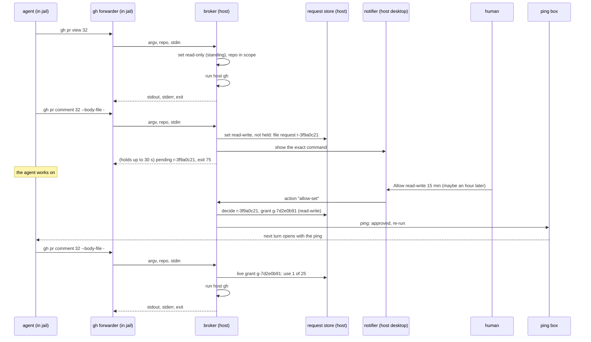
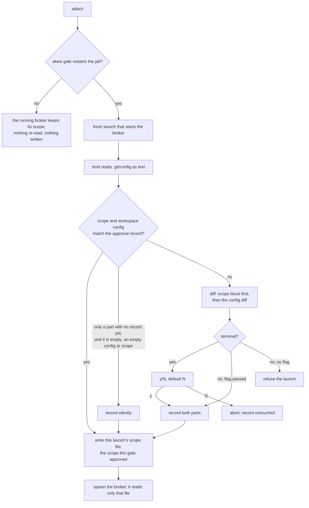

# Reads run, writes ring the doorbell: time-boxed GitHub access across the jail boundary

**Status:** 2026-09-28; **step 1 of [§11](#11-recommendation-and-the-first-build-slice)
built 2026-09-29** (the read path, the repository scope, the audit log, the mount fence),
**step 2's widening entry built 2026-10-01** ([BB-D33](#BB-D33), [BB-D52](#BB-D52); the
`brokered` key in `internal/config/brokered.go`, run end to end against a fake host `gh` by
`integration/githubbroker_test.go`), and the rest of step 2 and step 3 not started. Revised
around the maintainer's brief of that day; first sketched
2026-08-05. [OQ-BB1](#OQ-BB1), [OQ-BB2](#OQ-BB2), [OQ-BB3](#OQ-BB3), [OQ-BB4](#OQ-BB4),
[OQ-BB6](#OQ-BB6), [OQ-BB7](#OQ-BB7), [OQ-BB8](#OQ-BB8), [OQ-BB9](#OQ-BB9) and OQ-C were ruled on
2026-09-29, and the body now follows those rulings ([§1.2](#12-what-it-rules));
[OQ-BB10](#OQ-BB10) is open. **On 2026-10-05 the maintainer re-ruled [OQ-BB6](#OQ-BB6) to
its option (d):** the widening entry moves into the workspace config, is approved at the
config-change gate like a remote, and the user-scope form is deleted. That design is
[`workspace-widening.md`](workspace-widening.md), built 2026-10-05; the body below describes the
workspace entry, and the user-scope form survives only as history in [§9.7](#97-the-delivery-copy-and-other-workspaces-widening-entries)
and the ledger. The re-ruling makes [OQ-BB11](#OQ-BB11) moot ([WW-D7](workspace-widening.md#WW-D7)).
[OQ-BB12](#OQ-BB12) and [OQ-BB13](#OQ-BB13), filed and ruled 2026-10-01, put the broker's switch
in a per-workspace file beside the user config, for one project at a time, built as
[BB-D53](#BB-D53) to [BB-D57](#BB-D57). Step 1 lives in
`internal/ghbroker` (the classifier, the executor, the daemon and the `yolo gh` forwarder),
`internal/brokerscope`, `internal/brokeraudit`, `packs/github` and the `intercept` contribution
kind; its implementation decisions are
[BB-D37](#BB-D37) to [BB-D45](#BB-D45), and the fixes a review of it found are
[BB-D46](#BB-D46) to [BB-D51](#BB-D51). [BB-D58](#BB-D58) to [BB-D62](#BB-D62) answer an
agent's field report of 2026-10-03: encoded endpoints, organization flags on writes, words that
climb out of a path, GraphQL advice, and fuzz targets for the scope decision. Still unbuilt: the request store, `yolo approve`, the
[BB-D46](#BB-D46) to [BB-D51](#BB-D51). The first in-jail use's report (2026-10-03) brought
[BB-D64](#BB-D64) to [BB-D68](#BB-D68): `--jq` and `--template` run, the broker answers
`gh auth status`, a write says at once that nothing waits, the forwarder's shim says what it is,
and the github pack briefs every agent. Still unbuilt: the request store, `yolo approve`, the
notifiers, the ping, and every write. (`internal/broker` and the `yolo broker` verb mean the
Claude OAuth singleton; see **broker** in [§1.3](#13-terms).) The research behind
[§5](#5-which-set-the-classifier) and [§6](#6-the-doorbell-a-persistent-desktop-notification) is
dated 2026-09-28 and marked MEASURED, SOURCED or INFERRED throughout
([Appendix B](#appendix-b--the-research-evidence)).

> **In short.** The GitHub credential never crosses the boundary; the command does. A host daemon
> runs the host's own `gh` for the jail, and only against the workspace's own repositories. Each
> command belongs to a named permission set. The read-only set is always held, so its commands
> run at once. A command in the read-write set waits for a human, who can hand that whole set to
> the jail for 15 minutes from a desktop notification. The answer reaches the agent later through
> the `yolo notify` doorbell. Commands that could print the credential or reach the host are
> refused, whatever set is held.

**Why it matters.** Today a jail either has no GitHub access or holds a token, which makes the
boundary a fiction for that token's whole life: every use is unaudited and nothing can be revoked
per action. The maintainer put this on the plate for the week of 2026-09-28.

**The shape.** A jail-side `gh` forwarder, a host **broker** daemon that assigns each command to a
**permission set** and runs `gh`, a host **request store** holding requests and grants, a
**notifier** per OS, the `yolo approve` fallback, and the **audit log** ([§1.3](#13-terms)).

**Cost.** One new loophole in a new `github` pack, one vendored D-Bus library, two host verbs
(`yolo approve`, `yolo audit`), a user-scope config key for a source's sets, a workspace-scope
one for the repositories a workspace asks for, a second part to the config-change gate's approval
record (the repository scope, [§5.6](#56-the-repository-scope)), and `terminal-notifier` as a macOS dependency of the
Homebrew formula on Apple silicon running macOS 14 or later ([§6.2](#62-macos)). The write path depends on the `yolo notify`
ping box, which is designed and not built.

**Start at [§3](#3-the-flow)**, the flow. Everything else is what one step of it needs.

**Needs your ruling:** [OQ-BB10](#OQ-BB10).
[OQ-BB3](#OQ-BB3), [OQ-BB4](#OQ-BB4), [OQ-BB6](#OQ-BB6),
[OQ-BB7](#OQ-BB7), [OQ-BB8](#OQ-BB8), [OQ-BB9](#OQ-BB9) and OQ-C were ruled 2026-09-29,
[OQ-BB12](#OQ-BB12) and [OQ-BB13](#OQ-BB13) on 2026-10-01, and [OQ-BB6](#OQ-BB6) re-ruled on
2026-10-05, which makes [OQ-BB11](#OQ-BB11) moot.

**Reads with:** [`agent-event-watchers.md`](agent-event-watchers.md) (the `yolo notify` doorbell
the answer rides back on), [`loophole-system.md`](../reference/loophole-system.md) and
[`loophole-transport.md`](../reference/loophole-transport.md) (what the broker is and how a jail
reaches it), [`config-safety.md`](../reference/config-safety.md) (the config-change gate the
scope is approved through), [`providers.md`'s credential gate](../reference/providers.md#the-credential-gate)
(delivery as specific as possible), [`sso-backed-bedrock.md`](sso-backed-bedrock.md) (the second consumer waiting for a
request shape). No implementation sketch is open yet.

---

## 1. The brief, and what it rules

### 1.1 The brief

The maintainer, 2026-09-28, verbatim:

> *"I want to bring back up something we talked about a while ago and put it on the plate for the
> week, which is basically the thing like on YOLO, some boundary where we can hand out credentials
> for some time period, as well as it would be nice to be able to audit the use of those
> credentials if that's even possible. … I want to be able to have the agent say to us, like, I
> want to use GitHub for this across the YOLO boundary. And then YOLO will say, oh, well, let me get
> the user. And then we'll show a toast notification to the user. This will work on Mac and Linux
> through whatever persistent toast notifications we can use. And then the button will be like
> allow or deny for some time period or whatever. You can say, yes, you can use GitHub for 15
> minutes. This could be rather delayed. So we need a mechanism where the agent can wait for that.
> I think it might be something where they fire it off. We fire a notification and then it may come
> back at any time. So I don't know if a single time watcher of them running it would work or we
> could use this notification channel for the background watcher we're talking about to relay this
> information back. GitHub is the first target I want to work on. So I want to ideally be able to
> have the full credentials on the host for GitHub, just GitHub logged in like normal or whatever.
> Using the CLI would be preferable or a direct API if that's something that we have to do. And
> then I want to be able to say by default the agent can run a set of read-only commands. If they
> need a write command, then … they have to ring the doorbell and ask the human. And the human gets
> to make an appropriate decision for that."*

The doc's original thesis, 2026-08-05, which the brief sharpens rather than replaces: *"I want to
put some sort of service in between the contained area and the host, just like loopholes, but
positioned in a place where it can hold tasks that are waiting for a human for approval or have
other state associated with it… the agent inside can ask to use my GitHub credentials to post a
comment to a PR, and then it will go to a queue and I can say yes or no."*

### 1.2 What it rules

| The brief says | Rules | Where it lands |
| :--- | :--- | :--- |
| *"This could be rather delayed … it may come back at any time"* | **[OQ-A](#15-decision-ledger): the synchronous version is not enough.** A request outlives its connection | [§3](#3-the-flow), [§7](#7-grants-and-the-request-store) |
| *"a toast notification … on Mac and Linux … persistent … allow or deny for some time period"* | **[OQ-E](#15-decision-ledger): the human answers in a persistent desktop notification**, with Allow, Deny and a duration. `yolo approve` survives as the fallback | [§6](#6-the-doorbell-a-persistent-desktop-notification) |
| *"GitHub is the first target … just GitHub logged in like normal … Using the CLI would be preferable or a direct API"* | The first broker is GitHub's, over the host's own `gh` login, with `gh api` as the direct-API route | [§4](#4-execution-a-host-daemon-runs-the-hosts-gh) |
| *"by default the agent can run a set of read-only commands. If they need a write command … ring the doorbell"* | The read-only set runs without asking; **every other command the broker accepts needs a grant** | [§5](#5-which-set-the-classifier) |
| *"you can use GitHub for 15 minutes"* | Grants are time-boxed | [§7](#7-grants-and-the-request-store) |
| *"audit the use of those credentials if that's even possible"* | Every brokered call is logged on the host | [§8](#8-audit) |
| *"use this notification channel for the background watcher … to relay this information back"* | The answer reaches the agent as a `yolo notify` ping | [§3.3](#33-the-answer-comes-back-through-the-doorbell) |

**Two questions the brief does not rule by name:**

- **[OQ-C](#15-decision-ledger), does the jail see the result or only success?** Settled by the
  brief, **by my reading**: *"the agent can run a set of read-only commands"* means nothing unless
  the agent sees what they print. So stdout, stderr and the exit code cross, and "no credential
  crosses" becomes a property of the refusal list, which holds every command that prints one and
  which no set or grant lifts ([§4.2](#42-what-crosses-back)). Recorded in the ledger as a reading, not a ruling; say so if
  it is wrong.
- **[OQ-B1b](#OQ-B1b), vendor unYOLO's policy engine or re-derive it?** Not touched by the brief.
  Decided 2026-09-29 as an implementation choice, [BB-D25](#BB-D25): re-derive, since it adds no
  outside code ([§14](#14-open-questions)).

**What the 2026-09-29 rulings changed.** Six of the questions this doc left open were ruled the
next day, and the body is written to them:

- **[OQ-BB1](#OQ-BB1): the repository scope.** Free reads reach only the workspace's own GitHub
  remotes. This doc bounds every other command by the same scope. The ruled option's text also
  said reads elsewhere and account-wide reads ring and are grantable for a time. This doc read
  the maintainer's *"only have visibility into the repository that is for that workspace"* as a
  hard fence instead: an out-of-scope command does not run and rings nobody
  ([§5.6](#56-the-repository-scope)). [OQ-BB6](#OQ-BB6)'s ruling confirmed that reading.
- **[OQ-BB2](#OQ-BB2): permission sets, against my leaning.** Grants hand over a named
  **permission set** for a window, not a class of writes with an always-ask list beside it.
  GitHub's default sets are **read-only**, always held, and **read-write**, handed over whole for
  15 minutes by default. The model allows any number of sets per source, and a source's sets and
  windows are configurable ([§5.7](#57-permission-sets)). The earlier leaning's always-ask list,
  which covered deletes, settings, `pr merge` and every `gh api` write, is gone from the default.
  A read-write grant covers all of those.
- **[OQ-BB3](#OQ-BB3): the three buttons**, as leaned: **Allow once**, **Allow read-write 15
  min** and **Deny**. Dismissing denies too, and longer grants go through `yolo approve`
  ([§6.4](#64-choosing-a-duration)).
- **[OQ-BB4](#OQ-BB4): the macOS notifier**, ruled by delegation for the easy default path.
  `terminal-notifier` 3.x becomes a dependency of the Homebrew formula yolo publishes, on Apple
  silicon running macOS 14 or later, where Homebrew has a prebuilt bottle, so an install from the
  tap brings the notifier with it. It stays optional on Intel and on older macOS, with a
  `yolo check` row, and with no notifier a request waits for `yolo approve`. yolo's
  own signed helper app replaces it once the macOS release signs ([§6.2](#62-macos)).
- **[OQ-BB6](#OQ-BB6): widening one workspace.** A user-scope entry keyed by workspace widens that
  workspace alone. *Re-ruled 2026-10-05 to option (d)*: the workspace's own config lists the
  repositories, approved at the config-change gate ([`workspace-widening.md`](workspace-widening.md)). An out-of-scope command keeps refusing and never rings, so a notification can
  never widen the scope ([§5.6](#56-the-repository-scope)). What that entry may admit is
  [OQ-BB9](#OQ-BB9), ruled the same day: whole repositories, for every set, and no account-wide
  command.
- **[OQ-BB7](#OQ-BB7): when the scope is read.** At every fresh launch, from the workspace's
  remotes, and approved like a config change. The scope becomes part of the config-change gate's
  host-side approval record, and a scope that differs from the approved one appears in that
  launch's diff. It takes effect only once approved, by a y or, with no terminal, by
  `--accept-config-changes`; an N aborts the launch. An attach never re-reads it, unless the
  attach's skew gate restarts the jail, which makes it a fresh launch
  ([§5.6](#56-the-repository-scope)). This replaced the doc's earlier leaning, which pinned the
  scope once at the workspace's first broker launch.
- **Unchanged by any of them:** the refusals in [§5.4](#54-never-brokered). They are about the
  credential and the host, not about what the agent may do on GitHub, so no set holds them and no
  grant runs them.

### 1.3 Terms

Every term here is coined in this doc unless it says otherwise.

| Term | Meaning | What it is not |
| :--- | :--- | :--- |
| **broker** | The host daemon that receives a jail's `gh` argv, assigns it to a permission set, runs the host's `gh` when the jail holds that set, and files a request otherwise. One per jail, a loophole's host daemon ([`loophole-system.md`](../reference/loophole-system.md)). Written **github-broker** wherever it could be confused | Not a proxy: it never forwards the jail's bytes to GitHub, and never hands the jail a token. Not `internal/broker` or `yolo broker`, which already name the Claude OAuth singleton (`claude-oauth-broker`); the build needs names that do not collide |
| **brokered call** | One argv the jail sent the broker, whatever became of it | Not a crossing in [`crossings.log`](../reference/loophole-protocol.md)'s sense, which is a connection |
| **source** | The maintainer's word (2026-09-29) for a service a broker fronts with a host credential. GitHub is the first; each source has its own classifier, sets and store | Not a pack: one pack could ship several sources |
| **permission set** | A named group of commands a source defines, such as GitHub's **read-only** and **read-write**. A jail holds a set either always or for a window, and a command runs when the jail holds a set containing it ([§5.7](#57-permission-sets)) | Not a scope: which repositories a command may touch is the repository scope's question, and no set widens it |
| **standing set** | Coined here: a permission set every jail always holds, such as read-only. Its commands run with no human | Not a grant: nothing is recorded, and it cannot be revoked per jail |
| **windowed set** | Coined here: a permission set a human hands over for a window and a use count, such as read-write | Not a session: its window ends by the clock or the use count, whichever comes first |
| **repository scope** | Coined here: the GitHub repositories a jail's calls may touch. It is the approved scope, the workspace's remotes and its `brokered.github.repos` entry as a human approved them, fixed for the life of the fresh launch that approved it, in a scope file keyed by that launch ([§5.6](#56-the-repository-scope), [BB-D32](#BB-D32), [OQ-BB1](#OQ-BB1)) | Not the set of repositories the host login can see, which is every repository the user can reach |
| **fresh launch**, **attach** | Not coined here: a fresh launch creates the container, and an attach joins one already running. Only a fresh launch runs the config-change gate ([`config-safety.md`](../reference/config-safety.md#where-it-runs-and-where-it-deliberately-does-not)) | An attach is not a launch that re-reads anything. One exception: an attach whose skew gate restarts the jail continues as a fresh launch, and re-reads like one |
| **approval record** | Not coined here: the config-change gate's host-side record of the workspace config a human last approved, `paths.ApprovalsDir()/<container-name>.json`, written only on a y, `--accept-config-changes`, a host `yolo check --accept-config-changes`, or silently when there is no record yet and nothing to approve (an empty config, and under this doc an empty scope) ([`config-safety.md`](../reference/config-safety.md)). This doc adds a scope part to it ([BB-D30](#BB-D30)) | Not mounted into any jail, and not the broker's request store |
| **approved scope** | Coined here: the `owner/repo` list a human last approved for a workspace, read from its remotes and its widening entry, and held in the approval record's scope part | Not the remotes or the entry as they are now: one added since is not in it until the next fresh launch's prompt is approved |
| **scope block** | Coined here: the labeled block the config-change diff opens with when the scope changed, naming each repository added or removed ([BB-D31](#BB-D31)) | Not a line of the config JSON diff |
| **widening entry** | Coined here, and redefined 2026-10-05 by [`workspace-widening.md`](workspace-widening.md#14-terms): a workspace's own `brokered.<source>.repos` list, the repositories it asks for beyond its remotes, for every set ([OQ-BB9](#OQ-BB9)). A design-doc term only: text an agent or user reads names the key ([WW-D13](workspace-widening.md#WW-D13)). The user-scope form keyed by a workspace's host path ([BB-D33](#BB-D33)) is retired | Not in force until approved: it joins the scope part of the gate, as rows of the scope block, never JSON lines. Not a way in for an account-wide command, and not a limit on which sets a repository is used under: [OQ-BB9](#OQ-BB9) ruled both out |
| **out of scope** | A command whose repository is outside the repository scope, or that names no repository the broker can check (account-wide) | Not a request: it is refused with exit 64 and never rings, since [OQ-BB6](#OQ-BB6) ruled that no notification widens the scope. A `brokered.github.repos` entry, once approved, can add a repository; none admits an account-wide command ([OQ-BB9](#OQ-BB9)) |
| **free read** | A command in a standing set whose repository is in scope. Runs with no human | Not "any GET": the classifier decides, not the HTTP verb alone |
| **write** | Shorthand for a command in no standing set. With GitHub's default sets, a command in read-write and not in read-only | Not a command the classifier cannot fully parse: an unknown flag or command word is refused, not a write ([§5.1](#51-the-rule)) |
| **request** | A command whose set the jail does not hold, held in the store until a human answers or it expires. It has an id (`r-` plus 8 hex), the jail, the exact parsed command, the set it asks for and a state | Not a connection: it outlives the call that filed it |
| **grant** | What a human's Allow creates: one command or one windowed set, an expiry and a use count ([§7](#7-grants-and-the-request-store)). A command inside a live grant runs with no new request | Not a token. Nothing leaves the host |
| **refused** | A command the broker never runs, whatever set the jail holds and whatever a human answers ([§5.4](#54-never-brokered)) | Not a request awaiting approval, and not a set a configuration can define |
| **request store** | The host directory holding requests and grants, written only under its lock | Not the audit log, which records what happened and decides nothing |
| **notifier** | The per-OS piece that shows a request to the human and returns the button pressed | Not the ping box, which carries answers to the agent |
| **audit log** | The append-only host file recording every brokered call and every decision | Not jail-writable, and not `crossings.log` |

**The old letters.** Three sibling docs cite work here by this doc's 2026-08 numbering: **B1b**
is the credential-injecting proxy for git ([§13](#13-what-this-does-not-cover-and-the-other-two-tiers)),
**B2** the approval queue, which is now this whole design, and **B3** auth-mode modeling, split out
to [`agent-auth-modes.md`](agent-auth-modes.md). The roadmap never carried them; cite an OQ id.

### 1.4 Principles

Numbered so later sections and sibling docs can cite them.

- <a id="BB-P1"></a>**BB-P1. The credential never crosses; the command does.** The broker runs
  the command on the host with the host's login and returns its output. It never hands the jail
  a token, not scoped, not short-lived. The moment a token crosses, every later use is
  unaudited and unrevocable.
- <a id="BB-P2"></a>**BB-P2. An allowlist, never a denylist.** A command is in a standing set
  only if that set's allowlist names it with the flags it carries. Nothing the classifier does not
  recognize is in any set: an unknown flag or an unknown command word, including every new `gh`
  subcommand or flag a `gh` upgrade adds, is refused.
- <a id="BB-P3"></a>**BB-P3. Approval comes only from the host.** An answer counts only if it
  came from the notifier the broker itself started, or from `yolo approve` over a socket no jail
  can reach. Nothing a jail sends is ever read as a decision.
- <a id="BB-P4"></a>**BB-P4. The human is shown the command, not the agent's story.** Every
  notification is rendered from the broker's own parse of the argv. Agent-written text is never
  the title and is labeled as unverified wherever it appears.
- <a id="BB-P5"></a>**BB-P5. Silence denies.** A request no one answers expires as denied. A
  notifier that cannot show buttons is treated as no notifier. Nothing defaults to yes.
- <a id="BB-P6"></a>**BB-P6. This must not become a general RPC.** The broker runs one program,
  `gh`, with an argv it parsed and rebuilt, in a cwd and environment it owns. No request names a
  program, a cwd, an environment variable or a host file.
- <a id="BB-P7"></a>**BB-P7. Every brokered call is audited.** Refused ones included, since a
  refusal is the most interesting line in an audit log.
- <a id="BB-P8"></a>**BB-P8. Sets decide what, never where, and never the refusals.** A permission
  set names commands. It cannot widen the repository scope, and it cannot hold a refused command.
  Those two fences are the broker's code, not configuration, so no grant, no set definition and no
  human answer moves them.
- <a id="BB-P9"></a>**BB-P9. A workspace never widens its own reach through the broker without a
  human's y.** *Restated 2026-10-05* ([`workspace-widening.md` §1.3](workspace-widening.md#13-what-it-changes-in-standing-records)).
  The agent can edit the workspace, so the broker's own configuration is user-scope only: nothing
  the workspace says can add a command to a set. The workspace has two inputs to its scope, its
  remotes, which the host reads, and its `brokered.github.repos` entry, and a change to either takes
  effect only once a human approves it in the launch's config-change prompt
  ([§5.6](#56-the-repository-scope)). This is the maintainer's
  reasoning in [OQ-BB1](#OQ-BB1)'s and [OQ-BB7](#OQ-BB7)'s rulings. **Its limit:** a
  workspace-scope `mounts` entry accepts any host path, so without a fence it could mount the
  broker's store or the host `gh` login into the next launch once a human approves the config
  diff. [BB-D26](#BB-D26) refuses that. No mount can write the approval record's directory,
  where the approved scope lives, since every `mounts` entry is a read-only bind
  ([BB-D34](#BB-D34)); other workspace keys that reach the host are gated by the config-change
  diff, not by this principle.

## 2. What exists today

Verified against `c8fda25f` on 2026-09-28.

| Piece | Where | State |
| :--- | :--- | :--- |
| A framed request/response protocol across the boundary | `internal/frameproto`, [`loophole-protocol.md`](../reference/loophole-protocol.md) | **shipped**, versioned |
| A host daemon framework with host-asserted jail identity | `internal/hostservice`: the jail id comes *"in descending order of trust"* from the connection preamble, then the request, then `"unknown"` (`hostservice.go:98-102`); the preamble is written host to daemon, once, and *"a client cannot forge, suppress, or even observe it"* (`internal/svcendpoint/preamble.go:62-80`) | **shipped** |
| A jail-to-host transport that authenticates the jail | loopback TLS with a per-(jail, service) endpoint-file token; *"The adversary is a SIBLING JAIL. It is not the jail's own agent, and it is not a same-user host process"* ([`loophole-transport.md`](../reference/loophole-transport.md)) | **shipped** |
| Argv safety for host-side execution | `Session.ExecAllowlisted` (`hostservice.go:196-270`): argv positions checked against a server-owned set, stdout and stderr streamed back as frames, rc 124 on timeout | **shipped**, but too coarse for `gh`: it checks words, not a subcommand's flag grammar |
| A connection audit | `internal/crossaudit`: one line per jail-to-host connection, accepted or rejected, to `GLOBAL_STORAGE/logs/crossings.log`, `0600`, 4 MiB plus one archive (`crossaudit.go:70-190`) | **shipped** 2026-08-15. It records that a connection happened, never what it asked |
| An agent-agnostic doorbell into the session | `yolo notify` and the per-launch ping box ([`agent-event-watchers.md`](agent-event-watchers.md)) | **designed, not built**. `rg` finds no `notify` verb in `internal/cli` or `cmd/` |
| A request that outlives its connection | — | **missing** |
| A human in the answer path | — | **missing**. The nearest thing, `promptYesNo` (`internal/cli/pack.go:1563`), is a foreground prompt its own comment says *"cannot tell a person from a pipe"* |
| Desktop notifications | — | **missing**: no `notify-send`, `osascript`, D-Bus or UserNotifications code in the tree |

**What the loophole protocol's posture decides here.** The transport defends against a sibling
jail, not against the jail's own agent or a same-user host process. So this design protects
against **accident and unaudited action** by a confined agent. It is not a control against a
hostile process running as the user on the host, and the user-facing docs must say so
([§9.6](#96-what-this-is-not-a-control-against)).

## 3. The flow



### 3.1 A read

1. The agent runs `gh <args>` in the jail. The jail's `gh` is the forwarder
   ([§4.3](#43-the-jail-side)), which sends the argv, the repository it resolved, and stdin.
2. The broker parses the argv, checks its repository against the jail's repository scope, and
   assigns it to a permission set ([§5](#5-which-set-the-classifier)). A command in a standing set
   (read-only, by default) runs at once, as [§4.1](#41-how-the-broker-runs-gh) describes.
3. stdout, stderr and the exit code return to the forwarder, which prints them and exits with
   that code. The audit log gets one line.

A read never touches the request store and never notifies anyone.

### 3.2 A write, and the bounded wait

1. The broker parses a write: a command in scope whose set, read-write by default, is not a
   standing one. If the jail holds a live grant for that set, or an Allow once for this exact
   command ([§7](#7-grants-and-the-request-store)), it runs as a read does, spending one use.
2. Otherwise the broker files a request naming the set, and shows it to the human
   ([§6](#6-the-doorbell-a-persistent-desktop-notification)).
3. **The forwarder waits up to 30 seconds** for the answer, so a human at the desk answers
   inside the agent's own tool call. If Allow arrives in that window, the broker runs the
   command then and returns its output as for a read.
4. **Past 30 seconds the forwarder returns** with exit code **75** and one stderr paragraph:
   the request id, that a human has been asked, that the answer will arrive as a `yolo notify`
   ping, and that the agent should carry on and re-run the command once approved. Nothing ran.
5. A Deny inside the window returns exit **77** with the same shape of message. A command the
   broker refuses outright ([§5.4](#54-never-brokered)), or one out of scope
   ([§5.6](#56-the-repository-scope)), returns exit **64** naming why, files no request and rings
   nobody.

The codes are `sysexits.h`'s (`EX_TEMPFAIL`, `EX_NOPERM`, `EX_USAGE`, and `EX_UNAVAILABLE` in
[§3.5](#35-failure-paths)), so a script can tell "wait" from "no" from "never". None collides with
`gh`'s own: 0, 1, 2 (cancelled) and 4 (authentication required) (MEASURED, `gh help exit-codes`),
and 8 for `pr checks` pending (MEASURED, `gh pr checks --help`). The wording of each message is the implementer's; the facts in
it are not.

### 3.3 The answer comes back through the doorbell

When the human answers after the wait, the broker writes one ping into that launch's ping box,
through the box's own writer, `yolo notify`
([`agent-event-watchers.md` §3.3](agent-event-watchers.md#33-yolo-notify-and-the-ping-box)). The
box is a host directory the launch owns and mounts into the jail, so a host daemon the launch
started writes it directly; the broker is not a host-side sidecar and does not wait on that doc's
host-side sidecar work ([BB-D14](#BB-D14)). It carries facts only, per that doc's rule for pings ([§5.1 there](agent-event-watchers.md#51-pinged-text-is-a-prompt-injection-channel)):

```text
[yolo notify · github-broker · 14:07Z] An automated notice from a background process yolo runs for
this workspace. It is not from the user and grants nothing.
r-3f9a0c21 approved: gh pr comment on mschulkind-oss/yolo-jail, grant g-7d2e0b91, set read-write
for this jail's repositories until 14:22Z or 25 uses. Nothing has run; re-run the command if it is
still wanted.
```

- The ping names the command by its subcommand path and repository, never by its arguments, so
  no agent-written body and no third-party text rides into the model's context.
- A Deny pings `r-… denied`; an expiry pings `r-… expired unanswered, treated as denied`.
- The ping's `from` label is `github-broker`, so the box's rate limit (six delivered per 60
  seconds per label) applies per broker.
- **Why a ping, not a watcher the agent runs.** The brief asked whether *"a single time watcher"*
  would do. A one-shot wait the agent starts (`yolo gh wait <id>`, which exists for scripts)
  works only for an agent with background tasks, dies with the session, and must be started
  again every time. The ping box is agent-agnostic, survives the session, and reaches every
  agent through its own pack's deliverer.
- **Until `yolo notify` is built**, the pending message names `yolo gh status <id>` instead, and
  the agent polls. Nothing else changes.

### 3.4 The agent re-issues under the grant

**An approval after the wait runs nothing.** It creates a grant; the agent re-runs its command,
and the grant covers it. The alternative, running the approved command at approval time and
pinging its output back, was weighed and rejected:

| | Run at approval time | Re-issue under the grant (chosen) |
| :--- | :--- | :--- |
| Staleness | Runs an argv composed up to an hour ago, against a PR that may since have merged or a branch that moved | The agent decides, with current context, whether the command is still wanted |
| Idempotency | An agent that gave up and ran the command another way, or asked twice, posts twice | Nothing runs twice: the approval itself does nothing |
| Where the output goes | Into a 1 KB, 8-line ping, or a result store the agent must fetch from | Into the agent's own tool call, as for any command |
| A session that ended | The command runs for nobody | Nothing runs, which is the right answer |
| Cost | None to the agent | One more turn |

The one exception is the bounded wait in [§3.2](#32-a-write-and-the-bounded-wait): there the
argv is at most 30 seconds old and its caller is still waiting, so running it then has neither
problem.

### 3.5 Failure paths

| Step | What fails | What happens, and who finds out |
| :--- | :--- | :--- |
| Launch | The scope read from the remotes differs from the approved scope, and the human answers N | The launch aborts, as for any config change, and the approval record is untouched ([§5.6](#56-the-repository-scope)) |
| Launch | The same, with no terminal and no `--accept-config-changes` | The launch refuses, printing the scope block and naming the git config file it came from ([BB-D31](#BB-D31)) |
| Launch | `.git/config` is unreadable, or a worktree's `.git` file has the wrong shape | The scope reads as empty and the launch says why; against a non-empty approved scope that is a change, shown in the diff as every repository removed |
| Forward | The broker is not running or unreachable | The forwarder exits 69 (`EX_UNAVAILABLE`) naming the loophole and `yolo check`. It never falls back to a `gh` of its own |
| Classify | The argv does not parse, or names a refused command | Exit 64 naming the rule; one audit line, set `refused` |
| Classify | The repository is outside the scope, or the command names none | Exit 64 naming the scope's repositories. For a repository outside the scope, it tells the agent to add it to the workspace's `brokered.github.repos` and ask for a restart; for an account-wide command, it says that no such entry can add one ([OQ-BB9](#OQ-BB9), [§5.6](#56-the-repository-scope)). One audit line, set `out-of-scope`; no request and no notification |
| Run | The host `gh` is missing or has no login | Exit 69, naming `gh auth status` on the host. The broker never starts a login |
| Run | The call exceeds 300 seconds | Killed; exit 124, as `ExecAllowlisted` does; audited |
| Run | Output exceeds 16 MiB | Cut, with a last stderr line saying so; audited with the byte count |
| Request | Three requests from this jail already wait | Exit 75 with no new request, naming the three ids |
| Request | The same command is already pending from this jail | The call joins that request: same id, no second notification |
| Request | The same command was denied in the last 10 minutes | Exit 77 with no new notification, naming the earlier denial |
| Notify | No notifier ([§6.5](#65-when-there-is-no-notifier-or-nobody-answers)) | The request is filed anyway; the pending message and the launch terminal name `yolo approve` |
| Answer | Nobody answers in 60 minutes | Expired as denied; the notification is withdrawn; a ping says so |
| Answer | The broker restarts with requests pending | It re-reads the store and re-shows each live request. An answer to a notification the old process showed is lost, and the re-shown one replaces it |
| Answer | Two answers race (a button and `yolo approve`) | The first decision written wins; the second is told the request is already decided |
| Deliver | The ping box is missing, or the agent's pack has no deliverer | The decision stands and is in the store; `yolo gh status <id>` reports it |

## 4. Execution: a host daemon runs the host's `gh`

### 4.1 How the broker runs `gh`

The broker never runs `gh` the way the argv arrived. It rebuilds a canonical argv from its own
parse and runs it under conditions it owns, because `gh` is a program with many ways to run other
programs ([§9.5](#95-host-code-execution-through-gh)):

| Condition | Value | Why |
| :--- | :--- | :--- |
| Program | The host's `gh`, resolved once at daemon start to an absolute path and disclosed | [BB-P6](#BB-P6) |
| cwd | An empty directory the broker owns under its state dir | `gh` reads the git repository in its cwd (`pr status`, a bare `pr view`, `{owner}/{repo}` placeholders), and git in a jail-writable checkout can run code through its config (MEASURED for `gh`'s reads; the git half is standard git behavior) |
| Repository | Always explicit: `-R <owner>/<repo>`, two segments, from the argv or the forwarder | No cwd inference. A three-segment `-R HOST/o/r` is refused (H1 in [Appendix B](#b2-gh-probes)) |
| `GH_CONFIG_DIR` | A broker-owned directory holding a copy of the host's `hosts.yml` and no `config.yml` | No aliases, and no `browser`, `pager`, `editor` or `http_unix_socket` keys. The token stays wherever `gh` keeps it: the OS keyring by default since `gh` 2.26.0, `hosts.yml` otherwise (SOURCED). Whether a copied `hosts.yml` still finds a keyring entry is INFERRED and is the first thing the build checks |
| `XDG_DATA_HOME`, `XDG_CACHE_HOME`, `XDG_STATE_HOME` | Empty broker-owned directories | No extensions can resolve (they live under the data dir, MEASURED) |
| Environment | Built from nothing: `PATH` of the `gh` binary's directory plus `/usr/bin:/bin`, `HOME`, `GH_HOST=github.com`, `GH_PROMPT_DISABLED=1`, `GH_NO_UPDATE_NOTIFIER=1`, `GH_PAGER=cat`, `NO_COLOR=1`, and `gh`'s telemetry dial off | No `GH_TOKEN`, `GH_ENTERPRISE_TOKEN`, `GITHUB_TOKEN`, `GH_REPO`, `BROWSER`, `GH_BROWSER`, `EDITOR`, `VISUAL`, `GH_EDITOR` or any `GIT_*`. `GH_BROWSER` and `GH_PAGER` are exec paths `gh` runs (MEASURED) |
| stdin | The bytes the forwarder sent, capped at 1 MiB, only for a flag that reads `-` | [§5.5](#55-argv-hazards) |
| Timeout | 300 seconds per call, `watch` forms included | A `run watch` is useful and must still end |

### 4.2 What crosses back

- **stdout, stderr and the exit code cross, verbatim**, up to 16 MiB. This is
  [OQ-C](#15-decision-ledger) as the brief settles it ([§1.2](#12-what-it-rules)). One command
  is answered rather than run: `gh auth status`, whose answer is the broker's own, since what
  `gh` would say describes the host's login and not the jail's ([BB-D65](#BB-D65)).
- **No credential crosses because no command that prints one is brokered**, under any set or
  grant. `auth token`,
  `auth git-credential`, `auth status -t` and `config get … oauth_token` are refused outright,
  MEASURED as printing a token in this jail with fake credentials ([Appendix B](#b2-gh-probes)).
  `--jq` was refused with them while a filter could read a token from `gh`'s environment. The
  environment is now built from nothing ([§4.1](#41-how-the-broker-runs-gh)), so `--jq` and the
  formatting `--template` run ([BB-D64](#BB-D64)).
- **Defense in depth:** at start the broker reads the host token once, host-side, and replaces
  any occurrence of it in output with `[redacted by yolo]`, counting it in the audit line. That
  count should always be zero; a non-zero one is a classifier bug.
- **What still crosses by design** is anything the user's login can read. The read-only set does
  not stop a confined agent reading a private repository and carrying it out of the jail through
  its own network. [OQ-BB1](#OQ-BB1)'s ruling bounds that to the workspace's own repositories
  ([§5.6](#56-the-repository-scope)).

### 4.3 The jail side

- **The jail's `gh` is a forwarder**, a pack-shipped script that execs a `yolo` subcommand
  (`yolo gh -- <args>`), since daemons and clients dispatch on `args[0]`
  ([`AGENTS.md`](../../AGENTS.md)). It must precede the real `gh` on the jail's `PATH`, and **no
  existing pack mechanism can do that**: the image bakes `gh` at `/bin/gh` (`coreFloorNames` in
  [`flake.nix`](../../flake.nix)), and `launchercollision.go` writes no pack launcher for a name
  `/bin` or `/usr/bin` already provides. The only earlier directory, `~/.yolo/bin/block`, holds
  blockers that refuse. How the forwarder wins is [OQ-BB8](#OQ-BB8).
- **The forwarder resolves the repository in the jail**: from `-R`, then from the workspace's
  `origin` remote read by the jail's own git, and sends it as a field. Running git there is safe;
  the jail is the confined side. The field is a convenience, never an authority: the broker checks
  it against the repository scope the launch approved ([§5.6](#56-the-repository-scope)). So a
  jail that edits its remotes changes only which in-scope repository a bare command means. A
  remote it adds reaches the scope only if a human approves it in the next fresh launch's diff.
- **It sends stdin** when the argv reads `-`, and forwards the exit code it gets back.
- **`yolo gh status <id>`** reports a request's state; **`yolo gh wait <id>`** blocks until it
  is decided, for scripts. Both are reads of the store through the broker; neither decides
  anything.
- **A token the user delivers to the jail anyway** bypasses the broker for any process that uses
  it. It arrives either through the environment (a `GH_TOKEN` in `env_sources`) or as a file in
  the workspace that an agent reads by hand, as this workspace's own `.env` does today (its
  `env_sources` block is commented out, and no `GH_TOKEN` is in this jail's environment). The
  launch discloses the environment case: *"GH_TOKEN reaches this jail, so a gh or git that reads
  it does not go through github-broker."* **It cannot see the file case**: a token sitting in the
  workspace tree is invisible to environment inspection. yolo removes neither; both are the
  user's ([BB-D18](#BB-D18)).

#### The `gh` forwarder question, as filed

**[OQ-BB8](#OQ-BB8).** The image bakes `gh` at `/bin/gh`, `launchercollision.go` writes no pack
launcher for a name the image provides, and the one earlier `PATH` directory holds blockers
([§4.3](#43-the-jail-side)).

- **A — A new interception contribution,** rendered into `~/.yolo/bin/block`, the head-of-`PATH`
  directory whose job is to intercept a name before anything installed. `gh` then resolves to
  the forwarder; `/bin/gh` and `YOLO_BYPASS_SHIMS=1` still reach the real one, which holds no
  credential in the jail. Cost: one pack contribution kind, and that directory no longer only
  refuses.
- **B — Drop `gh` from the image's core floor,** so the forwarder is an ordinary launcher. No
  new kind. Cost: every jail without the pack loses `gh` unless the user lists it in
  `packages`, and the image moves for everyone.
- **C — A different name** (`yolo gh`, or a short alias), leaving `gh` alone. Nothing new in
  the pack system. Cost: agents type `gh` from habit, get the real one with no login and exit
  4, and the briefing must teach the new name.

### 4.4 Per notch and backend

| Where the agent runs | The broker | How the jail reaches it | Notes |
| :--- | :--- | :--- | :--- |
| Container jail, podman, bridge network | yes | loopback TLS; endpoint-file token per (jail, service); jail id from the preamble | The case the slice builds |
| Container jail, `network.mode: host` | yes | the same; the port sits on the host's loopback | A sibling jail or host process can reach the port but needs the endpoint token, and grants are keyed on the preamble's jail id ([§9.4](#94-macos-user-and-shared-network-jails)) |
| Nested jail | no login to broker | the outer jail is its host | The outer jail has no host GitHub login, so the broker reports `gh` unauthenticated (INFERRED) |
| Apple Container | **inert** | — | Every pack loophole is inert on that backend, which carries no container-to-host connection ([`loophole-system.md`](../reference/loophole-system.md#where-a-loophole-does-nothing)); the launch says so |
| macos-user | yes, UNMEASURED on a Mac | the endpoint file granted across uids (`macosuser.EndpointGrantCommands`) | The sandbox is a different account, so it cannot read the user's keychain, store or audit log |
| `yolo host -- <agent>` | **not offered** | — | The agent runs as the user, so it can run the real `gh`, read the store and press the notification's button itself. A broker there would audit only what the agent chose to route through it |

### 4.5 The alternative: mint a narrow token

The research priced the other shape the brief allowed for, a short-lived token:

| | Host `gh` login, command crosses (chosen) | GitHub App installation token handed to the jail | GitHub App token held by the broker |
| :--- | :--- | :--- | :--- |
| Setup | None beyond `gh auth login` | Register an App, install it on each org or repo, keep its private key on the host | The same |
| Lifetime | The host login's | *"Installation tokens expire one hour from the time you create them"* (SOURCED); revocable early | The same, never crossing |
| Server-side scope | The login's: a classic `gh` token carries `repo`, full read and write to every private repo (SOURCED) | Exactly the repos and permission map requested (`contents: read`, `pull_requests: write`) | The same |
| Per-action control | Yes: every call is classified | **None**: inside the hour, anything the permission map allows, unaudited | Yes |
| Can it say "comment, not merge"? | Yes, by subcommand | No: `pull_requests: write` covers both | Yes, by subcommand |
| GitHub-side attribution | The user, through the GitHub CLI's OAuth app, indistinguishable from the user's own `gh` (INFERRED) | The App | The App |
| [BB-P1](#BB-P1) | holds | **broken** | holds |

**Verdict:** a token handed to the jail is rejected, because it gives up per-action control for the
hour, which is the whole feature. A broker-held App token is a better *credential source* than the
user's login, since GitHub then enforces the scope server-side and attributes the actions to the
App, but its setup cost is exactly what the brief asked to avoid (*"just GitHub logged in like
normal"*). It stays a later option behind the same broker, which is why the broker's credential
source is one seam, not a design choice spread through it.

## 5. Which set: the classifier

The classifier answers one question per call: **which permission set does this command belong
to, and is its repository in scope?** It returns one of four outcomes, checked in this order:

1. **refused**: a command no set may hold ([§5.4](#54-never-brokered));
2. **out of scope**: its repository is outside the jail's repository scope, or it names none the
   broker can check ([§5.6](#56-the-repository-scope));
3. **a standing set**: read-only by default. It runs at once;
4. **a windowed set**: read-write by default. It runs under a live grant for that set, or files a
   request.

Refusal comes first, so no set definition and no grant can reach a refused command
([BB-P8](#BB-P8)). This is unYOLO's deny-before-grant, re-derived
([§A.6](#a6-recommendation--build-b1b-vendor-the-policy-engine-do-not-adopt-gh-broker)).

### 5.1 The rule

1. **Parse as `gh` does**: flags anywhere, including before the subcommand (`gh -R o/r pr view
   1` parses, MEASURED), long and short forms, `=` and separate values, and bundled short flags.
   The classifier carries every command's flag grammar for the tested `gh` range (which flags take
   a value), so a flag's value is never mistaken for a flag or a positional argument.
2. **Match the command path exactly**: `pr view`, not a prefix. Aliases and extensions never
   resolve, because the broker's `gh` has none ([§4.1](#41-how-the-broker-runs-gh)), and the
   classifier refuses any word that is not a built-in path.
3. **Check every flag** against that command's grammar. **An unknown flag, or an argv that does not
   parse, is refused**, not placed in a set. Before the 2026-09-29 ruling an unknown flag made a
   command a write, which put it in front of a human every time. A read-write grant now runs a
   write with nobody looking, so a flag the classifier cannot name is refused instead: it could be
   one a later `gh` added that prints a token or runs a program.
4. **Check the refusals** ([§5.4](#54-never-brokered)), then **the repository** against the scope
   ([§5.6](#56-the-repository-scope)).
5. **Find its sets**: every set whose rules admit the command with the flags it carries. It runs if
   the jail holds any of them; otherwise the request names the first windowed one in the source's
   declared order ([§5.7](#57-permission-sets)). With GitHub's default sets, a command
   [§5.2](#52-the-read-only-set)'s table admits is read-only, and every other command that reached
   this step is read-write.
6. **The classifier is keyed to a `gh` version range.** At daemon start the broker reads the host
   `gh`'s version. Outside the tested range no set applies: nothing is standing, a set grant covers
   nothing, and each command needs its own **Allow once**, with the notification saying the host
   `gh` is untested. The launch says so too. A `gh` release can add a subcommand, a flag or a side
   effect, and outside the range the refusal list cannot promise to know it.

### 5.2 The read-only set

GitHub's default standing set. MEASURED against `gh` 2.101.0 in this jail. The flag notes are the
refusals that keep each entry a read; `-w/--web` is refused everywhere, because it runs the host's
browser. **Scope** says what the repository check reads: *repository* means the command names one
repository, which must be in scope; *none* means it reads nothing the user's login makes private;
*account-wide* means it reads across the account, so it is out of scope and refused with exit 64
([§5.6](#56-the-repository-scope)).

| Command path | Scope | Flag notes |
| :--- | :--- | :--- |
| `pr view`, `pr list`, `pr diff`, `pr status` | repository | `pr status` only with an explicit `-R`. `pr list`'s `-S/--search` and its filters are a search's query text, under the search rule below ([BB-D46](#BB-D46)) |
| `pr checks` | repository | `--watch` and `--interval` allowed, bounded by the call timeout |
| `issue view`, `issue list`, `issue status` | repository | `issue list`'s `-S/--search` and its filters are a search's query text, under the search rule below ([BB-D46](#BB-D46)) |
| `issue develop --list` | repository | only with `--list`; without it the command creates a branch |
| `run view`, `run list`, `run watch` | repository | `--log`, `--log-failed` allowed |
| `workflow view`, `workflow list` | repository | `--yaml` allowed |
| `repo view`, `repo read-dir` | repository | `repo view` with no argument means the forwarder's repository |
| `repo read-file` | repository | `-o/--output` and `--clobber` refused: they write host files |
| `repo autolink list/view`, `repo deploy-key list` | repository | |
| `repo gitignore list/view`, `repo license list/view` | none | GitHub's public templates |
| `release view`, `release list`, `release verify` | repository | |
| `label list`, `cache list` | repository | |
| `secret list`, `variable list`, `variable get` | repository | `--org` and `--user` make them account-wide. `-e/--env` names an Actions environment, which belongs to one repository, so it stays repository-scoped. `secret list -a/--app` picks the secret store (actions, agents, codespaces, dependabot) and stays repository-scoped. `secret list` returns names (INFERRED); Actions variables are not secret by GitHub's own model |
| `ruleset list/view/check`, `discussion list/view` | repository | `ruleset --org` makes it account-wide. `discussion list`'s `-S/--search` and its filters are a search's query text, under the search rule below ([BB-D46](#BB-D46)) |
| `search code`, `search commits`, `search issues`, `search prs` | repository, only when the search's **complete qualifier set**, from its flags and its query text together, names in-scope repositories alone: `--repo` naming in-scope repositories, no `--owner` flag (MEASURED in `gh search code --help`), and no `repo:`, `org:`, `user:` or `owner:` qualifier, no parenthesis and no `OR` or `NOT` in the query text or any flag value ([BB-D46](#BB-D46)) | otherwise account-wide. Several `repo:` qualifiers are ORed, which is why the query text is checked too (INFERRED). gh puts the jail's text beside the `repo:` it adds, not under it (MEASURED, [BB-D46](#BB-D46)), so a parenthesis or an operator can lift a term out of the scoped part. Any other qualifier-adding flag a command's grammar carries counts the same way |
| `search repos`, `repo list`, `gist view`, `gist list`, `org list`, `status`, `agent-task list/view`, `project list/view/field-list/item-list` | account-wide | in the set, but refused as out of scope with exit 64 and no notification: [OQ-BB6](#OQ-BB6) ruled that no ring admits them, and [OQ-BB9](#OQ-BB9) that no widening entry does; `agent-task --follow` bounded by the call timeout; `project` needs a scope a default login lacks (INFERRED) |
| `auth status` | none | **only** without `-t/--show-token`, which prints the token (MEASURED). The broker answers it itself: the host `gh`'s active login, the broker it comes through, and this jail's repository scope, never the host's token source, token prefix or scopes. `--jq` and `--template` are refused on it, naming `--json hosts` piped to `jq` ([BB-D65](#BB-D65)) |
| `api` | by path | only under [§5.3](#53-gh-api)'s rule |

`--jq`/`-q` and the formatting `-t/--template` (*"Format JSON output using a Go template"*) run
on every command that carries them, in the set the command is in ([BB-D64](#BB-D64)). A jq filter
can read `gh`'s environment (`env`, `$ENV`; `gh` turns on the environment access its jq library
disables by default, SOURCED), and that environment is the one [§4.1](#41-how-the-broker-runs-gh)
builds from nothing, with no token in it. Nothing else is in a filter's reach: no file, module,
input stream, program or network (MEASURED and SOURCED, [BB-D64](#BB-D64)). They were refused
until 2026-10-03, when `--jq 'env.GH_TOKEN'` had printed a token from an environment that carried
one. A filter is never search query text, so the search rule below does not read it.
`--json <fields>` is allowed. **The same spelling means something else
on `issue create` and `pr create`**, where `-T/--template` names a GitHub issue or PR template
(MEASURED in `gh issue create --help`); it is an ordinary flag there. Which one a flag is comes
from the command's grammar ([§5.1](#51-the-rule) rule 1), never from its spelling alone.

**Every other command that is parsed, in scope and not refused is read-write.** That includes
every `--dry-run` (`pr create --dry-run` *"May still push git changes"*, MEASURED in its help). The
look-alikes that are not reads, `pr checkout` and `co` (local git), `repo clone`, `gist clone`,
`run download`, `release download`, `attestation download` (host files), `repo set-default` without
`--view` (local git config) and `browse` (runs the browser even with no network call, MEASURED),
are not read-write: they are refused ([§5.4](#54-never-brokered)).

### 5.3 `gh api`

`gh`'s own rule, from its help: *"The default HTTP request method is `GET` normally and `POST` if
any parameters were added. Override the method with `--method`."* The broker's rule, applied to its
own parse (MEASURED against a local echo server, [Appendix B](#b2-gh-probes)):

1. **Effective method:** `-X`/`--method` uppercased if given; else `POST` if any `-f`, `-F`,
   `--raw-field`, `--field` or `--input` is present; else `GET`. `GET` and `HEAD` are candidates
   for read-only. Every other method is read-write.
2. **Endpoint:** a path, never a URL. Anything containing `://` is refused: `gh api http://…`
   sent the enterprise token over plain HTTP to the named host (MEASURED). `--hostname` is refused.
   **An encoded path is decoded once and checked as decoded** ([BB-D58](#BB-D58)): gh sends the
   encoding as given (MEASURED), so `repos/o/r/branches/MS%2Fmain` runs, and an encoding is refused
   only where a server's reading of it could leave the repository the broker checked: inside
   `repos/OWNER/REPO`, a dot or empty segment or a backslash once decoded, an escape left after one
   decoding, an invalid escape, a control character, bytes that are not UTF-8, and a `#`. Each
   refusal names what to write instead.
3. **Headers:** `-H` refused except an allowlisted `Accept:` value. `X-HTTP-Method-Override`
   passes through `gh` untouched (MEASURED), which is why an arbitrary header is refused rather
   than trusted: a `GET` carrying it would reach GitHub as a `DELETE`.
4. **Host files:** a `-F` value beginning `@` is refused, and `--input` is allowed only as `-`
   ([§5.5](#55-argv-hazards)).
5. **Repository scope** for REST: the path's `repos/{owner}/{repo}` prefix is the repository
   the scope check reads. A path with no repository is account-wide, so out of scope and refused
   ([§5.6](#56-the-repository-scope)).
6. **GraphQL** (`graphql`, `/graphql`, `api/graphql`) is always `POST`, even for a query. It is
   read-only only if the `query` field, passed as `-f query=…`, parses as a GraphQL document in
   which **every** operation is a `query` (the anonymous `{…}` shorthand counts). `mutation`,
   `subscription`, a document that fails to parse, or a query arriving any other way is
   read-write. `operationName` is never trusted to pick one. **A GraphQL call names no repository
   the broker can check, so every one is account-wide**, and out of scope and refused, whichever
   set it falls in. A query whose every `repository(owner:, name:)` is in scope is no exception:
   an edge out of one (an issue's author's repositories, a fork's parent, a cross-reference) or a
   global node ID (`node(id:)`) lands in another. **The gh commands that use GraphQL internally
   are not raw GraphQL**: `pr view`, `pr list`, `pr status`, `pr checks`, `issue view`,
   `issue list`, `issue status`, `issue develop --list`, `repo view`, `repo read-dir`,
   `release list`, `label list`, `ruleset list` and `discussion list`/`view` each send gh's own
   query with the repository the broker checked as its variables (MEASURED), so they run as the
   read-only set says. The refusal names the one to use for what the query asks
   ([BB-D61](#BB-D61)).
7. **Harmless:** `--paginate`, `--slurp`, `-i`, `--silent`, `--preview`, `--cache`.
8. **A `gh api` write is read-write like any other write.** Under the ruled default, a live
   read-write grant covers `gh api -X DELETE repos/o/r/issues/comments/1`, and `repo delete` and
   `pr merge` besides, for its window. That is the cost [OQ-BB2](#OQ-BB2)'s ruling accepted. A user
   who wants some of those in front of them every time defines a narrower windowed set
   ([§5.7](#57-permission-sets)); the broker's code does not.

### 5.4 Never brokered

Refused whatever set the jail holds and whatever a human answers, because no answer makes them
safe to run on the host. **These are not a permission-set question.** They are about the credential
and the host, not about what the agent may do on GitHub, so they are the broker's code: a set
definition naming one is a configuration error, and nothing lifts them
([BB-P8](#BB-P8)).

| Refused | Why |
| :--- | :--- |
| `auth` (except `auth status` without `-t`), `config`, `alias`, `extension` (except `extension search`) | They print the token or change what the broker's `gh` runs |
| `copilot`, `preview`, `extension exec`, and every `codespace` form except `list` and `view` | They download and run code, or open a session or a host program (`codespace ssh/cp/logs/jupyter/ports`, and `codespace code`, which opens Visual Studio Code and takes `-R`, PLAUSIBLE rather than traced in `gh`'s source; the fake-`gh` executor measures it). The rest are account-wide changes to a codespace |
| `browse`, and every `-w/--web` and `-e/--editor` | They run a host program |
| `repo clone`, `gist clone`, `pr checkout`, `co`, `repo sync`, `repo set-default` (without `--view`) | They need or change a local checkout, which the broker does not have |
| `run download`, `release download`, `attestation download`, `repo read-file -o` | They write host files |
| `attestation verify`, `release verify-asset` | They read a host file the agent names |
| A positional argument that names a host file: `release upload <tag> <files>...`, the asset arguments of `release create`, `repo deploy-key add <key-file>`, `ssh-key add`, `gpg-key add`, and every other command whose usage takes a file, pattern or directory argument (the build sweeps them from each command's usage line for the tested range) | Under a live read-write grant, `gh release upload v1 /home/u/.ssh/id_ed25519 -R o/r` would put a host file on GitHub, where the jail's own network can download it. A command that reads such an argument as `-` takes it from the forwarder's stdin instead; the others are refused ([BB-D28](#BB-D28)) |
| any argv carrying a `-F …=@path`, a `--*-file <path>` other than `-`, a URL argument off `https://github.com/`, or a three-segment `-R` | [§5.5](#55-argv-hazards) |

### 5.5 Argv hazards

| # | Hazard (MEASURED unless marked) | What the broker does |
| :--- | :--- | :--- |
| H1 | `-R HOST/o/r`, a URL argument on another host, and `GH_HOST` all send the call, with a token, to the host named | Pins `GH_HOST=github.com`; refuses three-segment `-R` and off-GitHub URLs |
| H2 | `--jq` reads the environment | Environment built from nothing, holding no token ([§4.1](#41-how-the-broker-runs-gh)); its variable names are a reviewed list a test pins, so `--jq` runs ([BB-D64](#BB-D64)) |
| H3 | An alias can run shell (`gh alias set --shell`); `co` can be redefined; multi-word aliases under built-in parents work | No `config.yml`; exact command-path match; `co` refused |
| H4 | An extension resolves any unknown word to a binary | Empty data dir; unknown words refused |
| H5 | `GH_BROWSER`, `BROWSER`, `GH_PAGER`, `PAGER`, `GH_EDITOR`, `VISUAL`, `EDITOR` are exec paths | Environment built from nothing ([§4.1](#41-how-the-broker-runs-gh)) |
| H6 | Flags parse before the subcommand | The parser skips flags wherever they sit |
| H7 | The cwd's git repository leaks into `{owner}/{repo}` and `:owner/:repo`, `pr status`, a bare `pr view`, and an argument gh does not read as a repository (a github.com URL to `ruleset check`); git looks for one above an empty cwd too | Empty cwd; the broker fills every placeholder; explicit `-R`, a URL argument's repository included ([BB-D40](#BB-D40), [BB-D41](#BB-D41)) |
| H8 | Token-printing verbs | Refused, no approval path and no set |
| H9 | `-F x=@file`, `--input file`, `--body-file file` read a host file the agent names, and put it in a request (`-X GET -F q=@secret.txt` put the file in the query string). So do positional file arguments (`release upload`, `release create`, `repo deploy-key add`; MEASURED in their `--help`) | Refused; the forwarder sends the jail's file as stdin and the argv says `-`, where the command accepts `-` |
| H10 | gh sends a `gh api` endpoint's percent-encoding as the jail spelled it, and a server may decode it once or twice, read `\` as `/`, or resolve dot segments after decoding, so one spelling can name two paths | The path is decoded once and every spelling a server could read outside the checked repository is refused ([BB-D58](#BB-D58)) |
| H11 | gh path-escapes an argument or a flag value it puts into a REST path and leaves its dots, so `gh run view ../../../other/x -R o/r` sends `/repos/o/r/actions/runs/..%2F..%2F..%2Fother%2Fx`, and `repo read-file`'s path, `release view`'s tag, `run view --job`, `--env` and the `repo gitignore`/`license view` names (which name no repository) do the same | A word with a `.` or `..` segment, as typed or decoded, is refused on every command but `gh api` (H10) and the searches ([BB-D60](#BB-D60)) |

### 5.6 The repository scope

[OQ-BB1](#OQ-BB1)'s ruling: the broker sees only the workspace's own repositories. The
**repository scope** is that list, and it bounds every set, windowed ones included: a live
read-write grant never touches a repository outside it. It is the **approved scope**: the
workspace's remotes and its **widening entry**, `brokered.github.repos` in its own config, read at
each fresh launch and approved by a human ([§1.3](#13-terms),
[`workspace-widening.md`](workspace-widening.md)).

**When it is read.** [OQ-BB7](#OQ-BB7)'s ruling: at every **fresh launch** that starts the
broker, and never at an **attach** ([§1.3](#13-terms)). One attach is the exception: when the
attach's skew gate settles a pack, profile-daemon or contract skew by restarting the jail
(`skewRestarted` in `internal/cli/run/run.go`), `Run` continues as a fresh launch through the
config-change gate, so that invocation re-reads the remotes and may show the scope block. A launch
starts the broker when the github pack is selected, its loophole is turned on for that workspace
by the workspace's per-workspace file, the only switch it has ([OQ-BB13](#OQ-BB13),
[BB-D55](#BB-D55)), and the backend runs it ([§4.4](#44-per-notch-and-backend)). macos-user has no attach, so every invocation there reads
the scope, and two terminals in one workspace are two concurrent sessions, each with its own
scope file ([BB-D32](#BB-D32)). Apple Container starts no broker, so it reads nothing.

**How it is read** ([BB-D19](#BB-D19)):

1. The host reads the workspace's `.git/config` **as text, with no host `git` process**, since git
   in an agent-writable checkout can run code through its config
   ([§9.5](#95-host-code-execution-through-gh)). It ignores `include` and `includeIf` directives,
   and it follows no symlink.
   **A worktree's `.git` file is agent-written**, so its `gitdir:` line is an agent-chosen host
   path, and following it blindly would let the agent point the scope at another project's
   remotes. The host accepts it only as git lays a worktree out: the `gitdir:` target `G` must
   contain a `gitdir` back-pointer naming this workspace's own `.git` file, `G/commondir` names
   the common directory `C`, and `G` must be `C/worktrees/<name>`. The config read is then
   `C/config`. Any other shape is disclosed and reads as an empty scope.
2. It takes every remote URL on `github.com`, in https, `ssh://` and `git@github.com:` forms,
   reduces each to `owner/repo`, and keeps the remote's name for the diff.
3. It adds the workspace config's `brokered.github.repos` entry, from the gate's one strict read
   of that config, each repository with the files that list it, and only from files inside the
   workspace ([WW-D17](workspace-widening.md#WW-D17)).
4. It hands that union to the config-change gate. Nothing uses it until it is approved.

**How it is approved.** The remotes are workspace state the agent can edit, which is the case the
config-change gate exists for: its principle P2 is that the gate protects against the agent
([`config-safety.md`](../reference/config-safety.md#principles)). So the scope takes that gate's
path rather than a new one. The gate runs
`CheckConfigChanges` at every fresh launch: it compares the workspace config with the **approval
record**, shows a unified diff, and asks y/N, default N. With no terminal it refuses unless the
launch passed `--accept-config-changes`. The scope joins that one decision:

- **What the record gains** ([BB-D30](#BB-D30)). The approval record is today one canonical JSON
  of the workspace config, at `ApprovalSnapshotPath`, and its serialization is a frozen contract:
  one byte of drift re-prompts every workspace on the machine. So that file stays exactly as it
  is, and the scope is a second part beside it, `approvals/<container-name>.scope.json`. It holds
  the approved list per source, such as `{"github": ["me/r-fork", "o/r"]}`, sorted and serialized
  by the same `SnapshotJSON`. **The scope part is written, and compared, only by a launch or a
  host `yolo check` that would start the broker**: the github pack selected, its loophole enabled,
  and a backend that runs it. Everywhere else only the config part is written. So a workspace
  whose launches never start a broker never gains the file and is never re-prompted, and the
  first launch that does start one compares against no scope part. Where the scope part is in
  play, both parts are written together, and only by the four paths that write the record: a y,
  `--accept-config-changes`, a host `yolo check --accept-config-changes`, which then reads the
  remotes too, and silently, for a part that has no record yet and nothing to approve (a `{}`
  config, an empty scope). An N or a refusal writes neither. Today `CheckConfigChanges` writes a
  `{}` config part in its no-record branch before it returns (`internal/config/snapshot.go`), so
  that write moves to after the scope part is decided: both parts land together, or neither does.
- **When it asks.** Whenever the scope read now differs from the approved scope, in either
  direction: a repository added or one removed. If both config and scope match, the launch
  proceeds without asking. With no scope part yet, as at the first launch that starts the broker
  in a workspace, a non-empty scope is a diff against none, so that launch asks once. That
  includes a fresh workspace whose config is `{}`, which today passes silently. With no scope
  part yet, an empty scope is nothing to approve and is recorded silently, as an empty config
  is. An unreadable `.git/config`, or a worktree `.git` file of the wrong shape, reads as an empty
  scope ([§3.5](#35-failure-paths)), so against a non-empty approved scope it asks too, with every
  repository shown as removed.
- **An exception to P3, and why it holds.**
  [`config-safety.md`](../reference/config-safety.md#principles)'s P3 is *"Adding a pack, a
  package, or a loophole at user scope applies to every workspace instantly, with no prompt
  anywhere."* `packs` is user-scope-only ([OQ-TP9](trust-paths.md#decision-ledger)), so selecting
  the github pack makes the next launch of every workspace with a GitHub remote ask once. That
  prompt is not about the user's pack edit, which P3 rightly never re-confirms. It is about the
  remotes, which the agent can edit, and P1 (the gate goes where the authority changes) and P2
  (the gate protects against the agent) place the gate there. When only the scope changed, the
  launch shows the scope block alone, with no config diff under it.
- **What the diff shows** ([BB-D31](#BB-D31)). The **scope block** comes first, above the config
  diff, whenever the scope changed:

  ```text
  ⚠  Workspace config and GitHub repository scope changed since last run:
  github-broker repository scope, read from this workspace's .git/config:
    + x/y      remote "upstream"   added
    - o/old                        removed
      o/r      remote "origin"     unchanged
  --- previous workspace config
  +++ current workspace config
  …
  Accept these workspace config and repository scope changes? [y/N]
  ```

  The header and the question are this design's, and illustrative. Today the header is
  `⚠  Workspace config changed since last run:` and the question is
  `Accept these workspace config changes? [y/N]` (`changePrompter.Prompt` in
  `internal/cli/run/preflight.go`). The non-interactive refusal's headline is *"Workspace config
  changed since the last approved launch, and this launch has no terminal to approve it on."*
  (`ChangedNonInteractiveError.Headline` in `internal/config/snapshot.go`). When only the remotes
  changed, all three would announce a config change that did not happen, above the block meant to
  be read first. So each names the scope whenever the scope changed, and names only the scope when
  the config did not ([BB-D31](#BB-D31)). The non-interactive refusal prints the same block, and
  its advice names the git config file the scope came from and the scope part's path, beside the
  workspace config files and the approved-config path it already names.
- **The trap the block answers.** [OQ-BB6](#OQ-BB6)'s option (d) was declined in part because a
  widening written in the agent's file *"rides a diff the human may approve alongside an ordinary
  package change."* By [OQ-BB7](#OQ-BB7)'s ruling the scope rides that same diff, so the same trap
  is open: in one session an agent asks for a package and adds a remote, and the human reads the
  package line and presses y. The answer is where and how the block is drawn. It always comes
  first, it is labeled as the scope, and it names each repository added or removed with the remote
  it came from. It is never rendered as JSON lines inside the config diff, where a new `owner/repo`
  string reads like any other value. One y still approves the whole bundle, as ruled. What the
  block cannot do is make the human read it, the limit [§9.1](#91-the-notification-is-a-social-engineering-channel)
  states for the notification.

**How the broker gets it** ([BB-D32](#BB-D32)). Once the gate passes, the fresh launch writes the
scope that gate approved, from its in-memory result ([WW-P2](workspace-widening.md#WW-P2)), to the store as that launch's scope file,
`scope/<launch-id>.json`, and only then spawns the broker, handing it the file's name in the spawn
arguments a restart reuses. The launch id is a random value the fresh launch draws. The file is
keyed by it, not by the workspace or the container name, because on macos-user two terminals in
one workspace are two concurrent sessions that share the container name and the preamble's jail
id, the per-container-name collision [OQ-HD10](host-daemon-ownership.md#OQ-HD10) measured for
endpoint files. Keyed by workspace, the second session's approval would replace the scope under
the first session's broker. On the container path the key changes nothing visible: one jail runs
per container name, and a second terminal attaches to it. The broker reads that file alone:
never the remotes, and never the approval record. A broker restarted mid-session reads the same
file, so neither a host `yolo check --accept-config-changes` nor another session's launch, run
while the jail is up, changes a running jail's scope. The launch's teardown removes the file, and
one left by a launch that died is collected once that launch is known gone, never by age. The
launch discloses what the broker starts with, each repository and its sources: *"github-broker:
scope for this workspace: me/r-fork (remote "fork"), o/r (remote "origin")."* **An attach** joins the running jail's broker with the scope its fresh launch
approved. It reads no remotes and writes nothing, so a remote added mid-session changes nothing
until the next fresh launch shows it in the diff. An attach whose skew gate restarts the jail is
that next fresh launch.



**Widening one workspace** ([OQ-BB6](#OQ-BB6), re-ruled 2026-10-05). The workspace lists a
repository it has no remote for in its own config, and the gate approves it exactly as it approves
a remote. Built 2026-10-05, documented by `yolo config-ref`; the design and every rule are
[`workspace-widening.md` §3](workspace-widening.md#3-the-design):

```jsonc
"brokered": { "github": { "repos": ["org/lib"] } }
```

- **In the workspace config**, `yolo-jail.jsonc` or the local file beside it, and only from files
  inside the workspace. A user-config `repos` list is refused, since it would widen every
  workspace, and the old user-scope form keyed by a workspace's host path ([BB-D33](#BB-D33)) is
  retired, its refusal naming the edit to make.
- **In the scope block, never the config diff.** Each repository is a row naming the files that
  list it, the config part leaves `brokered` out, and a sources record makes a change of source a
  row and a prompt.
- **What it admits** is whole repositories, which join the scope for every set as a remote's
  do: their reads run, and their writes need the same grant. [OQ-BB9](#OQ-BB9) ruled out the
  rest, an account-wide command and a repository limited to some sets.
- **Read at the fresh launch** that runs the gate, like the remotes; an attach reads no config,
  so an edit takes effect at the next fresh launch, once approved.
- **Readable in the jail: this workspace's own entry alone.** The delivery copy carries only this
  workspace's entry, which the jail can already read, so [OQ-BB11](#OQ-BB11) is moot
  ([WW-D7](workspace-widening.md#WW-D7)).

**Out of scope means it does not run.** A command whose repository is outside the scope, or that
names none the broker can check, exits 64. The message names the scope's repositories, and then
splits by case. For a repository outside the scope, it tells the agent to add it to the `repos`
list under `brokered.github` in the workspace config files the scope file names, to run
`yolo check --no-build`, and to ask the user to restart the jail and approve it
([`workspace-widening.md` §3.4](workspace-widening.md#34-what-the-agent-is-told)). For an
account-wide command, it says that no `brokered.github.repos` entry can add one
([OQ-BB9](#OQ-BB9)). It files no request and rings nobody. An Allow button for it
would let a request the agent composed widen the scope, and "read my other private repository" is
what a prompt-injected agent would ask for. The ruled [OQ-BB1](#OQ-BB1) option's text said such
reads ring and are grantable for a time. This doc read the maintainer's *"only have visibility into
the repository that is for that workspace"* as the stricter fence, and [OQ-BB6](#OQ-BB6)'s ruling
confirmed it by declining its option (e), the ring. For a repository, an approved
`brokered.github.repos` entry, or a remote, is the only way in; for an account-wide command there
is none today.

**Account-wide commands** are out of scope in every set: searches without an in-scope `--repo`,
every GraphQL call, `gh api` paths with no repository, gists, orgs, `status`, `repo list`, and
writes that create something outside a repository (`repo create`, `repo fork`, `gist create`),
or that act on an organization's or a user's secret or variable (`secret set --org`,
`secret delete --user`, `variable set --org`: [BB-D59](#BB-D59)). A flag whose value is a
repository, `issue develop --branch-repo`, is checked against the scope like `-R`. A
workspace with no GitHub remote has an empty scope, and the launch says so. Only the commands
[§5.2](#52-the-read-only-set) marks with scope *none* run there, unless an approved
`brokered.github.repos` entry adds a repository.

#### The scope questions as filed

The background and options of four ruled questions, moved here from
[§14](#14-open-questions) as they were filed.

**[OQ-BB1](#OQ-BB1).** The host's `gh` login reads every private repository and org the user belongs to. A
free read of all of them lets a confined, possibly prompt-injected agent read any of them
without asking, and carry it out through the jail's own network.

- **A — Every repository.** The brief's words taken at their widest. No setup; the most
  exposure.
- **B — The workspace's repositories, pinned at launch.** The GitHub remotes the launch reads
  from the workspace, disclosed (*"github-broker: free reads for o/r"*), plus a user-scope
  setting listing more. Reads elsewhere, and account-wide reads, ring, and are grantable for a
  time. The remotes are agent-editable, which is why they are pinned at launch and disclosed
  rather than re-read per call.
- **C — B, with account-wide reads free.** Search and GraphQL queries stay free; repository
  paths stay scoped. Leaves GraphQL, which names repositories the broker cannot check, as a
  hole in B's fence.

**[OQ-BB6](#OQ-BB6).** Raised by [OQ-BB1](#OQ-BB1)'s ruling. A workspace's own config may never widen its own
permission, since the agent can edit it; a plain user-scope repository list would widen every
workspace at once. The stakes: whether "this project may also read org/other-repo" is
expressible at all, and, if [OQ-BB7](#OQ-BB7) pins the scope once, how a remote the user adds
later is admitted. The maintainer's *"i don't know that we have this yet"* is right: yolo has
no user-scope config keyed by workspace, and no host-side, per-workspace grant record. The
fetched-pack approval record was one, and [OQ-TP9](trust-paths.md#decision-ledger) deleted it
on 2026-09-04. The nearest existing machinery is the config-change gate
([`config-safety.md`](../reference/config-safety.md)): a host-side snapshot of the approved
workspace config under `paths.ApprovalsDir`, a diff and a y/N at launch, which
[OQ-A13](../reference/loophole-system.md#oq-a13) already uses for a workspace switching on a
host-reaching loophole.

- **(a)** A user-scope map keyed by workspace (its path, or its pinned remote), e.g.
  `"brokered": {"github": {"workspaces": {"~/code/app": {"read": ["org/lib"]}}}}`. User-owned,
  so no workspace can widen itself; the key decides which workspace it applies to. A new shape
  for yolo's user config.
- **(b)** A host-side grant record per workspace, written by `yolo approve --persist` at the
  host or by an "always for this workspace" answer, and shown at launch. A new record kind no
  jail can write.
- **(c)** Both: (a) for what a user declares ahead of time, (b) for "always for this workspace"
  answered at the notification.
- **(d)** A workspace-scope key, honored only once a human approves it through the existing
  config-change diff. It reuses a gate that exists, and it is literally a user-level approval
  of a workspace-level thing. But the text is written in the file the agent edits, and it
  rides a diff the human may approve alongside an ordinary package change.
- **(e)** Separately from any of those: an out-of-scope read rings, and Allow runs that one
  command, never persisted. This is the ruled option B's own text (*"Reads elsewhere, and
  account-wide reads, ring, and are grantable for a time"*), which this doc's body does not
  yet follow ([BB-D20](#BB-D20)). It composes with (a) to (d).

**[OQ-BB7](#OQ-BB7).**

- **A — Read at each launch, pinned for that launch, and disclosed.** The ruled option B's own
  words (*"The GitHub remotes the launch reads from the workspace … pinned at launch …
  rather than re-read per call"*). A remote the user adds is in scope at the next launch. So is
  one the agent added in the previous session, and the launch line is the only notice.
- **B — Pinned at the workspace's first broker launch (trust on first use).** Later GitHub
  remotes are disclosed as outside the scope and admitted only through [OQ-BB6](#OQ-BB6)'s mechanism. An
  agent cannot widen the next session. A remote the user adds waits for [OQ-BB6](#OQ-BB6), and the first
  launch trusts whatever remotes the workspace had then.

**[OQ-BB9](#OQ-BB9).** Raised by [OQ-BB6](#OQ-BB6)'s ruling, which chose a user-scope entry keyed by workspace
([§5.6](#56-the-repository-scope)) but not what the entry holds. The option's example listed
repositories to read (`{"read": ["org/lib"]}`). In the ruled design, though, the scope bounds
every set, and account-wide commands are refused in every workspace with no way in:
unqualified search, every GraphQL call, gists, `status`.

- **A — Whole repositories, joining the scope for every set.** A listed repository behaves
  like one read from a remote: its reads are free, and its writes ring for the request's set.
  Account-wide commands stay refused everywhere. Nothing new in the model. The cost: a
  read-write grant rung for `o/r` also covers merges on `org/lib` for its window, which the
  notification names ([§6.3](#63-what-the-notification-shows)).
- **B — A, plus a per-entry switch admitting account-wide commands** in that workspace, in
  whatever set admits them. `gh search code` and GraphQL queries become usable where the user
  wants them, at the cost of the widest read the login has, for that workspace.
- **C — Repositories, each with the sets it may be used under,** such as `org/lib` under
  `read-only` alone. A user can say "read, never write" for a borrowed repository. The cost is
  a dimension the model does not have today: the scope says where and the sets say what, and
  nothing says "this set, only here".

### 5.7 Permission sets

[OQ-BB2](#OQ-BB2)'s ruling: each source defines named permission sets, and a grant hands over one
set for a window. A source's sets form an ordered list. Each set has a name, a mode (standing or
windowed), and rules admitting commands. A windowed set also has a default window, a ceiling on
the window (`max_window`), and a use cap.

**GitHub's default sets:**

| Set | Mode | Admits | Window | Ceiling | Uses |
| :--- | :--- | :--- | :--- | :--- | :--- |
| `read-only` | standing | [§5.2](#52-the-read-only-set)'s table | — | — | — |
| `read-write` | windowed | every command that is parsed, in scope and not refused | 15 minutes | `session` (the jail's life, at most 12 hours) | 25 |

**How a command finds its set.** A command runs if the jail holds any set admitting it: a
standing set, or a windowed set under a live grant. Otherwise the request names the first windowed
set, in the source's order, that admits it, and the notification offers that set
([§6.4](#64-choosing-a-duration)). With the two defaults this reduces to "reads run, the rest asks
for read-write".

**Two bounds this doc adds to the ruling, to be confirmed.** The maintainer described the
read-write grant by its time alone (*"we're just granting the read-write set for those 15
minutes"*). The **use cap** of 25 is carried over from [OQ-B](#15-decision-ledger) (2026-08-12),
which bounds a reusable grant by duration and use count: it stops an agent in a loop from spending
a whole window, and it can end a 15-minute grant early. The **ceiling** is what lets
`yolo approve --for 1h` or `--for session` stay a narrowing: the set's policy is the ceiling, and a
grant may be anything up to it ([§7](#7-grants-and-the-request-store)). Both are this doc's
additions, recorded as readings in [BB-D21](#BB-D21) and [BB-D29](#BB-D29); say so if either is
wrong.

**More than two sets.** The model is not specific to two. A user who wants comments to flow for an
hour but merges and deletes to stay behind a short window could declare this, in order:

| Set | Mode | Admits | Window |
| :--- | :--- | :--- | :--- |
| `read-only` | standing | the default table | — |
| `review` | windowed | `pr comment`, `pr review`, `issue comment`, `issue edit`, `pr edit` | 1 hour |
| `read-write` | windowed | the default: everything else | 15 minutes |

A `pr comment` request then asks for `review`, and a `pr merge` request asks for `read-write`. A
jail holding `read-write` can also comment, since `read-write` admits every command.

**Configuration is user-scope only.** A source's sets live in the user-scope config
(`~/.config/yolo-jail/config.jsonc`) under one key per source. The spelling below is illustrative;
the implementer picks it, and `yolo config-ref` is its authority once built. It must not be
`broker`, which `yolo broker` already means for the Claude OAuth singleton:

```jsonc
"brokered": {
  "github": {
    "sets": [
      { "name": "read-only", "mode": "standing" },
      { "name": "review", "mode": "windowed", "window": "1h", "max_window": "session", "uses": 50,
        "admit": ["pr comment", "pr review", "issue comment", "issue edit", "pr edit"] },
      { "name": "read-write", "mode": "windowed", "window": "15m", "max_window": "session", "uses": 25 }
    ]
  }
}
```

- A set named like a default, with no `admit`, keeps the default's rules.
- A rule is written in the classifier's own vocabulary: command paths with the flag conditions
  [§5.2](#52-the-read-only-set) uses, and for `gh api` a method and a path pattern under
  `repos/{owner}/{repo}`.
- **Everything about the sets is definable**, as the maintainer put it: a user may add a write to
  `read-only`, change a window, or make `read-write` standing. That is their call, at their
  scope, and the launch discloses every set that differs from the default:
  *"github-broker: sets from user config: read-only (+ pr comment), review 1h, read-write 15m."*
- **What is not definable:** a set cannot name repositories (the scope is [§5.6](#56-the-repository-scope)'s,
  and a workspace's `brokered.github.repos` adds repositories to the scope for every set, since [OQ-BB9](#OQ-BB9)
  did not adopt its option C, a repository limited to some sets),
  and a set that admits a refused command is a configuration error `yolo check` reports
  ([BB-P8](#BB-P8)).
- **The `brokered` key splits by child** ([WW-D14](workspace-widening.md#WW-D14)): `<source>.repos`
  is workspace scope, the widening entry of [§5.6](#56-the-repository-scope), built 2026-10-05,
  and `<source>.sets` will be user scope, refused at workspace scope ([BB-P9](#BB-P9)). The `sets`
  half is not built, so a `sets` key under a source is refused today as an unknown key, at every
  scope.

#### What a grant covers, as filed

**[OQ-BB2](#OQ-BB2).**

- **A — Every write, from this jail.** The literal reading. One press, anything.
- **B — Grantable writes to one repository, from this jail; a fixed ask-every-time list.** The
  list: every delete (`issue delete`, `repo delete`, `release delete`, `run delete`,
  `cache delete`, `gist delete`, `label delete`, `-X DELETE`), repository settings
  (`repo edit`, `rename`, `archive`, `unarchive`, `transfer`), secrets, variables, deploy,
  SSH and GPG keys, rulesets, `workflow enable/disable`, `pr merge`, every `gh api` write, and
  every account-wide write. Those can only be allowed once.
- **C — B's scope with no ask-every-time list.** Simpler; a 15-minute grant can merge.

## 6. The doorbell: a persistent desktop notification

### 6.1 Linux

The broker speaks the freedesktop Notifications D-Bus interface (spec 1.3, 2024-08-18, SOURCED)
directly, through one vendored library, `godbus/dbus` v5 (BSD-2-Clause, pure Go, builds with
`CGO_ENABLED=0` for Linux and darwin; MEASURED).

| Spec feature | What the broker sends or reads |
| :--- | :--- |
| `actions` | Three key/label pairs ([§6.4](#64-choosing-a-duration)). No `"default"` key: the body click must never mean Allow |
| `urgency` hint | `2`, critical: *"Critical notifications should not automatically expire … only be closed when the user dismisses them"* |
| `resident` hint | `true`, so a button press does not remove the notification before the broker withdraws it |
| `expire_timeout` | `0`, never expire |
| `GetCapabilities` | Checked before every notification: no `actions` means no notifier ([§6.5](#65-when-there-is-no-notifier-or-nobody-answers)) |
| `ActionInvoked(id, key)` | The answer. Accepted only when the signal's sender is the current owner of `org.freedesktop.Notifications` and the id is one this broker showed |
| `NotificationClosed(id, reason)` | Reason 2, dismissed by the user, is a Deny. Reason 1, expired, is ignored: the request's own 60-minute expiry governs |
| `CloseNotification(id)` | Sent when the request is decided elsewhere (`yolo approve`, expiry), so no stale button survives |
| `replaces_id` | Used when the broker re-shows a request after a restart |

How the desktops behave (MEASURED from their source unless marked):

| Server | Buttons | Persistence | Consequence |
| :--- | :--- | :--- | :--- |
| GNOME Shell | yes, **at most 3** (`MAX_NOTIFICATION_BUTTONS`); a fourth is silently dropped | honors `resident`; critical stays on screen; a notification kept in the message list keeps its buttons | The whole button budget is three ([§6.4](#64-choosing-a-duration)). On `main` since a 2026-09-10 commit, signals go only to the connection that called `Notify`; which release first ships that is unchecked |
| KDE Plasma | yes, drawn in a row | critical forces timeout 0; **actions are stripped once the notification expires or its sender leaves the bus** | The broker must keep its connection for the request's life |
| xfce4-notifyd | yes | no `persistence`; **drops the `actions` capability under Do Not Disturb** | Do Not Disturb reads as no notifier |
| dunst, mako | no buttons: a context menu (`dunstctl`, `makoctl menu`) | configurable | They advertise `actions`, so the broker posts; the body text names `yolo approve` for anyone who cannot find the menu (SOURCED) |
| swaync | yes, plus keys 1 to 9 | — | SOURCED only |

**Two rules follow from that table.** The process that calls `Notify` must hold that same D-Bus
connection until the request is decided, which is why the notifier lives in the broker and not in
a helper that exits. And the broker connects only to the session bus named by the launch's own
`DBUS_SESSION_BUS_ADDRESS`, never falling back to `/run/user/<uid>/bus` or `dbus-launch`: a launch
over SSH would otherwise pop an Allow button on an unattended desktop (godbus does both fallbacks,
SOURCED from its source; the connection must be opened with auto-start off).

`notify-send -A … --wait` (libnotify **0.7.10**, 2022-04-27, not 0.7.9; SOURCED) prints the chosen
action key and would need no library, and was rejected: an Ubuntu 22.04-era libnotify lacks it
(INFERRED), a timeout and a dismissal exit alike, and the broker could neither withdraw nor
replace the notification it did not own.

### 6.2 macOS

A posting process must be an app bundle to use `UNUserNotificationCenter`; a bare binary throws
`bundleProxyForCurrentProcess is nil` (SOURCED). What that leaves:

| Option | Buttons and answer | Persistence | State (SOURCED unless marked) |
| :--- | :--- | :--- | :--- |
| **terminal-notifier ≥ 3.0** | `-action` buttons (more than one collapses into an **Options** menu); prints the action; `@CLOSED`, `@TIMEOUT`; exit 3 not authorized, 4 no GUI session | "Alerts" style, a per-app user setting in System Settings | **Chosen** ([OQ-BB4](#OQ-BB4)). Rebuilt on UserNotifications, 3.0.0 on 2026-08-23 and 3.1.0 on 2026-08-30 (MEASURED against the GitHub API). Homebrew's formula (3.1.0) pours a prebuilt bottle on Apple silicon (macOS 14 and later), and Homebrew does not quarantine a bottle, so Gatekeeper does not block it. Where no bottle exists, on Intel or on Apple silicon before macOS 14, it builds from source, which needs full Xcode (`depends_on xcode: :build`), not just the Command Line Tools (SOURCED from the formula). **Not** the "actions removed, unmaintained" 2.x that older advice describes |
| A yolo-shipped helper `.app` | The same API, our own categories and a `.customDismissAction` so a dismissal is reported | as above | Later, once the release signs ([OQ-BB4](#OQ-BB4)). Ad-hoc signing is enough for a locally built bundle; a downloaded one needs Developer ID signing and notarization to avoid Gatekeeper (INFERRED) |
| alerter 26.5 | `--actions` dropdown, `--timeout`, `--json` | as above | Rejected: still the deprecated `NSUserNotification` plus private keys and a bundle-id swizzle (MEASURED in its source), fragile on macOS 26 |
| `osascript` `display notification` | none | banner | No buttons, no answer |
| `osascript` `display dialog`, `choose from list` | 1 to 3 buttons, or any number of list items; `giving up after N` | modal window | Works with nothing installed, but it is a modal window that takes focus, not the toast the brief asked for |

Two facts shape all of them. The answer comes to a process that must still be running, so the
broker keeps the notifier child alive for the request's life, as on Linux. And the "Alerts"
style that keeps a notification on screen is the user's setting, not the app's: yolo must tell
the user to switch it, and a banner that auto-hides still keeps its buttons in Notification
Center. `timeSensitive` needs a capability an ad-hoc build lacks (INFERRED); it is not relied on.

**What yolo uses** ([OQ-BB4](#OQ-BB4), ruled by delegation): terminal-notifier now, as the default
path, and yolo's own helper app later. Never a modal dialog.

- **The Homebrew formula brings it** ([BB-D35](#BB-D35)). The formula that
  [`release.yml`](../../.github/workflows/release.yml) generates for the tap gains
  `depends_on "terminal-notifier"` only where terminal-notifier's bottle exists: inside
  Homebrew's macOS, Apple-silicon and macOS-version conditions, such as `on_macos`, `on_arm` and
  `on_sonoma :or_newer` nested in that order. Whether Homebrew accepts that nesting, or wants the
  conditions spelled another way, is UNVERIFIED and is checked with the formula change. So
  `brew install mschulkind-oss/tap/yolo-jail` on an Apple-silicon Mac running macOS 14 or later
  pours the notifier's bottle, while yolo itself builds from source as it always does: the
  formula has no `bottle do` block, and its `install` runs `go build` under
  `depends_on "go" => :build`. Linux Homebrew, Intel Macs and Apple-silicon Macs before macOS 14
  never get the dependency. There it would build from source with full Xcode, so a hard
  dependency would make yolo itself fail to install on such a Mac without Xcode, and yolo
  supports those Macs with podman
  ([getting started](../../userguide/getting-started.md)).
- **Optional elsewhere, with a `yolo check` row.** On macOS, with the github pack selected and no
  terminal-notifier 3.0 or later on `PATH`, `yolo check` shows a warning row. It names
  `brew install terminal-notifier`, says that an Intel Mac, or an Apple-silicon Mac before
  macOS 14, builds it from source with full Xcode, and says that requests wait for `yolo approve`
  until then. The row fires on an Apple-silicon Mac running macOS 14 or later too, for a yolo
  that did not come from the tap. Without the github pack there is no row.
- **How the broker drives it** ([BB-D36](#BB-D36)). The broker resolves it once at daemon start,
  on the launch's `PATH`, to an absolute path, reads its version and discloses both, as it does
  for `gh` ([§4.1](#41-how-the-broker-runs-gh)). A 2.x is no notifier. Each request gets one child
  carrying [§6.4](#64-choosing-a-duration)'s three choices as `-action` values, which macOS shows
  in the **Options** menu, and no `-timeout`, so the notification never times out on its own and
  the request's own 60-minute expiry governs. The action the child prints is the answer.
  `@CLOSED` is a Deny, as a dismissal is on Linux.
- **Every other outcome of the child re-shows, and never allows.** A child that prints
  `@TIMEOUT` anyway has exited, and its notification is gone. So has one that prints anything
  other than a known action key or `@CLOSED`, such as a body click (`@CONTENTCLICKED` in the
  terminal-notifier and alerter lineage, unverified for 3.x), and one that exits with no output
  other than exit 3 or 4. Each leaves the request pending with nothing on screen, so the broker
  re-shows it once. A second such outcome for the same request falls back to the no-notifier path
  of [§6.5](#65-when-there-is-no-notifier-or-nobody-answers): the request stays filed, the
  launch's terminal gets its notice line, and `yolo approve` answers.
- **Withdrawing.** When a request is decided elsewhere, the broker ends the child and withdraws
  the notification. How 3.x withdraws one is the first thing the macOS build measures.
- **The first notification asks for Alerts.** The first notification the broker posts through a
  given notifier carries one extra body line: set this app's notification style to Alerts in
  System Settings, so a request stays on screen. A marker under `GLOBAL_STORAGE/broker/`, keyed by
  the notifier's bundle identifier, records that the line was shown. So the helper app that later
  replaces terminal-notifier asks once more, since the style is set per app.
- **Later, the helper app.** Once yolo's macOS release has a signing step, a yolo-shipped helper
  `.app` replaces the dependency: the same API, with a dismissal reported through its own
  `.customDismissAction`.

### 6.3 What the notification shows

Rendered by the broker from its own parse ([BB-P4](#BB-P4)), never from a string the jail sent:

- **Title, fixed by yolo:** `yolo: GitHub read-write requested`, naming the set the request asks
  for.
- **Body, in order:**
  1. the canonical command, with each value longer than 60 characters elided to its first 40,
     its length and a short hash, and stdin shown as `stdin: 412 bytes`;
  2. the repository;
  3. **what the set hands over**, from the set's definition, never the command, naming every
     repository in the jail's scope, a `brokered.github.repos` entry's included under [OQ-BB9](#OQ-BB9)'s
     leaning A (under its option C, only the repositories that set may be used on): for the default,
     `read-write: every write to o/r and me/r-fork, merges and deletes included, for 15 min`. The
     button grants the set, not the command shown above it, and the human must be told so in the
     notification itself;
  4. the jail's workspace path as the host sees it, and the agent if the forwarder reported one,
     marked as reported by the jail;
  5. the request id, the time it expires, and `yolo approve r-3f9a0c21` as the alternative;
  6. the agent's note if it passed `--reason`, at most 140 characters, labeled
     `agent's note (unverified):`, always last.
- **Cleaned:** control characters and terminal escapes removed from every field, and bidirectional
  override characters too, so no field can visually reorder another.

#### The three buttons, as filed

**[OQ-BB3](#OQ-BB3).** *Restated 2026-09-29 for [OQ-BB2](#OQ-BB2)'s permission sets.
The duration button now hands over the request's whole set, `read-write` by default, so it is
labeled with the set. The options and the leaning are otherwise unchanged.*

### 6.4 Choosing a duration

GNOME shows three buttons, so the notification carries three, and every longer choice goes through
`yolo approve`:

| Button ([OQ-BB3](#OQ-BB3), ruled A) | What it grants |
| :--- | :--- |
| **Allow once** | This exact command, one use, valid 15 minutes |
| **Allow read-write 15 min** | The request's set, `read-write` by default, for that set's window and use cap: 15 minutes and 25 uses by default. Under a user's own sets the label names the set and its window, such as **Allow review 1 h** |
| **Deny** | Nothing; the same command is refused silently for 10 minutes |

Dismissing the notification is also a Deny ([BB-P5](#BB-P5)). Every request shows the same three,
since the default has no always-ask list ([OQ-BB2](#OQ-BB2)). When the host `gh` is outside the
tested range, no set grant applies ([§5.1](#51-the-rule)), so the middle button is absent and the
notification says why. On macOS the same three appear in the Options menu, and a fourth
would fit there, but one button layout on both systems is simpler to learn. `yolo approve r-… --for 1h` and
`--for session` hand over the same set for longer, up to the set's ceiling
([§7](#7-grants-and-the-request-store)); no flag hands over a different set than the one
requested, and none exceeds the ceiling.

### 6.5 When there is no notifier, or nobody answers

**No notifier** means any of: no session bus in the launch's environment, no owner of
`org.freedesktop.Notifications`, no `actions` capability, xfce's Do Not Disturb, terminal-notifier's
exit 3 or 4, or no terminal-notifier 3.0 or later on a Mac, where `yolo check` names the install
([§6.2](#62-macos)). Then:

1. **The request is filed anyway.** It waits for `yolo approve` exactly as for a button.
2. **The launch's terminal gets one notice line**, printed by the launching `yolo` process above
   the agent: `github-broker: r-3f9a0c21 waits for approval: yolo approve r-3f9a0c21`. The
   terminal is **never** an answer channel: the agent owns its keystrokes and its screen, and a
   prompt drawn into its TUI could be answered by the agent's own output.
3. **`yolo approve`** on the host, from any terminal including one over SSH:

   ```console
   $ yolo approve                      # list pending requests and live grants, every jail
   $ yolo approve r-3f9a0c21           # allow once
   $ yolo approve r-3f9a0c21 --for 15m # the request's set; or 1h, or session
   $ yolo approve r-3f9a0c21 --deny
   $ yolo approve --revoke g-7d2e0b91  # or --revoke all
   ```

   In a jail, `yolo approve` refuses, naming the host spelling: the store is not mounted there.
4. **Nobody answers in 60 minutes:** the request expires as denied, the notification is
   withdrawn, and the agent gets a ping.

#### A daemon's line at the launching terminal

[OQ-BB10](#OQ-BB10) was raised building step 1. The design has the launching `yolo`
print lines only the broker knows: [§5.1](#51-the-rule) rule 6's *"The launch says so too"*
when the host `gh` is outside the tested range, and [§6.5](#65-when-there-is-no-notifier-or-nobody-answers)'s
notice line, `github-broker: r-… waits for approval: yolo approve r-…`, when there is no
notifier. But the broker is a spawned per-jail daemon whose output goes to its log, nothing
carries a line from it back to the launching process, and core cannot run `gh --version`
itself without naming the tool. This decides whether step 2's no-notifier path says anything
at the terminal, and whether step 1's untested-version case is said at launch or only where
step 1 says it now: in each refusal, the daemon's log and `yolo check`'s doctor row.

- **A — A notice file beside the daemon's socket,** which the launch prints once the daemon
  is ready and then tails for the jail's life, so later lines (the request notices) reach
  the terminal too. Generic: any daemon may write one. The cost is a new host-to-daemon
  contract and a reader in the launching process, and the line lands above the agent's
  screen, which [§6.5](#65-when-there-is-no-notifier-or-nobody-answers) already accepts.
- **B — The launch runs the loophole's `doctor_cmd` before the spawn and prints its first
  line.** Cheap, generic, and good for facts known at start; nothing for a later notice, and a
  slow doctor slows every launch.
- **C — Only where the broker already speaks:** the refusal text, `yolo check` and the log.
  [§6.5](#65-when-there-is-no-notifier-or-nobody-answers)'s terminal line becomes `yolo approve`'s own listing.

### 6.6 One store, several front-ends

The notification, `yolo approve`, and any later TUI or footer segment are all clients of one
request store, and they decide nothing themselves: **the store is the API and the front-ends are
dumb.** Authority stays with host processes that can open the store, never with an HTTP port: in
bridge mode a jail reaches the host at `host.containers.internal`, so a loopback HTTP approval UI
would be reachable by the very thing whose requests it approves. A web front-end, if ever wanted,
is a thin local client of the store with its own operator credential
([§A.6](#a6-recommendation--build-b1b-vendor-the-policy-engine-do-not-adopt-gh-broker)).

## 7. Grants and the request store

**A request** is the parsed canonical command, its repository, the stdin digest, the jail id from
the preamble, the workspace, the set it asks for, the time filed and its state: `pending`, then one of
`allowed`, `denied`, `expired` or `refused`. Its identity for duplicate-joining and for
**Allow once** is a SHA-256 over the canonical argv, the repository and the stdin digest, which is
unYOLO's content-addressed plan, re-derived ([§A.1](#a1-the-six-claims-from-the-website-pass-checked-against-code)).

**A grant hands over one permission set, or one command, for a window.** It carries:

| Field | Value |
| :--- | :--- |
| Covers | **Allow once:** one request digest. **A set grant:** the windowed set the request named, `read-write` by default, whole: every command that set admits, on every repository in the jail's scope ([§5.7](#57-permission-sets)). Never a repository outside the scope, and never a refused command |
| Holder | The jail id from the preamble, never a field a request carries, **and the broker's start id**, a random value the broker draws when it starts ([BB-D27](#BB-D27)) |
| Expiry | Allow once: 15 minutes. A set grant: the set's window (15 minutes for `read-write` by default), or through `yolo approve` any longer time up to the set's ceiling (`max_window`: `session` for `read-write` by default). `session` lasts until that jail stops, capped at 12 hours |
| Uses | Allow once: 1. A set grant: the set's use cap, 25 by default |
| Narrowing | The human may only narrow against the set's policy: Allow once instead of the set, any time up to the ceiling, fewer uses. Never a different set from the one requested, never past the ceiling, never another jail ([OQ-B](#15-decision-ledger)'s policy ceiling ≥ request ≥ grant, with the set as the policy) |

Rules:

- **Expiry is checked at use**, against the clock, never by a sweeper. A grant that expired is
  kept for the audit and matches nothing.
- **A jail stopping ends every grant it holds**, set grants included. The broker deletes them when
  it exits, but that alone is not the guarantee: the preamble's jail id is
  `paths.JailShortHash` of the container name, which is derived from the workspace path, so it is
  **per workspace and the same across restarts**. After a SIGKILL, an OOM or a host crash, a grant
  file left in the store would match the next launch of that workspace. So a grant also carries
  the broker's start id, and a broker honors only grants carrying its own ([BB-D27](#BB-D27)).
- **Several grants at once:** a jail may hold several live grants, of one set or of several. A
  command runs under the first that covers it, and spends that grant's use.
- **Revocation** is `yolo approve --revoke <grant>` or `--revoke all`, effective at the next call.
- **Several jails at once:** every request and grant belongs to one jail, and within it to one
  broker lifetime. `yolo approve` lists all of them with their workspace; a grant never spans
  jails, even two on one repository, and never spans launches.
- **The store** lives at `GLOBAL_STORAGE/broker/github/` (under `~/.local/share/yolo-jail`), `0700`,
  one JSON file per request and grant, in its own directory so that no sweep of another store
  ever reaps a pending human decision. Each fresh launch's scope, the scope its gate approved, is
  a file under `scope/` there, keyed by a launch id rather than by the
  workspace, written by the fresh launch that approved it and read by that launch's broker
  ([§5.6](#56-the-repository-scope), [BB-D32](#BB-D32)). The approved scope itself lives in the
  config-change gate's approval record, not here ([BB-D30](#BB-D30)). yolo mounts neither into
  any jail. A `mounts` entry reaching the store is refused at workspace scope and disclosed at
  user scope ([BB-D26](#BB-D26)). One reaching the approval record can only read it, since every
  `mounts` bind is read-only ([BB-D34](#BB-D34)).
- **One writer, serialized.** Every mutation, from any broker, `yolo approve` or the launch
  writing a scope file, goes through one function under an `flock` on the store. A decision names
  the request state it saw; the first decision written wins, and a later one is told the request
  is already decided (unYOLO's `expected_revision`, re-derived, since two front-ends now exist).
- **Retention:** decided requests and ended grants stay 7 days for `yolo approve` to show, then go.
  The audit log keeps the record. A launch's scope file is removed by that launch's teardown, or
  collected once the launch is known gone, and is never aged out. The approved scope it came from is part of the config-change
  gate's approval record ([`config-safety.md`](../reference/config-safety.md#file-locations)),
  which nothing ages out either.

## 8. Audit

Answering the brief's *"if that's even possible"*: yes, on the host, and only there. GitHub's own
records attribute a call made with the user's `gh` login to the user through the GitHub CLI's
OAuth app, indistinguishable from the user's own use (INFERRED), so the broker's log is the only
per-agent record.

- **Where:** `GLOBAL_STORAGE/broker/audit.jsonl`, `0600`, beside the store rather than in `logs/`.
  yolo mounts `logs/` into no jail by itself, **but a `mounts` entry can**, at either scope, and
  this workspace's own config does (`~/.local/share/yolo-jail/logs:/ctx/host-yolo-logs`); from
  inside such a jail the host's `0600` `crossings.log` is readable, because on rootless Podman
  container root is the host user. An audit line carries argv values in full, from every
  workspace on the machine, so the log sits under the broker's own directory, where
  [BB-D26](#BB-D26)'s mount fence covers it with the store.
- **One JSON line per event.** Events are `call`, `request`, `decision`, `grant-used`,
  `grant-ended` and `revoke`. A `call` line carries:

  | Field | Value |
  | :--- | :--- |
  | `time` | RFC 3339, UTC |
  | `service` | `github` |
  | `jail`, `workspace` | host-asserted |
  | `agent` | as the forwarder reported it, marked `reported` |
  | `argv` | the canonical argv, values in full |
  | `stdin` | byte count and SHA-256, never the bytes |
  | `set` | the set the classifier assigned (`read-only`, `read-write`, or a user-defined name), or `refused` or `out-of-scope` |
  | `outcome` | `ran`, `pending`, `denied`, `refused` |
  | `request`, `grant` | ids, when any |
  | `exit`, `bytes_out`, `elapsed_ms`, `redactions` | as run |
  | `gh_version` | the host `gh`'s |

- **Bounded, not pruned:** rotated at 8 MiB, four archives kept, so at most 40 MiB. `yolo prune`
  never touches it. A write failure warns once per daemon and never blocks a call, as
  `crossaudit` does, because an audit that can refuse work becomes a reason to turn it off.
- **Viewing:** `yolo audit` on the host, with `--since`, `--jail`, `--workspace`, `--set`,
  `--grant` and `--json`; it refuses in a jail. `yolo stores` lists the file under the state
  directory, reclaimed by rotation only.
- **Payload rule:** the 2026-08 draft's tension, a connection audit that is payload-free by rule
  against an approval that needs the payload, resolves by separation. `crossings.log` stays
  payload-free per connection, and this log carries the argv because the argv is what was
  authorized.

## 9. Security

### 9.1 The notification is a social-engineering channel

Everything the agent controls, it can use to talk the human into a yes. So:

- the title is yolo's, fixed ([§6.3](#63-what-the-notification-shows));
- the command shown is the broker's canonical parse, the same bytes it would run, so the agent
  cannot describe one action and request another;
- long values are elided with a hash, so a 4 KB body cannot push the real command off screen;
- escapes, control and bidirectional characters are stripped;
- the agent's note is optional, short, last and labeled unverified.

What remains: a human can still be persuaded by a plausible command. The notification makes the
real command legible; it cannot make the human read it.

**The launch's config diff is a second such channel.** The agent writes the remotes the scope is
read from, and a scope change is approved in the same diff as a package change
([OQ-BB7](#OQ-BB7)). So the scope never appears as a JSON line inside that diff. It is the
labeled scope block at the diff's head, naming each repository added or removed and the remote it
came from ([§5.6](#56-the-repository-scope)). The same limit applies: the block makes a new
repository legible, and it cannot make the human read it.

### 9.2 Prompt fatigue

A doorbell that rings too often trains a reflexive yes, which is worse than no doorbell because
it manufactures the appearance of oversight. The design's defenses: reads never ring; a set grant
covers every write for its window; a duplicate joins its pending request; a denied command stays
quiet for 10 minutes; a jail may have at most three requests pending. The forcing question stays
the one the 2026-08 draft asked: **would the human ever say no?** A command they never refuse
belongs in a standing set, and a user can put it there ([§5.7](#57-permission-sets)). The audit log
is the evidence for moving it. The permission-set ruling pushes the other way too. A read-write
grant rings once and then covers merges and deletes unseen for its window. A user who would say no
to those defines a narrower set, and the audit log shows which commands ran under which grant.
The scope asks rarely by construction: once, at the first broker launch of each workspace that
has a GitHub remote, and after that only at a fresh launch whose remotes, or their readability,
changed, a removal included ([§5.6](#56-the-repository-scope)). A `brokered.github.repos` entry
asks the same way, once per change, and a remote's rename asks once too
([OQ-WW1](workspace-widening.md#OQ-WW1)).

### 9.3 A jail forging an approval

Every path to a decision is host-only ([BB-P3](#BB-P3)):

- the D-Bus signal arrives on the user's session bus, which no container jail mounts (`rg` finds
  no D-Bus or `/run/user` mount in `internal/cli/run` or `internal/entrypoint`; a user's own
  `mounts` entry could add one, and the launch should say so), and is accepted only from the
  notification server's current owner;
- the macOS answer arrives on the stdout of a child the broker started;
- `yolo approve` writes a store the jail cannot see;
- the scope is approved through the config-change gate, whose record is host-side and mounted by
  yolo into no jail. A `mounts` entry can only read that record, since every `mounts` bind is
  read-only, so no mount lets a jail write an approval ([BB-D34](#BB-D34)).

The jail's only channel to the broker is the framed request, and no request field is read as a
decision, a grant, a jail identity or a duration. **What this does not stop:** any process running
as the user on the host can press the button, through `dunstctl`, `makoctl`, a direct D-Bus call,
or AppleScript UI scripting with Accessibility permission (SOURCED). That is the same-user
boundary [§9.6](#96-what-this-is-not-a-control-against) states, and it is why the broker is not
offered at `yolo host`.

### 9.4 macos-user and shared-network jails

- **Identity is the preamble's, always.** A grant is keyed on the host-asserted jail id; a
  sibling jail that reached the port would present its own endpoint token or none, and could not
  spend another jail's grant.
- **`network.mode: host` and nested jails** put the broker's port on a shared loopback. The
  endpoint-file token is per (jail, service), and a connection that fails it gets nothing, not
  even the one-byte ack ([`loophole-transport.md`](../reference/loophole-transport.md)). That is
  the rule notch-convergence states for every pack service's caller secret: refused, never
  served ([notch-convergence §2.3](../plans/notch-convergence.md#23-the-fix-every-service-authenticates-its-caller-at-every-notch)).
- **macos-user** runs the agent as a separate account. The endpoint file is granted across uids;
  the store, the audit log, the keychain and the session's notification centre are the user's and
  unreadable to the sandbox. The notifier runs in the user's own GUI session, which exists only
  when the launch came from one. UNMEASURED: nothing here has run on a Mac.

### 9.5 Host code execution through `gh`

`gh` runs other programs by design: aliases, extensions, the browser, the pager, the editor, git,
downloaded Copilot binaries. [§4.1](#41-how-the-broker-runs-gh) and [§5.4](#54-never-brokered)
close each path this research found, and [BB-P2](#BB-P2) covers the ones it did not: an
unrecognized command or flag is refused, and a `gh` outside the tested version range runs nothing
without its own Allow once.

> [!WARNING]
> **Never run the broker's `gh` in the workspace.** The workspace is agent-writable, and git
> reads its config from there, so any `gh` command that shells out to git in the workspace runs
> whatever the agent wrote into `.git/config`, on the host, as the user. The empty cwd and the
> explicit `-R` are not tidiness; they are this boundary.

### 9.6 What this is not a control against

- **A hostile process running as the user on the host.** It can read the store, press the button
  and run `gh` itself. The boundary is the jail's; the broker makes crossing it deliberate,
  audited and revocable.
- **A confined agent exfiltrating what a free read returned.** The jail has network egress; a read
  is a read. The repository scope ([§5.6](#56-the-repository-scope)) narrows what reads reach, which
  is the only lever here.
- **A user's own `mounts` of the broker's directory or the host `gh` login.** At user scope that
  is the user's authority, so the launch discloses it rather than refusing it ([BB-D26](#BB-D26)).
- **A read-only mount of the approvals directory**, at either scope. It shows every workspace's
  approved config and GitHub scope, repository names rather than a credential, and it is not
  fenced ([BB-D34](#BB-D34)). It cannot write an approval.
- **git.** `git push` and `git fetch` do not go through this broker; the jail uses its own
  credential or has none. The credential-injecting proxy for git is B1b
  ([§13](#13-what-this-does-not-cover-and-the-other-two-tiers)).

### 9.7 The delivery copy and other workspaces' widening entries

> [!NOTE]
> **Historical since 2026-10-05.** This section describes the retired user-scope form. With the
> entry in each workspace's own config, read only from files inside it, the delivery copy holds
> only the workspace's own entry, so [OQ-BB11](#OQ-BB11) is moot
> ([WW-D7](workspace-widening.md#WW-D7)). The readers it cites have moved: `BrokeredWidening` is
> gone, and the gate reads the entry itself.

Background to [OQ-BB11](#OQ-BB11). Raised building the widening entry
([BB-D52](#BB-D52)), filed 2026-10-01. Every fresh container launch writes the merged config,
user scope and workspace together, into the workspace as `.yolo/config-assembled.json`, so
that a jail's own config reads see what the host saw. That file is the **delivery copy**
[`config-safety.md`](../reference/config-safety.md#file-locations) defines. Nothing filters
it, so it holds the user config's whole `brokered` key: every widening entry the user has
written, each workspace's host path and the repositories added to it. Those can name private
repositories and other projects' folders. Nothing that reads the copy grants anything, and
the broker never reads it. This decides what a jail can learn about the user's other
workspaces from that file.

Where it is, at `197694c34`:

- **Written** by `config.WriteAssembledConfig` (`internal/config/assembled.go:70`), which
  serializes the config it is handed, whole. Its one caller, `writeLaunchConfigArtifacts`
  (`internal/cli/run/preflight.go:427`), runs after the approval gate on the fresh container
  launch (`internal/cli/run/run.go:1214`), with the config `loadAndValidateConfig` merged
  (`run.go:169`). The macos-user arm returns before that write (`run.go:801`), so this is
  a question about the container backends.
- **Read in the jail** by `config.LoadConfig`, which returns the copy as it is for the jail's
  own workspace (`internal/config/load.go:416`).
- **Left out of both files a jail inherits** already, the user config each launch generates
  for the jail and the one a nested launch composes from
  ([OQ-LP9](../reference/loophole-system.md#oq-lp9)), because nothing in a jail has the
  paths the key is keyed by (`internal/config/inherit.go:257`).

Every reader of `brokered` in the copy today:

- `yolo config dump` (`internal/cli/configdrift.go:135`) and `yolo describe --json`
  (`internal/cli/describe.go:54`) print it. `describe --hash`, and the hash on `describe`'s
  summary line, cover it.
- `yolo internal config-dump` (`internal/cli/internal.go:419`) prints it and validates it:
  `validateBrokered` checks each entry's shape (`internal/config/brokered.go:290`) and skips
  its warning about an unknown source inside a jail (`brokered.go:309`).

What does not read it: the scope. `config.BrokeredWidening` reads the user config file
itself (`brokered.go:71`), at the host launch that writes the scope file
(`internal/cli/run/brokeredscope.go:89`), and the broker reads only that scope file. Inside a
jail the user config file is the generated one, which leaves the key out. An in-jail
`yolo check` merges the two config files itself (`internal/cli/check/check.go:112`) and
never reads the copy.

- **A — Drop `brokered` from the delivery copy.** The write leaves the key out, as both
  inherited files already do and for their reason. A jail learns nothing about any
  workspace's widening from the file. The cost: in a jail, `yolo config dump` and
  `describe --json` no longer show the key, so they differ from the same commands at the host
  by it, and so does `describe --hash`. The jail's own widening stays visible only where the
  launch already says it: its launch line, which `.yolo/launch.log` keeps, and the
  out-of-scope refusal, which lists the whole scope. And when [§5.7](#57-permission-sets)'s sets land under the same key,
  they are dropped too, unless that build keeps them.
- **B — Keep only this workspace's entries.** The write keeps each entry whose key names this
  workspace, by the match the scope file's reader uses, and drops every other. A jail learns
  what its launch line already told it, and how the user spelled the key, which can be a link
  outside the workspace. The cost: one more filter, which must call the reader's own match or
  the copy and the scope file disagree about which entry applies; and a `brokered` in
  `yolo config dump` that looks like the user's file and is not.
- **C — Keep it as is.** No change. The cost: every container jail can read, for every
  workspace the user has widened, its host path and the repositories added to it, and can
  send them anywhere its network reaches. That holds whether or not its own launch starts a
  broker, since the copy is written at every fresh container launch and holds every user
  key. Nothing more: no reader of the copy grants anything.

Under A or B, a copy already written keeps the key until that workspace's next fresh
container launch rewrites it.

## 10. Options compared

| Option | Credential in the jail? | Per-action control | Async answer | Setup | Verdict |
| :--- | :--- | :--- | :--- | :--- | :--- |
| **A. This design:** host `gh`, permission sets, repository scope, notification, grants, ping | no | yes | yes | `gh auth login` on the host | **Recommended** |
| B. A fine-grained PAT in the jail (today's workspace `.env`) | yes | none | — | per repo | Kept as the user's choice, disclosed ([§4.3](#43-the-jail-side)); not the product |
| C. An App installation token minted per grant and handed to the jail | yes, for an hour | none inside the hour | yes | an App per org | Rejected ([§4.5](#45-the-alternative-mint-a-narrow-token)) |
| D. An App token held by the broker instead of the user's login | no | yes | yes | an App per org | A later credential source behind A, not a different design |
| E. The broker speaks REST and GraphQL itself, no `gh` | no | yes | yes | none | Rejected for now: the brief prefers the CLI, `gh api` covers the gap, and a second GitHub client is a lot of code to own |
| F. Synchronous `yolo approve`, the jail blocking with a timeout (the 2026-08 step 3) | no | yes | **no** | none | Rejected by [OQ-A](#15-decision-ledger) |
| G. Adopt unYOLO's `gh-broker` | no | yes | yes | a GitHub App, required outside development | Rejected ([Appendix A](#appendix-a--prior-art-unyolo-re-analyzed-from-source-2026-08-12)) |

### 10.1 What Appendix A changes now that the flow is asynchronous

[§A.6](#a6-recommendation--build-b1b-vendor-the-policy-engine-do-not-adopt-gh-broker) deferred four
of unYOLO's ideas behind triggers. The asynchronous ruling fires three of them:

| Idea | Its trigger | Fired? | What this design takes |
| :--- | :--- | :--- | :--- |
| Content-addressed plans | a durable queue | **yes** | The request digest, bound to **Allow once** ([§7](#7-grants-and-the-request-store)) |
| `expected_revision` | a second front-end | **yes**: the notification and `yolo approve` | First decision wins ([§7](#7-grants-and-the-request-store)) |
| The grant store | a durable queue | **yes** | A file store under `flock`, not SQLite: no new dependency, and the volume is a handful of records |
| One-time decision tokens | approvals leaving the socket | **no**: every answer arrives at a host process over a channel the jail cannot reach | Nothing yet |
| A separate operator listener | an HTTP UI | **no** | Nothing yet |

## 11. Recommendation and the first build slice

**Build A.** Three steps, each shippable alone:

1. **The read path and the audit log.** A `github` pack shipping the `github-broker` loophole
   (off until enabled, R2 of [`loophole-system.md`](../reference/loophole-system.md#principles))
   and the jail's `gh` forwarder; the broker's `gh` execution ([§4.1](#41-how-the-broker-runs-gh));
   the classifier with the `read-only` set and the refusals; the repository scope, read at every
   fresh launch, recorded as the approval record's scope part, shown as the scope block at the
   head of the config-change diff, recorded by host `yolo check --accept-config-changes` too where
   the check would start the broker, and handed to the broker in the launch's scope file
   ([§5.6](#56-the-repository-scope), [BB-D30](#BB-D30) to [BB-D32](#BB-D32)); the audit log,
   `yolo audit`, and the mount fence ([BB-D26](#BB-D26)). The forwarder is placed by [OQ-BB8](#OQ-BB8)'s generic interception contribution.
   Every read-write command returns exit 77 with *"writes need approval, which this version cannot
   ask for"*, audited. Useful on day one: the agent reads PRs, runs and issues with no token in the jail.
   The 77 comes at once, and since 2026-10-03 its message says that nothing waits and that the next
   step is the host's ([BB-D66](#BB-D66)).

   **Built 2026-09-29**, starting with the classifier, `ghbroker.Classify`, with its implementation
   decisions recorded as [BB-D37](#BB-D37) to [BB-D45](#BB-D45). A review the same day found
   gaps, fixed with a test each and recorded as [BB-D46](#BB-D46) to [BB-D51](#BB-D51): a
   search-backed list whose text could reach past its repository, a host `gh` the agent could
   have planted on a relative PATH entry, terminal sequences from agent-named paths and argvs,
   the broker's shared log naming each workspace's scope, an uncapped read of the git config,
   and a broker stopped mid-call leaving its `hosts.yml` copy behind. What step 1 did not build, and
   why: the launch line for a host `gh` outside the tested range, and the launch disclosure of a
   `GH_TOKEN` reaching the jail ([BB-D18](#BB-D18)), both wait on [OQ-BB10](#OQ-BB10) or a
   `brokered` key of their own; the `agent` field of an audit line is empty, since the
   forwarder cannot tell which agent ran it; and a user-scope set definition cannot be written
   yet, so `yolo check` has no set definition to refuse ([§12](#12-what-done-looks-like) item 10).
   Verified by unit tests, by `integration/githubbroker_test.go` (a real podman jail against a
   fake host `gh`: a read, the refusals, a scope change at the next fresh launch, and an attach
   that keeps the running scope) and on Linux only; the macos-user arm's gate is pinned by a unit
   test through `Run`, but macos-user is unmeasured on a Mac, as [§4.4](#44-per-notch-and-backend)
   says.
2. **Writes on Linux.** The `read-write` set and set grants, user-scope set configuration
   ([§5.7](#57-permission-sets)), the request store, the bounded wait, the D-Bus notifier,
   `yolo approve`, and the answer as a ping. The ping needs `yolo notify` and its box, step 1 of
   [`agent-event-watchers.md` §10](agent-event-watchers.md#10-what-i-would-build-in-order), and a
   deliverer in the agent's pack to reach the model (steps 3 and 4 there, for Claude and pi). It
   needs neither step 2 (the `sidecar` kind) nor step 6 (host-side sidecars, which wait on
   [OQ-EW1](agent-event-watchers.md#OQ-EW1)). Until a deliverer lands for an agent, `yolo gh status` carries the answer.

   **The widening entry built 2026-10-01**, first of step 2 since it waits on nothing else, as a
   user-scope entry keyed by workspace ([BB-D52](#BB-D52)), and **rebuilt 2026-10-05 as the
   workspace's own `brokered.github.repos`**, approved at the config-change gate
   ([`workspace-widening.md`](workspace-widening.md)). Verified by unit tests through each call
   site and by `integration/githubbroker_test.go`'s
   `TestGitHubBrokerAWideningEntryAdmitsARepositoryForOneWorkspace`, a nested podman jail
   against a fake host `gh`, on Linux only. The rest of step 2 is not built, and two parts of it
   wait on more than this step: the answer's ping on the doorbell above, which is not built, and
   the no-notifier terminal notice on [OQ-BB10](#OQ-BB10), which is not ruled. The widening entry
   needs neither.
3. **macOS.** terminal-notifier as the notifier ([§6.2](#62-macos)): the broker driving it as a
   child with the three choices, `@CLOSED` as a Deny, every other outcome re-showing the request
   and never allowing it, and the first notification's Alerts line ([BB-D36](#BB-D36)); the dependency, on Apple silicon running macOS 14 or later, in the formula
   [`release.yml`](../../.github/workflows/release.yml) generates, and the `yolo check` row
   ([BB-D35](#BB-D35)); and the macos-user endpoint grant measured on a Mac. yolo's own signed
   helper app replaces the dependency later, once the macOS release has a signing step
   ([OQ-BB4](#OQ-BB4)).

[OQ-BB1](#OQ-BB1), [OQ-BB2](#OQ-BB2), [OQ-BB3](#OQ-BB3), [OQ-BB4](#OQ-BB4), [OQ-BB6](#OQ-BB6),
[OQ-BB7](#OQ-BB7), [OQ-BB8](#OQ-BB8) and [OQ-BB9](#OQ-BB9) are ruled; step 2's widening entry,
built in the workspace config, admits whole repositories that join the scope for every set. What still waits on a ruling:
how a host daemon hands the launching terminal a line to print ([OQ-BB10](#OQ-BB10)), which step
2's no-notifier notice needs. ([OQ-BB11](#OQ-BB11), whether the merged config a jail can read
keeps other workspaces' widening entries, is moot since the 2026-10-05 re-ruling of
[OQ-BB6](#OQ-BB6).)

**Testing constraints.** No test may call GitHub or start an agent. The classifier is tested on
argv alone, against a table pinned to a `gh` version; the executor against a fake `gh` that
reports the environment, cwd and argv it received, which is how the refusals in
[§5.5](#55-argv-hazards) get a test that fails when the scrub is deleted. The D-Bus notifier is
tested against a private `dbus-daemon` with a fake notification server, and the macOS notifier
against a fake `terminal-notifier` that prints a chosen action. The scope's approval is tested
through the launch's own call site, since
[`config-safety.md`](../reference/config-safety.md#where-it-runs-and-where-it-deliberately-does-not)
records a gate whose call was deleted with the unit tests still green: the test must fail if the
launch stops reading the remotes or stops handing the scope to the gate. A human measures the
three desktops by hand before [§6.1](#61-linux)'s table is claimed as yolo's behavior, and
installs from the tap on an Apple-silicon Mac running macOS 14 or later before [§6.2](#62-macos)'s
is.

## 12. What done looks like

1. With the pack enabled and no GitHub token in the jail, `gh pr view 32 -R o/r` in the jail
   prints what the host's `gh` prints, and `yolo audit` on the host shows one `read-only`, `ran`
   line.
2. `gh auth token`, `gh api http://example.com/x`,
   `gh -R x co 1` and `gh api -F q=@/etc/passwd user` each exit 64 in the jail and are audited as
   `refused`; none runs a host process but the broker's own. `gh pr view 32 --json title --jq
   'env.GH_TOKEN'` runs and prints an empty line, since the host `gh`'s environment holds no
   token ([BB-D64](#BB-D64)).
3. `gh pr comment 32 -R o/r --body-file -` with no grant shows a GNOME notification carrying the
   exact command, the repository, the workspace and what `read-write` hands over, with three
   buttons; pressing **Allow read-write 15 min** within 30 seconds prints the comment URL in the
   jail.
4. The same after 30 seconds exits 75 naming the request; pressing **Allow read-write 15 min** an
   hour later rings the agent with an `approved` ping; re-running posts once.
5. Dismissing the notification, or leaving it 60 minutes, pings `denied` or `expired`, and the
   same command stays quiet for 10 minutes.
6. `yolo approve` over SSH lists the pending request and answers it; the notification disappears.
   `yolo approve` in a jail refuses.
7. Inside a live `read-write` grant, `gh issue edit 5 -R o/r` and
   `gh api -X POST repos/o/r/issues/5/comments -f body=x` run with no notification, and the audit
   log shows each under the grant's id.
8. `gh pr view 1 -R other/private`, `gh search code foo` and `gh api graphql -f query='{viewer{login}}'`
   each exit 64 naming the scope, with or without a live grant, and ring nobody.
9. After `git remote add upstream https://github.com/x/y` in the jail, `gh pr view 1 -R x/y`
   still exits 64, and an attach that does not restart the jail changes nothing. The next fresh
   launch, an attach whose skew gate restarts the jail included, opens its diff with the
   scope block naming `x/y` added from remote `upstream`. N aborts the launch and leaves the
   approval record untouched. With no terminal the launch refuses, naming
   `--accept-config-changes` and the git config file. y admits `x/y`, and the launch after that
   asks nothing. A worktree `.git` file whose `gitdir:` points at another project reads as an
   empty scope and says why.
10. A user-scope set definition that admits `auth token` fails `yolo check`; the sources key in
    the workspace config is refused. `yolo approve --for` past a set's ceiling is refused.
11. Stopping the jail ends its grants: after a restart, a write rings again. So does a restart
    after the broker was killed with `SIGKILL`, with the old grant file still in the store.
12. A launch with `GH_TOKEN` reaching the jail says that token bypasses the broker.
13. `gh release upload v1 /etc/passwd -R o/r` and `gh repo deploy-key add ~/.ssh/id_ed25519.pub
    -R o/r` exit 64 inside a live `read-write` grant.
14. With the pack selected, a workspace `mounts` entry of `~/.local/share/yolo-jail`,
    `GLOBAL_STORAGE/broker` or the host `gh` config directory refuses the launch; the same entry
    at user scope is disclosed.
15. A workspace whose launches never start the broker keeps its approval record byte for byte and
    is not asked again, and a host `yolo check --accept-config-changes` there writes no scope
    part. Its first launch with the pack enabled asks once if it has a GitHub remote, with the
    scope block against none, and records an empty scope silently if it has none. A first launch
    with a `{}` config and a GitHub remote that is answered N leaves no record of either part.
16. On macos-user, two sessions in one workspace each get their own scope file. A second
    session approving a new remote leaves the first session's broker, and a restart of it, on
    the scope its own launch approved.
17. A `brokered.github.repos` entry naming `org/lib` in `~/code/app`'s config, approved at its
    next fresh launch as a row of the scope block, lets `gh pr view 1 -R org/lib` run there, named
    on the launch line with its file. The same command in any other workspace exits 64, telling
    the agent where to add it. `gh search code foo` exits 64 in every workspace, saying no
    `brokered.github.repos` entry can add an account-wide command (redefined 2026-10-05,
    [`workspace-widening.md` §4](workspace-widening.md#4-what-done-looks-like)).
18. On an Apple-silicon Mac running macOS 14 or later, `brew install mschulkind-oss/tap/yolo-jail`
    pours terminal-notifier's bottle and builds yolo from source. A request shows its three
    choices in the **Options** menu, the first notification carries the Alerts line, and closing
    the notification denies; a fake notifier that prints `@TIMEOUT`, an unknown line or nothing
    re-shows the request once and then leaves it to `yolo approve`, never allowing it. On an
    Intel Mac, or an Apple-silicon Mac before macOS 14, the tap install does not pull
    terminal-notifier; without it, `yolo check` with the github pack selected shows the row, and a
    request waits for `yolo approve`.

## 13. What this does not cover, and the other two tiers

The 2026-08 draft found that approval is the heaviest of three tiers, and that is still true:

| Tier | Credential lives | Human in the loop | Right when |
| :--- | :--- | :--- | :--- |
| **filter** | in the jail, scoped | no | the provider can express the limit: today's read-only fine-grained PAT |
| **proxy** | host-side, injected after egress | no | it cannot, but the action is mechanically checkable: B1b for git, `claude-oauth-broker`'s shipped shape re-aimed ([§A.3](#a3-fit-against-yolo-concretely)) |
| **approve** | host-side, action gated | **yes** | the judgment is human: this design |

This design is the approve tier with the filter tier folded into it as the standing
`read-only` set. Not
covered:

- **git transport.** `git push`/`fetch` stay the jail's business; B1b is the proxy that would
  cover them, and nothing here waits on it.
- **Other services.** The store, the notifier, `yolo approve` and the audit log are service-neutral
  by construction (`service` in every record); a second broker is a new classifier, not a new
  design. The AWS SSO case [`sso-backed-bedrock.md`](sso-backed-bedrock.md#13-decision-ledger)
  parked here ([`OQ-SSO6`](sso-backed-bedrock.md#13-decision-ledger)) is the likeliest second.
- **Agent-internal prompts moved to the boundary.** The 2026-08 draft's use case B, gating every
  crossing the way an agent gates its own tool calls, is the long-run generalization of this
  design, not a part of it. It only ever sees what crosses, so it is never a replacement for the
  container.
- **The host notch** ([§4.4](#44-per-notch-and-backend)), **Apple Container** (inert), and
  **revoking what a read already returned**.
- **A GitHub App credential source** ([§4.5](#45-the-alternative-mint-a-narrow-token)).

## 14. Open questions

1. ✅ <a id="OQ-BB1"></a>**[OQ-BB1](#OQ-BB1): Do free reads reach every repository the host login
   can see?** This decides step 1's read
   scope and whether account-wide reads (`search`, GraphQL queries, `gh api` paths with no
   repository) ring. The background, and each option in full, are in
   [the scope questions as filed](#the-scope-questions-as-filed).

   - **A — Every repository.**
   - **B — The workspace's repositories, pinned at launch.**
   - **C — B, with account-wide reads free.**

   _Leaning:_ **B.** It keeps the brief's default (the reads an agent needs for the work in front
   of it never ask) while making "read my other private repositories" a thing a human sees once.
   Starting narrow and widening later needs no migration; the reverse does.

   <!-- vantage: question id=OQ-BB1 -->

   **Answer:**
   > **Ruled 2026-09-29: B's default, with widening still open.** The maintainer: *"by default,
   > let's make it only have visibility into the repository that is for that workspace, but we
   > should allow the configuration, I guess, at the user level … we can't allow it to be widened
   > in the workspace … that gives a workspace permission it shouldn't be able to widen and then
   > if we instead give that permission … at the user level then it would have to be for all
   > workspaces so how do you give a user level permission a workspace level thing i don't know
   > that we have this yet."* Free reads reach only the workspace's own GitHub remotes, pinned at
   > launch. How a wider set is granted is [OQ-BB6](#OQ-BB6): a workspace may never widen its own
   > reach, and a plain user-scope list would widen every workspace.

2. ✅ <a id="OQ-BB2"></a>**[OQ-BB2](#OQ-BB2): What does a time grant cover, and which writes ask
   every time anyway?** *"You can use GitHub for 15 minutes"* is the brief's example, and taken
   literally it covers merges, deletes and settings. This decides how much one button press
   authorizes. Each option in full:
   [what a grant covers, as filed](#what-a-grant-covers-as-filed).

   - **A — Every write, from this jail.**
   - **B — Grantable writes to one repository, from this jail; a fixed ask-every-time list.**
   - **C — B's scope with no ask-every-time list.**

   _Leaning:_ **B.** It is the brief's *"appropriate decision"* made once per class: comments,
   reviews, labels, issue edits and PR creation flow under a grant, and the irreversible or
   repository-wide ones stay in front of the human. unYOLO's single best idea is exactly this
   floor as a code-owned flag ([§A.1](#a1-the-six-claims-from-the-website-pass-checked-against-code)).

   <!-- vantage: question id=OQ-BB2 -->

   **Answer:**
   > **Ruled 2026-09-29, against the leaning: grants are named permission sets.** The maintainer:
   > *"allow for 15 minutes would be configurable per source, but what I'm proposing here right
   > now for GitHub and what we'll start with is everything … we're going to have two sets of
   > permissions. There's the read-only and then there's the read-write set. And then we're just
   > granting the read-write set for those 15 minutes. And I guess you could extend this
   > trivially to any number of permission sets."* Each source (GitHub first) defines permission
   > sets; the default two are **read-only**, always granted, and **read-write**, which a grant
   > hands over whole for its window (15 minutes by default). No always-ask list in the default;
   > the set model generalizes to more sets per source, and a source's sets and windows are
   > configurable.

3. ✅ <a id="OQ-BB3"></a>**[OQ-BB3](#OQ-BB3): Which three buttons?** GNOME shows three and drops
   the rest, so the notification carries three choices and `yolo approve` the others. This decides
   what one press most often grants. Why the duration button names a set:
   [the three buttons, as filed](#the-three-buttons-as-filed).

   - **A — Allow once · Allow read-write 15 min · Deny.** An explicit Deny, the brief's 15
     minutes, and a narrow yes: the one command shown, against a set that under the ruled default
     also covers merges and deletes. 1 hour and session through `yolo approve`.
   - **B — Allow read-write 15 min · 1 hour · This session**, dismissal meaning Deny. Three
     durations, but every press hands over the whole set, with no one-shot yes and no visible no.

   <!-- vantage: question id=OQ-BB3 -->

   _Leaning:_ **A.** "Allow once" is the answer that most often fits a single comment. The
   permission-set ruling makes it matter more: without it, the only yes to one comment hands over
   `read-write` whole for 15 minutes. A visible Deny is clearer than a dismissal that means no on
   some desktops and "later" to the human, and the brief's own example is 15 minutes.

   **Answer:**
   > **Ruled 2026-09-29, as leaned: A.** Allow once · Allow read-write 15 min · Deny; dismissing
   > also denies, and 1 hour or session grants go through `yolo approve`.

4. ✅ <a id="OQ-BB4"></a>**[OQ-BB4](#OQ-BB4): What shows the notification on macOS?** A bare
   binary cannot post an actionable notification there. This decides step 3's dependency and
   whether yolo's macOS distribution gains an app bundle.

   - **A — terminal-notifier ≥ 3.0 when it is on `PATH`,** Homebrew-installed, and no notifier
     otherwise. No build change; one more thing a user installs. On Apple silicon Homebrew pours a
     bottle; on Intel it builds from source and needs full Xcode.
   - **B — A small helper `.app` yolo builds and ships,** ad-hoc signed in a Homebrew build,
     Developer ID signed and notarized in a downloaded release. Ours to maintain; no install step.
   - **C — `osascript` `display dialog`.** Nothing to install, but a modal window, not a toast.

   <!-- vantage: question id=OQ-BB4 -->

   _Leaning:_ **A now, B once yolo's macOS release has a signing step.** terminal-notifier 3.x is
   the same UserNotifications API a helper would call, Homebrew installs it unquarantined (a
   bottle on Apple silicon), and it costs yolo nothing to try. A modal dialog is not what the
   brief asked for.

   **Answer:**
   > **Ruled 2026-09-29 by delegation: A now, made the default path, and B later.** The
   > maintainer: *"what things are used on a Mac? Give me a suggestion. Take your best shot.
   > Happy path, as always … we want it to be easy for the user and like the default direction."*
   > So the Homebrew formula yolo publishes depends on `terminal-notifier` on Apple silicon,
   > where Homebrew pours a bottle, and a user who installs yolo from the tap gets the notifier
   > with no second step. On Intel it stays optional, because there Homebrew builds it from
   > source with full Xcode, and `yolo check` names the install. With no notifier, a request
   > waits for `yolo approve`. The first notification says to set its style to Alerts, which only
   > the user can do. B, yolo's own signed helper app, replaces the dependency once the macOS
   > release has a signing step. Never a modal dialog.

5. ✅ <a id="OQ-BB6"></a>**[OQ-BB6](#OQ-BB6): How does a user widen one workspace's reach without every workspace getting it?**
   Raised by [OQ-BB1](#OQ-BB1)'s ruling. The stakes: whether "this project may also read
   org/other-repo" is expressible at all, and, if [OQ-BB7](#OQ-BB7) pins the scope once, how a
   remote the user adds later is admitted. The background, and each option in full, are in
   [the scope questions as filed](#the-scope-questions-as-filed).

   - **(a)** A user-scope map keyed by workspace (its path, or its pinned remote).
   - **(b)** A host-side grant record per workspace.
   - **(c)** Both.
   - **(d)** A workspace-scope key, honored only once a human approves it through the existing
     config-change diff.
   - **(e)** Separately from any of those: an out-of-scope read rings, and Allow runs that one
     command, never persisted.

   <!-- vantage: question id=OQ-BB6 -->

   _Leaning:_ **(a), without (e).** A user-scope entry keyed by workspace is the plain answer to
   *"how do you give a user level permission a workspace level thing"*: only the host user writes
   it, so it passes the gate-placement authority test
   ([Test 1](../reference/gate-placement-principle.md#test-1--the-authority-test-could-this-actor-already-do-it),
   the reasoning [OQ-TP9](trust-paths.md#decision-ledger) used to keep `packs` user-scope-only), and it needs no new trust record.
   (b) and (c) build that record kind; (d) puts the widening in the file the maintainer ruled a
   workspace may not use; (e) turns the notification into a widening channel a prompt-injected
   agent can ring. Either way the launch discloses what a workspace was widened to, and the same
   mechanism serves any source's permission sets, not only GitHub's.

   **Answer:**
   > **Ruled 2026-09-29: (a), and (e) not adopted.** The maintainer: *"A is really the only true
   > answer here. Unless we're going to start doing some trust thing, which I'm not sure we're
   > ready for. Let's start with A and then see how it goes."* A user-scope entry keyed by
   > workspace widens that workspace alone; only the host user writes it, and the launch
   > discloses what the workspace was widened to. An out-of-scope read keeps refusing rather than
   > ringing, so the notification never becomes a widening channel. A trust record, (b) or (c),
   > waits until one is needed.
   >
   > **Re-ruled 2026-10-05: (d), and (e) still not adopted.** The maintainer: *"it should not be in
   > the user file because this is just unworkable. So I should be able to give an agent a repo. It
   > will say it doesn't have access. It will add it to the config, and then I will say restart and
   > yes, and then it will have access, whatever that access is."* An agent can already widen the
   > scope through a remote and one y ([OQ-BB7](#OQ-BB7)). That ruling withdraws the first ruling's
   > objection, that (d) put the widening in a file a workspace could not use, and
   > [BB-D31](#BB-D31)'s labeled block answers the remaining trap, a widening riding along with an
   > ordinary diff. The design is
   > [`workspace-widening.md`](workspace-widening.md) ([WW-D1](workspace-widening.md#WW-D1)).

6. ✅ <a id="OQ-BB7"></a>**[OQ-BB7](#OQ-BB7): Is a workspace's scope pinned once, or read from its
   remotes at each launch?** The remotes live in the workspace, which the agent can edit. This
   decides whether a `git remote add` changes the next launch's scope, and whether a user who adds
   an `upstream` remote needs [OQ-BB6](#OQ-BB6) to admit it. Each option in full:
   [the scope questions as filed](#the-scope-questions-as-filed).

   - **A — Read at each launch, pinned for that launch, and disclosed.**
   - **B — Pinned at the workspace's first broker launch (trust on first use).**

   <!-- vantage: question id=OQ-BB7 -->

   _Leaning:_ **B.** It is the only option under which [BB-P9](#BB-P9) holds across sessions, which
   is the maintainer's *"we can't allow it to be widened in the workspace"*. It departs from the
   ruled option's wording, which is why it is put here rather than decided.

   **Answer:**
   > **Ruled 2026-09-29: read at each launch, and approved as part of the launch's config-change
   > bundle.** The maintainer: *"you need to be able not to just like change your remote and then
   > get access to a new one. So, this does have to be fixed somewhere. So perhaps this is set in
   > a way that is like part of the launch configuration where we confirm config changes. It's
   > just part of that bundle. And that also argues for re-reading on every launch."* The scope
   > is derived from the remotes at every fresh launch and recorded in the host-side approval
   > snapshot the config-change gate already keeps
   > ([`config-safety.md`](../reference/config-safety.md)). A scope that differs from the
   > approved one appears in that launch's diff and takes effect only once the human answers y; N
   > aborts the launch as for any config change, and with no terminal the launch refuses unless
   > `--accept-config-changes` is given. So an agent that adds a remote widens nothing by itself,
   > and a user who adds one approves it at the next launch. Neither of the doc's options as
   > written: A's re-read with B's approval.

7. ✅ <a id="OQ-BB8"></a>**[OQ-BB8](#OQ-BB8): How does the jail's `gh` forwarder outrank the
   image's own `gh`?** This decides what an agent's bare `gh` runs in every jail with
   the pack selected, and whether the pack system gains a kind. Why the image's `gh` wins today,
   and each option in full:
   [the `gh` forwarder question, as filed](#the-gh-forwarder-question-as-filed).

   - **A — A new interception contribution,** rendered into `~/.yolo/bin/block`, the head-of-`PATH`
     directory whose job is to intercept a name before anything installed.
   - **B — Drop `gh` from the image's core floor,** so the forwarder is an ordinary launcher.
   - **C — A different name** (`yolo gh`, or a short alias), leaving `gh` alone.

   <!-- vantage: question id=OQ-BB8 -->

   _Leaning:_ **A.** Agents keep typing `gh`, the image does not move, and interception is what the
   first `PATH` directory already means.

   **Answer:**
   > **Ruled 2026-09-29, as leaned: A, and the kind is generic.** The maintainer: *"take your
   > leaning of A where we're putting a shim in there. Although this is like a little weird,
   > we're diving so far into the GitHub utility, but I think that's okay as long as this stays
   > in a built-in pack configuration that other people could conceivably build for other
   > utilities, because this is a very interesting shape to be able to layer permissions over an
   > existing interface."* So the new contribution kind intercepts a command NAME and routes it
   > to a pack-declared forwarder; it is rendered into `~/.yolo/bin/block`; core names no tool,
   > and the GitHub broker is the first pack to use it. Any pack may layer permissions over
   > another CLI the same way. `/bin/gh` and `YOLO_BYPASS_SHIMS=1` still reach the real `gh`,
   > which holds no credential in the jail.

8. ✅ <a id="OQ-BB9"></a>**[OQ-BB9](#OQ-BB9): What may a workspace's widening entry admit?**
   Raised by [OQ-BB6](#OQ-BB6)'s ruling. This decides whether a widened
   repository is writable under a read-write grant, and whether any workspace can ever run an
   account-wide read. The background, and each option in full, are in
   [the scope questions as filed](#the-scope-questions-as-filed).

   - **A — Whole repositories, joining the scope for every set.**
   - **B — A, plus a per-entry switch admitting account-wide commands** in that workspace, in
     whatever set admits them.
   - **C — Repositories, each with the sets it may be used under,** such as `org/lib` under
     `read-only` alone.

   <!-- vantage: question id=OQ-BB9 -->

   _Leaning:_ **A.** It is the smallest shape that does what the ruling asks, widening that
   workspace alone. It keeps the sets about what and the scope about where ([BB-P8](#BB-P8)). And
   starting narrow needs no migration later, the argument [OQ-BB1](#OQ-BB1)'s leaning made. B and
   C each fit on top of A later without changing an entry written for A.

   **Answer:**
   > **Ruled 2026-09-29, as leaned: A.** A repository a workspace's widening entry lists joins
   > that workspace's scope for every set, exactly like one read from its remotes: its reads are
   > free, its writes ring, and a read-write grant covers it for the grant's window, which the
   > notification names. Account-wide commands stay refused everywhere. B and C can layer on
   > later without changing an entry written for A.

9. ✅ <a id="OQ-B1b"></a>**[OQ-B1b](#OQ-B1b): Vendor unYOLO's policy engine, or re-derive it?**
   `authorization/policy` + `authorization/budget` + `internal/copyx` are MIT, stdlib-only, about
   2,100 lines with a 1,456-line test file, and drop into `vendor/` with no new module
   requirement ([§A.6](#a6-recommendation--build-b1b-vendor-the-policy-engine-do-not-adopt-gh-broker)).
   This decides whether the classifier's four outcomes and the permission-set model are yolo's
   code or a pinned copy of someone else's. (The id predates the grammar `vantage-check` accepts for a
   review button, and keeps its spelling because other docs cite it, so it carries no `oq`
   directive.)

   - **A — Copy at a pinned SHA.** A tested evaluator for free; a policy model built for unYOLO's
     operation registry, which does not parse argv.
   - **B — Re-derive the ideas.** Deny-before-grant (here, refusal before any set), a
     code-owned floor no policy lifts, and narrowing-only grants, as a few hundred lines keyed to
     `gh`'s command paths. The floor here is the refusal list, which is stronger than unYOLO's
     `Grantable`: a non-grantable operation there can still run with its own per-request approval
     ([§A.1](#a1-the-six-claims-from-the-website-pass-checked-against-code)), while a refused
     command here never runs.

   _Leaning:_ **B.** The brief's shape is an argv classifier with a code-owned refusal list, and the
   three ideas worth taking are each a few dozen lines. A set is a list of command paths in the
   classifier's own vocabulary, not unYOLO's operation registry with target kinds and attributes.
   Revisit if a second broker makes one policy file across services worth wanting.

   *Updated 2026-09-29:* the argument above used to add that the engine's user-editable policy
   file was something this slice lacked. The permission-set ruling gives the slice one, the
   per-source sets at user scope ([§5.7](#57-permission-sets)), so that half is gone. And the
   default has no operation that only a per-request approval may run, which is what `Grantable`
   exists to mark.

   **Answer:**
   > **Decided 2026-09-29 as an implementation choice, not a maintainer ruling:** B, re-derive
   > ([BB-D25](#BB-D25)). It adds no outside code, and the choice is one of code structure inside
   > a ruled design. [§A.6](#a6-recommendation--build-b1b-vendor-the-policy-engine-do-not-adopt-gh-broker)
   > once called it the maintainer's call; he can still overturn it.

10. 💬 <a id="OQ-BB10"></a>**[OQ-BB10](#OQ-BB10): How does a host daemon hand the launching
    terminal a line to print?** This decides whether step 2's no-notifier path says anything at
    the terminal, and whether
    step 1's untested-version case is said at launch or only where step 1 says it now. The lines
    in question, and each option's cost:
    [a daemon's line at the launching terminal](#a-daemons-line-at-the-launching-terminal).

    - **A — A notice file beside the daemon's socket,** which the launch prints once the daemon
      is ready and then tails for the jail's life.
    - **B — The launch runs the loophole's `doctor_cmd` before the spawn and prints its first
      line.**
    - **C — Only where the broker already speaks:** the refusal text, `yolo check` and the log.

    <!-- vantage: question id=OQ-BB10 leaning="A: a notice file beside the daemon's socket, printed at readiness and tailed for the jail's life, because the later request notices need it and B is a subset of it." -->

    _Leaning:_ **A.** It is the only option that serves [§6.5](#65-when-there-is-no-notifier-or-nobody-answers)'s notices after the launch, which
    the no-notifier path depends on, and B's start-up case is a special case of it.

    **Answer:**
    > _(empty — fill in when decided)_

11. ✅ <a id="OQ-BB11"></a>**[OQ-BB11](#OQ-BB11): Does the merged config a jail can read keep
    other workspaces' widening entries? — RESOLVED (2026-10-05)** Every fresh container launch writes the merged config
    into the workspace as `.yolo/config-assembled.json`, unfiltered, so it holds the user config's
    whole `brokered` key: every widened workspace's host path and the repositories added to it.
    This decides what a jail can learn about the user's other workspaces from that file. Where
    the file is written and read, and each option's cost:
    [§9.7](#97-the-delivery-copy-and-other-workspaces-widening-entries).

    - **A — Drop `brokered` from the delivery copy.**
    - **B — Keep only this workspace's entries.**
    - **C — Keep it as is.**

    <!-- vantage: question id=OQ-BB11 -->

    _Leaning:_ **A.** It is the smallest change that ends the exposure, and it extends to the
    delivery copy the rule [`inherit.go`](../../internal/config/inherit.go) already applies to
    the two inherited files. What a jail loses is display: no reader of the copy acts on the
    key, the jail's own widening is already said at launch, and each out-of-scope refusal lists
    the scope it joined. B is the choice if an agent's `describe --json` should explain its own
    scope.

    **Answer:**
    > **Moot since 2026-10-05: not ruled, obviated by the re-ruling of [OQ-BB6](#OQ-BB6).** Once the user-scope
    > widening entry is deleted, the delivery copy carries only this workspace's own
    > `brokered.<source>.repos`, which the jail can already read in its own config, so there is
    > no other workspace's entry to drop and no filter is built
    > ([WW-D7](workspace-widening.md#WW-D7)). A copy already written keeps the old key until
    > that workspace's next successful fresh launch.

12. ✅ <a id="OQ-BB12"></a>**[OQ-BB12](#OQ-BB12): Where does a switch for one project live?**
    Raised by the github guide's per-project section, filed and ruled 2026-10-01. Turning the
    broker on for a few projects meant a `loopholes.github-broker.enabled` in each project's own
    config, which its agent can edit, and `yolo loopholes enable` only printed a user-config
    block to paste. This decides where a per-project switch lives and what writes it.

    - **A — The user config, written by the command.** One file for everything. The cost: a
      read-modify-write of a hand-commented file loses every comment in it.
    - **B — A file beside the user config, per project, written by the command.** The user
      config is never touched.

    <!-- vantage: question id=OQ-BB12 -->

    **Answer:**
    > **Ruled 2026-10-01: B.** In the maintainer's words: *"I don't want to do anything that edits
    > the user config directly. We can edit a file that lives next to it of a different name or
    > whatever. Obviously, this should be generic for any loophole or other things that need to be
    > per project, I guess. We're looking for a per workspace properties folder or something like
    > that. Unclear exactly where to put it. but I don't want to do anything ugly like trying to
    > edit the user's configuration because it always leaves that a mess"*. Built as the
    > per-workspace file ([BB-D53](#BB-D53) to [BB-D57](#BB-D57)).

13. ✅ <a id="OQ-BB13"></a>**[OQ-BB13](#OQ-BB13): Is the github broker turned on per project only?**
    Raised with [OQ-BB12](#OQ-BB12), filed and ruled 2026-10-01. A user-config switch turns the
    broker on in every project with a GitHub remote, and each one then asks about its
    repositories at its next launch. This decides whether the broker has a switch for every
    project at all.

    - **A — Per project only, for now.** It is on only in a project a human named, by a host
      command run there or pointing at it.
    - **B — Per project, or every project from the user config.**

    <!-- vantage: question id=OQ-BB13 -->

    **Answer:**
    > **Ruled 2026-10-01: A.** In the maintainer's words: *"And yes, I think we should go with this
    > manual enabling only for now. We will worry about a more global enabling another time."*
    > Built for every loophole whose manifest declares `brokered`, of which `github-broker` is the
    > one yolo ships ([BB-D55](#BB-D55)).

## 15. Decision Ledger

| ID | Ruling / Decision | Date | Settled in | Built |
| :--- | :--- | :--- | :--- | :--- |
| [OQ-BB1](#OQ-BB1) | **Maintainer ruling:** free reads reach only the workspace's own GitHub remotes, pinned at launch; widening is [OQ-BB6](#OQ-BB6) | 2026-09-29 | [§14](#14-open-questions) | built: `run.Options.writeScopeFiles`, pinned by `TestAFreshLaunchHandsTheApprovedScopeToTheBroker`; the widening entry since 2026-10-01 ([BB-D52](#BB-D52)) |
| [OQ-BB2](#OQ-BB2) | **Maintainer ruling:** grants are per-source named permission sets; GitHub's default two are read-only (always) and read-write (granted whole for a window, 15 min by default); no always-ask list by default | 2026-09-29 | [§14](#14-open-questions) | partly: the two default sets classify (`ghbroker.Classify`, pinned by `TestClassify`); grants are step 2 |
| OQ-A | **Ruled by the brief: the synchronous version is not enough.** A request outlives its connection; the jail waits at most 30 seconds, and the answer comes back later as a ping | 2026-09-28 | [§3](#3-the-flow) | — |
| OQ-E | **Ruled by the brief: the human answers in a persistent desktop notification on Linux and macOS,** with Allow, Deny and a duration. `yolo approve` is the fallback front-end. Its security half, settled 2026-08-12, stands: authority stays with host processes, never an HTTP port | 2026-09-28 | [§6](#6-the-doorbell-a-persistent-desktop-notification) | — |
| OQ-C | **Maintainer ruling (2026-09-29), confirming the reading:** stdout, stderr and the exit code of a brokered command cross verbatim. With the rule that bounds it: *"If that access is somehow dangerous this command that we're wrapping just isn't a candidate for this"* — a command whose output would hand the agent something it must not have is refused, never brokered with a filtered result | 2026-09-29 | [§4.2](#42-what-crosses-back) | built: `ghbroker.Forward`, pinned by `TestForwardThroughTheFront` |
| OQ-B | Approvals are **per action by default**; a reusable grant is bounded by duration **and** use count; the human may only **narrow**: policy ceiling ≥ request ≥ grant. Held: an earlier draft had the human widening a grant, which unYOLO's `validApprovalConstraints` rejects and which would decay a grant into an allowlist. **Partly superseded 2026-09-29 by [OQ-BB2](#OQ-BB2):** the default grant is now a whole windowed set, not per action. The narrowing-only half stands, with the set's ceiling as the policy ([BB-D29](#BB-D29)), and so does the use count ([BB-D21](#BB-D21)) | 2026-08-12 · partly superseded 2026-09-29 | [§7](#7-grants-and-the-request-store) | — |
| OQ-D | **A pointer, not a question:** delegated to [`agent-auth-modes.md`](agent-auth-modes.md) [OQ-1](agent-auth-modes.md#12-decision-ledger), ruled there 2026-08-29 (launch-time selection, failover deferred), so this broker holds no auth-mode state | 2026-08-12 · delegate ruled 2026-08-29 | [§13](#13-what-this-does-not-cover-and-the-other-two-tiers) | — |
| <a id="BB-D1"></a>[`BB-D1`](#15-decision-ledger) | *Implementation decision.* The broker is a loophole host daemon, one per jail, in a new `github` pack, off until enabled; the jail reaches it over the loopback-TLS transport, and every grant and request is keyed on the preamble's host-asserted jail id, never on a request field | 2026-09-28 | [§4.4](#44-per-notch-and-backend) | built: `ghbroker.Broker.Handle`, pinned by `TestForwardThroughTheFront`, and the pack's loophole, `packs/github/loopholes/github-broker/manifest.jsonc`, pinned by `TestGitHubBrokerRunsAReadAgainstTheHostGH` |
| <a id="BB-D2"></a>[`BB-D2`](#15-decision-ledger) | *Implementation decision.* The broker runs `gh` from a canonical argv it rebuilt, in an empty broker-owned cwd, with an environment built from nothing, a broker-owned `GH_CONFIG_DIR` holding only `hosts.yml`, empty XDG data, cache and state dirs, `GH_HOST=github.com`, an explicit two-segment `-R`, a 300-second timeout and a 16 MiB output cap | 2026-09-28 | [§4.1](#41-how-the-broker-runs-gh) | built: `ghbroker.Runner.Run`, pinned by `TestRunnerRunsGHUnderConditionsItOwns`, `TestRunnerStopsAtTheTimeout` and `TestRunnerCutsOutputAtTheCap`; the timeout holds when the broker is stopped mid-call ([BB-D51](#BB-D51), `TestAStoppedBrokerEndsItsGHAndRemovesItsCopy`) |
| <a id="BB-D3"></a>[`BB-D3`](#15-decision-ledger) | *Implementation decision.* The classifier parses flags anywhere against each command's flag grammar for the tested `gh` range, matches command paths exactly, and refuses an unknown word, an unknown flag or an argv that does not parse. Outside the tested range no set applies and every command needs Allow once. *Revised 2026-09-29:* an unknown flag used to make a command a write, which a human saw every time; under a read-write grant nobody sees it, so it is refused | 2026-09-28 · revised 2026-09-29 | [§5.1](#51-the-rule) | partly: the grammar and the refusals (`ghbroker.Classify`, pinned by `TestClassify`); outside the tested range step 1 answers 77 instead ([BB-D39](#BB-D39), `TestServeAnUntestedGHRunsNothing`); Allow once is step 2 |
| <a id="BB-D4"></a>[`BB-D4`](#15-decision-ledger) | *Implementation decision.* `gh api`: method by `gh`'s own rule; URLs, `--hostname` and non-`Accept` headers refused; GraphQL read-only only when every operation parses as a query from `-f query=`, and every GraphQL call account-wide. *Revised 2026-09-29:* a `gh api` write is read-write like any other write, where it used to ask every time | 2026-09-28 · revised 2026-09-29 | [§5.3](#53-gh-api) | built: `ghbroker.apiScope` and `ghbroker.apiPathProblem`, pinned by `TestClassify` |
| <a id="BB-D5"></a>[`BB-D5`](#15-decision-ledger) | *Implementation decision.* `--jq`, `--template`, `-w/--web`, `-e/--editor`, host-file arguments and the refused command families never run; host files cross only as the jail's stdin, capped at 1 MiB. *Revised 2026-10-03 by [BB-D64](#BB-D64):* `--jq` and the formatting `--template` run | 2026-09-28 | [§5.4](#54-never-brokered) | built: `ghbroker.globalFlagRefusal` and `ghbroker.refusedFor`, pinned by `TestClassify` and `TestClassifyStdin` |
| <a id="BB-D6"></a>[`BB-D6`](#15-decision-ledger) | *Implementation decision.* The forwarder waits up to 30 seconds; an Allow inside the window runs the command then. Exit 75 means pending, 77 denied, 64 refused, 69 broker or login unavailable; none collides with `gh`'s own codes | 2026-09-28 | [§3.2](#32-a-write-and-the-bounded-wait) | partly: 64, 69 and 77 (`TestServeRefusesAndAuditsAsRefused`, `TestServeWithNoHostGH`, `TestServeAnswersEveryWrite77AndRunsNothing`); the 30-second wait and 75 are step 2 |
| <a id="BB-D7"></a>[`BB-D7`](#15-decision-ledger) | *Implementation decision.* An approval after the wait runs nothing: it creates a grant and the agent re-issues, because an argv approved late may be stale and a command run at approval time can run twice | 2026-09-28 | [§3.4](#34-the-agent-re-issues-under-the-grant) | — |
| <a id="BB-D8"></a>[`BB-D8`](#15-decision-ledger) | *Implementation decision.* A request's identity is a SHA-256 over the canonical argv, repository and stdin digest. A duplicate joins its pending request; three pending per jail at most; a denied command is refused silently for 10 minutes; an unanswered request expires as denied after 60 minutes | 2026-09-28 | [§7](#7-grants-and-the-request-store) | — |
| <a id="BB-D9"></a>[`BB-D9`](#15-decision-ledger) | *Implementation decision.* A grant is held by one jail and one broker lifetime ([BB-D27](#BB-D27)); Allow once is one use valid 15 minutes; a set grant hands over the requested set for its window and use cap (`read-write`: 15 minutes, 25 uses), or through `yolo approve` any time up to the set's ceiling ([BB-D29](#BB-D29)); expiry is checked at use; a jail stopping ends its grants; `yolo approve --revoke` ends one or all. *Revised 2026-09-29* from "a time grant" to a set grant | 2026-09-28 · revised 2026-09-29 | [§7](#7-grants-and-the-request-store) | — |
| <a id="BB-D10"></a>[`BB-D10`](#15-decision-ledger) | *Implementation decision.* The store is `GLOBAL_STORAGE/broker/github/`, `0700`, mounted into no jail by yolo and fenced from `mounts` by [BB-D26](#BB-D26), one JSON file per record, mutated only under one `flock` by one function; the first decision written wins; decided records are kept 7 days | 2026-09-28 | [§7](#7-grants-and-the-request-store) | — |
| <a id="BB-D11"></a>[`BB-D11`](#15-decision-ledger) | *Implementation decision.* The Linux notifier speaks D-Bus through vendored `godbus/dbus` v5 on a private connection with auto-start off, to the launch's own `DBUS_SESSION_BUS_ADDRESS` only; urgency critical, `resident`, timeout 0, no `"default"` action; `ActionInvoked` accepted only from the name's current owner; `CloseNotification` when decided elsewhere; the broker holds the connection for the request's life. Chosen over `notify-send --wait`, which needs libnotify 0.7.10 and cannot withdraw or replace its notification | 2026-09-28 | [§6.1](#61-linux) | — |
| <a id="BB-D12"></a>[`BB-D12`](#15-decision-ledger) | *Implementation decision.* The notification's title is fixed by yolo; its body is the broker's canonical command with long values elided and hashed, the repository, the workspace, the request id and the `yolo approve` spelling, and last an optional agent note of at most 140 characters labeled unverified; every field is stripped of control, escape and bidirectional characters | 2026-09-28 | [§6.3](#63-what-the-notification-shows) | — |
| <a id="BB-D13"></a>[`BB-D13`](#15-decision-ledger) | *Implementation decision.* With no notifier the request is filed anyway, the launch's terminal gets one notice line, and `yolo approve` answers. The terminal is never an answer channel | 2026-09-28 | [§6.5](#65-when-there-is-no-notifier-or-nobody-answers) | — |
| <a id="BB-D14"></a>[`BB-D14`](#15-decision-ledger) | *Implementation decision.* A decision after the wait reaches the agent as one facts-only ping written by the broker into the launch's ping box with `yolo notify`'s writer; the broker is not a host-side sidecar and does not wait on [OQ-EW1](agent-event-watchers.md#OQ-EW1). The ping has `from` `github-broker`, naming the command by path and repository, never its arguments. Until `yolo notify` exists, `yolo gh status <id>` carries it. *Revised 2026-09-29:* it used to name a host-side writer, which is the sidecar path | 2026-09-28 · revised 2026-09-29 | [§3.3](#33-the-answer-comes-back-through-the-doorbell) | — |
| <a id="BB-D15"></a>[`BB-D15`](#15-decision-ledger) | *Implementation decision.* The audit log is `GLOBAL_STORAGE/broker/audit.jsonl`, `0600`, beside the store and not in `logs/`, which a `mounts` entry commonly exposes; it is fenced with the store by [BB-D26](#BB-D26); one JSON line per event with the canonical argv and a stdin digest, rotated at 8 MiB with four archives, never pruned; a write failure warns once and never blocks. `yolo audit` reads it on the host and refuses in a jail | 2026-09-28 | [§8](#8-audit) | built: `brokeraudit.Log`, pinned by `TestLogIsOwnerOnly`, `TestRotationKeepsFourArchives` and `TestWriteFailureWarnsOnce`; `yolo audit`'s refusal, by `TestAuditRefusesInAJail` |
| <a id="BB-D16"></a>[`BB-D16`](#15-decision-ledger) | *Implementation decision.* The broker reads the host token once, host-side, only to redact it from output and count redactions in the audit line | 2026-09-28 | [§4.2](#42-what-crosses-back) | built: `ghbroker.newRedactor`, pinned by `TestRunnerRedactsTheHostToken` |
| <a id="BB-D17"></a>[`BB-D17`](#15-decision-ledger) | *Implementation decision.* The broker is not offered at `yolo host`, where the agent is the user; Apple Container reports it inert; a nested jail reports its host `gh` unauthenticated | 2026-09-28 | [§4.4](#44-per-notch-and-backend) | built for Apple Container and `yolo host` (`packs/github/loopholes/github-broker/manifest.jsonc`); the nested-jail report is unmeasured |
| <a id="BB-D18"></a>[`BB-D18`](#15-decision-ledger) | *Implementation decision.* A launch with the broker enabled and a `GH_TOKEN` or `GITHUB_TOKEN` reaching the jail's environment discloses that the token bypasses the broker, and removes nothing. Its limit, stated: a token in a workspace file (this workspace's `.env`) is invisible to it | 2026-09-28 | [§4.3](#43-the-jail-side) | — |
| <a id="BB-D19"></a>[`BB-D19`](#15-decision-ledger) | *Implementation decision.* How the scope is read: the host reads the workspace's `.git/config` as text with no host `git` process and no symlink following, ignores `include` directives, and follows a worktree's `gitdir:` only when the target has git's worktree shape (a `gitdir` back-pointer naming this workspace's `.git` file, and a `commondir` whose `worktrees/` holds it), otherwise reading an empty scope with a disclosure; it takes every `github.com` remote as `owner/repo`, keeping each remote's name for the diff. *Revised 2026-09-29, twice:* **when** it is read was first recorded here as a decision, then put to [OQ-BB7](#OQ-BB7), whose ruling sets it: at every fresh launch that starts the broker, never at an attach. The list now goes to the config-change gate ([BB-D30](#BB-D30)), not into the store keyed by the workspace's host path, which was the pin | 2026-09-29 · revised 2026-09-29 | [§5.6](#56-the-repository-scope) | built: `brokerscope.ReadRemotes`, read by the gate's `run.Options.brokeredScopeCheck`, pinned by `TestReadRemotesRefusesAWorktreePointerAtAnotherProject` and `TestTheGateReadsTheRemotesOfABrokerThatWillStart` |
| <a id="BB-D20"></a>[`BB-D20`](#15-decision-ledger) | *A reading of [OQ-BB1](#OQ-BB1)'s ruling, confirmed 2026-09-29 by [OQ-BB6](#OQ-BB6)'s, which declined its option (e), the ring.* The ruled option's text had out-of-scope reads ring. The scope bounds every set. A command whose repository is outside it, or that names none the broker can check (unqualified search, every GraphQL call, `gh api` paths with no repository, gists, orgs, `status`, `repo list`, `repo create`, `repo fork`), exits 64 naming the scope's repositories, is audited as `out-of-scope`, and files no request: no notification can widen the scope. The message splits by case: for a repository outside the scope it names the widening entry that would add it, and for an account-wide command it says that no widening entry admits one, since none can under the current design and whether one ever may is [OQ-BB9](#OQ-BB9). A search is in scope only when its complete qualifier set, from flags (`--repo`, `--owner`) and query text together, names in-scope repositories alone | 2026-09-29 · confirmed 2026-09-29 | [§5.6](#56-the-repository-scope) | built: `ghbroker.isAccountWide` and `ghbroker.searchScope`, pinned by `TestClassify`; the message's two cases since 2026-10-01, `ghbroker.Scope.widenAdvice` and the account-wide reason in `ghbroker.Classify`, pinned through `ghbroker.newBroker` by `TestTheBrokerRunsAWidenedRepositoryAndNamesTheEntryForAnother` |
| <a id="BB-D21"></a>[`BB-D21`](#15-decision-ledger) | *Implementation decision.* A source's permission sets are an ordered list; each has a name, a mode (standing or windowed), rules in the classifier's vocabulary, and for a windowed set a window and a use cap. A command runs if the jail holds any set admitting it; otherwise the request names the first windowed set in order that admits it. GitHub's defaults: `read-only`, standing, [§5.2](#52-the-read-only-set)'s table; `read-write`, windowed, every command parsed, in scope and not refused, 15 minutes and 25 uses. The use cap is [OQ-B](#15-decision-ledger)'s second bound, carried over by this doc and **not** part of the maintainer's words; confirm or drop it | 2026-09-29 | [§5.7](#57-permission-sets) | partly: the classification (`ghbroker.Classify`, pinned by `TestClassify`); windows and use caps are step 2 |
| <a id="BB-D22"></a>[`BB-D22`](#15-decision-ledger) | *Implementation decision.* Refusals are the broker's code, checked before any set, and are not a set property: a set that admits a refused command is a configuration error `yolo check` reports, and no grant or answer runs one. A set cannot name repositories | 2026-09-29 | [§5.4](#54-never-brokered), [§5.7](#57-permission-sets) | partly: refusals before any set (`ghbroker.refusedFor`, pinned by `TestClassify`); the set-definition check waits on user-scope sets |
| <a id="BB-D23"></a>[`BB-D23`](#15-decision-ledger) | *Implementation decision.* A source's sets are configured at user scope only, under one key per source, spelled so it does not collide with `yolo broker`; that key at workspace scope is refused, since the agent can edit the workspace. Every set is definable there, `read-only` included, and the launch discloses every set that differs from the default | 2026-09-29 | [§5.7](#57-permission-sets) | — |
| <a id="BB-D24"></a>[`BB-D24`](#15-decision-ledger) | *Implementation decision.* A grant hands over exactly the set the request named, or Allow once; the human may choose its time up to the set's ceiling and fewer uses, but no front-end hands over a different set, so `yolo approve` has no `--set` flag. The notification states what the set hands over, from the set's definition, and labels its duration button with the set's name and window | 2026-09-29 | [§6.3](#63-what-the-notification-shows), [§7](#7-grants-and-the-request-store) | — |
| <a id="BB-D25"></a>[`BB-D25`](#15-decision-ledger) | *Implementation decision,* answering [OQ-B1b](#OQ-B1b): unYOLO's policy engine is re-derived, not vendored. Refusal before any set, a code-owned refusal list, and narrowing-only grants are written against `gh`'s command paths. Revisit if a second broker makes one policy file across services worth wanting | 2026-09-29 | [§14](#14-open-questions) | built: `ghbroker.refusedCommands` and `ghbroker.Classify`, pinned by `TestPolicyNamesOnlyRealCommands` and `TestClassify` |
| <a id="BB-D26"></a>[`BB-D26`](#15-decision-ledger) | *Implementation decision.* With the github pack selected, a `mounts` entry whose host source is, contains or lies inside `GLOBAL_STORAGE/broker/` (the store, the launches' scope files and the audit log) or the host `gh` config directory is refused at workspace scope, naming the entry, and disclosed at user scope. `validateMounts` puts no limit on a host path today, and `mounts` is a workspace key | 2026-09-29 | [§7](#7-grants-and-the-request-store), [§8](#8-audit) | built: `config.validateBrokerMountFence`, pinned by `TestTheMountFenceRefusesAWorkspaceMountAndDisclosesAUserOne` and `TestValidateConfigRunsTheMountFence` |
| <a id="BB-D27"></a>[`BB-D27`](#15-decision-ledger) | *Implementation decision.* Every grant carries the broker's start id, a random value drawn when that broker starts, and a broker honors only grants carrying its own. The preamble's jail id is per workspace and survives restarts, so cleanup at exit alone would let a grant left by a killed broker match the next launch | 2026-09-29 | [§7](#7-grants-and-the-request-store) | — |
| <a id="BB-D28"></a>[`BB-D28`](#15-decision-ledger) | *Implementation decision.* A positional argument that names a host file (`release upload`, `release create` assets, `repo deploy-key add`, `ssh-key add`, `gpg-key add`, and every other command whose usage takes a file, pattern or directory argument in the tested range) is refused, or taken from the forwarder's stdin where the command reads `-` | 2026-09-29 | [§5.4](#54-never-brokered) | built: `ghbroker.hostFilePositionals`, pinned by `TestClassify` and `TestEveryFileShapedPositionalIsReviewed` |
| <a id="BB-D29"></a>[`BB-D29`](#15-decision-ledger) | *A reading, to be confirmed.* Every windowed set declares a ceiling, `max_window`, and no front-end grants past it; `read-write` defaults to `session` (the jail's life, capped at 12 hours). This keeps `yolo approve --for 1h` and `--for session` a narrowing under [OQ-B](#15-decision-ledger)'s policy ceiling ≥ request ≥ grant, where a set with a window alone would make them a widening | 2026-09-29 | [§5.7](#57-permission-sets), [§7](#7-grants-and-the-request-store) | — |
| <a id="BB-D30"></a>[`BB-D30`](#15-decision-ledger) | *Implementation decision,* carrying out [OQ-BB7](#OQ-BB7)'s ruling. The approved scope is a second part of the config-change gate's approval record, `paths.ApprovalsDir()/<container-name>.scope.json`, holding the approved `owner/repo` list per source, sorted and serialized by `SnapshotJSON`. The ruling's *"approval snapshot"* is carried out as this second part of the same record, not inside the snapshot file, because the snapshot's serialization is a frozen contract: one byte of drift re-prompts every workspace on the machine. The workspace-config part beside it is unchanged. **The scope part is written, and compared, only by a fresh launch or a host `yolo check` that would start the broker** (the github pack selected, its loophole enabled, a backend that runs it); everywhere else only the config part is written, so a workspace whose launches never start a broker never gains the file and is never asked again. A fresh launch that starts the broker compares both parts, and any scope difference, a repository added or removed, is a change. With no scope part yet, a non-empty scope diffs against none, so the first such launch of each workspace with a GitHub remote asks once, a `{}` config included; an empty scope records silently. That first ask is an exception to [`config-safety.md`](../reference/config-safety.md#principles)'s P3, since selecting the user-scope-only github pack makes every such workspace ask once. It holds because the prompt is about the agent-editable remotes, not the user's pack edit, and P1 and P2 place the gate there. Where the scope part is in play, both parts are written together, by a y, `--accept-config-changes`, a host `yolo check --accept-config-changes`, which then reads the remotes too, or silently for a part that has no record yet and nothing to approve (a `{}` config, an empty scope); an N or a refusal writes neither. So the no-record `{}` branch of `CheckConfigChanges`, which today writes the config part before it returns, defers that write until the scope part is decided, and both parts land together or neither does. A path that deletes the record, such as the capture cleanup, deletes both; deleting either alone fails safe, since a missing part diffs against none. *Extended 2026-10-05* by [WW-D11](workspace-widening.md#WW-D11): the config part leaves `brokered` out, the scope part takes in the workspace's `brokered.<source>.repos` entry, and a third part, the sources record `<container-name>.scope-sources.json`, sits beside it under the same fail-safe rule | 2026-09-29 | [§5.6](#56-the-repository-scope) | built: `config.CheckConfigAndScopeChanges` and `config.RecordApproval`, pinned by `TestScopeFirstLaunchAsksOnceAndNLeavesNoRecord`, `TestRecordApprovalWritesBothParts` and `TestCaptureCleanupRemovesEveryApprovalPart`; the 2026-10-05 extension by `TestTheConfigPartLeavesBrokeredOut`, `TestAChangeOfSourceAsks` and `TestASourcesRecordMissingFailsSafe` |
| <a id="BB-D31"></a>[`BB-D31`](#15-decision-ledger) | *Implementation decision,* answering the trap [OQ-BB6](#OQ-BB6)'s option (d) named, a widening riding along a routine diff. When the scope changed, the config-change diff opens with a labeled scope block, above the config diff, naming each repository added or removed and the remote it came from. The scope is never rendered as JSON lines inside the config diff. One y approves the whole bundle, as ruled. The header above the diff, the y/N question and `ChangedNonInteractiveError.Headline` name the scope whenever it changed, and only the scope when the config did not; today they read *"Workspace config changed since last run"*, *"Accept these workspace config changes?"* and *"Workspace config changed since the last approved launch…"*, which would announce a config change that did not happen when only the remotes moved. The non-interactive refusal prints the same block, and its advice names the git config file the scope was read from and the scope part's path, beside the workspace config files and the approved-config path it names today. *Extended 2026-10-05* by [WW-D19](workspace-widening.md#WW-D19) and [WW-D20](workspace-widening.md#WW-D20): entry rows naming their files, source-change rows, a count line above the question, every file label escaped, and both flag paths printing the block | 2026-09-29 | [§5.6](#56-the-repository-scope), [§9.1](#91-the-notification-is-a-social-engineering-channel) | built: `run.changePrompter.PromptReport` and `config.ChangedNonInteractiveError.Headline`, pinned by `TestAPlainPrompterSeesTheBlockFirst` and `TestScopeChangeWithNoTerminalRefusesNamingTheScope` |
| <a id="BB-D32"></a>[`BB-D32`](#15-decision-ledger) | *Implementation decision.* Once the gate passes, the fresh launch writes the approved scope plus any widening entry to the store as that launch's scope file, `scope/<launch-id>.json`, keyed by a random id the launch draws, then spawns the broker with the file's name in spawn arguments a restart reuses. The broker reads only that file: never the remotes, never the approval record. The file is keyed by launch, not by workspace or container name, because on macos-user two terminals in one workspace are two concurrent sessions sharing the container name and the preamble's jail id, the collision [OQ-HD10](host-daemon-ownership.md#OQ-HD10) measured for endpoint files, and one session's approval must not replace the scope under another's running or restarted broker. On the container path one jail runs per container name and a second terminal attaches, so the key changes nothing there. A restarted broker reads the same file, so neither a host pre-approval nor another session's launch while the jail runs changes its scope. The launch's teardown removes the file, and one left by a launch that died is collected once that launch is known gone, never by age. An attach reads no remotes and writes nothing, unless its skew gate restarts the jail, which is then a fresh launch. The file's `widened` list carries [OQ-BB9](#OQ-BB9)'s ruling, A: the broker adds its repositories to the scope for every set; the launch writes it from the widening entry since 2026-10-01 ([BB-D52](#BB-D52)). *Extended 2026-10-05* by [WW-D12](workspace-widening.md#WW-D12) and [WW-D23](workspace-widening.md#WW-D23): the file holds the gate's in-memory result, the approved union in `repos`; `widened` is no longer written, and stays decodable; and it names the workspace's two config files for the refusal | 2026-09-29 | [§5.6](#56-the-repository-scope), [§7](#7-grants-and-the-request-store) | built: the broker's read, `ghbroker.newBroker`, pinned by `TestNewBrokerTakesTheScopeFromTheFile`, and the launch's write, `run.Options.writeScopeFiles`, pinned by `TestAFreshLaunchHandsTheApprovedScopeToTheBroker`; the attach half pinned by `integration/githubbroker_test.go` (`TestGitHubBrokerAnAttachKeepsTheRunningScope`) |
| <a id="BB-D33"></a>[`BB-D33`](#15-decision-ledger) | *Implementation decision,* forced by [OQ-BB7](#OQ-BB7)'s ruling. The widening entry [OQ-BB6](#OQ-BB6) ruled for is keyed by the workspace's host path, `~` expanded and symlinks resolved, and matched against the path the launch resolved. It is not keyed by a remote, the other key option (a) named: that key assumed a pinned scope, and remotes are now re-read at each launch from a file the agent edits, so a remote key would let an agent pick which entry applies to it. The entry lives under the same user-scope key as the sets, is not part of the config-change diff (user config never prompts, [`OQ-S1`](../reference/config-safety.md#oq-s1)), and is disclosed at launch. What it may hold beyond whole repositories is [OQ-BB9](#OQ-BB9) | 2026-09-29 | [§5.6](#56-the-repository-scope), [§5.7](#57-permission-sets) | built 2026-10-01: the reader, `config.BrokeredWidening`, pinned by `TestBrokeredWideningIsTheUserEntryForThisWorkspaceAlone`, and the workspace-scope refusal, `config.validateBrokered`, pinned through `config.ValidateConfig` by `TestValidateBrokeredRefusesEachBadShapeAndAWorkspaceValue`; the rest is [BB-D52](#BB-D52); **superseded 2026-10-05** by [WW-D8](workspace-widening.md#WW-D8) to [WW-D10](workspace-widening.md#WW-D10): no path key, no user scope, approved at the gate (built 2026-10-05) |
| <a id="BB-D34"></a>[`BB-D34`](#15-decision-ledger) | *Implementation decision,* following from [OQ-BB7](#OQ-BB7)'s ruling, which puts the approved scope under `paths.ApprovalsDir()`. **No mount fence for it.** Integrity needs none: every `mounts` entry becomes a read-only bind (`-v host:container:ro` in `internal/cli/run/assemble.go`), Apple Container skips them where it cannot honor `:ro` (`roBindsUnsupported`), and macos-user does not honor them (`noteMacosUserCtxMountGaps`), so no mount can write the record or its scope part. The host-side location is the whole protection, as [`config-safety.md`](../reference/config-safety.md#file-locations) says of the config part, whose threat is integrity, not secrecy. Secrecy does not earn one either: a read-only mount of `approvals/` shows every workspace's approved config and GitHub scope, which are repository names, not a credential, and at workspace scope that mount is itself in the config diff a human approves. So it is not refused. *Revised 2026-09-29:* this row first extended [BB-D26](#BB-D26)'s refusal to the approvals directory, on the premise that a mount could write it; none can. *Still true after 2026-09-30,* when `mounts` gained a read-write form: [`context-mounts.md` §2.3](context-mounts.md#23-refusal-set)'s clause 1 refuses any read-write source inside `~/.local/share/yolo-jail` (`config.rwMountRefusal`, whose test covers `paths.ApprovalsDir()`) | 2026-09-29 · revised 2026-09-29 | [§7](#7-grants-and-the-request-store), [§9.3](#93-a-jail-forging-an-approval) | built: no fence in `config.validateBrokerMountFence` |
| <a id="BB-D35"></a>[`BB-D35`](#15-decision-ledger) | *Implementation decision,* carrying out [OQ-BB4](#OQ-BB4)'s ruling. The formula [`release.yml`](../../.github/workflows/release.yml) generates gains `depends_on "terminal-notifier"` only where terminal-notifier's bottle exists: inside Homebrew's `on_macos`, `on_arm` and `on_sonoma :or_newer` conditions, a nesting the formula change verifies. So Linux Homebrew, Intel Macs and Apple-silicon Macs before macOS 14 never get it, since there it would build from source with full Xcode and a hard dependency would fail yolo's own install on such a Mac without Xcode. The ruling's *"on Apple silicon, where Homebrew pours a bottle"* is carried out as Apple silicon on macOS 14 or later, where the bottle is. `brew install mschulkind-oss/tap/yolo-jail` pours the notifier's bottle while yolo itself builds from source, since the formula has no `bottle do` block. On macOS, with the github pack selected and no terminal-notifier 3.0 or later on `PATH`, `yolo check` shows a warning row naming `brew install terminal-notifier`, the full-Xcode source build on Intel or on Apple silicon before macOS 14, and that requests wait for `yolo approve`. The row fires on Apple silicon on macOS 14 or later too for an install not from the tap, and not at all without the pack | 2026-09-29 | [§6.2](#62-macos) | pending |
| <a id="BB-D36"></a>[`BB-D36`](#15-decision-ledger) | *Implementation decision.* The broker resolves terminal-notifier once at daemon start on the launch's `PATH`, discloses its path and version, and treats a version below 3.0 as no notifier. One child per request carries the three choices as `-action` values and no `-timeout`, and lives until the request is decided; the printed action is the answer and `@CLOSED` is a Deny. Every other outcome leaves the request with nothing on screen and is never an Allow: `@TIMEOUT`, any other output (such as a body click, `@CONTENTCLICKED` in the terminal-notifier and alerter lineage, unverified for 3.x), and an exit with no output other than exit 3 or 4. Each re-shows the request once; a second for the same request falls back to [§6.5](#65-when-there-is-no-notifier-or-nobody-answers)'s no-notifier path. *Revised 2026-09-29:* `@TIMEOUT` was first ignored, which would have left a request pending behind a notifier that had already exited. A request decided elsewhere ends the child and withdraws the notification, by a mechanism the macOS build measures first. The first notification through a given notifier adds the Alerts line; a marker under `GLOBAL_STORAGE/broker/`, keyed by the notifier's bundle identifier, records it, so the later helper app asks once more | 2026-09-29 | [§6.2](#62-macos) | pending |
| <a id="BB-D37"></a>[`BB-D37`](#15-decision-ledger) | *Implementation decision,* made building step 1, so core names no tool. Core learns a brokered loophole from its manifest: a `brokered` block (`source`, `remote_host`, `credential_paths`) and the `{repository_scope}` token in `host_daemon.cmd`, held together at load in both directions, refused beside `scope: "host"` (a scope file is one launch's approval), and an unknown key in the block refused by both decoders, since a fence key nobody reads is no fence. The approval record's scope part is keyed by `source`. The gate, the spawn and `yolo check --accept-config-changes` share one predicate for whether a broker starts (`loopholes.Set.BrokeredToStart` over the backend's filter; the spawn also drops one the placement rule refuses), so a scope is asked about exactly when a broker is handed one | 2026-09-29 | [§5.6](#56-the-repository-scope), [§7](#7-grants-and-the-request-store) | built: the block, `loopholedecl.parseBrokered`, pinned by `TestBrokeredBlockAndTokenAreHeldTogether` and `TestBrokeredUnknownKeyRefusedTolerantly`, and the shared predicate, pinned by `TestCheckReadsTheScopeWhereALaunchWouldStartABroker`; the spawn's scope files through the same predicate (`TestTheSpawnWritesNoScopeFileForABrokerTheOriginGateStops`) |
| <a id="BB-D38"></a>[`BB-D38`](#15-decision-ledger) | *Implementation decision,* carrying out [OQ-BB8](#OQ-BB8). The kind is `intercept`, `{bin, forward}`: `~/.yolo/bin/block/<bin>` execs `forward` with the caller's arguments. `forward[0]` is a bare program name on the jail's `PATH` and never `bin`; `YOLO_BYPASS_SHIMS=1` execs whatever the name resolves to behind the block dir; a blocked-tool for the same name wins, and the boot says so; two packs intercepting one name collide; it does not apply at the host notch. The github pack's forwarder is `yolo gh --`, which Main routes before the startup banner, the update notice and the global flags, because its stdout and stderr are gh's | 2026-09-29 | [§4.3](#43-the-jail-side) | built: `entrypoint.GenerateIntercepts`, pinned by `TestInterceptRefusesWhatNoShimCouldRun`, `TestABlockerWinsOverAnIntercept` and `TestTwoPacksInterceptingOneNameCollide`; the forwarder, `cli.runGH`, pinned by `TestMainRoutesGHBeforeTheFrontDoor` |
| <a id="BB-D39"></a>[`BB-D39`](#15-decision-ledger) | *Implementation decision,* carrying out [BB-D3](#BB-D3). The flag grammar is measured, not typed: `tools/ghgrammar` reads gh's command tree and each command's `--help`, and asks gh's own parser whether each flag takes a value, since a boolean whose description backquotes a word prints a placeholder and the help text cannot say. Sweep tests fail when a regenerated grammar carries a file-shaped flag or positional that nobody reviewed into the host-file lists. The tested range is 2.101.x; outside it, step 1 answers every command 77, since the Allow once it would need cannot be asked yet | 2026-09-29 | [§5.1](#51-the-rule) | built: `tools/ghgrammar`'s `probeTakesValue`, pinned by `TestEveryFileShapedFlagIsReviewed` and `TestEveryFileShapedPositionalIsReviewed` |
| <a id="BB-D40"></a>[`BB-D40`](#15-decision-ledger) | *Implementation decision.* The canonical argv is the command path, then every flag in its long form with any value glued on by `=`, then the positionals. The repository is always explicit: `--repo=` appended, or a repository positional inserted, from the forwarder's repository, which is checked against the scope like any other. A `github.com` URL argument names the repository it points at, and `--help` runs alone as a read that names no repository. Refused as not parsed: a positional beginning with `-`, and a flag before the subcommand that would take a command word as its value. *Revised 2026-10-03:* a URL argument's repository goes in as `--repo` too. gh reads such a URL only where it expects one, a pull request's to `pr view`, and anywhere else asks the git checkout it finds from its cwd, which git looks for above the broker's empty cwd (MEASURED: `ruleset check https://github.com/o/r/x` read the rules of a checkout there) | 2026-09-29 · revised 2026-10-03 | [§4.1](#41-how-the-broker-runs-gh), [§5.1](#51-the-rule) | built: `ghbroker.Classify`, pinned by `TestClassify`, `TestClassifyFieldIsCheckedAgainstScope` and `TestClassifyAURLArgumentStillGetsAnExplicitRepository` |
| <a id="BB-D41"></a>[`BB-D41`](#15-decision-ledger) | *Implementation decision,* applying [§5.4](#54-never-brokered)'s rules to what gh 2.101.0's grammar showed. Also refused: the whole `skill` group (it installs and reads skills on the host's disk), `--attach`, `--recover`, `pr create --template` (a file, unlike `issue create`'s), `issue develop --checkout` and `--worktree`, `repo create --source` and `--clone`, `--env-file` on `secret set` and `variable set`, `attestation trusted-root --tuf-root`, a `workflow run -F` value beginning `@`, and `api --verbose`, which prints the request's headers. In `gh api` the `{owner}` and `{repo}` placeholders take the forwarder's repository, `{branch}` is refused, and a path carrying an encoded character, a dot segment or an empty segment is refused. `GH_REPO` is never set. *Revised 2026-10-03 by [BB-D58](#BB-D58):* an encoded path is decoded once and refused only where its reading could differ. *Revised 2026-10-03:* gh also fills `:owner`, `:repo` and `:branch`, in the endpoint and a `--field` value, running `git remote -v` on the host (MEASURED). So the broker fills both spellings there in one pass, refuses either branch spelling, and refuses a value its filling leaves holding a placeholder for gh (`{{owner}wner}` reads `{owner}`). The scope oracle ([BB-D62](#BB-D62)) flags a placeholder left for gh, and a command that takes `--repo` but carries none | 2026-09-29 · revised 2026-10-03 | [§5.3](#53-gh-api), [§5.4](#54-never-brokered) | built: `ghbroker.refusedCommands`, `ghbroker.apiPathProblem` and `ghbroker.fillPlaceholders`, pinned by `TestClassify` and `TestAPIPlaceholdersLeaveTheHostGHNothingToFill` |
| <a id="BB-D42"></a>[`BB-D42`](#15-decision-ledger) | *Implementation decision.* The broker's gh environment also carries `DBUS_SESSION_BUS_ADDRESS` when the broker's own has one, since gh's default token store on Linux, the OS keyring, is reached over the session bus. `TMPDIR` and every XDG directory point under `broker/github/run/<pid>-<start-id>/`, which the broker removes when it stops, and which the next start collects if it could not ([BB-D51](#BB-D51)); telemetry, the spinner and the extension notifier are off. Output past 16 MiB is read and dropped, so gh's own exit code still crosses. gh's exit 4 (no login) becomes 69 after gh's own stderr. Whether the copied `hosts.yml` finds a keyring token is UNMEASURED: no real login existed where step 1 was built | 2026-09-29 | [§4.1](#41-how-the-broker-runs-gh), [§3.5](#35-failure-paths) | built: `ghbroker.Runner.buildEnv`, pinned by `TestRunnerRunsGHUnderConditionsItOwns` and `TestServeMapsNoHostLoginTo69`, and the run dir's removal and collection, `ghbroker.sweepRunDirs`, pinned by `TestAStoppedBrokerEndsItsGHAndRemovesItsCopy` and `TestTheNextStartCollectsARunDirADeadOwnerLeft` |
| <a id="BB-D43"></a>[`BB-D43`](#15-decision-ledger) | *Implementation decision.* Step 1's audit line: a write is `set: read-write`, `outcome: denied` with its reason, a call with no host gh is `outcome: unavailable`, and every line carries `repo` and `reason` beside [§8](#8-audit)'s fields. A call that did not parse logs the argv the jail sent, and any other the canonical argv. `agent` is empty, since the forwarder cannot tell which agent ran it. `yolo audit` prints one line per call, `--json` the stored lines, and refuses in a jail; `yolo stores` lists `broker/` as bounded by its writer | 2026-09-29 | [§8](#8-audit) | built: `ghbroker.Broker.Serve` and `cli.auditMain`, pinned by `TestServeAnswersEveryWrite77AndRunsNothing`, `TestAuditRefusesInAJail` and `TestBrokerDirIsListedAsSelfBounded` |
| <a id="BB-D44"></a>[`BB-D44`](#15-decision-ledger) | *Implementation decision,* carrying out [BB-D32](#BB-D32)'s collection. A scope file goes with the loophole handle it was written for: the handle's stop removes it, and so does a spawn that fails. One a killed launch left is collected at the next write for its source once its launching process is known gone (`kill(pid, 0)` answers ESRCH); any other answer keeps it, and nothing ages one out. A spawn whose gate recorded no scope hands the broker an empty one, and says so. *Revised 2026-10-01 by [BB-D52](#BB-D52):* empty of the workspace's remotes; the user's widening entry, which needs no approval, still reaches the broker | 2026-09-29 · revised 2026-10-01 | [§5.6](#56-the-repository-scope), [§7](#7-grants-and-the-request-store) | built: `run.Options.removeScopeFile` and `brokerscope.Sweep`, pinned by `TestAFreshLaunchHandsTheApprovedScopeToTheBroker`, `TestScopeFileRoundTripAndSweep` and `TestASpawnWithNoApprovedScopeFailsClosed`; **the 2026-10-01 revision is reversed 2026-10-05** by [WW-D12](workspace-widening.md#WW-D12): an unapproved entry never reaches the broker (built 2026-10-05) |
| <a id="BB-D45"></a>[`BB-D45`](#15-decision-ledger) | *Implementation decision,* carrying out [BB-D26](#BB-D26) and [BB-D31](#BB-D31). The fence is armed by a selected pack's loophole declaring `brokered`, enabled or not, and runs in config validation, so a launch and `yolo check` both refuse a workspace entry; it resolves symlinks on both sides and stands down in a jail. The scope-only header and question are *"Repository scope changed since last run:"* and *"Accept these repository scope changes? [y/N]"*; with both parts, *"Workspace config and repository scope changed since last run:"* and *"Accept these workspace config and repository scope changes? [y/N]"*. The refusal's advice names each git config file and the scope part | 2026-09-29 | [§5.6](#56-the-repository-scope), [§8](#8-audit) | built: the fence, `config.validateBrokerMountFence`, pinned by `TestTheMountFenceIsArmedBySelection`, `TestTheMountFenceFollowsSymlinks` and `TestValidateConfigRunsTheMountFence`, and the wording, `run.changePrompter.PromptReport` and `config.ChangedNonInteractiveError.Headline`, pinned by `TestBothChangedNamesBoth` and `TestScopeChangeWithNoTerminalRefusesNamingTheScope`; the interactive prompt pinned by `TestTheInteractivePromptShowsTheScopeFirstAndRecordsIt` |
| <a id="BB-D46"></a>[`BB-D46`](#15-decision-ledger) | *Implementation decision,* closing a gap in [§5.2](#52-the-read-only-set)'s search rule found in review. `pr list`, `issue list` and `discussion list` run a GitHub search when given `-S/--search` or a filter, and gh puts the jail's text BESIDE the `repo:` it adds, not under it. MEASURED against gh 2.101.0 and a fake API: `pr list -S x -R o/r` sends `( x ) repo:o/r state:open type:pr`, and `x) OR (is:pr` closes gh's parenthesis; `search issues x --repo o/r` sends `( x ) repo:o/r type:issue`; `search code x --repo o/r` sends `x repo:o/r`, so a trailing `NOT` negates gh's qualifier; `discussion list -S x -R o/r` sends `repo:o/r is:open sort:updated-desc x`; a filter such as `--author` becomes `author:"…"` with any `"` backslash-escaped. On those three commands and the four `search` commands, a positional or flag value carrying a `repo:`, `org:`, `user:` or `owner:` qualifier, a parenthesis, or `OR` or `NOT` as a word is account-wide, exit 64, with a reason naming the value. Case is ignored, since whether GitHub reads a lower-case `or` as the operator is UNMEASURED, as is whether it honors gh's backslash inside quotes; the rule holds either way, because it refuses the widening forms wherever they stand. What GitHub returns for such a query is UNMEASURED: no real login existed | 2026-09-29 | [§5.2](#52-the-read-only-set), [§5.6](#56-the-repository-scope) | built: `ghbroker.queryWidens`, pinned by `TestClassify`'s BB-D46 cases |
| <a id="BB-D47"></a>[`BB-D47`](#15-decision-ledger) | *Implementation decision,* applying the loophole placement rule ([`loophole-system.md`](../reference/loophole-system.md#the-placement-rule)) to the program the broker runs. The launch spawns the broker from the workspace, so the broker's own PATH lookup skips every relative entry (`./bin`, `.`), as Go's `exec.LookPath` refuses one, and refuses a gh inside the workspace or the jail home tree, as found or through a symlink, by comparing the resolved path with each tree (`config.AgentWritableTreeOf`), since the rule's argv faces do not read a path with a space as one; a refused gh answers every call 69 with the reason, in the daemon and in `yolo check`'s self-check, which is run from the workspace. A directory no launch may use as a workspace, the home or one holding it, is not read as one. Once it has read its scope file the daemon leaves the workspace for a directory it owns | 2026-09-29 | [§4.1](#41-how-the-broker-runs-gh), [§9.5](#95-host-code-execution-through-gh) | built: `ghbroker.placementRefusal`, pinned by `TestTheBrokerSkipsARelativePathEntry`, `TestTheDaemonRefusesAGHInsideItsWorkspace` and `TestTheSelfCheckRefusesAGHInsideTheWorkspace`, and the comparison with each tree, `config.AgentWritableTreeOf`, pinned by `TestTheBrokerRefusesAGHInsideAWorkspaceWithASpaceInItsPath` |
| <a id="BB-D48"></a>[`BB-D48`](#15-decision-ledger) | *Implementation decision.* A string the agent can shape reaches the host's terminal only as text. The scope reader returns the git config path and its problem with every control character written as a visible escape (`\x1b`), a new `termsafe` package; a worktree's common directory named with one reads as an empty scope; the launch's warning line and the refusal's advice escape markup; and `yolo audit` writes an argv word holding a control character in bash's `$'…'` form, which still reads back as the word. `--json` needed nothing: JSON escapes them | 2026-09-29 | [§5.6](#56-the-repository-scope), [§8](#8-audit) | built: `termsafe.Visible`, pinned by `TestReadRemotesReturnsNothingATerminalActsOn` and `TestTheGatePrintsTheAgentsPathsAsText`, and `shquote.JoinDisplay`, pinned by `TestAuditPrintsTheJailsArgvAsText` and `TestQuoteDisplayRoundTripsThroughBash` |
| <a id="BB-D49"></a>[`BB-D49`](#15-decision-ledger) | *Implementation decision.* The broker's own log names no workspace, no repository and no host path. It is the daemon's stderr, which the launch appends to one file per loophole name under `logs/`, shared by every jail on the machine, and `logs/` is the directory a `mounts` entry commonly exposes to a jail. It says the host gh's version, whether a `hosts.yml` was copied and whether the token is held for redaction; the launch discloses the scope on its own terminal, and the audit log holds the rest | 2026-09-29 | [§8](#8-audit) | built: `ghbroker.Runner.Summary`, pinned by `TestTheBrokersLogNamesNoWorkspaceRepositoryOrHostPath` |
| <a id="BB-D50"></a>[`BB-D50`](#15-decision-ledger) | *Implementation decision,* carrying out [BB-D19](#BB-D19)'s "follows no symlink". The scope reader opens the git config and the worktree pointer files with `O_NOFOLLOW` and `O_NONBLOCK`, judges what it opened by `fstat`, and reads through a cap: 1 MiB for the config, 64 KiB for a pointer file. A larger config, a FIFO or a symlink reads as an empty scope and says why, so a sparse `truncate -s 64G .git/config` costs the host nothing | 2026-09-29 | [§5.6](#56-the-repository-scope) | built: `brokerscope.readCapped`, pinned by `TestReadRemotesStopsAtTheCap`, `TestReadRemotesDoesNotWaitOnAFIFO` and `TestReadCappedRefusesASymlinkAtOpen` |
| <a id="BB-D51"></a>[`BB-D51`](#15-decision-ledger) | *Implementation decision,* carrying out [BB-D2](#BB-D2)'s timeout and [BB-D42](#BB-D42)'s cleanup when the broker is stopped. Each gh runs in its own process group, which the launcher's SIGTERM to the broker's group does not reach, so the broker kills its gh groups itself when told to stop; a call in flight then returns inside the launcher's 5-second grace and the cleanup runs. On Linux each gh also dies with a broker killed outright (a parent-death SIGKILL); elsewhere it runs until its next write fails or it finishes. Run dirs are named `<pid>-<start-id>`, and the next broker or self-check to start removes one whose pid answers ESRCH, the rule [BB-D44](#BB-D44) collects scope files by; any other answer, and a name with no pid, keeps it. The self-check lays its dir out there too, not in the system temp dir | 2026-09-29 | [§4.1](#41-how-the-broker-runs-gh), [§7](#7-grants-and-the-request-store) | built: `ghbroker.Runner.Shutdown` and `ghbroker.sweepRunDirs`, pinned by `TestAStoppedBrokerEndsItsGHAndRemovesItsCopy`, `TestAKilledBrokersCopyIsCollectedByTheNextStart` and `TestTheNextStartCollectsARunDirADeadOwnerLeft` |
| <a id="BB-D52"></a>[`BB-D52`](#15-decision-ledger) | *Implementation decision,* building [BB-D33](#BB-D33)'s widening entry. The key is [§5.6](#56-the-repository-scope)'s spelling, `brokered.<source>.workspaces.<path>.repos`, whose `<source>` is a loophole manifest's `brokered.source`, so core names no tool; a source no selected pack's loophole brokers is a warning, as an entry for a loophole no selected pack ships is, since one user config serves machines that select different packs. A source object accepts `workspaces` alone until step 2 builds the sets. A workspace key is an absolute path or starts with `~/`, and a relative path, `~user/`, a `$`, a bare `~` and an empty key are refused; it matches the one folder it resolves to, never a folder under it, and never a workspace its resolution passes through: a key whose path, links followed, visits a folder or link inside the workspace does not match it, since what lies there is the agent's to change and [BB-P9](#BB-P9) makes the remotes the workspace's one input to its scope. Added in review the same day, after a unit test MEASURED an entry for `~/code/app/sub` widening `~/code/app` once `sub` became a link to `.`. Its limit: a link inside one workspace can still point an entry at another workspace, which widens that other jail, never the one whose agent made the link, and that launch's line discloses it. Each repository is `owner/repo` by the check a remote's reduction uses (`brokerscope.ValidRepo`). Validation refuses every malformed key, entry and repository, and the reader skips each of them too, so a refused one admits nothing even where nothing validated. The scope file's `widened` list, and the launch line disclosing it, hold what the entry adds beyond the approved remotes, compared without case. A spawn whose gate recorded no scope still carries the entry, which needs no approval, so the fail-closed rule of [BB-D44](#BB-D44) withholds the remotes alone. The out-of-scope refusal for a repository names the user config's path and the entry keyed by the workspace's host path the launch resolved, which the jail already holds as `YOLO_HOST_DIR`; the account-wide refusal says no widening entry admits one. The key is in neither file a jail inherits: its paths are host paths, which nothing in a jail has. It does reach the jail another way, as every user-config key does: MEASURED 2026-10-01 in a nested launch, the merged config the host delivers into the workspace (`.yolo/config-assembled.json`, `config.WriteAssembledConfig`) carries the whole `brokered` key, so a jail can read every workspace's entries, the paths and the repository names, though none of them admits it anything. Whether that copy should drop the key or keep only this workspace's entries is [OQ-BB11](#OQ-BB11), filed for the maintainer and not decided here | 2026-10-01 | [§5.6](#56-the-repository-scope) | built: the reader and validator, `config.BrokeredWidening` and `config.validateBrokered`, pinned by `TestBrokeredWideningIsTheUserEntryForThisWorkspaceAlone`, `TestAWideningKeyThatRunsThroughTheWorkspaceNeverMatchesIt`, `TestValidateBrokeredRefusesEachBadShapeAndAWorkspaceValue` and `TestValidateBrokeredWarnsOfASourceNoSelectedPackBrokers`; the launch's write, `run.Options.writeScopeFiles`, pinned by `TestAWideningEntryJoinsTheScopeFileAndIsDisclosed` and `TestAWideningEntryWithNoRemoteAndNoApproval`; the refusal, `ghbroker.Scope.widenAdvice`, pinned by `TestTheBrokerRunsAWidenedRepositoryAndNamesTheEntryForAnother`; end to end in a nested podman jail by `TestGitHubBrokerAWideningEntryAdmitsARepositoryForOneWorkspace`; **superseded in part 2026-10-05** by [`workspace-widening.md`](workspace-widening.md): the source keying, the `OWNER/REPO` check, the unknown-source warning (in host `yolo check` alone, [WW-D22](workspace-widening.md#WW-D22)) and the case-insensitive dedupe survive (built 2026-10-05) |
| <a id="BB-D53"></a>[`BB-D53`](#15-decision-ledger) | *Implementation decision,* carrying out [OQ-BB12](#OQ-BB12)'s ruling. The **per-workspace file** *(coined here)*: a file yolo keeps for one workspace, beside the user config, holding switches that apply to that workspace alone; not the user config, which yolo never writes, and not a workspace config, which the agent can edit. The folder is `~/.config/yolo-jail/workspaces/` (the user config's folder plus `workspaces`), one file per workspace, named `<the folder's name, sanitized>-<the first 12 hex digits of the SHA-256 of the resolved workspace path>.jsonc`, where resolving also spells each name as its folder lists it, so on a case-insensitive file system (macOS's default) `~/Code/App` and `~/code/app` name one file (added in review: symlink resolution keeps a name as typed). Its content is `{"workspace": "<resolved path>", "loopholes": {"<name>": {"enabled": true}}}` under a header saying `yolo loopholes enable` and `disable` write it and a hand edit is allowed. The `workspace` field is authoritative: matched by [BB-D33](#BB-D33)'s resolver, symlinks resolved, exact folder only, and a file whose field names another workspace is ignored with a warning from the launch and `yolo check`. Its loader refuses every key but those, each with a next step, so a later per-project property has a home. A write replaces the whole file through a temporary file and one rename, makes the folder 0700 and the file 0600, keeps the file's other switches, never touches `config.jsonc`, and refuses a file it cannot read whole rather than writing over it | 2026-10-01 | [§14](#14-open-questions) | built: `config.WorkspaceFilePath`, `config.ReadWorkspaceFile` and `config.SetWorkspaceLoophole`, pinned by `TestTheWorkspaceFileIsNamedByTheResolvedWorkspace`, `TestOneFolderUnderTwoSpellingsHasOneWorkspaceFile` (its case-insensitive arm runs on macOS), `TestTheWorkspaceFileRefusesWhatItDoesNotHold`, `TestAWorkspaceFileNamingAnotherWorkspaceIsIgnoredAndWarned` and `TestSetWorkspaceLoopholeWritesOnlyItsOwnFile` |
| <a id="BB-D54"></a>[`BB-D54`](#15-decision-ledger) | *Implementation decision.* The per-workspace file is a user-scope layer for its one workspace, merged **last**: over the user config and over the workspace's own `yolo-jail.jsonc` and `yolo-jail.local.jsonc`, since every key it holds is a switch a human made for that workspace and the other two files are the agent's to edit. The design said "merged after the user config and before nothing else"; read as nothing merging after it. It merges in `config.LoadConfig`, so the launch, `yolo config dump` and every reader of the merged `loopholes` block see it; `yolo check`, which composes the two configs itself, merges it the same way; and `yolo loopholes list` and `status` read it as their last scope. A workspace file's switch of a name the file decides draws no disclosure, since it decides nothing. Like a user-config switch ([`loophole-system.md`'s OQ-A13](../reference/loophole-system.md#oq-a13)), it prints no launch line; `yolo check` names the file and its switches under Config Files | 2026-10-01 | [§14](#14-open-questions) | built: `config.applyWorkspaceFile` and `config.WithWorkspaceFile`, pinned by `TestLoadConfigMergesTheWorkspaceFileLast`, `TestCheckReadsThePerWorkspaceFileAsALaunchDoes` and `TestLoopholesListReadsThePerWorkspaceFileLast` |
| <a id="BB-D55"></a>[`BB-D55`](#15-decision-ledger) | *Implementation decision,* carrying out [OQ-BB13](#OQ-BB13)'s ruling for every loophole whose manifest declares `brokered`. The per-workspace file is its only switch. `loopholes.<name>.enabled` in the user config, either value, is a `yolo check` error and refuses the launch; so is any switch of it in `yolo-jail.jsonc` or `yolo-jail.local.jsonc`, or in `yolo-jail.json` or `yolo-jail.local.json` where the loader reads those instead, a warning in a jail as every workspace scope rule is; each names `yolo loopholes enable <name>` (or `disable`) run on the host in the project. The `.json` spellings were added in review: the scope pass read only the `.jsonc` names, so a `.json` file switched the broker, and installed an inline loophole, unrefused. Beyond the design, and to make "the only way on" true: a manifest declaring `brokered` with `default_enabled: true` is refused at load, and `yolo loopholes enable <name> --global` refuses for it, naming the per-project command. The repository-scope prompt is unchanged | 2026-10-01 | [§5.6](#56-the-repository-scope) | built: `config.brokeredUserSwitchRefusal`, `config.brokeredWorkspaceSwitchRefusal` and the manifest refusal in `loopholedecl.Decode`, pinned by `TestABrokeredLoopholeIsSwitchedOnlyByTheWorkspaceFile`, `TestOnlyAWorkspaceSwitchedOnStartsTheBroker` and `TestBrokeredBlockAndTokenAreHeldTogether` |
| <a id="BB-D56"></a>[`BB-D56`](#15-decision-ledger) | *Implementation decision.* No jail sees the per-workspace file. A launch binds the user scope it generates into a jail as single files, never their folder ([`loophole-system.md`'s OQ-LP9](../reference/loophole-system.md#oq-lp9), R8), so the folder adds no mount; and it composes that scope without the file (`config.LoadConfigWithoutWorkspaceFile`), for the reason `brokered` is not inherited: the file is keyed by a host path no jail has, and a switch for this workspace inherited as the jail's user scope would apply to every workspace a launch inside it opens, and refuse there as a user-config switch. The delivery copy a jail reads holds the merged values of this workspace's switches and nothing about any other workspace. In a jail, `yolo loopholes list` takes each loophole's switch that copy holds from it, a brokered one's and any other's, since the file may switch either, and `yolo check` says the per-workspace switches are host-only | 2026-10-01 | [§5.6](#56-the-repository-scope) | built: `run.Options.effectiveConfigForInherit`, pinned by `TestInheritedScopeLeavesOutThePerWorkspaceFile`; the in-jail listing, `config.JailLaunchConfig`, pinned by `TestInAJailEveryLoopholeListsAsTheHostLaunchedIt` |
| <a id="BB-D57"></a>[`BB-D57`](#15-decision-ledger) | *Implementation decision.* `yolo loopholes enable\|disable <name> [--workspace <path>]` writes the switch into that workspace's per-workspace file and prints one line naming the file and that it applies at the next fresh launch. The default workspace is the working directory, the workspace a launch made there uses, and a leading `~/` in `--workspace=~/x` is expanded; the launch keeps its own rule of no `--workspace` flag, since this names a workspace without launching it. It was first the folder the `yolo config` verbs find, walking up to the nearest one holding a workspace config or a launch's `.yolo`, and review MEASURED that switching a parent folder no launch in the working directory reads. Host-side only: in a jail it refuses and names the host command, with the workspace's host path from `YOLO_HOST_DIR`. It refuses a name `yolo loopholes list` does not show, naming that command, `--global` included, and a folder no launch may use; except that `disable` of such a name takes its switch out of the per-workspace file when the file holds one, the trace of a deselected pack, which `yolo check` warns about naming that command. `disable` writes `enabled: false` rather than removing the switch, so it turns off for one workspace a loophole the user config turns on. `--global` keeps the command's old behavior: it prints the user-config block to paste, writes nothing, and exits 1. A declined config-change prompt now names its next step: for a changed repository scope, `yolo loopholes disable <name> --workspace <the workspace>`; for a changed config, the files it was read from and that the next launch asks again; the refusal with no terminal names the disable step too. The jail's `gh` with no broker names the enable command | 2026-10-01 | [§5.6](#56-the-repository-scope) | built: `loopholes.CmdSetEnabled` and `cli.parseSetEnabledArgs`, pinned by `TestLoopholesEnableWritesThePerWorkspaceFileAndNothingElse`, `TestLoopholesEnableSwitchesTheFolderALaunchHereUses`, `TestLoopholesEnableRefusesWhatItCannotDo` and `TestLoopholesDisableClearsASwitchForALoopholeNoLongerInstalled`; the decline, `run.declineLines`, pinned by `TestADeclineNamesTheNextStep`; the forwarder, pinned by `TestForwardWithNoEndpointSaysHowToEnableIt` |
| <a id="BB-D58"></a>[`BB-D58`](#15-decision-ledger) | *Implementation decision,* answering an agent's report that `gh api repos/o/r/branches/MS%2Fmain`, the standard spelling of a branch with a slash, was refused with no next step. MEASURED against gh 2.101.0 and a local fake API (gh's own `github.localhost` REST prefix behind a proxy): gh sends an endpoint's encoding as given (`MS%2Fmain` arrives as `MS%2Fmain`), trims one leading `/`, drops everything from a `#`, and sends `..` and `%2e%2e` unresolved. So the broker decodes the path exactly once, segment by segment, checks the scope against the decoded path, and runs the endpoint the jail sent. It refuses only what a server reading could resolve outside the repository it checked: any encoding inside the `repos/OWNER/REPO` prefix (an encoded `/` there names another repository once decoded), a `.` or `..` or interior empty segment of the decoded path, a backslash (raw or `%5C`, which some servers read as `/`), an escape left after one decoding (`%252F`, which a server that decodes twice reads as `/`), an invalid escape, a control character, bytes that are not UTF-8 (an overlong `%c0%ae` is a dot to some), and a raw `#`, whose tail gh never sends. A trailing `/` stays allowed. Every refusal says what to write instead; a file whose name holds a literal `%` is pointed at `gh repo read-file`, which encodes the name itself (MEASURED). How GitHub itself decodes a path is UNMEASURED, since no real login was used; the rule holds for every reading named here | 2026-10-03 | [§5.3](#53-gh-api), [§5.5](#55-argv-hazards) | built: `ghbroker.apiEndpointPath` and `ghbroker.apiPathProblem`, pinned by `TestAPIEncodedEndpoints`, and through `ghbroker.Broker.Serve` against the fake host gh by `TestServeForwardsAnEncodedEndpointAsGiven` |
| <a id="BB-D59"></a>[`BB-D59`](#15-decision-ledger) | *Implementation decision,* closing a gap that a sweep of gh 2.101.0's flags found, and that the scope fuzz targets' seed corpus reproduces. [§5.6](#56-the-repository-scope) puts writes outside a repository out of scope, but only the read-only set's `secret list`, `variable list`/`get` and `ruleset list`/`view` carried their `--org` and `--user`, so `gh secret set X --org acme -R o/r` classified as a read-write command in `o/r`, and under a read-write grant would have set acme's secret. Now `secret set` (`--org`, `--user`, and `--repos`, `--no-repos-selected` and `--visibility`, which describe only an organization's or a user's secret), `secret delete` (`--org`, `--user`), `variable set` (`--org`, `--repos`, `--visibility`) and `variable delete` (`--org`) are account-wide when such a flag is present, and the refusal says to leave the flag out to act on the repository's own, or to run the organization's on the host. `issue develop --branch-repo`, *"Name or URL of the repository where you want to create your new branch"*, names a repository the scope checks like `-R`, refused unless it is `OWNER/REPO` or a github.com URL. Step 1 answers every write 77, so neither gap ran anything. A sweep test fails when a regenerated grammar adds an organization-, user- or repository-shaped flag nobody placed as account-wide, a repository, or a filter (`run list --user`) | 2026-10-03 | [§5.6](#56-the-repository-scope) | built: `ghbroker.writeAccountFlags`, `ghbroker.accountFlagOf` and `ghbroker.repoFlags`, pinned by `TestClassifyAnAccountFlagOnAWriteIsAccountWide` and `TestEveryAccountShapedFlagIsReviewed` |
| <a id="BB-D60"></a>[`BB-D60`](#15-decision-ledger) | *Implementation decision,* found measuring the field report's ".. in paths" against gh 2.101.0 and a local fake API (gh's `github.localhost` REST prefix behind a proxy). gh puts many jail-chosen words into a REST path segment, escaping each `/` as `%2F` and `%` as `%25` and leaving the dots: `run view <id>` (not checked as a number), `run view --job`, `release view <tag>`, `release verify`, `repo read-file <path>`, `repo autolink view`, `workflow view <file>`, `variable get`, `ruleset check <branch>`, every `--env`, and `repo gitignore view` and `repo license view`, standing reads that name no repository, so `gh repo gitignore view ../../repos/other/x` sends `/gitignore/templates/..%2F..%2Frepos%2Fother%2Fx`. A server that decodes that `%2F` and then resolves dot segments reads another repository's path, or any path; whether GitHub does is UNMEASURED, and a path-normalizing proxy between the host and GitHub could. So on every command but `gh api` (its own rule, [BB-D58](#BB-D58)) and the four searches (whose words are query text, MEASURED), an argument or a flag value with a `.` or `..` segment, split on `/` or `\`, as typed or percent-decoded once or twice, is refused, naming the word and saying to name it without one. Flags gh sends only as text (`--body`, `--title`, `--notes`, `--search` and the like) are exempt; a free-text flag the list misses fails safe, refused with that next step. A GitHub ref, tag or repository path never needs a dot segment | 2026-10-03 | [§5.5](#55-argv-hazards) | built: `ghbroker.climbingWord`, pinned by `TestClassifyAWordThatClimbsOutOfTheRepositoryPath`, and through `ghbroker.Broker.Serve` against the fake host gh by `TestServeRefusesAWordThatClimbsOutOfTheRepositoryPath` |
| <a id="BB-D61"></a>[`BB-D61`](#15-decision-ledger) | *Implementation decision,* answering a field report that raw GraphQL is refused and some gh commands use GraphQL internally. Raw `gh api graphql` stays refused as [§5.3](#53-gh-api) rule 6 says, and it cannot be narrowed to queries whose every `repository(owner:, name:)` is in scope: GraphQL is a graph and the scope is not closed under its edges, so such a query still reaches other repositories through an issue's author's repositories, a fork's parent or a cross-reference, and `node(id:)` or `nodes(ids:)` reach any object by its global ID with no owner or name in the text. Holding a query to the scope would need a schema-aware proof that no field leaves it. MEASURED against gh 2.101.0 and a local fake API: `pr view`, `pr list`, `pr status`, `pr checks`, `issue view`, `issue list`, `issue status`, `issue develop --list`, `repo view`, `repo read-dir`, `release list`, `label list`, `ruleset list` and `discussion list`/`view` send gh's own GraphQL query with `repository(owner: $owner, name: $repo)` set from the `-R` or positional the broker checked (`pr checks` follows with `node(id:)` on the id GitHub returned for that pull request; `issue status` and `auth status` also ask for `viewer{login}`); the jail picks only variable values the classifier has already read. So those run under the read-only set's rules, and the refusal of raw GraphQL now names the one that asks the same question, picked from the query's words (`pullRequest` → `gh pr view`, `issues` → `gh issue list`, and so on, `gh pr view`/`issue view`/`repo view`/`release list` otherwise), or a REST path under `repos/OWNER/REPO/`. The pick is advice and admits nothing. Every other account-wide refusal ends with a next step too: `-R OWNER/REPO` for a command that found no repository, `--repo` for a search, leaving out `--owner`, a `repos/OWNER/REPO/` path for `gh api`, and otherwise that the host user runs it on the host | 2026-10-03 | [§5.3](#53-gh-api), [§5.6](#56-the-repository-scope) | built: `ghbroker.graphqlAdvice` and the account-wide reason's next step in `ghbroker.Classify`, pinned by `TestGraphQLRefusalNamesTheCommandToUseInstead` and `TestEveryAccountWideRefusalNamesANextStep`, and through `ghbroker.Broker.Serve` by `TestServeRefusesGraphQLNamingTheCommandToUse` |
| <a id="BB-D62"></a>[`BB-D62`](#15-decision-ledger) | *Implementation decision,* answering a field report that the host gh's login is broad (`repo`, `read:org`, `gist`), so the classifier's parse is the only barrier, and asking for it to be fuzzed. Two Go native fuzz targets throw argv at `ghbroker.Classify`: `FuzzClassify` (a whole argv and the forwarder's repository) and `FuzzAPIEndpoint` (a `gh api` endpoint with a method and a field). Every call the broker would run, standing or windowed, goes to an **oracle** *(coined here)*: an independent reading of the canonical argv the way gh 2.101.0 and GitHub would take it, written from the grammar table and from what gh was MEASURED to send ([BB-D58](#BB-D58) to [BB-D61](#BB-D61)) rather than from the classifier's code. It resolves the command as cobra walks it, parses flags as pflag does (a search's `--repo` as CSV), reads every `--repo`, repository placeholder, repository flag and github.com URL, treats organization and user flags, search widening and GraphQL as account-wide, refuses a dot segment in a word gh puts into a path, and reads a `gh api` path under six server readings (split then decoded, decoded once whole, decoded to a fixpoint, with `\` as `/`, with empty segments collapsed, each with dot segments resolved). The property: an allowed call reaches only in-scope repositories and never the account, unless it is one of the commands that read nothing the login makes private. The seed corpus holds the report's cases (`..`, `?` and `#` in endpoints, `--hostname` and `-h`, `-F field=@file` and `--field`, `-f`, `--input`, repeated `-X`, flags after `--`, endpoints with a scheme or a host) and reproduced [BB-D59](#BB-D59) and [BB-D60](#BB-D60), which a flag sweep and the measurements found first. Run 2026-10-03, `FuzzClassify` for four runs of about 16 minutes in all, the last 8 minutes and 33.5 million executions with no failure, and `FuzzAPIEndpoint` for 5 minutes and 22.4 million executions with none, it found four more, each fixed with a failing test first and its input kept under `testdata/fuzz/FuzzClassify/`: one argv word holding a space (`"label clone"`) resolved as a two-word command gh itself calls unknown; an empty `issue transfer` or `label clone` repository skipped the scope check; a github.com URL argument with an encoded path (`https://github.com/o%2Fr/`) read as `o/r` decoded, so such a URL is now refused naming `-R`; and a search's `--repo 'o/r '` was checked trimmed while gh sends `repo:"o/r "` (MEASURED), so a name is now checked as sent. None reached another repository through the host gh as measured. A further test pins that the oracle flags the shapes it exists for. The oracle does not model GitHub's own path decoding, Unicode normalization or what a GraphQL query reaches, all UNMEASURED, and a per-repository fine-grained token as a second, server-side barrier is [§4.5](#45-the-alternative-mint-a-narrow-token)'s later credential source, not built | 2026-10-03 | [§5.1](#51-the-rule), [§5.5](#55-argv-hazards) | built: `ghbroker.FuzzClassify`, `ghbroker.FuzzAPIEndpoint` and the oracle `ghbroker.ghReach`, pinned by `TestTheFuzzOracleCatchesWhatItIsFor`; the findings by `TestClassifyWhatTheFuzzerFound` |
| <a id="BB-D64"></a>[`BB-D64`](#15-decision-ledger) | *Implementation decision,* revising [BB-D5](#BB-D5) after the first in-jail use (2026-10-03), whose report said every agent meets this refusal once. `--jq` and the formatting `--template` run on the host, inside the brokered `gh`, over the output it is about to print. What they reach there is that output and `gh`'s environment, which [§4.1](#41-how-the-broker-runs-gh) builds from nothing. MEASURED against `gh` 2.101.0, with that environment and a fake login in `hosts.yml`: `--jq env` printed exactly the broker's variables plus `TCELL_MINIMIZE`, which `gh` sets itself; `input`, `inputs`, `import` and `include` of an absolute path, `input_filename`, `$__loc__`, `debug` and `stderr` each failed; a template has no `env`, `expandenv`, `readFile` or `include`. SOURCED in the go-gh v2.16.1 and gojq v0.12.19 that `gh` 2.101.0 links (`go version -m`): `gh` compiles a filter with an environment loader alone, so no module loader, input iterator or added function, and no gojq builtin opens a file, a connection or a process; the template functions are formatting ones and five of sprig's string functions. So a filter prints nothing the jail may not have, and [OQ-C](#15-decision-ledger)'s rule, refuse a command whose output is dangerous rather than filter it, has nothing to refuse. A filter is never query text, so the search rule ([BB-D46](#BB-D46)) skips it. The environment's variable names become a reviewed list a test pins, since `--jq env` prints every one. **Residual, stated:** the filter computes on the host. `[range(1e9)]` grew `gh` until it ran out of memory (MEASURED under a 3 GB address-space limit); the 300-second timeout bounds its time, and nothing bounds its memory. That reach is not new: the broker caps no `gh`'s memory, and its listener starts one handler per connection with no limit (INFERRED from `hostservice.serveListener`), so enough concurrent reads already reach the same. A cap on either is not built | 2026-10-03 | [§5.2](#52-the-read-only-set), [§5.4](#54-never-brokered), [§5.5](#55-argv-hazards) | built: the two cases gone from `ghbroker.globalFlagRefusal`, `ghbroker.apiFlags` and `ghbroker.isOutputFilter`, pinned by `TestClassify`, `TestServeRunsAJqFilterWhoseEnvironmentHoldsNoToken` and `TestTheEnvironmentAJqFilterCanReadIsExactlyTheReviewedSet` |
| <a id="BB-D65"></a>[`BB-D65`](#15-decision-ledger) | *Implementation decision.* A jail's `gh auth status` is answered by the broker, and the host `gh` never runs the jail's argv for it. The answer is `github.com`, then `✓ Logged in to github.com account <login> through yolo's github-broker; the token stays on the host`, then the repositories this jail can use, exit 0. The first two lines keep `gh`'s own wording, so a script that looks for them still matches. The login is the host `gh`'s active github.com account, asked with the broker's own `auth status --hostname github.com --active --json hosts`, of which only the login and the state of `gh`'s check of it are used. `--json hosts` gets `gh`'s shape, with the token source `github-broker (host)` and no scopes; another field gets `gh`'s own message and exit 1; `--jq` and `--template` are refused, naming the pipe that does the same; `--help` runs `gh`. No usable host login is exit 69 with the message every other call gets. Reported from a jail 2026-10-03: `gh`'s own answer named the path of the run dir's `hosts.yml` copy, the token's prefix and its scopes, which mean nothing in the jail and decide nothing there, since the sets and the scope do. This is the one place the broker speaks for `gh`. It is not the filtered result [OQ-C](#15-decision-ledger)'s rule forbids, which is a dangerous command's output trimmed and passed on: nothing here was dangerous, and no part of `gh`'s output passes. The maintainer can overturn it | 2026-10-03 | [§4.2](#42-what-crosses-back), [§5.2](#52-the-read-only-set) | built: `ghbroker.Broker.answerAuthStatus` and `ghbroker.Runner.ActiveAccount`, pinned by `TestServeAnswersAuthStatusItself`, `TestServeAnswersAuthStatusJSONWithoutTheHostsFacts`, `TestServeAuthStatusWithNoHostLoginSaysSo` and `TestServeRefusesAFilterOnAuthStatusAndNamesThePipe` |
| <a id="BB-D66"></a>[`BB-D66`](#15-decision-ledger) | *Implementation decision,* answering a question from the first in-jail use (2026-10-03): the briefing's *"writes wait for an approval step that is not built yet"* did not say whether a write fails or hangs. It fails at once, and it always did: step 1 classifies a write and returns 77 (`EX_NOPERM`, [BB-D6](#BB-D6)) before any wait, since it has no request store and no notifier to wait on; [§3.2](#32-a-write-and-the-bounded-wait)'s 30-second wait arrives with them in step 2. The code is kept, not a new one: in step 1, 77 already means a call that needs an approval this version cannot ask for, a write or any call to an untested `gh`, apart from 64 (refused) and 69 (no broker or no login), and step 2 keeps it for a Deny. What changed is the message, to the standard the refusals keep: the reason (a write acts on GitHub with the host user's login, so it needs that user's approval, and that step is not built), that nothing ran and nothing is waiting, the code, and the next step (ask the user to run it on the host, where `yolo audit --set read-write` shows the exact command). The untested-`gh` 77 gains its next step the same way: `gh` 2.101.x on the host, or the command run there. The manifest's description says the same | 2026-10-03 | [§11](#11-recommendation-and-the-first-build-slice) | built: `ghbroker.Broker.Serve`, pinned by `TestServeAnswersEveryWrite77AndRunsNothing`, `TestServeAnUntestedGHRunsNothing` and the write's timing in `TestForwardThroughTheFront` |
| <a id="BB-D67"></a>[`BB-D67`](#15-decision-ledger) | *Implementation decision,* on a report from the first in-jail use (2026-10-03): `type gh` names `~/.yolo/bin/block/gh`, and a directory called `block` makes `gh` look blocked to whoever is debugging. The intercept stays where it is. [OQ-BB8](#OQ-BB8)'s ruling puts it in `~/.yolo/bin/block` (*"take your leaning of A where we're putting a shim in there"*), and that directory is first on `PATH` because interception has to outrank installation ([`AGENTS.md`](../../AGENTS.md)'s PATH order). `~/.yolo/bin/launch` is the lazy installers' directory, under the opposite rule: no launcher is written for a name `/bin` already provides. Moving the shim would change a ruled placement for a cosmetic gain. It is made legible instead: its first lines say it is not a blocker, whose forwarder it is, what it runs, and what `YOLO_BYPASS_SHIMS=1` runs behind it, and the github pack's briefing names the path ([BB-D68](#BB-D68)) | 2026-10-03 | [§4.3](#43-the-jail-side) | built: `entrypoint.InterceptShimContent`, pinned by `TestAnInterceptSaysItIsAForwarderNotABlocker` |
| <a id="BB-D68"></a>[`BB-D68`](#15-decision-ledger) | *Implementation decision,* on the first in-jail use's report (2026-10-03) that every agent learns each rule by failing once. The github pack ships a briefing, `packs/github/briefing/gh.md`, which the `briefing/` convention delivers to every agent in a jail that selects the pack. It says: `gh` is the forwarder at `~/.yolo/bin/block/gh` and not a blocker ([BB-D67](#BB-D67)); reads are `gh`'s own, and `--jq` and `--template` work ([BB-D64](#BB-D64)); a write exits 77 at once and is the user's to run on the host ([BB-D66](#BB-D66)); exit 64 says why and what to do instead, and raw `gh api graphql` is always refused while `gh`'s own commands, which use GraphQL inside, work; a slash in a branch name is percent-encoded in a `gh api` path, by [§5.3](#53-gh-api)'s decoding rule; `gh auth status` names the login ([BB-D65](#BB-D65)); exit 69 is no broker or no host login. Short on purpose: each refusal carries its own reason and next step, and the briefing says only what an agent would otherwise learn by failing. The loophole's one-line description in the briefing's loophole list says the write rule too | 2026-10-03 | [§4.3](#43-the-jail-side) | built: `packs/github/briefing/gh.md`, pinned by `TestTheGitHubPackBriefsEveryAgentOnGHInTheJail` through `stagePacks` and `refreshJailBriefings` |
| [OQ-BB3](#OQ-BB3) | **Maintainer ruling:** A; Allow once · Allow read-write 15 min · Deny, dismissal denies | 2026-09-29 | [§14](#14-open-questions) | pending |
| [OQ-BB4](#OQ-BB4) | **Maintainer ruling, delegated:** terminal-notifier as a dependency of the published Homebrew formula on Apple silicon (carried out as macOS 14 or later, where the bottle is, [BB-D35](#BB-D35)), optional on Intel and older macOS, `yolo approve` without it; yolo's own signed helper once the release signs | 2026-09-29 | [§14](#14-open-questions) | pending |
| [OQ-BB6](#OQ-BB6) | **Maintainer ruling:** (a), a user-scope entry keyed by workspace; (e) not adopted, so an out-of-scope read refuses | 2026-09-29 | [§14](#14-open-questions) | built 2026-10-01: (a) as the `brokered` key's widening entry ([BB-D33](#BB-D33), [BB-D52](#BB-D52)), end to end in `TestGitHubBrokerAWideningEntryAdmitsARepositoryForOneWorkspace`; (e)'s refusal was built with step 1 ([BB-D20](#BB-D20)); **re-ruled 2026-10-05 to (d)**, [WW-D1](workspace-widening.md#WW-D1) (not yet built) |
| [OQ-BB7](#OQ-BB7) | **Maintainer ruling:** the scope is re-read at each fresh launch and is part of the config-change gate's approval record (a second file beside the snapshot, [BB-D30](#BB-D30)); a changed scope takes effect only once approved in that launch's diff | 2026-09-29 | [§14](#14-open-questions) | built: `config.CheckConfigAndScopeChanges`, pinned by `TestTheGateReadsTheRemotesOfABrokerThatWillStart` and `TestScopeChangeWithNoTerminalRefusesNamingTheScope` |
| [OQ-BB8](#OQ-BB8) | **Maintainer ruling:** A, a generic pack contribution that intercepts a command name and routes it to a pack-declared forwarder; core names no tool | 2026-09-29 | [§4.3](#43-the-jail-side) | built: the `intercept` kind, `entrypoint.GenerateIntercepts`, pinned by `TestGenerateShimsWritesAnIntercept`, and the `github` pack's `gh` intercept in `packs/github/pack.json` |
| [OQ-BB9](#OQ-BB9) | **Maintainer ruling:** A; a widened repository joins the scope for every set, account-wide commands stay refused | 2026-09-29 | [§5.6](#56-the-repository-scope) | built: the scope file's `widened` list and the broker's union with it, for every set (`ghbroker.newBroker`, pinned by `TestNewBrokerTakesTheScopeFromTheFile`), written by the launch from the widening entry since 2026-10-01 ([BB-D52](#BB-D52)); account-wide commands refused naming no entry (`TestTheBrokerRunsAWidenedRepositoryAndNamesTheEntryForAnother`) |
| [OQ-BB12](#OQ-BB12) | **Maintainer ruling:** B, a file beside the user config, per project, written by the command; the user config is never edited. *"I don't want to do anything that edits the user config directly. We can edit a file that lives next to it of a different name or whatever. Obviously, this should be generic for any loophole or other things that need to be per project, I guess. We're looking for a per workspace properties folder or something like that. Unclear exactly where to put it. but I don't want to do anything ugly like trying to edit the user's configuration because it always leaves that a mess"* | 2026-10-01 | [§14](#14-open-questions) | built: the per-workspace file and its command ([BB-D53](#BB-D53), [BB-D54](#BB-D54), [BB-D56](#BB-D56), [BB-D57](#BB-D57)) |
| [OQ-BB13](#OQ-BB13) | **Maintainer ruling:** A, the broker is turned on per project only, for now. *"And yes, I think we should go with this manual enabling only for now. We will worry about a more global enabling another time."* | 2026-10-01 | [§14](#14-open-questions) | built: [BB-D55](#BB-D55) |
| [OQ-BB11](#OQ-BB11) | *Obviated, not ruled:* moot, a consequence of the 2026-10-05 re-ruling of [OQ-BB6](#OQ-BB6): with no user-scope widening entry the delivery copy carries only this workspace's own, so no filter is built ([WW-D7](workspace-widening.md#WW-D7)) | 2026-10-05 | [§14](#14-open-questions) | — (lands with [`workspace-widening.md`](workspace-widening.md)) |

## Appendix A — prior art: unYOLO, re-analyzed from source (2026-08-12)

> [!NOTE]
> **This appendix is the 2026-08-12 analysis, kept as written; only its links were repointed.** It
> predates the 2026-09-28 brief, so "B1b" and "B2" below are the old numbering
> ([§1.3](#13-terms)), and its deferral triggers are judged against a plan that was synchronous.
> Which of those triggers the asynchronous ruling has since fired is stated in the body, at
> [§10.1](#101-what-appendix-a-changes-now-that-the-flow-is-asynchronous).

[unyolo.io](https://unyolo.io/) is an MIT-licensed **access-control framework for coding agents**,
by Onur Solmaz ([@osolmaz](https://github.com/osolmaz)). Its thesis is this doc's [BB-P1](#BB-P1) rule almost
verbatim: the agent never receives a credential; the broker holds it and executes the operation. It
ships three brokers — **gh-broker** (GitHub), **hf-broker** (Hugging Face), **sudo-broker** (Unix
commands) — plus an approvals UI as a plugin for OpenClaw (a different agent host, not Claude Code).

**This section was rewritten from the code.** The first pass (same date) was written from the
project's website and threat-model page; this one is based on the repository at commit `eaee5fe`
(2026-08-10) — 893 Go files, 440 commits — plus the GitHub API for maturity signals and the HN
thread, which was finally retrieved. **Every [§A.1](#a1-the-six-claims-from-the-website-pass-checked-against-code) claim below was checked against a file.** The
headline correction is in [§A.6](#a6-recommendation--build-b1b-vendor-the-policy-engine-do-not-adopt-gh-broker): the earlier "probably an adoption" is wrong.

**Two premises the queue carried were wrong**, and both mattered:

- **It is Go, not Python.** One module, `github.com/osolmaz/unyolo`, `go 1.25.8`. There is no
  language-boundary cost at all — which removes the argument that was doing most of the work
  against adoption, and forces the decision onto better evidence.
- **`gh-broker` is not quite "row B1b's entire scope."** It is B1b *plus* a policy engine, an
  approval queue (B2), a grant store, and an operator inbox. It is closer to B1b+B2 than to B1b.

The name collision with this project is unfortunate and unrelated — different authors, adjacent
problems.

### A.1 The six claims from the website pass, checked against code

All six are real. Three are stronger than the website suggested; two need correcting.

| Claim (website pass) | Verdict | Where |
|---|---|---|
| Content-addressed immutable execution plans | **confirmed, smaller than it sounds** | `operation/digest/digest.go` is 20 lines — sha256 over canonical bytes. The binding is elsewhere: `internal/storage/state/plans.go:65`, `internal/storage/state/grants.go:149`, re-checked at execution in `brokers/sudo/internal/executorserver/server.go:191` |
| Grants bounded by duration AND use count | **confirmed** | `authorization/policy/types.go:64-71` — `mode`, `default_minutes`, `max_minutes`, `default_max_uses`, `max_uses` |
| …with operator narrowing at approval time | **confirmed, but NARROW-ONLY** | `authorization/grants/v1_decisions.go:269-280`. See correction below |
| `expected_revision` optimistic concurrency | **confirmed** | enforced at `authorization/grants/v1_decisions.go:112`, alongside a required `IdempotencyKey` |
| A deny floor no grant can lift | **confirmed, and it is two mechanisms** | see correction below |
| One-time decision tokens | **confirmed** | only a verifier is stored (`grants.go:110`), rotated on re-request (`grants.go:546`), mismatch → `ErrInvalidDecisionToken` (`v1_decisions.go:152`) |
| Operators on a separate listener, distinct credentials | **confirmed, and stronger** | three listeners, and in production the agent and operator sockets carry **distinct Unix groups** (`gh-broker-agent`, `gh-broker-operator`) as well as distinct secrets |

Also confirmed: the `presentation` projection is a fixed vocabulary, not free text — `Risk` is
`unknown|low|medium|high|critical` with `Title`/`Summary`/`Target`/`Facts`/`Warnings`/`PlanHash`
(`approval/view/presentation.go:68-102`).

**Correction 1 — the operator can only narrow, never widen.** [Appendix A](#appendix-a--prior-art-unyolo-re-analyzed-from-source-2026-08-12) previously said the human could
"widen it to a bounded window they choose." Wrong: `validApprovalConstraints` rejects any constraint
exceeding what was requested (`constraints.Duration > duration` → false), and the request was itself
bounded by policy. The chain is **policy ceiling ≥ request ≥ operator's grant**, monotonically
narrowing. That is a better answer to OQ-B than the one recorded, not a worse one.

**Correction 2 — the real deny floor is a code-owned flag, not a rule.** The quoted *"Deletion is
never delegated, even under an approved grant"* is a `description` string in an **example policy**
(`web/src/content/docs/reference/policy-schema.md:230`) — a convention, not an invariant. The
actual floor is two things, both stronger:

1. **Deny is evaluated before grants** (`authorization/policy/decide.go:23-25`) — a `deny` rule
   structurally overrides every active grant, which is a property of the evaluator, not of the
   policy file.
2. **`OperationSpec.Grantable`** (`authorization/policy/registry.go:51`) — a per-operation boolean
   owned by the broker's **Go code**, not by the policy file. A non-grantable operation cannot be
   made grantable by any policy, and declaring grant settings on one is a **parse-time error**
   (`registry.go:171-188`). This is the cheap, strong safety property, and it is the single best
   idea in the project.

### A.2 What `gh-broker` actually does — the B1b question, answered

The mechanism is **not** an HTTP proxy, not `http.extraHeader`, not `/etc/hosts`. It is a gitconfig
install with two halves (`git/client/gitclient.go:358-390`):

```ini
[url "http://127.0.0.1:38471/"]
    insteadOf = https://github.com/
    insteadOf = ssh://git@github.com/
    insteadOf = git@github.com:
[credential "http://127.0.0.1:38471"]
    helper =                       ; clears inherited helpers
    helper = unyolo --provider github
```

So the README's *"remotes stay ordinary GitHub URLs and contain no credential"* is literally true —
`remote.origin.url` is untouched — but the **resolved** URL is rewritten at transport time to a
loopback TCP listener. The helper supplies the **broker-client secret**, never a GitHub credential.
Facts that follow from this and matter for yolo:

- **The git listener cannot be a unix socket** — stock git cannot dial one — so it is loopback TCP
  by construction, and the code refuses anything else (`gitclient.go:313-325`).
- **SSH remotes are silently rewritten to loopback HTTP.** `git@github.com:` is in the rewrite set;
  an SSH key is bypassed entirely.
- **Every git invocation by that user is routed through the broker**, including tools that shell out
  to git unaware of unYOLO. That is the containment property — and it means a down broker breaks
  all git for the account. `insteadOf` has no fallback.
- **Injection point:** `brokers/github/internal/githubauth/types.go:81-93` sets
  `Authorization: Basic base64("x-access-token:" + token)` and zeroes the plaintext after use; the
  `Credential` type has no readback API. The inbound client secret is stripped before upstreaming.
- **The credential is a GitHub App installation token**, minted per `(repo, permission-shape)` with
  `repository_ids` of exactly one repo and a minimal permission map — `git.fetch` →
  `contents:read`, any `git.push.*` → `contents:write` (`installation.go:459-474`) — cached and
  refreshed 2 minutes before its ~1h expiry.
- **Classification parses the packfile, not just the ref-update lines.** The broker strips
  `thin-pack` from GitHub's capability advertisement so the pack is self-contained, then walks the
  commit DAG inside it. **`git.push.force` is the default**; fast-forward must be affirmatively
  proven (`server.go:841-856`).

**One nuance worth carrying into any yolo design:** fast-forward is proven against the *client's
claimed* `oldOID` and the pack's internal ancestry — **the broker never asks GitHub for the current
ref value** (`git_pack_classification.go:49-51`). This is safe, because GitHub independently
compare-and-swaps `oldOID` when the pack lands, and a lying client can only make its push look
*more* dangerous. But "fast_forward" is a statement about the pack, not about the remote. Two
consequences the docs do not mention: **SHA-256 repositories can never classify as fast-forward**
(a hardcoded `len(oid) == 40` guard), and a subagent tracing the code could not find the
deny→`[remote rejected]` rendering that the README advertises, though hf-broker has it — so a
denied push may surface as a raw HTTP 403. *Both are unconfirmed with the maintainer; treat as
observations, not established defects.*

**Agent-side cost is genuinely low:** two binaries (`gh-broker`, `git-credential-unyolo`), one
`0600` `client.json`, **no daemon, no port, no service**. The floor for one developer is a
foreground `go run ./cmd/gh-broker` with a scope file and a dev token.

**Production cost is not low:** it wants a **GitHub App** — App id, private key, webhook secret —
and *"inline PAT configuration is rejected"* in production; the fine-grained-token path is
explicitly `--dev-token-fallback`, "for local development only."

### A.3 Fit against yolo, concretely

**a. yolo already owns the transport half of B1b.** This is the most important fact in the section
and it was not visible from the website. `claude-oauth-broker` is *already* a
credential-injecting TLS-interception proxy: an `intercepts` list (the transport field is
`loopback-tls`, which is a different axis), an in-jail terminator
binding `127.0.0.1:443` in the container netns with a CA-signed leaf, a per-jail loopback-TLS
front whose connection preamble lets the host assert `jail_id` **host-side** (so attribution is
not an in-jail self-report — the per-jail *relay* that used to do this was deleted 2026-08-19,
`7df7c5aa`; `internal/svcendpoint` + `internal/hostservice` are the current mechanism), and a host
singleton that holds the credential. B1b is that pattern aimed at `github.com` instead of
`platform.claude.com` — including the `ca.key`-must-not-cross lesson already learned the hard way
(#33). **The mechanism [§13](#13-what-this-does-not-cover-and-the-other-two-tiers) called "not speculative" is not merely not speculative; it is shipped, in
this repo, and debugged.**

**b. The dependency asymmetry rules out wholesale adoption.** yolo has **a handful of direct
dependencies** ([`go.mod`](../../go.mod) is the list; this sentence carried a count twice and it
was wrong both times) and a single-digit-megabyte `vendor/` under a hermetic offline `-mod=vendor` nix build
whose `goSrc` fileset sees only `go.mod`, `go.sum`, `vendor/`, `cmd/`, `internal/`,
`packs/` (`bundled_loopholes/` when written; that directory was deleted 2026-08-19). unYOLO has
**16 direct + 57 indirect**: embedded SQLite
(`modernc.org/sqlite` + `modernc.org/libc`, a transpiled C runtime), goose migrations, echo,
Prometheus, the charm TUI stack, go-git, go-github v88. Vendoring that is a category change in
yolo's build, for a feature whose transport we already have.

**c. But the policy engine is separable and stdlib-only — verified, not assumed.**
`go list -deps ./authorization/policy` resolves to **stdlib plus two in-repo packages**
(`authorization/budget`, `internal/copyx`). ~2,100 non-test lines, ~3,850 with tests (a 1,456-line
`policy_test.go`). **Zero third-party closure.** 98 of unYOLO's 191 packages are in that state; the
separation is deliberate and CI-enforced (`scripts/check-architecture.sh`). `authorization/grants`
is the opposite — SQLite is welded in at `authorization/grants/sqlite.go` with no storage interface,
so the *grant store* is not separable even though the *grant model* is.

**d. Versioning is thin, but it IS importable — corrected 2026-08-12.** An earlier draft of this
section said there are "no Go-importable versions". That is wrong, and re-checked against the
GitHub API: the repo has **exactly one `go.mod`, at the root**, with module path
`github.com/osolmaz/unyolo` — so the bare root tags `v0.1.0` / `v0.2.0` are precisely the
go-gettable form, and `go get github.com/osolmaz/unyolo@v0.2.0` resolves. The per-component tags
(`gh-broker/v0.6.0`, `unyolo/v0.8.0`) are release-tooling artifacts for a layout that does not
exist in Go terms, not a barrier.

What survives is weaker and still real: **the importable tags are `v0.x` and lag the component
tags badly**, against a project whose written policy is *"no legacy routes, no old-state readers,
fresh-state coordinated cutover"*. So a pin is possible but buys little stability — the tagged
surface is not where the work is.

**e. License is MIT and clean — with one bundling caveat.** MIT at the root and in each of
`brokers/{github,huggingface,sudo}/`. But `brokers/github/internal/upstream/snapshots/` carries
**~19 MB of vendored GitHub API metadata** under **CC BY 4.0** (`LICENSE.github-docs`) plus MIT
(`LICENSE.rest-api-description.md`). CC BY 4.0 carries a real attribution obligation, and 19 MB is
real weight in a hermetic image. Vendoring `authorization/policy` alone touches none of it and needs
only the MIT notice.

**f. No nix packaging exists** — a `buildGoModule` would be ours to write. Signed release tarballs
(linux/darwin × amd64/arm64) with SBOM and build provenance do exist, so a fetch-the-binary loophole
is the cheaper shape if adoption were chosen.

**g. Running it behind a loophole is architecturally plausible.** Its threat model demands the
client cannot read the broker's files or inspect its process — which the jail boundary already
provides more strongly than the separate-Unix-user setup it ships with. This is the one place the
two projects fit together cleanly, and it is why "ignore" is the wrong verdict.

### A.4 Maturity — the decisive negative

Engineering quality and project maturity diverge sharply here, and both readings are honest.

**Quality is high, and better than most funded Go projects.** 382 test files / 2,363 tests, a
0.63:1 test:code ratio, an **enforced 85% coverage floor**, `go test -race` on Linux *and* macOS,
`govulncheck`, `gitleaks`, a CI-gated architecture check, SBOM + `attest-build-provenance` on every
release artifact, SHA-pinned actions, ADRs, a written threat model, and reusable conformance suites
for downstream consumers.

**Maturity is low, and this is what decides the question:**

- **Bus factor 1.** 414 of 440 commits are the maintainer's (94%). The only other author
  contributed 26 commits over four days in early July and has not committed since; the identity
  reads as an agent, not a second maintainer. **Zero external PRs; exactly one external issue ever.**
- **5 weeks old** (created 2026-07-08; an earlier draft said 11 — recomputed from the API), with a project rename mid-flight, and 20 stars.
- **An explicit, repeatedly-stated policy of zero backward compatibility.** From its `AGENTS.md`:
  *"Do not add legacy routes, old-state readers, aliases, converters, dual reads, or dual writes.
  This repository uses a fresh-state coordinated cutover."* Breaking changes land as **in-place v1
  replacements that discard existing state**, and migrations are actively forbidden. No CHANGELOG.
- **76 commits (17%) carry an explicit model co-author trailer** across four different models, and
  the maintainer's own `slophammer` gate exists to bound LLM-generated duplication and complexity.
  The gates are good and are doing work human review would normally do — but they are the
  maintainer's own tool, so it is a self-consistent bar rather than an independent one.

Taking a runtime dependency on this for yolo's git path means depending on a five-week-public,
single-maintainer, pre-1.0 project that has promised to break its formats in place. **Vendoring a
stdlib-only leaf package at a pinned SHA carries none of that risk**, which is exactly why the
recommendation splits the two.

### A.5 The Hacker News thread — retrieved, and nearly empty

The earlier pass recorded a 429. It still 429s on direct fetch; the **Algolia API**
(`hn.algolia.com/api/v1/items/49232548`) returned it. **18 points, 5 comments.** Two are
substantive:

- **`torm115`** raises the sharper critique: *"Credential scoping handles the 'what can the agent do'
  part, but after running a few agents on my own data for a while I think the harder problem is what
  they can see. Prompts turned out to be pretty much useless as a boundary there, so I ended up
  pushing all of it server-side."* The author's reply conflates read-gating with action-gating and
  does not engage the exfiltration framing. **This is the same gap [§A.7](#a7-where-it-does-not-help) names for both projects.**
- **`TZubiri`** juxtaposes *"product about access control"* against
  `curl -fsSL https://unyolo.io/install.sh | sh` with no further comment; a third user filed issue
  #140 over it. The author says the installer is intentional.

**Assessment: essentially no external critique of this design exists.** That is not evidence of
quality in either direction, and the earlier "treat as investigate, not decided" caveat is now
discharged by reading the code rather than by the thread.

### A.6 Recommendation — build B1b, vendor the policy engine, do not adopt gh-broker

**Verdict: reimplement the ideas, with one narrow vendoring option. Not adopt, not vendor
wholesale, not ignore.** The four decisive facts, in order of weight:

1. **B1b's transport already exists in this repo** ([§A.3](#a3-fit-against-yolo-concretely)a). Adopting `gh-broker` would replace a
   mechanism yolo owns, has shipped, and has already debugged with an external 73-module daemon.
   That is the argument that settles it; everything below is confirmation.
2. **The GitHub App requirement** ([§A.2](#a2-what-gh-broker-actually-does--the-b1b-question-answered)). Today this jail reads `origin` with a fine-grained PAT
   from `.env`. gh-broker's production path wants a registered GitHub App with a private key and a
   webhook secret, and explicitly rejects inline PATs outside development. For a
   single-developer tool that is a large step change in setup cost — and yolo does not need it,
   because a PAT plus a policy engine gives the same per-operation control.
3. **Maturity** ([§A.4](#a4-maturity--the-decisive-negative)): bus factor 1, 5 weeks old, importable tags that lag the real work, and a written
   promise to break formats in place.
4. **Build shape** ([§A.3](#a3-fit-against-yolo-concretely)b/e): 73 modules vs yolo's 3, no nix packaging, 19 MB of CC BY 4.0
   snapshots if `brokers/github` is bundled.

**Which ideas earn their complexity — take these:**

- **The four-effect policy evaluation, deny-before-grant.** `allow` / `deny` / `request` /
  `no_match` as outcomes of one evaluation, with deny checked first. This collapses [§13](#13-what-this-does-not-cover-and-the-other-two-tiers)'s three
  *architectures* into one policy *file*, and it is the single highest-value idea here. Already
  recorded in [§A.1](#a1-the-six-claims-from-the-website-pass-checked-against-code) of the earlier pass; now verified as ~110 lines of evaluator
  (`authorization/policy/decide.go`).
- **`Grantable` as a code-owned per-operation flag.** The real deny floor. One bool, validated at
  parse time, and it makes "approval can never unlock this verb" *unrepresentable* rather than
  merely unwritten — the same shape as the launchers-ordered-last invariant yolo already likes.
- **A server-owned operation registry** (operation → target kinds → permitted attrs, validated
  before evaluation). This is [BB-P6](#BB-P6)'s *do not let this become a general RPC* made concrete and
  mechanical instead of aspirational.
- **Both bounds on a grant — duration AND uses — narrowing-only.** The correct answer to **OQ-B**,
  and stronger than the one currently recorded there ([§A.1](#a1-the-six-claims-from-the-website-pass-checked-against-code), correction 1).

**Which do NOT earn it yet — defer, with the trigger that would change the answer:**

- **Content-addressed plans.** The digest is 20 lines, but its *value* requires a durable queue, a
  separate executor process, and a re-check at execution — unYOLO has all three; the synchronous first
  step this doc planned then deliberately had none. Ceremony until then. **Trigger:** B2 step 4 (the durable queue).
- **`expected_revision` + idempotency keys.** These exist to stop two operators double-approving.
  A single foreground `yolo approve` cannot race itself. **Trigger:** the second front-end in [§6.6](#66-one-store-several-front-ends)
  actually being built — at which point take it rather than re-deriving it.
- **One-time decision tokens.** Their purpose is to make an *out-of-band* channel (Telegram
  callback buttons) unforgeable. yolo's approval path is a unix socket whose posture is already
  "the socket file is the authentication." **Trigger:** approvals ever leaving the socket.
- **The grant store** (SQLite + goose). Not separable from `authorization/grants` in any case, and
  the first step this doc planned then was synchronous by design.
- **A separate operator listener with distinct credentials.** Still the right answer to [§6.6](#66-one-store-several-front-ends)'s
  caution — but that caution only bites if the approval UI is HTTP. Keep authority in the unix
  socket and the problem does not arise. **Trigger:** the web UI in [§6.6](#66-one-store-several-front-ends).

**The one vendoring option, if the policy model is wanted verbatim:** `authorization/policy` +
`authorization/budget` + `internal/copyx` are MIT, **stdlib-only**, ~2,100 lines with a 1,456-line
test file, and drop into `vendor/` with **no new module requirements** and no change to the `goSrc`
fileset. Given [§A.4](#a4-maturity--the-decisive-negative)'s no-compatibility policy, copying at a pinned SHA is strictly safer than a
module dependency, and it is the one piece where copying plausibly beats re-deriving. **This is a
genuine fork in the road and it is the maintainer's call — tracked as [`OQ-B1b`](#OQ-B1b) in [§14](#14-open-questions),
where it was decided on 2026-09-29 as an implementation choice ([BB-D25](#BB-D25)).**
(It used to point at "the B1b row in `roadmap.md`", which was never a row: the roadmap cites
questions by ID and holds none of its own, so the pointer resolved to nothing in either direction.)

**What survives from the website pass unchanged:** the convergence itself. Two designs reached the
same shape without contact, and that is still the most useful signal in this section.

### A.7 Where it does not help

- **It does nothing for Claude auth.** unYOLO brokers *third-party service* credentials. There is no
  OAuth-subscription handling, no provider switching, no Bedrock. Row **B3** and
  [`agent-auth-modes.md`](agent-auth-modes.md) are untouched — still a mildly interesting negative
  result, since the nearest prior art declines the hardest part of our version.
- **Its threat model assumes what yolo provides, and vice versa.** Verified at
  `docs/security/THREAT_MODEL.md:124-128`: it does *not* sandbox provider code, validate arbitrary
  shell strings, proxy arbitrary provider APIs, or replace host hardening. yolo *is* the sandbox and
  does none of the credential brokering. Complementary layers — which is why [§A.3](#a3-fit-against-yolo-concretely)g holds even
  though the verdict is "build."
- **Its non-protections list names our [BB-P6](#BB-P6) risk.** "Does not validate arbitrary shell strings" is
  the same admission as *do not let this become a general RPC* — and `sudo-broker` is exactly the
  product shaped like that risk. Still worth reading before writing any yolo verb that shells out.
- **The threat model does not address prompt injection** or distinguish a malicious agent from a
  confused one — the same gap `sequencing-2026-07.md` [§4e](../plans/sequencing-2026-07.md#4e-open-questions-the-maintainer-must-decide) names for yolo. **The HN thread's one real critique
  ([§A.5](#a5-the-hacker-news-thread--retrieved-and-nearly-empty)) is precisely this**, and it went unanswered. Neither project has an answer.

### A.8 What it changed in the plan

- **B1b is a BUILD, not an adoption** — but a *smaller* build than the row implied, because the
  transport is `claude-oauth-broker`'s pattern re-aimed. The row's "possibly an ADOPTION" note is
  retired.
- **B1b now carries one decision:** vendor the stdlib-only policy engine, or re-derive the model?
  [§A.6](#a6-recommendation--build-b1b-vendor-the-policy-engine-do-not-adopt-gh-broker) recommends vendoring it.
- **B2 should take** the four-effect evaluation, `Grantable`, and two-bound narrowing-only grants —
  and should **defer** content-addressed plans, `expected_revision`, and decision tokens until the
  triggers in [§A.6](#a6-recommendation--build-b1b-vendor-the-policy-engine-do-not-adopt-gh-broker) fire.
- **[§13](#13-what-this-does-not-cover-and-the-other-two-tiers)'s three tiers should still be re-expressed as one policy file with three effects.**
- **OQ-B is answered** — per-action by default, operator may only narrow. Better than the earlier
  reading, which had the human widening.
- **OQ-E's security half stands** ([§A.3](#a3-fit-against-yolo-concretely), [§A.6](#a6-recommendation--build-b1b-vendor-the-policy-engine-do-not-adopt-gh-broker)): keep authority in the unix socket, and the
  separate-listener problem never arises.

## Appendix B — the research evidence

Gathered 2026-09-28, read-only, in this jail. No call reached GitHub with a real credential, no
agent CLI ran, and nothing was written into the repository or the jail's home. One probe
(`gh browse -n -R cli/cli`) reached `api.github.com` with a fake token from a fake `hosts.yml` and
got a 401; every fake token and alias file was deleted afterwards.

### B.1 Notification sources

| Claim | Evidence |
| :--- | :--- |
| Spec text for `actions`, `"default"`, `urgency`, `resident`, `expire_timeout`, the capabilities, `ActionInvoked`, `NotificationClosed` reasons 1 to 4, `CloseNotification` | SOURCED: [Desktop Notifications Specification 1.3](https://specifications.freedesktop.org/notification/latest/) |
| `notify-send` `-A`/`--action` and `-w`/`--wait` arrived in libnotify 0.7.10; `--selected-action-fd` in 0.8.8 | SOURCED: [libnotify NEWS](https://gitlab.gnome.org/GNOME/libnotify/-/raw/master/NEWS); the 0.7.10 tag date MEASURED against GitLab's API |
| `notify-send` prints the action key on stdout and exits 0 on dismissal or timeout; exits 1 when the server lacks `actions` | SOURCED: `tools/notify-send.c` on libnotify's master |
| godbus v5: BSD-2-Clause, pure Go, `CGO_ENABLED=0` builds for Linux and darwin; `SessionBus()` falls back to `dbus-launch` and to `/run/user/<uid>/bus` | MEASURED (`go list -deps`, a build probe); SOURCED: [`conn_other.go`](https://raw.githubusercontent.com/godbus/dbus/master/conn_other.go) |
| GNOME: `MAX_NOTIFICATION_BUTTONS = 3`; `resident` honored; critical stays; signals to the calling connection only on `main` | MEASURED in fetched source: [`notificationDaemon.js`](https://gitlab.gnome.org/GNOME/gnome-shell/-/raw/main/js/ui/notificationDaemon.js), `messageTray.js`, `messageList.js` |
| KDE: actions in a row; critical forces timeout 0; actions stripped on expiry and when the sender leaves the bus | MEASURED in fetched source: [`abstractnotificationsmodel.cpp`](https://invent.kde.org/plasma/plasma-workspace/-/raw/master/libnotificationmanager/abstractnotificationsmodel.cpp), `notification.cpp`, `ActionContainer.qml` |
| dunst and mako show no buttons, only a context menu | SOURCED: [`dunst.5.pod`](https://raw.githubusercontent.com/dunst-project/dunst/master/docs/dunst.5.pod), [`mako.5.scd`](https://raw.githubusercontent.com/emersion/mako/master/doc/mako.5.scd) |
| xfce4-notifyd drops the `actions` capability under Do Not Disturb | MEASURED in fetched source: `xfce-notify-daemon.c` |
| Error names with no bus or no server: `couldn't determine address of session bus`; `org.freedesktop.DBus.Error.ServiceUnknown` | MEASURED here (the first two); SOURCED ([Arch forum](https://bbs.archlinux.org/viewtopic.php?id=292105)) for the third |
| The flatpak portal has buttons, but libnotify uses it only when confined | SOURCED: [portal docs](https://flatpak.github.io/xdg-desktop-portal/docs/doc-org.freedesktop.portal.Notification.html), libnotify 0.8.0 NEWS |
| `UNUserNotificationCenter` needs an app bundle; unauthorized posts fail `UNErrorDomain Code=1` | SOURCED: [omi#12687](https://github.com/BasedHardware/omi/pull/12687), [darwinkit#258](https://github.com/progrium/darwinkit/discussions/258), [StackOverflow 70692345](https://stackoverflow.com/questions/70692345) |
| Alerts versus Banners is a per-app user setting; several actions collapse into Options | SOURCED: [terminal-notifier README](https://github.com/julienXX/terminal-notifier) |
| A dismissal is reported only with `.customDismissAction` | SOURCED: [Apple, `UNNotificationDismissActionIdentifier`](https://developer.apple.com/documentation/usernotifications/unnotificationdismissactionidentifier) |
| `timeSensitive` and `critical` need a capability or an Apple-approved entitlement | SOURCED: [WWDC21 10091](https://developer.apple.com/videos/play/wwdc2021/10091) |
| terminal-notifier 3.0.0 (2026-08-23) and 3.1.0 (2026-08-30) are built on UserNotifications, ad-hoc signed, with `-action`, `@CLOSED`, `@TIMEOUT` and exit codes 3, 4, 6 | MEASURED against the GitHub API and its fetched `project.pbxproj` and Homebrew formula |
| alerter 26.5 still uses `NSUserNotification` with private keys and a bundle-id swizzle | MEASURED in fetched source: `NotificationManager.swift`, `BundleIdentifierHook.m` |
| `NSUserNotification` deprecated in macOS 11 | SOURCED: [Apple, `NSUserNotification`](https://developer.apple.com/documentation/foundation/nsusernotification) |
| `display dialog` takes one to three buttons and `giving up after`; `choose from list` any number | SOURCED: [Mac Automation Scripting Guide](https://developer.apple.com/library/archive/documentation/LanguagesUtilities/Conceptual/MacAutomationScriptingGuide/DisplayDialogsandAlerts.html) |
| Any same-user process can press a notification's button (`dunstctl`, `makoctl invoke`, a direct D-Bus call, AppleScript UI scripting) | INFERRED from the tools' documented commands and the D-Bus model |

### B.2 `gh` probes

Against `gh` 2.101.0, run with an isolated `GH_CONFIG_DIR` and XDG directories, fake tokens, and a
local echo server on `127.0.0.1` recording what `gh` sent. All MEASURED unless marked.

| Finding | How |
| :--- | :--- |
| `gh api`: no fields gives `GET`; `-f x=1` gives `POST`; `--input f` gives `POST`; `-X GET -f a=1 -f b=2` gives `GET ?a=1&b=2`; lowercase `-X get` sends `GET` | echo server |
| `gh api http://127.0.0.1:18765/x` sent `Authorization: token <GH_ENTERPRISE_TOKEN>` over plain HTTP | echo server |
| `-R HOST/o/r`, a URL argument on another host, and `GH_HOST` each sent the call to that host | echo server |
| `X-HTTP-Method-Override: DELETE` passes through untouched | echo server |
| `-X GET -F q=@secret.txt` put the file's contents in the query string | echo server |
| `--jq 'env.GH_ENTERPRISE_TOKEN'` and `--jq '$ENV.GH_TOKEN'` printed the tokens; `input`, `import`, `input_filename` are unavailable; templates have no `env` | fake tokens |
| 2026-10-03: with the broker's environment and a fake login in `hosts.yml`, `--jq env` printed that environment and no token; `import`/`include` of an absolute path, `$__loc__`, `debug` and `stderr` failed too; a template has no `env`, `expandenv`, `readFile` or `include`; `[range(1e9)]` and a `tablerow` loop each ran `gh` out of memory under a 3 GB limit ([BB-D64](#BB-D64)) | a local JSON server on `127.0.0.1` |
| gojq itself disables environment access by default, so `gh` enables it | SOURCED: [gojq README](https://github.com/itchyny/gojq) |
| `gh alias set --shell` runs `sh`; `co` can be redefined; `pr vw` under a built-in parent ran shell; `gh -R x <alias>` still expands | fake `config.yml` |
| `GH_BROWSER='sh -c …' gh browse` executed the command with no network call | env probe |
| `auth token`, `auth git-credential get`, `auth status -t` and `config get -h github.com oauth_token` printed a fake token | fake `hosts.yml` |
| `gh -R x pr view 1` parses; `gh -R x licenses` fails | parse probe |
| `pr create --dry-run` *"May still push git changes"* | `--help` text |
| The default HTTP method rule, quoted in [§5.3](#53-gh-api) | `gh api --help` |
| `gh auth login` stores the token in the OS credential store since v2.26.0, falling back to `hosts.yml` | SOURCED: [cli/cli v2.26.0 release](https://github.com/cli/cli/releases/tag/v2.26.0), [discussion 7277](https://github.com/cli/cli/discussions/7277) |
| A `gh auth login` token's minimum scopes are `repo`, `read:org`, `gist`, plus `workflow` when `gh` is the git credential helper | SOURCED: cli/cli `internal/authflow/flow.go`, `pkg/cmd/auth/shared/git_credential.go` |
| An App installation token *"expire[s] one hour from the time you create"* it, scoped by `repositories`/`repository_ids` and a `permissions` map | SOURCED: [GitHub REST, create an installation access token](https://docs.github.com/en/rest/apps/apps#create-an-installation-access-token-for-an-app) |
| GraphQL uses `POST` for every call; queries act like `GET`, mutations like `POST`/`PATCH`/`DELETE` | SOURCED: [GitHub GraphQL, forming calls](https://docs.github.com/en/graphql/guides/forming-calls-with-graphql) |
| `gh`'s exit codes: 0, 1, 2 cancelled, 4 authentication required; `pr checks` adds 8 | `gh help exit-codes`, `gh pr checks --help` |
