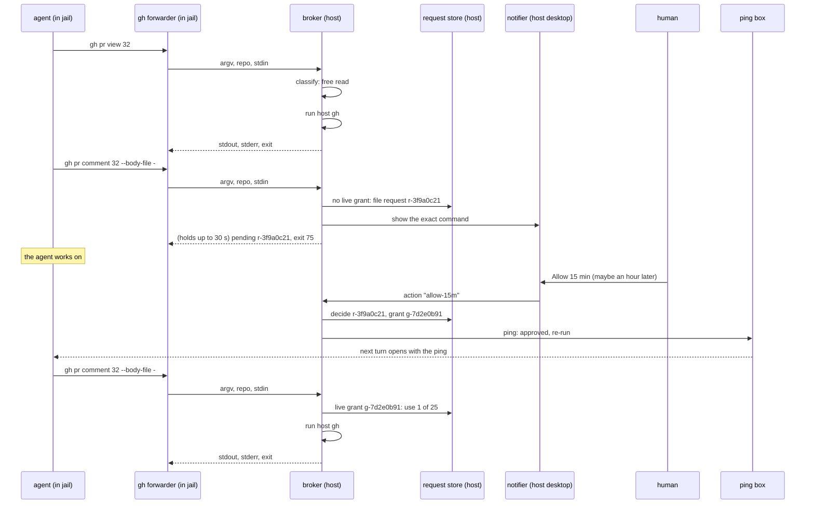

# Reads run, writes ring the doorbell: time-boxed GitHub access across the jail boundary

**Status:** DESIGN, 2026-09-28. Revised around the maintainer's brief of that day; first sketched
2026-08-05. Nothing built: no broker daemon, request store, `yolo approve` or `yolo audit` exists
under `internal/` or `cmd/` at `c8fda25f`, and no notification code exists anywhere in the tree.
The research behind [§5](#5-read-or-write-the-allowlist) and
[§6](#6-the-doorbell-a-persistent-desktop-notification) is dated 2026-09-28 and marked MEASURED,
SOURCED or INFERRED throughout ([Appendix B](#appendix-b--the-research-evidence)).

> **In short.** The GitHub credential never crosses the boundary; the command does. A host daemon
> runs the host's own `gh` for the jail: an allowlisted read runs at once, and any other command
> waits for a human, who answers in a desktop notification with a time-boxed grant that reaches
> the agent later through the `yolo notify` doorbell.

**Why it matters.** Today a jail either has no GitHub access or holds a token, which makes the
boundary a fiction for that token's whole life: every use is unaudited and nothing can be revoked
per action. The maintainer put this on the plate for the week of 2026-09-28.

**The shape.** A jail-side `gh` forwarder, a host **broker** daemon that classifies and runs `gh`,
a host **request store** holding requests and grants, a **notifier** per OS, the `yolo approve`
fallback, and the **audit log** ([§1.3](#13-terms)).

**Cost.** One new loophole in a new `github` pack, one vendored D-Bus library, two host verbs
(`yolo approve`, `yolo audit`), and a macOS notifier dependency. The write path depends on the
`yolo notify` ping box, which is designed and not built.

**Start at [§3](#3-the-flow)**, the flow. Everything else is what one step of it needs.

**Needs your ruling:** [OQ-BB1](#OQ-BB1), [OQ-BB2](#OQ-BB2), [OQ-BB3](#OQ-BB3), [OQ-BB4](#OQ-BB4), [OQ-B1b](#OQ-B1b).

**Reads with:** [`agent-event-watchers.md`](agent-event-watchers.md) (the `yolo notify` doorbell
the answer rides back on), [`loophole-system.md`](../reference/loophole-system.md) and
[`loophole-transport.md`](../reference/loophole-transport.md) (what the broker is and how a jail
reaches it), [`provider-credential-scope.md`](provider-credential-scope.md) (delivery as specific
as possible), [`sso-backed-bedrock.md`](sso-backed-bedrock.md) (the second consumer waiting for a
request shape). No implementation sketch is open yet.

---

## 1. The brief, and what it rules

### 1.1 The brief

The maintainer, 2026-09-28, verbatim:

> *"I want to bring back up something we talked about a while ago and put it on the plate for the
> week, which is basically the thing like on YOLO, some boundary where we can hand out credentials
> for some time period, as well as it would be nice to be able to audit the use of those
> credentials if that's even possible. … I want to be able to have the agent say to us, like, I
> want to use GitHub for this across the YOLO boundary. And then YOLO will say, oh, well, let me get
> the user. And then we'll show a toast notification to the user. This will work on Mac and Linux
> through whatever persistent toast notifications we can use. And then the button will be like
> allow or deny for some time period or whatever. You can say, yes, you can use GitHub for 15
> minutes. This could be rather delayed. So we need a mechanism where the agent can wait for that.
> I think it might be something where they fire it off. We fire a notification and then it may come
> back at any time. So I don't know if a single time watcher of them running it would work or we
> could use this notification channel for the background watcher we're talking about to relay this
> information back. GitHub is the first target I want to work on. So I want to ideally be able to
> have the full credentials on the host for GitHub, just GitHub logged in like normal or whatever.
> Using the CLI would be preferable or a direct API if that's something that we have to do. And
> then I want to be able to say by default the agent can run a set of read-only commands. If they
> need a write command, then … they have to ring the doorbell and ask the human. And the human gets
> to make an appropriate decision for that."*

The doc's original thesis, 2026-08-05, which the brief sharpens rather than replaces: *"I want to
put some sort of service in between the contained area and the host, just like loopholes, but
positioned in a place where it can hold tasks that are waiting for a human for approval or have
other state associated with it… the agent inside can ask to use my GitHub credentials to post a
comment to a PR, and then it will go to a queue and I can say yes or no."*

### 1.2 What it rules

| The brief says | Rules | Where it lands |
| :--- | :--- | :--- |
| *"This could be rather delayed … it may come back at any time"* | **[OQ-A](#15-decision-ledger): the synchronous version is not enough.** A request outlives its connection | [§3](#3-the-flow), [§7](#7-grants-and-the-request-store) |
| *"a toast notification … on Mac and Linux … persistent … allow or deny for some time period"* | **[OQ-E](#15-decision-ledger): the human answers in a persistent desktop notification**, with Allow, Deny and a duration. `yolo approve` survives as the fallback | [§6](#6-the-doorbell-a-persistent-desktop-notification) |
| *"GitHub is the first target … just GitHub logged in like normal … Using the CLI would be preferable or a direct API"* | The first broker is GitHub's, over the host's own `gh` login, with `gh api` as the direct-API route | [§4](#4-execution-a-host-daemon-runs-the-hosts-gh) |
| *"by default the agent can run a set of read-only commands. If they need a write command … ring the doorbell"* | A read allowlist runs without asking; **everything else is a write** | [§5](#5-read-or-write-the-allowlist) |
| *"you can use GitHub for 15 minutes"* | Grants are time-boxed | [§7](#7-grants-and-the-request-store) |
| *"audit the use of those credentials if that's even possible"* | Every brokered call is logged on the host | [§8](#8-audit) |
| *"use this notification channel for the background watcher … to relay this information back"* | The answer reaches the agent as a `yolo notify` ping | [§3.3](#33-the-answer-comes-back-through-the-doorbell) |

**Two questions the brief does not rule by name:**

- **[OQ-C](#15-decision-ledger), does the jail see the result or only success?** Settled by the
  brief, **by my reading**: *"the agent can run a set of read-only commands"* means nothing unless
  the agent sees what they print. So stdout, stderr and the exit code cross, and "no credential
  crosses" becomes a property of the allowlist, which admits no command that prints one
  ([§4.2](#42-what-crosses-back)). Recorded in the ledger as a reading, not a ruling; say so if
  it is wrong.
- **[OQ-B1b](#OQ-B1b), vendor unYOLO's policy engine or re-derive it?** Not touched by the brief.
  Still open, with a changed leaning ([§14](#14-open-questions)).

### 1.3 Terms

Every term here is coined in this doc unless it says otherwise.

| Term | Meaning | What it is not |
| :--- | :--- | :--- |
| **broker** | The host daemon that receives a jail's `gh` argv, classifies it, runs the host's `gh` for a free read or a granted write, and files a request for anything else. One per jail, a loophole's host daemon ([`loophole-system.md`](../reference/loophole-system.md)) | Not a proxy: it never forwards the jail's bytes to GitHub, and never hands the jail a token |
| **brokered call** | One argv the jail sent the broker, whatever became of it | Not a crossing in [`crossings.log`](../reference/loophole-protocol.md)'s sense, which is a connection |
| **free read** | A command the allowlist classes as a read and the read scope admits ([OQ-BB1](#OQ-BB1)). Runs with no human | Not "any GET": the allowlist decides, not the HTTP verb alone |
| **write** | Every command that is not a free read, including every command the allowlist does not know | Not only commands that change GitHub: a command that writes a host file is one too |
| **request** | A write the broker could not run, held in the store until a human answers or it expires. It has an id (`r-` plus 8 hex), the jail, the exact parsed command and a state | Not a connection: it outlives the call that filed it |
| **grant** | What a human's Allow creates: a scope, an expiry and a use count ([§7](#7-grants-and-the-request-store)). A write inside a live grant runs with no new request | Not a token. Nothing leaves the host |
| **ask-every-time write** | A write no grant covers, so every one files its own request ([OQ-BB2](#OQ-BB2)). unYOLO's `Grantable: false`, re-derived ([§A.1](#a1-the-six-claims-from-the-website-pass-checked-against-code)) | Not a refusal: it can still be allowed once |
| **refused** | A command the broker never runs, with or without a human ([§5.4](#54-never-brokered)) | Not a write awaiting approval |
| **request store** | The host directory holding requests and grants, written only under its lock | Not the audit log, which records what happened and decides nothing |
| **notifier** | The per-OS piece that shows a request to the human and returns the button pressed | Not the ping box, which carries answers to the agent |
| **audit log** | The append-only host file recording every brokered call and every decision | Not jail-writable, and not `crossings.log` |

**The old letters.** Three sibling docs cite work here by this doc's 2026-08 numbering: **B1b**
is the credential-injecting proxy for git ([§13](#13-what-this-does-not-cover-and-the-other-two-tiers)),
**B2** the approval queue, which is now this whole design, and **B3** auth-mode modeling, split out
to [`agent-auth-modes.md`](agent-auth-modes.md). The roadmap never carried them; cite an OQ id.

### 1.4 Principles

Numbered so later sections and sibling docs can cite them.

- <a id="BB-P1"></a>**BB-P1. The credential never crosses; the command does.** The broker runs
  the command on the host with the host's login and returns its output. It never hands the jail
  a token, not scoped, not short-lived. The moment a token crosses, every later use is
  unaudited and unrevocable.
- <a id="BB-P2"></a>**BB-P2. An allowlist, never a denylist.** A command is a read only if the
  allowlist names it with the flags it carries. Anything the classifier does not recognize is a
  write, including every new `gh` subcommand a `gh` upgrade adds.
- <a id="BB-P3"></a>**BB-P3. Approval comes only from the host.** An answer counts only if it
  came from the notifier the broker itself started, or from `yolo approve` over a socket no jail
  can reach. Nothing a jail sends is ever read as a decision.
- <a id="BB-P4"></a>**BB-P4. The human is shown the command, not the agent's story.** Every
  notification is rendered from the broker's own parse of the argv. Agent-written text is never
  the title and is labeled as unverified wherever it appears.
- <a id="BB-P5"></a>**BB-P5. Silence denies.** A request no one answers expires as denied. A
  notifier that cannot show buttons is treated as no notifier. Nothing defaults to yes.
- <a id="BB-P6"></a>**BB-P6. This must not become a general RPC.** The broker runs one program,
  `gh`, with an argv it parsed and rebuilt, in a cwd and environment it owns. No request names a
  program, a cwd, an environment variable or a host file.
- <a id="BB-P7"></a>**BB-P7. Every brokered call is audited.** Refused ones included, since a
  refusal is the most interesting line in an audit log.

## 2. What exists today

Verified against `c8fda25f` on 2026-09-28.

| Piece | Where | State |
| :--- | :--- | :--- |
| A framed request/response protocol across the boundary | `internal/frameproto`, [`loophole-protocol.md`](../reference/loophole-protocol.md) | **shipped**, versioned |
| A host daemon framework with host-asserted jail identity | `internal/hostservice`: the jail id comes *"in descending order of trust"* from the connection preamble, then the request, then `"unknown"` (`hostservice.go:98-102`); the preamble is written host to daemon, once, and *"a client cannot forge, suppress, or even observe it"* (`internal/svcendpoint/preamble.go:62-80`) | **shipped** |
| A jail-to-host transport that authenticates the jail | loopback TLS with a per-(jail, service) endpoint-file token; *"The adversary is a SIBLING JAIL. It is not the jail's own agent, and it is not a same-user host process"* ([`loophole-transport.md`](../reference/loophole-transport.md)) | **shipped** |
| Argv safety for host-side execution | `Session.ExecAllowlisted` (`hostservice.go:196-270`): argv positions checked against a server-owned set, stdout and stderr streamed back as frames, rc 124 on timeout | **shipped**, but too coarse for `gh`: it checks words, not a subcommand's flag grammar |
| A connection audit | `internal/crossaudit`: one line per jail-to-host connection, accepted or rejected, to `GLOBAL_STORAGE/logs/crossings.log`, `0600`, 4 MiB plus one archive (`crossaudit.go:70-190`) | **shipped** 2026-08-15. It records that a connection happened, never what it asked |
| An agent-agnostic doorbell into the session | `yolo notify` and the per-launch ping box ([`agent-event-watchers.md`](agent-event-watchers.md)) | **designed, not built**. `rg` finds no `notify` verb in `internal/cli` or `cmd/` |
| A request that outlives its connection | — | **missing** |
| A human in the answer path | — | **missing**. The nearest thing, `promptYesNo` (`internal/cli/pack.go:1563`), is a foreground prompt its own comment says *"cannot tell a person from a pipe"* |
| Desktop notifications | — | **missing**: no `notify-send`, `osascript`, D-Bus or UserNotifications code in the tree |

**What the loophole protocol's posture decides here.** The transport defends against a sibling
jail, not against the jail's own agent or a same-user host process. So this design protects
against **accident and unaudited action** by a confined agent. It is not a control against a
hostile process running as the user on the host, and the user-facing docs must say so
([§9.6](#96-what-this-is-not-a-control-against)).

## 3. The flow



### 3.1 A read

1. The agent runs `gh <args>` in the jail. The jail's `gh` is the forwarder
   ([§4.3](#43-the-jail-side)), which sends the argv, the repository it resolved, and stdin.
2. The broker parses the argv against the allowlist ([§5](#5-read-or-write-the-allowlist)). A free
   read runs at once, as [§4.1](#41-how-the-broker-runs-gh) describes.
3. stdout, stderr and the exit code return to the forwarder, which prints them and exits with
   that code. The audit log gets one line.

A read never touches the request store and never notifies anyone.

### 3.2 A write, and the bounded wait

1. The broker parses a write. If a live grant covers it ([§7](#7-grants-and-the-request-store)),
   it runs as a read does, spending one use.
2. Otherwise the broker files a request and shows it to the human
   ([§6](#6-the-doorbell-a-persistent-desktop-notification)).
3. **The forwarder waits up to 30 seconds** for the answer, so a human at the desk answers
   inside the agent's own tool call. If Allow arrives in that window, the broker runs the
   command then and returns its output as for a read.
4. **Past 30 seconds the forwarder returns** with exit code **75** and one stderr paragraph:
   the request id, that a human has been asked, that the answer will arrive as a `yolo notify`
   ping, and that the agent should carry on and re-run the command once approved. Nothing ran.
5. A Deny inside the window returns exit **77** with the same shape of message. A request the
   broker refuses outright returns exit **64** naming why ([§5.4](#54-never-brokered)).

The codes are `sysexits.h`'s (`EX_TEMPFAIL`, `EX_NOPERM`, `EX_USAGE`, and `EX_UNAVAILABLE` in
[§3.5](#35-failure-paths)), so a script can tell "wait" from "no" from "never". None collides with
`gh`'s own: 0, 1, 2 (cancelled), 4 (authentication required), and 8 for `pr checks` pending
(MEASURED, `gh help exit-codes`). The wording of each message is the implementer's; the facts in
it are not.

### 3.3 The answer comes back through the doorbell

When the human answers after the wait, the broker writes one ping into that launch's ping box,
through the host-side writer [`agent-event-watchers.md`](agent-event-watchers.md#33-yolo-notify-and-the-ping-box)
defines. It carries facts only, per that doc's rule for pings ([§5.1 there](agent-event-watchers.md#51-pinged-text-is-a-prompt-injection-channel)):

```text
[yolo notify · github-broker · 14:07Z] An automated notice from a background process yolo runs for
this workspace. It is not from the user and grants nothing.
r-3f9a0c21 approved: gh pr comment on mschulkind-oss/yolo-jail, grant g-7d2e0b91, 25 writes to this
repository until 14:22Z. Nothing has run; re-run the command if it is still wanted.
```

- The ping names the command by its subcommand path and repository, never by its arguments, so
  no agent-written body and no third-party text rides into the model's context.
- A Deny pings `r-… denied`; an expiry pings `r-… expired unanswered, treated as denied`.
- The ping's `from` label is `github-broker`, so the box's rate limit (six delivered per 60
  seconds per label) applies per broker.
- **Why a ping, not a watcher the agent runs.** The brief asked whether *"a single time watcher"*
  would do. A one-shot wait the agent starts (`yolo gh wait <id>`, which exists for scripts)
  works only for an agent with background tasks, dies with the session, and must be started
  again every time. The ping box is agent-agnostic, survives the session, and reaches every
  agent through its own pack's deliverer.
- **Until `yolo notify` is built**, the pending message names `yolo gh status <id>` instead, and
  the agent polls. Nothing else changes.

### 3.4 The agent re-issues under the grant

**An approval after the wait runs nothing.** It creates a grant; the agent re-runs its command,
and the grant covers it. The alternative, running the approved command at approval time and
pinging its output back, was weighed and rejected:

| | Run at approval time | Re-issue under the grant (chosen) |
| :--- | :--- | :--- |
| Staleness | Runs an argv composed up to an hour ago, against a PR that may since have merged or a branch that moved | The agent decides, with current context, whether the command is still wanted |
| Idempotency | An agent that gave up and ran the command another way, or asked twice, posts twice | Nothing runs twice: the approval itself does nothing |
| Where the output goes | Into a 1 KB, 8-line ping, or a result store the agent must fetch from | Into the agent's own tool call, as for any command |
| A session that ended | The command runs for nobody | Nothing runs, which is the right answer |
| Cost | None to the agent | One more turn |

The one exception is the bounded wait in [§3.2](#32-a-write-and-the-bounded-wait): there the
argv is at most 30 seconds old and its caller is still waiting, so running it then has neither
problem.

### 3.5 Failure paths

| Step | What fails | What happens, and who finds out |
| :--- | :--- | :--- |
| Forward | The broker is not running or unreachable | The forwarder exits 69 (`EX_UNAVAILABLE`) naming the loophole and `yolo check`. It never falls back to a `gh` of its own |
| Classify | The argv does not parse, or names a refused command | Exit 64 naming the rule; one audit line, class `refused` |
| Run | The host `gh` is missing or has no login | Exit 69, naming `gh auth status` on the host. The broker never starts a login |
| Run | The call exceeds 300 seconds | Killed; exit 124, as `ExecAllowlisted` does; audited |
| Run | Output exceeds 16 MiB | Cut, with a last stderr line saying so; audited with the byte count |
| Request | Three requests from this jail already wait | Exit 75 with no new request, naming the three ids |
| Request | The same command is already pending from this jail | The call joins that request: same id, no second notification |
| Request | The same command was denied in the last 10 minutes | Exit 77 with no new notification, naming the earlier denial |
| Notify | No notifier ([§6.5](#65-when-there-is-no-notifier-or-nobody-answers)) | The request is filed anyway; the pending message and the launch terminal name `yolo approve` |
| Answer | Nobody answers in 60 minutes | Expired as denied; the notification is withdrawn; a ping says so |
| Answer | The broker restarts with requests pending | It re-reads the store and re-shows each live request. An answer to a notification the old process showed is lost, and the re-shown one replaces it |
| Answer | Two answers race (a button and `yolo approve`) | The first decision written wins; the second is told the request is already decided |
| Deliver | The ping box is missing, or the agent's pack has no deliverer | The decision stands and is in the store; `yolo gh status <id>` reports it |

## 4. Execution: a host daemon runs the host's `gh`

### 4.1 How the broker runs `gh`

The broker never runs `gh` the way the argv arrived. It rebuilds a canonical argv from its own
parse and runs it under conditions it owns, because `gh` is a program with many ways to run other
programs ([§9.5](#95-host-code-execution-through-gh)):

| Condition | Value | Why |
| :--- | :--- | :--- |
| Program | The host's `gh`, resolved once at daemon start to an absolute path and disclosed | [BB-P6](#BB-P6) |
| cwd | An empty directory the broker owns under its state dir | `gh` reads the git repository in its cwd (`pr status`, a bare `pr view`, `{owner}/{repo}` placeholders), and git in a jail-writable checkout can run code through its config (MEASURED for `gh`'s reads; the git half is standard git behavior) |
| Repository | Always explicit: `-R <owner>/<repo>`, two segments, from the argv or the forwarder | No cwd inference. A three-segment `-R HOST/o/r` is refused (H1 in [Appendix B](#b2-gh-probes)) |
| `GH_CONFIG_DIR` | A broker-owned directory holding a copy of the host's `hosts.yml` and no `config.yml` | No aliases, and no `browser`, `pager`, `editor` or `http_unix_socket` keys. The token stays wherever `gh` keeps it: the OS keyring by default since `gh` 2.26.0, `hosts.yml` otherwise (SOURCED). Whether a copied `hosts.yml` still finds a keyring entry is INFERRED and is the first thing the build checks |
| `XDG_DATA_HOME`, `XDG_CACHE_HOME`, `XDG_STATE_HOME` | Empty broker-owned directories | No extensions can resolve (they live under the data dir, MEASURED) |
| Environment | Built from nothing: `PATH` of the `gh` binary's directory plus `/usr/bin:/bin`, `HOME`, `GH_HOST=github.com`, `GH_PROMPT_DISABLED=1`, `GH_NO_UPDATE_NOTIFIER=1`, `GH_PAGER=cat`, `NO_COLOR=1`, and `gh`'s telemetry dial off | No `GH_TOKEN`, `GH_ENTERPRISE_TOKEN`, `GITHUB_TOKEN`, `GH_REPO`, `BROWSER`, `GH_BROWSER`, `EDITOR`, `VISUAL`, `GH_EDITOR` or any `GIT_*`. `GH_BROWSER` and `GH_PAGER` are exec paths `gh` runs (MEASURED) |
| stdin | The bytes the forwarder sent, capped at 1 MiB, only for a flag that reads `-` | [§5.5](#55-argv-hazards) |
| Timeout | 300 seconds per call, `watch` forms included | A `run watch` is useful and must still end |

### 4.2 What crosses back

- **stdout, stderr and the exit code cross, verbatim**, up to 16 MiB. This is
  [OQ-C](#15-decision-ledger) as the brief settles it ([§1.2](#12-what-it-rules)).
- **No credential crosses because no command that prints one is brokered.** `auth token`,
  `auth git-credential`, `auth status -t`, `config get … oauth_token` and `--jq` (which can read
  the environment) are refused outright, MEASURED as printing a token in this jail with fake
  credentials ([Appendix B](#b2-gh-probes)).
- **Defense in depth:** at start the broker reads the host token once, host-side, and replaces
  any occurrence of it in output with `[redacted by yolo]`, counting it in the audit line. That
  count should always be zero; a non-zero one is a classifier bug.
- **What still crosses by design** is anything the user's login can read. A read allowlist does
  not stop a confined agent reading a private repository and carrying it out of the jail through
  its own network. Whether free reads reach every repository the login can see is
  [OQ-BB1](#OQ-BB1).

### 4.3 The jail side

- **The jail's `gh` is a forwarder**, a pack-shipped script that execs a `yolo` subcommand
  (`yolo gh -- <args>`), since daemons and clients dispatch on `args[0]`
  ([`AGENTS.md`](../../AGENTS.md)). It must precede any real `gh` on the jail's `PATH`. How the
  pack places it is the implementer's.
- **The forwarder resolves the repository in the jail**: from `-R`, then from the workspace's
  `origin` remote read by the jail's own git, and sends it as a field. Running git there is safe;
  the jail is the confined side. The broker still checks the repository against the read scope
  ([OQ-BB1](#OQ-BB1)).
- **It sends stdin** when the argv reads `-`, and forwards the exit code it gets back.
- **`yolo gh status <id>`** reports a request's state; **`yolo gh wait <id>`** blocks until it
  is decided, for scripts. Both are reads of the store through the broker; neither decides
  anything.
- **A token the user delivers to the jail anyway** (a `GH_TOKEN` in `env_sources`, as this
  workspace's own `.env` does today) bypasses the broker for any process that uses it. The
  launch discloses it: *"GH_TOKEN reaches this jail, so a gh or git that reads it does not go
  through github-broker."* yolo does not remove it; it is the user's.

### 4.4 Per notch and backend

| Where the agent runs | The broker | How the jail reaches it | Notes |
| :--- | :--- | :--- | :--- |
| Container jail, podman, bridge network | yes | loopback TLS; endpoint-file token per (jail, service); jail id from the preamble | The case the slice builds |
| Container jail, `network.mode: host` | yes | the same; the port sits on the host's loopback | A sibling jail or host process can reach the port but needs the endpoint token, and grants are keyed on the preamble's jail id ([§9.4](#94-macos-user-and-shared-network-jails)) |
| Nested jail | no login to broker | the outer jail is its host | The outer jail has no host GitHub login, so the broker reports `gh` unauthenticated (INFERRED) |
| Apple Container | **inert** | — | Every pack loophole is inert on that backend, which carries no container-to-host connection ([`loophole-system.md`](../reference/loophole-system.md#where-a-loophole-does-nothing)); the launch says so |
| macos-user | yes, UNMEASURED on a Mac | the endpoint file granted across uids (`macosuser.EndpointGrantCommands`) | The sandbox is a different account, so it cannot read the user's keychain, store or audit log |
| `yolo host -- <agent>` | **not offered** | — | The agent runs as the user, so it can run the real `gh`, read the store and press the notification's button itself. A broker there would audit only what the agent chose to route through it |

### 4.5 The alternative: mint a narrow token

The research priced the other shape the brief allowed for, a short-lived token:

| | Host `gh` login, command crosses (chosen) | GitHub App installation token handed to the jail | GitHub App token held by the broker |
| :--- | :--- | :--- | :--- |
| Setup | None beyond `gh auth login` | Register an App, install it on each org or repo, keep its private key on the host | The same |
| Lifetime | The host login's | *"Installation tokens expire one hour from the time you create them"* (SOURCED); revocable early | The same, never crossing |
| Server-side scope | The login's: a classic `gh` token carries `repo`, full read and write to every private repo (SOURCED) | Exactly the repos and permission map requested (`contents: read`, `pull_requests: write`) | The same |
| Per-action control | Yes: every call is classified | **None**: inside the hour, anything the permission map allows, unaudited | Yes |
| Can it say "comment, not merge"? | Yes, by subcommand | No: `pull_requests: write` covers both | Yes, by subcommand |
| GitHub-side attribution | The user, through the GitHub CLI's OAuth app, indistinguishable from the user's own `gh` (INFERRED) | The App | The App |
| [BB-P1](#BB-P1) | holds | **broken** | holds |

**Verdict:** a token handed to the jail is rejected, because it gives up per-action control for the
hour, which is the whole feature. A broker-held App token is a better *credential source* than the
user's login, since GitHub then enforces the scope server-side and attributes the actions to the
App, but its setup cost is exactly what the brief asked to avoid (*"just GitHub logged in like
normal"*). It stays a later option behind the same broker, which is why the broker's credential
source is one seam, not a design choice spread through it.

## 5. Read or write: the allowlist

### 5.1 The rule

1. **Parse as `gh` does**: flags anywhere, including before the subcommand (`gh -R o/r pr view
   1` parses, MEASURED), long and short forms, `=` and separate values. A bundled short flag the
   classifier does not know makes the whole argv a write.
2. **Match the command path exactly** against the allowlist: `pr view`, not a prefix. Aliases
   and extensions never resolve, because the broker's `gh` has none
   ([§4.1](#41-how-the-broker-runs-gh)), and the classifier refuses any word that is not a
   built-in path.
3. **Check every flag** against that entry's permitted set. An unknown flag makes the command a
   write, not a read with a flag ignored.
4. **Check the repository** against the read scope ([OQ-BB1](#OQ-BB1)).
5. **Classify:** free read, grantable write, ask-every-time write, or refused.
6. **The classifier is keyed to a `gh` version range.** At daemon start the broker reads the
   host `gh`'s version. Outside the tested range every command is a write, and the launch says
   so, because a `gh` release can add a subcommand or a side effect to an old one.

### 5.2 The free reads

MEASURED against `gh` 2.101.0 in this jail. The flag notes are the refusals that keep each
entry a read; `-w/--web` is refused everywhere, because it runs the host's browser.

| Command path | Flag notes |
| :--- | :--- |
| `pr view`, `pr list`, `pr diff`, `pr status` | `pr status` only with an explicit `-R` |
| `pr checks` | `--watch` and `--interval` allowed, bounded by the call timeout |
| `issue view`, `issue list`, `issue status` | |
| `issue develop --list` | only with `--list`; without it the command creates a branch |
| `run view`, `run list`, `run watch` | `--log`, `--log-failed` allowed |
| `workflow view`, `workflow list` | `--yaml` allowed |
| `repo view`, `repo list`, `repo read-dir` | |
| `repo read-file` | `-o/--output` and `--clobber` refused: they write host files |
| `repo gitignore list/view`, `repo license list/view`, `repo autolink list/view`, `repo deploy-key list` | |
| `release view`, `release list`, `release verify` | |
| `search code`, `search commits`, `search issues`, `search prs`, `search repos` | account-wide: see [OQ-BB1](#OQ-BB1) |
| `gist view`, `gist list`, `label list`, `cache list`, `org list`, `status` | account-wide ones as above |
| `secret list`, `variable list`, `variable get` | `secret list` returns names (INFERRED); Actions variables are not secret by GitHub's own model |
| `ruleset list/view/check`, `discussion list/view`, `agent-task list/view` | `agent-task --follow` bounded by the call timeout |
| `project list/view/field-list/item-list` | needs the `project` scope, which a default login lacks (INFERRED) |
| `auth status` | **only** without `-t/--show-token`, which prints the token (MEASURED) |
| `api` | only under [§5.3](#53-gh-api)'s rule |

`--jq`/`-q` and `--template` are refused on every entry, read or write: `--jq 'env.GH_TOKEN'` and
`'$ENV.GH_TOKEN'` printed tokens from the environment (MEASURED; `gh` turns on the environment
access its jq library disables by default, SOURCED). The refusal says to pipe `--json` output into
`jq` in the jail instead. `--json <fields>` is allowed.

**Everything not in this table is a write.** That includes, by name, the look-alikes that are not
reads: `pr checkout` and `co` (local git), `repo clone`, `gist clone`, `run download`,
`release download`, `attestation download` (host files), `repo set-default` without `--view`
(local git config), `browse` (runs the browser even with no network call, MEASURED), and every
`--dry-run` (`pr create --dry-run` *"May still push git changes"*, MEASURED in its help).

### 5.3 `gh api`

`gh`'s own rule, from its help: *"The default HTTP request method is `GET` normally and `POST` if
any parameters were added. Override the method with `--method`."* The broker's rule, applied to its
own parse (MEASURED against a local echo server, [Appendix B](#b2-gh-probes)):

1. **Effective method:** `-X`/`--method` uppercased if given; else `POST` if any `-f`, `-F`,
   `--raw-field`, `--field` or `--input` is present; else `GET`. `GET` and `HEAD` are candidate
   reads. Everything else is a write.
2. **Endpoint:** a path, never a URL. Anything containing `://` is refused: `gh api http://…`
   sent the enterprise token over plain HTTP to the named host (MEASURED). `--hostname` is refused.
3. **Headers:** `-H` refused except an allowlisted `Accept:` value. `X-HTTP-Method-Override`
   passes through `gh` untouched (MEASURED), so a `GET` carrying it is not a read.
4. **Host files:** a `-F` value beginning `@` is refused, and `--input` is allowed only as `-`
   ([§5.5](#55-argv-hazards)).
5. **Repository scope** for a REST read: the path's `repos/{owner}/{repo}` prefix is the
   repository [OQ-BB1](#OQ-BB1) checks. A path with no repository is account-wide.
6. **GraphQL** (`graphql`, `/graphql`, `api/graphql`) is always `POST`, even for a query. It is a
   read only if the `query` field, passed as `-f query=…`, parses as a GraphQL document in which
   **every** operation is a `query` (the anonymous `{…}` shorthand counts). `mutation`,
   `subscription`, a document that fails to parse, or a query arriving any other way is a write.
   `operationName` is never trusted to pick one. A GraphQL query names no repository the broker
   can check, so it is account-wide.
7. **Harmless:** `--paginate`, `--slurp`, `-i`, `--silent`, `--preview`, `--cache`.
8. **Every `gh api` write is ask-every-time.** A time grant covering `gh api -X POST` would cover
   every endpoint, merges and deletes included, and would empty [OQ-BB2](#OQ-BB2)'s list of
   meaning.

### 5.4 Never brokered

Refused with or without a human, because no answer makes them safe to run on the host:

| Refused | Why |
| :--- | :--- |
| `auth` (except `auth status` without `-t`), `config`, `alias`, `extension` (except `extension search`) | They print the token or change what the broker's `gh` runs |
| `copilot`, `preview`, `extension exec`, `codespace ssh/cp/logs/jupyter/ports` | They download and run code, or open a session on the host |
| `browse`, and every `-w/--web` and `-e/--editor` | They run a host program |
| `repo clone`, `gist clone`, `pr checkout`, `co`, `repo sync`, `repo set-default` (without `--view`) | They need or change a local checkout, which the broker does not have |
| `run download`, `release download`, `attestation download`, `repo read-file -o` | They write host files |
| `attestation verify`, `release verify-asset` | They read a host file the agent names |
| any argv carrying `--jq`, `--template`, a `-F …=@path`, a `--*-file <path>` other than `-`, a URL argument off `https://github.com/`, or a three-segment `-R` | [§5.5](#55-argv-hazards) |

### 5.5 Argv hazards

| # | Hazard (MEASURED unless marked) | What the broker does |
| :--- | :--- | :--- |
| H1 | `-R HOST/o/r`, a URL argument on another host, and `GH_HOST` all send the call, with a token, to the host named | Pins `GH_HOST=github.com`; refuses three-segment `-R` and off-GitHub URLs |
| H2 | `--jq` reads the environment | Refused everywhere ([§5.2](#52-the-free-reads)) |
| H3 | An alias can run shell (`gh alias set --shell`); `co` can be redefined; multi-word aliases under built-in parents work | No `config.yml`; exact command-path match; `co` refused |
| H4 | An extension resolves any unknown word to a binary | Empty data dir; unknown words refused |
| H5 | `GH_BROWSER`, `BROWSER`, `GH_PAGER`, `PAGER`, `GH_EDITOR`, `VISUAL`, `EDITOR` are exec paths | Environment built from nothing ([§4.1](#41-how-the-broker-runs-gh)) |
| H6 | Flags parse before the subcommand | The parser skips flags wherever they sit |
| H7 | The cwd's git repository leaks into `{owner}/{repo}`, `pr status` and a bare `pr view` | Empty cwd; explicit `-R` |
| H8 | Token-printing verbs | Refused, no approval path |
| H9 | `-F x=@file`, `--input file`, `--body-file file` read a host file the agent names, and put it in a request (`-X GET -F q=@secret.txt` put the file in the query string) | Refused; the forwarder sends the jail's file as stdin and the argv says `-` |

## 6. The doorbell: a persistent desktop notification

### 6.1 Linux

The broker speaks the freedesktop Notifications D-Bus interface (spec 1.3, 2024-08-18, SOURCED)
directly, through one vendored library, `godbus/dbus` v5 (BSD-2-Clause, pure Go, builds with
`CGO_ENABLED=0` for Linux and darwin; MEASURED).

| Spec feature | What the broker sends or reads |
| :--- | :--- |
| `actions` | Three key/label pairs ([§6.4](#64-choosing-a-duration)). No `"default"` key: the body click must never mean Allow |
| `urgency` hint | `2`, critical: *"Critical notifications should not automatically expire … only be closed when the user dismisses them"* |
| `resident` hint | `true`, so a button press does not remove the notification before the broker withdraws it |
| `expire_timeout` | `0`, never expire |
| `GetCapabilities` | Checked before every notification: no `actions` means no notifier ([§6.5](#65-when-there-is-no-notifier-or-nobody-answers)) |
| `ActionInvoked(id, key)` | The answer. Accepted only when the signal's sender is the current owner of `org.freedesktop.Notifications` and the id is one this broker showed |
| `NotificationClosed(id, reason)` | Reason 2, dismissed by the user, is a Deny. Reason 1, expired, is ignored: the request's own 60-minute expiry governs |
| `CloseNotification(id)` | Sent when the request is decided elsewhere (`yolo approve`, expiry), so no stale button survives |
| `replaces_id` | Used when the broker re-shows a request after a restart |

How the desktops behave (MEASURED from their source unless marked):

| Server | Buttons | Persistence | Consequence |
| :--- | :--- | :--- | :--- |
| GNOME Shell | yes, **at most 3** (`MAX_NOTIFICATION_BUTTONS`); a fourth is silently dropped | honors `resident`; critical stays on screen; a notification kept in the message list keeps its buttons | The whole button budget is three ([§6.4](#64-choosing-a-duration)). On `main` since a 2026-09-10 commit, signals go only to the connection that called `Notify`; which release first ships that is unchecked |
| KDE Plasma | yes, drawn in a row | critical forces timeout 0; **actions are stripped once the notification expires or its sender leaves the bus** | The broker must keep its connection for the request's life |
| xfce4-notifyd | yes | no `persistence`; **drops the `actions` capability under Do Not Disturb** | Do Not Disturb reads as no notifier |
| dunst, mako | no buttons: a context menu (`dunstctl`, `makoctl menu`) | configurable | They advertise `actions`, so the broker posts; the body text names `yolo approve` for anyone who cannot find the menu (SOURCED) |
| swaync | yes, plus keys 1 to 9 | — | SOURCED only |

**Two rules follow from that table.** The process that calls `Notify` must hold that same D-Bus
connection until the request is decided, which is why the notifier lives in the broker and not in
a helper that exits. And the broker connects only to the session bus named by the launch's own
`DBUS_SESSION_BUS_ADDRESS`, never falling back to `/run/user/<uid>/bus` or `dbus-launch`: a launch
over SSH would otherwise pop an Allow button on an unattended desktop (godbus does both fallbacks,
SOURCED from its source; the connection must be opened with auto-start off).

`notify-send -A … --wait` (libnotify **0.7.10**, 2022-04-27, not 0.7.9; SOURCED) prints the chosen
action key and would need no library, and was rejected: an Ubuntu 22.04-era libnotify lacks it
(INFERRED), a timeout and a dismissal exit alike, and the broker could neither withdraw nor
replace the notification it did not own.

### 6.2 macOS

A posting process must be an app bundle to use `UNUserNotificationCenter`; a bare binary throws
`bundleProxyForCurrentProcess is nil` (SOURCED). What that leaves:

| Option | Buttons and answer | Persistence | State (SOURCED unless marked) |
| :--- | :--- | :--- | :--- |
| **terminal-notifier ≥ 3.0** | `-action` buttons (more than one collapses into an **Options** menu); prints the action; `@CLOSED`, `@TIMEOUT`; exit 3 not authorized, 4 no GUI session | "Alerts" style, a per-app user setting in System Settings | Rebuilt on UserNotifications, 3.0.0 on 2026-08-23 and 3.1.0 on 2026-08-30 (MEASURED against the GitHub API); Homebrew builds it from source, ad-hoc signed and not quarantined. **Not** the "actions removed, unmaintained" 2.x that older advice describes |
| A yolo-shipped helper `.app` | The same API, our own categories and a `.customDismissAction` so a dismissal is reported | as above | Ad-hoc signing is enough for a locally built bundle; a downloaded one needs Developer ID signing and notarization to avoid Gatekeeper (INFERRED) |
| alerter 26.5 | `--actions` dropdown, `--timeout`, `--json` | as above | Rejected: still the deprecated `NSUserNotification` plus private keys and a bundle-id swizzle (MEASURED in its source), fragile on macOS 26 |
| `osascript` `display notification` | none | banner | No buttons, no answer |
| `osascript` `display dialog`, `choose from list` | 1 to 3 buttons, or any number of list items; `giving up after N` | modal window | Works with nothing installed, but it is a modal window that takes focus, not the toast the brief asked for |

Two facts shape all of them. The answer comes to a process that must still be running, so the
broker keeps the notifier child alive for the request's life, as on Linux. And the "Alerts"
style that keeps a notification on screen is the user's setting, not the app's: a first run
must tell the user to switch it, and a banner that auto-hides still keeps its buttons in
Notification Center. `timeSensitive` needs a capability an ad-hoc build lacks (INFERRED); it is
not relied on. Which of these yolo uses is [OQ-BB4](#OQ-BB4).

### 6.3 What the notification shows

Rendered by the broker from its own parse ([BB-P4](#BB-P4)), never from a string the jail sent:

- **Title, fixed by yolo:** `yolo: GitHub write requested` (or `… ask-every-time write`).
- **Body, in order:**
  1. the canonical command, with each value longer than 60 characters elided to its first 40,
     its length and a short hash, and stdin shown as `stdin: 412 bytes`;
  2. the repository, or `account-wide`;
  3. the jail's workspace path as the host sees it, and the agent if the forwarder reported one,
     marked as reported by the jail;
  4. the request id, the time it expires, and `yolo approve r-3f9a0c21` as the alternative;
  5. the agent's note if it passed `--reason`, at most 140 characters, labeled
     `agent's note (unverified):`, always last.
- **Cleaned:** control characters and terminal escapes removed from every field, and bidirectional
  override characters too, so no field can visually reorder another.

### 6.4 Choosing a duration

GNOME shows three buttons, so the button set is three, and every longer choice goes through
`yolo approve`:

| Button (the leaning in [OQ-BB3](#OQ-BB3)) | What it grants |
| :--- | :--- |
| **Allow once** | This exact command, one use, valid 15 minutes |
| **Allow 15 min** | [OQ-BB2](#OQ-BB2)'s grant scope for 15 minutes, 25 uses |
| **Deny** | Nothing; the same command is refused silently for 10 minutes |

Dismissing the notification is also a Deny ([BB-P5](#BB-P5)). An ask-every-time write shows
**Allow once** and **Deny** only. On macOS the same three appear in the Options menu, and a fourth
would fit there, but one set on both systems is simpler to learn. `yolo approve r-… --for 1h` and
`--for session` give the longer grants ([§7](#7-grants-and-the-request-store)).

### 6.5 When there is no notifier, or nobody answers

**No notifier** means any of: no session bus in the launch's environment, no owner of
`org.freedesktop.Notifications`, no `actions` capability, xfce's Do Not Disturb, macOS exit 3 or 4,
or no macOS notifier at all. Then:

1. **The request is filed anyway.** It waits for `yolo approve` exactly as for a button.
2. **The launch's terminal gets one notice line**, printed by the launching `yolo` process above
   the agent: `github-broker: r-3f9a0c21 waits for approval: yolo approve r-3f9a0c21`. The
   terminal is **never** an answer channel: the agent owns its keystrokes and its screen, and a
   prompt drawn into its TUI could be answered by the agent's own output.
3. **`yolo approve`** on the host, from any terminal including one over SSH:

   ```console
   $ yolo approve                      # list pending requests and live grants, every jail
   $ yolo approve r-3f9a0c21           # allow once
   $ yolo approve r-3f9a0c21 --for 15m # or 1h, or session
   $ yolo approve r-3f9a0c21 --deny
   $ yolo approve --revoke g-7d2e0b91  # or --revoke all
   ```

   In a jail, `yolo approve` refuses, naming the host spelling: the store is not mounted there.
4. **Nobody answers in 60 minutes:** the request expires as denied, the notification is
   withdrawn, and the agent gets a ping.

### 6.6 One store, several front-ends

The notification, `yolo approve`, and any later TUI or footer segment are all clients of one
request store, and they decide nothing themselves: **the store is the API and the front-ends are
dumb.** Authority stays with host processes that can open the store, never with an HTTP port: in
bridge mode a jail reaches the host at `host.containers.internal`, so a loopback HTTP approval UI
would be reachable by the very thing whose requests it approves. A web front-end, if ever wanted,
is a thin local client of the store with its own operator credential
([§A.6](#a6-recommendation--build-b1b-vendor-the-policy-engine-do-not-adopt-gh-broker)).

## 7. Grants and the request store

**A request** is the parsed canonical command, its repository, the stdin digest, the jail id from
the preamble, the workspace, the class, the time filed and its state: `pending`, then one of
`allowed`, `denied`, `expired` or `refused`. Its identity for duplicate-joining and for
**Allow once** is a SHA-256 over the canonical argv, the repository and the stdin digest, which is
unYOLO's content-addressed plan, re-derived ([§A.1](#a1-the-six-claims-from-the-website-pass-checked-against-code)).

**A grant** carries:

| Field | Value |
| :--- | :--- |
| Scope | **Allow once:** one request digest. **A time grant:** [OQ-BB2](#OQ-BB2)'s scope, leaning to grantable writes to one repository from one jail |
| Holder | The jail id from the preamble, never a field a request carries |
| Expiry | 15 minutes, 1 hour, or `session`: until that jail stops, capped at 12 hours |
| Uses | Allow once: 1. A time grant: 25 |
| Narrowing | The human may only narrow: a shorter time, fewer uses, never an ask-every-time write, never another jail ([OQ-B](#15-decision-ledger)) |

Rules:

- **Expiry is checked at use**, against the clock, never by a sweeper. A grant that expired is
  kept for the audit and matches nothing.
- **A jail stopping ends every grant it holds**, time grants included, when the broker for that
  jail exits.
- **Revocation** is `yolo approve --revoke <grant>` or `--revoke all`, effective at the next call.
- **Several jails at once:** every request and grant belongs to one jail. `yolo approve` lists
  all of them with their workspace; a grant never spans jails, even two on one repository.
- **The store** lives at `GLOBAL_STORAGE/broker/github/` (under `~/.local/share/yolo-jail`), `0700`,
  one JSON file per request and grant, in its own directory so that no sweep of another store
  ever reaps a pending human decision. It is never mounted into a jail.
- **One writer, serialized.** Every mutation, from any broker or `yolo approve`, goes through one
  function under an `flock` on the store. A decision names the request state it saw; the first
  decision written wins, and a later one is told the request is already decided (unYOLO's
  `expected_revision`, re-derived, since two front-ends now exist).
- **Retention:** decided requests and ended grants stay 7 days for `yolo approve` to show, then go.
  The audit log keeps the record.

## 8. Audit

Answering the brief's *"if that's even possible"*: yes, on the host, and only there. GitHub's own
records attribute a call made with the user's `gh` login to the user through the GitHub CLI's
OAuth app, indistinguishable from the user's own use (INFERRED), so the broker's log is the only
per-agent record.

- **Where:** `GLOBAL_STORAGE/logs/broker-audit.jsonl`, `0600`. `logs/` is never mounted into a
  jail (verified: every write under it is host-side, and the jail mounts only `cache/`, the
  shared `home/` dirs, `mise/`, and read-only agent and capture dirs).
- **One JSON line per event.** Events are `call`, `request`, `decision`, `grant-used`,
  `grant-ended` and `revoke`. A `call` line carries:

  | Field | Value |
  | :--- | :--- |
  | `time` | RFC 3339, UTC |
  | `service` | `github` |
  | `jail`, `workspace` | host-asserted |
  | `agent` | as the forwarder reported it, marked `reported` |
  | `argv` | the canonical argv, values in full |
  | `stdin` | byte count and SHA-256, never the bytes |
  | `class` | `read`, `write`, `ask-every-time` or `refused` |
  | `outcome` | `ran`, `pending`, `denied`, `refused` |
  | `request`, `grant` | ids, when any |
  | `exit`, `bytes_out`, `elapsed_ms`, `redactions` | as run |
  | `gh_version` | the host `gh`'s |

- **Bounded, not pruned:** rotated at 8 MiB, four archives kept, so at most 40 MiB. `yolo prune`
  never touches it. A write failure warns once per daemon and never blocks a call, as
  `crossaudit` does, because an audit that can refuse work becomes a reason to turn it off.
- **Viewing:** `yolo audit` on the host, with `--since`, `--jail`, `--workspace`, `--class`,
  `--grant` and `--json`; it refuses in a jail. `yolo stores` lists the file under the state
  directory, reclaimed by rotation only.
- **Payload rule:** the 2026-08 draft's tension, a connection audit that is payload-free by rule
  against an approval that needs the payload, resolves by separation. `crossings.log` stays
  payload-free per connection, and this log carries the argv because the argv is what was
  authorized.

## 9. Security

### 9.1 The notification is a social-engineering channel

Everything the agent controls, it can use to talk the human into a yes. So:

- the title is yolo's, fixed ([§6.3](#63-what-the-notification-shows));
- the command shown is the broker's canonical parse, the same bytes it would run, so the agent
  cannot describe one action and request another;
- long values are elided with a hash, so a 4 KB body cannot push the real command off screen;
- escapes, control and bidirectional characters are stripped;
- the agent's note is optional, short, last and labeled unverified.

What remains: a human can still be persuaded by a plausible command. The notification makes the
real command legible; it cannot make the human read it.

### 9.2 Prompt fatigue

A doorbell that rings too often trains a reflexive yes, which is worse than no doorbell because
it manufactures the appearance of oversight. The design's defenses: reads never ring; a time grant
covers a burst of related writes; a duplicate joins its pending request; a denied command stays
quiet for 10 minutes; a jail may have at most three requests pending. The forcing question stays
the one the 2026-08 draft asked: **would the human ever say no?** A command they never refuse
belongs in the grant scope, not in front of them. The audit log is the evidence for moving it.

### 9.3 A jail forging an approval

Every path to a decision is host-only ([BB-P3](#BB-P3)):

- the D-Bus signal arrives on the user's session bus, which no container jail mounts (`rg` finds
  no D-Bus or `/run/user` mount in `internal/cli/run` or `internal/entrypoint`; a user's own
  `mounts` entry could add one, and the launch should say so), and is accepted only from the
  notification server's current owner;
- the macOS answer arrives on the stdout of a child the broker started;
- `yolo approve` writes a store the jail cannot see.

The jail's only channel to the broker is the framed request, and no request field is read as a
decision, a grant, a jail identity or a duration. **What this does not stop:** any process running
as the user on the host can press the button, through `dunstctl`, `makoctl`, a direct D-Bus call,
or AppleScript UI scripting with Accessibility permission (SOURCED). That is the same-user
boundary [§9.6](#96-what-this-is-not-a-control-against) states, and it is why the broker is not
offered at `yolo host`.

### 9.4 macos-user and shared-network jails

- **Identity is the preamble's, always.** A grant is keyed on the host-asserted jail id; a
  sibling jail that reached the port would present its own endpoint token or none, and could not
  spend another jail's grant.
- **`network.mode: host` and nested jails** put the broker's port on a shared loopback. The
  endpoint-file token is per (jail, service), and a connection that fails it gets nothing, not
  even the one-byte ack ([`loophole-transport.md`](../reference/loophole-transport.md)). That is
  the rule notch-convergence states for every pack service's caller secret: refused, never
  served ([notch-convergence §2.3](../plans/notch-convergence.md#23-the-fix-every-service-authenticates-its-caller-at-every-notch)).
- **macos-user** runs the agent as a separate account. The endpoint file is granted across uids;
  the store, the audit log, the keychain and the session's notification centre are the user's and
  unreadable to the sandbox. The notifier runs in the user's own GUI session, which exists only
  when the launch came from one. UNMEASURED: nothing here has run on a Mac.

### 9.5 Host code execution through `gh`

`gh` runs other programs by design: aliases, extensions, the browser, the pager, the editor, git,
downloaded Copilot binaries. [§4.1](#41-how-the-broker-runs-gh) and [§5.4](#54-never-brokered)
close each path this research found, and [BB-P2](#BB-P2) covers the ones it did not: an
unrecognized command or flag never runs as a read, and a `gh` outside the tested version range
runs nothing as a read.

> [!WARNING]
> **Never run the broker's `gh` in the workspace.** The workspace is agent-writable, and git
> reads its config from there, so any `gh` command that shells out to git in the workspace runs
> whatever the agent wrote into `.git/config`, on the host, as the user. The empty cwd and the
> explicit `-R` are not tidiness; they are this boundary.

### 9.6 What this is not a control against

- **A hostile process running as the user on the host.** It can read the store, press the button
  and run `gh` itself. The boundary is the jail's; the broker makes crossing it deliberate,
  audited and revocable.
- **A confined agent exfiltrating what a free read returned.** The jail has network egress; a read
  is a read. [OQ-BB1](#OQ-BB1) narrows what reads reach, which is the only lever here.
- **git.** `git push` and `git fetch` do not go through this broker; the jail uses its own
  credential or has none. The credential-injecting proxy for git is B1b
  ([§13](#13-what-this-does-not-cover-and-the-other-two-tiers)).

## 10. Options compared

| Option | Credential in the jail? | Per-action control | Async answer | Setup | Verdict |
| :--- | :--- | :--- | :--- | :--- | :--- |
| **A. This design:** host `gh`, allowlist, notification, grants, ping | no | yes | yes | `gh auth login` on the host | **Recommended** |
| B. A fine-grained PAT in the jail (today's workspace `.env`) | yes | none | — | per repo | Kept as the user's choice, disclosed ([§4.3](#43-the-jail-side)); not the product |
| C. An App installation token minted per grant and handed to the jail | yes, for an hour | none inside the hour | yes | an App per org | Rejected ([§4.5](#45-the-alternative-mint-a-narrow-token)) |
| D. An App token held by the broker instead of the user's login | no | yes | yes | an App per org | A later credential source behind A, not a different design |
| E. The broker speaks REST and GraphQL itself, no `gh` | no | yes | yes | none | Rejected for now: the brief prefers the CLI, `gh api` covers the gap, and a second GitHub client is a lot of code to own |
| F. Synchronous `yolo approve`, the jail blocking with a timeout (the 2026-08 step 3) | no | yes | **no** | none | Rejected by [OQ-A](#15-decision-ledger) |
| G. Adopt unYOLO's `gh-broker` | no | yes | yes | a GitHub App, required outside development | Rejected ([Appendix A](#appendix-a--prior-art-unyolo-re-analyzed-from-source-2026-08-12)) |

### 10.1 What Appendix A changes now that the flow is asynchronous

[§A.6](#a6-recommendation--build-b1b-vendor-the-policy-engine-do-not-adopt-gh-broker) deferred four
of unYOLO's ideas behind triggers. The asynchronous ruling fires three of them:

| Idea | Its trigger | Fired? | What this design takes |
| :--- | :--- | :--- | :--- |
| Content-addressed plans | a durable queue | **yes** | The request digest, bound to **Allow once** ([§7](#7-grants-and-the-request-store)) |
| `expected_revision` | a second front-end | **yes**: the notification and `yolo approve` | First decision wins ([§7](#7-grants-and-the-request-store)) |
| The grant store | a durable queue | **yes** | A file store under `flock`, not SQLite: no new dependency, and the volume is a handful of records |
| One-time decision tokens | approvals leaving the socket | **no**: every answer arrives at a host process over a channel the jail cannot reach | Nothing yet |
| A separate operator listener | an HTTP UI | **no** | Nothing yet |

## 11. Recommendation and the first build slice

**Build A.** Three steps, each shippable alone:

1. **The read path and the audit log.** A `github` pack shipping the `github-broker` loophole
   (off until enabled, R2 of [`loophole-system.md`](../reference/loophole-system.md#principles))
   and the jail's `gh` forwarder; the broker's `gh` execution ([§4.1](#41-how-the-broker-runs-gh));
   the classifier with the free reads and the refusals; `broker-audit.jsonl` and `yolo audit`.
   Every write returns exit 77 with *"writes need approval, which this version cannot ask for"*,
   audited. Useful on day one: the agent reads PRs, runs and issues with no token in the jail.
2. **Writes on Linux.** The request store and grants, the bounded wait, the D-Bus notifier,
   `yolo approve`, and the answer as a ping. The ping needs `yolo notify` and its box, steps 1
   and 2 of [`agent-event-watchers.md` §10](agent-event-watchers.md#10-what-i-would-build-in-order);
   until they land, `yolo gh status` carries the answer.
3. **macOS.** The notifier [OQ-BB4](#OQ-BB4) picks, and the macos-user endpoint grant measured on
   a Mac.

What waits on a ruling: step 1's read scope ([OQ-BB1](#OQ-BB1)) and step 2's grant scope and
buttons ([OQ-BB2](#OQ-BB2), [OQ-BB3](#OQ-BB3)). Step 1 can be built with the leaning and narrowed
later; widening later is the direction that needs no migration.

**Testing constraints.** No test may call GitHub or start an agent. The classifier is tested on
argv alone, against a table pinned to a `gh` version; the executor against a fake `gh` that
reports the environment, cwd and argv it received, which is how the refusals in
[§5.5](#55-argv-hazards) get a test that fails when the scrub is deleted. The D-Bus notifier is
tested against a private `dbus-daemon` with a fake notification server. A human measures the three
desktops by hand before [§6.1](#61-linux)'s table is claimed as yolo's behavior.

## 12. What done looks like

1. With the pack enabled and no GitHub token in the jail, `gh pr view 32 -R o/r` in the jail
   prints what the host's `gh` prints, and `yolo audit` on the host shows one `read`, `ran` line.
2. `gh auth token`, `gh pr view 32 --jq 'env.GH_TOKEN'`, `gh api http://example.com/x`,
   `gh -R x co 1` and `gh api -F q=@/etc/passwd user` each exit 64 in the jail and are audited as
   `refused`; none runs a host process but the broker's own.
3. `gh pr comment 32 -R o/r --body-file -` with no grant shows a GNOME notification carrying the
   exact command, the repository and the workspace, with three buttons; pressing **Allow 15 min**
   within 30 seconds prints the comment URL in the jail.
4. The same after 30 seconds exits 75 naming the request; pressing **Allow 15 min** an hour later
   rings the agent with an `approved` ping; re-running posts once.
5. Dismissing the notification, or leaving it 60 minutes, pings `denied` or `expired`, and the
   same command stays quiet for 10 minutes.
6. `yolo approve` over SSH lists the pending request and answers it; the notification disappears.
   `yolo approve` in a jail refuses.
7. `gh api -X DELETE repos/o/r/issues/comments/1` inside a live time grant still rings.
8. Stopping the jail ends its grants: after a restart, a write rings again.
9. A launch with `GH_TOKEN` reaching the jail says that token bypasses the broker.

## 13. What this does not cover, and the other two tiers

The 2026-08 draft found that approval is the heaviest of three tiers, and that is still true:

| Tier | Credential lives | Human in the loop | Right when |
| :--- | :--- | :--- | :--- |
| **filter** | in the jail, scoped | no | the provider can express the limit: today's read-only fine-grained PAT |
| **proxy** | host-side, injected after egress | no | it cannot, but the action is mechanically checkable: B1b for git, `claude-oauth-broker`'s shipped shape re-aimed ([§A.3](#a3-fit-against-yolo-concretely)) |
| **approve** | host-side, action gated | **yes** | the judgment is human: this design |

This design is the approve tier with the filter tier folded into it as the free reads. Not
covered:

- **git transport.** `git push`/`fetch` stay the jail's business; B1b is the proxy that would
  cover them, and nothing here waits on it.
- **Other services.** The store, the notifier, `yolo approve` and the audit log are service-neutral
  by construction (`service` in every record); a second broker is a new classifier, not a new
  design. The AWS SSO case [`sso-backed-bedrock.md`](sso-backed-bedrock.md#13-decision-ledger)
  parked here ([`OQ-SSO6`](sso-backed-bedrock.md#13-decision-ledger)) is the likeliest second.
- **Agent-internal prompts moved to the boundary.** The 2026-08 draft's use case B, gating every
  crossing the way an agent gates its own tool calls, is the long-run generalization of this
  design, not a part of it. It only ever sees what crosses, so it is never a replacement for the
  container.
- **The host notch** ([§4.4](#44-per-notch-and-backend)), **Apple Container** (inert), and
  **revoking what a read already returned**.
- **A GitHub App credential source** ([§4.5](#45-the-alternative-mint-a-narrow-token)).

## 14. Open questions

1. ✅ <a id="OQ-BB1"></a>**[OQ-BB1](#OQ-BB1): Do free reads reach every repository the host login
   can see?** The host's `gh` login reads every private repository and org the user belongs to. A
   free read of all of them lets a confined, possibly prompt-injected agent read any of them
   without asking, and carry it out through the jail's own network. This decides step 1's read
   scope and whether account-wide reads (`search`, GraphQL queries, `gh api` paths with no
   repository) ring.

   - **A — Every repository.** The brief's words taken at their widest. No setup; the most
     exposure.
   - **B — The workspace's repositories, pinned at launch.** The GitHub remotes the launch reads
     from the workspace, disclosed (*"github-broker: free reads for o/r"*), plus a user-scope
     setting listing more. Reads elsewhere, and account-wide reads, ring, and are grantable for a
     time. The remotes are agent-editable, which is why they are pinned at launch and disclosed
     rather than re-read per call.
   - **C — B, with account-wide reads free.** Search and GraphQL queries stay free; repository
     paths stay scoped. Leaves GraphQL, which names repositories the broker cannot check, as a
     hole in B's fence.

      _Leaning:_ **B.** It keeps the brief's default (the reads an agent needs for the work in front
   of it never ask) while making "read my other private repositories" a thing a human sees once.
   Starting narrow and widening later needs no migration; the reverse does.

   **Answer:**
   > **Ruled 2026-09-29: B's default, with widening still open.** The maintainer: *"by default,
   > let's make it only have visibility into the repository that is for that workspace, but we
   > should allow the configuration, I guess, at the user level … we can't allow it to be widened
   > in the workspace … that gives a workspace permission it shouldn't be able to widen and then
   > if we instead give that permission … at the user level then it would have to be for all
   > workspaces so how do you give a user level permission a workspace level thing i don't know
   > that we have this yet."* Free reads reach only the workspace's own GitHub remotes, pinned at
   > launch. How a wider set is granted is [OQ-BB6](#OQ-BB6): a workspace may never widen its own
   > reach, and a plain user-scope list would widen every workspace.

2. ✅ <a id="OQ-BB2"></a>**[OQ-BB2](#OQ-BB2): What does a time grant cover, and which writes ask
   every time anyway?** *"You can use GitHub for 15 minutes"* is the brief's example, and taken
   literally it covers merges, deletes and settings. This decides how much one button press
   authorizes.

   - **A — Every write, from this jail.** The literal reading. One press, anything.
   - **B — Grantable writes to one repository, from this jail; a fixed ask-every-time list.** The
     list: every delete (`issue delete`, `repo delete`, `release delete`, `run delete`,
     `cache delete`, `gist delete`, `label delete`, `-X DELETE`), repository settings
     (`repo edit`, `rename`, `archive`, `unarchive`, `transfer`), secrets, variables, deploy,
     SSH and GPG keys, rulesets, `workflow enable/disable`, `pr merge`, every `gh api` write, and
     every account-wide write. Those can only be allowed once.
   - **C — B's scope with no ask-every-time list.** Simpler; a 15-minute grant can merge.

      _Leaning:_ **B.** It is the brief's *"appropriate decision"* made once per class: comments,
   reviews, labels, issue edits and PR creation flow under a grant, and the irreversible or
   repository-wide ones stay in front of the human. unYOLO's single best idea is exactly this
   floor as a code-owned flag ([§A.1](#a1-the-six-claims-from-the-website-pass-checked-against-code)).

   **Answer:**
   > **Ruled 2026-09-29, against the leaning: grants are named permission sets.** The maintainer:
   > *"allow for 15 minutes would be configurable per source, but what I'm proposing here right
   > now for GitHub and what we'll start with is everything … we're going to have two sets of
   > permissions. There's the read-only and then there's the read-write set. And then we're just
   > granting the read-write set for those 15 minutes. And I guess you could extend this
   > trivially to any number of permission sets."* Each source (GitHub first) defines permission
   > sets; the default two are **read-only**, always granted, and **read-write**, which a grant
   > hands over whole for its window (15 minutes by default). No always-ask list in the default;
   > the set model generalizes to more sets per source, and a source's sets and windows are
   > configurable.

3. 💬 <a id="OQ-BB3"></a>**[OQ-BB3](#OQ-BB3): Which three buttons?** GNOME shows three and drops
   the rest, so the notification carries three choices and `yolo approve` the others. This decides
   what one press most often grants.

   - **A — Allow once · Allow 15 min · Deny.** An explicit Deny, the brief's 15 minutes, and the
     narrowest yes. 1 hour and session through `yolo approve`.
   - **B — Allow 15 min · Allow 1 hour · This session**, dismissal meaning Deny. Three durations,
     but no one-shot yes and no visible no.

   <!-- vantage: oq id=OQ-BB3 leaning="A: Allow once, Allow 15 min, Deny; dismissing also denies, and longer grants go through yolo approve." -->

   _Leaning:_ **A.** "Allow once" is the answer that most often fits a single comment, a visible
   Deny is clearer than a dismissal that means no on some desktops and "later" to the human, and
   the brief's own example is 15 minutes.

   **Answer:**
   > _(empty — fill in when decided)_

4. 💬 <a id="OQ-BB4"></a>**[OQ-BB4](#OQ-BB4): What shows the notification on macOS?** A bare
   binary cannot post an actionable notification there. This decides step 3's dependency and
   whether yolo's macOS distribution gains an app bundle.

   - **A — terminal-notifier ≥ 3.0 when it is on `PATH`,** Homebrew-installed, and no notifier
     otherwise. No build change; one more thing a user installs.
   - **B — A small helper `.app` yolo builds and ships,** ad-hoc signed in a Homebrew build,
     Developer ID signed and notarized in a downloaded release. Ours to maintain; no install step.
   - **C — `osascript` `display dialog`.** Nothing to install, but a modal window, not a toast.

   <!-- vantage: oq id=OQ-BB4 leaning="A now, B later: use terminal-notifier 3.x when present, since it is the same UserNotifications API Homebrew builds from source; ship yolo's own helper once the macOS release has a signing step. Never a modal dialog." -->

   _Leaning:_ **A now, B once yolo's macOS release has a signing step.** terminal-notifier 3.x is
   the same UserNotifications API a helper would call, Homebrew builds it unquarantined, and it
   costs yolo nothing to try. A modal dialog is not what the brief asked for.

   **Answer:**
   > _(empty — fill in when decided)_

5. 💬 <a id="OQ-BB6"></a>**[OQ-BB6](#OQ-BB6): How does a user widen one workspace's reach without every workspace getting it?**
   Raised by [OQ-BB1](#OQ-BB1)'s ruling. A workspace's own config may never widen its own
   permission, since the agent can edit it; a plain user-scope repository list would widen every
   workspace at once. The stakes: whether "this project may also read org/other-repo" is
   expressible at all.
   - **(a)** A user-scope map keyed by workspace (its path, or its pinned remote), e.g.
     `"broker": {"github": {"workspaces": {"~/code/app": {"read": ["org/lib"]}}}}`. User-owned, so
     no workspace can widen itself; the key decides which workspace it applies to.
   - **(b)** A host-side grant record per workspace, written by `yolo approve --persist` at the
     host (the fetched-pack approval shape: a record under the state dir no jail can write), shown
     at launch.
   - **(c)** Both: (a) for what a user declares ahead of time, (b) for "always for this workspace"
     answered at the notification.

   _Leaning:_ **(c).** The state-dir record already exists as a pattern (fetched-pack approvals)
   and is what a notification's "always for this workspace" writes; (a) is the declarative
   spelling of the same record. Either way it is user-owned and workspace-keyed, and the launch
   discloses what a workspace was widened to. The same mechanism serves any source's permission
   sets, not only GitHub's.

   <!-- vantage: oq id=OQ-BB6 leaning="(c): a user-scope map keyed by workspace for what the user declares ahead of time, and a host-side per-workspace grant record (the pack-approval shape) for remember-this answers; both user-owned, both disclosed at launch." -->

   **Answer:**
   > _(empty — fill in when decided)_

5. 💬 <a id="OQ-B1b"></a>**[OQ-B1b](#OQ-B1b): Vendor unYOLO's policy engine, or re-derive it?**
   `authorization/policy` + `authorization/budget` + `internal/copyx` are MIT, stdlib-only, about
   2,100 lines with a 1,456-line test file, and drop into `vendor/` with no new module
   requirement ([§A.6](#a6-recommendation--build-b1b-vendor-the-policy-engine-do-not-adopt-gh-broker)).
   This decides whether the classifier's four outcomes and the grant floor are yolo's code or a
   pinned copy of someone else's. (The id predates the grammar `vantage-check` accepts for a
   review button, and keeps its spelling because other docs cite it, so it carries no `oq`
   directive.)

   - **A — Copy at a pinned SHA.** A tested evaluator for free; a policy model built for unYOLO's
     operation registry, which does not parse argv.
   - **B — Re-derive the ideas.** Deny-before-grant, the ask-every-time flag and narrowing-only
     grants, as a few hundred lines keyed to `gh`'s command paths.

   _Leaning:_ **B.** The brief's shape is an argv classifier with a code-owned allowlist, and the
   three ideas worth taking are each a few dozen lines. What the engine adds is a user-editable
   policy file across operations, which this slice does not have. Revisit if a second broker makes
   one policy file across services worth wanting.

   **Answer:**
   > _(empty — fill in when decided)_

## 15. Decision Ledger

| ID | Ruling / Decision | Date | Settled in | Built |
| :--- | :--- | :--- | :--- | :--- |
| [OQ-BB1](#OQ-BB1) | **Maintainer ruling:** free reads reach only the workspace's own GitHub remotes, pinned at launch; widening is [OQ-BB6](#OQ-BB6) | 2026-09-29 | [§14](#14-open-questions) | pending |
| [OQ-BB2](#OQ-BB2) | **Maintainer ruling:** grants are per-source named permission sets; GitHub's default two are read-only (always) and read-write (granted whole for a window, 15 min by default); no always-ask list by default | 2026-09-29 | [§14](#14-open-questions) | pending |
| OQ-A | **Ruled by the brief: the synchronous version is not enough.** A request outlives its connection; the jail waits at most 30 seconds, and the answer comes back later as a ping | 2026-09-28 | [§3](#3-the-flow) | — |
| OQ-E | **Ruled by the brief: the human answers in a persistent desktop notification on Linux and macOS,** with Allow, Deny and a duration. `yolo approve` is the fallback front-end. Its security half, settled 2026-08-12, stands: authority stays with host processes, never an HTTP port | 2026-09-28 | [§6](#6-the-doorbell-a-persistent-desktop-notification) | — |
| OQ-C | **Settled by the brief, by my reading, not ruled by name:** stdout, stderr and the exit code of a brokered command cross verbatim, since running read-only commands means seeing their output. No credential crosses because no credential-printing command is brokered | 2026-09-28 | [§4.2](#42-what-crosses-back) | — |
| OQ-B | Approvals are **per action by default**; a reusable grant is bounded by duration **and** use count; the human may only **narrow**: policy ceiling ≥ request ≥ grant. Held: an earlier draft had the human widening a grant, which unYOLO's `validApprovalConstraints` rejects and which would decay a grant into an allowlist | 2026-08-12 | [§7](#7-grants-and-the-request-store) | — |
| OQ-D | **A pointer, not a question:** delegated to [`agent-auth-modes.md`](agent-auth-modes.md) [OQ-1](agent-auth-modes.md#12-decision-ledger), ruled there 2026-08-29 (launch-time selection, failover deferred), so this broker holds no auth-mode state | 2026-08-12 · delegate ruled 2026-08-29 | [§13](#13-what-this-does-not-cover-and-the-other-two-tiers) | — |
| <a id="BB-D1"></a>[`BB-D1`](#15-decision-ledger) | *Implementation decision.* The broker is a loophole host daemon, one per jail, in a new `github` pack, off until enabled; the jail reaches it over the loopback-TLS transport, and every grant and request is keyed on the preamble's host-asserted jail id, never on a request field | 2026-09-28 | [§4.4](#44-per-notch-and-backend) | — |
| <a id="BB-D2"></a>[`BB-D2`](#15-decision-ledger) | *Implementation decision.* The broker runs `gh` from a canonical argv it rebuilt, in an empty broker-owned cwd, with an environment built from nothing, a broker-owned `GH_CONFIG_DIR` holding only `hosts.yml`, empty XDG data, cache and state dirs, `GH_HOST=github.com`, an explicit two-segment `-R`, a 300-second timeout and a 16 MiB output cap | 2026-09-28 | [§4.1](#41-how-the-broker-runs-gh) | — |
| <a id="BB-D3"></a>[`BB-D3`](#15-decision-ledger) | *Implementation decision.* The classifier parses flags anywhere, matches command paths exactly, checks every flag against its entry, treats anything unrecognized as a write, and treats every command as a write when the host `gh` is outside the tested version range | 2026-09-28 | [§5.1](#51-the-rule) | — |
| <a id="BB-D4"></a>[`BB-D4`](#15-decision-ledger) | *Implementation decision.* `gh api`: method by `gh`'s own rule; URLs, `--hostname` and non-`Accept` headers refused; GraphQL a read only when every operation parses as a query from `-f query=`; every `gh api` write asks every time | 2026-09-28 | [§5.3](#53-gh-api) | — |
| <a id="BB-D5"></a>[`BB-D5`](#15-decision-ledger) | *Implementation decision.* `--jq`, `--template`, `-w/--web`, `-e/--editor`, host-file arguments and the refused command families never run; host files cross only as the jail's stdin, capped at 1 MiB | 2026-09-28 | [§5.4](#54-never-brokered) | — |
| <a id="BB-D6"></a>[`BB-D6`](#15-decision-ledger) | *Implementation decision.* The forwarder waits up to 30 seconds; an Allow inside the window runs the command then. Exit 75 means pending, 77 denied, 64 refused, 69 broker or login unavailable; none collides with `gh`'s own codes | 2026-09-28 | [§3.2](#32-a-write-and-the-bounded-wait) | — |
| <a id="BB-D7"></a>[`BB-D7`](#15-decision-ledger) | *Implementation decision.* An approval after the wait runs nothing: it creates a grant and the agent re-issues, because an argv approved late may be stale and a command run at approval time can run twice | 2026-09-28 | [§3.4](#34-the-agent-re-issues-under-the-grant) | — |
| <a id="BB-D8"></a>[`BB-D8`](#15-decision-ledger) | *Implementation decision.* A request's identity is a SHA-256 over the canonical argv, repository and stdin digest. A duplicate joins its pending request; three pending per jail at most; a denied command is refused silently for 10 minutes; an unanswered request expires as denied after 60 minutes | 2026-09-28 | [§7](#7-grants-and-the-request-store) | — |
| <a id="BB-D9"></a>[`BB-D9`](#15-decision-ledger) | *Implementation decision.* A grant is held by one jail; Allow once is one use valid 15 minutes, a time grant 25 uses for 15 minutes, 1 hour or the jail's life capped at 12 hours; expiry is checked at use; a jail stopping ends its grants; `yolo approve --revoke` ends one or all | 2026-09-28 | [§7](#7-grants-and-the-request-store) | — |
| <a id="BB-D10"></a>[`BB-D10`](#15-decision-ledger) | *Implementation decision.* The store is `GLOBAL_STORAGE/broker/github/`, `0700`, never mounted, one JSON file per record, mutated only under one `flock` by one function; the first decision written wins; decided records are kept 7 days | 2026-09-28 | [§7](#7-grants-and-the-request-store) | — |
| <a id="BB-D11"></a>[`BB-D11`](#15-decision-ledger) | *Implementation decision.* The Linux notifier speaks D-Bus through vendored `godbus/dbus` v5 on a private connection with auto-start off, to the launch's own `DBUS_SESSION_BUS_ADDRESS` only; urgency critical, `resident`, timeout 0, no `"default"` action; `ActionInvoked` accepted only from the name's current owner; `CloseNotification` when decided elsewhere; the broker holds the connection for the request's life. Chosen over `notify-send --wait`, which needs libnotify 0.7.10 and cannot withdraw or replace its notification | 2026-09-28 | [§6.1](#61-linux) | — |
| <a id="BB-D12"></a>[`BB-D12`](#15-decision-ledger) | *Implementation decision.* The notification's title is fixed by yolo; its body is the broker's canonical command with long values elided and hashed, the repository, the workspace, the request id and the `yolo approve` spelling, and last an optional agent note of at most 140 characters labeled unverified; every field is stripped of control, escape and bidirectional characters | 2026-09-28 | [§6.3](#63-what-the-notification-shows) | — |
| <a id="BB-D13"></a>[`BB-D13`](#15-decision-ledger) | *Implementation decision.* With no notifier the request is filed anyway, the launch's terminal gets one notice line, and `yolo approve` answers. The terminal is never an answer channel | 2026-09-28 | [§6.5](#65-when-there-is-no-notifier-or-nobody-answers) | — |
| <a id="BB-D14"></a>[`BB-D14`](#15-decision-ledger) | *Implementation decision.* A decision after the wait reaches the agent as one facts-only ping through the ping box's host-side writer, `from` `github-broker`, naming the command by path and repository, never its arguments. Until `yolo notify` exists, `yolo gh status <id>` carries it | 2026-09-28 | [§3.3](#33-the-answer-comes-back-through-the-doorbell) | — |
| <a id="BB-D15"></a>[`BB-D15`](#15-decision-ledger) | *Implementation decision.* The audit log is `GLOBAL_STORAGE/logs/broker-audit.jsonl`, `0600`, one JSON line per event with the canonical argv and a stdin digest, rotated at 8 MiB with four archives, never pruned; a write failure warns once and never blocks. `yolo audit` reads it on the host and refuses in a jail | 2026-09-28 | [§8](#8-audit) | — |
| <a id="BB-D16"></a>[`BB-D16`](#15-decision-ledger) | *Implementation decision.* The broker reads the host token once, host-side, only to redact it from output and count redactions in the audit line | 2026-09-28 | [§4.2](#42-what-crosses-back) | — |
| <a id="BB-D17"></a>[`BB-D17`](#15-decision-ledger) | *Implementation decision.* The broker is not offered at `yolo host`, where the agent is the user; Apple Container reports it inert; a nested jail reports its host `gh` unauthenticated | 2026-09-28 | [§4.4](#44-per-notch-and-backend) | — |
| <a id="BB-D18"></a>[`BB-D18`](#15-decision-ledger) | *Implementation decision.* A launch with the broker enabled and a `GH_TOKEN` or `GITHUB_TOKEN` reaching the jail discloses that the token bypasses the broker, and removes nothing | 2026-09-28 | [§4.3](#43-the-jail-side) | — |

## Appendix A — prior art: unYOLO, re-analyzed from source (2026-08-12)

> [!NOTE]
> **This appendix is the 2026-08-12 analysis, kept as written; only its links were repointed.** It
> predates the 2026-09-28 brief, so "B1b" and "B2" below are the old numbering
> ([§1.3](#13-terms)), and its deferral triggers are judged against a plan that was synchronous.
> Which of those triggers the asynchronous ruling has since fired is stated in the body, at
> [§10.1](#101-what-appendix-a-changes-now-that-the-flow-is-asynchronous).

[unyolo.io](https://unyolo.io/) is an MIT-licensed **access-control framework for coding agents**,
by Onur Solmaz ([@osolmaz](https://github.com/osolmaz)). Its thesis is this doc's [BB-P1](#BB-P1) rule almost
verbatim: the agent never receives a credential; the broker holds it and executes the operation. It
ships three brokers — **gh-broker** (GitHub), **hf-broker** (Hugging Face), **sudo-broker** (Unix
commands) — plus an approvals UI as a plugin for OpenClaw (a different agent host, not Claude Code).

**This section was rewritten from the code.** The first pass (same date) was written from the
project's website and threat-model page; this one is based on the repository at commit `eaee5fe`
(2026-08-10) — 893 Go files, 440 commits — plus the GitHub API for maturity signals and the HN
thread, which was finally retrieved. **Every [§A.1](#a1-the-six-claims-from-the-website-pass-checked-against-code) claim below was checked against a file.** The
headline correction is in [§A.6](#a6-recommendation--build-b1b-vendor-the-policy-engine-do-not-adopt-gh-broker): the earlier "probably an adoption" is wrong.

**Two premises the queue carried were wrong**, and both mattered:

- **It is Go, not Python.** One module, `github.com/osolmaz/unyolo`, `go 1.25.8`. There is no
  language-boundary cost at all — which removes the argument that was doing most of the work
  against adoption, and forces the decision onto better evidence.
- **`gh-broker` is not quite "row B1b's entire scope."** It is B1b *plus* a policy engine, an
  approval queue (B2), a grant store, and an operator inbox. It is closer to B1b+B2 than to B1b.

The name collision with this project is unfortunate and unrelated — different authors, adjacent
problems.

### A.1 The six claims from the website pass, checked against code

All six are real. Three are stronger than the website suggested; two need correcting.

| Claim (website pass) | Verdict | Where |
|---|---|---|
| Content-addressed immutable execution plans | **confirmed, smaller than it sounds** | `operation/digest/digest.go` is 20 lines — sha256 over canonical bytes. The binding is elsewhere: `internal/storage/state/plans.go:65`, `internal/storage/state/grants.go:149`, re-checked at execution in `brokers/sudo/internal/executorserver/server.go:191` |
| Grants bounded by duration AND use count | **confirmed** | `authorization/policy/types.go:64-71` — `mode`, `default_minutes`, `max_minutes`, `default_max_uses`, `max_uses` |
| …with operator narrowing at approval time | **confirmed, but NARROW-ONLY** | `authorization/grants/v1_decisions.go:269-280`. See correction below |
| `expected_revision` optimistic concurrency | **confirmed** | enforced at `authorization/grants/v1_decisions.go:112`, alongside a required `IdempotencyKey` |
| A deny floor no grant can lift | **confirmed, and it is two mechanisms** | see correction below |
| One-time decision tokens | **confirmed** | only a verifier is stored (`grants.go:110`), rotated on re-request (`grants.go:546`), mismatch → `ErrInvalidDecisionToken` (`v1_decisions.go:152`) |
| Operators on a separate listener, distinct credentials | **confirmed, and stronger** | three listeners, and in production the agent and operator sockets carry **distinct Unix groups** (`gh-broker-agent`, `gh-broker-operator`) as well as distinct secrets |

Also confirmed: the `presentation` projection is a fixed vocabulary, not free text — `Risk` is
`unknown|low|medium|high|critical` with `Title`/`Summary`/`Target`/`Facts`/`Warnings`/`PlanHash`
(`approval/view/presentation.go:68-102`).

**Correction 1 — the operator can only narrow, never widen.** [Appendix A](#appendix-a--prior-art-unyolo-re-analyzed-from-source-2026-08-12) previously said the human could
"widen it to a bounded window they choose." Wrong: `validApprovalConstraints` rejects any constraint
exceeding what was requested (`constraints.Duration > duration` → false), and the request was itself
bounded by policy. The chain is **policy ceiling ≥ request ≥ operator's grant**, monotonically
narrowing. That is a better answer to OQ-B than the one recorded, not a worse one.

**Correction 2 — the real deny floor is a code-owned flag, not a rule.** The quoted *"Deletion is
never delegated, even under an approved grant"* is a `description` string in an **example policy**
(`web/src/content/docs/reference/policy-schema.md:230`) — a convention, not an invariant. The
actual floor is two things, both stronger:

1. **Deny is evaluated before grants** (`authorization/policy/decide.go:23-25`) — a `deny` rule
   structurally overrides every active grant, which is a property of the evaluator, not of the
   policy file.
2. **`OperationSpec.Grantable`** (`authorization/policy/registry.go:51`) — a per-operation boolean
   owned by the broker's **Go code**, not by the policy file. A non-grantable operation cannot be
   made grantable by any policy, and declaring grant settings on one is a **parse-time error**
   (`registry.go:171-188`). This is the cheap, strong safety property, and it is the single best
   idea in the project.

### A.2 What `gh-broker` actually does — the B1b question, answered

The mechanism is **not** an HTTP proxy, not `http.extraHeader`, not `/etc/hosts`. It is a gitconfig
install with two halves (`git/client/gitclient.go:358-390`):

```ini
[url "http://127.0.0.1:38471/"]
    insteadOf = https://github.com/
    insteadOf = ssh://git@github.com/
    insteadOf = git@github.com:
[credential "http://127.0.0.1:38471"]
    helper =                       ; clears inherited helpers
    helper = unyolo --provider github
```

So the README's *"remotes stay ordinary GitHub URLs and contain no credential"* is literally true —
`remote.origin.url` is untouched — but the **resolved** URL is rewritten at transport time to a
loopback TCP listener. The helper supplies the **broker-client secret**, never a GitHub credential.
Facts that follow from this and matter for yolo:

- **The git listener cannot be a unix socket** — stock git cannot dial one — so it is loopback TCP
  by construction, and the code refuses anything else (`gitclient.go:313-325`).
- **SSH remotes are silently rewritten to loopback HTTP.** `git@github.com:` is in the rewrite set;
  an SSH key is bypassed entirely.
- **Every git invocation by that user is routed through the broker**, including tools that shell out
  to git unaware of unYOLO. That is the containment property — and it means a down broker breaks
  all git for the account. `insteadOf` has no fallback.
- **Injection point:** `brokers/github/internal/githubauth/types.go:81-93` sets
  `Authorization: Basic base64("x-access-token:" + token)` and zeroes the plaintext after use; the
  `Credential` type has no readback API. The inbound client secret is stripped before upstreaming.
- **The credential is a GitHub App installation token**, minted per `(repo, permission-shape)` with
  `repository_ids` of exactly one repo and a minimal permission map — `git.fetch` →
  `contents:read`, any `git.push.*` → `contents:write` (`installation.go:459-474`) — cached and
  refreshed 2 minutes before its ~1h expiry.
- **Classification parses the packfile, not just the ref-update lines.** The broker strips
  `thin-pack` from GitHub's capability advertisement so the pack is self-contained, then walks the
  commit DAG inside it. **`git.push.force` is the default**; fast-forward must be affirmatively
  proven (`server.go:841-856`).

**One nuance worth carrying into any yolo design:** fast-forward is proven against the *client's
claimed* `oldOID` and the pack's internal ancestry — **the broker never asks GitHub for the current
ref value** (`git_pack_classification.go:49-51`). This is safe, because GitHub independently
compare-and-swaps `oldOID` when the pack lands, and a lying client can only make its push look
*more* dangerous. But "fast_forward" is a statement about the pack, not about the remote. Two
consequences the docs do not mention: **SHA-256 repositories can never classify as fast-forward**
(a hardcoded `len(oid) == 40` guard), and a subagent tracing the code could not find the
deny→`[remote rejected]` rendering that the README advertises, though hf-broker has it — so a
denied push may surface as a raw HTTP 403. *Both are unconfirmed with the maintainer; treat as
observations, not established defects.*

**Agent-side cost is genuinely low:** two binaries (`gh-broker`, `git-credential-unyolo`), one
`0600` `client.json`, **no daemon, no port, no service**. The floor for one developer is a
foreground `go run ./cmd/gh-broker` with a scope file and a dev token.

**Production cost is not low:** it wants a **GitHub App** — App id, private key, webhook secret —
and *"inline PAT configuration is rejected"* in production; the fine-grained-token path is
explicitly `--dev-token-fallback`, "for local development only."

### A.3 Fit against yolo, concretely

**a. yolo already owns the transport half of B1b.** This is the most important fact in the section
and it was not visible from the website. `claude-oauth-broker` is *already* a
credential-injecting TLS-interception proxy: an `intercepts` list (the transport field is
`loopback-tls`, which is a different axis), an in-jail terminator
binding `127.0.0.1:443` in the container netns with a CA-signed leaf, a per-jail loopback-TLS
front whose connection preamble lets the host assert `jail_id` **host-side** (so attribution is
not an in-jail self-report — the per-jail *relay* that used to do this was deleted 2026-08-19,
`7df7c5aa`; `internal/svcendpoint` + `internal/hostservice` are the current mechanism), and a host
singleton that holds the credential. B1b is that pattern aimed at `github.com` instead of
`platform.claude.com` — including the `ca.key`-must-not-cross lesson already learned the hard way
(#33). **The mechanism [§13](#13-what-this-does-not-cover-and-the-other-two-tiers) called "not speculative" is not merely not speculative; it is shipped, in
this repo, and debugged.**

**b. The dependency asymmetry rules out wholesale adoption.** yolo has **a handful of direct
dependencies** ([`go.mod`](../../go.mod) is the list; this sentence carried a count twice and it
was wrong both times) and a single-digit-megabyte `vendor/` under a hermetic offline `-mod=vendor` nix build
whose `goSrc` fileset sees only `go.mod`, `go.sum`, `vendor/`, `cmd/`, `internal/`,
`packs/` (`bundled_loopholes/` when written; that directory was deleted 2026-08-19). unYOLO has
**16 direct + 57 indirect**: embedded SQLite
(`modernc.org/sqlite` + `modernc.org/libc`, a transpiled C runtime), goose migrations, echo,
Prometheus, the charm TUI stack, go-git, go-github v88. Vendoring that is a category change in
yolo's build, for a feature whose transport we already have.

**c. But the policy engine is separable and stdlib-only — verified, not assumed.**
`go list -deps ./authorization/policy` resolves to **stdlib plus two in-repo packages**
(`authorization/budget`, `internal/copyx`). ~2,100 non-test lines, ~3,850 with tests (a 1,456-line
`policy_test.go`). **Zero third-party closure.** 98 of unYOLO's 191 packages are in that state; the
separation is deliberate and CI-enforced (`scripts/check-architecture.sh`). `authorization/grants`
is the opposite — SQLite is welded in at `authorization/grants/sqlite.go` with no storage interface,
so the *grant store* is not separable even though the *grant model* is.

**d. Versioning is thin, but it IS importable — corrected 2026-08-12.** An earlier draft of this
section said there are "no Go-importable versions". That is wrong, and re-checked against the
GitHub API: the repo has **exactly one `go.mod`, at the root**, with module path
`github.com/osolmaz/unyolo` — so the bare root tags `v0.1.0` / `v0.2.0` are precisely the
go-gettable form, and `go get github.com/osolmaz/unyolo@v0.2.0` resolves. The per-component tags
(`gh-broker/v0.6.0`, `unyolo/v0.8.0`) are release-tooling artifacts for a layout that does not
exist in Go terms, not a barrier.

What survives is weaker and still real: **the importable tags are `v0.x` and lag the component
tags badly**, against a project whose written policy is *"no legacy routes, no old-state readers,
fresh-state coordinated cutover"*. So a pin is possible but buys little stability — the tagged
surface is not where the work is.

**e. License is MIT and clean — with one bundling caveat.** MIT at the root and in each of
`brokers/{github,huggingface,sudo}/`. But `brokers/github/internal/upstream/snapshots/` carries
**~19 MB of vendored GitHub API metadata** under **CC BY 4.0** (`LICENSE.github-docs`) plus MIT
(`LICENSE.rest-api-description.md`). CC BY 4.0 carries a real attribution obligation, and 19 MB is
real weight in a hermetic image. Vendoring `authorization/policy` alone touches none of it and needs
only the MIT notice.

**f. No nix packaging exists** — a `buildGoModule` would be ours to write. Signed release tarballs
(linux/darwin × amd64/arm64) with SBOM and build provenance do exist, so a fetch-the-binary loophole
is the cheaper shape if adoption were chosen.

**g. Running it behind a loophole is architecturally plausible.** Its threat model demands the
client cannot read the broker's files or inspect its process — which the jail boundary already
provides more strongly than the separate-Unix-user setup it ships with. This is the one place the
two projects fit together cleanly, and it is why "ignore" is the wrong verdict.

### A.4 Maturity — the decisive negative

Engineering quality and project maturity diverge sharply here, and both readings are honest.

**Quality is high, and better than most funded Go projects.** 382 test files / 2,363 tests, a
0.63:1 test:code ratio, an **enforced 85% coverage floor**, `go test -race` on Linux *and* macOS,
`govulncheck`, `gitleaks`, a CI-gated architecture check, SBOM + `attest-build-provenance` on every
release artifact, SHA-pinned actions, ADRs, a written threat model, and reusable conformance suites
for downstream consumers.

**Maturity is low, and this is what decides the question:**

- **Bus factor 1.** 414 of 440 commits are the maintainer's (94%). The only other author
  contributed 26 commits over four days in early July and has not committed since; the identity
  reads as an agent, not a second maintainer. **Zero external PRs; exactly one external issue ever.**
- **5 weeks old** (created 2026-07-08; an earlier draft said 11 — recomputed from the API), with a project rename mid-flight, and 20 stars.
- **An explicit, repeatedly-stated policy of zero backward compatibility.** From its `AGENTS.md`:
  *"Do not add legacy routes, old-state readers, aliases, converters, dual reads, or dual writes.
  This repository uses a fresh-state coordinated cutover."* Breaking changes land as **in-place v1
  replacements that discard existing state**, and migrations are actively forbidden. No CHANGELOG.
- **76 commits (17%) carry an explicit model co-author trailer** across four different models, and
  the maintainer's own `slophammer` gate exists to bound LLM-generated duplication and complexity.
  The gates are good and are doing work human review would normally do — but they are the
  maintainer's own tool, so it is a self-consistent bar rather than an independent one.

Taking a runtime dependency on this for yolo's git path means depending on a five-week-public,
single-maintainer, pre-1.0 project that has promised to break its formats in place. **Vendoring a
stdlib-only leaf package at a pinned SHA carries none of that risk**, which is exactly why the
recommendation splits the two.

### A.5 The Hacker News thread — retrieved, and nearly empty

The earlier pass recorded a 429. It still 429s on direct fetch; the **Algolia API**
(`hn.algolia.com/api/v1/items/49232548`) returned it. **18 points, 5 comments.** Two are
substantive:

- **`torm115`** raises the sharper critique: *"Credential scoping handles the 'what can the agent do'
  part, but after running a few agents on my own data for a while I think the harder problem is what
  they can see. Prompts turned out to be pretty much useless as a boundary there, so I ended up
  pushing all of it server-side."* The author's reply conflates read-gating with action-gating and
  does not engage the exfiltration framing. **This is the same gap [§A.7](#a7-where-it-does-not-help) names for both projects.**
- **`TZubiri`** juxtaposes *"product about access control"* against
  `curl -fsSL https://unyolo.io/install.sh | sh` with no further comment; a third user filed issue
  #140 over it. The author says the installer is intentional.

**Assessment: essentially no external critique of this design exists.** That is not evidence of
quality in either direction, and the earlier "treat as investigate, not decided" caveat is now
discharged by reading the code rather than by the thread.

### A.6 Recommendation — build B1b, vendor the policy engine, do not adopt gh-broker

**Verdict: reimplement the ideas, with one narrow vendoring option. Not adopt, not vendor
wholesale, not ignore.** The four decisive facts, in order of weight:

1. **B1b's transport already exists in this repo** ([§A.3](#a3-fit-against-yolo-concretely)a). Adopting `gh-broker` would replace a
   mechanism yolo owns, has shipped, and has already debugged with an external 73-module daemon.
   That is the argument that settles it; everything below is confirmation.
2. **The GitHub App requirement** ([§A.2](#a2-what-gh-broker-actually-does--the-b1b-question-answered)). Today this jail reads `origin` with a fine-grained PAT
   from `.env`. gh-broker's production path wants a registered GitHub App with a private key and a
   webhook secret, and explicitly rejects inline PATs outside development. For a
   single-developer tool that is a large step change in setup cost — and yolo does not need it,
   because a PAT plus a policy engine gives the same per-operation control.
3. **Maturity** ([§A.4](#a4-maturity--the-decisive-negative)): bus factor 1, 5 weeks old, importable tags that lag the real work, and a written
   promise to break formats in place.
4. **Build shape** ([§A.3](#a3-fit-against-yolo-concretely)b/e): 73 modules vs yolo's 3, no nix packaging, 19 MB of CC BY 4.0
   snapshots if `brokers/github` is bundled.

**Which ideas earn their complexity — take these:**

- **The four-effect policy evaluation, deny-before-grant.** `allow` / `deny` / `request` /
  `no_match` as outcomes of one evaluation, with deny checked first. This collapses [§13](#13-what-this-does-not-cover-and-the-other-two-tiers)'s three
  *architectures* into one policy *file*, and it is the single highest-value idea here. Already
  recorded in [§A.1](#a1-the-six-claims-from-the-website-pass-checked-against-code) of the earlier pass; now verified as ~110 lines of evaluator
  (`authorization/policy/decide.go`).
- **`Grantable` as a code-owned per-operation flag.** The real deny floor. One bool, validated at
  parse time, and it makes "approval can never unlock this verb" *unrepresentable* rather than
  merely unwritten — the same shape as the launchers-ordered-last invariant yolo already likes.
- **A server-owned operation registry** (operation → target kinds → permitted attrs, validated
  before evaluation). This is [BB-P6](#BB-P6)'s *do not let this become a general RPC* made concrete and
  mechanical instead of aspirational.
- **Both bounds on a grant — duration AND uses — narrowing-only.** The correct answer to **OQ-B**,
  and stronger than the one currently recorded there ([§A.1](#a1-the-six-claims-from-the-website-pass-checked-against-code), correction 1).

**Which do NOT earn it yet — defer, with the trigger that would change the answer:**

- **Content-addressed plans.** The digest is 20 lines, but its *value* requires a durable queue, a
  separate executor process, and a re-check at execution — unYOLO has all three; the synchronous first
  step this doc planned then deliberately had none. Ceremony until then. **Trigger:** B2 step 4 (the durable queue).
- **`expected_revision` + idempotency keys.** These exist to stop two operators double-approving.
  A single foreground `yolo approve` cannot race itself. **Trigger:** the second front-end in [§6.6](#66-one-store-several-front-ends)
  actually being built — at which point take it rather than re-deriving it.
- **One-time decision tokens.** Their purpose is to make an *out-of-band* channel (Telegram
  callback buttons) unforgeable. yolo's approval path is a unix socket whose posture is already
  "the socket file is the authentication." **Trigger:** approvals ever leaving the socket.
- **The grant store** (SQLite + goose). Not separable from `authorization/grants` in any case, and
  the first step this doc planned then was synchronous by design.
- **A separate operator listener with distinct credentials.** Still the right answer to [§6.6](#66-one-store-several-front-ends)'s
  caution — but that caution only bites if the approval UI is HTTP. Keep authority in the unix
  socket and the problem does not arise. **Trigger:** the web UI in [§6.6](#66-one-store-several-front-ends).

**The one vendoring option, if the policy model is wanted verbatim:** `authorization/policy` +
`authorization/budget` + `internal/copyx` are MIT, **stdlib-only**, ~2,100 lines with a 1,456-line
test file, and drop into `vendor/` with **no new module requirements** and no change to the `goSrc`
fileset. Given [§A.4](#a4-maturity--the-decisive-negative)'s no-compatibility policy, copying at a pinned SHA is strictly safer than a
module dependency, and it is the one piece where copying plausibly beats re-deriving. **This is a
genuine fork in the road and it is the maintainer's call — tracked as [`💬 OQ-B1b`](#OQ-B1b) in [§14](#14-open-questions).**
(It used to point at "the B1b row in `roadmap.md`", which was never a row: the roadmap cites
questions by ID and holds none of its own, so the pointer resolved to nothing in either direction.)

**What survives from the website pass unchanged:** the convergence itself. Two designs reached the
same shape without contact, and that is still the most useful signal in this section.

### A.7 Where it does not help

- **It does nothing for Claude auth.** unYOLO brokers *third-party service* credentials. There is no
  OAuth-subscription handling, no provider switching, no Bedrock. Row **B3** and
  [`agent-auth-modes.md`](agent-auth-modes.md) are untouched — still a mildly interesting negative
  result, since the nearest prior art declines the hardest part of our version.
- **Its threat model assumes what yolo provides, and vice versa.** Verified at
  `docs/security/THREAT_MODEL.md:124-128`: it does *not* sandbox provider code, validate arbitrary
  shell strings, proxy arbitrary provider APIs, or replace host hardening. yolo *is* the sandbox and
  does none of the credential brokering. Complementary layers — which is why [§A.3](#a3-fit-against-yolo-concretely)g holds even
  though the verdict is "build."
- **Its non-protections list names our [BB-P6](#BB-P6) risk.** "Does not validate arbitrary shell strings" is
  the same admission as *do not let this become a general RPC* — and `sudo-broker` is exactly the
  product shaped like that risk. Still worth reading before writing any yolo verb that shells out.
- **The threat model does not address prompt injection** or distinguish a malicious agent from a
  confused one — the same gap `sequencing-2026-07.md` [§4e](../plans/sequencing-2026-07.md#4e-open-questions-the-maintainer-must-decide) names for yolo. **The HN thread's one real critique
  ([§A.5](#a5-the-hacker-news-thread--retrieved-and-nearly-empty)) is precisely this**, and it went unanswered. Neither project has an answer.

### A.8 What it changed in the plan

- **B1b is a BUILD, not an adoption** — but a *smaller* build than the row implied, because the
  transport is `claude-oauth-broker`'s pattern re-aimed. The row's "possibly an ADOPTION" note is
  retired.
- **B1b now carries one decision:** vendor the stdlib-only policy engine, or re-derive the model?
  [§A.6](#a6-recommendation--build-b1b-vendor-the-policy-engine-do-not-adopt-gh-broker) recommends vendoring it.
- **B2 should take** the four-effect evaluation, `Grantable`, and two-bound narrowing-only grants —
  and should **defer** content-addressed plans, `expected_revision`, and decision tokens until the
  triggers in [§A.6](#a6-recommendation--build-b1b-vendor-the-policy-engine-do-not-adopt-gh-broker) fire.
- **[§13](#13-what-this-does-not-cover-and-the-other-two-tiers)'s three tiers should still be re-expressed as one policy file with three effects.**
- **OQ-B is answered** — per-action by default, operator may only narrow. Better than the earlier
  reading, which had the human widening.
- **OQ-E's security half stands** ([§A.3](#a3-fit-against-yolo-concretely), [§A.6](#a6-recommendation--build-b1b-vendor-the-policy-engine-do-not-adopt-gh-broker)): keep authority in the unix socket, and the
  separate-listener problem never arises.

## Appendix B — the research evidence

Gathered 2026-09-28, read-only, in this jail. No call reached GitHub with a real credential, no
agent CLI ran, and nothing was written into the repository or the jail's home. One probe
(`gh browse -n -R cli/cli`) reached `api.github.com` with a fake token from a fake `hosts.yml` and
got a 401; every fake token and alias file was deleted afterwards.

### B.1 Notification sources

| Claim | Evidence |
| :--- | :--- |
| Spec text for `actions`, `"default"`, `urgency`, `resident`, `expire_timeout`, the capabilities, `ActionInvoked`, `NotificationClosed` reasons 1 to 4, `CloseNotification` | SOURCED: [Desktop Notifications Specification 1.3](https://specifications.freedesktop.org/notification/latest/) |
| `notify-send` `-A`/`--action` and `-w`/`--wait` arrived in libnotify 0.7.10; `--selected-action-fd` in 0.8.8 | SOURCED: [libnotify NEWS](https://gitlab.gnome.org/GNOME/libnotify/-/raw/master/NEWS); the 0.7.10 tag date MEASURED against GitLab's API |
| `notify-send` prints the action key on stdout and exits 0 on dismissal or timeout; exits 1 when the server lacks `actions` | SOURCED: `tools/notify-send.c` on libnotify's master |
| godbus v5: BSD-2-Clause, pure Go, `CGO_ENABLED=0` builds for Linux and darwin; `SessionBus()` falls back to `dbus-launch` and to `/run/user/<uid>/bus` | MEASURED (`go list -deps`, a build probe); SOURCED: [`conn_other.go`](https://raw.githubusercontent.com/godbus/dbus/master/conn_other.go) |
| GNOME: `MAX_NOTIFICATION_BUTTONS = 3`; `resident` honored; critical stays; signals to the calling connection only on `main` | MEASURED in fetched source: [`notificationDaemon.js`](https://gitlab.gnome.org/GNOME/gnome-shell/-/raw/main/js/ui/notificationDaemon.js), `messageTray.js`, `messageList.js` |
| KDE: actions in a row; critical forces timeout 0; actions stripped on expiry and when the sender leaves the bus | MEASURED in fetched source: [`abstractnotificationsmodel.cpp`](https://invent.kde.org/plasma/plasma-workspace/-/raw/master/libnotificationmanager/abstractnotificationsmodel.cpp), `notification.cpp`, `ActionContainer.qml` |
| dunst and mako show no buttons, only a context menu | SOURCED: [`dunst.5.pod`](https://raw.githubusercontent.com/dunst-project/dunst/master/docs/dunst.5.pod), [`mako.5.scd`](https://raw.githubusercontent.com/emersion/mako/master/doc/mako.5.scd) |
| xfce4-notifyd drops the `actions` capability under Do Not Disturb | MEASURED in fetched source: `xfce-notify-daemon.c` |
| Error names with no bus or no server: `couldn't determine address of session bus`; `org.freedesktop.DBus.Error.ServiceUnknown` | MEASURED here (the first two); SOURCED ([Arch forum](https://bbs.archlinux.org/viewtopic.php?id=292105)) for the third |
| The flatpak portal has buttons, but libnotify uses it only when confined | SOURCED: [portal docs](https://flatpak.github.io/xdg-desktop-portal/docs/doc-org.freedesktop.portal.Notification.html), libnotify 0.8.0 NEWS |
| `UNUserNotificationCenter` needs an app bundle; unauthorized posts fail `UNErrorDomain Code=1` | SOURCED: [omi#12687](https://github.com/BasedHardware/omi/pull/12687), [darwinkit#258](https://github.com/progrium/darwinkit/discussions/258), [StackOverflow 70692345](https://stackoverflow.com/questions/70692345) |
| Alerts versus Banners is a per-app user setting; several actions collapse into Options | SOURCED: [terminal-notifier README](https://github.com/julienXX/terminal-notifier) |
| A dismissal is reported only with `.customDismissAction` | SOURCED: [Apple, `UNNotificationDismissActionIdentifier`](https://developer.apple.com/documentation/usernotifications/unnotificationdismissactionidentifier) |
| `timeSensitive` and `critical` need a capability or an Apple-approved entitlement | SOURCED: [WWDC21 10091](https://developer.apple.com/videos/play/wwdc2021/10091) |
| terminal-notifier 3.0.0 (2026-08-23) and 3.1.0 (2026-08-30) are built on UserNotifications, ad-hoc signed, with `-action`, `@CLOSED`, `@TIMEOUT` and exit codes 3, 4, 6 | MEASURED against the GitHub API and its fetched `project.pbxproj` and Homebrew formula |
| alerter 26.5 still uses `NSUserNotification` with private keys and a bundle-id swizzle | MEASURED in fetched source: `NotificationManager.swift`, `BundleIdentifierHook.m` |
| `NSUserNotification` deprecated in macOS 11 | SOURCED: [Apple, `NSUserNotification`](https://developer.apple.com/documentation/foundation/nsusernotification) |
| `display dialog` takes one to three buttons and `giving up after`; `choose from list` any number | SOURCED: [Mac Automation Scripting Guide](https://developer.apple.com/library/archive/documentation/LanguagesUtilities/Conceptual/MacAutomationScriptingGuide/DisplayDialogsandAlerts.html) |
| Any same-user process can press a notification's button (`dunstctl`, `makoctl invoke`, a direct D-Bus call, AppleScript UI scripting) | INFERRED from the tools' documented commands and the D-Bus model |

### B.2 `gh` probes

Against `gh` 2.101.0, run with an isolated `GH_CONFIG_DIR` and XDG directories, fake tokens, and a
local echo server on `127.0.0.1` recording what `gh` sent. All MEASURED unless marked.

| Finding | How |
| :--- | :--- |
| `gh api`: no fields gives `GET`; `-f x=1` gives `POST`; `--input f` gives `POST`; `-X GET -f a=1 -f b=2` gives `GET ?a=1&b=2`; lowercase `-X get` sends `GET` | echo server |
| `gh api http://127.0.0.1:18765/x` sent `Authorization: token <GH_ENTERPRISE_TOKEN>` over plain HTTP | echo server |
| `-R HOST/o/r`, a URL argument on another host, and `GH_HOST` each sent the call to that host | echo server |
| `X-HTTP-Method-Override: DELETE` passes through untouched | echo server |
| `-X GET -F q=@secret.txt` put the file's contents in the query string | echo server |
| `--jq 'env.GH_ENTERPRISE_TOKEN'` and `--jq '$ENV.GH_TOKEN'` printed the tokens; `input`, `import`, `input_filename` are unavailable; templates have no `env` | fake tokens |
| gojq itself disables environment access by default, so `gh` enables it | SOURCED: [gojq README](https://github.com/itchyny/gojq) |
| `gh alias set --shell` runs `sh`; `co` can be redefined; `pr vw` under a built-in parent ran shell; `gh -R x <alias>` still expands | fake `config.yml` |
| `GH_BROWSER='sh -c …' gh browse` executed the command with no network call | env probe |
| `auth token`, `auth git-credential get`, `auth status -t` and `config get -h github.com oauth_token` printed a fake token | fake `hosts.yml` |
| `gh -R x pr view 1` parses; `gh -R x licenses` fails | parse probe |
| `pr create --dry-run` *"May still push git changes"* | `--help` text |
| The default HTTP method rule, quoted in [§5.3](#53-gh-api) | `gh api --help` |
| `gh auth login` stores the token in the OS credential store since v2.26.0, falling back to `hosts.yml` | SOURCED: [cli/cli v2.26.0 release](https://github.com/cli/cli/releases/tag/v2.26.0), [discussion 7277](https://github.com/cli/cli/discussions/7277) |
| A `gh auth login` token's minimum scopes are `repo`, `read:org`, `gist`, plus `workflow` when `gh` is the git credential helper | SOURCED: cli/cli `internal/authflow/flow.go`, `pkg/cmd/auth/shared/git_credential.go` |
| An App installation token *"expire[s] one hour from the time you create"* it, scoped by `repositories`/`repository_ids` and a `permissions` map | SOURCED: [GitHub REST, create an installation access token](https://docs.github.com/en/rest/apps/apps#create-an-installation-access-token-for-an-app) |
| GraphQL uses `POST` for every call; queries act like `GET`, mutations like `POST`/`PATCH`/`DELETE` | SOURCED: [GitHub GraphQL, forming calls](https://docs.github.com/en/graphql/guides/forming-calls-with-graphql) |
| `gh`'s exit codes: 0, 1, 2 cancelled, 4 authentication required; `pr checks` adds 8 | `gh help exit-codes`, `gh pr checks --help` |
