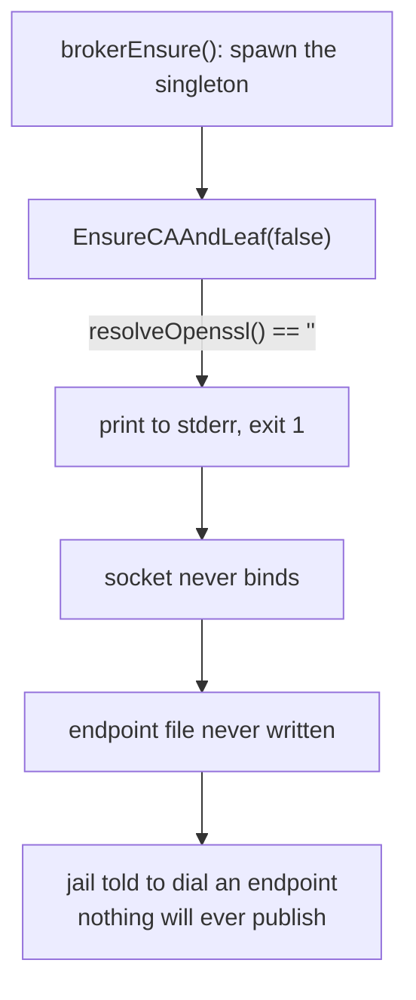

# A daemon that never started, and the three layers that did not notice

**Status:** DECIDED, 2026-09-18 — **all three questions ruled**, and three pieces of work owed:
the `[SKIP]` level ([OQ-3](#7-open-questions)), the `crypto/x509` port ([OQ-1](#7-open-questions)), and
watching a nested launch mint a CA ([OQ-2](#7-open-questions)'s verification). Originally a diagnosis, 2026-08-18; **re-stamped 2026-08-23** — two of the four sequenced items in [§8](#8-sequencing)
have since shipped, and the third ([OQ-3](#7-open-questions)) is the one still live. The three questions in [§7](#7-open-questions) remain
open.

> [!NOTE]
> **Postscript, 2026-08-23 — what shipped since this was written.** [§1](#1-what-broke)–[§5](#5-the-fix) are kept in their original
> tense and describe the system as it stood on 2026-08-18; this note says what has moved. Verified
> against the tree on 2026-08-23:
>
> - **[§5](#5-the-fix)'s ruling is built.** `imagePkgs.openssl` is in `corePackagesFromNixpkgs`
>   (`flake.nix:896`, commit `431625bc`, 2026-08-18), carrying a comment that names this document's
>   diagnosis. So [§1](#1-what-broke)'s *"the jail image does not bake `openssl`"* is **no longer true of the current
>   image** — it is the description of the defect, not of today.
> - **[§3.1](#31-a-return-value-thrown-away) is fixed.** The discarded return value is now consumed:
>   `if !brokerWaitForSocket(...) { reportFailedSpawn(deps, exited) }`
>   (`internal/broker/brokerlifecycle.go`), and `reportFailedSpawn`
>   (`brokerlifecycle.go`) cites this doc's [§3.1](#31-a-return-value-thrown-away) by name. Landed as `05c286d3`, refined by
>   `389f82b2`. That is [§8](#8-sequencing) item 2.
> - **[§3.2](#32-a-log-with-no-reader) is unchanged.** Nothing in the tree reads a host-service log.
> - **[§3.3](#33-yolo-check-skips-the-area--and-calls-it-pass) is unchanged, and is the live one.** `r.ok("Inside jail — loophole checks skipped
>   (managed by host)")` still stands at `internal/cli/check/sections_loopholes.go:23`, and `r.ok`
>   still renders `[PASS]` (`internal/cli/check/reporter.go:67`). That is **[OQ-3](#7-open-questions)**, [§8](#8-sequencing) item 3.
> - Not verified either way: whether a nested jail now actually mints a CA and publishes an endpoint
>   with `openssl` present. [§5.1](#51-what-it-costs) flags that path as never-executed and asks for it to be exercised
>   deliberately; this audit did not launch anything.

**The short version.** `internal/oauthbroker` mints its CA by shelling out to `openssl`. The jail
image does not bake `openssl`. So on any launch where *the host is itself a jail* — every nested
launch, which is the loop `AGENTS.md` makes mandatory for verifying Go changes — the broker singleton
exits at startup, the socket never appears, and no endpoint file is written. **Measured in this
jail: 2,549 failures, 1.3 MB of log.** It has been happening for months and cost nothing observable,
until the reachability witness became fatal on 2026-08-18 and turned an endpoint nobody could publish
into a refused launch.

> [!IMPORTANT]
> **The interesting part is not the missing package.** It is that three independent mechanisms each
> had the information and each declined to report it — a discarded return value, a log nobody reads,
> and a `yolo check` that stamps **PASS** on the very area it skipped. [§3](#3-how-three-layers-each-declined-to-report-it) is the part worth your
> time.

**Reads with:** [`loopback-tls-reachability.md`](../reference/loopback-tls-reachability.md) ([§7.3](../reference/loopback-tls-reachability.md#which-fault-classes-escalate) — the fatal
witness that finally surfaced this, and the containment patch), and
[`loophole-transport.md`](../reference/loophole-transport.md) [§7.4](../reference/loophole-transport.md#oq-t9) (the transport whose own cert code took the
opposite approach and said so).

---

## 1. What broke

The broker is a host-wide singleton fronting Claude's OAuth refresh. Before it can bind, it needs a
CA and a leaf certificate, and it makes them like this
([`cert.go#L79`](../../internal/oauthbroker/cert.go#L79) — cited as `#L69` when this was written;
the guard is unchanged, the line moved, verified 2026-08-23):

```go
if resolveOpenssl() == "" {
    return fmt.Errorf("yolo-claude-oauth-broker-host: cannot locate openssl " +
        "(install it, or symlink it into a fallback location)")
}
```

`resolveOpenssl` tries `exec.LookPath` and then a short list of fallback paths. In the jail image all
of them missed, because `openssl` was not in `corePackagesFromNixpkgs`
([`flake.nix#L848`](../../flake.nix#L848) — the list, cited as `#L737` when this was written) and
nothing else pulled a `bin/openssl` onto `PATH`. **It is in that list now**
([`flake.nix#L896`](../../flake.nix#L896)); see the postscript at the top.

The failure is immediate and total:



Verified in this jail, 2026-08-18:

```console
$ command -v openssl
(nothing)

$ rg -c 'cannot locate openssl' ~/.local/share/yolo-jail/logs/host-service-claude-oauth-broker.log
2549
```

> [!NOTE]
> **This is not a regression in the broker.** The dependency is original, and the code says so:
> `EnsureCAAndLeaf`'s own comment reads *"A crypto/x509 migration is a LATER flagged change,
> deliberately deferred."* What changed is not the broker — it is that a host became a jail ([§4](#4-what-made-it-visible)) and
> then that an unpublishable endpoint became fatal ([§5](#5-the-fix)).

### 1.1 The repo already knew this was the wrong shape

`internal/svcendpoint` mints its certs in Go, with `crypto/x509`, and its cert file opens with a
warning pointed straight at this code
([`svcendpoint/cert.go#L40`](../../internal/svcendpoint/cert.go#L40)):

> *"Do NOT reuse `internal/oauthbroker/cert.go` here. It shells out to openssl and writes
> ca.key/server.key to disk, which is structurally incompatible with the above — and the broker CA
> must not be the trust anchor in any case."*

So the judgement had already been made, written down, and acted on **at the copy site**. Nobody went
back to the original. That is the most transferable lesson here: *a warning placed where someone
might copy a mistake does not fix the mistake.*

---

## 2. Why nested jails, specifically

The bug is conditional on one fact: **the broker singleton is host-wide, and for a nested launch "the
host" is the outer jail.**

| Launch shape | What plays "the host" | `openssl` there? | Broker singleton |
| :--- | :--- | :--- | :--- |
| A jail launched from a real machine | the machine | ✅ yes | starts, publishes, works |
| A jail launched **from inside a jail** | the outer jail | ❌ no — image bakes none | dies at startup, every time |

That is the whole of it. On a developer's actual host the broker has always worked, which is why the
endpoint file exists and the OAuth path is healthy in a normal jail. The nested case inverts one
assumption — *the host has a general-purpose userland* — and the image deliberately does not.

**Why that configuration is rare enough to hide, but important enough to matter.** Nested launches are
not a user-facing feature; they are how this repo verifies its own changes. `AGENTS.md` makes a nested
jail **mandatory** for `cmd/` and `internal/` work. So the one configuration in which the broker never
worked is the one only yolo's own developers ever run — and they run it as `yolo -- bash`, where
nobody asks Claude to authenticate. **The failure had no consumer.**

---

## 3. How three layers each declined to report it

This is the part with lessons in it. Each mechanism below is individually defensible, and together
they produced silence.

### 3.1 A return value thrown away

`brokerWaitForSocket` is built to detect exactly this — its own doc comment says *"a dead child
(`exited()` true) is a genuine failure detected in milliseconds"* — and it returns a `bool` saying
whether the socket ever appeared.

The caller discarded it (at `brokerlifecycle.go#L304` when this was written):

```go
brokerWaitForSocket(deps, deps.SocketPath, BrokerSpawnTimeout, exited)
return deps.SocketPath
```

The detector worked perfectly, in milliseconds, 2,549 times. Nothing asked it for the answer.

> [!NOTE]
> **Fixed since. Verified 2026-08-23** at
> [`brokerlifecycle.go#L387`](../../internal/broker/brokerlifecycle.go#L387): the call is now
> `if !brokerWaitForSocket(...) { reportFailedSpawn(deps, exited) }`, and `reportFailedSpawn`
> ([`#L393`](../../internal/broker/brokerlifecycle.go#L393)) opens *"writes the line
> `brokerWaitForSocket`'s return value exists FOR"* and cites this section. This is the change [§8](#8-sequencing)
> calls *"the change that would have caught the original bug on day one."*

### 3.2 A log with no reader

The daemon's stderr goes to `GLOBAL_STORAGE/logs/host-service-claude-oauth-broker.log`. Grepping the
tree for anything that *reads* a host-service log returns nothing — no health check, no startup
summary, no `yolo doctor` rollup. The file grew to **1.3 MB of the same line** and functioned purely
as an archive of an unasked question.

### 3.3 `yolo check` skips the area — and calls it PASS

Run inside a jail, the loopholes section prints:

```console
$ yolo check
Loopholes
  [PASS] Inside jail — loophole checks skipped (managed by host)
```

The guard is *right* for the normal case: a jail's loopholes are the host's business, and probing
them from inside would report on the wrong side of the boundary. It is wrong for the case where **the
jail IS the host** — which is precisely when a broker singleton is being spawned in-jail and failing.

The reporting level is the sharper error. `[PASS]` is a claim. The honest token for "I did not look"
is not the same token as "I looked and it was fine" — and `yolo check` has already been corrected
twice this month for exactly this shape (host-side probes labelled as if they answered an in-jail
question; a section header standing over an empty block). **This is the third instance of one bug:
reporting on the wrong side of a boundary, in the confident direction.**

> [!WARNING]
> Note what the broker section *would* have said had it run: `warn`, not `fail` —
> *"loophole claude-oauth-broker: daemon not running"*
> ([`sections_loopholes.go#L258`](../../internal/cli/check/sections_loopholes.go#L258) — cited as
> `#L138` when this was written; still a `r.warn`, verified 2026-08-23). So even without the in-jail
> skip, the strongest signal available was a warning nobody was reading.

---

## 4. What made it visible

Nothing about the broker changed. The **reachability witness became fatal** on 2026-08-18, and two of
its rulings composed with a third fact:

1. a nested jail's disposition is `shared`, which **may escalate** ([OQ-R5](../reference/loopback-tls-reachability.md#why-its-this-way));
2. an endpoint nobody published is `faultUnpublished`, which **now also escalates** ([OQ-R4](../reference/loopback-tls-reachability.md#why-its-this-way));
3. the broker's endpoint variable is wired on the loophole being *active*, with **no publish gate** —
   deliberate, and accepted in [`loopback-tls-reachability.md`](../reference/loopback-tls-reachability.md) [§7.3](../reference/loopback-tls-reachability.md#which-fault-classes-escalate).

Measured, with a freshly built launcher from inside this jail:

```console
$ ./dist-go/linux-amd64/yolo -- bash
Error: this jail SHARES the network namespace ...
Refusing to start ... host services unusable from inside the jail: claude-oauth-broker
```

A months-old silent defect became a hard refusal **of the one launch shape required to verify a fix
for it**. That is the failure mode [OQ-R2](../reference/loopback-tls-reachability.md#why-its-this-way)'s own implementation note is about: a fatal that refuses the
loop you would use to repair it.

**Contained the same day** by `brokerEndpointIsUnpublishable`
([`assemble_parts.go#L465`](../../internal/cli/run/assemble_parts.go#L465)): a launcher that is itself
in a jail, with no singleton socket after `brokerEnsure` already tried, stops *promising* an endpoint
it cannot deliver. The severity was not narrowed and the host case is untouched. That patch stops the
refusal; it does not make the broker work.

---

## 5. The fix

**Ruled: bake `openssl` into the image.** One entry in `corePackagesFromNixpkgs`. It is the smallest
change that makes the nested case behave like every other host, and it needs no new concept.
**Shipped 2026-08-18** as `431625bc`; the entry sits at `flake.nix:896` with a comment explaining
why a closure audit will read it as unused. Verified 2026-08-23.

Two things to decide alongside it, in [§7](#7-open-questions).

### 5.1 What it costs

- **Image size**, marginally — `openssl` is small next to `nodejs`, `go` and `neovim`, all already
  baked.
- **A nested jail will now actually mint a CA**, in its own state directory, and run a real broker
  singleton. That is new behaviour, not merely a restored one: this path has *never* executed. It
  should be exercised deliberately rather than discovered.

### 5.2 Alternatives

| Option | Verdict |
| :--- | :--- |
| **Bake `openssl`** | ✅ **Taken.** Smallest change, no new concept, makes the nested host behave like any other |
| **Port `EnsureCAAndLeaf` to `crypto/x509`** | ⏸️ Deferred, and the *right* end state — `svcendpoint` already does this and [§1.1](#11-the-repo-already-knew-this-was-the-wrong-shape) says why. Retires the dependency rather than satisfying it. Bigger change touching on-disk key material; see [OQ-1](#7-open-questions) |
| **Never spawn a broker when the host is a jail** | ❌ Rejected as the primary fix — it is the containment patch ([§4](#4-what-made-it-visible)), and it makes "no Claude auth in a nested jail" permanent by design rather than incidentally |
| **Symlink the host's `openssl` into the jail** | ❌ Rejected. A host-binary bind-mount into every jail for one certificate is a loophole-shaped answer to a packaging problem, and it would fail the same way one boundary further out |

---

## 6. What this does not license

- **Not** a redesign of the broker, its singleton model, or its transport. This is a packaging bug
  plus three observability bugs.
- **Not** a change to the severity rulings in
  [`loopback-tls-reachability.md`](../reference/loopback-tls-reachability.md). The witness behaved correctly: an
  enabled service the jail could not use was exactly what it reported.
- **Not** a general "audit every discarded return value" project. [§3.1](#31-a-return-value-thrown-away) is one call site with a known
  consequence; a tree-wide sweep is a different proposal with a different cost.
- **Not** licence to make `yolo check` probe host loopholes from inside a jail. [§3.3](#33-yolo-check-skips-the-area--and-calls-it-pass) is about the
  *reporting level* of a skip, not about removing it.

---

## 7. Open Questions

1. ✅ **OQ-1: Do we retire the `openssl` dependency, or just satisfy it?** — RULED 2026-09-18

   **The bake has since landed** (2026-08-18, `flake.nix:896`), so this question is now purely about
   the *port* — and it is live in the direction its own leaning feared: the dependency is satisfied,
   the incentive to retire it is gone, and the deferral is back to being a comment.

   Baking the package unblocks the nested case today. But `svcendpoint` mints certs with
   `crypto/x509` and its comment ([§1.1](#11-the-repo-already-knew-this-was-the-wrong-shape)) argues the shell-out is structurally wrong — it writes
   `ca.key`/`server.key` to disk, which is what issue #33 was about. `EnsureCAAndLeaf` already carries
   *"a crypto/x509 migration is a LATER flagged change, deliberately deferred."*

   **What it decides:** whether the jail image grows a package permanently, and whether the broker
   keeps writing long-lived private keys to disk.

   _Leaning:_ **bake now, port later, and write the port down as owed.** They are not exclusive and
   the bake is not wasted — `openssl` on `PATH` is generally useful in a jail. But "deferred" has
   already survived one incident, and deferral with no record is how this happened. — **Ruled
   further: do both NOW.**

   **Answer (2026-09-18).**
   > **Bake and port, both now.** The bake has landed; the `crypto/x509` port is work, not a
   > record of owed work. The leaning's own argument is what settles it: *"deferred has already
   > survived one incident, and deferral with no record is how this happened"* — and a written
   > record of a deferral is still a deferral. Porting now also retires the second half of the
   > original defect rather than only its symptom: `EnsureCAAndLeaf` stops writing long-lived
   > `ca.key`/`server.key` to disk, which is what issue #33 was about and what
   > [§1.1](#11-the-repo-already-knew-this-was-the-wrong-shape) says the shell-out gets
   > structurally wrong. The bake stays regardless — `openssl` on `PATH` is useful in a jail —
   > so nothing is reverted; the dependency simply stops being load-bearing.


2. ✅ **OQ-2: Should a nested jail run its own broker singleton at all?** — RULED 2026-09-18

   With `openssl` baked it will — **and as of 2026-08-18 it is baked**, so this is no longer a
   hypothetical: the next nested launch takes this path whether or not the question is answered. Each
   jail-acting-as-host mints its own CA and serves its own children. The alternative is to treat OAuth
   brokering as something only a real host does, and have nested jails inherit or forgo it.

   **What it decides:** whether `claude` is expected to work inside a nested jail, which is currently
   untested in either direction. The urgency changed with the bake: an unanswered question here now
   means a never-executed code path runs unattended rather than staying dormant.

   _Leaning:_ **let it run.** "A jail is a host for its children" is the model everywhere else
   (packs, loopholes, storage), and a special case here would need carrying forever. But this has
   never executed, so it should be exercised on purpose before it is relied on.

   **Answer (2026-09-18).**
   > **Let it run, and the reason generalises past this question.** A nested jail must be able to
   > test everything, so it runs its own broker singleton like any other host. Being inside
   > another yolo jail is not a reason to behave differently:
   >
   > **Nesting earns affordances, not exemptions — and the affordances stay minimal.** Where
   > nesting genuinely forces a difference the repo already names it and keeps it small
   > (`--userns=host` and `--net=host` because doubly-nested user namespaces fail mounting
   > `/proc` and netavark cannot create a netns without `NET_ADMIN`). Everything else stays
   > generic, because a special case here is one carried forever and a nested jail that behaves
   > differently cannot test the thing it is nested inside.
   >
   > The exercise the leaning asked for stands as owed work rather than as a condition: the path
   > runs today whether or not anyone has watched it, so watching it is a verification, not a
   > gate.


3. ✅ **OQ-3: What is the honest token for "I did not look"?** — RULED 2026-09-18

   [§3.3](#33-yolo-check-skips-the-area--and-calls-it-pass) is the third `yolo check` finding of the same shape this month. `[PASS]` on a skipped section
   is a claim the checker cannot support, and the jail-as-host case is exactly where it misleads.

   **Verified 2026-08-23.** The claim holds and the mechanism is one line: the loopholes section
   returns early with `r.ok("Inside jail — loophole checks skipped (managed by host)")`
   ([`sections_loopholes.go#L23`](../../internal/cli/check/sections_loopholes.go#L23)), and `r.ok`
   is defined as *"increments the pass count and prints ` [PASS] msg`"*
   ([`reporter.go#L64-L67`](../../internal/cli/check/reporter.go#L64)). So a skip does not merely
   *look* like a pass — it is counted as one in the run's tally. The reporter has exactly three
   graded tokens today (`[PASS]`/`[FAIL]`/`[WARN]`, `reporter.go:67`, `:73`, `:80`); there is no
   `[SKIP]`.

   **This is one vocabulary question, not three wording questions.** Two sibling instances live in
   the same package and are the same missing token wearing different clothes — the roadmap's 💬 8 row
   carries both as separate "small ones", and they should be decided here, together:

   | Instance | Where | What it prints | Why it is the same question |
   | :--- | :--- | :--- | :--- |
   | Loopholes skipped in-jail | `sections_loopholes.go:23` | `[PASS] Inside jail — loophole checks skipped` | A skip claimed as a pass. [§3.3](#33-yolo-check-skips-the-area--and-calls-it-pass) — this is the one that hid the broker |
   | `sectionRunningJails` | [`check.go:622`](../../internal/cli/check/check.go#L622) | `[PASS] No jails currently running` | Reports the **nested podman's** view while reading as a statement about the host. Not a skip but the same failure: a confident token over a boundary the checker did not cross |
   | `sectionGPUNvidia` | [`sections_devices.go:38`](../../internal/cli/check/sections_devices.go#L38) | three `[FAIL]`s (`nvidia-smi not found`, `nvidia-ctk not found`, …) | Host facts graded as failures of the thing being checked. Confident in the *other* direction, from the same absent vocabulary |

   The count in the original leaning was low. Measured 2026-08-23, **recounted 2026-09-02 and
   unchanged**: **ten** call sites across nine sections already say "I did not look" through
   `r.ok` — `sections_loopholes.go:23` and `:364`, `sections_devices.go:128`, `:137` and `:218`,
   `check.go:481`, `:529` and `:673` (these three drifted lines since 08-23; same sites),
   `sections_macos.go:49`, `sections_misc.go:19`. `reporter.go` has had zero commits in that
   window — nothing about the vocabulary moved.

   **What it decides:** whether this is a one-line wording fix or a `[SKIP]` level added to the
   reporter (with its own counter, excluded from the pass tally) and applied to every section that
   steps aside — plus, because the two siblings above are the same question, whether the reporter
   also needs a way to say *"this is a fact about the host, not about you."*

   _Leaning:_ **add the level.** With ten sites stepping aside for the same reason, the wording fix
   is ten wording fixes and an eleventh waiting to be written.

   **Answer (2026-09-18) — and the question it was asked in return is the useful one: what is the
   impact on the person reading `yolo check`?**
   > **Three things, and none of them is about the token's spelling.**
   >
   > 1. **`yolo check` currently overstates itself, by ten.** Ten call sites across nine sections
   >    say *"I did not look"* through `r.ok`, which "increments the pass count and prints
   >    `[PASS]`". So an all-green run inside a jail includes ten areas nobody checked, and the
   >    tally counts them as evidence.
   > 2. **It is one of the three layers that hid the original incident** — a daemon that died 2,549
   >    times in one jail, invisible for months ([§3.3](#33-yolo-check-skips-the-area--and-calls-it-pass)).
   >    That is the whole reason this doc exists.
   > 3. **Two siblings mislead in the other direction**, which is what a reader actually notices:
   >    `sectionRunningJails` reports the NESTED podman's view as a statement about the host, and
   >    `sectionGPUNvidia` grades host facts as three `[FAIL]`s — so a jail tells you your GPU
   >    setup is broken when it is merely not visible from in there.
   >
   > **So the ruling is the principle, not the vocabulary: a check that did not look must not be
   > counted as a pass.** The spelling follows from it and is delegated — `[SKIP]` with its own
   > counter, excluded from the pass tally, applied to all ten sites, plus a way to say *"this is
   > a fact about the host, not about you"* for the two siblings. Reopen this if the principle is
   > wrong; the token is an implementation detail and should not cost another round.


---

## 8. Sequencing

What I would build, in order (status verified 2026-08-23):

1. ✅ **Bake `openssl`** and confirm a nested launch mints a CA and publishes an endpoint. This is the
   ruling and it is one line plus a verification. — **Baked** (`flake.nix:896`, `431625bc`). The
   *verification* half is still owed: nobody has watched a nested launch mint a CA ([§5.1](#51-what-it-costs)).
2. ✅ **Consume the detector's answer** ([§3.1](#31-a-return-value-thrown-away)) — `brokerWaitForSocket` already knows; make the caller
   report a dead singleton at spawn time rather than leaving it to be inferred three layers later.
   This is the change that would have caught the original bug on day one. — **Shipped**
   (`brokerlifecycle.go:387`, `05c286d3` + `389f82b2`).
3. 📦 **Fix the reporting level** per [OQ-3](#7-open-questions), so a skipped section stops claiming PASS. — **RULED
   2026-09-18 and now buildable**: a `[SKIP]` level with its own counter, excluded from the pass
   tally, applied to all ten sites, plus a way to say "this is a fact about the host, not about
   you" for the two siblings. `sections_loopholes.go:23` is unchanged.
4. 📦 **Port `svcendpoint` to `crypto/x509`** — [OQ-1](#7-open-questions) ruled 2026-09-18 that this is WORK, not a
   record of owed work, precisely because the bake landing first is the situation its own leaning
   warned about: the dependency is satisfied, the pressure to retire it is gone, and a written
   record of a deferral is still a deferral. It also retires the half of the original defect that
   the bake did not touch — `EnsureCAAndLeaf` writing long-lived `ca.key`/`server.key` to disk.

Not sequenced here: anything about the reachability witness. It did its job.
