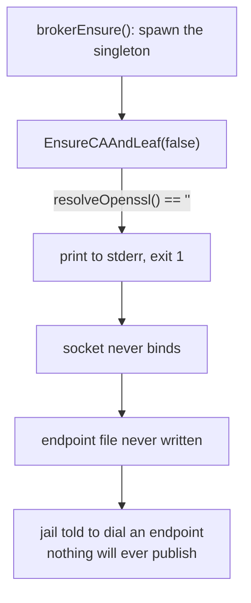

# A daemon that never started, and the three layers that did not notice

**Status:** BUILT, 2026-09-20 — MEASURED: a nested launch minted its own P-256 CA, mounted the
trio, and published `/run/yolo-services/claude-oauth-broker.endpoint`, with `openssl verify
-verify_hostname platform.claude.com` returning OK against the real mounted files (2026-09-18).
All three questions are ruled and compacted into the [Decision Ledger](#7-decision-ledger), and
every piece of work they owed has landed: the `[SKIP]` level (`07af9439`), the `crypto/x509` port
(`d5bb1e5d`), and that verification. The measurement is recorded at
`brokerEndpointIsUnpublishable`'s doc comment in
[`assemble_parts.go`](../../internal/cli/run/assemble_parts.go) rather than here, because it is
what spent that gate's original justification. **Nothing is owed here.**

> [!NOTE]
> **The body below is the 2026-08-18 diagnosis in its original tense, and every defect it describes
> is fixed.** [§1](#1-what-broke)–[§5](#5-the-fix) say what the system was, not what it is; the
> rulings folded into them are dated where they sit. Verified against the tree 2026-09-20:
>
> - **The image bakes `openssl`** (`431625bc`), so [§1](#1-what-broke)'s *"the jail image does not
>   bake `openssl`"* describes the defect rather than today. The bake outlives the port, for two
>   consumers that were never this document's subject — [§8](#8-sequencing) item 4.
> - **[§3.1](#31-a-return-value-thrown-away) is fixed.** The discarded return value is consumed —
>   `if !brokerWaitForSocket(...) { reportFailedSpawn(deps, exited) }` — and `reportFailedSpawn`
>   ([`brokerlifecycle.go`](../../internal/broker/brokerlifecycle.go)) cites this section by name.
>   Landed as `05c286d3`, refined by `389f82b2`.
> - **[§3.2](#32-a-log-with-no-reader) is unchanged.** Nothing in the tree reads a host-service log,
>   and nothing in this document proposed that it should.
> - **[§3.3](#33-yolo-check-skips-the-area--and-calls-it-pass) is fixed** (`07af9439`). The reporter
>   has a `[SKIP]` level counted apart from the three grades, plus `hostFact` for the opposite
>   direction, and the in-jail loopholes guard is an `r.skip` with a note saying where to look
>   instead.

**The short version.** `internal/oauthbroker` mints its CA by shelling out to `openssl`. The jail
image does not bake `openssl`. So on any launch where *the host is itself a jail* — every nested
launch, which is the loop `AGENTS.md` makes mandatory for verifying Go changes — the broker singleton
exits at startup, the socket never appears, and no endpoint file is written. **Measured in this
jail: 2,549 failures, 1.3 MB of log.** It has been happening for months and cost nothing observable,
until the reachability witness became fatal on 2026-08-18 and turned an endpoint nobody could publish
into a refused launch.

> [!IMPORTANT]
> **The interesting part is not the missing package.** It is that three independent mechanisms each
> had the information and each declined to report it — a discarded return value, a log nobody reads,
> and a `yolo check` that stamps **PASS** on the very area it skipped. [§3](#3-how-three-layers-each-declined-to-report-it) is the part worth your
> time.

**Reads with:** [`loopback-tls-reachability.md`](../reference/loopback-tls-reachability.md) ([§7.3](../reference/loopback-tls-reachability.md#which-fault-classes-escalate) — the fatal
witness that finally surfaced this, and the containment patch), and
[`loophole-transport.md`](../reference/loophole-transport.md) [§7.4](../reference/loophole-transport.md#oq-t9) (the transport whose own cert code took the
opposite approach and said so).

---

## 1. What broke

The broker is a host-wide singleton fronting Claude's OAuth refresh. Before it can bind, it needs a
CA and a leaf certificate, and on 2026-08-18 `EnsureCAAndLeaf`
([`internal/oauthbroker/cert.go`](../../internal/oauthbroker/cert.go)) made them like this — the
guard is gone with the `crypto/x509` port, so this block is the defect and not the file:

```go
if resolveOpenssl() == "" {
    return fmt.Errorf("yolo-claude-oauth-broker-host: cannot locate openssl " +
        "(install it, or symlink it into a fallback location)")
}
```

`resolveOpenssl` tried `exec.LookPath` and then a short list of fallback paths. In the jail image
all of them missed, because `openssl` was not on the image's core package floor — `coreFloorNames`
in [`flake.nix`](../../flake.nix), then spelled `corePackagesFromNixpkgs` — and nothing else pulled
a `bin/openssl` onto `PATH`. **It is on that floor now**, with a comment at the entry saying why a
closure audit will read it as unused; see the note at the top.

The failure is immediate and total:



Verified in this jail, 2026-08-18:

```console
$ command -v openssl
(nothing)

$ rg -c 'cannot locate openssl' ~/.local/share/yolo-jail/logs/host-service-claude-oauth-broker.log
2549
```

> [!NOTE]
> **This is not a regression in the broker.** The dependency is original, and the code says so:
> `EnsureCAAndLeaf`'s own comment reads *"A crypto/x509 migration is a LATER flagged change,
> deliberately deferred."* What changed is not the broker — it is that a host became a jail ([§4](#4-what-made-it-visible)) and
> then that an unpublishable endpoint became fatal ([§5](#5-the-fix)).

### 1.1 The repo already knew this was the wrong shape

`internal/svcendpoint` mints its certs in Go, with `crypto/x509`, and its cert file opened with a
warning pointed straight at this code
([`svcendpoint/cert.go`](../../internal/svcendpoint/cert.go), as it read on 2026-08-18):

> *"Do NOT reuse `internal/oauthbroker/cert.go` here. It shells out to openssl and writes
> ca.key/server.key to disk, which is structurally incompatible with the above — and the broker CA
> must not be the trust anchor in any case."*

So the judgement had already been made, written down, and acted on **at the copy site**. Nobody went
back to the original. That is the most transferable lesson here: *a warning placed where someone
might copy a mistake does not fix the mistake.* (That comment now records the openssl half of its
own objection as spent by the port, and keeps the half that was always the stronger one — the
long-lived leaf key, and a broker CA that must not be this transport's trust anchor.)

---

## 2. Why nested jails, specifically

The bug is conditional on one fact: **the broker singleton is host-wide, and for a nested launch "the
host" is the outer jail.**

| Launch shape | What plays "the host" | `openssl` there? | Broker singleton |
| :--- | :--- | :--- | :--- |
| A jail launched from a real machine | the machine | ✅ yes | starts, publishes, works |
| A jail launched **from inside a jail** | the outer jail | ❌ no — image bakes none | dies at startup, every time |

That is the whole of it. On a developer's actual host the broker has always worked, which is why the
endpoint file exists and the OAuth path is healthy in a normal jail. The nested case inverts one
assumption — *the host has a general-purpose userland* — and the image deliberately does not.

**Why that configuration is rare enough to hide, but important enough to matter.** Nested launches are
not a user-facing feature; they are how this repo verifies its own changes. `AGENTS.md` makes a nested
jail **mandatory** for `cmd/` and `internal/` work. So the one configuration in which the broker never
worked is the one only yolo's own developers ever run — and they run it as `yolo -- bash`, where
nobody asks Claude to authenticate. **The failure had no consumer.**

**Ruled 2026-09-18, and it generalises past this document: nesting earns affordances, not
exemptions.** A nested jail runs its own broker singleton like any other host, because a jail that
behaves differently cannot test the thing it is nested inside. Where nesting genuinely forces a
difference the repo names it and keeps it small — `--userns=host` because doubly-nested user
namespaces fail mounting `/proc`, `--net=host` because netavark cannot create a netns without
`NET_ADMIN` — and everything else stays generic, because a special case here is one carried
forever.

---

## 3. How three layers each declined to report it

This is the part with lessons in it. Each mechanism below is individually defensible, and together
they produced silence.

### 3.1 A return value thrown away

`brokerWaitForSocket` is built to detect exactly this — its own doc comment says *"a dead child
(`exited()` true) is a genuine failure detected in milliseconds"* — and it returns a `bool` saying
whether the socket ever appeared.

The caller discarded it (at `brokerlifecycle.go#L304` when this was written):

```go
brokerWaitForSocket(deps, deps.SocketPath, BrokerSpawnTimeout, exited)
return deps.SocketPath
```

The detector worked perfectly, in milliseconds, 2,549 times. Nothing asked it for the answer.

> [!NOTE]
> **Fixed since. Verified 2026-08-23** at
> [`brokerlifecycle.go#L387`](../../internal/broker/brokerlifecycle.go#L387): the call is now
> `if !brokerWaitForSocket(...) { reportFailedSpawn(deps, exited) }`, and `reportFailedSpawn`
> ([`#L393`](../../internal/broker/brokerlifecycle.go#L393)) opens *"writes the line
> `brokerWaitForSocket`'s return value exists FOR"* and cites this section. This is the change [§8](#8-sequencing)
> calls *"the change that would have caught the original bug on day one."*

### 3.2 A log with no reader

The daemon's stderr goes to `GLOBAL_STORAGE/logs/host-service-claude-oauth-broker.log`. Grepping the
tree for anything that *reads* a host-service log returns nothing — no health check, no startup
summary, no `yolo doctor` rollup. The file grew to **1.3 MB of the same line** and functioned purely
as an archive of an unasked question.

### 3.3 `yolo check` skips the area — and calls it PASS

Run inside a jail, the loopholes section prints:

```console
$ yolo check
Loopholes
  [PASS] Inside jail — loophole checks skipped (managed by host)
```

The guard is *right* for the normal case: a jail's loopholes are the host's business, and probing
them from inside would report on the wrong side of the boundary. It is wrong for the case where **the
jail IS the host** — which is precisely when a broker singleton is being spawned in-jail and failing.

The reporting level is the sharper error. `[PASS]` is a claim. The honest token for "I did not look"
is not the same token as "I looked and it was fine" — and `yolo check` has already been corrected
twice this month for exactly this shape (host-side probes labelled as if they answered an in-jail
question; a section header standing over an empty block). **This is the third instance of one bug:
reporting on the wrong side of a boundary, in the confident direction.**

**Ruled 2026-09-18, and the ruling is the principle rather than the token: a check that did not look
must not be counted as a pass.** Ten call sites across nine sections were saying *"I did not look"*
through `r.ok`, which increments the pass count — so an all-green run inside a jail included ten
areas nobody checked, and the tally offered them as evidence. The reporter now carries a `[SKIP]`
level with its own counter, excluded from the pass tally, and a `hostFact` for the direction two
siblings misled in: `sectionRunningJails` reported the nested podman's view as a statement about the
host, and `sectionGPUNvidia` graded host facts as `[FAIL]`s, telling an in-jail reader their GPU
setup was broken when it was merely not visible from in there. The spelling was delegated at the
ruling; the principle is what binds.

> [!WARNING]
> Note what the broker section *would* have said had it run: `warn`, not `fail` —
> *"loophole claude-oauth-broker: daemon not running"*
> ([`sections_loopholes.go`](../../internal/cli/check/sections_loopholes.go) — still an `r.warn`,
> verified 2026-09-20). So even without the in-jail skip, the strongest signal available was a
> warning nobody was reading.

---

## 4. What made it visible

Nothing about the broker changed. The **reachability witness became fatal** on 2026-08-18, and two of
its rulings composed with a third fact:

1. a nested jail's disposition is `shared`, which **may escalate** ([OQ-R5](../reference/loopback-tls-reachability.md#why-its-this-way));
2. an endpoint nobody published is `faultUnpublished`, which **now also escalates** ([OQ-R4](../reference/loopback-tls-reachability.md#why-its-this-way));
3. the broker's endpoint variable is wired on the loophole being *active*, with **no publish gate** —
   deliberate, and accepted in [`loopback-tls-reachability.md`](../reference/loopback-tls-reachability.md) [§7.3](../reference/loopback-tls-reachability.md#which-fault-classes-escalate).

Measured, with a freshly built launcher from inside this jail:

```console
$ ./dist-go/linux-amd64/yolo -- bash
Error: this jail SHARES the network namespace ...
Refusing to start ... host services unusable from inside the jail: claude-oauth-broker
```

A months-old silent defect became a hard refusal **of the one launch shape required to verify a fix
for it**. That is the failure mode [OQ-R2](../reference/loopback-tls-reachability.md#why-its-this-way)'s own implementation note is about: a fatal that refuses the
loop you would use to repair it.

**Contained the same day** by `brokerEndpointIsUnpublishable`
([`assemble_parts.go`](../../internal/cli/run/assemble_parts.go)): a launcher that is itself
in a jail, with no singleton socket after `brokerEnsure` already tried, stops *promising* an endpoint
it cannot deliver. The severity was not narrowed and the host case is untouched. That patch stops the
refusal; it does not make the broker work.

---

## 5. The fix

**Ruled: bake `openssl` into the image.** One entry on the image's core package floor
(`coreFloorNames` in [`flake.nix`](../../flake.nix)). It is the smallest change that makes the
nested case behave like every other host, and it needs no new concept. **Shipped 2026-08-18** as
`431625bc`, with a comment at the entry explaining why a closure audit will read it as unused.

The two questions it opened alongside itself are ruled; the [Decision Ledger](#7-decision-ledger) has them.

### 5.1 What it costs

- **Image size**, marginally — `openssl` is small next to `nodejs`, `go` and `neovim`, all already
  baked.
- **A nested jail mints its own CA**, in its own state directory, and runs a real broker singleton.
  That was new behaviour rather than a restored one — the path had *never* executed — so it was
  exercised on purpose rather than discovered. **MEASURED 2026-09-18**, and the record sits at
  `brokerEndpointIsUnpublishable` in
  [`assemble_parts.go`](../../internal/cli/run/assemble_parts.go), where it also spent that gate's
  stated reason for treating a nested launcher as unable to publish.

### 5.2 Alternatives

| Option | Verdict |
| :--- | :--- |
| **Bake `openssl`** | ✅ **Taken.** Smallest change, no new concept, makes the nested host behave like any other |
| **Port `EnsureCAAndLeaf` to `crypto/x509`** | ✅ **Also taken** (`d5bb1e5d`) — the *right* end state, and not exclusive with the bake. `svcendpoint` already minted this way and [§1.1](#11-the-repo-already-knew-this-was-the-wrong-shape) says why; the port retires the dependency rather than satisfying it, and what it moved on disk is [§8](#8-sequencing) item 4 |
| **Never spawn a broker when the host is a jail** | ❌ Rejected as the primary fix — it is the containment patch ([§4](#4-what-made-it-visible)), and it makes "no Claude auth in a nested jail" permanent by design rather than incidentally |
| **Symlink the host's `openssl` into the jail** | ❌ Rejected. A host-binary bind-mount into every jail for one certificate is a loophole-shaped answer to a packaging problem, and it would fail the same way one boundary further out |

---

## 6. What this does not license

- **Not** a redesign of the broker, its singleton model, or its transport. This is a packaging bug
  plus three observability bugs.
- **Not** a change to the severity rulings in
  [`loopback-tls-reachability.md`](../reference/loopback-tls-reachability.md). The witness behaved correctly: an
  enabled service the jail could not use was exactly what it reported.
- **Not** a general "audit every discarded return value" project. [§3.1](#31-a-return-value-thrown-away) is one call site with a known
  consequence; a tree-wide sweep is a different proposal with a different cost.
- **Not** licence to make `yolo check` probe host loopholes from inside a jail. [§3.3](#33-yolo-check-skips-the-area--and-calls-it-pass) is about the
  *reporting level* of a skip, not about removing it.

---

<!-- Two docs link this section by its old literal anchor — docs/plans/README.md (check 2's
     over-reading example) and docs/plans/further-roadmap-ideas.md — and `OQ-2` and `OQ-3` are
     cited by id from source comments in internal/cli/check and internal/cli/run, which no
     markdown tool can see. The ids below keep every one of those resolving.
     ⚠ docs/plans/README.md still LABELS this "§7" as Open Questions and uses this doc as its
     worked example of check 2 over-reading a sequencing marker — that example is spent: the
     questions are ruled and the file now scores zero. Fixing it is that file's job. -->
<a id="7-open-questions"></a>

## 7. Decision Ledger

All three questions are ruled, and each ruling is in the section it governs.

| ID | Ruling | Date | Settled in | Built |
| :--- | :--- | :--- | :--- | :--- |
| <a id="oq-1"></a>[`OQ-1`](#oq-1) | **Bake and port, both now** — the `openssl` bake is not a substitute for retiring the dependency, and a written record of a deferral is still a deferral. The bake stays regardless: it has two callers this document was never about | 2026-09-18 | [§5.2](#52-alternatives) · [§8](#8-sequencing) item 4 | ✅ `d5bb1e5d` |
| <a id="oq-2"></a>[`OQ-2`](#oq-2) | **A nested jail runs its own broker singleton**, like any other host — nesting earns affordances, not exemptions, and a jail that behaves differently cannot test the thing it is nested inside | 2026-09-18 | [§2](#2-why-nested-jails-specifically) | ✅ measured 2026-09-18 ([§5.1](#51-what-it-costs)) |
| <a id="oq-3"></a>[`OQ-3`](#oq-3) | **A check that did not look must not be counted as a pass.** The principle is the ruling; the token is delegated — `[SKIP]` with its own counter, excluded from the pass tally, plus a way to say *"this is a fact about the host, not about you"* | 2026-09-18 | [§3.3](#33-yolo-check-skips-the-area--and-calls-it-pass) | ✅ `07af9439` |

---

## 8. Sequencing

All four items are built. Three of them are one line each now; the fourth is the one a reader still
needs, because it moved key material on disk.

1. ✅ **Bake `openssl`**, and confirm a nested launch mints a CA and publishes an endpoint — baked
   (`431625bc`), confirmed ([§5.1](#51-what-it-costs)).
2. ✅ **Consume the detector's answer** ([§3.1](#31-a-return-value-thrown-away)) — `05c286d3`,
   refined by `389f82b2`. This is the change that would have caught the original bug on day one.
3. ✅ **Fix the reporting level** ([§3.3](#33-yolo-check-skips-the-area--and-calls-it-pass)) —
   `07af9439`: a `[SKIP]` level with its own counter, excluded from the pass tally, applied to
   every site that steps aside, plus `hostFact` for the two siblings that misled the other way.
4. ✅ **Port the broker's cert minting to `crypto/x509`** — `d5bb1e5d`.

   > [!WARNING]
   > **The subject is `EnsureCAAndLeaf` in
   > [`internal/oauthbroker/cert.go`](../../internal/oauthbroker/cert.go), never
   > [`internal/svcendpoint`](../../internal/svcendpoint/cert.go)**, which has always minted with
   > `crypto/x509` — [§1.1](#11-the-repo-already-knew-this-was-the-wrong-shape) holds it up as the
   > model, and the same code cannot also be the thing needing a port. This item said *"port
   > `svcendpoint`"* until 2026-09-18, and four source comments cite it by number, so the
   > correction stays here rather than being fixed silently.

   `resolveOpenssl`, `runOpenssl` and the five-exec `--init-ca` script are deleted, and the CA +
   leaf are minted in-process as **P-256** — the old pair was RSA-4096/RSA-2048, whose keygen in Go
   has a tail long enough to threaten `broker.BrokerSpawnTimeout`, and a slow mint surfaces as
   *"the singleton never bound its socket"*, the exact misreported failure this document is about.
   `ca.srl`, `leaf.cnf` and `server.csr` are gone with the tool that needed them, and are actively
   swept from an upgrading host's state dir.

   **Two halves of the on-disk claim, because they are not the same:**

   | Key | After the port | Why |
   | :--- | :--- | :--- |
   | The **CA** private key | ✅ Never touches disk | Nothing ever read it back. It was written only because `openssl x509 -req -CAkey` needs a path. It is the anchor every jail on the host trusts, so on disk it is a standing authority to impersonate any host to any jail — the half of issue #33 the bake could not fix |
   | The **leaf** private key | ❌ Still on disk, necessarily | `server.key` is bind-mounted into the jail because `yolo-jaild oauth-terminator` — a different process in a different namespace — serves TLS with it. Removing it means the jail minting its own leaf, which is a redesign of the loophole and [§6](#6-what-this-does-not-license) does not license one |

   An **upgrading host re-mints**: a surviving `ca.key` forces regeneration, so the port retires
   the key on the machines that actually have one rather than only on fresh ones. Safe for running
   jails — the three files are bind-mounted by INODE, so a running jail keeps the complete old
   trio while the next launch binds a complete new one.

   **The `openssl` bake stays, and not only because [`OQ-1`](#oq-1) said so:** the binary has two other
   callers that have nothing to do with this document — `internal/macosuser`'s
   `openssl rand -base64 32` for the sandbox identity's password, and the generated `sha256sum`
   shim's fallback in `internal/entrypoint`. What the port removes is the bake's only INVISIBLE
   consumer, which is what made its absence cost months.

Not sequenced here: anything about the reachability witness. It did its job.
