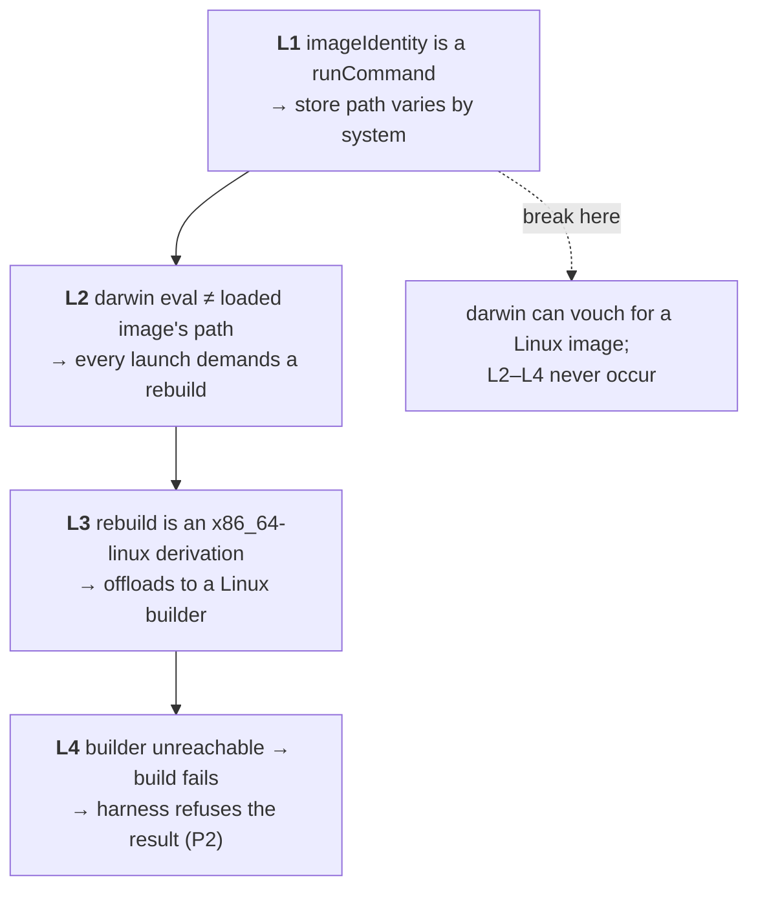

# The macOS nightly has been red for six runs, and neither ruling is wrong

**Status:** ✅ **SHIPPED 2026-09-12.** All three questions are ruled and compacted into the [Decision Ledger](#decision-ledger); resolution **A** is built. Evidence verified against the tree and against runs `34687723913`, `34590383317`, `34467461758`.

> **In short.** This is not an infrastructure flake. It is two correct safety rulings
> colliding over a third fact neither of them knows: the image the job is testing
> **was built from this very commit**, and no darwin host could prove it. Now one can.

**Why it matters.** The nightly is the only automated instrument pointed at macOS, and it has produced no signal since at least 2026-09-09 — six consecutive scheduled runs, one identical cause. Every macOS design in the tree is stamped NOT MEASURED, and this is the machine that was supposed to change that.

**The shape.** A four-link chain — arch-varying identity → forced rebuild → absent Linux builder → harness refusal — where breaking the **first** link dissolves the other three.

**Cost.** The fix changes what `imageIdentity` *is*, and that value is compared by a shipped test and baked into every image. Existing images stop matching once, on the commit that lands it — ruled acceptable ([OQ-IP3](#OQ-IP3)).

**Start at [§3](#3-the-chain-and-the-one-link-worth-breaking)** — the chain. Which link you break is the whole decision.

**Ruled:** [OQ-IP1](#OQ-IP1), [OQ-IP2](#OQ-IP2), [OQ-IP3](#OQ-IP3) — see the [Decision Ledger](#decision-ledger).

**Reads with:** [`image-staging-vs-baking.md`](../reference/image-staging-vs-baking.md) (what the image must bake, and the rebuild cost model), [`macos-user-provisioning.md`](macos-user-provisioning.md) (the designs whose claims this instrument was meant to measure).

---

## 1. Verdict

**Break the first link: make the image's identity content-addressed rather than store-path-addressed.** Then a darwin host can vouch for a Linux-built image by inspection, no launch demands a rebuild it cannot perform, the Linux builder stops being on the critical path, and **no safety ruling is weakened to get there.**

The two rulings that currently collide are both correct and both should survive:

- **P1 — A failed image build must fail as itself.** A run may end up on an image it could not rebuild, but it must never *look* successful while silently stale (`internal/image/buildfailure.go`, which exists because a failed build once presented as a lib-farm assertion two layers from its cause).
- **P2 — A stale image is never a legitimate basis for an integration result.** `YOLO_ALLOW_STALE_IMAGE` is a legitimate choice for a human at a terminal and never for a test, so the harness fails on the report either way (`integration/imagebuildfailure_test.go`, stated in its own header comment).

Every fix that widens a hatch weakens P2. Every fix that suppresses the build weakens P1. The content-addressing fix weakens neither, because it makes the *question* answerable instead of making a wrong answer tolerable.

## Decision Ledger

| ID | Ruling / Decision | Date | Settled in |
| :--- | :--- | :--- | :--- |
| **OQ-IP1** | **A REQUIREMENT.** *"An identity a second host cannot compute is not an identity; it is a local cache key wearing one."* **BUILT 2026-09-12**: `imageIdentity` is a `sha256:` over `flake.nix` + `flake.lock`, computed with `builtins.hashFile` and declared **outside `eachDefaultSystem`**, so neither `system` nor `pkgs` is in scope to leak in. The image carries it as the CONTENTS of `/etc/yolo-jail-image-identity` (read with `cat`, not `readlink`) and as the `org.yolo-jail.image-identity` label; the oracle is `nix eval --raw .#imageIdentity`, still an eval and now ~0.1s because nixpkgs is never touched. **The darwin downgrade in `integration/imageskew_test.go` is deleted**, which was the point. The guard against a relapse is `TestImageIdentityIsSystemInvariant`, which evaluates the identity under all four default systems and requires agreement | 2026-09-12 | [§4](#4-the-three-candidate-resolutions), [`OQ-IP1`](#OQ-IP1) |
| **OQ-IP2** | **FILED SEPARATELY, not coupled.** Only A is on the critical path, and coupling would keep the nightly red until both land. Nothing in this work touches `containerbuilder`, the builder image, or the nightly's `podman machine` setup. ⚠ **A mac that cannot offload a Linux build still cannot BUILD an image** — this change means such a mac no longer needs to, for a job that was handed one | 2026-09-12 | [§4 row B](#4-the-three-candidate-resolutions) |
| **OQ-IP3** | **ACCEPT THE ONE-TIME REBUILD.** No dual-spelling window: the comparison knows exactly one spelling. What was added instead is a DIAGNOSTIC — the in-image probe falls back to `readlink`, so an image built before this commit answers with its old store path and the failure message says *"this image predates the identity becoming content-addressed"* rather than leaving a bare failed probe. That recognises the old shape; it never accepts it, and it expires on its own because nothing can produce that shape again | 2026-09-12 | [`identityHint`](#OQ-IP3) (`integration/imageskew_test.go`) |

## 2. What is actually failing

Measured on run `34687723913` and confirmed identical on the two runs before it:

```
| cannot build on 'ssh-ng://root@127.0.0.1:31022': error: failed to start SSH connection
| Failed to find a machine for remote build!
    IMAGE BUILD FAILED — the jail image was NOT rebuilt from this source tree.
        cgroup_test.go:78: THE JAIL IMAGE BUILD FAILED — this test never ran
        against the image it asked for.
```

The job's own steps tell the story: `✓ Download jail image`, `✓ Load jail image`, then `X Integration tests`. **The image arrives fine and is then rejected.**

> [!NOTE]
> **The workflow already tried to fix this, and its fix is defeated by P2.** `.github/workflows/nightly-macos.yml` sets `YOLO_ALLOW_STALE_IMAGE: "1"` with a comment explaining the reasoning — *"this job asserts its own state: the loaded image IS this commit's."* That reasoning is correct. But `image.BuildFailedMarker` is printed on **both** report branches — refusing and continuing — and the harness matches the marker, not the outcome. So the hatch lets the launch proceed and the harness fails the test anyway.

## 3. The chain, and the one link worth breaking



**L1 is the root and it is a two-line fact.** `imageIdentity` is declared in `flake.nix` as:

```nix
imageIdentity = pkgs.runCommand "yolo-jail-image-identity" { } ''
  mkdir -p $out/etc
  cp ${./flake.nix} $out/flake.nix
  cp ${./flake.lock} $out/flake.lock
  ln -s $out $out/etc/yolo-jail-image-identity
'';
```

> [!NOTE]
> **That is the DEFECT, not the current code.** Since 2026-09-12 `imageIdentity` is a `sha256:`
> string built with `builtins.hashFile`, declared outside `eachDefaultSystem` — see
> [`OQ-IP1`](#OQ-IP1)'s answer. Measured here on Linux the same day, the block above evaluated to
> **three different store paths** for `x86_64-linux`, `aarch64-linux` and `aarch64-darwin` with
> byte-identical content; the replacement evaluates to **one value for all four** default systems.

Its **content** is two copied files and is identical on every system. Its **store path** is a `runCommand` output, so it carries the builder's `system` and differs between `x86_64-linux` and any darwin. The comment above it claims invariance across the full/minimal variants, across `packages:` lib-farm images, and across every Go change — all true, and all about *inputs*. Nobody wrote down that it is **not** invariant across the host doing the evaluating, which is the axis this job lives on.

`integration/imageskew_test.go` already knows, and says so when it downgrades itself on darwin: *"on darwin the image may have been built on a Linux runner, whose imageIdentity legitimately differs from a local eval."* **That downgrade is the existing workaround for L1, applied at one of the two places that needs it.** The launcher's own rebuild decision never got the same treatment.

## 4. The three candidate resolutions

| # | Approach | Fixes the cause? | Weakens a ruling? | Verdict |
| :--- | :--- | :--- | :--- | :--- |
| **A** | Content-address the identity — the oracle becomes a hash of `flake.nix` + `flake.lock`, identical on every system | **Yes — L1** | No | ✅ **BUILT 2026-09-12** |
| **B** | Get the Linux builder running on the macOS runner | No — L3 only | No | Worth doing anyway, but not this |
| **C** | Wire a "CI supplied this image, trust it" signal (the dormant `SkipBuild` seam, or a new env var) | No — L4 only | **Yes, P1 or P2** | Rejected |

**A — content-address the identity.** Replace the store-path comparison with one over the bytes that actually define the image's inputs. A darwin host can then compute the same value a Linux builder did, so the loaded image's identity is *verifiable* rather than merely *asserted*. L2 never fires, so L3 and L4 are unreachable, and both `YOLO_ALLOW_STALE_IMAGE` and the skew check's darwin downgrade can go back to meaning what they say.

**B — fix the builder.** The workflow already runs `podman machine init` + `podman machine start`; the builder container behind `containerbuilder.BuilderHostPort` (31022) is still unreachable from the macOS host. This is a real gap and probably worth closing on its own merits — a mac that cannot offload a Linux build is a mac that cannot build an image at all. But as a fix for *this* it is the wrong link: it makes the job spend 3.3 GB and many minutes rebuilding an image it already downloaded, every shard, every night. **Rejected as the primary fix; kept as its own item.**

**C — a CI-trusts-this-image signal.** Either wire the `SkipBuild` seam (`internal/cli/run/imageload.go` hardcodes it `false` and calls it "a dormant seam") to an env var, or teach the harness to distinguish a continued-stale run from a refused one. The first re-opens exactly the silent-stale-image defect `buildfailure.go` was written to close. The second converts P2 from a rule into a rule-with-an-exception, on the axis where an exception is least safe. **Rejected:** it makes a wrong answer tolerable instead of making the question answerable.

## 5. A separate finding: the nightly does not test `macos-user` at all

Worth stating plainly because it changes what a green nightly would even mean. The job is named `Integration tests (macOS + Podman)` and runs with `YOLO_RUNTIME: podman`. It exercises **the podman backend running on macOS** — the container path — and never the `macos-user` backend.

So the roadmap's *"every runtime claim in both macos-user designs is NOT MEASURED"* is not merely a backlog item awaiting a green nightly. **The instrument that exists points at a different backend.** Fixing this doc's chain gets the container-on-macOS signal back; it gets `macos-user` nothing, and nothing in CI currently would.

## 6. What this does NOT propose

- **Not** removing `YOLO_ALLOW_STALE_IMAGE`. It is correct for the case it was built for — an offline or disk-starved machine with a good cached image — and this design stops that hatch from being mis-recruited into CI, which is the opposite of deleting it.
- **Not** relaxing the harness (P2). The fix's whole point is that the harness never has to see a failed build.
- **Not** building `macos-user` CI coverage. [§5](#5-a-separate-finding-the-nightly-does-not-test-macos-user-at-all) names that gap; sizing it is separate work and it does not block anything here.
- **Not** changing what the image contains. `imageIdentity`'s *inputs* are right; only its addressing is wrong for a cross-system reader.

## 7. Open Questions

1. ✅ <a id="OQ-IP1"></a>**OQ-IP1: Is the identity's cross-system invariance a requirement or an accident?** — **RESOLVED (2026-09-12), BUILT** Resolution A rests on a claim the tree has never stated: that two hosts of different systems evaluating the same `flake.nix` + `flake.lock` *should* agree on the image's identity. Today they provably do not, and one of the two consumers papers over it with a darwin downgrade. Making it a stated invariant is what licenses deleting that downgrade — and it is a promise about every future reader of the oracle, not just this job.

   <!-- vantage: oq id=OQ-IP1 leaning="Yes, a requirement. An identity a second host cannot compute is not an identity; it is a local cache key wearing one." -->

   _Leaning:_ **A requirement.** An identity that only its own builder can compute is not an identity — it is a local cache key wearing one. Stating the invariant also makes the existing darwin downgrade explicable as a workaround with an expiry rather than a permanent carve-out.

   **Answer:**
   > **A requirement.** *"An identity a second host cannot compute is not an identity; it is a local cache key wearing one."*
   >
   > **Built as A.** `imageIdentity` is now `"sha256:" + builtins.hashString "sha256" (…hashFile flake.nix… hashFile flake.lock…)`, declared in the outputs' top-level `let` — **outside `eachDefaultSystem`**, where neither `system` nor `pkgs` is in scope. That is what makes the invariant structural rather than a promise: there is nothing per-host left to reach for.
   >
   > Three consequences the build had to settle. **(1) A store path could not be kept.** Every store path that can hold a directory is a derivation output, and every derivation output carries `system`; a fixed-output derivation escapes that but needs the NAR hash of a directory nix cannot compute before building it, so an FOD here is either a build or a hardcoded lie. The identity had to become the content itself. **(2) The image carries the value, not a path to it.** `mkOciImage`'s `postBuild` writes `/etc/yolo-jail-image-identity` as a plain file beside `/etc/passwd`, so it is image content no `symlinkJoin`, tier change or closure can indirect — the read-back is `cat`, and `imageIdentity` left `corePackages` entirely. **(3) The eval got cheaper, not dearer.** `nix eval --raw .#imageIdentity` touches no nixpkgs at all: 0.096 s measured, against 0.395 s for the store-path oracle it replaces, so the constraint that the skew check must never become a build is met with room.
   >
   > **The darwin downgrade is deleted** (`effectiveSkewMode` and its test are gone) — the ruling's whole point, and the reason for stating the invariance as a requirement rather than noting it as a convenience.

2. ✅ <a id="OQ-IP2"></a>**OQ-IP2: Does the Linux builder on macOS get fixed too, or only filed?** — **RESOLVED (2026-09-12)** Resolution B is not the fix for this failure, but a mac that cannot offload a Linux build cannot build an image at all — which is a real capability gap for any developer on that platform, independent of CI. The question is whether it rides along with this work or becomes its own thread. It decides whether the nightly's recovery depends on one change or two.

   <!-- vantage: oq id=OQ-IP2 leaning="File it separately. Coupling them means the nightly stays red until both land, and only one of them is on the critical path." -->

   _Leaning:_ **File it separately.** Coupling them keeps the nightly red until both land, and only A is on the critical path. B is also the harder one to verify from here — this jail cannot reproduce a macOS runner's podman machine.

   **Answer:**
   > **File it separately.** Coupling them means the nightly stays red until both land, and only one of them is on the critical path. This work touches no builder code, no `containerbuilder`, and nothing in the nightly's `podman machine` setup.
   >
   > It is still a real gap, and this change narrows rather than closes it: a mac that cannot offload a Linux build still cannot **build** an image — it can now **verify** one it was handed, which is all the nightly ever needed.

3. ✅ <a id="OQ-IP3"></a>**OQ-IP3: What happens to the images already out there?** — **RESOLVED (2026-09-12)** Changing the oracle moves every image's recorded identity exactly once, on the commit that lands it. Every currently-loaded image then mismatches and every launch demands one rebuild. That is the correct behavior for a genuine input change and a needless 3.3 GB for a change that alters no image content. The options are to accept the one-time rebuild, or to have the comparison accept either spelling for one release.

   <!-- vantage: oq id=OQ-IP3 leaning="Accept the one-time rebuild. A dual-spelling window is a second code path guarding a cost users pay once." -->

   _Leaning:_ **Accept the one-time rebuild.** A compatibility window is a second code path that exists to save a cost paid once, and this repo's standing preference is to delete the second path rather than maintain it.

   **Answer:**
   > **Accept the one-time rebuild.** A dual-spelling window is a second code path guarding a cost users pay once, and this repo's standing preference is to delete the second path rather than maintain it. The comparison therefore knows exactly one spelling.
   >
   > **What was added instead is a diagnostic, and the distinction is the whole of it.** An image built before this commit has `/etc/yolo-jail-image-identity` as a symlink to a directory, so `cat` fails on it — which would have surfaced as a *failed probe*, and a failed probe is reported as a degraded harness and the check is SKIPPED. That is the wrong answer on the one commit where every image mismatches. So the in-image read falls back to `readlink`, the old store path comes back as a plain string, it is rejected like any other non-identity, and `identityHint` names it: *"That is a STORE PATH, not an identity. This image predates the identity becoming content-addressed (2026-09-12)… EVERY image built before that commit mismatches exactly once, and the rebuild below is the whole fix."*
   >
   > Measured 2026-09-12 against a real pre-cutover image in this jail's podman: the probe returns `/nix/store/8r4ypm7z9qxmxvfhba7nxhkyhxm2qkzn-yolo-jail-image-identity`, which is exactly the shape the hint fires on. It recognises the old spelling and never accepts it, and it expires on its own — nothing can produce that shape again.

## 8. What the roadmap needs

Another agent holds [`roadmap.md`](../plans/roadmap.md) as this is written, so this is the hand-off rather than the edit:

- A **💬 row** for this doc, carrying [OQ-IP1](#OQ-IP1)–[OQ-IP3](#OQ-IP3), noting that the macOS nightly has been red since at least 2026-09-09 on one cause.
- A **separate row** for the Linux-builder-on-macOS gap ([OQ-IP2](#OQ-IP2)), which is not blocked by this doc.
- An amendment wherever the roadmap says macOS claims are unmeasured **pending CI**: per [§5](#5-a-separate-finding-the-nightly-does-not-test-macos-user-at-all), no CI job currently exercises `macos-user` at all, so a green nightly would not move those claims.
