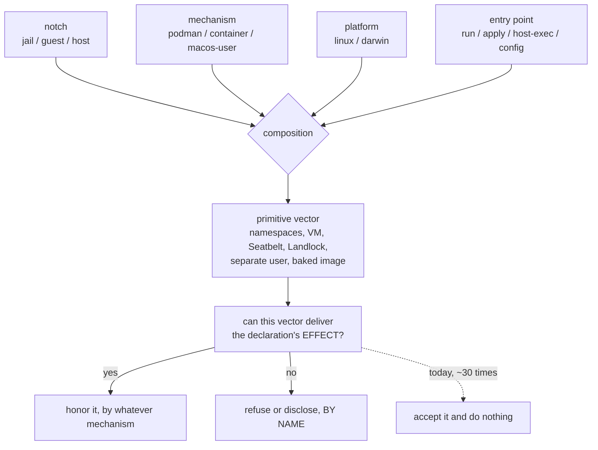

# One declaration, many mechanisms — and the four inputs that decide which one runs

**Status:** DESIGN + CATALOG, amended 2026-09-12 after review. Nothing built.
[OQ-DP1](#decision-ledger) through [OQ-DP4](#decision-ledger) are ruled and compacted, and
[OQ-DP6](#decision-ledger) dissolved rather than being answered; **[OQ-DP5](#open-questions) alone
remains live.** Every code claim below was re-verified against the tree on 2026-09-12 at
`55a77e79`, by symbol; three sweep rows that the tree contradicts are corrected in
[§9](#9-where-the-sweep-was-wrong).

> **In short.** The principle holds, and the tree proves it — but it quantifies over a
> composed **primitive vector**, not over a backend, and that vector is computed from
> four inputs in exactly one function, for display only. Everything else reads one input
> and guesses the rest.

**Why it matters.** A declaration that is accepted, validated and then not honored with
nothing said is a defect however the principle is settled. The sharpest instances do not
merely omit: they make the agent's own briefing assert the opposite of what ran.

**The shape.** One principle ([§1](#1-the-principle-and-what-it-does-not-say)), four inputs
([§2](#2-four-inputs-not-two-axes)), four dispositions
([§3](#3-the-four-dispositions-and-how-to-walk-the-catalog)), and a catalog keyed on
`(declaration × site)` rather than on a backend.

**Cost.** Of the four rulings landed on 2026-09-12: one is free (vocabulary), one is a
threading change, one is roughly ten lines, and one is a delivery mechanism that does not
exist. The two live questions decide the disclosure shape for everything else and one
host-exec call. Nothing here builds the `guest` notch.

**Start at [§5](#5-silently-broken)** — the bucket that is a defect whichever way the
principle is settled.

**Needs your ruling:** [OQ-DP5](#OQ-DP5), [OQ-DP6](#decision-ledger). The other four were ruled on
2026-09-12 and live in the [Decision Ledger](#decision-ledger).

**Reads with:** [`backend-parity.md`](backend-parity.md) (the same idea on ONE input; it owns
the backend census and its own questions, which this doc does not re-open),
[`macos-user-nix-and-features.md`](../reference/macos-user-nix-and-features.md) (the authority
for every macos-user row), [`macos-user-home-tiers.md`](macos-user-home-tiers.md) (its
[§5.4](macos-user-home-tiers.md#54-seatbelt-can-replace-more-mounts-than-this-one) contradicted
`render.refusalReasons`, and [OQ-DP4](#decision-ledger) ruled in its favour),
[`environment-manager-plan.md`](../plans/environment-manager-plan.md) (Phase 7, the only
unbuilt phase), [`host-render-target.md`](host-render-target.md) (`render.FieldSet`, the
per-notch census this generalises).

> [!NOTE]
> **Scope, and the title's word.** The `guest` case and the macos-user case — the two the
> maintainer asked for — are catalogued exhaustively. Apple Container appears only as
> PRECEDENT or CONTRAST, because [`backend-parity.md`](backend-parity.md) owns it; podman and
> the `host` notch appear where they are load-bearing. *"Mechanism"* in the title is the
> maintainer's own word from the principle below, and since [OQ-DP1](#decision-ledger) it is
> this doc's word for the second input too
> ([§2.6](#26-the-two-words-and-why-the-pair-is-not-named)).

---

## 1. The principle, and what it does not say

The maintainer stated it as one sentence:

> the implementations may vary, but the declaration should be the same, and they should
> apply equally across all the containment methods, even if they use different mechanisms.

Four numbered readings, because the rest of this doc cites them.

**P1. One declaration; honored or refused BY NAME, everywhere.** A declaration's *effect* is
delivered by whatever primitives the site can compose. Where nothing can deliver it, the site
refuses or discloses, naming the declaration. The one state that is never legal is accepting a
declaration and doing nothing.

**P2. The implementation is free; the vocabulary is not.** `packages:` means the same thing
on three backends and is delivered three ways — a baked OCI image, a boot-written symlink farm
over the mounted nix store, a native darwin `buildEnv`. That is the principle working, and it
is the strongest existing proof it is achievable ([DP-A1](#4-aligned-and-why-the-catalog-leads-with-it)).

**P3. Silence is the defect the principle exists to name.** The repo has written this down
twice already and given it no mechanism.
[`macos-no-vm-direction.md`](../reference/macos-no-vm-direction.md): *"every feature a container
implements with a flag or a mount must either work natively or say it does not."*
[`macos-user-nix-and-features.md`](../reference/macos-user-nix-and-features.md): *"'Absent and
silent' is the defect; 'absent and loud' is an honest backend."* Both are enforced today by a
sweep and by per-backend `if`s, which is why [§5](#5-silently-broken) is as long as it is.

**P4. "Equally" is bounded by WHO MAY AUTHOR the declaration.** This is the one place the
principle is wrong if taken literally, and the tree is right. `yolo host -- <cmd>` reads the
user-scope config and nothing else, because composing a host process's environment from an
agent-editable workspace `yolo-jail.jsonc` is arbitrary code execution on the user's real
machine, reached by cloning a repository (`config.UserScopeConfigOrEmpty`, `cli.composeHostLaunch`).
Workspace scope there is **inexpressible**, not merely refused. Any rule phrased as *"the same
declaration does the same thing at every notch"* argues for that RCE at least once, so P4 is a
clause of the principle, not an exception to it.

### What the principle does NOT say

- **Not that every site grows every feature.** [`backend-parity.md`](backend-parity.md#7-what-this-does-not-propose)
  already rules this and it stands: *"the goal is that a setting stops lying, not that every
  backend grows every feature."*
- **Not that a divergence is a bug.** Most of
  [§7](#7-ruled-divergent-and-the-ones-i-would-re-open) is ruled terminal with reasoning that
  survives scrutiny, and one
  divergence is *stronger* than what the container backends give
  ([DP-A2](#4-aligned-and-why-the-catalog-leads-with-it)).
- **Not that silence is always wrong.** Where the declared OUTCOME is already true, silence is
  correct — `writable_home_dirs` on a backend whose home is writable in one bind has nothing
  to say ([DP-A11](#4-aligned-and-why-the-catalog-leads-with-it)).
- **Not "add a warning everywhere."** That collides with
  [OQ-BP-3](backend-parity.md#open-questions), which is live and owned elsewhere:
  *"a warning people learn to skip is worse than none."* See [OQ-DP5](#OQ-DP5).

### Defined terms

| Term | Status | What it is, and what it is not |
| :--- | :--- | :--- |
| **notch** | existing | `jail` / `guest` / `host` — the confinement dial. `render.Kind`, `config.Confinement`. NOT a runtime. |
| **mechanism** | existing, promoted | `podman` / `container` (Apple Container) / `macos-user`. Already the parameter name in `cli.confinementProfile`; [OQ-DP1](#decision-ledger) ruled it one of this doc's two words. Elsewhere in the tree it is spelled "backend" or "runtime" and those spellings are not being chased. NOT a container: `macos-user` runs no runtime. |
| **primitive vector** | **existing — never this doc's to promote** | the composed set the inputs yield: `PrimNamespaces`, `PrimVM`, `PrimSeatbelt`, `PrimLandlock`, `PrimSeparateUser`, `PrimBakedImage` — the contents of a `render.Profile`, ordered by `render.PrimitiveOrder`. ⚠ The phrase is already written in three packages (`render/confinement.go`, `cli/describe.go`, `jailcontent/briefing.go`), so an earlier draft of this table marking it "promoted here" was wrong. It names what the composition OUTPUTS, never the pair of inputs, which is exactly why it is not the umbrella [OQ-DP1](#decision-ledger) refused. It is what [P1](#1-the-principle-and-what-it-does-not-say) quantifies over. NOT a config surface — only the three named presets are selectable. |
| **entry point** | **not a term — plain words** | which verb is running: `yolo -- cmd`, `yolo apply`, `yolo host -- cmd`, `yolo config diff`. A real input ([§2](#2-four-inputs-not-two-axes)) that [OQ-DP1](#decision-ledger) ruled stays unnamed; the doc says "which verb is running" and means nothing more by it. |
| **site** | *(coined here — a table key, not an axis)* | one combination of the four inputs: the thing a declaration is honored or not honored AT, and the catalog's row key. It names a CELL, which is why it survives [OQ-DP1](#decision-ledger)'s refusal to name the notch-and-mechanism PAIR; if it ever reads as architecture rather than bookkeeping, delete it and write "one row". NOT a synonym for "backend": `yolo apply` at `guest` and `yolo -- cmd` at `guest` are two sites. |
| **carve-out** | *(this doc's sense)* | a site that accepts a declaration and does not deliver its effect. ⚠ NOT `AGENTS.md`'s sense, where a CARVE-OUT is a structural blindness of an *instrument* ("a nested jail cannot see the rootless class"). Both senses appear in this repo; this doc always means the first. |

---

## 2. Four inputs, not two axes

The brief posed this as two axes — notches and backends — and said a carve-out can sit on
either. That is right as far as it goes and it is not far enough. **The tree already computes
the answer from four inputs, in exactly one function, and uses it for display only.**

```go
// internal/cli/describe.go — sole caller: describeMain
func confinementProfile(notch render.Kind, mechanism string, isMacOS bool) render.Profile {
	switch {
	case notch == render.KindHost:                          return render.HostProfile()
	case slices.Contains(paths.NativeRuntimes, mechanism):  return render.GuestProfileMacOS()
	case notch == render.KindGuest:
		if isMacOS { return render.GuestProfileMacOS() }
		return render.GuestProfileLinux()
	default:                                                return render.JailProfile(mechanism == "container")
	}
}
```

Read the branch order. **The mechanism outranks the notch in two of four arms.** A `macos-user`
launch at `confinement: jail` gets the *guest* vector. An Apple Container jail gets `PrimVM`
where a podman jail gets `PrimNamespaces`. The platform decides only the arm no mechanism
names. Its own doc comment states the rule and names the third input: *"MECHANISM FIRST,
platform only as the fallback, because `runtime` is what a launch will actually use and a
primitive is a property of the backend, not of the machine reading the config."*

| Input | Values | Spelled today as | Authority |
| :--- | :--- | :--- | :--- |
| **Notch** | jail / guest / host | `render.Kind`, `config.Confinement` | `render.ProfileFor`, `render.Target.Fields`, `render.modeCensus` |
| **Mechanism** | podman / container / macos-user | `runtime`, "backend" | `paths.SupportedRuntimes` vs `paths.NativeRuntimes` |
| **Platform** | linux / darwin | `o.IsMacOS`, `paths.IsMacOS` | `hostcas.CodeMacOS`, `run.kvmArgs`, `run.gpuHostAvailable` |
| **Entry point** | `yolo -- cmd` / `yolo apply` / `yolo host -- cmd` / `yolo config diff` | *unnamed, and ruled to stay that way* | none — [§2.4](#24-the-entry-point-is-an-axis-and-it-has-no-name) is the evidence it exists |

### 2.1 The platform is a separate input, and one decider already spells it that way

`internal/hostcas` carries `CodeBackend` ("not podman — Apple Container and macos-user both
land here") and `CodeMacOS` ("never done on macOS: the jail is Linux in a VM") as two distinct
refusal codes with two distinct reason strings, plus `CodePlatform` for a host/jail arch
mismatch. Three codes, three inputs, one decision. Flatten them and `YOLO_RUNTIME=podman` on a
Mac reads as a fix when it is not. `run.kvmArgs` gates on `o.IsMacOS || rt == "container"` — a
disjunction of two inputs, which is why *macOS podman* also drops it.

### 2.2 The notch is enforced by nothing on the launch path

`config.ResolveConfinement` has exactly three production callers: `cli.describeMain`,
`cli.applyMain`, and `run.(*Options).prepare`'s `jailcontent.BriefingInput{Confinement: …}`.
The last is **briefing prose only**. The actual enforcement — `render.FieldSet`,
`render.modeCensus` — is reached only from the host-render path. A `rg` for
`guest|Guest` over `internal/cli/run` with tests excluded returns only pasta's
`--map-guest-addr`.

So a `(notch, mechanism)` matrix would mark `confinement` *Honored* on all three mechanisms and
be wrong about all three.

### 2.3 `NoContainer` is the mechanism input smuggled into a notch-shaped function

`jailcontent.confinementHeader(confinement string, noContainer bool)` takes both inputs and
acts on the second in exactly one of five arms (`known && notch == render.KindJail && noContainer`).
The sweep measured this on 2026-09-12 by calling the function directly under `go test -overlay`;
I re-derived it here by reading the five arms and `jailcontent.enforcementLines`, which is why
the middle is elided rather than pasted:

```text
confinementHeader("jail", true)   // the macos-user arm

  # YOLO Environment — jail (native, no container)

  You are confined by a Seatbelt sandbox on the human's REAL machine, not by a
  container. There is no image and no jail to restart.
  ...
  Jail tooling: `yolo --help`; config reference: `yolo config-ref`.

  Enforced by:
  - namespaces — kernel-isolated filesystem, processes, PIDs and network
  - a baked image — a nix-built package set, not your machine's PATH
  ...
  Jail tooling: `yolo --help`; config reference: `yolo config-ref`.
```

Two lines of one paragraph disagree, and the "Jail tooling" line prints twice — the branch body
carries it and `jailcontent.enforcementLines` appends its own. The vector comes from
`render.ProfileFor(notch)`, the table whose own doc comment forbids exactly this use: *"When
`describe` prints the vector (plan Q7) it must source it from the backend that knows the
platform, NOT from here."* And `confinementHeader("guest", true)` and
`confinementHeader("guest", false)` are **byte-identical** — the guest arm never reads the
parameter — as are the two `host` calls.

These are rows [DP-B17](#53-both-axes-at-once-the-notch-the-briefing-and-the-render-target),
[DP-B18](#53-both-axes-at-once-the-notch-the-briefing-and-the-render-target) and
[DP-B19](#53-both-axes-at-once-the-notch-the-briefing-and-the-render-target), and they are
settled. **[OQ-DP2](#decision-ledger) ruled MECHANISM FIRST on 2026-09-12**, exactly as
`cli.confinementProfile` already decides it, *and* ruled that the mechanism be threaded into the
briefing so both printing surfaces read one function. `run.prepare` already computes the
mechanism — it is what sets `NoContainer` — so this is a threading change, not a new input.

### 2.4 The entry point is an axis, and it has no name

Same declaration, same notch, same mechanism, opposite behaviour, decided only by which verb
is running:

- `confinement: guest` → `cli.applyMain` **refuses** with rc 1 naming Phase 7; `run.Run`
  **silently accepts**, starts an ordinary container jail, and writes a briefing telling the
  agent it is not in one. One notch, one mechanism, two verbs, and one of them lies.
- `packdecl.KindLaunch` at the host notch → `yolo host apply` refuses with a reason that names
  `yolo host -- <program>` as the remedy; `cli.hostExec` — that very verb — does not call
  `packload.InjectLaunchFlags`, whose only production call site is `run.Run`.
- `render.hostUnimplemented`'s own doc comment concedes the axis in as many words:
  *"It is a limit of this COMMAND, not of the notch."*

### 2.5 The composition, drawn



**The principle quantifies over the vector, not over any one input.** That is why
`workspace_readonly` is honorable on macos-user (Seatbelt's `readonlyDenies` is a real
write-deny primitive) and *not* honorable on Apple Container (a VM primitive gives no per-path
read-only) — an inversion of the intuition that carve-outs track isolation strength, and one
no `(notch, backend)` table can express.

### 2.6 The two words, and why the pair is not named

**RULED 2026-09-12, and the ruling goes further than I proposed.** I argued for four words and
no umbrella. The answer was two words and no coinages at all:

> Do we need to name it? It seems like some things are going to be decided based on the notch.
> Some things are going to be decided based on the confinement profile. I'm not sure things will
> be decided based on both of them … this is kind of like architecture and operating system. And
> we don't have a name for those two combined.

The analogy is the argument, and it holds up when pushed on. Nobody names (architecture, OS);
what *does* get a name is what the pair YIELDS — a target, a platform. **The tree already has
that word, and I had not noticed I was re-coining it.** *Primitive vector* is written in
`render/confinement.go`, `cli/describe.go` and `jailcontent/briefing.go`; the maintainer's own
*"confinement profile"* is `render.Profile`, the value `cli.confinementProfile` returns. So the
vocabulary settles by subtraction rather than by invention:

| What it is | What we call it | Where the word comes from |
| :--- | :--- | :--- |
| the confinement dial | **notch** | `render.Kind`, `config.Confinement` |
| what actually runs | **mechanism** | `cli.confinementProfile`'s own parameter name |
| the machine | *platform* — a plain word, nothing to decide | — |
| which verb is running | *nothing, deliberately* | — |
| what those compose to | **primitive vector**, i.e. a `render.Profile` | already written in three packages |
| the notch and mechanism as a pair | **nothing** | ruled — the evidence is below |

**The premise is falsifiable, so I checked it against my own catalog before accepting it.** The
maintainer's load-bearing clause is *"I'm not sure things will be decided based on both of
them."* Three rows in this catalog look like `(notch × mechanism)` cells —
[DP-B17](#53-both-axes-at-once-the-notch-the-briefing-and-the-render-target),
[DP-B19](#53-both-axes-at-once-the-notch-the-briefing-and-the-render-target), and the
macos-user-at-`jail` statement in [§8](#8-the-guest-notch-is-not-a-backend) — and **all three are
the same function**: `jailcontent.confinementHeader(confinement, noContainer)`, the only one in
the tree that takes both inputs. It is also the one that is WRONG, which is what
[OQ-DP2](#decision-ledger) deletes.

The function that is right resolves them by **precedence, never as a cell.**
`cli.confinementProfile`'s four arms are decided by the host notch, then by a native mechanism,
then by the guest notch, then by a mechanism sub-choice — **every arm reads one input, and the
other only breaks the tie.** Two things follow, and the second is why this is not a vocabulary
quibble: the premise holds on the data, and a word for the pair would have had exactly one
referent in the whole tree — a defect.

What the no-umbrella rule buys is unchanged from the leaning: a carve-out on the notch costs
Phase 7 and a carve-out on the mechanism costs a delivery primitive, and one word makes those
look like one decision. This doc's filename follows from the same place — the brief's default
named "containment", which is the flattening word.

---

## 3. The four dispositions, and how to walk the catalog

| Disposition | Meaning | Does the maintainer owe a decision? |
| :--- | :--- | :--- |
| **Aligned** | the effect is delivered, by whatever mechanism the site composes | No — these are the precedent bank the rulings are written against |
| **Ruled divergent** | not delivered, and the reason is written down and survives scrutiny | No, except the ones in [§7](#7-ruled-divergent-and-the-ones-i-would-re-open) I would re-open |
| **Alignable** | not delivered; a mechanism and its cost are both named | Yes — approve or decline the cost |
| **Silently broken** | accepted, then not delivered, with nothing said | **Not a design decision** — these are defects however the principle is settled. Approve the fix, or say why not |

These answer *what does the maintainer do about it*. They are **not** the four in
[`backend-parity.md` §3](backend-parity.md#3-the-four-dispositions--the-most-important-section)
(Honored / HonoredBy / Warned / Refused), which answer *what does this site do*. The mapping:

| backend-parity says | this doc says | when |
| :--- | :--- | :--- |
| Honored, HonoredBy | Aligned | always |
| Warned | Ruled divergent, or Alignable | depending on whether the reason is terminal |
| Refused | Aligned | a refusal that names the declaration IS P1 satisfied |
| *(silent absence — not in that vocabulary)* | Silently broken, or Aligned | Aligned only where the declared OUTCOME is already true |

**How to walk this.** Rows carry stable ids: `DP-A#` aligned, `DP-D#` ruled divergent, `DP-L#`
alignable, `DP-B#` silently broken. Read [§5](#5-silently-broken) first and rule the rows;
most of them need approval, not a decision. The six things that need a *decision* are the
[Open Questions](#open-questions), and each says which rows it closes — rule those six and the
catalog mostly settles itself. Do not expect one question per row: forty undifferentiated
questions is an unrulable document, which is why there are six.

> [!WARNING]
> **Guest is never flattened into the mechanisms.** *"Not built yet"* and *"ruled not to"* are
> different states. Every row whose blocker is the unbuilt `guest` notch is marked
> **[Phase 7]**, and [§8](#8-the-guest-notch-is-not-a-backend) is where that distinction is
> argued rather than merely marked.

---

## 4. Aligned, and why the catalog leads with it

A catalog of refusals with no successful case in it reads as *"the principle is
unachievable."* It is not, and these are the rows a ruling should be written **against**
rather than about.

| id | Declaration and site | Why it is aligned |
| :--- | :--- | :--- |
| **DP-A1** | `packages:` — every mechanism | **Three deliveries, one key**: baked OCI image (podman default), boot-written symlink farm over the mounted store (`entrypoint.storePackagesFarm`, opt-in via `run.storePackagesEligible`), native darwin `buildEnv` (`darwinpkg.MaterializeDarwin`). The strongest existing proof of [P1](#1-the-principle-and-what-it-does-not-say). |
| **DP-A2** | `workspace_readonly` — macos-user | Honored by a different primitive: `macosuser.SeatbeltProfile`'s `readonlyRels` renders `(deny file-write* (subpath …))`. **Stronger** than the container backends' 0444 DAC, which a root agent bypasses. The paradigm case that "no bind mounts" is not a terminal reason. |
| **DP-A3** | every single-FILE `:ro` bind — Apple Container | `run.acMaterialize` copies into the workspace state tree at 7+ call sites, and the class is pinned by an OUTCOME test (`TestReadsHostGrantsAreMaterializedOnAppleContainer` asserts the destination, not that the helper was called). |
| **DP-A4** | `platforms: ["linux"]` on a `packages:` entry | The only place a **user** can declare "absent here is correct", validated as a closed set, with everything else fatal (`config.EffectivePackages`, `macosuser.RunMacosUser`'s skipped-package arm). The generalizable move — see [OQ-DP5](#OQ-DP5). |
| **DP-A5** | `files` — host notch | `entrypoint.RenderHostFiles`: exclusive ownership in a jail becomes per-path refuse-if-the-user-owns-it on a real home, reported per file. One declaration, two ownership postures, the difference stated where the code makes it. |
| **DP-A6** | the `guest` mode policy | `render.modeCensus[{kind: KindGuest}]` is `UndecidedModes(…)`, so `ModeSet.Mechanism` answers `("", false)` for every declaration and `entrypoint.RenderHostPack` emits `refused: <reason>`. A deliberate hole that refuses **by name**, pinned by `TestEveryNotchHasAModeCensus`. **[Phase 7]** |
| **DP-A7** | the host content-addressed cache alias | `hostcas.decide` gives every decline a CODE, a reason string, a banner line (`run.noteHostCASAlias`) and a `yolo stores` row marked "not yolo's" — and none can refuse a launch. The best-shaped decline in the tree. |
| **DP-A8** | the nested-launch inherited config | `run.canNest` is `rt == "podman"`; where nesting is impossible the file is **genuinely not written** rather than written-and-ignored. The design explicitly rejects the shape most silently-broken rows use. |
| **DP-A9** | `network.mode` — every mechanism | `run.appliedNetMode` is ONE predicate answering for the argv, the human warning, the agent briefing and the port gate, so they cannot disagree. Its doc comment records that they previously did, in both directions, in four spellings. |
| **DP-A10** | `render.KindGuest` has no constructor | The three constructors are `render.Jail`, `render.Preview`, `render.Host`. The notch is **unconstructible** rather than silently inheriting the jail's shape. **[Phase 7]** |
| **DP-A11** | `writable_home_dirs` — Apple Container, macos-user | Vacuously satisfied: the declared OUTCOME (the path is writable) is already true, so silence is correct. Keep this row so it is not "fixed". |
| **DP-A12** | `confinement: guest` — `yolo apply` | Refuses with rc 1: *"apply at the guest notch is not built yet (env-manager plan Phase 7 — the LSM-confined backend)."* The sentence [OQ-DP3](#decision-ledger) ruled to reuse verbatim already exists. **[Phase 7]** |
| **DP-A13** | pack `loophole` — host notch | `render.refusalReasons[KindLoophole]` is a hand-written INVERSE reason: the counterparty is missing, not the mechanism. The bar for what a refusal message should read like. |

---

## 5. Silently broken

**Every row here is a defect whichever way [P1](#1-the-principle-and-what-it-does-not-say) is
settled**: a declaration is accepted, validated, and then not honored, with no launch line, no
briefing line and no refusal. Several are worse than an omission, because a second surface
asserts the opposite of what ran — those are marked **⚠ asserts the opposite**.

### 5.1 macos-user: read by nobody, warned by nobody

The complete set of config keys `internal/macosuser` reads is `workspace_readonly`
(`macosuser.BuildRunPlan`), `per_side_paths` / `resources` / `cache_relocations`
(`macosuser.buildPlan`), `security` (`macosuser.securitySection`) and `macos_log`
(`macosuser.macosLogMode`). The launcher's own notice block is
`run.(*Options).noteMacosUserContentGaps` plus `run.(*Options).noteMacosUserHostByteGaps`, and
between them they name skills-and-briefings, `mcp_presets`, pack `reads-host` and
source-bearing `host_files`. **Everything below is in neither list.**

| id | Declaration | What actually happens | Evidence, by symbol |
| :--- | :--- | :--- | :--- |
| **DP-B1** | config `mounts` | No `/ctx` mount, no line — **⚠ asserts the opposite**: the briefing lists the `/ctx` paths as existing. | `run.appliedCtxMounts` filters only on `roBindsUnsupported(rt) != ""`, which is `""` for macos-user, so `mountDescriptions` passes through `run.refreshJailBriefings` into `jailcontent.BriefingContent`'s `## Additional Context Mounts (read-only)` section. The predicate's own doc comment describes the exact defect it exists to prevent, and then keys on `container` alone. ⚠ **Two briefing sites, not one**: the `## Limitations` bullet *"No sudo/root; context mounts under `/ctx/` are read-only"* (`jailcontent/briefing.go:457`) is unconditional, so a macos-user jail with NO `mounts` configured at all is still told `/ctx/` exists and is read-only. `internal/cli/config_ref.txt`'s `mounts` entry DOES carry the line (*"macos-user has no bind mounts at all."*) — the gap is the launch and the briefing, not the reference. Fix: [DP-L1](#6-alignable-with-the-mechanism-and-its-cost) + [DP-L7](#6-alignable-with-the-mechanism-and-its-cost). |
| **DP-B2** | pack `mount` grants | Same path, same silence. The sharper half: a human approved this grant against the word *read-only* at `pack install`, and gets neither the bytes nor a notice. | `run.hostMountArgs` is reached only from the container assembler. The Apple Container half of this exact row was given a warning on 2026-08-24 ([`backend-parity.md` §5](backend-parity.md#5-what-is-already-fixed-2026-08-24), defects 11-12); nothing states why this half was not. |
| **DP-B3** | `network.ports`, `network.forward_host_ports`, and `network.mode` with them | Nothing published, nothing forwarded, no line — **⚠ asserts the opposite four ways**: bridge mode, *"Reach the host at `host.containers.internal` (169.254.1.2)"*, a port map that is false, and the caveat *"a `127.0.0.1` listener in here is not publishable"* exactly inverted (here a loopback listener IS the host's). | `run.sharesLauncherNetns` returns false for anything that is not `network.mode: "host"` or podman-in-podman, so `run.appliedNetMode` returns the configured mode and `run.briefingPortsFor` renders both lists. ⚠ This row used to read *"a native process CAN bind a port, so 'publish these' has a meaning here that nothing delivers"* — **half right, and the wrong half is the half that decides the disposition**: [§5.1.1](#511-dp-b3-by-entry-form-and-why-the-remedy-is-not-refusal). Fix: [DP-L2](#6-alignable-with-the-mechanism-and-its-cost). |
| **DP-B4** | `devices`, `gpu`, `kvm` | Silent — not even the "not supported on macOS" warning the container path prints. | `run.deviceArgs`, `run.kvmArgs`, `run.gpuArgs` are all invoked only from `run.assembleRunCmd`, below the `rt == "macos-user"` return in `run.Run`. ⚠ [`macos.md`](../guides/macos.md) asserts the opposite for all three — [DP-B36](#55-doc-drift-the-same-failure-in-a-different-file). |
| **DP-B5** | `ephemeral_storage` | No reader anywhere in `internal/macosuser`; no reference sentence for this backend either. | `run.ScratchMountArgs` is called only from the podman arm of `run.assembleRunCmd`. The key names container scratch backing and there is no container, so the fix is one reference sentence, not a mechanism. |
| **DP-B6** | `resources`, the AGENT half | The human is warned that the caps are ignored; the agent is told they are kernel-enforced — **⚠ asserts the opposite**, in the same launch. | `run.briefedResourceLimits` returns the configured values for any `rt != "container"`, and `run.refreshJailBriefings` runs on the macos-user arm before dispatch; `jailcontent.BriefingContent` renders *"Resource limits (kernel-enforced)"* and points the agent at `yolo-cglimit`, which has no delegate to talk to here. Fix: [DP-L8](#6-alignable-with-the-mechanism-and-its-cost). |
| **DP-B7** | pack `service` `jail_daemon` | No daemon, no supervisor, no warning — and the inert-loophole report does not cover the kind, so a `service` pack looks installed, renders its endpoint-file declaration, and runs nothing. | `run.serviceJailDaemons` has one caller, `run.assembleRunCmd` (via `run.loopholesRuntimeArgs`); `entrypoint.startJailDaemonSupervisor` returns early unless `YOLO_JAIL_DAEMONS` is set, and `macosuser.buildBootstrapEnv` never sets it. **A new instance of the B-0 shape the run pipeline was restructured to end.** Fix: [DP-L3](#6-alignable-with-the-mechanism-and-its-cost). |
| **DP-B8** | the guest launcher's `_refresh_servers` / `_try_materialize` | Armed, baked into every launcher with `SERVERS_ENABLED=1`, and unreachable — both open `command -v yolo || return`, and the sandbox's `yolo` is staged off `macosuser.SandboxPath`. Both no-op silently. | `macosuser.BuildRunPlan` sets `YOLO_LSP_SERVERS` and `YOLO_MCP_PRESETS`; `macosuser.SandboxPath` does not contain the staged prefix. Fix: [DP-L4](#6-alignable-with-the-mechanism-and-its-cost). |
| **DP-B9** | `_.python.venv` in `mise.toml` | No pre-created venv, and no message. The container path's `~/.yolo-venv-precreate.sh` is deliberately not generated here because its body would find neither `/workspace/mise.toml`'s python nor `/bin/python3` — but the omission is exactly the silent skip [`OQ-P1`](macos-user-provisioning.md#decision-ledger) ruled against. | `macosuser.ProvisionSetup` runs four of the container's six steps; the reason is written down in [`macos-user-provisioning.md` §10.1](macos-user-provisioning.md). |
| **DP-B10** | `lsp_servers`, on removal of the LAST entry | The uninstall loop never runs, so the npm package stays in the workspace prefix. Bounded and stated, never collected. | `macosuser.ProvisionNeeded` is a pure function of the config by deliberate choice (the dry-run plan must not touch disk), so removing the final entry flips it false and the loop that reads the sentinel never runs. |
| **DP-B11** | the agent briefing's macos-user home line | **⚠ asserts the opposite**, and a TEST asserts the stale claim. The line says the `scope: workspace` state dirs are *"SHARED by every workspace on this machine"*; since `entrypoint.InstallDarwinHomeLayout` they are symlinked into `<workspace>/.yolo/home`. | `run.backendLimits` builds the line from `packload.WritableDirs` (the workspace tier) where the machine tier is `packload.SharedDirs`. Pinned by `TestBackendLimitsTellTheAgentWhatStderrTellsTheHuman`, whose fixture declares `{Kind: KindState, Scope: "workspace"}`. Latent only because of [DP-B21](#54-the-host-notch-and-the-entry-point). A milder second instance sits in `jailcontent.confinementHeader`'s macos-user arm (*"every workspace on this machine shares it"*), which remains true of the account home itself and is no longer true of the state dirs a pack declares at `scope: workspace` (`entrypoint.DeriveDarwinHomeLayout` links those into the sidecar; only `packload.SharedDirs` stay in the home). |

#### 5.1.1 DP-B3 by entry form, and why the remedy is not refusal

The comment on this row asked whether macos-user should **reject anything that is not
`network.mode: host`**. The premise's *fact* is right; its *remedy* is not — and the row's own
old sentence was half wrong, which is what hid the difference.

**The fact, confirmed.** Neither profile yolo emits contains a single `network*` operation —
`(allow default)` covers it, and `macosuser.SeatbeltCaptureProfile`'s doc comment says so in as
many words. Nothing in `internal/macosuser` touches a port, a bind or a listener. A macos-user
sandbox is **always** on the launcher's own stack. The third state is representable in SBPL and
unreachable in yolo: `config.validateNetwork` accepts exactly `{"bridge","host"}` and
hard-errors otherwise (`config.network.mode: expected 'bridge' or 'host'`), so no key selects a
deny-network profile and no code emits one.

| Declaration | On macos-user |
| :--- | :--- |
| `forward_host_ports: [5432]` / `"5432"` / `"5432:5432"` | **Vacuously satisfied.** The process is on the host's stack, so `localhost:5432` in the sandbox *is* the host's 5432 — there is no hop to deliver. |
| `forward_host_ports: ["8080:9090"]` | **Not satisfiable** — the rewrite needs a second loopback to land on. |
| `ports: ["3000:3000"]` | **Vacuously satisfied** in the reachability direction: binding *is* publishing. |
| `ports: ["8000:3000"]` | **Not satisfiable**, and the briefing states the false mapping verbatim. |
| `ports` read as an ENUMERATION, or `IP:HOST:JAIL` | **Void, and not vacuously.** On the container backends `-p` is the whole exposure surface and `127.0.0.1:8000:8000` pins the bind address; here every port the agent binds lands on the host's real interfaces, listed or not, and nothing pins anything. |

So this is a **briefing-truth row, not a refusal row**: on this backend the three network keys
have exactly one consumer and it is the briefing. `assembleRunCmd`'s `-p` and
`run.hostForwardPorts` both sit below the `rt == "macos-user"` return, so no socat is spawned
and no port is published today either way.

**Disposition, decided by the tree rather than by preference.**

1. **`network.mode` is never refused, at any value — it is APPLIED as host.** That is
   [DP-L2](#6-alignable-with-the-mechanism-and-its-cost) unchanged, and the comment's own
   reasoning is why: if `host` is the only mode that is true here, `host` is the right *applied*
   answer, not a precondition to demand of the user. Refusing instead fails three ways.
   `run.NewDefaultOptions` is `Options{Network: "bridge", …}`, so a launch that never mentioned
   networking would be refused. Narrowed to an explicitly-written mode it is barely better: the
   only writable non-host value IS `bridge`, so it would reject a config equivalent in effect to
   the empty one. And the Apple Container arm of `run.assembleRunCmd` already ruled this shape —
   *"Only an EXPLICIT host is warned: bridge is genuinely honored on this backend … so warning
   on the default would be noise on every launch"* — whose logic here forbids even the warning,
   because the unhonorable value is the default.
   [`OQ-CO10`](config-ownership-and-promotion.md#13-decision-ledger) settled the general case in
   the same direction: on macos-user an unsupported mechanism reports `unsupported` and is not
   refused (`run.(*Options).noteMacosUserHostByteGaps`: *"a launch is not refused for what the
   backend cannot do"*).
2. **`ports` and `forward_host_ports` are refused as KEYS, never as a launch, and only when
   non-empty.** Exact condition: `rt == "macos-user" && len(entries) > 0`, evaluated per key
   beside `run.(*Options).noteMacosUserContentGaps`, one stderr line each; the briefing half
   comes free with [DP-L2](#6-alignable-with-the-mechanism-and-its-cost). Neither key has a
   default, so the notice cannot fire on a launch that never mentioned networking — which is
   what makes it safe where a `mode` refusal is not. `run.roBindsUnsupported` is the right
   shape (refuse the *declaration*, print the reason, continue the launch), but its force does
   not carry: refusing an Apple Container `:ro` mount removes an exposure, whereas refusing
   `ports` here removes nothing, because the agent binds host ports regardless. **The message is
   the whole deliverable.**
3. **One sentence neither network paragraph says today**: that the sandbox's listeners sit on
   the host's real interfaces rather than in a namespace. The host paragraph's *"No port mapping
   needed"* is true and incomplete. Its natural home is `run.backendLimits`, which has no
   production writer ([DP-B21](#54-the-host-notch-and-the-entry-point)) — so it ships with
   [DP-L9](#6-alignable-with-the-mechanism-and-its-cost), or as a macos-user variant of the host
   paragraph.

> [!WARNING]
> **Two source comments assert the opposite of the tree, and one of them sits inside the
> function it denies.** `run.appliedNetMode`'s doc comment: *"macos-user is deliberately absent:
> Run() returns before runContainer, so neither caller ever sees that runtime."* And the "WHAT
> IS LEFT" block in `run.refreshJailBriefings`' own body (`internal/cli/run/prepare.go`):
> *"macos-user reaches none of this … that backend gets no briefing at all (OQ-BP-2), which is a
> delivery gap rather than a false sentence."* Both were true until the B-0 content fix put
> `refreshJailBriefings` on the macos-user arm of `run.Run` (`internal/cli/run/run.go:413`). The
> second is now exactly inverted — it **is** a false sentence — and it contradicts
> [DP-B6](#51-macos-user-read-by-nobody-warned-by-nobody), which is the correct one. This is the
> inverse of `AGENTS.md`'s *"the test asserts the sentence a comment makes"* class: a comment
> asserting a call site does not exist when it does, sitting exactly where a reader goes to
> decide whether this row is real.

> [!WARNING]
> **The call-site pin for this cannot represent the one backend it is wrong about.**
> `TestBriefingAndArgvAgreeOnTheAppliedNetMode` has four rows — podman bridge, podman host,
> podman-in-podman, Apple Container — and no macos-user row, and structurally cannot have one:
> it asserts through `appliedArgv` → `assembleRunCmd`, which this backend never reaches. A
> [DP-L2](#6-alignable-with-the-mechanism-and-its-cost) test must therefore be shaped as
> `run.briefingPortsFor` + `jailcontent.BriefingContent` composition, not argv comparison.

**Not settleable from here:** whether a macOS listener is reachable *in practice* from off-box —
the application firewall, `_yolojail`'s own posture, codesigning prompts. What yolo does is
settled by reading: it applies no network restriction on this backend and emits no port argv.
Any claim about real exposure needs a Mac.

### 5.2 Apple Container: what the backend census has no word for

Included because each one is a *silent* absence, which is the state
[`backend-parity.md` §3](backend-parity.md#3-the-four-dispositions--the-most-important-section)'s
vocabulary has no word for.

| id | Declaration | What actually happens | Evidence, by symbol |
| :--- | :--- | :--- | :--- |
| **DP-B12** | the `/dev/null` shadows of `.vscode/mcp.json` and `.overmind.sock`, and the `<workspace>/yolo-jail.jsonc` `:ro` bind | Three single-file binds emitted **ungated** — no `roBindsUnsupported` check, no `acMaterialize` fallback. | The two shadow blocks in `run.assembleRunCmd` and the `wsConfigFile` bind at the head of `run.workspaceReadonlyMountArgs`. The class test that would catch them (`TestNoHostHomeBindSurvivesOnAppleContainer`) filters on sources under the user's HOME; `/dev/null` and a workspace path both fall outside. Whether Apple Container DROPS or ERRORS on a single-file bind is unknowable from Linux — [`backend-parity.md` §4](backend-parity.md#4-the-proposal--a-backend-census-sibling-to-renderfieldset) residue 3. |
| **DP-B13** | `network.mode: "none"` | Silently becomes bridge. **A config asking for NO network gets a bridged one, with no line** — this inverts a security declaration and is the more dangerous of the two network cells. | `run.appliedNetMode` returns the literal `"bridge"` for `rt == "container"` unconditionally; the warning in `run.assembleRunCmd`'s container arm fires only on `netMode == "host"`. |
| **DP-B14** | `ephemeral_storage` | Ruled in `internal/cli/config_ref.txt`, never said at launch. A user who left the default `"volume"` for a large download gets RAM pressure and no explanation. | `run.appleContainerBaseMounts` hardcodes the `--tmpfs` list; `run.ScratchMountArgs` is podman-arm only. `run.appleContainerBaseMounts` already proves the launcher knows how to say this — it warns once for `cache_relocations`. |
| **DP-B15** | the pack-manifest `/ctx` tree's read-only guarantee | On podman the staged tree is bound `:ro` *"because an agent that could rewrite one in-jail could grant its own pack a host file on the next boot"*; on Apple Container the jail reads the live host path with no read-only enforcement at all. A SECURITY delta, undisclosed. | The `in.packStaging` block in `run.assembleRunCmd`; `entrypoint.CapturesDirEnv` exists precisely because the destination is not a constant the jail may assume. |

### 5.3 Both axes at once: the notch, the briefing, and the render target

| id | Declaration | What actually happens | Evidence, by symbol |
| :--- | :--- | :--- | :--- |
| **DP-B16** | `confinement: guest` or `host`, at LAUNCH | Accepted, validated, never dispatched on — a container starts anyway — and **⚠ asserts the opposite**: the briefing tells the agent *"a restricted account on the real machine, NOT a disposable container … your home is real and persists."* Every sentence is false of what ran. | `config.ResolveConfinement`'s only run-pipeline caller is `run.prepare`'s `BriefingInput.Confinement`; `run.Run` branches on `rt` alone. `yolo apply` refuses the identical value with rc 1 ([DP-A12](#4-aligned-and-why-the-catalog-leads-with-it)). Ruled by [OQ-DP3](#decision-ledger): refuse. **[Phase 7]** |
| **DP-B17** | the mechanism input, in the briefing | `NoContainer` is accepted as a parameter and acted on in one of five arms. MEASURED: `confinementHeader("guest", true)` and `("guest", false)` are byte-identical; same for `host`. | `jailcontent.confinementHeader`. The field's own doc says the two are *"separate axes"*; only one branch acts on it. Ruled by [OQ-DP2](#decision-ledger): mechanism first. |
| **DP-B18** | the `guest` primitive vector, in the briefing | Always the LINUX spelling — *"namespaces"*, *"Landlock"* — regardless of platform, sourced from the one table whose doc comment forbids it for a printed vector. | `jailcontent.enforcementLines(render.ProfileFor(notch))`. `cli.confinementProfile` is the platform-aware twin and honors the instruction; the briefing does not. Ruled by [OQ-DP2](#decision-ledger): mechanism first. **[Phase 7]** |
| **DP-B19** | the `jail` notch on macos-user | **⚠ asserts the opposite** inside one paragraph: *"not by a container"*, then *"Enforced by: namespaces … a baked image"*, and the "Jail tooling" line printed twice. MEASURED — see [§2.3](#23-nocontainer-is-the-mechanism-input-smuggled-into-a-notch-shaped-function). | `jailcontent.confinementHeader`'s `noContainer` arm plus `jailcontent.enforcementLines`. Ruled by [OQ-DP2](#decision-ledger): mechanism first. |
| **DP-B20** | `autonomy`, at `confinement: host` | Two halves of one boot state opposite policies, with nothing comparing them. The briefing says *"Agent autonomy is **OFF** … Do not try to disable them"* while the same boot renders every pack's AUTONOMOUS posture into that agent's config files. | `entrypoint.ConfigurePackSurfaces` takes `e.renderTarget().Profile().AgentAutonomy`, and `(*Env).renderTarget` returns `render.Jail(…)` for every non-`hostTarget` Env → `render.JailProfile(false)` → `AgentAutonomy: true`, unconditionally. The briefing's line comes from `jailcontent.enforcementLines(render.ProfileFor(notch))` with the notch parsed from the config string. |
| **DP-B34** | the guest FieldSet | `render.Target.Fields()` has **no production caller** — `cli.applyHostSurveyed` calls `render.HostFields()` directly — so the guest census is inert today. Separately, its `Refuse("mount")` text (*"unavailable without a container"*) is contradicted by `render.GuestProfileLinux()`, which composes `PrimNamespaces`. `render.refusalReasons` is a `map[Kind]string` with no notch dimension. | `render.Target.Fields`, `render.refusalReasons`, `render.GuestProfileLinux`. **[Phase 7]** for the inertness; the reason TEXT is fixable now. |

### 5.4 The host notch and the entry point

| id | Declaration | What actually happens | Evidence, by symbol |
| :--- | :--- | :--- | :--- |
| **DP-B21** | every macos-user disclosure the AGENT would read | `run.backendLimits` has **no production call site**. The briefing section it feeds — *"What this environment does NOT do for you"* — has never rendered. | The sole production `jailcontent.BriefingInput{…}` literal, in `run.refreshJailBriefings`, does not set `BackendLimits`. **This is a stated precondition of a shipped ruling**: `run.noteMacosUserHostByteGaps` says the no-refusal carve-out *"is only defensible while the deficiency is SAID — here, and in the agent's own briefing (backendLimits) — so this line is load-bearing rather than a courtesy."* Half of that precondition does not execute. |
| **DP-B22** | `yolo --at guest -- <cmd>` (and `--at jail`) | Does not select a notch, does not refuse — **corrupts the argv**. A jail starts, then fails with "command not found" on a token the user typed as a flag. | `cli.stripHostNotch` keeps non-host notches; `cli.parseRunArgs` has no `--at` case, so its `default:` arm treats `--at` as the start of the command. The existing test asserts `RewriteArgv`'s output only and never runs `parseRunArgs` — the callee pinned, the call site not. Ruled by [OQ-DP3](#decision-ledger): refuse. |
| **DP-B23** | the guarded launch-flag posture | `packload.LaunchFlagsFor(packs, false)` — the documented path by which `--dangerously-skip-permissions` *"vanishes at the host notch"* — has no production caller. Both production callers hardcode `true`. The claim is true of the function and false of the system. | `packload.InjectLaunchFlags` and `entrypoint.writeShellAliases`-side code both pass `true`; the only `false` in the tree is `packload/autonomy_test.go`. Settled by [OQ-DP6](#decision-ledger), still live. |
| **DP-B24** | pack `launch` contributions at `yolo host -- <cmd>` | Silently absent, with a misdirecting remedy: the host-apply refusal for that kind names *"`yolo host -- <program>` is the notch that does the launching"*, and that verb execs the user's argv unmodified. | `cli.hostExec` builds `argv` and calls `syscall.Exec`; `packload.InjectLaunchFlags`'s only production call site is `run.Run`. Contrast the sibling kinds, which ARE delivered there: `env` through `launch.environ()`, `provider` through `launch.credentialGaps`. Settled by [OQ-DP6](#decision-ledger), still live. |
| **DP-B25** | the autonomy posture, in the config reporters | `packload.(*Pack).Surfaces()` hardcodes `SurfacesFor(true)`. `cli.packSurfacesForAgent` calls it with no posture, while its caller `cli.overlayContributionRows` — in the same function — resolves the notch and passes `render.ProfileFor(notch).AgentAutonomy` to `packoverlay.Collect`. One report folds surfaces at the autonomous posture beside an overlay set collected at the guarded one. | `packload.(*Pack).Surfaces`, `cli.packSurfacesForAgent`, `cli.overlayContributionRows`. Half of a migration: `entrypoint.ConfigurePackSurfaces` was converted to read the Target and `Surfaces()` kept the literal for fingerprint stability. |
| **DP-B26** | a `briefing` contribution's `after: "host:<path>"` | Silently ignored at the host notch. The declaration validates, `yolo pack footprint` reports it, and nothing happens — the kind is honored and one FIELD of it is not, which is one level finer than the no-silent-skip net catches. | `packdecl.Contribution.After`'s only BEHAVIOURAL readers are on the jail path (`run.briefingDestinations`, `run.briefingHostOverlay`); the third, `packdecl`'s manifest transform, only surfaces it as `packdecl.Mount.HostOverlay` for `packload.footprint` to print. The kind is not in `render.hostUnimplemented`, so `cli.notchInapplicable` reports nothing either. The RULING is sound (a host briefing destination is generated wholesale, so there is no user file to prepend); the mechanism is the worst available. |
| **DP-B27** | pack `service` and `blocked-tool` at the host notch | Refused by name, with a reason that says nothing: *"<kind> is not applicable at this confinement level."* The real reasons exist only in a hand-written manual. | `render.refusalReasons` contains exactly five entries — program, mount, reads-host, state, loophole. `internal/cli/config_ref.txt`'s "AT THE HOST NOTCH" list carries both real reasons and is kept alive by `TestEveryHostNotchInapplicableKindHasItsReasonDocumented`, which makes the reason READABLE without making it true of what the code decides by. Fix: [DP-L6](#6-alignable-with-the-mechanism-and-its-cost). |
| **DP-B28** | the honored-but-unbuilt census, at any non-host notch | `render.HostUnimplemented(k packdecl.Kind)` takes no notch, so every target using `render.HostFields()` — guest, preview and unset as well as host — gets the HOST's answers, printed under a line that hardcodes *"at the host notch"* (`cli.printNotchFacts`). | Half the fix landed: the entries were deliberately reworded to be notch-neutral *"because a `guest` target inheriting the old sentences would refuse two kinds it can honor"*. The signature and the print label were not. |
| **DP-B29** | the `profile` gate, at any non-jail notch | `cli.overlayGateProfiles` is `if notch == render.KindJail { … }` with an unqualified fallthrough, in a file whose sibling switches (`render.Target.SidecarDir`, `render.Target.Fields`) were deliberately converted **from** that shape. Unreachable today, so it costs nothing yet. | `cli.overlayGateProfiles`. Its doc argues both branches from their own premises and never says which one a third notch takes. **[Phase 7]** |
| **DP-B30** | `required_capabilities` | Validated, classified for nested launches, delivered to the jail as `YOLO_REQUIRED_CAPABILITIES` — and nothing reads it. On macos-user the variable is not even set, because the writer is below the return. | One writer, in `run.assembleRunCmd`; no reader in `internal/`, `packs/` or `docs/`. The underlying feature is a known-unbuilt ruling ([`OQ-CAP2`](agent-auth-modes.md#12-decision-ledger)); what this row adds is that when that refusal IS built, macos-user is the mechanism that will silently not refuse. |
| **DP-B31** | `packages:` at the host notch | Neither honored nor refused, **because the census cannot see it**: `packages` is a config key, not a pack kind, and `render.FieldSet`'s census is keyed on `packdecl.Kind`. | `cli.applyMain` has no `packages` handling. **The most important row on the notch axis**: the mechanism built to guarantee *"nothing a pack declares is silently absent"* has a blind spot for everything a pack does not declare. See [OQ-DP5](#OQ-DP5). |
| **DP-B32** | the `host_management` contract, at two host Envs | `entrypoint.PruneHostOverlayKeys` and `entrypoint.hostRevertEnv` both build `&Env{… hostTarget: true}` with no `hostOwnership`, so `Modes()` is `render.OwnershipUnstated` — undecided, composing nothing. Harmless today by luck: neither path reads `Modes()`. The next field either reads off it silently gets "nothing". | Contrast `entrypoint.RenderHostPack`'s caller, which passes the resolved ownership. |
| **DP-B33** | `apply --sealed`'s remedy for outstanding capture keys | The refusal reads *"promote them into a pack or `yolo config reset … --surface …` to discard"* — English prose where a shipped command now exists. | `cli.applySealed`. ⚠ **The sweep said `yolo config promote` does not exist. It does** — see [§9](#9-where-the-sweep-was-wrong). Fix: [DP-L14](#6-alignable-with-the-mechanism-and-its-cost). |

### 5.5 Doc drift: the same failure in a different file

A doc that asserts a behaviour the code does not have is the same defect as a briefing that
does, with a slower feedback loop. Every row here was checked against the tree on 2026-09-12;
the last two were added in review, from the [DP-B3](#51-macos-user-read-by-nobody-warned-by-nobody)
investigation.

| id | Where | The claim, and what contradicts it |
| :--- | :--- | :--- |
| **DP-B35** | [`macos.md`](../guides/macos.md), the WARNING under "What Works on macOS" | *"`yolo stop` and `yolo clean` do not exist (verified 2026-08-23)."* ⚠ `cli.registry` maps `"stop": runStop`, and `internal/cli/stop.go` implements a macos-user branch that [`macos-user-home-tiers.md`](macos-user-home-tiers.md) correctly cites. The enumerated registry in the same block also omits `capture`, `stores` and `programs`. (`clean` really is absent.) **Fix by REMOVING the enumeration and the negative, not by updating them** — `yolo --help` is their authority. |
| **DP-B36** | [`macos.md`](../guides/macos.md), the Limitations preamble and three `###` sections | *"yolo skips each with a warning"* for gpu / devices / cgroup rules on *every* macOS backend; two sections spell it *"silently skipped with a warning"*, which is self-contradictory on its face. ⚠ False for macos-user, where `run.deviceArgs`, `run.kvmArgs` and `run.gpuArgs` are never reached ([DP-B4](#51-macos-user-read-by-nobody-warned-by-nobody)). [`macos-user-nix-and-features.md`](../reference/macos-user-nix-and-features.md) is the careful version and claims no warning. |
| **DP-B37** | `internal/cli/config_ref.txt`, the `cache_relocations` entry | *"'macos-user' has no container and no bind mounts, so a plain host symlink already does the job there."* ⚠ The launch warning in `macosuser.buildPlan` says in as many words that it does not, because `macosuser.SeatbeltProfile` denies writes outside the workspace, the sandbox home, `/tmp` and `/var/folders`. **This is shipped user-facing text telling a user to do something that leaves a large cold cache on the boot volume — the one outcome the feature exists to prevent.** |
| **DP-B38** | [`cache-relocation.md`](../plans/cache-relocation.md) | Carries a dated retraction of that exact sentence (*"⚠ Retracted 2026-08-24: 'a plain host symlink already works there' is FALSE"*) and then **repeats the claim** ~230 lines later in its Q&A section. A retraction applied to one instance of a sentence that had three. |
| **DP-B39** | `internal/cli/config_ref.txt`, the `resources` entry | `cpus` *"Default: no limit."* False on Apple Container, which applies half the host's CPUs (min 2) when the key is unset (`run.appliedResourceLimits`, `limitBackendDefault`). |
| **DP-B40** | [`macos.md`](../guides/macos.md), the backend matrix and the prose beneath it | `network.mode` on macos-user is listed *"❌ not read at all"*, `network.ports` / `forward_host_ports` as *"❌ not wired"*, and the prose says it a third time (*"`macos-user` reads none of the network or scratch-storage keys at all"*). ⚠ **False in the direction that matters.** The keys ARE read — `resolveNetMode` → `run.appliedNetMode` → the briefing — and what they are wired to is the agent's own briefing, which is why [DP-B3](#51-macos-user-read-by-nobody-warned-by-nobody) is a lie rather than an absence. A matrix saying "not read" invites exactly the wrong fix. [`macos-user-nix-and-features.md`](../reference/macos-user-nix-and-features.md)'s "Networking, devices, GPU" is again the careful version and is correct. |
| **DP-B41** | [`macos.md`](../guides/macos.md), twice in the ✅ list and once as an Apple Container row | Advertises a `network.mode: "none"` — *"Network modes (bridge, host, none) on Podman"*, the matrix's *"✅ all three"*, and a dedicated *"`network.mode: "none"` … not honored, silently"* row. ⚠ **`"none"` is a hard config error**: `config.validateNetwork` accepts `{"bridge","host"}` and emits `config.network.mode: expected 'bridge' or 'host'`. The shipped vocabulary is two values; the guide documents three. It matters here because *"reject anything that is not host"* presumes a mode vocabulary, and half of the documented one does not exist. |

---

## 6. Alignable, with the mechanism and its cost

These are not defects in the [§5](#5-silently-broken) sense — most of them ARE
[§5](#5-silently-broken) rows, seen from the fix side. What makes them a separate bucket is
that a mechanism exists and a cost can be named, so what the maintainer owes is an approval,
not a design.

Ordered by rows-closed per unit of work.

| id | Declaration and site | Mechanism | Cost | Closes |
| :--- | :--- | :--- | :--- | :--- |
| **DP-L1** | macos-user: pack `reads-host`, source-bearing `host_files` — **the FILE-shaped cells only** (see [DP-D15](#7-ruled-divergent-and-the-ones-i-would-re-open) for the directory-shaped ones) | **One host-side COPY into a root-owned staged tree** — `macosuser.StagePackCommands`' shape, sited one leaf over at `/var/yolo-jail/ctx/<cname>/<name>`, named to the jail by an env var and by the briefing. **Not a symlink, and Seatbelt was never the blocker** ([§6.1](#61-dp-l1-the-mechanism-is-a-copy-and-what-nobody-has-measured)) | **Lower than this row claimed before review.** The `:ro` half is FREE for the four `/ctx`-shaped cells: the profile is already deny-writes-everywhere plus an enumerated allow, and `/var/yolo-jail` is outside that set. A `readonlyDenies`-style deny is needed only for the skills-and-briefings cell, which lands inside the sandbox home. ⚠ The copy must run in the host CLI, never in the pure plan builder: the source-bearing read IS the credential boundary (`config.HostFileStaging`) | **Two cells, one mechanism** — the two host-byte rows that are today merely warned. ⚠ **Narrowed 2026-09-12**: it used to claim five, including [DP-B1](#51-macos-user-read-by-nobody-warned-by-nobody) and [DP-B2](#51-macos-user-read-by-nobody-warned-by-nobody). A copy cannot carry a `mounts` entry — those trees are arbitrary and large — so the three directory-shaped cells left this row for [DP-D15](#7-ruled-divergent-and-the-ones-i-would-re-open). **[OQ-DP4](#decision-ledger): build it** |
| **DP-L2** | `run.sharesLauncherNetns("macos-user") → true`, plus a per-key notice for non-empty `ports` / `forward_host_ports` | Makes `run.appliedNetMode` answer `"host"`, which already suppresses both port sections in `jailcontent.BriefingContent` and swaps the bridge paragraph for *"`localhost` / `127.0.0.1` resolves directly to the host"* | One predicate, one wording fix (that line opens *"the container shares the host network stack"* and there is no container), and one stderr line per non-empty port key. ⚠ **Safety proof, since `sharesLauncherNetns`' doc comment reads as an objection to widening it** (*"it has two readers and they must never disagree"*): it has THREE — `advertiseHostFor`, `assembleRunCmd`, and `appliedNetMode`, which the comment does not list — and only the unlisted one is live on this backend. `advertiseHostFor` is reached only from `startLoopholes`, which the macos-user arm returns above (`run/run.go:273` vs `:1065`, and that arm calls `notePackLoopholesInert` directly for exactly this reason); `assembleRunCmd`'s `paths.HostLoopbackShared` is below the same return. So the widening cannot move an advertise address or a reachability disposition. ⚠ Test shape: `briefingPortsFor` + `BriefingContent`, never argv ([§5.1.1](#511-dp-b3-by-entry-form-and-why-the-remedy-is-not-refusal)) | **Three keys at once** — `mode`, `ports` and `forward_host_ports`: [DP-B3](#51-macos-user-read-by-nobody-warned-by-nobody) |
| **DP-L3** | macos-user pack `service` `jail_daemon` | Hoist `run.serviceJailDaemons` above the backend dispatch and have `macosuser.buildBootstrapEnv` set `YOLO_JAIL_DAEMONS` — a native process can run a jail daemon as an ordinary child | Small. The same hoist `stagePacks` and pack-`launch` injection already made | [DP-B7](#51-macos-user-read-by-nobody-warned-by-nobody) |
| **DP-L4** | macos-user's staged `yolo` | Put the staged prefix on `macosuser.SandboxPath`, or teach the two shell functions its absolute path | Two lines | [DP-B8](#51-macos-user-read-by-nobody-warned-by-nobody), and the materialize half of install-capture |
| ~~**DP-L5**~~ | ~~pack `launch` at `yolo host -- <cmd>`~~ | **WITHDRAWN 2026-09-12 — there is no work here.** Two rulings dissolved it from both ends: every agent takes its own default at the host notch, so the host posture contributes no flags by design; and the `launch` KIND is being removed entirely, its one shipped consumer (copilot's `--yolo`) having moved under `autonomy` where the notch policy governs it. `render.HostProfile()` already returns `AgentAutonomy: false`. | None | Closed [DP-B23](#54-the-host-notch-and-the-entry-point), [DP-B24](#54-the-host-notch-and-the-entry-point) by deletion rather than by injection |
| **DP-L6** | `service` and `blocked-tool` host refusals | Two entries in `render.refusalReasons`, copied verbatim from the manual rows that already exist in `internal/cli/config_ref.txt` | **The cheapest fix in this catalog** | [DP-B27](#54-the-host-notch-and-the-entry-point) |
| **DP-L7** | `run.appliedCtxMounts` | One `macos-user` arm returning nil | One line | [DP-B1](#51-macos-user-read-by-nobody-warned-by-nobody)'s briefing half — stops handing an agent a file-path map of a filesystem that does not exist |
| **DP-L8** | `run.briefedResourceLimits` | One `macos-user` arm returning nil, like its `container` sibling | One arm | [DP-B6](#51-macos-user-read-by-nobody-warned-by-nobody) |
| **DP-L9** | `run.backendLimits` | `BackendLimits: backendLimits(rt, staged.packs, cfg)` in `run.refreshJailBriefings` | **One line, and the highest value per line here** — it is a stated precondition of a shipped ruling | [DP-B21](#54-the-host-notch-and-the-entry-point). ⚠ Must ship WITH [DP-L2](#6-alignable-with-the-mechanism-and-its-cost), [DP-L7](#6-alignable-with-the-mechanism-and-its-cost), [DP-L8](#6-alignable-with-the-mechanism-and-its-cost) and the [DP-B11](#51-macos-user-read-by-nobody-warned-by-nobody) narrowing — see [§11](#11-what-i-would-build-in-order) |
| **DP-L10** | the macOS platform warnings for `gpu`, `devices`, `kvm` | Three existing message strings need a call site ABOVE the backend dispatch | Near-zero — the sentences are written | [DP-B4](#51-macos-user-read-by-nobody-warned-by-nobody), and makes [DP-B36](#55-doc-drift-the-same-failure-in-a-different-file) true instead of requiring a doc edit |
| **DP-L11** | `render.HostUnimplemented` | Take a `render.Target` (or a `render.Kind`), and un-hardcode `cli.printNotchFacts`' *"at the host notch"* label | Mechanically trivial; the wording half already landed | [DP-B28](#54-the-host-notch-and-the-entry-point). The real question it surfaces is whether `guest` should share the host's unbuilt set at all — **[Phase 7]** |
| **DP-L12** | `cli.packSurfacesForAgent` | Thread the notch the caller has already resolved | Signature plus one call site | [DP-B25](#54-the-host-notch-and-the-entry-point). Whether any printed answer changes today needs measuring; the point is that nothing would tell you if it did |
| **DP-L13** | `yolo check`'s nix probes on Linux | Ungate from `IsMacOS` | Trivial — the probe is platform-neutral in substance | Tracked as [`OQ-NX9`](provisioner-sets.md#OQ-NX9) |
| **DP-L14** | `cli.applySealed`'s remedy string | Name `yolo config promote`, which ships | One string | [DP-B33](#54-the-host-notch-and-the-entry-point) |
| **DP-L15** | Apple Container `cache_relocations` | The nesting is already proven — `run.appleContainerBaseMounts` binds `paths.GlobalCache()` at the same depth two lines below the skip | **One Mac session.** The stated reason is absence of MEASUREMENT, not capability | The one Apple Container row whose blocker is an instrument, not a mechanism |
| **DP-L16** | `packages:` at the host notch | `darwinpkg.MaterializeAt` already has two consumers; what is missing is a caller and a census entry | Needs [OQ-DP5](#OQ-DP5) answered first — `packages` is not a pack kind, so `render.FieldSet` cannot see it | [DP-B31](#54-the-host-notch-and-the-entry-point) |

### 6.1 DP-L1: the mechanism is a copy, and what nobody has measured

[OQ-DP4](#decision-ledger) ruled *"yes, build, however we can make it work"* and deliberately
did **not** prescribe the mechanism. So this section is the candidate set and its verdict, not a
second ruling. The comment that opened it asked whether **symlinks + Seatbelt** could do the
job; the answer is that the combination which reproduces the declaration is **a copy plus the
write policy the profile already has**, and that Seatbelt was never the blocker.

**Where it lands: `/var/yolo-jail/ctx/<cname>/<name>`, and NOT in the home tiers.**

- **Not at `/ctx`.** A new top-level directory on macOS needs `/etc/synthetic.conf` and a
  reboot — the repo already knows this for `/nix` (`check.checkNixStore`'s hint,
  `internal/cli/check/sections_macos_platform.go`). Per-machine root-dir creation is off the
  table.
- **The analogue ships.** `macosuser.StagedPackRoot` → `/var/yolo-jail/packs/<cname>`, staged by
  `macosuser.StagePackCommands` (root-owned copy, `a+rX`, replace-by-rename) and named to the
  jail as `YOLO_PACK_ROOT`. Its own doc comment says what it is: *"the macos-user analogue of the
  container's `:ro` /ctx/packs mount, and it is root-owned for the same reason that mount is
  read-only."* `macosuser.StagedHomeOverlay` is the sibling; a context tree is one more leaf.
- ⚠ **The home-tier design is the wrong home for this, and the row should say so.**
  [`macos-user-home-tiers.md`](macos-user-home-tiers.md) resolves the per-workspace tier to
  `<workspace>/.yolo/home`, which is inside `(subpath ws)` and therefore **agent-writable**.
  Delivering a context mount there hands out a writable "read-only" mount — precisely the
  failure `run.roBindsUnsupported` refuses on Apple Container. The tier that fits is the
  root-owned state dir, which is not one of the home tiers.
- **The destination must be NAMED, never assumed.** `entrypoint.CapturesDirEnv` and
  `YOLO_PACK_ROOT` are the established pattern (*"the destination is not a constant the jail side
  may assume"*), so this needs an env var **and** a briefing that prints the staged path rather
  than the config's `/ctx` half.

**Why the `:ro` half costs nothing here.** `macosuser.SeatbeltProfile` is `(allow default)` with
targeted denies, last match wins, and its write policy is `(deny file-write* (subpath "/"))`
followed by an **enumerated** allow — workspace, sandbox home, `/tmp`, `/private/tmp`,
`/var/folders`, `/private/var/folders`, `/dev`. Anything outside that set is already
kernel-unwritable, and `/var/yolo-jail` is outside it. Reads land on `(allow default)`; writes
land on the root deny with no re-allow. Both halves of `:ro`, with **zero new SBPL** — which is
also *stronger* than the container backends' `host_files readonly`, whose own reference text
concedes *"0444 is DAC, not kernel enforcement."* A `macosuser.readonlyDenies`-shaped rule is
needed only for a delivery that lands **inside** the writable set, which is the
skills-and-briefings cell and none of the `/ctx`-shaped ones.

> [!WARNING]
> **The symlink half fails twice, and neither failure is Seatbelt's.** A link staged under
> `/var/yolo-jail` pointing at a host source is judged **at the target**, under
> `(deny file-read* (subpath "/Users"))` whose only re-allows are the literals `/Users` and
> `/Users/Shared`, the workspace's ancestor literals, and the workspace and sandbox-home
> subpaths. That MAC half is *fixable* — the launcher resolves every source at
> profile-generation time and could emit an allow, as the profile already does twice. **The DAC
> half is not fixable by any profile**: the sandbox runs as a foreign uid
> (`macosuser.SandboxUser` = `_yolojail`, via `macosuser.LaunchArgv`'s `sudo -u`), and a macOS
> home is not required to be world-traversable. `macosuser.StagedPackRoot`'s doc comment already
> ruled this exact question for the neighbouring feature — *"pointing the sandbox at one is a
> permission failure waiting to read as 'packs silently did nothing', which is the exact defect
> this whole path exists to end"* — and the runbook's measured `/Users/<host>/.ssh` **EACCES**
> is the same layer, *"the POSIX layer refusing before the profile was ever consulted."*

**The residue, stated rather than hidden.** A copy is a snapshot, and that is not uniformly
equivalent:

- For `host_files` and pack `reads-host` it genuinely is — `readonly` entries are re-rendered at
  boot on the container backends too, which is
  [`macos-user-home-tiers.md` §5.4](macos-user-home-tiers.md#54-seatbelt-can-replace-more-mounts-than-this-one)'s
  own refutation of the staleness claim, and it survives.
- For config `mounts` and a pack `mount` of a **live** tree it is a real degradation, and this
  repo's own example is one: `/workspace/yolo-jail.jsonc` mounts a *growing* log directory.
  Under [P1](#1-the-principle-and-what-it-does-not-say) and
  [P3](#1-the-principle-and-what-it-does-not-say) that is *honored with a delta*, and **the delta
  gets a launch line** — silence about it would re-create the defect one level down.

**The live-bytes alternative, considered and declined for v1: an ACL, which already ships.** The
workspace itself is reached exactly this way — host-user-owned, read *and* write from the
sandbox, via `chmod +a` ACEs (`macosuser.WorkspaceACLAces`,
`macosuser.SharedRootProvisionCommands`) plus the profile's `(subpath ws)`. Extending it to a
`mounts` source needs a read-only ACE (the shipped rights grant write, delete and chown), a
per-source read allow, **no symlink at all** (hand the jail the host path, as `run.capturesArgs`
already does on Apple Container), and **a new consent surface** — `chmod +a` outside the
workspace is the launcher mutating the user's own directories. The siting policy in force cuts
against it: `macosuser.PlanInvariants` refuses a launch whose workspace sits inside any
`/Users/<name>` but `Shared` — *"the macos-user backend shares only neutral ground"* — and a
`mounts` source under the invoking user's home is the same shape. Add
`macosuser.WorkspaceGrantedScript`'s measured fragility (inheritance applies at CREATE time only
and an ACE names a UUID, so a teardown-and-setup cycle voids every grant while `ls` still shows
it) and a delivery mechanism resting on it reproduces DP-L1's own silent-failure class.
**Verdict: copy first. Revisit only if the snapshot delta proves intolerable for a live
`mount`.**

> [!CAUTION]
> **NOT MEASURED, anywhere: that Seatbelt evaluates the TARGET rather than the link.** Three
> in-tree statements agree and none of them is an observation —
> [`macos-user-nix-and-features.md`](../reference/macos-user-nix-and-features.md)'s *"Any doc
> that says otherwise about this backend is wrong; this one is the authority"*, the shipped
> `cache_relocations` warning in `macosuser.buildPlan`, and
> [`macos-user-home-tiers.md` §5.3](macos-user-home-tiers.md#53-what-the-credential-tier-then-needs-precisely)'s
> *"resolution happens in the VFS before the policy is consulted"*. No test in this repo executes
> `sandbox-exec` at all (`capture_test.go` asserts only that the argv contains it), and it cannot
> be run from Linux. **Three probes settle it on a Mac, two of them needing no yolo:**
>
> 1. **The crux.** `sandbox-exec` a profile denying reads under one directory, then `cat` a
>    symlink in an allowed directory that points into it. `Operation not permitted` → target
>    evaluation, the three statements stand, the symlink half is dead. Success → **this whole
>    section inverts**, a staged symlink becomes legitimate, and both `cache_relocations`
>    warnings plus
>    [`macos-user-home-tiers.md` §5.3](macos-user-home-tiers.md#53-what-the-credential-tier-then-needs-precisely)'s
>    VFS claim need retracting.
> 2. **The canonicalization twin**, which also pins a latent bug: deny `file-write*` under
>    `(subpath "/tmp")`, then `touch /tmp/canary`. A *success* means the kernel canonicalized to
>    `/private/tmp` and the deny never matched — which means `SeatbeltProfile`'s `(subpath
>    <workspace>)` must be symlink-resolved, and today it is not: `macosuser.BuildRunPlan` passes
>    `workspace` raw into `SeatbeltProfile` (`runplan.go:221`) while `YOLO_HOST_DIR` a few lines
>    down gets `resolvePathAbs(workspace)` (`:277`). Latent only because `HomeContaining` pushes
>    workspaces onto the shared root, which is normally not a symlink.
> 3. **The read this mechanism actually needs, which nobody has ever made.** `sandbox-exec` the
>    SESSION profile over the staged `/var/yolo-jail` tree: read a file, then touch one. Expect
>    read OK, write `Operation not permitted`. The existing PASS does not cover it —
>    `macosuser.DarwinBootstrapArgv` carries **no** `sandbox-exec` (unlike
>    `macosuser.LaunchArgv` and `macosuser.ProvisionArgv`), so the staged tree has only ever been
>    read *unsandboxed*, and the "free `:ro`" claim above is predicted from the profile text
>    rather than observed.

---

## 7. Ruled divergent, and the ones I would re-open

These hold. They are here so the maintainer can walk past them quickly, and so nobody
"fixes" one later.

| id | Declaration and site | The reason, and why it survives |
| :--- | :--- | :--- |
| **DP-D1** | `resources` — macos-user | Both substitutes evaluated and rejected **by name**: `RLIMIT_AS` is address space, not RSS (it breaks JITs and the Go runtime); `RLIMIT_NPROC` is per-USER and would collide across concurrent sessions on the shared `_yolojail` account. *"A cap a user believes in but that does not hold is worse than a documented absence."* The cleanest terminal ruling in the tree. |
| **DP-D2** | `per_side_paths` — macos-user | *"Seatbelt filters permissions and cannot fork a path."* Two contents at one path is a mount-namespace capability with no SBPL spelling and no prospect of one. |
| **DP-D3** | `cache_relocations` — macos-user | Rules out the WORKAROUND as well as the feature, which is stronger than "unbuilt": `macosuser.SeatbeltProfile` denies writes outside the workspace, the sandbox home, `/tmp` and `/var/folders`, so the documented symlink trick leaves the cache exactly where the feature exists to move it from. (The two docs that still recommend it are [DP-B37](#55-doc-drift-the-same-failure-in-a-different-file) and [DP-B38](#55-doc-drift-the-same-failure-in-a-different-file).) |
| **DP-D4** | `:ro` binds — Apple Container | A CONSENT argument, not a capability one: a grant a human approved against the word *read-only* must not be honored writably. `run.roBindsUnsupported` was hoisted into `backendcaps.go` specifically so a third caller cannot miss it, after the pack `mount` kind silently did. |
| **DP-D5** | `workspace_readonly` — Apple Container | The one place refuse-don't-downgrade is deliberately NOT applied, and the reason is sound: the paths are inside the writable `/workspace` bind, so skipping them buys nothing. Warn-and-emit. |
| **DP-D6** | pack `loophole` — host notch | Counterparty missing, not mechanism — plus a trust argument: keeping *"selecting this pack runs a daemon"* attached to a command the user runs deliberately. |
| **DP-D7** | pack `hook` — host notch | *"Refused deliberately, not merely unbuilt"* in as many words. The three shipped hooks mutate real user state. |
| **DP-D8** | workspace-scope config — `yolo host -- <cmd>` | Host RCE reached by cloning a repository. Constructed so workspace scope is **inexpressible** rather than merely refused. **This bounds the principle itself** — see [P4](#1-the-principle-and-what-it-does-not-say). |
| **DP-D9** | `mcp_presets` — macos-user | Skipped, not ported. A darwin variant would have to find a browser, a node and a fontconfig on a machine yolo did not provision. *"An absent wrapper that says so beats a present one that lies."* Open Decision #4, resolved 2026-09-03. ⚠ The DISCLOSURE is misaligned independently: the warning comes from inside the bootstrap, so the one mechanism with a `--dry-run` is the one whose dry run cannot show it. |
| **DP-D10** | GNU userland on the darwin floor — macos-user | *"Your Mac, confined"*; an agent whose `sed -i` behaves unlike the human's is the costlier surprise ([`OQ-P2`](macos-user-provisioning.md#decision-ledger)). ⚠ Enforced only by `darwinpkg.FloorExcludedPolicy` and a mutation-tested unit gate — the honest oracle is a nix evaluation a Go test cannot perform, so adding a name to the image core still needs a human to ask. |
| **DP-D11** | a `packages:` entry with no darwin build — macos-user | **FATAL**, naming every unbuildable package, the resolved system double, the typo hypothesis and the `platforms: ["linux"]` escape hatch. Warn-and-skip masked a typo and a genuine absence with one message for a year. Cite this beside [DP-A4](#4-aligned-and-why-the-catalog-leads-with-it) as the pattern. |
| **DP-D12** | pack `mount`, `reads-host`, `state` — off-container | *"Must be refused rather than emulated (a copy goes silently stale)."* ⚠ **RE-OPENED AND OVERTURNED FOR THE FILE-SHAPED CELLS ONLY** ([OQ-DP4](#decision-ledger), 2026-09-12; narrowed the same day — see [DP-D15](#7-ruled-divergent-and-the-ones-i-would-re-open), where the original refusal STANDS for `mount`): [`macos-user-home-tiers.md` §5.4](macos-user-home-tiers.md#54-seatbelt-can-replace-more-mounts-than-this-one) wins, the mechanism is [DP-L1](#6-alignable-with-the-mechanism-and-its-cost), and `render.refusalReasons`' sentence needs to stop being the reason there. The staleness claim survives for one case only — a **live** `mount` — where it is honored as a stated delta rather than a refusal ([§6.1](#61-dp-l1-the-mechanism-is-a-copy-and-what-nobody-has-measured)). |
| **DP-D13** | `--dry-run` — every mechanism except macos-user | Refuses, naming the runtime that supports it. An inverted carve-out: the capability is macos-user's and the container backends refuse. |
| **DP-D14** | a macos-user jail launching another | Seatbelt's own equality constraint in `sandbox_apply`, not a yolo policy. The macos-user twin of `AGENTS.md`'s nested-jail blind spots, and why every macos-user row here is hardware-gated rather than CI-gated. |
| **DP-D15** | config `mounts`, pack `mount` grants, host nvim config — macos-user | **REFUSE THE LAUNCH, fatally.** RULED 2026-09-12: *"we can't do /ctx by copying, some of these directories are huge. if we can't do it, we can't do it, we'll just make it a fatal error on setups that don't support it rather than having it be surprisingly not there with an easily missed warning."* A copy is the only mechanism available ([§6.1](#61-dp-l1-the-mechanism-is-a-copy-and-what-nobody-has-measured) kills the symlink at DAC, which no profile can reach) and it does not scale to an arbitrary user-named tree. So `render.refusalReasons`' original sentence survives here for a reason it did not originally give: not staleness, SIZE. ⚠ **The refusal must key on the declaration being PRESENT, never on a default** — refusing a `mounts` key nobody wrote would break every macos-user launch, the trap [DP-D5](#7-ruled-divergent-and-the-ones-i-would-re-open) and [DP-A4](#4-aligned-and-why-the-catalog-leads-with-it) both circle. Closes [DP-B1](#51-macos-user-read-by-nobody-warned-by-nobody) and [DP-B2](#51-macos-user-read-by-nobody-warned-by-nobody) by refusal rather than by delivery. |
| **DP-D15** | a per-workspace `HOME` — macos-user | Refused on PARITY ([`OQ-HT4`](macos-user-home-tiers.md#decision-ledger)): no other mechanism puts a project's agent state under the account home. ⚠ The reason originally given — *"the single home IS this backend's shared-credentials mechanism"* — is RETRACTED in three places; the mechanism is the `shared_credentials` hook, identical everywhere. A carve-out whose stated reason was wrong survived for months because the reason sounded structural. |
| **DP-D16** | `resources.memory` / `.cpus` UNSET — Apple Container | The INVERSE carve-out: the backend does MORE than declared (half host RAM, half host CPUs), and it is aligned by being DISCLOSED to the agent rather than removed. *"An agent believing it is uncapped while capped is the worse lie."* |
| **DP-D17** | `gpu`, `kvm` — every macOS host | Warn and continue. `gpu`'s declaration explicitly PROMISES degradation (*"the same config can be committed and used on both a GPU box and a GPU-less machine"*), so the refusal is the declaration being honored rather than a divergence from it. |

### The ones I would re-open

Three, of which only the first has a row in the table above — the other two are entirely
push-back, so the argument IS the entry.

**DP-D12 — refuse rather than emulate, off-container. RULED 2026-09-12: build it.**
`render.refusalReasons` said a copy goes silently stale;
[`macos-user-home-tiers.md` §5.4](macos-user-home-tiers.md#54-seatbelt-can-replace-more-mounts-than-this-one)
argued the opposite for the shipped guest-shaped backend on three grounds — a `:ro` bind does two
separable things (make a file appear, make it unwritable); the launcher runs outside the sandbox
so it can do the first by copying; and Seatbelt does the second natively — and refuted the
staleness claim for `host_files` specifically, since `readonly` entries are re-rendered at boot
on the container backends too. **Two in-tree documents contradicted each other, which is how it
reached the maintainer, and
[§5.4](macos-user-home-tiers.md#54-seatbelt-can-replace-more-mounts-than-this-one) won.** The ruling named no mechanism on purpose (*"seatbelt and
symlinks, syncing daemon, whatever, let's make it work"*); the candidate set, the verdict and the
one constraint the ruling does not override — the copy runs in the host CLI, never in the pure
plan builder — are [§6.1](#61-dp-l1-the-mechanism-is-a-copy-and-what-nobody-has-measured).

**DP-D18 — `network.mode: "host"` silently voids `network.ports` on podman.** The argument is
*"that is the user's own declaration."* It is weaker than it looks: `mode` and `ports` are two
separate keys, and nothing tells a user that setting one voids the other. A validate-time
conflict error aligns this with no launch line and no new disclosure — which is the shape
[OQ-DP5](#OQ-DP5) prefers anyway.

**DP-D19 — `resources.pids_limit` absent-not-described on Apple Container.** Ruled for the
BRIEFING (report what is emitted — sound, and I would not touch it). Not ruled for the human,
and `internal/cli/config_ref.txt` documents the key with *"Maps to --pids-limit flag"* and no
backend qualifier at all. One reference sentence.

---

## 8. The guest notch is not a backend

Every **[Phase 7]** mark in this catalog means the same thing and it is not what the
surrounding rows mean. Keeping the two apart matters because the fixes cost different orders
of magnitude:

| State | What it means | What it costs | Rows |
| :--- | :--- | :--- | :--- |
| **Ruled not to** | a decision was made and written down | nothing; do not re-litigate | [DP-D1](#7-ruled-divergent-and-the-ones-i-would-re-open), [DP-D2](#7-ruled-divergent-and-the-ones-i-would-re-open), [DP-D6](#7-ruled-divergent-and-the-ones-i-would-re-open) … |
| **Not built yet** | the notch's semantics are deliberately unstated, and the code says so | Phase 7 — host/Mac-gated | [DP-A6](#4-aligned-and-why-the-catalog-leads-with-it), [DP-A10](#4-aligned-and-why-the-catalog-leads-with-it), [DP-A12](#4-aligned-and-why-the-catalog-leads-with-it) |
| **Not built, and not saying so** | the vocabulary shipped ahead of the notch and a surface asserts it anyway | one refusal, ~10 lines | [DP-B16](#53-both-axes-at-once-the-notch-the-briefing-and-the-render-target), [DP-B22](#54-the-host-notch-and-the-entry-point) |

**The render layer's silence is exemplary and should be left alone.** `render.modeCensus`'s
guest entry is `UndecidedModes(…)` with a reason that names the phase, pinned by a drift test
whose failure message tells the next author to write either a real policy or another
`UndecidedModes`. `render.KindGuest` has no constructor. `render.Target.SidecarDir`,
`ProvenanceDir` and `ArchiveDir` all return `""` for it, and `entrypoint.archiveAdoption` turns
the empty archive path into a refusal — three answers that need not be the same, and are not.
That is a deliberate, named, enforced hole, and it is the bar [§5](#5-silently-broken)'s rows
should be measured against.

**What is NOT exemplary is one layer up.** `config.validateConfinement` accepts `guest`,
`cli.describeMain` prints its vector, `jailcontent.confinementHeader` has a `guest` body — and
`run.Run` branches on `rt` alone. The notch's *vocabulary* shipped in Phase 2 ahead of the
notch, which [`environment-manager-plan.md`](../plans/environment-manager-plan.md) calls *"the
ordering risk this phase now carries."* Nobody closed the door the config left open.

> [!IMPORTANT]
> **The shipped `macos-user` backend IS the guest notch by another name, and runs at
> `confinement: jail`.** `internal/cli/config_ref.txt` says so of the `runtime` key; so does
> `cli.confinementProfile`'s `NativeRuntimes` arm, which fires ahead of the notch test; so does
> `internal/macosuser`, which reasons from `render.GuestProfileMacOS()` directly
> (`macosuser.EndpointGrantCommands`: *"GuestProfileMacOS() carries PrimSeparateUser and
> macos-user runs the sandbox as SandboxUser"*). Any census keyed on
> `(notch, backend)` will file this backend under `jail` and be wrong about every primitive it
> composes. It is the third of the three `(notch × mechanism)`-looking cells
> [§2.6](#26-the-two-words-and-why-the-pair-is-not-named) walks — all three of them
> `jailcontent.confinementHeader`'s hand-composition, which is what
> [OQ-DP2](#decision-ledger) deletes.

---

## 9. Where the sweep was wrong

The five-lens sweep that produced this catalog was checked against the tree rather than
trusted. Three rows do not survive, and two of them would have reached the maintainer as
false.

1. **`yolo config promote` EXISTS.** A sweep row claimed *"There is no `yolo config promote`
   … VERIFIED NEGATIVE: `promote` appears in no dispatch table."* It is a `config` SUBVERB —
   `case "promote": return configPromote(…)` in `cli.configRunW`, implemented in
   `internal/cli/configpromote.go` with `cli.loadPromoteFold` and the needs-closure fold. The
   negative was scoped to `cli.registry` in `dispatch.go`, where subverbs correctly never
   appear. **The residual defect is real, different and much cheaper**: `cli.applySealed`'s
   remedy string is still English prose naming a command that now ships. Reclassified as
   [DP-B33](#54-the-host-notch-and-the-entry-point), fixed by
   [DP-L14](#6-alignable-with-the-mechanism-and-its-cost) — one string, not a phase.

2. **`run.startLoopholes` creates the sockets directory BEFORE the Apple Container return.**
   `mkdirHostServicesDir(socketsDir)` runs above `if rt == "container" { return nil }`. Minor,
   but a sweep row's evidence named the wrong half as guarded.

3. **`internal/macosuser` reads one config key the sweeps never enumerated: `macos_log`**
   (`macosuser.macosLogMode`). Every *"complete set of config reads in internal/macosuser"*
   claim is short by one. The rest of that enumeration checks out, and
   [§5.1](#51-macos-user-read-by-nobody-warned-by-nobody) states the corrected set.

Everything else that this doc leans on was re-verified by symbol on 2026-09-12 and held:
`run.backendLimits` really has zero production callers; `packload.LaunchFlagsFor(_, false)`
really has none; `render.Target.Fields()` really has none; `macosuser.EndpointGrantCommands`
really has none; `cli.parseRunArgs` really has no `--at` case; `render.refusalReasons` really
is missing `service` and `blocked-tool`; `cli.registry` really does map `"stop"`.

> [!WARNING]
> **Dedupe before ruling.** The five lenses overlap heavily — `cache_relocations` on
> macos-user appeared four times, `mcp_presets` four times, `per_side_paths` four times, the
> Apple Container `:ro` refusal four times. Worse, one duplicate pair *disagreed*:
> `cache_relocations` on Apple Container was tagged `incidental-by-caution` in one lens and
> `UNKNOWN` in another, for the same function. This catalog states each cell once
> ([DP-L15](#6-alignable-with-the-mechanism-and-its-cost)); a row appearing twice here is a
> defect in this doc.

---

## 10. What this does NOT propose

- **Not that every mechanism grows every feature.**
  [`backend-parity.md` §7](backend-parity.md#7-what-this-does-not-propose) already rules this
  and it stands unchanged. Seventeen rows in [§7](#7-ruled-divergent-and-the-ones-i-would-re-open)
  are divergences that should survive.
- **Not a refusal of config keys a mechanism has always tolerated.** A shared config is
  legitimately used on a Linux box and a Mac, and refusing `gpu` on macOS would break that.
  ⚠ The refusal [OQ-DP3](#decision-ledger) ruled is the one deliberate exception, and the
  distinction it rests on is load-bearing: `confinement` is not a mechanism-varying key. It
  resolves to the same value on every platform and is enforced by nothing anywhere, so refusing
  it costs no shared config anything. The weaker alternative — briefing-only, leaving `yolo --
  cmd` and `yolo apply` disagreeing about one value — was on the table and was not taken.
- **Not Phase 7.** Nothing here builds the `guest` notch, on either platform. What
  [OQ-DP3](#decision-ledger) ruled is that the notch stop *looking* built.
- **Not a replacement for the backend census.** [OQ-BP-1](backend-parity.md#open-questions) is
  live and owned there; this doc adds the second input and the entry-point input, and would
  feed the same table. If the census is built, most of [§5](#5-silently-broken) becomes
  unwritable — that is an argument FOR it, made here and ruled there.
- **Not "warn about all of it."** [OQ-BP-3](backend-parity.md#open-questions) is live:
  *"a warning people learn to skip is worse than none."* [OQ-DP5](#OQ-DP5) offers three
  shapes that are better than a warning, all three of which already ship somewhere in the tree.
- **Not a doc-fix sprint.** The five [§5.5](#55-doc-drift-the-same-failure-in-a-different-file)
  rows are listed because they are the same failure in a different file, not because this doc
  will fix them. Two of them ([DP-B37](#55-doc-drift-the-same-failure-in-a-different-file),
  [DP-B38](#55-doc-drift-the-same-failure-in-a-different-file)) are user-facing and should be
  deleted regardless of everything else here.
- **Not uniform behavior at every notch.** [P4](#1-the-principle-and-what-it-does-not-say) is
  part of the principle, not an exception to it.

---

## 11. What I would build, in order

**Constraint that shapes the order:** the briefing is composed from several independent
sources and three of them are currently wrong in different directions. Wiring
[DP-L9](#6-alignable-with-the-mechanism-and-its-cost) alone would give a macos-user jail an
honest *"what this environment does NOT do for you"* section **while it still claims bridge
networking, kernel-enforced memory, non-existent `/ctx` mounts and a machine-wide home** — a
briefing contradicting itself in four directions is worse than one contradicting itself in
three. So the briefing fixes land together or not at all.

1. **The briefing batch, as one change.** [DP-L2](#6-alignable-with-the-mechanism-and-its-cost),
   [DP-L7](#6-alignable-with-the-mechanism-and-its-cost),
   [DP-L8](#6-alignable-with-the-mechanism-and-its-cost),
   [DP-L9](#6-alignable-with-the-mechanism-and-its-cost), the
   [DP-B11](#51-macos-user-read-by-nobody-warned-by-nobody) narrowing
   (`packload.WritableDirs` → `packload.SharedDirs`, and flip its test), and — per
   [OQ-DP2](#decision-ledger), mechanism first — threading the mechanism into
   `jailcontent.enforcementLines` so it and `cli.confinementProfile` are one function. The
   DP-L2 half also carries the per-key notice for non-empty `ports` / `forward_host_ports`
   ([§5.1.1](#511-dp-b3-by-entry-form-and-why-the-remedy-is-not-refusal)). Closes [DP-B3](#51-macos-user-read-by-nobody-warned-by-nobody),
   [DP-B6](#51-macos-user-read-by-nobody-warned-by-nobody),
   [DP-B11](#51-macos-user-read-by-nobody-warned-by-nobody),
   [DP-B17](#53-both-axes-at-once-the-notch-the-briefing-and-the-render-target),
   [DP-B18](#53-both-axes-at-once-the-notch-the-briefing-and-the-render-target),
   [DP-B19](#53-both-axes-at-once-the-notch-the-briefing-and-the-render-target),
   [DP-B21](#54-the-host-notch-and-the-entry-point).
2. **The notch gate** ([OQ-DP3](#decision-ledger): refuse). One gate in `run.Run` reusing
   `cli.applyMain`'s Phase 7 sentence **verbatim**, plus an `--at` case in `cli.parseRunArgs`
   so the flag is consumed rather than swallowed into the command. ~10 lines; the alternative
   (honor the notch) IS Phase 7. Closes
   [DP-B16](#53-both-axes-at-once-the-notch-the-briefing-and-the-render-target) and
   [DP-B22](#54-the-host-notch-and-the-entry-point).
3. **The free ones, in any order.** [DP-L6](#6-alignable-with-the-mechanism-and-its-cost),
   [DP-L10](#6-alignable-with-the-mechanism-and-its-cost),
   [DP-L14](#6-alignable-with-the-mechanism-and-its-cost),
   [DP-L4](#6-alignable-with-the-mechanism-and-its-cost), plus the two user-facing doc
   deletions.
4. **The host exec batch**, if [OQ-DP6](#decision-ledger) says yes:
   [DP-L5](#6-alignable-with-the-mechanism-and-its-cost), which closes two rows with one edit.
5. **The materialize mechanism** ([OQ-DP4](#decision-ledger): build it).
   [DP-L1](#6-alignable-with-the-mechanism-and-its-cost) — five cells, and the largest single
   piece of work in this catalog. Read [§6.1](#61-dp-l1-the-mechanism-is-a-copy-and-what-nobody-has-measured)
   first: the mechanism is a copy under `/var/yolo-jail`, the `:ro` half is free for four of the
   five cells, and probe 3 there is the measurement that has never been made.
6. **Everything gated on an instrument** — [DP-L15](#6-alignable-with-the-mechanism-and-its-cost)
   and every macos-user row — waits for a Mac.

> [!CAUTION]
> **Nothing in this catalog is verifiable from in-jail, and the macOS instruments are down.**
> Every macos-user row is ruled against reading, not against measurement: the nightly macOS
> integration job has failed every run since 2026-09-04, `internal/darwinpkg/floor_test.go`'s
> own header says *"nothing here claims the resulting closure behaves on hardware,"* and
> [`macos-user-manual-checks.md`](../plans/runbooks/macos-user-manual-checks.md) items 5-10
> have never been run. A nested jail is structurally blind to the host-loopback and
> rootless-only classes (`AGENTS.md`, both CARVE-OUTs). Linux CI is green throughout, so
> nothing announces the gap. **Two macos-user launch warnings were retired on 2026-09-12 on
> the strength of code that has never executed** — if a Mac says the floor or the provisioning
> stage does not work, a carve-out that is currently un-declared re-opens.

---

## Open Questions

Two. The review of 2026-09-12 ruled four; those are compacted into the
[Decision Ledger](#decision-ledger). Everything else in this catalog is an approval, not a
decision — see [§3](#3-the-four-dispositions-and-how-to-walk-the-catalog).

1. 💬 **OQ-DP5: When a site cannot honor a declaration, what does it SAY?**
   A warning is the obvious answer, and the tree has already ruled against it:
   [OQ-BP-3](backend-parity.md#open-questions) is live and says *"a warning people learn to skip
   is worse than none."* Every "add a line" in [§6](#6-alignable-with-the-mechanism-and-its-cost)
   collides with that. **Three better shapes already ship in this repo, so the menu is not
   hypothetical:**

   | | Shape | What already ships it |
   | :--- | :--- | :--- |
   | **(a)** | a coded decline with ONE disclosure line, which can never refuse a launch | `internal/hostcas` — every decline carries a code, a reason string, a banner line (`run.noteHostCASAlias`) and a `yolo stores` row |
   | **(b)** | a user-declarable EXPECTED absence, so yolo stops guessing | `platforms: ["linux"]` on a `packages:` entry — the user says "absent here is correct", validated as a closed set, everything else fatal |
   | **(c)** | a third disposition between honored and refused, held as DATA | `render.hostUnimplemented`, whose own comment says *"an empty map is the end state"* and which loses one entry per phase |

   **The second half is not separable from the first.**
   [DP-B31](#54-the-host-notch-and-the-entry-point) shows that the machinery built to guarantee
   *"nothing a pack declares is silently absent"* is keyed on `packdecl.Kind`, so it is blind to
   every CONFIG KEY — `packages`, `mounts`, `network`, `resources`. **Does the census vocabulary
   extend past pack kinds?** Until that is answered,
   [DP-L16](#6-alignable-with-the-mechanism-and-its-cost) is not expressible at all.

   **What it decides:** the shape of every fix in
   [§6](#6-alignable-with-the-mechanism-and-its-cost) — including the three lines
   [§5.1.1](#511-dp-b3-by-entry-form-and-why-the-remedy-is-not-refusal) and
   [§6.1](#61-dp-l1-the-mechanism-is-a-copy-and-what-nobody-has-measured) each want to print,
   which are the first fixes this ruling reaches.

   <!-- vantage: oq id=OQ-DP5 leaning="Prefer the three shapes that already ship over a warning: (a) a coded decline with one banner line for what yolo decides, (b) a user-declarable expected absence wherever the user can decide it, (c) a third disposition held as data for anything genuinely unbuilt. And yes — extend the census vocabulary to config keys, on internal/config/inherit.go's shape." -->

   _Leaning:_ **(a) for what yolo decides, (b) wherever the USER can decide it, (c) for anything
   genuinely unbuilt.** (c) has the best track record of the three: four of its five entries were
   found by the no-silent-skip test rather than by a human. On the second half, **yes, extend to
   config keys** — `internal/config/inherit.go` already maintains a per-key classification table
   with a drift test, which is the shape to copy.

   **Answer:**
   > _(empty — fill in when decided)_


---

## Decision Ledger

| ID | Ruling / Decision | Date | Settled in |
| :--- | :--- | :--- | :--- |
| OQ-DP1 | **Name nothing new.** `notch` and `mechanism` are the two words; no umbrella for the pair, and the fourth input stays "which verb is running". *"We don't have a name for architecture and operating system combined."* ⚠ `primitive vector` is NOT this doc's coinage — it is already written in `render/confinement.go`, `cli/describe.go` and `jailcontent/briefing.go`, and it names the composition's OUTPUT, never the pair. Confirmed against the catalog: the only rows that look like `(notch × mechanism)` cells are all one function, and the function that is right resolves by precedence. | 2026-09-12 | [§2.6](#26-the-two-words-and-why-the-pair-is-not-named), [Defined terms](#defined-terms) |
| OQ-DP2 | **Mechanism first**, as `cli.confinementProfile` already rules — and thread the mechanism into the briefing so both printing surfaces read one function. `run.prepare` already computes it, to set `NoContainer`. | 2026-09-12 | [§2.3](#23-nocontainer-is-the-mechanism-input-smuggled-into-a-notch-shaped-function), [§11](#11-what-i-would-build-in-order) step 1 |
| OQ-DP3 | **Refuse**, reusing `cli.applyMain`'s existing Phase 7 sentence verbatim, and consume `--at` in `cli.parseRunArgs`. ~10 lines; the alternative (honor the notch) IS Phase 7. Briefing-only was the weaker option and was not taken. | 2026-09-12 | [§10](#10-what-this-does-not-propose), [§11](#11-what-i-would-build-in-order) step 2 |
| OQ-DP4 | **Build the delivery** — *"yes, build, however we can make it work … let's make it work."* Mechanism is the implementer's; [`macos-user-home-tiers.md` §5.4](macos-user-home-tiers.md#54-seatbelt-can-replace-more-mounts-than-this-one) wins over `render.refusalReasons`' *"a copy goes silently stale"*, which survives only for a LIVE `mount` and is honored there as a stated delta. ⚠ The copy must run in the host CLI, never in the pure plan builder — a credential-boundary constraint the ruling does not override. | 2026-09-12 | [§6.1](#61-dp-l1-the-mechanism-is-a-copy-and-what-nobody-has-measured), [DP-L1](#6-alignable-with-the-mechanism-and-its-cost), [DP-D12](#7-ruled-divergent-and-the-ones-i-would-re-open) |
| OQ-DP6 | **DISSOLVED, not answered — there was no decision left to take.** Two rulings on 2026-09-12 removed it from both ends: *"all agents take their default at the host notch by default"*, so the host posture contributes no flags by design (`render.HostProfile()` already returns `AgentAutonomy: false`); and *"let's get rid of the launch kind then, it's messy and no longer needed"*. Its one shipped consumer was copilot's `--yolo`, which was mis-declared as a plain `launch` contribution and so escaped the autonomy notch policy entirely — it moved under `autonomy`, where that policy governs it, and `--no-auto-update` was dropped outright (*"let agents be agents"*). ⚠ The maintainer's instinct that a host-shim ruling already covered this was HALF right and worth keeping: `host-agent-environment.md`'s [`HE-P2`](../reference/host-agent-environment.md#he-p2)/[`OQ-5`](../reference/host-agent-environment.md#oq-5) did ship, but a wrapper injects ENVIRONMENT, not flags (`hostwrap.Body` is `exec yolo host -- <bin> "$@"`), so it never answered this. What answered it was deleting the vocabulary. | 2026-09-12 | [DP-L5](#6-alignable-with-the-mechanism-and-its-cost) (withdrawn), [DP-B23](#54-the-host-notch-and-the-entry-point), [DP-B24](#54-the-host-notch-and-the-entry-point) |
