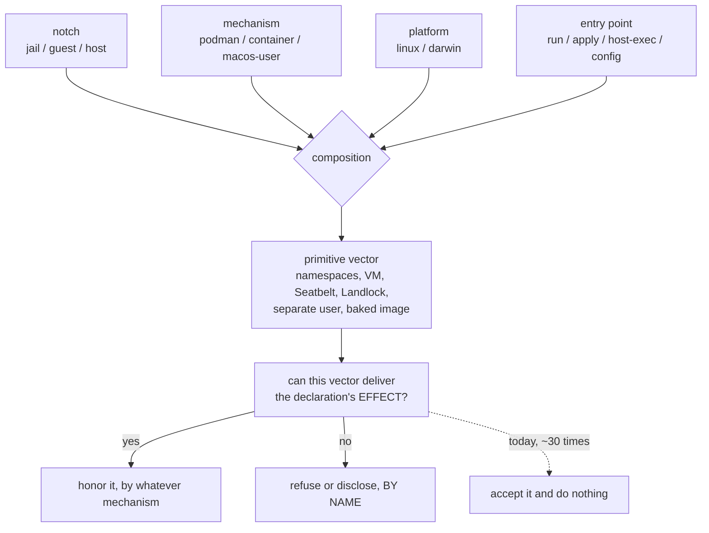

# One declaration, many mechanisms — and the four inputs that decide which one runs

**Status:** DESIGN + CATALOG, 2026-09-12. Nothing built. Every code claim below was
re-verified against the tree on 2026-09-12 at `55a77e79`, by symbol; three sweep rows
that the tree contradicts are corrected in [§9](#9-where-the-sweep-was-wrong).

> **In short.** The principle holds, and the tree proves it — but it quantifies over a
> composed **primitive vector**, not over a backend, and that vector is computed from
> four inputs in exactly one function, for display only. Everything else reads one input
> and guesses the rest.

**Why it matters.** A declaration that is accepted, validated and then not honored with
nothing said is a defect however the principle is settled. The sharpest instances do not
merely omit: they make the agent's own briefing assert the opposite of what ran.

**The shape.** One principle ([§1](#1-the-principle-and-what-it-does-not-say)), four inputs
([§2](#2-four-inputs-not-two-axes)), four dispositions
([§3](#3-the-four-dispositions-and-how-to-walk-the-catalog)), and a catalog keyed on
`(declaration × site)` rather than on a backend.

**Cost.** Six rulings. Two are one-call-site edits, one is roughly ten lines, one is a
delivery mechanism that does not exist, and two decide the vocabulary and the disclosure
shape for everything else. Nothing here builds the `guest` notch.

**Start at [§5](#5-silently-broken)** — the bucket that is a defect whichever way the
principle is settled.

**Needs your ruling:** [OQ-DP1](#OQ-DP1), [OQ-DP2](#OQ-DP2), [OQ-DP3](#OQ-DP3),
[OQ-DP4](#OQ-DP4), [OQ-DP5](#OQ-DP5), [OQ-DP6](#OQ-DP6).

**Reads with:** [`backend-parity.md`](backend-parity.md) (the same idea on ONE input; it owns
the backend census and its own questions, which this doc does not re-open),
[`macos-user-nix-and-features.md`](../reference/macos-user-nix-and-features.md) (the authority
for every macos-user row), [`macos-user-home-tiers.md`](macos-user-home-tiers.md) (its
[§5.4](macos-user-home-tiers.md#54-seatbelt-can-replace-more-mounts-than-this-one) contradicts
`render.refusalReasons` — that is [OQ-DP4](#OQ-DP4)),
[`environment-manager-plan.md`](../plans/environment-manager-plan.md) (Phase 7, the only
unbuilt phase), [`host-render-target.md`](host-render-target.md) (`render.FieldSet`, the
per-notch census this generalises).

> [!NOTE]
> **Scope, and the title's word.** The `guest` case and the macos-user case — the two the
> maintainer asked for — are catalogued exhaustively. Apple Container appears only as
> PRECEDENT or CONTRAST, because [`backend-parity.md`](backend-parity.md) owns it; podman and
> the `host` notch appear where they are load-bearing. *"Mechanism"* in the title is the
> maintainer's own word from the principle below, not this doc's answer to
> [OQ-DP1](#OQ-DP1) — though [§2.6](#26-what-to-call-the-second-input) does have one.

---

## 1. The principle, and what it does not say

The maintainer stated it as one sentence:

> the implementations may vary, but the declaration should be the same, and they should
> apply equally across all the containment methods, even if they use different mechanisms.

Four numbered readings, because the rest of this doc cites them.

**P1. One declaration; honored or refused BY NAME, everywhere.** A declaration's *effect* is
delivered by whatever primitives the site can compose. Where nothing can deliver it, the site
refuses or discloses, naming the declaration. The one state that is never legal is accepting a
declaration and doing nothing.

**P2. The implementation is free; the vocabulary is not.** `packages:` means the same thing
on three backends and is delivered three ways — a baked OCI image, a boot-written symlink farm
over the mounted nix store, a native darwin `buildEnv`. That is the principle working, and it
is the strongest existing proof it is achievable ([DP-A1](#4-aligned-and-why-the-catalog-leads-with-it)).

**P3. Silence is the defect the principle exists to name.** The repo has written this down
twice already and given it no mechanism.
[`macos-no-vm-direction.md`](../reference/macos-no-vm-direction.md): *"every feature a container
implements with a flag or a mount must either work natively or say it does not."*
[`macos-user-nix-and-features.md`](../reference/macos-user-nix-and-features.md): *"'Absent and
silent' is the defect; 'absent and loud' is an honest backend."* Both are enforced today by a
sweep and by per-backend `if`s, which is why [§5](#5-silently-broken) is as long as it is.

**P4. "Equally" is bounded by WHO MAY AUTHOR the declaration.** This is the one place the
principle is wrong if taken literally, and the tree is right. `yolo host -- <cmd>` reads the
user-scope config and nothing else, because composing a host process's environment from an
agent-editable workspace `yolo-jail.jsonc` is arbitrary code execution on the user's real
machine, reached by cloning a repository (`config.UserScopeConfigOrEmpty`, `cli.composeHostLaunch`).
Workspace scope there is **inexpressible**, not merely refused. Any rule phrased as *"the same
declaration does the same thing at every notch"* argues for that RCE at least once, so P4 is a
clause of the principle, not an exception to it.

### What the principle does NOT say

- **Not that every site grows every feature.** [`backend-parity.md`](backend-parity.md#7-what-this-does-not-propose)
  already rules this and it stands: *"the goal is that a setting stops lying, not that every
  backend grows every feature."*
- **Not that a divergence is a bug.** Most of
  [§7](#7-ruled-divergent-and-the-ones-i-would-re-open) is ruled terminal with reasoning that
  survives scrutiny, and one
  divergence is *stronger* than what the container backends give
  ([DP-A2](#4-aligned-and-why-the-catalog-leads-with-it)).
- **Not that silence is always wrong.** Where the declared OUTCOME is already true, silence is
  correct — `writable_home_dirs` on a backend whose home is writable in one bind has nothing
  to say ([DP-A11](#4-aligned-and-why-the-catalog-leads-with-it)).
- **Not "add a warning everywhere."** That collides with
  [OQ-BP-3](backend-parity.md#open-questions), which is live and owned elsewhere:
  *"a warning people learn to skip is worse than none."* See [OQ-DP5](#OQ-DP5).

### Defined terms

| Term | Status | What it is, and what it is not |
| :--- | :--- | :--- |
| **notch** | existing | `jail` / `guest` / `host` — the confinement dial. `render.Kind`, `config.Confinement`. NOT a runtime. |
| **mechanism** | **promoted here** | `podman` / `container` (Apple Container) / `macos-user`. Already the parameter name in `cli.confinementProfile`; this doc promotes it from a parameter to the term. Elsewhere in the tree it is spelled "backend" or "runtime". NOT settled — see [OQ-DP1](#OQ-DP1). |
| **primitive vector** | **promoted here** | the composed set a notch and mechanism yield: `PrimNamespaces`, `PrimVM`, `PrimSeatbelt`, `PrimLandlock`, `PrimSeparateUser`, `PrimBakedImage` (`render.PrimitiveOrder`). It is what P1 quantifies over. NOT a config surface — only the three named presets are selectable. |
| **entry point** | *(coined here)* | which verb is running: `yolo -- cmd`, `yolo apply`, `yolo host -- cmd`, `yolo config diff`. It has no name in the tree today and it is a real axis ([§2](#2-four-inputs-not-two-axes)). |
| **site** | *(coined here)* | one combination of the four inputs — the thing a declaration is honored or not honored AT. `(declaration × site)` is the catalog's key. NOT a synonym for "backend": `yolo apply` at `guest` and `yolo -- cmd` at `guest` are two sites. |
| **carve-out** | *(this doc's sense)* | a site that accepts a declaration and does not deliver its effect. ⚠ NOT `AGENTS.md`'s sense, where a CARVE-OUT is a structural blindness of an *instrument* ("a nested jail cannot see the rootless class"). Both senses appear in this repo; this doc always means the first. |

---

## 2. Four inputs, not two axes

The brief posed this as two axes — notches and backends — and said a carve-out can sit on
either. That is right as far as it goes and it is not far enough. **The tree already computes
the answer from four inputs, in exactly one function, and uses it for display only.**

```go
// internal/cli/describe.go — sole caller: describeMain
func confinementProfile(notch render.Kind, mechanism string, isMacOS bool) render.Profile {
	switch {
	case notch == render.KindHost:                          return render.HostProfile()
	case slices.Contains(paths.NativeRuntimes, mechanism):  return render.GuestProfileMacOS()
	case notch == render.KindGuest:
		if isMacOS { return render.GuestProfileMacOS() }
		return render.GuestProfileLinux()
	default:                                                return render.JailProfile(mechanism == "container")
	}
}
```

Read the branch order. **The mechanism outranks the notch in two of four arms.** A `macos-user`
launch at `confinement: jail` gets the *guest* vector. An Apple Container jail gets `PrimVM`
where a podman jail gets `PrimNamespaces`. The platform decides only the arm no mechanism
names. Its own doc comment states the rule and names the third input: *"MECHANISM FIRST,
platform only as the fallback, because `runtime` is what a launch will actually use and a
primitive is a property of the backend, not of the machine reading the config."*

| Input | Values | Spelled today as | Authority |
| :--- | :--- | :--- | :--- |
| **Notch** | jail / guest / host | `render.Kind`, `config.Confinement` | `render.ProfileFor`, `render.Target.Fields`, `render.modeCensus` |
| **Mechanism** | podman / container / macos-user | `runtime`, "backend" | `paths.SupportedRuntimes` vs `paths.NativeRuntimes` |
| **Platform** | linux / darwin | `o.IsMacOS`, `paths.IsMacOS` | `hostcas.CodeMacOS`, `run.kvmArgs`, `run.gpuHostAvailable` |
| **Entry point** | `yolo -- cmd` / `yolo apply` / `yolo host -- cmd` / `yolo config diff` | *unnamed* | none — [§2.4](#24-the-entry-point-is-an-axis-and-it-has-no-name) is the evidence it exists |

### 2.1 The platform is a separate input, and one decider already spells it that way

`internal/hostcas` carries `CodeBackend` ("not podman — Apple Container and macos-user both
land here") and `CodeMacOS` ("never done on macOS: the jail is Linux in a VM") as two distinct
refusal codes with two distinct reason strings, plus `CodePlatform` for a host/jail arch
mismatch. Three codes, three inputs, one decision. Flatten them and `YOLO_RUNTIME=podman` on a
Mac reads as a fix when it is not. `run.kvmArgs` gates on `o.IsMacOS || rt == "container"` — a
disjunction of two inputs, which is why *macOS podman* also drops it.

### 2.2 The notch is enforced by nothing on the launch path

`config.ResolveConfinement` has exactly three production callers: `cli.describeMain`,
`cli.applyMain`, and `run.(*Options).prepare`'s `jailcontent.BriefingInput{Confinement: …}`.
The last is **briefing prose only**. The actual enforcement — `render.FieldSet`,
`render.modeCensus` — is reached only from the host-render path. A `rg` for
`guest|Guest` over `internal/cli/run` with tests excluded returns only pasta's
`--map-guest-addr`.

So a `(notch, mechanism)` matrix would mark `confinement` *Honored* on all three mechanisms and
be wrong about all three.

### 2.3 `NoContainer` is the mechanism input smuggled into a notch-shaped function

`jailcontent.confinementHeader(confinement string, noContainer bool)` takes both inputs and
acts on the second in exactly one of five arms (`known && notch == render.KindJail && noContainer`).
The sweep measured this on 2026-09-12 by calling the function directly under `go test -overlay`;
I re-derived it here by reading the five arms and `jailcontent.enforcementLines`, which is why
the middle is elided rather than pasted:

```text
confinementHeader("jail", true)   // the macos-user arm

  # YOLO Environment — jail (native, no container)

  You are confined by a Seatbelt sandbox on the human's REAL machine, not by a
  container. There is no image and no jail to restart.
  ...
  Jail tooling: `yolo --help`; config reference: `yolo config-ref`.

  Enforced by:
  - namespaces — kernel-isolated filesystem, processes, PIDs and network
  - a baked image — a nix-built package set, not your machine's PATH
  ...
  Jail tooling: `yolo --help`; config reference: `yolo config-ref`.
```

Two lines of one paragraph disagree, and the "Jail tooling" line prints twice — the branch body
carries it and `jailcontent.enforcementLines` appends its own. The vector comes from
`render.ProfileFor(notch)`, the table whose own doc comment forbids exactly this use: *"When
`describe` prints the vector (plan Q7) it must source it from the backend that knows the
platform, NOT from here."* And `confinementHeader("guest", true)` and
`confinementHeader("guest", false)` are **byte-identical** — the guest arm never reads the
parameter — as are the two `host` calls.

These are rows [DP-B17](#53-both-axes-at-once-the-notch-the-briefing-and-the-render-target),
[DP-B18](#53-both-axes-at-once-the-notch-the-briefing-and-the-render-target) and
[DP-B19](#53-both-axes-at-once-the-notch-the-briefing-and-the-render-target).

### 2.4 The entry point is an axis, and it has no name

Same declaration, same notch, same mechanism, opposite behaviour, decided only by which verb
is running:

- `confinement: guest` → `cli.applyMain` **refuses** with rc 1 naming Phase 7; `run.Run`
  **silently accepts**, starts an ordinary container jail, and writes a briefing telling the
  agent it is not in one. One notch, one mechanism, two verbs, and one of them lies.
- `packdecl.KindLaunch` at the host notch → `yolo host apply` refuses with a reason that names
  `yolo host -- <program>` as the remedy; `cli.hostExec` — that very verb — does not call
  `packload.InjectLaunchFlags`, whose only production call site is `run.Run`.
- `render.hostUnimplemented`'s own doc comment concedes the axis in as many words:
  *"It is a limit of this COMMAND, not of the notch."*

### 2.5 The composition, drawn



**The principle quantifies over the vector, not over any one input.** That is why
`workspace_readonly` is honorable on macos-user (Seatbelt's `readonlyDenies` is a real
write-deny primitive) and *not* honorable on Apple Container (a VM primitive gives no per-path
read-only) — an inversion of the intuition that carve-outs track isolation strength, and one
no `(notch, backend)` table can express.

### 2.6 What to call the second input

The maintainer said *"whatever we call them"* about containment methods, and that is a live
vocabulary gap rather than a throwaway. My recommendation, and its cost, are
[OQ-DP1](#OQ-DP1). The short version: **keep `notch`, promote `mechanism`, promote
`primitive vector`, and name the entry point** — four words, three of which the tree already
owns. I did not coin an umbrella word for notch+mechanism, because a carve-out on the notch
costs Phase 7 and a carve-out on the mechanism costs a delivery primitive, and one word makes
those look like one decision. This doc's filename follows from that: the brief's default named
"containment", which is the flattening word.

---

## 3. The four dispositions, and how to walk the catalog

| Disposition | Meaning | Does the maintainer owe a decision? |
| :--- | :--- | :--- |
| **Aligned** | the effect is delivered, by whatever mechanism the site composes | No — these are the precedent bank the rulings are written against |
| **Ruled divergent** | not delivered, and the reason is written down and survives scrutiny | No, except the ones in [§7](#7-ruled-divergent-and-the-ones-i-would-re-open) I would re-open |
| **Alignable** | not delivered; a mechanism and its cost are both named | Yes — approve or decline the cost |
| **Silently broken** | accepted, then not delivered, with nothing said | **Not a design decision** — these are defects however the principle is settled. Approve the fix, or say why not |

These answer *what does the maintainer do about it*. They are **not** the four in
[`backend-parity.md` §3](backend-parity.md#3-the-four-dispositions--the-most-important-section)
(Honored / HonoredBy / Warned / Refused), which answer *what does this site do*. The mapping:

| backend-parity says | this doc says | when |
| :--- | :--- | :--- |
| Honored, HonoredBy | Aligned | always |
| Warned | Ruled divergent, or Alignable | depending on whether the reason is terminal |
| Refused | Aligned | a refusal that names the declaration IS P1 satisfied |
| *(silent absence — not in that vocabulary)* | Silently broken, or Aligned | Aligned only where the declared OUTCOME is already true |

**How to walk this.** Rows carry stable ids: `DP-A#` aligned, `DP-D#` ruled divergent, `DP-L#`
alignable, `DP-B#` silently broken. Read [§5](#5-silently-broken) first and rule the rows;
most of them need approval, not a decision. The six things that need a *decision* are the
[Open Questions](#open-questions), and each says which rows it closes — rule those six and the
catalog mostly settles itself. Do not expect one question per row: forty undifferentiated
questions is an unrulable document, which is why there are six.

> [!WARNING]
> **Guest is never flattened into the mechanisms.** *"Not built yet"* and *"ruled not to"* are
> different states. Every row whose blocker is the unbuilt `guest` notch is marked
> **[Phase 7]**, and [§8](#8-the-guest-notch-is-not-a-backend) is where that distinction is
> argued rather than merely marked.

---

## 4. Aligned, and why the catalog leads with it

A catalog of refusals with no successful case in it reads as *"the principle is
unachievable."* It is not, and these are the rows a ruling should be written **against**
rather than about.

| id | Declaration and site | Why it is aligned |
| :--- | :--- | :--- |
| **DP-A1** | `packages:` — every mechanism | **Three deliveries, one key**: baked OCI image (podman default), boot-written symlink farm over the mounted store (`entrypoint.storePackagesFarm`, opt-in via `run.storePackagesEligible`), native darwin `buildEnv` (`darwinpkg.MaterializeDarwin`). The strongest existing proof of [P1](#1-the-principle-and-what-it-does-not-say). |
| **DP-A2** | `workspace_readonly` — macos-user | Honored by a different primitive: `macosuser.SeatbeltProfile`'s `readonlyRels` renders `(deny file-write* (subpath …))`. **Stronger** than the container backends' 0444 DAC, which a root agent bypasses. The paradigm case that "no bind mounts" is not a terminal reason. |
| **DP-A3** | every single-FILE `:ro` bind — Apple Container | `run.acMaterialize` copies into the workspace state tree at 7+ call sites, and the class is pinned by an OUTCOME test (`TestReadsHostGrantsAreMaterializedOnAppleContainer` asserts the destination, not that the helper was called). |
| **DP-A4** | `platforms: ["linux"]` on a `packages:` entry | The only place a **user** can declare "absent here is correct", validated as a closed set, with everything else fatal (`config.EffectivePackages`, `macosuser.RunMacosUser`'s skipped-package arm). The generalizable move — see [OQ-DP5](#OQ-DP5). |
| **DP-A5** | `files` — host notch | `entrypoint.RenderHostFiles`: exclusive ownership in a jail becomes per-path refuse-if-the-user-owns-it on a real home, reported per file. One declaration, two ownership postures, the difference stated where the code makes it. |
| **DP-A6** | the `guest` mode policy | `render.modeCensus[{kind: KindGuest}]` is `UndecidedModes(…)`, so `ModeSet.Mechanism` answers `("", false)` for every declaration and `entrypoint.RenderHostPack` emits `refused: <reason>`. A deliberate hole that refuses **by name**, pinned by `TestEveryNotchHasAModeCensus`. **[Phase 7]** |
| **DP-A7** | the host content-addressed cache alias | `hostcas.decide` gives every decline a CODE, a reason string, a banner line (`run.noteHostCASAlias`) and a `yolo stores` row marked "not yolo's" — and none can refuse a launch. The best-shaped decline in the tree. |
| **DP-A8** | the nested-launch inherited config | `run.canNest` is `rt == "podman"`; where nesting is impossible the file is **genuinely not written** rather than written-and-ignored. The design explicitly rejects the shape most silently-broken rows use. |
| **DP-A9** | `network.mode` — every mechanism | `run.appliedNetMode` is ONE predicate answering for the argv, the human warning, the agent briefing and the port gate, so they cannot disagree. Its doc comment records that they previously did, in both directions, in four spellings. |
| **DP-A10** | `render.KindGuest` has no constructor | The three constructors are `render.Jail`, `render.Preview`, `render.Host`. The notch is **unconstructible** rather than silently inheriting the jail's shape. **[Phase 7]** |
| **DP-A11** | `writable_home_dirs` — Apple Container, macos-user | Vacuously satisfied: the declared OUTCOME (the path is writable) is already true, so silence is correct. Keep this row so it is not "fixed". |
| **DP-A12** | `confinement: guest` — `yolo apply` | Refuses with rc 1: *"apply at the guest notch is not built yet (env-manager plan Phase 7 — the LSM-confined backend)."* The sentence [OQ-DP3](#OQ-DP3) wants to reuse already exists. **[Phase 7]** |
| **DP-A13** | pack `loophole` — host notch | `render.refusalReasons[KindLoophole]` is a hand-written INVERSE reason: the counterparty is missing, not the mechanism. The bar for what a refusal message should read like. |

---

## 5. Silently broken

**Every row here is a defect whichever way [P1](#1-the-principle-and-what-it-does-not-say) is
settled**: a declaration is accepted, validated, and then not honored, with no launch line, no
briefing line and no refusal. Several are worse than an omission, because a second surface
asserts the opposite of what ran — those are marked **⚠ asserts the opposite**.

### 5.1 macos-user: read by nobody, warned by nobody

The complete set of config keys `internal/macosuser` reads is `workspace_readonly`
(`macosuser.BuildRunPlan`), `per_side_paths` / `resources` / `cache_relocations`
(`macosuser.buildPlan`), `security` (`macosuser.securitySection`) and `macos_log`
(`macosuser.macosLogMode`). The launcher's own notice block is
`run.(*Options).noteMacosUserContentGaps` plus `run.(*Options).noteMacosUserHostByteGaps`, and
between them they name skills-and-briefings, `mcp_presets`, pack `reads-host` and
source-bearing `host_files`. **Everything below is in neither list.**

| id | Declaration | What actually happens | Evidence, by symbol |
| :--- | :--- | :--- | :--- |
| **DP-B1** | config `mounts` | No `/ctx` mount, no line — **⚠ asserts the opposite**: the briefing lists the `/ctx` paths as existing. | `run.appliedCtxMounts` filters only on `roBindsUnsupported(rt) != ""`, which is `""` for macos-user, so `mountDescriptions` passes through `run.refreshJailBriefings` into `jailcontent.BriefingContent`'s `## Additional Context Mounts (read-only)` section. The predicate's own doc comment describes the exact defect it exists to prevent, and then keys on `container` alone. |
| **DP-B2** | pack `mount` grants | Same path, same silence. The sharper half: a human approved this grant against the word *read-only* at `pack install`, and gets neither the bytes nor a notice. | `run.hostMountArgs` is reached only from the container assembler. The Apple Container half of this exact row was given a warning on 2026-08-24 ([`backend-parity.md` §5](backend-parity.md#5-what-is-already-fixed-2026-08-24), defects 11-12); nothing states why this half was not. |
| **DP-B3** | `network.ports`, `network.forward_host_ports` | Nothing published, nothing forwarded, no line — **⚠ asserts the opposite**: the briefing says bridge mode and *"Reach the host at `host.containers.internal` (169.254.1.2)"*. | `run.sharesLauncherNetns` returns false for anything that is not `network.mode: "host"` or podman-in-podman, so `run.appliedNetMode` returns the configured mode and `run.briefingPortsFor` renders both lists. A native process CAN bind a port, so "publish these" has a meaning here that nothing delivers. Fix: [DP-L2](#6-alignable-with-the-mechanism-and-its-cost). |
| **DP-B4** | `devices`, `gpu`, `kvm` | Silent — not even the "not supported on macOS" warning the container path prints. | `run.deviceArgs`, `run.kvmArgs`, `run.gpuArgs` are all invoked only from `run.assembleRunCmd`, below the `rt == "macos-user"` return in `run.Run`. ⚠ [`macos.md`](../guides/macos.md) asserts the opposite for all three — [DP-B36](#55-doc-drift-the-same-failure-in-a-different-file). |
| **DP-B5** | `ephemeral_storage` | No reader anywhere in `internal/macosuser`; no reference sentence for this backend either. | `run.ScratchMountArgs` is called only from the podman arm of `run.assembleRunCmd`. The key names container scratch backing and there is no container, so the fix is one reference sentence, not a mechanism. |
| **DP-B6** | `resources`, the AGENT half | The human is warned that the caps are ignored; the agent is told they are kernel-enforced — **⚠ asserts the opposite**, in the same launch. | `run.briefedResourceLimits` returns the configured values for any `rt != "container"`, and `run.refreshJailBriefings` runs on the macos-user arm before dispatch; `jailcontent.BriefingContent` renders *"Resource limits (kernel-enforced)"* and points the agent at `yolo-cglimit`, which has no delegate to talk to here. Fix: [DP-L8](#6-alignable-with-the-mechanism-and-its-cost). |
| **DP-B7** | pack `service` `jail_daemon` | No daemon, no supervisor, no warning — and the inert-loophole report does not cover the kind, so a `service` pack looks installed, renders its endpoint-file declaration, and runs nothing. | `run.serviceJailDaemons` has one caller, `run.assembleRunCmd` (via `run.loopholesRuntimeArgs`); `entrypoint.startJailDaemonSupervisor` returns early unless `YOLO_JAIL_DAEMONS` is set, and `macosuser.buildBootstrapEnv` never sets it. **A new instance of the B-0 shape the run pipeline was restructured to end.** Fix: [DP-L3](#6-alignable-with-the-mechanism-and-its-cost). |
| **DP-B8** | the guest launcher's `_refresh_servers` / `_try_materialize` | Armed, baked into every launcher with `SERVERS_ENABLED=1`, and unreachable — both open `command -v yolo || return`, and the sandbox's `yolo` is staged off `macosuser.SandboxPath`. Both no-op silently. | `macosuser.BuildRunPlan` sets `YOLO_LSP_SERVERS` and `YOLO_MCP_PRESETS`; `macosuser.SandboxPath` does not contain the staged prefix. Fix: [DP-L4](#6-alignable-with-the-mechanism-and-its-cost). |
| **DP-B9** | `_.python.venv` in `mise.toml` | No pre-created venv, and no message. The container path's `~/.yolo-venv-precreate.sh` is deliberately not generated here because its body would find neither `/workspace/mise.toml`'s python nor `/bin/python3` — but the omission is exactly the silent skip [`OQ-P1`](macos-user-provisioning.md#decision-ledger) ruled against. | `macosuser.ProvisionSetup` runs four of the container's six steps; the reason is written down in [`macos-user-provisioning.md` §10.1](macos-user-provisioning.md). |
| **DP-B10** | `lsp_servers`, on removal of the LAST entry | The uninstall loop never runs, so the npm package stays in the workspace prefix. Bounded and stated, never collected. | `macosuser.ProvisionNeeded` is a pure function of the config by deliberate choice (the dry-run plan must not touch disk), so removing the final entry flips it false and the loop that reads the sentinel never runs. |
| **DP-B11** | the agent briefing's macos-user home line | **⚠ asserts the opposite**, and a TEST asserts the stale claim. The line says the `scope: workspace` state dirs are *"SHARED by every workspace on this machine"*; since `entrypoint.InstallDarwinHomeLayout` they are symlinked into `<workspace>/.yolo/home`. | `run.backendLimits` builds the line from `packload.WritableDirs` (the workspace tier) where the machine tier is `packload.SharedDirs`. Pinned by `TestBackendLimitsTellTheAgentWhatStderrTellsTheHuman`, whose fixture declares `{Kind: KindState, Scope: "workspace"}`. Latent only because of [DP-B21](#54-the-host-notch-and-the-entry-point). A milder second instance sits in `jailcontent.confinementHeader`'s macos-user arm (*"every workspace on this machine shares it"*), which remains true of the account home itself and is no longer true of the state dirs a pack declares at `scope: workspace` (`entrypoint.DeriveDarwinHomeLayout` links those into the sidecar; only `packload.SharedDirs` stay in the home). |

### 5.2 Apple Container: what the backend census has no word for

Included because each one is a *silent* absence, which is the state
[`backend-parity.md` §3](backend-parity.md#3-the-four-dispositions--the-most-important-section)'s
vocabulary has no word for.

| id | Declaration | What actually happens | Evidence, by symbol |
| :--- | :--- | :--- | :--- |
| **DP-B12** | the `/dev/null` shadows of `.vscode/mcp.json` and `.overmind.sock`, and the `<workspace>/yolo-jail.jsonc` `:ro` bind | Three single-file binds emitted **ungated** — no `roBindsUnsupported` check, no `acMaterialize` fallback. | The two shadow blocks in `run.assembleRunCmd` and the `wsConfigFile` bind at the head of `run.workspaceReadonlyMountArgs`. The class test that would catch them (`TestNoHostHomeBindSurvivesOnAppleContainer`) filters on sources under the user's HOME; `/dev/null` and a workspace path both fall outside. Whether Apple Container DROPS or ERRORS on a single-file bind is unknowable from Linux — [`backend-parity.md` §4](backend-parity.md#4-the-proposal--a-backend-census-sibling-to-renderfieldset) residue 3. |
| **DP-B13** | `network.mode: "none"` | Silently becomes bridge. **A config asking for NO network gets a bridged one, with no line** — this inverts a security declaration and is the more dangerous of the two network cells. | `run.appliedNetMode` returns the literal `"bridge"` for `rt == "container"` unconditionally; the warning in `run.assembleRunCmd`'s container arm fires only on `netMode == "host"`. |
| **DP-B14** | `ephemeral_storage` | Ruled in `internal/cli/config_ref.txt`, never said at launch. A user who left the default `"volume"` for a large download gets RAM pressure and no explanation. | `run.appleContainerBaseMounts` hardcodes the `--tmpfs` list; `run.ScratchMountArgs` is podman-arm only. `run.appleContainerBaseMounts` already proves the launcher knows how to say this — it warns once for `cache_relocations`. |
| **DP-B15** | the pack-manifest `/ctx` tree's read-only guarantee | On podman the staged tree is bound `:ro` *"because an agent that could rewrite one in-jail could grant its own pack a host file on the next boot"*; on Apple Container the jail reads the live host path with no read-only enforcement at all. A SECURITY delta, undisclosed. | The `in.packStaging` block in `run.assembleRunCmd`; `entrypoint.CapturesDirEnv` exists precisely because the destination is not a constant the jail may assume. |

### 5.3 Both axes at once: the notch, the briefing, and the render target

| id | Declaration | What actually happens | Evidence, by symbol |
| :--- | :--- | :--- | :--- |
| **DP-B16** | `confinement: guest` or `host`, at LAUNCH | Accepted, validated, never dispatched on — a container starts anyway — and **⚠ asserts the opposite**: the briefing tells the agent *"a restricted account on the real machine, NOT a disposable container … your home is real and persists."* Every sentence is false of what ran. | `config.ResolveConfinement`'s only run-pipeline caller is `run.prepare`'s `BriefingInput.Confinement`; `run.Run` branches on `rt` alone. `yolo apply` refuses the identical value with rc 1 ([DP-A12](#4-aligned-and-why-the-catalog-leads-with-it)). Settled by [OQ-DP3](#OQ-DP3). **[Phase 7]** |
| **DP-B17** | the mechanism input, in the briefing | `NoContainer` is accepted as a parameter and acted on in one of five arms. MEASURED: `confinementHeader("guest", true)` and `("guest", false)` are byte-identical; same for `host`. | `jailcontent.confinementHeader`. The field's own doc says the two are *"separate axes"*; only one branch acts on it. Settled by [OQ-DP2](#OQ-DP2). |
| **DP-B18** | the `guest` primitive vector, in the briefing | Always the LINUX spelling — *"namespaces"*, *"Landlock"* — regardless of platform, sourced from the one table whose doc comment forbids it for a printed vector. | `jailcontent.enforcementLines(render.ProfileFor(notch))`. `cli.confinementProfile` is the platform-aware twin and honors the instruction; the briefing does not. Settled by [OQ-DP2](#OQ-DP2). **[Phase 7]** |
| **DP-B19** | the `jail` notch on macos-user | **⚠ asserts the opposite** inside one paragraph: *"not by a container"*, then *"Enforced by: namespaces … a baked image"*, and the "Jail tooling" line printed twice. MEASURED — see [§2.3](#23-nocontainer-is-the-mechanism-input-smuggled-into-a-notch-shaped-function). | `jailcontent.confinementHeader`'s `noContainer` arm plus `jailcontent.enforcementLines`. Settled by [OQ-DP2](#OQ-DP2). |
| **DP-B20** | `autonomy`, at `confinement: host` | Two halves of one boot state opposite policies, with nothing comparing them. The briefing says *"Agent autonomy is **OFF** … Do not try to disable them"* while the same boot renders every pack's AUTONOMOUS posture into that agent's config files. | `entrypoint.ConfigurePackSurfaces` takes `e.renderTarget().Profile().AgentAutonomy`, and `(*Env).renderTarget` returns `render.Jail(…)` for every non-`hostTarget` Env → `render.JailProfile(false)` → `AgentAutonomy: true`, unconditionally. The briefing's line comes from `jailcontent.enforcementLines(render.ProfileFor(notch))` with the notch parsed from the config string. |
| **DP-B34** | the guest FieldSet | `render.Target.Fields()` has **no production caller** — `cli.applyHostSurveyed` calls `render.HostFields()` directly — so the guest census is inert today. Separately, its `Refuse("mount")` text (*"unavailable without a container"*) is contradicted by `render.GuestProfileLinux()`, which composes `PrimNamespaces`. `render.refusalReasons` is a `map[Kind]string` with no notch dimension. | `render.Target.Fields`, `render.refusalReasons`, `render.GuestProfileLinux`. **[Phase 7]** for the inertness; the reason TEXT is fixable now. |

### 5.4 The host notch and the entry point

| id | Declaration | What actually happens | Evidence, by symbol |
| :--- | :--- | :--- | :--- |
| **DP-B21** | every macos-user disclosure the AGENT would read | `run.backendLimits` has **no production call site**. The briefing section it feeds — *"What this environment does NOT do for you"* — has never rendered. | The sole production `jailcontent.BriefingInput{…}` literal, in `run.refreshJailBriefings`, does not set `BackendLimits`. **This is a stated precondition of a shipped ruling**: `run.noteMacosUserHostByteGaps` says the no-refusal carve-out *"is only defensible while the deficiency is SAID — here, and in the agent's own briefing (backendLimits) — so this line is load-bearing rather than a courtesy."* Half of that precondition does not execute. |
| **DP-B22** | `yolo --at guest -- <cmd>` (and `--at jail`) | Does not select a notch, does not refuse — **corrupts the argv**. A jail starts, then fails with "command not found" on a token the user typed as a flag. | `cli.stripHostNotch` keeps non-host notches; `cli.parseRunArgs` has no `--at` case, so its `default:` arm treats `--at` as the start of the command. The existing test asserts `RewriteArgv`'s output only and never runs `parseRunArgs` — the callee pinned, the call site not. Settled by [OQ-DP3](#OQ-DP3). |
| **DP-B23** | the guarded launch-flag posture | `packload.LaunchFlagsFor(packs, false)` — the documented path by which `--dangerously-skip-permissions` *"vanishes at the host notch"* — has no production caller. Both production callers hardcode `true`. The claim is true of the function and false of the system. | `packload.InjectLaunchFlags` and `entrypoint.writeShellAliases`-side code both pass `true`; the only `false` in the tree is `packload/autonomy_test.go`. Settled by [OQ-DP6](#OQ-DP6). |
| **DP-B24** | pack `launch` contributions at `yolo host -- <cmd>` | Silently absent, with a misdirecting remedy: the host-apply refusal for that kind names *"`yolo host -- <program>` is the notch that does the launching"*, and that verb execs the user's argv unmodified. | `cli.hostExec` builds `argv` and calls `syscall.Exec`; `packload.InjectLaunchFlags`'s only production call site is `run.Run`. Contrast the sibling kinds, which ARE delivered there: `env` through `launch.environ()`, `provider` through `launch.credentialGaps`. Settled by [OQ-DP6](#OQ-DP6). |
| **DP-B25** | the autonomy posture, in the config reporters | `packload.(*Pack).Surfaces()` hardcodes `SurfacesFor(true)`. `cli.packSurfacesForAgent` calls it with no posture, while its caller `cli.overlayContributionRows` — in the same function — resolves the notch and passes `render.ProfileFor(notch).AgentAutonomy` to `packoverlay.Collect`. One report folds surfaces at the autonomous posture beside an overlay set collected at the guarded one. | `packload.(*Pack).Surfaces`, `cli.packSurfacesForAgent`, `cli.overlayContributionRows`. Half of a migration: `entrypoint.ConfigurePackSurfaces` was converted to read the Target and `Surfaces()` kept the literal for fingerprint stability. |
| **DP-B26** | a `briefing` contribution's `after: "host:<path>"` | Silently ignored at the host notch. The declaration validates, `yolo pack footprint` reports it, and nothing happens — the kind is honored and one FIELD of it is not, which is one level finer than the no-silent-skip net catches. | `packdecl.Contribution.After`'s only BEHAVIOURAL readers are on the jail path (`run.briefingDestinations`, `run.briefingHostOverlay`); the third, `packdecl`'s manifest transform, only surfaces it as `packdecl.Mount.HostOverlay` for `packload.footprint` to print. The kind is not in `render.hostUnimplemented`, so `cli.notchInapplicable` reports nothing either. The RULING is sound (a host briefing destination is generated wholesale, so there is no user file to prepend); the mechanism is the worst available. |
| **DP-B27** | pack `service` and `blocked-tool` at the host notch | Refused by name, with a reason that says nothing: *"<kind> is not applicable at this confinement level."* The real reasons exist only in a hand-written manual. | `render.refusalReasons` contains exactly five entries — program, mount, reads-host, state, loophole. `internal/cli/config_ref.txt`'s "AT THE HOST NOTCH" list carries both real reasons and is kept alive by `TestEveryHostNotchInapplicableKindHasItsReasonDocumented`, which makes the reason READABLE without making it true of what the code decides by. Fix: [DP-L6](#6-alignable-with-the-mechanism-and-its-cost). |
| **DP-B28** | the honored-but-unbuilt census, at any non-host notch | `render.HostUnimplemented(k packdecl.Kind)` takes no notch, so every target using `render.HostFields()` — guest, preview and unset as well as host — gets the HOST's answers, printed under a line that hardcodes *"at the host notch"* (`cli.printNotchFacts`). | Half the fix landed: the entries were deliberately reworded to be notch-neutral *"because a `guest` target inheriting the old sentences would refuse two kinds it can honor"*. The signature and the print label were not. |
| **DP-B29** | the `profile` gate, at any non-jail notch | `cli.overlayGateProfiles` is `if notch == render.KindJail { … }` with an unqualified fallthrough, in a file whose sibling switches (`render.Target.SidecarDir`, `render.Target.Fields`) were deliberately converted **from** that shape. Unreachable today, so it costs nothing yet. | `cli.overlayGateProfiles`. Its doc argues both branches from their own premises and never says which one a third notch takes. **[Phase 7]** |
| **DP-B30** | `required_capabilities` | Validated, classified for nested launches, delivered to the jail as `YOLO_REQUIRED_CAPABILITIES` — and nothing reads it. On macos-user the variable is not even set, because the writer is below the return. | One writer, in `run.assembleRunCmd`; no reader in `internal/`, `packs/` or `docs/`. The underlying feature is a known-unbuilt ruling ([`OQ-CAP2`](agent-auth-modes.md#12-decision-ledger)); what this row adds is that when that refusal IS built, macos-user is the mechanism that will silently not refuse. |
| **DP-B31** | `packages:` at the host notch | Neither honored nor refused, **because the census cannot see it**: `packages` is a config key, not a pack kind, and `render.FieldSet`'s census is keyed on `packdecl.Kind`. | `cli.applyMain` has no `packages` handling. **The most important row on the notch axis**: the mechanism built to guarantee *"nothing a pack declares is silently absent"* has a blind spot for everything a pack does not declare. See [OQ-DP5](#OQ-DP5). |
| **DP-B32** | the `host_management` contract, at two host Envs | `entrypoint.PruneHostOverlayKeys` and `entrypoint.hostRevertEnv` both build `&Env{… hostTarget: true}` with no `hostOwnership`, so `Modes()` is `render.OwnershipUnstated` — undecided, composing nothing. Harmless today by luck: neither path reads `Modes()`. The next field either reads off it silently gets "nothing". | Contrast `entrypoint.RenderHostPack`'s caller, which passes the resolved ownership. |
| **DP-B33** | `apply --sealed`'s remedy for outstanding capture keys | The refusal reads *"promote them into a pack or `yolo config reset … --surface …` to discard"* — English prose where a shipped command now exists. | `cli.applySealed`. ⚠ **The sweep said `yolo config promote` does not exist. It does** — see [§9](#9-where-the-sweep-was-wrong). Fix: [DP-L14](#6-alignable-with-the-mechanism-and-its-cost). |

### 5.5 Doc drift: the same failure in a different file

A doc that asserts a behaviour the code does not have is the same defect as a briefing that
does, with a slower feedback loop. All four were re-checked against the tree on 2026-09-12.

| id | Where | The claim, and what contradicts it |
| :--- | :--- | :--- |
| **DP-B35** | [`macos.md`](../guides/macos.md), the WARNING under "What Works on macOS" | *"`yolo stop` and `yolo clean` do not exist (verified 2026-08-23)."* ⚠ `cli.registry` maps `"stop": runStop`, and `internal/cli/stop.go` implements a macos-user branch that [`macos-user-home-tiers.md`](macos-user-home-tiers.md) correctly cites. The enumerated registry in the same block also omits `capture`, `stores` and `programs`. (`clean` really is absent.) **Fix by REMOVING the enumeration and the negative, not by updating them** — `yolo --help` is their authority. |
| **DP-B36** | [`macos.md`](../guides/macos.md), the Limitations preamble and three `###` sections | *"yolo skips each with a warning"* for gpu / devices / cgroup rules on *every* macOS backend; two sections spell it *"silently skipped with a warning"*, which is self-contradictory on its face. ⚠ False for macos-user, where `run.deviceArgs`, `run.kvmArgs` and `run.gpuArgs` are never reached ([DP-B4](#51-macos-user-read-by-nobody-warned-by-nobody)). [`macos-user-nix-and-features.md`](../reference/macos-user-nix-and-features.md) is the careful version and claims no warning. |
| **DP-B37** | `internal/cli/config_ref.txt`, the `cache_relocations` entry | *"'macos-user' has no container and no bind mounts, so a plain host symlink already does the job there."* ⚠ The launch warning in `macosuser.buildPlan` says in as many words that it does not, because `macosuser.SeatbeltProfile` denies writes outside the workspace, the sandbox home, `/tmp` and `/var/folders`. **This is shipped user-facing text telling a user to do something that leaves a large cold cache on the boot volume — the one outcome the feature exists to prevent.** |
| **DP-B38** | [`cache-relocation.md`](../plans/cache-relocation.md) | Carries a dated retraction of that exact sentence (*"⚠ Retracted 2026-08-24: 'a plain host symlink already works there' is FALSE"*) and then **repeats the claim** ~230 lines later in its Q&A section. A retraction applied to one instance of a sentence that had three. |
| **DP-B39** | `internal/cli/config_ref.txt`, the `resources` entry | `cpus` *"Default: no limit."* False on Apple Container, which applies half the host's CPUs (min 2) when the key is unset (`run.appliedResourceLimits`, `limitBackendDefault`). |

---

## 6. Alignable, with the mechanism and its cost

These are not defects in the [§5](#5-silently-broken) sense — most of them ARE
[§5](#5-silently-broken) rows, seen from the fix side. What makes them a separate bucket is
that a mechanism exists and a cost can be named, so what the maintainer owes is an approval,
not a design.

Ordered by rows-closed per unit of work.

| id | Declaration and site | Mechanism | Cost | Closes |
| :--- | :--- | :--- | :--- | :--- |
| **DP-L1** | macos-user: pack `reads-host`, source-bearing `host_files`, config `mounts`, pack `mount` grants, host nvim config | **One host-side materialize step into the sandbox home** — the shape `run.acMaterialize` already uses on Apple Container — plus a `readonlyDenies`-style Seatbelt deny for the `:ro` half | A delivery mechanism, not a flag. ⚠ It must run in the host CLI, not in the pure plan builder: the source-bearing read IS the credential boundary (`config.HostFileStaging`) | **Five cells, one mechanism.** [DP-B1](#51-macos-user-read-by-nobody-warned-by-nobody), [DP-B2](#51-macos-user-read-by-nobody-warned-by-nobody), and the two host-byte rows that are today merely warned. Ruled by [OQ-DP4](#OQ-DP4) |
| **DP-L2** | `run.sharesLauncherNetns("macos-user") → true` | Makes `run.appliedNetMode` answer `"host"`, which already suppresses both port sections in `jailcontent.BriefingContent` and swaps the bridge paragraph for *"`localhost` / `127.0.0.1` resolves directly to the host"* | One predicate, plus one wording fix: that line currently opens *"the container shares the host network stack"*, and there is no container here | **Three keys at once** — `mode`, `ports` and `forward_host_ports`: [DP-B3](#51-macos-user-read-by-nobody-warned-by-nobody) |
| **DP-L3** | macos-user pack `service` `jail_daemon` | Hoist `run.serviceJailDaemons` above the backend dispatch and have `macosuser.buildBootstrapEnv` set `YOLO_JAIL_DAEMONS` — a native process can run a jail daemon as an ordinary child | Small. The same hoist `stagePacks` and pack-`launch` injection already made | [DP-B7](#51-macos-user-read-by-nobody-warned-by-nobody) |
| **DP-L4** | macos-user's staged `yolo` | Put the staged prefix on `macosuser.SandboxPath`, or teach the two shell functions its absolute path | Two lines | [DP-B8](#51-macos-user-read-by-nobody-warned-by-nobody), and the materialize half of install-capture |
| **DP-L5** | pack `launch` at `yolo host -- <cmd>` | `cli.hostExec` calls `packload.InjectLaunchFlags` with the HOST posture (`false`), not the hardcoded `true` | One call plus threading one bool | **Two rows together**: [DP-B24](#54-the-host-notch-and-the-entry-point) and [DP-B23](#54-the-host-notch-and-the-entry-point) — giving `hostExec` the injection is what makes the `false` branch live. Ruled by [OQ-DP6](#OQ-DP6) |
| **DP-L6** | `service` and `blocked-tool` host refusals | Two entries in `render.refusalReasons`, copied verbatim from the manual rows that already exist in `internal/cli/config_ref.txt` | **The cheapest fix in this catalog** | [DP-B27](#54-the-host-notch-and-the-entry-point) |
| **DP-L7** | `run.appliedCtxMounts` | One `macos-user` arm returning nil | One line | [DP-B1](#51-macos-user-read-by-nobody-warned-by-nobody)'s briefing half — stops handing an agent a file-path map of a filesystem that does not exist |
| **DP-L8** | `run.briefedResourceLimits` | One `macos-user` arm returning nil, like its `container` sibling | One arm | [DP-B6](#51-macos-user-read-by-nobody-warned-by-nobody) |
| **DP-L9** | `run.backendLimits` | `BackendLimits: backendLimits(rt, staged.packs, cfg)` in `run.refreshJailBriefings` | **One line, and the highest value per line here** — it is a stated precondition of a shipped ruling | [DP-B21](#54-the-host-notch-and-the-entry-point). ⚠ Must ship WITH [DP-L2](#6-alignable-with-the-mechanism-and-its-cost), [DP-L7](#6-alignable-with-the-mechanism-and-its-cost), [DP-L8](#6-alignable-with-the-mechanism-and-its-cost) and the [DP-B11](#51-macos-user-read-by-nobody-warned-by-nobody) narrowing — see [§11](#11-what-i-would-build-in-order) |
| **DP-L10** | the macOS platform warnings for `gpu`, `devices`, `kvm` | Three existing message strings need a call site ABOVE the backend dispatch | Near-zero — the sentences are written | [DP-B4](#51-macos-user-read-by-nobody-warned-by-nobody), and makes [DP-B36](#55-doc-drift-the-same-failure-in-a-different-file) true instead of requiring a doc edit |
| **DP-L11** | `render.HostUnimplemented` | Take a `render.Target` (or a `render.Kind`), and un-hardcode `cli.printNotchFacts`' *"at the host notch"* label | Mechanically trivial; the wording half already landed | [DP-B28](#54-the-host-notch-and-the-entry-point). The real question it surfaces is whether `guest` should share the host's unbuilt set at all — **[Phase 7]** |
| **DP-L12** | `cli.packSurfacesForAgent` | Thread the notch the caller has already resolved | Signature plus one call site | [DP-B25](#54-the-host-notch-and-the-entry-point). Whether any printed answer changes today needs measuring; the point is that nothing would tell you if it did |
| **DP-L13** | `yolo check`'s nix probes on Linux | Ungate from `IsMacOS` | Trivial — the probe is platform-neutral in substance | Tracked as [`OQ-NX9`](provisioner-sets.md#OQ-NX9) |
| **DP-L14** | `cli.applySealed`'s remedy string | Name `yolo config promote`, which ships | One string | [DP-B33](#54-the-host-notch-and-the-entry-point) |
| **DP-L15** | Apple Container `cache_relocations` | The nesting is already proven — `run.appleContainerBaseMounts` binds `paths.GlobalCache()` at the same depth two lines below the skip | **One Mac session.** The stated reason is absence of MEASUREMENT, not capability | The one Apple Container row whose blocker is an instrument, not a mechanism |
| **DP-L16** | `packages:` at the host notch | `darwinpkg.MaterializeAt` already has two consumers; what is missing is a caller and a census entry | Needs [OQ-DP5](#OQ-DP5) answered first — `packages` is not a pack kind, so `render.FieldSet` cannot see it | [DP-B31](#54-the-host-notch-and-the-entry-point) |

---

## 7. Ruled divergent, and the ones I would re-open

These hold. They are here so the maintainer can walk past them quickly, and so nobody
"fixes" one later.

| id | Declaration and site | The reason, and why it survives |
| :--- | :--- | :--- |
| **DP-D1** | `resources` — macos-user | Both substitutes evaluated and rejected **by name**: `RLIMIT_AS` is address space, not RSS (it breaks JITs and the Go runtime); `RLIMIT_NPROC` is per-USER and would collide across concurrent sessions on the shared `_yolojail` account. *"A cap a user believes in but that does not hold is worse than a documented absence."* The cleanest terminal ruling in the tree. |
| **DP-D2** | `per_side_paths` — macos-user | *"Seatbelt filters permissions and cannot fork a path."* Two contents at one path is a mount-namespace capability with no SBPL spelling and no prospect of one. |
| **DP-D3** | `cache_relocations` — macos-user | Rules out the WORKAROUND as well as the feature, which is stronger than "unbuilt": `macosuser.SeatbeltProfile` denies writes outside the workspace, the sandbox home, `/tmp` and `/var/folders`, so the documented symlink trick leaves the cache exactly where the feature exists to move it from. (The two docs that still recommend it are [DP-B37](#55-doc-drift-the-same-failure-in-a-different-file) and [DP-B38](#55-doc-drift-the-same-failure-in-a-different-file).) |
| **DP-D4** | `:ro` binds — Apple Container | A CONSENT argument, not a capability one: a grant a human approved against the word *read-only* must not be honored writably. `run.roBindsUnsupported` was hoisted into `backendcaps.go` specifically so a third caller cannot miss it, after the pack `mount` kind silently did. |
| **DP-D5** | `workspace_readonly` — Apple Container | The one place refuse-don't-downgrade is deliberately NOT applied, and the reason is sound: the paths are inside the writable `/workspace` bind, so skipping them buys nothing. Warn-and-emit. |
| **DP-D6** | pack `loophole` — host notch | Counterparty missing, not mechanism — plus a trust argument: keeping *"selecting this pack runs a daemon"* attached to a command the user runs deliberately. |
| **DP-D7** | pack `hook` — host notch | *"Refused deliberately, not merely unbuilt"* in as many words. The three shipped hooks mutate real user state. |
| **DP-D8** | workspace-scope config — `yolo host -- <cmd>` | Host RCE reached by cloning a repository. Constructed so workspace scope is **inexpressible** rather than merely refused. **This bounds the principle itself** — see [P4](#1-the-principle-and-what-it-does-not-say). |
| **DP-D9** | `mcp_presets` — macos-user | Skipped, not ported. A darwin variant would have to find a browser, a node and a fontconfig on a machine yolo did not provision. *"An absent wrapper that says so beats a present one that lies."* Open Decision #4, resolved 2026-09-03. ⚠ The DISCLOSURE is misaligned independently: the warning comes from inside the bootstrap, so the one mechanism with a `--dry-run` is the one whose dry run cannot show it. |
| **DP-D10** | GNU userland on the darwin floor — macos-user | *"Your Mac, confined"*; an agent whose `sed -i` behaves unlike the human's is the costlier surprise ([`OQ-P2`](macos-user-provisioning.md#decision-ledger)). ⚠ Enforced only by `darwinpkg.FloorExcludedPolicy` and a mutation-tested unit gate — the honest oracle is a nix evaluation a Go test cannot perform, so adding a name to the image core still needs a human to ask. |
| **DP-D11** | a `packages:` entry with no darwin build — macos-user | **FATAL**, naming every unbuildable package, the resolved system double, the typo hypothesis and the `platforms: ["linux"]` escape hatch. Warn-and-skip masked a typo and a genuine absence with one message for a year. Cite this beside [DP-A4](#4-aligned-and-why-the-catalog-leads-with-it) as the pattern. |
| **DP-D12** | pack `mount`, `reads-host`, `state` — off-container | *"Must be refused rather than emulated (a copy goes silently stale)."* ⚠ **This is the row I would re-open, and it is [OQ-DP4](#OQ-DP4)** — see below. |
| **DP-D13** | `--dry-run` — every mechanism except macos-user | Refuses, naming the runtime that supports it. An inverted carve-out: the capability is macos-user's and the container backends refuse. |
| **DP-D14** | a macos-user jail launching another | Seatbelt's own equality constraint in `sandbox_apply`, not a yolo policy. The macos-user twin of `AGENTS.md`'s nested-jail blind spots, and why every macos-user row here is hardware-gated rather than CI-gated. |
| **DP-D15** | a per-workspace `HOME` — macos-user | Refused on PARITY ([`OQ-HT4`](macos-user-home-tiers.md#decision-ledger)): no other mechanism puts a project's agent state under the account home. ⚠ The reason originally given — *"the single home IS this backend's shared-credentials mechanism"* — is RETRACTED in three places; the mechanism is the `shared_credentials` hook, identical everywhere. A carve-out whose stated reason was wrong survived for months because the reason sounded structural. |
| **DP-D16** | `resources.memory` / `.cpus` UNSET — Apple Container | The INVERSE carve-out: the backend does MORE than declared (half host RAM, half host CPUs), and it is aligned by being DISCLOSED to the agent rather than removed. *"An agent believing it is uncapped while capped is the worse lie."* |
| **DP-D17** | `gpu`, `kvm` — every macOS host | Warn and continue. `gpu`'s declaration explicitly PROMISES degradation (*"the same config can be committed and used on both a GPU box and a GPU-less machine"*), so the refusal is the declaration being honored rather than a divergence from it. |

### The ones I would re-open

Three, of which only the first has a row in the table above — the other two are entirely
push-back, so the argument IS the entry.

**DP-D12 — refuse rather than emulate, off-container.** `render.refusalReasons` says a copy
goes silently stale. [`macos-user-home-tiers.md`](macos-user-home-tiers.md#54-seatbelt-can-replace-more-mounts-than-this-one)
argues the opposite for the shipped guest-shaped backend, on three grounds: a `:ro` bind does two
separable things (make a file appear, make it unwritable); the launcher runs outside the
sandbox so it can do the first by copying; and Seatbelt does the second natively. It also
refutes the staleness claim for `host_files` specifically — `readonly` entries are re-rendered
at boot on the container backends too, so the two are equivalent there. **One of those two
in-tree documents is wrong.** That is [OQ-DP4](#OQ-DP4), and it should reach the maintainer as
a contradiction rather than as a cost estimate.

**DP-D18 — `network.mode: "host"` silently voids `network.ports` on podman.** The argument is
*"that is the user's own declaration."* It is weaker than it looks: `mode` and `ports` are two
separate keys, and nothing tells a user that setting one voids the other. A validate-time
conflict error aligns this with no launch line and no new disclosure — which is the shape
[OQ-DP5](#OQ-DP5) prefers anyway.

**DP-D19 — `resources.pids_limit` absent-not-described on Apple Container.** Ruled for the
BRIEFING (report what is emitted — sound, and I would not touch it). Not ruled for the human,
and `internal/cli/config_ref.txt` documents the key with *"Maps to --pids-limit flag"* and no
backend qualifier at all. One reference sentence.

---

## 8. The guest notch is not a backend

Every **[Phase 7]** mark in this catalog means the same thing and it is not what the
surrounding rows mean. Keeping the two apart matters because the fixes cost different orders
of magnitude:

| State | What it means | What it costs | Rows |
| :--- | :--- | :--- | :--- |
| **Ruled not to** | a decision was made and written down | nothing; do not re-litigate | [DP-D1](#7-ruled-divergent-and-the-ones-i-would-re-open), [DP-D2](#7-ruled-divergent-and-the-ones-i-would-re-open), [DP-D6](#7-ruled-divergent-and-the-ones-i-would-re-open) … |
| **Not built yet** | the notch's semantics are deliberately unstated, and the code says so | Phase 7 — host/Mac-gated | [DP-A6](#4-aligned-and-why-the-catalog-leads-with-it), [DP-A10](#4-aligned-and-why-the-catalog-leads-with-it), [DP-A12](#4-aligned-and-why-the-catalog-leads-with-it) |
| **Not built, and not saying so** | the vocabulary shipped ahead of the notch and a surface asserts it anyway | one refusal, ~10 lines | [DP-B16](#53-both-axes-at-once-the-notch-the-briefing-and-the-render-target), [DP-B22](#54-the-host-notch-and-the-entry-point) |

**The render layer's silence is exemplary and should be left alone.** `render.modeCensus`'s
guest entry is `UndecidedModes(…)` with a reason that names the phase, pinned by a drift test
whose failure message tells the next author to write either a real policy or another
`UndecidedModes`. `render.KindGuest` has no constructor. `render.Target.SidecarDir`,
`ProvenanceDir` and `ArchiveDir` all return `""` for it, and `entrypoint.archiveAdoption` turns
the empty archive path into a refusal — three answers that need not be the same, and are not.
That is a deliberate, named, enforced hole, and it is the bar [§5](#5-silently-broken)'s rows
should be measured against.

**What is NOT exemplary is one layer up.** `config.validateConfinement` accepts `guest`,
`cli.describeMain` prints its vector, `jailcontent.confinementHeader` has a `guest` body — and
`run.Run` branches on `rt` alone. The notch's *vocabulary* shipped in Phase 2 ahead of the
notch, which [`environment-manager-plan.md`](../plans/environment-manager-plan.md) calls *"the
ordering risk this phase now carries."* Nobody closed the door the config left open.

> [!IMPORTANT]
> **The shipped `macos-user` backend IS the guest notch by another name, and runs at
> `confinement: jail`.** `internal/cli/config_ref.txt` says so of the `runtime` key; so does
> `cli.confinementProfile`'s `NativeRuntimes` arm, which fires ahead of the notch test; so does
> `internal/macosuser`, which reasons from `render.GuestProfileMacOS()` directly
> (`macosuser.EndpointGrantCommands`: *"GuestProfileMacOS() carries PrimSeparateUser and
> macos-user runs the sandbox as SandboxUser"*). Any census keyed on
> `(notch, backend)` will file this backend under `jail` and be wrong about every primitive it
> composes. It is the clearest evidence for [OQ-DP1](#OQ-DP1) and it is what
> [OQ-DP2](#OQ-DP2) settles.

---

## 9. Where the sweep was wrong

The five-lens sweep that produced this catalog was checked against the tree rather than
trusted. Three rows do not survive, and two of them would have reached the maintainer as
false.

1. **`yolo config promote` EXISTS.** A sweep row claimed *"There is no `yolo config promote`
   … VERIFIED NEGATIVE: `promote` appears in no dispatch table."* It is a `config` SUBVERB —
   `case "promote": return configPromote(…)` in `cli.configRunW`, implemented in
   `internal/cli/configpromote.go` with `cli.loadPromoteFold` and the needs-closure fold. The
   negative was scoped to `cli.registry` in `dispatch.go`, where subverbs correctly never
   appear. **The residual defect is real, different and much cheaper**: `cli.applySealed`'s
   remedy string is still English prose naming a command that now ships. Reclassified as
   [DP-B33](#54-the-host-notch-and-the-entry-point), fixed by
   [DP-L14](#6-alignable-with-the-mechanism-and-its-cost) — one string, not a phase.

2. **`run.startLoopholes` creates the sockets directory BEFORE the Apple Container return.**
   `mkdirHostServicesDir(socketsDir)` runs above `if rt == "container" { return nil }`. Minor,
   but a sweep row's evidence named the wrong half as guarded.

3. **`internal/macosuser` reads one config key the sweeps never enumerated: `macos_log`**
   (`macosuser.macosLogMode`). Every *"complete set of config reads in internal/macosuser"*
   claim is short by one. The rest of that enumeration checks out, and
   [§5.1](#51-macos-user-read-by-nobody-warned-by-nobody) states the corrected set.

Everything else that this doc leans on was re-verified by symbol on 2026-09-12 and held:
`run.backendLimits` really has zero production callers; `packload.LaunchFlagsFor(_, false)`
really has none; `render.Target.Fields()` really has none; `macosuser.EndpointGrantCommands`
really has none; `cli.parseRunArgs` really has no `--at` case; `render.refusalReasons` really
is missing `service` and `blocked-tool`; `cli.registry` really does map `"stop"`.

> [!WARNING]
> **Dedupe before ruling.** The five lenses overlap heavily — `cache_relocations` on
> macos-user appeared four times, `mcp_presets` four times, `per_side_paths` four times, the
> Apple Container `:ro` refusal four times. Worse, one duplicate pair *disagreed*:
> `cache_relocations` on Apple Container was tagged `incidental-by-caution` in one lens and
> `UNKNOWN` in another, for the same function. This catalog states each cell once
> ([DP-L15](#6-alignable-with-the-mechanism-and-its-cost)); a row appearing twice here is a
> defect in this doc.

---

## 10. What this does NOT propose

- **Not that every mechanism grows every feature.**
  [`backend-parity.md` §7](backend-parity.md#7-what-this-does-not-propose) already rules this
  and it stands unchanged. Seventeen rows in [§7](#7-ruled-divergent-and-the-ones-i-would-re-open)
  are divergences that should survive.
- **Not a refusal of config keys a mechanism has always tolerated.** A shared config is
  legitimately used on a Linux box and a Mac, and refusing `gpu` on macOS would break that.
  ⚠ [OQ-DP3](#OQ-DP3) is the deliberate exception and the distinction is load-bearing:
  `confinement` is not a mechanism-varying key. It resolves to the same value on every
  platform and is enforced by nothing anywhere, so refusing it costs no shared config
  anything. If that distinction fails to hold, [OQ-DP3](#OQ-DP3) should be answered "briefing
  only" instead.
- **Not Phase 7.** Nothing here builds the `guest` notch, on either platform. What
  [OQ-DP3](#OQ-DP3) proposes is that the notch stop *looking* built.
- **Not a replacement for the backend census.** [OQ-BP-1](backend-parity.md#open-questions) is
  live and owned there; this doc adds the second input and the entry-point input, and would
  feed the same table. If the census is built, most of [§5](#5-silently-broken) becomes
  unwritable — that is an argument FOR it, made here and ruled there.
- **Not "warn about all of it."** [OQ-BP-3](backend-parity.md#open-questions) is live:
  *"a warning people learn to skip is worse than none."* [OQ-DP5](#OQ-DP5) offers three
  shapes that are better than a warning, all three of which already ship somewhere in the tree.
- **Not a doc-fix sprint.** The five [§5.5](#55-doc-drift-the-same-failure-in-a-different-file)
  rows are listed because they are the same failure in a different file, not because this doc
  will fix them. Two of them ([DP-B37](#55-doc-drift-the-same-failure-in-a-different-file),
  [DP-B38](#55-doc-drift-the-same-failure-in-a-different-file)) are user-facing and should be
  deleted regardless of everything else here.
- **Not uniform behavior at every notch.** [P4](#1-the-principle-and-what-it-does-not-say) is
  part of the principle, not an exception to it.

---

## 11. What I would build, in order

**Constraint that shapes the order:** the briefing is composed from several independent
sources and three of them are currently wrong in different directions. Wiring
[DP-L9](#6-alignable-with-the-mechanism-and-its-cost) alone would give a macos-user jail an
honest *"what this environment does NOT do for you"* section **while it still claims bridge
networking, kernel-enforced memory, non-existent `/ctx` mounts and a machine-wide home** — a
briefing contradicting itself in four directions is worse than one contradicting itself in
three. So the briefing fixes land together or not at all.

1. **The briefing batch, as one change.** [DP-L2](#6-alignable-with-the-mechanism-and-its-cost),
   [DP-L7](#6-alignable-with-the-mechanism-and-its-cost),
   [DP-L8](#6-alignable-with-the-mechanism-and-its-cost),
   [DP-L9](#6-alignable-with-the-mechanism-and-its-cost), the
   [DP-B11](#51-macos-user-read-by-nobody-warned-by-nobody) narrowing
   (`packload.WritableDirs` → `packload.SharedDirs`, and flip its test), and — if
   [OQ-DP2](#OQ-DP2) rules mechanism-first — threading the mechanism into
   `jailcontent.enforcementLines`. Closes [DP-B3](#51-macos-user-read-by-nobody-warned-by-nobody),
   [DP-B6](#51-macos-user-read-by-nobody-warned-by-nobody),
   [DP-B11](#51-macos-user-read-by-nobody-warned-by-nobody),
   [DP-B17](#53-both-axes-at-once-the-notch-the-briefing-and-the-render-target),
   [DP-B18](#53-both-axes-at-once-the-notch-the-briefing-and-the-render-target),
   [DP-B19](#53-both-axes-at-once-the-notch-the-briefing-and-the-render-target),
   [DP-B21](#54-the-host-notch-and-the-entry-point).
2. **The notch gate**, if [OQ-DP3](#OQ-DP3) says refuse: one gate in `run.Run` reusing
   `cli.applyMain`'s existing sentence, plus an `--at` case in `cli.parseRunArgs`. Closes
   [DP-B16](#53-both-axes-at-once-the-notch-the-briefing-and-the-render-target) and
   [DP-B22](#54-the-host-notch-and-the-entry-point).
3. **The free ones, in any order.** [DP-L6](#6-alignable-with-the-mechanism-and-its-cost),
   [DP-L10](#6-alignable-with-the-mechanism-and-its-cost),
   [DP-L14](#6-alignable-with-the-mechanism-and-its-cost),
   [DP-L4](#6-alignable-with-the-mechanism-and-its-cost), plus the two user-facing doc
   deletions.
4. **The host exec batch**, if [OQ-DP6](#OQ-DP6) says yes:
   [DP-L5](#6-alignable-with-the-mechanism-and-its-cost), which closes two rows with one edit.
5. **The materialize mechanism**, if [OQ-DP4](#OQ-DP4) rules for it:
   [DP-L1](#6-alignable-with-the-mechanism-and-its-cost). Five cells, and the largest single
   piece of work in this catalog.
6. **Everything gated on an instrument** — [DP-L15](#6-alignable-with-the-mechanism-and-its-cost)
   and every macos-user row — waits for a Mac.

> [!CAUTION]
> **Nothing in this catalog is verifiable from in-jail, and the macOS instruments are down.**
> Every macos-user row is ruled against reading, not against measurement: the nightly macOS
> integration job has failed every run since 2026-09-04, `internal/darwinpkg/floor_test.go`'s
> own header says *"nothing here claims the resulting closure behaves on hardware,"* and
> [`macos-user-manual-checks.md`](../plans/runbooks/macos-user-manual-checks.md) items 5-10
> have never been run. A nested jail is structurally blind to the host-loopback and
> rootless-only classes (`AGENTS.md`, both CARVE-OUTs). Linux CI is green throughout, so
> nothing announces the gap. **Two macos-user launch warnings were retired on 2026-09-12 on
> the strength of code that has never executed** — if a Mac says the floor or the provisioning
> stage does not work, a carve-out that is currently un-declared re-opens.

---

## Open Questions

Six, ranked by rows-closed per decision. Everything else in the catalog is an approval, not a
decision — see [§3](#3-the-four-dispositions-and-how-to-walk-the-catalog).

1. 💬 **OQ-DP1: What do we call the second input, and does the entry point get a name?**
   The maintainer said *"whatever we call them"* about containment methods, and the tree is
   already ambivalent: `internal/cli/config_ref.txt` says of `runtime` that *"under the
   confinement dial this is the `guest` notch by another name; `runtime` stays for
   compatibility and as the in-jail mechanism hint."* This decides how every later row is
   filed, and whether an umbrella word for notch+mechanism exists at all.

   <!-- vantage: oq id=OQ-DP1 leaning="Keep `notch`, promote `mechanism` and `primitive vector`, name the `entry point`, and coin NO umbrella word for notch+mechanism — one word makes a Phase 7 cost and a delivery-primitive cost look like one decision." -->

   _Leaning:_ Four words, three of which the tree already owns: **notch** (`render.Kind`),
   **mechanism** (already the parameter name in `cli.confinementProfile`, and better than
   "backend" or "runtime" because it does not imply a container), **primitive vector**
   (`render.PrimitiveOrder` — what [P1](#1-the-principle-and-what-it-does-not-say) actually
   quantifies over), and **entry point**, which is new and has no home in the code. **No
   umbrella word for notch+mechanism**: a carve-out on the notch costs Phase 7 and one on the
   mechanism costs a delivery primitive, and a single word makes those look like one decision.
   Rejected alternatives: *"containment method"* as the umbrella (cheapest, and what was said,
   but it is exactly the flattening this doc exists to stop, and nothing would return one);
   renaming `backend` → `runtime` everywhere (defensible, but `macos-user` runs no runtime);
   keeping "backend" and naming nothing new (viable, and it costs the
   [§2.4](#24-the-entry-point-is-an-axis-and-it-has-no-name) class its vocabulary — four of the
   worst rows live there).

   **Answer:**
   > _(empty — fill in when decided)_

2. 💬 **OQ-DP2: When the notch and the mechanism disagree, which wins?**
   `cli.confinementProfile` has already answered — **mechanism first**, with the reason in its
   doc comment — and it has one caller, `yolo describe`. `jailcontent.enforcementLines`
   answers the opposite way, by reading `render.ProfileFor(notch)`, the table whose own doc
   comment forbids that use for a printed vector. Those are the only two surfaces that print a
   primitive vector and they contradict each other today. **Closes
   [DP-B17](#53-both-axes-at-once-the-notch-the-briefing-and-the-render-target),
   [DP-B18](#53-both-axes-at-once-the-notch-the-briefing-and-the-render-target),
   [DP-B19](#53-both-axes-at-once-the-notch-the-briefing-and-the-render-target), and the
   macos-user jail/guest vocabulary row in [§8](#8-the-guest-notch-is-not-a-backend).**

   <!-- vantage: oq id=OQ-DP2 leaning="Mechanism first, as `cli.confinementProfile` already rules — and thread the mechanism into the briefing so both printing surfaces read one function. `run.prepare` already computes it, to set NoContainer." -->

   _Leaning:_ Mechanism first, and make the briefing read the same logic `describe` does.
   `run.prepare` already has `rt` in hand — it sets `NoContainer` from it — so this is a
   threading change, not a new input. It also forces [OQ-DP1](#OQ-DP1) into the open, because
   `NoContainer` is today the mechanism input smuggled into a notch-shaped function under a
   name that describes neither.

   **Answer:**
   > _(empty — fill in when decided)_

3. 💬 **OQ-DP3: Does a launch REFUSE a notch it cannot enforce?**
   `confinement: guest` is accepted by `run.Run`, which then starts an ordinary container jail
   and writes a briefing telling the agent it is not in one. `yolo apply` refuses the identical
   value with rc 1 naming Phase 7. One declaration, two entry points, and one of them lies.
   ⚠ This is the one place this doc proposes a refusal, against
   [`backend-parity.md` §7](backend-parity.md#7-what-this-does-not-propose)'s *"no backend
   should start refusing a config key it has always tolerated"* — the distinction being that
   `confinement` is not a mechanism-varying key ([§10](#10-what-this-does-not-propose)).
   **Closes [DP-B16](#53-both-axes-at-once-the-notch-the-briefing-and-the-render-target) and
   [DP-B22](#54-the-host-notch-and-the-entry-point), and stops every downstream briefing row
   at source.**

   <!-- vantage: oq id=OQ-DP3 leaning="Yes — refuse, reusing cli.applyMain's existing Phase 7 sentence verbatim, and consume `--at` in parseRunArgs. ~10 lines; the alternative (honor the notch) IS Phase 7." -->

   _Leaning:_ Yes, refuse — and reuse the sentence that already exists rather than writing a
   new one. The weaker option is briefing-only (stop `jailcontent.confinementHeader` asserting
   a notch the launch did not apply), which fixes the lie but leaves `yolo -- cmd` and
   `yolo apply` disagreeing about the same value. `--at jail` should be accepted as a no-op in
   either case; today it corrupts the argv.

   **Answer:**
   > _(empty — fill in when decided)_

4. 💬 **OQ-DP4: Is one host-side materialize step worth building for macos-user — and which of
   the two in-tree documents is wrong?**
   Not primarily a cost question. `render.refusalReasons` says `mount` / `reads-host` / `state`
   *"must be refused rather than emulated (a copy goes silently stale)"*;
   [`macos-user-home-tiers.md`](macos-user-home-tiers.md#54-seatbelt-can-replace-more-mounts-than-this-one)
   says the launcher runs outside
   the sandbox so it can copy, Seatbelt supplies the `:ro` half natively, and the staleness
   claim is false for `host_files` because `readonly` entries are re-rendered at boot on the
   container backends too. **Both are in-tree and they contradict each other.** The mechanism
   is proven (`run.acMaterialize`) and so is the deny half (`macosuser.SeatbeltProfile`'s
   `readonlyRels`). **Closes five cells with one mechanism:
   [DP-L1](#6-alignable-with-the-mechanism-and-its-cost).**

   <!-- vantage: oq id=OQ-DP4 leaning="Build it — §5.4's argument is the better one, and the `reads-host` half is the row where a shipped ruling's stated precondition (the agent is TOLD) currently does not execute. The copy must happen in the host CLI, not the plan builder." -->

   _Leaning:_ Build it, and record that [§5.4](macos-user-home-tiers.md#54-seatbelt-can-replace-more-mounts-than-this-one) wins. The `reads-host` half is the sharpest
   argument: today the agent gets *a working config file that is not the user's*, and nothing
   about the result looks wrong — and the ruling that permits that carve-out says it is
   *"only defensible while the deficiency is SAID"*, in two places, one of which does not
   execute ([DP-B21](#54-the-host-notch-and-the-entry-point)). ⚠ The copy must run in the host
   CLI, never in the pure plan builder: the source-bearing read IS the credential boundary.

   **Answer:**
   > _(empty — fill in when decided)_

5. 💬 **OQ-DP5: Is a warning still the disclosure mechanism — and does the census vocabulary
   extend past pack kinds?**
   Two halves of one question, because the second is unanswerable without the first.
   [OQ-BP-3](backend-parity.md#open-questions) is live and says *"a warning people learn to
   skip is worse than none"*, which every "add a line" recommendation in
   [§6](#6-alignable-with-the-mechanism-and-its-cost) collides with. And
   [DP-B31](#54-the-host-notch-and-the-entry-point) shows the deeper problem: the machinery
   built to guarantee *"nothing a pack declares is silently absent"* is keyed on
   `packdecl.Kind`, so it has a blind spot for every CONFIG KEY — `packages`, `mounts`,
   `network`, `resources`. **Decides the shape of every fix in
   [§6](#6-alignable-with-the-mechanism-and-its-cost), and whether
   [DP-L16](#6-alignable-with-the-mechanism-and-its-cost) is even expressible.**

   <!-- vantage: oq id=OQ-DP5 leaning="Prefer the three shapes that already ship over a warning: a coded decline with one banner line (hostcas), a user-declarable expected absence (`platforms`), and a third disposition between honored and refused (render.hostUnimplemented). Extend the census vocabulary to config keys." -->

   _Leaning:_ Three shapes already ship here and all three beat a warning, so the menu is not
   hypothetical. **(a) A coded decline with one disclosure line** — `internal/hostcas` gives
   every decline a code, a reason string, a banner line and a `yolo stores` row, and none can
   refuse a launch. **(b) A user-declarable expected absence** — `platforms: ["linux"]` lets
   the USER say "absent here is correct", validated as a closed set, with everything else
   fatal; generalize this and yolo stops having to guess. **(c) A third disposition between
   honored and refused** — `render.hostUnimplemented` as DATA, with *"an empty map is the end
   state"* and one entry deleted per phase; its own history is the argument, since four of its
   five entries were found by the no-silent-skip test rather than by a human. On the second
   half: yes, extend to config keys — `internal/config/inherit.go` already maintains a per-key
   classification table with a drift test, which is the shape to copy.

   **Answer:**
   > _(empty — fill in when decided)_

6. 💬 **OQ-DP6: Does `yolo host -- <cmd>` honor pack `launch`, and is the entry point therefore
   a first-class input?**
   The host-apply refusal for `packdecl.KindLaunch` names `yolo host -- <program>` as the
   remedy; that verb shipped, and it does not inject launch flags. Meanwhile the guarded
   posture `packload.LaunchFlagsFor(packs, false)` — the documented path by which
   `--dangerously-skip-permissions` *"vanishes at the host notch"* — has no production caller
   at all, which reads as harmless only because no host path injects flags. `env` and
   `provider` already cross at that verb through `launch.environ()` and
   `launch.credentialGaps`, so `launch` is the odd one out rather than the rule. **Closes
   [DP-B23](#54-the-host-notch-and-the-entry-point) and
   [DP-B24](#54-the-host-notch-and-the-entry-point) with one edit.**

   <!-- vantage: oq id=OQ-DP6 leaning="Yes — `cli.hostExec` calls packload.InjectLaunchFlags with the HOST posture (false). One call plus one bool, and it makes the guarded-posture branch live for the first time." -->

   _Leaning:_ Yes. It is one call site plus threading `false`, and it is the only edit that
   makes the guarded posture live — which matters more than the feature, because
   `--dangerously-skip-permissions` reaching a real host is the exact leak Phase 9 was built
   to close. Naming the entry-point input is then free and bounded: it is a fourth input to
   the same composition, not a fourth product.

   **Answer:**
   > _(empty — fill in when decided)_

---

## Decision Ledger

| ID | Ruling / Decision | Date | Settled in |
| :--- | :--- | :--- | :--- |
| — | *(nothing settled yet — every question above is live)* | — | — |
