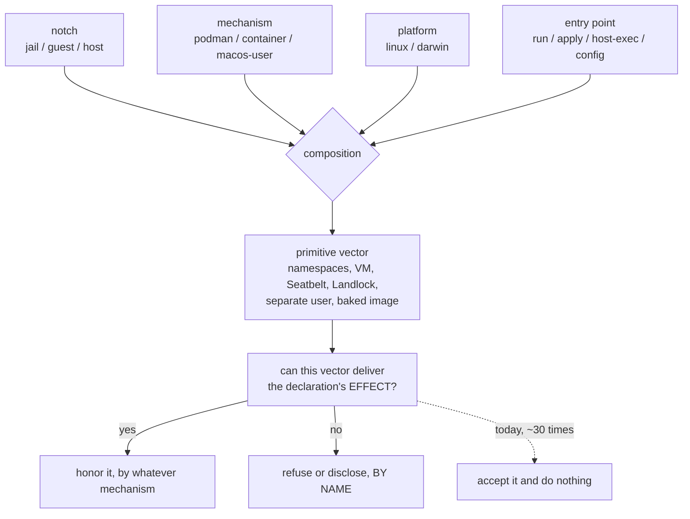

# One declaration, many mechanisms — and the four inputs that decide which one runs

**Status:** DESIGN, 2026-09-12 — a catalog, amended after review and **partly built since**.
[OQ-DP1](#decision-ledger) through [OQ-DP4](#decision-ledger) are ruled and compacted,
[OQ-DP6](#decision-ledger) dissolved rather than being answered, and [OQ-DP5](#OQ-DP5) and
[OQ-DP7](#OQ-DP7) were ruled on 2026-09-13. **Two are live again as of 2026-09-21** — [OQ-DP8](#OQ-DP8) and [OQ-DP9](#OQ-DP9), both owed back by [`jail-daemon-on-macos-user-plan.md`](jail-daemon-on-macos-user-plan.md) against [`DP-L3`](#decision-ledger), which approved a mechanism without settling how its argv resolves or whether it runs confined. Every code claim below
was verified against the tree on 2026-09-12 at `55a77e79`, by symbol — which is a date, not a
guarantee: **re-check a symbol before reusing it**, because the fixes that landed in the days
after are exactly what invalidate a negative without touching this file
([§9](#9-where-the-sweep-was-wrong) ends with the ones that expired that way). The sweep rows the
tree contradicts are corrected in [§9](#9-where-the-sweep-was-wrong). **[§5](#5-silently-broken)
was re-swept row by row on 2026-09-21** and every row whose status MOVED says so with a date; an
undated cell is the original 2026-09-12 one, re-checked and still live. Two turned out never to have
been true and joined [§9](#9-where-the-sweep-was-wrong)'s list.

**MOST OF THE BUILD ORDER IS BUILT, and this header said "nothing" for two days after it
was.** The catalog proposed nothing until
[§5.6](#56-one-declaration-two-mechanisms-the-argv-rewrite-and-the-shell-alias) was added on
2026-09-13: its [DP-B42](#562-the-rows) shipped with it — the in-jail shell alias now discloses
itself, from the same injector and the same record the host's argv rewrite uses. **So did most
of [§11](#11-what-i-would-build-in-order)**, whose own note is the authority: steps 1, 2, 3, 5
and 6 all landed that day, and the per-row status markers in
[§5](#5-silently-broken) and [§6](#6-alignable-with-the-mechanism-and-its-cost) were not all
updated to match. Read [§11](#11-what-i-would-build-in-order) before treating any row here as
open work.

> **In short.** The principle holds, and the tree proves it — but it quantifies over a
> composed **primitive vector**, not over a backend, and that vector is computed from
> four inputs in exactly one function, for display only. Everything else reads one input
> and guesses the rest.

**Why it matters.** A declaration that is accepted, validated and then not honored with
nothing said is a defect however the principle is settled. The sharpest instances do not
merely omit: they make the agent's own briefing assert the opposite of what ran.

**The shape.** One principle ([§1](#1-the-principle-and-what-it-does-not-say)), four inputs
([§2](#2-four-inputs-not-two-axes)), four dispositions
([§3](#3-the-four-dispositions-and-how-to-walk-the-catalog)), and a catalog keyed on
`(declaration × site)` rather than on a backend.

**Cost.** Of the four rulings landed on 2026-09-12: one is free (vocabulary), one is a
threading change, one is roughly ten lines, and one is a delivery mechanism that did not
exist then and was built on 2026-09-13 ([§11](#11-what-i-would-build-in-order)). The two live
questions, [OQ-DP8](#OQ-DP8) and [OQ-DP9](#OQ-DP9), decide how a `macos-user` jail daemon's
argv resolves and whether it runs confined. Nothing here builds the `guest` notch.

**Start at [§5](#5-silently-broken)** — the bucket that is a defect whichever way the
principle is settled.

**The original seven are ruled; two filed later are not.** Four on 2026-09-12, a fifth
dissolved the same day, and [OQ-DP5](#OQ-DP5) and [OQ-DP7](#OQ-DP7) on 2026-09-13 — all in the
[Decision Ledger](#decision-ledger). [OQ-DP8](#OQ-DP8) and [OQ-DP9](#OQ-DP9), filed 2026-09-21,
are [open](#open-questions); everything else is build order, not design.

**Reads with:** [`backend-parity.md`](backend-parity.md) (the same idea on ONE input; it owns
the backend census and its own questions, which this doc does not re-open),
[`macos-user-nix-and-features.md`](../reference/macos-user-nix-and-features.md) (the authority
for every macos-user row),
[`../reference/macos-user-home-tiers.md`](../reference/macos-user-home-tiers.md) (its
[Seatbelt section](../reference/macos-user-home-tiers.md#seatbelt-does-the-read-only-half-of-a-bind-and-the-launcher-does-the-other)
contradicted `render.refusalReasons`, and [OQ-DP4](#decision-ledger) ruled in its favour),
[`environment-manager-plan.md`](../plans/environment-manager-plan.md) (Phase 7, the only
unbuilt phase), [`host-render-target.md`](host-render-target.md) (`render.FieldSet`, the
per-notch census this generalises).

> [!NOTE]
> **Scope, and the title's word.** The `guest` case and the macos-user case — the two the
> maintainer asked for — are catalogued exhaustively. Apple Container appears only as
> PRECEDENT or CONTRAST, because [`backend-parity.md`](backend-parity.md) owns it; podman and
> the `host` notch appear where they are load-bearing. *"Mechanism"* in the title is the
> maintainer's own word from the principle below, and since [OQ-DP1](#decision-ledger) it is
> this doc's word for the second input too
> ([§2.6](#26-the-two-words-and-why-the-pair-is-not-named)).

---

## 1. The principle, and what it does not say

The maintainer stated it as one sentence:

> the implementations may vary, but the declaration should be the same, and they should
> apply equally across all the containment methods, even if they use different mechanisms.

Four numbered readings, because the rest of this doc cites them.

**P1. One declaration; honored or refused BY NAME, everywhere.** A declaration's *effect* is
delivered by whatever primitives the site can compose. Where nothing can deliver it, the site
refuses or discloses, naming the declaration. The one state that is never legal is accepting a
declaration and doing nothing.

**P2. The implementation is free; the vocabulary is not.** `packages:` means the same thing
on three backends and is delivered three ways — a baked OCI image, a boot-written symlink farm
over the mounted nix store, a native darwin `buildEnv`. That is the principle working, and it
is the strongest existing proof it is achievable ([DP-A1](#4-aligned-and-why-the-catalog-leads-with-it)).

**P3. Silence is the defect the principle exists to name.** The repo has written this down
twice already and given it no mechanism.
[`macos-no-vm-direction.md`](../reference/macos-no-vm-direction.md): *"every feature a container
implements with a flag or a mount must either work natively or say it does not."*
[`macos-user-nix-and-features.md`](../reference/macos-user-nix-and-features.md): *"'Absent and
silent' is the defect; 'absent and loud' is an honest backend."* Both are enforced today by a
sweep and by per-backend `if`s, which is why [§5](#5-silently-broken) is as long as it is.

**P4. "Equally" is bounded by WHO MAY AUTHOR the declaration.** This is the one place the
principle is wrong if taken literally, and the tree is right. `yolo host -- <cmd>` reads the
user-scope config and nothing else, because composing a host process's environment from an
agent-editable workspace `yolo-jail.jsonc` is arbitrary code execution on the user's real
machine, reached by cloning a repository (`config.UserScopeConfigOrEmpty`, `cli.composeHostLaunch`).
Workspace scope there is **inexpressible**, not merely refused. Any rule phrased as *"the same
declaration does the same thing at every notch"* argues for that RCE at least once, so P4 is a
clause of the principle, not an exception to it.

### What the principle does NOT say

- **Not that every site grows every feature.** [`backend-parity.md`](backend-parity.md#7-what-this-does-not-propose)
  already rules this and it stands: *"the goal is that a setting stops lying, not that every
  backend grows every feature."*
- **Not that a divergence is a bug.** Most of
  [§7](#7-ruled-divergent-and-the-ones-i-would-re-open) is ruled terminal with reasoning that
  survives scrutiny, and one
  divergence is *stronger* than what the container backends give
  ([DP-A2](#4-aligned-and-why-the-catalog-leads-with-it)).
- **Not that silence is always wrong.** Where the declared OUTCOME is already true, silence is
  correct — `writable_home_dirs` on a backend whose home is writable in one bind has nothing
  to say ([DP-A11](#4-aligned-and-why-the-catalog-leads-with-it)).
- **Not "add a warning everywhere."** That collides with
  [OQ-BP-3](backend-parity.md#open-questions), which is live and owned elsewhere:
  *"a warning people learn to skip is worse than none."* See [OQ-DP5](#OQ-DP5).

### Defined terms

| Term | Status | What it is, and what it is not |
| :--- | :--- | :--- |
| **notch** | existing | `jail` / `guest` / `host` — the confinement dial. `render.Kind`, `config.Confinement`. NOT a runtime. |
| **mechanism** | existing, promoted | `podman` / `container` (Apple Container) / `macos-user`. Already the parameter name in `jailcontent.ConfinementProfile`; [OQ-DP1](#decision-ledger) ruled it one of this doc's two words. Elsewhere in the tree it is spelled "backend" or "runtime" and those spellings are not being chased. NOT a container: `macos-user` runs no runtime. |
| **primitive vector** | **existing — never this doc's to promote** | the composed set the inputs yield: `PrimNamespaces`, `PrimVM`, `PrimSeatbelt`, `PrimLandlock`, `PrimSeparateUser`, `PrimBakedImage` — the contents of a `render.Profile`, ordered by `render.PrimitiveOrder`. ⚠ The phrase is already written in three packages (`render/confinement.go`, `cli/describe.go`, `jailcontent/briefing.go`), so an earlier draft of this table marking it "promoted here" was wrong. It names what the composition OUTPUTS, never the pair of inputs, which is exactly why it is not the umbrella [OQ-DP1](#decision-ledger) refused. It is what [P1](#1-the-principle-and-what-it-does-not-say) quantifies over. NOT a config surface — only the three named presets are selectable. |
| **entry point** | **not a term — plain words** | which verb is running: `yolo -- cmd`, `yolo apply`, `yolo host -- cmd`, `yolo config diff`. A real input ([§2](#2-four-inputs-not-two-axes)) that [OQ-DP1](#decision-ledger) ruled stays unnamed; the doc says "which verb is running" and means nothing more by it. |
| **site** | *(coined here — a table key, not an axis)* | one combination of the four inputs: the thing a declaration is honored or not honored AT, and the catalog's row key. It names a CELL, which is why it survives [OQ-DP1](#decision-ledger)'s refusal to name the notch-and-mechanism PAIR; if it ever reads as architecture rather than bookkeeping, delete it and write "one row". NOT a synonym for "backend": `yolo apply` at `guest` and `yolo -- cmd` at `guest` are two sites. |
| **carve-out** | *(this doc's sense)* | a site that accepts a declaration and does not deliver its effect. ⚠ NOT `AGENTS.md`'s sense, where a CARVE-OUT is a structural blindness of an *instrument* ("a nested jail cannot see the rootless class"). Both senses appear in this repo; this doc always means the first. |

---

## 2. Four inputs, not two axes

The brief posed this as two axes — notches and backends — and said a carve-out can sit on
either. That is right as far as it goes and it is not far enough. **The tree already computes
the answer from four inputs, in exactly one function, and uses it for display only.**

```go
// internal/cli/describe.go — sole caller: describeMain
func confinementProfile(notch render.Kind, mechanism string, isMacOS bool) render.Profile {
	switch {
	case notch == render.KindHost:                          return render.HostProfile()
	case slices.Contains(paths.NativeRuntimes, mechanism):  return render.GuestProfileMacOS()
	case notch == render.KindGuest:
		if isMacOS { return render.GuestProfileMacOS() }
		return render.GuestProfileLinux()
	default:                                                return render.JailProfile(mechanism == "container")
	}
}
```

Read the branch order. **The mechanism outranks the notch in two of four arms.** A `macos-user`
launch at `confinement: jail` gets the *guest* vector. An Apple Container jail gets `PrimVM`
where a podman jail gets `PrimNamespaces`. The platform decides only the arm no mechanism
names. Its own doc comment states the rule and names the third input: *"MECHANISM FIRST,
platform only as the fallback, because `runtime` is what a launch will actually use and a
primitive is a property of the backend, not of the machine reading the config."*

| Input | Values | Spelled today as | Authority |
| :--- | :--- | :--- | :--- |
| **Notch** | jail / guest / host | `render.Kind`, `config.Confinement` | `render.ProfileFor`, `render.Target.Fields`, `render.modeCensus` |
| **Mechanism** | podman / container / macos-user | `runtime`, "backend" | `paths.SupportedRuntimes` vs `paths.NativeRuntimes` |
| **Platform** | linux / darwin | `o.IsMacOS`, `paths.IsMacOS` | `hostcas.CodeMacOS`, `run.kvmArgs`, `run.gpuHostAvailable` |
| **Entry point** | `yolo -- cmd` / `yolo apply` / `yolo host -- cmd` / `yolo config diff` | *unnamed, and ruled to stay that way* | none — [§2.4](#24-the-entry-point-is-an-axis-and-it-has-no-name) is the evidence it exists |

### 2.1 The platform is a separate input, and one decider already spells it that way

`internal/hostcas` carries `CodeBackend` ("not podman — Apple Container and macos-user both
land here") and `CodeMacOS` ("never done on macOS: the jail is Linux in a VM") as two distinct
refusal codes with two distinct reason strings, plus `CodePlatform` for a host/jail arch
mismatch. Three codes, three inputs, one decision. Flatten them and `YOLO_RUNTIME=podman` on a
Mac reads as a fix when it is not. `run.kvmArgs` gates on `o.IsMacOS || rt == "container"` — a
disjunction of two inputs, which is why *macOS podman* also drops it.

### 2.2 The notch is enforced by nothing on the launch path

`config.ResolveConfinement` has exactly three production callers: `cli.describeMain`,
`cli.applyMain`, and `run.(*Options).prepare`'s `jailcontent.BriefingInput{Confinement: …}`.
The last is **briefing prose only**. The actual enforcement — `render.FieldSet`,
`render.modeCensus` — is reached only from the host-render path. A `rg` for
`guest|Guest` over `internal/cli/run` with tests excluded returns only pasta's
`--map-guest-addr`.

So a `(notch, mechanism)` matrix would mark `confinement` *Honored* on all three mechanisms and
be wrong about all three.

### 2.3 `NoContainer` was the mechanism input smuggled into a notch-shaped function — FIXED 2026-09-13

> [!NOTE]
> **Built 2026-09-13, and further than the ruling asked.** `cli.confinementProfile` is
> DELETED rather than aligned: its body is now `jailcontent.ConfinementProfile(notch,
> mechanism, isMacOS)`, called by both `describeMain` and `confinementHeader`, so the two
> surfaces are literally one function and divergence is unrepresentable rather than merely
> tested. `BriefingInput.NoContainer` is replaced by `Mechanism` + `IsMacOS`.
>
> ⚠ **The unification surfaced a fail-open the ruling did not mention.** The old `default:`
> arm handed an UNKNOWN notch `JailProfile` with autonomy ON. `cli.describe` errors out
> before an unresolvable notch reaches it; the briefing does not. `KindUnset` now resolves to
> the host preset, pinned by `TestBriefingUnknownNotchFailsClosedWhateverTheMechanism`.

`jailcontent.confinementHeader(confinement string, noContainer bool)` takes both inputs and
acts on the second in exactly one of five arms (`known && notch == render.KindJail && noContainer`).
The sweep measured this on 2026-09-12 by calling the function directly under `go test -overlay`;
I re-derived it here by reading the five arms and `jailcontent.enforcementLines`, which is why
the middle is elided rather than pasted:

```text
confinementHeader("jail", true)   // the macos-user arm

  # YOLO Environment — jail (native, no container)

  You are confined by a Seatbelt sandbox on the human's REAL machine, not by a
  container. There is no image and no jail to restart.
  ...
  Jail tooling: `yolo --help`; config reference: `yolo config-ref`.

  Enforced by:
  - namespaces — kernel-isolated filesystem, processes, PIDs and network
  - a baked image — a nix-built package set, not your machine's PATH
  ...
  Jail tooling: `yolo --help`; config reference: `yolo config-ref`.
```

Two lines of one paragraph disagree, and the "Jail tooling" line prints twice — the branch body
carries it and `jailcontent.enforcementLines` appends its own. The vector comes from
`render.ProfileFor(notch)`, the table whose own doc comment forbids exactly this use: *"When
`describe` prints the vector (plan Q7) it must source it from the backend that knows the
platform, NOT from here."* And `confinementHeader("guest", true)` and
`confinementHeader("guest", false)` are **byte-identical** — the guest arm never reads the
parameter — as are the two `host` calls.

These are rows [DP-B17](#53-both-axes-at-once-the-notch-the-briefing-and-the-render-target),
[DP-B18](#53-both-axes-at-once-the-notch-the-briefing-and-the-render-target) and
[DP-B19](#53-both-axes-at-once-the-notch-the-briefing-and-the-render-target), and they are
settled. **[OQ-DP2](#decision-ledger) ruled MECHANISM FIRST on 2026-09-12**, exactly as
`jailcontent.ConfinementProfile` already decides it, *and* ruled that the mechanism be threaded into the
briefing so both printing surfaces read one function. `run.prepare` already computes the
mechanism — it is what sets `NoContainer` — so this is a threading change, not a new input.

### 2.4 The entry point is an axis, and it has no name

Same declaration, same notch, same mechanism, opposite behaviour, decided only by which verb
is running:

- `confinement: guest` → `cli.applyMain` **refuses** with rc 1 naming Phase 7; `run.Run`
  **silently accepts**, starts an ordinary container jail, and writes a briefing telling the
  agent it is not in one. One notch, one mechanism, two verbs, and one of them lies.
- `packdecl.KindLaunch` at the host notch → `yolo host apply` refuses with a reason that names
  `yolo host -- <program>` as the remedy; `cli.hostExec` — that very verb — does not call
  `packload.InjectLaunchFlags` at all. Its two production call sites are `run.Run` and
  `entrypoint.packAliases`, and both are inside the jail's own story
  ([§5.6](#56-one-declaration-two-mechanisms-the-argv-rewrite-and-the-shell-alias)).
- `render.hostUnimplemented`'s own doc comment concedes the axis in as many words:
  *"It is a limit of this COMMAND, not of the notch."*

### 2.5 The composition, drawn



**The principle quantifies over the vector, not over any one input.** That is why
`workspace_readonly` is honorable on macos-user (Seatbelt's `readonlyDenies` is a real
write-deny primitive) and *not* honorable on Apple Container (a VM primitive gives no per-path
read-only) — an inversion of the intuition that carve-outs track isolation strength, and one
no `(notch, backend)` table can express.

### 2.6 The two words, and why the pair is not named

**RULED 2026-09-12, and the ruling goes further than I proposed.** I argued for four words and
no umbrella. The answer was two words and no coinages at all:

> Do we need to name it? It seems like some things are going to be decided based on the notch.
> Some things are going to be decided based on the confinement profile. I'm not sure things will
> be decided based on both of them … this is kind of like architecture and operating system. And
> we don't have a name for those two combined.

The analogy is the argument, and it holds up when pushed on. Nobody names (architecture, OS);
what *does* get a name is what the pair YIELDS — a target, a platform. **The tree already has
that word, and I had not noticed I was re-coining it.** *Primitive vector* is written in
`render/confinement.go`, `cli/describe.go` and `jailcontent/briefing.go`; the maintainer's own
*"confinement profile"* is `render.Profile`, the value `jailcontent.ConfinementProfile` returns. So the
vocabulary settles by subtraction rather than by invention:

| What it is | What we call it | Where the word comes from |
| :--- | :--- | :--- |
| the confinement dial | **notch** | `render.Kind`, `config.Confinement` |
| what actually runs | **mechanism** | `jailcontent.ConfinementProfile`'s own parameter name |
| the machine | *platform* — a plain word, nothing to decide | — |
| which verb is running | *nothing, deliberately* | — |
| what those compose to | **primitive vector**, i.e. a `render.Profile` | already written in three packages |
| the notch and mechanism as a pair | **nothing** | ruled — the evidence is below |

**The premise is falsifiable, so I checked it against my own catalog before accepting it.** The
maintainer's load-bearing clause is *"I'm not sure things will be decided based on both of
them."* Three rows in this catalog look like `(notch × mechanism)` cells —
[DP-B17](#53-both-axes-at-once-the-notch-the-briefing-and-the-render-target),
[DP-B19](#53-both-axes-at-once-the-notch-the-briefing-and-the-render-target), and the
macos-user-at-`jail` statement in [§8](#8-the-guest-notch-is-not-a-backend) — and **all three are
the same function**: `jailcontent.confinementHeader(confinement, noContainer)`, the only one in
the tree that takes both inputs. It is also the one that is WRONG, which is what
[OQ-DP2](#decision-ledger) deletes.

The function that is right resolves them by **precedence, never as a cell.**
`jailcontent.ConfinementProfile`'s four arms are decided by the host notch, then by a native mechanism,
then by the guest notch, then by a mechanism sub-choice — **every arm reads one input, and the
other only breaks the tie.** Two things follow, and the second is why this is not a vocabulary
quibble: the premise holds on the data, and a word for the pair would have had exactly one
referent in the whole tree — a defect.

What the no-umbrella rule buys is unchanged from the leaning: a carve-out on the notch costs
Phase 7 and a carve-out on the mechanism costs a delivery primitive, and one word makes those
look like one decision. This doc's filename follows from the same place — the brief's default
named "containment", which is the flattening word.

---

## 3. The four dispositions, and how to walk the catalog

| Disposition | Meaning | Does the maintainer owe a decision? |
| :--- | :--- | :--- |
| **Aligned** | the effect is delivered, by whatever mechanism the site composes | No — these are the precedent bank the rulings are written against |
| **Ruled divergent** | not delivered, and the reason is written down and survives scrutiny | No, except the ones in [§7](#7-ruled-divergent-and-the-ones-i-would-re-open) I would re-open |
| **Alignable** | not delivered; a mechanism and its cost are both named | Yes — approve or decline the cost |
| **Silently broken** | accepted, then not delivered, with nothing said | **Not a design decision** — these are defects however the principle is settled. Approve the fix, or say why not |

These answer *what does the maintainer do about it*. They are **not**
[`backend-parity.md` §3](backend-parity.md#3-the-dispositions--the-most-important-section)'s,
which answer *what does this site do*. The mapping:

| backend-parity says | this doc says | when |
| :--- | :--- | :--- |
| Honored, HonoredBy | Aligned | always |
| Warned | Ruled divergent, or Alignable | depending on whether the reason is terminal |
| Refused | Aligned | a refusal that names the declaration IS P1 satisfied |
| Dropped | Ruled divergent | the silence is the ruling — a `Dropped` cell whose reason does not survive scrutiny is an `Alignable` |
| NotApplicable | — | no declaration was made; nothing to align |
| *(silent absence with no cell at all)* | Silently broken, or Aligned | Aligned only where the declared OUTCOME is already true |

**How to walk this.** Rows carry stable ids: `DP-A#` aligned, `DP-D#` ruled divergent, `DP-L#`
alignable, `DP-B#` silently broken. Read [§5](#5-silently-broken) first and rule the rows;
most of them need approval, not a decision. The six things that need a *decision* are the
[Open Questions](#open-questions), and each says which rows it closes — rule those six and the
catalog mostly settles itself. Do not expect one question per row: forty undifferentiated
questions is an unrulable document, which is why there are six.

> [!WARNING]
> **Guest is never flattened into the mechanisms.** *"Not built yet"* and *"ruled not to"* are
> different states. Every row whose blocker is the unbuilt `guest` notch is marked
> **[Phase 7]**, and [§8](#8-the-guest-notch-is-not-a-backend) is where that distinction is
> argued rather than merely marked.

---

## 4. Aligned, and why the catalog leads with it

A catalog of refusals with no successful case in it reads as *"the principle is
unachievable."* It is not, and these are the rows a ruling should be written **against**
rather than about.

| id | Declaration and site | Why it is aligned |
| :--- | :--- | :--- |
| **DP-A1** | `packages:` — every mechanism | **Three deliveries, one key**: baked OCI image (podman default), boot-written symlink farm over the mounted store (`entrypoint.storePackagesFarm`, opt-in via `run.storePackagesEligible`), native darwin `buildEnv` (`darwinpkg.MaterializeDarwin`). The strongest existing proof of [P1](#1-the-principle-and-what-it-does-not-say). |
| **DP-A2** | `workspace_readonly` — macos-user | Honored by a different primitive: `macosuser.SeatbeltProfile`'s `readonlyRels` renders `(deny file-write* (subpath …))`. **Stronger** than the container backends' 0444 DAC, which a root agent bypasses. The paradigm case that "no bind mounts" is not a terminal reason. |
| **DP-A3** | every single-FILE `:ro` bind — Apple Container | `run.acMaterialize` copies into the workspace state tree at 7+ call sites, and the class is pinned by an OUTCOME test (`TestReadsHostGrantsAreMaterializedOnAppleContainer` asserts the destination, not that the helper was called). |
| **DP-A4** | `platforms: ["linux"]` on a `packages:` entry | The only place a **user** can declare "absent here is correct", validated as a closed set, with everything else fatal (`config.EffectivePackages`, `macosuser.RunMacosUser`'s skipped-package arm). The generalizable move — see [OQ-DP5](#OQ-DP5). |
| **DP-A5** | `files` — host notch | `entrypoint.RenderHostFiles`: exclusive ownership in a jail becomes per-path refuse-if-the-user-owns-it on a real home, reported per file. One declaration, two ownership postures, the difference stated where the code makes it. |
| **DP-A6** | the `guest` mode policy | `render.modeCensus[{kind: KindGuest}]` is `UndecidedModes(…)`, so `ModeSet.Mechanism` answers `("", false)` for every declaration and `entrypoint.RenderHostPack` emits `refused: <reason>`. A deliberate hole that refuses **by name**, pinned by `TestEveryNotchHasAModeCensus`. **[Phase 7]** |
| **DP-A7** | the host content-addressed cache alias | `hostcas.decide` gives every decline a CODE, a reason string, a banner line (`run.noteHostCASAlias`) and a `yolo stores` row marked "not yolo's" — and none can refuse a launch. The best-shaped decline in the tree. |
| **DP-A8** | the nested-launch inherited config | `run.canNest` is `rt == "podman"`; where nesting is impossible the file is **genuinely not written** rather than written-and-ignored. The design explicitly rejects the shape most silently-broken rows use. |
| **DP-A9** | `network.mode` — every mechanism | `run.appliedNetMode` is ONE predicate answering for the argv, the human warning, the agent briefing and the port gate, so they cannot disagree. Its doc comment records that they previously did, in both directions, in four spellings. |
| **DP-A10** | `render.KindGuest` has no constructor | The three constructors are `render.Jail`, `render.Preview`, `render.Host`. The notch is **unconstructible** rather than silently inheriting the jail's shape. **[Phase 7]** |
| **DP-A11** | `writable_home_dirs` — Apple Container, macos-user | Vacuously satisfied: the declared OUTCOME (the path is writable) is already true, so silence is correct. Keep this row so it is not "fixed". |
| **DP-A12** | `confinement: guest` — `yolo apply` | Refuses with rc 1: *"apply at the guest notch is not built yet (env-manager plan Phase 7 — the LSM-confined backend)."* The sentence [OQ-DP3](#decision-ledger) ruled to reuse verbatim already exists. **[Phase 7]** |
| **DP-A13** | pack `loophole` — host notch | `render.refusalReasons[KindLoophole]` is a hand-written INVERSE reason: the counterparty is missing, not the mechanism. The bar for what a refusal message should read like. |

---

## 5. Silently broken

**Every row here is a defect whichever way [P1](#1-the-principle-and-what-it-does-not-say) is
settled**: a declaration is accepted, validated, and then not honored, with no launch line, no
briefing line and no refusal. Several are worse than an omission, because a second surface
asserts the opposite of what ran — those are marked **⚠ asserts the opposite**.

> [!IMPORTANT]
> **MOST OF THIS SECTION SHIPPED, AND A ROW WHOSE STATUS CHANGED CARRIES A DATED MARKER SAYING
> SO.** None did until 2026-09-21: the cells described the tree at `55a77e79` in the present tense
> while nine days of fixes landed, and the only record of which rows were closed was
> [§11](#11-what-i-would-build-in-order)'s warning note. **That note is no longer the
> authority — the rows are**, each closed one naming the date and commit that closed it. **An
> UNDATED cell is the original 2026-09-12 one, still live**, carried forward unchanged because the
> re-sweep found it still true; read it at its own date, not at the re-sweep's. Two rows turned out never to have been true
> ([DP-B13](#52-apple-container-the-silent-absences-nobody-chose),
> [DP-B15](#52-apple-container-the-silent-absences-nobody-chose)) and one new instance was added
> ([DP-B45](#55-doc-drift-the-same-failure-in-a-different-file)). Still check the symbol before
> reusing a row: for the macos-user rows the arm to look for is `paths.NativeRuntimes`, which
> `run.appliedCtxMounts`, `run.briefedResourceLimits` and `run.sharesLauncherNetns` all have
> now, and the human-facing half is whatever `rg -n 'noteMacosUser' internal/cli/run` returns
> ([§5.1](#51-macos-user-read-by-nobody-warned-by-nobody)). **[§6](#6-alignable-with-the-mechanism-and-its-cost)'s
> `DP-L#` rows are the half that did NOT get this sweep**: only DP-L1, DP-L2 and DP-L4 carry a
> BUILT marker, while DP-L6, DP-L7, DP-L8, DP-L9, DP-L10 and DP-L14 all shipped — read them
> through the B-row they close, not as open work.

### 5.1 macos-user: read by nobody, warned by nobody

The complete set of config keys `internal/macosuser` reads is `workspace_readonly`
(`macosuser.BuildRunPlan`), `per_side_paths` / `resources` / `cache_relocations`
(`macosuser.buildPlan`), `security` (`macosuser.securitySection`) and `macos_log`
(`macosuser.macosLogMode`). The launcher's own notice block WAS
`run.(*Options).noteMacosUserContentGaps` plus `run.(*Options).noteMacosUserHostByteGaps` —
skills-and-briefings, `mcp_presets`, pack `reads-host` and source-bearing `host_files` — and
this paragraph ended *"Everything below is in neither list"*, **which is no longer true of
DP-B1, DP-B2, DP-B3, DP-B4 or DP-B7.** That block has since grown four printers, every one called from the
macos-user arm of `run.Run` and nowhere else (hoisting one would double-warn on a macOS podman
or Apple Container launch, whose own warnings still fire from the assembler), so
`rg -n 'noteMacosUser' internal/cli/run` is the list and this sentence is not:
`noteMacosUserCtxMountGaps` (2026-09-16, `07cc6abc`) names config `mounts` and pack `mount`
grants, `noteMacosUserPlatformGaps` and `noteMacosUserPortKeys` (2026-09-13, `13dd68c4`) name
`devices` / `gpu` / `kvm` and the two port keys, and `noteMacosUserJailDaemonDeclines`
(2026-09-18, `f6387968`) declines each declared jail daemon by name and argv.

**This section's own title is HISTORICAL, and kept only because every cross-reference in the
corpus is its anchor.** *"Warned by nobody"* was true of every row below when it was written; the
rows where it is still true are [DP-B5](#51-macos-user-read-by-nobody-warned-by-nobody),
[DP-B9](#51-macos-user-read-by-nobody-warned-by-nobody) and
[DP-B10](#51-macos-user-read-by-nobody-warned-by-nobody) — and each of those is a stated
skip rather than an unnoticed one.

| id | Declaration | What actually happens | Evidence, by symbol |
| :--- | :--- | :--- | :--- |
| **DP-B1** | config `mounts` | **FIXED IN TWO WAVES — the briefing half 2026-09-13 (`c2591587`, [DP-L7](#6-alignable-with-the-mechanism-and-its-cost)), the human half 2026-09-16 (`07cc6abc`).** Still no `/ctx` mount — delivery is refused, not built ([DP-D15](#7-ruled-divergent-and-the-ones-i-would-re-open)) — but nothing asserts one, and the launch names every entry it dropped. | `run.appliedCtxMounts` now returns nil for `inStrSlice(paths.NativeRuntimes, rt)` as well as for `roBindsUnsupported(rt) != ""`, so `mountDescriptions` reaches `jailcontent.BriefingContent` empty. ⚠ **Both briefing sites are closed, not one**: the `## Limitations` bullet is conditional on `len(in.MountDescriptions) > 0` (`jailcontent/briefing.go`, the *"DP-B1's SECOND briefing site"* comment), so a jail with no `mounts` is told *"No sudo/root."* and nothing about `/ctx`. The human's line is `run.noteMacosUserCtxMountGaps`, one warning naming each declared entry at the destination it would have taken, with COPY as the reason. What was wrong: the predicate keyed on `container` alone and the bullet was unconditional. `internal/cli/config_ref.txt`'s `mounts` entry always carried the line (*"macos-user has no bind mounts at all."*). |
| **DP-B2** | pack `mount` grants | **THE SILENCE IS FIXED (2026-09-16, `07cc6abc`); THE BYTES STILL DO NOT CROSS.** A human who approved this grant against the word *read-only* at `pack install` still gets no bytes, but now gets a notice naming the grant, the pack and both paths. | `run.hostMountArgs` is still reached only from the container assembler. The warning is the pack half of `run.noteMacosUserCtxMountGaps`, walking `p.HonoredMounts()` and sharing the config-`mounts` reason (one fact: no container, so no bind; a copy does not scale to an arbitrary directory). ⚠ **ONE LIVE CONTRADICTION SURVIVES, and the code says so at the site**: `run.notePackHostAccess` classifies a `mount` as a host READ, so the same launch's disclosure banner announces bytes that never cross — a disclosure of a read that does not happen, which the banner is where it gets fixed. The single-FILE form of a `mount` is a copy this mechanism would scale to; [DP-D15](#7-ruled-divergent-and-the-ones-i-would-re-open) rules only the directory-shaped delivery out. The Apple Container half of this row was warned on 2026-08-24 ([`backend-parity.md` §5](backend-parity.md#5-what-is-already-fixed-2026-08-24), defects 11-12). |
| **DP-B3** | `network.ports`, `network.forward_host_ports`, and `network.mode` with them | Nothing published, nothing forwarded, no line — **⚠ asserts the opposite four ways**: bridge mode, *"Reach the host at `host.containers.internal`"* (the parenthetical address that stood here until 2026-09-16 was itself wrong on two of three host stacks and is gone), a port map that is false, and the caveat *"a `127.0.0.1` listener in here is not publishable"* exactly inverted (here a loopback listener IS the host's). | **FIXED 2026-09-13** by [DP-L2](#6-alignable-with-the-mechanism-and-its-cost); what was wrong: `run.sharesLauncherNetns` returned false for anything that was not `network.mode: "host"` or podman-in-podman, so `run.appliedNetMode` returned the configured mode and `run.briefingPortsFor` rendered both lists. It now answers true for `paths.NativeRuntimes`. ⚠ This row used to read *"a native process CAN bind a port, so 'publish these' has a meaning here that nothing delivers"* — **half right, and the wrong half is the half that decides the disposition**: [§5.1.1](#511-dp-b3-by-entry-form-and-why-the-remedy-is-not-refusal). Fix: [DP-L2](#6-alignable-with-the-mechanism-and-its-cost). |
| **DP-B4** | `devices`, `gpu`, `kvm` | **FIXED 2026-09-13** (`13dd68c4`) by [DP-L10](#6-alignable-with-the-mechanism-and-its-cost); what was wrong: silent — not even the *"not supported on macOS"* warning the container path prints. | `run.deviceArgs`, `run.kvmArgs` and `run.gpuArgs` are still invoked only from `run.assembleRunCmd`, below the `rt == "macos-user"` return in `run.Run`; the line comes from `run.noteMacosUserPlatformGaps` instead, one per DECLARED key and none for a key the config never mentions. ⚠ **DP-L10's "the sentences are written" cost was wrong**, and that is why this is not the container string reused: *"not supported on macOS"* is a PLATFORM claim, true of a macOS podman or AC (a Linux VM cannot see a host USB device) and false here, where there is no container and the key is read by nothing. Copying it would have asserted the wrong reason on the one backend whose reason is structural. `deviceLabels` is shared between the two printers; the sentences are not. |
| **DP-B5** | `ephemeral_storage` | No reader anywhere in `internal/macosuser`; no reference sentence for this backend either. | `run.ScratchMountArgs` is called only from the podman arm of `run.assembleRunCmd`. The key names container scratch backing and there is no container, so the fix is one reference sentence, not a mechanism. |
| **DP-B6** | `resources`, the AGENT half | **FIXED 2026-09-13** (`c2591587`) by [DP-L8](#6-alignable-with-the-mechanism-and-its-cost); what was wrong: the human was warned that the caps are ignored while the agent was told they are kernel-enforced, in the same launch. | `run.briefedResourceLimits` returns nil for `inStrSlice(paths.NativeRuntimes, rt)`, so the resources line does not render and `yolo-cglimit` is not offered to an agent with no delegate to talk to. It used to return the configured values for any `rt != "container"`, and `run.refreshJailBriefings` runs on the macos-user arm before dispatch. The argv-side `run.appliedResourceLimits` is deliberately untouched — never reached on this backend, and a briefing-only defect is fixed in the briefing's own projection. |
| **DP-B7** | pack `service` `jail_daemon` | **THE SILENCE IS FIXED (2026-09-18, `f6387968`); NO DAEMON RUNS.** Still no daemon and no supervisor, but a `service` pack no longer looks installed: the launch prints one `Declined:` line per declared daemon, naming it and its argv. | The composition was HOISTED out of the container-argv builder: `run.jailDaemonsFor` is called from `run.Run` (before the dispatch) and the macos-user arm passes that same payload to `run.noteMacosUserJailDaemonDeclines` — same composer, same origin gate, so the decline can neither miss a declared daemon nor invent one. `run.serviceJailDaemons` is now reached through it rather than only from `run.assembleRunCmd`. What is still absent: `entrypoint.startJailDaemonSupervisor` returns early unless `YOLO_JAIL_DAEMONS` is set, `macosuser.buildBootstrapEnv` never sets it, and `yolo-jaild` is not built for darwin at all (`flake.nix`'s `shippedBinaries` emits `bin/linux-<arch>`, and `macosuser.StageBinaryCommands` stages `yolo` alone). **This is the default configuration**: a bare `"packs": ["claude"]` declines three. [DP-L3](#6-alignable-with-the-mechanism-and-its-cost) is approved and unbuilt, blocked on [OQ-DP8](#OQ-DP8) and [OQ-DP9](#OQ-DP9) ([`jail-daemon-on-macos-user-plan.md`](jail-daemon-on-macos-user-plan.md)). |
| **DP-B8** | the guest launcher's `_refresh_servers` / `_try_materialize` | **FIXED 2026-09-13** (`13dd68c4`) by [DP-L4](#6-alignable-with-the-mechanism-and-its-cost); what was wrong: both open `command -v yolo \|\| return`, and the only `yolo` the sandbox could reach — the root-owned copy `macosuser.StageBinaryCommands` puts at `StagedYoloPath` — was on no PATH at all, so both returned at their first line on every invocation. Armed, baked with `SERVERS_ENABLED=1`, and no-op. | `macosuser.SandboxPath` appends `filepath.Dir(StagedYoloPath(""))` — DERIVED from the staged path rather than spelled, so the directory holding the binary and the directory on PATH cannot become two answers — positioned after the `packages:` store prefix and ahead of `/usr/bin`, which mirrors the container (`/bin/yolo` is a symlink into the mounted prefix and `/bin` is last), so nothing already on that PATH moves. **PATH rather than the other half of DP-L4's "or"**: the two functions are generated by `internal/entrypoint` for both backends off one template, so a macOS-only absolute literal would put a second, backend-specific answer to *"where is yolo?"* into a generator whose value is having one — and PATH is the wider fix, reaching a `requires` probe, a hook and any agent shelling out. Pinned by `TestTheSandboxCanResolveYoloByName` (a LOOKUP, not a spelling) plus its call-site half `TestTheLaunchCarriesThePathThatResolvesYolo` (`internal/macosuser/stagedyolopath_test.go`), which reads the argv's own `PATH=` and `$YOLO_DARWIN_LOGIN_PATH`. `macosuser.BuildRunPlan` still sets `YOLO_LSP_SERVERS` and `YOLO_MCP_PRESETS`. ⚠ Unmeasured on hardware, like every macos-user row here. |
| **DP-B9** | `_.python.venv` in `mise.toml` | No pre-created venv, and no message. The container path's `~/.yolo-venv-precreate.sh` is deliberately not generated here because its body would find neither `/workspace/mise.toml`'s python nor `/bin/python3` — but the omission is exactly the silent skip [`OQ-P1`](../reference/macos-user-provisioning.md#why-it-is-this-way) ruled against. | `macosuser.ProvisionSetup` runs four of the container's six steps; the reason is written down in [the stage's step table](../reference/macos-user-provisioning.md#what-the-stage-runs-and-what-it-does-not). |
| **DP-B10** | `lsp_servers`, on removal of the LAST entry | The uninstall loop never runs, so the npm package stays in the workspace prefix. Bounded and stated, never collected. | `macosuser.ProvisionNeeded` is a pure function of the config by deliberate choice (the dry-run plan must not touch disk), so removing the final entry flips it false and the loop that reads the sentinel never runs. |
| **DP-B11** | the agent briefing's macos-user home line | **FIXED 2026-09-13** (`c2591587`), narrowing rather than tightening; what was wrong: the line named the `scope: workspace` state dirs as *"SHARED by every workspace on this machine"* when since `entrypoint.InstallDarwinHomeLayout` those are exactly the directories that are NOT — symlinked into `<workspace>/.yolo/home` — and it said nothing about the ones that are. | `run.backendLimits` reads `packload.SharedDirs` (the machine tier) where it read `packload.WritableDirs`. **The stale TEST was flipped with it**, which is the half worth checking: `limitPack`'s fixture now declares `{Kind: KindState, Scope: "machine"}` and its doc comment says why the old pairing made the claim invisible, and `TestBackendLimitsDoNotCallWorkspaceStateShared` fails if the call site goes back. `jailcontent.confinementHeader`'s macos-user arm was narrowed in the same commit — it now says the ACCOUNT is shared and that `scope: workspace` dirs are linked into this workspace's sidecar. (Also no longer latent: [DP-B21](#54-the-host-notch-and-the-entry-point) is wired, so this line renders.) |

#### 5.1.1 DP-B3 by entry form, and why the remedy is not refusal

The comment on this row asked whether macos-user should **reject anything that is not
`network.mode: host`**. The premise's *fact* is right; its *remedy* is not — and the row's own
old sentence was half wrong, which is what hid the difference.

**The fact, confirmed.** Neither profile yolo emits contains a single `network*` operation —
`(allow default)` covers it, and `macosuser.SeatbeltCaptureProfile`'s doc comment says so in as
many words. Nothing in `internal/macosuser` touches a port, a bind or a listener. A macos-user
sandbox is **always** on the launcher's own stack. The third state is representable in SBPL and
unreachable in yolo: `config.validateNetwork` accepts exactly `{"bridge","host"}` and
hard-errors otherwise (`config.network.mode: expected 'bridge' or 'host'`), so no key selects a
deny-network profile and no code emits one.

| Declaration | On macos-user |
| :--- | :--- |
| `forward_host_ports: [5432]` / `"5432"` / `"5432:5432"` | **Vacuously satisfied.** The process is on the host's stack, so `localhost:5432` in the sandbox *is* the host's 5432 — there is no hop to deliver. |
| `forward_host_ports: ["8080:9090"]` | **Not satisfiable** — the rewrite needs a second loopback to land on. |
| `ports: ["3000:3000"]` | **Vacuously satisfied** in the reachability direction: binding *is* publishing. |
| `ports: ["8000:3000"]` | **Not satisfiable**, and the briefing states the false mapping verbatim. |
| `ports` read as an ENUMERATION, or `IP:HOST:JAIL` | **Void, and not vacuously.** On the container backends `-p` is the whole exposure surface and `127.0.0.1:8000:8000` pins the bind address; here every port the agent binds lands on the host's real interfaces, listed or not, and nothing pins anything. |

So this is a **briefing-truth row, not a refusal row**: on this backend the three network keys
have exactly one consumer and it is the briefing. `assembleRunCmd`'s `-p` and
`run.hostForwardPorts` both sit below the `rt == "macos-user"` return, so no socat is spawned
and no port is published today either way.

**Disposition, decided by the tree rather than by preference.**

1. **`network.mode` is never refused, at any value — it is APPLIED as host.** That is
   [DP-L2](#6-alignable-with-the-mechanism-and-its-cost) unchanged, and the comment's own
   reasoning is why: if `host` is the only mode that is true here, `host` is the right *applied*
   answer, not a precondition to demand of the user. Refusing instead fails three ways.
   `run.NewDefaultOptions` is `Options{Network: "bridge", …}`, so a launch that never mentioned
   networking would be refused. Narrowed to an explicitly-written mode it is barely better: the
   only writable non-host value IS `bridge`, so it would reject a config equivalent in effect to
   the empty one. And the Apple Container arm of `run.assembleRunCmd` already ruled this shape —
   *"Only an EXPLICIT host is warned: bridge is genuinely honored on this backend … so warning
   on the default would be noise on every launch"* — whose logic here forbids even the warning,
   because the unhonorable value is the default.
   [`OQ-CO10`](config-ownership-and-promotion.md#13-decision-ledger) settled the general case in
   the same direction: on macos-user an unsupported mechanism reports `unsupported` and is not
   refused (`run.(*Options).noteMacosUserHostByteGaps`: *"a launch is not refused for what the
   backend cannot do"*).
2. **`ports` and `forward_host_ports` are refused as KEYS, never as a launch, and only when
   non-empty.** Exact condition: `rt == "macos-user" && len(entries) > 0`, evaluated per key
   beside `run.(*Options).noteMacosUserContentGaps`, one stderr line each; the briefing half
   comes free with [DP-L2](#6-alignable-with-the-mechanism-and-its-cost). Neither key has a
   default, so the notice cannot fire on a launch that never mentioned networking — which is
   what makes it safe where a `mode` refusal is not. `run.roBindsUnsupported` is the right
   shape (refuse the *declaration*, print the reason, continue the launch), but its force does
   not carry: refusing an Apple Container `:ro` mount removes an exposure, whereas refusing
   `ports` here removes nothing, because the agent binds host ports regardless. **The message is
   the whole deliverable.**
3. **One sentence neither network paragraph says today**: that the sandbox's listeners sit on
   the host's real interfaces rather than in a namespace. The host paragraph's *"No port mapping
   needed"* is true and incomplete. Its natural home is `run.backendLimits`, which has no
   production writer ([DP-B21](#54-the-host-notch-and-the-entry-point)) — so it ships with
   [DP-L9](#6-alignable-with-the-mechanism-and-its-cost), or as a macos-user variant of the host
   paragraph.

> [!WARNING]
> **Two source comments assert the opposite of the tree, and one of them sits inside the
> function it denies.** `run.appliedNetMode`'s doc comment: *"macos-user is deliberately absent:
> Run() returns before runContainer, so neither caller ever sees that runtime."* And the "WHAT
> IS LEFT" block in `run.refreshJailBriefings`' own body (`internal/cli/run/prepare.go`):
> *"macos-user reaches none of this … that backend gets no briefing at all (OQ-BP-2), which is a
> delivery gap rather than a false sentence."* Both were true until the B-0 content fix put
> `refreshJailBriefings` on the macos-user arm of `run.Run` (`internal/cli/run/run.go:413`). The
> second is now exactly inverted — it **is** a false sentence — and it contradicts
> [DP-B6](#51-macos-user-read-by-nobody-warned-by-nobody), which is the correct one. This is the
> inverse of `AGENTS.md`'s *"the test asserts the sentence a comment makes"* class: a comment
> asserting a call site does not exist when it does, sitting exactly where a reader goes to
> decide whether this row is real.

> [!WARNING]
> **The call-site pin for this cannot represent the one backend it is wrong about.**
> `TestBriefingAndArgvAgreeOnTheAppliedNetMode` has four rows — podman bridge, podman host,
> podman-in-podman, Apple Container — and no macos-user row, and structurally cannot have one:
> it asserts through `appliedArgv` → `assembleRunCmd`, which this backend never reaches. A
> [DP-L2](#6-alignable-with-the-mechanism-and-its-cost) test must therefore be shaped as
> `run.briefingPortsFor` + `jailcontent.BriefingContent` composition, not argv comparison.

**Not settleable from here:** whether a macOS listener is reachable *in practice* from off-box —
the application firewall, `_yolojail`'s own posture, codesigning prompts. What yolo does is
settled by reading: it applies no network restriction on this backend and emits no port argv.
Any claim about real exposure needs a Mac.

### 5.2 Apple Container: the silent absences nobody chose

Included because each one is a *silent* absence **that was never decided on**, which is the
state [`backend-parity.md` §3](backend-parity.md#3-the-dispositions--the-most-important-section)'s vocabulary cannot hold.
Its `Dropped` — added after this section was written — is for a silence someone chose and can
defend; the rows below have no cell at all, which is the condition the census exists to make
unrepresentable rather than a disposition it can express.

| id | Declaration | What actually happens | Evidence, by symbol |
| :--- | :--- | :--- | :--- |
| **DP-B12** | the `<workspace>/yolo-jail.jsonc` `:ro` bind | **STILL UNGATED** — no `roBindsUnsupported` check, no `acMaterialize` fallback. ⚠ **Its severity sentence is now version-dependent and this row's old wording is wrong about it.** The wording was *"it fires only when `workspace_readonly` is set, and that key ALREADY warns by name on this backend"*; since `acROBindsFloor` (measured HONORED on `container` 1.1.0, 2026-09-14) `run.workspaceReadonlyMountArgs` warns only BELOW the floor, so on a current Apple Container nothing warns — and nothing needs to, because `:ro` is honored there. The residue is the file-shaped source, not the read-only suffix. | The `wsConfigFile` bind at the head of `run.workspaceReadonlyMountArgs`. **The two `/dev/null` shadows that used to head this row are fixed** — gated and disclosed, `run.assembleRunCmd` + `shadowbinds_test.go`. `TestNoHostHomeBindSurvivesOnAppleContainer` cannot see either class (it filters on sources under the user's HOME; `/dev/null` and a workspace path both fall outside); `TestNoAppleContainerBindHasANonDirectorySource` is the instrument that does, and it is a census over the ARGV because the divergence is an absent gate with no `rt ==` for a source census to find. Whether Apple Container DROPS or ERRORS on a single-file bind is unknowable from Linux — [`backend-parity.md` §4](backend-parity.md#4-the-proposal--a-backend-census-sibling-to-renderfieldset) residue 3. |
| **DP-B13** | `network.mode: "none"` | ⚠ **THIS ROW IS FALSE, AND WAS FALSE THE DAY IT WAS WRITTEN — no config asking for no network ever reaches a backend.** `config.validateNetwork` accepts `{"bridge","host"}` and emits `config.network.mode: expected 'bridge' or 'host'` as an ERROR (since `5ee3dbb0`, 2026-07-18), and `run.loadAndValidateConfig` prints the errors and refuses the launch before a runtime is chosen. **This file already knew**: [DP-B41](#55-doc-drift-the-same-failure-in-a-different-file) says exactly that about [`macos.md`](../guides/macos.md), so two rows of one sweep contradicted each other — the cost of reading one call site (`appliedNetMode`) and not the validator. | What survives is not a defect: `run.appliedNetMode` does return the literal `"bridge"` for `rt == "container"` unconditionally, and the container arm's warning fires only on `netMode == "host"` — which is the only non-default value the vocabulary admits, and it IS warned. The shipped mode vocabulary is two values, and the second is disclosed. |
| **DP-B14** | `ephemeral_storage` | Ruled in `internal/cli/config_ref.txt`, never said at launch. A user who left the default `"volume"` for a large download gets RAM pressure and no explanation. | `run.appleContainerBaseMounts` hardcodes the `--tmpfs` list; `run.ScratchMountArgs` is podman-arm only. `run.appleContainerBaseMounts` already proves the launcher knows how to say this — it warns once for `cache_relocations`. |
| **DP-B15** | the pack-manifest `/ctx` tree's read-only guarantee | **FIXED 2026-09-14** (`d6e7684f`), and ⚠ **the row read the defect one notch too mild**: it said the jail *"reads the live host path with no read-only enforcement"*. It could not read it at all. Apple Container emitted `YOLO_PACK_ROOT` pointing at a HOST path and no mount on the premise that the host filesystem is visible there, which issue #44's reporter disproved four ways — so NO pack tree reached the jail, no pack-declared program installed, and no autonomy launch flag rendered, while everything not needing the tree still looked provisioned. | The `in.packStaging` block in `run.assembleRunCmd` now takes an `rt == "container"` arm: `acMaterializeTree` copies the staged tree into `ws_state` (the one tree that backend binds whole) per launch, `YOLO_PACK_ROOT` names the in-jail path, and a failed copy prints the diagnosis rather than dropping silently. On podman the `:ro` bind is unchanged. What a copy loses is stated at the site: within-session integrity of the jail's own copy (a subset of what an agent can already do to its home) and the attach-time refresh a bind gives a live jail. Host-side composition never reads the copy, so next boot's grants are still decided from bytes the jail cannot reach. |

### 5.3 Both axes at once: the notch, the briefing, and the render target

| id | Declaration | What actually happens | Evidence, by symbol |
| :--- | :--- | :--- | :--- |
| **DP-B16** | `confinement: guest` or `host`, at LAUNCH | **FIXED 2026-09-13** (`13dd68c4`) per [OQ-DP3](#decision-ledger): refused, not honored and not warned; what was wrong: the value was accepted, validated, never dispatched on — a container started anyway — and the briefing told the agent *"a restricted account on the real machine, NOT a disposable container … your home is real and persists."* | `run.refuseUnbuiltNotch` is called from `run.Run` immediately after the config gate — it takes the already-loaded config — and ABOVE the backend dispatch and the repo-root gate, so no backend can miss it. It refuses BOTH values with distinct reasons: `guest` borrows `render.NotchUnbuilt("launch")` verbatim from `yolo apply --at guest`, while `host` gets its own sentence, because a notch with two working verbs (`yolo host -- <cmd>`, `yolo apply --at host`) is not *"not built yet"*. The refusal names where the value came from — the config key or the `--at` the user typed — and an unknown `--at` value exits 2 rather than defaulting to `jail`. |
| **DP-B17** | the mechanism input, in the briefing | **FIXED 2026-09-13** (`c2591587`) per [OQ-DP2](#decision-ledger), mechanism first; what was wrong: `NoContainer` was accepted as a parameter and acted on in one of five arms — MEASURED, `confinementHeader("guest", true)` and `("guest", false)` were byte-identical, and so were the two `host` calls. | `jailcontent.confinementHeader` takes `mechanism string` and derives both derived facts from `jailcontent.ConfinementProfile(notch, mechanism, isMacOS)`, whose `MechanismHasNoContainer(mechanism)` arm outranks the `guest` and `jail` notches — but not `host` or `KindUnset`, which fail closed to `HostProfile()` in the arm ABOVE it. So the mechanism changes the answer wherever a container is what differs, rather than in one arm; the `host` pair stays byte-identical on purpose (nothing contains the agent at that notch whatever the backend is, so an answer that moved with it would be the overclaim — `TestBriefingHeaderMechanismChangesTheGuestAnswer` asserts both halves). `MechanismHasNoContainer` is a function over `paths.NativeRuntimes`, not a `BriefingInput` field, because *"there is no container"* and *"what is there instead"* are one fact and supplying them apart is how DP-B19 happened. |
| **DP-B18** | the `guest` primitive vector, in the briefing | **FIXED 2026-09-13** (`c2591587`) per [OQ-DP2](#decision-ledger); what was wrong: always the LINUX spelling — *"namespaces"*, *"Landlock"* — regardless of platform, sourced from the one table whose doc comment forbids it for a printed vector. | The briefing's `enforcementLines` is now fed `ConfinementProfile`, the platform-aware twin, instead of `render.ProfileFor(notch)`: a macOS `guest` resolves to `render.GuestProfileMacOS()` (separate user + Seatbelt) and a Linux one to `GuestProfileLinux()`. `yolo describe` calls the same function for the human's copy, so the two cannot drift. (Phase 7 still owns whether a Linux `guest` LAUNCHES; the vector it would print is no longer wrong.) |
| **DP-B19** | the `jail` notch on macos-user | **FIXED 2026-09-13** (`c2591587`); what was wrong: the paragraph said *"not by a container"* and the vector under it read *"Enforced by: namespaces … a baked image"*, with the "Jail tooling" line printed twice. MEASURED — see [§2.3](#23-nocontainer-was-the-mechanism-input-smuggled-into-a-notch-shaped-function--fixed-2026-09-13). | `confinementHeader`'s `noContainer` arm reaches `enforcementLines(ConfinementProfile(…))` like every other arm — the mechanism no longer stops at the branch — and the literal's own copy of the tooling line is deleted, leaving `enforcementLines`' single append. The home sentence was narrowed in the same commit ([DP-B11](#51-macos-user-read-by-nobody-warned-by-nobody)). |
| **DP-B20** | `autonomy`, at `confinement: host` | **UNREACHABLE SINCE 2026-09-13 (`13dd68c4`), NOT FIXED.** The two halves still state opposite policies — the briefing says *"Agent autonomy is **OFF** … Do not try to disable them"* while the same boot would render every pack's AUTONOMOUS posture — but no such boot happens: [DP-B16](#53-both-axes-at-once-the-notch-the-briefing-and-the-render-target)'s gate refuses `confinement: host` before the launch reaches a backend, so the contradiction is now latent behind a refusal rather than shipped. | Unchanged: `entrypoint.ConfigurePackSurfaces` takes `e.renderTarget().Profile().AgentAutonomy`, and `(*Env).renderTarget` returns `render.Jail(…)` for every non-`hostTarget` Env → `render.JailProfile(false)` → `AgentAutonomy: true`, unconditionally. The briefing's line comes from `jailcontent.enforcementLines` with the notch parsed from the config string. Whatever honors the notch in-jail (Phase 7) re-opens this the moment a host-notch Env is not `hostTarget`. |
| **DP-B34** | the guest FieldSet | `render.Target.Fields()` has **no production caller** — `cli.applyHostSurveyed` calls `render.HostFields()` directly — so the guest census is inert today. Separately, its `Refuse("mount")` text (*"unavailable without a container"*) is contradicted by `render.GuestProfileLinux()`, which composes `PrimNamespaces`. `render.refusalReasons` is a `map[Kind]string` with no notch dimension. | `render.Target.Fields`, `render.refusalReasons`, `render.GuestProfileLinux`. **[Phase 7]** for the inertness; the reason TEXT is fixable now. |

### 5.4 The host notch and the entry point

| id | Declaration | What actually happens | Evidence, by symbol |
| :--- | :--- | :--- | :--- |
| **DP-B21** | every macos-user disclosure the AGENT would read | **FIXED 2026-09-13** (`c2591587`) by [DP-L9](#6-alignable-with-the-mechanism-and-its-cost); what was wrong: `run.backendLimits` had no production call site, so the briefing section it feeds — *"What this environment does NOT do for you"* — had never rendered. | The production `jailcontent.BriefingInput{…}` literal in `run.prepare` now carries `BackendLimits: backendLimits(rt, staged.packs, cfg)`. That closes the precondition `run.noteMacosUserHostByteGaps` states for the no-refusal carve-out (*"only defensible while the deficiency is SAID — here, and in the agent's own briefing (backendLimits)"*). The limits themselves have moved on since: one paragraph was DELETED when [DP-L1](#6-alignable-with-the-mechanism-and-its-cost) made host bytes cross, and the shared-home sentence was narrowed by [DP-B11](#51-macos-user-read-by-nobody-warned-by-nobody). |
| **DP-B22** | `yolo --at guest -- <cmd>` (and `--at jail`) | **FIXED 2026-09-13** (`13dd68c4`) per [OQ-DP3](#decision-ledger): the flag is consumed and the notch refused; what was wrong: it selected no notch, refused nothing, and **corrupted the argv** — a jail started, then failed with "command not found" on a token the user typed as a flag. | `cli.parseRunArgs` has an `--at` case (and `cli.runFlags` lists it, so `cli.valueTakingFlags` cannot disagree about whether it takes a value); `run.refuseUnbuiltNotch` then reads `o.Notch` and refuses, with rc 2 for a value that is not a confinement level at all. `cli.stripHostNotch` still keeps non-host notches, which is now correct rather than lossy. |
| **DP-B23** | the guarded launch-flag posture | `packload.LaunchFlagsFor(packs, false)` — the documented path by which `--dangerously-skip-permissions` *"vanishes at the host notch"* — has no production caller. The claim is true of the function and false of the system. **Sharper since 2026-09-13, not fixed:** there is now exactly ONE production fold of launch flags and it hardcodes the autonomous posture. | `packload.launchFlagClaims(packs, true)`, inside `packload.InjectLaunchFlags`, which both mechanisms in [§5.6](#56-one-declaration-two-mechanisms-the-argv-rewrite-and-the-shell-alias) now reach. `LaunchFlagsFor` keeps the posture parameter, and no production caller passes `false`: since `2d61a07f` (2026-09-13) `entrypoint.launchFlagBins` calls it at the autonomous posture for its KEYS alone — which names get a generated launcher — and the guarded posture is asserted only in `packload`'s own tests. Settled by [OQ-DP6](#decision-ledger), still live. |
| **DP-B24** | pack `launch` contributions at `yolo host -- <cmd>` | Silently absent, with a misdirecting remedy: the host-apply refusal for that kind names *"`yolo host -- <program>` is the notch that does the launching"*, and that verb execs the user's argv unmodified. | `cli.hostExec` builds `argv` and calls `syscall.Exec`; **no** production caller of `packload.InjectLaunchFlags` is on the host-exec path — `run.injectLaunchFlagsDisclosed` (from `run.Run`) and `entrypoint.launchFlagsFor` (the aliases and, since [DP-B44](#562-the-rows), both launcher shapes) are all of them. ⚠ This cell said *"two production call sites (`run.Run`, `entrypoint.packAliases`)"*; the count moved with DP-B44 and the claim did not. Contrast the sibling kinds, which ARE delivered there: `env` through `launch.environ()`, `provider` through `launch.credentialGaps`. Settled by [OQ-DP6](#decision-ledger), still live. |
| **DP-B25** | the autonomy posture, in the config reporters | `packload.(*Pack).Surfaces()` hardcodes `SurfacesFor(true)`. `cli.packSurfacesForAgent` calls it with no posture, while its caller `cli.overlayContributionRows` — in the same function — resolves the notch and passes `render.ProfileFor(notch).AgentAutonomy` to `packoverlay.Collect`. One report folds surfaces at the autonomous posture beside an overlay set collected at the guarded one. | `packload.(*Pack).Surfaces`, `cli.packSurfacesForAgent`, `cli.overlayContributionRows`. Half of a migration: `entrypoint.ConfigurePackSurfaces` was converted to read the Target and `Surfaces()` kept the literal for fingerprint stability. |
| **DP-B26** | a `briefing` contribution's `after: "host:<path>"` | Silently ignored at the host notch. The declaration validates, `yolo pack footprint` reports it, and nothing happens — the kind is honored and one FIELD of it is not, which is one level finer than the no-silent-skip net catches. | `packdecl.Contribution.After`'s only BEHAVIOURAL readers are on the jail path (`run.briefingDestinations`, `run.briefingHostOverlay`); the third, `packdecl`'s manifest transform, only surfaces it as `packdecl.Mount.HostOverlay` for `packload.footprint` to print. The kind is not in `render.hostUnimplemented`, so `cli.notchInapplicable` reports nothing either. The RULING is sound (a host briefing destination is generated wholesale, so there is no user file to prepend); the mechanism is the worst available. |
| **DP-B27** | pack `service` and `blocked-tool` at the host notch | **FIXED IN THE DATA 2026-09-13** (`13dd68c4`) by [DP-L6](#6-alignable-with-the-mechanism-and-its-cost), **and printed by nothing**; what was wrong: both kinds fell to `Refuse`'s generic fallback, *"<kind> is not applicable at this confinement level"*, with the real reasons living only in a hand-written manual. | `render.refusalReasons` now has seven entries — `blocked-tool` and `service` were added word for word from `internal/cli/config_ref.txt`'s "AT THE HOST NOTCH" rows, which `TestEveryHostNotchInapplicableKindHasItsReasonDocumented` still keeps readable. ⚠ **Nothing prints either string**: `FieldSet.Refuse` has no production caller — that is [DP-B34](#53-both-axes-at-once-the-notch-the-briefing-and-the-render-target)'s half — and `cli.printNotchFacts` names the kinds and points at `yolo config-ref`. So the census stopped being wrong in its own data; the display is unchanged. |
| **DP-B28** | the honored-but-unbuilt census, at any non-host notch | `render.HostUnimplemented(k packdecl.Kind)` takes no notch, so every target using `render.HostFields()` — guest, preview and unset as well as host — gets the HOST's answers, printed under a line that hardcodes *"at the host notch"* (`cli.printNotchFacts`). | Half the fix landed: the entries were deliberately reworded to be notch-neutral *"because a `guest` target inheriting the old sentences would refuse two kinds it can honor"*. The signature and the print label were not. |
| **DP-B29** | the `profile` gate, at any non-jail notch | `cli.overlayGateProfiles` is `if notch == render.KindJail { … }` with an unqualified fallthrough, in a file whose sibling switches (`render.Target.SidecarDir`, `render.Target.Fields`) were deliberately converted **from** that shape. Unreachable today, so it costs nothing yet. | `cli.overlayGateProfiles`. Its doc argues both branches from their own premises and never says which one a third notch takes. **[Phase 7]** |
| ~~**DP-B30**~~ | `required_capabilities` | **CLOSED 2026-09-17.** [`OQ-CAP2`](agent-auth-modes.md#12-decision-ledger)'s fatal refusal is built, and the export it replaced is deleted. | `run.refuseUnmetCapabilities`, called from `loadAndValidateConfig`. **This row's prediction is what chose the placement**: it named macos-user as the mechanism that would silently not refuse, because the old writer sat below that backend's return — so the gate went into the config path, above the dispatch, where no backend can miss it. A row that was right about a defect that did not exist yet. |
| **DP-B31** | `packages:` at the host notch | **The symptom is fixed; the blind spot is not.** `yolo host apply` now reports the key (2026-09-17), so it is no longer silent — but it was fixed by a hand-written call, not by the census noticing, and the census still cannot see it: `packages` is a config key, not a pack kind, and `render.FieldSet`'s census is keyed on `packdecl.Kind`. | `cli.reportHostPackages` calls `describe`'s own renderer, so the two commands cannot drift apart again. **Still the most important row on the notch axis**, and now for the sharper reason: the mechanism built to guarantee *"nothing a pack declares is silently absent"* stayed blind while a human closed the one instance by hand. The next config key gets no better treatment. See [OQ-DP5](#OQ-DP5). |
| **DP-B32** | the `host_management` contract, at two host Envs | `entrypoint.PruneHostOverlayKeys` and `entrypoint.hostRevertEnv` both build `&Env{… hostTarget: true}` with no `hostOwnership`, so `Modes()` is `render.OwnershipUnstated` — undecided, composing nothing. Harmless today by luck: neither path reads `Modes()`. The next field either reads off it silently gets "nothing". | Contrast `entrypoint.RenderHostPack`'s caller, which passes the resolved ownership. |
| **DP-B33** | `apply --sealed`'s remedy for outstanding capture keys | **FIXED 2026-09-13** (`13dd68c4`) by [DP-L14](#6-alignable-with-the-mechanism-and-its-cost); what was wrong: the refusal read *"promote them into a pack or `yolo config reset <agent>/<surface>` to discard"* — English prose for one exit and a runnable command for the other, so the only remedy a reader could act on was the DISCARDING one. | `cli.applySealed` now names both as commands: `yolo config promote <agent>/<surface>` to declare and `yolo config reset <agent>/<surface>` to discard (the identity spelling moved to canonical surface ids in `774335ed`). ⚠ **The sweep said `yolo config promote` does not exist. It does** — see [§9](#9-where-the-sweep-was-wrong). |

### 5.5 Doc drift: the same failure in a different file

A doc that asserts a behaviour the code does not have is the same defect as a briefing that
does, with a slower feedback loop. Every row here was checked against the tree on 2026-09-12;
the last two were added in review, from the [DP-B3](#51-macos-user-read-by-nobody-warned-by-nobody)
investigation.

**RE-CHECKED 2026-09-21, and this is the section the code moving out from under a doc cuts both
ways in.** Two rows closed because the DOC was rewritten ([DP-B37](#55-doc-drift-the-same-failure-in-a-different-file),
[DP-B38](#55-doc-drift-the-same-failure-in-a-different-file)), one because the CODE grew the
warning the doc already claimed ([DP-B36](#55-doc-drift-the-same-failure-in-a-different-file)), one
new instance appeared in exactly the same file, from the same cause running the other way
([DP-B45](#55-doc-drift-the-same-failure-in-a-different-file)) — and **two took a doc rewrite for a
closure and were only PART closed by it**
([DP-B40](#55-doc-drift-the-same-failure-in-a-different-file),
[DP-B41](#55-doc-drift-the-same-failure-in-a-different-file)), each having quoted several instances
of one sentence while the rewrite reached some of them. That is [DP-B38](#55-doc-drift-the-same-failure-in-a-different-file)'s
own lesson — *"the retraction had been applied to one instance of a sentence that had three"* —
arriving a second time, in the file this section audits, inside the commit credited with the fix.
⚠ **A row whose Where column enumerates instances is not closed until each one is named closed.**

| id | Where | The claim, and what contradicts it |
| :--- | :--- | :--- |
| **DP-B35** | [`macos.md`](../guides/macos.md), the WARNING under "What Works on macOS" | *"`yolo stop` and `yolo clean` do not exist (verified 2026-08-23)."* ⚠ `cli.registry` maps `"stop": runStop`, and `internal/cli/stop.go` implements a macos-user branch that [`../reference/macos-user-home-tiers.md`](../reference/macos-user-home-tiers.md) correctly cites. The enumerated registry in the same block also omits `capture`, `stores` and `programs`. (`clean` really is absent.) **Fix by REMOVING the enumeration and the negative, not by updating them** — `yolo --help` is their authority. |
| **DP-B36** | [`macos.md`](../guides/macos.md), the Limitations preamble and three `###` sections | **CLOSED FROM THE CODE SIDE 2026-09-13, which is [DP-L10](#6-alignable-with-the-mechanism-and-its-cost)'s stated second effect** (*"makes DP-B36 true instead of requiring a doc edit"*). The preamble's *"yolo skips each with a warning"* for gpu / devices / cgroup rules on every macOS backend is now true of macos-user too — `run.noteMacosUserPlatformGaps` prints one line per declared key — so the ⚠ that stood here (*"False for macos-user, where `run.deviceArgs`, `run.kvmArgs` and `run.gpuArgs` are never reached"*) is retracted. Those three are still never reached; a different printer says it. **What survives is a wording defect, not a false claim**: the GPU Passthrough section still spells it *"silently skipped with a warning"*, self-contradictory on its face, and the preamble attributes ONE reason to backends whose reasons differ (a platform limit on a VM backend, read-by-nothing here). [`macos-user-nix-and-features.md`](../reference/macos-user-nix-and-features.md) was the careful version and now understates. |
| **DP-B37** | `internal/cli/config_ref.txt`, the `cache_relocations` entry | **FIXED 2026-09-13** (`0e6837fd`, *"the symlink workaround is refuted by measurement, in both places that shipped it"*). The sentence was *"'macos-user' has no container and no bind mounts, so a plain host symlink already does the job there"*; the entry now reads **"A plain host symlink is NOT a workaround there"** and carries the measurement — Seatbelt evaluates the symlink's TARGET, `Operation not permitted` for absolute and relative links alike (macOS 26.5, 2026-09-13) — plus the profile's allow-set. So shipped user-facing text no longer tells a user to do the one thing that leaves the cold cache on the boot volume. |
| **DP-B38** | [`cache-relocation.md`](../plans/cache-relocation.md) | **FIXED 2026-09-13** (`0e6837fd`, the same commit — which is the point: the retraction had been applied to one instance of a sentence that had three, and both survivors were corrected together). The Q&A repetition now carries its own dated correction pointing at the retraction and the hardware measurement, rather than repeating the claim ~230 lines after it was struck. |
| **DP-B39** | `internal/cli/config_ref.txt`, the `resources` entry | **STILL LIVE (re-checked 2026-09-21).** `cpus` *"Default: no limit."* False on Apple Container, which applies half the host's CPUs (min 2) when the key is unset (`run.appliedResourceLimits`, `limitBackendDefault`). ⚠ The same entry's `pids_limit` line is the shape to copy: it names its default and whose it is. |
| **DP-B45** | [`macos.md`](../guides/macos.md), the macos-user table's `mounts` cell and the prose under it | **ADDED 2026-09-21, and it is [DP-B36](#55-doc-drift-the-same-failure-in-a-different-file) running backwards** — a cell that was true when written and went stale when the code closed the gap. The cell reads *"**silently ignored, with no warning**"* and the paragraph under the table sharpens it (*"The `mounts` row is the sharp one: it fails **silently** … Pack `mount` grants take the same path and are equally quiet"*). ⚠ False since 2026-09-16 (`07cc6abc`): `run.noteMacosUserCtxMountGaps` warns for both, naming each entry, each grant and the COPY reason ([DP-B1](#51-macos-user-read-by-nobody-warned-by-nobody), [DP-B2](#51-macos-user-read-by-nobody-warned-by-nobody)). **It is the most misleading cell left about this backend**, because the fix it invites — "make it say something" — is already built, and the real residue is that nothing is DELIVERED. |
| **DP-B40** | [`macos.md`](../guides/macos.md), the backend matrix and the prose beneath it | **HALF CLOSED BY A MOVE 2026-09-16 (`bed663eb`), half fixed 2026-09-21.** The move (*"one canonical per-setup support reference, replacing five overlapping ones"*): the per-setup grid this row quotes left this file for [`USER_GUIDE.md`](../guides/USER_GUIDE.md#what-works-in-each-setup), and the successor's macos-user column does not say *"not read at all"* anywhere — `network.ports` reads *"absent, warns — every bound port is already open"*, which is `run.noteMacosUserPortKeys`, and the two mode rows read *"absent, **silent** — no isolation at all"* (bridge) and *"works — the only mode it has"* (host), which is what `run.appliedNetMode` answers here. **The GRID closed by that move; the PROSE did not, and the same commit is why** — two of the three cells quoted here (*"❌ not read at all"*, *"❌ not wired"*) left with the table, but `bed663eb` re-flowed the third (*"reads none of the network or scratch-storage keys at all"*) FORWARD as the surviving per-backend explanation, so a row credited with the closure had added its own live instance. Corrected in the guide 2026-09-21, split per half, because only one half was ever true: past the validator nothing on this backend's path reads `ephemeral_storage` (its one reader, `run.ScratchMountArgs`, is on the assembler's podman branch), while the network keys ARE read — `run.resolveNetMode` → `run.appliedNetMode` feeds the briefing the mode this launch applies, and `run.noteMacosUserPortKeys` reads both port keys to warn per entry. What none of them do is HONOR the key, which is what the sentence now says. ⚠ **Do not re-derive the row against the new grid**: what made it wrong was inviting a fix in the wrong direction, and a grid that says "absent, warns" invites the right one. |
| **DP-B41** | [`macos.md`](../guides/macos.md), the ✅ list, the backend matrix and an Apple Container row | **FIXED IN TWO STEPS: the AC row and the matrix 2026-09-16 (`bed663eb`), the ✅ bullet 2026-09-21.** The dedicated row reads *"`network.mode: "none"` (or any other value) — **not a legal value on any backend.** The key accepts `bridge` and `host` only; anything else is a config error that refuses the launch before a backend is even chosen"*, citing `config/validate.go`; the matrix cell (*"✅ all three"*) left with the grid. ⚠ **The most prominent instance survived both** — the "What Works on macOS" bullet *"✅ Network modes (bridge, host, none) on **Podman**"*, which `bed663eb` never touched (`git log -L` on that line credits it to `96e49fad`, long before) and which advertised as supported the one value the validator hard-errors on. Now *"Network modes (`bridge`, `host`)"*. ⚠ **This row is the reason [DP-B13](#52-apple-container-the-silent-absences-nobody-chose) is now marked false**: the two were written into one sweep from opposite premises, and this is the one that had read the validator. |

### 5.6 One declaration, two mechanisms: the argv rewrite and the shell alias

Every other row in [§5](#5-silently-broken) is a declaration a site accepts and does not
honor. This one is the inverse, and it belongs in the same bucket: a declaration honored
**twice**, by two mechanisms, only one of which said what it did.
[P3](#1-the-principle-and-what-it-does-not-say) is about silence, not about absence — *a
second mechanism that does not disclose is a parity defect in its own right* — and this is
the declaration where it costs the most, because what the mechanisms deliver is a permission
bypass (`--yolo` is `--allow-all-tools --allow-all-paths --allow-all-urls` in copilot's own
help text).

| | Producer | Runs | Delivers | Disclosed |
| :--- | :--- | :--- | :--- | :--- |
| **argv rewrite** | [`run.injectLaunchFlagsDisclosed`](../../internal/cli/run/launchflagdisclosure.go) → `packload.InjectLaunchFlags` | on the HOST, above the backend dispatch, before the container exists | `yolo -- copilot` → `copilot --yolo` | **yes**, since the file exists: a before/after pair naming the pack, in the pre-build window |
| **shell alias** | [`entrypoint.packAliases`](../../internal/entrypoint/shell.go) → the generated `.bashrc` | IN THE JAIL, at boot (`GenerateBashrc`, a `genStep` of both `entrypoint.Main` and the darwin bootstrap) | typing `copilot` at the jail prompt → `copilot --yolo` | **no** — the gap this section closes |

#### 5.6.1 Can they be ONE path?

The maintainer asked exactly that: *"didn't we decide to simplify this so that there is only
one path? why can't we have the launch just call whatever is inside the jail as well?"*

**The producer can be one function, and now is. The mechanism cannot be, and what forbids it
is the entry point** ([§2.4](#24-the-entry-point-is-an-axis-and-it-has-no-name)) **rather than
a missing abstraction.** The two mechanisms serve two disjoint entry points: an argv the host
composes for a process that does not exist yet, and a name typed inside a jail by a process
the host has long since stopped watching. Nothing can compose the second from the first.

Three collapses were examined. The first two are refused by measurable behaviour; the third is
reachable and is a bigger change than it looks.

**(1) The host stops rewriting argv and lets the alias serve both.** Refused by bash.
[`entrypoint.execBash`](../../internal/entrypoint/boot.go) runs every launch as
`bash --rcfile ~/.bashrc -c <command>`. `-c` makes that shell NON-interactive, which means it
reads no rcfile — the `--rcfile` is inert there — and expands no aliases. The aliases exist for
a different shell entirely: the second, interactive `bash` that a bare `yolo` ends in. Forcing
the issue (`shopt -s expand_aliases` plus an explicit `.` of the rcfile in the `-c` string)
would make every `yolo -- <cmd>` subject to interactive-shell configuration, and would still
deliver nothing on macos-user, whose account shell is zsh ([DP-B43](#56-one-declaration-two-mechanisms-the-argv-rewrite-and-the-shell-alias)).

**(2) The alias moves to the host.** Not a collapse at all — it is the same two mechanisms with
the second one composed by the wrong process. The host would be writing a file it cannot see
the effect of, on the attach path does not rewrite at all (the entrypoint regenerates it, from
inside), and on macos-user writes into a shell rc the login shell does not read. This is also
why the disclosure this section adds is emitted by the writer rather than by the launcher.

**(3) A generated wrapper in `~/.yolo/bin/launch` becomes the single injection point.**
Reachable, strictly MORE than either mechanism delivers today — it would catch the
non-interactive in-jail spelling neither covers
([DP-B44](#56-one-declaration-two-mechanisms-the-argv-rewrite-and-the-shell-alias)) — and it
carries three costs that have to be paid deliberately rather than discovered:

- **It collides with a shipped ruling.**
  [`entrypoint.launcherShadows`](../../internal/entrypoint/launchercollision.go) declines to
  write a launcher for a name `/bin`, `/usr/bin`, the store-package farm or a declared
  `mise_tools` entry already provides. If the launcher is the only injector, every such pack
  loses its flags, and the existing warning reports a missing INSTALLER rather than a dropped
  permission bypass. The relaxation is not free either: today one script is both installer and
  wrapper, so "write it anyway when it carries flags" also installs a second copy of a binary
  the image already ships. Splitting the two jobs is the real cost. ⚠ And the other
  relaxation — spelling the check as *"is this name already resolvable on PATH?"* — is
  forbidden outright by [`../../AGENTS.md`](../../AGENTS.md): it folds in the dirs a launcher
  installs INTO, so evergreen delivery works exactly once per home and then goes silent.
- **The disclosure would have to stay at generation time.** A wrapper that prints on every
  invocation is the wallpaper [OQ-BP-3](backend-parity.md#open-questions) names. So the
  boot-time line this section adds is what a wrapper would need too — the delivery moves, the
  disclosure does not.
- **The host rewrite would still have to exist.** It is the only producer that reaches every
  backend and every entry point, and the only one whose disclosure lands in the
  pre-build window where reading it can still change what the user does.

**Recommendation: keep two mechanisms, share the producer and the record — which is what
shipped here — and treat the wrapper as its own decision
([OQ-DP7](#OQ-DP7)).** `packAliases` now calls `packload.InjectLaunchFlags` over the bare argv
`<bin>`: literally the call the host makes, returning the same `packload.LaunchInjection`
record, which both disclosures render. The fold that used to sit beside the injector
(`packload.LaunchFlagsFor`) is gone from the alias path, so the two spellings can no longer
disagree about which flags exist, in which order, or under which pack's name.

#### 5.6.2 The rows

| id | Declaration | What actually happens | Evidence, by symbol |
| :--- | :--- | :--- | :--- |
| **DP-B42** | a pack's autonomous `launch` flags, at the jail PROMPT | **FIXED 2026-09-13.** The alias was written in silence: a user who typed `copilot` got `--allow-all-tools --allow-all-paths --allow-all-urls` with no surface saying so, while the same flags on `yolo -- copilot` got a bold before/after block. The old argument — *"`type copilot` prints the definition"* — is a way to CHECK the fact, not a way to be told it. | `entrypoint.discloseShellAliases` now states each rewrite at the boot that writes it, from the injector's own record. Pinned by `TestShellAliasesAreDisclosed` and `TestTheDisclosedCommandIsTheAliasThatWasWritten`, both driven through `GenerateBashrc` so deleting the call site fails them. |
| **DP-B43** | the alias mechanism, on macos-user | **CLOSED 2026-09-13** (`2d61a07f`) alongside [DP-B44](#562-the-rows) rather than by porting the aliases to a zsh rc, and ⚠ **this row's own last sentence is what went stale**: it said *"still undelivered … the boot says the flags do not reach the prompt"*. The DECLARATION is delivered — the flags now ride on the LAUNCHER, and `~/.yolo/bin/launch` is second on `macosuser.SandboxPath`, which `entrypoint.WriteLoginRC` re-prepends into `.zprofile` and `.zshrc` — so a name typed at this backend's zsh prompt DOES carry its flags. The ALIAS is still written into a file nothing on the login path opens. | `entrypoint.discloseShellAliases`' `DarwinLoginPathEnv` arm says exactly that, and says it out loud rather than dropping the line (a file yolo writes and nothing reads is a fact a reader is entitled to): *"the alias is the redundant carrier here, not the delivering one."* Unchanged underneath: `GenerateBashrc` is still a `genStep` of the darwin bootstrap, `macosuser.CreateUserCommands` still sets `UserShell` to `/bin/zsh`, and the macos-user arm still defaults to `/bin/zsh -l`. **A row that stops being a defect because a DIFFERENT carrier landed is the shape to watch for here** — nothing about the cited mechanism changed. |
| **DP-B44** | a pack's autonomous `launch` flags, to a NON-INTERACTIVE in-jail shell | **FIXED 2026-09-13** (`2d61a07f`, *"close the third launch spelling, by splitting installer from wrapper"*) per [OQ-DP7](#OQ-DP7); what was wrong: an agent's own `bash -c claude` expanded no alias and passed through no host argv, and the generated launcher `exec`ed the real binary bare. | The launcher is the carrier: `entrypoint.launchFlagsFor` folds the table through ONE call (`packload.InjectLaunchFlags`) for every generated carrier and for the alias, `launchFlagBins` enumerates the names, and a name a pack declares flags for but does not install gets a WRAPPER rather than an installer (`entrypoint/launchwrapper.go`). `YOLO_NO_LAUNCH_FLAGS=1` is the surviving one-invocation escape, replacing `\claude`, which now reaches the launcher too. Disclosed at the boot that writes it, from the same record. |


---

## 6. Alignable, with the mechanism and its cost

These are not defects in the [§5](#5-silently-broken) sense — most of them ARE
[§5](#5-silently-broken) rows, seen from the fix side. What makes them a separate bucket is
that a mechanism exists and a cost can be named, so what the maintainer owes is an approval,
not a design.

Ordered by rows-closed per unit of work.

| id | Declaration and site | Mechanism | Cost | Closes |
| :--- | :--- | :--- | :--- | :--- |
| **DP-L1** ✅ **BUILT 2026-09-13** (`ed69c593`) | macos-user: pack `reads-host`, source-bearing `host_files` — **the FILE-shaped cells only** (see [DP-D15](#7-ruled-divergent-and-the-ones-i-would-re-open) for the directory-shaped ones) | **One host-side COPY into a root-owned staged tree** — `macosuser.StagePackCommands`' shape, sited one leaf over at `/var/yolo-jail/ctx/<cname>/<name>`, named to the jail by an env var and by the briefing. **Not a symlink, and Seatbelt was never the blocker** ([§6.1](#61-dp-l1-the-mechanism-is-a-copy-and-what-nobody-has-measured)) | **Lower than this row claimed before review.** The `:ro` half is FREE for the four `/ctx`-shaped cells: the profile is already deny-writes-everywhere plus an enumerated allow, and `/var/yolo-jail` is outside that set. A `readonlyDenies`-style deny is needed only for the skills-and-briefings cell, which lands inside the sandbox home. ⚠ The copy must run in the host CLI, never in the pure plan builder: the source-bearing read IS the credential boundary (`config.HostFileStaging`) | **Two cells, one mechanism** — the two host-byte rows that are today merely warned. ⚠ **Narrowed 2026-09-12**: it used to claim five, including [DP-B1](#51-macos-user-read-by-nobody-warned-by-nobody) and [DP-B2](#51-macos-user-read-by-nobody-warned-by-nobody). A copy cannot carry a `mounts` entry — those trees are arbitrary and large — so the three directory-shaped cells left this row for [DP-D15](#7-ruled-divergent-and-the-ones-i-would-re-open). **[OQ-DP4](#decision-ledger): build it** |
| **DP-L2** ✅ **SHIPPED 2026-09-13** | `run.sharesLauncherNetns("macos-user") → true`, plus a per-key notice for non-empty `ports` / `forward_host_ports` | Makes `run.appliedNetMode` answer `"host"`, which already suppresses both port sections in `jailcontent.BriefingContent` and swaps the bridge paragraph for *"`localhost` / `127.0.0.1` resolves directly to the host"* | Landed whole in `c2591587`: the predicate reads `paths.NativeRuntimes`, the briefing line says *"this environment"* rather than *"the container"*, and `run.noteMacosUserPortKeys` prints the per-key stderr. ⚠ **The safety proof this row carried is now HALF WRONG, and the half that broke is the reassuring one** — keep the record: it argued that of `sharesLauncherNetns`' three readers (`advertiseHostFor`, `assembleRunCmd`, `appliedNetMode`) only the last was live on macos-user, because `advertiseHostFor` is reached only from `startLoopholes` and this arm returns above it. Since `6d118252` (2026-09-15) that arm starts one host service of its own, so **`advertiseHostFor` IS live here** and the widening is what makes its answer right rather than harmless: a native jail's `127.0.0.1` is the launcher's, which is the only address that daemon's endpoint file can usefully publish. `assembleRunCmd`'s `paths.HostLoopbackShared` is still below the same return. ⚠ Test shape: `briefingPortsFor` + `BriefingContent`, never argv ([§5.1.1](#511-dp-b3-by-entry-form-and-why-the-remedy-is-not-refusal)) | **Three keys at once** — `mode`, `ports` and `forward_host_ports`: [DP-B3](#51-macos-user-read-by-nobody-warned-by-nobody) |
| **DP-L3** | macos-user pack `service` `jail_daemon` | Hoist `run.serviceJailDaemons` above the backend dispatch and have `macosuser.buildBootstrapEnv` set `YOLO_JAIL_DAEMONS` — a native process can run a jail daemon as an ordinary child | Small. The same hoist `stagePacks` and pack-`launch` injection already made | [DP-B7](#51-macos-user-read-by-nobody-warned-by-nobody) |
| **DP-L4** ✅ **BUILT 2026-09-13** (`13dd68c4`) | macos-user's staged `yolo` | **The first branch of the "or" was taken**: `macosuser.SandboxPath` appends `filepath.Dir(StagedYoloPath(""))`. Teaching the two shell functions an absolute path was declined — one generator serves both backends, so a macOS-only literal would be a second answer to *"where is yolo?"*, and a PATH entry also serves every other consumer in the sandbox (a `requires` probe, a hook, an agent shelling out) | Two lines, as claimed, plus the two tests in `internal/macosuser/stagedyolopath_test.go` | [DP-B8](#51-macos-user-read-by-nobody-warned-by-nobody), and the materialize half of install-capture |
| ~~**DP-L5**~~ | ~~pack `launch` at `yolo host -- <cmd>`~~ | **WITHDRAWN 2026-09-12 — there is no work here.** Two rulings dissolved it from both ends: every agent takes its own default at the host notch, so the host posture contributes no flags by design; and the `launch` KIND is being removed entirely, its one shipped consumer (copilot's `--yolo`) having moved under `autonomy` where the notch policy governs it. `render.HostProfile()` already returns `AgentAutonomy: false`. | None | Closed [DP-B23](#54-the-host-notch-and-the-entry-point), [DP-B24](#54-the-host-notch-and-the-entry-point) by deletion rather than by injection |
| **DP-L6** | `service` and `blocked-tool` host refusals | Two entries in `render.refusalReasons`, copied verbatim from the manual rows that already exist in `internal/cli/config_ref.txt` | **The cheapest fix in this catalog** | [DP-B27](#54-the-host-notch-and-the-entry-point) |
| **DP-L7** | `run.appliedCtxMounts` | One `macos-user` arm returning nil | One line | [DP-B1](#51-macos-user-read-by-nobody-warned-by-nobody)'s briefing half — stops handing an agent a file-path map of a filesystem that does not exist |
| **DP-L8** | `run.briefedResourceLimits` | One `macos-user` arm returning nil, like its `container` sibling | One arm | [DP-B6](#51-macos-user-read-by-nobody-warned-by-nobody) |
| **DP-L9** | `run.backendLimits` | `BackendLimits: backendLimits(rt, staged.packs, cfg)` in `run.refreshJailBriefings` | **One line, and the highest value per line here** — it is a stated precondition of a shipped ruling | [DP-B21](#54-the-host-notch-and-the-entry-point). ⚠ Must ship WITH [DP-L2](#6-alignable-with-the-mechanism-and-its-cost), [DP-L7](#6-alignable-with-the-mechanism-and-its-cost), [DP-L8](#6-alignable-with-the-mechanism-and-its-cost) and the [DP-B11](#51-macos-user-read-by-nobody-warned-by-nobody) narrowing — see [§11](#11-what-i-would-build-in-order) |
| **DP-L10** | the macOS platform warnings for `gpu`, `devices`, `kvm` | Three existing message strings need a call site ABOVE the backend dispatch | Near-zero — the sentences are written | [DP-B4](#51-macos-user-read-by-nobody-warned-by-nobody), and makes [DP-B36](#55-doc-drift-the-same-failure-in-a-different-file) true instead of requiring a doc edit |
| **DP-L11** | `render.HostUnimplemented` | Take a `render.Target` (or a `render.Kind`), and un-hardcode `cli.printNotchFacts`' *"at the host notch"* label | Mechanically trivial; the wording half already landed | [DP-B28](#54-the-host-notch-and-the-entry-point). The real question it surfaces is whether `guest` should share the host's unbuilt set at all — **[Phase 7]** |
| **DP-L12** | `cli.packSurfacesForAgent` | Thread the notch the caller has already resolved | Signature plus one call site | [DP-B25](#54-the-host-notch-and-the-entry-point). Whether any printed answer changes today needs measuring; the point is that nothing would tell you if it did |
| **DP-L13** | `yolo check`'s nix probes on Linux | Ungate from `IsMacOS` | Trivial — the probe is platform-neutral in substance | Tracked as [`OQ-NX9`](provisioner-sets.md#OQ-NX9) |
| **DP-L14** | `cli.applySealed`'s remedy string | Name `yolo config promote`, which ships | One string | [DP-B33](#54-the-host-notch-and-the-entry-point) |
| **DP-L15** | Apple Container `cache_relocations` | The nesting is already proven — `run.appleContainerBaseMounts` binds `paths.GlobalCache()` at the same depth two lines below the skip | **One Mac session.** The stated reason is absence of MEASUREMENT, not capability | The one Apple Container row whose blocker is an instrument, not a mechanism |
| **DP-L16** | `packages:` at the host notch | `darwinpkg.MaterializeAt` already has two consumers; what is missing is a caller and a census entry | Needs [OQ-DP5](#OQ-DP5) answered first — `packages` is not a pack kind, so `render.FieldSet` cannot see it | [DP-B31](#54-the-host-notch-and-the-entry-point) |

### 6.1 DP-L1: the mechanism is a copy, and what nobody has measured

[OQ-DP4](#decision-ledger) ruled *"yes, build, however we can make it work"* and deliberately
did **not** prescribe the mechanism. So this section is the candidate set and its verdict, not a
second ruling. The comment that opened it asked whether **symlinks + Seatbelt** could do the
job; the answer is that the combination which reproduces the declaration is **a copy plus the
write policy the profile already has**, and that Seatbelt was never the blocker.

**Where it lands: `/var/yolo-jail/ctx/<cname>/<name>`, and NOT in the home tiers.**

- **Not at `/ctx`.** A new top-level directory on macOS needs `/etc/synthetic.conf` and a
  reboot — the repo already knows this for `/nix` (`check.checkNixStore`'s hint,
  `internal/cli/check/sections_macos_platform.go`). Per-machine root-dir creation is off the
  table.
- **The analogue ships.** `macosuser.StagedPackRoot` → `/var/yolo-jail/packs/<cname>`, staged by
  `macosuser.StagePackCommands` (root-owned copy, `a+rX`, replace-by-rename) and named to the
  jail as `YOLO_PACK_ROOT`. Its own doc comment says what it is: *"the macos-user analogue of the
  container's `:ro` /ctx/packs mount, and it is root-owned for the same reason that mount is
  read-only."* `macosuser.StagedHomeOverlay` is the sibling; a context tree is one more leaf.
- ⚠ **The home-tier design is the wrong home for this, and the row should say so.**
  [`../reference/macos-user-home-tiers.md`](../reference/macos-user-home-tiers.md) resolves the per-workspace tier to
  `<workspace>/.yolo/home`, which is inside `(subpath ws)` and therefore **agent-writable**.
  Delivering a context mount there hands out a writable "read-only" mount — precisely the
  failure `run.roBindsUnsupported` refuses on Apple Container. The tier that fits is the
  root-owned state dir, which is not one of the home tiers.
- **The destination must be NAMED, never assumed.** `entrypoint.CapturesDirEnv` and
  `YOLO_PACK_ROOT` are the established pattern (*"the destination is not a constant the jail side
  may assume"*), so this needs an env var **and** a briefing that prints the staged path rather
  than the config's `/ctx` half.

**Why the `:ro` half costs nothing here.** `macosuser.SeatbeltProfile` is `(allow default)` with
targeted denies, last match wins, and its write policy is `(deny file-write* (subpath "/"))`
followed by an **enumerated** allow — workspace, sandbox home, `/tmp`, `/private/tmp`,
`/var/folders`, `/private/var/folders`, `/dev`. Anything outside that set is already
kernel-unwritable, and `/var/yolo-jail` is outside it. Reads land on `(allow default)`; writes
land on the root deny with no re-allow. Both halves of `:ro`, with **zero new SBPL** — which is
also *stronger* than the container backends' `host_files readonly`, whose own reference text
concedes *"0444 is DAC, not kernel enforcement."* A `macosuser.readonlyDenies`-shaped rule is
needed only for a delivery that lands **inside** the writable set, which is the
skills-and-briefings cell and none of the `/ctx`-shaped ones.

> [!WARNING]
> **The symlink half fails twice, and neither failure is Seatbelt's.** A link staged under
> `/var/yolo-jail` pointing at a host source is judged **at the target**, under
> `(deny file-read* (subpath "/Users"))` whose only re-allows are the literals `/Users` and
> `/Users/Shared`, the workspace's ancestor literals, and the workspace and sandbox-home
> subpaths. That MAC half is *fixable* — the launcher resolves every source at
> profile-generation time and could emit an allow, as the profile already does twice. **The DAC
> half is not fixable by any profile**: the sandbox runs as a foreign uid
> (`macosuser.SandboxUser` = `_yolojail`, via `macosuser.LaunchArgv`'s `sudo -u`), and a macOS
> home is not required to be world-traversable. `macosuser.StagedPackRoot`'s doc comment already
> ruled this exact question for the neighbouring feature — *"pointing the sandbox at one is a
> permission failure waiting to read as 'packs silently did nothing', which is the exact defect
> this whole path exists to end"* — and the runbook's measured `/Users/<host>/.ssh` **EACCES**
> is the same layer, *"the POSIX layer refusing before the profile was ever consulted."*

**The residue, stated rather than hidden.** A copy is a snapshot, and that is not uniformly
equivalent:

- For `host_files` and pack `reads-host` it genuinely is — `readonly` entries are re-rendered at
  boot on the container backends too, which is
  [`../reference/macos-user-home-tiers.md`'s Seatbelt section](../reference/macos-user-home-tiers.md#seatbelt-does-the-read-only-half-of-a-bind-and-the-launcher-does-the-other)'s
  own refutation of the staleness claim, and it survives.
- For config `mounts` and a pack `mount` of a **live** tree it is a real degradation, and this
  repo's own example is one: `/workspace/yolo-jail.jsonc` mounts a *growing* log directory.
  Under [P1](#1-the-principle-and-what-it-does-not-say) and
  [P3](#1-the-principle-and-what-it-does-not-say) that is *honored with a delta*, and **the delta
  gets a launch line** — silence about it would re-create the defect one level down.

**The live-bytes alternative, considered and declined for v1: an ACL, which already ships.** The
workspace itself is reached exactly this way — host-user-owned, read *and* write from the
sandbox, via `chmod +a` ACEs (`macosuser.WorkspaceACLAces`,
`macosuser.SharedRootProvisionCommands`) plus the profile's `(subpath ws)`. Extending it to a
`mounts` source needs a read-only ACE (the shipped rights grant write, delete and chown), a
per-source read allow, **no symlink at all** (hand the jail the host path, as `run.capturesArgs`
already does on Apple Container), and **a new consent surface** — `chmod +a` outside the
workspace is the launcher mutating the user's own directories. The siting policy in force cuts
against it: `macosuser.PlanInvariants` refuses a launch whose workspace sits inside any
`/Users/<name>` but `Shared` — *"the macos-user backend shares only neutral ground"* — and a
`mounts` source under the invoking user's home is the same shape. Add
`macosuser.WorkspaceGrantedScript`'s measured fragility (inheritance applies at CREATE time only
and an ACE names a UUID, so a teardown-and-setup cycle voids every grant while `ls` still shows
it) and a delivery mechanism resting on it reproduces DP-L1's own silent-failure class.
**Verdict: copy first. Revisit only if the snapshot delta proves intolerable for a live
`mount`.**

> [!NOTE]
> **MEASURED 2026-09-13 (macOS 26.5, arm64) — all three probes run, and this section stands as written.**
>
> **BUILT the same day (`ed69c593`), and the build amends this section in three places.**
>
> 1. **Only the env var was needed, not "an env var AND a briefing that prints the staged
>    path".** These two cells are *composition inputs* — the agent never opens them by path, it
>    reads the composed result in its own home — so a briefing line would name a path it has no
>    use for. The staged path is disclosed in the `--dry-run` plan's `host bytes:` line, which is
>    the surface that answers "what will this launch do". The `mounts` cell, which the agent DOES
>    read at `/ctx/<name>`, is [DP-D15](#7-ruled-divergent-and-the-ones-i-would-re-open)'s.
> 2. **The `unsupported` host-layer carve-out is RETIRED, which this section did not anticipate.**
>    `YOLO_HOST_LAYERS` said `unsupported` because the backend had no mechanism; it now reports
>    `supported` plus the delivered list whenever a tree was staged — so macos-user **refuses a
>    launch when a delivered file is unreadable**, like every other backend. That fail-closed read
>    is new on this backend and is the highest-risk behaviour a Mac should exercise. [`OQ-R3`](../reference/loopback-tls-reachability.md#oq-r3) is
>    intact: `unsupported` survives for a caller that staged nothing.
> 3. **A directory-shaped `host_files` entry is a FOURTH directory-shaped cell**, and
>    [DP-D15](#7-ruled-divergent-and-the-ones-i-would-re-open) names only three (config `mounts`,
>    pack `mount`, host nvim config). It is refused for the same size reason and is now warned by
>    name rather than skipped in silence; DP-D15's row should carry it.
> Raw output, because two of the three outcomes could have retracted something shipped:
>
> ```console
> $ cat > /tmp/p1.sb <<'EOF'
> (version 1)
> (allow default)
> (deny file-read* (subpath "/Users/Shared/yolo/sbprobe/secret"))
> EOF
> $ cat /Users/Shared/yolo/sbprobe/open/abslink            # control: unsandboxed
> SECRET-BYTES
> $ sandbox-exec -f /tmp/p1.sb cat …/secret/file.txt       # control: the deny bites the target
> cat: …/secret/file.txt: Operation not permitted
> $ sandbox-exec -f /tmp/p1.sb cat …/open/plain.txt        # control: a sibling read still works
> OPEN-BYTES
> $ sandbox-exec -f /tmp/p1.sb cat …/open/abslink          # PROBE 1, absolute link
> cat: …/open/abslink: Operation not permitted
> $ sandbox-exec -f /tmp/p1.sb cat …/open/rellink          # PROBE 1, relative link
> cat: …/open/rellink: Operation not permitted
> ```
>
> **Probe 1: TARGET evaluation, both spellings.** The three in-tree statements stand, the symlink
> half is dead at the MAC layer as well as at DAC, and this section's copy verdict is confirmed
> rather than inverted. The three controls are what make that a measurement: an unsandboxed read
> succeeds, the deny demonstrably bites the target directly, and an allowed file in the same
> directory still reads — so "denied" cannot be the profile failing to load.
>
> **Probe 2: canonicalization confirmed, and the latent bug was REACHABLE.** A profile denying
> `(subpath "/tmp")` did **not** stop `touch /tmp/canary` (rc=0, file created); denying
> `(subpath "/private/tmp")` denied the same write with `Operation not permitted`. So a rule
> naming an unresolved path matches nothing. **Fixed** the same day (`4b25d7b9`) — and the fix had
> to move a second call site, because `HomeContaining` was fed the raw path too and
> `/Users/Shared/yolo/homelink` → `/Users/matt/…` passed the neutral-ground refusal
> ([DP-D15](#7-ruled-divergent-and-the-ones-i-would-re-open)) with `✓ all plan invariants hold`.
> The dead profile was the only thing making that fail-closed, so resolving for the profile alone
> would have turned it into a live grant into the invoking user's home.
>
> **Probe 3: the free `:ro` is now OBSERVED, and the two errnos are the evidence.** Under a real
> session profile over the staged tree: `head -c 4 /var/yolo-jail/yolo` succeeded, and
> `touch /var/yolo-jail/canary` gave **`Operation not permitted`** — where the same touch
> *unsandboxed* gives **`Permission denied`**. EPERM vs EACCES separates the profile's root write
> deny from the root-owned directory's DAC, so it is the MAC half that is doing the work, which is
> exactly what this section predicted from the SBPL text. `/var/yolo-jail/` and
> `/var/yolo-jail/packs/` both list under the profile, so `DP-L4`'s read is real.

> [!CAUTION]
> **The original caution, kept because it is the reasoning the probes were designed against.**
> *(Superseded 2026-09-13 by the note above; every "NOT MEASURED" below is now measured.)* Three
> in-tree statements agree and none of them is an observation —
> [`macos-user-nix-and-features.md`](../reference/macos-user-nix-and-features.md)'s *"Any doc
> that says otherwise about this backend is wrong; this one is the authority"*, the shipped
> `cache_relocations` warning in `macosuser.buildPlan`, and
> [`../reference/macos-user-home-tiers.md`'s mirror section](../reference/macos-user-home-tiers.md#the-mirror-and-the-relative-credential-link-it-exists-for)'s
> *"resolution happens in the VFS before the policy is consulted"*. No test in this repo executes
> `sandbox-exec` at all (`capture_test.go` asserts only that the argv contains it), and it cannot
> be run from Linux. **Three probes settle it on a Mac, two of them needing no yolo:**
>
> 1. **The crux.** `sandbox-exec` a profile denying reads under one directory, then `cat` a
>    symlink in an allowed directory that points into it. `Operation not permitted` → target
>    evaluation, the three statements stand, the symlink half is dead. Success → **this whole
>    section inverts**, a staged symlink becomes legitimate, and both `cache_relocations`
>    warnings plus
>    [`../reference/macos-user-home-tiers.md`'s mirror section](../reference/macos-user-home-tiers.md#the-mirror-and-the-relative-credential-link-it-exists-for)'s
>    VFS claim need retracting.
> 2. **The canonicalization twin**, which also pins a latent bug: deny `file-write*` under
>    `(subpath "/tmp")`, then `touch /tmp/canary`. A *success* means the kernel canonicalized to
>    `/private/tmp` and the deny never matched — which means `SeatbeltProfile`'s `(subpath
>    <workspace>)` must be symlink-resolved, and today it is not: `macosuser.BuildRunPlan` passes
>    `workspace` raw into `SeatbeltProfile` (`runplan.go:221`) while `YOLO_HOST_DIR` a few lines
>    down gets `resolvePathAbs(workspace)` (`:277`). Latent only because `HomeContaining` pushes
>    workspaces onto the shared root, which is normally not a symlink.
> 3. **The read this mechanism actually needs, which nobody has ever made.** `sandbox-exec` the
>    SESSION profile over the staged `/var/yolo-jail` tree: read a file, then touch one. Expect
>    read OK, write `Operation not permitted`. The existing PASS does not cover it —
>    `macosuser.DarwinBootstrapArgv` carries **no** `sandbox-exec` (unlike
>    `macosuser.LaunchArgv` and `macosuser.ProvisionArgv`), so the staged tree has only ever been
>    read *unsandboxed*, and the "free `:ro`" claim above is predicted from the profile text
>    rather than observed.

---

## 7. Ruled divergent, and the ones I would re-open

These hold. They are here so the maintainer can walk past them quickly, and so nobody
"fixes" one later.

| id | Declaration and site | The reason, and why it survives |
| :--- | :--- | :--- |
| **DP-D1** | `resources` — macos-user | Both substitutes evaluated and rejected **by name**: `RLIMIT_AS` is address space, not RSS (it breaks JITs and the Go runtime); `RLIMIT_NPROC` is per-USER and would collide across concurrent sessions on the shared `_yolojail` account. *"A cap a user believes in but that does not hold is worse than a documented absence."* The cleanest terminal ruling in the tree. |
| **DP-D2** | `per_side_paths` — macos-user | *"Seatbelt filters permissions and cannot fork a path."* Two contents at one path is a mount-namespace capability with no SBPL spelling and no prospect of one. |
| **DP-D3** | `cache_relocations` — macos-user | Rules out the WORKAROUND as well as the feature, which is stronger than "unbuilt": `macosuser.SeatbeltProfile` denies writes outside the workspace, the sandbox home, `/tmp` and `/var/folders`, so the documented symlink trick leaves the cache exactly where the feature exists to move it from. (Both docs that recommended it — `internal/cli/config_ref.txt`'s entry and [`cache-relocation.md`](../plans/cache-relocation.md) — were corrected 2026-09-13 on the strength of the probe rather than the argument; [DP-B37](#55-doc-drift-the-same-failure-in-a-different-file) and [DP-B38](#55-doc-drift-the-same-failure-in-a-different-file) are closed.) |
| **DP-D4** | `:ro` binds — Apple Container | A CONSENT argument, not a capability one: a grant a human approved against the word *read-only* must not be honored writably. `run.roBindsUnsupported` was hoisted into `backendcaps.go` specifically so a third caller cannot miss it, after the pack `mount` kind silently did. |
| **DP-D5** | `workspace_readonly` — Apple Container | The one place refuse-don't-downgrade is deliberately NOT applied, and the reason is sound: the paths are inside the writable `/workspace` bind, so skipping them buys nothing. Warn-and-emit. |
| **DP-D6** | pack `loophole` — host notch | Counterparty missing, not mechanism — plus a trust argument: keeping *"selecting this pack runs a daemon"* attached to a command the user runs deliberately. |
| **DP-D7** | pack `hook` — host notch | *"Refused deliberately, not merely unbuilt"* in as many words. The three shipped hooks mutate real user state. |
| **DP-D8** | workspace-scope config — `yolo host -- <cmd>` | Host RCE reached by cloning a repository. Constructed so workspace scope is **inexpressible** rather than merely refused. **This bounds the principle itself** — see [P4](#1-the-principle-and-what-it-does-not-say). |
| **DP-D9** | `mcp_presets` — macos-user | Skipped, not ported. A darwin variant would have to find a browser, a node and a fontconfig on a machine yolo did not provision. *"An absent wrapper that says so beats a present one that lies."* Open Decision #4, resolved 2026-09-03. ⚠ The DISCLOSURE is misaligned independently: the warning comes from inside the bootstrap, so the one mechanism with a `--dry-run` is the one whose dry run cannot show it. |
| **DP-D10** | GNU userland on the darwin floor — macos-user | *"Your Mac, confined"*; an agent whose `sed -i` behaves unlike the human's is the costlier surprise ([`OQ-P2`](../reference/macos-user-provisioning.md#why-it-is-this-way)). ⚠ Enforced only by `darwinpkg.FloorExcludedPolicy` and a mutation-tested unit gate — the honest oracle is a nix evaluation a Go test cannot perform, so adding a name to the image core still needs a human to ask. |
| **DP-D11** | a `packages:` entry with no darwin build — macos-user | **FATAL**, naming every unbuildable package, the resolved system double, the typo hypothesis and the `platforms: ["linux"]` escape hatch. Warn-and-skip masked a typo and a genuine absence with one message for a year. Cite this beside [DP-A4](#4-aligned-and-why-the-catalog-leads-with-it) as the pattern. |
| **DP-D12** | pack `mount`, `reads-host`, `state` — off-container | *"Must be refused rather than emulated (a copy goes silently stale)."* ⚠ **RE-OPENED AND OVERTURNED FOR THE FILE-SHAPED CELLS ONLY** ([OQ-DP4](#decision-ledger), 2026-09-12; narrowed the same day — see [DP-D15](#7-ruled-divergent-and-the-ones-i-would-re-open), where the original refusal STANDS for `mount`): [`../reference/macos-user-home-tiers.md`'s Seatbelt section](../reference/macos-user-home-tiers.md#seatbelt-does-the-read-only-half-of-a-bind-and-the-launcher-does-the-other) wins, the mechanism is [DP-L1](#6-alignable-with-the-mechanism-and-its-cost), and `render.refusalReasons`' sentence needs to stop being the reason there. The staleness claim survives for one case only — a **live** `mount` — where it is honored as a stated delta rather than a refusal ([§6.1](#61-dp-l1-the-mechanism-is-a-copy-and-what-nobody-has-measured)). |
| **DP-D13** | `--dry-run` — every mechanism except macos-user | Refuses, naming the runtime that supports it. An inverted carve-out: the capability is macos-user's and the container backends refuse. |
| **DP-D14** | a macos-user jail launching another | Seatbelt's own equality constraint in `sandbox_apply`, not a yolo policy. The macos-user twin of `AGENTS.md`'s nested-jail blind spots, and why every macos-user row here is hardware-gated rather than CI-gated. |
| **DP-D15** | config `mounts`, pack `mount` grants, host nvim config — macos-user | **REFUSE THE LAUNCH, fatally.** RULED 2026-09-12: *"we can't do /ctx by copying, some of these directories are huge. if we can't do it, we can't do it, we'll just make it a fatal error on setups that don't support it rather than having it be surprisingly not there with an easily missed warning."* A copy is the only mechanism available ([§6.1](#61-dp-l1-the-mechanism-is-a-copy-and-what-nobody-has-measured) kills the symlink at DAC, which no profile can reach) and it does not scale to an arbitrary user-named tree. So `render.refusalReasons`' original sentence survives here for a reason it did not originally give: not staleness, SIZE. ⚠ **The refusal must key on the declaration being PRESENT, never on a default** — refusing a `mounts` key nobody wrote would break every macos-user launch, the trap [DP-D5](#7-ruled-divergent-and-the-ones-i-would-re-open) and [DP-A4](#4-aligned-and-why-the-catalog-leads-with-it) both circle. Closes [DP-B1](#51-macos-user-read-by-nobody-warned-by-nobody) and [DP-B2](#51-macos-user-read-by-nobody-warned-by-nobody) by refusal rather than by delivery. |
| **DP-D15** | a per-workspace `HOME` — macos-user | Refused on PARITY ([`OQ-HT4`](../reference/macos-user-home-tiers.md#oq-ht4)): no other mechanism puts a project's agent state under the account home. ⚠ The reason originally given — *"the single home IS this backend's shared-credentials mechanism"* — is RETRACTED in three places; the mechanism is the `shared_credentials` hook, identical everywhere. A carve-out whose stated reason was wrong survived for months because the reason sounded structural. |
| **DP-D16** | `resources.memory` / `.cpus` UNSET — Apple Container | The INVERSE carve-out: the backend does MORE than declared (half host RAM, half host CPUs), and it is aligned by being DISCLOSED to the agent rather than removed. *"An agent believing it is uncapped while capped is the worse lie."* |
| **DP-D17** | `gpu`, `kvm` — every macOS host | Warn and continue. `gpu`'s declaration explicitly PROMISES degradation (*"the same config can be committed and used on both a GPU box and a GPU-less machine"*), so the refusal is the declaration being honored rather than a divergence from it. |

### The ones I would re-open

Three, of which only the first has a row in the table above — the other two are entirely
push-back, so the argument IS the entry.

**DP-D12 — refuse rather than emulate, off-container. RULED 2026-09-12: build it.**
`render.refusalReasons` said a copy goes silently stale;
[`../reference/macos-user-home-tiers.md`'s Seatbelt section](../reference/macos-user-home-tiers.md#seatbelt-does-the-read-only-half-of-a-bind-and-the-launcher-does-the-other)
argued the opposite for the shipped guest-shaped backend on three grounds — a `:ro` bind does two
separable things (make a file appear, make it unwritable); the launcher runs outside the sandbox
so it can do the first by copying; and Seatbelt does the second natively — and refuted the
staleness claim for `host_files` specifically, since `readonly` entries are re-rendered at boot
on the container backends too. **Two in-tree documents contradicted each other, which is how it
reached the maintainer, and
[that section](../reference/macos-user-home-tiers.md#seatbelt-does-the-read-only-half-of-a-bind-and-the-launcher-does-the-other) won.** The ruling named no mechanism on purpose (*"seatbelt and
symlinks, syncing daemon, whatever, let's make it work"*); the candidate set, the verdict and the
one constraint the ruling does not override — the copy runs in the host CLI, never in the pure
plan builder — are [§6.1](#61-dp-l1-the-mechanism-is-a-copy-and-what-nobody-has-measured).

**DP-D18 — `network.mode: "host"` silently voids `network.ports` on podman.** The argument is
*"that is the user's own declaration."* It is weaker than it looks: `mode` and `ports` are two
separate keys, and nothing tells a user that setting one voids the other. A validate-time
conflict error aligns this with no launch line and no new disclosure — which is the shape
[OQ-DP5](#OQ-DP5) prefers anyway.

**DP-D19 — `resources.pids_limit` absent-not-described on Apple Container.** Ruled for the
BRIEFING (report what is emitted — sound, and I would not touch it). Not ruled for the human,
and `internal/cli/config_ref.txt` documents the key with *"Maps to --pids-limit flag"* and no
backend qualifier at all. One reference sentence.

---

## 8. The guest notch is not a backend

Every **[Phase 7]** mark in this catalog means the same thing and it is not what the
surrounding rows mean. Keeping the two apart matters because the fixes cost different orders
of magnitude:

| State | What it means | What it costs | Rows |
| :--- | :--- | :--- | :--- |
| **Ruled not to** | a decision was made and written down | nothing; do not re-litigate | [DP-D1](#7-ruled-divergent-and-the-ones-i-would-re-open), [DP-D2](#7-ruled-divergent-and-the-ones-i-would-re-open), [DP-D6](#7-ruled-divergent-and-the-ones-i-would-re-open) … |
| **Not built yet** | the notch's semantics are deliberately unstated, and the code says so | Phase 7 — host/Mac-gated | [DP-A6](#4-aligned-and-why-the-catalog-leads-with-it), [DP-A10](#4-aligned-and-why-the-catalog-leads-with-it), [DP-A12](#4-aligned-and-why-the-catalog-leads-with-it) |
| **Not built, and not saying so** | the vocabulary shipped ahead of the notch and a surface asserts it anyway | one refusal, ~10 lines | [DP-B16](#53-both-axes-at-once-the-notch-the-briefing-and-the-render-target), [DP-B22](#54-the-host-notch-and-the-entry-point) |

**The render layer's silence is exemplary and should be left alone.** `render.modeCensus`'s
guest entry is `UndecidedModes(…)` with a reason that names the phase, pinned by a drift test
whose failure message tells the next author to write either a real policy or another
`UndecidedModes`. `render.KindGuest` has no constructor. `render.Target.SidecarDir`,
`ProvenanceDir` and `ArchiveDir` all return `""` for it, and `entrypoint.archiveAdoption` turns
the empty archive path into a refusal — three answers that need not be the same, and are not.
That is a deliberate, named, enforced hole, and it is the bar [§5](#5-silently-broken)'s rows
should be measured against.

**What is NOT exemplary is one layer up.** `config.validateConfinement` accepts `guest`,
`cli.describeMain` prints its vector, `jailcontent.confinementHeader` has a `guest` body — and
`run.Run` branches on `rt` alone. The notch's *vocabulary* shipped in Phase 2 ahead of the
notch, which [`environment-manager-plan.md`](../plans/environment-manager-plan.md) calls *"the
ordering risk this phase now carries."* Nobody closed the door the config left open.

> [!IMPORTANT]
> **The shipped `macos-user` backend IS the guest notch by another name, and runs at
> `confinement: jail`.** `internal/cli/config_ref.txt` says so of the `runtime` key; so does
> `jailcontent.ConfinementProfile`'s `NativeRuntimes` arm, which fires ahead of the notch test; so does
> `internal/macosuser`, which reasons from `render.GuestProfileMacOS()` directly
> (`macosuser.EndpointGrantCommands`: *"GuestProfileMacOS() carries PrimSeparateUser and
> macos-user runs the sandbox as SandboxUser"*). Any census keyed on
> `(notch, backend)` will file this backend under `jail` and be wrong about every primitive it
> composes. It is the third of the three `(notch × mechanism)`-looking cells
> [§2.6](#26-the-two-words-and-why-the-pair-is-not-named) walks — all three of them
> `jailcontent.confinementHeader`'s hand-composition, which is what
> [OQ-DP2](#decision-ledger) deletes.

---

## 9. Where the sweep was wrong

The five-lens sweep that produced this catalog was checked against the tree rather than
trusted. The rows below did not survive that check, and most of them would have reached the
maintainer as false. Items 4 and 5 were added by the 2026-09-21 re-sweep of
[§5](#5-silently-broken) — they are not fixes that landed, they are rows that were never true,
and both are in the same shape: **a cell read from ONE call site, with the gate above it
unread.**

1. **`yolo config promote` EXISTS.** A sweep row claimed *"There is no `yolo config promote`
   … VERIFIED NEGATIVE: `promote` appears in no dispatch table."* It is a `config` SUBVERB —
   `case "promote": return configPromote(…)` in `cli.configRunW`, implemented in
   `internal/cli/configpromote.go` with `cli.loadPromoteFold` and the needs-closure fold. The
   negative was scoped to `cli.registry` in `dispatch.go`, where subverbs correctly never
   appear. **The residual defect is real, different and much cheaper**: `cli.applySealed`'s
   remedy string is still English prose naming a command that now ships. Reclassified as
   [DP-B33](#54-the-host-notch-and-the-entry-point), fixed by
   [DP-L14](#6-alignable-with-the-mechanism-and-its-cost) — one string, not a phase.

2. **`run.startLoopholes` creates the sockets directory BEFORE the Apple Container return.**
   `mkdirHostServicesDir(socketsDir)` runs above `if rt == "container" { return nil }`. Minor,
   but a sweep row's evidence named the wrong half as guarded.

3. **`internal/macosuser` reads one config key the sweeps never enumerated: `macos_log`**
   (`macosuser.macosLogMode`). Every *"complete set of config reads in internal/macosuser"*
   claim is short by one. The rest of that enumeration checks out, and
   [§5.1](#51-macos-user-read-by-nobody-warned-by-nobody) states the corrected set.

4. **`network.mode: "none"` never reaches a backend, so [DP-B13](#52-apple-container-the-silent-absences-nobody-chose)
   never described a launch.** The row read `run.appliedNetMode`'s unconditional `"bridge"` for
   `rt == "container"` and concluded that a config asking for no network gets a bridged one
   silently. `config.validateNetwork` accepts `{"bridge","host"}` and files anything else as an
   ERROR, and `run.loadAndValidateConfig` prints the errors and returns before a runtime is
   chosen — since `5ee3dbb0` (2026-07-18), which is well before the sweep. ⚠ **The sweep's own
   [DP-B41](#55-doc-drift-the-same-failure-in-a-different-file) says this in as many words**, so
   the catalog shipped two rows arguing opposite premises about one validator. That is the
   dedupe warning below failing in its other direction: not a cell stated twice, but one fact
   contradicted across two sections.

5. **Apple Container did not read the staged pack tree writably — it could not read it at all**
   ([DP-B15](#52-apple-container-the-silent-absences-nobody-chose)). The row inferred a
   *"SECURITY delta, undisclosed"* from an argv that emitted `-e YOLO_PACK_ROOT=<host path>` and
   no mount. Issue #44's reporter disproved the premise under that env var four ways on a fresh
   jail: the host filesystem is not visible there, so no pack rendered at all — no
   pack-declared program installed, no autonomy launch flag applied — while everything not
   needing the tree still looked provisioned. **The real defect was strictly worse than the
   one catalogued**, and it was fixed by a copy into `ws_state` (`d6e7684f`, 2026-09-14).

Everything else that this doc leans on was re-verified by symbol on 2026-09-12 and held at that
date: `packload.LaunchFlagsFor(_, false)` — the GUARDED posture — really has none;
`render.Target.Fields()` really has no production caller; `cli.parseRunArgs` really had no
`--at` case; `render.refusalReasons` really was missing `service` and `blocked-tool`;
`cli.registry` really does map `"stop"`. **Two of those five are now false** — see the note
below, which is why the tense in this paragraph is the tense it is.

> [!IMPORTANT]
> **Negatives from that list have since EXPIRED, and every one of them expired by being
> BUILT.** They were true at `55a77e79`; the days after it are what moved them. **Re-derive an
> absence before reusing it** — a negative is the one form of evidence that a fix invalidates
> silently, which is why this sub-section exists at all. Two of the list's five expired in the
> same commit and are recorded at their rows rather than repeated here: `cli.parseRunArgs` HAS an
> `--at` case ([DP-B22](#54-the-host-notch-and-the-entry-point)) and `render.refusalReasons` has
> both missing entries ([DP-B27](#54-the-host-notch-and-the-entry-point)), both `13dd68c4`,
> 2026-09-13. Still holding as of 2026-09-21: `render.Target.Fields()` has no production caller,
> `packload.LaunchFlagsFor(_, false)` has none, and `cli.registry` maps `"stop"`.
>
> - **`run.backendLimits` has a production caller** since 2026-09-13 (`c2591587`, which is
>   [DP-L9](#6-alignable-with-the-mechanism-and-its-cost) shipping):
>   `BackendLimits: backendLimits(rt, staged.packs, cfg)` in `run.refreshJailBriefings`' one
>   `BriefingInput`. [DP-B21](#54-the-host-notch-and-the-entry-point)'s stated precondition is
>   therefore met, not pending.
> - **`packload.LaunchFlagsFor` has one at the AUTONOMOUS posture** as of the same day (`2d61a07f`):
>   `entrypoint.launchFlagBins` reads its KEYS to decide which names get a generated launcher.
>   [DP-B23](#54-the-host-notch-and-the-entry-point) survives in substance — nothing folds an argv
>   out of `LaunchFlagsFor` any more, and the one production fold that exists still hardcodes the
>   autonomous posture — but the row's evidence had to be corrected: *"called only from
>   `packload`'s own tests"* was true of the whole function and is now true only of the guarded
>   posture.
> - **`macosuser.EndpointGrantCommands` has one** since 2026-09-15 (`6d118252`):
>   `macosuser.BuildRunPlan` stages its two ACEs for the `openai-auth-broker` endpoint file,
>   because that arm of `run.Run` now starts that one host service natively. The
>   [§8](#8-the-guest-notch-is-not-a-backend) callout quoting it is untouched — the quoted doc
>   comment says why a grant is needed at all, not whether anyone asked for one — but any row
>   reasoning from *"macos-user starts no host service"* now reasons from a stale premise, and
>   [`backend-parity.md`](backend-parity.md)'s [OQ-BP-5](backend-parity.md#OQ-BP-5) is what that
>   wiring answered.

> [!WARNING]
> **Dedupe before ruling.** The five lenses overlap heavily — `cache_relocations` on
> macos-user appeared four times, `mcp_presets` four times, `per_side_paths` four times, the
> Apple Container `:ro` refusal four times. Worse, one duplicate pair *disagreed*:
> `cache_relocations` on Apple Container was tagged `incidental-by-caution` in one lens and
> `UNKNOWN` in another, for the same function. This catalog states each cell once
> ([DP-L15](#6-alignable-with-the-mechanism-and-its-cost)); a row appearing twice here is a
> defect in this doc.

---

## 10. What this does NOT propose

- **Not that every mechanism grows every feature.**
  [`backend-parity.md` §7](backend-parity.md#7-what-this-does-not-propose) already rules this
  and it stands unchanged. Seventeen rows in [§7](#7-ruled-divergent-and-the-ones-i-would-re-open)
  are divergences that should survive.
- **Not a refusal of config keys a mechanism has always tolerated.** A shared config is
  legitimately used on a Linux box and a Mac, and refusing `gpu` on macOS would break that.
  ⚠ The refusal [OQ-DP3](#decision-ledger) ruled is the one deliberate exception, and the
  distinction it rests on is load-bearing: `confinement` is not a mechanism-varying key. It
  resolves to the same value on every platform and is enforced by nothing anywhere, so refusing
  it costs no shared config anything. The weaker alternative — briefing-only, leaving `yolo --
  cmd` and `yolo apply` disagreeing about one value — was on the table and was not taken.
- **Not Phase 7.** Nothing here builds the `guest` notch, on either platform. What
  [OQ-DP3](#decision-ledger) ruled is that the notch stop *looking* built.
- **Not a replacement for the backend census.** [OQ-BP-1](backend-parity.md#open-questions) is
  live and owned there; this doc adds the second input and the entry-point input, and would
  feed the same table. If the census is built, most of [§5](#5-silently-broken) becomes
  unwritable — that is an argument FOR it, made here and ruled there.
- **Not "warn about all of it."** [OQ-BP-3](backend-parity.md#open-questions) is live:
  *"a warning people learn to skip is worse than none."* [OQ-DP5](#OQ-DP5) offers three
  shapes that are better than a warning, all three of which already ship somewhere in the tree.
- **Not a doc-fix sprint.** The five [§5.5](#55-doc-drift-the-same-failure-in-a-different-file)
  rows are listed because they are the same failure in a different file, not because this doc
  will fix them. Two of them ([DP-B37](#55-doc-drift-the-same-failure-in-a-different-file),
  [DP-B38](#55-doc-drift-the-same-failure-in-a-different-file)) were user-facing and are
  **CORRECTED 2026-09-13** — not deleted: `cache-relocation.md`'s dated retraction is kept as
  evidence of what was believed and when, and the measurement is recorded beside it.
- **Not uniform behavior at every notch.** [P4](#1-the-principle-and-what-it-does-not-say) is
  part of the principle, not an exception to it.

---

## 11. What I would build, in order

> [!IMPORTANT]
> **Steps 1, 2, 3, 5 and 6 were all built on 2026-09-13** — step 5 last, once the measurement
> it was gated on existed. [§6.1](#61-dp-l1-the-mechanism-is-a-copy-and-what-nobody-has-measured)'s
> three probes ran on hardware that afternoon, probe 1 confirmed TARGET evaluation, and `DP-L1`
> was built as the copy that section had reasoned its way to. Step 3's two user-facing doc
> corrections landed the same day. What remains is step 7 — everything waiting on a Mac —
> and `DP-D15`, the directory-shaped cells a copy cannot carry. Step 4 is moot:
> [`OQ-DP6`](#decision-ledger) dissolved and `DP-L5` was withdrawn with it.
>
> ⚠ **[§5](#5-silently-broken)'s per-row markers were swept on 2026-09-21 and are now the
> authority; [§6](#6-alignable-with-the-mechanism-and-its-cost)'s were NOT swept.** The rows
> closed by that wave are DP-B1 (briefing half), DP-B3, DP-B4, DP-B6, DP-B8, DP-B11, DP-B16,
> DP-B17, DP-B18, DP-B19, DP-B21, DP-B22, DP-B27, DP-B33, DP-B43 and DP-B44, via DP-L2, DP-L4,
> DP-L6, DP-L7, DP-L8, DP-L9, DP-L10 and DP-L14 — **and the waves AFTER it closed more**: DP-B1's
> human half and DP-B2's silence (2026-09-16), DP-B15 (2026-09-14), DP-B7's silence (2026-09-18),
> and the doc rows DP-B37, DP-B38, DP-B40, DP-B41. Of the `DP-L#` rows named above, only DP-L2
> and DP-L4 say so in [§6](#6-alignable-with-the-mechanism-and-its-cost). Two carry a caveat
> that survives the fix:
> **DP-B27/DP-L6 is closed in the DATA only** — `FieldSet.Refuse` still has no production
> caller, so nothing prints either reason, which is DP-B34's half — and **DP-L10's "the
> sentences are written" cost was wrong**: the container path's *"not supported on macOS"* is a
> PLATFORM claim, false on macos-user where the key is read by nothing, so new text was needed
> and a test pins the container claim's absence.
>
> **A defect this catalog has no row for, found the same day:** on macos-user the briefing's
> `## Environment` block is false in three places at once — `/workspace` described as a bind
> mount, **Home** as `/home/agent`, **OS** as *"NixOS-based minimal container"* — contradicting
> the header three lines above it. It is a fifth direction the constraint sentence below never
> counted. **RULED AND BUILT 2026-09-13: name the absence, keep `/workspace` canonical.** The
> block gains a native-backend arm giving the real workspace path, the sandbox home and a macOS
> line, plus an explicit *"There is no `/workspace` on this backend"* — because the built-in skills
> spell `/workspace` throughout as static markdown, and this bullet is the one place a macos-user
> agent learns they mean its own path. The two alternatives
> were priced and declined: templating those skills is the larger change, and making
> `/workspace` real (an `/etc/synthetic.conf` entry, the mechanism nix uses for `/nix`) is a
> per-machine host mutation needing a reboot, which
> [§6.1](#61-dp-l1-the-mechanism-is-a-copy-and-what-nobody-has-measured) puts off the table for
> root-dir creation generally. Container bytes are unchanged, and `Home` is threaded from the
> run path because `jailcontent` cannot import `macosuser` without a cycle through
> `entrypoint`.

**Constraint that shapes the order:** the briefing is composed from several independent
sources and three of them are currently wrong in different directions. Wiring
[DP-L9](#6-alignable-with-the-mechanism-and-its-cost) alone would give a macos-user jail an
honest *"what this environment does NOT do for you"* section **while it still claims bridge
networking, kernel-enforced memory, non-existent `/ctx` mounts and a machine-wide home** — a
briefing contradicting itself in four directions is worse than one contradicting itself in
three. So the briefing fixes land together or not at all.

1. **The briefing batch, as one change.** [DP-L2](#6-alignable-with-the-mechanism-and-its-cost),
   [DP-L7](#6-alignable-with-the-mechanism-and-its-cost),
   [DP-L8](#6-alignable-with-the-mechanism-and-its-cost),
   [DP-L9](#6-alignable-with-the-mechanism-and-its-cost), the
   [DP-B11](#51-macos-user-read-by-nobody-warned-by-nobody) narrowing
   (`packload.WritableDirs` → `packload.SharedDirs`, and flip its test), and — per
   [OQ-DP2](#decision-ledger), mechanism first — threading the mechanism into
   `jailcontent.enforcementLines` so it and `jailcontent.ConfinementProfile` are one function. The
   DP-L2 half also carries the per-key notice for non-empty `ports` / `forward_host_ports`
   ([§5.1.1](#511-dp-b3-by-entry-form-and-why-the-remedy-is-not-refusal)). Closes [DP-B3](#51-macos-user-read-by-nobody-warned-by-nobody),
   [DP-B6](#51-macos-user-read-by-nobody-warned-by-nobody),
   [DP-B11](#51-macos-user-read-by-nobody-warned-by-nobody),
   [DP-B17](#53-both-axes-at-once-the-notch-the-briefing-and-the-render-target),
   [DP-B18](#53-both-axes-at-once-the-notch-the-briefing-and-the-render-target),
   [DP-B19](#53-both-axes-at-once-the-notch-the-briefing-and-the-render-target),
   [DP-B21](#54-the-host-notch-and-the-entry-point).
2. **The notch gate** ([OQ-DP3](#decision-ledger): refuse). One gate in `run.Run` reusing
   `cli.applyMain`'s Phase 7 sentence **verbatim**, plus an `--at` case in `cli.parseRunArgs`
   so the flag is consumed rather than swallowed into the command. ~10 lines; the alternative
   (honor the notch) IS Phase 7. Closes
   [DP-B16](#53-both-axes-at-once-the-notch-the-briefing-and-the-render-target) and
   [DP-B22](#54-the-host-notch-and-the-entry-point).
3. **The free ones, in any order.** [DP-L6](#6-alignable-with-the-mechanism-and-its-cost),
   [DP-L10](#6-alignable-with-the-mechanism-and-its-cost),
   [DP-L14](#6-alignable-with-the-mechanism-and-its-cost),
   [DP-L4](#6-alignable-with-the-mechanism-and-its-cost), plus the two user-facing doc
   deletions.
4. **The host exec batch**, if [OQ-DP6](#decision-ledger) says yes:
   [DP-L5](#6-alignable-with-the-mechanism-and-its-cost), which closes two rows with one edit.
5. **The materialize mechanism** ([OQ-DP4](#decision-ledger): build it).
   [DP-L1](#6-alignable-with-the-mechanism-and-its-cost) — five cells, and the largest single
   piece of work in this catalog. Read [§6.1](#61-dp-l1-the-mechanism-is-a-copy-and-what-nobody-has-measured)
   first: the mechanism is a copy under `/var/yolo-jail`, and the `:ro` half really is free for four
   of the five cells — probe 3 there OBSERVED it on hardware, `EPERM` from the profile's root write
   deny rather than `EACCES` from the root-owned directory's DAC.
6. **The third launch spelling**, if [OQ-DP7](#OQ-DP7) says close it:
   [DP-B44](#562-the-rows), which is a behaviour change and a launcher split rather than an
   edit. [DP-B43](#562-the-rows) — macos-user's undelivered aliases — rides with it or with
   step 1, since a zsh rc is the alternative mechanism there.
7. **Everything gated on an instrument** — [DP-L15](#6-alignable-with-the-mechanism-and-its-cost)
   and every macos-user row — waits for a Mac.

> [!CAUTION]
> **Nothing in this catalog is verifiable from in-jail.** Every macos-user row was ruled
> against reading, not against measurement, and when this was written (2026-09-12) the macOS
> instruments were down: the nightly macOS integration job had failed every run since
> 2026-09-04 and [`macos-user-manual-checks.md`](../plans/runbooks/macos-user-manual-checks.md)
> items 5-10 had never been run. ⚠ **That has since changed, and a row is still not measured
> because an instrument exists** — the dedicated `macos-user` CI job
> ([`.github/workflows/macos-user.yml`](../../.github/workflows/macos-user.yml)) now runs on a
> schedule, the runbook's own status line says which of its items it runs unattended, and it
> measured in-sandbox `nix` on 2026-09-24
> ([reference](../reference/macos-user-nix-and-features.md#nix-inside-the-sandbox)). But
> `internal/macosuser/floor_test.go`'s header still says *"nothing here claims the resulting
> closure behaves on hardware,"* and a nested jail is structurally blind to the host-loopback
> and rootless-only classes (`AGENTS.md`, both CARVE-OUTs). **Two macos-user launch warnings
> were retired on 2026-09-12 on the strength of code that had never executed** — if a Mac says
> the floor or the provisioning stage does not work, a carve-out that is currently un-declared
> re-opens.

---

## Open Questions

**Needs your ruling:** [OQ-DP8](#OQ-DP8), [OQ-DP9](#OQ-DP9).

**Two are live, and both arrived from a plan rather than from the catalog.**
[`DP-L3`](#decision-ledger) approved the mechanism for starting a `jail_daemon` on `macos-user`
and left two things unsettled that a builder cannot proceed without; the plan that hangs off it
declined to decide them in a plan, which was right, and they are filed here. They are the reason
steps 3 and 4 of that plan — the daemon actually running natively — cannot be built, and
[`roadmap.md`](../plans/roadmap.md) routes both through one 💬 row.

The original seven are all ruled. The review of 2026-09-12 ruled four and dissolved a fifth; the last two —
[OQ-DP5](#OQ-DP5) from the original catalog and [OQ-DP7](#OQ-DP7) raised by
[§5.6](#56-one-declaration-two-mechanisms-the-argv-rewrite-and-the-shell-alias) — were ruled on
2026-09-13 and carried decisive leanings before that. All seven are compacted into the
[Decision Ledger](#decision-ledger); both are kept in full below because their reasoning is
what the catalog's remaining fixes are shaped by. Everything else in this catalog is an
approval, not a decision — see [§3](#3-the-four-dispositions-and-how-to-walk-the-catalog).

1. 💬 <a id="OQ-DP8"></a>**[OQ-DP8](#OQ-DP8): how does a declared `jail_daemon.cmd` resolve on a backend with no image?**
   Every shipped declaration names a binary that exists only inside the container image — e.g.
   `yolo-jaild openai-auth-adapter --listen 127.0.0.1:1460`. `macos-user` has no image, so the
   argv as declared cannot be executed, and this decides what runs instead. It also decides
   whether `{jail_loophole_dir}` becomes backend-parameterised, which is what the `hello-daemon`
   subject turns on. **With [OQ-DP9](#OQ-DP9), it gates steps 3 and 4 of
[`jail-daemon-on-macos-user-plan.md`](jail-daemon-on-macos-user-plan.md#build-order).**

   <!-- vantage: oq id=OQ-DP8 leaning="Give yolo the in-jail dispatch and rewrite argv[0]. The in-jail daemons already dispatch on plain args[0] rather than argv[0] or a symlink, so the dispatch is portable as written; it keeps the host ship set at {yolo}, which AGENTS.md states as a property rather than an accident; and it adds no generated in-jail client, which the transport unification exists to prevent. The visible cost is that a declared cmd is no longer literally executable on this backend, which has to be disclosed rather than hidden." -->

   Three candidates, and the choice is visible outside the code:

   | Candidate | Cost |
   | :--- | :--- |
   | `yolo` gains the in-jail dispatch; `argv[0]` is rewritten | a declared `cmd` is no longer literally executable on this backend |
   | ship `yolo-jaild` for darwin | grows the host ship set from `{yolo}`, which AGENTS.md states as a property |
   | stage a shim at the declared name | argv untouched, but it is a generated in-jail client, which the transport unification exists to end |

   _Leaning:_ **`yolo` gains the dispatch and `argv[0]` is rewritten.** The in-jail daemons
   already dispatch on plain `args[0]` rather than on `argv[0]` or a symlink, so the dispatch is
   portable as written; it keeps the ship set at `{yolo}`; and it adds no generated client. The
   cost — a declared `cmd` that is not literally the thing executed — is real and belongs in the
   launch disclosure rather than hidden.

   **Answer:**
   > _(empty — fill in when decided)_

2. 💬 <a id="OQ-DP9"></a>**[OQ-DP9](#OQ-DP9): does a `jail_daemon` run under the Seatbelt profile?**
   [`DP-L3`](#decision-ledger) calls it *"an ordinary child"* and says nothing about confinement.
   The faithful reading of *in-jail* says it is confined; the mechanism as approved does not say
   so. **Getting it wrong puts a pack-declared long-running process outside the only confinement
   this backend has**, which is the property `macos-user` is otherwise defined by.

   <!-- vantage: oq id=OQ-DP9 leaning="Yes, confined. Silence in DP-L3 is not permission, and a pack-declared process is exactly the kind of code the profile exists to bound. The cost is that a daemon needing something the profile denies forces the profile to widen, and that widening is itself a disclosure rather than a detail — which is the right place for that argument to happen." -->

   _Leaning:_ **Yes, confined.** Silence in `DP-L3` is not permission, and a pack-declared
   long-running process is exactly the code the profile exists to bound. The cost is that a daemon
   needing something the profile denies forces the profile to widen — and that widening is a
   disclosure, not a detail, which is the right place for the argument to happen.

   **Answer:**
   > _(empty — fill in when decided)_

3. ✅ **OQ-DP5: When a site cannot honor a declaration, what does it SAY?**
   A warning is the obvious answer, and the tree has already ruled against it:
   [OQ-BP-3](backend-parity.md#open-questions) is live and says *"a warning people learn to skip
   is worse than none."* Every "add a line" in [§6](#6-alignable-with-the-mechanism-and-its-cost)
   collides with that. **Three better shapes already ship in this repo, so the menu is not
   hypothetical:**

   | | Shape | What already ships it |
   | :--- | :--- | :--- |
   | **(a)** | a coded decline with ONE disclosure line, which can never refuse a launch | `internal/hostcas` — every decline carries a code, a reason string, a banner line (`run.noteHostCASAlias`) and a `yolo stores` row |
   | **(b)** | a user-declarable EXPECTED absence, so yolo stops guessing | `platforms: ["linux"]` on a `packages:` entry — the user says "absent here is correct", validated as a closed set, everything else fatal |
   | **(c)** | a third disposition between honored and refused, held as DATA | `render.hostUnimplemented`, whose own comment says *"an empty map is the end state"* and which loses one entry per phase |

   **The second half is not separable from the first.**
   [DP-B31](#54-the-host-notch-and-the-entry-point) shows that the machinery built to guarantee
   *"nothing a pack declares is silently absent"* is keyed on `packdecl.Kind`, so it is blind to
   every CONFIG KEY — `packages`, `mounts`, `network`, `resources`. **Does the census vocabulary
   extend past pack kinds?** Until that is answered,
   [DP-L16](#6-alignable-with-the-mechanism-and-its-cost) is not expressible at all.

   **What it decides:** the shape of every fix in
   [§6](#6-alignable-with-the-mechanism-and-its-cost) — including the three lines
   [§5.1.1](#511-dp-b3-by-entry-form-and-why-the-remedy-is-not-refusal) and
   [§6.1](#61-dp-l1-the-mechanism-is-a-copy-and-what-nobody-has-measured) each want to print,
   which are the first fixes this ruling reaches.

   <!-- vantage: oq id=OQ-DP5 leaning="Prefer the three shapes that already ship over a warning: (a) a coded decline with one banner line for what yolo decides, (b) a user-declarable expected absence wherever the user can decide it, (c) a third disposition held as data for anything genuinely unbuilt. And yes — extend the census vocabulary to config keys, on internal/config/inherit.go's shape." -->

   _Leaning:_ **(a) for what yolo decides, (b) wherever the USER can decide it, (c) for anything
   genuinely unbuilt.** (c) has the best track record of the three: four of its five entries were
   found by the no-silent-skip test rather than by a human. On the second half, **yes, extend to
   config keys** — `internal/config/inherit.go` already maintains a per-key classification table
   with a drift test, which is the shape to copy.

   **Answer:**
   > **RULED, as the leaning stands — no warning, and the census vocabulary extends to config
   > keys.** (a) a coded decline with one banner line for what yolo decides, (b) a
   > user-declarable expected absence wherever the USER can decide it, (c) a third disposition
   > held as data for anything genuinely unbuilt. The three ship already, so this adopts shapes
   > rather than inventing one, and it keeps faith with
   > [`OQ-BP-3`](backend-parity.md#open-questions) — *"a warning people learn to skip is worse
   > than none"* — which every "add a line" in
   > [§6](#6-alignable-with-the-mechanism-and-its-cost) would have collided with.
   >
   > The second half is ruled the same way and is not separable: the no-silent-skip machinery is
   > keyed on `packdecl.Kind` and so is blind to `packages`, `mounts`, `network` and `resources`
   > ([DP-B31](#54-the-host-notch-and-the-entry-point)). Extend it to config keys on
   > `internal/config/inherit.go`'s shape — a per-key classification table with a drift test.
   > Until that lands, [DP-L16](#6-alignable-with-the-mechanism-and-its-cost) is not expressible.

4. ✅ **OQ-DP7: Should the generated launcher inject the flags too, closing the third spelling?**
   [DP-B44](#562-the-rows) is the one spelling of a launch that carries no pack-declared flags
   at all: a NON-INTERACTIVE shell inside the jail — an agent's own `bash -c claude`, a build
   script, anything not typed at the prompt. It expands no alias and passes through no host
   argv. `~/.yolo/bin/launch/<bin>` is the natural carrier, already first-on-PATH after the
   blockers, already generated on both backends, and today it `exec`s the real binary bare.

   **What makes this a decision rather than a fix**, from
   [§5.6.1](#561-can-they-be-one-path):

   | | The cost | Why it is not incidental |
   | :--- | :--- | :--- |
   | **(a)** | [`entrypoint.launcherShadows`](../../internal/entrypoint/launchercollision.go) writes no launcher for a name `/bin` or a declared `mise_tools` entry provides | a pack whose binary the image bakes would get NO flags, reported as a missing installer. Coverage would be partial — the *"accepted and not honored"* shape this whole catalog exists to name |
   | **(b)** | one script is both installer and wrapper | "write it anyway when it carries flags" also installs a second copy of a binary the image ships. Closing (a) means SPLITTING the two jobs |
   | **(c)** | the flags would reach commands nobody typed at yolo | a build script calling `claude` gets a permission bypass. Consistent with the notch (autonomy is ON at `jail`), and still a widening of who gets it |

   ⚠ **THIS IS NARROWER THAN "UNIFY THE INJECTION PATHS", WHICH ALREADY SHIPPED.** The two
   mechanisms [§5.6](#56-one-declaration-two-mechanisms-the-argv-rewrite-and-the-shell-alias)
   names — the host argv rewrite and the in-jail shell alias — were unified behind one
   disclosing mechanism on 2026-09-13 ([DP-B42](#562-the-rows)): the alias now states each
   rewrite at the boot that writes it, from the injector's own record. **That work is done and
   is not what this question asks.** What is left is a THIRD spelling neither mechanism covers
   — the generated wrapper in `~/.yolo/bin/launch`,
   [§5.6.1](#561-can-they-be-one-path) (3) — which would also catch the non-interactive in-jail
   invocation ([DP-B44](#56-one-declaration-two-mechanisms-the-argv-rewrite-and-the-shell-alias)).
   Read this question as "close the third", never as "start the unification".

   **What it does NOT decide:** whether the host keeps rewriting argv. It keeps rewriting it
   either way — it is the only producer that reaches every backend and every entry point, and
   the only one whose disclosure lands while the user can still Ctrl-C
   ([§5.6.1](#561-can-they-be-one-path) (3)).

   <!-- vantage: oq id=OQ-DP7 leaning="Close it, but not by making the launcher the sole injector — keep the host argv rewrite either way, and add injection to the wrapper only if the installer/wrapper split is paid for, so a name the image bakes still gets its flags. If that split is not worth it, rule the third spelling DIVERGENT and say so in the briefing, rather than leaving it looking like an oversight." -->

   _Leaning:_ **close it, but never as the SOLE injector, and only with (b) paid for.** A
   partial injector is worse than none here: it would deliver the bypass for most packs and
   drop it for the ones the image bakes, which is a silent divergence keyed on something the
   user cannot see. If the split is not worth its cost, the honest alternative is to rule the
   third spelling divergent and SAY so — the disposition
   [§3](#3-the-four-dispositions-and-how-to-walk-the-catalog) reserves for exactly this.

   **Answer:**
   > **UNIFY ALL PATHS** — *"yes, unify all paths."* Close the third spelling, and pay for the
   > installer/wrapper split (b) that closing it requires. **The conditional is spent and the
   > divergent escape is withdrawn:** ruling the third spelling DIVERGENT is no longer an
   > available outcome, so "is the split worth its cost?" stops being a question and becomes a
   > line item.
   >
   > **What "all paths" means here, because it is the one reading the tree allows.** Unify the
   > INJECTOR and the RECORD, not the spellings: all three keep existing and all three inject
   > from one place, which is what
   > [DP-B42](#562-the-rows) already did for the first two on 2026-09-13. It cannot mean "one
   > spelling replaces the others" — the host argv rewrite is the only producer reaching every
   > backend and every entry point, and the only one whose disclosure lands while the user can
   > still Ctrl-C ([§5.6.1](#561-can-they-be-one-path) (3)); and the shell alias cannot serve
   > macos-user at all, whose account shell is zsh
   > ([DP-B43](#56-one-declaration-two-mechanisms-the-argv-rewrite-and-the-shell-alias)). A
   > single injection POINT is refused by those two facts; a single injection SOURCE is not.
   >
   > **The split is the whole cost, and it is why this was ever conditional.**
   > [`entrypoint.launcherShadows`](../../internal/entrypoint/launchercollision.go) writes no
   > launcher for a name `/bin` or a declared `mise_tools` entry already provides, so today a
   > pack whose binary the image bakes would get no flags. Splitting installer from wrapper is
   > what lets a wrapper be written for such a name without also installing a second copy of a
   > binary the image ships. Until that split lands, **no partial injector may ship** — it
   > would deliver the bypass for most packs and silently drop it for the baked ones, a
   > divergence keyed on something the user cannot see, which is the exact *"accepted and not
   > honored"* shape this catalog exists to name.
   >
   > ⚠ **Two costs this ruling accepts rather than dissolves.** The flags reach commands nobody
   > typed at yolo — a build script calling `claude` gets the permission bypass — which is
   > consistent with the notch (autonomy is ON at `jail`) and is still a widening of who gets
   > it. And [DP-B23](#54-the-host-notch-and-the-entry-point) is sharpened, not fixed: there is
   > exactly one production fold of launch flags and it hardcodes the autonomous posture.


---

## Decision Ledger

| ID | Ruling / Decision | Date | Settled in |
| :--- | :--- | :--- | :--- |
| OQ-DP1 | **Name nothing new.** `notch` and `mechanism` are the two words; no umbrella for the pair, and the fourth input stays "which verb is running". *"We don't have a name for architecture and operating system combined."* ⚠ `primitive vector` is NOT this doc's coinage — it is already written in `render/confinement.go`, `cli/describe.go` and `jailcontent/briefing.go`, and it names the composition's OUTPUT, never the pair. Confirmed against the catalog: the only rows that look like `(notch × mechanism)` cells are all one function, and the function that is right resolves by precedence. | 2026-09-12 | [§2.6](#26-the-two-words-and-why-the-pair-is-not-named), [Defined terms](#defined-terms) |
| OQ-DP2 | **Mechanism first**, as `jailcontent.ConfinementProfile` already rules — and thread the mechanism into the briefing so both printing surfaces read one function. `run.prepare` already computes it, to set `NoContainer`. | 2026-09-12 | [§2.3](#23-nocontainer-was-the-mechanism-input-smuggled-into-a-notch-shaped-function--fixed-2026-09-13), [§11](#11-what-i-would-build-in-order) step 1 |
| OQ-DP3 | **Refuse**, reusing `cli.applyMain`'s existing Phase 7 sentence verbatim, and consume `--at` in `cli.parseRunArgs`. ~10 lines; the alternative (honor the notch) IS Phase 7. Briefing-only was the weaker option and was not taken. | 2026-09-12 | [§10](#10-what-this-does-not-propose), [§11](#11-what-i-would-build-in-order) step 2 |
| OQ-DP4 | **Build the delivery** — *"yes, build, however we can make it work … let's make it work."* Mechanism is the implementer's; [`../reference/macos-user-home-tiers.md`'s Seatbelt section](../reference/macos-user-home-tiers.md#seatbelt-does-the-read-only-half-of-a-bind-and-the-launcher-does-the-other) wins over `render.refusalReasons`' *"a copy goes silently stale"*, which survives only for a LIVE `mount` and is honored there as a stated delta. ⚠ The copy must run in the host CLI, never in the pure plan builder — a credential-boundary constraint the ruling does not override. | 2026-09-12 | [§6.1](#61-dp-l1-the-mechanism-is-a-copy-and-what-nobody-has-measured), [DP-L1](#6-alignable-with-the-mechanism-and-its-cost), [DP-D12](#7-ruled-divergent-and-the-ones-i-would-re-open) |
| OQ-DP5 | **No warning — adopt the three shapes that already ship, and extend the census vocabulary to config keys.** (a) a coded decline with one banner line for what yolo decides (`hostcas`), (b) a user-declarable expected absence wherever the USER can decide it (`platforms: ["linux"]`), (c) a third disposition held as DATA for anything genuinely unbuilt (`render.hostUnimplemented`, whose own comment says *"an empty map is the end state"*). This keeps faith with [`OQ-BP-3`](backend-parity.md#open-questions) — *"a warning people learn to skip is worse than none"* — which every "add a line" in [§6](#6-alignable-with-the-mechanism-and-its-cost) collided with. ⚠ (c) has the best track record of the three: four of its five entries were found by the no-silent-skip test rather than by a human. The second half is ruled with it and is not separable: the machinery is keyed on `packdecl.Kind` and blind to `packages`/`mounts`/`network`/`resources` ([DP-B31](#54-the-host-notch-and-the-entry-point)), so it extends to config keys on `internal/config/inherit.go`'s shape — a per-key classification table with a drift test. Until that lands [DP-L16](#6-alignable-with-the-mechanism-and-its-cost) is not expressible at all. | 2026-09-13 | [OQ-DP5](#OQ-DP5), [§6](#6-alignable-with-the-mechanism-and-its-cost), [DP-B31](#54-the-host-notch-and-the-entry-point) |
| OQ-DP6 | **DISSOLVED, not answered — there was no decision left to take.** Two rulings on 2026-09-12 removed it from both ends: *"all agents take their default at the host notch by default"*, so the host posture contributes no flags by design (`render.HostProfile()` already returns `AgentAutonomy: false`); and *"let's get rid of the launch kind then, it's messy and no longer needed"*. Its one shipped consumer was copilot's `--yolo`, which was mis-declared as a plain `launch` contribution and so escaped the autonomy notch policy entirely — it moved under `autonomy`, where that policy governs it, and `--no-auto-update` was dropped outright (*"let agents be agents"*). ⚠ The maintainer's instinct that a host-shim ruling already covered this was HALF right and worth keeping: `host-agent-environment.md`'s [`HE-P2`](../reference/host-agent-environment.md#he-p2)/[`OQ-5`](../reference/host-agent-environment.md#oq-5) did ship, but a wrapper injects ENVIRONMENT, not flags (`hostwrap.Body` is `exec yolo host -- <bin> "$@"`), so it never answered this. What answered it was deleting the vocabulary. | 2026-09-12 | [DP-L5](#6-alignable-with-the-mechanism-and-its-cost) (withdrawn), [DP-B23](#54-the-host-notch-and-the-entry-point), [DP-B24](#54-the-host-notch-and-the-entry-point) |
| OQ-DP7 | **UNIFY ALL PATHS** — *"yes, unify all paths."* Close the third spelling (`~/.yolo/bin/launch`) and pay for the installer/wrapper split it requires. The conditional is spent: ruling the spelling DIVERGENT is withdrawn as an outcome, so the split is a line item rather than a question. ⚠ **Unify the INJECTOR and the RECORD, not the spellings** — all three keep existing and all three inject from one place, extending what [DP-B42](#562-the-rows) did for the first two on 2026-09-13. A single injection POINT is refused by two facts: the host argv rewrite is the only producer reaching every backend and entry point and the only one disclosing while the user can still Ctrl-C, and the shell alias cannot serve macos-user, whose account shell is zsh ([DP-B43](#56-one-declaration-two-mechanisms-the-argv-rewrite-and-the-shell-alias)). ⚠ **No partial injector may ship before the split**: [`entrypoint.launcherShadows`](../../internal/entrypoint/launchercollision.go) writes no launcher for a name `/bin` or a declared `mise_tools` entry provides, so shipping early would deliver the bypass for most packs and silently drop it for the baked ones. Accepted costs, not dissolved: the flags reach commands nobody typed at yolo, and [DP-B23](#54-the-host-notch-and-the-entry-point) is sharpened — one production fold, hardcoded autonomous posture. | 2026-09-13 | [§5.6.1](#561-can-they-be-one-path), [DP-B42](#562-the-rows), [DP-B44](#56-one-declaration-two-mechanisms-the-argv-rewrite-and-the-shell-alias) |
