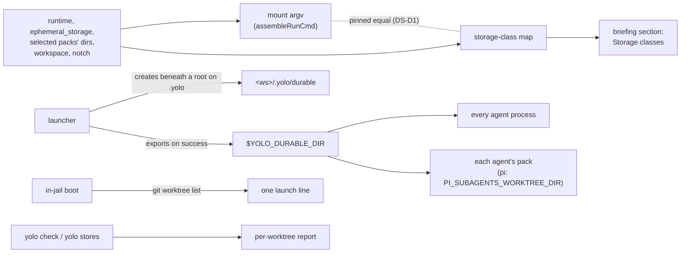

# Where an agent's work survives a restart, and why it keeps choosing /tmp

**Status:** 2026-09-28. All three questions ruled in review the same day. Built
whole on 2026-09-29 ([§9](#9-the-first-build-slice)): the durable dir, its report, the pi
extension, the claude and pi packs' own prose, and each backend's own wording of the
section. MEASURED: in a podman jail on a rootless Linux host, with evidence verified at
`c8fda25f` ([Appendix A](#appendix-a--the-measured-runs)); on 2026-09-30 a podman jail's
`$YOLO_DURABLE_DIR` is `/workspace/.yolo/durable` and its Claude briefing carries the section.
UNMEASURED: Apple Container's wording, which is unit-tested only; no Mac has rendered it. Its
check was written on 2026-10-01 as an experiment for `apple-container.yml`, which runs on the
maintainer's self-hosted Mac: `TestAppleContainerBriefingCarriesItsStorageClasses`
([`applecontainerhome_test.go`](../../integration/applecontainerhome_test.go)). The
version-skew window the claude and pi pack lines open waits on
[OQ-D6](slots-and-contributions.md#OQ-D6) ([DS-D33](#DS-D33)).

> **In short.** The agent chose `/tmp` because nothing it reads says which paths outlive the
> jail, and the one line that tries says the whole home is *"persistent across sessions"* when
> most of it is read-only. The fix is a named set of **storage classes**, told to every agent from
> the mounts the launch really made, plus one agent-neutral durable directory it can name.

**Why it matters.** A lost `/tmp` worktree turns `cd /tmp/land && …; git cherry-pick …` into
cherry-picks on `main`, ungated ([§1.1](#11-the-incident)). pi's subagent worktrees default to
the same place ([§2.4](#24-where-each-agents-workflow-tooling-puts-worktrees)).

**The shape.** Six storage classes ([§3](#3-the-storage-classes)) feed a generated briefing
section. A **durable dir** at `<workspace>/.yolo/durable` is exported as `$YOLO_DURABLE_DIR` and
reported, never reaped. Each agent's own pack points its workflow tool there when needed.

**Cost.** Every jail briefing grows by about ten lines, and every launch by one line when the
durable dir holds anything. Worktrees accumulate until someone removes them.

**Start at [§3](#3-the-storage-classes)**, the classes. The rest applies them.

**Needs your ruling:** None of this doc's own; the three rulings are in [§11](#11-rulings). One
question elsewhere decides part of what was built: the claude and pi packs' addressed prose lines
open a version-skew window ([DS-D33](#DS-D33)), and accepting it waits on
[OQ-D6](slots-and-contributions.md#OQ-D6).

**Reads with:** [`agent-directory-map.md`](agent-directory-map.md) (the state, cache and yours
classes, which [§3.1](#31-the-six-classes) maps onto), [`jail-home.md`](../reference/jail-home.md)
(the mount stack), and [§13](#13-the-neighbors). There is no companion plan sketch. The first
slice ([§9](#9-the-first-build-slice)) is small enough to plan from this doc.

---

## 1. The verdict, and the words it uses

**Tell every agent the truth about its paths, by storage class, and give it one durable place
with a name.** Do not make `/tmp` durable, and do not try to catch the mistake as it happens.
Four principles carry the design, numbered so the ledger can cite them:

- <a id="DS-P1"></a>**DS-P1. The briefing describes the mounts the launch made, not a
  hand-written summary of them.** A hand-written line has already drifted: the `Home` line says
  *"persistent across sessions"* while `/home/agent` is mounted `ro`
  ([§2.1](#21-a-podman-jail-measured)). Only a list derived from the launch's own inputs stays
  true when a pack adds a writable directory.
- <a id="DS-P2"></a>**DS-P2. The durable place belongs to no agent.** Core does not know what an
  agent is ([`AGENTS.md`](../../AGENTS.md)). A hand-made worktree, a landing tree or a build any
  agent needs next session goes to one path every agent is told about. Where an agent's own tool
  already has a durable default, the tool keeps it; that default is the agent's choice, and the
  briefing does not recommend it to anyone else.
- <a id="DS-P3"></a>**DS-P3. `/tmp` stays per-launch, and the briefing says so.** A jail's `/tmp`
  is deleted when the jail exits, deliberately ([§6](#6-alternatives-considered), row E). The
  fix is the location, not a check before each use. The orchestrator's note on the incident
  concluded the same: *"the fix is the LOCATION, not a check before using it."*
- <a id="DS-P4"></a>**DS-P4. yolo reports what accumulates and never deletes it.** Only the
  agent that made a worktree knows whether it holds unlanded work. yolo's job is to keep the
  growth visible, at every launch and in `yolo check` ([OQ-DS2](#OQ-DS2)'s ruling).

### 1.1 The incident

On 2026-09-28 the orchestrating Claude agent in this repository used `/tmp/land` as its landing
worktree for cherry-picks and gates. Its memory file records what followed, quoted as written:

> `/tmp` and `/var/tmp` in a jail are per-launch scratch volumes, deleted when the jail stops,
> so `/tmp/land` vanished across a session restart. `cd /tmp/land && git checkout --detach main
> && …; for c in …; do git cherry-pick $c; done` then skipped the checkout (the `&&`
> short-circuits) and ran the cherry-picks in `/workspace` ON `main`, ungated. Minutes after
> writing that down I re-created `/tmp/land` anyway, because the memory above still named it.

The maintainer's ask, 2026-09-28: *"can we do something to help agents pick a good place for
worktrees when running workflows with parallel changes? /tmp ends up being a popular option, but
then is lost on jail restart. not sure how much convincing we can really do here, but at a
minimum we need to make clear where is durable scratch space vs ephemeral across restarts scratch
space. the confusion arises because /home/agent is mostly readonly and confusing to them."* And:
*"this should work for both pi and Claude and anywhere else with workflows."* In review the same
day: *"we can't have a claude-only solution … we need to be clear about lifecycles, storage
profiles, whatever. and give guidance."*

It was not the first time. On 2026-09-14 this repository's `.git/worktrees` held two prunable
entries, `/tmp/yolo-base-wt` and `/tmp/yolo-prev-wt`, whose directories were already gone
([`disk-levers-and-backfill.md`](disk-levers-and-backfill.md), the worktrees row).

### 1.2 Terms

- **Storage class** *(coined here)*: a kind of location, defined by four things together: what
  survives which event, who shares it, what yolo cleans up, and which disk holds it. It classes
  **locations**. It is not [`agent-directory-map.md`](agent-directory-map.md)'s **class**, which
  says what the **bytes** at a vendor path are (state, cache or yours);
  [§3.1](#31-the-six-classes) relates the two.
- **Durable** *(used here in one sense)*: survives the jail's exit and the next launch of the same
  workspace. It does not mean backed up, and it does not mean shared across workspaces.
- **Per-launch** *(used here in one sense)*: created for one fresh launch, shared by every
  terminal that attaches to that jail, and deleted after the jail exits.
- **Storage-class map** *(coined here)*: the list of paths a launch makes writable or read-only,
  each with its storage class, computed from the same inputs that build the mount argv. It is a
  view of the mount plan, not a new source of truth, and it is not configurable.
  [DS-D1](#DS-D1) pins it to the plan.
- **Durable dir** *(coined here)*: `<workspace>/.yolo/durable`, the agent-neutral durable
  directory this design adds, exported as `$YOLO_DURABLE_DIR`. It is not "scratch": in this
  repository **scratch volumes** already names the four per-launch mounts
  ([`perf-logging.md`](../reference/perf-logging.md#the-linger-was-the-scratch-volumes)), and
  `.yolo/scratch-rm.lock` is the lock of the process that deletes them.
- **Durable worktree** *(coined here)*: a git worktree registered with the workspace's repository
  whose directory lies beneath the durable dir. It is what the launch line counts
  ([§5.4](#54-the-durable-dir-report)).

## 2. What exists today, measured

Every fact carries one of three marks. **MEASURED** means read in this jail on 2026-09-28
([Appendix A](#appendix-a--the-measured-runs)). **SOURCED** means read from code or documentation,
named beside it. **INFERRED** means reasoned from the other two and not observed.

### 2.1 A podman jail, measured

| Path | What it is | Survives the jail's exit? | Mark |
| :--- | :--- | :--- | :--- |
| `/workspace` | a `rw` bind of the host directory | **yes**, it is the host's | MEASURED |
| `/workspace/node_modules`, `/workspace/.venv` | separate `rw` binds from `<ws>/.yolo/home/venv-shadows/`, not the host's own directories | yes, per workspace | MEASURED |
| `/home/agent` | a `ro` bind of this jail's own home skeleton, `<state>/agents/<cname>/home/<stamp>` | read-only; writing fails | MEASURED |
| `~/.claude`, `~/.codex`, `~/.config`, `~/.gemini`, `~/.local`, `~/.npm-global`, `~/.pi`, `~/.ssh`, `~/go`, `~/.yolo/bin` | `rw` binds from `<ws>/.yolo/home/<name>` (the leading dot stripped) | yes, **this workspace only** | MEASURED |
| `~/.cache`, `~/.claude-shared-credentials`, `~/.gemini-shared-credentials`, `~/.pi-shared-npm`, `/mise` | `rw` binds from the machine store under `~/.local/share/yolo-jail/` | yes, **shared by every workspace** | MEASURED |
| briefings, skills, pack `files`, `~/.config/git/config` | `ro` binds layered over the writable dirs | read-only | MEASURED |
| `/tmp`, `/var/tmp`, `/var/lib/containers`, `/var/cache/containers` | podman named volumes `<cname>.scratch.<launch id>.<slot>`, here `yolo-yolo-jail-887995ca.scratch.8f8998f9beed5fd9.tmp` | **no** | MEASURED name; SOURCED lifetime |
| `/run`, `/dev/shm` | `tmpfs` | no | MEASURED |

**When the per-launch volumes go** (SOURCED, `internal/cli/run/scratchremoval.go`,
`internal/cli/run/runmount.go`, `internal/prune/scratchvolumes.go`):

1. A fresh launch mints a 16-hex launch id (`newScratchLaunchID`), so no relaunch can be handed
   an earlier session's volumes, *"since podman silently reuses a named volume that exists."*
2. An attach mounts nothing and shares the running container's volumes; `scratchVolumes` is
   *"Empty on an attach, which mounts nothing."* Every terminal attached to a jail sees one
   `/tmp`.
3. When the owning launch's command exits, the container stops, its attached sessions end, and
   the launcher starts one detached `yolo internal scratch-rm`. That process waits up to one
   minute for podman to say no container references the volumes, empties them, and removes
   them.
4. A volume the remover never reached is removed by the next launch's housekeeping once it is
   dangling and past the age floor, or by `yolo prune --apply`.
5. Under `ephemeral_storage: "tmpfs"` the same four paths are `tmpfs`, in RAM, gone at exit.

This is the Window A fix of 2026-09-28. `/tmp` was already per-launch: the volumes were
anonymous, and `podman run --rm` deleted them in the client while the terminal waited, 32 s after
a 59-hour session ([`perf-logging.md`](../reference/perf-logging.md#the-linger-was-the-scratch-volumes)).
Naming them moved the deletion off the terminal's critical path. It did not change what survives.

### 2.2 Apple Container and macos-user, sourced

| | Apple Container | macos-user |
| :--- | :--- | :--- |
| Workspace | `/workspace`, a `rw` bind (SOURCED `appleContainerBaseMounts`) | the host directory at its real path; there is no `/workspace` (SOURCED `briefing.go`) |
| Home | the whole `<ws>/.yolo/home` bound `rw` at `/home/agent`, so **all of home is durable per workspace**; machine-scope dirs are nested binds (SOURCED) | `/Users/_yolojail`, one account home **shared by every workspace**; the workspace tier is symlinks into `<ws>/.yolo/home` (SOURCED [`reference/macos-user-home-tiers.md`](../reference/macos-user-home-tiers.md)) |
| `/tmp`, `/var/tmp` | `tmpfs`, in the VM's RAM, gone when the container stops (SOURCED) | the machine's own `/private/tmp` and `/var/folders`, writable by the Seatbelt profile (SOURCED `SeatbeltProfile`). It **survives the launch**, is shared with the host user and every other workspace, and is cleared by macOS at reboot and by its periodic cleanup (INFERRED, not measured here) |
| `/var/lib/containers` | `tmpfs` | not in the writable set |

**macos-user inverts the podman risk.** A `/tmp` worktree there survives a restart. It collides
instead: two workspaces that both choose `/tmp/land` share one directory, and a Mac reboot
deletes it (INFERRED).

### 2.3 The host notch

`yolo host -- <agent>` runs the agent as the human's own process with no mount namespace
(SOURCED [`host-notch-services.md`](host-notch-services.md)). `/tmp` is the host's own and
survives an agent restart. Whether it survives a reboot depends on the host: it is a `tmpfs` on
many Linux distributions (INFERRED). The host briefing is one file in the real home, shared by
every project, composed by `HostBriefingBase` as the confinement header and nothing else
(SOURCED `internal/jailcontent/briefing.go`).

### 2.4 Where each agent's workflow tooling puts worktrees

| Agent | Tool | Where its worktrees go | Storage class ([§3](#3-the-storage-classes)) | Configurable? | Mark |
| :--- | :--- | :--- | :--- | :--- | :--- |
| claude | Agent `isolation: worktree`, the Workflow tool, `--worktree`, `EnterWorktree` | `<repo>/.claude/worktrees/<name>/` | workspace: inside the project tree, not under `.yolo` | only by a `WorktreeCreate` hook that replaces creation entirely; the settings have `worktree.baseRef` and no base-directory key | MEASURED: `agent-*` and `wf_*` dirs there; SOURCED [Claude Code worktrees](https://code.claude.com/docs/en/worktrees) |
| pi | pi-subagents 0.35.1, `worktree: true` | **`os.tmpdir()`**, that is `/tmp`, as `pi-worktree-<runId>-<index>` | **per-launch** | `worktreeBaseDir` in `~/.pi/agent/extensions/subagent/config.json`, else `PI_SUBAGENTS_WORKTREE_DIR` | SOURCED `src/runs/shared/worktree.ts` (`resolveWorktreeBaseDir`) and its README |
| pi | pi-dynamic-workflows 3.13.0 (and the npm `@quintinshaw` build) | `<repo>/.pi/worktrees/<slug>-<uuid>` | workspace, and ignored by nothing | no; the path is hard-coded | SOURCED `src/worktree.ts` (`createWorktree`) |
| codex | managed worktrees (the app, and the CLI's `--worktree`) | `$CODEX_HOME/worktrees`, so `~/.codex/worktrees` | workspace-durable (`<ws>/.yolo/home/codex` on podman) | no, per [openai/codex#10599](https://github.com/openai/codex/issues/10599) | SOURCED, third-party; no such dir exists in this jail yet |
| opencode | sandboxes (linked worktrees) | `~/.local/share/opencode/worktree/` | workspace-durable (`<ws>/.yolo/home/local`) | not found | SOURCED weakly, from issue reports ([anomalyco/opencode#15911](https://github.com/anomalyco/opencode/issues/15911)); not read in source |
| copilot, agy, omp | none found | — | — | — | not found; UNVERIFIED |

**Three things follow.** First, pi-subagents is **the one shipped workflow tool that defaults to
the per-launch class**. It cleans its worktrees in `finally` blocks, so a finished run leaves
nothing behind; a run interrupted by a restart leaves a branch and a stale registration in
`.git/worktrees` (INFERRED). Second, codex and opencode are durable by accident of where the pack
binds live. Third, the agent's own hand-made worktree is the case nothing covers, and it is what
the incident was.

**Whether `.claude/worktrees` is git-excluded is not yolo's doing.** yolo writes no
`.git/info/exclude` and no repo `.gitignore` entry for it (`rg 'info/exclude' internal cmd`
finds none; MEASURED). This checkout excludes it through a block in `.git/info/exclude` headed
`# claude-code-runtime` (MEASURED), which points at Claude Code as the writer (INFERRED). Claude
Code's own docs still tell the user to add `.claude/worktrees/` to `.gitignore` (SOURCED). So in
another repository a Claude worktree may show as untracked. pi's `.pi/worktrees` is ignored by
nothing, here or anywhere (MEASURED here).

### 2.5 Why the agent picked /tmp

The four causes the orchestrator found, each checked:

1. **Its own memory prescribed it.** The memory said *"one full suite at landing from ONE warm
   landing worktree (`/tmp/land`, reused)"*. It now names `/workspace/.claude/worktrees/land`
   (MEASURED). That fix is the user's own ([§5.8](#58-placement-core-a-pack-or-the-user)).
2. **The briefing is silent, and one line of it is wrong.** It says *"**Home**: `/home/agent`
   (persistent across sessions)"* on both arms (`internal/jailcontent/briefing.go:595` and
   `:605` at `c8fda25f`). It never says that most of home is read-only, that `/tmp` and
   `/var/tmp` are per-launch, or where durable work goes. "Persistent" reads as permission to
   write anywhere in home. A write there fails, so the agent falls back to `/tmp`.
3. **`/tmp` is the universal reflex.** The Claude Code harness hands the agent a scratchpad
   under `/tmp/claude-0/…` and tells it to use that *"instead of `/tmp`"* (MEASURED in this
   session's own instructions). That is right for throwaway files. It reinforces "temporary work
   goes under `/tmp`" for everything else, and pi-subagents encodes the same reflex as its
   default.
4. **The right answer existed and nothing pointed at it.** Claude's Agent and Workflow
   worktrees go to `<repo>/.claude/worktrees/`, which is durable and, in this checkout,
   excluded. They survived the restart; `/tmp/land` did not.

### 2.6 A worktree records absolute paths, measured

A worktree links two ways, and git writes both links as absolute paths by default: the repo's
`.git/worktrees/<id>/gitdir` names the worktree's `.git` file, and that file names the admin
directory back. Made in a container jail, both links spell `/workspace/…` (MEASURED:
`.git/worktrees/land/gitdir` reads `/workspace/.claude/worktrees/land/.git`). On the host,
`/workspace` does not exist.

A scratch repository with git 2.55.0, a worktree made under `.yolo/durable/worktrees/`, then the
whole repository moved to a different absolute path, which is what the host sees (MEASURED,
[Appendix A](#appendix-a--the-measured-runs)):

| Worktree made with | `git worktree prune` at the new path | `git` run inside it at the new path | `git clean -fdx` at the new path |
| :--- | :--- | :--- | :--- |
| plain `git worktree add` | **removes its registration**: *"gitdir file points to non-existent location"* | `fatal: not a git repository` | **deletes the directory** |
| `--lock` | keeps it (`locked`) | fails the same way | **deletes the directory** |
| `--relative-paths` | keeps it | works | skips it (*"Would skip repository"*) |

`git gc` runs the same prune on registrations older than `gc.worktreePruneExpire`, three months by
default (SOURCED [git-worktree](https://git-scm.com/docs/git-worktree), git-config). The branch's
commits live in the main repository's refs and survive a pruned registration; the worktree's
uncommitted files survive on disk but lose their index and `HEAD` (INFERRED).
`--relative-paths` sets `extensions.relativeWorktrees` and raises `core.repositoryformatversion`
from 0 to 1, and git 2.47.2 then refuses `status`, `log` and `git config --local --unset`, on
*"unknown repository extension found: relativeworktrees"*. Removing the worktree leaves the
extension set, and `worktree.useRelativePaths=true` sets it on the next plain
`git worktree add`. The extension can still be removed, by hand: git 2.47.2's own
`git config -f .git/config --unset extensions.relativeWorktrees` succeeds with a warning, and
so does a plain `git config --unset` from git 2.55.0; either way git 2.47.2 works on the
repository again, the format version staying 1 (all MEASURED,
[Appendix A](#appendix-a--the-measured-runs)). Made from a container jail, that config is the
user's own `.git/config`, reached through the live workspace bind. On macos-user and at the host
notch the workspace is at its real path, so this whole class of fault does not arise there
(INFERRED from [§2.2](#22-apple-container-and-macos-user-sourced)).

## 3. The storage classes

This is the spine. Every path an agent can reach falls into one of six storage classes, and
the generated briefing section ([§5.1](#51-the-storage-class-map-and-the-briefing-section)) is
these tables rendered for the launch that is running.

### 3.1 The six classes

| Class *(names coined here)* | In one line | Where [`agent-directory-map.md`](agent-directory-map.md)'s classes land |
| :--- | :--- | :--- |
| **workspace** | the project tree itself, the host's own files | nothing of an agent's; `.claude/worktrees` and `.pi/worktrees` sit here by their tools' choice |
| **workspace-durable** | survives, one copy per workspace: the pack-bound home dirs, the per-side shadows, and the durable dir | an agent directory's **state** and **yours** (`~/.claude`, `~/.pi`, `~/.codex`); the durable dir's contents are **yours**, since the user authors them by asking the agent |
| **machine-shared** | survives, one copy for every workspace on the machine | **cache** (`~/.cache`, `~/.pi-shared-npm`, `/mise`) and credential **state** (`~/.claude-shared-credentials`) |
| **per-launch** | deleted after the jail exits; shared by attached terminals | nothing an agent keeps; pi-subagents' default worktrees land here |
| **machine-temp** | the machine's own temp: survives the launch, shared with everything, cleared at reboot | nothing an agent keeps |
| **read-only** | a write fails; yolo regenerates it each launch | the composed and laid files the map derives: briefings, skills, pack `files` |

The two vocabularies answer different questions, so neither replaces the other. The directory map
asks *"what is lost if this path is wiped?"*; a storage class asks *"will this path still be here
after the next restart, and who else sees it?"* A path has one of each, and the useful rule falls
out of the pair: **state and yours bytes belong in a durable class, cache bytes may live in
machine-shared, and nothing of either belongs in per-launch or machine-temp.**

### 3.2 Where each class is, per notch

| Class | podman | Apple Container | macos-user | host |
| :--- | :--- | :--- | :--- | :--- |
| **workspace** | `/workspace` | `/workspace` | the real path | the real path |
| **workspace-durable** | `~/.claude`, `~/.codex`, `~/.config`, `~/.local`, `~/.pi`, `~/go`, … bound from `<ws>/.yolo/home/`; the per-side shadows; `/workspace/.yolo/durable` | **all of `/home/agent`** (the whole `<ws>/.yolo/home`); `/workspace/.yolo/durable` | the account home's symlinks into `<ws>/.yolo/home`; `<ws>/.yolo/durable` | none yolo manages; the agent's own dirs are the real home's, shared by every project |
| **machine-shared** | `~/.cache`, `/mise`, the shared-credential dirs, each machine-scope pack dir, bound from `~/.local/share/yolo-jail/` | nested binds from the same store | the account home's real directories: `~/.cache`, `~/.yolo/mise`, each `SharedDirs` entry | the real home |
| **per-launch** | `/tmp`, `/var/tmp`, `/var/lib/containers`, `/var/cache/containers` (scratch volumes); `/run`, `/dev/shm` | `/tmp`, `/var/tmp`, `/var/lib/containers` (`tmpfs`) | none | none |
| **machine-temp** | none | none | `/private/tmp`, `/var/folders` | the host's `/tmp` |
| **read-only** | the rest of `/home/agent`, staged briefings and skills, `/ctx/*`, `/opt/yolo-jail`, `/nix/store` | staged briefings and skills | the staged skills and briefings, write-denied by Seatbelt (`homeReadonlyDenies`) | not applicable |

### 3.3 Lifecycle: what survives which event

"Restart" and "fresh launch" are one event in yolo: a jail has no in-place restart, and a
relaunch after exit is a fresh launch with a new launch id ([§2.1](#21-a-podman-jail-measured)).

| Class | exit, then relaunch | attach | another workspace's jail | `yolo prune --apply` | host reboot | the workspace is deleted |
| :--- | :--- | :--- | :--- | :--- | :--- | :--- |
| **workspace** | survives | shared | not visible | untouched | survives | gone |
| **workspace-durable** | survives | shared | not visible | nothing deleted; identical files under `<ws>/.yolo/home/{npm-global,local,go,…}` may be hardlink-deduplicated (`WalkDedupableWorkspaces`) | survives | **gone with it**, since it lives in `<ws>/.yolo` |
| **machine-shared** | survives | shared | **shared** | `~/.cache` subdirs purged by age (`PurgeCacheByAge`); overlay-masked seeds under the store's `home/` removed (`PruneShadowedHome`) | survives | survives |
| **per-launch** | **deleted** | shared | not visible | dangling volumes removed (`PruneScratchVolumes`) | never handed to a later launch | — |
| **machine-temp** | survives | shared | **shared** | untouched | cleared (INFERRED) | untouched |
| **read-only** | regenerated | shared | its own staging | orphaned staging reaped (`PruneOrphanAgentStaging`) | regenerated | staging orphaned, then reaped |

### 3.4 Who shares it, and what yolo cleans up

| Class | Shared by | yolo cleans up | When |
| :--- | :--- | :--- | :--- |
| **workspace** | every jail and host process on this project | nothing | never |
| **workspace-durable** | every agent and terminal in this workspace's jail, and the host user | nothing. The durable dir is **reported, never deleted** ([DS-P4](#DS-P4)) | never |
| **machine-shared** | every workspace's jail on this machine | cache subdirs by age; masked seeds | `yolo prune --apply` |
| **per-launch** | the terminals attached to one jail | everything | after the jail exits; stragglers at the next launch or `yolo prune --apply` |
| **machine-temp** | every process on the machine | nothing | the OS decides |
| **read-only** | this jail | stale staging | `yolo prune --apply`, liveness-gated |

### 3.5 Storage profile

| Class | Disk it lives on | Inside the workspace tree on the host? | Size exposure |
| :--- | :--- | :--- | :--- |
| **workspace** | the workspace's filesystem | it is the tree | the project |
| **workspace-durable** | the workspace's filesystem | **yes**, under `<ws>/.yolo`, git-ignored by its `*` file | agent installs per workspace (claude's five builds were 1.2 GB, `paths.CapturesDir`'s comment); durable worktrees are unbounded: 985 MB across 20 stale trees in `.claude/worktrees` on 2026-09-14 ([`minimal-disk-footprint.md`](minimal-disk-footprint.md)) |
| **machine-shared** | the host home's filesystem, under `~/.local/share/yolo-jail` | no | caches, bounded only by the age purge |
| **per-launch** | podman's own storage for the volumes (INFERRED: beside its images); RAM under `ephemeral_storage: "tmpfs"` and on Apple Container | no | one session's temp files and the nested podman store; on a RAM backing, counted against memory |
| **machine-temp** | the Mac's system volume, or the host's `/tmp` (often `tmpfs` on Linux, INFERRED) | no | shared with every other user of the machine |
| **read-only** | the state dir's staging | no | small |

### 3.6 Guidance: what belongs where

This table is the briefing's advice, and its wording is the implementer's; the assignments are
not.

| Class | Put here | Never put here |
| :--- | :--- | :--- |
| **workspace** | source and anything meant to be committed | worktrees (they show as untracked and nest one checkout inside another for every tool that walks the tree); build outputs the repo does not ignore |
| **workspace-durable: the durable dir** | worktrees you make by hand, landing and gate trees, long builds' outputs you want next session, run logs and notes worth keeping | secrets: every agent in the workspace and the host user can read it; anything meant to be shared with another workspace |
| **workspace-durable: an agent's own dir** | only what that agent writes there itself | your own files; the pack and the agent own these paths ([`agent-directory-map.md`](agent-directory-map.md)) |
| **machine-shared** | regenerable caches, through each tool's own cache setting | work, worktrees, and anything workspace-specific: every workspace sees it, and `yolo prune` purges `~/.cache` by age |
| **per-launch** | throwaway files: pipes, sockets, one command's temp output, test temp dirs, a harness scratchpad | anything a command after a restart depends on; **never a worktree** |
| **machine-temp** | the same throwaway files, under a `mktemp` name | anything durable; a fixed name another workspace could also pick |
| **read-only** | nothing | — |

**Secrets never go in an agent-chosen place.** Credentials reach a jail through the channels
yolo already runs (the shared-credential dirs and the loopholes); an agent writing a token to any
class above creates a copy nothing rotates or revokes.

## 4. The constraints

- **`<workspace>/.yolo/` is the one writable, per-workspace place every jail backend already
  has.** The home differs on each: a `ro` skeleton with punches (podman), fully writable (Apple
  Container), one account home shared by every workspace (macos-user). `.yolo` is writable on all
  three with no new mount and no new Seatbelt rule, it is git-ignored by a bare `*` yolo writes
  into it (`paths.WorkspaceStateIgnore`, SOURCED), and it is where the workspace-durable home
  dirs already live.
- **Host code in jail-writable state works beneath an `os.Root`**
  ([`jail-home.md`](../reference/jail-home.md#host-code-in-jail-writable-state)). `.yolo` is
  jail-writable through the workspace bind. A path the host creates there must be created beneath
  a root on `.yolo`, and anything the host later reads there may be a link the last jail left.
- **Host yolo must not run `git` in a jail-writable repository.** The workspace's `.git/config`
  is jail-writable, and git executes programs a config names (`core.fsmonitor` runs on `git
  status`, SOURCED git-config). yolo running git there at every launch would run jail-chosen code
  as the host user. Anything git-derived about a durable worktree is computed in the jail
  ([§5.4](#54-the-durable-dir-report)).
- **Pack `env` values are literal** (`packdecl.KindEnv`: *"Values are literal strings only (no
  interpolation, no host reads)"*, SOURCED). A pack cannot spell "the workspace's durable dir"
  in an `env` value, because the workspace path differs per backend.
- **Claude Code resists a redirected worktree** (SOURCED
  [Claude Code worktrees](https://code.claude.com/docs/en/worktrees)). It refuses to create a
  worktree when `.claude`, `.claude/worktrees` or the worktree is a symlink. It asks approval to
  enter a path outside `.claude/worktrees/` except in `bypassPermissions` mode. A worktree a
  `WorktreeCreate` hook makes lacks Claude Code's marker, so the cleanup sweep keeps it forever;
  `.worktreeinclude` is not processed for it; and its transcript stays at the launch directory.
- **A worktree made in a container jail records jail paths** ([§2.6](#26-a-worktree-records-absolute-paths-measured)).

## 5. The proposed shape



### 5.1 The storage-class map and the briefing section

**The trigger.** Every invocation that writes briefings, attach included, computes the map. The
map is a pure function of the launch's runtime, `ephemeral_storage`, the selected packs'
writable and shared dirs, the workspace, and the notch. It reads the definitions the argv
reads (`prune.ScratchSlots`, `paths.HomeSurfaces`, `packload.WritableDirs`,
`packload.SharedDirs`), never a second list.

**The section**, "Storage classes", renders after the Environment section and before the
Loopholes section. It replaces the `Home` line's *"(persistent across sessions)"* with
*"(mostly read-only; see Storage classes)"* on podman, and with the true description on each
other backend. For podman it reads like this. The wording is the implementer's; the facts, the
class names and their order are not. **This sketch is the design's first and is superseded**:
the section as built leads with the durable dir ([DS-D18](#DS-D18)) and was reworded by
[DS-D29](#DS-D29), [DS-D31](#DS-D31) and [DS-D32](#DS-D32). Its rendered text is pinned in
[`persistencesection_test.go`](../../internal/jailcontent/persistencesection_test.go), and the
sketch is kept as the design's argument, not updated to match:

```markdown
## Storage classes

- **Workspace**: `/workspace`, the host's own files. Commit here; do not put worktrees here.
- **Durable, this workspace only**: `$YOLO_DURABLE_DIR` (`/workspace/.yolo/durable`,
  git-ignored), and in home only `~/.claude`, `~/.config`, `~/.local`, `~/go`,
  `~/.npm-global`, `~/.pi`, `~/.ssh`. Survives restarts; deleted with the workspace.
- **Durable, shared by every workspace on this machine**: `~/.cache`, `/mise`,
  `~/.claude-shared-credentials`. Caches only; `yolo prune` purges `~/.cache` by age.
- **Deleted when this jail exits** (every attached terminal shares them): `/tmp`,
  `/var/tmp`, `/var/lib/containers`, `/var/cache/containers`, `/run`, `/dev/shm`. A
  scratchpad a harness hands you under `/tmp` is in this set. Throwaway files only.
- **Read-only**: everything else under `/home/agent`, the briefing and skills files, `/ctx`.
- **Worktrees and anything you need next session**: `git worktree add --lock
  "$YOLO_DURABLE_DIR/worktrees/<task>"`, never `/tmp`. Drive them with `git -C <path>`, not
  `cd <path> && …`. yolo never deletes them; remove yours with `git worktree unlock` and then
  `git worktree remove`, which refuses a tree with uncommitted changes ([DS-D28](#DS-D28)).
- **Secrets**: nowhere you choose. Credentials arrive through yolo's own channels.
```

**Per-backend wording.** Apple Container says the whole home is durable for this workspace and
`/tmp` is in RAM; as built, the map's two facts pick those clauses, not the backend's name
([DS-D34](#DS-D34)). macos-user says the home is shared by every workspace, has no per-launch class,
and that `/tmp` is the machine's own: it survives this launch, is shared with every workspace and
the host user, and is cleared at reboot, so a name there must be unique (`mktemp`). The host notch
gets one static sentence ([§5.7](#57-every-notch-and-backend)).

**Degenerate inputs.** A class with no members renders no bullet. A pack with no writable dirs
contributes nothing. A launch where the durable dir could not be made renders its bullet as
*"none this launch: `<reason>`"* and drops the worktree bullet's path, so no agent is sent to a
path that does not exist ([§5.6](#56-failure-paths)).

### 5.2 The durable dir

- **Path.** `<workspace>/.yolo/durable`, reached through the workspace's own mount at its in-jail
  spelling: `/workspace/.yolo/durable` on the container backends, the real path on macos-user.
  **No second mount** gives it another spelling ([DS-D8](#DS-D8)): the same relative geometry on
  the host and in the jail is what lets `--relative-paths` worktrees work on both sides
  ([§2.6](#26-a-worktree-records-absolute-paths-measured)), and a fixed alias such as `/durable`
  or `~/durable` would break it and add a punch to the podman skeleton.
- **Why `.yolo`, and not outside the workspace.** The per-workspace home already lives at
  `<ws>/.yolo/home`, so a durable dir outside the workspace would buy no separation the agent
  dirs do not already lack, and it would lose the lifecycle for free: deleting a workspace deletes
  its durable dir with it ([§6](#6-alternatives-considered), row B‴).
- **One writer of the directory itself: the launcher**, on every fresh launch and on every jail
  backend, beneath a root on `.yolo` opened with `paths.OpenStateDirRoot`, mode `0755`, after
  `EnsureWorkspaceStateDir` has made `.yolo` and its ignore file. An existing directory is left
  as it is. Its contents belong to the agents.
- **The variable.** `YOLO_DURABLE_DIR` holds the absolute in-jail path. It is set in the
  environment every process in the jail inherits, attaches included, **only when the directory
  exists at launch**. It is never set to a missing path, and never at the host notch
  ([OQ-DS3](#OQ-DS3)'s ruling).
- **Forbidden.** Host code never follows a link, reads a file's content, or removes anything
  beneath the durable dir. The host-side report ([§5.4](#54-the-durable-dir-report)) reads
  metadata only (`lstat` sizes and times) and the worktree admin files' bytes, beneath an
  `os.Root`, with no link followed. `yolo prune` never deletes from it ([OQ-DS2](#OQ-DS2)'s
  ruling).
- **No exclude writes.** `.yolo/.gitignore`'s `*` already hides it, so yolo adds nothing to a
  repository's `.gitignore` or `.git/info/exclude` ([DS-D6](#DS-D6)).

**What skips `.yolo`, and what does not.** Git-ignored means `git status`, `git add -A`, `rg`
and `fd` skip it: in a scratch repository carrying `.yolo/.gitignore`'s `*`, a plain `rg`, `rg
-g '!*_test.go'`, `rg --hidden` and `fd -H` all left `.yolo/durable` out (MEASURED). `go ... ./...`
skips it because Go ignores directories whose names begin with `.` (SOURCED `go help packages`),
and pytest's default `norecursedirs` includes `.*` (SOURCED pytest docs). The exceptions are the
tools that do not read `.gitignore`:

- `git clean -x` and `-X` delete ignored files: `git clean -fdx` removes `.yolo/home` and every
  absolute-path durable worktree the host cannot resolve ([§2.6](#26-a-worktree-records-absolute-paths-measured)).
  This is true of `.yolo/home` today. Only a clean that also descends into untracked directories
  (`-d`) reaches `.yolo`: `git clean -nx` and `-nX` listed nothing there, and `-ndx` and `-ndX`
  listed `.yolo/` (MEASURED, [Appendix A](#appendix-a--the-measured-runs)). So the briefing and
  `yolo check` name `git clean -fdx` (or `-fdX`) ([DS-D31](#DS-D31)).
- a walk told to ignore nothing: `fd -HI`, `rg -uu`, `find`, `du`;
- file watchers and indexers that use their own exclude lists rather than `.gitignore` (an
  inotify watcher, an IDE's file watcher), and backup or sync tools (`rsync`, Time Machine)
  (INFERRED: not measured per tool).

The recorded precedent, a repo-wide `rg` from `/workspace` that sat for five hours on 2026-09-09
descending `.yolo/home`, is not reproduced by a default `rg` against a `.yolo` carrying the `*`
file (MEASURED in the scratch repository); a no-ignore walk still descends it.

### 5.3 The worktree convention

- A hand-made worktree goes to `$YOLO_DURABLE_DIR/worktrees/<task>`, where `<task>` names the
  work (`land`, `fix-footer`), not a timestamp, made with **`git worktree add --lock`**
  ([DS-D10](#DS-D10)). The lock keeps a host-side `git worktree prune` or `git gc` from dropping
  a registration whose `/workspace/…` path the host cannot resolve, and on the container
  backends the briefing says so beside the command; on macos-user, where the host and the jail
  spell the workspace alike, it asks for the lock without that reason ([DS-D31](#DS-D31)).
  Removing a locked worktree
  takes `git worktree unlock` first, then `git worktree remove`, which still refuses a tree with
  uncommitted changes. `git worktree remove -f -f` overrides the lock and that refusal both, so
  the briefing names it only as the form that discards changes ([DS-D28](#DS-D28)).
- **`--relative-paths` is the user's opt-in, never yolo's default, and the briefing does not
  name it** ([DS-D31](#DS-D31)). It fixes both links and `git clean` as well
  ([§2.6](#26-a-worktree-records-absolute-paths-measured)), but it sets a repository extension
  that makes a git older than 2.48 refuse the whole repository, and a Mac's bundled git can be
  older. An agent in a jail cannot see which gits the user runs on the host, the extension lands
  in the user's own `.git/config`, and removing the worktree does not clear it. It is not
  permanent: `git config -f .git/config --unset extensions.relativeWorktrees` restores the
  repository even from the older git, as a plain `git config --unset` does from a newer one
  ([§2.6](#26-a-worktree-records-absolute-paths-measured), MEASURED with 2.47.2 and 2.55.0). But
  the older git refuses the usual `git config --local --unset`, so the user meets a broken
  repository on the host and has to know that repair ([DS-D32](#DS-D32)). No wording makes that
  safe to offer an agent.
- A tool that already has a durable default keeps it: `.claude/worktrees/`, `~/.codex/worktrees`,
  `.pi/worktrees`, `~/.local/share/opencode/worktree` ([DS-D5](#DS-D5)). The briefing does not
  offer any of them as the pattern for hand-made worktrees.
- **Concurrency.** Two agents choosing one name get git's own refusal (`already exists`), which
  is the right answer; the convention adds no lock of its own. Attached terminals share the
  directory, as they share the workspace.
- **Removal** is the creator's, with `git worktree remove`. yolo removes none
  ([DS-P4](#DS-P4)).

### 5.4 The durable-dir report

yolo never deletes a durable worktree, so it makes them impossible to forget. Two outputs, both
new in the first slice ([§9](#9-the-first-build-slice)).

**The launch line.** Computed by the in-jail boot (the entrypoint on the container backends, the
bootstrap on macos-user), on every **fresh launch**, and printed on the launch terminal with the
boot's other lines, so `launch.log` and `boot.log` carry it too. An attach prints nothing new: it
shares the jail whose launch already said it. On the container backends the line is the main
process's boot alone, and every session's pass, the first included, skips the walk
([DS-D36](#DS-D36)).

```text
Durable dir: 3 worktrees, 1.2 GB, oldest idle 41 days (fix-footer) — `yolo check` lists them; yolo deletes nothing here.
Durable dir: 3 worktrees, ≥ 2.0 GB (size walk stopped at 2 s), oldest idle 41 days (fix-footer) — …
Durable dir: 2 worktree registrations point at paths that no longer exist (/tmp/land, …) — `git worktree prune` drops them.
Durable dir: unavailable this launch: .yolo is a symbolic link.
```

- **When it appears.** The first form whenever the durable dir holds at least one durable
  worktree or any other entry (other entries are counted as *"and N other entries"*). Nothing
  when it is empty. The third form, added as a second line, whenever `git worktree list
  --porcelain` marks any registration `prunable` whose path lies below the workspace or the
  per-launch set: that is the `/tmp` incident class, caught at the next launch. One elsewhere is
  not judged, since a container jail cannot see a worktree the host made beside the repository
  ([DS-D25](#DS-D25)). The fourth whenever the launcher could not make the dir.
- **The figures.** Count: durable worktrees ([§1.2](#12-terms)), from `git worktree list
  --porcelain` run in the jail. Size: the `lstat` total of the whole durable dir, following no
  link, with a **2 s** wall-clock budget; a stopped walk prints `≥` and says so. Idle: the time
  since a worktree's last git activity, the newer of its admin directory's `HEAD` and `index`
  mtimes; "oldest idle" names the worktree with the largest idle time, in whole days (hours
  under a day).
- **Degenerate cases.** The workspace is not a git repository: count directories beneath
  `worktrees/` instead and print *"N directories"*. `git` is missing or fails: print the size
  and entry count only. None of these ever refuse or delay the launch past the 2 s budget.

**`yolo check`**, run for the current workspace, adds a **Durable dir** section. The sample is
the design's; as built, the footer also names the one command that deletes the dir and gives
[DS-D28](#DS-D28)'s removal advice ([DS-D31](#DS-D31)), and its text is pinned in
[`section_durabledir_test.go`](../../internal/cli/check/section_durabledir_test.go):

```text
Durable dir  /workspace/.yolo/durable  1.2 GB measured, 3 worktrees, 1 other entry
  worktrees/land          412 MB  idle 2 d    detached at 1a2b3c4d   0 unique commits   clean
  worktrees/fix-footer    650 MB  idle 41 d   fix-footer             3 unique commits   4 changed files
  worktrees/pi-subagents/pi-worktree-7f3a-0   120 MB  idle 9 d   pi-7f3a-0   1 unique commit   clean
  other entries            18 MB  notes/
  prunable registrations  2  /tmp/land, /tmp/yolo-base-wt — `git worktree prune` drops them
  yolo deletes nothing here. Remove one with `git worktree remove <path>`.
```

- **Unique commits** *(coined here)*: commits reachable from the worktree's `HEAD` and from no
  other local branch and no remote-tracking ref, counted by `git rev-list --count HEAD --not
  --exclude=<its own branch> --branches --remotes`. It is the number of commits that deleting the
  worktree **and** its branch would lose, and it costs one walk of those commits.
- **Changed files**: the line count of `git status --porcelain` in that worktree.
- **In the jail** every column is computed. **On the host** the size, idle and branch columns are
  computed (the branch read as bytes from the admin `HEAD` file beneath an `os.Root`, 4 KiB at
  most, no link followed), and unique commits and changed files print *"in-jail only"*, since
  host yolo runs no git in a jail-writable repository ([§4](#4-the-constraints)).

**`yolo stores`** adds one row per workspace it already knows (`FindYoloWorkspaces`), in a new
section, **workspace durable dirs**: the path, the measured size under the command's existing
walk budget and `Sizing` label, the worktree count from the admin files, the oldest idle, verdict
`human`, and reclaimer none with the detail *"the user's work; yolo never reclaims it — `git
worktree remove`"*. `--format json` carries the same fields. ⚠ "Already knows" is the runtime's
container list, and jails run with `--rm`, so only a workspace whose jail is running gets a row
([DS-D22](#DS-D22)).

### 5.5 Every agent learns it, each through its own pack

**Two channels reach every agent, and neither names one.** The briefing section is core's, so it
lands in every selected pack's briefing destination: `~/.claude/CLAUDE.md`,
`~/.pi/agent/AGENTS.md`, `~/.codex/AGENTS.md`, `~/.config/opencode/AGENTS.md`, and the copilot,
agy and omp packs' own. The variable reaches every process, including the scripts, subagents and
tools that never read a briefing.

**Where an agent's workflow tool must be pointed at the dir, its own pack does it**, never core:

| Agent | Its tool's default, by class | Change, in that agent's pack |
| :--- | :--- | :--- |
| pi | pi-subagents: **per-launch** | **an extension** sets `PI_SUBAGENTS_WORKTREE_DIR` to `$YOLO_DURABLE_DIR/worktrees/pi-subagents` when it is unset and `YOLO_DURABLE_DIR` is set ([DS-D4](#DS-D4)) |
| pi | pi-dynamic-workflows: workspace, untracked | none possible, the path is hard-coded; one line of pack prose says `.pi/worktrees` is durable and shows as untracked, and an upstream setting is the fix |
| claude | workspace (`.claude/worktrees`), excluded only where Claude Code wrote the exclude | **pack prose only**: its Agent and Workflow worktrees stay where Claude Code puts them; hand-made ones follow the core section. No `WorktreeCreate` hook ([DS-D5](#DS-D5)) |
| codex | workspace-durable (`~/.codex/worktrees`) | none |
| opencode | workspace-durable (`~/.local/share/opencode/worktree`) | none |
| copilot, agy, omp | no tool found | none; a pack line follows when a tool exists |

As built, the claude and pi rows' prose is one file in each pack, addressed to that agent
alone ([DS-D33](#DS-D33)).

**Why an extension and not a pack `env` value for pi.** The value must name the workspace, which
is `/workspace` on two backends and the real path on the third, and `env` values are literal
([§4](#4-the-constraints)). A relative value (`.yolo/durable/…`) resolves against pi's repository
root, which inside a nested repository or another worktree is not the workspace. pi-subagents
reads the variable when each run starts (`resolveWorktreeBaseDir`), so an extension that sets it
when it loads is in time. At the host notch `YOLO_DURABLE_DIR` is unset and the extension does
nothing.

**Why Claude's default is left alone, and not recommended.** `.claude/worktrees` is Claude Code's
choice, and moving it costs more than it buys: a `WorktreeCreate` hook loses the cleanup sweep,
`.worktreeinclude` and transcript-follows-worktree, prompts at the host notch for every enter
outside `.claude/worktrees/`, and a symlinked `.claude/worktrees` is refused outright
([§4](#4-the-constraints)). But it sits in the project tree, not under `.yolo`, and is hidden
from git only where Claude Code wrote the exclude, so the core section never names it.

### 5.6 Failure paths

| Failure | What happens | Who finds out |
| :--- | :--- | :--- |
| `.yolo` is a symbolic link | `OpenStateDirRoot` refuses; no dir, no variable | the briefing names the reason; the launch line says *"unavailable this launch"* |
| a `workspace_readonly` entry covers `.yolo` | the launcher does not create it; no variable | the briefing says durable space is unavailable because the workspace is read-only there; the launch line says the same |
| `mkdir` fails otherwise (disk full, permissions) | no variable; the launch continues | the briefing and the launch line name the error. It never refuses a launch: an agent without durable space is the status quo |
| the jail later deletes or replaces the durable dir, or leaves a link in it | nothing; the host follows nothing beneath it | the agent, when its next write fails; the next launch's line |
| the report's walk or `git` fails | the line prints what it has; `yolo check` marks the column `unknown` | the reader of the line |
| the workspace itself is on a per-launch mount (a nested jail launched from `/tmp/yolo-nested`) | the dir is made, and it is only as durable as the outer `/tmp` | the section says the workspace itself is deleted when the enclosing jail exits. How the launcher detects this is the implementer's |

### 5.7 Every notch and backend

| | podman | Apple Container | macos-user | host |
| :--- | :--- | :--- | :--- | :--- |
| Section | generated | generated | generated | one static sentence in the host header |
| Durable dir and variable | `/workspace/.yolo/durable` | `/workspace/.yolo/durable` | `<real ws>/.yolo/durable`, inside the Seatbelt write set | none |
| Launch line | yes | yes | yes | none |
| `/tmp` sentence | deleted at exit | in RAM, deleted at exit | the machine's own, shared, cleared at reboot | the machine's own |

The host sentence, per [OQ-DS3](#OQ-DS3)'s ruling: *"`/tmp` is this machine's own: it survives an
agent restart but may not survive a reboot; put worktrees you need later inside the repository or
beside it."*

### 5.8 Placement: core, a pack, or the user

| Piece | Home | Why |
| :--- | :--- | :--- |
| the storage-class map and the section | **core** (`internal/jailcontent`, fed by `internal/cli/run`) | only core knows the mounts ([DS-P1](#DS-P1)) |
| the durable dir, `$YOLO_DURABLE_DIR`, the launch line, the check and stores report | **core** | agent-neutral by [DS-P2](#DS-P2) |
| "Claude's own worktrees stay under `.claude/worktrees`" | **the claude pack's briefing prose** | names an agent's tool, which core may not |
| pi-subagents' base dir | **the pi pack** (an extension beside `yolo-openai-auth.js`) | a setting of one agent's package |
| "the landing worktree is `/workspace/.claude/worktrees/land`" | **the user's memory or own pack** | a workflow habit of one user in one repository; already fixed |
| a project's own convention for where its worktrees go | **the project's instruction file** | the project's call, which the section never overrides |

## 6. Alternatives considered

| | Alternative | Verdict |
| :--- | :--- | :--- |
| **A** | A generated briefing section of storage classes | **Taken** ([§5.1](#51-the-storage-class-map-and-the-briefing-section)). The floor the maintainer asked for, and it fixes the one false line |
| **B** | A durable, agent-neutral dir at `.yolo/durable` with a variable | **Taken** ([§5.2](#52-the-durable-dir), [OQ-DS1](#OQ-DS1)). A path the briefing can name on every backend, with no new mount |
| **B′** | Also mount it at a fixed path such as `~/durable` or `/durable`, so a literal works everywhere | **Rejected** ([DS-D8](#DS-D8)). A new punch in the podman skeleton and a new link on macos-user to save one variable, and a worktree made through the alias records a path whose geometry the host does not share, so even `--relative-paths` stops working |
| **B″** | Endorse `.claude/worktrees` as the place for every agent | **Rejected.** It names one agent's directory in core, violates [DS-P2](#DS-P2), sits in the project tree rather than under `.yolo`, and is git-excluded only where Claude Code wrote the exclude |
| **B‴** | Put the durable dir outside the workspace, in the machine store under `~/.local/share/yolo-jail`, one per workspace | **Rejected** ([DS-D9](#DS-D9)). The per-workspace home is already inside the workspace at `<ws>/.yolo/home`, so it separates nothing the agent dirs share. It orphans the dir when the workspace is deleted, needs a new mount on each container backend and a new Seatbelt allow on macos-user, makes a durable worktree an illegal host workspace (`paths.WorkspaceScopeBreach` refuses a workspace inside the state dir), and breaks `--relative-paths`. The tools that walk the workspace already skip `.yolo` ([§5.2](#52-the-durable-dir)) |
| **C** | A named worktree convention under the dir, with `--lock` | **Taken** ([§5.3](#53-the-worktree-convention)) |
| **D** | A nudge at the moment of the mistake: a `git` shim that warns when `worktree add` targets `/tmp`, or a hook | **Rejected for now.** A shim named `git` sits in front of every git call every agent makes, including the ones Claude Code's isolation checks parse; a hook needs yolo to own `core.hooksPath` in someone's repository. The maintainer: *"not sure how much convincing we can really do here."* Revisit only if the section demonstrably fails to change the behavior |
| **D′** | Report, at the next launch, worktree registrations whose directories are gone | **Taken, in the jail** ([§5.4](#54-the-durable-dir-report)). Computed by in-jail `git worktree list --porcelain`, so the host reads nothing of `.git/worktrees` to produce it |
| **E** | Make `/tmp` durable (a per-workspace volume) | **Rejected** ([DS-P3](#DS-P3)). The volumes are per-launch because podman *"silently reuses a named volume that exists"*: a relaunch would be handed the last session's sockets and locks (`OVERMIND_SOCKET=/tmp/overmind.sock` is set in every jail) and the nested podman store. Their deletion cost is exactly what Window A measured at 32 s, and a durable `/tmp` would have no liveness signal to reap it by, only an age rule |
| **E′** | Point `TMPDIR` at the durable dir | **Rejected** for E's reasons: tools assume `TMPDIR` is cleaned for them |
| **F** | Configure each agent's worktree tool at the durable dir | **Taken only for pi-subagents** ([§5.5](#55-every-agent-learns-it-each-through-its-own-pack)), the one tool whose default is per-launch. Claude's `WorktreeCreate` hook is rejected ([DS-D5](#DS-D5)); codex and opencode have no setting and need none |
| **G** | Age-reap the durable dir in `yolo prune` | **Rejected** by [OQ-DS2](#OQ-DS2)'s ruling. A worktree's value is its unlanded commits and uncommitted files, which age says nothing about |

## 7. Costs and risks

**Costs:**

- Every jail briefing grows by about ten lines, on every agent's instruction file, and
  Claude's and pi's by one section more, their own worktree prose, at both notches
  ([DS-D33](#DS-D33)).
- Every fresh launch whose durable dir holds anything prints one or two more lines, and the
  in-jail boot spends up to 2 s on the size walk.
- A new directory appears in every workspace's `.yolo`, a new variable in every jail, a new
  section in `yolo check` and in `yolo stores`.
- Durable worktrees accumulate where `/tmp` would have deleted them; the report is the only
  brake ([DS-P4](#DS-P4)).

| Risk | Mitigation |
| :--- | :--- |
| The section is ignored, as the harness's own instructions were | it states consequences, not preferences, and replaces the false line that invited the mistake; the launch line's prunable-registration count shows the pattern recurring; [§6](#6-alternatives-considered) D is the escalation |
| The section drifts from the mounts | [DS-D1](#DS-D1)'s pin fails the build when a writable destination in the assembled argv is missing from the map, or the reverse |
| A host-side `git worktree prune`, `git gc` or `git clean -fdx` loses a jail-made worktree, because its links name `/workspace/…` | `--lock` stops prune and gc ([DS-D10](#DS-D10)); `git clean -fdx` on the host already deletes `.yolo/home` today (without `-d` a clean does not reach `.yolo`), and [§5.2](#52-the-durable-dir) names it; `--relative-paths` is the full fix where every git is 2.48 or newer. Mirroring the workspace path is [`workspace-path-mirroring.md`](workspace-path-mirroring.md)'s, whose verdict is no |
| The host report becomes a host-read channel | metadata and admin-file bytes only, beneath an `os.Root`, no link followed, bounded size; no git run on the host ([§5.4](#54-the-durable-dir-report)) |
| An agent writes into `.yolo` outside the durable dir, next to files yolo reads (`handover.md`, `config-boot.json`) | the section names only `$YOLO_DURABLE_DIR`, never `.yolo` itself; the jail could already write `.yolo`, so no capability is added |
| A host `yolo` from this tree stages the claude or pi pack for an entrypoint older than the audiences field, which refuses the pack's addressed prose line and fails the boot ([DS-D33](#DS-D33)) | pairing only: `just install` and a release each publish both halves together. The source-skew gate catches a from-source launch only when its checkout contains the binary's commit. Measured, such an entrypoint already refuses both manifests for other reasons ([Appendix A](#appendix-a--the-measured-runs)). Accepting the rest waits on [OQ-D6](slots-and-contributions.md#OQ-D6) |
| The pi extension overrides a user's choice | it sets the variable only when unset, and pi-subagents' own `worktreeBaseDir` config outranks the variable |
| pi-subagents ends every worktree run with a plain `git worktree prune` (SOURCED, 0.35.1's `cleanupWorktrees`), which in a container jail drops the registration of every unlocked worktree whose recorded path is the host's, since that path does not exist there ([DS-D20](#DS-D20)'s class). Found while building [DS-D33](#DS-D33) | **none built.** Worktrees made in the jail by the section's convention are `--lock`ed, so they are kept. A worktree made on the host, beside the repository or in its `.claude/worktrees` at the host notch, is exposed unless locked. The remedy is upstream: prune only the run's own registrations |

## 8. What this does not cover

- **Relative worktree paths as a default.** A repository-format change is the user's
  ([DS-D10](#DS-D10)); mirroring the workspace path belongs with
  [`workspace-path-mirroring.md`](workspace-path-mirroring.md).
- **Backups.** Durable means the next launch, not a copy.
- **Sharing work between workspaces.** The durable dir is per workspace; the machine-shared class
  is for caches and stays out of the section's worktree advice.
- **Reclaiming `.claude/worktrees`, `.pi/worktrees` or `~/.codex/worktrees`.** Those are their
  agents' ([`disk-levers-and-backfill.md`](disk-levers-and-backfill.md) files them as *"not
  yolo's"*). The report counts only the durable dir.
- **The Claude Code harness's scratchpad under `/tmp`.** yolo cannot move it; the section says
  what it is.
- **A tool that walks the workspace ignoring `.gitignore`.** The section names the class; the
  tool's own exclude list is the user's.

## 9. The first build slice

**Built at `ebae2a6a`, reframed as storage classes at `6c4944b4`:** steps 1 and 2 — the false `Home` line is gone from every backend, and the podman and Apple Container briefings carry the generated storage-classes section, pinned to the mount plan ([DS-D13](#DS-D13) to [DS-D17](#DS-D17)).

**Built on 2026-09-29:** steps 3 and 4 whole, step 5's pi extension, and step 6's host
sentence and macos-user wording ([DS-D18](#DS-D18) to [DS-D23](#DS-D23)), then the review's
fixes the same day ([DS-D24](#DS-D24) to [DS-D30](#DS-D30)), a wording pass after three
fresh readers ([DS-D31](#DS-D31)) and that pass's review ([DS-D32](#DS-D32)). The section now
leads with the durable dir.

**Built later on 2026-09-29, completing the slice:** step 5's claude and pi pack prose
([DS-D33](#DS-D33)) and step 6's Apple Container wording ([DS-D34](#DS-D34)), which had been
the podman section with the whole home in the per-workspace class and the per-launch set in
RAM. Both are pinned by unit tests through their production call sites. No Mac has rendered
the Apple Container section, and no agent has read either pack's prose. The Mac half is written
(2026-10-01): `TestAppleContainerBriefingCarriesItsStorageClasses` reads the section that
arrives at `~/.claude/CLAUDE.md` in a real Apple Container launch for its heading, the
per-launch set in RAM, the whole `/home/agent` in the per-workspace class and the "Rewritten at
each launch" bullet, with none of podman's read-only or on-disk wording, and checks that
`$YOLO_DURABLE_DIR` is a writable `/workspace/.yolo/durable`. Both answers pass, and it logs one
`AC-PARITY storage-classes VERDICT:` line. The version-skew
window the two pack lines open is not ruled ([DS-D33](#DS-D33),
[OQ-D6](slots-and-contributions.md#OQ-D6)). Found while building:
pi-subagents' own cleanup can drop host-made worktrees' registrations in a container jail
([§7](#7-costs-and-risks)).

What I would build, in order, each step shippable alone.

1. **The false line.** Replace *"(persistent across sessions)"* on both `Home` arms with the true
   description per backend. One file, one test; it stops the invitation today.
2. **The storage-class map and the "Storage classes" section for podman,** with
   [DS-D1](#DS-D1)'s pin against the golden argv, and without the durable-dir bullet.
3. **The durable dir and `$YOLO_DURABLE_DIR`**, on all three jail backends, with the section's
   durable-dir and worktree bullets and [§5.6](#56-failure-paths)'s failure wording.
4. **The report**: the launch line, then the `yolo check` section and the `yolo stores` rows
   ([§5.4](#54-the-durable-dir-report)).
5. **The pi extension** and the pi and claude pack prose.
6. **Apple Container and macos-user wording** of the section, and the host header's sentence.

## 10. What done looks like

- A fresh podman jail's `~/.claude/CLAUDE.md` and `~/.pi/agent/AGENTS.md` carry the "Storage
  classes" section, listing exactly the writable destinations `podman inspect` shows for that
  container, and no `Home` line says "persistent".
- `echo $YOLO_DURABLE_DIR` prints `/workspace/.yolo/durable` in the jail and in an attached
  terminal, and the directory exists; `git status` in the workspace shows nothing for it.
- A worktree made with `git worktree add --lock "$YOLO_DURABLE_DIR/worktrees/land"`, then a quit
  and a relaunch: the worktree is still there, `git -C` into it works, and the launch printed
  *"Durable dir: 1 worktree, …"*.
- `git worktree prune -n` run on the host lists no durable worktree.
- A worktree registered at `/tmp/land` before a relaunch is reported by the next launch's line as
  a prunable registration.
- `yolo check` in the jail lists each durable worktree with size, idle, branch, unique commits and
  changed files; on the host the last two read *"in-jail only"*; `yolo stores` shows the workspace's
  durable dir with verdict `human`.
- A pi-subagents `worktree: true` run in a jail creates its worktrees under
  `$YOLO_DURABLE_DIR/worktrees/pi-subagents`, not `/tmp`.
- A workspace whose `.yolo` is a symbolic link launches, has no `YOLO_DURABLE_DIR`, and both its
  briefing and its launch line say why.
- Adding a writable home dir to a pack without touching the map fails the unit gate.

## 11. Rulings

No sibling ledger had ruled on a durable directory or on the briefing's path claims; the search
was `rg -i 'durable scratch|YOLO_SCRATCH|\.yolo/scratch|scratch space' docs userguide`, which
found only the per-launch scratch volumes. All three questions were ruled in review on
2026-09-28 and are folded into the body; the ledger ([§12](#12-decision-ledger)) records them.

1. ✅ <a id="OQ-DS1"></a>**[OQ-DS1](#OQ-DS1): What is the durable dir called, and where does it
   live? — RESOLVED (2026-09-28)** The path every briefing names and every agent writes into
   memory.

   <!-- vantage: question id=OQ-DS1 -->

   **Answer:**
   > **Ruled in review 2026-09-28, as leaned:** A, `<workspace>/.yolo/durable` and
   > `$YOLO_DURABLE_DIR`, *"because the name must say durable and scratch already means the
   > per-launch volumes here."* Folded into [§5.2](#52-the-durable-dir).

2. ✅ <a id="OQ-DS2"></a>**[OQ-DS2](#OQ-DS2): Who reclaims the durable dir? — RESOLVED
   (2026-09-28)** Whether yolo ever deletes an agent's work, and how the growth stays visible.

   <!-- vantage: question id=OQ-DS2 -->

   **Answer:**
   > **Ruled in review 2026-09-28, as leaned and extended:** A, report and never delete. The
   > maintainer: *"we shouldn't be responsible for deleting them, but let's definitely print some
   > valuable information at startup saying just like … how many work trees you have and how big
   > they are and how old the oldest one is, something like that … anything that lets them just
   > not slip by forever. And of course, in yolo check, a more complete stores or whatever, more
   > complete view of this stuff."* Folded into [DS-P4](#DS-P4) and
   > [§5.4](#54-the-durable-dir-report).

3. ✅ <a id="OQ-DS3"></a>**[OQ-DS3](#OQ-DS3): What does the host notch get? — RESOLVED
   (2026-09-28)** Whether the same variable exists at every notch.

   <!-- vantage: question id=OQ-DS3 -->

   **Answer:**
   > **Ruled in review 2026-09-28, as leaned:** A, one static sentence in the host header and no
   > variable, *"because host /tmp is the machine's own and a per-launch variable cannot reach
   > host apply's files."* Folded into [§5.7](#57-every-notch-and-backend).

## 12. Decision Ledger

| ID | Ruling / Decision | Date | Settled in | Built |
| :--- | :--- | :--- | :--- | :--- |
| [`OQ-DS1`](#OQ-DS1) | The durable dir is `<workspace>/.yolo/durable`, exported as `$YOLO_DURABLE_DIR`; "scratch" is taken by the per-launch volumes | 2026-09-28 | [§5.2](#52-the-durable-dir) | `7ef2a99b` |
| [`OQ-DS2`](#OQ-DS2) | yolo never deletes the durable dir's contents. Every fresh launch prints one line (worktree count, size, oldest idle); `yolo check` lists each worktree with size, idle, branch, unique commits and changed files; `yolo stores` gives each workspace's dir a row | 2026-09-28 | [§5.4](#54-the-durable-dir-report) | `2c828cca`, `0ff39d7d` |
| [`OQ-DS3`](#OQ-DS3) | The host notch gets one static sentence in the host header and no variable | 2026-09-28 | [§5.7](#57-every-notch-and-backend) | `7ef2a99b` |
| <a id="DS-D1"></a>[`DS-D1`](#12-decision-ledger) | *Implementation decision,* [DS-P1](#DS-P1). The section is rendered from the storage-class map, which reads the argv's own definitions, and a unit test compares the map against the assembled golden argv per backend in both directions. It must fail when a writable mount is added without the map knowing, which is the "does it fail if I delete the call site" test | 2026-09-28 | [§5.1](#51-the-storage-class-map-and-the-briefing-section) | `ebae2a6a` |
| <a id="DS-D2"></a>[`DS-D2`](#12-decision-ledger) | *Implementation decision.* The launcher is the one writer of the durable dir, beneath a root on `.yolo`, on every fresh launch; it exports the variable only on success, and a failure never refuses the launch | 2026-09-28 | [§5.2](#52-the-durable-dir) | `7ef2a99b` |
| <a id="DS-D3"></a>[`DS-D3`](#12-decision-ledger) | *Implementation decision.* Host code never follows a link, reads file content, or removes anything beneath the durable dir. Its only contact is the report's `lstat` walk and the admin files' bytes, beneath an `os.Root`, and it runs no `git` in the workspace | 2026-09-28 | [§5.2](#52-the-durable-dir), [§5.4](#54-the-durable-dir-report) | `2c828cca`, `0ff39d7d` |
| <a id="DS-D4"></a>[`DS-D4`](#12-decision-ledger) | *Implementation decision.* pi-subagents is pointed at the durable dir by a pi pack extension that sets `PI_SUBAGENTS_WORKTREE_DIR` when unset, not by a pack `env` value (literal only) or a core token. It does nothing where `YOLO_DURABLE_DIR` is unset | 2026-09-28 | [§5.5](#55-every-agent-learns-it-each-through-its-own-pack) | `46dbc94d` |
| <a id="DS-D5"></a>[`DS-D5`](#12-decision-ledger) | *Implementation decision.* Agent tools with a durable default keep it, as the agent's choice, and core never recommends one. Claude's worktrees are not redirected: a `WorktreeCreate` hook loses the cleanup sweep, `.worktreeinclude` and transcript-follows-worktree, prompts at the host notch outside `.claude/worktrees/`, and a symlinked `.claude/worktrees` is refused outright | 2026-09-28 | [§5.5](#55-every-agent-learns-it-each-through-its-own-pack) | `TestEachAgentPackShipsItsOwnWorktreeProseToItsOwnAgent` |
| <a id="DS-D6"></a>[`DS-D6`](#12-decision-ledger) | *Implementation decision.* yolo writes no repository `.gitignore` or `.git/info/exclude` entry; `.yolo`'s own `*` covers the durable dir | 2026-09-28 | [§5.2](#52-the-durable-dir) | `7ef2a99b` |
| <a id="DS-D7"></a>[`DS-D7`](#12-decision-ledger) | *Implementation decision,* [DS-P3](#DS-P3). `/tmp` and the other scratch volumes stay per-launch; no durable `/tmp`, no `TMPDIR` redirect | 2026-09-28 | [§6](#6-alternatives-considered) | — |
| <a id="DS-D8"></a>[`DS-D8`](#12-decision-ledger) | *Implementation decision.* The durable dir has no mount of its own; it is reached through the workspace's mount at the workspace's spelling, which keeps host and jail geometry identical | 2026-09-28 | [§5.2](#52-the-durable-dir) | `7ef2a99b` |
| <a id="DS-D9"></a>[`DS-D9`](#12-decision-ledger) | *The maintainer, in review 2026-09-28:* keeping the durable dir outside the workspace is not a requirement, *"agent home is in the workspace as well, so that's a weird constraint to have."* Row B‴ records why | 2026-09-28 | [§6](#6-alternatives-considered) | — |
| <a id="DS-D10"></a>[`DS-D10`](#12-decision-ledger) | *Implementation decision.* The briefing tells agents to make durable worktrees with `git worktree add --lock`; `--relative-paths` is named as the user's opt-in and never set by yolo, since its extension makes a git older than 2.48 refuse the repository | 2026-09-28 | [§5.3](#53-the-worktree-convention) | `7ef2a99b` |
| <a id="DS-D11"></a>[`DS-D11`](#12-decision-ledger) | *Implementation decision,* [OQ-DS2](#OQ-DS2). The launch line is computed in the jail at every fresh launch, never at an attach, with a 2 s size-walk budget; git-derived columns are computed only where the agent runs | 2026-09-28 | [§5.4](#54-the-durable-dir-report) | `2c828cca` |
| <a id="DS-D13"></a>[`DS-D13`](#12-decision-ledger) | **Ruled by the maintainer, 2026-09-28**, [DS-P2](#DS-P2): *"we can't have a claude-only solution … we need to be clear about lifecycles, storage profiles, whatever. and give guidance."* The section is framed as **storage classes**, agent-neutral, in the order per launch, per workspace, every workspace on the machine, the workspace itself; each says where it is, what it survives, who shares it and what yolo cleans up. The workspace is its own class, the user's project and not a scratch area, and the per-side shadows beneath it are per workspace. It recommends no worktree location, in the workspace or out of it, and names no agent's directory; it closes with *"Put nothing that must survive a restart under `/tmp`; a dedicated durable directory for worktrees and scratch is being designed."* A same-day preference for keeping worktrees out of the workspace was withdrawn, so that line names no location | 2026-09-28 | [§4.1](#51-the-storage-class-map-and-the-briefing-section) | `6c4944b4` |
| <a id="DS-D14"></a>[`DS-D14`](#12-decision-ledger) | *Implementation decision.* The map covers the workspace and its per-side shadows, the home binds, the selected packs' writable and shared dirs, `writable_home_dirs`, `/mise` and the per-launch set. It leaves out a `host_files` entry's staged parent dir (resolved after the briefing is written), a loophole's own bind mounts and the nix daemon socket; none is a place for work, and the pin's fixture declares none of them | 2026-09-28 | [§4.1](#51-the-storage-class-map-and-the-briefing-section) | `ebae2a6a` |
| <a id="DS-D15"></a>[`DS-D15`](#12-decision-ledger) | *Implementation decision.* The design's read-only class carries no entries: the section states it as the rest of the home. A class the design lacks, **internal**, holds the writable mounts that are yolo's own: `~/.yolo/bin`, which every boot rewrites, and the single-file binds (logs, a lock, the CA bundle, the shell history). They are in the map so the pin covers them, and the section never names them; its read-only bullet says *"apart from a few files yolo keeps there itself"* | 2026-09-28 | [§4.1](#51-the-storage-class-map-and-the-briefing-section) | `ebae2a6a` |
| <a id="DS-D16"></a>[`DS-D16`](#12-decision-ledger) | *Implementation decision.* The Home line per backend: podman *"(mostly read-only; see **Storage classes** below)"*; Apple Container *"(writable, and kept for this workspace; see … below)"*; macos-user *"(one account home, shared by every workspace on this machine; its per-workspace directories are links into this workspace's `.yolo/home`)"*. A caller with no map gets no parenthetical, so no input can produce the old claim | 2026-09-28 | [§4.1](#51-the-storage-class-map-and-the-briefing-section) | `ebae2a6a` |
| <a id="DS-D17"></a>[`DS-D17`](#12-decision-ledger) | *Implementation decision,* [DS-D1](#DS-D1). The podman argv's per-workspace home binds and Apple Container's tmpfs set are now emitted from the lists the map reads, and the golden argv is unchanged byte for byte. The pin also checks each mount's class against its argv SOURCE: `<ws>/.yolo/home` or the workspace is this workspace, the machine store is every workspace, and only a tmpfs or a scratch volume carrying this launch's id is per launch | 2026-09-28 | [§4.1](#51-the-storage-class-map-and-the-briefing-section) | `ebae2a6a` |
| <a id="DS-D18"></a>[`DS-D18`](#12-decision-ledger) | *Implementation decision,* superseding [DS-D13](#DS-D13)'s closing line. The section LEADS with the answer: two lines naming `$YOLO_DURABLE_DIR` and its path, saying it is inside the workspace but git-ignored and yolo's own and that the rest of the workspace is the user's project; then the `--lock` worktree paragraph ([DS-D10](#DS-D10)); then the classes. The per-workspace bullet offers `$YOLO_DURABLE_DIR` first and says the home dirs are the agents' and tools' own state and installs, not for worktrees or drafts. Why: an agent reading DS-D13's wording, which named what vanishes and closed with *"is being designed"*, put its clones and drafts in `/tmp`, and corrected, chose `~/.local`. With no durable dir the lead says why and names no path. The section ends with a secrets bullet ([§3.6](#36-guidance-what-belongs-where)) | 2026-09-29 | [§5.1](#51-the-storage-class-map-and-the-briefing-section) | `7ef2a99b` |
| <a id="DS-D19"></a>[`DS-D19`](#12-decision-ledger) | *Implementation decision,* [DS-D3](#DS-D3). The report reads git's own admin files under `.git/worktrees` beneath an `os.Root` (4 KiB per file, no link followed) in every frame, instead of running `git worktree list --porcelain` in the jail: the same count, branch, lock and idle figures, and no git on the launch path, where the macos-user bootstrap's `/usr/bin/git` could be the stub that asks to install the developer tools (INFERRED). git runs only for `yolo check`'s two in-jail columns | 2026-09-29 | [§5.4](#54-the-durable-dir-report) | `2c828cca` |
| <a id="DS-D20"></a>[`DS-D20`](#12-decision-ledger) | *Implementation decision.* The prunable line sends the reader to `git worktree prune -n -v`, never to a bare `git worktree prune`: inside a container jail git calls every host-made worktree prunable, since its host path does not exist there, so a prune run there drops those registrations. The report maps the host's spelling (`YOLO_HOST_DIR`) and the jail's (`/workspace`) to one workspace before judging, so it does not count them | 2026-09-29 | [§5.4](#54-the-durable-dir-report) | `2c828cca` |
| <a id="DS-D21"></a>[`DS-D21`](#12-decision-ledger) | *Implementation decision,* [§5.6](#56-failure-paths). A `workspace_readonly` entry that is the durable dir or an ancestor of it (`.`, `.yolo`, `.yolo/durable`), compared lexically, makes none. An attach reads `YOLO_DURABLE_DIR` from the running jail's frozen environment and makes nothing. A nested jail whose workspace lies in one of the enclosing jail's scratch slots (in a jail, and under `/tmp`, `/var/tmp` or the two container-store paths) gets one caveat sentence beside the answer | 2026-09-29 | [§5.6](#56-failure-paths) | `7ef2a99b` |
| <a id="DS-D22"></a>[`DS-D22`](#12-decision-ledger) | *Implementation decision.* `yolo check` prints its section and `yolo stores` its row only for a durable dir that exists, so a workspace that never launched reads as before. The check's walks share a 10 s budget; the stores row uses the command's own walk budget. ⚠ The stores rows cover only workspaces the runtime still lists a container for, and jails run with `--rm`, so a workspace whose jail has exited gets none; yolo keeps no durable list of workspaces to read instead, so the limit is recorded here and in each row's note, and the launch line and `yolo check` are the views that never miss one | 2026-09-29 | [§5.4](#54-the-durable-dir-report) | `0ff39d7d` |
| <a id="DS-D23"></a>[`DS-D23`](#12-decision-ledger) | *Implementation decision,* [DS-D4](#DS-D4). The pi extension sets `PI_SUBAGENTS_WORKTREE_DIR` to `$YOLO_DURABLE_DIR/worktrees/pi-subagents` when pi loads it, so pi-subagents' own subtree stays apart from hand-made worktrees | 2026-09-29 | [§5.5](#55-every-agent-learns-it-each-through-its-own-pack) | `46dbc94d` |
| <a id="DS-D24"></a>[`DS-D24`](#12-decision-ledger) | *Implementation decision,* [DS-D3](#DS-D3), from review. Every reader opens the durable dir through `durable.Open`, which refuses a link at `.yolo` as well as at `durable`: a by-path open Lstats only the last component, so a jail that replaced `.yolo` with a link had host `yolo check` and `yolo stores` list and size another host directory. A refused dir is reported as *"not read"* with the reason, and the walk's subdirectories are opened the same link-refusing way | 2026-09-29 | [§5.4](#54-the-durable-dir-report) | `05884466` |
| <a id="DS-D25"></a>[`DS-D25`](#12-decision-ledger) | *Implementation decision,* [DS-D20](#DS-D20), from review. A registration outside the durable dir is judged gone only when its path lies below the workspace or the per-launch set (`paths.ScratchSlots`, which `prune.ScratchSlots` now is, so the entrypoint reads the list without linking the reaper). From a container jail a worktree the host made beside the repository cannot be stat'ed, and was called gone at every launch. The workspace's own resolved spelling is always an alias, since git records resolved paths and a workspace reached through a link otherwise showed no durable worktree | 2026-09-29 | [§5.4](#54-the-durable-dir-report) | `05884466` |
| <a id="DS-D26"></a>[`DS-D26`](#12-decision-ledger) | *Implementation decision,* from review. Every jail-chosen string the report prints (entry names, registration paths, branches) passes through `durable.Printable`, which drops control and bidi-format characters, and the `yolo stores` note escapes rich markup (`richtext.Escape`), so a directory name cannot drive or restyle the host terminal | 2026-09-29 | [§5.4](#54-the-durable-dir-report) | `05884466` |
| <a id="DS-D27"></a>[`DS-D27`](#12-decision-ledger) | *Implementation decision,* [DS-D22](#DS-D22), from review. The check's 10 s budget covers its git calls too, each timed out at what is left of it, and a column past it reads *"not computed"*; one scan reads at most 1000 registrations and says when it stopped; the size walk reads a directory in batches of 256 with the deadline checked between them. In a jail, `yolo check` of another workspace reports that workspace's durable dir, and `YOLO_HOST_DIR` is an alias only for the jail's own | 2026-09-29 | [§5.4](#54-the-durable-dir-report) | `05884466` |
| <a id="DS-D28"></a>[`DS-D28`](#12-decision-ledger) | *Implementation decision,* [DS-D10](#DS-D10), from review. The briefing and the check tell a reader to remove a durable worktree with `git worktree unlock <path> && git worktree remove <path>`, which refuses while it holds uncommitted changes, and name `git worktree remove -f -f <path>` only as the form that discards them: the doubled `-f` overrides the dirty-tree refusal as well as the lock | 2026-09-29 | [§5.3](#53-the-worktree-convention) | `05884466` |
| <a id="DS-D29"></a>[`DS-D29`](#12-decision-ledger) | *Implementation decision,* amending [DS-D18](#DS-D18)'s wording after an agent chose `/tmp` because its harness named it, and three fresh readers asked for layouts and cache guidance. The lead says **your work goes in** the dir, allows any layout with worktrees in `worktrees/<task>`, says yolo never deletes anything there, who ignores it (yolo's own `.yolo/.gitignore`) and that the user sees it on the host; one sentence says a harness's `/tmp` instruction does not outrank it; `git -C` carries its reason. The per-workspace bullet calls the dir the one place for work and the home dirs never for it, and says the class is lost only with `.yolo` (`git clean -x`); the machine bullet says tool caches, pip's for one, belong in `~/.cache` | 2026-09-29 | [§5.1](#51-the-storage-class-map-and-the-briefing-section) | `05884466` |
| <a id="DS-D30"></a>[`DS-D30`](#12-decision-ledger) | *Implementation decision,* [§5.6](#56-failure-paths), from review. An attach to a jail started without a durable dir names a cause still present (a covering `workspace_readonly` entry, a link at `.yolo`) through `durable.Check`, which makes nothing, else says neutrally that a fresh launch tries again. macos-user's `--dry-run` makes no directory: it checks, and describes the path a real launch would export | 2026-09-29 | [§5.6](#56-failure-paths) | `05884466` |
| <a id="DS-D31"></a>[`DS-D31`](#12-decision-ledger) | *Implementation decision,* amending [DS-D29](#DS-D29)'s wording and [DS-D10](#DS-D10)'s `--relative-paths` clause, after three fresh readers found the durable dir's lifetime said three ways (*"yolo never deletes anything there"*, *"lost only if the workspace's `.yolo` is deleted"*, and *"survives everything"* for the workspace around it). The lead says it once: the dir survives restarts and yolo never deletes it; it lives in `.yolo`, which git ignores and the user sees, so a `git clean -fdx` (or `-fdX`) in the workspace deletes it, and the agent never runs one there. `-fdx`, not the `-x` first proposed: without `-d` a clean does not reach `.yolo` ([§5.2](#52-the-durable-dir), MEASURED). The per-workspace bullet drops its loss clause (*"lost only if … `.yolo` is deleted"*) and keeps its own class's lifetime, the workspace bullet says it outlives every jail, and `yolo check`'s footer says what deletes the dir, the check's reader being the one at the host's terminal. The harness sentence and the no-durable-dir line say *"survive a restart"*, not *"outlive this session"* or *"next session"*: a new session in the same launch still sees `/tmp`. `--lock` says why only where the jail and the host spell the workspace differently, so not on macos-user; the reason's words are [DS-D32](#DS-D32)'s. The briefing names no `--relative-paths` ([§5.3](#53-the-worktree-convention), MEASURED [§2.6](#26-a-worktree-records-absolute-paths-measured)) | 2026-09-29 | [§5.1](#51-the-storage-class-map-and-the-briefing-section), [§5.3](#53-the-worktree-convention) | `2a5cb786` |
| <a id="DS-D32"></a>[`DS-D32`](#12-decision-ledger) | *Implementation decision,* amending [DS-D31](#DS-D31)'s wording from review. **`--lock`'s reason names its cause and what a prune takes**: *"git records it under this jail's `/workspace`, a path the host does not have, so without the lock a `git worktree prune` or `git gc` on the host would drop its registration"*. DS-D31's *"git on the host sees this tree at another path, and without the lock would prune it as missing"* read as the host knowing where the tree is, and *"prune it"* as deleting the files, when a prune drops only the registration ([§2.6](#26-a-worktree-records-absolute-paths-measured)). **The lead says the dir is in `.yolo`, "which git ignores"**, not *"hidden from git"*: the clean deletes it because git ignores it, and *"hidden from git"* read as "git cannot touch it". **A nested jail's caveat replaces the lifetime sentence** instead of following it, so *"yolo never deletes it"* no longer stands above *"lasts only as long as that jail"*, and **an attach carries the caveat too**: it rewrites the briefing, and without it a nested jail's second terminal restored the false sentence. [§5.3](#53-the-worktree-convention)'s lock-in claim is corrected: git 2.47.2 refuses `git config --local --unset` but not `git config -f .git/config --unset`, which restores the repository (MEASURED); the ruling not to name `--relative-paths` stands | 2026-09-29 | [§5.1](#51-the-storage-class-map-and-the-briefing-section), [§5.3](#53-the-worktree-convention), [§5.6](#56-failure-paths) | `c701745a` |
| <a id="DS-D33"></a>[`DS-D33`](#12-decision-ledger) | *Implementation decision* for the prose and how it is addressed, [DS-D5](#DS-D5), [§5.5](#55-every-agent-learns-it-each-through-its-own-pack); **the version-skew window its two lines open is not ruled**, and waits on [OQ-D6](slots-and-contributions.md#OQ-D6) (below). The claude and pi packs each ship one file, `briefing/worktrees.md`, as a content line addressed to their own agent alone (`{"from": …, "agents": ["claude"]}`, and `["pi"]`). A `briefing/` file no line names broadcasts to every agent, and a content `into` narrows only at the host notch, so either would hand one agent's tool facts to every agent, which [DS-P2](#DS-P2) and row B″ reject. Each text holds at both notches and in a launch with no durable dir: it names a path under `$YOLO_DURABLE_DIR` only in a sentence that says it holds *"in a yolo jail where `$YOLO_DURABLE_DIR` is set"*, tells the agent to ask the user where the section above says there is no durable directory ([§5.1](#51-the-storage-class-map-and-the-briefing-section)'s degenerate inputs, [§5.6](#56-failure-paths)), and puts the user's or the project's place for a hand-made worktree first ([§5.8](#58-placement-core-a-pack-or-the-user)). Review found the first cut sent the agent to `$YOLO_DURABLE_DIR/worktrees/<task>` with no condition, which in such a launch is `/worktrees/<task>`, beneath the section saying there is none; `TestEachAgentPackShipsItsOwnWorktreeProseToItsOwnAgent` now renders both files with `.yolo` a link, on podman and Apple Container. Claude's says Claude Code's own worktrees stay in `.claude/worktrees/` and must not be linked, and that a hand-made one is not one of them; pi's says where pi-subagents' worktrees go and what outranks the extension, that pi-dynamic-workflows' `.pi/worktrees/` survives and shows as untracked, and that neither is a pattern. It is the first addressed line a shipped agent pack carries: `TestShippedAgentPacksKeepIntoForSkew` held that only a user's pack may, because an entrypoint built before the audiences field (`9218bf76`, 2026-09-02, first released in v0.9.0) refuses a briefing line with no `into`, which fails the boot. The window is a host `yolo` built from this tree paired with such an entrypoint. `just install` stages both halves from one tree and a release ships the bundle beside the binary, so neither produces it; a launch whose `YOLO_REPO_ROOT` names a checkout that old does. **The source-skew gate does not close it.** `version.SourceSkew` refuses that launch only when the checkout contains the binary's commit, returns nil when it does not or when the flake tree is not a git repository (`TestSourceSkewSilentWithoutProof`'s *"commit from another checkout"* and *"root is not a repo"*), and `YOLO_ALLOW_SOURCE_SKEW=1` passes the rest; `just install` repairs a boot it fails. **Measured, the two lines widen no window** ([Appendix A](#appendix-a--the-measured-runs)): the v0.8.0 reader, and the reader at `9218bf76`'s parent, the newest that refuses the lines, already refuse every launch that selects claude or pi for other reasons, and the first problem stops the boot. At v0.8.0 both manifests carry unknown kinds. At the parent, pi's carries two new hooks; claude's manifest is refused only for its addressed line since the bedrock pack took over its Bedrock provider, but that pack's `api_key_env_name` list is refused, and claude and pi both `need` the pack, so it joins every launch that selects either. It is the class of break `packs/releasedecode_test.go` lists for v0.10.0's reader (claude and pi) and v0.11.0's (pi). The first cut of this row said the gate refuses the pairing, and recorded the window as accepted; whether to accept it on this premise is the maintainer's, under [OQ-D6](slots-and-contributions.md#OQ-D6), which asks whether a shipped pack may use the addressed shape at all. Destination lines still keep `into` and take no `agents` | 2026-09-29 | [§5.5](#55-every-agent-learns-it-each-through-its-own-pack) | `TestEachAgentPackShipsItsOwnWorktreeProseToItsOwnAgent`, `TestShippedAgentPacksBriefOnlyTheirOwnAgentAboutWorktrees` |
| <a id="DS-D34"></a>[`DS-D34`](#12-decision-ledger) | *Implementation decision,* [DS-P1](#DS-P1), [§5.1](#51-the-storage-class-map-and-the-briefing-section)'s per-backend wording. Apple Container's section is chosen by the two facts its map carries, never by the backend's name. A per-launch set in RAM is said to be gone when the jail stops and to use the jail's memory, replacing podman's *"yolo deletes these once the jail exits"*, so podman under `ephemeral_storage: "tmpfs"` says it too. A whole-home bind says the home is writable and kept in this workspace's `.yolo/home`, and that yolo deletes nothing there but its own files, since `yolo prune`'s log age-out looks for podman's dot-stripped overlay names (`prune.agentLogWorkspaceSubdirs`) and that backend keeps the dots. The read-only bullet becomes *"Rewritten at each launch"*: there the briefing is a writable copy and the skills a `:ro` bind a release before 1.1.0 may ignore, so a write may succeed and lasts only until the next launch | 2026-09-29 | [§5.1](#51-the-storage-class-map-and-the-briefing-section) | `TestTheAppleContainerSectionSaysWhatIsTrueThere`, `TestAPodmanTmpfsSectionGetsTheRAMClausesAndKeepsItsReadOnlyHome` |
| <a id="DS-D35"></a>[`DS-D35`](#12-decision-ledger) | *The maintainer, 2026-10-02*, on what the durable dir is for: *"these are not files that are part of the repo. They're not intended to be durable in terms of the project. The user should not need to navigate in there to see anything. This is for temporary stuff that the agent doesn't want to disappear across reboots, and that's the only property."* The briefing now says it is scratch space for what the agent does not want a restart to wipe, that it is not part of the project, that the user never needs to look in it, and that anything meant for the project or the user goes where it otherwise would. It no longer calls it "your work" or lists drafts, and drops the line that the user sees it on the host. Supersedes [DS-D18](#DS-D18)'s and [DS-D29](#DS-D29)'s lead wording, not their placement | | 2026-10-02 | [§5.1](#51-the-storage-class-map-and-the-briefing-section) | `TestThePersistenceSectionLeadsWithTheDurableDir`, `TestTheDurableCaveatReplacesTheLifetimeSentence` |
| <a id="DS-D36"></a>[`DS-D36`](#12-decision-ledger) | *Implementation decision,* [DS-D11](#DS-D11). On the container backends the walk and the launch line run in the main process's boot alone. Every session of a jail whose main process holds it open runs the boot step table again on its `exec`, the first session included, and that pass skips the step, which the table declares as a session-pass exclusion with its reason (`notSessionPass`); before this, every attach walked the dir again and printed the line on its own terminal. A jail with no hold keeps its one pass, and the macos-user bootstrap, which has no attach, runs it at every launch. With a stand-in dir of 100,000 one-byte files in 200 directories, the step took 0.14 s on a boot pass and about 1 µs on a session's pass (MEASURED 2026-10-06, warm cache, three runs each, in a Linux jail). `TestTheDurableLineIsTheLaunchsAndAnAttachDoesNotRepeatIt` launches a podman jail whose durable dir holds one note and attaches to it: the launch prints the line once and the attach not at all, and with Main's `sessionPass` deleted the attach printed it (MEASURED) | 2026-10-06 | [§5.4](#54-the-durable-dir-report) | `TestOnlyTheJailsOwnBootWalksTheDurableDir`, `TestTheDurableLineIsTheLaunchsAndAnAttachDoesNotRepeatIt` |

## 13. The neighbors

| Doc | Why it reads with this one |
| :--- | :--- |
| [`agent-directory-map.md`](agent-directory-map.md) | classes every path in an agent's directory as state, cache or yours; [§3.1](#31-the-six-classes) says which storage class each lands in |
| [`jail-home.md`](../reference/jail-home.md) | the mount stack the map reads, and the `os.Root` rule for host code in `.yolo`. Its sharing table files `/tmp` under "Per boot" beside "anonymous volumes"; the volumes are named and per launch now, and an attach shares them |
| [`perf-logging.md`](../reference/perf-logging.md#the-linger-was-the-scratch-volumes) | the Window A fix, and the coined term **scratch volumes** this doc avoids reusing |
| [`reference/macos-user-home-tiers.md`](../reference/macos-user-home-tiers.md) | the machine, workspace and session **tiers**, which are the sharing half of a storage class, and the macos-user wording |
| [`agent-briefings.md`](../reference/agent-briefings.md) | how the briefing is composed and where each pack's prose lands |
| [`workspace-path-mirroring.md`](workspace-path-mirroring.md) | the jail-path-in-admin-file risk ([§2.6](#26-a-worktree-records-absolute-paths-measured)), which mounting the workspace at the host's path would also close |
| [`disk-levers-and-backfill.md`](disk-levers-and-backfill.md), [`minimal-disk-footprint.md`](minimal-disk-footprint.md) | the measured cost of durable worktrees, and the rule that agents' worktrees are not yolo's to reclaim |
| [`host-notch-services.md`](host-notch-services.md) | the host notch's shape, and [OQ-HS3](host-notch-services.md#OQ-HS3)'s acceptance of partial features outside `yolo host --` |

## Appendix A — the measured runs

In this podman jail, 2026-09-28; the mount table at `06f194b3`, the rest at `c8fda25f`.

- **The mount table**, from `/proc/self/mountinfo`: `/home/agent` `ro` from
  `agents/yolo-yolo-jail-887995ca/home/20260929T012713Z-2729440127`; `rw` children from
  `code/yolo-jail/.yolo/home/{claude,codex,config,gemini,local,npm-global,pi,ssh,go,yolo-bin}`
  and from `.local/share/yolo-jail/{cache,home/.claude-shared-credentials,home/.gemini-shared-credentials,home/.pi-shared-npm,mise}`;
  `/tmp` from the volume `yolo-yolo-jail-887995ca.scratch.8f8998f9beed5fd9.tmp`, and
  `/var/tmp`, `/var/lib/containers`, `/var/cache/containers` from the same launch id's other
  three slots; `/workspace` `rw` from `code/yolo-jail`; `/workspace/.venv` and
  `/workspace/node_modules` from `.yolo/home/venv-shadows/`.
- **Worktrees**: `/workspace/.claude/worktrees/` holds `agent-*` (Agent isolation), `wf_*`
  (Workflow) and `land`; `.git/worktrees/land/gitdir` reads `/workspace/.claude/worktrees/land/.git`.
- **Excludes**: `.git/info/exclude` carries `**/.claude/worktrees/` under `# claude-code-runtime`;
  `.gitignore` has `.yolo/` and nothing for `.pi/`; `.yolo/.gitignore` is the bare-`*` file.
- **pi**: `~/.pi/agent/settings.json` lists `pi-subagents` and `pi-dynamic-workflows`;
  `~/.pi-shared-npm/node_modules/pi-subagents` is 0.35.1 and `resolveWorktreeBaseDir` returns
  `os.tmpdir()` when neither setting is present.
- **The path-move run** ([§2.6](#26-a-worktree-records-absolute-paths-measured)), git 2.55.0, in a
  scratch directory: `git init`, one empty commit, `.yolo/.gitignore` holding `*`, then three
  worktrees under `.yolo/durable/worktrees/`: `abs` (plain), `rel` (`--relative-paths`) and
  `locked` (`--lock`). `rel`'s admin `gitdir` read `../../../.yolo/durable/worktrees/rel/.git`
  and `extensions.relativeWorktrees` was `true`; `git status --porcelain` printed nothing. The
  repository was then moved to a sibling path. There, `git worktree prune -n -v` printed
  *"Removing worktrees/abs: gitdir file points to non-existent location"* and nothing for the
  others; `git worktree list --porcelain` marked `locked` as locked; `git rev-parse` inside `rel`
  printed its branch and inside `abs` printed *"fatal: not a git repository"*; `git clean -ndx`
  printed *"Would skip repository"* for `rel` and *"Would remove"* for `abs`, `locked`,
  `.yolo/home` and `.yolo/.gitignore`.
- **The extension run** ([§2.6](#26-a-worktree-records-absolute-paths-measured)), 2026-09-29, in
  this podman jail with git 2.55.0 and nixpkgs 24.11's `gitMinimal` 2.47.2, in a scratch
  repository. Before, `git config --list --local` showed `core.repositoryformatversion=0` and no
  extension; after `git worktree add --relative-paths`, `core.repositoryformatversion=1` and
  `extensions.relativeworktrees=true`. Both stayed after `git worktree remove` and
  `git worktree prune`. In a second repository, `git config worktree.useRelativePaths true`
  alone changed neither, and a plain `git worktree add` then set both. In the first repository,
  its worktree already removed, git 2.47.2's `status` and `log` exited 128 with *"fatal: unknown repository extension found:
  relativeworktrees"*, and `config --local --unset extensions.relativeworktrees` exited 128 with
  the same text as a warning and *"fatal: --local can only be used inside a git repository"*; in
  the second, `status` exited 128 as the first's did. (git 2.47.2 had to run with
  `LD_LIBRARY_PATH` unset; with the jail's value it crashed before reading the repository.)
- **The repair run** ([§2.6](#26-a-worktree-records-absolute-paths-measured)), the same day, the
  same two gits, in a scratch repository where `git worktree add --relative-paths` and then
  `git worktree remove` had left format version 1 and the extension set. git 2.47.2's `status`
  exited 128 and `config --local --unset` exited 128, as above; its
  `config -f .git/config --unset extensions.relativeworktrees` printed the extension warning and
  exited 0, after which its `status` and `log` exited 0 with `core.repositoryformatversion`
  still 1. The extension set again the same way, git 2.55.0's
  `config --local --unset extensions.relativeworktrees` exited 0, and git 2.47.2's `status` then
  exited 0.
- **The clean run** ([§5.2](#52-the-durable-dir)), the same day, git 2.55.0: a scratch
  repository with `.yolo/.gitignore` holding `*` and a file at `.yolo/durable/notes/n.md`.
  `git clean -nx`, `-nX` and `-nd` printed nothing; `-ndx` and `-ndX` printed
  *"Would remove .yolo/"*.
- **The walk run** ([§5.2](#52-the-durable-dir)): a scratch repository with a file under
  `.yolo/durable/worktrees/land/src/` and one under `src/`. `rg -l`, `rg -l -g '!*_test.go'`,
  `rg -l --hidden`, `rg -l -g '*.go'`, `fd` and `fd -H` listed only `src/a.go`; `fd -HI` listed
  both; `git status --porcelain --ignored` printed `!! .yolo/`.
- **The old-reader run** ([DS-D33](#DS-D33)), 2026-09-29: the trees of `v0.8.0` and of
  `9218bf76`'s parent, each built with its own vendored modules, calling
  `packload.TolerateSkew` and then `packload.LoadDir` per pack as that tree's `LoadJailPacks`
  does, over the `packs/` directory carrying DS-D33's two lines. v0.8.0 reported, for claude,
  unknown kinds `loophole`, `provider` and `profile` and *`kind "briefing" needs "into"`*; for pi,
  that `into` problem, unknown kind `profile` and *`unknown hook "shared_directory"`* and
  `"unshare_directory"`; for codex, unknown kind `profile`. The parent reported, for claude,
  *`json: cannot unmarshal array into Go struct field Contribution.contributes.api_key_env_name
  of type string`*, which stops the decode before the addressed line is read; for pi, the
  `into` problem and the same two hooks; for codex, nothing. `LoadJailPacks` fails the boot on a
  pack's first problem.
- **The old-reader run again** ([DS-D33](#DS-D33)), 2026-09-30, the same two readers over the
  `packs/` directory after the bedrock pack took over claude's Bedrock provider, with and without
  DS-D33's two lines. The parent read that tree's claude manifest with no problem without the
  line, and with it reported only *`kind "briefing" needs "into"`*; for bedrock, the
  `api_key_env_name` refusal above, with or without the lines; for pi, the same problems as
  before. v0.8.0 reported, for claude, unknown kinds `loophole` and `profile`, and the `into`
  problem with the line; for bedrock, unknown kinds `provider` and `profile`. claude and pi each
  list the bedrock pack under `needs`, so `packload.ResolveNeeds` adds it to every launch that
  selects either.
- **Not measured here**: macos-user's `/tmp` cleanup, Apple Container, the host notch, codex's
  and opencode's worktree paths in source, any copilot, agy or omp worktree tool, each IDE
  watcher's and backup tool's treatment of `.gitignore`, a Mac's bundled git against
  `extensions.relativeWorktrees`, and how git implementations other than git itself (libgit2,
  go-git, JGit) treat that extension.
