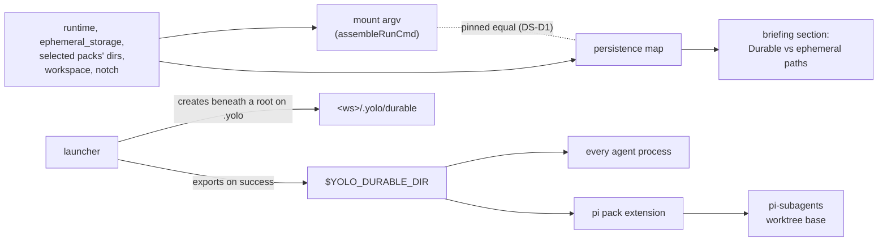

# Where an agent's work survives a restart, and why it keeps choosing /tmp

**Status:** DESIGN, 2026-09-28. Nothing built. Evidence verified at `06f194b3`, in a podman jail
on a rootless Linux host, the same day ([Appendix A](#appendix-a--the-measured-runs)).

> **In short.** The agent chose `/tmp` because nothing it reads says where durable space is,
> and the one place that tries says the whole home is *"persistent across sessions"* when most
> of it is read-only. So the fix is to tell the agent which paths survive, generated from the
> mounts the launch really made, and to give it one agent-neutral durable directory it can name.

**Why it matters.** A lost `/tmp` worktree turns `cd /tmp/land && …; git cherry-pick …` into
cherry-picks on `main`, ungated ([§1.1](#11-the-incident)). The same reflex is the default of
pi's subagent worktrees ([§2.4](#24-where-each-agents-workflow-tooling-puts-worktrees)).

**The shape.** A **persistence map** ([§1.2](#12-terms)) feeds a briefing section. A **durable
dir** at `<workspace>/.yolo/durable` is exported as `$YOLO_DURABLE_DIR`. The pi pack points
pi-subagents at it.

**Cost.** Every jail briefing grows by about eight lines. Durable worktrees accumulate until
someone removes them ([OQ-DS2](#OQ-DS2)).

**Start at [§4](#4-the-proposed-shape)**, the shape. The rest supports it.

**Needs your ruling:** [OQ-DS1](#OQ-DS1), [OQ-DS2](#OQ-DS2), [OQ-DS3](#OQ-DS3).

**Reads with:** [`jail-home.md`](../reference/jail-home.md) (the mount stack this reads from),
[`perf-logging.md`](../reference/perf-logging.md#the-linger-was-the-scratch-volumes) (why `/tmp`
is per-launch), and [§12](#12-the-neighbors). There is no companion plan sketch yet. The first
slice ([§8](#8-the-first-build-slice)) is small enough to be planned from this doc.

---

## 1. The verdict, and the words it uses

**Tell the agent the truth about its paths, and give it one durable place with a name.** Do not
make `/tmp` durable, and do not try to catch the mistake as it happens. Three principles carry
the design, numbered so the ledger can cite them:

- <a id="DS-P1"></a>**DS-P1. The briefing describes the mounts the launch made, not a
  hand-written summary of them.** A hand-written line has already drifted: the `Home` line says
  *"persistent across sessions"* while `/home/agent` is mounted `ro`
  ([§2.1](#21-a-podman-jail-measured)). Only a list derived from the launch's own inputs can stay
  true when a pack adds a writable directory.
- <a id="DS-P2"></a>**DS-P2. The durable place belongs to no agent.** Core does not know what an
  agent is ([`AGENTS.md`](../../AGENTS.md)). A hand-made worktree, a landing tree or a build
  cache any agent needs next session goes to one path every agent is told about. Each agent's
  own tool keeps its own default where that default is already durable.
- <a id="DS-P3"></a>**DS-P3. `/tmp` stays per-launch, and the briefing says so.** A jail's `/tmp`
  is deleted when the jail exits, deliberately ([§5](#5-alternatives-considered), row E). The
  fix is the location, not a check before each use. The orchestrator's note on the incident
  concluded the same: *"the fix is the LOCATION, not a check before using it."*

### 1.1 The incident

On 2026-09-28 the orchestrating Claude agent in this repository used `/tmp/land` as its landing
worktree for cherry-picks and gates. Its memory file records what followed, quoted as written:

> `/tmp` and `/var/tmp` in a jail are per-launch scratch volumes, deleted when the jail stops,
> so `/tmp/land` vanished across a session restart. `cd /tmp/land && git checkout --detach main
> && …; for c in …; do git cherry-pick $c; done` then skipped the checkout (the `&&`
> short-circuits) and ran the cherry-picks in `/workspace` ON `main`, ungated. Minutes after
> writing that down I re-created `/tmp/land` anyway, because the memory above still named it.

The maintainer's ask, 2026-09-28: *"can we do something to help agents pick a good place for
worktrees when running workflows with parallel changes? /tmp ends up being a popular option, but
then is lost on jail restart. not sure how much convincing we can really do here, but at a
minimum we need to make clear where is durable scratch space vs ephemeral across restarts scratch
space. the confusion arises because /home/agent is mostly readonly and confusing to them."* And:
*"Examine why you ended up picking temp here and fix things so that you won't do that in the
future. And this should work for both pi and Claude and anywhere else with workflows."*

It was not the first time. On 2026-09-14 this repository's `.git/worktrees` held two prunable
entries, `/tmp/yolo-base-wt` and `/tmp/yolo-prev-wt`, whose directories were already gone
([`disk-levers-and-backfill.md`](disk-levers-and-backfill.md), the worktrees row).

### 1.2 Terms

- **Durable** *(used here in one sense)*: survives the jail's exit and the next launch of the same
  workspace. It does not mean backed up, and it does not mean shared across workspaces.
- **Per-launch** *(used here in one sense)*: created for one fresh launch, shared by every
  terminal that attaches to that jail, and deleted after the jail exits.
- **Persistence map** *(coined here)*: the list of paths a launch makes writable or read-only,
  each with a durability class and a scope, computed from the same inputs that build the mount
  argv. It is not a new source of truth about mounts, and it is not configurable. It is a view
  of the mount plan, and [DS-D1](#DS-D1) pins it to that plan.
- **Durable dir** *(coined here)*: `<workspace>/.yolo/durable`, the agent-neutral durable
  directory this design adds, exported as `$YOLO_DURABLE_DIR`. It is not "scratch": in this
  repository, **scratch volumes** already names the four per-launch mounts
  ([`perf-logging.md`](../reference/perf-logging.md#the-linger-was-the-scratch-volumes)), and
  `.yolo/scratch-rm.lock` is the lock of the process that deletes them. Naming the durable place
  "scratch" would put the word agents read as "throwaway" on the one path that is not
  ([OQ-DS1](#OQ-DS1)).

## 2. What exists today, measured

Every fact carries one of three marks. **MEASURED** means read in this jail on 2026-09-28
([Appendix A](#appendix-a--the-measured-runs)). **SOURCED** means read from code or documentation,
named beside it. **INFERRED** means reasoned from the other two and not observed.

### 2.1 A podman jail, measured

| Path | What it is | Survives the jail's exit? | Mark |
| :--- | :--- | :--- | :--- |
| `/workspace` | a `rw` bind of the host directory | **yes**, it is the host's | MEASURED |
| `/workspace/node_modules`, `/workspace/.venv` | separate `rw` binds from `<ws>/.yolo/home/venv-shadows/`, not the host's own directories | yes, per workspace | MEASURED |
| `/home/agent` | a `ro` bind of this jail's own home skeleton, `<state>/agents/<cname>/home/<stamp>` | read-only; writing fails | MEASURED |
| `~/.claude`, `~/.codex`, `~/.config`, `~/.gemini`, `~/.local`, `~/.npm-global`, `~/.pi`, `~/.ssh`, `~/go`, `~/.yolo/bin` | `rw` binds from `<ws>/.yolo/home/<name>` (the leading dot stripped) | yes, **this workspace only** | MEASURED |
| `~/.cache`, `~/.claude-shared-credentials`, `~/.gemini-shared-credentials`, `~/.pi-shared-npm`, `/mise` | `rw` binds from the machine store under `~/.local/share/yolo-jail/` | yes, **shared by every workspace** | MEASURED |
| briefings, skills, pack `files`, `~/.config/git/config` | `ro` binds layered over the writable dirs | read-only | MEASURED |
| `/tmp`, `/var/tmp`, `/var/lib/containers`, `/var/cache/containers` | podman named volumes `<cname>.scratch.<launch id>.<slot>`, here `yolo-yolo-jail-887995ca.scratch.8f8998f9beed5fd9.tmp` | **no** | MEASURED name; SOURCED lifetime |
| `/run`, `/dev/shm` | `tmpfs` | no | MEASURED |

**When the per-launch volumes go** (SOURCED, `internal/cli/run/scratchremoval.go`,
`internal/cli/run/runmount.go`, `internal/prune/scratchvolumes.go`):

1. A fresh launch mints a 16-hex launch id (`newScratchLaunchID`), so no relaunch can be handed
   an earlier session's volumes, *"since podman silently reuses a named volume that exists."*
2. An attach mounts nothing and shares the running container's volumes; `scratchVolumes` is
   *"Empty on an attach, which mounts nothing."* Every terminal attached to a jail sees one
   `/tmp`.
3. When the owning launch's command exits, the container stops, its attached sessions end, and
   the launcher starts one detached `yolo internal scratch-rm`. That process waits up to one
   minute for podman to say no container references the volumes, empties them, and removes
   them.
4. A volume the remover never reached is removed by the next launch's housekeeping once it is
   dangling and past the age floor, or by `yolo prune --apply`.
5. Under `ephemeral_storage: "tmpfs"` the same four paths are `tmpfs`, in RAM, gone at exit.

This is the Window A fix of 2026-09-28. `/tmp` was already per-launch: the volumes were
anonymous, and `podman run --rm` deleted them in the client while the terminal waited, 32 s after
a 59-hour session ([`perf-logging.md`](../reference/perf-logging.md#the-linger-was-the-scratch-volumes)).
Naming them moved the deletion off the terminal's critical path. It did not change what survives.

### 2.2 Apple Container and macos-user, sourced

| | Apple Container | macos-user |
| :--- | :--- | :--- |
| Workspace | `/workspace`, a `rw` bind (SOURCED `appleContainerBaseMounts`) | the host directory at its real path; there is no `/workspace` (SOURCED `briefing.go`) |
| Home | the whole `<ws>/.yolo/home` bound `rw` at `/home/agent`, so **all of home is durable per workspace**; machine-scope dirs are nested binds (SOURCED) | `/Users/_yolojail`, one account home **shared by every workspace**; the workspace tier is symlinks into `<ws>/.yolo/home` (SOURCED [`reference/macos-user-home-tiers.md`](../reference/macos-user-home-tiers.md)) |
| `/tmp`, `/var/tmp` | `tmpfs`, in the VM's RAM, gone when the container stops (SOURCED) | the machine's own `/private/tmp` and `/var/folders`, writable by the Seatbelt profile (SOURCED `SeatbeltProfile`). It **survives the launch**, is shared with the host user and every other workspace, and is cleared by macOS at reboot and by its periodic cleanup (INFERRED, not measured here) |
| `/var/lib/containers` | `tmpfs` | not in the writable set |

**macos-user inverts the podman risk.** A `/tmp` worktree there survives a restart. It collides
instead: two workspaces that both choose `/tmp/land` share one directory, and a Mac reboot
deletes it (INFERRED).

### 2.3 The host notch

`yolo host -- <agent>` runs the agent as the human's own process with no mount namespace
(SOURCED [`host-notch-services.md`](host-notch-services.md)). `/tmp` is the host's own and
survives an agent restart. Whether it survives a reboot depends on the host: it is a `tmpfs` on
many Linux distributions (INFERRED). The host briefing is one file in the real home, shared by
every project, composed by `HostBriefingBase` as the confinement header and nothing else
(SOURCED `internal/jailcontent/briefing.go`).

### 2.4 Where each agent's workflow tooling puts worktrees

| Agent | Tool | Where its worktrees go | Durable in a podman jail? | Configurable? | Mark |
| :--- | :--- | :--- | :--- | :--- | :--- |
| claude | Agent `isolation: worktree`, the Workflow tool, `--worktree`, `EnterWorktree` | `<repo>/.claude/worktrees/<name>/` | **yes**, under the workspace bind | a `WorktreeCreate` hook replaces creation entirely | MEASURED: `agent-*` and `wf_*` dirs there; SOURCED [Claude Code worktrees](https://code.claude.com/docs/en/worktrees) |
| pi | pi-subagents 0.35.1, `worktree: true` | **`os.tmpdir()`**, that is `/tmp`, as `pi-worktree-<runId>-<index>` | **no** | `worktreeBaseDir` in `~/.pi/agent/extensions/subagent/config.json`, else `PI_SUBAGENTS_WORKTREE_DIR` | SOURCED `src/runs/shared/worktree.ts` (`resolveWorktreeBaseDir`) and its README |
| pi | pi-dynamic-workflows 3.13.0 (and the npm `@quintinshaw` build) | `<repo>/.pi/worktrees/<slug>-<uuid>` | yes | no; the path is hard-coded | SOURCED `src/worktree.ts` (`createWorktree`) |
| codex | managed worktrees (the app, and the CLI's `--worktree`) | `$CODEX_HOME/worktrees`, so `~/.codex/worktrees` | yes, `~/.codex` is a per-workspace bind | no, per [openai/codex#10599](https://github.com/openai/codex/issues/10599) | SOURCED, third-party; no such dir exists in this jail yet |
| opencode | sandboxes (linked worktrees) | `~/.local/share/opencode/worktree/` | yes, `~/.local` is a per-workspace bind | not found | SOURCED weakly, from issue reports ([anomalyco/opencode#15911](https://github.com/anomalyco/opencode/issues/15911)); not read in source |
| copilot, agy, omp | none found | — | — | — | not found; UNVERIFIED |

**Two things follow.** First, pi-subagents is **the one shipped workflow tool that defaults to
the per-launch path**. It cleans its worktrees in `finally` blocks, so a finished run leaves
nothing behind. A run interrupted by a restart leaves a branch and a stale registration in
`.git/worktrees` (INFERRED). Second, every other tool's default is already durable in a podman
jail, by accident of where the pack binds live. The agent's own hand-made worktree is the case
nothing covers, and it is what the incident was.

**Whether `.claude/worktrees` is git-excluded is not yolo's doing.** yolo writes no
`.git/info/exclude` and no repo `.gitignore` entry for it (`rg 'info/exclude' internal cmd`
finds none; MEASURED). This checkout excludes it through a block in `.git/info/exclude` headed
`# claude-code-runtime` (MEASURED). That header points at Claude Code as the writer (INFERRED).
Claude Code's own docs still tell the user to add `.claude/worktrees/` to `.gitignore` (SOURCED).
So in another repository a Claude worktree may show as untracked. pi's `.pi/worktrees` is ignored
by nothing, here or anywhere (MEASURED here).

### 2.5 Why the agent picked /tmp

The four causes the orchestrator found, each checked:

1. **Its own memory prescribed it.** The memory said *"one full suite at landing from ONE warm
   landing worktree (`/tmp/land`, reused)"*. It now names `/workspace/.claude/worktrees/land`
   (MEASURED). That fix is the user's own and is already made ([§4.7](#47-placement-core-a-pack-or-the-user)).
2. **The briefing is silent, and one line of it is wrong.** It says *"**Home**: `/home/agent`
   (persistent across sessions)"* on both arms (`internal/jailcontent/briefing.go:595` and
   `:605` at `06f194b3`). It never says that most of home is read-only, that `/tmp` and
   `/var/tmp` are per-launch, or where durable scratch goes. "Persistent" reads as permission to
   write anywhere in home. A write there fails, so the agent falls back to `/tmp`.
3. **`/tmp` is the universal reflex.** The Claude Code harness also hands the agent a scratchpad
   under `/tmp/claude-0/…` and tells it to use that *"instead of `/tmp`"* (MEASURED in this
   session's own instructions). That is right for throwaway files. It reinforces "temporary work
   goes under `/tmp`" for everything else, and pi-subagents encodes the same reflex as its
   default.
4. **The right answer existed and nothing pointed at it.** Claude's Agent and Workflow
   worktrees go to `<repo>/.claude/worktrees/`, which is durable and, in this checkout,
   excluded. They survived the restart; `/tmp/land` did not.

## 3. The constraints

- **The workspace is the only writable path shared by every jail backend.** The home differs on
  each: a `ro` skeleton with punches (podman), fully writable (Apple Container), one account home
  shared by every workspace (macos-user). `<workspace>/.yolo/` is writable on all three with no new
  mount, and it is git-ignored by a bare `*` yolo writes into it
  (`paths.WorkspaceStateIgnore`, SOURCED).
- **Host code in jail-writable state works beneath an `os.Root`**
  ([`jail-home.md`](../reference/jail-home.md#host-code-in-jail-writable-state)). `.yolo` is
  jail-writable through the workspace bind. A path the host creates there must be created beneath
  a root on `.yolo`, and anything the host later reads there may be a link the last jail left.
- **Pack `env` values are literal** (`packdecl.KindEnv`: *"Values are literal strings only (no
  interpolation, no host reads)"*, SOURCED). A pack cannot spell "the workspace's durable dir"
  in an `env` value, because the workspace path differs per backend.
- **Claude Code resists a redirected worktree.** It refuses to create a worktree when `.claude`,
  `.claude/worktrees` or the worktree is a symlink. It asks approval to enter a path outside
  `.claude/worktrees/` except in `bypassPermissions` mode. Its cleanup sweep keeps a worktree
  that lacks its own marker, which includes every worktree a `WorktreeCreate` hook makes
  (SOURCED [Claude Code worktrees](https://code.claude.com/docs/en/worktrees)).
- **A worktree made in a container jail records jail paths.** Its admin file names
  `/workspace/.claude/worktrees/<name>/.git` (MEASURED). On the host, `/workspace` does not
  exist, so the host's `git worktree prune` treats it as missing, and `gc` eventually removes its
  admin files (SOURCED [git-worktree](https://git-scm.com/docs/git-worktree)). This is true of
  `.claude/worktrees` today and of any in-workspace location ([§6](#6-costs-and-risks)).

## 4. The proposed shape



### 4.1 The persistence map and the briefing section

**The trigger.** Every invocation that writes briefings, attach included, computes the map. The
map is a pure function of the launch's runtime, `ephemeral_storage`, the selected packs'
writable and shared dirs, the workspace, and the notch. It reads the definitions the argv
reads (`prune.ScratchSlots`, `paths.HomeSurfaces`, `packload.WritableDirs`,
`packload.SharedDirs`), never a second list.

**Its classes**, in the order the section renders them:

| Class | Meaning | podman members |
| :--- | :--- | :--- |
| durable, this workspace | survives exit; one per workspace | the workspace, the durable dir, each writable home dir bound from `.yolo/home`, the per-side shadows |
| durable, every workspace | survives exit; shared machine-wide | `~/.cache`, `/mise`, each machine-scope pack dir |
| read-only | a write fails | the rest of home, staged briefings and skills, `/ctx/*`, `/opt/yolo-jail` |
| per-launch | deleted after the jail exits; shared by attached terminals | the four scratch-volume paths, `/run`, `/dev/shm` |

**The section**, "Durable vs ephemeral paths", renders after the Environment section and before
the Loopholes section. It replaces the `Home` line's *"(persistent across sessions)"* with
*"(mostly read-only; see below)"* on podman, and with the true description on each other backend.
For podman it reads like this. The wording is the implementer's; the facts and their order are
not:

```markdown
## Durable vs ephemeral paths

- **Survives this jail, this workspace only**: `/workspace` (the host's own files);
  `$YOLO_DURABLE_DIR` (`/workspace/.yolo/durable`, git-ignored); and in home only
  `~/.claude`, `~/.config`, `~/.local`, `~/go`, `~/.npm-global`, `~/.pi`, `~/.ssh`.
- **Survives, shared by every workspace on this machine**: `~/.cache`, `/mise`,
  `~/.claude-shared-credentials`.
- **Read-only**: everything else under `/home/agent`, the briefing and skills files, `/ctx`.
- **Deleted when this jail exits** (every attached terminal shares them): `/tmp`,
  `/var/tmp`, `/var/lib/containers`, `/var/cache/containers`, `/run`, `/dev/shm`. A
  scratchpad a harness hands you under `/tmp` is in this set.
- **Worktrees and anything you need next session**: `$YOLO_DURABLE_DIR/worktrees/<name>`,
  never `/tmp`. Drive them with `git -C <path>`, not `cd <path> && …`.
```

**Per-backend wording.** Apple Container says the whole home survives and `/tmp` is in RAM.
macos-user says the home is shared by every workspace, and that `/tmp` survives this launch but
is the machine's own, shared with every workspace and cleared at reboot. The host notch is
[OQ-DS3](#OQ-DS3).

**Degenerate inputs.** A class with no members renders no bullet. A pack with no writable dirs
contributes nothing. A launch where the durable dir could not be made renders its bullet as
*"none this launch: `<reason>`"* and drops the worktree bullet's path, so no agent is sent to a
path that does not exist ([§4.5](#45-failure-paths)).

### 4.2 The durable dir

- **Path.** `<workspace>/.yolo/durable`, at the workspace's in-jail spelling: `/workspace/.yolo/durable`
  on the container backends, the real path on macos-user. The name is [OQ-DS1](#OQ-DS1)'s.
- **One writer of the directory itself: the launcher**, on every fresh launch and on every
  backend, beneath a root on `.yolo` opened with `paths.OpenStateDirRoot`, mode `0755`, after
  `EnsureWorkspaceStateDir` has made `.yolo` and its ignore file. An existing directory is left
  as it is. Its contents belong to the agents.
- **The variable.** `YOLO_DURABLE_DIR` holds the absolute in-jail path. It is set in the
  environment every agent process inherits, attaches included, **only when the directory
  exists at launch**. Never set to a missing path.
- **Forbidden.** Host code never reads, walks, follows or removes anything beneath the durable
  dir. The one existing walker, `yolo check`'s size total (`dirSizeBytes` over `.yolo`), uses
  `lstat` and follows nothing; whether it keeps counting the dir is [OQ-DS2](#OQ-DS2)'s.
  `yolo prune` never deletes from it without that ruling.
- **No exclude writes.** `.yolo/.gitignore`'s `*` already hides it, so yolo adds nothing to a
  repository's `.gitignore` or `.git/info/exclude` ([DS-D6](#DS-D6)).

### 4.3 The worktree convention

- A hand-made worktree goes to `$YOLO_DURABLE_DIR/worktrees/<name>`, where `<name>` names the
  task (`land`, `fix-footer`), not a timestamp.
- A tool that already has a durable default keeps it: `.claude/worktrees/`, `~/.codex/worktrees`,
  `.pi/worktrees`, `~/.local/share/opencode/worktree` ([DS-D5](#DS-D5)).
- **Concurrency.** Two agents choosing one name get git's own refusal (`already exists`), which
  is the right answer; the convention adds no lock. Attached terminals share the directory, as
  they share the workspace.
- **Removal** is the creator's, with `git worktree remove`. yolo removes none
  ([OQ-DS2](#OQ-DS2)).

### 4.4 Per agent

| Agent | What reaches it | Change |
| :--- | :--- | :--- |
| claude | briefing via `~/.claude/CLAUDE.md`; env | **pack prose only**: one line in the claude pack's briefing that its Agent and Workflow worktrees under `.claude/worktrees/` are durable here and should stay there. No `WorktreeCreate` hook ([DS-D5](#DS-D5)) |
| pi | briefing via `~/.pi/agent/AGENTS.md`; env | **a pi pack extension** sets `PI_SUBAGENTS_WORKTREE_DIR` to `$YOLO_DURABLE_DIR/worktrees/pi-subagents` when it is unset and `YOLO_DURABLE_DIR` is set ([DS-D4](#DS-D4)); plus one line of pack prose naming `.pi/worktrees` as durable but not git-ignored |
| codex | briefing via `~/.codex/AGENTS.md`; env | none; its default is durable |
| opencode | briefing via `~/.config/opencode/AGENTS.md`; env | none |
| copilot, agy, omp | each pack's briefing destination; env | none; they get the core section and the variable |

**Why an extension and not a pack `env` value for pi.** The value must name the workspace, which
is `/workspace` on two backends and the real path on the third, and `env` values are literal
([§3](#3-the-constraints)). A relative value (`.yolo/durable/…`) resolves against pi's repository
root, which inside a nested repository or another worktree is not the workspace. pi-subagents
reads the variable when each run starts (`resolveWorktreeBaseDir`), so an extension that sets it
when it loads is in time. At the host notch `YOLO_DURABLE_DIR` is unset and the extension does
nothing.

### 4.5 Failure paths

| Failure | What happens | Who finds out |
| :--- | :--- | :--- |
| `.yolo` is a symbolic link | `OpenStateDirRoot` refuses; no dir, no variable | the briefing names the reason; the launch prints nothing new |
| a `workspace_readonly` entry covers `.yolo` | the launcher does not create it; no variable | the briefing says durable space is unavailable because the workspace is read-only there |
| `mkdir` fails otherwise (disk full, permissions) | no variable; the launch continues | the briefing names the error. It never refuses a launch: an agent without durable space is the status quo |
| the jail later deletes or replaces the durable dir | nothing; the host reads nothing beneath it | the agent, when its next write fails |
| the workspace itself is on a per-launch mount (a nested jail launched from `/tmp/yolo-nested`) | the dir is made, and it is only as durable as the outer `/tmp` | the section says the workspace itself is deleted when the enclosing jail exits. How the launcher detects this is the implementer's |

### 4.6 Every notch and backend

| | podman | Apple Container | macos-user | host |
| :--- | :--- | :--- | :--- | :--- |
| Section | generated | generated | generated | [OQ-DS3](#OQ-DS3) |
| Durable dir | `/workspace/.yolo/durable` | `/workspace/.yolo/durable` | `<real ws>/.yolo/durable`, inside the Seatbelt write set | [OQ-DS3](#OQ-DS3) |
| `/tmp` sentence | deleted at exit | in RAM, deleted at exit | the machine's own, shared, cleared at reboot | the host's own |

### 4.7 Placement: core, a pack, or the user

| Piece | Home | Why |
| :--- | :--- | :--- |
| the persistence map and the section | **core** (`internal/jailcontent`, fed by `internal/cli/run`) | only core knows the mounts ([DS-P1](#DS-P1)) |
| the durable dir and `$YOLO_DURABLE_DIR` | **core** | agent-neutral by [DS-P2](#DS-P2) |
| "Claude's worktrees here are durable" | **the claude pack's briefing prose** | names an agent's tool, which core may not |
| pi-subagents' base dir | **the pi pack** (an extension beside `yolo-openai-auth.js`) | a setting of one agent's package |
| "the landing worktree is `/workspace/.claude/worktrees/land`" | **the user's memory or own pack** | a workflow habit of one user in one repository; already fixed |
| a project's own convention for where its worktrees go | **the project's instruction file** | the project's call, which the section never overrides |

## 5. Alternatives considered

| | Alternative | Verdict |
| :--- | :--- | :--- |
| **A** | A generated briefing section | **Taken** ([§4.1](#41-the-persistence-map-and-the-briefing-section)). It is the floor the maintainer asked for, and it fixes the one false line |
| **B** | A durable, agent-neutral dir with a variable | **Taken** ([§4.2](#42-the-durable-dir)). A path the briefing can name, on every backend, with no new mount |
| **B′** | Mount it at a home path such as `~/durable` so a literal works everywhere | **Rejected.** A new punch in the podman skeleton and a new link on macos-user, to save one variable; and worktrees made under home record `/home/agent/…` paths the host cannot resolve either |
| **B″** | Endorse `.claude/worktrees` as the place for every agent | **Rejected.** It names one agent's directory in core, violates [DS-P2](#DS-P2), and is git-excluded only where Claude Code wrote the exclude ([§2.4](#24-where-each-agents-workflow-tooling-puts-worktrees)) |
| **C** | A named worktree convention under the dir | **Taken** ([§4.3](#43-the-worktree-convention)). Adding the path to a repository's exclude is unneeded, since `.yolo` ignores itself |
| **D** | A nudge at the moment of the mistake: a `git` shim that warns when `worktree add` targets `/tmp`, or a hook | **Rejected for now.** A shim named `git` sits in front of every git call every agent makes, including the ones Claude Code's isolation checks parse; a hook needs yolo to own `core.hooksPath` in someone's repository. The maintainer: *"not sure how much convincing we can really do here."* Revisit only if the section demonstrably fails to change the behavior |
| **D′** | Report, at the next launch, worktrees registered under `/tmp` whose directories are gone | **Deferred.** Cheap and truthful, but it reads the jail-writable `.git/worktrees` host-side, so it needs the `os.Root` discipline; worth doing if the first slice does not stop the pattern |
| **E** | Make `/tmp` durable (a per-workspace volume) | **Rejected** ([DS-P3](#DS-P3)). The volumes are per-launch because podman *"silently reuses a named volume that exists"*: a relaunch would be handed the last session's sockets and locks (`OVERMIND_SOCKET=/tmp/overmind.sock` is set in every jail) and the nested podman store. Their deletion cost is exactly what Window A measured at 32 s, and a durable `/tmp` would have no liveness signal to reap it by, only an age rule |
| **E′** | Point `TMPDIR` at the durable dir | **Rejected** for E's reasons: tools assume `TMPDIR` is cleaned for them |
| **F** | Configure each agent's worktree tool at the durable dir | **Taken only for pi-subagents** ([§4.4](#44-per-agent)), the one tool whose default is per-launch. Claude's `WorktreeCreate` hook is rejected ([DS-D5](#DS-D5)); codex and opencode have no setting and need none |

## 6. Costs and risks

**Costs:**

- Every jail briefing grows by five to eight lines, on every agent's instruction file.
- A new directory appears in every workspace's `.yolo`, and a new variable in every jail.
- Durable worktrees accumulate. The measured precedent is 985 MB across 20 stale trees under
  `.claude/worktrees` on 2026-09-14 ([`minimal-disk-footprint.md`](minimal-disk-footprint.md)),
  where `/tmp` would have deleted them.

| Risk | Mitigation |
| :--- | :--- |
| The section is ignored, as the harness's own instructions were | it states consequences, not preferences, and replaces the false line that invited the mistake; [§5](#5-alternatives-considered) D and D′ are the escalation |
| The section drifts from the mounts | [DS-D1](#DS-D1)'s pin fails the build when a writable destination in the assembled argv is missing from the map, or the reverse |
| A host-side `git worktree prune` or `gc` removes the registration of a jail-made worktree, because its admin file names `/workspace/…` | existing, not new: `.claude/worktrees` has it today. `worktree.useRelativePaths` fixes it but sets `extensions.relativeWorktrees`, *"making it incompatible with older versions of Git"* (SOURCED). Left to [`workspace-path-mirroring.md`](workspace-path-mirroring.md) ([§7](#7-what-this-does-not-cover)) |
| An agent writes into `.yolo` outside the durable dir, next to files yolo reads (`handover.md`, `config-boot.json`) | the section names only `$YOLO_DURABLE_DIR`, never `.yolo` itself; the jail could already write `.yolo`, so no capability is added |
| `yolo check` slows on a large durable dir | [OQ-DS2](#OQ-DS2) |
| The pi extension overrides a user's choice | it sets the variable only when unset, and pi-subagents' own `worktreeBaseDir` config outranks the variable |

## 7. What this does not cover

- **Relative worktree paths**, so the host and the jail agree on a worktree's location. That is
  a git repository-format change, and it belongs with
  [`workspace-path-mirroring.md`](workspace-path-mirroring.md).
- **Backups.** Durable means the next launch, not a copy.
- **Sharing work between workspaces.** The durable dir is per workspace; the machine store is not
  a scratch area and stays out of the section's worktree advice.
- **Reclaiming `.claude/worktrees`, `.pi/worktrees` or `~/.codex/worktrees`.** Those are their
  agents' ([`disk-levers-and-backfill.md`](disk-levers-and-backfill.md) already files them as
  *"not yolo's"*).
- **The Claude Code harness's scratchpad under `/tmp`.** yolo cannot move it; the section says
  what it is.
- **copilot, agy and omp tooling** that may appear later. The core section and the variable reach
  them; a pack line follows when a tool exists.

## 8. The first build slice

What I would build first, in order, each step shippable alone:

1. **The false line.** Replace *"(persistent across sessions)"* on both `Home` arms with the true
   description per backend. One file, one test; it stops the invitation today.
2. **The persistence map and section for podman,** with [DS-D1](#DS-D1)'s pin against the golden
   argv, and without the durable-dir bullet.
3. **The durable dir and `$YOLO_DURABLE_DIR`**, on all three jail backends, with the section's
   bullet and [§4.5](#45-failure-paths)'s failure wording.
4. **The pi extension** and the two lines of pack prose.
5. **Apple Container and macos-user wording** of the section.

Steps 1 and 2 need no ruling. Step 3 waits on [OQ-DS1](#OQ-DS1)'s name.

## 9. What done looks like

- A fresh podman jail's `~/.claude/CLAUDE.md` and `~/.pi/agent/AGENTS.md` carry the section,
  listing exactly the writable destinations `podman inspect` shows for that container, and no
  `Home` line says "persistent".
- `echo $YOLO_DURABLE_DIR` prints `/workspace/.yolo/durable` in the jail and in an attached
  terminal, and the directory exists; `git status` in the workspace shows nothing for it.
- A worktree made at `$YOLO_DURABLE_DIR/worktrees/land`, then a quit and a relaunch: the
  worktree is still there and `git -C` into it works.
- A pi-subagents `worktree: true` run in a jail creates its worktrees under
  `$YOLO_DURABLE_DIR/worktrees/pi-subagents`, not `/tmp`.
- A workspace whose `.yolo` is a symbolic link launches, has no `YOLO_DURABLE_DIR`, and its
  briefing says why.
- Adding a writable home dir to a pack without touching the map fails the unit gate.

## 10. Open Questions

No sibling ledger has ruled on a durable directory or on the briefing's path claims; the search
was `rg -i 'durable scratch|YOLO_SCRATCH|\.yolo/scratch|scratch space' docs userguide`, which
found only the per-launch scratch volumes.

1. 💬 <a id="OQ-DS1"></a>**[OQ-DS1](#OQ-DS1): What is the durable dir called, and where does it
   live?** This decides the path every briefing names and every agent will write into memory,
   so it is expensive to change once shipped.

   - **A — `<workspace>/.yolo/durable`, `$YOLO_DURABLE_DIR`.** Agent-neutral, ignored by `.yolo`'s
     own `*`, writable on every backend with no mount. The name says the one property that
     matters.
   - **B — `<workspace>/.yolo/scratch`, `$YOLO_SCRATCH`.** The maintainer's first spelling. It
     collides with the coined term **scratch volumes** for the per-launch mounts and with
     `.yolo/scratch-rm.lock`, the lock of the process that deletes them, and it tells agents
     "throwaway".
   - **C — endorse each agent's own directory**, `.claude/worktrees` and the rest, and add no dir.
     No new state, but core would name agents, and a hand-made worktree has no agent-neutral
     home.

   <!-- vantage: oq id=OQ-DS1 leaning="A: .yolo/durable and YOLO_DURABLE_DIR, because the name must say durable and scratch already means the per-launch volumes here." -->

   _Leaning:_ **A.** The failure being fixed is an agent reading "scratch" as "may vanish"; the
   name should say the opposite, and `scratch` is taken in this repository for exactly the
   paths that vanish.

   **Answer:**
   > _(empty — fill in when decided)_

2. 💬 <a id="OQ-DS2"></a>**[OQ-DS2](#OQ-DS2): Who reclaims the durable dir?** Durable means it
   grows: 985 MB of stale worktrees was measured in the Claude equivalent. This decides whether
   yolo ever deletes an agent's work, and whether `yolo check`'s size total keeps walking it.

   - **A — Report, never delete.** `yolo check` and `yolo stores` show its size as the user's,
     like `.claude/worktrees` is shown as "not yolo's"; removal stays with `git worktree remove`.
   - **B — Age-reap.** `yolo prune --apply` removes entries untouched for 30 days, as
     `PurgeCacheByAge` does for caches. A cache entry can be rebuilt; a worktree's value is its
     unlanded commits and uncommitted files, which age says nothing about.
   - **C — Nothing.** It is the user's directory; yolo neither counts nor deletes.

   <!-- vantage: oq id=OQ-DS2 leaning="A: report its size as the user's and never delete, since only the agent knows whether a worktree holds unlanded work." -->

   _Leaning:_ **A.** Deleting a worktree can destroy unlanded commits, and nothing yolo can see
   says which ones are safe. Reporting keeps the growth visible.

   **Answer:**
   > _(empty — fill in when decided)_

3. 💬 <a id="OQ-DS3"></a>**[OQ-DS3](#OQ-DS3): What does the host notch get?** The host briefing
   is one file for every project, and at the host `/tmp` is the machine's own, so the podman
   risk does not exist there. This decides whether "work anywhere" means the same variable at
   every notch.

   - **A — One static sentence in the host header, no variable.** *"`/tmp` is this machine's own:
     it survives an agent restart but may not survive a reboot; put worktrees you need later
     inside the repository or beside it."*
   - **B — The sentence, plus `$YOLO_DURABLE_DIR` for `yolo host --` launches** in a directory
     that already has a `.yolo`. The variable then exists for some host launches and not
     others, and `yolo host apply`'s rendered files can never carry it.
   - **C — Nothing at the host.**

   <!-- vantage: oq id=OQ-DS3 leaning="A: one static sentence in the host header and no variable, because host /tmp is the machine's own and a per-launch variable cannot reach host apply's files." -->

   _Leaning:_ **A.** The incident's cause is absent at the host, the host briefing cannot name a
   workspace, and a variable present only under `yolo host --` is the partial feature
   [OQ-HS3](host-notch-services.md#OQ-HS3)'s ruling accepts but does not require.

   **Answer:**
   > _(empty — fill in when decided)_

## 11. Decision Ledger

No maintainer ruling yet. These are implementation decisions under the design, each one
answer where the design leaves a mechanism open.

| ID | Ruling / Decision | Date | Settled in | Built |
| :--- | :--- | :--- | :--- | :--- |
| <a id="DS-D1"></a>[`DS-D1`](#11-decision-ledger) | *Implementation decision,* [DS-P1](#DS-P1). The section is rendered from the persistence map, which reads the argv's own definitions, and a unit test compares the map against the assembled golden argv per backend in both directions. It must fail when a writable mount is added without the map knowing, which is the "does it fail if I delete the call site" test | 2026-09-28 | [§4.1](#41-the-persistence-map-and-the-briefing-section) | — |
| <a id="DS-D2"></a>[`DS-D2`](#11-decision-ledger) | *Implementation decision.* The launcher is the one writer of the durable dir, beneath a root on `.yolo`, on every fresh launch; it exports the variable only on success, and a failure never refuses the launch | 2026-09-28 | [§4.2](#42-the-durable-dir) | — |
| <a id="DS-D3"></a>[`DS-D3`](#11-decision-ledger) | *Implementation decision.* Host code never reads, follows or removes beneath the durable dir; the existing `lstat` size walk is the only contact, pending [OQ-DS2](#OQ-DS2) | 2026-09-28 | [§4.2](#42-the-durable-dir) | — |
| <a id="DS-D4"></a>[`DS-D4`](#11-decision-ledger) | *Implementation decision.* pi-subagents is pointed at the durable dir by a pi pack extension that sets `PI_SUBAGENTS_WORKTREE_DIR` when unset, not by a pack `env` value (literal only) or a core token. It does nothing where `YOLO_DURABLE_DIR` is unset | 2026-09-28 | [§4.4](#44-per-agent) | — |
| <a id="DS-D5"></a>[`DS-D5`](#11-decision-ledger) | *Implementation decision.* Agent tools with a durable default keep it. Claude's worktrees are not redirected: a `WorktreeCreate` hook loses Claude's cleanup sweep, prompts at the host notch for a path outside `.claude/worktrees/`, and a symlinked `.claude/worktrees` is refused outright | 2026-09-28 | [§4.3](#43-the-worktree-convention) | — |
| <a id="DS-D6"></a>[`DS-D6`](#11-decision-ledger) | *Implementation decision.* yolo writes no repository `.gitignore` or `.git/info/exclude` entry; `.yolo`'s own `*` covers the durable dir | 2026-09-28 | [§4.2](#42-the-durable-dir) | — |
| <a id="DS-D7"></a>[`DS-D7`](#11-decision-ledger) | *Implementation decision,* [DS-P3](#DS-P3). `/tmp` and the other scratch volumes stay per-launch; no durable `/tmp`, no `TMPDIR` redirect | 2026-09-28 | [§5](#5-alternatives-considered) | — |

## 12. The neighbors

| Doc | Why it reads with this one |
| :--- | :--- |
| [`jail-home.md`](../reference/jail-home.md) | the mount stack the map reads, and the `os.Root` rule for host code in `.yolo`. Its sharing table files `/tmp` under "Per boot" beside "anonymous volumes"; the volumes are named and per launch now, and an attach shares them |
| [`perf-logging.md`](../reference/perf-logging.md#the-linger-was-the-scratch-volumes) | the Window A fix, and the coined term **scratch volumes** this doc avoids reusing |
| [`reference/macos-user-home-tiers.md`](../reference/macos-user-home-tiers.md) | the shared account home and the sidecar the macos-user wording describes |
| [`agent-briefings.md`](../reference/agent-briefings.md) | how the briefing is composed and where each pack's prose lands |
| [`workspace-path-mirroring.md`](workspace-path-mirroring.md) | the jail-path-in-admin-file risk ([§6](#6-costs-and-risks)), which mounting the workspace at the host's path would also close |
| [`agent-directory-map.md`](agent-directory-map.md) | classes every path in an agent's directory as state, cache or yours; the persistence map is the same idea for the mount table |
| [`disk-levers-and-backfill.md`](disk-levers-and-backfill.md), [`minimal-disk-footprint.md`](minimal-disk-footprint.md) | the measured cost of durable worktrees, and the rule that agents' worktrees are not yolo's to reclaim |
| [`host-notch-services.md`](host-notch-services.md) | the host notch's shape, and [OQ-HS3](host-notch-services.md#OQ-HS3)'s acceptance of partial features outside `yolo host --` |

## Appendix A — the measured runs

All in this podman jail at `06f194b3`, 2026-09-28.

- **The mount table**, from `/proc/self/mountinfo`: `/home/agent` `ro` from
  `agents/yolo-yolo-jail-887995ca/home/20260929T012713Z-2729440127`; `rw` children from
  `code/yolo-jail/.yolo/home/{claude,codex,config,gemini,local,npm-global,pi,ssh,go,yolo-bin}`
  and from `.local/share/yolo-jail/{cache,home/.claude-shared-credentials,home/.gemini-shared-credentials,home/.pi-shared-npm,mise}`;
  `/tmp` from the volume `yolo-yolo-jail-887995ca.scratch.8f8998f9beed5fd9.tmp`, and
  `/var/tmp`, `/var/lib/containers`, `/var/cache/containers` from the same launch id's other
  three slots; `/workspace` `rw` from `code/yolo-jail`; `/workspace/.venv` and
  `/workspace/node_modules` from `.yolo/home/venv-shadows/`.
- **Worktrees**: `/workspace/.claude/worktrees/` holds `agent-*` (Agent isolation), `wf_*`
  (Workflow) and `land`; `.git/worktrees/land/gitdir` reads `/workspace/.claude/worktrees/land/.git`.
- **Excludes**: `.git/info/exclude` carries `**/.claude/worktrees/` under `# claude-code-runtime`;
  `.gitignore` has `.yolo/` and nothing for `.pi/`; `.yolo/.gitignore` is the bare-`*` file.
- **pi**: `~/.pi/agent/settings.json` lists `pi-subagents` and `pi-dynamic-workflows`;
  `~/.pi-shared-npm/node_modules/pi-subagents` is 0.35.1 and `resolveWorktreeBaseDir` returns
  `os.tmpdir()` when neither setting is present.
- **git** is 2.55.0.
- **Not measured here**: macos-user's `/tmp` cleanup, Apple Container, the host notch, codex's
  and opencode's worktree paths in source, and any copilot, agy or omp worktree tool.
