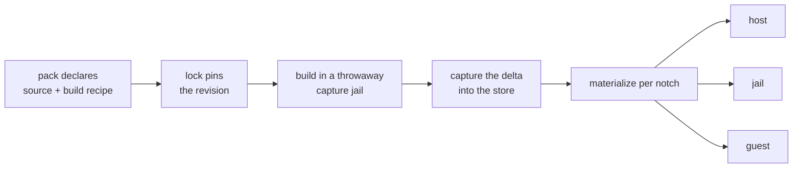

# A fork is a package with no registry — distributing source-built programs through a pack

**Status:** DESIGN, 2026-09-21. Nothing built. Evidence verified against `80f294c1`.

> **In short.** A fork is not a new kind of thing — it is the `installer` route with the
> registry removed and a build step added, and capture already exists for exactly that
> class. What the fork breaks is capture's quiet precondition: relocation is free today
> only because a capture is materialized into the same absolute home it was made in.

**Why it matters.** `via:` is a closed set of two, `npm` and `installer`
([`contributes.go:496-497`](../../internal/packdecl/contributes.go)), and a fork satisfies
neither. Today distributing one means installing it by hand on every machine — which is the
thing packs exist to delete.

**The shape.** A third delivery route on `kind: "program"`: a pinned source address, a build
recipe, one build in a throwaway capture jail, and the existing capture store as the
artifact's home for every notch that asks for it.

**Cost.** Relocation stops being a `macos-user` special case and becomes the general case, on
a path that has never run outside unit tests. Every consumer pays a local build.

**Start at [§5](#5-relocation-is-the-design-not-the-build)** — the build is the easy half.

**Needs your ruling:** [OQ-FP1](#OQ-FP1), [OQ-FP2](#OQ-FP2), [OQ-FP3](#OQ-FP3),
[OQ-FP4](#OQ-FP4), [OQ-FP5](#OQ-FP5), [OQ-FP6](#OQ-FP6).

**Reads with:** [`forked-programs-as-packs-plan.md`](forked-programs-as-packs-plan.md) (the
implementation sketch — incomplete, and unstable while the questions above are open),
[`program-delivery.md`](program-delivery.md) (the `via` routes and the PATH ruling this
extends), [`install-capture.md`](../plans/install-capture.md) (the capture mechanism as built).

---

## 1. Goal and non-goals

**Goal.** A pack declares a program built from source at a pinned revision. Selecting that
pack in a config is the whole installation act, on every machine, at every notch that can
run the program.

**Non-goals**, each because it was considered and set aside rather than forgotten:

- **A remote build cache.** Ruled out by the maintainer up front: a fork consumer pays the
  local build. No substitute-server, no binary cache, no signing.
- **Reproducible builds.** The capture is trusted because *you* built it, not because two
  builds agree. Nothing here verifies a build against a reference.
- **Cross-compilation.** A notch gets an artifact built for its own platform, or it gets
  nothing. Building Linux artifacts on a Mac is out.
- **Patch-set management.** yolo delivers *a revision of a repository*. Maintaining the fork
  — rebases, patch queues, upstream tracking — is git's job and stays outside.
- **Agent-specific anything.** A forked agent is the motivating case and gets no special
  path; see [§3](#3-why-this-is-not-an-agent-feature).

## 2. What exists today, precisely

| Piece | What it is | Where |
| :--- | :--- | :--- |
| `via: "npm"` | `npm install -g <package>`, version optionally in the spec | [`contributes.go:496`](../../internal/packdecl/contributes.go) |
| `via: "installer"` | run a vendor script and keep whatever it did | [`contributes.go:497`](../../internal/packdecl/contributes.go) |
| Capture store | `<CapturesDir>/entries/<key>/tree/`, unpacked, with `.yolo-capture-complete` written last | [`capture/store.go`](../../internal/capture/store.go) |
| Materialize | reflink → hardlink → copy | [`capture/materialize.go`](../../internal/capture/materialize.go) |
| Relocation | records every absolute reference to the capture-time home, and decides whether the entry may move at all | [`capture/relocate.go`](../../internal/capture/relocate.go) |
| Capture jail | a throwaway jail in a temp workspace, deliberately **without** the capture store mounted | [`capturehost.go:313`](../../internal/cli/capturehost.go) |
| Source addressing | `Addr`, `Lock`, `store` — how a *pack* is already fetched and pinned | [`internal/packsrc`](../../internal/packsrc) |
| Notches | `host`, `jail`, `guest` — and `guest` refuses every verb | [`render/fieldset.go`](../../internal/render/fieldset.go) |

Two of these settle most of the design before it starts.

**Capture is already the right shape.** Its own plan says what it is for: *"the manifest, the
offline deterministic materialize, drift against an immutable reference, and a lockable
identity for the one dependency class with no native lockfile"*
([`install-capture.md`](../plans/install-capture.md)). A fork is that class exactly — an
opaque build whose output is the only artifact and which no registry will version for you.

**`packsrc` already pins sources.** A pack's own source is an `Addr` resolved to a locked
revision. A fork's source is the same problem one level down, and reusing that vocabulary is
the difference between one pinning mechanism and two.

## 3. Why this is not an agent feature

The motivating case is a forked `pi`, and it would be easy to build a forked-agent feature.
That would be wrong twice over.

**`kind: "program"` already knows nothing about agents.** Core has no agent registry — *agents
are packs*, and a pack that installs an agent is just one declaring a `program` surface. A
fork route that only worked for agents would be the first thing in the delivery vocabulary to
care, and every later consumer would have to pretend to be an agent to use it.

**The generality is free here, which is rare.** The build-capture-materialize pipeline does not
inspect what it built. A forked linter, a patched language server and a forked agent are one
mechanism; only the `bin` name differs.

> [!NOTE]
> **What *is* agent-shaped is the confinement question, and it is separable.** An agent gets
> launch flags and an autonomy posture from its pack. Those are existing contributions keyed
> on the `bin`, and they attach to a forked program exactly as they attach to an npm one —
> the fork route neither knows nor changes them.

## 4. The proposed shape

A third delivery route on `kind: "program"`. The pack carries **where the source is** and
**how to build it**; the lock carries **which revision**; the capture store carries **the
result**.

**The five steps, and who owns each:**

1. **Declare.** The pack names a source address, a build command, and what the build is
   expected to produce. Sketch of the surface, not a schema: the address reuses `packsrc.Addr`;
   the build is a command line, not a script file, so it is readable in the manifest.
2. **Pin.** The address resolves to an immutable revision, recorded in a lock beside the
   existing pack lock. **Resolution is an explicit act, never a launch side effect** — the
   same rule `packsrc` already follows.
3. **Build.** In a throwaway capture jail, which is where `yolo capture` already builds. The
   build never runs on the host ([§7](#7-trust-and-what-the-build-may-touch)).
4. **Capture.** The delta becomes a store entry under a key that includes the revision, the
   build recipe and the platform ([§6](#6-identity-what-keys-a-fork-entry)).
5. **Materialize.** Each notch that asks for the program gets the entry materialized into its
   own tree, subject to [§5](#5-relocation-is-the-design-not-the-build).

**What is deliberately *not* new:** the store, the manifest, the completion marker, the
reflink/hardlink/copy ladder, the GC, the selection rule, and the PATH position a program
occupies once installed. All of that is capture's, unchanged.

## 5. Relocation is the design, not the build

This is the section the rest of the doc exists to reach.

Capture is cheap on the container backends for one stated reason:

> *"On the container backends the capture home and the materialize home are the same string —
> `/home/agent`, both times — so an absolute self-reference an installer embeds is still
> correct after materialization and there is nothing to rewrite."*
> — [`relocate.go:6-10`](../../internal/capture/relocate.go)

**A cross-notch artifact breaks that precondition by definition.** The jail's home is
`/home/agent`; the host's is the real user's; the guest's is whatever Phase 7 decides. One
artifact delivered to two of them cannot have been built in both their homes. So relocation
stops being a `macos-user` carve-out and becomes the general case.

Three facts make that worse than it sounds, and they are the reason this is a design question
rather than an implementation detail:

- **Relocation's recording half exists and its necessity is unmeasured.** The scan, the
  text/binary classification and the relocatable decision are unit-tested against real files.
  What has never run is the backend that needs them — no Seatbelt profile has been loaded by a
  kernel ([`relocate.go:22-29`](../../internal/capture/relocate.go)).
- **A source build embeds more than an installer does.** An installer writes scripts and
  symlinks. A compiler writes `RUNPATH`s, interpreter lines, embedded prefixes and debug paths
  — some in binaries, where a textual rewrite is not available.
- **Relocation may legitimately refuse.** The existing design's other branch is *"the entry
  says it cannot be moved"*. For a fork that refusal is not an error state to engineer away;
  it may be the honest answer.

[OQ-FP1](#OQ-FP1) is which strategy this takes, and it is the doc's central question. The
three candidates, with what each costs:

| Strategy | How | Cost |
| :--- | :--- | :--- |
| **Build per notch** | one build per notch that wants the program | N builds; no relocation at all; the artifact is always correct |
| **Build once, relocate** | one build, rewrite absolute refs per materialization | 1 build; rests on an unmeasured path; binaries may be unrewritable |
| **Build once, fixed prefix** | build and run at one absolute path every notch can offer | 1 build; no rewriting; needs a path every notch can supply, which the host cannot create without privilege |

My leaning is **build per notch**, and the reason is that it is the only one of the three whose
failure mode is *cost* rather than *a subtly wrong binary*. The maintainer has already accepted
the local build cost; paying it twice is a smaller price than a fork that runs on the host with
a jail's `RUNPATH`.

## 6. Identity: what keys a fork entry

An npm program is identified by name and version. A fork has neither, so the key is derived
from everything that could change the bytes:

- the **resolved revision** of the source (not the ref — a branch name is not an identity);
- the **build recipe**, hashed, so editing the command invalidates the entry;
- the **platform** the build ran on (OS and architecture);
- the **notch**, if [OQ-FP1](#OQ-FP1) rules build-per-notch.

**Anything not in that list is asserted not to change the output.** The toolchain version is the
uncomfortable one: a different compiler produces different bytes from the same inputs, and
including it means a toolchain bump rebuilds every fork. [OQ-FP2](#OQ-FP2).

> [!WARNING]
> **A branch ref must never key an entry.** `main` names different bytes on different days,
> and an entry keyed on it would be a cache that silently serves yesterday's build forever —
> which is the failure the existing store's immutable-reference property exists to prevent.

## 7. Trust, and what the build may touch

**The build runs in a throwaway capture jail, never on the host.** That is the existing capture
behaviour and it is worth keeping for a reason that grows here: a fork's build is arbitrary
code from a repository the pack names, and a pack may come from anywhere.

Two properties follow, and both are stated because a reasonable implementation might break
either:

- **The build gets no credentials.** A capture jail is a fresh temp workspace; it must not
  receive `env_sources`, `host_files`, or any loophole. Building a fork is not a reason to
  hand a build script the machine's secrets.
- **The build may reach the network, and that is disclosed.** Fetching dependencies is most of
  what a build does, so refusing the network would refuse the feature. The existing pack
  disclosure banner already says when a pack runs code and reaches the internet; a fork build
  is one more line in it, not a new channel.

**The artifact then runs on the host**, which is the real escalation and is not new — a
`via: "installer"` program already does. What *is* new is that the bytes came from a build the
pack author controls rather than a vendor's release. [OQ-FP6](#OQ-FP6) asks whether that
deserves its own disclosure.

## 8. Notch coverage, and the one that does not exist

| Notch | Can it run a forked program? | Why |
| :--- | :--- | :--- |
| **jail** | yes | the capture store is already bound `:ro` into every launch |
| **host** | yes, subject to [§5](#5-relocation-is-the-design-not-the-build) | the host materializes into the real user's home |
| **guest** | **not yet, and not because of this design** | every verb at that notch refuses today |

> [!IMPORTANT]
> **`guest` uniformity is a forward-compatibility claim, not a shippable property.**
> `render.NotchUnbuilt` is the one sentence both `yolo apply --at guest` and the launch gate
> print — the notch is env-manager Phase 7, the only unbuilt phase. So "uniform across host,
> jail and guest" means: **nothing in this design may be keyed on the notch set being two**,
> and guest inherits the route when Phase 7 lands. It does not mean guest works.

**`macos-user` is the interesting backend**, not a footnote: it has no mounts, so its capture
already runs against a throwaway staging home and already needs relocation. A fork there is
the existing hard case, not a new one — which makes it the best place to find out whether
[OQ-FP1](#OQ-FP1)'s relocation strategy actually holds.

## 9. Failure modes

| Failure | Behaviour |
| :--- | :--- |
| Source address unresolvable (offline, gone, auth) | the **resolve** act fails and says so; no launch is affected, because resolution is never a launch side effect |
| Build fails | the program is unavailable and the reason is printed; **the launch is not refused** — a broken fork is one missing tool, not a broken jail |
| Build succeeds, produces no expected output | treated as a failed build, named as such rather than admitted as an empty capture |
| Entry is not relocatable into the asking notch | that notch does not get the program, and says which notch it was built for |
| Two builds of the same key race | the store's existing completion marker and per-program lock decide; the loser adopts the winner's entry rather than building again |
| Store entry half-written (crash mid-build) | the missing `.yolo-capture-complete` makes it detectable and it is rebuilt |
| Toolchain absent in the capture jail | a build-time failure like any other; the pack is responsible for declaring what it needs to build |

**Forbidden behaviour**, where a reasonable implementation might do otherwise:

- **Never rebuild on a timer or on every launch.** The trigger is a lock change or an explicit
  act, nothing else.
- **Never build on the host**, on any backend.
- **Never serve an entry whose key does not match what is being asked for** — a near-miss is a
  rebuild, not a substitution.
- **Never let a fork's build write outside the capture jail's own workspace and home.**

## 10. Alternatives, with verdicts

| Alternative | Verdict |
| :--- | :--- |
| **A. Tell people to publish a private npm package** | **Rejected** — it works, and it moves the cost from "build locally" to "run a registry", which is a much larger ask for one person's fork. It also forecloses forks of things that are not npm packages. |
| **B. A `mise` tool or nix derivation per fork** | **Runner-up, and the one to revisit.** Both already build from source and both already pin. Rejected for now because neither reaches the *host* notch through yolo, and because a nix derivation is a much steeper authoring cost than a build command. Feeds [OQ-FP3](#OQ-FP3). |
| **C. Ship prebuilt artifacts in the pack** | **Rejected** — a pack becomes a binary distribution channel, needs per-platform artifacts, and the maintainer explicitly accepted local builds instead. |
| **D. `via: "installer"` with a build script as the installer** | **Rejected, but it is the closest thing to free.** It would work today with no new vocabulary — and it has no pinning, no revision in the key, and no way to tell a rebuild from a re-download. That absence is the whole feature. |
| **E. Bind the fork's source into the jail and build on every launch** | **Rejected** — pays the build cost per launch instead of per revision, and makes a launch depend on a compiler. |

## 11. Sequencing

1. **The declaration and the pin**, with no build: a pack can name a source, `resolve` records
   a revision, and `yolo` reports what it would build. Nothing is built; the vocabulary is
   exercised.
2. **The build and the capture**, jail notch only. This is where [OQ-FP1](#OQ-FP1) stops being
   theoretical, because a jail-only artifact needs no relocation at all.
3. **The host notch**, which is the relocation work and should not start until step 2 has
   produced a real artifact to relocate.
4. **`macos-user`**, as the relocation proving ground.
5. **`guest`**, when Phase 7 exists.

**Done conditions**, observable rather than test names:

- A second machine, given only the config, ends up running the same forked binary — no manual
  install, no copied artifact.
- Changing the pinned revision and re-resolving produces a different binary; changing nothing
  produces no rebuild.
- A jail and the host either run artifacts built for their own notch, or the notch that cannot
  says so by name.
- Deleting the capture store costs a rebuild and nothing else.

## 12. What this does not license

- **A pack may not build on the host.** If a fork cannot be built in a capture jail, it is not
  deliverable this way.
- **No credentials reach a build.** Not as an env var, not as a host file, not through a
  loophole.
- **This is not a general "run my script at install time" hook.** The build produces an
  artifact under a key; it is not a place to configure a machine.
- **No implicit rebuilds.** A fork that drifts from its lock is reported, never silently
  refreshed.

## 13. Open Questions

1. 💬 **[OQ-FP1](#OQ-FP1): build once and relocate, build per notch, or build to a fixed prefix?**
   This is the design's load-bearing decision and everything in
   [§5](#5-relocation-is-the-design-not-the-build) feeds it. It decides whether relocation —
   a real but never-exercised path — becomes load-bearing for every backend, or stays a
   `macos-user` carve-out while forks pay N builds.

   <!-- vantage: oq id=OQ-FP1 leaning="Build per notch. It is the only candidate whose failure mode is cost rather than a subtly wrong binary, and the local build cost is already accepted. Revisit if N builds proves intolerable in practice." -->

   _Leaning:_ **Build per notch.** It is the only one of the three whose failure mode is cost
   rather than a subtly wrong binary, and the build cost is already accepted. A compiler
   embeds `RUNPATH`s and interpreter lines that a textual rewrite cannot always reach.

   **Answer:**
   > _(empty — fill in when decided)_

2. 💬 **[OQ-FP2](#OQ-FP2): does the toolchain version key the entry?**
   Including it is correct and means a toolchain bump rebuilds every fork on the machine.
   Excluding it asserts that the same source and recipe produce equivalent bytes under a
   different compiler, which is false in general and usually harmless in practice.

   <!-- vantage: oq id=OQ-FP2 leaning="Exclude it from the key, and make a toolchain change a reason the user can force a rebuild explicitly. Correctness here costs a rebuild storm on every toolchain bump, and the wrong outcome is a stale-but-working binary rather than a broken one." -->

   _Leaning:_ **Exclude it**, and give the user an explicit rebuild. The wrong outcome is a
   stale-but-working binary; the cost of the correct answer is a rebuild storm on every bump.

   **Answer:**
   > _(empty — fill in when decided)_

3. 💬 **[OQ-FP3](#OQ-FP3): is this a new `via`, or is it `mise`/nix wearing a pack?**
   Alternative B is the runner-up and it is not obviously wrong: both already build from source
   and pin. The case against is that neither reaches the host notch through yolo and both cost
   more to author. This decides whether yolo grows a build pipeline or borrows one.

   <!-- vantage: oq id=OQ-FP3 leaning="A new via, borrowing packsrc for pinning and capture for the artifact. Borrowing mise or nix would import their notch coverage, which is the thing this design needs and neither has." -->

   _Leaning:_ **A new `via`**, borrowing `packsrc` for pinning and capture for the artifact.
   Borrowing `mise` or nix means importing their notch coverage, which is precisely what
   neither has.

   **Answer:**
   > _(empty — fill in when decided)_

4. 💬 **[OQ-FP4](#OQ-FP4): what triggers the first build — a launch, or an explicit act?**
   Auto-capture exists today and fires on a launch for `via: "installer"`, behind a cost line
   and a hatch. A fork build is a much larger cost than an installer download, and the first
   launch after adding a pack would pay it.

   <!-- vantage: oq id=OQ-FP4 leaning="Explicit act to build, with the launch reporting that a declared program has no artifact and naming the command. A multi-minute compile inside a launch is the wrong surprise, and it is exactly the kind of cost auto-capture's own hatch exists to let people avoid." -->

   _Leaning:_ **Explicit act**, with the launch reporting the absence and naming the command.
   A multi-minute compile is the wrong thing to discover inside a launch.

   **Answer:**
   > _(empty — fill in when decided)_

5. 💬 **[OQ-FP5](#OQ-FP5): may a fork shadow a program another pack declares?**
   The motivating case is a forked `pi`, and `packs/pi` already declares `pi`. Either the fork
   replaces it by declaring the same `bin` — with some precedence rule — or a fork must take a
   different name and every invocation, alias and launch flag keyed on `pi` misses it.

   <!-- vantage: oq id=OQ-FP5 leaning="Same bin, and the fork wins when both are selected, because a fork whose whole purpose is to be the pi you run is useless under another name. It needs a loud disclosure at launch, since silently shadowing a shipped agent is exactly the surprise the disclosure banner exists for." -->

   _Leaning:_ **Same `bin`, fork wins, loudly disclosed.** A fork under a different name misses
   every alias and launch flag keyed on the original, which defeats the use case.

   **Answer:**
   > _(empty — fill in when decided)_

6. 💬 **[OQ-FP6](#OQ-FP6): does a source-built artifact get its own disclosure?**
   A `via: "installer"` program already discloses that it runs an unpinned vendor script. A
   fork inverts the trust: the build is pinned and auditable, but the bytes come from a
   repository the pack author chose rather than a vendor's release, and they then run on the
   host.

   <!-- vantage: oq id=OQ-FP6 leaning="Yes, and it should name the resolved revision rather than the ref. The existing banner already has the right shape and place; a fork line that says which commit produced the binary on your PATH is cheap and is the one fact a reader cannot get anywhere else." -->

   _Leaning:_ **Yes, naming the resolved revision.** It is one line in a banner that already
   exists, and the commit that produced the binary on your PATH is the one fact nothing else
   records.

   **Answer:**
   > _(empty — fill in when decided)_

## 14. Decision Ledger

No rulings yet. Rows land here as [§13](#13-open-questions)'s questions are answered, and the
ruling itself moves into the body section it governs.

| ID | Ruling / Decision | Date | Settled in | Built |
| :--- | :--- | :--- | :--- | :--- |
| — | — | — | — | — |
