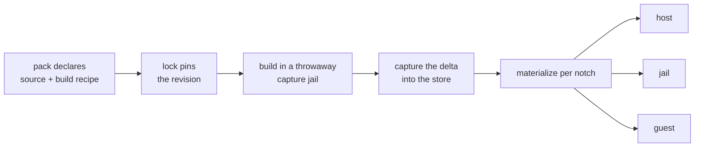

# A fork is a package with no registry — distributing source-built programs through a pack

**Status:** DESIGN, 2026-09-22 — three rulings are owed ([OQ-FP7](#OQ-FP7)–[OQ-FP9](#OQ-FP9)).
The original six questions are ruled; nothing is built. Evidence re-verified 2026-09-24 at
`f491d192`.

> **In short.** A fork is not a new kind of thing — it is the `installer` route with the
> registry removed and a build step added, and capture already exists for exactly that
> class. What the fork breaks is capture's quiet precondition: relocation is free today
> only because a capture is materialized into the same absolute home it was made in.

**Why it matters.** `via:` is a closed set of two, `npm` and `installer`
(`knownVias` in [`contributes.go`](../../internal/packdecl/contributes.go)), and a fork satisfies
neither. Today distributing one means installing it by hand on every machine — which is the
thing packs exist to delete.

**The shape.** A third delivery route on `kind: "program"`: a pinned source address, a build
recipe, one build in a throwaway capture jail, and the existing capture store as the
artifact's home for every notch that asks for it.

**Cost.** Relocation stops being a `macos-user` special case and becomes the general case, on
a path that has never run outside unit tests. Every consumer pays a local build.

**Start at [§5](#5-relocation-is-the-design-not-the-build)** — the build is the easy half.

**Needs your ruling:** [OQ-FP7](#OQ-FP7), [OQ-FP8](#OQ-FP8), [OQ-FP9](#OQ-FP9) — the original six
were ruled 2026-09-22 and these three came out of ruling them.

**Reads with:** [`forked-programs-as-packs-plan.md`](forked-programs-as-packs-plan.md) (the
implementation sketch — incomplete, and unstable while the questions above are open),
[`program-delivery.md`](program-delivery.md) (the `via` routes and the PATH ruling this
extends), [`install-capture.md`](../plans/install-capture.md) (the capture mechanism as built).

---

## 1. Goal and non-goals

**Goal.** A pack declares a program built from source at a pinned revision. Selecting that
pack in a config is the whole installation act, on every machine, at every notch that can
run the program.

**Non-goals**, each because it was considered and set aside rather than forgotten:

- **A remote build cache.** Ruled out by the maintainer up front: a fork consumer pays the
  local build. No substitute-server, no binary cache, no signing.
- **Reproducible builds.** The capture is trusted because *you* built it, not because two
  builds agree. Nothing here verifies a build against a reference.
- **Cross-compilation.** A notch gets an artifact built for its own platform, or it gets
  nothing. Building Linux artifacts on a Mac is out.
- **Patch-set management.** yolo delivers *a revision of a repository*. Maintaining the fork
  — rebases, patch queues, upstream tracking — is git's job and stays outside.
- **Agent-specific anything.** A forked agent is the motivating case and gets no special
  path; see [§3](#3-why-this-is-not-an-agent-feature).

## 2. What exists today, precisely

| Piece | What it is | Where |
| :--- | :--- | :--- |
| `via: "npm"` | `npm install -g <package>`, version optionally in the spec | `knownVias`, [`contributes.go`](../../internal/packdecl/contributes.go) |
| `via: "installer"` | run a vendor script and keep whatever it did | `knownVias`, [`contributes.go`](../../internal/packdecl/contributes.go) |
| Capture store | `<CapturesDir>/entries/<key>/tree/`, unpacked, with `.yolo-capture-complete` written last | [`capture/store.go`](../../internal/capture/store.go) |
| Materialize | reflink → hardlink → copy | [`capture/materialize.go`](../../internal/capture/materialize.go) |
| Relocation | records every absolute reference to the capture-time home, and decides whether the entry may move at all | [`capture/relocate.go`](../../internal/capture/relocate.go) |
| Capture jail | a throwaway jail in a temp workspace, deliberately **without** the capture store mounted | `runCaptureJail`, [`capturehost.go`](../../internal/cli/capturehost.go) |
| Source addressing | `Addr`, `Lock`, `store` — how a *pack* is already fetched and pinned | [`internal/packsrc`](../../internal/packsrc) |
| Notches | `host`, `jail`, `guest` — and `guest` refuses every verb | `render.NotchUnbuilt`, [`render/fieldset.go`](../../internal/render/fieldset.go) |

Two of these settle most of the design before it starts.

**Capture is already the right shape.** Its own plan says what it is for: *"the manifest, the
offline deterministic materialize, drift against an immutable reference, and a lockable
identity for the one dependency class with no native lockfile"*
([`install-capture.md`](../plans/install-capture.md)). A fork is that class exactly — an
opaque build whose output is the only artifact and which no registry will version for you.

**`packsrc` already pins sources.** A pack's own source is an `Addr` resolved to a locked
revision. A fork's source is the same problem one level down, and reusing that vocabulary is
the difference between one pinning mechanism and two.

## 3. Why this is not an agent feature

The motivating case is a forked `pi`, and it would be easy to build a forked-agent feature.
That would be wrong twice over.

**`kind: "program"` already knows nothing about agents.** Core has no agent registry — *agents
are packs*, and a pack that installs an agent is just one declaring a `program` surface. A
fork route that only worked for agents would be the first thing in the delivery vocabulary to
care, and every later consumer would have to pretend to be an agent to use it.

**The generality is free here, which is rare.** The build-capture-materialize pipeline does not
inspect what it built. A forked linter, a patched language server and a forked agent are one
mechanism; only the `bin` name differs.

> [!NOTE]
> **What *is* agent-shaped is the confinement question, and it is separable.** An agent gets
> launch flags and an autonomy posture from its pack. Those are existing contributions keyed
> on the `bin`, and they attach to a forked program exactly as they attach to an npm one —
> the fork route neither knows nor changes them.

## 4. The proposed shape

A third delivery route on `kind: "program"`. The pack carries **where the source is** and
**how to build it**; the lock carries **which revision**; the capture store carries **the
result**.

**The five steps, and who owns each:**

1. **Declare.** The pack names a source address, a build command, and what the build is
   expected to produce. Sketch of the surface, not a schema: the address reuses `packsrc.Addr`;
   the build is a command line, not a script file, so it is readable in the manifest.
2. **Pin.** The address resolves to an immutable revision, recorded in a lock beside the
   existing pack lock. **Resolution is an explicit act, never a launch side effect** — the
   same rule `packsrc` already follows.
3. **Build.** In a throwaway capture jail, which is where `yolo capture` already builds. The
   build never runs on the host ([§7](#7-trust-and-what-the-build-may-touch)).
4. **Capture.** The delta becomes a store entry under a key that includes the revision, the
   build recipe and the platform ([§6](#6-identity-what-keys-a-fork-entry)).
5. **Materialize.** Each notch that asks for the program gets the entry materialized into its
   own tree, subject to [§5](#5-relocation-is-the-design-not-the-build).

**What is deliberately *not* new:** the store, the manifest, the completion marker, the
reflink/hardlink/copy ladder, the GC, the selection rule, and the PATH position a program
occupies once installed. All of that is capture's, unchanged.

### 4.1 A fork declares itself a fork, and the base keeps the name

A fork does **not** win a name collision, and it does not re-declare the program it forks. It
declares that it *is a fork of* a base pack, and supplies the artifact that pack's program resolves
to. Selecting it is a **configuration** act — "use this fork for this thing" — not a shadowing one.

**The reason is not taste: shadowing is already refused.** A pack claims an agent's name by
declaring `program` with that `bin` (`packload.AgentNameCollisions`' doc comment, in
[`footprint.go`](../../internal/packload/footprint.go) — *"A pack claims a name by OWNING part of
that agent's plumbing: `program` by `bin` — it installs the launcher"*). Two selected packs
claiming one name **refuses the launch** before anything is staged: the launch pre-flight in
[`packs.go`](../../internal/cli/run/packs.go) calls `AgentNameCollisions`. So a fork that declared `bin: "pi"` beside
`packs/pi` would not shadow it — the launch would simply fail, and there is already a test using a
`claude-matt-fork` fixture for exactly that shape.

**The vocabulary already exists**, and reusing it is the difference between one override mechanism
and two. `config-overlay` (`packdecl.KindConfigOverlay`, [`kinds.go`](../../internal/packdecl/kinds.go)) is *"a contribution
to a config surface OWNED by another pack. Ordered after the owner (later-wins), with per-key
provenance recorded so an override of the owner's key is legible."* A fork is that relation applied
to a `program`'s delivery rather than to a config surface: the base owns the name, the fork
contributes the bytes, and provenance records which one won.

What that buys, and it is the maintainer's stated requirement: **a fork does not have to replicate
the base pack.** It inherits the base's launch flags, autonomy posture, profiles, briefing and
skills, and declares only the source address and the build recipe — *"we don't want a fork to have
to fully replicate the initial package because that would be silly for a little change."*

⚠ **One inheritance limit, measured.** The `NOTE` in [§3](#3-why-this-is-not-an-agent-feature) is
right about launch flags and **wrong about the autonomy posture's config half**: a config patch folds
only into a surface the **same pack** owns (keyed `"agent/name"`), and a patch naming no surface of
that pack is dropped and reported
([`contributes.go`](../../internal/packdecl/contributes.go), the config-patch fold). So "the fork
inherits the base's contributions" needs stating per kind rather than as a blanket claim — which is
[`OQ-FP8`](#OQ-FP8).

## 5. Relocation is the design, not the build

This is the section the rest of the doc exists to reach.

Capture is cheap on the container backends for one stated reason:

> *"On the container backends the capture home and the materialize home are the same string —
> `/home/agent`, both times — so an absolute self-reference an installer embeds is still
> correct after materialization and there is nothing to rewrite."*
> — [`relocate.go`](../../internal/capture/relocate.go)'s file header

**A cross-notch artifact breaks that precondition by definition.** The jail's home is
`/home/agent`; the host's is the real user's; the guest's is whatever Phase 7 decides. One
artifact delivered to two of them cannot have been built in both their homes. So relocation
stops being a `macos-user` carve-out and becomes the general case.

Three facts make that worse than it sounds, and they are the reason this is a design question
rather than an implementation detail:

- **Relocation's recording half exists and its necessity is unmeasured.** The scan, the
  text/binary classification and the relocatable decision are unit-tested against real files.
  What has never run is a capture on the backend that needs them. The `macos-user` CI job now
  loads the *session* Seatbelt profile under `sandbox-exec` and asserts the kernel's refusals,
  but no capture has run under the capture profile (`macosuser.SeatbeltCaptureProfile`) and no
  relocating materialize has run anywhere. ([`relocate.go`](../../internal/capture/relocate.go)'s
  header still says no Seatbelt profile has been loaded by a kernel, which predates that job.)
- **A source build embeds more than an installer does.** An installer writes scripts and
  symlinks. A compiler writes `RUNPATH`s, interpreter lines, embedded prefixes and debug paths
  — some in binaries, where a textual rewrite is not available.
- **Relocation may legitimately refuse.** The existing design's other branch is *"the entry
  says it cannot be moved"*. For a fork that refusal is not an error state to engineer away;
  it may be the honest answer.

[OQ-FP1](#14-decision-ledger) is which strategy this takes, and it is the doc's central question. The
three candidates, with what each costs:

| Strategy | How | Cost |
| :--- | :--- | :--- |
| **Build per notch** | one build per notch that wants the program | N builds; no relocation at all; the artifact is always correct |
| **Build once, relocate** | one build, rewrite absolute refs per materialization | 1 build; rests on an unmeasured path; binaries may be unrewritable |
| **Build once, fixed prefix** | build and run at one absolute path every notch can offer | 1 build; no rewriting; needs a path every notch can supply, which the host cannot create without privilege |

My leaning is **build per notch**, and the reason is that it is the only one of the three whose
failure mode is *cost* rather than *a subtly wrong binary*. The maintainer has already accepted
the local build cost; paying it twice is a smaller price than a fork that runs on the host with
a jail's `RUNPATH`.

## 6. Identity: what keys a fork entry

An npm program is identified by name and version. A fork has neither, so the key is derived
from everything that could change the bytes:

- the **resolved revision** of the source (not the ref — a branch name is not an identity);
- the **build recipe**, hashed, so editing the command invalidates the entry;
- the **platform** the build ran on (OS and architecture);
- the **notch**, if the implementation builds per notch ([`OQ-FP1`](#14-decision-ledger) leaves the
  relocation strategy to the implementer, so this component is contingent on which one is chosen).

**Anything not in that list is asserted not to change the output.** The toolchain version is the
uncomfortable one: a different compiler produces different bytes from the same inputs, and including
it means a toolchain bump rebuilds every fork. It is **excluded from the key and RECORDED anyway**
([`OQ-FP2`](#14-decision-ledger)) — a stale-but-working binary is the acceptable failure, but a
reader has to be able to find out which compiler produced what is on their PATH.

> [!WARNING]
> **The store does not key on inputs at all today, so this section is not expressible without new
> receipt fields.** A capture entry is keyed by the **digest of the output tree**, and selection is
> `(bin, platform)` → newest receipt wins
> (`capture.Select`, [`select.go`](../../internal/capture/select.go)). There is no input-side key anywhere in the
> store, which makes "the key includes the revision, the recipe and the platform" a **change to the
> receipt schema** rather than a use of what exists. `install-capture.md`'s own blockers say to stop
> and ask before adding per-entry metadata a later yolo must parse, so this is a gate on the build,
> not a detail of it.
>
> ⚠ **The toolchain record must not go in the capture MANIFEST.** `capture.Manifest`'s doc comment
> ([`manifest.go`](../../internal/capture/manifest.go)) states the invariant it would break: *"Nothing about the run that produced it is in here, so two
> byte-identical captures produce two byte-identical manifests."* The record belongs on the `record`
> receipt beside the entry, where run-specific facts already live.

> [!WARNING]
> **A branch ref must never key an entry.** `main` names different bytes on different days,
> and an entry keyed on it would be a cache that silently serves yesterday's build forever —
> which is the failure the existing store's immutable-reference property exists to prevent.

## 7. Trust, and what the build may touch

**The build runs in a throwaway capture jail, never on the host.** That is the existing capture
behaviour and it is worth keeping for a reason that grows here: a fork's build is arbitrary
code from a repository the pack names, and a pack may come from anywhere.

Two properties follow, and both are stated because a reasonable implementation might break
either:

- **The build must get no credentials** — and ⚠ **the mechanism as built does not honour that
  today.** `runCaptureJail` ([`capturehost.go`](../../internal/cli/capturehost.go))
  suppresses exactly four things (the captures dir, never-attach, accept-config-changes, the TTY)
  and otherwise runs the ordinary pipeline against the USER's config — so `env_sources` is
  hydrated, `YOLO_HOST_FILES` is emitted, and host loopholes start. A fork build is arbitrary code
  from a repository a pack named, which makes closing that gap a **precondition of this route**
  rather than a hardening pass after it. Building a fork is not a reason to hand a build script the
  machine's secrets.
- **The build may reach the network, and that is disclosed.** Fetching dependencies is most of
  what a build does, so refusing the network would refuse the feature. The existing pack
  disclosure banner already says when a pack runs code and reaches the internet; a fork build
  is one more line in it, not a new channel.

**The artifact then runs on the host**, which is the real escalation and is not new — a
`via: "installer"` program already does. What *is* new is that the bytes came from a build the
pack author controls rather than a vendor's release. [OQ-FP6](#14-decision-ledger) asks whether that
deserves its own disclosure.

## 8. Notch coverage, and the one that does not exist

| Notch | Can it run a forked program? | Why |
| :--- | :--- | :--- |
| **jail** | yes | the capture store is already bound `:ro` into every container launch where `:ro` is enforced — not on Apple Container below its read-only-bind floor (`capturesArgs`, [`captures.go`](../../internal/cli/run/captures.go)) |
| **host** | yes, subject to [§5](#5-relocation-is-the-design-not-the-build) | the host materializes into the real user's home |
| **guest** | **not yet, and not because of this design** | every verb at that notch refuses today |

> [!IMPORTANT]
> **`guest` uniformity is a forward-compatibility claim, not a shippable property.**
> `render.NotchUnbuilt` is the one sentence both `yolo apply --at guest` and the launch gate
> print — the notch is env-manager Phase 7, the only unbuilt phase. So "uniform across host,
> jail and guest" means: **nothing in this design may be keyed on the notch set being two**,
> and guest inherits the route when Phase 7 lands. It does not mean guest works.

**`macos-user` is the interesting backend**, not a footnote: it has no mounts, so its capture
already runs against a throwaway staging home and already needs relocation. A fork there is
the existing hard case, not a new one — which makes it the best place to find out whether
[OQ-FP1](#14-decision-ledger)'s relocation strategy actually holds.

## 9. Failure modes

| Failure | Behaviour |
| :--- | :--- |
| Source address unresolvable (offline, gone, auth) | the **resolve** act fails and says so; no launch is affected, because resolution is never a launch side effect |
| Build fails | the program is unavailable and the reason is printed; **the launch is not refused** — a broken fork is one missing tool, not a broken jail |
| Build succeeds, produces no expected output | treated as a failed build, named as such rather than admitted as an empty capture |
| Entry is not relocatable into the asking notch | that notch does not get the program, and says which notch it was built for |
| Two builds of the same key race | the existing per-program lock decides, and ⚠ **it REFUSES rather than waits**: a non-blocking flock whose loser prints and exits non-zero (`captureHost`'s per-program lock, [`capturehost.go`](../../internal/cli/capturehost.go)). It does not adopt the winner's entry. Whether a fork build should instead WAIT for the winner is [`OQ-FP7`](#OQ-FP7) |
| Store entry half-written (crash mid-build) | the missing `.yolo-capture-complete` makes it detectable and it is rebuilt |
| Toolchain absent in the capture jail | a build-time failure like any other; the pack is responsible for declaring what it needs to build |

**Forbidden behaviour**, where a reasonable implementation might do otherwise:

- **Never rebuild on a timer or on every launch.** The trigger is a lock change or an explicit
  act, nothing else.
- **Never build on the host**, on any backend.
- **Never serve an entry whose key does not match what is being asked for** — a near-miss is a
  rebuild, not a substitution.
- **Never let a fork's build write outside the capture jail's own workspace and home.**

## 10. Alternatives, with verdicts

| Alternative | Verdict |
| :--- | :--- |
| **A. Tell people to publish a private npm package** | **Rejected** — it works, and it moves the cost from "build locally" to "run a registry", which is a much larger ask for one person's fork. It also forecloses forks of things that are not npm packages. |
| **B. A `mise` tool or nix derivation per fork** | **Runner-up, and the one to revisit.** Both already build from source and both already pin. Rejected for now because neither reaches the *host* notch through yolo, and because a nix derivation is a much steeper authoring cost than a build command. Feeds [OQ-FP3](#14-decision-ledger). |
| **C. Ship prebuilt artifacts in the pack** | **Rejected** — a pack becomes a binary distribution channel, needs per-platform artifacts, and the maintainer explicitly accepted local builds instead. |
| **D. `via: "installer"` with a build script as the installer** | **Rejected, but it is the closest thing to free.** It would work today with no new vocabulary — and it has no pinning, no revision in the key, and no way to tell a rebuild from a re-download. That absence is the whole feature. |
| **E. Bind the fork's source into the jail and build on every launch** | **Rejected** — pays the build cost per launch instead of per revision, and makes a launch depend on a compiler. |

## 11. Sequencing

1. **The declaration and the pin**, with no build: a pack can name a source, `resolve` records
   a revision, and `yolo` reports what it would build. Nothing is built; the vocabulary is
   exercised.
2. **The build and the capture**, jail notch only. This is where [OQ-FP1](#14-decision-ledger) stops being
   theoretical, because a jail-only artifact needs no relocation at all.
3. **The host notch**, which is the relocation work and should not start until step 2 has
   produced a real artifact to relocate.
4. **`macos-user`**, as the relocation proving ground.
5. **`guest`**, when Phase 7 exists.

**Done conditions**, observable rather than test names:

- A second machine, given only the config, ends up running the same forked binary — no manual
  install, no copied artifact.
- Changing the pinned revision and re-resolving produces a different binary; changing nothing
  produces no rebuild.
- A jail and the host either run artifacts built for their own notch, or the notch that cannot
  says so by name.
- Deleting the capture store costs a rebuild and nothing else.

## 12. What this does not license

- **A pack may not build on the host.** If a fork cannot be built in a capture jail, it is not
  deliverable this way.
- **No credentials reach a build.** Not as an env var, not as a host file, not through a
  loophole.
- **This is not a general "run my script at install time" hook.** The build produces an
  artifact under a key; it is not a place to configure a machine.
- **No implicit rebuilds.** A fork that drifts from its lock is reported, never silently
  refreshed.

## 13. Open Questions

Three questions are open, and all three were raised by ruling the original six.

1. 💬 **[OQ-FP7](#OQ-FP7): should the loser of a build race WAIT for the winner?**
   The per-program lock is a non-blocking flock whose loser prints and exits non-zero
   (`captureHost`'s per-program lock, [`capturehost.go`](../../internal/cli/capturehost.go)) — correct for `yolo capture`, which
   a human invoked and can re-run. It is wrong for an eager build inside a launch: the second launch
   would refuse over a build the first is already doing, and the artifact it needs appears seconds
   later. Stakes: whether an eager fork build can share the existing lock at all.

   <!-- vantage: oq id=OQ-FP7 leaning="Wait, with a bounded timeout, and only on the launch path. The capture verb keeps refusing because a human can retry; a launch cannot, and refusing a jail because another jail is building the same artifact is the unused-agent fatal the 2026-09-03 reversal deleted, in a new costume." -->

   _Leaning:_ **Wait, bounded, and only on the launch path.** The `capture` verb keeps its refusal —
   a human can retry. A launch cannot, and refusing a jail because another jail is building the same
   bytes is the mis-scoped fatal the 2026-09-03 reversal deleted, in a new costume.

   **Answer:**
   > _(empty — fill in when decided)_

2. 💬 **[OQ-FP8](#OQ-FP8): what exactly does a fork inherit from its base, per kind?**
   [§4.1](#41-a-fork-declares-itself-a-fork-and-the-base-keeps-the-name) says a fork must not have to
   replicate its base, and one limit is already measured: a config patch folds only into a surface the
   **same pack** owns, so a patch naming no surface of that pack is dropped and reported. Launch flags
   and autonomy postures key on the `bin` and travel; config patches do not. Stakes: whether
   inheritance is a per-kind table in the schema or a single rule with exceptions.

   <!-- vantage: oq id=OQ-FP8 leaning="A per-kind table, written down. The kinds already differ in whether they key on a bin or on an owning pack, so a single rule would be false for at least one of them — and the failure mode is a silently dropped contribution, which is the worst shape available." -->

   _Leaning:_ **A per-kind table, written down.** The kinds already differ in whether they key on a
   `bin` or on an owning pack, so one blanket rule is false for at least one of them — and its failure
   mode is a silently dropped contribution.

   **Answer:**
   > _(empty — fill in when decided)_

3. 💬 **[OQ-FP9](#OQ-FP9): what does an eager build do on `macos-user`, which the eager slot cannot reach?**
   [`OQ-FP4`](#14-decision-ledger) puts the build at the notch's readiness act, and on the container
   backends that is auto-capture's existing slot — which sits **below the `macos-user` return** in the
   run pipeline, so nothing there emits the captures-dir variable and slice 6's relocation rewrite is
   unbuilt. So the ruling is unimplementable on the one backend [§8](#8-notch-coverage-and-the-one-that-does-not-exist)
   calls the interesting one. Stakes: whether this route ships container-only with a named gap, or
   waits for the backend.

   <!-- vantage: oq id=OQ-FP9 leaning="Ship container-only with the gap named and reported at launch on that backend, rather than blocking the route. macos-user is where relocation has to be proven anyway, so it wants its own slice — but a fork pack selected there must say it got nothing, not silently deliver no program." -->

   _Leaning:_ **Ship container-only, with the gap named and reported on that backend.** `macos-user`
   is where relocation must be proven anyway and wants its own slice; what it must not do is silently
   deliver no program.

   **Answer:**
   > _(empty — fill in when decided)_

## 14. Decision Ledger

The six questions this doc opened are ruled. Three new ones ([§13](#13-open-questions)) came out of
ruling them.

| ID | Ruling / Decision | Date | Settled in | Built |
| :--- | :--- | :--- | :--- | :--- |
| OQ-FP1 | **The implementer's choice** — build-per-notch, build-once-and-relocate or a fixed prefix are an implementation decision, not a design one. Whatever works. ⚠ It therefore stops being a design blocker, and [§6](#6-identity-what-keys-a-fork-entry)'s notch key component becomes contingent on which is chosen rather than on a pending ruling | 2026-09-22 | [§5](#5-relocation-is-the-design-not-the-build), [§6](#6-identity-what-keys-a-fork-entry) | — |
| OQ-FP2 | **Exclude the toolchain from the key, AND record it anyway.** A toolchain change is a reason the user can force a rebuild explicitly; correctness would cost a rebuild storm on every bump, and the wrong outcome is stale-but-working rather than broken. But the toolchain is **recorded and disclosed**, because which compiler produced the binary on your PATH is a fact nothing else keeps. ⚠ On the `record` receipt, never the capture manifest, whose stated invariant is that nothing about the producing run is in it | 2026-09-22 | [§6](#6-identity-what-keys-a-fork-entry) | — |
| OQ-FP3 | **A new `via`**, borrowing `packsrc` for pinning and capture for the artifact. Borrowing `mise` or nix would import their notch coverage, which is the thing this design needs and neither has | 2026-09-22 | [§4](#4-the-proposed-shape), [§10](#10-alternatives-with-verdicts) | — |
| OQ-FP4 | **Eager, at the notch's readiness act — not an explicit act and not on first use.** yolo runs complete environments: before a launch runs anything that needs the fork, the fork is built. Core cannot know what the jail will launch (there is no agent registry and no argv sniffing), so the trigger is the SELECTED PACK SET, which is statically knowable — the shape `installerBins` already implements for auto-capture. ⚠ A hit builds nothing, so [§9](#9-failure-modes)'s *"never rebuild on a timer or on every launch"* survives unchanged | 2026-09-22 | [§4](#4-the-proposed-shape), [§9](#9-failure-modes) | — |
| OQ-FP5 | **A fork DECLARES that it is a fork of a base pack; it does not win a name.** The base keeps the name claim, the fork supplies the bytes, and selecting the fork is configuration rather than shadowing — reusing `config-overlay`'s existing owner/contributor/provenance relation. "Same bin, fork wins" was **rejected**, and is in any case unreachable: two selected packs claiming one agent name refuse the launch via `AgentNameCollisions`. A fork must not have to replicate its base | 2026-09-22 | [§4.1](#41-a-fork-declares-itself-a-fork-and-the-base-keeps-the-name) | — |
| OQ-FP6 | **Yes — a source-built artifact gets its own disclosure, naming the resolved REVISION rather than the ref.** The existing banner has the right shape and place, and the commit that produced the binary on your PATH is the one fact a reader cannot get anywhere else | 2026-09-22 | [§7](#7-trust-and-what-the-build-may-touch) | — |
