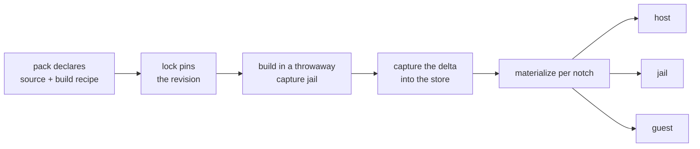

# A fork is a package with no registry — distributing source-built programs through a pack

**Status:** 2026-10-02 — no ruling is owed. Since 2026-10-02 a launch pins an unpinned fork
itself, with no `yolo pack install` ([FP-D18](#FP-D18), which supersedes [FP-D7](#FP-D7)'s
read-only launch under the maintainer's
[`OQ-PF1`](../reference/pack-system.md#oq-pf1)). Building: the
[plan](forked-programs-as-packs-plan.md#build-order)'s steps 1–6, the `source` vocabulary, the selection's rewrite of a fork's base, the pin, the seal, the build act and the jail's delivery, landed
2026-09-30, and the Built column of [§14](#14-decision-ledger) says what each step built. Step 7,
the host notch, began with its measurement, which the plan's [step 7](forked-programs-as-packs-plan.md#step-7-needs) records.
MEASURED 2026-10-01 on a stand-in, pi's upstream at `v0.99.2` built through steps 1–6 in a
nested jail: `relocatable:true`, and no `/nix/store`, home or Linux `/lib` path in its tree, so
[FP-D4](#FP-D4)'s host notch can be built as written for a fork like it
([the plan's run](forked-programs-as-packs-plan.md#steps-1-to-3-on-a-stand-in-fork-2026-10-01)).
The host agent floor's source arms were built on 2026-10-01 to that shape
([FP-D16](#FP-D16), [FP-D17](#FP-D17)): on a Linux host, `yolo host -- <bin>` runs the floor's
copy of the store's build at the pin. What stays open is an input, not a ruling: the motivating
fork, which no file names, still wants the measurement rerun on it once a maintainer names it, and
a fork compiling a native addon in the jail is unmeasured. The original six
questions were ruled 2026-09-22; the three that came out of ruling them
([OQ-FP7](#OQ-FP7)–[OQ-FP9](#OQ-FP9)) were decided as implementation choices on 2026-09-30
([FP-D1](#FP-D1)–[FP-D3](#FP-D3)). Evidence re-verified 2026-09-24 at `f491d192`; the inheritance
limit in [§4.1](#41-a-fork-declares-itself-a-fork-and-the-base-keeps-the-name) and the macos-user
gap in [OQ-FP9](#OQ-FP9) were re-read against the tree on 2026-09-30. The
[plan](forked-programs-as-packs-plan.md) was promoted against the tree the same day, and the
implementation choices its promotion made are [FP-D4](#FP-D4)–[FP-D9](#FP-D9).

> **In short.** A fork is not a new kind of thing — it is the `installer` route with the
> registry removed and a build step added, and capture already exists for exactly that
> class. What the fork breaks is capture's quiet precondition: relocation is free today
> only because a capture is materialized into the same absolute home it was made in.

**Why it matters.** `via:` is a closed set of two, `npm` and `installer`
(`knownVias` in [`contributes.go`](../../internal/packdecl/contributes.go)), and a fork satisfies
neither. Today distributing one means installing it by hand on every machine — which is the
thing packs exist to delete.

**The shape.** A third delivery route on `kind: "program"`: a pinned source address, a build
recipe, one build in a throwaway capture jail, and the existing capture store as the
artifact's home for every notch that asks for it.

**Cost.** Relocation stops being a `macos-user` special case and becomes the general case, on
a path that has never run outside unit tests. Every consumer pays a local build.

**Start at [§5](#5-relocation-is-the-design-not-the-build)** — the build is the easy half.

**Needs your ruling:** nothing. The original six were ruled 2026-09-22; [OQ-FP7](#OQ-FP7),
[OQ-FP8](#OQ-FP8) and [OQ-FP9](#OQ-FP9) came out of ruling them and were decided as implementation
choices ([FP-D1](#FP-D1)–[FP-D3](#FP-D3)).

**Reads with:** [`forked-programs-as-packs-plan.md`](forked-programs-as-packs-plan.md) (the
implementation plan, promoted against the tree 2026-09-30),
[`program-delivery.md`](program-delivery.md) (the `via` routes and the PATH ruling this
extends), [`install-capture.md`](../plans/install-capture.md) (the capture mechanism as built).

---

## 1. Goal and non-goals

**Goal.** A pack declares a program built from source at a pinned revision. Selecting that
pack in a config is the whole installation act, on every machine, at every notch that can
run the program.

**Non-goals**, each because it was considered and set aside rather than forgotten:

- **A remote build cache.** Ruled out by the maintainer up front: a fork consumer pays the
  local build. No substitute-server, no binary cache, no signing.
- **Reproducible builds.** The capture is trusted because *you* built it, not because two
  builds agree. Nothing here verifies a build against a reference.
- **Cross-compilation.** A notch gets an artifact built for its own platform, or it gets
  nothing. Building Linux artifacts on a Mac is out.
- **Patch-set management.** yolo delivers *a revision of a repository*. Maintaining the fork
  — rebases, patch queues, upstream tracking — is git's job and stays outside.
- **Agent-specific anything.** A forked agent is the motivating case and gets no special
  path; see [§3](#3-why-this-is-not-an-agent-feature).

## 2. What exists today, precisely

| Piece | What it is | Where |
| :--- | :--- | :--- |
| `via: "npm"` | `npm install -g <package>`, version optionally in the spec | `knownVias`, [`contributes.go`](../../internal/packdecl/contributes.go) |
| `via: "installer"` | run a vendor script and keep whatever it did | `knownVias`, [`contributes.go`](../../internal/packdecl/contributes.go) |
| Capture store | `<CapturesDir>/entries/<key>/tree/`, unpacked, with `.yolo-capture-complete` written last | [`capture/store.go`](../../internal/capture/store.go) |
| Materialize | reflink → hardlink → copy | [`capture/materialize.go`](../../internal/capture/materialize.go) |
| Relocation | records every absolute reference to the capture-time home, and decides whether the entry may move at all | [`capture/relocate.go`](../../internal/capture/relocate.go) |
| Capture jail | a throwaway jail in a temp workspace, deliberately **without** the capture store mounted | `runCaptureJail`, [`capturehost.go`](../../internal/cli/capturehost.go) |
| Source addressing | `Addr`, `Lock`, `store` — how a *pack* is already fetched and pinned | [`internal/packsrc`](../../internal/packsrc) |
| Notches | `host`, `jail`, `guest` — and `guest` refuses every verb | `render.NotchUnbuilt`, [`render/fieldset.go`](../../internal/render/fieldset.go) |

Two of these settle most of the design before it starts.

**Capture is already the right shape.** Its own plan says what it is for: *"the manifest, the
offline deterministic materialize, drift against an immutable reference, and a lockable
identity for the one dependency class with no native lockfile"*
([`install-capture.md`](../plans/install-capture.md)). A fork is that class exactly — an
opaque build whose output is the only artifact and which no registry will version for you.

**`packsrc` already pins sources.** A pack's own source is an `Addr` resolved to a locked
revision. A fork's source is the same problem one level down, and reusing that vocabulary is
the difference between one pinning mechanism and two.

## 3. Why this is not an agent feature

The motivating case is a forked `pi`, and it would be easy to build a forked-agent feature.
That would be wrong twice over.

**`kind: "program"` already knows nothing about agents.** Core has no agent registry — *agents
are packs*, and a pack that installs an agent is just one declaring a `program` surface. A
fork route that only worked for agents would be the first thing in the delivery vocabulary to
care, and every later consumer would have to pretend to be an agent to use it.

**The generality is free here, which is rare.** The build-capture-materialize pipeline does not
inspect what it built. A forked linter, a patched language server and a forked agent are one
mechanism; only the `bin` name differs.

> [!NOTE]
> **What *is* agent-shaped is the confinement question, and it is separable.** An agent gets
> launch flags and an autonomy posture from its pack. Those are existing contributions keyed
> on the `bin`, and they attach to a forked program exactly as they attach to an npm one —
> the fork route neither knows nor changes them.

## 4. The proposed shape

A third delivery route on `kind: "program"`. The pack carries **where the source is** and
**how to build it**; the lock carries **which revision**; the capture store carries **the
result**.

```mermaid
flowchart LR
  A[pack declares<br/>source + build recipe] --> B[lock pins<br/>the revision]
  B --> C[build in a throwaway<br/>capture jail]
  C --> D[capture the delta<br/>into the store]
  D --> E[materialize per notch]
  E --> F[host]
  E --> G[jail]
  E --> H[guest]
```

**The five steps, and who owns each:**

1. **Declare.** The pack names a source address, a build command, and what the build is
   expected to produce. Sketch of the surface, not a schema: the address reuses `packsrc.Addr`;
   the build is a command line, not a script file, so it is readable in the manifest.
2. **Pin.** The address resolves to an immutable revision, recorded in a lock beside the
   existing pack lock. **A pin is made once and moved only by an explicit act.** The first
   launch that carries the fork makes it, and `yolo pack update` is the only act that moves it
   ([FP-D18](#FP-D18)). ⚠ This step first said *"resolution is an explicit act, never a launch
   side effect"*, which [FP-D7](#FP-D7) built as a launch that only reads the lock. That stopped
   holding on 2026-10-02, when the maintainer's
   [`OQ-PF1`](../reference/pack-system.md#oq-pf1) (*"neither is required"*) was applied to
   forks. A fork's source still never goes through the launch's hourly pack refresh
   ([`refresh.go`](../../internal/packsrc/refresh.go)), which would move a branch-following pin.
3. **Build.** In a throwaway capture jail, which is where `yolo capture` already builds. The
   build never runs on the host ([§7](#7-trust-and-what-the-build-may-touch)).
4. **Capture.** The delta becomes a store entry under a key that includes the revision, the
   build recipe and the platform ([§6](#6-identity-what-keys-a-fork-entry)).
5. **Materialize.** Each notch that asks for the program gets the entry materialized into its
   own tree, subject to [§5](#5-relocation-is-the-design-not-the-build).

**What is deliberately *not* new:** the store, the manifest, the completion marker, the
reflink/hardlink/copy ladder, the GC, the selection rule, and the PATH position a program
occupies once installed. All of that is capture's. The selection rule and the GC are not quite
unchanged: [§6](#6-identity-what-keys-a-fork-entry) needs an input-side key, so both gain the
source address as one more component of what they select by, and the GC stays the complement of
selection ([FP-D8](#FP-D8)).

### 4.1 A fork declares itself a fork, and the base keeps the name

A fork does **not** win a name collision, and it does not re-declare the program it forks. It
declares that it *is a fork of* a base pack, and supplies the artifact that pack's program resolves
to. Selecting it is a **configuration** act — "use this fork for this thing" — not a shadowing one.

**The reason is not taste: shadowing is already refused.** A pack claims an agent's name by
declaring `program` with that `bin` (`packload.AgentNameCollisions`' doc comment, in
[`footprint.go`](../../internal/packload/footprint.go) — *"A pack claims a name by OWNING part of
that agent's plumbing: `program` by `bin` — it installs the launcher"*). Two selected packs
claiming one name **refuses the launch** before anything is staged: the launch pre-flight in
[`packs.go`](../../internal/cli/run/packs.go) calls `AgentNameCollisions`. So a fork that declared `bin: "pi"` beside
`packs/pi` would not shadow it — the launch would simply fail, and there is already a test using a
`claude-matt-fork` fixture for exactly that shape.

**The vocabulary already exists**, and reusing it is the difference between one override mechanism
and two. `config-overlay` (`packdecl.KindConfigOverlay`, [`kinds.go`](../../internal/packdecl/kinds.go)) is *"a contribution
to a config surface OWNED by another pack. Ordered after the owner (later-wins), with per-key
provenance recorded so an override of the owner's key is legible."* A fork is that relation applied
to a `program`'s delivery rather than to a config surface: the base owns the name, the fork
contributes the bytes, and provenance records which one won.

What that buys, and it is the maintainer's stated requirement: **a fork does not have to replicate
the base pack.** It inherits the base's launch flags, autonomy posture, profiles, briefing and
skills, and declares only the source address and the build recipe — *"we don't want a fork to have
to fully replicate the initial package because that would be silly for a little change."*

⚠ **One inheritance limit was measured, and it is gone.** When this section was written, an
autonomy posture's config patch folded only into a surface the **same pack** owns (keyed
`"agent/name"`), and a patch naming another pack's surface was dropped and reported. Since
2026-09-28 (`12032eb2`) such a patch is a *posture overlay*, a term coined in
[`notch-scoped-config-contributions.md`](notch-scoped-config-contributions.md) for a
`config-overlay` body gated on the posture: it takes the config-overlay path, below the owner's
managed keys, with `config-overlay:<pack>` provenance
([`contributes.go`](../../internal/packdecl/contributes.go), `AutonomyPosture.Config`). Only a
patch on a surface no selected pack owns is inert, and it is reported. So nothing a fork might add
is dropped silently, and [`OQ-FP8`](#OQ-FP8) is decided as one rule ([FP-D2](#FP-D2)): the base
stays in the launch and keeps every contribution as its own.

## 5. Relocation is the design, not the build

This is the section the rest of the doc exists to reach.

Capture is cheap on the container backends for one stated reason:

> *"On the container backends the capture home and the materialize home are the same string —
> `/home/agent`, both times — so an absolute self-reference an installer embeds is still
> correct after materialization and there is nothing to rewrite."*
> — [`relocate.go`](../../internal/capture/relocate.go)'s file header

**A cross-notch artifact breaks that precondition by definition.** The jail's home is
`/home/agent`; the host's is the real user's; the guest's is whatever Phase 7 decides. One
artifact delivered to two of them cannot have been built in both their homes. So relocation
stops being a `macos-user` carve-out and becomes the general case.

Three facts make that worse than it sounds, and they are the reason this is a design question
rather than an implementation detail:

- **Relocation's recording half exists and its necessity is unmeasured.** The scan, the
  text/binary classification and the relocatable decision are unit-tested against real files.
  The `macos-user` CI job loads the *session* Seatbelt profile under `sandbox-exec` and asserts
  the kernel's refusals. One capture has run on the backend that needs them, on hardware on
  2026-09-11 under the capture profile (`macosuser.SeatbeltCaptureProfile`,
  [M4](../plans/runbooks/mac-provisioner-measurements.md#m4--does-the-capture-recording-half-work-on-hardware)),
  and it did not record whether its manifest came out relocatable. The relocating materialize
  ([`install-capture.md`](../plans/install-capture.md#hand-offs--what-is-not-wired-and-the-exact-line-that-wires-it)
  hand-off H2) landed 2026-09-26 and has run only in Linux unit tests; no Mac has run it. ⚠ This
  bullet said no capture had run under the capture profile and no relocating materialize had run
  anywhere.
- **A source build embeds more than an installer does.** An installer writes scripts and
  symlinks. A compiler writes `RUNPATH`s, interpreter lines, embedded prefixes and debug paths
  — some in binaries, where a textual rewrite is not available.
- **Relocation may legitimately refuse.** The existing design's other branch is *"the entry
  says it cannot be moved"*. For a fork that refusal is not an error state to engineer away;
  it may be the honest answer.

[OQ-FP1](#14-decision-ledger) is which strategy this takes, and it is the doc's central question. The
three candidates, with what each costs:

| Strategy | How | Cost |
| :--- | :--- | :--- |
| **Build per notch** | one build per notch that wants the program | N builds; no relocation at all; the artifact is always correct |
| **Build once, relocate** | one build, rewrite absolute refs per materialization | 1 build; rests on an unmeasured path; binaries may be unrewritable |
| **Build once, fixed prefix** | build and run at one absolute path every notch can offer | 1 build; no rewriting; needs a path every notch can supply, which the host cannot create without privilege |

My leaning is **build per notch**, and the reason is that it is the only one of the three whose
failure mode is *cost* rather than *a subtly wrong binary*. The maintainer has already accepted
the local build cost; paying it twice is a smaller price than a fork that runs on the host with
a jail's `RUNPATH`.

## 6. Identity: what keys a fork entry

An npm program is identified by name and version. A fork has neither, so the key is derived
from everything that could change the bytes:

- the **resolved revision** of the source (not the ref — a branch name is not an identity);
- the **build recipe**, hashed, so editing the command invalidates the entry;
- the **platform** the build ran on (OS and architecture);
- the **notch**, if the implementation builds per notch ([`OQ-FP1`](#14-decision-ledger) leaves the
  relocation strategy to the implementer, so this component is contingent on which one is chosen).

**Anything not in that list is asserted not to change the output.** The toolchain version is the
uncomfortable one: a different compiler produces different bytes from the same inputs, and including
it means a toolchain bump rebuilds every fork. It is **excluded from the key and RECORDED anyway**
([`OQ-FP2`](#14-decision-ledger)) — a stale-but-working binary is the acceptable failure, but a
reader has to be able to find out which compiler produced what is on their PATH.

> [!WARNING]
> **The store does not key on inputs at all today, so this section is not expressible without new
> receipt fields.** A capture entry is keyed by the **digest of the output tree**, and selection is
> `(bin, platform)` → newest receipt wins
> (`capture.Select`, [`select.go`](../../internal/capture/select.go)). There is no input-side key anywhere in the
> store, which makes "the key includes the revision, the recipe and the platform" a **change to the
> receipt schema** rather than a use of what exists. `install-capture.md`'s own blockers say to stop
> and ask before adding per-entry metadata a later yolo must parse, so this is a gate on the build,
> not a detail of it. ⚠ *Answered 2026-09-30:* [OQ-FP2](#14-decision-ledger)'s ruling puts a field
> on the `record` receipt, and [FP-D8](#FP-D8) decides the fields and a receipt kind that a yolo
> predating forks never selects.
>
> ⚠ **The toolchain record must not go in the capture MANIFEST.** `capture.Manifest`'s doc comment
> ([`manifest.go`](../../internal/capture/manifest.go)) states the invariant it would break: *"Nothing about the run that produced it is in here, so two
> byte-identical captures produce two byte-identical manifests."* The record belongs on the `record`
> receipt beside the entry, where run-specific facts already live.

> [!WARNING]
> **A branch ref must never key an entry.** `main` names different bytes on different days,
> and an entry keyed on it would be a cache that silently serves yesterday's build forever —
> which is the failure the existing store's immutable-reference property exists to prevent.

## 7. Trust, and what the build may touch

**The build runs in a throwaway capture jail, never on the host.** That is the existing capture
behaviour and it is worth keeping for a reason that grows here: a fork's build is arbitrary
code from a repository the pack names, and a pack may come from anywhere.

Two properties follow, and both are stated because a reasonable implementation might break
either:

- **The build must get no credentials** — and ⚠ **the mechanism as built does not honour that
  today.** `runCaptureJail` ([`capturehost.go`](../../internal/cli/capturehost.go))
  suppresses exactly four things (the captures dir, never-attach, accept-config-changes, the TTY)
  and otherwise runs the ordinary pipeline against the USER's config — so `env_sources` is
  hydrated, `YOLO_HOST_FILES` is emitted, and host loopholes start. A fork build is arbitrary code
  from a repository a pack named, which makes closing that gap a **precondition of this route**
  rather than a hardening pass after it. Building a fork is not a reason to hand a build script the
  machine's secrets.
- **The build may reach the network, and that is disclosed.** Fetching dependencies is most of
  what a build does, so refusing the network would refuse the feature. The existing pack
  disclosure banner already says when a pack runs code and reaches the internet; a fork build
  is one more line in it, not a new channel.

**The artifact then runs on the host**, which is the real escalation and is not new — a
`via: "installer"` program already does. What *is* new is that the bytes came from a build the
pack author controls rather than a vendor's release. [OQ-FP6](#14-decision-ledger) asks whether that
deserves its own disclosure.

## 8. Notch coverage, and the one that does not exist

| Notch | Can it run a forked program? | Why |
| :--- | :--- | :--- |
| **jail** | yes | the capture store is already bound `:ro` into every container launch where `:ro` is enforced — not on Apple Container below its read-only-bind floor (`capturesArgs`, [`captures.go`](../../internal/cli/run/captures.go)) |
| **host** | yes on Linux, subject to [§5](#5-relocation-is-the-design-not-the-build) | the host agent floor materializes the build into its own prefix, relocated ([FP-D16](#FP-D16)); a build that cannot leave the jail's home, and every macOS host, get none |
| **guest** | **not yet, and not because of this design** | every verb at that notch refuses today |

> [!IMPORTANT]
> **`guest` uniformity is a forward-compatibility claim, not a shippable property.**
> `render.NotchUnbuilt` is the one sentence both `yolo apply --at guest` and the launch gate
> print — the notch is env-manager Phase 7, the only unbuilt phase. So "uniform across host,
> jail and guest" means: **nothing in this design may be keyed on the notch set being two**,
> and guest inherits the route when Phase 7 lands. It does not mean guest works.

**`macos-user` is the interesting backend**, not a footnote: it has no mounts, so its capture
already runs against a throwaway staging home and already needs relocation. A fork there is
the existing hard case, not a new one — which makes it the best place to find out whether
[OQ-FP1](#14-decision-ledger)'s relocation strategy actually holds.

## 9. Failure modes

| Failure | Behaviour |
| :--- | :--- |
| Source address unresolvable (offline, gone, auth) | a fork with no pin yet gets none: the launch says why and names the next step, the program is unavailable, and **the launch is not refused**; the next launch tries the pin again ([FP-D18](#FP-D18)). A standing pin is not resolved at all; a build of a commit this machine never fetched fails as a build does |
| Build fails | the program is unavailable and the reason is printed; **the launch is not refused** — a broken fork is one missing tool, not a broken jail |
| Build succeeds, produces no expected output | treated as a failed build, named as such rather than admitted as an empty capture |
| Entry is not relocatable into the asking notch | that notch does not get the program, and says which notch it was built for |
| Two builds of the same key race | the existing per-program lock decides, and ⚠ **it REFUSES rather than waits**: a non-blocking flock whose loser prints and exits non-zero (`captureHost`'s per-program lock, [`capturehost.go`](../../internal/cli/capturehost.go)). It does not adopt the winner's entry. A fork build on the **launch** path waits for the winner instead, then re-checks the store ([`OQ-FP7`](#OQ-FP7), decided as [FP-D1](#FP-D1)); the `capture` verb keeps the refusal |
| Store entry half-written (crash mid-build) | the missing `.yolo-capture-complete` makes it detectable and it is rebuilt |
| Toolchain absent in the capture jail | a build-time failure like any other; the pack is responsible for declaring what it needs to build |

**Forbidden behaviour**, where a reasonable implementation might do otherwise:

- **Never rebuild on a timer or on every launch.** The trigger is a lock change or an explicit
  act, nothing else.
- **Never build on the host**, on any backend.
- **Never serve an entry whose key does not match what is being asked for** — a near-miss is a
  rebuild, not a substitution.
- **Never let a fork's build write outside the capture jail's own workspace and home.**

## 10. Alternatives, with verdicts

| Alternative | Verdict |
| :--- | :--- |
| **A. Tell people to publish a private npm package** | **Rejected** — it works, and it moves the cost from "build locally" to "run a registry", which is a much larger ask for one person's fork. It also forecloses forks of things that are not npm packages. |
| **B. A `mise` tool or nix derivation per fork** | **Runner-up, and the one to revisit.** Both already build from source and both already pin. Rejected for now because neither reaches the *host* notch through yolo, and because a nix derivation is a much steeper authoring cost than a build command. Feeds [OQ-FP3](#14-decision-ledger). |
| **C. Ship prebuilt artifacts in the pack** | **Rejected** — a pack becomes a binary distribution channel, needs per-platform artifacts, and the maintainer explicitly accepted local builds instead. |
| **D. `via: "installer"` with a build script as the installer** | **Rejected, but it is the closest thing to free.** It would work today with no new vocabulary — and it has no pinning, no revision in the key, and no way to tell a rebuild from a re-download. That absence is the whole feature. |
| **E. Bind the fork's source into the jail and build on every launch** | **Rejected** — pays the build cost per launch instead of per revision, and makes a launch depend on a compiler. |

## 11. Sequencing

1. **The declaration and the pin**, with no build: a pack can name a source, `resolve` records
   a revision, and `yolo` reports what it would build. Nothing is built; the vocabulary is
   exercised.
2. **The build and the capture**, jail notch only. This is where [OQ-FP1](#14-decision-ledger) stops being
   theoretical, because a jail-only artifact needs no relocation at all.
3. **The host notch**, which is the relocation work and should not start until step 2 has
   produced a real artifact to relocate.
4. **`macos-user`**, as the relocation proving ground.
5. **`guest`**, when Phase 7 exists.

**Done conditions**, observable rather than test names:

- A second machine, given only the config, ends up running the same forked binary — no manual
  install, no copied artifact.
- Changing the pinned revision and re-resolving produces a different binary; changing nothing
  produces no rebuild.
- A jail and the host either run artifacts built for their own notch, or the notch that cannot
  says so by name.
- Deleting the capture store costs a rebuild and nothing else.

## 12. What this does not license

- **A pack may not build on the host.** If a fork cannot be built in a capture jail, it is not
  deliverable this way.
- **No credentials reach a build.** Not as an env var, not as a host file, not through a
  loophole.
- **This is not a general "run my script at install time" hook.** The build produces an
  artifact under a key; it is not a place to configure a machine.
- **No implicit rebuilds.** A fork that drifts from its lock is reported, never silently
  refreshed.

## 13. Open Questions

None is open. All three were raised by ruling the original six, and all three were decided as
implementation choices on 2026-09-30.

1. ✅ **[OQ-FP7](#OQ-FP7): should the loser of a build race WAIT for the winner?**
   The per-program lock is a non-blocking flock whose loser prints and exits non-zero
   (`captureHost`'s per-program lock, [`capturehost.go`](../../internal/cli/capturehost.go)) — correct for `yolo capture`, which
   a human invoked and can re-run. It is wrong for an eager build inside a launch: the second launch
   would refuse over a build the first is already doing, and the artifact it needs appears seconds
   later. Stakes: whether an eager fork build can share the existing lock at all.

   _Leaning:_ **Wait, bounded, and only on the launch path.** The `capture` verb keeps its refusal —
   a human can retry. A launch cannot, and refusing a jail because another jail is building the same
   bytes is the mis-scoped fatal the 2026-09-03 reversal deleted, in a new costume.

   <!-- vantage: oq id=OQ-FP7 -->

   **Answer:**
   > Decided as an implementation choice ([FP-D1](#FP-D1)), reversible: a launch that finds the
   > build lock held waits for the winner, bounded, then re-checks the store and uses the winner's
   > entry, as the host floor already does for an install at launch; the `capture` verb keeps its
   > refusal.

2. ✅ **[OQ-FP8](#OQ-FP8): what exactly does a fork inherit from its base, per kind?**
   [§4.1](#41-a-fork-declares-itself-a-fork-and-the-base-keeps-the-name) says a fork must not have to
   replicate its base, and one limit is already measured: a config patch folds only into a surface the
   **same pack** owns, so a patch naming no surface of that pack is dropped and reported. Launch flags
   and autonomy postures key on the `bin` and travel; config patches do not. Stakes: whether
   inheritance is a per-kind table in the schema or a single rule with exceptions.

   _Leaning:_ **A per-kind table, written down.** The kinds already differ in whether they key on a
   `bin` or on an owning pack, so one blanket rule is false for at least one of them — and its failure
   mode is a silently dropped contribution.

   <!-- vantage: oq id=OQ-FP8 -->

   **Answer:**
   > Decided as an implementation choice ([FP-D2](#FP-D2)), reversible: one rule, not a per-kind
   > table. The base pack stays in the launch and renders every contribution as its own, so nothing
   > is inherited because nothing changes owner. The fork adds the program's bytes, and anything
   > else it sets on the base's surfaces goes through the existing cross-pack kinds. The measured
   > limit behind the leaning is gone: since `12032eb2` (2026-09-28) a posture's patch on another
   > pack's surface is an overlay, not a drop
   > ([§4.1](#41-a-fork-declares-itself-a-fork-and-the-base-keeps-the-name)).

3. ✅ **[OQ-FP9](#OQ-FP9): what does an eager build do on `macos-user`, which the eager slot cannot reach?**
   [`OQ-FP4`](#14-decision-ledger) puts the build at the notch's readiness act, and on the container
   backends that is auto-capture's existing slot — which sits **below the `macos-user` return** in the
   run pipeline, so nothing there emits the captures-dir variable and slice 6's relocation rewrite is
   unbuilt. So the ruling is unimplementable on the one backend [§8](#8-notch-coverage-and-the-one-that-does-not-exist)
   calls the interesting one. Stakes: whether this route ships container-only with a named gap, or
   waits for the backend.

   ⚠ *Re-read 2026-09-30:* the relocation rewrite (hand-off H2) landed 2026-09-26, so that half of
   the gap is closed. What stays is the eager slot's position below the `macos-user` return, and
   hand-off H4: no `macos-user` launch can read the capture store, which
   [`install-capture.md`](../plans/install-capture.md#hand-offs--what-is-not-wired-and-the-exact-line-that-wires-it)
   holds as its own ruling.

   _Leaning:_ **Ship container-only, with the gap named and reported on that backend.** `macos-user`
   is where relocation must be proven anyway and wants its own slice; what it must not do is silently
   deliver no program.

   <!-- vantage: oq id=OQ-FP9 -->

   **Answer:**
   > Decided as an implementation choice ([FP-D3](#FP-D3)), reversible: the route ships in
   > [§11](#11-sequencing)'s order, container backends first, and a `macos-user` launch with a fork
   > pack selected says that it delivered no program and why, until H4 is ruled and the eager slot
   > reaches that backend.

## 14. Decision Ledger

The six questions this doc opened are ruled. Three new ones ([§13](#13-open-questions)) came out of
ruling them, and were decided as implementation choices ([FP-D1](#FP-D1)–[FP-D3](#FP-D3)).
[FP-D4](#FP-D4)–[FP-D9](#FP-D9) are the implementation choices the
[plan](forked-programs-as-packs-plan.md)'s promotion against the tree made, 2026-09-30, and
[FP-D10](#FP-D10) onward are the ones building it made. [FP-D18](#FP-D18) applies a maintainer
ruling made for packs ([`OQ-PF1`](../reference/pack-system.md#oq-pf1)) to forks, and supersedes
[FP-D7](#FP-D7).

| ID | Ruling / Decision | Date | Settled in | Built |
| :--- | :--- | :--- | :--- | :--- |
| OQ-FP1 | **The implementer's choice** — build-per-notch, build-once-and-relocate or a fixed prefix are an implementation decision, not a design one. Whatever works. ⚠ It therefore stops being a design blocker, and [§6](#6-identity-what-keys-a-fork-entry)'s notch key component becomes contingent on which is chosen rather than on a pending ruling | 2026-09-22 | [§5](#5-relocation-is-the-design-not-the-build), [§6](#6-identity-what-keys-a-fork-entry) | Decided as [FP-D4](#FP-D4); its Built cell says what landed |
| OQ-FP2 | **Exclude the toolchain from the key, AND record it anyway.** A toolchain change is a reason the user can force a rebuild explicitly; correctness would cost a rebuild storm on every bump, and the wrong outcome is stale-but-working rather than broken. But the toolchain is **recorded and disclosed**, because which compiler produced the binary on your PATH is a fact nothing else keeps. ⚠ On the `record` receipt, never the capture manifest, whose stated invariant is that nothing about the producing run is in it | 2026-09-22 | [§6](#6-identity-what-keys-a-fork-entry) | Step 5, 2026-09-30: the image identity on the `build` receipt, excluded from the recipe hash (`packdecl.ForkRecipe`) |
| OQ-FP3 | **A new `via`**, borrowing `packsrc` for pinning and capture for the artifact. Borrowing `mise` or nix would import their notch coverage, which is the thing this design needs and neither has | 2026-09-22 | [§4](#4-the-proposed-shape), [§10](#10-alternatives-with-verdicts) | Step 1, 2026-09-30: `source` in `knownVias` (`packdecl/contributes.go`), its fields and validation (`packdecl/fork.go`) |
| OQ-FP4 | **Eager, at the notch's readiness act — not an explicit act and not on first use.** yolo runs complete environments: before a launch runs anything that needs the fork, the fork is built. Core cannot know what the jail will launch (there is no agent registry and no argv sniffing), so the trigger is the SELECTED PACK SET, which is statically knowable — the shape `installerBins` already implements for auto-capture. ⚠ A hit builds nothing, so [§9](#9-failure-modes)'s *"never rebuild on a timer or on every launch"* survives unchanged | 2026-09-22 | [§4](#4-the-proposed-shape), [§9](#9-failure-modes) | Step 6, 2026-09-30: the launch's trigger in the fresh-launch path, below the attach decision ([FP-D14](#FP-D14); `forkDeliveriesFor`, `cli/run/forkbuild.go`), the build or hit per pinned fork (`buildForksForLaunch`, `cli/forkbuild.go`), handed to the jail in `YOLO_FORK_BUILDS` and materialized by the source launcher (`entrypoint/forklauncher.go`) |
| OQ-FP5 | **A fork DECLARES that it is a fork of a base pack; it does not win a name.** The base keeps the name claim, the fork supplies the bytes, and selecting the fork is configuration rather than shadowing — reusing `config-overlay`'s existing owner/contributor/provenance relation. "Same bin, fork wins" was **rejected**, and is in any case unreachable: two selected packs claiming one agent name refuse the launch via `AgentNameCollisions`. A fork must not have to replicate its base | 2026-09-22 | [§4.1](#41-a-fork-declares-itself-a-fork-and-the-base-keeps-the-name) | Step 2, 2026-09-30: the base keeps the name, and the selection rewrites a copy of its program with the fork's delivery (`packload.ApplyForks`) |
| OQ-FP6 | **Yes — a source-built artifact gets its own disclosure, naming the resolved REVISION rather than the ref.** The existing banner has the right shape and place, and the commit that produced the binary on your PATH is the one fact a reader cannot get anywhere else | 2026-09-22 | [§7](#7-trust-and-what-the-build-may-touch) | Step 1 (the footprint claim, 2026-09-30) and step 3 (the launch line naming the pinned commit, 2026-09-30) |
| FP-D1 | *Implementation decision, [OQ-FP7](#OQ-FP7).* **On the launch path, the loser of a build race waits for the winner, bounded, then re-checks the store and uses the winner's entry; `yolo capture` keeps refusing.** The host floor already works this way for an install at launch: a second launch that finds the per-program lock held *"waits for it and prints one line naming the holder's pid. After the wait it re-checks the entry rather than installing again"* ([`host-tool-provisioning.md` §4](host-tool-provisioning.md#4-when-provisioning-runs), built in `internal/hostfloor/lock.go`). [NC-D1](../plans/notch-convergence.md#7-decision-ledger) asks for one code path per concern, so the fork build takes that shape and does not get a refusal of its own. A human who typed `yolo capture` can re-run it; a launch cannot, and refusing a jail because another is building the same bytes is the jail-level fatal [`OQ-PD12a`](program-delivery.md#decision-ledger) deleted. A wait that runs out is that launch's failed build, handled by [§9](#9-failure-modes)'s *Build fails* row. Reversible: the launch path can take the verb's refusal | 2026-09-30 | [§9](#9-failure-modes) | Step 5, 2026-09-30: the lock lifted into `internal/pidlock` with a bounded wait, `buildFork` waiting or refusing by mode. Step 6, 2026-09-30: the launch path waits at most `forkBuildWaitBound` and uses the winner's entry (`buildForksForLaunch`) |
| FP-D2 | *Implementation decision, [OQ-FP8](#OQ-FP8).* **One rule, not a per-kind table: the base pack stays in the launch and keeps every contribution as its own; the fork adds only the program's bytes, plus whatever it sets through the existing cross-pack kinds.** The fork brings its base into the launch, as a `needs` entry brings a pack in. So the base's launch flags, autonomy posture, profiles, briefing and skills render as the base's, and nothing changes owner. That is [OQ-FP5](#14-decision-ledger)'s *"a fork does not have to replicate the base pack"*. A fork's own setting on a base-owned surface uses `config-overlay`, `config-list`, or a posture overlay or list, each under its existing rules. The leaning wanted a table because one limit was measured: a posture's patch on another pack's surface was dropped. That limit is gone since `12032eb2` (2026-09-28), and an ownerless patch is reported rather than dropped, so the table would restate the kinds' own doc comments in `internal/packdecl`, which are the schema's reference. Reversible: a kind that later needs fork-specific handling gets it in its own doc comment | 2026-09-30 | [§4.1](#41-a-fork-declares-itself-a-fork-and-the-base-keeps-the-name) | Step 2, 2026-09-30: a fork brings its base the way an unconditional need does (`packload.ResolveNeeds`), and the base keeps every contribution |
| FP-D3 | *Implementation decision, [OQ-FP9](#OQ-FP9).* **The route ships in [§11](#11-sequencing)'s order, container backends first, and a `macos-user` launch with a fork pack selected says it delivered no program and why.** The line goes where the launch already says what a backend does not do: [`backend-parity.md`](backend-parity.md#3-the-dispositions--the-most-important-section)'s `Warned`, never `Dropped`. [§11](#11-sequencing) already puts `macos-user` fourth, as the relocation proving ground, so this adds only the line. What that backend lacks is the eager slot, which sits below its return in the run pipeline, and hand-off H4 (no `macos-user` launch can read the capture store), a ruling [`install-capture.md`](../plans/install-capture.md#hand-offs--what-is-not-wired-and-the-exact-line-that-wires-it) holds. The relocation rewrite it also lacked when [OQ-FP9](#OQ-FP9) was written (H2) landed 2026-09-26. Reversible: the route can wait for the backend instead | 2026-09-30 | [§8](#8-notch-coverage-and-the-one-that-does-not-exist), [§11](#11-sequencing) | Step 6, 2026-09-30: the `Warned` line (`noteMacosUserForks`, `cli/run/forkbuild.go`) |
| FP-D4 | *Implementation decision, [OQ-FP1](#14-decision-ledger).* **Build once per platform, in the capture jail, and relocate at materialize; the notch is not part of the key.** Every capture act already runs in a home that is not the host user's: the container's `/home/agent`, and on `macos-user` a throwaway staging home. Building per notch would need a capture jail at the host user's own home, which no backend offers, and [§12](#12-what-this-does-not-license) forbids building anywhere else. The host agent floor already takes a jail's capture into its own prefix this way ([OQ-HP3](host-tool-provisioning.md#OQ-HP3), *"one package inside and outside"*), through the relocating materialize ([hand-off H2](../plans/install-capture.md#hand-offs--what-is-not-wired-and-the-exact-line-that-wires-it)). That materialize refuses a move unless the full reference scan found every reference to the capture home and each is in a text file, and the refusal is [§9](#9-failure-modes)'s *not relocatable* row rather than a subtly wrong binary. The jail notch needs no relocation at all, since the build and the materialize share `/home/agent`. ⚠ The scan looks for the capture home only: a reference to the build image's own paths (`/nix/store`, `/lib`) is not one it reports, so the host notch starts with a measurement ([plan](forked-programs-as-packs-plan.md#build-order)). Reversible: a notch can join the identity later as one more receipt field | 2026-09-30 | [§5](#5-relocation-is-the-design-not-the-build), [§6](#6-identity-what-keys-a-fork-entry) | Jail notch, step 6, 2026-09-30: built at `/home/agent` and materialized there, with no relocation. Host notch, step 7, 2026-10-01: its measurement ran on a stand-in and found no image path in the tree (plan, [step 7](forked-programs-as-packs-plan.md#steps-1-to-3-on-a-stand-in-fork-2026-10-01)), and the host agent floor's source arms relocate the build into the floor ([FP-D16](#FP-D16); `internal/hostfloor/built.go`) |
| FP-D5 | *Implementation decision, [OQ-FP3](#14-decision-ledger) and [OQ-FP5](#14-decision-ledger).* **A fork is a `program` contribution with `via: "source"`, `fork_of` naming its base pack, `source` (a pack source address, git transports only), `build` (one command line) and `produces` (the home-relative paths the build must leave, one of them the program itself at `bin/<bin>` under a capture surface on PATH). It claims no agent name. The one pack selection function and the in-jail pack loader each rewrite a copy of the base pack's program with the fork's delivery, so every reader of a pack's programs sees one program per bin.** `source` reuses the pack address grammar, which [OQ-FP3](#14-decision-ledger) borrows from `packsrc`. A `file://` source is refused, because a directory has no revision to key an entry on ([§6](#6-identity-what-keys-a-fork-entry)). The fork joins a base yolo ships the way an unconditional `needs` entry does; a base yolo does not ship must be in `packs` by name, because a need may name only a shipped pack ([WB-D9](../reference/wire-bridge.md#wb-d9)). The rewrite happens where the selected set is final because many callers read programs one pack at a time, and any one of them left without a fork arm would deliver the base's upstream program under the fork's name. The launch refuses a fork whose base is absent, whose base declares no program by that name, or which shares its base's program with a second fork, as it refuses two owners of one agent name. Reversible: the fields are additive, and a build that predates them skips a `via` it does not know | 2026-09-30 | [§4](#4-the-proposed-shape), [§4.1](#41-a-fork-declares-itself-a-fork-and-the-base-keeps-the-name) | Steps 1–2, 2026-09-30: the fields, their validation and the fork's claim (`packdecl/fork.go`); the rewrite and its refusals in `config.SelectPacks` and the jail's pack loader (`packload/forks.go`) |
| FP-D6 | *Implementation decision, [OQ-FP8](#OQ-FP8) under [FP-D2](#FP-D2).* **The fork replaces its base program's delivery fields and nothing else. `via`, `package`, `url`, `flags`, `update`, `versions_dir`, `install_hints` and `platforms` are the fork's, so each is absent unless the fork sets it; `refresh`, `node_floor`, `protocols`, `provider_sets` and `platform_switches` stay the base's. A fork may declare `platforms` (where it builds) and `node_floor`, and every other program field on a fork is refused.** This is [FP-D2](#FP-D2)'s *"the fork adds only the program's bytes"*, read one field at a time: the replaced fields say how the bytes arrive, and the kept ones say what the program does once it is there. An inherited `update` verb would let the launcher's hourly self-update replace the pinned build with the vendor's release, which [§12](#12-what-this-does-not-license) forbids (*"a fork that drifts from its lock is reported, never silently refreshed"*). An inherited install hint would tell `yolo check-deps` to install the upstream program. Reversible: a field can move between the two lists, which the program fields' doc comments in `internal/packdecl` state as the schema's reference | 2026-09-30 | [§4.1](#41-a-fork-declares-itself-a-fork-and-the-base-keeps-the-name) | Steps 1–2, 2026-09-30: the refusal of every other program field on a fork (`forkBaseFields`), and the rewrite that keeps the base's (`forkedProgram`) |
| FP-D7 | ⚠ **Superseded 2026-10-02 by [FP-D18](#FP-D18)**, under the maintainer's [`OQ-PF1`](../reference/pack-system.md#oq-pf1) of 2026-09-25 (*"yolo pack install and update still exist, but neither is required"*): a launch now pins a fork the lock does not pin, and the file, its key and `yolo pack update`'s move stand. The row as decided: *Implementation decision, [§4](#4-the-proposed-shape) step 2.* **A fork's revision is pinned in `forks.lock.json`, beside `packs.lock.json`, keyed `<fork pack>/<bin>`. `yolo pack install` pins a fork the lock does not name yet, and `yolo pack update` re-resolves every fork. A launch only reads the lock: a fork it finds unpinned, or whose `source` no longer matches the lock, gets no build and a reason naming the command.** Not in `packs.lock.json`, because a launch rewrites that file whenever a fetched pack moves, as `yolo pack install` and `yolo pack update` do, and a yolo that predates forks decodes it into a type with no field for them, so its next rewrite would drop every fork pin. Bumping that file's schema instead would make the same yolo refuse every pack. Not through the launch's pack refresh either, which since 2026-09-25 re-fetches a branch ref at most hourly: for a fork that is the rebuild on a timer [§9](#9-failure-modes) forbids. Reversible: the file can fold into `packs.lock.json` at a schema bump | 2026-09-30 | [§4](#4-the-proposed-shape), [§9](#9-failure-modes), [§12](#12-what-this-does-not-license) | Step 3, 2026-09-30: `forks.lock.json` (`packsrc/forklock.go`), pinned by `yolo pack install` and moved by `yolo pack update` (`cli/forkpin.go`), reported by `yolo pack status`, and only read at launch (`run/forkbuild.go`) |
| FP-D8 | *Implementation decision, [§6](#6-identity-what-keys-a-fork-entry) and [OQ-FP2](#14-decision-ledger).* **A fork entry's `record` receipt has kind `build`, not `capture`. It carries the source address in `declared`, and three new fields: `revision` (the full commit), `recipe` (the sha256 of `build` and `produces`) and `toolchain` (the capture jail's image identity). Selection keys on (bin, platform, source address), newest wins as today, and a fork is a hit only when that entry's revision and recipe equal what the lock and the manifest ask for. The GC stays the complement of selection. The host decides the entry and hands the jail its key, or the reason it has none.** A new kind, because the one capture receipt reader keeps only kind `capture`: a yolo that predates forks can then never select a fork entry for an installer query of the same bin, which is [§9](#9-failure-modes)'s *never serve a near-miss*. The cost is that such a yolo's prune reaps fork entries as unattributed, which [§11](#11-sequencing) prices as a rebuild. Newest-then-check, rather than a lookup by exact identity, keeps the reap derived from the reader ([OQ-PD17](program-delivery.md#decision-ledger)), at the price of one rebuild after a pin is moved back. [OQ-FP2](#14-decision-ledger) put the toolchain on the `record` receipt, which answers the stop-and-ask on new receipt fields that [§6](#6-identity-what-keys-a-fork-entry) cites. The host hands over the key because the lock sits in the user config directory, which no jail can read. Reversible: the receipt schema only grows | 2026-09-30 | [§6](#6-identity-what-keys-a-fork-entry), [§9](#9-failure-modes) | Step 5, 2026-09-30: receipt kind `build` (`entrypoint/buildreceipt.go`), `Program.Source` in selection (`capture/select.go`), both kinds read by `captureRecords`, and the hit check `resolveForkBuild` |
| FP-D9 | *Implementation decision, [§7](#7-trust-and-what-the-build-may-touch).* **A fork build runs in the capture jail with its pack selection narrowed to the fork and the packs it joins, and sealed. The build launch composes no `env_sources`, provider credential, `env`, `host_files`, `mounts` or pack `mount` or `reads-host` grant, starts no loophole or host service, and binds no pack's machine-scope directory, no host-cache alias and no nix daemon socket. The two machine-shared stores every jail binds read-write, `~/.cache` and `/mise`, are private directories of the build's own workspace instead. `yolo capture` of an installer program is unchanged.** [§7](#7-trust-and-what-the-build-may-touch) makes closing the credential gap a precondition of this route, and [§9](#9-failure-modes) forbids a build writing outside its own workspace and home, which the shared stores, the host-cache alias and the nix daemon each reach: a build that wrote a Node into the shared `/mise` would be running code in every later jail. The selection is narrowed because every other selected pack's loopholes and machine-scope directories are channels the build does not need (the `claude` pack's shared credentials directory is one), and because a build that works only while some unrelated pack is selected would not reproduce on a second machine ([§11](#11-sequencing)'s first done condition). Each of those is withheld where the launch hands it to the jail, rather than by narrowing the loaded config, because much of the run pipeline reads the user config file directly rather than the loaded value. `packages` and `mise_tools` stay, as toolchain rather than credential, and the base's `node_floor` still installs, into the private `/mise`, at the cost of that download once per build. The installer capture keeps today's jail because the design scopes the precondition to this route. Reversible: `yolo capture` can take the same switch | 2026-09-30 | [§7](#7-trust-and-what-the-build-may-touch), [§12](#12-what-this-does-not-license) | Steps 4–5, 2026-09-30: the seal (`Options.Sealed`, `cli/run/seal.go`, at each crossing site), the narrowed selection (`Options.OnlyPacks`), and the build act that sets both (`cli/forkbuild.go`) |
| FP-D10 | *Implementation decision, [FP-D6](#FP-D6) read for the fields it does not list.* **The rewrite drops the base's `model_catalog`, keeps its `capabilities`, `platform_regions` and `unlisted_background_models`, and keeps its `node_floor` unless the fork declares one, which then replaces it.** `model_catalog` names files inside the npm package the base's delivery installs, which a source build does not install, so it is a delivery field and goes with `package`. The other three say what the installed program does (the jobs its built-in login performs, the region variables it reads, the models it asks for), which is [FP-D6](#FP-D6)'s rule for keeping a field. FP-D6 puts `node_floor` in the kept list and also lets a fork declare one; the only reading that honors both is that the base's floor stands until the fork, whose entrypoint it is, raises or lowers it. Reversible: a field can move between the lists in `packload.forkedProgram`, whose doc comment names both | 2026-09-30 | [§4.1](#41-a-fork-declares-itself-a-fork-and-the-base-keeps-the-name) | Step 2, 2026-09-30: `packload.forkedProgram` |
| FP-D11 | *Implementation decision, [FP-D9](#FP-D9) read for the crossing sites it does not list.* **The seal also withholds published ports and host port forwards, device, GPU and KVM passthrough, the host nvim config, the host's global gitignore, the inherited copy of the user config, the host-services mount, the host briefing a pack prepends from the user's home, and the in-jail store-prune grant. It keeps the host nix store bound read-only when the daemon socket would have been bound, and keeps the git identity.** FP-D9's rule is that the build gets no credential and nothing that writes outside its own workspace and home. A forward or a published port reaches a host service, a device node is a write channel outside the workspace, the user config copy carries inline `env_sources`, and a host briefing and the global gitignore are reads of the user's home, so each falls under that rule though FP-D9 does not name it (the gitignore was found in review). The read-only store is not a credential and cannot be written, and store-delivered `packages` need it, which FP-D9 keeps as toolchain. The git identity is a name and an address. Reversible: each site asks `Options.Sealed` where it hands the thing over (`cli/run/seal.go` lists them) | 2026-09-30 | [§7](#7-trust-and-what-the-build-may-touch) | Step 4, 2026-09-30: `cli/run/seal.go` and each crossing site |
| FP-D12 | *Implementation decision, [§9](#9-failure-modes)'s rule that a build with no expected output is a failed build, read for an output that is there and cannot run.* **A build whose result holds a symlink into its own workspace (absolute, or relative once resolved from where it sits in the build jail's home) stores nothing, and the refusal names the copy-installing spelling for npm.** The build workspace, the source checkout in it included, is deleted when the build ends (`cleanupCaptureWorkspace`), so such a link dangles in every jail that materializes the entry: the program passes the `produces` check and cannot start. `npm install -g .` leaves exactly this, because npm installs a folder as a link to it, and it is the most natural build line for a Node fork, which the motivating fork is. A warning would admit the entry, and every later launch would take it as a hit and never build again. Reversible: the check is one function in the build act's admit check (`linksIntoTheBuild`, `cli/forkbuild.go`) | 2026-09-30 | [§9](#9-failure-modes) | Step 6, 2026-09-30: `linksIntoTheBuild`, run by `buildFork` before the admit |
| FP-D13 | *Implementation decision, [FP-D9](#FP-D9) and [FP-D11](#FP-D11) read for the network.* **A sealed build runs on the runtime's own bridge. The user config's `network.mode` is not honored for it, and the launch asks the host for no loopback forwarding, so the jail is told `unknown`.** [FP-D11](#FP-D11) withholds a port forward because it reaches a host service. The host's loopback reaches every service the host binds to 127.0.0.1, and `network.mode: "host"` puts the build in the host's own network namespace, where the same is true and every running jail's loophole daemons listen. A build starts no service of yolo's, so it needs neither. The network itself stays: a dependency fetch goes out through the bridge. A nested launch is still forced onto its launcher's namespace, because netavark cannot create one without `NET_ADMIN`, and that launcher is itself a jail. Reversible: `resolveNetMode` and the sealed arm of `assembleRunCmd`'s network selector are the two sites | 2026-09-30 | [§7](#7-trust-and-what-the-build-may-touch) | Step 4, 2026-09-30, found in review: `resolveNetMode` (`cli/run/loopholesruntime.go`) and the sealed arm of the network selector (`cli/run/assemble.go`) |
| FP-D14 | *Implementation decision, [OQ-FP4](#14-decision-ledger) read for an attach.* **The fork build runs in the fresh-launch path, below every attach decision, and an attach to a running jail builds nothing.** A jail reads its fork decisions once, at boot (`YOLO_FORK_BUILDS`), so a build an attach ran could reach no jail: it would hold the attach, up to `forkBuildWaitBound` behind another launch's build, for bytes the next fresh launch would build anyway. The eager slot is still the notch's readiness act, and a fresh launch is the act that readies a jail. Auto-capture keeps its slot above the dispatch, because a running jail's native launchers read the store lazily. The fresh path holds the workspace launch lock while it builds, as it does while it loads the image, so a second terminal in the same workspace waits and then attaches to the jail that build was for. Reversible: the call is one line in `runContainer` | 2026-09-30 | [§9](#9-failure-modes) | Step 6, 2026-09-30, found in review: the trigger's call site in `runContainer` (`cli/run/run.go`) |
| FP-D15 | *Implementation decision, [FP-D9](#FP-D9) read for the jail's keeper: the background process that owns a container jail's life and, since 2026-09-30, starts its host services ([`jail-lifetime-last-session-wins.md` §9](jail-lifetime-last-session-wins.md#9-the-keeper-design-2026-09-29)).* **A sealed build's launch spawns its keeper, as every fresh container launch does, and the seal reaches the keeper in its plan and its options. The keeper plans no host service for a sealed plan, so it starts none and registers no credential view, and it refuses a sealed plan that names a service or forwards a host port. It keeps the container, the jail's records and the teardown.** The keeper is the only code that starts a container jail's main process and runs its teardown chain: the scratch volumes, the pack tree, the home skeleton and the tracking file, all of which a build jail has. A build with no keeper would bring back the launch path from before the keeper for one caller, a second implementation of a jail's life ([NC-D1](../plans/notch-convergence.md#7-decision-ledger)). The keeper's lifetime is already the build's. The build is the jail's only session, so the keeper ends the jail when the build exits, and the launch streams that teardown, within its bound, before the build act reads the result. The keeper hands the jail nothing: its plan is a 0600 file in a host temporary directory, and a sealed keeper publishes nothing into the jail. It refuses a sealed plan that crosses rather than skipping what the plan names, by [JL-D68](jail-lifetime-last-session-wins.md#JL-D68)'s rule that a keeper runs exactly the plan the launch disclosed. Reversible: in `cli/run/keeper.go`, `newKeeper` hands the keeper the plan's seal, and `plannedLoopholeNames`, `checkPlan` and `keeper.run` read it | 2026-09-30 | [§7](#7-trust-and-what-the-build-may-touch) | Stacking the keeper on steps 4–6, 2026-09-30: `newKeeper` carries the plan's seal, `plannedLoopholeNames` plans nothing under it in the launch and the keeper, `checkPlan` refuses a sealed forward, and `keeper.run` starts no service for a sealed plan (`cli/run/keeper.go`) |
| FP-D16 | *Implementation decision, [FP-D4](#FP-D4) and [OQ-FP4](#14-decision-ledger) read for the host notch.* **On a Linux host the host agent floor ([`host-tool-provisioning.md`](host-tool-provisioning.md)) holds a fork's program as the capture store's build of its pinned commit. It asks the store with the hit check a jail launch makes, and on a miss runs the build act a jail launch runs, in the sealed capture jail and waiting at most `forkBuildWaitBound` for a build of the same commit already running. It uses the entry that act returns, materializes it with the confined, relocating materialize an installer's capture takes, and starts a Node script on the floor's own Node. A build whose manifest says it cannot move out of the jail's home has no floor entry, the reason naming that home, and is not rebuilt for the floor. Nor does a fork with no usable pin, or any macOS host. A fork's floor entry is never polled for an update.** [OQ-FP4](#14-decision-ledger) puts the build at the notch's readiness act, and the floor's install is the host's ([HP-D3](host-tool-provisioning.md#HP-D3)): `yolo host -- <bin>`, or `yolo host apply --assert`. An installer program already runs its capture act at that point ([HP-D7](host-tool-provisioning.md#HP-D7)). The build is the launch path's, not `yolo capture <bin>`, which is the explicit rebuild and refuses on contention ([FP-D1](#FP-D1)). The entry comes from the act rather than from a second lookup, because selection is newest-wins on a one-second receipt stamp, and a lookup straight after two builds in the same second can answer with the other one. A rebuild of an unmovable build would produce the same bytes from the same commit and recipe, and [§9](#9-failure-modes)'s answer for that case is that the notch does not get the program and says which home it was built for. A Mac gets no build because a build is of its jail's platform and [§1](#1-goal-and-non-goals) rules out cross-compilation. The Node rule is [HP-DIR2](host-tool-provisioning.md#HP-DIR2) item (2): a delivered agent starts on the floor's interpreter. Reversible: the arms are `internal/hostfloor/built.go` and the source cases of `floor.go` and `ensure.go`, and the wiring is `newHostFloor` (`cli/hostfloor.go`) | 2026-10-01 | [§8](#8-notch-coverage-and-the-one-that-does-not-exist), [§9](#9-failure-modes) | Step 7, 2026-10-01: `Floor.ForkPin`, `ResolveBuild` and `Build`, wired in `newHostFloor`; `installFromBuild` and `buildUnusable` (`hostfloor/built.go`). Tests: `built_test.go`, `hostfloorfork_test.go` |
| FP-D17 | *Implementation decision, [§9](#9-failure-modes)'s "never serve a near-miss" read for the floor.* **`yolo host` never runs a fork's build that the fork lock does not name. A fork with no usable pin has no floor entry even when the floor holds an older build of it, and the next `yolo host apply --assert` removes that build; until then its launcher stays at the end of a host agent's PATH, as a [deselected entry](host-tool-provisioning.md#HP-D11)'s does. A moved pin, or an edited `build` or `produces`, is pending. A failed reinstall does not keep the installed copy running when it is not the build the pack now asks for, where an npm or installer program keeps its previous version: the floor removes that copy's launcher and record, so it leaves every host agent's PATH too. That covers a build of another commit or recipe, the base's upstream program installed before the fork was selected, and a fork's build left once the program is the base's again. A build at the pin that is pending only for a raised `node_floor` is the build the lock names, and is kept. A moved pin on a machine with no container runtime to build it is no floor entry, as a first install there is.** The jail's source launcher refuses an older build in its home for the same reason. The cost is that a fork whose new commit fails to build is unavailable at the host until that commit builds, rather than running the previous one. `yolo host -- <bin>` then exits 127 with the build's error, as a failed first install of any floor program does, and a fork with no floor entry runs the copy on the caller's PATH with one line saying why ([OQ-HE11](../reference/host-agent-environment.md#oq-he11)). The launcher is removed because the floor's `bin/` ends every host agent's PATH ([HE-D1](host-launch-environment.md#he-d1)): with it left in place, an agent's own `<bin>` would still have run the old commit. The install directory stays for the next install to prune, so an agent already running it keeps running. Reversible: `servesANearMiss` and the removal in `hostfloor.Ensure`, the runtime check in `installFromBuild`, and the pin check in `noEntryReason` | 2026-10-01 | [§9](#9-failure-modes) | Step 7, 2026-10-01: `Floor.Ensure`, `noEntryReason` and `buildPending` (`hostfloor/floor.go`, `ensure.go`). Review, 2026-10-01: `servesANearMiss` and the launcher's removal in `Ensure`, and the runtime check in `installFromBuild`; the pin is read through `packload.LoadForkPins`, the reader a launch and `yolo capture` use |
| FP-D18 | *Implementation decision, the maintainer's [`OQ-PF1`](../reference/pack-system.md#oq-pf1) (2026-09-25: a host launch fetches git packs itself, and "`yolo pack install` and `update` still exist, but neither is required") applied to forks, which [FP-D7](#FP-D7) had left needing an install. Found by the maintainer, 2026-10-02: "why does using a pi fork require a 'yolo pack install'? didn't I rule against requiring an explicit install?"* **A launch pins a selected fork that the fork lock does not pin for its declared source, which covers a fork with no entry and one whose entry names another source. It resolves the fork's ref once, records the commit in `forks.lock.json` atomically, and builds that commit as it builds a pinned fork. It prints one line: ``pinned fork <pack>/<bin> at <short commit> (<source>); `yolo pack update` moves it``. A standing pin never moves at launch and costs no git run, and `yolo pack update` is still the only act that moves one. Two launches pinning one fork at once record one entry: the pin is made under the fork lock's flock, and the file is re-read there. A pin that cannot be made is that fork's reason, naming the failure and the next step, and the launch goes on. A `--dry-run`, a launch inside a jail and every status read the lock without pinning, and inside a jail an unpinned fork's reason names the host, since nothing there pins and `yolo pack install` in a jail pins nothing either. A fork lock that cannot be read is said in one spelling by every reader, the launch's pin included, since it may hold the fork's pin and `yolo pack install` fails on the same file. One pinner serves a jail launch, `yolo host -- <bin>`, `yolo host apply --assert` and `yolo capture <forked bin>`. A build whose pinned commit this machine's pack store does not hold fetches it by that commit, so a fork lock that arrived with the config needs no install either. `yolo pack install` still pins, and is not required.** FP-D7's reason for keeping the launch out was [§9](#9-failure-modes)'s "never rebuild on a timer", which forbids moving a pin, not making the first one. The resolution is the launch-time refresh's per-mirror step (`refreshMirror`) with no pack lockfile, so pinning a fork never moves a tag pack sharing its repository, and a first pin of a branch the mirror fetched within the hour takes the mirror's head. A fetch that fails while the mirror still resolves the ref pins the commit the mirror holds, with a warning naming `yolo pack update`. The host floor reports a fork awaiting its pin as an install would find it, "not pinned yet", rather than as no floor entry, and pins it in `Ensure`, never in `Status`. A pin `--assert` cannot make fails that program and leaves the old build for the same run's removal ([FP-D17](#FP-D17)). Reversible: `packsrc.Store.PinForks` and its callers, and the fetch in `checkOutForkSource` | 2026-10-02 | [§4](#4-the-proposed-shape), [§9](#9-failure-modes) | 2026-10-02: `packsrc.Store.PinForks` and `FetchForkCommit` (`packsrc/forkpin.go`), `packload.PinForks`, `run.PinLaunchForks` and `noteForkPins` (`cli/run/forkbuild.go`), `Floor.PinFork` and `ForkPinnable` (`hostfloor/floor.go`, `ensure.go`, `built.go`) wired in `newHostFloor`, `captureFork`, and `forkFetchCommit` in `checkOutForkSource` (`cli/forkbuild.go`). Tests: `packsrc/forkpin_test.go`, `cli/run/forklaunchpin_test.go`, `hostfloor/built_test.go`, `cli/hostfloorfork_test.go`, `cli/forkpin_test.go`, `integration/forkbuild_test.go` |
