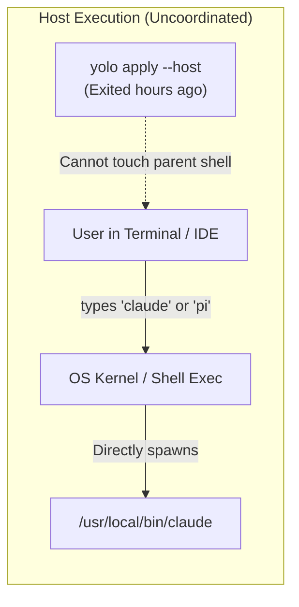
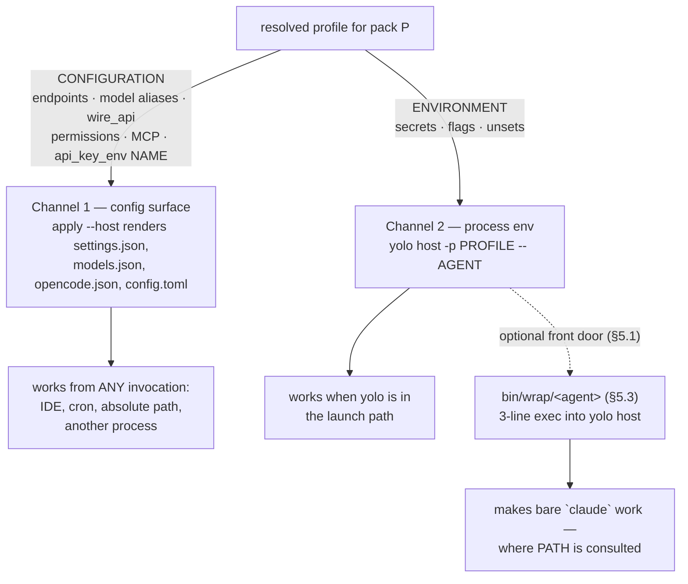

# Delivering Environment Variables to Host Agents: Config-First vs. Shims

**Status:** DECIDED, 2026-08-30 (was DRAFT 2026-08-29; amended and fully ruled 2026-08-30).
**Implemented 2026-08-30** — commits `fe090446`…`a813b865` (the feature) plus
`19f92de1`…`2e3b02aa` (the adversarial-review fixes: env-scope boundary, `bin` traversal
rule, comment-aware `host_wrappers` writer, effective-access PATH resolution, relative
`env_sources` refusal). All seven OQs are ruled — see the Decision Ledger in §9. One
question opened BY the implementation lives in its own doc:
[`envsource-relative-paths.md`](envsource-relative-paths.md) (OQ-E1 — refusal vs
declaring-file anchoring).

> [!IMPORTANT]
> **What the amendment changed, and it is the doc's central claim.** The first version was organized
> as a *preference order*: config first, process env as a fallback for the one agent that cannot do
> better. That is wrong, and §4's matrix encoded the error — it marked pi, opencode and codex
> *"Can Avoid Shims Completely? ✅ Yes"* on the strength of `apiKeyEnv` / `{env:…}` / `api_key_env`.
> **Those fields carry the NAME of a variable, not its value** (`packs/pi/derive.lua`,
> `packs/opencode/derive.lua`, `packs/codex/derive.lua` — each writes the name). The agent then reads
> that variable from **its own process environment**. So a config file cannot deliver a credential,
> by deliberate design (secrets stay out of git), and a host process-env channel is **mandatory, not
> a fallback**.
>
> The corrected frame is a **split by payload type, not a preference order, and not a per-agent
> choice** (§1 P1). And the deciding fact is not a property of the agent at all: **whether you need
> the env channel is a property of the PROVIDER.** Bedrock needs AWS credentials in the environment
> whether the agent is `claude` or `codex`; first-party subscription needs nothing. A per-agent
> capability matrix was answering the wrong question.

**The short version.** Inside a jail, injecting environment variables is trivial because yolo
controls the process spawn (`podman run -e …`). On the host it is not, and it cannot be avoided:
the `api_key_env` + `env_sources` architecture deliberately puts only variable *names* in config, so
**something must populate the agent's process environment or BYOK does not work on the host at all.**
This doc designs **two always-present channels split by what they carry** — configuration into the
agent's native config surface (universal invocation coverage: IDE, cron, absolute path), environment
into the process via an explicit host launch verb (`yolo host -- <agent>`) with an opt-in wrapper
directory on `PATH` carrying a generated **launch wrapper for every installed program** — both a
transparent front door to that same verb and an absolute path (`<wrap dir>/claude`) that scripts
and IDEs can rely on unconditionally. One env-composition implementation, two entry points,
identical rules for every pack.

**The most important sections are §1 (the payload split), §4 (the corrected capabilities matrix),
and §5.1 (where launch wrappers live, and the PATH claim that costs).**

**Reads with:** [`pack-profiles.md`](pack-profiles.md) (the pack profile data model and merge pipeline), [`host-render-target.md`](host-render-target.md) (the host as a reduced render target for `apply --host`), and [`pack-system.md`](pack-system.md) (the pack contribution model).

---

## 1. Principles & Verdict Up Front

1. **P1 — Split by payload type, never by agent.** Two channels, both always present for every pack,
   carrying different things:
   * **Configuration** — endpoints, model aliases, `wire_api`, permissions, MCP wiring → the agent's
     **native config surface**. Universal *invocation* coverage: it works when an IDE, a cron job, or
     another process starts the agent, and when it is invoked by absolute path.
   * **Environment** — secrets, `CLAUDE_CODE_USE_BEDROCK`, `AWS_REGION`, and **unsets** → the
     **process environment**. Requires yolo in the launch path.

   There is no per-agent method selection, and that is the point: selecting per agent was the
   fragility, not the fix for it. A pack that needs neither channel declares neither.
2. **P2 — The env channel is mandatory, not a fallback.** `api_key_env` and `env_sources` put only a
   variable *name* in config. Nothing else populates it on the host. **Any BYOK provider is
   unusable on the host without this channel** — for every agent, not just the one with no config
   file. §4 measures which is which.
3. **P3 — No silent shell profile pollution.** `apply --host` must never mutate the user's shell RC
   files to export agent variables. Session pollution breaks tool isolation, leaks secrets across
   unrelated commands, and cannot support per-command profile switching. *(A single `PATH` entry is
   a smaller and different claim — §5.1 — and it is still the user's file, so yolo prints the line
   and does not write it unless asked.)*
4. **P4 — One env-composition implementation, two front doors.** `yolo host -p <profile> -- <agent>`
   is the mechanism. A generated **launch wrapper** on `PATH` is a three-line `exec` into it, never a
   second implementation to drift. This is what makes "keep shims" affordable.
5. **P5 — The PATH claim is opt-in; the wrapper set is not conditional on anything at all.** One
   user-level decision enables `<wrap dir>` on `PATH` (§5.3, §5.5). After that, a wrapper is
   generated for **every host program a selected pack installs — unconditionally** (OQ-5). Never
   per-agent opt-in, which would reintroduce exactly the invisible per-agent variation P1 exists to
   delete; and never gated on the resolved env either, because the wrap dir is an **addressable
   launch surface**: like a mise/asdf shim dir, `<wrap dir>/<agent>` must be a path a script or an
   IDE can point at unconditionally and get the composed environment by absolute path, regardless
   of shell config. A gate computed from config would make that path exist on some machines and not
   others — §5.4 is the whole of that argument. *(This supersedes two earlier versions: the first
   made shims strictly opt-in per agent; the second generated only for packs whose resolved env
   came out non-empty, which broke the always-addressable property OQ-5 ruled for.)*
6. **P6 — Blocker, launcher, wrapper: three mechanisms, three words, and "shim" retires.** They sit
   at different `PATH` positions for opposite reasons — **blockers** first (`grep -r` → refuse,
   `exit 127`), **launchers** last (lazy installers, after `/bin`), **wrappers** prepended on the
   host (compose env, forward). "Shim" today names the first and is colloquially used for the third.
   **§5.3 renames the directories so this principle stops needing to be restated** — the ambiguity is
   removed rather than legislated against.

---

## 2. Diagnosis: Why Host Environment Delivery is Hard

In a container jail, the environment lifecycle is well-defined:

```
┌─────────────────────────────────────────────────────────────┐
│ Jail Container Launch (Controlled Process Spawn)            │
│ Core resolves config → passes `-e KEY=VAL` to podman        │
│ Container entrypoint provisions jail → PID 1 has exact env  │
└─────────────────────────────────────────────────────────────┘
```

On the host, the execution model is completely uncoordinated:



### 2.1 The Four Host Constraints
1. **Child Processes Cannot Mutate Parent Shells:** `yolo apply --host` runs as an ephemeral command. It writes files to disk and exits; it has no ongoing mechanism to modify the calling shell's environment table.
2. **Global Shell Export is a Security and Isolation Hazard:** Exporting `CLAUDE_CODE_USE_BEDROCK=1` or `ANTHROPIC_DEFAULT_OPUS_MODEL=...` in `~/.bashrc` makes those variables visible to every process the user runs, prevents per-project `.env` overrides, and makes transient profile switching (`-p dev`) impossible.
3. **Agent Heterogeneity:** Some agents read their configuration files for endpoints; others strictly require process environment variables (`process.env`).
4. **The Shim Trap:** Placing a wrapper script named `claude` in `~/.local/bin` to intercept calls requires `~/.local/bin` to precede `/bin` or `/usr/local/bin` on `PATH`. If npm, brew, or mise updates the underlying tool, the shim either shadows the update or breaks with stale arguments.

### 2.2 Real-World Case Study: Obviating `.bashrc` Wrapper Functions
A common developer pattern on the host is writing custom shell wrapper functions in `~/.bashrc` to manage environment and secrets per tool:

```bash
claude() {
  # Work-only Bedrock creds/env live in ~/.config/claude/env (untracked, 600).
  # No-op on personal machines where the file doesn't exist.
  (
    unset AWS_PROFILE
    [ -f ~/.config/claude/env ] && set -a && . ~/.config/claude/env && set +a
    command claude "$@"
  )
}
```

This manual shell wrapper ceremony exists to solve three specific problems:
1. **Subshell Isolation (`( ... )`)**: Keeping Bedrock keys (`CLAUDE_CODE_USE_BEDROCK=1`) and AWS credentials from leaking into the user's interactive shell or colliding with `AWS_PROFILE`.
2. **Machine-Specific Conditioning (`[ -f ... ]`)**: Activating Bedrock on work machines where `~/.config/claude/env` exists, while falling back to first-party subscription on personal machines.
3. **Atomic Bundle Assembly**: Combining secrets, environment variables, and model names into one invocation.

**How the Host Environment Architecture Obviates This — and which job needs which channel.** The
first version of this section claimed Tier 1 covered the case. Scored against the three jobs the
wrapper actually does, it covers one:

| Job the wrapper does | Config surface (Tier 1) | Process env (Tier 2) |
| :--- | :--- | :--- |
| `unset AWS_PROFILE` | ❌ **Cannot.** A `settings.json` `env` block sets; there is no unset. | ✅ |
| Subshell isolation — keys never enter the interactive shell | ❌ Not its job | ✅ — and this is the job `mise`/`direnv` do the *opposite* of (§7 Alt 4) |
| Machine-conditional activation (`[ -f ~/.config/claude/env ]`) | ✅ `env_sources`' permissive skip is exactly this | ✅ |
| Atomic bundle: **secrets** + env + model names in one invocation | ❌ for the secrets half — a config file must never carry the key | ✅ |

> [!WARNING]
> **"`env_sources` automatically hydrates credentials" — into what?** That sentence stood in the
> first version and it has no referent at the host notch: if `apply --host` only writes files and
> never launches a process, there is no environment to hydrate. This is the hole the amendment
> exists to close, and it is in the doc's own flagship case study.

* **Native Config Delivery (`yolo apply --host`)**: Claude natively supports `"env": {…}` in
  `~/.claude/settings.json`, so the **non-secret flags** land there and bare `claude` picks them up
  from any invocation path — IDE included. *(Pending measurement: whether Claude Code honors that
  block for `CLAUDE_CODE_USE_BEDROCK` specifically —
  [`profiles-as-pack-variants.md`](profiles-as-pack-variants.md) OQ-4.)*
* **Process Environment (`yolo host --`, or its `PATH` wrapper)**: the AWS credentials, the
  `unset`, and the subshell isolation. Not a fallback — the only channel that can do these.
* **Jail & Host Parity**: `yolo -- claude` and `yolo host -- claude` compose the same environment
  from the same resolved profile.

---

## 3. The Delivery Spectrum: Four Approaches Evaluated

```mermaid
flowchart TD
    subgraph "Approach 1: Native Config Surfaces"
        A1["yolo apply --host"] --> A1_FILE["~/.claude/settings.json {env: ...}"]
        A1_FILE --> A1_RUN["Host Agent reads config on startup"]
    end

    subgraph "Approach 2: Explicit Host Launch Verb"
        A2["yolo host -p bedrock -- claude"] --> A2_EXEC["yolo resolves env & syscall.Exec"]
        A2_EXEC --> A2_RUN["Agent spawned with clean process env"]
    end

    subgraph "Approach 3: Shell / Environment Manager Export"
        A3["yolo env (or direnv/mise)"] --> A3_HOOK["Shell hook evaluates exports"]
        A3_HOOK --> A3_RUN["Terminal session acquires env vars"]
    end

    subgraph "Approach 4: PATH Shims"
        A4["<wrap dir>/claude (wrapper)"] --> A4_WRAP["Wrapper resolves config & execs real bin"]
        A4_WRAP --> A4_RUN["Transparent interception on PATH"]
    end
```



---

### 3.1 Approach 1: Native Agent Config File Injection (Channel 1 — configuration)

Many modern coding agents already support specifying custom environment variables or endpoint overrides in their native configuration files.

#### How It Works:
During `yolo apply --host`, Core's host renderer calls each pack's `derive.lua` and writes the merged profile/provider configuration directly into the agent's native config file in `$HOME`.

* **Claude Code (`~/.claude/settings.json`)**: Claude natively supports an `"env"` dictionary in `settings.json`:
  ```jsonc
  {
    "env": {
      "CLAUDE_CODE_USE_BEDROCK": "1",
      "AWS_REGION": "us-east-1",
      "ANTHROPIC_DEFAULT_OPUS_MODEL": "us.anthropic.claude-opus-5[1m]"
    }
  }
  ```
* **OpenCode (`~/.config/opencode/opencode.json`)**: OpenCode natively supports declaring providers, custom base URLs, and environment variable references in `opencode.json`.
* **Pi (`~/.pi/agent/models.json`)**: Pi natively supports declaring endpoints, models, and `apiKeyEnv` mappings in `models.json`.
* **Codex (`~/.codex/config.toml`)**: Codex natively supports configuring `model_providers` directly in `config.toml`.

#### Pros & Cons:
* 👍 **Pros:**
  * **Zero shims:** The user runs the standard, bare command (`claude`, `pi`) without wrappers or aliases.
  * **Zero PATH pollution:** Tool resolution remains standard.
  * **Tool-native lifecycle:** Upgrades to the tool do not break the configuration.
* 👎 **Cons:**
  * Static to the host's active profile (cannot swap transiently with `-p dev` on a single command without editing the file or launching via `yolo`).
  * Only works for variables that the specific tool's config file supports.

---

### 3.2 Approach 2: Explicit Host Launch Verb (`yolo host`) — Channel 2, the mechanism

For transient profile switching or for agents lacking native config env blocks, `yolo` provides an explicit host execution verb:

```bash
# Launch host Claude with Bedrock profile
yolo host -p bedrock -- claude

# Launch host Pi with local llama-server profile
yolo host -p local -- pi
```

#### How It Works:
1. `yolo host` resolves the workspace or user configuration and active pack profiles.
2. It constructs the exact composite environment table ($$\text{host env} + \text{resolved profile env}$$).
3. It locates the real target binary on the host `PATH` (e.g. `/usr/local/bin/claude`).
4. It calls `syscall.Exec` directly, replacing the `yolo` process with the target agent.

#### Pros & Cons:
* 👍 **Pros:**
  * **100% parity with container jail launches:** Supports all launch flags (`-p`, `--profile`, `--pack-profile`).
  * **Zero disk side-effects:** Does not mutate `settings.json` or shell RC files.
  * **Completely reliable:** No shim traps, no PATH order dependencies.
* 👎 **Cons:**
  * Requires typing `yolo host -- <agent>` instead of bare `<agent>`.

---

### 3.3 Approach 3: Shell Environment Manager Integration (`direnv` / `mise` / `yolo env`) — a front door, not a tier

For users who want environment variables active in their terminal when entering a workspace directory on the host.

#### How It Works:
* `yolo env` outputs POSIX `export KEY="VAL"` statements.
* Users of `direnv` can add `eval "$(yolo env)"` to their `.envrc`.
* Users of `mise` or shell hooks can source yolo's environment output.

#### Pros & Cons:
* 👍 **Pros:**
  * Automatically activates/deactivates when `cd`ing into a workspace directory.
  * Standard developer pattern for tools like `direnv`.
* 👎 **Cons:**
  * Terminal-only (does not reach GUI apps or editors).
  * Requires user to have `direnv` or custom shell setup installed.

---

### 3.4 Approach 4: Transparent `PATH` Launch Wrappers — Channel 2's front door

> [!NOTE]
> **This section's original verdict — "the brittle fallback" — has been overtaken (2026-08-30), but
> its analysis has not.** The three cons below are all real and all survive; what changed is that
> §4's correction made Channel 2 **mandatory**, so the choice stopped being *whether* to have a
> process-env mechanism and became *which front doors* it gets. Wrappers are kept, in their own
> prepended directory (§5.1), reduced to a three-line `exec` into `yolo host` so they carry no logic
> of their own — which retires the recursion and drift concerns without pretending the `PATH`
> coverage gap went away. §5.1's bypass table is the honest scope.

Placing executable wrapper scripts in a directory of their own and adding it to `PATH` — ruled to
`~/.local/share/yolo-jail/bin/wrap` in §5.3.

The shape originally sketched here composed the environment inside the wrapper and hard-coded the
target path — both of which §5.1 removes:

```bash
#!/usr/bin/env bash
# <wrap dir>/claude — as originally sketched (superseded)
eval "$(yolo host env --pack claude)"
exec /usr/local/bin/claude "$@"          # hard-coded path breaks on `claude update`
```

```bash
#!/usr/bin/env bash
# <wrap dir>/claude — as designed (§5.1, P4)
exec yolo host -- claude "$@"            # one env-composition implementation; target resolved
                                         # by §6.1 step 1, which skips yolo-managed dirs
```

#### Pros & Cons:
* 👍 **Pros:**
  * Allows typing bare `claude` while still dynamically evaluating profiles.
* 👎 **Cons:**
  * **PATH Fragility:** If `npm install -g @anthropic-ai/claude-code` installs to `~/.npm-global/bin`, `PATH` ordering decides whether the shim or real binary runs.
  * **Infinite recursion risk:** A shim calling `claude` can accidentally exec itself if `PATH` lookup is naive.
  * **Global side-effects:** Shims affect every invocation on the machine.

---

## 4. Per-Agent Host Capabilities Matrix

> [!WARNING]
> **The first version of this table was wrong in its last column, and the error is why this doc
> needed amending.** It marked pi, opencode and codex *"Can Avoid Shims Completely? ✅ Yes"* because
> each has a credential field in its config file. **Each of those fields carries the NAME of an
> environment variable, not its value** — verified against the shipped derives on 2026-08-30:
> `apiKeyEnv = prov.api_key_env` ([`packs/pi/derive.lua`](../../packs/pi/derive.lua)),
> `entry.apiKey = "{env:" .. prov.api_key_env .. "}"`
> ([`packs/opencode/derive.lua`](../../packs/opencode/derive.lua)),
> `entry.api_key_env = prov.api_key_env` ([`packs/codex/derive.lua`](../../packs/codex/derive.lua)).
> The agent reads that variable from **its own process environment**, so the config file routes the
> credential rather than delivering it.

The last column is therefore replaced by two, because there was never one answer: **config carries
the routing, the environment carries the secret.**

| Agent Pack | Config surface carries | Config file | Needs process env? |
| :--- | :--- | :--- | :--- |
| **`claude`** | ✅ `"env": {…}` — non-secret flags, model defaults | `~/.claude/settings.json` | **Only for BYOK** (Bedrock: AWS credentials, and the `AWS_PROFILE` unset). Not in first-party subscription mode. |
| **`pi`** | ✅ `baseUrl`, `api`, **and `apiKeyEnv` — the NAME** | `~/.pi/agent/models.json` | **Yes, whenever the provider has a key.** |
| **`opencode`** | ✅ `baseURL`, `@ai-sdk`, **and `{env:VAR}` — the NAME** | `~/.config/opencode/opencode.json` | **Yes, whenever the provider has a key.** |
| **`codex`** | ✅ `base_url`, **and `api_key_env` — the NAME** | `~/.codex/config.toml` | **Yes, whenever the provider has a key.** |
| **`copilot`** | ❌ nothing — no config env block | none / `~/.copilot-agent/` | **Yes, always, for BYOK.** |
| **`agy`** | ✅ native OAuth, no custom env | `~/.gemini/` | **No** — the one genuine exception, and only because it does not do BYOK. |

**Read the right-hand column and the agent names stop mattering.** Five of six need the process-env
channel the moment a provider carries a key, and the sixth is exempt only because it has no such
provider. **The variable is the provider, not the agent** — which is P1's whole point, and the
reason `copilot` is no longer a special case worth an advisory (Decision Ledger, OQ-1).

---

## 5. The Recommended Host Environment Architecture

Not a fallback ladder. **Two channels that always both apply**, split by payload (P1), plus one
optional front door onto the second.



**Neither channel is universal, and they are partial along different axes.** Channel 1 is universal
on *invocation* and cannot carry a secret. Channel 2 is universal on *payload* and only reaches
invocations yolo is part of. That is why both always apply, and why "just use shims for everything"
does not collapse the problem — see §5.1.

`yolo env` (`eval "$(yolo env)"`) remains available for direnv/mise users as a **third front door
onto Channel 2**, not a tier of its own. §7 Alt 4 says why it is not the primary one.

### 5.1 Where launch wrappers live — and the PATH claim they cost

**The question this section answers:** if we keep wrappers, do they need `PATH` access, or can they
go in a standard directory? **They are the same question**, and the answer settles the placement.

A wrapper only works if it is found *before* the real binary. `packs/claude` installs via
`https://claude.ai/install.sh`, which puts the real `claude` in **`~/.local/bin/claude`** — a
directory already fifth on the jail's `BootPath` and conventionally on the host's.

> [!CAUTION]
> **`~/.local/bin` is not a placement option, and the reason is stronger than PATH ordering — it is
> a FILE collision.** A wrapper named `claude` in the same directory as the real `claude` is the same
> path. One of them overwrites the other, and `claude update` re-running the installer either
> clobbers the wrapper or fails against it. §7 Alt 1 reached the same conclusion independently
> ("collisions with package managers"); this is the concrete instance.

So wrappers need **their own directory, prepended to `PATH` ahead of `~/.local/bin`**:

```console
$ export PATH="$HOME/.local/share/yolo-jail/bin/wrap:$PATH"   # one line, once, in your rc
```

*(Directory ruled in §5.3, which also renames the jail's two generated dirs into the same tree.)*

Four consequences worth stating before agreeing to it:

1. **Prepend, not append.** Appending puts the wrapper *behind* the real binary and it never runs.
   Prepending means everything in that directory shadows the user's tools — a standing claim, which
   is why the directory holds **only generated wrappers** and yolo must be able to reset it
   **contents-only** (the same rule the jail's anchor dirs follow, `resetAnchorDir` — never
   `RemoveAll`, because the directory itself may be a mount or a `PATH` entry someone captured).
2. **It is an RC edit, and P3 says yolo does not make it.** Adding one `PATH` entry is a smaller and
   different claim than exporting agent variables session-wide — but it is still the user's file.
   **yolo prints the line; `--shell-init` writes it on request.** This mirrors `check-deps`, which
   writes an install manifest rather than installing.
3. **It is one decision, not one per agent** (P5), and it is a **config key** — `host_wrappers`,
   top level beside the existing `host_files` — rather than something yolo infers from `PATH`.
   Not opted in means no directory and no messages at all; `yolo host --` still works. §5.5 says why
   inferring the opt-in from `PATH` gets it wrong in both directions.
4. **The wrapper is three lines and holds no logic:**

   ```bash
   #!/usr/bin/env bash
   exec yolo host -- claude "$@"
   ```

   One env-composition implementation (P4). §6.1 step 1's recursion guard — resolving the target
   binary while ignoring yolo-managed directories — is what keeps this from calling itself.

**What the wrapper does NOT cover, stated plainly, because "shims for everything" reads as a
universal answer and is not one:**

| Bypass | Consequence |
| :--- | :--- |
| Invocation by absolute path (`~/.local/bin/claude`) | wrapper skipped |
| An IDE extension with a configured binary path | wrapper skipped — **and the inversion is the fix**: configure the IDE's binary path to `<wrap dir>/claude` and the composed env arrives by absolute path, no `PATH` consulted. OQ-5's unconditional generation is what makes that answer always available |
| A shell function (`claude() { … }`) | **beats `PATH` outright.** The §2.2 wrapper function wins over the generated one; it has to be deleted either way |
| A process that sanitizes `PATH` before spawning | wrapper skipped |

**So a generated wrapper is a governance win over the `.bashrc` function on `PATH`, and —
addressed by absolute path — a coverage win beyond it**: versioned, reviewable, uniform across
agents, removable, and with two escape hatches the function does not have. When `PATH` is not
consulted, `yolo host -- claude` is a documented answer instead of a mystery — and so is
`<wrap dir>/claude` itself, the same answer in file form. The second hatch only works if the file
is guaranteed to exist, which is what OQ-5 rules (§5.4).


### 5.2 The CLI shape: `yolo host <verb>`, and `--host` removed (OQ-7)

**Ruled 2026-08-30.** Three spellings for one operation was the problem; the ruling leaves two, and
removes rather than deprecates the third.

| Spelling | Disposition |
| :--- | :--- |
| `yolo apply --at host` | **Systematic form, unchanged.** The notch stays a value of the `confinement` dial ([`confinement.go:45`](../../internal/config/confinement.go#L45)), which is what settled decision 9.1 in [`host-render-target.md`](host-render-target.md) protects. |
| `yolo host apply` | **The ergonomic form.** Also where the host-ONLY verbs live — `yolo host env`, `yolo host wrappers enable`, and the exec half `yolo host -- <cmd>` (OQ-2). |
| `yolo apply --host` | **REMOVED.** Not deprecated-with-a-message. |

> [!NOTE]
> **Why removal does not re-special-case the host, which was the objection.** Decision 9.1 says the
> host target is *one notch of a dial, not a special case* — a claim about **what the notch is**.
> `yolo host` is about **where its ergonomics live**, and it earns a namespace for a reason the
> other notches cannot match: only the host has a user shell and a `PATH` to claim, so
> `yolo host env` (emitting `export` lines) and `yolo host wrappers enable` have no `jail` or `guest`
> counterpart and nowhere else to go. `yolo env --at host` is awkward precisely because `--at jail`
> would mean nothing. The dial is untouched; `--at` keeps every notch equal.

**Removal scope, measured 2026-08-30.** The flag is cheap to remove and expensive to *mention*:

| What | Where | Size |
| :--- | :--- | :--- |
| The flag's only acceptance point | [`apply.go:63-64`](../../internal/cli/apply.go#L63-L64) | **2 lines** |
| Its `--help` line | [`apply.go:658`](../../internal/cli/apply.go#L658) | 1 line |
| The generated CLI reference | `internal/cli/config_ref.txt` (3 hits) | regenerate |
| Prose across the corpus | ~95 files, 373 `apply --host` mentions in `.md` | **a mechanical sweep** — the string becomes `yolo host apply` |

> [!WARNING]
> **The prose sweep is where this goes wrong if it is done casually.** Most of the 373 are
> *descriptions of the host notch* ("`apply --host` renders your packs' config surfaces"), which
> rewrite cleanly. Some are **historical records** in `docs/plans/shipped-*.md` and
> `retired-decisions.md` describing what shipped *at the time* — those must NOT be rewritten, exactly
> as [`docs/plans/README.md`](../plans/README.md)'s five checks carry allowlists for docs that
> deliberately name deleted things. Sweep with an allowlist, not with `sed -i` over `docs/`.

**One more thing the removal forces.** `yolo apply --help` currently says *"The host notch has no
exec half — there apply IS the whole feature."* OQ-2 already made that stale; this ruling means the
help text is being edited anyway, so both changes land together.

### 5.3 Where the directories live — XDG, and gathering the jail's dirs with them (OQ-6)

**Ruled 2026-08-30**, answering the two questions asked: what the XDG alternatives are, and whether
the in-jail dirs come along.

**On XDG — the honest finding first.** This repo follows the XDG *layout* and does not honor the XDG
*variables*: `internal/paths/paths.go:315` hardcodes `.local/share/yolo-jail` and
`.config/yolo-jail`, and there is **no `XDG_DATA_HOME` / `XDG_CONFIG_HOME` read anywhere in the
tree** (verified 2026-08-30). So "use XDG" splits into two different changes:

| Option | Verdict |
| :--- | :--- |
| `$XDG_DATA_HOME/yolo-jail/bin`, honoring the variable | **The spec-correct answer, and out of scope here.** Honoring `XDG_DATA_HOME` for *one new directory* while `paths.go` hardcodes the rest would be the only path in the tree that moves when the variable is set. If yolo should honor XDG, that is a `paths.go`-wide change and its own decision. |
| **`~/.local/share/yolo-jail/bin`** (hardcoded, like its siblings) | ✅ **RULED.** Same tree as `approvals/`, `packs/`, `build/`, `agents/`, `home/` — the existing machine-state root, which is already the XDG *data* location by layout. Nothing new is invented. |
| `~/.yolo/bin` (the previous leaning) | ❌ Invents a second host-side yolo tree beside one that already exists. |
| `$XDG_STATE_HOME` | ❌ Wrong category: the spec scopes it to logs, history, recently-used — not generated executables. |
| `$XDG_CACHE_HOME` | ❌ Actively wrong: a cache is evictable, and an evicted `PATH` entry is a silently broken `claude`. |
| `~/.local/bin` | ❌ File collision with `claude`'s own installer — §5.1. |

**On gathering the jail's blocker and launcher dirs with it — yes, with one hard constraint.**

> [!CAUTION]
> **They can be gathered in the filesystem. They CANNOT be gathered on `PATH`.** `~/.yolo-shims`
> holds blockers and must be **FIRST** — interception is its entire job. `~/.yolo-launchers` holds
> lazy installers and must be **LAST**, after `/bin`, which is what makes a pack's declared `fzf`
> unable to shadow the image's ([AGENTS.md](../../AGENTS.md), and `shims.go:39-40`). One directory
> cannot occupy both ends. **The gathering is a TREE reorganization; the number of distinct `PATH`
> entries does not change.**

With that constraint, the rename is worth doing — the dirs are yolo's own and regenerated every
boot — and it fixes a naming problem this doc already had to legislate around in P6:

```
<root>/bin/block/     → PATH position 1     blockers    (grep -r, find → refuse, exit 127)
<root>/bin/launch/    → PATH position last  launchers   (lazy installers, then exec the real bin)
<root>/bin/wrap/      → host only, prepended  wrappers  (compose env, exec yolo host)
```

**Three unambiguous words — blocker, launcher, wrapper — and "shim" retires.** Today "shim" names
the blockers in AGENTS.md, is what everyone calls the host wrappers colloquially, and is what P6
exists to stop people conflating. Renaming removes the need for P6 rather than restating it.

**What this touches, and why it is a separate piece of work:** the in-jail dirs are **bind-mount
anchors** from `<ws>/.yolo/home/{yolo-shims,yolo-launchers}`
([`assemble_parts.go:111,117`](../../internal/cli/run/assemble_parts.go#L111-L117)) under a `:ro`
`/home/agent`, and they are cleared contents-only by `resetAnchorDir` because a live jail's bind
captured the inode. Renaming means changing the mount args, the generator, `BootPath`'s ordering
comment, and AGENTS.md's PATH-order section together — mechanical, but not a side effect of the host
work. **Sequence it after the host wrapper dir exists**, so the new vocabulary lands once.


### 5.4 What "needs host env" actually means — and why a pack cannot declare it

This section exists because earlier drafts of P5 and OQ-5 said *"every pack that declares host
env"*, and **that phrase names nothing.** Checked against the tree 2026-08-30:

| Could a pack declare it? | Finding |
| :--- | :--- |
| A manifest field for it | **No such field.** `kind: "env"` is `Vars map[string]string` ([`contributes.go:107`](../../internal/packdecl/contributes.go#L107)) with **no notch qualifier** — it is refused at the host notch wholesale, not conditionally. |
| `api_key_env` in a `pack.json` | **Never appears in one.** It occurs only inside `derive.lua` files reading `ctx.providers` — which is **user config**, not a pack declaration. |
| A "I consume providers" declaration | **Does not exist.** No `pack.json` mentions `providers`; the derive just reads `ctx.providers` at render time. |

> [!IMPORTANT]
> **In the dominant case the pack CANNOT know.** Whether `pi` needs a process-env channel depends on
> whether *the user* configured a provider carrying an `api_key_env` — a fact in
> `~/.config/yolo-jail/config.jsonc`, not in `packs/pi/pack.json`. §4's right-hand column says five
> of six agents need the channel "whenever the provider has a key", and **the pack is not the thing
> that knows whether it has one.** A manifest declaration would systematically under-generate.

**So nothing declares the trigger — and, ruled in OQ-5, nothing computes one either: THERE IS NO
TRIGGER.** Once `host_wrappers` is on, a wrapper is generated for **every host program a selected
pack installs** — the agent CLIs today; a loophole-only pack installs no program and so gets
nothing, which is the only gate left, and it is structural, not environmental. What varies by
config is not *whether* the wrapper exists but *what its launch composes*: the wrapper is a
three-line `exec` into `yolo host` (§5.1), and §6.1 resolves the environment at launch time from
live state. Three sources feed that composition, and only the first is anything a manifest says:

1. **Static `env`** — a `kind: "env"` contribution, or the `env` block of the pack's active
   `kind: "profile"` variant. Literal strings, known from the manifest.
2. **Provider credentials** — the `api_key_env` name of every provider the pack projects. Today the
   three provider-consuming derives project **every** configured provider into their surface, so in
   practice this is the union of `api_key_env` across `providers`, for every pack whose derive reads
   `ctx.providers`.
3. **Removals** — a `null` value, i.e. §2.2's `unset AWS_PROFILE`. It has no config-surface
   equivalent at all, so its presence alone requires the channel.

**Why the computed gate died — this doc briefly leaned "generate iff the resolved env is non-empty"
and OQ-5 overruled it.** Two things were wrong with it, kept here so neither gets re-derived:

> [!WARNING]
> **The "empty wrapper is a lie" objection argued against a wrapper §5.1 had already deleted.** No
> wrapper injects anything, for any pack — env composition lives in `yolo host` at launch. A
> wrapper for `agy` behaves *identically* to the wrapper for `claude` on a personal machine where
> the Bedrock creds file is absent: it composes what live state says, which happens to be nothing.
> §2.2's own flagship `.bashrc` function is exactly this shape — universal, conditionally-empty —
> and "no-op on personal machines" is presented there as correct behavior.

> [!WARNING]
> **A gate computed at apply time gates a file whose payload is composed at launch time.** Under
> the gate, the wrapper set was a function of user config — unstable across machines and config
> edits, with `yolo host apply --dry-run` the only place the answer existed. And it broke the
> property OQ-5 ruled for: the wrap dir as an **addressable launch surface**. In mise/asdf/pyenv,
> the shim for every installed tool exists unconditionally, precisely so a script or an IDE can
> point at `<shim dir>/<tool>` by absolute path and get a correct environment regardless of shell
> config — *"you can always point directly at the shim and ensure that you get a perfect env …
> regardless of shell config."* A conditionally-existing `<wrap dir>/agy` is a path you cannot rely
> on, which is to say: not a surface.

**How this composes with §5.5's reporting rule:** the wrap dir's contents now change only when the
selected pack set (or a pack's installed programs) changes — first enable, pack added or removed —
and "print when the wrapper directory changed" fires exactly then. Adding a provider with a key
changes **no** wrapper file and needs no report: the existing wrapper starts composing it at the
next launch, with no re-apply needed for the env channel (Channel 1's config files still wait on
one).

> [!NOTE]
> **The honest cost of unconditional generation:** with wrappers enabled, yolo is a hard runtime
> dependency of every wrapped launch — a broken `yolo` binary or an unparseable config takes bare
> `agy` down with it, an agent whose composed env is empty and which needed nothing from yolo. That
> is the price of the always-addressable property, accepted in OQ-5. It is bounded by the bypass
> table's own rows: the real binary still sits behind the wrap dir on `PATH`, and invoking it by
> absolute path still works.

### 5.5 `apply` reports actions, `check` reports state — the `PATH` line (OQ-4)

**Ruled 2026-08-30, confirming the leaning.** The question was when yolo prints the one `PATH` line
the wrap dir needs (§5.1 consequence 2), and whether it ever writes it. The four-part shape:

* **Opt-in is `host_wrappers: true`** (top level, beside the existing `host_files`), not a `PATH`
  inspection. Not opted in → no directory, no wrappers, no message, ever. `yolo host --` still
  works. This is what stops any of it being a nag — yolo only ever mentions the line to someone who
  asked for wrappers.
* **`apply` prints the line when it CREATED OR CHANGED the wrapper directory** — not when it
  observes `PATH`. That is a completion notice about its own action ("I just wrote six wrappers;
  here is what makes them take effect"), and it needs to know nothing about your RC or your shell.
  Silent on every apply that changed no wrappers — which, after OQ-5, means every apply that did
  not enable the feature or change the selected pack set (§5.4).
* **`yolo check` carries the `PATH` observation**, every run, because it is the command whose job
  is "what is the state of my environment" and it is typically run from a fresh shell — so its
  answer is both decidable and actionable, which `apply`'s is not. A generated wrapper directory
  that is not on `PATH` is an inert-configuration row, in the summary-counted channel.
* **`apply` does NOT refuse.** It also writes Channel 1 surfaces, which work regardless; refusing
  the half that works because the other half is unwired would be the wrong gate
  ([`gate-placement-principle.md`](gate-placement-principle.md)). Generate, report, and let `check`
  keep reporting.

Plus **`--shell-init`** for the user who would rather yolo just wrote the line — the same
disposition [`reference-mismatch-diagnostics.md`](reference-mismatch-diagnostics.md) reaches for
every other "configured but not in effect" state. It writes on explicit request only; P3 stands.

> [!WARNING]
> **Why `apply` must not condition on observing `PATH` — "already set" has two meanings, and they
> disagree exactly when it matters.** `apply` can observe **this process's `PATH`**, a fact about
> the shell that invoked yolo, not about the user's RC. False positive: the line is in the RC, but
> yolo ran from a shell started before the edit — a nag about something already done. False
> negative, the worse one: someone typed `export PATH=…` ad hoc in one shell; yolo sees it present,
> says nothing, and every *new* shell has no wrappers — the silent-skip class, arrived at by a
> check that was trying to prevent it. Reading RC files to disambiguate is not the fix: the line
> can live in any of several files or be built dynamically, and P3 says they are not yolo's
> territory. The tempting intermediate — print when the wrap dir is absent from this process's
> `PATH` — inherits the whole ambiguity for no benefit. **Conditioning `apply` on its own action
> instead of on an observation removes the unreliable input entirely** — and the actions-vs-state
> split is what the two commands are for.

**The residual, named:** a user who enables `host_wrappers` and never pastes the line has a working
`yolo host --` and inert wrappers — not silently (`apply` said the line once, `check` repeats it
every run), but not working either. That residual is the cost of P3, and `--shell-init` is its
exit.

---

## 6. Detailed Design: `yolo host` Command

`yolo host` is the host-side equivalent of `yolo run`, and after P4 it is the **only** place the host
process environment is composed — the `PATH` wrapper (§5.1) and `yolo env` are front doors onto it,
not parallel implementations. The spelling is ruled (OQ-2): `yolo host -- <cmd>`, with
`yolo --at host -- <cmd>` as an alias per [`host-render-target.md`](host-render-target.md).

```bash
# Usage
yolo host [flags] [-- <command> [args...]]

# Examples
yolo host -p bedrock -- claude
yolo host -p local -- pi
yolo host --profile dev -- opencode
```

### 6.1 Execution Flow
1. **Locate Target Binary**: Resolves the executable path of `<command>` using host `PATH` (ignoring any yolo-managed directories to avoid recursion).
2. **Resolve Pack Configuration**: Resolves the active profile for the target pack and composes its
   effective `env` for the active workspace. *(Which resolution model that is remains open: the
   cross-pack merge pipeline of [`pack-profiles.md`](pack-profiles.md) §8, or the pack-own-variant
   model of [`profiles-as-pack-variants.md`](profiles-as-pack-variants.md) §3. This step is
   agnostic to that choice — it needs a resolved `env` map, not a particular way of producing one.
   The line-range anchor that stood here pointed at "§6" and had drifted to §8's fail-closed rule;
   sweep #5's lesson, applied.)*
3. **Compose Process Environment**:
   * Starts with current `os.Environ()`.
   * Hydrates `env_sources` (the secret channel — this is the step that gives
     *"automatically hydrates credentials"* in §2.2 something to hydrate *into*).
   * Overlays all key-values from the target pack's resolved profile `env`.
   * **Applies removals.** A `null` value is an `unset`, not an empty string — §2.2's
     `unset AWS_PROFILE` is the motivating case and no config surface can express it.
4. **Exec**: Calls `syscall.Exec(targetBin, args, env)`.

> [!NOTE]
> **Step 1's recursion guard is load-bearing for §5.1.** Resolving `<command>` while ignoring
> yolo-managed directories is what lets `<wrap dir>/claude` be `exec yolo host -- claude "$@"`
> without calling itself. If the guard is ever narrowed, the wrapper front door breaks first and
> loudly.

---

## 7. Alternatives Considered

| Alternative | Summary | Verdict |
| :--- | :--- | :--- |
| **Alt 1: Shims in `~/.local/bin/`** | Write wrappers into the conventional user bin dir during `apply --host`. | **Rejected, and the reason is now concrete.** `claude`'s own installer writes `~/.local/bin/claude`, so this is a **file collision**, not a shadowing strategy — §5.1. Wrappers get their own prepended directory instead. |
| **Alt 2: Shell RC File Appending** | Automatically append `export KEY=VAL` to `~/.bashrc` / `~/.zshrc`. | **Rejected.** Severe isolation hazard; pollutes the entire user session (P3). *(Distinct from the single `PATH` entry §5.1 asks the user to add — one directory on `PATH` is not agent variables in every process.)* |
| **Alt 3: Host Execution Only (No Config Surface Writes)** | Never write host files; require `yolo host -- <agent>` for all host runs. | **Rejected.** Channel 1 is the only one that reaches an IDE, a cron job, or an absolute-path invocation — dropping it would make those cases unconfigurable, not merely less ergonomic. |
| **Alt 4: Lean on `mise` / `direnv` for the env channel** | Express profile env as `mise.toml` `[env]` (or a direnv `.envrc`) and let shell activation deliver it. | **Rejected, three reasons.** (1) **Its coverage is a SUBSET of the wrapper's** — shell activation only, so it loses to the IDE too, while adding a required external dependency to get there. (2) **Wrong scoping axis:** `mise` env is *directory*-scoped and profile env is *agent*-scoped, so every process started from that directory inherits the credentials — §2.2's problem #1 reintroduced. (3) It is the claim [`fieldset.go:99`](../../internal/render/fieldset.go#L99) already refuses — *"Setting them for your whole session would mean editing your shell rc, a much larger claim than a pack's env contribution asks for"* — and that reasoning does not change because the RC edit is spelled `mise activate`. **`mise` keeps the job it already earns in this repo: tool versions.** |
| **Alt 5: Wrappers for everything, config surface dropped** | One mechanism for consistency: generate a `PATH` wrapper per agent and stop writing host config files. | **Rejected.** It reads as the universal option and is not: wrappers are universal on *payload* and partial on *invocation* (§5.1's bypass table), which is the same partiality as config files rotated 90°. Dropping Channel 1 trades a coverage gap that is *declarable at apply time* for one the user discovers at runtime inside an IDE. |

---

## 8. Open Questions

None open. All seven questions this doc raised (OQ-1 … OQ-7) are ruled and compacted into the
Decision Ledger (§9); each ruling's normative home is the section named in the ledger's right-hand
column.

---

## 9. Decision Ledger

| ID | Ruling / Decision | Date | Settled in |
| :--- | :--- | :--- | :--- |
| OQ-1 | **Copilot BYOK is supported, and needs no advisory** — *"yes of course we should support it, but it may be easy depending on other decisions."* It became easy: under P1's payload split, needing process env is a property of the **provider**, not the agent, so copilot is the ordinary path rather than a special case. The originally-proposed `apply --host` warning is dropped; what replaces it is §4's right-hand column, which says the same thing for all six agents at once. | 2026-08-30 | §1 P1–P2, §4 |
| OQ-2 | **`yolo host -- <cmd>`**, with `yolo --at host -- <cmd>` as an alias per [`host-render-target.md`](host-render-target.md). Confirms the leaning. | 2026-08-30 | §6 |
| OQ-3 | **`yolo env` defaults to POSIX `export` syntax, with `--format=json` for tool integration.** Confirms the leaning. Shell-specific emitters (`--shell=fish`) are not refused, just not built until asked for. | 2026-08-30 | §5 |
| HE-P1 | **Split by payload type, not by agent, and not as a preference order.** The first version's config-first ladder was wrong because a config file routes a credential and cannot deliver one. | 2026-08-30 | §1 P1, §4 |
| HE-P2 | **Keep wrappers, and make them a three-line `exec` into `yolo host`** — consistency without a second env-composition implementation. Wrappers get their own prepended directory; `~/.local/bin` is a file collision with `claude`'s own installer. | 2026-08-30 | §1 P4–P5, §5.1 |
| OQ-7 | **`yolo host apply` is the ergonomic form, `yolo apply --at host` the systematic one, and `yolo apply --host` is REMOVED — not deprecated.** *"just remove --host, no deprecate."* Overrules the leaning, which had ruled removal out because the flag is in `AGENTS.md` and user dotfiles docs; RM-P1 applies. `yolo host` also houses the host-only verbs (`env`, `wrappers enable`, `-- <cmd>`) that have no `jail`/`guest` counterpart. Decision 9.1 is untouched: it governs what the notch IS, not where its ergonomics live. | 2026-08-30 | §5.2, §6 |
| OQ-6 | **`~/.local/share/yolo-jail/bin/wrap`**, hardcoded like its siblings rather than reading `XDG_DATA_HOME` — the repo follows the XDG layout and honors no XDG variable anywhere (`paths.go:315`), so honoring it for one new directory would make it the only path that moves. **And the jail's two generated dirs are renamed into the same tree** (`bin/block`, `bin/launch`) — gathered in the filesystem, *never* on `PATH`, since blockers must be first and launchers last. Retires the word "shim" and with it the need for P6. | 2026-08-30 | §5.3 |
| OQ-4 | **`apply` reports actions, `check` reports state — confirms the leaning, all four bullets plus `--shell-init`.** *"the lean on OQ4 seems right to me."* Opt-in is the `host_wrappers: true` config key, never a `PATH` inference; `apply` prints the `PATH` line only when it created or changed the wrap dir; `yolo check` carries the every-run `PATH` observation as an inert-configuration row; `apply` never refuses; `--shell-init` writes the line on explicit request. | 2026-08-30 | §5.5 |
| OQ-5 | **Every host program a selected pack installs gets a wrapper, unconditionally — OVERRULES the leaning ("only non-empty").** The wrap dir is an addressable launch surface, mise/asdf-style: *"other systems like this let you rely on the fact that the shims always exist … you can always point directly at the shim and ensure that you get a perfect env … regardless of shell config. we're breaking this here."* The leaning's "against" bullets argued about a payload-carrying wrapper §5.1 had already deleted — no wrapper injects anything; `yolo host` composes at launch from live state. The honest cost that replaces them — yolo as a hard runtime dependency of every wrapped launch — is accepted. | 2026-08-30 | §5.4, §5.1 |
