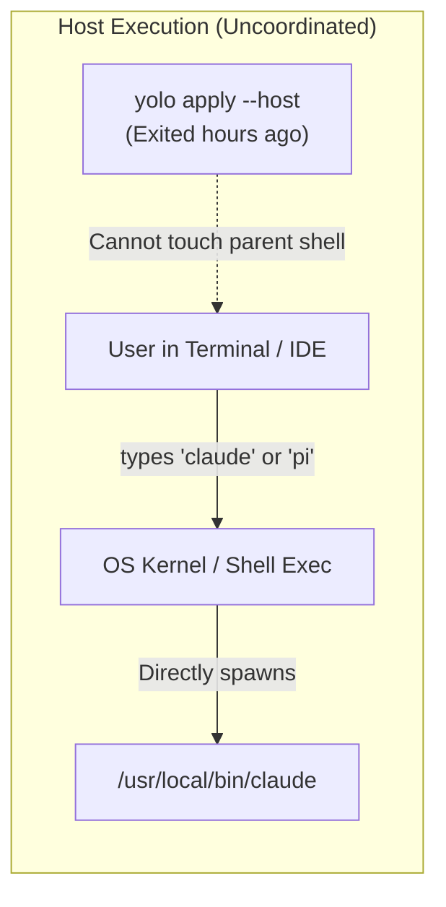

# Delivering Environment Variables to Host Agents: Config-First vs. Shims

**Status:** DRAFT, 2026-08-29. Nothing built.

**The short version.** Inside a jail container, injecting environment variables (`KindEnv`, profile `env: {...}`) is trivial because YOLO controls the container's process spawn (`podman run -e ...`). On the host, applying environment variables to agents without polluting the entire user shell session or introducing brittle `PATH` shims is a fundamental architectural challenge. This doc designs a **Tiered Environment Delivery System**: pushing variables into native agent config files wherever supported (e.g. Claude's `settings.json.env`), providing an explicit host execution verb (`yolo host -p <profile> -- <agent>`) for runtime parity, and confining shims to an explicit, opt-in fallback.

**The most important sections in this doc are §3 (The Delivery Spectrum) and §4 (The Per-Agent Host Capabilities Matrix)** — analyzing which agents support native config-level environment injection versus those requiring process-level wrapper mechanisms.

**Reads with:** [`pack-profiles.md`](pack-profiles.md) (the pack profile data model and merge pipeline), [`host-render-target.md`](host-render-target.md) (the host as a reduced render target for `apply --host`), and [`pack-system.md`](pack-system.md) (the pack contribution model).

---

## 1. Principles & Verdict Up Front

1. **P1 — Config-First Over Process Interception.** If an agent supports declaring environment variables or endpoint overrides in its own native configuration file, `yolo apply --host` must render them directly into that surface. No wrappers or shims should exist for capabilities the agent's own configuration dialect already supports.
2. **P2 — No Silent Shell Profile Pollution.** `apply --host` must never mutate the user's global shell RC files (`~/.bashrc`, `~/.zshrc`, `~/.config/environment.d/`) to export agent-specific variables. Global session pollution breaks tool isolation, leaks secrets across unrelated commands, and cannot support workspace-scoped or per-command profile switching.
3. **P3 — First-Class Host Launch Verb for Full Parity.** To achieve 100% feature parity with jail launches (including transient profile flags like `-p bedrock`), yolo provides an explicit host execution verb: `yolo host -p <profile> -- <agent>`.
4. **P4 — Shims Are Strictly Opt-In.** Transparent shims placed on `PATH` are brittle, collide with package managers, and break across tool updates. They must never be generated by default during `apply --host`, but may exist behind an explicit opt-in command (`yolo host shims enable`).

---

## 2. Diagnosis: Why Host Environment Delivery is Hard

In a container jail, the environment lifecycle is well-defined:

```
┌─────────────────────────────────────────────────────────────┐
│ Jail Container Launch (Controlled Process Spawn)            │
│ Core resolves config → passes `-e KEY=VAL` to podman        │
│ Container entrypoint provisions jail → PID 1 has exact env  │
└─────────────────────────────────────────────────────────────┘
```

On the host, the execution model is completely uncoordinated:



### 2.1 The Four Host Constraints
1. **Child Processes Cannot Mutate Parent Shells:** `yolo apply --host` runs as an ephemeral command. It writes files to disk and exits; it has no ongoing mechanism to modify the calling shell's environment table.
2. **Global Shell Export is a Security and Isolation Hazard:** Exporting `CLAUDE_CODE_USE_BEDROCK=1` or `ANTHROPIC_DEFAULT_OPUS_MODEL=...` in `~/.bashrc` makes those variables visible to every process the user runs, prevents per-project `.env` overrides, and makes transient profile switching (`-p dev`) impossible.
3. **Agent Heterogeneity:** Some agents read their configuration files for endpoints; others strictly require process environment variables (`process.env`).
4. **The Shim Trap:** Placing a wrapper script named `claude` in `~/.local/bin` to intercept calls requires `~/.local/bin` to precede `/bin` or `/usr/local/bin` on `PATH`. If npm, brew, or mise updates the underlying tool, the shim either shadows the update or breaks with stale arguments.

---

## 3. The Delivery Spectrum: Four Approaches Evaluated


---

### 3.1 Approach 1: Native Agent Config File Injection (The Preferred Path)

Many modern coding agents already support specifying custom environment variables or endpoint overrides in their native configuration files.

#### How It Works:
During `yolo apply --host`, Core's host renderer calls each pack's `derive.lua` and writes the merged profile/provider configuration directly into the agent's native config file in `$HOME`.

* **Claude Code (`~/.claude/settings.json`)**: Claude natively supports an `"env"` dictionary in `settings.json`:
  ```jsonc
  {
    "env": {
      "CLAUDE_CODE_USE_BEDROCK": "1",
      "AWS_REGION": "us-east-1",
      "ANTHROPIC_DEFAULT_OPUS_MODEL": "us.anthropic.claude-opus-5[1m]"
    }
  }
  ```
* **OpenCode (`~/.config/opencode/opencode.json`)**: OpenCode natively supports declaring providers, custom base URLs, and environment variable references in `opencode.json`.
* **Pi (`~/.pi/agent/models.json`)**: Pi natively supports declaring endpoints, models, and `apiKeyEnv` mappings in `models.json`.
* **Codex (`~/.codex/config.toml`)**: Codex natively supports configuring `model_providers` directly in `config.toml`.

#### Pros & Cons:
* 👍 **Pros:**
  * **Zero shims:** The user runs the standard, bare command (`claude`, `pi`) without wrappers or aliases.
  * **Zero PATH pollution:** Tool resolution remains standard.
  * **Tool-native lifecycle:** Upgrades to the tool do not break the configuration.
* 👎 **Cons:**
  * Static to the host's active profile (cannot swap transiently with `-p dev` on a single command without editing the file or launching via `yolo`).
  * Only works for variables that the specific tool's config file supports.

---

### 3.2 Approach 2: Explicit Host Launch Verb (`yolo host`)

For transient profile switching or for agents lacking native config env blocks, `yolo` provides an explicit host execution verb:

```bash
# Launch host Claude with Bedrock profile
yolo host -p bedrock -- claude

# Launch host Pi with local llama-server profile
yolo host -p local -- pi
```

#### How It Works:
1. `yolo host` resolves the workspace or user configuration and active pack profiles.
2. It constructs the exact composite environment table ($$\text{host env} + \text{resolved profile env}$$).
3. It locates the real target binary on the host `PATH` (e.g. `/usr/local/bin/claude`).
4. It calls `syscall.Exec` directly, replacing the `yolo` process with the target agent.

#### Pros & Cons:
* 👍 **Pros:**
  * **100% parity with container jail launches:** Supports all launch flags (`-p`, `--profile`, `--pack-profile`).
  * **Zero disk side-effects:** Does not mutate `settings.json` or shell RC files.
  * **Completely reliable:** No shim traps, no PATH order dependencies.
* 👎 **Cons:**
  * Requires typing `yolo host -- <agent>` instead of bare `<agent>`.

---

### 3.3 Approach 3: Shell Environment Manager Integration (`direnv` / `mise` / `yolo env`)

For users who want environment variables active in their terminal when entering a workspace directory on the host.

#### How It Works:
* `yolo env` outputs POSIX `export KEY="VAL"` statements.
* Users of `direnv` can add `eval "$(yolo env)"` to their `.envrc`.
* Users of `mise` or shell hooks can source yolo's environment output.

#### Pros & Cons:
* 👍 **Pros:**
  * Automatically activates/deactivates when `cd`ing into a workspace directory.
  * Standard developer pattern for tools like `direnv`.
* 👎 **Cons:**
  * Terminal-only (does not reach GUI apps or editors).
  * Requires user to have `direnv` or custom shell setup installed.

---

### 3.4 Approach 4: Transparent `PATH` Shims (The Brittle Fallback)

Placing executable wrapper scripts in a directory like `~/.yolo/bin/` and adding it to `PATH`.

```bash
#!/usr/bin/env bash
# ~/.yolo/bin/claude (Shim wrapper)
eval "$(yolo host env --pack claude)"
exec /usr/local/bin/claude "$@"
```

#### Pros & Cons:
* 👍 **Pros:**
  * Allows typing bare `claude` while still dynamically evaluating profiles.
* 👎 **Cons:**
  * **PATH Fragility:** If `npm install -g @anthropic-ai/claude-code` installs to `~/.npm-global/bin`, `PATH` ordering decides whether the shim or real binary runs.
  * **Infinite recursion risk:** A shim calling `claude` can accidentally exec itself if `PATH` lookup is naive.
  * **Global side-effects:** Shims affect every invocation on the machine.

---

## 4. Per-Agent Host Capabilities Matrix

| Agent Pack | Native Config Env Block? | Config File Location | Native Endpoint Configuration | Can Avoid Shims Completely? |
| :--- | :--- | :--- | :--- | :--- |
| **`claude`** | ✅ Yes (`"env": {...}`) | `~/.claude/settings.json` | Via `settings.json` env & model flags | ✅ **Yes** |
| **`pi`** | 🟡 Partial (`apiKeyEnv`) | `~/.pi/agent/models.json` | Native `baseUrl` & `api` in `models.json` | ✅ **Yes** |
| **`opencode`**| 🟡 Partial (`apiKey: "{env:...}"`) | `~/.config/opencode/opencode.json` | Native `baseURL` & `@ai-sdk` in `opencode.json` | ✅ **Yes** |
| **`codex`** | 🟡 Partial (`api_key_env`) | `~/.codex/config.toml` | Native `base_url` in `config.toml` | ✅ **Yes** |
| **`copilot`** | ❌ No (Requires `COPILOT_PROVIDER_*` in process env) | None / `~/.copilot-agent/` | Process environment only | ⚠ **Requires `yolo host` or env export** |
| **`agy`** | ❌ No (Native OAuth / consumer auth) | `~/.gemini/` | Native endpoint only | ✅ **Yes** (No custom env needed) |

---

## 5. The Recommended Host Environment Architecture

We combine the four approaches into a **Tiered Hierarchy**:

```
┌─────────────────────────────────────────────────────────────────────────┐
│ Tier 1: Config-First Surface Rendering (Default for `apply --host`)     │
│ • Write native env & provider blocks directly into settings.json,       │
│   models.json, opencode.json, config.toml.                              │
│ • ZERO shims generated. Bare tool invocations work immediately.         │
└────────────────────────────────────┬────────────────────────────────────┘
                                     │ For transient profile swaps & BYOK
                                     ▼
┌─────────────────────────────────────────────────────────────────────────┐
│ Tier 2: First-Class Host Execution (`yolo host`)                        │
│ • `yolo host -p <profile> -- <agent>` executes real binary with exact  │
│   composite process environment.                                        │
│ • 100% parity with container jail launch flags.                         │
└────────────────────────────────────┬────────────────────────────────────┘
                                     │ For workspace-scoped shell automation
                                     ▼
┌─────────────────────────────────────────────────────────────────────────┐
│ Tier 3: Shell & Directory Hooks (`yolo env`)                            │
│ • `eval "$(yolo env)"` for direnv / mise users.                         │
└─────────────────────────────────────────────────────────────────────────┘
```

---

## 6. Detailed Design: `yolo host` Command

`yolo host` is the host-side equivalent of `yolo run`:

```bash
# Usage
yolo host [flags] [-- <command> [args...]]

# Examples
yolo host -p bedrock -- claude
yolo host -p local -- pi
yolo host --profile dev -- opencode
```

### 6.1 Execution Flow
1. **Locate Target Binary**: Resolves the executable path of `<command>` using host `PATH` (ignoring any yolo-managed directories to avoid recursion).
2. **Resolve Pack Configuration**: Executes the merge pipeline ([`pack-profiles.md` §6](pack-profiles.md#L383-L415)) for the active workspace and profile.
3. **Compose Process Environment**:
   * Starts with current `os.Environ()`.
   * Overlays all key-values from the target pack's `resolved_config.env`.
4. **Exec**: Calls `syscall.Exec(targetBin, args, env)`.

---

## 7. Alternatives Considered

| Alternative | Summary | Verdict |
| :--- | :--- | :--- |
| **Alt 1: Default PATH Shims** | Automatically write shims to `~/.local/bin/` during `apply --host`. | **Rejected.** Brittle, invasive, and causes collisions with package managers. |
| **Alt 2: Shell RC File Appending** | Automatically append `export KEY=VAL` to `~/.bashrc` / `~/.zshrc`. | **Rejected.** Severe isolation hazard; pollutes entire user session. |
| **Alt 3: Host Execution Only (No Config Surface Writes)** | Never write host files; require `yolo host -- <agent>` for all host runs. | **Rejected.** Degrades developer ergonomics for users who want bare `claude` or `pi` to work with their default profile. |

---

## 8. Open Questions

1. 💬 **OQ-1: Handling Copilot BYOK on Host.** GitHub Copilot CLI requires `COPILOT_PROVIDER_BASE_URL` in the process environment and has no native config file env block. Should `apply --host` warn the user that Copilot requires `yolo host -- copilot` to use custom providers?
   
   _Leaning:_ Yes. Print an advisory note during `yolo apply --host` explaining that Copilot requires execution via `yolo host` or `yolo env` for BYOK provider mode.

   **Answer:**
   > _(empty — fill in when decided)_

2. 💬 **OQ-2: Command Naming for Host Execution.** Is `yolo host -- <agent>` preferred, or should it be `yolo run --at host -- <agent>` or `yolo exec --host -- <agent>`?
   
   _Leaning:_ `yolo host -- <cmd>` is concise and reads naturally alongside `yolo run`. `yolo --at host -- <cmd>` can be supported as an alias per [`host-render-target.md`](host-render-target.md).

   **Answer:**
   > _(empty — fill in when decided)_

3. 💬 🤷 **OQ-3: Should `yolo env` support shell-specific formatting?** E.g. `yolo env --format=json` or `yolo env --shell=fish`?
   
   _Leaning:_ Default to POSIX `export` syntax, with `--format=json` for tool integration.

   **Answer:**
   > _(empty — fill in when decided)_
