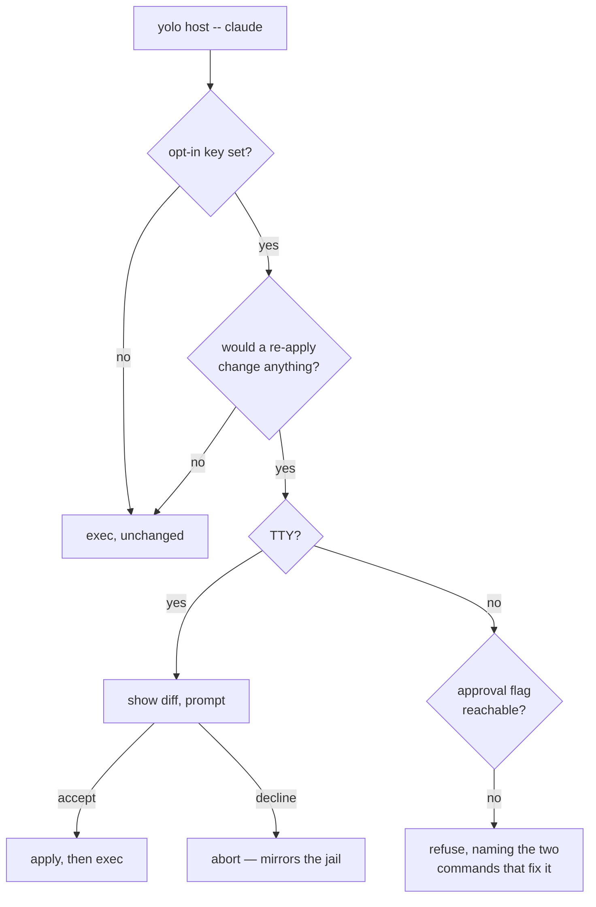

# The host launch should re-render — gated exactly the way a jail launch is

**Status:** **IMPLEMENTED**, 2026-09-03 — eleven rulings, zero open questions, all four §10 steps
shipped (`015527be` predicate · `76c8d16e` opt-in key · `eb796e99` launch hook · `fe30ba1c`
per-home lock · `ebdf0784` config-ref fix). Ready to graduate to a `system-doc`. Two
arguments are retracted in place, at §1 and §3.2, and one principle was replaced (§1 P3's note);
all three are kept rather than deleted because each is cheap to re-derive and expensive to
re-argue. Reached DECIDED through four restatements in one day, three of which retracted the one
before — the Decision Ledger is the record of what moved.

**The short version.** `yolo host apply` renders pack surfaces into your real `$HOME` and then never
looks again, so the rendered and would-be-rendered states drift apart silently. Every generated
wrapper already execs `yolo host -- <bin>`, and that is the only moment the content matters — agents
read config at startup and do not reload. So the host launch should behave like a jail launch:
**opt in with a user-level key, prompt-and-block on a TTY when a re-apply would change something,
refuse off a TTY unless the approval is in the environment.** What it compares is the **render**, not
the config — only that makes "up to date whenever an agent launches" literally true. Consent stays
per-launch; the key enables the mechanism, never the approval.

**The most important section is §4.3.** It holds the TTY/non-TTY table and the one genuinely new
problem: no flag can reach a generated wrapper, because the wrapper hands everything after `--` to
the agent. So the approval is an environment variable on that path and nowhere else — which reads
like a contradiction of the jail's flag-not-env-var ruling and is not; §1 P4 is where that is
settled.

**Reads with:** [`host-render-target.md`](host-render-target.md) (what a host render is and what the
`KindHost` notch refuses), [`config-safety.md`](config-safety.md) (the jail's launch-time approval,
whose mechanism this mirrors and whose flag ruling it inherits).

---

## 1. Verdict, and the principles it rests on

**Re-render at the host launch, and make it behave exactly like a jail launch.** Opt in with a
user-level config key, default off; on a TTY a needed change prompts and blocks; off a TTY it
refuses unless the approval is in the environment. The comparison is against the rendered home, not
against the config. No per-command checking, no fingerprint, no standalone notice.

**P1. The launch is the only moment that matters.** Agents read their config at startup and do not
reload it mid-run. A host render that is stale while nothing reads it is not a problem; the same
render stale at the instant an agent starts is the whole problem. That is why per-command checking
was deleted from the first draft, and the reasoning survives into this one intact.

**P2. Consent, not disposability, is what licenses a write.** The operative question is never "is
this home precious" — it is "did the user opt in." §3.2 is where the disposability argument is
retracted.

**P3. Measure the home, do not model its inputs.** Every fingerprint alternative — mtime+size,
content hashes, an input closure — is a *model* of "would a re-apply change anything," and each
carries a false-positive rate plus a state file to keep. An observe render answers the question
directly for 11.4 ms (§5). This is the one principle that survived all four drafts unchanged.

> [!NOTE]
> An earlier draft carried a P3 reading *"make the bad state unrepresentable rather than
> detectable"*, on the strength of a silent always-re-render. Under §4.3's gate drift **is** still
> representable — the key can be off, a prompt can be declined, a non-TTY launch can refuse — so the
> design detects it and says so. Unrepresentability was a property of the design that got retracted,
> not a goal of this one.

**P4. The approval is granted per launch, in the strongest spelling the launch channel allows.** A
flag where a flag can be passed; an **environment variable** on the wrapper path, where none can
(§4.3). Never a config key — that is the one spelling that is genuinely standing consent, and it
stays refused.

> [!IMPORTANT]
> **This does NOT contradict `internal/config/snapshot.go:67-81`, and the doc must say why or the
> two look like a bug.** That ruling makes the jail's approval *"A FLAG AND NOT AN ENVIRONMENT
> VARIABLE, deliberately"*, because *"an env var is inherited by every child process and survives in
> a shell for the rest of a session — precisely the property a per-launch approval must not have."*
> Every word of that still holds. **It answers a different question**: for `yolo run` the choice is
> flag-vs-env-var, and there the env var is pure cost. On a generated wrapper there is no flag
> channel at all (§4.3), so the choice is **env-var-vs-nothing** — and "nothing" means a scripted
> agent launch can never proceed. The jail ruling says *prefer a flag when you have one*; this path
> has none, so it takes what the principle leaves.
>
> **The cost is real and is accepted knowingly** (maintainer ruling 2026-09-03: *"just do what every
> other package does… it's a low use case, that's fine"*). Exported in a shell profile, the variable
> becomes de facto standing consent for every wrapped launch in that shell. Two containments follow,
> and they are the reason this is tolerable rather than a hole:
> 1. **It is honored ONLY on the wrapper exec path**, never by `yolo run` and never by
>    `yolo host apply`. Both of those take the flag, so extending the variable to them would buy
>    nothing and would hand a `.bashrc` line the power to pre-approve every jail launch on the
>    machine — the blast radius `snapshot.go` was written to prevent.
> 2. **The `[!WARNING]` below still stands**: the wrapper body must not bake the grant in.

> [!WARNING]
> **⚠ Retracted (2026-09-03): "the opt-in key is standing consent."** An earlier turn proposed
> treating the config key as blanket pre-authorization, so a launch would never prompt and never
> refuse. Refused: a key is read on every launch forever with no act of granting, which is the
> property P4 forbids. The env var above is *not* the same thing — it is an act, per shell, by
> someone who had to type it. The tempting variant is equally out: having the wrapper generator bake
> the grant into the wrapper body when a key says so is a config key wearing a flag's clothes.

**P5. A refusal must be actionable at the surface the user typed.** This design's refusals reach
someone who typed `claude`, not `yolo` — so an unexplained failure reads as "claude is broken."
Every refusal names the remedy in the spelling its reader can actually use: the two-step apply for
an interactive reader, the environment variable for a scripted one (§4.3). This replaces an earlier
P4 that said a wrapper must never be the reason an agent fails to start; that is **overruled** — the
jail refuses in the same situation, and consistency with `yolo run` beats a special case here.

---

## 2. What exists today

### 2.1 The render, and its two spellings

`yolo host apply [--assert|--dry-run]` (`internal/cli/host.go:92` → `internal/cli/hostapply.go:20`)
and `yolo apply --at host` (`internal/cli/apply.go:45`) are the same operation; `host.go:66` states
the equivalence. Observe is the default posture; `--assert` writes. Both land in `applyHost`
(`internal/cli/apply.go:129`), which resolves the home via `os.UserHomeDir` and walks the
user-scoped pack set. The per-surface render is `entrypoint.RenderHostPack`
(`internal/entrypoint/hostrender.go:129`) — *"pure RMW, no computed layer."*

**The render is idempotent, and it is tested three ways:** `internal/entrypoint/hostmcp_test.go:305`
(*"A SECOND `--assert` is byte-identical: the render is idempotent"*),
`internal/cli/applyhostidempotent_test.go` (convergence over the whole home), and
`internal/entrypoint/prism_copilot_test.go:103` (RMW idempotence — *"a second boot must be
idempotent and must not clobber a value the agent changed"*). This is what makes re-rendering on
every launch a no-op by construction rather than by luck, and it is the load-bearing fact of the
whole design.

### 2.2 The launch chokepoint already exists

`hostwrap.Body` (`internal/hostwrap/hostwrap.go:41`) generates, per program:

```bash
#!/usr/bin/env bash
# Generated by yolo — host launch wrapper. Do not edit; `yolo host apply` rewrites it.
exec yolo host -- claude "$@"
```

**What gets a wrapper is exactly the pack-declared `program` contributions** — `hostwrap.Bins`
(`:58`) folds `HonoredInstalls` across the selected packs. Measured against this user's pack set on
2026-09-03: five names, `agy`, `claude`, `codex`, `opencode`, `pi`. Not `node`, not `pnpm`. **The
wrapper path is agent launches** — a human starting a session, not a hot loop.

Whether the wrapper dir is on `PATH` is opt-in (`config.HostWrappersEnabled`,
`internal/config/hostwrappers.go:33`) and observed by `sectionHostWrappers`
(`internal/cli/check/section_hostwrappers.go`), which WARNs when the feature is on but the dir is
not on `PATH`. That is this design's coverage boundary, inherited whole — §7.1.

### 2.3 What does not exist

Nothing on any launch path, in `yolo check`, or in the run pipeline re-examines a host render after
it is written. And no receipt records what the render was computed from: the three manifests are all
`hostskills.Manifest` (`internal/hostskills/manifest.go:28`), whose entire schema is
`Entries map[string]string`, destination path → pack name. Its header (`manifest.go:13-17`) is
explicit that this is *"deliberately WEAK evidence"* which *"can go stale in ordinary use"*, and so
authorizes archiving rather than deletion.

Neither fact licenses a fingerprint: this design measures the home directly rather than modelling
its inputs (§1 P3). They are recorded because the next person to propose one will reach for exactly
these, and because OQ-HS9's option (a) would add a host approval snapshot alongside them.

---

## 3. The diagnosis

### 3.1 Why the jail cannot go stale and the host can

- **In the jail, every launch re-renders.** Staleness is unrepresentable. The launch-time prompt
  there (`config.CheckConfigChanges`, called from `internal/cli/run/preflight.go:200`) is an
  *approval* gate over the config — "your config changed; launch with it?" — and then it renders
  fresh regardless. It is not a staleness check and should not be mistaken for the model here.
- **On the host, the render is a one-time act.** `yolo host -- <bin>` resolves the target program and
  execs it. It does not re-apply. So the two states drift apart, silently and indefinitely.

The asymmetry is not a property of the homes. It is a property of *when yolo renders*, and that is a
choice this design changes.

### 3.2 ⚠ Retracted: "the real `$HOME` is not disposable, so re-applying is unsafe"

The previous draft carried a `[!WARNING]` telling the reader not to make the launch re-apply, on the
grounds that a jail's home is disposable and a real `$HOME` is not, so a silent re-render *"would
fire the one-way door on every launch with nobody asked."*

**That is wrong, and the code says so.** `confirmHostLosses`
(`internal/cli/apply.go:511`) gates on:

```go
if !r.FirstApply || len(r.EntryLosses) == 0 {
    continue
}
```

`FirstApply` is true only when *"this home has NO provenance record for this surface, i.e. yolo has
never asserted it here"* (`internal/entrypoint/hostrender.go:98`). On a home yolo has already
asserted it is false, so **the gate never fires and there is no door to fire.** The one-way door is
a first-apply concept exclusively.

The rationale, at `internal/cli/apply.go:490-494`, is the argument the retraction rests on:

> *"undeclared server is stale by definition — but that only holds once the user has opted in. On
> the FIRST apply into a home they have not opted in yet: their hand-added server predates the pack,
> and replacing it before they have declared it anywhere is not policy, it is data loss."*

So the repo already ruled, on a maintainer decision recorded at `apply.go:493` (2026-08-02): **once
opted in, wholesale regeneration is policy.** The prompt's own text says the same thing to the user
— *"yolo regenerates the keys it manages wholesale, so anything above that is not in your config is
dropped"* (`apply.go:549-551`).

**What the retracted argument got wrong, precisely:** it treated *preciousness* as the thing that
licenses or forbids a write, when the operative property is *consent*. Disposability is why a jail
home needs no gate at all; consent is why a host home needs one exactly once. Conflating them turns
a first-apply gate into an every-apply gate and makes re-rendering look dangerous when it is the
same operation the user already authorized.

> [!NOTE]
> Kept as a retraction rather than deleted because the intuition is a strong one and cheap to
> re-derive — "the real `$HOME` is precious, so be careful" is the first thing anyone thinks, and
> `confirmHostLosses` existing at all makes it feel confirmed. The check that settles it is four
> lines of gate, and reading them is faster than re-arguing this.

### 3.3 What `FirstApply` means, and why idempotency does not make it moot

`firstApply := !hostProvenanceExists(e, s)` (`internal/entrypoint/hostrender.go:225`) — the
**absence of a provenance record** at `<home>/.local/share/yolo-jail/host-provenance/<agent>-<name>.provenance`
(`internal/render/target.go:292`, leaf const at `:223`). It is **per surface**, not per home.

So **"first" is epistemic, not temporal**, and that is why idempotency does not dissolve it:

| | Question it answers | Settled by |
|---|---|---|
| Idempotency | does a second render write the same **content**? | the bytes |
| `FirstApply` | does yolo know which keys in this file are **its own**? | the record |

Before any apply, every key in `~/.claude/settings.json` is the user's, so replacing one is data
loss. After one apply, provenance says which keys yolo owns, so replacing those is policy
(`hostrender.go:98-102`). A byte-identical second render does not help answer *"was this value mine
or theirs?"* — nothing in the content carries that, which is the whole reason a separate record
exists.

> [!NOTE]
> **`FirstApply` can become true again**, so "first" really means "no record right now." Prune or
> delete the state dir, or share one config across two machines, and the record is gone and the
> confirmation returns. That is the same *"deliberately WEAK evidence"* property
> `internal/hostskills/manifest.go:13-17` documents for the manifests — a record that can go stale
> in ordinary use, which is why it authorizes a reversible act rather than a destructive one.

### 3.4 What the retraction deleted, and what came back

Deleted by §3.2: the per-command eligibility apparatus (a deny-set for machine-consumed stdout, the
`--help` side-effect hazard, the `eval "$(yolo host env)"` trap), the standalone staleness notice,
and the idea that a fingerprint of any kind is needed.

**Not deleted — resurrected by §4.3's gate: the change predicate.** An earlier turn said the
predicate was gone, on the strength of "always re-render, never ask." The moment the launch *prompts
when a change is needed*, something must decide **whether** a change is needed and **what to show**
— and that is exactly the predicate. **Ruled 2026-09-03 (OQ-HS9): the launch compares the RENDER,
not the config.** The rejected alternative was a host approval snapshot mirroring the jail's
`approvals/<name>.json`, which is cheaper and needs no predicate but is structurally blind to a
hand-edited `~/.claude/settings.json` — the config never moved, so nothing would prompt. Only the
render comparison makes *"the host is up to date whenever an agent launches"* literally true; the
jail's two readings coincide only because it re-renders unconditionally afterwards, which is exactly
what the host does not do.

The predicate itself: `Action` is `"would render"` unconditionally for any surface not skipped or
refused, and `Overwrites` is documented *"empty when the render only adds keys or re-asserts
identical values"* — so a byte-for-byte correct surface and one needing a whole new key are
indistinguishable today. **The change predicate** *(coined here)* is the per-destination answer to
*"would `--assert` write bytes that differ from what is on disk right now?"*, computed by comparing
rendered result against current content rather than by inspecting which report fields are populated.

Two carve-outs, which belong in the field's own doc comment or a future reader will "fix" them:
`Formatting` losses alone do not count (a comment-only TOML re-emit would prompt forever on a config
the user is happy with), and `Pruned` does not count (a `${workspace}`-keyed key with no host
referent is dropped on every render by design).

---

## 4. The proposed shape

### 4.1 The whole design

**At `yolo host -- <bin>`, behave like a jail launch, then exec.** `yolo host apply` and `yolo apply`
are excluded — the user is already applying.



**Zero stored state** on the render side: nothing is fingerprinted, because the predicate measures
the home directly. Whether an *approval snapshot* is kept — the jail's `approvals/<name>.json` shape
— is OQ-HS9's second half.

### 4.2 The opt-in key

A host-only boolean in the user config, **default off**, mirroring `host_wrappers` in shape and read
through a sibling of `config.HostWrappersEnabled` (`internal/config/hostwrappers.go:33`). `yolo
check` prints a line when the feature is available and off, naming where to learn to turn it on.

> [!IMPORTANT]
> **The key enables the mechanism; it does not grant the approval** (P4). A launch under an enabled
> key still prompts on a TTY and still refuses without one. A key that pre-approved would be
> standing consent, which §1's retraction forbids.

### 4.3 TTY, non-TTY, and the env var that carries the approval

Mirroring `config.CheckConfigChanges` (`internal/config/snapshot.go:177`) exactly:

| Situation | Behavior |
|---|---|
| Nothing would change | Silent; exec. |
| TTY, change needed | Show the diff, prompt. Accept → apply, exec. Decline → **abort**, as the jail does (`internal/cli/run/preflight.go:298`, *"Config changes rejected. Exiting."*). |
| No TTY, change needed, no approval | **Refuse.** Do not apply, do not exec. |
| No TTY, change needed, approval in the environment | Apply, exec. |

**Why the approval is an env var here and a flag everywhere else.** The wrapper body is fixed —
`exec yolo host -- claude "$@"` (`internal/hostwrap/hostwrap.go:41`) — and `hostMain`
(`internal/cli/host.go:84`) splits on the first `--`, handing everything after it to the program. A
user typing `claude --print foo` therefore has **no slot for a yolo-level flag**. There is a pre-`--`
slot (`hostExecFlags` carries `profile` today), but the generator emits nothing into it and the user
cannot reach it, so a flag is not merely inconvenient on this path — it is unreachable.

The environment is the only channel that survives an `exec` through a fixed wrapper, which is why
every other tool in this position uses one. So:

```console
$ YOLO_ACCEPT_CONFIG_CHANGES=1 claude --print …    # the approval, on the only channel there is
```

Requirements on it, each with a reason:

- **Scoped to this path.** Honored on the wrapper exec path only — not `yolo run`, not
  `yolo host apply`. Both of those accept the flag, so honoring the variable there would add nothing
  and would let one `.bashrc` line pre-approve every jail launch on the machine (§1 P4).
- **Named to match the flag it stands in for**, so the two are legibly one grant in two spellings,
  and so a refusal can name whichever channel its reader can actually use. `--accept-config-changes`
  → `YOLO_ACCEPT_CONFIG_CHANGES`; the exact spelling is the implementer's.
- **The spelling lives as a named constant beside the refusal that names it**, following
  `snapshot.go`'s rule for exactly this: *"the flag a user is told to pass and the flag the parser
  accepts cannot drift apart."* Its reader is by construction someone who could not be prompted.
- **Presence, not truth-parsing.** Any non-empty value grants, matching
  `YOLO_ALLOW_STALE_IMAGE`'s consent probe (*"consent is about intent, not about the token"*). A
  variable set to `0` by someone expecting it to mean "off" is the one plausible objection; the
  house precedent goes the other way and consistency wins.

The two-step remedy remains available and is what an interactive refusal should suggest first, since
it leaves nothing behind in the environment:

```console
$ yolo host apply --assert
$ claude --print …
```

> [!WARNING]
> **⚠ Corrected in implementation (2026-09-03): this block used to read `yolo host apply --assert
> --accept-config-changes`, which does not run.** `hostApply`'s parser accepts only `--assert`,
> `--dry-run` and `--shell-init`, and exits 2 on anything else — measured. Teaching it the flag
> would make that flag stand in for the explicit apply's own **fail-closed one-way-door
> confirmations**, which §7 forbids ("keeps its fail-closed confirmations") and
> `TestApplyHostFirstApplyFailsClosedWithoutStdin` exists to hold. It is also unnecessary:
> `--accept-config-changes` grants the *jail's* config approval, and an explicit host apply has
> none. **Resolved in favour of §7** — the refusal names the bare `--assert`, and a test asserts the
> flag is not offered. This doc violated its own P5 (a refusal must name a remedy that runs), which
> is exactly the check P5 exists to force.

> [!WARNING]
> **Do not bake the grant into the wrapper body** when a config key says so. It is the obvious fix
> and it converts a per-shell act into a permanent one — see §1's retraction. The env var is
> tolerable *because* someone has to type it.

### 4.4 Other failure paths

Distinguish two classes, because they end differently:

- **Cannot determine** — a malformed pack manifest, an unreadable home, an unresolvable `file://`
  pack, a budget overrun. The predicate has no answer, so there is no change to refuse over: **exec**,
  with at most one line to stderr. Per `internal/version/srcskew.go`'s house rule, a gate that cannot
  prove its condition does not fire.
- **Determined, and a change is needed** — §4.3's table. This is the only path that can stop a
  launch, and it stops it *with a remedy*.

**A budget.** The predicate must not hang a launch on a cold or network-mounted `$HOME`. Default
**1 s**, then treat as cannot-determine and exec. A stuck-detector, not a tuning knob.

**Partial application** after an accepted prompt is possible if the apply fails midway. Already true
of an interrupted `yolo host apply`; the render is idempotent (§2.1) and the next launch converges.
It must not leave a *single file* half-written — the renderer's existing atomicity concern, unchanged.

### 4.5 Degenerate inputs

| Case | Behavior |
|---|---|
| Key off | Exec, unchanged. The default. |
| No packs configured | Nothing to render; exec. |
| A `fetched` pack not yet installed | Skipped — `packForCheckDeps` returns nil, and it is `yolo check`'s problem. |
| A local `file://` pack whose dir is unreachable | Cannot-determine for that pack (§4.4). Real: two of this user's ten packs are unreachable from inside a jail. |
| Home not resolvable | Exec. |
| Never applied to this home at all | Every surface is `FirstApply`; a TTY gets today's confirmations, a non-TTY refuses. Note the wrapper's existence implies a prior `host apply`, so a wholly unapplied home reaching this path is unusual. |
| A new pack added since the last apply | Its surfaces are `FirstApply` in an otherwise-managed home — the case §4.3's non-TTY row is really about. |

### 4.6 Concurrency

Two wrapped agents launched at once would both apply. The render is idempotent, so content
converges — but idempotence alone does not make two concurrent writers to one file safe.
`applyHost` has no lock today because its caller was always a human running one command. **One writer
must be named:** serialize host applies on a lockfile keyed by the resolved home, and let a launch
that cannot take the lock treat it as cannot-determine and exec (§4.4). The natural spelling is
beside the existing per-workspace lock convention (`internal/cli/run/run.go:572` takes
`locks/<container-name>.lock` under `paths.GlobalStorage()`).

---

## 5. What it costs — measured

Measured 2026-09-03, in this jail, 20 runs each, warm page cache, against `/bin/yolo`:

| Command | min | p50 | p90 |
|---|---:|---:|---:|
| `/bin/true` (process floor) | 0.72 | 0.87 | 1.31 ms |
| `yolo --version` | 3.46 | **3.91** | 4.52 ms |
| `yolo config drift` | 3.43 | 3.77 | 4.22 ms |
| `yolo host apply --dry-run` | 10.04 | **11.43** | 11.95 ms |

**11.4 ms is the observe cost, once per agent launch** — and under this design the observe pass runs
on every enabled launch, since it is what computes the predicate. An accepted prompt then adds an
`--assert`, unmeasured because writing into this jail's own live home during a benchmark is not a
thing to do casually. Against starting `claude`, neither number is a tradeoff.

Three caveats:

1. **Understated.** Eight of ten packs rendered; the two `file://` packs are unreachable in-jail. A
   real host renders all ten, across all four written kinds.
2. **Warm cache.** Caches could not be dropped in this container. A cold `$HOME` on network storage
   is I/O-bound — §4.4's budget is the answer.
3. **Dep resolution should be excluded.** `resolveHostDeps` shells out via `exec.LookPath`
   (`internal/depcheck/depcheck.go:122,180`) once per declared binary, answering *"does this host
   have the tools"* — a different question owned by `yolo check`.

---

## 6. Adjacent work this does not need

**The temp-dir leak.** `packload.Embedded()` (`internal/packload/embedded.go:55`) does
`os.MkdirTemp` plus a full copy of the embedded pack tree on every call and never removes it;
`cli.surfaceManifest` (`internal/cli/surfaces.go:44`) does it again under a second prefix. Measured
2026-09-03 in this jail: 592 `/tmp/yolo-embedded-*` + 11 `yolo-embedded-packs-*` + 22
`yolo-cli-packs-*` = **625 directories, 109 MB**, confirmed at exactly one per invocation (`yolo
pack ls` took the count 626 → 627). About sixty were minted by §5's twenty benchmark runs. A
pre-existing bug, tracked separately.

**Config surfaces never archive.** `hostskills.Archive` has call sites for skills
(`internal/hostskills/deliver.go:272`), the `files` kind (`internal/entrypoint/hostfilestree.go:138`),
briefings (`internal/entrypoint/hostbriefing.go:335`) and retirement
(`internal/cli/applyhostprune.go:170`) — and **none in `hostrender.go` or `prism.go`**. So an
`EntryLoss` on a config surface is irreversible, which is exactly why `confirmHostLosses`
distinguishes it from a reversible `Overwrite`. Recorded as an observation: with prompts restored by
§4.3 the guard is back where it always was, so archiving config surfaces is a possible future
softening and not a dependency of this design.

---

## 7. What this does NOT do

- **It does not detect staleness on any other command.** P1.
- **It does not grant a standing approval.** P4, and §1's retraction.
- **It does not change the explicit `apply` path.** `yolo host apply` keeps observe-by-default and
  keeps its fail-closed confirmations.
- **It does not add a second confirmation.** The prompt is the existing one, reached at a new moment.
- **It does not check the jail.** In-jail is a hard no-op: `render.Host` targets the invoking user's
  real home, and `paths.Home()` in-jail is `/home/agent`. The discriminator is `inJail()`
  (`internal/config/load.go:315`).
- **It does not answer "does this host have the tools."** `check-deps` and `yolo check` own that.
- **It does not introduce a daemon, a timer, or a background process.**

### 7.1 The coverage boundary, stated plainly

This sees a launch **only if it goes through a generated wrapper.** An agent started by a binary the
user invokes directly (wrapper dir not on `PATH`), by an IDE extension, or by a desktop app is not
observed and runs against whatever the last explicit apply left.

That is the same boundary `host_wrappers` already has, and `sectionHostWrappers`
(`internal/cli/check/section_hostwrappers.go`) already WARNs when the dir is not on `PATH`, so the
gap is announced by an existing channel. It is the price of the approach: a per-command notice would
have caught drift *sometime*, just never at a moment tied to a launch.

---

## 8. Alternatives considered

| Alternative | Verdict |
|---|---|
| **Jail-shaped launch gate** (this design) | **Accepted.** Consistency with `yolo run` beats a host special case, and the prompt is the guard that makes an irreversible `EntryLoss` safe. |
| **Re-render silently at the launch, no prompt** | **Rejected.** Required treating the opt-in key as standing consent, which `snapshot.go:67-81` refuses. Would also let an irreversible `EntryLoss` happen with no undo (§6). |
| **A per-command staleness notice** (draft 1) | **Rejected.** Agents do not reload config mid-run and an explicit apply is always available, so no moment but a launch needs the files fresh. It also dragged in an eligibility apparatus protecting commands that never needed checking. |
| **Bake the approval flag into the wrapper body** behind a config key | **Rejected.** Standing consent written to a file; §4.3's warning. |
| **Input fingerprint (mtime+size)**, ~0.25–0.6 ms | **Rejected.** Blind to a hand-edited destination, false-positive on `touch`/`cp -p`, and needs a state file and a migration to be less correct than measuring the home. |
| **Input content hash including the binary**, ~9.5 ms | **Rejected outright.** 7.7 ms of it is sha256 over a 16.7 MB binary whose identity is free: `version.GitCommit` and `buildVersion` are `-ldflags -X` stamps (`internal/version/version.go:20,26`) and the 12 packs are embedded in it. |
| **A background daemon watching the inputs** | **Rejected as disproportionate.** |
| **Config surfaces only, deferring the other three kinds** | **Rejected.** Two tiers of "up to date" is a word that does not mean what the reader thinks. |

---

## 9. Risks

| Risk | Mitigation |
|---|---|
| **R1. A scripted launch refuses and the caller cannot pass the flag.** The genuinely new failure mode; §4.3. | The flag lives on the explicit apply, and the refusal names both commands (P5). Accepted as the cost of matching the jail. |
| **R2. The refusal reads as "claude is broken."** The user typed `claude`, not `yolo`. | P5 — every refusal is actionable at the surface the user typed. |
| **R3. The predicate is wrong and every launch prompts.** | Byte comparison, not field inspection (§3.4). Carve-outs named in code. Minimum bar: a test that renders twice and asserts the second reports zero changes. |
| **R4. Two concurrent launches write one home.** Idempotence does not make concurrent writers safe. | §4.6 — a per-home lock; a launch that cannot take it execs. |
| **R5. A launch feels slow on a cold or network `$HOME`.** | §4.4's 1 s budget, then cannot-determine. |
| **R6. Coverage depends on the shim being in the launch path.** | §7.1, plus the existing `sectionHostWrappers` WARN. |
| **R7. Someone re-derives a retracted argument** — either disposability, or standing consent. | §3.2 and §1 both exist to be cited, and each names what settles it. |

---

## 10. What I would build, in order

1. **The change predicate** (§3.4), all four written kinds, with both carve-outs documented. Land it
   with `yolo host apply --dry-run` reporting *"N in sync, M would change"* — a standalone
   improvement to a shipping command, and the honest way to verify it before anything depends on it.
   Blocked on OQ-HS9's first half only if the answer is the config-snapshot shape.
2. **The opt-in key** (§4.2), default off, plus the `yolo check` line and the `config-ref` entry.
3. **The launch hook** (§4.1) with §4.3's table and §4.4's two classes.
4. **The per-home lock** (§4.6).
5. Independently, whenever: the temp-dir leak (§6).

## 11. What done looks like

- Key on, TTY: edit `~/.claude/settings.json` by hand, launch `claude` through the wrapper — the diff
  appears and the launch waits. Accept and it launches with the file restored; decline and it aborts.
- Key on, TTY, freshly-applied home: launching prompts **not at all**, ever, until something actually
  changes. *(Check this first — it is R3.)*
- Key on, no TTY, drift present: the launch refuses and names `yolo host apply --assert` (see
  §4.3's correction — the flag form does not run). Running that, then launching, succeeds silently.
- Key off (the default): no launch and no command mentions any of this, and `yolo check` says the
  feature exists and is off.
- A malformed pack manifest makes the launch proceed, not fail.
- Two wrapped agents launched simultaneously both start, and the home is not corrupt.
- `yolo host apply` behaves exactly as it does today.
- In-jail, nothing re-renders a host home.

---

## Decision Ledger

| ID | Ruling / Decision | Date | Settled in |
| :--- | :--- | :--- | :--- |
| OQ-HS0 | Accuracy over approximation: measure the real thing rather than a stat or hash fingerprint. Rules out the three-tier design and the fingerprint file. | 2026-09-03 | §1 P3, §8 |
| OQ-HS1 | The launch chokepoint is the only trigger. Per-command checking deleted. | 2026-09-03 | §1 P1, §4.1, §8 |
| OQ-HS2 | A user-level opt-in key, **default off**, advertised in `yolo check` when available-and-off. The key enables the mechanism only — it never grants the approval. | 2026-09-03 | §4.2 |
| OQ-HS3 | The launch behaves like a jail launch: TTY prompts and blocks, non-TTY refuses unless approved. Not a silent re-render, and not a notice. | 2026-09-03 | §4.1, §4.3 |
| OQ-HS4 | Everything is covered — all four written kinds. No two tiers of "up to date". | 2026-09-03 | §3.4, §4.1 |
| OQ-HS5 | Declining aborts the launch, as it does in the jail. | 2026-09-03 | §4.3 |
| OQ-HS6 | A non-TTY launch with a needed change **refuses**; nothing partial is applied. Supersedes the earlier "always exec" rule (the retracted P4). | 2026-09-03 | §1 P5, §4.3 |
| OQ-HS7 | *(Moot.)* Was: how much of the apply proceeds on a non-TTY launch? None — OQ-HS6 refuses instead. | 2026-09-03 | §4.3 |
| OQ-HS8 | *(Answered by OQ-HS2.)* Was: is re-rendering opt-in? Yes, a key, default off. A config key granting the approval is **refused** — that is the one spelling that is genuinely standing consent. | 2026-09-03 | §1 P4, §4.2 |
| OQ-HS9 | The launch compares the **render**, not the config. Only that makes "up to date whenever an agent launches" literally true; a config-approval snapshot is blind to a hand-edited destination. **Resurrects the change predicate** an earlier draft had deleted. | 2026-09-03 | §3.4, §4.1 |
| OQ-HS10 | The non-TTY approval is an **environment variable** on the wrapper path — *"just do what every other package does… it's a low use case, that's fine."* Not a contradiction of `snapshot.go:67-81` but the answer to a different question: on a fixed wrapper the choice is env-var-vs-nothing, because no flag can reach the process. Scoped to that path only, so a `.bashrc` line cannot pre-approve jail launches. | 2026-09-03 | §1 P4, §4.3 |
| OQ-HS11 | The comparison **normalizes both sides through the same codec** rather than comparing against the file's raw bytes. A literal byte comparison reports a change forever for canonical-TOML key reordering and any non-2-space JSON, with `Formatting` empty — R3 by the back door. This makes the `Formatting` carve-out **structural** instead of checked. Corrects §1 P3/R3's "byte comparison", whose contrast was meant to be with *field inspection*, not an assertion about raw bytes. | 2026-09-03 | §3.4, `hostSurfaceWouldChange` |
| OQ-HS12 | The **wrapper dir is a fifth surveyed destination**, beyond §3.4's four kinds: `applyHost` writes it, `hostwrap.Plan.Changed()` is already an exact predicate, and a pack added since the last apply has no wrapper — nothing else would say so. | 2026-09-03 | §3.4 |
| OQ-HS13 | "TTY" means **stdin**, matching the jail's `IsTTYStdin` — `claude --print foo > out.txt` has a redirected stdout and a usable terminal. | 2026-09-03 | §4.3 |
| OQ-HS14 | An apply that **fails after an accepted prompt aborts the launch** (§4.3's table did not cover it). The user asked for apply-then-launch; exec'ing against a half-applied home is the failure the gate exists to remove. | 2026-09-03 | §4.3, §4.4 |
| OQ-HS15 | The lock is the **launch path's, not the command's** — an explicit `yolo host apply` alongside a gated launch stays unserialized. Closing it means either making the command wait on a launch that may be prompting (unbounded) or making it refuse (a new failure mode §7 asks this design not to introduce). | 2026-09-03 | §4.6 |
| OQ-HS16 | The gate shows a **change list, not a unified diff**, and names `yolo host apply --dry-run` for per-key detail. A second diff renderer at a surface that interrupts someone starting an agent is both duplication and too long to read. | 2026-09-03 | §4.3 |
