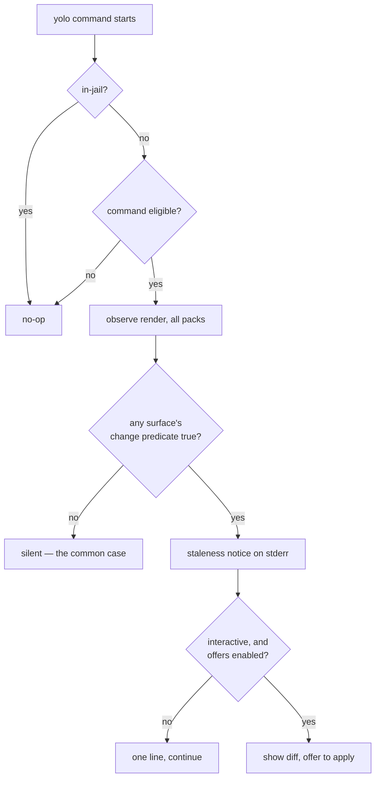

# The host render goes stale in silence — and the observe pass almost knows

**Status:** DESIGN, 2026-09-03. Nothing built. One ruling already taken (§Decision Ledger).

**The short version.** `yolo host apply` renders pack surfaces into your real `$HOME` and then
never looks again: nothing on any launch path re-checks whether the config it wrote still matches
the config it *would* write. A full observe render — the existing `--dry-run` posture, which writes
nothing — costs **11.4 ms p50 against a 3.9 ms baseline** (measured 2026-09-03, §5), which is cheap
enough to run on every `yolo` command. So the design is: run the real thing, every time, and keep
no fingerprint, no baseline, and no heuristic. The catch is that the observe pass reports *what it
would write*, never *whether that differs from disk* — so the one predicate this feature is
entirely about does not exist yet (§3.2). Building it is the work; everything else is plumbing.

**The most important section is §3.2.** It is the difference between a feature that fires when
something is wrong and one that fires on every command forever.

**Reads with:** [`host-render-target.md`](host-render-target.md) (what a host render is and what
the `KindHost` notch refuses), [`config-safety.md`](config-safety.md) (the config-change y/N
prompt this deliberately does *not* copy), [`gate-placement-principle.md`](gate-placement-principle.md)
(why this is a notice and not a gate, §7.1).

---

## 1. Verdict, and the principles it rests on

Build it, accurately, with no stored state. Three principles carry the design:

**P1. Measure, don't model.** The cheap alternatives — hashing the inputs, stat-ing them for
mtime+size — are all *models* of "would a re-apply change anything," and every model has a false
positive rate. The observe render is the thing itself. At a 7.5 ms delta there is no reason to
approximate a question we can simply answer.

**P2. A notice, never a gate.** This must never refuse, never change a command's exit code, and
never block. The user already has the authority to run `yolo host apply`; a gate aimed at someone
who already holds the authority is theatre ([`gate-placement-principle.md`](gate-placement-principle.md),
Test 1). What is missing is *knowledge*, and the remedy for missing knowledge is telling them.

**P3. Fire only on a real difference.** `apply.go:496-507` already states the house rule, in the
context of `confirmHostLosses`: *"A confirmation that fires on every run trains people to hit `y`
without reading, which is worse than no gate."* This feature is one wrong predicate away from being
exactly that, on every command, forever. §3.2 is that predicate.

---

## 2. What exists today

### 2.1 The render, and its two spellings

`yolo host apply [--assert|--dry-run]` (`internal/cli/host.go:92`, → `internal/cli/hostapply.go:20`)
and `yolo apply --at host` (`internal/cli/apply.go:45`) are the same operation; `host.go:66` states
the equivalence. **Observe is the default posture** — `--assert` is what writes. Both land in
`applyHost` (`internal/cli/apply.go:129`), which resolves the home itself via `os.UserHomeDir` and
walks the user-scoped pack set.

The per-surface render is `entrypoint.RenderHostPack` (`internal/entrypoint/hostrender.go:129`).
Its contract, from the doc comment: *"pure RMW, no computed layer. When observe is true it computes
what WOULD change and writes nothing."*

### 2.2 What it reports

`HostRenderResult` (`internal/entrypoint/hostrender.go:48`) is a genuinely rich report — richer
than I expected, and the reason this design is small. Per surface it carries `Action`
(`"rendered"` | `"would render"` | `"refused: …"`), plus `Overwrites`, `Overlays`, `Outranked`,
`Pruned`, `EntryLosses`, `FirstApply`, and `Formatting`. Each field's doc comment explains not just
what it holds but which review finding put it there.

Two of those are already difference signals against the file on disk:

- **`Overwrites`** — *"the dotted managed keys whose EXISTING value in the real file differs from
  what this render writes."*
- **`EntryLosses`** — an atomic record (an MCP server entry) that would come out broken or gone.

And **`FirstApply`** is exactly the "yolo has never asserted this surface in this home" signal,
derived from the absence of a provenance record.

### 2.3 What does not exist

**No staleness check of any kind, cheap or otherwise.** Nothing on any launch path, in `yolo check`,
or in the run pipeline re-examines a host render after it is written.

**No receipt records what the render was computed from.** The three manifests are all the same
struct — `hostskills.Manifest` (`internal/hostskills/manifest.go:28`), whose entire schema is
`Entries map[string]string`, destination path → pack name. No hashes, no mtimes, no sizes, no input
identity. Its header (`manifest.go:13-17`) is explicit that this is *"deliberately WEAK evidence"*
which *"can go stale in ordinary use"*, and therefore authorizes archiving (reversible) rather than
deletion. The provenance sidecars record `key → layer`, also no content identity.

> [!WARNING]
> **The "render fingerprint gate" is not reusable and is not runtime machinery.** It is a `go test`
> — `renderFingerprintAt` (`internal/entrypoint/renderfingerprint_test.go:45`) walks a rendered
> temp home, sha256s every file, and discards the map. No golden file, no on-disk artifact. It
> fingerprints the render's *outputs*, so using it to decide "should I render?" is circular:
> computing it **is** the render. Do not reach for it here.

`yolo config drift` (`internal/config/drift.go:65`) is the right *shape* — freeze a canonical
snapshot, re-derive, compare, answer in three states — and the wrong *scope*. It is workspace-only
by design, and a host render is user-scoped with no workspace at all: `render.Host`
(`internal/render/target.go:181`) leaves `Workspace` empty, and `Target.SidecarDir()`
(`:243`) returns `""` for every kind but `KindJail`/`KindPreview`. The one config layer `config
drift` compares is the layer a host render mostly ignores.

---

## 3. The diagnosis

### 3.1 Three independent ways it goes stale

| # | Cause | Caught by an input fingerprint? |
|---|---|---|
| S1 | An **input** moved — user config, `packs.lock.json`, `config.lua`, a local pack tree, a skills source, a briefing source | Yes |
| S2 | The **binary** changed, and with it the 12 embedded packs | Yes, via the `-ldflags` stamp |
| S3 | The **destination** was edited by hand — someone changed `~/.claude/settings.json` directly | **No** |

S3 is the one an input-side fingerprint structurally cannot see, and it is not exotic: the render
is RMW with per-key provenance precisely because humans edit these files. A design that only
watches inputs answers two thirds of the question and reports the third as "in sync."

Running the real render answers all three at once, because the render reads the destination as part
of computing the result. That is the second reason to prefer it over a model, independent of cost.

### 3.2 `would render` is not `would change` — the actual gap

Here is the observe output for this jail's own home, run 2026-09-03:

```console
$ yolo host apply --dry-run
host apply  home /home/agent  posture observe (dry-run)
  …
  claude/settings      would render  /home/agent/.claude/settings.json
    ⚠ would overwrite your existing value for: permissions.additionalDirectories, …
  pi/models            would render  /home/agent/.pi/agent/models.json
  agy/settings         would render  /home/agent/.gemini/antigravity-cli/settings.json
```

`claude/settings` carries an `Overwrites` list, so something genuinely differs. **`pi/models` and
`agy/settings` carry nothing at all — and still say `would render`.** `Action` is unconditional for
any surface that is not skipped or refused; it describes the render's *intent*, not a comparison.

The field docs say so directly. `Overwrites` is *"Empty when the render only adds keys or re-asserts
identical values"* — one of those is a change and the other is not, and the field collapses them.
So today:

- A surface that would **add** a key it does not yet have → `Overwrites` empty → indistinguishable
  from a surface that is already perfectly in sync.
- A surface that is byte-for-byte correct → `Action: "would render"` → indistinguishable from one
  that needs rewriting.

**So the predicate this whole feature depends on — "would asserting this write different bytes than
are on disk?" — does not exist.** A naive check on `Action == "would render"` would fire on every
command on every machine forever, which is P3's failure mode delivered at maximum volume.

I want to be plain that this is the work. My first reading of the observe pass was that it already
knew the answer and only needed exposing; it doesn't. What it has is the *material* for the answer —
it necessarily computes the bytes it would write, because writing them is the assert path — and
nothing currently compares those bytes to the file.

### 3.3 The change predicate

Define the **change predicate** *(coined here)*: for one surface, the answer to *"would `--assert`
write bytes that differ from what is on disk right now?"* — computed by comparing the rendered
result against the destination's current content, not by inspecting which fields of the report are
populated.

It is exact. It has no false positives and no false negatives. It is not a heuristic and needs no
tuning. And it belongs on `HostRenderResult` beside the fields that already describe the render,
because every caller of the observe pass wants it — `yolo host apply --dry-run` should say
*"3 surfaces in sync, 2 would change"* rather than listing five identical-looking `would render`
lines, which is a standalone improvement to a command that exists today.

What it must cover, and what it must not:

- **Cover:** the surface's byte content after render, including key additions, value changes, and
  entry losses.
- **Not cover:** `Formatting` losses on a surface whose values all round-trip. A commented TOML
  re-emit that changes only comments *is* a change to the file, but reporting it as staleness would
  nag forever on a config the user is happy with. This is a deliberate carve-out and it should be
  stated in the field's own doc comment, or a future reader will "fix" it.
- **Not cover:** `Pruned`. A `${workspace}`-keyed key with no host referent is dropped on every
  render by design; it is a permanent property of the surface, not a drift.

---

## 4. The proposed shape

### 4.1 The check

On every eligible `yolo` command, before dispatch to the handler:



The **staleness notice** *(coined here)* is the one-line stderr report — distinct from a *gate*
(refuses), a *prompt* (blocks), and a *warning* (implies fault). It names the count and the remedy:

```
host render is stale — 2 surfaces would change. Run `yolo host apply` to see the diff.
```

**Zero stored state.** No fingerprint file, no baseline, no timestamp, no sentinel. The check is a
pure function of the packs, the config, and the home, computed fresh. Nothing can go stale, nothing
needs migrating on the day this ships, and there is no one-writer question to answer because there
is nothing to write. This is the single best property of the accurate design and it is worth
protecting against later "optimizations" that reintroduce a cache.

### 4.2 Trigger, precisely

On **every invocation** of an eligible command, before the handler runs — not on a timer, not once
per session, not on a sampling basis. There is no daemon and no background work.

### 4.3 Eligibility

Ineligible, and the reason each must be:

| Excluded | Why |
|---|---|
| Anything under `yolo internal …` | Daemons that never return, plus `config-dump` and `bundle-dir`, both of which print one machine-consumed thing and nothing else. Excluded structurally: the `internal` namespace returns before dispatch (`internal/cli/cli.go`). |
| `--version`, `describe --json|--hash`, `config dump`, `config drift`, `ps`, `check-deps`, `host env` | Machine-consumed stdout. `host env` is the sharpest: its documented usage is `eval "$(yolo host env)"`, so a stray line becomes shell input. |
| Any invocation resolving to `--help` | `internal/cli/subhelp.go` records the rule this repo learned the hard way: interrogating a tool must never change the machine. The check fires before each handler's own help scan, so it must skip help tokens explicitly. |
| `host apply`, `apply` | The user is already applying. |
| In-jail (`YOLO_VERSION` non-empty) | Load-bearing, not cosmetic: `render.Host` targets the invoking user's real home, and `paths.Home()` in-jail is `/home/agent`. The canonical spelling is `inJail()` (`internal/config/load.go:315`). |

Routing the notice to **stderr** rather than stdout makes most of this belt-and-braces, which is
the existing house pattern for warnings that must not corrupt a stdout contract.

### 4.4 Failure paths — one rule covers them

**The check is a passenger. It may never change the outcome of the command the user asked for.**
Concretely: it never alters the exit code, never writes anything, never blocks, and any error it
hits is swallowed (at most one line to stderr). A malformed pack manifest, an unreadable home, an
unresolvable `file://` pack, a permission error — all resolve to *no notice*, not to a failed
command and not to a false "in sync."

Two consequences worth stating because a reasonable implementer could choose otherwise:

- **Unprovable is not "in sync."** Following `internal/version/srcskew.go`'s house rule that a gate
  which cannot prove skew returns nil: when the check cannot complete, it says nothing rather than
  reporting cleanliness. Silence already means "nothing to tell you," so the two collapse
  correctly — but a future `yolo check` section reporting this must distinguish them.
- **A budget, and abandonment.** The check must not hang a command on a cold or network-mounted
  `$HOME`. Default budget **250 ms**, after which it abandons silently. This is ~20× the measured
  p50 and is a stuck-detector, not a tuning knob.

### 4.5 Degenerate inputs

| Case | Behavior |
|---|---|
| No packs configured | No surfaces; silent no-op. |
| A `fetched` pack not yet installed | Skipped, not counted as stale. It is `yolo check`'s problem, and `packForCheckDeps` already returns nil for it. |
| A local `file://` pack whose dir is unreachable | Cannot determine → silent. Real: two of this user's ten packs are unreachable from inside a jail, which is why the §5 measurement rendered eight. |
| Home not resolvable | Silent no-op. |
| Every surface `FirstApply` (yolo has never applied here) | **See OQ-HS2** — this is the one degenerate case whose right answer is a product decision, not a technical one. |

### 4.6 Concurrency and ordering

The check is read-only, so two concurrent `yolo` commands need no lock and cannot interfere. If the
user accepts an offer in one terminal while another has a stale diff on screen, the accepting path
re-renders before writing — `applyHost` already owns that, including `confirmHostLosses`
(`internal/cli/apply.go:511`), which runs a *second* full observe pass for exactly this reason.

---

## 5. What it costs — measured

Measured 2026-09-03, in this jail, 20 runs each, warm page cache, against `/bin/yolo`:

| Command | min | p50 | p90 |
|---|---:|---:|---:|
| `/bin/true` (process floor) | 0.72 | 0.87 | 1.31 ms |
| `yolo --version` | 3.46 | **3.91** | 4.52 ms |
| `yolo config drift` | 3.43 | 3.77 | 4.22 ms |
| `yolo host apply --dry-run` | 10.04 | **11.43** | 11.95 ms |

**The delta is +7.5 ms p50, ~2.9×.** Of the 3.9 ms baseline, ~0.9 ms is fork/exec and most of the
rest is Go runtime init plus paging a 16.7 MB binary — so the *marginal* cost of the check is the
7.5 ms, and every yolo command already pays the 3.9.

Three honest caveats:

1. **Understated.** Eight of ten packs rendered; the two `file://` packs are unreachable in-jail. A
   real host renders all ten.
2. **Warm cache.** Caches could not be dropped in this container. A cold `$HOME` on network storage
   will be I/O-bound, not CPU-bound — §4.4's budget is the answer.
3. **Dep resolution must be excluded.** `resolveHostDeps` shells out via `exec.LookPath`
   (`internal/depcheck/depcheck.go:122,180`), once per declared binary. That answers *"does this host
   have the tools"*, which is a different question from *"is the render stale"* and belongs to
   `yolo check`. Including it would put process spawns on every yolo command.

For calibration: `yolo config drift` at 3.77 ms is already indistinguishable from `--version`, and
nobody has ever noticed it. 11.4 ms is still an order of magnitude below the ~100 ms at which a CLI
starts feeling sluggish.

---

## 6. The blocker: a temp-dir leak, and it is not small

`packload.Embedded()` (`internal/packload/embedded.go:55`) does `os.MkdirTemp` and copies the
embedded pack tree **on every call**, and never removes it. `cli.surfaceManifest`
(`internal/cli/surfaces.go:44`) does the same again under a second prefix.

Measured in this jail, 2026-09-03:

```console
$ ls -d /tmp/yolo-embedded-* | wc -l          # 592
$ ls -d /tmp/yolo-embedded-packs-* | wc -l    #  11
$ ls -d /tmp/yolo-cli-packs-* | wc -l         #  22
$ du -sh --total /tmp/yolo-*                  # 109M

$ before=$(ls -d /tmp/yolo-* | wc -l); yolo pack ls >/dev/null; after=$(…)
before=626 after=627 delta=1
```

**Exactly one leaked directory per invocation, confirmed by direct measurement.** About sixty of
those 626 were created by my own benchmark runs in §5.

This is a pre-existing bug independent of this feature — but it is a **hard prerequisite**, because
a per-command observe render would leak a directory on literally every `yolo` command. Fix it
first; the fix is also the larger share of the user-visible win, since it retires a leak that has
been running for the life of the feature.

> [!NOTE]
> This is why an input-hashing design would have needed the same fix anyway: any check touching the
> pack set routes through `Embedded()`. The leak is not a cost of choosing accuracy.

---

## 7. What this does NOT do

- **It does not refuse anything.** Not a gate; see §7.1. No `YOLO_ALLOW_*` escape hatch is needed
  for a refusal that cannot happen. A suppressor for the *noise* is a different thing and is
  OQ-HS3's business.
- **It does not apply anything on its own.** Every write stays behind the existing
  `yolo host apply --assert` path with its existing confirmations. This feature adds a sentence,
  not a writer.
- **It does not check the jail.** In-jail is a hard no-op (§4.3). Jail-side config drift is
  `yolo config drift`'s job and that boundary does not move.
- **It does not answer "does this host have the tools."** That is `check-deps` and `yolo check`.
- **It does not introduce a daemon, a timer, or a background process.**
- **It does not cache.** §4.1's zero-state property is a design commitment, not an accident of v1.

### 7.1 Why a notice and not a gate

[`gate-placement-principle.md`](gate-placement-principle.md)'s Test 1 asks whether the gate is
aimed at an actor who already has the authority to do the thing. Here they plainly do — the remedy
is a command they can run. So the missing ingredient is **knowledge, not permission**, and the
correct instrument is a notice.

> [!WARNING]
> That same doc's 2026-08-23 amendment carries an explicit `[!WARNING]` against "fixing"
> `internal/image/autoload.go` to consult a TTY on the strength of the actor test. It does not bite
> here, because this feature never refuses — but anyone extending it toward a refusal is walking
> into that ruling and should read it first.

---

## 8. Alternatives considered

| Alternative | Cost | Verdict |
|---|---|---|
| **Input fingerprint (mtime+size)**, stored beside the manifests | ~0.25–0.6 ms | **Rejected.** Structurally blind to S3 (hand-edited destinations, §3.1), and its false positives — `touch`, `cp -p`, a same-size rewrite — land on exactly the surface P3 forbids. Needs a state file, a format, a migration story, and a "cannot determine" state, all to be less correct than the thing it approximates. |
| **Input content hash**, excluding the binary | ~1.8 ms | **Rejected, same reason.** Buys precision on the input half while remaining blind to the destination half. Costs half the accurate design's delta for two thirds of the answer. |
| **Input content hash including the binary** | ~9.5 ms | **Rejected outright.** 7.7 ms of that is sha256 over a 16.7 MB binary whose identity is already free: `version.GitCommit` and `buildVersion` are `-ldflags -X` stamps (`internal/version/version.go:20,26`), and the 12 packs are embedded in it. Pays more than the accurate design for strictly less. |
| **Three-tier: stat screen → observe render → offer** | ~0.3 ms common case | **Rejected on Matt's ruling** (see Ledger). Was my original proposal. The stat screen exists only to avoid a cost that turned out to be affordable, and it pays for that with a state file and a self-heal path that exist purely to launder its own false positives. |
| **Check only in `yolo run`** | free elsewhere | **Rejected as insufficient**, but it is the natural fallback if OQ-HS1 rules the per-command cost too high. |
| **A background daemon watching the inputs** | ~0 per command | **Rejected as disproportionate.** A daemon, its lifecycle, and its staleness, to save 7.5 ms. |

---

## 9. Risks

| Risk | Mitigation |
|---|---|
| **R1. The predicate is wrong and it nags forever.** The single highest-consequence failure; see §3.2. | Byte comparison, not field inspection. The carve-outs (§3.3) are named in the code, not inferred. A test that renders twice and asserts the second reports zero changes is the minimum bar. |
| **R2. The hot path.** `hostwrap.Body` (`internal/hostwrap/hostwrap.go:41`) emits `exec yolo host -- <bin> "$@"`, so every wrapped binary invocation on the host would pay 7.5 ms. A script calling a wrapped tool 1,000 times pays 7.5 s. | **OQ-HS1.** |
| **R3. The leak ships with it.** Per-command rendering multiplies §6 by every yolo invocation. | Hard prerequisite; §10 step 1. |
| **R4. Cold-cache or network `$HOME` makes it slow.** | §4.4's 250 ms budget and silent abandonment. |
| **R5. Scope creep into a gate.** The next reader sees a check that knows something is wrong and asks why it doesn't stop the launch. | §7 and §7.1 exist to be cited. |
| **R6. The notice becomes wallpaper.** Even a correct predicate nags if the user has decided not to run host apply. | OQ-HS2 and OQ-HS3 both bear on this. |

---

## 10. What I would build, in order

1. **Fix the temp-dir leak** (§6). Independent, measurable, and a hard prerequisite. Its regression
   test is a loop asserting the `/tmp` dir count is flat across N invocations.
2. **Add the change predicate** to `HostRenderResult` (§3.3), with the two carve-outs documented in
   the field comment. Land it with `yolo host apply --dry-run` reporting *"N in sync, M would
   change"* — a standalone improvement to an existing command, and the honest way to verify the
   predicate before anything depends on it.
3. **Wire the check** at the dispatch seam with the §4.3 eligibility rules, notice-only, no offer.
4. **Add the offer** (diff + y/N) behind whatever OQ-HS3 rules, reusing `applyHost`'s existing
   observe-then-confirm path rather than a new one.

Steps 1 and 2 are worth landing regardless of how the OQs go.

## 11. What done looks like

- Editing `~/.claude/settings.json` by hand makes the next `yolo` command say so; re-applying makes
  it silent again.
- A freshly-applied home produces **no** notice on any command, indefinitely, until something
  actually changes. *(This is the one to check first — it is R1.)*
- `yolo config drift`, `yolo host env`, `yolo describe --hash` and `yolo --version` produce
  byte-identical stdout to today, stale render or not.
- `yolo <anything> --help` writes nothing and says nothing about staleness.
- In-jail, no yolo command mentions host staleness.
- `/tmp` directory count is flat across 100 `yolo` invocations.
- A malformed pack manifest makes the notice disappear, not the command fail.

---

## Open Questions

1. 💬 **OQ-HS1: Does the wrapper hot path get the check?** `yolo host -- <cmd>` is what every
   generated launch wrapper execs (`internal/hostwrap/hostwrap.go:41`), ending in `syscall.Exec`.
   It is simultaneously the **hottest** path (a script calling a wrapped tool in a loop pays 7.5 ms
   each time) and the path where staleness **matters most** (you are about to launch an agent
   against possibly-stale config). Excluding it keeps the zero-state property; including it either
   accepts the cost or reintroduces a throttle, and a throttle means a timestamp file — the only
   state this design otherwise needs.

   _Leaning:_ Exclude it, and revisit only if staleness is observed biting there in practice.
   `yolo run` and the interactive commands cover the realistic cases, and I would rather keep "no
   stored state" than buy one more coverage point with a cache. If you want it covered, a 60 s
   throttle on an mtime sentinel is the cheapest honest version.

   **Answer:**
   > _(empty — fill in when decided)_

2. 💬 **OQ-HS2: Does a home yolo has never applied to get nagged?** `FirstApply` makes this
   detectable per surface. On a machine where the user has deliberately never run `yolo host apply`
   — which is a legitimate posture, since host apply is opt-in — every surface reports as changed,
   forever, on every command. This is the loudest possible instance of R6, and it decides whether
   the feature reads as helpful or as nagging on first contact.

   _Leaning:_ Silent when **every** surface is `FirstApply` (the user has not opted in; say
   nothing), and noisy once **any** surface has been applied (they opted in, so drift is news).
   That makes the notice a property of homes yolo already manages, which matches how the manifests
   already treat unrecorded destinations as the user's.

   > [!WARNING]
   > **This leaning inverts `confirmHostLosses`' polarity on the same field, deliberately.** That
   > gate is `FirstApply && Overwrites` — it prompts *only* on a home yolo has never asserted, and
   > *"a clean home, or any home yolo has asserted before, prompts not at all"*
   > (`internal/cli/apply.go:496-500`). The two are answering different questions and the opposite
   > polarity is correct: first apply is where **data loss** lives (so confirm), and a managed home
   > is where **drift** lives (so notice). Do not "fix" one to match the other.

   **Answer:**
   > _(empty — fill in when decided)_

3. 💬 **OQ-HS3: Notice only, or notice plus an interactive offer?** The offer means: print the diff
   and prompt y/N to apply, on a TTY. It is more useful and more interrupting. `config-safety.md`'s
   prompt is the precedent for the mechanism, but that one guards a launch the user is already
   committed to; this one interrupts an unrelated command. There is also a middle option — notice
   everywhere, offer only on `yolo run`, where the user is about to start a session anyway.

   _Leaning:_ The middle option. A prompt in front of `yolo prune` is an interruption; the same
   prompt in front of `yolo run` is the last honest moment to fix the config the session will use.
   If you take this, `--accept-config-changes`'s ruling applies (`internal/config/snapshot.go:67-81`):
   an approval is a **flag**, never an env var, because an env var is inherited by every child and
   survives the session.

   **Answer:**
   > _(empty — fill in when decided)_

4. 💬 **OQ-HS4: Does staleness cover skills, briefings, and the `files` kind — or config surfaces
   only?** A dropped skill is as stale as a dropped config key, and all four kinds are written by
   the same `applyHost` walk. But the three non-config kinds have different semantics: they are
   whole-file deliveries tracked by the `path → pack` manifests (§2.3) with archive-on-replace,
   not RMW merges, so their change predicate is a different computation (does the destination
   match the source?) and adds directory walks to the per-command cost.

   _Leaning:_ Config surfaces only for v1, and say so in the notice's wording so it does not
   over-claim. The RMW surfaces are where silent divergence actually happens, because they are the
   ones both yolo and the user write. Extending later is additive.

   **Answer:**
   > _(empty — fill in when decided)_

---

## Decision Ledger

| ID | Ruling / Decision | Date | Settled in |
| :--- | :--- | :--- | :--- |
| OQ-HS0 | Accuracy over approximation: 11.4 ms p50 is affordable per-command, so run the real observe render rather than a stat or hash fingerprint. Rules out the three-tier design and with it the fingerprint file. | 2026-09-03 | §1 P1, §4.1, §8 |
