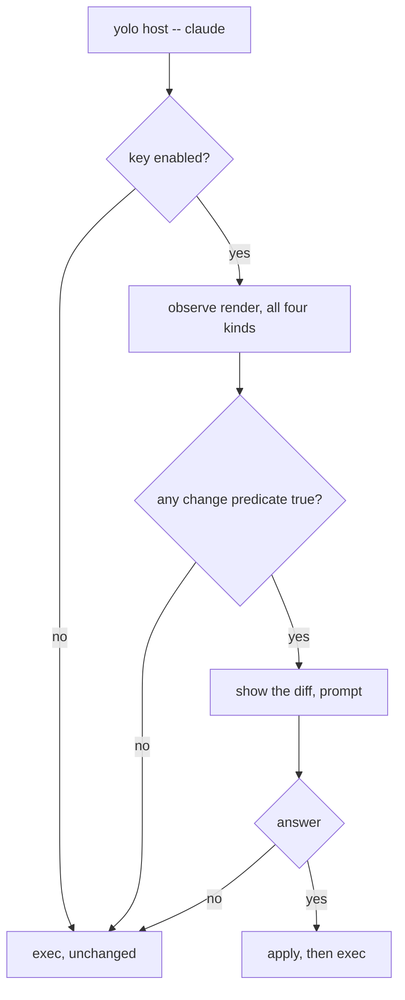

# The host render goes stale in silence — catch it at the launch, not on every command

**Status:** DESIGN, 2026-09-03, **restated after review the same day.** Nothing built.
Five rulings taken; two new questions open (§Open Questions).

**The short version.** `yolo host apply` renders pack surfaces into your real `$HOME` and then never
looks again: nothing re-checks whether the config it wrote still matches the config it *would*
write. The first draft of this doc proposed a per-command staleness notice on every `yolo`
invocation. **That was over-built.** The host already has a launch chokepoint — every generated
wrapper execs `yolo host -- <bin>` — and that is the only moment the render's content actually
matters, because agents read their config at startup and do not reload. So the design collapses to
one thing: at the host launch, if a re-apply would change anything, show it and ask — the same
interruption the jail already does at `yolo run`. Behind a user-level key, default off.

**The most important section is §3.4.** The observe pass reports *what it would write*, never
*whether that differs from disk*, so the one predicate this feature is entirely about does not
exist yet. Building it is the work; everything else is a call site.

**Reads with:** [`host-render-target.md`](host-render-target.md) (what a host render is and what the
`KindHost` notch refuses), [`config-safety.md`](config-safety.md) (the jail's launch-time config
prompt, which this mirrors), [`gate-placement-principle.md`](gate-placement-principle.md) (§7.1).

---

## 1. Verdict, and the principles it rests on

Prompt at the host launch chokepoint. No per-command check, no fingerprint, no stored state.

**P1. Measure, don't model.** A full observe render — the existing `--dry-run` posture, which writes
nothing — costs **11.4 ms p50** (§5). The cheap alternatives (hashing inputs, stat-ing them for
mtime+size) are all *models* of "would a re-apply change anything," and every model has a false
positive rate. At this cost there is no reason to approximate a question we can answer.

**P2. The launch is the only moment that matters.** Agents read their config at startup and do not
reload it mid-run. A host render that is stale while nothing is reading it is not a problem; the same
render stale at the instant an agent starts is the whole problem. Checking on `yolo prune` buys
nothing and costs an interruption.

**P3. Fire only on a real difference.** `internal/cli/apply.go:496-500` states the house rule in the
context of `confirmHostLosses`: *"A confirmation that fires on every run trains people to hit `y`
without reading, which is worse than no gate."* This feature is one wrong predicate away from being
exactly that, at every agent launch. §3.4 is that predicate.

**P4. One definition of up-to-date.** All four written kinds count — config surfaces, skills,
briefings, and the `files` trees. A feature that reports "up to date" while a skill it delivered is
missing has taught the user a word that does not mean what they think.

---

## 2. What exists today

### 2.1 The render, and its two spellings

`yolo host apply [--assert|--dry-run]` (`internal/cli/host.go:92` → `internal/cli/hostapply.go:20`)
and `yolo apply --at host` (`internal/cli/apply.go:45`) are the same operation; `host.go:66` states
the equivalence. **Observe is the default posture** — `--assert` is what writes. Both land in
`applyHost` (`internal/cli/apply.go:129`), which resolves the home via `os.UserHomeDir` and walks
the user-scoped pack set. The per-surface render is `entrypoint.RenderHostPack`
(`internal/entrypoint/hostrender.go:129`), whose contract is *"pure RMW, no computed layer. When
observe is true it computes what WOULD change and writes nothing."*

### 2.2 The launch chokepoint already exists

`hostwrap.Body` (`internal/hostwrap/hostwrap.go:41`) generates, per program:

```bash
#!/usr/bin/env bash
# Generated by yolo — host launch wrapper. Do not edit; `yolo host apply` rewrites it.
exec yolo host -- claude "$@"
```

**What gets a wrapper is exactly the pack-declared `program` contributions** —
`hostwrap.Bins` (`:58`) folds `HonoredInstalls` across the selected packs. Measured against this
user's pack set on 2026-09-03, that is five names: `agy`, `claude`, `codex`, `opencode`, `pi`. Not
`node`, not `pnpm`, not a shell builtin. **The wrapper path is agent launches**, which is a human
starting a session — not a hot loop. That single fact is what makes the cost argument in §5 easy,
and it is why the first draft's fear of this path (a script calling a wrapped tool a thousand times)
was misplaced.

Whether the wrapper dir is on `PATH` is opt-in (`config.HostWrappersEnabled`,
`internal/config/hostwrappers.go:33`) and observed by `sectionHostWrappers`
(`internal/cli/check/section_hostwrappers.go`), which WARNs when the feature is on but the dir is
not on `PATH`. **That is this design's coverage boundary, inherited whole** — see §7.2.

### 2.3 What does not exist

**No staleness check of any kind.** Nothing on any launch path, in `yolo check`, or in the run
pipeline re-examines a host render after it is written.

**No receipt records what the render was computed from.** The three manifests are all the same
struct — `hostskills.Manifest` (`internal/hostskills/manifest.go:28`), whose entire schema is
`Entries map[string]string`, destination path → pack name. No hashes, no mtimes, no sizes, no input
identity. Its header (`manifest.go:13-17`) is explicit that this is *"deliberately WEAK evidence"*
which *"can go stale in ordinary use"*, and therefore authorizes archiving (reversible) rather than
deletion. The provenance sidecars record `key → layer`, also with no content identity.

> [!WARNING]
> **The "render fingerprint gate" is not reusable and is not runtime machinery.** It is a `go test`
> — `renderFingerprintAt` (`internal/entrypoint/renderfingerprint_test.go:45`) walks a rendered
> temp home, sha256s every file, and discards the map. No golden file, no on-disk artifact. It
> fingerprints the render's *outputs*, so using it to decide "should I render?" is circular:
> computing it **is** the render. Do not reach for it here.

---

## 3. The diagnosis

### 3.1 Three independent ways it goes stale

| # | Cause |
|---|---|
| S1 | An **input** moved — user config, `packs.lock.json`, `config.lua`, a local pack tree, a skills or briefing source |
| S2 | The **binary** changed, and with it the 12 embedded packs |
| S3 | The **destination** was edited by hand — someone changed `~/.claude/settings.json` directly |

Running the real render answers all three at once, because the render reads the destination as part
of computing the result. An input-side fingerprint is structurally blind to S3, and S3 is not
exotic: the render is RMW with per-key provenance precisely because humans edit these files.

### 3.2 Why the jail cannot go stale and the host can

This asymmetry is the reason the feature exists at all, and it is the answer to the obvious next
question — *why not just re-render on every launch, the way the jail does?*

- **In the jail, every launch re-renders.** Staleness is unrepresentable. The launch-time prompt
  there (`config.CheckConfigChanges`, called from `internal/cli/run/preflight.go:200`) is therefore
  an *approval* gate over the config, not a staleness check — it asks "your config changed; launch
  with it?" and then renders fresh regardless.
- **On the host, the render is a one-time act.** `yolo host -- <bin>` resolves the target program
  and execs it. It does not re-apply. So the rendered state and the would-be-rendered state drift
  apart, silently and indefinitely.

> [!WARNING]
> **Do not "fix" this by making the host launch always re-apply.** It is the obvious simplification
> and it is wrong. The jail can render freely because its home is disposable; the real `$HOME` is
> not. A host render can overwrite a hand-edited value and can destroy an atomic entry outright —
> which is why `apply` defaults to observe, and why `confirmHostLosses`
> (`internal/cli/apply.go:511`) exists to confirm before the one-way door. Silently re-applying
> into a real home on every agent launch would fire that door on every launch with nobody asked.
> **Prompting is not ceremony here; it is the only safe way to write.**

### 3.3 `would render` is not `would change` — the actual gap

Here is the observe output for this jail's own home, run 2026-09-03:

```console
$ yolo host apply --dry-run
host apply  home /home/agent  posture observe (dry-run)
  …
  claude/settings      would render  /home/agent/.claude/settings.json
    ⚠ would overwrite your existing value for: permissions.additionalDirectories, …
  pi/models            would render  /home/agent/.pi/agent/models.json
  agy/settings         would render  /home/agent/.gemini/antigravity-cli/settings.json
```

`claude/settings` carries an `Overwrites` list, so something genuinely differs. **`pi/models` and
`agy/settings` carry nothing at all — and still say `would render`.** `Action` is unconditional for
any surface that is not skipped or refused; it describes the render's *intent*, not a comparison.

The field docs say so directly. `Overwrites` is *"Empty when the render only adds keys or re-asserts
identical values"* — one of those is a change and the other is not, and the field collapses them.
So today a surface that would **add** a key, and a surface that is byte-for-byte correct, are
indistinguishable.

**So the predicate this whole feature depends on does not exist.** A naive check on
`Action == "would render"` would prompt at every agent launch on every machine forever, which is
P3's failure mode aimed at the most annoying possible moment.

I want to be plain that this is the work. My first reading of the observe pass was that it already
knew the answer and needed only exposing; it doesn't. What it has is the *material* — it necessarily
computes the bytes it would write, because writing them is the assert path — and nothing compares
those bytes to the file.

### 3.4 The change predicate

Define the **change predicate** *(coined here)*: for one written destination, the answer to *"would
`--assert` write bytes that differ from what is on disk right now?"* — computed by comparing the
rendered result against the destination's current content, not by inspecting which fields of the
report are populated.

It is exact: no false positives, no false negatives, nothing to tune. It belongs on
`HostRenderResult` beside the fields that already describe the render, because every caller wants
it — `yolo host apply --dry-run` should say *"3 in sync, 2 would change"* rather than listing five
identical-looking `would render` lines, which is a standalone improvement to a command that ships
today.

Per P4 it is computed for all four written kinds. The three non-config kinds are whole-file
deliveries rather than RMW merges, so their comparison is simpler (does the destination match the
source?) but needs a directory walk.

Two carve-outs, which must be stated in the field's own doc comment or a future reader will "fix"
them:

- **`Formatting` losses alone do not count.** A commented-TOML re-emit that changes only comments
  *is* a change to the file, but prompting on it would fire forever on a config the user is happy
  with.
- **`Pruned` does not count.** A `${workspace}`-keyed key with no host referent is dropped on every
  render by design — a permanent property of the surface, not a drift.

---

## 4. The proposed shape

### 4.1 One trigger

**At `yolo host -- <bin>`, before the exec.** Not on any other command, not on a timer, not in the
background. `yolo host apply` and `yolo apply` are excluded because the user is already applying.



**Zero stored state.** No fingerprint, no baseline, no timestamp, no sentinel. The check is a pure
function of the packs, the config, and the home, computed fresh. Nothing can go stale, nothing needs
migrating the day this ships, and there is no one-writer question because there is nothing to write.
This property is a design commitment, not an accident of v1 — §7 defends it.

### 4.2 Opt-in, via a user-level key, default off

A host-only boolean in the user config, mirroring `host_wrappers` in shape and read through a
sibling of `config.HostWrappersEnabled` (`internal/config/hostwrappers.go:33`). **Default off.**

The key's name and its `yolo config-ref` wording are the implementer's, subject to matching the
existing `host_wrappers` spelling conventions.

`yolo check` prints a line when the feature is **available and off**, naming where to learn to turn
it on.

> [!NOTE]
> **This inverts an established rule in the file it lands in, on the maintainer's instruction.**
> `sectionHostWrappers` (`internal/cli/check/section_hostwrappers.go:33-34`) says: *"Silent unless
> there is something to say: not opted in means no row at all, which is what keeps the whole feature
> from being a nag for the users who never asked for it."* The ruling here is the opposite — an
> off-by-default feature should advertise itself in `check`, because `check` is the command whose
> job is "what is the state of my environment" and an undiscoverable feature is a feature nobody
> has. The two are reconcilable (a one-line availability hint is not a feature section) but the
> tension is real, and if `check` later grows a catalog of off-by-default hints, this row is where
> that started.

### 4.3 What the prompt does

Mirror the jail's launch-time prompt: print the diff, ask, act on the answer. `applyHost` already
owns the observe-then-confirm path — including `confirmHostLosses`
(`internal/cli/apply.go:511`), which itself runs *a second full observe pass* because *"observe
writes nothing and consumes no first-apply signal, so asking it 'what would be lost?' is free"*
(`apply.go:508-510`). Reuse it rather than growing a second confirmation.

An accepted prompt applies and then execs. A declined prompt execs anyway — see OQ-HS5, which is
where this differs from the jail and needs a ruling.

### 4.4 Failure paths

**The check may never be the reason an agent fails to start.** Any error it hits — a malformed pack
manifest, an unreadable home, an unresolvable `file://` pack, a permission error — resolves to *no
prompt* and a normal exec, not to a failed launch. At most one line to stderr.

Two consequences a reasonable implementer could get wrong:

- **Unprovable is not "in sync."** Per `internal/version/srcskew.go`'s house rule that a gate which
  cannot prove skew returns nil: when the check cannot complete it says nothing rather than
  reporting cleanliness.
- **A budget, and abandonment.** The check must not hang a launch on a cold or network-mounted
  `$HOME`. Default budget **250 ms**, after which it abandons silently and execs. This is ~20× the
  measured p50 and is a stuck-detector, not a tuning knob.

### 4.5 Degenerate inputs

| Case | Behavior |
|---|---|
| Key off | Exec, unchanged. The common case on day one. |
| No packs configured | No destinations; exec. |
| A `fetched` pack not yet installed | Skipped, not counted as stale — `packForCheckDeps` already returns nil for it, and it is `yolo check`'s problem. |
| A local `file://` pack whose dir is unreachable | Cannot determine → exec. Real: two of this user's ten packs are unreachable from inside a jail, which is why §5's measurement rendered eight. |
| Home not resolvable | Exec. |
| Never applied to this home at all | Everything reports as changed, which is correct: nothing has been delivered. The key being off by default is what stops this being a first-contact ambush. |
| Non-TTY launch (a script or CI invoking a wrapper) | **OQ-HS6.** |

### 4.6 Concurrency and ordering

The check is read-only, so two concurrent launches need no lock. If one accepts while the other has
a stale diff on screen, the accepting path re-renders before writing — `applyHost` owns that
already (§4.3).

---

## 5. What it costs — measured

Measured 2026-09-03, in this jail, 20 runs each, warm page cache, against `/bin/yolo`:

| Command | min | p50 | p90 |
|---|---:|---:|---:|
| `/bin/true` (process floor) | 0.72 | 0.87 | 1.31 ms |
| `yolo --version` | 3.46 | **3.91** | 4.52 ms |
| `yolo config drift` | 3.43 | 3.77 | 4.22 ms |
| `yolo host apply --dry-run` | 10.04 | **11.43** | 11.95 ms |

**The marginal cost is +7.5 ms p50, once per agent launch.** Against starting `claude` that is
unmeasurable. The first draft weighed this number against a 3.9 ms baseline on every `yolo`
invocation, where 2.9× was at least arguable; against an agent start it is not a tradeoff at all.

Three honest caveats:

1. **Understated.** Eight of ten packs rendered; the two `file://` packs are unreachable in-jail. A
   real host renders all ten, and P4's three extra kinds add directory walks.
2. **Warm cache.** Caches could not be dropped in this container. A cold `$HOME` on network storage
   will be I/O-bound — §4.4's budget is the answer.
3. **Dep resolution must be excluded.** `resolveHostDeps` shells out via `exec.LookPath`
   (`internal/depcheck/depcheck.go:122,180`), once per declared binary. That answers *"does this
   host have the tools"*, a different question owned by `yolo check`.

---

## 6. A leak found next door

`packload.Embedded()` (`internal/packload/embedded.go:55`) does `os.MkdirTemp` and copies the
embedded pack tree **on every call**, and never removes it. `cli.surfaceManifest`
(`internal/cli/surfaces.go:44`) does the same again under a second prefix.

Measured in this jail, 2026-09-03: 592 `/tmp/yolo-embedded-*` + 11 `yolo-embedded-packs-*` + 22
`yolo-cli-packs-*` = **625 directories, 109 MB**. Confirmed at exactly one per invocation — `yolo
pack ls` took the count from 626 to 627 — and about sixty were minted by the twenty benchmark runs
in §5.

**It is a pre-existing bug, tracked separately, and it is no longer a prerequisite for this
feature.** The first draft made it one, correctly, because a per-command render would have leaked on
every `yolo` invocation. At one render per agent launch the leak barely moves. Fix it because it is
a bug, not because this needs it.

---

## 7. What this does NOT do

- **It does not check on every command.** Rejected on review; see §8 and P2.
- **It does not refuse a launch.** A declined prompt or a failed check execs anyway (§4.3, §4.4).
- **It does not re-apply silently.** See §3.2's warning — that is the one-way door.
- **It does not check the jail.** In-jail is a hard no-op: `render.Host` targets the invoking user's
  real home and `paths.Home()` in-jail is `/home/agent`. The canonical discriminator is `inJail()`
  (`internal/config/load.go:315`). Jail-side drift is `yolo config drift`'s job.
- **It does not answer "does this host have the tools."** That is `check-deps` and `yolo check`.
- **It does not introduce a daemon, a timer, or a background process.**
- **It does not cache.** §4.1's zero-state property is deliberate.

### 7.1 Why this is a prompt and not a gate

[`gate-placement-principle.md`](gate-placement-principle.md)'s Test 1 asks whether a gate is aimed
at an actor who already holds the authority. Here they do — the remedy is a command they can run.
What is missing is **knowledge**, not permission. So this presents information and a choice, and
proceeds either way.

> [!WARNING]
> That doc's 2026-08-23 amendment carries an explicit `[!WARNING]` against "fixing"
> `internal/image/autoload.go` to consult a TTY on the strength of the actor test. It does not bite
> here, because this never refuses — but anyone extending it toward a refusal is walking into that
> ruling and should read it first.

### 7.2 The coverage boundary, stated plainly

This design sees a launch **only if it goes through a generated wrapper.** An agent started by a
binary the user invokes directly (wrapper dir not on `PATH`), by an IDE extension, or by a desktop
app is not observed and will run against a stale render with nothing said.

That is the same boundary `host_wrappers` already has, and `sectionHostWrappers` already WARNs when
the dir is not on `PATH` — so the gap is announced by an existing channel rather than a new one.
It is a real limit, not a bug, and it is the price of the collapse: a per-command notice would have
caught the drift *sometime*, just never at a moment tied to a launch.

---

## 8. Alternatives considered

| Alternative | Verdict |
|---|---|
| **A per-command staleness notice** on every `yolo` invocation (this doc's first draft) | **Rejected on review, 2026-09-03.** The host launches through shims, so the launch is already a chokepoint yolo controls; agents do not reload config mid-run; and you can always `yolo host apply` explicitly. There is no clear moment you need the files fresh other than startup. It also brought a whole eligibility apparatus with it — a deny-set for machine-consumed stdout, a `--help` side-effect hazard, an `eval "$(yolo host env)"` trap — all of which existed only to protect commands that never needed checking. |
| **Always re-apply at the host launch**, mirroring the jail's re-render | **Rejected, and it is the dangerous one.** See §3.2's warning: the jail's home is disposable, the real `$HOME` is not, and a host render can destroy an atomic entry. This is the simplification to resist. |
| **Input fingerprint (mtime+size)**, ~0.25–0.6 ms | **Rejected.** Structurally blind to S3 (§3.1), and its false positives — `touch`, `cp -p`, a same-size rewrite — land exactly where P3 forbids. Needs a state file, a format, a migration, and a tri-state, all to be less correct than the thing it approximates. |
| **Input content hash excluding the binary**, ~1.8 ms | **Rejected, same reason.** Precision on the input half, still blind to the destination half. |
| **Input content hash including the binary**, ~9.5 ms | **Rejected outright.** 7.7 ms of that is sha256 over a 16.7 MB binary whose identity is already free: `version.GitCommit` and `buildVersion` are `-ldflags -X` stamps (`internal/version/version.go:20,26`) and the 12 packs are embedded in it. Pays more for strictly less. |
| **Three-tier: stat screen → observe render → prompt** | **Rejected.** The screen exists only to avoid a cost that turned out affordable, and pays for it with a state file plus a self-heal path whose only job is laundering its own false positives. |
| **A background daemon watching the inputs** | **Rejected as disproportionate.** A daemon and its lifecycle to save 7.5 ms once per agent launch. |
| **Config surfaces only, deferring the other three kinds** | **Rejected on review.** Two tiers of "up to date" is a word that does not mean what the user thinks (P4). |

---

## 9. Risks

| Risk | Mitigation |
|---|---|
| **R1. The predicate is wrong and it prompts at every launch.** The highest-consequence failure; §3.3. | Byte comparison, not field inspection. Carve-outs named in code (§3.4). Minimum bar: a test that renders twice and asserts the second reports zero changes. |
| **R2. A prompt in front of an agent launch is the worst place to be wrong.** The user wants a session, not a dialog. | Default off (§4.2); fire only on a real difference (P3); never refuse (§4.3). |
| **R3. Coverage depends on the shim being in the launch path.** | §7.2, and the existing `sectionHostWrappers` WARN. |
| **R4. Cold-cache or network `$HOME` makes the launch feel slow.** | §4.4's 250 ms budget and silent abandonment. |
| **R5. Scope creep into a gate.** The next reader sees a check that knows something is wrong and asks why it does not stop the launch. | §7 and §7.1 exist to be cited. |
| **R6. `check` grows a catalog** of off-by-default availability hints. | §4.2's note records that this row is where that would have started. |

---

## 10. What I would build, in order

1. **The change predicate** on `HostRenderResult` (§3.4), all four kinds, with both carve-outs
   documented in the field comment. Land it with `yolo host apply --dry-run` reporting *"N in sync,
   M would change"* — a standalone improvement to a shipping command, and the honest way to verify
   the predicate before anything depends on it.
2. **The config key** (§4.2), default off, plus the `yolo check` availability line and the
   `config-ref` entry.
3. **The launch hook** at `yolo host -- <bin>`, reusing `applyHost`'s observe-then-confirm path.
4. **The temp-dir leak** (§6) — independent, and worth doing whenever.

Step 1 is worth landing regardless of how the open questions go.

## 11. What done looks like

- With the key on: editing `~/.claude/settings.json` by hand, then launching `claude` through the
  wrapper, shows the diff and offers to fix it. Accepting applies and launches. Declining launches.
- With the key on and a freshly-applied home: launching an agent prompts **not at all**, ever, until
  something actually changes. *(Check this first — it is R1.)*
- With the key off (the default): no yolo command and no agent launch mentions staleness, and
  `yolo check` says the feature exists and is off.
- `yolo host apply --dry-run` distinguishes in-sync surfaces from changed ones.
- A malformed pack manifest makes the prompt disappear, not the agent launch fail.
- In-jail, nothing mentions host staleness.

---

## Open Questions

1. 💬 **OQ-HS5: Does declining the prompt still launch?** In the jail, declining a config change
   **aborts** the launch (`config.CheckConfigChanges` → *"Config changes rejected. Exiting."*). On
   the host the stakes invert: the config yolo would write is *yolo's*, and the thing the user is
   trying to do is start their agent. Aborting their `claude` because they said "not now" to a
   settings re-render makes the wrapper feel like an obstacle, and the wrapper is on `PATH` under a
   name they did not choose.

   _Leaning:_ **Launch anyway.** Decline means "not now", not "cancel my session". The one argument
   the other way is that an agent launched against config the user just declined is in a state
   nobody chose — but they chose it, explicitly, one keystroke ago, and the alternative is a tool
   that holds their session hostage. If you want a middle, decline could launch and print one line
   naming `yolo host apply`.

   **Answer:**
   > _(empty — fill in when decided)_

2. 💬 **OQ-HS6: What does a non-TTY launch do?** A script, a CI job, or an IDE spawning a wrapped
   binary has no terminal to prompt at. `promptYesNo` (`internal/cli/pack.go`) is documented as
   fail-closed — a nil or EOF stdin reads as NO — and the jail's equivalent path *refuses* rather
   than proceeding, which is right for a jail launch and looks wrong for an agent exec.

   _Leaning:_ **Silent exec, no prompt, no line.** Fail-closed on the *apply* (never write without
   a human) but fail-open on the *launch* (never block a script). This is the same split §4.4 makes
   for errors, and it keeps the feature invisible to automation, which is where an unexpected prompt
   does the most damage. A one-line stderr note is the plausible alternative if you would rather CI
   logs recorded the drift.

   **Answer:**
   > _(empty — fill in when decided)_

---

## Decision Ledger

| ID | Ruling / Decision | Date | Settled in |
| :--- | :--- | :--- | :--- |
| OQ-HS0 | Accuracy over approximation: run the real observe render rather than a stat or hash fingerprint. Rules out the three-tier design and the fingerprint file. | 2026-09-03 | §1 P1, §4.1, §8 |
| OQ-HS1 | The launch chokepoint is not merely included — it is **the whole point**, and the only trigger. Per-command checking is deleted. | 2026-09-03 | §1 P2, §4.1, §8 |
| OQ-HS2 | No `FirstApply` cleverness. A user-level key, **default off**, plus a `yolo check` line saying it is available and off. | 2026-09-03 | §4.2 |
| OQ-HS3 | A prompt at the launch, mirroring the jail's — not a notice on unrelated commands. The host's shim path makes it "the exact same thing on the host." | 2026-09-03 | §3.2, §4.3 |
| OQ-HS4 | Everything is covered — all four written kinds. No two tiers of "up to date". | 2026-09-03 | §1 P4, §3.4 |
