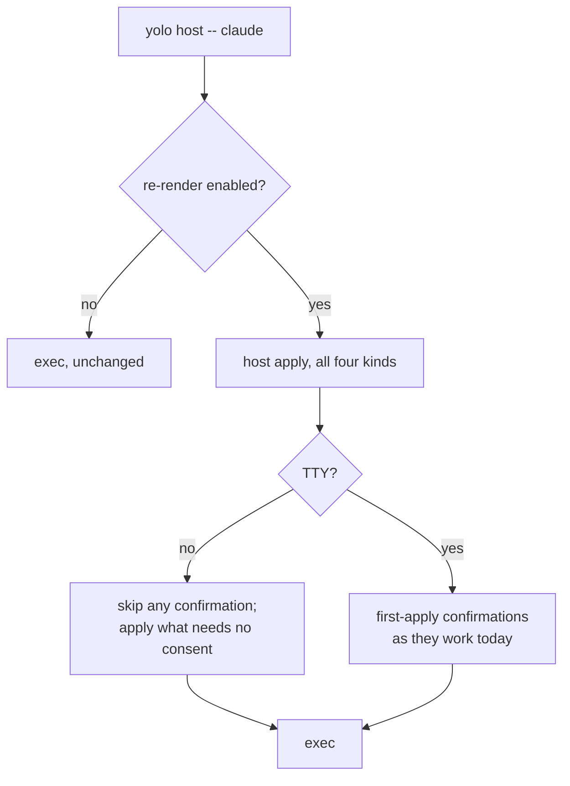

# The host launch should re-render, the way a jail launch does

**Status:** DESIGN, 2026-09-03, **third restatement the same day** — the second one argued for
staleness *detection* and was wrong about why (§3.2 ⚠ Retracted). Nothing built. Six rulings taken;
two questions open.

**The short version.** `yolo host apply` renders pack surfaces into your real `$HOME` and then never
looks again, so the rendered state and the would-be-rendered state drift apart silently. Two drafts
of this doc tried to *detect* that drift — first on every `yolo` command, then at the launch — and
both were solving a problem that does not need to exist. **The host launch should simply re-render,
exactly as every jail launch already does.** Once the user has run `host apply`, wholesale
regeneration is policy, not risk — the repo ruled that on 2026-08-02 and `confirmHostLosses`
implements it. Re-rendering makes staleness *unrepresentable* instead of detectable, and deletes the
detection machinery, the change predicate, the prompt, and the notice along with it.

**The most important section is §3.2.** It is where the previous draft's central argument is
retracted, and the retraction is the whole reason this design is small.

**Reads with:** [`host-render-target.md`](host-render-target.md) (what a host render is and what the
`KindHost` notch refuses), [`config-safety.md`](config-safety.md) (the jail's launch-time config
approval, which is a different mechanism than this).

---

## 1. Verdict, and the principles it rests on

Re-render at the host launch chokepoint. No detection, no predicate, no prompt, no stored state.

**P1. The launch is the only moment that matters.** Agents read their config at startup and do not
reload it mid-run. A host render that is stale while nothing reads it is not a problem; the same
render stale at the instant an agent starts is the whole problem. That is why per-command checking
was deleted from the first draft, and the reasoning survives into this one intact.

**P2. Consent, not disposability, is what licenses a write.** The operative question is never "is
this home precious" — it is "did the user opt in." `host apply` is the opt-in, and a generated
wrapper's existence is proof it happened. §3.2.

**P3. Make the bad state unrepresentable rather than detectable.** A drift you cannot get into needs
no detector, no predicate, no diff renderer, and no prompt. Every line of the previous draft's
mechanism existed to observe a condition this design removes.

**P4. A wrapper must never be the reason an agent fails to start.** It is on `PATH` under a name the
user did not choose. Every failure path — a bad manifest, an unwritable home, a fail-closed
confirmation with no TTY — ends in *exec the program anyway*. See §4.3, which is the one place this
design adds a genuinely new failure mode.

---

## 2. What exists today

### 2.1 The render, and its two spellings

`yolo host apply [--assert|--dry-run]` (`internal/cli/host.go:92` → `internal/cli/hostapply.go:20`)
and `yolo apply --at host` (`internal/cli/apply.go:45`) are the same operation; `host.go:66` states
the equivalence. Observe is the default posture; `--assert` writes. Both land in `applyHost`
(`internal/cli/apply.go:129`), which resolves the home via `os.UserHomeDir` and walks the
user-scoped pack set. The per-surface render is `entrypoint.RenderHostPack`
(`internal/entrypoint/hostrender.go:129`) — *"pure RMW, no computed layer."*

**The render is idempotent, and it is tested three ways:** `internal/entrypoint/hostmcp_test.go:305`
(*"A SECOND `--assert` is byte-identical: the render is idempotent"*),
`internal/cli/applyhostidempotent_test.go` (convergence over the whole home), and
`internal/entrypoint/prism_copilot_test.go:103` (RMW idempotence — *"a second boot must be
idempotent and must not clobber a value the agent changed"*). This is what makes re-rendering on
every launch a no-op by construction rather than by luck, and it is the load-bearing fact of the
whole design.

### 2.2 The launch chokepoint already exists

`hostwrap.Body` (`internal/hostwrap/hostwrap.go:41`) generates, per program:

```bash
#!/usr/bin/env bash
# Generated by yolo — host launch wrapper. Do not edit; `yolo host apply` rewrites it.
exec yolo host -- claude "$@"
```

**What gets a wrapper is exactly the pack-declared `program` contributions** — `hostwrap.Bins`
(`:58`) folds `HonoredInstalls` across the selected packs. Measured against this user's pack set on
2026-09-03: five names, `agy`, `claude`, `codex`, `opencode`, `pi`. Not `node`, not `pnpm`. **The
wrapper path is agent launches** — a human starting a session, not a hot loop.

Whether the wrapper dir is on `PATH` is opt-in (`config.HostWrappersEnabled`,
`internal/config/hostwrappers.go:33`) and observed by `sectionHostWrappers`
(`internal/cli/check/section_hostwrappers.go`), which WARNs when the feature is on but the dir is
not on `PATH`. That is this design's coverage boundary, inherited whole — §7.2.

### 2.3 What does not exist

Nothing on any launch path, in `yolo check`, or in the run pipeline re-examines a host render after
it is written. And no receipt records what the render was computed from: the three manifests are all
`hostskills.Manifest` (`internal/hostskills/manifest.go:28`), whose entire schema is
`Entries map[string]string`, destination path → pack name. Its header (`manifest.go:13-17`) is
explicit that this is *"deliberately WEAK evidence"* which *"can go stale in ordinary use"*, and so
authorizes archiving rather than deletion.

Both facts stop mattering under this design — they were inputs to a detector, and there is no
detector. They are kept here because the next person to propose a fingerprint will want them.

---

## 3. The diagnosis

### 3.1 Why the jail cannot go stale and the host can

- **In the jail, every launch re-renders.** Staleness is unrepresentable. The launch-time prompt
  there (`config.CheckConfigChanges`, called from `internal/cli/run/preflight.go:200`) is an
  *approval* gate over the config — "your config changed; launch with it?" — and then it renders
  fresh regardless. It is not a staleness check and should not be mistaken for the model here.
- **On the host, the render is a one-time act.** `yolo host -- <bin>` resolves the target program and
  execs it. It does not re-apply. So the two states drift apart, silently and indefinitely.

The asymmetry is not a property of the homes. It is a property of *when yolo renders*, and that is a
choice this design changes.

### 3.2 ⚠ Retracted: "the real `$HOME` is not disposable, so re-applying is unsafe"

The previous draft carried a `[!WARNING]` telling the reader not to make the launch re-apply, on the
grounds that a jail's home is disposable and a real `$HOME` is not, so a silent re-render *"would
fire the one-way door on every launch with nobody asked."*

**That is wrong, and the code says so.** `confirmHostLosses`
(`internal/cli/apply.go:511`) gates on:

```go
if !r.FirstApply || len(r.EntryLosses) == 0 {
    continue
}
```

`FirstApply` is true only when *"this home has NO provenance record for this surface, i.e. yolo has
never asserted it here"* (`internal/entrypoint/hostrender.go:98`). On a home yolo has already
asserted it is false, so **the gate never fires and there is no door to fire.** The one-way door is
a first-apply concept exclusively.

The rationale, at `internal/cli/apply.go:490-494`, is the argument the retraction rests on:

> *"undeclared server is stale by definition — but that only holds once the user has opted in. On
> the FIRST apply into a home they have not opted in yet: their hand-added server predates the pack,
> and replacing it before they have declared it anywhere is not policy, it is data loss."*

So the repo already ruled, on a maintainer decision recorded at `apply.go:493` (2026-08-02): **once
opted in, wholesale regeneration is policy.** The prompt's own text says the same thing to the user
— *"yolo regenerates the keys it manages wholesale, so anything above that is not in your config is
dropped"* (`apply.go:549-551`).

**What the retracted argument got wrong, precisely:** it treated *preciousness* as the thing that
licenses or forbids a write, when the operative property is *consent*. Disposability is why a jail
home needs no gate at all; consent is why a host home needs one exactly once. Conflating them turns
a first-apply gate into an every-apply gate and makes re-rendering look dangerous when it is the
same operation the user already authorized.

> [!NOTE]
> Kept as a retraction rather than deleted because the intuition is a strong one and cheap to
> re-derive — "the real `$HOME` is precious, so be careful" is the first thing anyone thinks, and
> `confirmHostLosses` existing at all makes it feel confirmed. The check that settles it is four
> lines of gate, and reading them is faster than re-arguing this.

### 3.3 What this deletes

The previous draft's central claim — that `Action` is `"would render"` unconditionally, so a
byte-for-byte correct surface and one needing a whole new key are indistinguishable, and therefore
a **change predicate** must be built — was *correct as a description of the observe pass* and is
now **irrelevant to this feature**. If the launch always renders, nothing needs to ask whether a
render would change anything.

The predicate survives only as optional polish: `yolo host apply --dry-run` currently prints five
identical-looking `would render` lines, and *"3 in sync, 2 would change"* would be better. That is a
nice-to-have on an existing command (§6), not a prerequisite for anything.

Also deleted: the per-command eligibility apparatus (a deny-set for machine-consumed stdout, the
`--help` side-effect hazard, the `eval "$(yolo host env)"` trap), the diff renderer, the prompt, the
notice, and the user-level enable key that was going to gate the notice. **OQ-HS2's ruling — a key,
default off, advertised in `yolo check` — is superseded**, because there is no notice to enable; what
remains is the different question of whether *re-rendering itself* is opt-in (OQ-HS8).

---

## 4. The proposed shape

### 4.1 The whole design

**At `yolo host -- <bin>`, run the host apply, then exec.** `yolo host apply` and `yolo apply` are
excluded — the user is already applying.



**Zero stored state.** No fingerprint, no baseline, no timestamp, no sentinel — there is nothing to
compare, because nothing is being detected.

### 4.2 Trigger, precisely

Every invocation of a generated wrapper, before the exec. Not on a timer, not once per session, not
on any other `yolo` command.

### 4.3 The one new failure mode, and it is the important part of this doc

`confirmHostLosses` ends in `promptYesNo` (`internal/cli/pack.go:1281`), documented fail-closed: a
nil or EOF stdin reads as **NO**, and a NO aborts the apply. On the explicit `apply` path that is
right — *"a CI or scripted `yolo host apply --assert` aborts rather than silently destroying a
server because no human was present"* (`apply.go:504-506`).

Move the apply onto the launch path and the same rule produces a new outcome: **add a pack, then let
CI launch a wrapped agent, and the launch fails.** The new pack's surface is `FirstApply` with
`EntryLosses`, there is no TTY, fail-closed returns NO, and the apply aborts. A wrapper that refuses
to start the program because a config confirmation could not be asked violates P4 outright.

**The resolution, per P4: on a non-TTY launch, skip the confirmation-requiring part of the apply and
exec anyway.** Fail-closed stays exactly as it is for the explicit `apply` path, where a human is
the expected caller. The drift persists until someone applies interactively — which is strictly
better than a broken launch, and is the same posture §4.4 takes for every other error.

What that leaves undecided is *how much* of the apply proceeds when a confirmation is skipped —
everything that needs no consent, or nothing at all. That is OQ-HS7.

### 4.4 Other failure paths

**The check may never be the reason an agent fails to start** (P4). A malformed pack manifest, an
unreadable home, an unresolvable `file://` pack, a permission error, a partially-completed write —
all end in *exec*, with at most one line to stderr.

**A budget, and abandonment.** The apply must not hang a launch on a cold or network-mounted `$HOME`.
Default budget **1 s** — deliberately looser than the previous draft's 250 ms, because this path now
writes rather than only observing — after which it abandons and execs. A stuck-detector, not a
tuning knob.

**Partial application is possible and acceptable.** An abandoned or failed apply can leave some
surfaces rendered and others not. That is already true of an interrupted `yolo host apply`, the
render is idempotent (§2.1), and the next launch converges. It must not, however, leave a *single
file* half-written — that is the renderer's existing atomicity concern, unchanged by this.

### 4.5 Degenerate inputs

| Case | Behavior |
|---|---|
| Re-render disabled | Exec, unchanged. |
| No packs configured | Nothing to render; exec. |
| A `fetched` pack not yet installed | Skipped — `packForCheckDeps` returns nil, and it is `yolo check`'s problem. |
| A local `file://` pack whose dir is unreachable | That pack contributes nothing this launch; the rest render. Real: two of this user's ten packs are unreachable from inside a jail. |
| Home not resolvable | Exec. |
| Never applied to this home at all | Every surface is `FirstApply`. On a TTY, today's confirmations apply. Off a TTY, §4.3. Note the wrapper's existence implies a prior `host apply`, so a *wholly* unapplied home reaching this path is already unusual. |
| A new pack added since the last apply | Its surfaces are `FirstApply` in an otherwise-managed home. This is the case §4.3 is about. |

### 4.6 Concurrency

Two wrapped agents launched at once would both apply. The render is idempotent, so the outcome
converges — but two concurrent writers to one file is not something idempotence alone makes safe.
`applyHost` has no lock today because its caller was always a human running one command.
**One writer must be named:** serialize host applies on a lockfile keyed by the resolved home, and
let a launch that cannot take the lock skip the apply and exec (P4). The natural home is beside the
existing per-workspace lock convention (`internal/cli/run/run.go` takes
`locks/<container-name>.lock`).

---

## 5. What it costs — measured

Measured 2026-09-03, in this jail, 20 runs each, warm page cache, against `/bin/yolo`:

| Command | min | p50 | p90 |
|---|---:|---:|---:|
| `/bin/true` (process floor) | 0.72 | 0.87 | 1.31 ms |
| `yolo --version` | 3.46 | **3.91** | 4.52 ms |
| `yolo config drift` | 3.43 | 3.77 | 4.22 ms |
| `yolo host apply --dry-run` | 10.04 | **11.43** | 11.95 ms |

**11.4 ms is the observe cost, once per agent launch.** An `--assert` is somewhat more, since it
writes — unmeasured, because writing into this jail's own live home during a benchmark is not a
thing to do casually. Against starting `claude` neither number is a tradeoff.

Three caveats:

1. **Understated.** Eight of ten packs rendered; the two `file://` packs are unreachable in-jail. A
   real host renders all ten, across all four written kinds.
2. **Warm cache.** Caches could not be dropped in this container. A cold `$HOME` on network storage
   will be I/O-bound — §4.4's budget is the answer.
3. **Dep resolution should be excluded.** `resolveHostDeps` shells out via `exec.LookPath`
   (`internal/depcheck/depcheck.go:122,180`) once per declared binary, which answers *"does this
   host have the tools"* — a different question owned by `yolo check`.

---

## 6. Two things worth doing that this no longer needs

**The change predicate** (§3.3). `yolo host apply --dry-run` prints `would render` for every surface
that is not skipped or refused, so in-sync and about-to-change look identical. *"3 in sync, 2 would
change"* is a real improvement to a shipping command. It is no longer load-bearing for anything.

**The temp-dir leak.** `packload.Embedded()` (`internal/packload/embedded.go:55`) does
`os.MkdirTemp` plus a full copy of the embedded pack tree on every call and never removes it;
`cli.surfaceManifest` (`internal/cli/surfaces.go:44`) does it again under a second prefix. Measured
2026-09-03 in this jail: 592 `/tmp/yolo-embedded-*` + 11 `yolo-embedded-packs-*` + 22
`yolo-cli-packs-*` = **625 directories, 109 MB**, confirmed at exactly one per invocation (`yolo
pack ls` took the count 626 → 627). About sixty were minted by §5's twenty benchmark runs. A
pre-existing bug, tracked separately, and never a prerequisite for this.

---

## 7. What this does NOT do

- **It does not detect staleness.** There is nothing to detect; §3.3.
- **It does not check on every command.** P1.
- **It does not prompt anything new.** The only confirmations are the ones `applyHost` already has,
  reached on the paths they already guard.
- **It does not refuse a launch.** P4, and §4.3 is the case that tests it.
- **It does not change the explicit `apply` path.** `yolo host apply` keeps observe-by-default and
  keeps fail-closed confirmations.
- **It does not check the jail.** In-jail is a hard no-op: `render.Host` targets the invoking user's
  real home, and `paths.Home()` in-jail is `/home/agent`. The discriminator is `inJail()`
  (`internal/config/load.go:315`).
- **It does not introduce a daemon, a timer, or a background process.**

### 7.1 Why there is no gate to place

The previous draft argued this via [`gate-placement-principle.md`](gate-placement-principle.md)'s
Test 1 — a gate aimed at an actor who already holds the authority is theatre. That reasoning was
sound and is now moot: this design adds no gate at all. It performs an operation the user already
authorized, on the schedule the jail already uses.

### 7.2 The coverage boundary, stated plainly

This sees a launch **only if it goes through a generated wrapper.** An agent started by a binary the
user invokes directly (wrapper dir not on `PATH`), by an IDE extension, or by a desktop app is not
observed and runs against whatever the last explicit apply left.

That is the same boundary `host_wrappers` already has, and `sectionHostWrappers` already WARNs when
the dir is not on `PATH`, so the gap is announced by an existing channel. It is a real limit and the
price of the approach: a per-command notice would have caught drift *sometime*, just never at a
moment tied to a launch.

---

## 8. Alternatives considered

| Alternative | Verdict |
|---|---|
| **Re-render at the launch** (this design) | **Accepted.** Makes staleness unrepresentable, matches the jail, and rests on a maintainer ruling already in the code (§3.2). |
| **Detect drift and prompt at the launch** (draft 2) | **Rejected.** Its justification was §3.2's retracted argument. With regeneration established as policy post-opt-in, a prompt asks permission for something already granted — and it required building a change predicate to decide when to ask. |
| **A per-command staleness notice** (draft 1) | **Rejected.** The host launches through shims, agents do not reload config mid-run, and an explicit apply is always available; there is no clear moment the files need to be fresh other than a launch. It also dragged in an eligibility apparatus protecting commands that never needed checking. |
| **Input fingerprint (mtime+size)**, ~0.25–0.6 ms | **Rejected twice over.** Structurally blind to a hand-edited destination, false-positive on `touch`/`cp -p`, needs a state file and a migration — and now has nothing to be an input to. |
| **Input content hash including the binary**, ~9.5 ms | **Rejected outright.** 7.7 ms of it is sha256 over a 16.7 MB binary whose identity is free: `version.GitCommit` and `buildVersion` are `-ldflags -X` stamps (`internal/version/version.go:20,26`) and the 12 packs are embedded in it. |
| **A background daemon watching the inputs** | **Rejected as disproportionate.** |
| **Config surfaces only, deferring the other three kinds** | **Rejected.** Two tiers of "up to date" is a word that does not mean what the reader thinks — and under this design there is one tier by construction. |

---

## 9. Risks

| Risk | Mitigation |
|---|---|
| **R1. A launch fails because a confirmation could not be asked.** The one new failure mode; §4.3. | Skip the confirmation and exec (P4). OQ-HS7 settles how much of the apply proceeds. |
| **R2. Two concurrent launches write one home.** Idempotence does not make concurrent writers safe. | §4.6 — a per-home lock, and a launch that cannot take it skips and execs. |
| **R3. A launch feels slow on a cold or network `$HOME`.** | §4.4's 1 s budget and abandonment. |
| **R4. An unwanted write on a machine the user wanted left alone.** | OQ-HS8 — whether re-rendering is opt-in. |
| **R5. Coverage depends on the shim being in the launch path.** | §7.2, plus the existing `sectionHostWrappers` WARN. |
| **R6. Someone re-derives the retracted argument** and reverts this to a detector. | §3.2 exists to be cited, and says which four lines settle it. |

---

## 10. What I would build, in order

1. **The launch hook** — `yolo host -- <bin>` runs the apply, then execs. With P4's rule wired from
   the start: every error path execs.
2. **The non-TTY split** (§4.3) once OQ-HS7 is ruled.
3. **The per-home lock** (§4.6).
4. Independently, whenever: the change predicate and the temp-dir leak (§6).

## 11. What done looks like

- With re-render on: edit `~/.claude/settings.json` by hand, launch `claude` through the wrapper, and
  the file is back to what your packs declare — with no prompt, because the home is already managed.
- Launching twice in a row writes byte-identical content the second time and takes no visible extra
  time.
- Add a pack, then launch a wrapped agent **from a script with no TTY**: the agent starts. *(This is
  R1 — check it first.)*
- Add a pack interactively where an MCP entry would be destroyed: today's confirmation appears.
- `yolo host apply` behaves exactly as it does now, observe-by-default and fail-closed.
- Two wrapped agents launched simultaneously both start, and the home is not corrupt.
- In-jail, nothing re-renders a host home.

---

## Open Questions

1. 💬 **OQ-HS7: On a non-TTY launch, how much of the apply proceeds?** §4.3 establishes that the
   launch must not fail when a confirmation cannot be asked. What it does not settle is whether the
   apply then does *everything that needs no consent* (every surface that is not `FirstApply`, plus
   `FirstApply` surfaces with no `EntryLosses`) and skips only the confirmation-requiring surfaces —
   or skips the whole apply for that launch.

   _Leaning:_ **Partial — apply everything that needs no consent.** It is the outcome closest to
   what the user asked for, and the skipped surfaces are exactly the ones whose written record
   already says "a human must look at this." The counter-argument is that a partially-applied home
   is harder to reason about than an unapplied one; I think idempotence and convergence-on-next-launch
   answer that, but it is a judgement about how much implicitness you want on a path with no human
   watching.

   **Answer:**
   > _(empty — fill in when decided)_

2. 💬 **OQ-HS8: Is re-rendering at the launch opt-in, or the behavior?** This supersedes OQ-HS2,
   which put a key on a *notice* that no longer exists. Arguments for making it the behavior: it is
   what the jail does, it is what makes `host apply` mean something durable, and the wrapper only
   exists because the user opted into both `host apply` and `host_wrappers` — a double opt-in
   already. Arguments for a key: a wrapper that writes to `$HOME` on every launch is a surprising
   thing for a wrapper to do, and someone may want wrappers for their env composition without
   wanting config rewritten under them.

   _Leaning:_ **Make it the behavior, no key.** The double opt-in is real consent, a third switch is
   a switch nobody finds, and the alternative leaves the drift this doc is about in place by default.
   If you want a key anyway, it should default **on** — a default-off key ships the problem.

   **Answer:**
   > _(empty — fill in when decided)_

---

## Decision Ledger

| ID | Ruling / Decision | Date | Settled in |
| :--- | :--- | :--- | :--- |
| OQ-HS0 | Accuracy over approximation: run the real render rather than a stat or hash fingerprint. Rules out the three-tier design and the fingerprint file. | 2026-09-03 | §1 P3, §8 |
| OQ-HS1 | The launch chokepoint is the only trigger. Per-command checking deleted. | 2026-09-03 | §1 P1, §4.2, §8 |
| OQ-HS2 | *(Superseded by OQ-HS8.)* Was: a user-level key, default off, advertised in `yolo check`. The notice it gated no longer exists. | 2026-09-03 | §3.3 |
| OQ-HS3 | *(Superseded.)* Was: prompt at the launch rather than notice on unrelated commands. The launch re-renders instead, so there is nothing to prompt about. | 2026-09-03 | §3.2, §8 |
| OQ-HS4 | Everything is covered — all four written kinds. No two tiers of "up to date". | 2026-09-03 | §3.3, §4.1 |
| OQ-HS5 | *(Moot.)* Was: does declining the prompt still launch? There is no prompt. The surviving half — a launch must never fail on a config confirmation — is now P4. | 2026-09-03 | §1 P4, §4.3 |
| OQ-HS6 | *(Reframed as OQ-HS7.)* Was: what does a non-TTY launch do? Answered in part — it execs — with the residue being how much of the apply proceeds. | 2026-09-03 | §4.3 |
