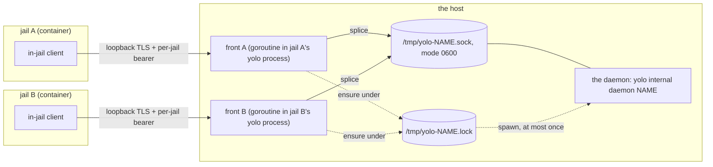

# Nobody supervises the host daemons, and every hard case is a version boundary

**Status:** DESIGN, 2026-09-20. One of the eight rulings is in and built — the management
surface ([§5.1](#51-the-management-surface-one-verb-over-the-host-scoped-set)); the rest of
the doc makes the existing architecture legible and asks seven. Evidence verified against
`af988566`, except where a later date is stated.

> **In short.** Nothing supervises a host-wide daemon: each launch *ensures* one under a
> flock and then never looks at it again. And every genuinely hard case in this area is the
> same absence — a rendezvous derived from a **name** with no version in it, so an old
> process and a new yolo meet at one path, each assuming the other matches.

**Why it matters.** Jails used to share nothing. Three of them now share a host process
apiece, and the two hardest behaviours in the tree — refusing to kill a daemon that is
alive and broken, and hunting `/proc` for daemons no supervisor owns — are both patches on
the same missing boundary.

**The shape.** Two halves with unrelated lifetimes: a **front** per jail (a goroutine
inside that jail's own `yolo` process, publishing a 0600 endpoint file), and one **daemon**
per host per loophole *name*, at `/tmp/yolo-<name>.sock`, ensured under
`/tmp/yolo-<name>.lock`. Everything surprising here follows from those two lifetimes not
matching, and everything *hard* from neither path carrying a version.

**Start at [§4](#4-the-version-boundary-that-is-not-there)** — the organising claim.
[§2](#2-the-picture) is the shape it applies to and [§6](#6-the-failure-modes) is what it
produces.

**Needs your ruling:** [OQ-HD1](#OQ-HD1), [OQ-HD3](#OQ-HD3), [OQ-HD4](#OQ-HD4),
[OQ-HD5](#OQ-HD5), [OQ-HD6](#OQ-HD6), [OQ-HD7](#OQ-HD7), [OQ-HD8](#OQ-HD8).

**Reads with:** [`host-daemon-ownership-plan.md`](host-daemon-ownership-plan.md) (the
implementation sketch — a parking lot, unstable while these questions are open),
[`../reference/loophole-transport.md`](../reference/loophole-transport.md) (**the
authority** for `scope`, the ensure-under-flock model, the teardown asymmetry and the
stale-daemon warning — this doc systematizes what it states in three places),
[`broker-as-a-pack.md`](broker-as-a-pack.md) (where `scope: "host"` was invented),
[`../reference/loophole-system.md`](../reference/loophole-system.md) (activation, the
origin gate, what a pack may declare).

---

## Defined terms

Three words do the work here, and two of them are the tree's, not mine.

- **Host-wide daemon**, equivalently **singleton** — the one process per host serving every
  jail on it, declared by `host_daemon.scope: "host"` in a loophole manifest. Not a
  per-jail daemon, which is spawned and reaped with the jail that asked for it. The
  vocabulary is [`enums.go`](../../internal/loopholedecl/enums.go)'s (`ScopeHost` /
  `ScopeJail`, 2026-08-19).
- **Front** — the authenticated loopback-TLS listener yolo runs in front of a daemon's
  AF_UNIX socket, one per jail, publishing an endpoint file carrying that jail's bearer
  token. Not a proxy with a policy: it splices bytes and prepends a connection preamble.
  From [`../reference/loophole-transport.md`](../reference/loophole-transport.md).
- **Ensure** *(the tree's word, in [`enums.go`](../../internal/loopholedecl/enums.go))* —
  ask for a daemon to exist, idempotently: check liveness, and only if it is absent take a
  host-wide flock and spawn one. The deliberate contrast is with **spawn**, which always
  starts a process. Neither implies supervision.

---

## 1. The answer, in one sentence

**Nobody is the supervisor.** A host-wide daemon has no parent watching it, no restart
policy, no health loop and no owner: it is *ensured* by whichever launch first wants it,
and from that moment the only things that can act on it are the next launch (which
re-ensures), a human running `yolo host-daemon restart <name>` (which reaches every one of
them — [§5.1](#51-the-management-surface-one-verb-over-the-host-scoped-set)), and two
upgrade paths that kill-and-replace under the lock.

That is not a new finding — it is the settled model, stated as fact in
[`../reference/loophole-transport.md`](../reference/loophole-transport.md) and ruled in
[`broker-as-a-pack.md`](broker-as-a-pack.md). What has never been written down is that it
is the *whole* model, and the three consequences that follow from it:

1. **A daemon that dies mid-session stays dead for the life of that jail.** The front is
   independent of its upstream by design — it publishes as soon as it binds, and a
   connection that cannot reach the socket is logged and dropped
   ([`front.go`](../../internal/svcendpoint/front.go), `ServeFront`). Nothing re-ensures
   until the next launch.
2. **A daemon nobody is using is never stopped.** No refcount, no TTL, no idle timer, no
   reaper ([§5](#5-who-may-act-on-a-host-daemon) has the exhaustive negative). It survives
   the jail ending, the pack being deselected and the loophole being disabled.
3. **The only supervisor in the system is on the other side of the boundary.** The jail has
   a real one — `yolo-jaild supervise`, with restart policies, backoff, log rotation and a
   teardown contract ([§7](#7-the-jail-side-has-a-supervisor-and-it-just-got-harder)). The
   host side has never had one.

---

## 2. The picture



The diagram is half the answer. The other half is that the boxes have different lifetimes,
and that is the design:

| Thing | One per | Born | Dies | Who owns it |
| :--- | :--- | :--- | :--- | :--- |
| the daemon | host, per loophole name | the first launch that wants it and finds none alive | a human kills it, an upgrade path replaces it, or the host reboots | **nobody** |
| its socket, PID file and lock | host, per loophole name | with the daemon | cleared by the next spawn, or by a kill | nobody |
| its capability stamp | host, per loophole name | written **only when yolo itself spawns** | removed by a kill | nobody |
| its log, `host-service-<name>.log` | host, per loophole name | first spawn | never — append-only, **no rotation** | nobody |
| the front | jail | at launch, once the daemon's socket answers a connect | when the jail ends: `stop()` closes the front and nothing else | that jail's `yolo` process |
| the endpoint file + bearer token | jail | when the front binds | unlinked by the front's `Close` | the front |

> [!IMPORTANT]
> **A jail ending cannot reach a host-wide daemon, and that is ruled rather than
> accidental.** The teardown sweeps by the jail's own hash — `retireFrontSockets` globs
> `/tmp/yolo-front-<8hex>-*.sock` — and a singleton's socket is keyed by the loophole name,
> so it is unreachable from there *by construction* rather than by a check somebody has to
> remember ([`loopholesruntime.go`](../../internal/cli/run/loopholesruntime.go),
> `retireFrontSockets`; [`paths.go`](../../internal/paths/paths.go), `JailShortHash`). The
> reason is stated in
> [`../reference/loophole-transport.md`](../reference/loophole-transport.md): doing
> otherwise cuts every other live jail off its credential path.

Two asymmetries in that table are places where the host half is thinner than the jail half:

- **The stamp is written on spawn, not on observation.** A daemon already alive when this
  build ensured it is never re-stamped, so the stamp answers "did a build like mine *start*
  this?" and nothing else.
- **The log has no rotation.** The in-jail supervisor rotates each daemon's log once at
  5 MB ([`supervisor.go`](../../internal/supervisor/supervisor.go), `openLog`). A host
  daemon's log is opened `O_APPEND` and never touched again
  ([`brokerlifecycle.go`](../../internal/broker/brokerlifecycle.go), `realSpawn`) — and a
  *per-jail* host daemon's log is additionally shared by every jail running that loophole:
  one file, N writers.

---

## 3. The rendezvous is a name and a flock

The entire coordination protocol between N jails and one daemon is a set of `/tmp` paths
derived from the loophole's name and nothing else, plus one blocking `flock`:

```text
/tmp/yolo-<name>.sock              the daemon binds it (0600, chmod'd after an 0o077 umask)
/tmp/yolo-<name>.pid               the spawner writes it
/tmp/yolo-<name>.lock              the spawner flocks it, LOCK_EX, blocking
/tmp/yolo-<name>.pid.capability    the wire-contract stamp
```

The sequence, every time any launch wants the daemon
([`brokerlifecycle.go`](../../internal/broker/brokerlifecycle.go), `BrokerSpawn`):

1. Open and `flock(LOCK_EX)` the lock file — blocking, so a concurrent launch waits rather
   than races.
2. Run the loophole's one-time state migration if it declares one, *inside the lock*.
3. Re-check liveness. The loser of the race observes the winner's daemon and returns
   without spawning.
4. Clear a stale socket, spawn detached (`setsid`, stdout and stderr to the shared log),
   write the PID file and the stamp.
5. Poll for the socket to appear — 5 s deadline, 50 ms interval — reporting immediately if
   the child has already exited, which separates "dead" from "slow" in milliseconds.

**Liveness is a four-way conjunction** — PID file present, PID alive, socket present,
socket accepts a connect — and that conjunction, not `/tmp` being cleared, is what makes a
host reboot safe: a PID file naming a number some unrelated process has since been assigned
still fails the accept.

**What the name-keyed path buys.** One rendezvous every party agrees on without
negotiating: two `yolo` processes launching two different jails at the same instant contend
for the same lock, every front splices to the same socket, and `yolo broker` and
`yolo check` inspect the same PID file. The framework owns those paths, not the manifest —
a manifest naming its own host-wide socket would be a host path claim yolo would then have
to gate, and two manifests could name the same one
([`paths.go`](../../internal/paths/paths.go), `HostSingletonSocket`; ruled in
[`broker-as-a-pack.md`](broker-as-a-pack.md)). The name itself is pinned to the loophole's
directory name at load ([`loopholedecl.go`](../../internal/loopholedecl/loopholedecl.go),
`walk`), which keeps it a path *component* rather than a path.

**What it costs.** The path has exactly one input, so it can carry no other fact — not a
version ([§4](#4-the-version-boundary-that-is-not-there)), not a user
([OQ-HD8](#OQ-HD8)), and not a client set, which is the real reason there is no reaper:
the daemon has no idea which jails are using it and there is nowhere to record it, so the
predicate a reaper would need does not exist ([OQ-HD6](#OQ-HD6)).

---

## 4. The version boundary that is not there

Here is the claim this doc is organised around, stated so it can be argued with:

> **Every hard case in the daemon architecture is a version boundary, and there is no
> version anywhere in a daemon rendezvous.** Two versions of yolo — or one yolo and one
> daemon it started months ago — meet at a path derived from a name, each assuming the
> other matches, and every mechanism that exists to cope is a patch applied *after* they
> have already met.

### Testing it

Three version numbers exist in this system. **None of them is in a rendezvous**, and the
places they do sit explain exactly which failures are catchable and which are not:

| Version | Where it sits | What it can decide |
| :--- | :--- | :--- |
| `PreambleVersion = 1` ([`preamble.go`](../../internal/svcendpoint/preamble.go)) | the first frame *inside* an established connection | the daemon rejects a `v` it does not know — after the jail has launched, per connection, invisible to the launcher |
| `frameproto.ProtocolVersion = 1` | the wire, per request | the same, one layer in |
| the manifest's `"version": 1` | the declaration on disk | **nothing** — it is the schema's version, recognized so the strict decoder accepts it and deliberately not enum-checked ([`loopholedecl.go`](../../internal/loopholedecl/loopholedecl.go)) |

So the one version an author can write is the one nothing consumes, and the two that are
consumed can only speak once the two parties are already connected. **The capability stamp
exists precisely because of that gap** — it is a fourth, ad-hoc version living *beside* the
rendezvous rather than in it, carrying one bit (`fronted-preamble-v1`), written only when
yolo itself spawns.

### What the absence produces

Every one of these is an upgrade artifact, and each exists because two builds had to meet
at a path that could not tell them apart:

| Artifact | The upgrade it survives | Where |
| :--- | :--- | :--- |
| the capability stamp | the broker moving behind a front, 2026-08-19 | [`brokerlifecycle.go`](../../internal/broker/brokerlifecycle.go), `SingletonSpeaksPreamble` |
| "we do not kill it" | **two yolo versions on one host**, which is the standoff itself | same |
| `BrokerConsoleName` as a second pgrep pattern | the daemon ceasing to be a standalone binary; kept "for one release" | same, `RealPgrepStrays` |
| `ensureSingleton`'s kill-and-replace | a live singleton predating the private host socket | [`host.go`](../../internal/openaiauthhost/host.go) |
| `PrepareLocked` | one released build that passed a literal `{state}` path | [`openaiauthmigration.go`](../../internal/cli/run/openaiauthmigration.go) |
| `legacySupervisorPIDFiles` | the supervisor binary being renamed to `yolo-jaild` | [`runtime.go`](../../internal/entrypoint/runtime.go) |
| the `/proc` orphan reclaimer | a supervisor that died without its children | same |
| the retired-transport migration hints | `unix-socket` and `tls-intercept` being removed as values | [`enums.go`](../../internal/loopholedecl/enums.go), `retiredTransportHint` |
| `ReapRelayOrphans`, kept for one release | the per-jail relay's deletion | `internal/prune` |

### Where the claim needs qualifying

The claim is *almost* right, and the exception is the most useful part of it. **This repo
already knows how to build a version boundary and does it in exactly one place:**
`version.SourceSkew` ([`srcskew.go`](../../internal/version/srcskew.go)) compares the host
binary's ldflags commit stamp against the tree's HEAD and **refuses the launch** when they
disagree.

That seam and the daemon seams differ in one respect, and it is the whole reason one got a
boundary and the others did not:

- At the launcher↔entrypoint seam, **both halves are built from a tree yolo can inspect**,
  and the older half has not started yet. Refusing is free.
- At a daemon seam, the older half is **a running process holding state and serving other
  jails**. Refusing means refusing *this* jail for the sin of a daemon somebody else's jail
  is using; killing means the restart loop. There is no free answer, which is why the
  ruling ended at "warn".

So the honest form of the claim is: **the seams where a process outlives the build have no
version boundary, and every hard case in this doc is at one of them.** Whether they should
get one — a version in the rendezvous path, so an incompatible pair never meets in the
first place — is [OQ-HD1](#OQ-HD1), and it is the question I think the others hang off.

---

## 5. Who may act on a host daemon

Exhaustive, as of `af988566`. "Start" means ensure-or-spawn; "stop" means terminate the
process.

| Actor | Can start | Can stop | Which daemons | Notes |
| :--- | :---: | :---: | :--- | :--- |
| A launch, per host-scoped loophole (`startHostSingleton`) | yes | no | all enabled host-scoped ones | Enters the ensure unconditionally; the lock owns the concurrency |
| A launch, before the argv is built (`brokerEnsure`) | yes | no | Claude broker only | Runs early because the argv's endpoint promise depends on the socket existing |
| `yolo host-daemon restart <name>` | yes | yes | any host-scoped one it can spawn | [§5.1](#51-the-management-surface-one-verb-over-the-host-scoped-set); refuses BEFORE the kill when it has no argv |
| `yolo host-daemon stop <name>` | no | yes | any, declared or not | Needs only the name — every rendezvous path is derived from it. Next launch respawns a declared one |
| `yolo broker <verb>` | as above | as above | Claude broker only | The retained alias — `host-daemon <verb> claude-oauth-broker`, resolved from the broker's own constants so it works where discovery is empty |
| `yolo host -- codex` / `yolo host -- pi` | yes | yes | OpenAI broker only | `ensureSingleton` replaces a daemon lacking the private host socket |
| `yolo openai-auth <status\|import\|logout>` | yes | yes | OpenAI broker only | The same `ensureSingleton`. Public since 2026-09-20; the hidden `yolo internal openai-auth` is a retained alias into the same handler, so it is one actor and not two |
| A launch's one-time state migration (`PrepareLocked`) | yes | yes | OpenAI broker only | Stop → migrate → respawn, all under the lock |
| A jail ending (`stopLoopholes`) | no | **no** | — | Closes this jail's front; sweeps by jail hash, which cannot match a singleton's path |
| `yolo stop` | no | no | — | `rt inspect` then `rt stop <container>`; touches no host process |
| `yolo prune` | no | no | — | Its only `/tmp` sweep globs `yolo-broker-relay-*.pid`, a retired artifact |
| `yolo check` | no | no | reports on the Claude broker only | PID liveness + connect probe, against path literals of its own |
| `yolo loopholes status` | no | no | runs every loophole's `doctor_cmd` | Each is a fresh short-lived `--self-check` process reading state files; none touches the running daemon |
| A host reboot | no | yes, incidentally | all | Clears `/tmp`; the liveness conjunction would have handled it anyway |
| The in-jail `/proc` reclaimer | no | yes | **jail daemons only, never host** | [§7](#7-the-jail-side-has-a-supervisor-and-it-just-got-harder) |

**Who wins when two act at once.** The lock, always — every start and both kill-and-replace
paths run inside `flock(LOCK_EX)` on the same file, and the loser re-checks liveness rather
than spawning. The one pair that is *not* serialized is `yolo host-daemon stop` against a
concurrent launch: `Stop` takes no lock, so a launch that ensured a moment earlier can have
its daemon killed out from under a front that has already published. The front then drops
every request until the next launch, and nothing detects it.

Three negatives, verified by search rather than assumed, because each is a place a reader
would otherwise stop checking:

- **Nothing reaps an idle singleton.** No refcount, no last-user record, no TTL, no idle
  timer, no GC. Every `syscall.Kill` and `Process.Kill` in the tree resolves to a per-jail
  spawned service group, the in-jail supervisor's own children, a `journalctl` child, the
  retired relay sweep, a `Kill(pid, 0)` liveness probe, or `BrokerKill` itself.
- **`yolo prune` has no opinion about host daemons.** Its removals are hash-keyed
  (`yolo-broker-relay-<hash>.{pid,lock,sock}` and the per-jail services dir) and cannot
  match a name-keyed singleton path.
- **`yolo check` reports on one of the three**, behind an explicit
  `if lp.Name == brokerLoopholeName` gate — the one name-bound surface left, now that the
  management verb is derived
  ([§5.1](#51-the-management-surface-one-verb-over-the-host-scoped-set))
  ([`sections_loopholes.go`](../../internal/cli/check/sections_loopholes.go)). Its generic
  host-service liveness pass walks every loophole with a host daemon, but probes the
  *per-jail endpoint file* and returns early when no jails are running — so with zero jails
  up, the OpenAI and AWS singletons' liveness is reported by nothing at all.

### 5.1 The management surface: one verb over the host-scoped set

`yolo host-daemon {status,stop,restart,logs} [<name>]` manages every host-wide daemon, with
`yolo broker <verb>` retained as an alias meaning
`yolo host-daemon <verb> claude-oauth-broker`. Built 2026-09-20.

**The set is derived, and from two sources that answer different questions.**

| Source | Question it answers | What a member from it can do |
| :--- | :--- | :--- |
| The manifests, through the converged `loopholes.NewHostSet` | *What does this machine declare?* — a loophole with `host_daemon.scope: "host"` | Everything, including `restart`: the record carries the argv |
| The rendezvous, `paths.HostSingletonLock` globbed | *What has this host ensured?* | `status`, `stop`, `logs`. `restart` refuses by name and points at `stop` |

The second source is not redundant with the first, and the reason is mode 5 below: a
singleton survives the pack being deselected and the loophole being disabled, so a set
derived only from current declarations would refuse to stop the daemon a user is trying to
get rid of. Neither source is a list — nothing in the code or in this doc enumerates the
members, because an enumeration is what went stale the last two times a loophole declared
`scope: "host"` ([§8](#8-one-became-three-and-nothing-noticed)).

**A bare invocation means the SET for `status` and is refused for the other three.** `status`
reports, so with no name it reports every member and exits non-zero if any is unhealthy; an
empty set is an honest answer, reported rather than invented. `stop`, `restart` and `logs`
ACT, so with no name they refuse and print this machine's membership. An implicit target
across three daemons is how a management verb comes to act on the one nobody named.

**Every message names the daemon it is about**, including each failure path: the status
header, the unknown-name refusal, the missing-name refusal, and — the defect this ruling
exists to close — the alive-but-incompatible warning, which now prints
`broker.CycleCommand(name)`. There is one grammar rather than a switch on a loophole name,
so the sentence is right for a daemon that ships tomorrow.

> [!WARNING]
> **The scan globs the LOCK, not the PID file**, because the `/tmp/yolo-*.pid` namespace has
> other owners: `internal/entrypoint` writes `/tmp/yolo-jaild.pid` for the in-jail
> supervisor. Measured 2026-09-20 in this repo's own jail, a `.pid` scan produced a member
> called `jaild`, and stopping it would have killed the jail's supervisor. The name
> round-trips through the derivation, so a round-trip check does not catch it —
> `paths.HostSingletonLock` having exactly one writer is what does.

> [!WARNING]
> **`restart` refuses before it kills**, never after. A daemon known only from its rendezvous
> can be stopped but not started, so discovering that after the `SIGTERM` would leave the
> user with the process gone and no way to bring it back.

**The alias resolves from the broker's own constants, not through discovery**, and fills two
gaps: a name missing from the set entirely (a jail, a host whose `packs` list does not name
claude), and a name PRESENT but unspawnable — the rendezvous-only case, measured in this
repo's own jail, where taking the discovered record verbatim would refuse to restart the
broker on the very machine it is running on.

**What this did NOT change.** The daemons are still unsupervised: there is no health loop, no
restart policy and no reaper, and every row of the table above is still the whole of what can
act on one. A human verb is not an owner.

### What the backends do differently

| Backend | Host-scoped daemons started | In-jail supervisor |
| :--- | :--- | :--- |
| podman | all enabled | yes |
| Apple Container | **OpenAI broker only** (an explicit allow filter) | yes |
| macos-user | all enabled — no filter | **none**; no `yolo-jaild` is built for darwin |

macos-user is the interesting row: it takes the full host half and none of the jail half, so
it is the backend where "the host side has no supervisor" is the *entire* supervision story.

---

## 6. The failure modes

Each of the five the maintainer named, what happens today, and whether that is a decision
someone made or behaviour nobody chose.

| # | Mode | Today | Decision or accident |
| :--- | :--- | :--- | :--- |
| 1 | A daemon dies mid-session | Front stays published; every request dropped with an `unreachable` audit record; healed by the next launch | **Half-decided** — the front's independence is ruled; whether the jail is told is unaddressed |
| 2 | A daemon needs restarting | `yolo host-daemon restart <name>` for any of them ([§5.1](#51-the-management-surface-one-verb-over-the-host-scoped-set)); the OpenAI one also has an implicit kill-and-replace | **Decided and built** 2026-09-20 — it was an expired scope, not a shortcut |
| 3 | Alive but incompatible | Warned, never killed | **Decided, with the trade stated** |
| 4 | Two yolo versions on one host | The older daemon keeps serving; the newer yolo warns and continues | **Decided** — the same ruling as mode 3 |
| 5 | A daemon nobody is using | Runs forever | **Unowned** — no code or doc takes a position |

### Mode 1: it dies mid-session

The front publishes as soon as it binds and never re-checks upstream; a connection that
cannot dial the socket is logged, marked `CrossingUnreachable` in the audit record, and
dropped ([`front.go`](../../internal/svcendpoint/front.go), `splice`). That independence is
deliberate and stated. What is not stated anywhere is what the *jail* should learn: the
in-jail client sees a connection that opens and produces nothing, and the launch-time
reachability witness — which is **fatal**, and would have refused this jail at boot — ran an
hour ago. [OQ-HD5](#OQ-HD5).

### Mode 2: it needs restarting

Answered and built: the verb is
[§5.1](#51-the-management-surface-one-verb-over-the-host-scoped-set). What is worth keeping
is WHY it was a ruling rather than an oversight, because the shape recurs.

**The scope EXPIRED; it was never wrong.** The lifecycle engine generalized when
`scope: "host"` landed — `SingletonDeps` derives every path from a loophole name — and the
CLI did not, on a reason that was true when it was written and was recorded in the code:
"the broker is the only loophole that declares it today"
([`brokerlifecycle.go`](../../internal/broker/brokerlifecycle.go), package comment). It
stopped being true on 2026-09-15, and nothing was watching the premise. **A comment stating
a count is a claim with an expiry date and no alarm on it** — which is why the replacement
comment says not to restore one.

> [!WARNING]
> **A wrong instruction inside the sentence presenting itself as the fix is the worst place
> for one**, and that is where this landed: `startHostSingleton` interpolated the loophole's
> name into every clause of the incompatible-daemon warning and then ended
> `Fix it with: yolo broker restart` — which for `openai-auth-broker` or `aws-auth` cycles a
> different daemon and leaves the broken one running, at the moment its owner is being told
> their token refresh is silently broken. The sibling warning had already been fixed
> deliberately (`reportFailedSpawn` names the loophole from the record, "a warning that
> hardcodes one loophole's name is the half of a generalization that gets left behind") and
> this one was not. **When you generalize a mechanism, grep the strings it prints.**

### Modes 3 and 4: alive but wrong, and two yolo versions

These are one ruling, and it is the sharpest thing in this area — and it is
[§4](#4-the-version-boundary-that-is-not-there) in its purest form. A daemon started before
the loophole moved behind a front is still listening at the same path and will consume the
front's connection preamble *as the client's request*, so every request fails while every
liveness surface reports green, because every one of them is a connect-and-close. The
instrument is the stamp; the response is a warning naming the command that cycles THAT
daemon ([§5.1](#51-the-management-surface-one-verb-over-the-host-scoped-set)).

**It warns and does not kill, deliberately:** two yolo versions sharing one host would
otherwise take turns killing each other's daemon on every launch, trading a loud failure for
an invisible restart loop. Whether an upgrade should replace the daemon outright was
recorded as a maintainer call — in
[`../reference/loophole-transport.md`](../reference/loophole-transport.md) as well as in the
code — and it is still open.

Two facts bound how much that stamp can do:

- **It is one bit, not a version.** Any two builds after the front conversion write the same
  constant, so it detects exactly one historical wire-contract break and no future one.
- **The no-kill ruling is not universal, and the divergence is undeclared.** The OpenAI path
  takes the opposite branch: a live singleton lacking the private host socket is `SIGTERM`ed
  and respawned, once, so that managed host launches "upgrade without a reboot"
  ([`host.go`](../../internal/openaiauthhost/host.go), `ensureSingleton`). The two
  situations genuinely differ — one is a per-launch path where a restart loop is real, the
  other an interactive host command where it is not — but nothing says so, and a reader
  meeting the second after the first will read it as a mistake. [OQ-HD3](#OQ-HD3).

### Mode 5: nobody is using it

Nothing stops it. A singleton spawned once for a jail that ended months ago is still
running, still holding its socket, still appending to an unrotated log — through the pack
being deselected, the loophole being disabled, and every jail on the machine exiting. The
closest thing to a position anywhere is a release note observing that a broker on a host
without `claude` installed "is idle until a jail asks it for a token", which accepts the
state rather than ruling on it. [OQ-HD6](#OQ-HD6).

---

## 7. The jail side has a supervisor, and it just got harder

Worth drawing beside the host side, because the contrast is the clearest statement of what
the host side lacks — and because it changed materially today (`fix(supervisor): retain
legacy jail singleton` and `fix(supervisor): reclaim orphaned jail daemons`).

Inside a jail, PID 1 starts `yolo-jaild supervise` exactly once, and that process **owns**
every declared jail daemon: restart policies (`always` / `on-failure` / `no`, governing a
failure to *spawn* exactly as they govern an exit) with 1 s→30 s exponential backoff;
per-daemon logs rotated once at 5 MB; a `SIGTERM`, 5 s, `SIGKILL` teardown contract; and a
readiness pipe on fd 3 on which a daemon acknowledges only once its listener and endpoint
file are live.

Both of today's changes are about **ownership across an upgrade**, which is
[§4](#4-the-version-boundary-that-is-not-there)'s question asked on the other side of the
boundary:

- **Retain, don't stack.** The guard now reads a legacy PID file name as well as the current
  one, because a running jail can retain its old supervisor across a `just install` and
  starting a second one would duplicate every service listener. Note what the bug was: the
  supervisor's rendezvous is *the PID file's name*, the name tracked the binary, and
  renaming the binary renamed the rendezvous. That is the host side's missing version
  boundary, one layer in, with the same fix shape — carry the old name too.
- **Reclaim what nobody owns.** When *both* PID files prove dead, the boot walks `/proc`,
  matches each process's full argv against the current daemon manifest, and `SIGKILL`s the
  matches.

### The reclaimer, examined

"Match by string and then `kill -9`" is a fair first reading and it sounds bad. Having read
it, I think the trade is defensible and *unrecorded*, which is a different problem. Three
things decide it.

**What bounds the blast radius.** The candidate set is one jail's own processes, and this
holds on every backend that runs the reclaimer at all:

- It runs in [`internal/entrypoint`](../../internal/entrypoint/runtime.go) — inside the
  container, reading the container's own `/proc`.
- **yolo never emits `--pid`**, on any backend, so every container gets podman's default
  private PID namespace. The podman-in-podman path forces `--userns=host` and `--net=host`
  and does **not** touch the PID namespace, so a *nested* jail still sees only its own
  processes.
- macos-user never reaches this code: it runs no entrypoint and no `yolo-jaild` is built for
  darwin.

So the match runs against a process table the jail owns entirely, and a full-argv equality
test on top of that is belt and braces rather than the only defence. `daemonCommandMatches`
additionally requires `len(argv) == len(wanted)` and every element equal apart from the
executable's directory — so a process merely holding the same port, or the same binary with
different flags, is never a match.

**Which direction it errs in.** It errs toward *not killing*, and that is the safe direction
for foreign processes and the unhelpful one for its own job. An argv that changes between
versions — the manifest's `jail_daemon.cmd` gaining a flag, say — makes the match fail, so
the orphan survives. What happens next depends on whether the daemon is readiness-gated, and
today **exactly one is** (the wire bridge, the only name in `YOLO_JAIL_DAEMON_READY_NAMES`):

- **Readiness-gated:** the successor cannot bind, signals `failed`, and the boot **refuses
  the jail** naming the bind conflict. Loud, and correct.
- **Not gated** (the OAuth terminator and the two credential adapters, on fixed ports 1460
  and 1461): the successor cannot bind, the restart policy retries 1 s→30 s forever into a
  log nobody reads, and **the jail's client reaches the orphan instead** — the previous
  launch's daemon, wired to the previous launch's endpoint. That is the host side's
  alive-but-incompatible failure reproduced inside the jail, and it is silent.

**What `SIGKILL` costs.** Nothing that I can find, and this is checkable rather than a
judgement. The four jail daemons are all request-scoped forwarders whose authoritative state
is host-side: the OAuth terminator, the OpenAI refresh adapter and the AWS credential adapter
hold nothing across a request, and the wire bridge's only artifact is an endpoint file
published temp-and-rename on bind, which its successor overwrites. The only non-test writes
in any of them are that endpoint file and an append-only log. The reclaim also runs *before*
the supervisor starts, so nothing in the jail is mid-request when it fires.

The honest summary: **a hard reclaim is the right call for these four daemons, for a reason
that is a property of these four daemons and is written down nowhere.** A fifth jail daemon
that buffers anything would make it a defect, and nothing would catch that.
[OQ-HD4](#OQ-HD4).

> [!NOTE]
> A failed reclaim is **fatal**: `startJailDaemonSupervisor` runs under `genStep`, and an
> accumulated generator failure refuses the jail with "refusing to start the jail". So a
> `SIGKILL` that does not take within the 1 s poll, or a `/proc` that cannot be read, stops
> the boot rather than degrading it.

---

## 8. One became three, and nothing noticed

| Loophole | Pack | Host-scoped since |
| :--- | :--- | :--- |
| `claude-oauth-broker` | `claude` | the concept — the `scope` key was invented for it, 2026-08-19 |
| `openai-auth-broker` | `openai-auth` | 2026-09-15 |
| `aws-auth` | `aws-auth` | 2026-09-18 |

**What is already bounded**, and deliberately:

- **A config entry can never be host-scoped.** `discover.go` spells `Scope: ScopeJail` for a
  config-inline loophole rather than leaving it to the zero value, because "ensure this"
  would mean yolo declining to start a process the config asked it to start
  ([`discover.go`](../../internal/loopholes/discover.go)). So `scope: "host"` is a
  **pack-only** declaration.
- **`scope: "host"` requires `publishes: "socket"`**, refused at load rather than
  documented, because an endpoint file carries one jail's bearer token — a host-wide daemon
  publishing one would hand every jail the same credential
  ([`loopholedecl.go`](../../internal/loopholedecl/loopholedecl.go), `parseHostDaemon`).
- **The declaration is behind the origin gate**, and the host execution is disclosed at the
  spawn boundary before the daemon starts.

**What is not bounded.** Given a pack the user selected, `scope: "host"` is a free
declaration: no second gate, no cap, and — the part that matters most — **no place where the
set is enumerated, so nothing notices when it grows.** The evidence is that the last two
additions already left three documents wrong, each in the direction of understating what
runs on the machine:

| Doc | What it says | Why it is wrong now |
| :--- | :--- | :--- |
| [`../guides/loopholes.md`](../guides/loopholes.md) | the manifest schema census shows `host_daemon` with `cmd`, `env`, `publishes`, `request_end` | **`scope` is absent** — the author-facing schema does not document the key that creates a host singleton, and its comment says yolo "spawns this ON THE HOST at jail startup", which is the per-jail lifecycle, not this one |
| [`../reference/agent-credentials.md`](../reference/agent-credentials.md) | a current-values table naming the `scope: "host"` daemons | lists two; `aws-auth` appears nowhere in the file |
| [`../guides/USER_GUIDE.md`](../guides/USER_GUIDE.md) | the host-service Lifecycle list: "When the container exits, yolo sends `SIGTERM` to each service, waits 5 seconds, then `SIGKILL`" | no host-scope carve-out, so it states the opposite of the ruling in [§2](#2-the-picture) — it tells a reader a jail ending kills the daemon |

What each new member costs today, all of it paid silently: a process that outlives every
jail, with no reaper and no owner; a permanent `/tmp` quartet on a path with no user and no
version component; an unrotated append-only log; and a row `yolo check` will not report,
which is the last name-bound surface. Two items left this list on 2026-09-20 — management
and the incompatibility warning both derive the name now
([§5.1](#51-the-management-surface-one-verb-over-the-host-scoped-set)) — and that is the
shape of the answer to the rest: **the cost of a new member is whatever is still
enumerated.** [OQ-HD7](#OQ-HD7).

---

## 9. What this doc does not cover

- **The wire.** Transport, preamble, `publishes` / `request_end` and the two server shapes
  belong to [`../reference/loophole-transport.md`](../reference/loophole-transport.md).
- **Whether the endpoint variable should be emitted by predicate rather than by two
  hardcoded names.** That is a ruling of its own about *argv assembly* — what the argv
  promises a jail. [`OQ-HD2`](#11-decision-ledger) was the *management-surface* half — what a
  human can type — and deliberately did not decide it.
- **Whether a fetched pack may ship a host daemon binary** — open as
  [`OQ-BP6`](broker-as-a-pack.md#OQ-BP6). [OQ-HD7](#OQ-HD7) is about the `scope`
  declaration, not about where the program comes from.
- **What each loophole does, or whether it should exist.** Nothing here argues three
  host-wide daemons is too many.
- **The in-jail halves' design.** The OAuth terminator and the two adapters are jail daemons;
  their lifecycle is [§7](#7-the-jail-side-has-a-supervisor-and-it-just-got-harder)'s.
- **Any proposal.** No redesign is offered. Eight questions are asked, and the honest answer
  to several may be "this is right; write it down."

---

## 10. Open Questions

1. 💬 **OQ-HD1: Should a daemon rendezvous carry a version?** Today it carries a name and
   nothing else, which is why an incompatible daemon and a new yolo meet at all — and why
   every mechanism in [§4](#4-the-version-boundary-that-is-not-there) is a patch applied
   after they have met. A version in the path would make the standoff unrepresentable: a new
   yolo would find no daemon and start its own. This is the question the other seven hang
   off, and the one that decides whether [OQ-HD3](#OQ-HD3) stays a trade or stops existing.

   <!-- vantage: oq id=OQ-HD1 leaning="Yes in principle and not yet in practice — a wire-contract generation in the path (not a build version) would dissolve the standoff, but it multiplies daemons across an upgrade and nothing reaps the old one, so it is blocked on the idle-singleton ruling." -->

   _Leaning:_ The right unit is a **wire-contract generation**, not a build version — the
   same thing the stamp's single bit means today, promoted from a file beside the rendezvous
   into the rendezvous itself. It would make the alive-but-incompatible state impossible
   rather than merely detected, which is the shape this repo prefers everywhere else. What
   stops me recommending it now is that it trades one problem for another the system is
   worse at: each generation bump strands a live daemon that nothing will ever reap. I would
   rule [OQ-HD6](#OQ-HD6) first.

   **Answer:**
   > _(empty — fill in when decided)_

2. 💬 **OQ-HD3: Does the no-kill ruling still hold, now that one path already kills?**
   [`../reference/loophole-transport.md`](../reference/loophole-transport.md) rules that yolo
   names the fixing command rather than killing a skewed daemon, because two yolo versions
   would take turns restarting each other's. `ensureSingleton` takes the opposite branch for
   the OpenAI daemon on a different predicate, and nothing reconciles them. This decides
   whether that is a second ruling or a contradiction.

   <!-- vantage: oq id=OQ-HD3 leaning="Both stand and the missing piece is the sentence reconciling them: an interactive host command is not the launch path, so a replace there cannot loop. Say so where the second kill lives." -->

   _Leaning:_ Both stand; what is missing is the sentence. The restart-loop argument is about
   a path that runs on **every launch**; a human typing `yolo host -- codex` once cannot
   loop, so a replace there is safe for a reason the launch path does not have. That
   distinction is currently load-bearing and unwritten, which is exactly how the next reader
   "fixes" one of them to match the other.

   **Answer:**
   > _(empty — fill in when decided)_

3. 💬 **OQ-HD4: Is the reclaimer's hard `SIGKILL` a ruling or an assumption?** It is
   defensible today — the candidate set is one jail's own `/proc`, the match is full-argv
   equality, and none of the four jail daemons holds unflushed state
   ([§7](#7-the-jail-side-has-a-supervisor-and-it-just-got-harder)). But it is defensible
   *because of a property of those four daemons* that is recorded nowhere, and nothing would
   catch a fifth that buffers.

   <!-- vantage: oq id=OQ-HD4 leaning="Keep the hard reclaim and record why: state the request-scoped-forwarder property as a requirement on jail daemons, so the next one that breaks it is a declaration problem rather than a silent data loss." -->

   _Leaning:_ Keep it. A SIGTERM-then-wait would reintroduce the indefinite wait the comment
   rejects, for daemons that provably lose nothing. What I would change is the *status* of the
   reason: "a jail daemon is a request-scoped forwarder that holds no unflushed state" should
   be a stated requirement rather than an observation, so that a future daemon that needs a
   graceful stop shows up as a declaration that does not fit.

   **Answer:**
   > _(empty — fill in when decided)_

4. 💬 **OQ-HD5: Is silent degradation until the next launch the right answer to a mid-session
   death?** The front stays published and drops every request with an audit record nobody
   reads. The launch-time reachability witness is *fatal* for exactly this condition — so the
   system refuses a jail that starts without the daemon and says nothing when the same jail
   loses it an hour later.

   <!-- vantage: oq id=OQ-HD5 leaning="Degraded-until-relaunch is the right lifecycle, but the silence is separable from it: the front already marks the connection unreachable, and that fact reaching a human is a reporting decision rather than an architectural one." -->

   _Leaning:_ Keep the lifecycle — a front re-ensuring on demand would put a spawn inside a
   request path, and N fronts doing it would lean on the lock for something it was not
   designed to arbitrate. But the silence is separable, and it is the part that does not match
   the rest of this tree: the front already knows.

   **Answer:**
   > _(empty — fill in when decided)_

5. 💬 **OQ-HD6: Should anything ever stop an unused singleton, and on what predicate?**
   Nothing does, and nothing states that as a position. The obstacle is real: the daemon does
   not know its clients, the rendezvous cannot carry that, and this repo's own rule is that a
   reaper which cannot ask declines rather than sweeping. [OQ-HD1](#OQ-HD1) makes this urgent
   rather than academic — versioned paths strand daemons on purpose.

   <!-- vantage: oq id=OQ-HD6 leaning="No reaper, ruled rather than merely absent — but make an idle singleton visible, because today it is invisible as well as unreaped, and those are separable." -->

   _Leaning:_ No reaper, ruled rather than merely absent. An idle singleton costs one sleeping
   process and one socket; a wrong reaper cuts off a live jail's credential path, which is the
   one thing the whole `scope: "host"` design exists to prevent. The separable half is
   visibility: if `yolo check` listed the host-scoped daemons it found running, an idle one
   would stop being invisible without anything having to decide it is unwanted.

   **Answer:**
   > _(empty — fill in when decided)_

6. 💬 **OQ-HD7: May a pack declare `scope: "host"` freely?** Today it may: selecting the pack
   is the whole gate, and the cost list in [§8](#8-one-became-three-and-nothing-noticed) is
   paid silently — including three documents that went wrong when the set grew, because
   nothing enumerates it. This decides whether the other questions are about three daemons or
   an open-ended population.

   <!-- vantage: oq id=OQ-HD7 leaning="Keep it a free declaration — the pack-only rule and the origin gate are the right bounds — but enumerate the host-scoped set at launch, the way host grants are already disclosed, so growth is visible rather than silent." -->

   _Leaning:_ Keep it free. The pack-only rule and the origin gate already govern the
   crossing, and a second gate would duplicate it. What is missing is not a gate but
   **enumeration**: nothing anywhere says "this machine now runs three daemons on your behalf,
   here they are". Adding a host-wide daemon should feel like adding a host grant, which the
   launch already discloses by name — and a set with one authoritative list is a set whose
   documentation can be checked against it.

   **Answer:**
   > _(empty — fill in when decided)_

7. 💬 **OQ-HD8: Is one user per host a supported assumption or a documented non-goal?** The
   rendezvous has no user component, and the ruling that put the name there argues from a
   singleton having no *jail* to be keyed by — it says nothing about users. On a host where
   two people share `/tmp`, the second one's launch cannot take the 0644 lock file, cannot
   dial the 0600 socket, and is refused by the reachability witness with a message naming the
   socket rather than the collision.

   <!-- vantage: oq id=OQ-HD8 leaning="Declare single-user-per-host a non-goal and fix the message, not the path — a uid would work but promises a multi-user story the state dir, the approvals and the flake bundle do not support either." -->

   _Leaning:_ Declare it a non-goal and fix the *message*. A uid in the rendezvous is a small
   change and it would work, but it promises a multi-user-host story nothing else here has
   been designed against — the state dir, the pack approvals and the flake bundle are all
   single-user assumptions already. A refusal that says "the lock file is owned by another
   user" is the whole of what this costs today.

   **Answer:**
   > _(empty — fill in when decided)_

---

## 11. Decision Ledger

| ID | Ruling / Decision | Date | Settled in | Built |
| :--- | :--- | :--- | :--- | :--- |
| <a id="OQ-HD2"></a>[`OQ-HD2`](#11-decision-ledger) | **Generalize the management surface.** One verb — `yolo host-daemon {status,stop,restart,logs} [<name>]` — over the host-scoped set, derived from the `scope: "host"` declarations joined with the rendezvous files on disk, never from a list. `broker` is retained as an alias for `host-daemon <verb> claude-oauth-broker`, resolved from the broker's own constants so it survives an empty discovery. A bare invocation means the SET for `status` and is refused for the three verbs that act. Every message, including every failure path, names its daemon — which is what fixes the incompatible-daemon warning at its source. Deliberately not the endpoint-emission question ([§9](#9-what-this-doc-does-not-cover)) | 2026-09-20 | [§5.1](#51-the-management-surface-one-verb-over-the-host-scoped-set) | ✅ |
