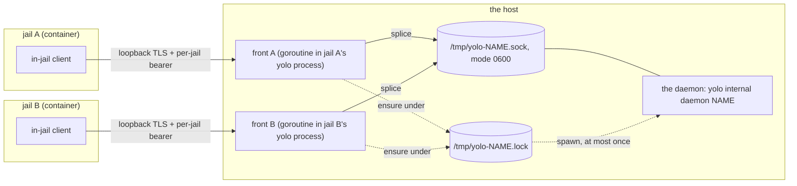
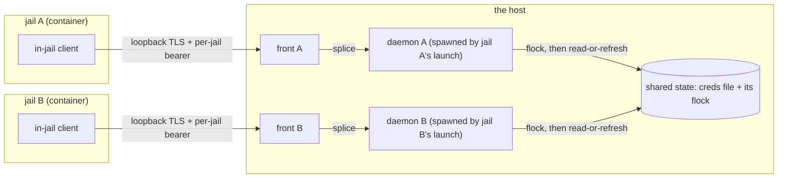

# No singleton: a host-side daemon belongs to the jail that asked for it

**Status:** DESIGN, 2026-09-20 — four questions still owe a ruling ([OQ-HD4](#OQ-HD4), [OQ-HD5](#OQ-HD5), [OQ-HD9](#OQ-HD9), [OQ-HD10](#OQ-HD10)), and **NOTHING IS BUILT.** The central ruling is in: retire
`host_daemon.scope: "host"` and give every host-side daemon the lifetime of the jail that
asked for it. Nothing in the tree has changed. One earlier ruling IS built — the
management surface ([§5.1](#51-the-management-surface-one-verb-over-the-host-scoped-set))
— and what it manages is the singleton this ruling retires, so it is the one part of this
doc that needs rework rather than deletion ([§5.2](#52-what-the-ruling-deletes-from-that-table)).
Evidence verified against `af988566` except where a later date is stated; the measurements
taken for the ruling are dated 2026-09-20 and marked.

> [!WARNING]
> **Nothing below describes a change that exists.** `ScopeHost` is still in
> [`enums.go`](../../internal/loopholedecl/enums.go), `rg -n '"scope": "host"' packs/`
> still returns the declaring manifests, and `startHostSingleton` still runs on every
> launch. Sections headed **Today** describe the built tree and stay true until somebody
> builds this. Sections headed **Under the ruling** are a decision with no implementation
> plan behind it. If you are here to find out what your machine does right now, read only
> the **Today** halves.

> **In short.** The scope rests on a premise that is false in the code. `ScopeHost`'s own
> doc comment says the Claude OAuth broker "holds the flock that stops two jails burning
> the same single-use refresh token, so a second copy of it is not a second daemon, it is
> the race the loophole exists to prevent". That flock is `oauthbroker.RefreshLockPath`,
> derived from `BrokerDir()` and therefore from `$HOME` alone — so **N brokers in one home
> take the same kernel lock**, and the second arrival reads what the first one wrote. The
> other host-scoped daemons serialize the same way. The singleton therefore buys no
> safety a per-jail daemon does not already have, and it costs everything this doc spent
> its questions on: a process nobody owns, a rendezvous with no version in it, and a
> management surface for a thing with no owner to manage it.

**Why it matters.** Every genuinely hard case in this area was a consequence of one
condition: a process outliving the build that started it. Per-jail **deletes** that
condition rather than managing it. A launcher-spawned child is one build by construction,
so the alive-but-incompatible standoff, the capability stamp that detects it, the
two-yolo-versions standoff, the idle-singleton reaper and the free-declaration question
stop being representable instead of getting answers.

**What the ruling does not buy, and it is the one thing the singleton did:** keeping the
shared credential fresh when **no jail is running**. That is a lifetime problem, not a
locking one, and it is [OQ-HD9](#OQ-HD9) — the question that decides whether this ruling
is complete on its own.

**Needs your ruling:** [OQ-HD4](#OQ-HD4) (the reclaimer's hard kill), [OQ-HD5](#OQ-HD5) (silent mid-session death), [OQ-HD9](#OQ-HD9) (**new** — who keeps the shared credential fresh with no jail running), [OQ-HD10](#OQ-HD10) (**new** — what serializes spawn on macos-user, the one objection the ruling did not answer).

**Reads with:** [`host-daemon-ownership-plan.md`](host-daemon-ownership-plan.md) (the
implementation sketch — ⚠ **now wrong in a specific way**: its entries are parked against
questions this ruling dissolved, and its largest entry plans a version in the rendezvous),
[`../reference/loophole-transport.md`](../reference/loophole-transport.md) (**the
authority** for `scope`, the ensure-under-flock model, the teardown asymmetry and the
stale-daemon warning — all of which describe the built tree and none of which this ruling
has changed), [`broker-as-a-pack.md`](broker-as-a-pack.md) (where `scope: "host"` was
invented, on the premise [§1.1](#11-the-premise-the-scope-was-built-on-is-false)
refutes), [`../reference/loophole-system.md`](../reference/loophole-system.md)
(activation, the origin gate, what a pack may declare),
[`../research/claude-oauth-refresh-mechanics.md`](../research/claude-oauth-refresh-mechanics.md)
(the refresh mechanics, including the sentence that says two brokers cannot race).

---

## Defined terms

Four words do the work here, and two of them are the tree's, not mine.

- **Host-wide daemon**, equivalently **singleton** — the one process per host serving every
  jail on it, declared by `host_daemon.scope: "host"` in a loophole manifest. Not a
  per-jail daemon, which is spawned and reaped with the jail that asked for it. The
  vocabulary is [`enums.go`](../../internal/loopholedecl/enums.go)'s (`ScopeHost` /
  `ScopeJail`, 2026-08-19). **This is the thing the ruling retires**, so after it the word
  is history rather than architecture.
- **Front** — the authenticated loopback-TLS listener yolo runs in front of a daemon's
  AF_UNIX socket, one per jail, publishing an endpoint file carrying that jail's bearer
  token. Not a proxy with a policy: it splices bytes and prepends a connection preamble.
  From [`../reference/loophole-transport.md`](../reference/loophole-transport.md).
- **Ensure** *(the tree's word, in [`enums.go`](../../internal/loopholedecl/enums.go))* —
  ask for a daemon to exist, idempotently: check liveness, and only if it is absent take a
  host-wide flock and spawn one. The deliberate contrast is with **spawn**, which always
  starts a process. Neither implies supervision. **Under the ruling every ensure becomes a
  spawn**, which is the whole mechanical content of the change.
- **Detached straggler** *(this doc's word, new with the ruling)* — a host-side daemon
  still finishing an upstream request after the jail that spawned it has gone. Deliberately
  not an orphan in the reaper's sense: it is bounded by its own upstream deadline, it
  completes work the next jail wants, and nothing is supposed to hunt it
  ([§1.3](#13-the-disposition-detach-do-not-drain-do-not-reap)).

---

## 1. The ruling

**Retire `host_daemon.scope: "host"`. A host-side daemon is spawned by the launch that
wants it, serves that jail, and ends with it.** Maintainer's call, 2026-09-20; recorded in
the ledger as [`HD-R1`](#HD-R1).

The rest of this section is why, and it is three findings and a disposition. It replaces
what used to stand here — *"nobody is the supervisor"* — which was true, is still true of
the built tree, and stops being interesting the moment a daemon has the lifetime of the
process that started it.

### 1.1 The premise the scope was built on is false

`ScopeHost`'s doc comment records exactly one reason for the key to exist: ONE loophole
"cannot be spawned per jail at all", because "the Claude OAuth broker holds the flock that
stops two jails burning the same single-use refresh token, so a second copy of it is not a
second daemon, it is the race the loophole exists to prevent"
([`enums.go`](../../internal/loopholedecl/enums.go)).

Read against the code, that sentence conflates a lock with a process. READ 2026-09-20:

| Daemon | The lock it serializes on | What that path is a function of |
| :--- | :--- | :--- |
| `claude-oauth-broker` | `oauthbroker.RefreshLockPath` — set in `oauthbrokercmd.go` to `refresh.lock` under `BrokerDir()` | **`$HOME`** (or the test-only `YOLO_BROKER_STATE_DIR`). Not the process, not the jail, not the launch |
| `openai-auth-broker` | `openaiauth.Broker.LockPath` — `refresh.lock` beside the state file, wired in `openaiauthdaemon/main.go` | the state path the daemon was given |
| `aws-auth` | `awsauth.LockFileName`, `mint.lock` | the state dir — the constant's own comment says it is kept "BESIDE the state file so every process that can write the cache contends for the same inode" |

A flock is a kernel object on an **inode**. Every process that opens the same path
contends for the same lock whether it is one daemon, two, or twenty; the daemon's
singularity is not what serializes anything. And the serialization is not incidental, it
is defensive on both of the first two:

- `oauthbroker.withRefreshLock` treats a failed `Flock` as a **hard error** rather than
  proceeding unlocked, with the reason in the code: proceeding "would let concurrent jails
  burn the token".
- `oauthbroker.DoRefresh` re-reads the credentials file **inside** the lock and returns the
  cached tokens when they still have headroom. So the second arrival of a concurrent pair
  redeems nothing — it reads what the first one wrote. That is a cache hit, not a race.
- `openaiauth.Broker.withLock` wraps `Refresh`, `Replace` and `Logout` alike, and the
  upstream redemption happens **inside** the closure, not around it.

The repo already said this plainly, in the research doc that produced the broker's design:
*"this race is already mitigated by the broker holding the `REFRESH_LOCK` flock … Two
brokers can't race; two jail Claudes' in-memory caches can."*
([`../research/claude-oauth-refresh-mechanics.md`](../research/claude-oauth-refresh-mechanics.md).)
Note which race that leaves standing: **in-jail client caches**, which one host daemon does
not fix either.

> [!NOTE]
> This is [§6](#6-the-failure-modes)'s mode-2 lesson happening to the scope itself. A
> comment stating a premise is a claim with an expiry date and no alarm on it — and here
> the premise was not even true when it was written, because the flock it appeals to was
> already keyed by a path.

### 1.2 The credential-boundary story is also false

The second thing a reader assumes is that host-sidedness keeps the refresh token away from
the jail. MEASURED inside this repository's own jail, 2026-09-20:

- `/home/agent/.claude-shared-credentials` appears in `/proc/mounts` as **`rw`**.
- The `.credentials.json` inside it carries a real `refreshToken`, and `test -w` on it
  **succeeds** from in-jail. (Field names only; no values were read out of it.)
- `/etc/hosts` in the jail pins `platform.claude.com` to `127.0.0.1`.
- The broker returns the rotated `refresh_token` across the boundary anyway — that *is*
  `DoRefresh`'s success shape.

So the jail is not held off the credential by the daemon's placement. It is held off the
real token endpoint by a **name pin in `/etc/hosts`** — a resolution decision, not a
capability boundary.

**What genuinely forces host-side**, then, is three things, and none of them is a count:

1. **The lock has to land where every backend agrees on the inode** — and this is the
   load-bearing one, measured 2026-09-20 against Claude Code 2.1.278. Claude takes its own
   cross-process refresh lock, `acquireOAuthRefreshLock`, at
   `<configDir>/.oauth_refresh.lock` with **`realpath:!1`**. yolo scopes `.claude` per
   workspace and `.claude-shared-credentials` per machine, so the lock sits on a per-jail
   inode while the file it protects is shared, and the disabled symlink resolution
   guarantees it can never follow through. **Sharing the lock directory too is not the
   fix**: it would work on podman, where both sides are binds of one host inode, and only
   there — each `container` jail is its own VM, and `macos-user` has no mounts at all. A
   host-side mediator reached over a **socket** is backend-independent; a shared-file lock
   is not. See [`agent-credentials.md`](../reference/agent-credentials.md#the-claude-oauth-broker).
2. **Lifetime.** Something must be able to refresh when no jail is running. A per-jail
   daemon cannot, by definition. This is the ruling's one real cost and it is
   [OQ-HD9](#OQ-HD9).
3. **The hostname pin.** The in-jail TLS terminator exists *because* the jail's resolver
   sends `platform.claude.com` to loopback; the far end of that hop has to sit somewhere
   the pin does not apply, which is the host.

A per-jail **host-side** daemon satisfies both of those: it runs on the host, and it dies
with the jail. "Host-side" and "one per host" were never the same requirement.

### 1.3 The disposition: detach, do not drain, do not reap

Three dispositions come with the ruling, and each one answers an objection that was raised
against an earlier form of it ([§1.4](#14-what-was-refuted-and-what-was-not)).

**Teardown does not wait — it detaches.** Today a per-jail host service is torn down by
`killServiceGroup`: `SIGTERM` to the process group, wait `serviceTermGraceDefault`, then
`SIGKILL` the group ([`loopholesruntime.go`](../../internal/cli/run/loopholesruntime.go)).
A drain-on-shutdown grace long enough to cover a mid-flight refresh would have to exceed
the upstream deadline, and each host-scoped daemon carries a **thirty-second** one
(`oauthbroker.httpClient`'s `Timeout`, `openaiauthdaemon`'s client, `awsauth.Minter`'s
`timeout()`) — so every jail exit would wait on somebody else's network call. The ruling
refuses that trade in the other direction: **do not wait.** A refresh that was in flight
when the jail ended is allowed to finish in the background, write the shared credentials
file, and exit. *That write is the outcome we want*: it was going to be interrupted
otherwise, and completing it leaves the next jail warm.

**Nothing reaps the straggler.** It finishes its work and exits on its own, and the window
is bounded by that same thirty-second deadline. No pgrep-by-argv, no PID file to hunt, no
`/proc` walk. A reaper here would be all of the cost of [OQ-HD6](#OQ-HD6) with none of its
motive.

**The residual worry is a process stuck holding the flock forever, and per-jail does not
make it more likely.** It is worth naming because it is real: a wedged holder of
`refresh.lock` blocks the next refresh for everyone in that home. But a wedged *singleton*
blocks every jail on the machine too, and is strictly worse — it is long-lived by design,
owned by nobody, and nothing observes it. A wedged straggler is at least attributable to
one jail and one moment. Killing a stuck lock holder is a thing a human may have to do
under either design; the ruling does not change the frequency and removes the worse variant
of the victim.

### 1.4 What was refuted, and what was not

An earlier form of this ruling was argued against on three fronts. The reframe above
answers two of them. **It does not answer the third, and that is carried as a live
question rather than absorbed** — a ruling's momentum is exactly what buries the objection
it did not handle.

| Objection | The answer | Status |
| :--- | :--- | :--- |
| **Correctness:** draining on `SIGTERM` needs a grace exceeding the thirty-second upstream timeout, so jail exits would hang | Do not drain — **detach**. The mid-flight refresh was going to be interrupted anyway, and one that lands late still writes the shared file, which is the desirable outcome | **Answered** ([§1.3](#13-the-disposition-detach-do-not-drain-do-not-reap)) |
| **Operability:** an orphan whose socket was unlinked can only be found by pgrep-by-argv | Do not reap it. A detached helper finishes and exits; the window is the upstream deadline. The stuck-flock risk is not increased by per-jail, and its singleton form is worse | **Answered** ([§1.3](#13-the-disposition-detach-do-not-drain-do-not-reap)) |
| **Scope:** the spawn flock (`paths.HostSingletonLock`, guarding socket ownership and process identity) is a **different lock** from the refresh flock. Deleting `ScopeHost` leaves nothing serializing spawn on macos-user, where per-jail identity is really per-**workspace** | **Not answered.** It narrows — two launches on one workspace already share the home overlay and the `.yolo/` state dir, so this is the sharing that already exists there rather than a new class — but narrowing is not answering | **LIVE: [OQ-HD10](#OQ-HD10)** |

VERIFIED for that third row, 2026-09-20: `macosuser.cnameFor` is `cnameFn`, which defaults
to `runtime.FromWorkspace`; `FromWorkspace` resolves the path and hands it to
`FromResolved`, whose frozen contract hashes **the resolved workspace path** and nothing
else. So on macos-user a "per-jail" daemon is per-workspace-path, and two launches on one
workspace are one identity.

**And a per-workspace launch lock already exists, which narrows the objection again without
closing it.** `run.AcquireWorkspaceLockFor` takes an exclusive flock on
`<GlobalStorage>/locks/<cname>.lock`, and its doc comment names macos-user as its one
caller outside the run package, for this exact reason: "that backend has no attach, so two
launches on one workspace really do run two stages; the container serialises the same
window with the same lock and then attaches instead"
([`flock.go`](../../internal/cli/run/flock.go)). Two things stop that from being the
answer, and both are in the same comment: the lock is taken around **provisioning**, not
around a daemon's life, and a lock it cannot take **warns and returns a no-op release**,
because "a workspace lock is a courtesy against a self-inflicted race and not a safety
property worth refusing a launch over". A courtesy lock is a different object from
`paths.HostSingletonLock`, which owns a socket. [OQ-HD10](#OQ-HD10).

---

## 2. The picture

### Today (built)



The diagram is half the answer. The other half is that the boxes have different lifetimes,
and that is the design:

| Thing | One per | Born | Dies | Who owns it |
| :--- | :--- | :--- | :--- | :--- |
| the daemon | host, per loophole name | the first launch that wants it and finds none alive | a human kills it, an upgrade path replaces it, or the host reboots | **nobody** |
| its socket, PID file and lock | host, per loophole name | with the daemon | cleared by the next spawn, or by a kill | nobody |
| its capability stamp | host, per loophole name | written **only when yolo itself spawns** | removed by a kill | nobody |
| its log, `host-service-<name>.log` | host, per loophole name | first spawn | never — append-only, **no rotation** | nobody |
| the front | jail | at launch, once the daemon's socket answers a connect | when the jail ends: `stop()` closes the front and nothing else | that jail's `yolo` process |
| the endpoint file + bearer token | jail | when the front binds | unlinked by the front's `Close` | the front |

> [!IMPORTANT]
> **A jail ending cannot reach a host-wide daemon, and that is ruled rather than
> accidental.** The teardown sweeps by the jail's own hash — `retireFrontSockets` globs
> `/tmp/yolo-front-<8hex>-*.sock` — and a singleton's socket is keyed by the loophole name,
> so it is unreachable from there *by construction* rather than by a check somebody has to
> remember ([`loopholesruntime.go`](../../internal/cli/run/loopholesruntime.go),
> `retireFrontSockets`; [`paths.go`](../../internal/paths/paths.go), `JailShortHash`). The
> reason is stated in
> [`../reference/loophole-transport.md`](../reference/loophole-transport.md): doing
> otherwise cuts every other live jail off its credential path.

Two asymmetries in that table are places where the host half is thinner than the jail half:

- **The stamp is written on spawn, not on observation.** A daemon already alive when this
  build ensured it is never re-stamped, so the stamp answers "did a build like mine *start*
  this?" and nothing else.
- **The log has no rotation.** The in-jail supervisor rotates each daemon's log once at
  5 MB ([`supervisor.go`](../../internal/supervisor/supervisor.go), `openLog`). A host
  daemon's log is opened `O_APPEND` and never touched again
  ([`brokerlifecycle.go`](../../internal/broker/brokerlifecycle.go), `realSpawn`) — and a
  *per-jail* host daemon's log is additionally shared by every jail running that loophole:
  one file, N writers.

### Under the ruling (not built)



**The sharing moves from the process to the state, which is where it always actually was.**
Two daemons, one credentials file, one flock on it — which is exactly the arrangement
[§1.1](#11-the-premise-the-scope-was-built-on-is-false) measured the code already
implementing. Every row of the lifetime table above collapses into one: each daemon, its
socket, its log and its front are born at launch, owned by that jail's `yolo` process, and
die with the jail — except for a detached straggler, which is a bounded exception with a
stated disposition rather than an unowned process.

---

## 3. The rendezvous is a name and a flock

### Today (built)

The entire coordination protocol between N jails and one daemon is a set of `/tmp` paths
derived from the loophole's name and nothing else, plus one blocking `flock`:

```text
/tmp/yolo-<name>.sock              the daemon binds it (0600, chmod'd after an 0o077 umask)
/tmp/yolo-<name>.pid               the spawner writes it
/tmp/yolo-<name>.lock              the spawner flocks it, LOCK_EX, blocking
/tmp/yolo-<name>.pid.capability    the wire-contract stamp
```

The sequence, every time any launch wants the daemon
([`brokerlifecycle.go`](../../internal/broker/brokerlifecycle.go), `BrokerSpawn`):

1. Open and `flock(LOCK_EX)` the lock file — blocking, so a concurrent launch waits rather
   than races.
2. Run the loophole's one-time state migration if it declares one, *inside the lock*.
3. Re-check liveness. The loser of the race observes the winner's daemon and returns
   without spawning.
4. Clear a stale socket, spawn detached (`setsid`, stdout and stderr to the shared log),
   write the PID file and the stamp.
5. Poll for the socket to appear — 5 s deadline, 50 ms interval — reporting immediately if
   the child has already exited, which separates "dead" from "slow" in milliseconds.

**Liveness is a four-way conjunction** — PID file present, PID alive, socket present,
socket accepts a connect — and that conjunction, not `/tmp` being cleared, is what makes a
host reboot safe: a PID file naming a number some unrelated process has since been assigned
still fails the accept.

**What the name-keyed path buys.** One rendezvous every party agrees on without
negotiating: two `yolo` processes launching two different jails at the same instant contend
for the same lock, every front splices to the same socket, and `yolo broker` and
`yolo check` inspect the same PID file. The framework owns those paths, not the manifest —
a manifest naming its own host-wide socket would be a host path claim yolo would then have
to gate, and two manifests could name the same one
([`paths.go`](../../internal/paths/paths.go), `HostSingletonSocket`; ruled in
[`broker-as-a-pack.md`](broker-as-a-pack.md)). The name itself is pinned to the loophole's
directory name at load ([`loopholedecl.go`](../../internal/loopholedecl/loopholedecl.go),
`walk`), which keeps it a path *component* rather than a path.

**What it costs.** The path has exactly one input, so it can carry no other fact — not a
version ([§4](#4-the-version-boundary-that-is-not-there-and-why-it-stops-applying-here)),
not a user, and not a client set, which is the real reason there is no reaper: the daemon
has no idea which jails are using it and there is nowhere to record it, so the predicate a
reaper would need does not exist.

### Under the ruling (not built)

**There is no new rendezvous to design, which is most of the argument for the ruling.** A
per-jail host service already has one: its upstream socket lives in the jail's own
host-services directory, keyed by `paths.JailShortHash` of the container name, and the
front over it publishes the per-jail endpoint file. The spawner is the launch, so the
parties never have to find each other — one process spawns the other and holds its
`exec.Cmd`.

What survives is the **state** rendezvous, deliberately: the credentials file and the flock
beside it, which are keyed by the home or the state dir and shared by every daemon in that
home. That is the sharing the design is actually about
([§1.1](#11-the-premise-the-scope-was-built-on-is-false)).

Two residues worth naming, because a reader will otherwise assume they vanished:

- **Per-jail identity is per-workspace-path, not per-launch.** `runtime.FromResolved`'s
  frozen contract hashes the resolved workspace path, so two launches on one workspace
  share a name — and on macos-user that is the identity a daemon would be keyed by.
  [OQ-HD10](#OQ-HD10).
- **`/tmp`-collision between two users on one host** stops applying to the *name-keyed*
  paths, since per-jail paths already carry a hash of the workspace. It does not stop
  applying to two users launching the **same workspace path**, and it never applied to the
  state dir, which is under each user's `$HOME` already. That is the surviving fragment of
  the old [OQ-HD8](#OQ-HD8), and it belongs to [OQ-HD10](#OQ-HD10) now.

---

## 4. The version boundary that is not there, and why it stops applying here

This section used to be the organising claim of the whole doc: *start here*. **The ruling
dissolves its subject, and the argument it makes is still correct and still general**, so
it is kept and re-aimed rather than deleted. The claim, unchanged:

> **A seam where a PROCESS OUTLIVES THE BUILD that started it needs a version, and a
> rendezvous derived from a name carries none.** Two versions of yolo — or one yolo and one
> daemon it started months ago — meet at a path derived from a name, each assuming the
> other matches, and every mechanism that exists to cope is a patch applied *after* they
> have already met.

### What the ruling does to it

**It removes the seam rather than answering the question.** Under the ruling a host-side
daemon is spawned by the launch that uses it, so the `yolo` that talks to a daemon is the
`yolo` that started it: **one build, by construction**. There is no second build for a
version to tell apart, no path at which two builds meet, and therefore no version to put
anywhere. The old [OQ-HD1](#OQ-HD1) — *should a daemon rendezvous carry a version?* — has
no subject left.

That is also why the alternative was worse. A wire-contract generation in the rendezvous
path would have made the incompatible pair unrepresentable, which is the shape this repo
prefers; but it does so by **multiplying daemons on purpose** across every upgrade, with
nothing to reap the ones it strands. That is the singleton's own defect, compounded, which
is why [OQ-HD1](#OQ-HD1) was blocked on [OQ-HD6](#OQ-HD6) and why both dissolve together.

### Testing it (still true of the built tree)

Three version numbers exist in this system. **None of them is in a rendezvous**, and the
places they do sit explain exactly which failures are catchable and which are not:

| Version | Where it sits | What it can decide |
| :--- | :--- | :--- |
| `PreambleVersion = 1` ([`preamble.go`](../../internal/svcendpoint/preamble.go)) | the first frame *inside* an established connection | the daemon rejects a `v` it does not know — after the jail has launched, per connection, invisible to the launcher |
| `frameproto.ProtocolVersion = 1` | the wire, per request | the same, one layer in |
| the manifest's `"version": 1` | the declaration on disk | **nothing** — it is the schema's version, recognized so the strict decoder accepts it and deliberately not enum-checked ([`loopholedecl.go`](../../internal/loopholedecl/loopholedecl.go)) |

So the one version an author can write is the one nothing consumes, and the two that are
consumed can only speak once the two parties are already connected. **The capability stamp
exists precisely because of that gap** — it is a fourth, ad-hoc version living *beside* the
rendezvous rather than in it, carrying one bit (`fronted-preamble-v1`), written only when
yolo itself spawns. Under the ruling the stamp has nothing left to detect.

### What the absence produced, and which of it the ruling retires

Every one of these is an upgrade artifact, and each exists because two builds had to meet
at a path that could not tell them apart. The right-hand column is the ruling's effect —
**none of it is built**, and the jail-side rows are untouched by it because the jail side
has its own instance of the same problem ([§7](#7-the-jail-side-has-a-supervisor-and-the-ruling-borrows-its-lifetime-but-not-its-owner)).

| Artifact | The upgrade it survives | Where | Under the ruling |
| :--- | :--- | :--- | :--- |
| the capability stamp | the broker moving behind a front, 2026-08-19 | [`brokerlifecycle.go`](../../internal/broker/brokerlifecycle.go), `SingletonSpeaksPreamble` | nothing left to detect |
| "we do not kill it" | **two yolo versions on one host**, which is the standoff itself | same | the standoff stops existing |
| `BrokerConsoleName` as a second pgrep pattern | the daemon ceasing to be a standalone binary; kept "for one release" | same, `RealPgrepStrays` | unchanged — a stray-hunt is about the past, not the design |
| `ensureSingleton`'s kill-and-replace | a live singleton predating the private host socket | [`host.go`](../../internal/openaiauthhost/host.go) | no singleton to replace |
| `PrepareLocked` | one released build that passed a literal `{state}` path | [`openaiauthmigration.go`](../../internal/cli/run/openaiauthmigration.go) | survives — it migrates **state**, which stays shared |
| `legacySupervisorPIDFiles` | the supervisor binary being renamed to `yolo-jaild` | [`runtime.go`](../../internal/entrypoint/runtime.go) | untouched: jail side |
| the `/proc` orphan reclaimer | a supervisor that died without its children | same | untouched: jail side |
| the retired-transport migration hints | `unix-socket` and `tls-intercept` being removed as values | [`enums.go`](../../internal/loopholedecl/enums.go), `retiredTransportHint` | ⚠ **the shape to copy**: retiring `scope: "host"` is exactly this kind of removal, and a manifest still declaring it should be told what to write instead |
| `ReapRelayOrphans`, kept for one release | the per-jail relay's deletion | `internal/prune` | unchanged |

### Where the claim still applies

The claim is general and the repo has exactly one place that honours it:
`version.SourceSkew` ([`srcskew.go`](../../internal/version/srcskew.go)) compares the host
binary's ldflags commit stamp against the tree's HEAD and **refuses the launch** when they
disagree. The difference between that seam and a daemon seam is the whole reason one got a
boundary and the others did not:

- At the launcher↔entrypoint seam, **both halves are built from a tree yolo can inspect**,
  and the older half has not started yet. Refusing is free.
- At a daemon seam, the older half is **a running process holding state and serving other
  jails**. Refusing means refusing *this* jail for the sin of a daemon somebody else's jail
  is using; killing means the restart loop. There is no free answer, which is why the
  ruling of the day ended at "warn".

**The ruling adds a third move the original claim did not consider: make the older half not
exist.** Where a process need not outlive the build, do not let it. That generalizes, and
it is the sentence to carry out of this section. It still leaves the claim standing
wherever a process genuinely must outlive its build — the in-jail supervisor across a
`just install` ([§7](#7-the-jail-side-has-a-supervisor-and-the-ruling-borrows-its-lifetime-but-not-its-owner)),
and anything [OQ-HD9](#OQ-HD9) decides to install as a timer.

---

## 5. Who may act on a host daemon

### Today (built)

Exhaustive, as of `af988566`. "Start" means ensure-or-spawn; "stop" means terminate the
process.

| Actor | Can start | Can stop | Which daemons | Notes |
| :--- | :---: | :---: | :--- | :--- |
| A launch, per host-scoped loophole (`startHostSingleton`) | yes | no | all enabled host-scoped ones | Enters the ensure unconditionally; the lock owns the concurrency |
| A launch, before the argv is built (`brokerEnsure`) | yes | no | Claude broker only | Runs early because the argv's endpoint promise depends on the socket existing |
| `yolo host-daemon restart <name>` | yes | yes | any host-scoped one it can spawn | [§5.1](#51-the-management-surface-one-verb-over-the-host-scoped-set); refuses BEFORE the kill when it has no argv |
| `yolo host-daemon stop <name>` | no | yes | any, declared or not | Needs only the name — every rendezvous path is derived from it. Next launch respawns a declared one |
| `yolo broker <verb>` | as above | as above | Claude broker only | The retained alias — `host-daemon <verb> claude-oauth-broker`, resolved from the broker's own constants so it works where discovery is empty |
| `yolo host -- codex` / `yolo host -- pi` | yes | yes | OpenAI broker only | `ensureSingleton` replaces a daemon lacking the private host socket |
| `yolo openai-auth <status\|import\|logout>` | yes | yes | OpenAI broker only | The same `ensureSingleton`. Public since 2026-09-20; the hidden `yolo internal openai-auth` is a retained alias into the same handler, so it is one actor and not two |
| A launch's one-time state migration (`PrepareLocked`) | yes | yes | OpenAI broker only | Stop → migrate → respawn, all under the lock |
| A jail ending (`stopLoopholes`) | no | **no** | — | Closes this jail's front; sweeps by jail hash, which cannot match a singleton's path |
| `yolo stop` | no | no | — | `rt inspect` then `rt stop <container>`; touches no host process |
| `yolo prune` | no | no | — | Its only `/tmp` sweep globs `yolo-broker-relay-*.pid`, a retired artifact |
| `yolo check` | no | no | reports on the Claude broker only | PID liveness + connect probe, against path literals of its own |
| `yolo loopholes status` | no | no | runs every loophole's `doctor_cmd` | Each is a fresh short-lived `--self-check` process reading state files; none touches the running daemon |
| A host reboot | no | yes, incidentally | all | Clears `/tmp`; the liveness conjunction would have handled it anyway |
| The in-jail `/proc` reclaimer | no | yes | **jail daemons only, never host** | [§7](#7-the-jail-side-has-a-supervisor-and-the-ruling-borrows-its-lifetime-but-not-its-owner) |

**Who wins when two act at once.** The lock, always — every start and both kill-and-replace
paths run inside `flock(LOCK_EX)` on the same file, and the loser re-checks liveness rather
than spawning. The one pair that is *not* serialized is `yolo host-daemon stop` against a
concurrent launch: `Stop` takes no lock, so a launch that ensured a moment earlier can have
its daemon killed out from under a front that has already published. The front then drops
every request until the next launch, and nothing detects it.

Three negatives, verified by search rather than assumed, because each is a place a reader
would otherwise stop checking:

- **Nothing reaps an idle singleton.** No refcount, no last-user record, no TTL, no idle
  timer, no GC. Every `syscall.Kill` and `Process.Kill` in the tree resolves to a per-jail
  spawned service group, the in-jail supervisor's own children, a `journalctl` child, the
  retired relay sweep, a `Kill(pid, 0)` liveness probe, or `BrokerKill` itself.
- **`yolo prune` has no opinion about host daemons.** Its removals are hash-keyed
  (`yolo-broker-relay-<hash>.{pid,lock,sock}` and the per-jail services dir) and cannot
  match a name-keyed singleton path.
- **`yolo check` reports on one of them**, behind an explicit
  `if lp.Name == brokerLoopholeName` gate — the one name-bound surface left, now that the
  management verb is derived
  ([§5.1](#51-the-management-surface-one-verb-over-the-host-scoped-set))
  ([`sections_loopholes.go`](../../internal/cli/check/sections_loopholes.go)). Its generic
  host-service liveness pass walks every loophole with a host daemon, but probes the
  *per-jail endpoint file* and returns early when no jails are running — so with zero jails
  up, the OpenAI and AWS singletons' liveness is reported by nothing at all.

### 5.1 The management surface: one verb over the host-scoped set

> [!NOTE]
> **Built 2026-09-20, and [`HD-R1`](#HD-R1) is why it needs rework rather than
> deletion.** It manages the singleton the ruling retires; what a human wants to type about
> a per-jail daemon is a different question, and [§5.2](#52-what-the-ruling-deletes-from-that-table)
> says which half of this survives. The section is kept as written because it is the
> accurate description of what the tree does today.

`yolo host-daemon {status,stop,restart,logs} [<name>]` manages every host-wide daemon, with
`yolo broker <verb>` retained as an alias meaning
`yolo host-daemon <verb> claude-oauth-broker`.

**The set is derived, and from two sources that answer different questions.**

| Source | Question it answers | What a member from it can do |
| :--- | :--- | :--- |
| The manifests, through the converged `loopholes.NewHostSet` | *What does this machine declare?* — a loophole with `host_daemon.scope: "host"` | Everything, including `restart`: the record carries the argv |
| The rendezvous, `paths.HostSingletonLock` globbed | *What has this host ensured?* | `status`, `stop`, `logs`. `restart` refuses by name and points at `stop` |

The second source is not redundant with the first, and the reason is mode 5 below: a
singleton survives the pack being deselected and the loophole being disabled, so a set
derived only from current declarations would refuse to stop the daemon a user is trying to
get rid of. Neither source is a list — nothing in the code or in this doc enumerates the
members, because an enumeration is what went stale the last two times a loophole declared
`scope: "host"` ([§8](#8-one-became-three-and-the-ruling-makes-the-population-stop-mattering)).

**A bare invocation means the SET for `status` and is refused for the other three.** `status`
reports, so with no name it reports every member and exits non-zero if any is unhealthy; an
empty set is an honest answer, reported rather than invented. `stop`, `restart` and `logs`
ACT, so with no name they refuse and print this machine's membership. An implicit target
across three daemons is how a management verb comes to act on the one nobody named.

**Every message names the daemon it is about**, including each failure path: the status
header, the unknown-name refusal, the missing-name refusal, and — the defect this ruling
exists to close — the alive-but-incompatible warning, which now prints
`broker.CycleCommand(name)`. There is one grammar rather than a switch on a loophole name,
so the sentence is right for a daemon that ships tomorrow.

> [!WARNING]
> **The scan globs the LOCK, not the PID file**, because the `/tmp/yolo-*.pid` namespace has
> other owners: `internal/entrypoint` writes `/tmp/yolo-jaild.pid` for the in-jail
> supervisor. Measured 2026-09-20 in this repo's own jail, a `.pid` scan produced a member
> called `jaild`, and stopping it would have killed the jail's supervisor. The name
> round-trips through the derivation, so a round-trip check does not catch it —
> `paths.HostSingletonLock` having exactly one writer is what does.

> [!WARNING]
> **`restart` refuses before it kills**, never after. A daemon known only from its rendezvous
> can be stopped but not started, so discovering that after the `SIGTERM` would leave the
> user with the process gone and no way to bring it back.

**The alias resolves from the broker's own constants, not through discovery**, and fills two
gaps: a name missing from the set entirely (a jail, a host whose `packs` list does not name
claude), and a name PRESENT but unspawnable — the rendezvous-only case, measured in this
repo's own jail, where taking the discovered record verbatim would refuse to restart the
broker on the very machine it is running on.

**What this did NOT change.** The daemons are still unsupervised: there is no health loop, no
restart policy and no reaper, and every row of the table above is still the whole of what can
act on one. A human verb is not an owner.

### 5.2 What the ruling deletes from that table

Not built. Each row is a consequence, not a plan.

| Row | Under the ruling |
| :--- | :--- |
| `startHostSingleton` | Gone. The loophole takes `startExternalService` like any other per-jail host service, returning a handle the teardown reaches |
| `brokerEnsure`, early | Survives in changed form. The argv's endpoint promise still depends on a socket existing, so something still runs early — but it **spawns** instead of ensuring, and what it spawns is this jail's |
| `yolo host-daemon {status,stop,restart,logs}` | ⚠ The one built thing this ruling reworks. Its *rendezvous-derived* half existed for mode 5, which dissolves; the membership question becomes "what is this jail running", which the per-jail services dir and `yolo loopholes status` already answer |
| `yolo broker <verb>` | Same: it is an alias into the verb above |
| `ensureSingleton`'s kill-and-replace | Gone. There is no live singleton to find lacking a socket |
| `PrepareLocked` | Survives. It migrates **state**, which stays shared — but "stop the daemon, migrate, respawn" becomes "migrate, then spawn", which is strictly simpler |
| A jail ending (`stopLoopholes`) | **Acquires the ability to stop its daemon — that is the whole change**, and [§1.3](#13-the-disposition-detach-do-not-drain-do-not-reap) rules what it does with it: signal, do not wait, let a mid-flight refresh finish detached |
| `yolo check`'s zero-jails blind spot | Dissolves. With no jails running there is no daemon, so "nothing to report" becomes the correct answer instead of a gap |
| The unserialized `stop`-vs-launch race | Dissolves with the verb's host-wide target |

### What the backends do differently

| Backend | Host-scoped daemons started | In-jail supervisor |
| :--- | :--- | :--- |
| podman | all enabled | yes |
| Apple Container | **OpenAI broker only** (an explicit allow filter) | yes |
| macos-user | all enabled — no filter | **none**; no `yolo-jaild` is built for darwin |

macos-user is the interesting row, and it is where [OQ-HD10](#OQ-HD10) lives: it takes the
full host half and none of the jail half, so "the host side has no supervisor" is the
*entire* supervision story there — and under the ruling it is also the backend where
"per-jail" means per-workspace-path
([§1.4](#14-what-was-refuted-and-what-was-not)).

---

## 6. The failure modes

The five modes the maintainer named, plus the one the ruling creates. **"Today" is the
built tree.**

| # | Mode | Today | Under the ruling |
| :--- | :--- | :--- | :--- |
| 1 | A daemon dies mid-session | Front stays published; every request dropped with an `unreachable` audit record; healed by the next launch | **Survives unchanged.** A per-jail daemon that dies is exactly as silent. [OQ-HD5](#OQ-HD5) stays live |
| 2 | A daemon needs restarting | `yolo host-daemon restart <name>` ([§5.1](#51-the-management-surface-one-verb-over-the-host-scoped-set)); the OpenAI one also has an implicit kill-and-replace | **Survives, changed.** The restart of a jail's daemon is a relaunch of the jail; the verb's target set is the open half ([§5.2](#52-what-the-ruling-deletes-from-that-table)) |
| 3 | Alive but incompatible | Warned, never killed | **DISSOLVES.** No daemon outlives the build that spawned it |
| 4 | Two yolo versions on one host | The older daemon keeps serving; the newer yolo warns and continues | **DISSOLVES for processes**, survives as a state-format question: two builds' daemons still share one credentials file and one flock |
| 5 | A daemon nobody is using | Runs forever | **DISSOLVES.** Nothing outlives its jail except a bounded straggler |
| 6 | **NEW —** a detached straggler | not representable | A mid-flight refresh outliving its jail, bounded by the thirty-second upstream deadline, completing a write the next jail wants ([§1.3](#13-the-disposition-detach-do-not-drain-do-not-reap)) |

### Mode 1: it dies mid-session

The front publishes as soon as it binds and never re-checks upstream; a connection that
cannot dial the socket is logged, marked `CrossingUnreachable` in the audit record, and
dropped ([`front.go`](../../internal/svcendpoint/front.go), `splice`). That independence is
deliberate and stated. What is not stated anywhere is what the *jail* should learn: the
in-jail client sees a connection that opens and produces nothing, and the launch-time
reachability witness — which is **fatal**, and would have refused this jail at boot — ran an
hour ago. [OQ-HD5](#OQ-HD5).

**The ruling does not touch this.** A per-jail daemon that dies leaves the same published
front and the same silence; if anything it sharpens the question, because the process that
could notice — the jail's own `yolo`, holding the child's `exec.Cmd` — is right there.

### Mode 2: it needs restarting

Answered and built: the verb is
[§5.1](#51-the-management-surface-one-verb-over-the-host-scoped-set). What is worth keeping
is WHY it was a ruling rather than an oversight, because the shape recurs — and it recurred
immediately, in `ScopeHost`'s own justification
([§1.1](#11-the-premise-the-scope-was-built-on-is-false)).

**The scope EXPIRED; it was never wrong.** The lifecycle engine generalized when
`scope: "host"` landed — `SingletonDeps` derives every path from a loophole name — and the
CLI did not, on a reason that was true when it was written and was recorded in the code:
"the broker is the only loophole that declares it today"
([`brokerlifecycle.go`](../../internal/broker/brokerlifecycle.go), package comment). It
stopped being true on 2026-09-15, and nothing was watching the premise. **A comment stating
a count is a claim with an expiry date and no alarm on it** — which is why the replacement
comment says not to restore one.

> [!WARNING]
> **A wrong instruction inside the sentence presenting itself as the fix is the worst place
> for one**, and that is where this landed: `startHostSingleton` interpolated the loophole's
> name into every clause of the incompatible-daemon warning and then ended
> `Fix it with: yolo broker restart` — which for `openai-auth-broker` or `aws-auth` cycles a
> different daemon and leaves the broken one running, at the moment its owner is being told
> their token refresh is silently broken. The sibling warning had already been fixed
> deliberately (`reportFailedSpawn` names the loophole from the record, "a warning that
> hardcodes one loophole's name is the half of a generalization that gets left behind") and
> this one was not. **When you generalize a mechanism, grep the strings it prints.** It is
> fixed: since [`OQ-HD2`](#11-decision-ledger) was built (2026-09-20) the command is derived
> from the name by `broker.CycleCommand`, the one place that spelling lives.

### Modes 3 and 4: alive but wrong, and two yolo versions

**Today** these are one ruling, and it was the sharpest thing in this area. A daemon started
before the loophole moved behind a front is still listening at the same path and will
consume the front's connection preamble *as the client's request*, so every request fails
while every liveness surface reports green, because every one of them is a connect-and-close.
The instrument is the stamp; the response is a warning naming the command that cycles THAT
daemon ([§5.1](#51-the-management-surface-one-verb-over-the-host-scoped-set)).

It warns and does not kill, deliberately: two yolo versions sharing one host would otherwise
take turns killing each other's daemon on every launch, trading a loud failure for an
invisible restart loop. Two facts bounded how much the stamp could do — it is **one bit, not
a version**, so it detects exactly one historical wire-contract break and no future one; and
**the no-kill ruling is not universal**, since `ensureSingleton` takes the opposite branch
for the OpenAI daemon on a different predicate
([`host.go`](../../internal/openaiauthhost/host.go)).

**Under the ruling both modes stop being representable, and so does the divergence between
those two branches** — there is no live daemon of another build to kill or to spare, so the
question of which to do has no occasion. That is what dissolves [OQ-HD3](#OQ-HD3).

**The residue is real and is worth naming, because it is the sharing the ruling keeps.** Two
builds' daemons still read and write **one credentials file** and contend for **one flock**.
A state-format change is therefore still a compatibility surface across builds, with no
version in it — exactly [§4](#4-the-version-boundary-that-is-not-there-and-why-it-stops-applying-here)'s
claim, relocated from the process to the file. Nothing in this doc designs that; it is named
in [§9](#9-what-this-doc-does-not-cover) so the next reader does not mistake the ruling for a
claim that all version skew went away.

### Mode 5: nobody is using it

**Today** nothing stops it. A singleton spawned once for a jail that ended months ago is
still running, still holding its socket, still appending to an unrotated log — through the
pack being deselected, the loophole being disabled, and every jail on the machine exiting.
The closest thing to a position anywhere is a release note observing that a broker on a host
without `claude` installed "is idle until a jail asks it for a token", which accepts the
state rather than ruling on it.

**Under the ruling this is not representable**: a daemon ends with the jail that asked for
it. That is what dissolves [OQ-HD6](#OQ-HD6) — the reaper question had no good predicate
*because* the daemon outlived every party who knew whether it was wanted, and now the party
who knows is the one holding the process handle.

### Mode 6: the detached straggler (new, and only under the ruling)

The ruling's one new object. A jail ends while its daemon is mid-refresh; the teardown
signals and **does not wait**, so the daemon finishes the upstream call, writes the shared
credentials file and exits. Four things bound it, and they are why it is a straggler rather
than an orphan:

- **Its window is bounded by a real deadline**, the same thirty seconds in each
  (`oauthbroker.httpClient`, `openaiauthdaemon`'s client, `awsauth.Minter.timeout`).
- **Its work is wanted.** The write it completes is what leaves the next jail warm; the
  alternative — interrupting it — throws away a redemption that may already have burned the
  upstream token.
- **Nothing hunts it** ([§1.3](#13-the-disposition-detach-do-not-drain-do-not-reap)), so no
  pgrep-by-argv reaper is needed and none should be written.
- **The bad case is not new.** A straggler wedged holding `refresh.lock` blocks the next
  refresh; a wedged singleton blocks every jail on the machine, permanently, and is owned by
  nobody. Per-jail does not make the class more likely — it makes each instance smaller and
  attributable.

---

## 7. The jail side has a supervisor, and the ruling borrows its lifetime but not its owner

Worth drawing beside the host side, because the contrast is the clearest statement of what
the host side lacks — and **the ruling sharpens the contrast rather than resolving it**.
Per-jail gives a host-side daemon the jail side's *lifetime*: born at launch, gone when the
jail is. It gives it no supervisor, no restart policy, no backoff and no readiness contract.
So after the ruling the sentence is: *the host side now dies at the right time and is still
owned by the process that started it and watched by nothing.*

Inside a jail, PID 1 starts `yolo-jaild supervise` exactly once, and that process **owns**
every declared jail daemon: restart policies (`always` / `on-failure` / `no`, governing a
failure to *spawn* exactly as they govern an exit) with 1 s→30 s exponential backoff;
per-daemon logs rotated once at 5 MB; a `SIGTERM`, 5 s, `SIGKILL` teardown contract; and a
readiness pipe on fd 3 on which a daemon acknowledges only once its listener and endpoint
file are live.

Two changes that landed 2026-09-20 are about **ownership across an upgrade**, which is
[§4](#4-the-version-boundary-that-is-not-there-and-why-it-stops-applying-here)'s claim asked
on the other side of the boundary — **and the ruling does not reach either of them**, because
the in-jail supervisor genuinely does outlive builds:

- **Retain, don't stack.** The guard now reads a legacy PID file name as well as the current
  one, because a running jail can retain its old supervisor across a `just install` and
  starting a second one would duplicate every service listener. Note what the bug was: the
  supervisor's rendezvous is *the PID file's name*, the name tracked the binary, and
  renaming the binary renamed the rendezvous. That is the host side's missing version
  boundary, one layer in, with the same fix shape — carry the old name too.
- **Reclaim what nobody owns.** When *both* PID files prove dead, the boot walks `/proc`,
  matches each process's full argv against the current daemon manifest, and `SIGKILL`s the
  matches.

### The reclaimer, examined

"Match by string and then `kill -9`" is a fair first reading and it sounds bad. Having read
it, I think the trade is defensible and *unrecorded*, which is a different problem. Three
things decide it.

**What bounds the blast radius.** The candidate set is one jail's own processes, and this
holds on every backend that runs the reclaimer at all:

- It runs in [`internal/entrypoint`](../../internal/entrypoint/runtime.go) — inside the
  container, reading the container's own `/proc`.
- **yolo never emits `--pid`**, on any backend, so every container gets podman's default
  private PID namespace. The podman-in-podman path forces `--userns=host` and `--net=host`
  and does **not** touch the PID namespace, so a *nested* jail still sees only its own
  processes.
- macos-user never reaches this code: it runs no entrypoint and no `yolo-jaild` is built for
  darwin.

So the match runs against a process table the jail owns entirely, and a full-argv equality
test on top of that is belt and braces rather than the only defence. `daemonCommandMatches`
additionally requires `len(argv) == len(wanted)` and every element equal apart from the
executable's directory — so a process merely holding the same port, or the same binary with
different flags, is never a match.

**Which direction it errs in.** It errs toward *not killing*, and that is the safe direction
for foreign processes and the unhelpful one for its own job. An argv that changes between
versions — the manifest's `jail_daemon.cmd` gaining a flag, say — makes the match fail, so
the orphan survives. What happens next depends on whether the daemon is readiness-gated, and
today **exactly one is** (the wire bridge, the only name in `YOLO_JAIL_DAEMON_READY_NAMES`):

- **Readiness-gated:** the successor cannot bind, signals `failed`, and the boot **refuses
  the jail** naming the bind conflict. Loud, and correct.
- **Not gated** (the OAuth terminator and the two credential adapters, on fixed ports 1460
  and 1461): the successor cannot bind, the restart policy retries 1 s→30 s forever into a
  log nobody reads, and **the jail's client reaches the orphan instead** — the previous
  launch's daemon, wired to the previous launch's endpoint. That is the host side's
  alive-but-incompatible failure reproduced inside the jail, and it is silent.

**What `SIGKILL` costs.** Nothing that I can find, and this is checkable rather than a
judgement. The four jail daemons are all request-scoped forwarders whose authoritative state
is host-side: the OAuth terminator, the OpenAI refresh adapter and the AWS credential adapter
hold nothing across a request, and the wire bridge's only artifact is an endpoint file
published temp-and-rename on bind, which its successor overwrites. The only non-test writes
in any of them are that endpoint file and an append-only log. The reclaim also runs *before*
the supervisor starts, so nothing in the jail is mid-request when it fires.

The honest summary: **a hard reclaim is the right call for these four daemons, for a reason
that is a property of these four daemons and is written down nowhere.** A fifth jail daemon
that buffers anything would make it a defect, and nothing would catch that.
[OQ-HD4](#OQ-HD4).

> [!IMPORTANT]
> **Read this beside [§1.3](#13-the-disposition-detach-do-not-drain-do-not-reap), because the
> two rulings look contradictory and are not.** Here a straggler is `SIGKILL`ed on sight;
> there one is deliberately left to finish. The discriminator is the property this section
> just established: these four **jail** daemons are request-scoped forwarders holding no
> unflushed state, so interrupting one costs nothing. A host-side credential daemon
> mid-refresh is the exact opposite — its in-flight work has an upstream side effect worth
> completing. Same word, two populations, opposite right answers. [OQ-HD4](#OQ-HD4) is about
> making that property a stated requirement rather than an observation, which is precisely
> what would keep the next reader from "fixing" one of these to match the other.

> [!NOTE]
> A failed reclaim is **fatal**: `startJailDaemonSupervisor` runs under `genStep`, and an
> accumulated generator failure refuses the jail with "refusing to start the jail". So a
> `SIGKILL` that does not take within the 1 s poll, or a `/proc` that cannot be read, stops
> the boot rather than degrading it.

---

## 8. One became three, and the ruling makes the population stop mattering

### Today (built)

| Loophole | Pack | Host-scoped since |
| :--- | :--- | :--- |
| `claude-oauth-broker` | `claude` | the concept — the `scope` key was invented for it, 2026-08-19 |
| `openai-auth-broker` | `openai-auth` | 2026-09-15 |
| `aws-auth` | `aws-auth` | 2026-09-18 |

The derivation, so this table cannot be the authority:
`rg -n '"scope": "host"' packs/`.

**What is already bounded**, and deliberately:

- **A config entry can never be host-scoped.** `discover.go` spells `Scope: ScopeJail` for a
  config-inline loophole rather than leaving it to the zero value, because "ensure this"
  would mean yolo declining to start a process the config asked it to start
  ([`discover.go`](../../internal/loopholes/discover.go)). So `scope: "host"` is a
  **pack-only** declaration.
- **`scope: "host"` requires `publishes: "socket"`**, refused at load rather than
  documented, because an endpoint file carries one jail's bearer token — a host-wide daemon
  publishing one would hand every jail the same credential
  ([`loopholedecl.go`](../../internal/loopholedecl/loopholedecl.go), `parseHostDaemon`).
- **The declaration is behind the origin gate**, and the host execution is disclosed at the
  spawn boundary before the daemon starts.

**What is not bounded.** Given a pack the user selected, `scope: "host"` is a free
declaration: no second gate, no cap, and — the part that matters most — **no place where the
set is enumerated, so nothing notices when it grows.** The evidence is that the last two
additions left three documents wrong, each in the direction of understating what runs on the
machine. All three were **corrected to the built tree on 2026-09-20** (`5ce66cc1`), the day of
the ruling, so this table is now a record of what the growth cost, not a list of open defects:

| Doc | What it says | Why it is wrong now |
| :--- | :--- | :--- |
| [`../guides/loopholes.md`](../guides/loopholes.md) | the manifest schema census showed `host_daemon` with `cmd`, `env`, `publishes`, `request_end` | **`scope` was absent** — the author-facing schema did not document the key that creates a host singleton. It now has a `host_daemon.scope` section and the `rg` that derives the set |
| [`../reference/agent-credentials.md`](../reference/agent-credentials.md) | a current-values table naming the `scope: "host"` daemons | listed two; `aws-auth` now has its row |
| [`../guides/USER_GUIDE.md`](../guides/USER_GUIDE.md) | the host-service Lifecycle list: "When the container exits, yolo sends `SIGTERM` to each service, waits 5 seconds, then `SIGKILL`" | had no host-scope carve-out; it now says a host-scoped daemon is exempt |

### Under the ruling (not built)

**The population question dissolves, and all three corrections have to be undone.** A retired `scope` means there is no host-wide set to enumerate: a pack declaring a
host daemon declares an ordinary per-jail one, whose cost is the cost the tree already
prices — a process for the life of a jail, a per-jail socket, a shared log, a front. That is
what dissolves [OQ-HD7](#OQ-HD7): "may a pack declare `scope: "host"` freely?" has no
subject once the key is gone. The 2026-09-20 corrections describe the built tree and are
right until this is built. ⚠ **Whoever builds it must revert them in the same change**: the
USER_GUIDE's host-scope exemption, the loopholes guide's `host_daemon.scope` section and the
credentials doc's host-scoped table all describe the singleton this ruling retires.

**The lesson survives the key, and is the transferable part:** nothing enumerated the set,
so nothing noticed when it grew, and the cost of a new member was whatever was still
enumerated. That is a property of free pack declarations generally, not of this one key, and
retiring `scope: "host"` removes one instance of it rather than the shape.

---

## 9. What this doc does not cover

- **How to build the ruling.** There is no implementation plan here and none elsewhere. ⚠
  [`host-daemon-ownership-plan.md`](host-daemon-ownership-plan.md) is a parking lot whose
  largest entries are parked against questions this ruling **dissolved** — one of them plans
  a version in the rendezvous — so it needs rework before anything is built from it, and it
  already says not to build from it.
- **Whether the shared credential FILE's format is a compatibility surface across builds.**
  It is ([§6](#6-the-failure-modes), mode 4's residue): the ruling keeps the state sharing
  and keeps it unversioned. Nothing here designs that.
- **The wire.** Transport, preamble, `publishes` / `request_end` and the two server shapes
  belong to [`../reference/loophole-transport.md`](../reference/loophole-transport.md).
- **Whether the endpoint variable should be emitted by predicate rather than by two
  hardcoded names.** That is a ruling of its own about *argv assembly* — what the argv
  promises a jail. [`OQ-HD2`](#11-decision-ledger) was the *management-surface* half — what a
  human can type — and deliberately did not decide it.
- **Whether a fetched pack may ship a host daemon binary** — open as
  [`OQ-BP6`](broker-as-a-pack.md#OQ-BP6).
- **What each loophole does, or whether it should exist.** Nothing here argues three
  credential daemons is too many.
- **The in-jail halves' design.** The OAuth terminator and the two adapters are jail daemons;
  their lifecycle is [§7](#7-the-jail-side-has-a-supervisor-and-the-ruling-borrows-its-lifetime-but-not-its-owner)'s.

---

## 10. Open Questions

**Live:** [OQ-HD4](#OQ-HD4), [OQ-HD5](#OQ-HD5), [OQ-HD9](#OQ-HD9) (new),
[OQ-HD10](#OQ-HD10) (new).
**Dissolved by [`HD-R1`](#HD-R1):** [OQ-HD1](#OQ-HD1), [OQ-HD3](#OQ-HD3),
[OQ-HD6](#OQ-HD6), [OQ-HD7](#OQ-HD7), [OQ-HD8](#OQ-HD8) — kept below with what dissolved
each, because a deleted question is one the next reader re-derives.

### Live

1. <a id="OQ-HD9"></a>💬 **[OQ-HD9](#OQ-HD9) (NEW, and it decides whether the ruling is complete on its
   own): who keeps Claude's shared credential fresh when NO jail is running?** This is the
   one thing per-jail genuinely cannot do, and it is the *only* surviving argument for
   host-side lifetime independent of any jail
   ([§1.2](#12-the-credential-boundary-story-is-also-false)). A credential that goes stale
   between sessions turns the next launch into a refresh on the critical path at best, and a
   re-login at worst. Candidates:

   - **An optional launchd/systemd user TIMER** owning that single job — refresh if due —
     and owning nothing else. ⚠ Not an owner of the daemons: the moment a timer supervises
     processes it reintroduces everything the ruling deletes.
   - **An at-launch catch-up refresh**: the spawning launch checks the credential's headroom
     and refreshes before the agent needs it. Costs nothing when a jail is running often;
     does nothing for the machine that sat idle for a week, which is the case that motivates
     the question.
   - **Both**, with the catch-up as the fallback when no timer is installed.

   <!-- vantage: oq id=OQ-HD9 leaning="Both, timer optional and catch-up unconditional: the catch-up is the correctness floor that needs no installation, and the timer is the optimization that makes the first launch of the week fast. Keep the timer's job to one refresh - never process supervision." -->

   _Leaning:_ **Both**, with the catch-up unconditional and the timer optional. The catch-up
   is the correctness floor and it needs nothing installed, which matters because a design
   that only works after a user runs an installer will silently not work. The timer is the
   optimization that makes the first launch after a quiet week fast, and it is exactly the
   kind of thing an OS init system is for. What I would rule hard is its **scope**: the
   timer refreshes a credential and never supervises a process, or the singleton walks back
   in through a launchd plist.

   **Answer:**
   > _(empty — fill in when decided)_

2. <a id="OQ-HD10"></a>💬 **[OQ-HD10](#OQ-HD10) (NEW, and it is the objection the ruling did NOT answer):
   what serializes spawn on macos-user, where per-jail identity is per-WORKSPACE?** The spawn
   flock (`paths.HostSingletonLock`) is a **different lock** from the refresh flock
   [§1.1](#11-the-premise-the-scope-was-built-on-is-false) is about: it guards socket
   ownership and process identity, not token redemption. Retiring `scope: "host"` removes it
   along with the thing it guarded. On macos-user there is no container to serialise
   anything, and VERIFIED 2026-09-20 `macosuser.cnameFor` → `cnameFn` →
   `runtime.FromWorkspace` → `FromResolved` hashes the **resolved workspace path**, so two
   simultaneous launches of one workspace are one identity.

   It narrows twice and vanishes neither time.

   - Two launches on one workspace already share the home overlay and the `.yolo/` state
     dir, so this is the sharing that backend already has rather than a new class.
   - A per-workspace launch flock already exists and macos-user already takes it
     (`run.AcquireWorkspaceLockFor`, [`flock.go`](../../internal/cli/run/flock.go)) — but
     VERIFIED from its own doc comment, it wraps **provisioning**, and when it cannot be
     taken it **warns and returns a no-op release**, because "a workspace lock is a
     courtesy against a self-inflicted race and not a safety property worth refusing a
     launch over". `paths.HostSingletonLock` owns a socket; a courtesy lock around a stage
     is not the same object.

   ⚠ **And the spawn flock may be doing unasked duty elsewhere**, which is a second thing
   retiring it would remove. `BrokerSpawn` holds it across the spawn *and* the
   socket poll ([§3](#3-the-rendezvous-is-a-name-and-a-flock)), so the child's
   `EnsureCAAndLeaf` mint runs inside it — a lock about socket ownership serializing a
   certificate write it was never asked to guard. (Observed in the working tree
   2026-09-20 as an in-flight change to `internal/oauthbroker`, **not landed**; the
   dependency it describes is a property of the spawn sequence at `af988566` either way.)
   Whatever replaces the flock has to answer for every such rider, not just for spawn.

   So the question is sharp rather than vague: **is the existing per-workspace courtesy
   lock enough to cover what the spawn flock covered — including the duties it was never
   asked to do — and if not, does per-jail owe macos-user a real spawn guard?**

   <!-- vantage: oq id=OQ-HD10 leaning="Measure two concurrent macos-user launches of one workspace before removing anything. The existing per-workspace lock is a provisioning courtesy that warns and continues, not a socket owner, so 'a lock already exists' is not yet an answer." -->

   _Leaning:_ **Measure before removing.** What two concurrent macos-user launches of one
   workspace do *today* is checkable and nobody has checked it. If they already collide over
   the home overlay and the state dir, the spawn flock was never doing this job and removing
   it costs nothing; if they do not, it is load-bearing on that backend and per-jail owes it
   a per-workspace spawn guard — a small thing to build and a bad thing to discover later.
   ⚠ Do not settle this by inheriting the ruling's momentum, and do not settle it with "a
   workspace lock already exists": the ruling's argument is about a *refresh* lock, this is
   a *spawn* lock, and the lock that does exist warns and continues.

   **Answer:**
   > _(empty — fill in when decided)_

3. <a id="OQ-HD4"></a>💬 **OQ-HD4: Is the reclaimer's hard `SIGKILL` a ruling or an
   assumption?** It is defensible today — the candidate set is one jail's own `/proc`, the
   match is full-argv equality, and none of the four jail daemons holds unflushed state
   ([§7](#7-the-jail-side-has-a-supervisor-and-the-ruling-borrows-its-lifetime-but-not-its-owner)).
   But it is defensible *because of a property of those four daemons* that is recorded
   nowhere, and nothing would catch a fifth that buffers. **[`HD-R1`](#HD-R1) raises the
   stakes**: it rules the opposite disposition for a host-side credential daemon, on exactly
   that property's absence, so the property is now load-bearing in two places and still
   written down in neither.

   <!-- vantage: oq id=OQ-HD4 leaning="Keep the hard reclaim and record why: state the request-scoped-forwarder property as a requirement on jail daemons, so the next one that breaks it is a declaration problem rather than a silent data loss. HD-R1 makes the same property the discriminator for detach-vs-kill, which is a second reason to write it down." -->

   _Leaning:_ Keep it. A SIGTERM-then-wait would reintroduce the indefinite wait the comment
   rejects, for daemons that provably lose nothing. What I would change is the *status* of the
   reason: "a jail daemon is a request-scoped forwarder that holds no unflushed state" should
   be a stated requirement rather than an observation, so that a future daemon that needs a
   graceful stop shows up as a declaration that does not fit — and so that the detach-vs-kill
   split in [§7](#7-the-jail-side-has-a-supervisor-and-the-ruling-borrows-its-lifetime-but-not-its-owner)
   reads as one rule applied twice rather than two contradictory ones.

   **Answer:**
   > _(empty — fill in when decided)_

4. <a id="OQ-HD5"></a>💬 **OQ-HD5: Is silent degradation until the next launch the right
   answer to a mid-session death?** The front stays published and drops every request with an
   audit record nobody reads. The launch-time reachability witness is *fatal* for exactly this
   condition — so the system refuses a jail that starts without the daemon and says nothing
   when the same jail loses it an hour later. **[`HD-R1`](#HD-R1) changes this question's
   character in a useful direction**: under the singleton the answer to "who could possibly
   know?" was *nobody* — the daemon was shared and unowned. Under per-jail the owner is right
   there, holding the child's `exec.Cmd` in the jail's own `yolo` process, so the question
   narrows to **what should it print, and to whom**.

   <!-- vantage: oq id=OQ-HD5 leaning="Degraded-until-relaunch is the right lifecycle and the silence is separable from it. Under HD-R1 the owner exists, so this stops being an architecture question and becomes a reporting one: the front knows, and now so does the process holding the child." -->

   _Leaning:_ Keep the lifecycle — a front re-ensuring on demand would put a spawn inside a
   request path, and N fronts doing it would lean on the lock for something it was not
   designed to arbitrate. But the silence is separable, and it is the part that does not match
   the rest of this tree: the front already knows, and after the ruling the process that
   spawned the daemon knows too.

   **Answer:**
   > _(empty — fill in when decided)_

### Dissolved by the ruling

Each keeps its original text. The leanings are preserved as they were written, including
where the ruling went past them — that record is the point.

5. <a id="OQ-HD1"></a>✅ **[OQ-HD1](#OQ-HD1) — DISSOLVED 2026-09-20 by [`HD-R1`](#HD-R1):
   should a daemon rendezvous carry a version?** *A launcher-spawned child is one build by
   construction, so there is no second build for a version to tell apart.*

   Today it carries a name and nothing else, which is why an incompatible daemon and a new
   yolo meet at all — and why every mechanism in
   [§4](#4-the-version-boundary-that-is-not-there-and-why-it-stops-applying-here) is a patch
   applied after they have met. A version in the path would make the standoff
   unrepresentable: a new yolo would find no daemon and start its own. This was the question
   the other seven hung off, and the one that decided whether [OQ-HD3](#OQ-HD3) stayed a
   trade or stopped existing.

   <!-- vantage: oq id=OQ-HD1 leaning="DISSOLVED 2026-09-20 by HD-R1. The leaning identified the right blocker - a versioned path strands daemons nothing reaps - and the ruling took the other exit: remove the seam instead of versioning it." -->

   _Leaning (preserved):_ The right unit is a **wire-contract generation**, not a build
   version — the same thing the stamp's single bit means today, promoted from a file beside
   the rendezvous into the rendezvous itself. What stopped me recommending it was that it
   trades one problem for another the system is worse at: each generation bump strands a live
   daemon that nothing will ever reap.

   **Answer (2026-09-20): the question dissolves — the seam is removed, not versioned.**
   > The leaning found the right blocker and the ruling took the other exit. Versioning the
   > path would have multiplied daemons across every upgrade with no reaper; per-jail makes
   > the two parties one build by construction, so there is nothing for a version to
   > disambiguate. [§4](#4-the-version-boundary-that-is-not-there-and-why-it-stops-applying-here)
   > keeps the argument, which remains correct wherever a process genuinely must outlive its
   > build — the in-jail supervisor across a `just install`, and anything
   > [OQ-HD9](#OQ-HD9) installs as a timer.

6. <a id="OQ-HD3"></a>✅ **[OQ-HD3](#OQ-HD3) — DISSOLVED 2026-09-20 by [`HD-R1`](#HD-R1):
   does the no-kill ruling still hold, now that one path already kills?** *Neither branch has
   an occasion: there is no live daemon of another build to kill or to spare.*

   [`../reference/loophole-transport.md`](../reference/loophole-transport.md) rules that yolo
   names the fixing command rather than killing a skewed daemon, because two yolo versions
   would take turns restarting each other's. `ensureSingleton` takes the opposite branch for
   the OpenAI daemon on a different predicate, and nothing reconciles them. This decided
   whether that was a second ruling or a contradiction.

   <!-- vantage: oq id=OQ-HD3 leaning="DISSOLVED 2026-09-20 by HD-R1. The reconciling sentence was correct and is now unnecessary: with no singleton, neither branch has an occasion." -->

   _Leaning (preserved):_ Both stand; what is missing is the sentence. The restart-loop
   argument is about a path that runs on **every launch**; a human typing `yolo host -- codex`
   once cannot loop, so a replace there is safe for a reason the launch path does not have.

   **Answer (2026-09-20): dissolved, and the leaning's sentence stops being needed.**
   > Both branches presuppose finding a live daemon started by a different build. Per-jail
   > makes that unreachable. ⚠ The reconciling sentence is still worth writing *until this is
   > built*, since both branches ship today and a reader meeting the second after the first
   > will still read it as a mistake.

7. <a id="OQ-HD6"></a>✅ **[OQ-HD6](#OQ-HD6) — DISSOLVED 2026-09-20 by [`HD-R1`](#HD-R1):
   should anything ever stop an unused singleton, and on what predicate?** *Nothing is
   unused: a daemon ends with the jail that asked for it, and the only survivor is a bounded
   straggler with a stated disposition.*

   Nothing does, and nothing states that as a position. The obstacle was real: the daemon does
   not know its clients, the rendezvous cannot carry that, and this repo's own rule is that a
   reaper which cannot ask declines rather than sweeping. [OQ-HD1](#OQ-HD1) made this urgent
   rather than academic — versioned paths strand daemons on purpose.

   <!-- vantage: oq id=OQ-HD6 leaning="DISSOLVED 2026-09-20 by HD-R1. The reaper had no predicate because the daemon outlived everyone who knew whether it was wanted; per-jail gives the process holding the handle that knowledge." -->

   _Leaning (preserved):_ No reaper, ruled rather than merely absent. An idle singleton costs
   one sleeping process and one socket; a wrong reaper cuts off a live jail's credential path,
   which is the one thing the whole `scope: "host"` design exists to prevent. The separable
   half is visibility.

   **Answer (2026-09-20): dissolved — the predicate exists now, and it is ownership.**
   > The reaper question had no good predicate *because* the daemon outlived every party who
   > knew whether it was wanted. Per-jail hands that knowledge to the process holding the
   > child. ⚠ The ruling explicitly does **not** replace it with a straggler reaper: a
   > detached helper finishes and exits, and hunting it by argv is the cost without the motive
   > ([§1.3](#13-the-disposition-detach-do-not-drain-do-not-reap)). The visibility half of the
   > leaning survives as ordinary per-jail service reporting.

8. <a id="OQ-HD7"></a>✅ **[OQ-HD7](#OQ-HD7) — DISSOLVED 2026-09-20 by [`HD-R1`](#HD-R1): may
   a pack declare `scope: "host"` freely?** *The key is retired, so there is no host-wide
   population to govern — a pack declaring a host daemon declares an ordinary per-jail one.*

   Today it may: selecting the pack is the whole gate, and the cost list in
   [§8](#8-one-became-three-and-the-ruling-makes-the-population-stop-mattering) is paid
   silently — including three documents that went wrong when the set grew, because nothing
   enumerates it. This decided whether the other questions were about three daemons or an
   open-ended population.

   <!-- vantage: oq id=OQ-HD7 leaning="DISSOLVED 2026-09-20 by HD-R1 - the key is retired. The transferable half survives: a free pack declaration whose set nobody enumerates grows unnoticed, which is a property of free declarations rather than of this key." -->

   _Leaning (preserved):_ Keep it free. The pack-only rule and the origin gate already govern
   the crossing, and a second gate would duplicate it. What is missing is not a gate but
   **enumeration**: nothing anywhere says "this machine now runs three daemons on your behalf,
   here they are".

   **Answer (2026-09-20): dissolved with the key — and the lesson is not about the key.**
   > Retiring `scope: "host"` leaves nothing to enumerate: the cost of a per-jail daemon is
   > the cost the tree already prices. The transferable finding survives and should be carried
   > wherever packs declare freely — **nothing enumerated the set, so nothing noticed when it
   > grew, and the cost of a new member was whatever was still enumerated.** ⚠ The three stale
   > documents in [§8](#8-one-became-three-and-the-ruling-makes-the-population-stop-mattering)
   > are wrong about the tree *today* and stay wrong until this is built.

9. <a id="OQ-HD8"></a>✅ **[OQ-HD8](#OQ-HD8) — MOSTLY DISSOLVED 2026-09-20 by
   [`HD-R1`](#HD-R1): is one user per host a supported assumption or a documented non-goal?**
   *The name-keyed `/tmp` collision goes with the name-keyed paths; what survives is two users
   on one **workspace path**, which is [OQ-HD10](#OQ-HD10)'s.*

   The rendezvous has no user component, and the ruling that put the name there argues from a
   singleton having no *jail* to be keyed by — it says nothing about users. On a host where
   two people share `/tmp`, the second one's launch cannot take the 0644 lock file, cannot
   dial the 0600 socket, and is refused by the reachability witness with a message naming the
   socket rather than the collision.

   <!-- vantage: oq id=OQ-HD8 leaning="MOSTLY DISSOLVED 2026-09-20 by HD-R1: per-jail paths already carry a workspace hash, so two users with different workspaces no longer collide. The residue - same workspace path, two users - moves to OQ-HD10. Fixing the message is still worth doing while the singleton ships." -->

   _Leaning (preserved):_ Declare it a non-goal and fix the *message*. A uid in the rendezvous
   is a small change and it would work, but it promises a multi-user-host story nothing else
   here has been designed against — the state dir, the pack approvals and the flake bundle are
   all single-user assumptions already.

   **Answer (2026-09-20): mostly dissolved; one fragment survives and moves.**
   > Per-jail paths are keyed by `paths.JailShortHash` of a container name that hashes the
   > resolved workspace path, so two users launching *different* workspaces stop colliding in
   > `/tmp` at all. The state dir was always under each user's own `$HOME`. What survives is
   > two users launching the **same workspace path**, which is the same per-workspace identity
   > question as [OQ-HD10](#OQ-HD10) and belongs there. ⚠ The leaning's message fix is still
   > worth doing while the singleton ships, since it is a one-line refusal today.

---

## 11. Decision Ledger

| ID | Ruling / Decision | Date | Settled in | Built |
| :--- | :--- | :--- | :--- | :--- |
| <a id="HD-R1"></a>[`HD-R1`](#11-decision-ledger) | **NO SINGLETON — retire `host_daemon.scope: "host"`.** A host-side daemon is spawned by the launch that wants it and ends with that jail. The scope's stated justification is false in the code: each host-scoped daemon serializes on a flock keyed by a path (`oauthbroker.RefreshLockPath` under `BrokerDir()`, openai's `refresh.lock` beside its state file, `awsauth.LockFileName`), so N copies in one home take the same kernel lock — and `DoRefresh` re-reads the creds inside the lock and returns a cache hit. The credential-boundary story is false too: the shared creds file is bind-mounted `rw` and writable from in-jail, and the only thing keeping the jail off the real endpoint is an `/etc/hosts` name pin. What genuinely forces host-side is **lifetime** and that pin, and neither requires exactly one. Disposition: **detach, do not drain** (a mid-flight refresh finishes in the background after the jail is gone — its write is wanted), **do not reap** (a straggler is bounded by the thirty-second upstream deadline). Dissolves [OQ-HD1](#OQ-HD1), [OQ-HD3](#OQ-HD3), [OQ-HD6](#OQ-HD6), [OQ-HD7](#OQ-HD7) and most of [OQ-HD8](#OQ-HD8); leaves [OQ-HD4](#OQ-HD4) and [OQ-HD5](#OQ-HD5) live, and creates [OQ-HD9](#OQ-HD9) and [OQ-HD10](#OQ-HD10). ⚠ **Does NOT answer** the macos-user spawn-serialization objection — that is [OQ-HD10](#OQ-HD10), carried live rather than absorbed | 2026-09-20 | [§1](#1-the-ruling) | ❌ **not built** |
| <a id="OQ-HD2"></a>[`OQ-HD2`](#11-decision-ledger) | **Generalize the management surface.** One verb — `yolo host-daemon {status,stop,restart,logs} [<name>]` — over the host-scoped set, derived from the `scope: "host"` declarations joined with the rendezvous files on disk, never from a list. `broker` is retained as an alias for `host-daemon <verb> claude-oauth-broker`, resolved from the broker's own constants so it survives an empty discovery. A bare invocation means the SET for `status` and is refused for the three verbs that act. Every message, including every failure path, names its daemon — which is what fixes the incompatible-daemon warning at its source. Deliberately not the endpoint-emission question ([§9](#9-what-this-doc-does-not-cover)). ⚠ **Reworked, not deleted, by [`HD-R1`](#HD-R1)**: it manages the singleton the ruling retires — see [§5.2](#52-what-the-ruling-deletes-from-that-table) | 2026-09-20 | [§5.1](#51-the-management-surface-one-verb-over-the-host-scoped-set) | ✅ |
