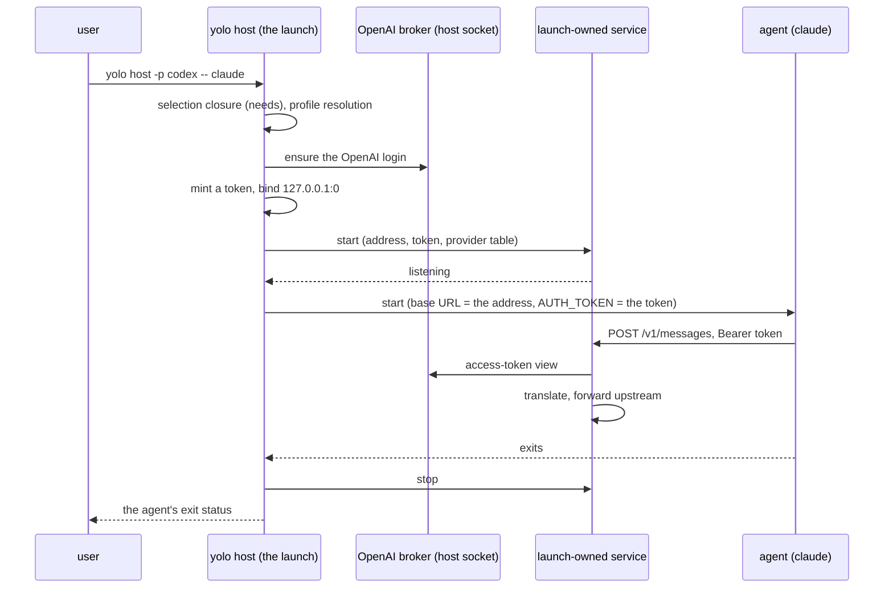

# A pack's service runs wherever its agent runs

**Status:** DESIGN, 2026-09-28. Nothing built. Evidence verified at `1baf1fd4`: MEASURED by
running a freshly built `yolo` against throwaway homes with a fake `claude` that prints its
environment ([Appendix A](#appendix-a--the-measured-runs)); code claims cite a symbol, not a line.

> **In short.** A service a selected pack needs is part of the environment description, not
> part of the jail. So `yolo host -- <agent>` should run the same pack selection a jail runs,
> `needs` included, and start each needed service that declares a host half as a child of that
> one launch: on a port the launch picks, answering only callers that carry the launch's token,
> and gone when the agent exits.

**Why it matters.** Today `yolo host -p codex -- claude` exits 0 and runs claude on the Claude
login while its status line says `codex (bridge) · host` ([§2](#2-what-the-host-does-today-measured)).

**The shape.** The jail's selection step at the host, one **launch-owned service**
([§1.2](#12-terms)) per bridged launch, and one address and token the launch hands to both.

**Cost.** A bridged host launch stays resident. The bridge grows inbound auth, which amends
[WB-D4](../reference/wire-bridge.md#wb-d4). `yolo host env` and `yolo host apply` cannot carry a
bridged profile.

**Start at [§4](#4-the-proposed-shape)**, the shape. The questions fall out of it.

**Needs your ruling:** [OQ-HS1](#OQ-HS1), [OQ-HS2](#OQ-HS2), [OQ-HS3](#OQ-HS3), [OQ-HS4](#OQ-HS4), [OQ-HS5](#OQ-HS5).

**Reads with:** [§12](#12-the-neighbors) (seven sibling docs, one line each). No implementation
sketch is open yet.

---

## 1. The verdict, and the words it uses

**Run the services at the host.** Three principles carry the design, numbered so the questions
can cite them:

- <a id="HS-P1"></a>**HS-P1. The notch changes how a declaration is delivered, never
  whether.** A selected pack's declarations are honored at every notch or refused there by
  name. This is [`declaration-parity.md` P1](declaration-parity.md#1-the-principle-and-what-it-does-not-say)
  applied to services: *"The one state that is never legal is accepting a declaration and doing
  nothing."* The measured host runs in [§2](#2-what-the-host-does-today-measured) are that state.
- <a id="HS-P2"></a>**HS-P2. A service lives as long as the launch that needed it.** No
  singleton, no reaper, no version skew between a service and its caller. This is
  [HD-R1](host-daemon-ownership.md#HD-R1), the maintainer's call of 2026-09-20 (*"A host-side
  daemon is spawned by the launch that wants it, serves that jail, and ends with it."*), read
  for a launch that has no jail.
- <a id="HS-P3"></a>**HS-P3. A listener outside a jail answers only its own launch.** The
  bridge's trust model is *"The jail is the trust boundary. If that ever stops being true, the
  bridge grows auth before it grows anything else"*
  ([`wire-bridge.md`](../reference/wire-bridge.md#what-this-does-not-license)). At the host it
  stops being true.

### 1.1 Why now

The maintainer, 2026-09-27: *"host is supposed to act like everywhere else."* And: *"1. we
don't support wire bridge on the host? that seems wrong 2. we don't support one agent profile
selection on the host? that seems wrong"*. I read the second as the per-CLI grammar,
`-p <cli>=<name>` (row 6 of the table in [§2](#2-what-the-host-does-today-measured)).

The same question was asked once before, about env: *"I don't get it, why would we NOT support
env on the host too?"* (2026-09-01, the withdrawal of [OQ-CS10](../reference/providers.md#oq-cs10),
commit `368b798f`). The charter points the same way: *"Confinement is one attribute of that
description"*, and *"Everything inside is the product"*, with host-capability bridges named in
that product ([`what-yolo-is.md`](../reference/what-yolo-is.md)).

### 1.2 Terms

- **Notch**: one setting of the confinement dial (`jail`, `guest`, `host`), defined in
  [`yolo-as-environment-manager.md` §4](yolo-as-environment-manager.md#4-confinement-a-dial-with-three-notches).
- **Service**, and its **host half**: a service is a daemon a pack contributes, *"a jail daemon,
  a host daemon, or both"*, with *"No grants, no boundary, no host state"*
  ([`wire-bridge.md`](../reference/wire-bridge.md#kind-service--the-vocabulary-it-landed-as)).
  The host half is the manifest's `host_daemon` slot on a `kind: "service"` contribution, read
  into `packdecl.ServiceHostDaemon`. It is not a loophole's `host_daemon`, which carries a scope
  and boundary grants ([WB-D16](../reference/wire-bridge.md#wb-d16)).
- **Launch-owned service** *(coined here; the adjective is [OQ-OA6](openai-auth-broker.md#OQ-OA6)'s
  "a launch-owned adapter")*: a service process that one launch starts as its own child, for the
  one agent that launch runs, on an address the launch chose, and stops when that agent exits.
  It is not a singleton, since no other process is handed its address or token. It is not a jail
  daemon, since no supervisor restarts it. It is not a loophole, since it carries no grants.
- **Bridged profile** *(coined here)*: a profile whose resolved pairing for the launched agent is
  an adaptation that a pack's own service serves. Claude on `openai-codex`, through wire-bridge's
  `openai-responses → anthropic` adapter, is one. It is not a via profile (those stay inert at
  the host, [WG-I12](wire-bridge-gateway.md#WG-I12)), and not a profile whose adapter is a
  gateway or a proxy the user runs, which the host already composes
  ([`protocol-resolution.md`](../reference/protocol-resolution.md#the-three-declarations)).

## 2. What the host does today, measured

Every run used a fresh home whose only file was the config shown, a throwaway workspace, and a
fake `claude` that prints the `ANTHROPIC_*`, `CLAUDE_CODE_*` and `AWS_*` variables it was given
([Appendix A](#appendix-a--the-measured-runs) has the output).

| # | Command | `packs` | Exit | What claude got |
| :--- | :--- | :--- | :--- | :--- |
| 1 | `yolo host -p codex -- claude` | `["claude"]` | 0 | `CLAUDE_CODE_AUTO_COMPACT_WINDOW`, `CLAUDE_CODE_DISABLE_NONESSENTIAL_TRAFFIC`, `CLAUDE_CODE_MAX_CONTEXT_TOKENS`, and nothing else: no base URL, no model |
| 2 | `yolo -p codex host -- claude`, and `yolo --at host -p codex -- claude` | `["claude"]` | 0 | the same three |
| 3 | `yolo host -- claude` with `use_profiles: {claude: codex}` | `["claude"]` | 0 | the same three, while claude's own status line prints `Opus · yolo: codex (bridge) · host` |
| 4 | `yolo host env --agent claude -p codex` | `["claude"]` | 0 | exports the same three |
| 5 | `yolo host -- claude`, no profile | `["claude"]` | 0 | none of them: the three are the codex branch's |
| 6 | `yolo host -p claude=codex -- claude` | `["claude"]` | 1 | `no profile named "claude=codex" is declared` |
| 7 | `yolo host -p codex -- claude` | `["claude", "openai-auth"]` | 1 | ES-D18's refusal, whose remedy is the jail launch `yolo -p claude=codex -- claude` |
| 8 | `yolo -p claude=codex host -- claude` | `["claude", "openai-auth"]` | 1 | row 6's refusal again, so following row 7's remedy to the host loops |
| 9 | `yolo host -p bedrock -- claude` | `["claude", "aws-auth"]` | 0 | `CLAUDE_CODE_USE_BEDROCK=1` and `AWS_CONTAINER_CREDENTIALS_FULL_URI=http://127.0.0.1:1461/credentials`, an address only a jail daemon serves |

With no base URL, claude runs on whatever login it holds. Rows 1 to 4 are
[HS-P1](#HS-P1)'s forbidden state. Rows 6 to 8 are the maintainer's two questions. Row 9 is the
trap in [HS-D1](#HS-D1): it is what every host claude launch on `bedrock` would get once the
host applies `needs`, because claude needs `aws-auth` unconditionally.

### 2.1 The five causes

1. **The host applies no `needs`.** `loadedHostPacks` in [`host.go`](../../internal/cli/host.go)
   resolves each configured entry alone. The selection closure, `packload.Selection.Close`
   ([`viaclosure.go`](../../internal/packload/viaclosure.go)), is called by the launch, `yolo
   check` and config validation, and not by `yolo host` ([WG-I8](wire-bridge-gateway.md#WG-I8):
   *"`yolo host` runs neither closure"*). The claude pack needs `aws-auth`, `openai-auth` and
   `wire-bridge` unconditionally ([`packs/claude/pack.json`](../../packs/claude/pack.json)), and
   `openai-auth` is the only pack that declares the `openai-codex` provider. The host test file
   says so itself: *"bridgeConfig lists wire-bridge explicitly: the one way it reaches the host
   notch, which runs no pack's `needs`"*
   ([`hostbridgeadapter_test.go`](../../internal/cli/hostbridgeadapter_test.go)). The one test
   that composes claude on `codex` at the host lists `openai-auth` by hand
   (`TestHostNeverTellsTheUserToListTheBridge`). The other host `-p codex` tests check the argv
   parse only (`TestHostArgumentsAcceptLeadingProfile`).
2. **The protocol gate is silent about a provider the table lacks.** `refuseUnspeakableProvider`
   ([`protocolresolution.go`](../../internal/packload/protocolresolution.go)) is *"TOTAL over the
   ways there is nothing to ask"*, *"a provider name the composed table does not hold"* among
   them, since that is also an ordinary unprofiled launch. The profile itself is declared (the
   claude pack declares `codex`), so the mandatory-declaration refusal
   ([OQ-CS6](../reference/providers.md#oq-cs6)) passes too.
3. **Claude's derive returns its constants anyway.** The `openai-codex` branch of
   [`packs/claude/derive.lua`](../../packs/claude/derive.lua) reads the base URL and the model
   list from the provider entry, finds neither, and still returns its three constants.
4. **Host `-p` is name-only.** `parseHostExecFlags` in [`host.go`](../../internal/cli/host.go)
   keeps the value whole. The run path splits `cli=name` in `applyProfileValue`
   ([`runcmd.go`](../../internal/cli/runcmd.go)).
5. **The refusal's remedy is a jail launch.** ES-D18 to ES-D20 name
   `yolo -p <agent>=<profile> -- <agent>` on a container backend
   ([ledger](credential-sources-separation.md#10-decision-ledger)). Adding `host` to it hits
   cause 4.

### 2.2 Where "no host-side bridge" and "name-only" came from

Neither is a ruling, so reopening them overturns nothing.

| Claim | Source | What kind of source |
| :--- | :--- | :--- |
| No host-side bridge | `a7860398` (2026-09-04): *"`yolo host -- claude` gets no bridged routing in v1 (the notch can adopt it later by running the same subcommand — the code having no jail dependencies is what keeps that door open, not a promise to walk through it)"*. The graduation to [`wire-bridge.md`](../reference/wire-bridge.md#what-this-does-not-license) in `cba833c3` (2026-09-09) dropped "in v1" | a non-goal of a v1 design |
| Host `-p` stays name-only | `582ae850`'s body: *"yolo host's own -p stays name-only: host launches one agent, so there is no command-dependence to remove there."* `ba1763ab` graduated the plan's trap, *"`internal/cli/host.go` has its own `-p`/`--profile` parse … with **no timing meaning** — already unambiguous. D5 touches the run path only; do not "unify" them."*, into [`providers.md`](../reference/providers.md)'s warning | an implementer's note. The trap was about the timing meaning of `-p`, not about the pair grammar. No maintainer quote |
| The host refuses a bridged profile | ES-D18, ES-D19, ES-D20 | *Implementation decision* rows |
| `-p codex -- claude` refuses at the host | [`providers.md`](../reference/providers.md) | true only with `openai-auth` listed by hand (rows 1 and 7 of [§2](#2-what-the-host-does-today-measured)) |

> [!WARNING]
> **"The code has no jail dependencies" is no longer true of the bridge.** `internal/wirebridged`
> publishes `EndpointFile` under `paths.JailHostServicesDir`, reads its upstream key from the
> jail's env files (`entrypoint.AgentEnvFile`), and reaches the OpenAI broker through the jail's
> endpoint variable (`openauthclient.EndpointEnv`) ([`boot.go`](../../internal/wirebridged/boot.go),
> [`keyfile.go`](../../internal/wirebridged/keyfile.go)). A host half is not `yolo-jaild
> wire-bridge` run on the host unchanged; its inputs have to be handed in by the launch.

## 3. The constraint: the bridge trusts every caller

Running today's bridge at the host the way it runs in a jail would be worse than the silent
no-op. Six facts, each from the tree:

1. **The bridge authenticates no caller.** [WB-D4](../reference/wire-bridge.md#wb-d4): inbound
   auth none, because *"The jail is the boundary"*. The handler ignores the inbound
   `Authorization` header ([`handler.go`](../../internal/wirebridged/handler.go)).
2. **Claude sends its subscription bearer to any base URL** when neither
   `ANTHROPIC_AUTH_TOKEN` nor `ANTHROPIC_API_KEY` is set (measured 2026-09-02,
   [`agent-auth-modes.md` §8.1](agent-auth-modes.md#81-measured-2026-09-02-the-subscription-bearer-follows-anthropic_base_url)).
3. **The codex branch sets no `ANTHROPIC_AUTH_TOKEN`.** The `"local"` dummy exists *"so Claude
   does not fail or leak the private claude.ai subscription OAuth token"*, and it sits below the
   codex branch's early return in [`derive.lua`](../../packs/claude/derive.lua).
   `TestAssembleEmitsCodexBridgeProfileEnv` asks for `ANTHROPIC_AUTH_TOKEN` and expects none
   ([`agentprofileenv_test.go`](../../internal/cli/run/agentprofileenv_test.go)). So in a jail
   today claude sends its Claude login to the bridge, which discards it (read from code).
4. **The host's loopback is shared.** Other local accounts reach it. So does every jail whose
   launch asked the runtime to forward the host's loopback
   ([`hostloopback.go`](../../internal/cli/run/hostloopback.go)), and every `macos-user`
   sandbox, which runs on the launcher's own network stack (`run.sharesLauncherNetns` answers
   true for the native runtimes).
5. **The address is one per machine.** 8214 and 8215 are manifest-borne
   ([`packs/wire-bridge/pack.json`](../../packs/wire-bridge/pack.json)), and
   [WB-D13](../reference/wire-bridge.md#wb-d13)'s one user-scope override moves the address,
   not its count: *"One writer and a boot-fatal collision are what the ruling buys"*. Two
   concurrent host launches would collide.
6. **The precedent has half the answer.** The managed host Codex adapter binds `127.0.0.1:0` per
   launch and closes it when codex exits (`openaiauthhost.Prepare`, `Launch.Run` in
   [`host.go`](../../internal/openaiauthhost/host.go)). It authenticates no caller:
   `openaiauthadapter.Handler` passes any `refresh_token` to the broker, whose
   `parseGenerationMarker` accepts any `yolo-broker:<n>` with `n ≥ 1`, and the adapter's own
   comment says the caller token *"is used only for stale-caller detection by the broker"*. Read
   from code, UNMEASURED.

So a host bridge on 8215 would hand the ChatGPT subscription to anything that reaches the host's
loopback, and a process that bound 8215 first would receive claude's Claude login bearer.

**The threat model, stated so the questions are decidable:**

| Who | Reaches the host loopback | Stopped today by | Under this design |
| :--- | :--- | :--- | :--- |
| A jail with loopback forwarding | yes | nothing of yolo's listening on 8214 or 8215 at the host | the per-launch token ([OQ-HS2](#OQ-HS2)) |
| A `macos-user` sandbox | yes, same stack | as above | the per-launch token |
| Another local account | yes | as above | the per-launch token |
| A process that binds the port first | yes | nothing | a kernel-assigned port, and a token claude sends in place of its login |
| A process of the same account on the host | yes | **out of scope**: it can already read claude's saved login and the broker's socket, whose *"filesystem mode is the authorization boundary"* (`openauthclient.RequestUnix`) | out of scope |

> [!WARNING]
> **`macos-user` already has this shape** (read from code, UNMEASURED). The one caller of
> `packload.WithoutServiceAdaptations` is `composedHostProviders`, so every jail launch composes
> the bridge's address, and a `macos-user` launch starts no jail daemon
> ([`wire-bridge.md`](../reference/wire-bridge.md#no-macos-user-bridge)). Claude on `codex`
> there is pointed at `127.0.0.1:8215` on the host's own loopback, where nothing of yolo's
> listens, with no `ANTHROPIC_AUTH_TOKEN` (fact 3). [OQ-HS5](#OQ-HS5) is where that lands.

## 4. The proposed shape



### 4.1 Selection: the jail's closure, at the host

- The host runs `packload.Selection.Close` over the packs `loadedHostPacks` returns, with the
  launched agent's selection table: its `use_profiles` entry, with a typed `-p` folded in.
  Added packs print the cause lines a jail launch prints
  ([WB-D12](../reference/wire-bridge.md#wb-d12)).
- Via stays inert: `packload.ViaInert` still clears every via address
  ([WG-I12](wire-bridge-gateway.md#WG-I12)).
- A contribution that points the agent at one of its pack's **jail daemons** is withheld at the
  host and named on stderr, the way `packload.WithoutServiceAdaptations` withholds a
  service-served adapter today. `aws-auth`'s `AWS_CONTAINER_CREDENTIALS_FULL_URI` is the case
  that exists (row 9 of [§2](#2-what-the-host-does-today-measured)).
- All three hold under any ruling of [OQ-HS1](#OQ-HS1) ([HS-D1](#HS-D1)). With
  `"packs": ["claude"]`, `openai-auth` joins, and `-p codex -- claude` stops being a silent
  no-op. Until a host half exists it refuses, in ES-D18's words.

### 4.2 The trigger

A launch starts a service **only when the resolved pairing for the one agent it runs is an
adaptation whose pack's service declares a host half** that [OQ-HS4](#OQ-HS4)'s gate admits.
Nothing else starts one:

- not a profile that pairs directly (copilot on cerebras stays on cerebras's own endpoint, which
  `TestHostComposesNoBridgeAddressForAnyAgent` pins);
- not a via profile, a pack that is merely selected, `yolo host env` or `yolo host apply`;
- not an unprofiled launch, which resolves no pairing.

One agent resolves one pairing, so a launch starts **zero or one** service.

### 4.3 The address and the token

- **The address is `127.0.0.1` on a kernel-assigned port, chosen per launch.** Never a fixed
  port, never a non-loopback address. At the host, neither the manifest's `address` nor a
  user's `adapters` override applies to a service-served adaptation ([OQ-HS4](#OQ-HS4)).
- **The token is at least 128 bits from the OS random source, minted per launch.** The service
  answers a request without it with `401`, in the Anthropic error shape, before reading the
  body, using a constant-time compare. On the `anthropic` wire it accepts `Authorization:
  Bearer` (what claude sends for `ANTHROPIC_AUTH_TOKEN`) and `x-api-key`.
- **The agent gets the token as the address's credential**, through the same resolution that
  hands it the address, so claude's derive puts it in `ANTHROPIC_AUTH_TOKEN` on the codex branch
  too. That also retires fact 3 of [§3](#3-the-constraint-the-bridge-trusts-every-caller):
  claude sends the token, never its login.
- **The token never appears** on an argv, in a log line, in a file the launch writes, or in
  `yolo host env`'s output. How the launch hands it to the service (an inherited pipe, an
  environment variable on the child only) is the implementer's choice.
- **The upstream credential comes from the launch**, never from a jail path: a provider key from
  the credential gate's composition, and for `openai-codex` access-token views from the host
  broker's private socket ([HS-D3](#HS-D3)). The service never holds a refresh token
  ([`openai-auth-broker.md` §2](openai-auth-broker.md#2-one-writer-and-two-views)).

### 4.4 Lifetime

The launch-owned service follows the managed Codex shape: `yolo host` stays resident as the
parent of both processes (`Launch.Run`).

1. **Order.** Pre-flights, then resolving the agent on `PATH`, then the service, then the agent.
   A missing agent exits 127 as it does today and never starts a service.
2. **Readiness.** The agent starts only once the service is listening. The launch waits at most
   **5 seconds**, then refuses, naming the service, its argv, and its log.
3. **The agent exits**, by any route: the service gets `SIGTERM`, then `SIGKILL` after
   **2 seconds**. `yolo` exits with the agent's status, and with 128 plus the signal number for
   a signal death, as `Launch.Run` does.
4. **The launch dies without cleanup** (SIGKILL, OOM): the service exits within **5 seconds** of
   its parent disappearing, on Linux and on macOS. How it notices is the implementer's choice.
5. **The service dies mid-session:** one stderr line naming it and its log, and no restart. The
   agent's base URL was fixed when it started, so a restart on another port could not reach it.
   The agent sees connection errors and applies its own retry, the bridge's stated policy
   (*"its retry loop IS the retry policy"*, [`handler.go`](../../internal/wirebridged/handler.go)).
6. **Concurrency:** two host launches get two services, two ports and two tokens, and share
   nothing but the OpenAI broker, which already serializes refreshes
   ([`openai-auth-broker.md`](openai-auth-broker.md)).

### 4.5 Failure paths

| Step | Fails how | What happens |
| :--- | :--- | :--- |
| Selection closure | a need names a non-embedded pack, or a cycle | refuse, with the closure's own message, as a jail launch does |
| Admission | no host half declared, or [OQ-HS4](#OQ-HS4)'s gate refuses the pack | ES-D18's refusal, narrowed ([HS-D5](#HS-D5)) |
| Start | spawn fails, or not listening within 5 s | refuse before the agent starts |
| Upstream key | the provider's key is missing | the existing credential pre-flight refusal |
| OpenAI login | never logged in | log in first on a terminal, else say so and continue ([HS-D4](#HS-D4)) |
| Mid-session | the service exits | one stderr line, no restart |

### 4.6 Every front door

| Front door | Under this design |
| :--- | :--- |
| `yolo host -- <agent>`, `yolo -p <p> host -- <agent>`, `yolo --at host …` | starts the service |
| the host wrappers (`exec yolo host -- <bin>`, [`hostwrap.go`](../../internal/hostwrap/hostwrap.go)) | the same front door, so the same result |
| `yolo host env` | refuses a bridged profile, naming the `yolo host -p <p> -- <agent>` spelling: an env script cannot own a service's lifetime ([OQ-HS3](#OQ-HS3)) |
| `yolo host apply` | renders no bridged address, since a per-launch address cannot sit in a file, and says a bridged `use_profiles` selection takes effect only through `yolo host --` or the wrappers ([OQ-HS3](#OQ-HS3), [OQ-HC3](host-computed-layer.md#OQ-HC3)) |
| a direct launch (an IDE, cron, a shell with no wrappers) | gets only the rendered files, so it runs on the login. claude's host status line reads the config's selection ([OQ-FT6](agent-footer.md#OQ-FT6)), so it still says `codex (bridge) · host` there (row 3 of [§2](#2-what-the-host-does-today-measured)). That line is [`agent-footer.md`](agent-footer.md)'s to fix |
| a container jail | unchanged, except for the token if [OQ-HS2](#OQ-HS2) takes it into the jail |
| a `macos-user` jail | [OQ-HS5](#OQ-HS5) |

## 5. Alternatives considered

| Alternative | Verdict |
| :--- | :--- |
| Keep "no host-side bridge" and fix only the silence ([HS-D1](#HS-D1) alone) | **The floor, not the design.** It ships anyway, and it answers the maintainer's "that seems wrong" with "it refuses" |
| A long-lived host bridge on the manifest's ports | **Rejected.** It is the singleton [HD-R1](host-daemon-ownership.md#HD-R1) retires, it collides across launches, and its token would have to live in a file ([OQ-HS3](#OQ-HS3)) |
| Point a host agent at a running jail's bridge | **Rejected.** It needs a jail to be running, and it routes a host process's traffic through a jail |
| Special-case the bridge in `yolo host`, the way `openaiauthhost.Prepare` special-cases `codex` and `pi` by name | **Rejected.** Core does not know what an agent is, and pack surfaces render with *"no switch on any tool name"* ([`AGENTS.md`](../../AGENTS.md)). The `host_daemon` slot already exists ([OQ-HS4](#OQ-HS4)) |
| A per-launch port with no token | **Rejected.** A loopback port can be scanned, and forwarded jails reach it ([§3](#3-the-constraint-the-bridge-trusts-every-caller)) |
| A Unix socket | **Rejected.** Every consumer is pointed at the bridge by an HTTP base URL |

## 6. Costs and risks

**Costs:**

- A bridged `yolo host` launch is a resident parent, not an `exec`. The managed Codex path is
  the precedent.
- A network listener runs on the host's loopback, outside every sandbox, as the user.
- [WB-D4](../reference/wire-bridge.md#wb-d4) changes, and so does every consumer derive that
  can be handed a bridge address, if [OQ-HS2](#OQ-HS2) takes the token into the jail.
- `yolo host env` and `yolo host apply` cannot carry a bridged profile
  ([§4.6](#46-every-front-door)).
- The bridge's inputs move off jail paths (the warning in
  [§2.2](#22-where-no-host-side-bridge-and-name-only-came-from)).

| Risk | Mitigation |
| :--- | :--- |
| The token leaks through the agent's environment | the same-account threat is out of scope ([§3](#3-the-constraint-the-bridge-trusts-every-caller)). On `macos-user` every workspace shares one account home, so a concurrent session may read it ([OQ-HS5](#OQ-HS5)) |
| A resident parent changes Ctrl-Z and signal behavior | the managed Codex path is the baseline. Its behavior with a bridged claude is UNMEASURED |
| The service outlives a crashed launch | the 5-second bound in [§4.4](#44-lifetime) |
| A fetched pack uses `host_daemon` to run code on the host at every launch | [OQ-HS4](#OQ-HS4)'s embedded-only gate |
| Applying `needs` at the host changes launches that work today (row 9 of [§2](#2-what-the-host-does-today-measured)) | [HS-D1](#HS-D1) withholds every jail-daemon pointer by name |
| The Codex route has no integration test; only the chat-completions route does (`TestWireBridgeTranslatesAnthropicToOpenai`) | step 5 of [§8](#8-what-i-would-build-in-order) |

## 7. What this does not cover

- **Via routes at the host.** They stay inert ([WG-I12](wire-bridge-gateway.md#WG-I12)). File
  derives consume them, and a per-launch address cannot reach a file.
- **A launch-owned child for a loophole's jail daemon at the host** (the `aws-auth` adapter on
  1461, the Codex refresh adapter on 1460). [HS-D1](#HS-D1) withholds their pointers; serving
  them is the same shape, but it is [OQ-HS5](#OQ-HS5)'s generalization, not this design's.
- **The managed host Codex adapter's missing caller check** (fact 6 of
  [§3](#3-the-constraint-the-bridge-trusts-every-caller)). The token here would close it too,
  but that is a separate change.
- **The host status line's truth for direct launches** ([`agent-footer.md`](agent-footer.md)).
- **Loophole host daemons**, which are [HD-R1](host-daemon-ownership.md#HD-R1)'s own work.
- **The `guest` notch**, which has no launch path yet.
- **A service that serves no adaptation** (a pure worker). No trigger in
  [§4.2](#42-the-trigger) starts one.

## 8. What I would build, in order

1. **[HS-D1](#HS-D1), the selection step, with the jail-daemon withholding.** It needs no
   ruling and turns the silent no-op into a refusal. Then [HS-D2](#HS-D2), the `-p` grammar,
   which is independent of everything else here.
2. **The token in the jail**, if [OQ-HS2](#OQ-HS2) rules that way. It is the smaller surface, and
   the container suites can test it.
3. **The host half**, once [OQ-HS1](#OQ-HS1), [OQ-HS3](#OQ-HS3) and [OQ-HS4](#OQ-HS4) are
   ruled, with [HS-D3](#HS-D3), [HS-D4](#HS-D4) and [HS-D5](#HS-D5).
4. **`macos-user`**, as [OQ-HS5](#OQ-HS5) rules.
5. **An integration test of the Codex route**, which no test covers today.

## 9. What done looks like

- With `"packs": ["claude"]`, `yolo host -p codex -- claude` hands claude
  `ANTHROPIC_BASE_URL=http://127.0.0.1:<port>`, an `ANTHROPIC_AUTH_TOKEN`, and the codex model
  variables. A bridge process exists while claude runs and is gone after it exits.
- `yolo -p codex host -- claude`, `yolo --at host -p codex -- claude`, `use_profiles`, and
  `yolo host -p claude=codex -- claude` all do the same.
- A request to that port without the token gets `401`. With it, the request is forwarded.
- On a machine never logged in to OpenAI, the launch runs the login before claude starts.
- `yolo host env --agent claude -p codex` refuses and names the `yolo host -- claude` spelling.
- Two concurrent `yolo host -p codex -- claude` launches both work.
- `yolo host -p bedrock -- claude` with `"packs": ["claude"]` hands claude no
  `AWS_CONTAINER_CREDENTIALS_FULL_URI`, and says so on stderr.

## 10. Open Questions

1. 💬 <a id="OQ-HS1"></a>**[OQ-HS1](#OQ-HS1): Does the host notch run a selected pack's
   services at all?** This decides whether a bridged profile ever works at the host or refuses
   there for good, and whether `yolo host` stays a pure `exec` for every launch.

   <!-- vantage: oq id=OQ-HS1 leaning="Yes. The charter makes confinement one attribute of the description with host-capability bridges inside it; declaration-parity P1 makes the measured silent no-op the one illegal state; the service kind declares a host half beside the jail half (WB-D16); the maintainer asked the same of env in OQ-CS10; and 'no host-side bridge' was a v1 non-goal whose 'in v1' was lost in graduation." -->

   _Leaning:_ **Yes.** The charter makes confinement one attribute of the description, with
   host-capability bridges inside it ([§1.1](#11-why-now)). [HS-P1](#HS-P1) makes the measured
   no-op the one illegal state. The service kind declares a host half beside the jail half
   ([WB-D16](../reference/wire-bridge.md#wb-d16)). "No host-side bridge" was a v1 non-goal
   ([§2.2](#22-where-no-host-side-bridge-and-name-only-came-from)). **Cost:** a resident parent
   for a bridged launch, a listener outside every sandbox (bounded by [OQ-HS2](#OQ-HS2)), and
   two front doors that cannot carry the profile ([OQ-HS3](#OQ-HS3)). **If no:**
   [HS-D1](#HS-D1) and ES-D18 are the whole answer, and the maintainer's first question is
   answered "it refuses, by design".

   **Answer:**
   > _(empty — fill in when decided)_

2. 💬 <a id="OQ-HS2"></a>**[OQ-HS2](#OQ-HS2): How does a service on the host's shared loopback
   know its caller is its own launch?** This decides whether a host bridge is safe at all
   ([§3](#3-the-constraint-the-bridge-trusts-every-caller)), and whether the jail's bridge
   changes with it.

   - **A — A per-launch port and a per-launch token, host only.** The jail keeps WB-D4 as it
     stands; two code paths for one service.
   - **B — The same, in the jail too.** One code path, and claude stops sending its Claude login
     to the jail's bridge. WB-D4 changes.
   - **C — A per-launch port alone.** Nothing to hand the agent, and anything that reaches the
     loopback can use it.

   <!-- vantage: oq id=OQ-HS2 leaning="B: a per-launch kernel-assigned port plus a per-launch random token the service requires on every request, handed to the agent as the address's credential (ANTHROPIC_AUTH_TOKEN for claude), in the jail as well, amending WB-D4. It is the auth wire-bridge.md says the bridge grows 'before it grows anything else', it ends claude sending its Claude login to the bridge on the codex branch, and it keeps one code path for macos-user, whose jail loopback is the host's." -->

   _Leaning:_ **B.** It is the auth the bridge was to grow *"before it grows anything else"*
   ([`wire-bridge.md`](../reference/wire-bridge.md#what-this-does-not-license)) once the jail
   stopped being the boundary ([§4.3](#43-the-address-and-the-token)). Taking it into the jail
   keeps one code path, stops claude sending its Claude login to the jail's bridge (fact 3 of
   [§3](#3-the-constraint-the-bridge-trusts-every-caller), read from code), and covers
   `macos-user`, whose jail loopback is the host's. **Cost:** WB-D4 and the consumer derives
   change, and a bare `curl` to the bridge from inside a jail gets `401`. The jail's via listener
   is not covered, because codex's via row sends no `Authorization`
   ([WG-I22](wire-bridge-gateway.md#WG-I22)). **Also rejected:** the caller's uid (a jail's
   forwarded connection is likely dialed by the user's own rootless network helper, UNMEASURED),
   and TLS client certificates (no consumer derive can emit one).

   **Answer:**
   > _(empty — fill in when decided)_

3. 💬 <a id="OQ-HS3"></a>**[OQ-HS3](#OQ-HS3): Does a host service live for one launch, or
   outlive it?** This decides whether `yolo host apply`, `yolo host env` and a direct IDE or cron
   launch can ever carry a bridged profile.

   <!-- vantage: oq id=OQ-HS3 leaning="Per launch. It is HD-R1's no-singleton ruling read for a host launch and the managed host Codex adapter's shipped shape, and it makes concurrency and version skew non-issues. So host apply renders no bridged address and says a bridged use_profiles selection needs yolo host -- or the host wrappers, yolo host env refuses one, and a direct launch runs on its login." -->

   _Leaning:_ **Per launch.** It is [HD-R1](host-daemon-ownership.md#HD-R1) read for a host
   launch, and the managed Codex adapter's shipped shape. Concurrency and version skew cannot
   arise. **What follows:** `yolo host apply` renders no bridged address and says a bridged
   `use_profiles` selection needs `yolo host --` or the wrappers. If
   [OQ-HC3](host-computed-layer.md#OQ-HC3) renders the rest of that variant, such as the model
   list, the address still stays out. `yolo host env` refuses a bridged profile. A direct launch
   runs on its login. **Cost:** an IDE that starts claude itself cannot be bridged unless its
   `PATH` carries the wrappers. **The alternative,** a long-lived host service, could be rendered
   into files, but it brings back the singleton HD-R1 retired, needs a lifecycle owner
   ([OQ-HD9](host-daemon-ownership.md#OQ-HD9)'s question), and puts a token in a file.

   **Answer:**
   > _(empty — fill in when decided)_

4. 💬 <a id="OQ-HS4"></a>**[OQ-HS4](#OQ-HS4): How does a pack declare a service's host half,
   and whose host half runs?** This decides whether the host starts services through one generic
   path or one per service, and what a fetched pack can make the host run.

   <!-- vantage: oq id=OQ-HS4 leaning="The existing host_daemon slot (packdecl.ServiceHostDaemon, declared and carried, not executed), run generically by the host launch the way yolo-jaild supervise runs jail_daemon. Its cmd names yolo, since the host ships only yolo; the launch hands it the address and token, never on argv; the launch-chosen address overrides WB-D13's manifest-borne 8214 and 8215 and any adapters override at the host; and only an embedded official pack's host half runs, as WB-D9 limits needs, with a fetched pack's refused by name." -->

   _Leaning:_ **The existing `host_daemon` slot, run generically, for embedded packs only.**
   `packdecl.ServiceHostDaemon` is *"declared and carried, NOT executed by this build"*, and its
   `Cmd` is *"RAW — token substitution … is the host pipeline's business and arrives with the
   consumer"* ([`contributes.go`](../../internal/packdecl/contributes.go)); `yolo pack
   footprint` already reports it as *"(declared, not yet executed)"*. The host launch runs it
   the way `yolo-jaild supervise` runs a `jail_daemon`. Its argv names `yolo`, because the host
   ships only `yolo` and host daemons are `yolo internal daemon <name>`. The launch hands it the
   address and the token, never on argv. At the host the launch-chosen address overrides
   [WB-D13](../reference/wire-bridge.md#wb-d13)'s 8214 and 8215 and any `adapters` override.
   Only an embedded official pack's host half runs, as [WB-D9](../reference/wire-bridge.md#wb-d9)
   limits `needs`, and a fetched pack's is refused by name. `packs/wire-bridge` declares no
   `host_daemon` today, so building this adds one. **Cost:** the bridge's inputs move off jail
   paths, and a third-party service cannot run at the host until someone rules on trust for it.
   **A tension to rule through:** [`wire-bridge.md`](../reference/wire-bridge.md#kind-service--the-vocabulary-it-landed-as)'s
   decomposition table files *"a daemon on the host side of the boundary"* under the loophole
   half, while the same section's definition gives a service *"a host daemon"*. My read is that
   the table means a daemon holding host state for a jail, which a launch-owned bridge is not
   (it holds nothing past its launch), but the ruling should say so. **Rejected:** a per-service
   special case ([§5](#5-alternatives-considered)), and the loophole `host_daemon` machinery,
   since a daemon with no grants is not a loophole ([WB-D16](../reference/wire-bridge.md#wb-d16)).

   **Answer:**
   > _(empty — fill in when decided)_

5. 💬 <a id="OQ-HS5"></a>**[OQ-HS5](#OQ-HS5): What does a `macos-user` jail do for a bridged
   profile?** That backend starts no jail daemons and has no network namespace, and it points
   claude on `codex` at an unserved port on the host's own loopback today (the warning in
   [§3](#3-the-constraint-the-bridge-trusts-every-caller)). This decides whether its bridge is a
   host half or waits for jail daemons there.

   - **A — The same per-launch mechanism.** The `macos-user` launch starts the host half as a
     launch-owned child, with a per-launch port and token. Works before the jail-daemon work.
   - **B — Wait for jail daemons on `macos-user`.** One delivery mechanism per service, but no
     bridge there until [OQ-DP8](declaration-parity.md#OQ-DP8) and
     [OQ-DP9](declaration-parity.md#OQ-DP9) are ruled and built, and it still needs
     [OQ-HS2](#OQ-HS2)'s token, because the loopback is shared either way.

   <!-- vantage: oq id=OQ-HS5 leaning="A: the same per-launch mechanism, the macos-user launch starting the service's host half as a launch-owned child beside its host services, with a per-launch port and token. It is OQ-OA6's route (b) made general, so ruling it answers OQ-OA6 the same way for the Codex refresh adapter, and it takes the bridge out of OQ-DP8's and OQ-DP9's scope, since it runs as a host half rather than a confined jail daemon." -->

   _Leaning:_ **A.** It is [OQ-OA6](openai-auth-broker.md#OQ-OA6)'s route (b) made general, and
   ruling it answers [OQ-OA6](openai-auth-broker.md#OQ-OA6) the same way for the Codex refresh adapter. That adapter is a
   loophole's jail daemon (`openai-auth-adapter` on `127.0.0.1:1460`), not a service, so the
   launch-owned shape would reach loophole jail daemons too. The child sits beside the host
   services in the session's own dir ([HD-D1](host-daemon-ownership.md#HD-D1)). It takes the
   bridge out of [OQ-DP8](declaration-parity.md#OQ-DP8)'s argv question and
   [OQ-DP9](declaration-parity.md#OQ-DP9)'s confinement question, since it runs outside Seatbelt
   as a host half and [OQ-HS4](#OQ-HS4)'s gate makes it yolo's own code. **Cost:** every
   workspace shares one account home there, so a concurrent session may read the token from the
   agent's environment (UNMEASURED), and one service gets two delivery mechanisms, a jail daemon
   on containers and a host half here, the cost [OQ-OA6](openai-auth-broker.md#OQ-OA6) names.

   **Answer:**
   > _(empty — fill in when decided)_

## 11. Decision Ledger

No ruling has been made here. These are the mechanism choices under the questions, and none is
built.

| ID | Ruling / Decision | Date | Settled in | Built |
| :--- | :--- | :--- | :--- | :--- |
| <a id="HS-D1"></a>[`HS-D1`](#11-decision-ledger) | *Implementation decision.* The host runs the jail's pack-selection step: `packload.Selection.Close` over `loadedHostPacks`' set, with the launched agent's selection table (its `use_profiles` entry, a typed `-p` folded in). Cause lines print as a jail launch's do ([WB-D12](../reference/wire-bridge.md#wb-d12)), and via stays inert ([WG-I12](wire-bridge-gateway.md#WG-I12)). Every contribution that points the agent at one of its pack's jail daemons is withheld at the host and named on stderr, so `aws-auth` joining claude's host launches cannot hand claude the unserved `127.0.0.1:1461` (measured with `aws-auth` listed, row 9 of [§2](#2-what-the-host-does-today-measured)); how the host recognizes such a contribution is the implementer's choice. This revises [WG-I8](wire-bridge-gateway.md#WG-I8)'s *"`yolo host` runs neither closure"*. It holds under any ruling of [OQ-HS1](#OQ-HS1): with `"packs": ["claude"]`, `openai-auth` joins, so `-p codex -- claude` refuses in ES-D18's words instead of exiting 0 on the Claude login | 2026-09-28 | [§4.1](#41-selection-the-jails-closure-at-the-host) | — |
| <a id="HS-D2"></a>[`HS-D2`](#11-decision-ledger) | *Implementation decision.* `yolo host` and `yolo host env` accept the run path's two `-p` grammars: a bare name, and `<cli>=<name>` pairs (comma-separated, repeatable), split the way `applyProfileValue` splits them. A pair naming the launched command selects its profile. A pair naming any other CLI refuses the launch, naming that CLI: a host launch composes one process, so the selection would do nothing (chosen over accepting it with a disclosure, because the flag is typed for this one launch). A bare name given beside pairs wins for the command, as it does in the jail (`run.Options.effectiveUseProfiles`). A typed pair keys a command no pack installs, as a typed bare `-p` does ([ES-D5](credential-sources-separation.md#10-decision-ledger)). This revises the "do not unify" warning in [`providers.md`](../reference/providers.md), whose source was about the timing meaning ([§2.2](#22-where-no-host-side-bridge-and-name-only-came-from)). Independent of [OQ-HS1](#OQ-HS1) | 2026-09-28 | [§2.1](#21-the-five-causes) | — |
| <a id="HS-D3"></a>[`HS-D3`](#11-decision-ledger) | *Implementation decision.* A host half's OpenAI credential comes from the host broker's private socket, through `openauthclient.RequestUnix` on `openaiauthdaemon.HostSocketPath`, the path managed host Codex and pi already use (`openaiauthhost`), and never through a jail endpoint file. The service receives access-token views only, never a refresh token ([`openai-auth-broker.md` §2](openai-auth-broker.md#2-one-writer-and-two-views)). Contingent on [OQ-HS1](#OQ-HS1) | 2026-09-28 | [§4.3](#43-the-address-and-the-token) | — |
| <a id="HS-D4"></a>[`HS-D4`](#11-decision-ledger) | *Implementation decision.* A launch whose agent's resolved route consumes the OpenAI subscription makes sure of the login before it starts the agent, at the host and in the jail: it asks the broker's status, then runs the browser login on a terminal; off a terminal it says the login is required and continues, as the jail's prelaunch shim does (`agentAuthPrelaunchShellFn`). Today only codex and pi declare the prelaunch variables (`YOLO_AUTH_PRELAUNCH_*` in their manifests), and only codex and pi pass `openaiauthhost.Prepare`'s name check. So a claude-only codex launch never triggers the login, and on a machine never logged in claude's first request fails at the bridge (read from code, UNMEASURED end to end) | 2026-09-28 | [§4.5](#45-failure-paths) | — |
| <a id="HS-D5"></a>[`HS-D5`](#11-decision-ledger) | *Implementation decision.* ES-D18's refusal narrows to four cases: an adaptation whose service declares no host half, one whose pack [OQ-HS4](#OQ-HS4)'s gate refuses, a host half that fails to start, and `yolo host env`, which owns no lifetime. ES-D19's rule stands: never tell the user to list a pack when listing it resolves nothing. ES-D18 to ES-D20 are implementation decisions, so this revises no ruling. Contingent on [OQ-HS1](#OQ-HS1) | 2026-09-28 | [§4.5](#45-failure-paths) | — |

## 12. The neighbors

| Doc | Why it reads with this one |
| :--- | :--- |
| [`wire-bridge.md`](../reference/wire-bridge.md#what-this-does-not-license) | the service this reopens: "No host-side bridge", [WB-D4](../reference/wire-bridge.md#wb-d4)'s inbound auth, [WB-D13](../reference/wire-bridge.md#wb-d13)'s ports |
| [`credential-sources-separation.md`](credential-sources-separation.md#10-decision-ledger) | ES-D18 to ES-D20, the host refusal [HS-D5](#HS-D5) narrows |
| [`host-daemon-ownership.md`](host-daemon-ownership.md#HD-R1) | [HD-R1](host-daemon-ownership.md#HD-R1), the no-singleton ruling [HS-P2](#HS-P2) reads for the host, and [HD-D1](host-daemon-ownership.md#HD-D1)'s per-session dir on `macos-user` |
| [`openai-auth-broker.md`](openai-auth-broker.md#OQ-OA6) | [OQ-OA6](openai-auth-broker.md#OQ-OA6), which [OQ-HS5](#OQ-HS5)'s leaning answers with its route (b) |
| [`declaration-parity.md`](declaration-parity.md#1-the-principle-and-what-it-does-not-say) | P1, which [HS-P1](#HS-P1) applies, and [OQ-DP8](declaration-parity.md#OQ-DP8) and [OQ-DP9](declaration-parity.md#OQ-DP9), which [OQ-HS5](#OQ-HS5) narrows |
| [`host-computed-layer.md`](host-computed-layer.md#OQ-HC3) | [OQ-HC3](host-computed-layer.md#OQ-HC3), what host apply renders for a `use_profiles` selection |
| [`wire-bridge-gateway.md`](wire-bridge-gateway.md#WG-I8) | [WG-I8](wire-bridge-gateway.md#WG-I8), which [HS-D1](#HS-D1) revises, and [WG-I12](wire-bridge-gateway.md#WG-I12), which it keeps |

## Appendix A — the measured runs

Built from `1baf1fd4` with `go build ./cmd/yolo` on 2026-09-28, run under `env -i` with a fresh
`HOME` holding only `~/.config/yolo-jail/config.jsonc`, a throwaway working directory, and
`PATH` beginning with a directory whose `claude` prints the `ANTHROPIC_*`, `CLAUDE_CODE_*` and
`AWS_*` variables it was given, then exits 0. No agent CLI and no network were involved. The
first line of each run is yolo's version banner; `EXIT=` is the harness printing the status.

`{"packs": ["claude"]}`. The same output, byte for byte, for `yolo host -p codex -- claude`,
`yolo -p codex host -- claude`, `yolo --at host -p codex -- claude`, and `yolo host -- claude`
with `"use_profiles": {"claude": "codex"}` added:

```console
$ yolo host -p codex -- claude
yolo-jail unknown | linux/x86_64 | host
FAKE-CLAUDE args=
CLAUDE_CODE_AUTO_COMPACT_WINDOW=1000000
CLAUDE_CODE_DISABLE_NONESSENTIAL_TRAFFIC=1
CLAUDE_CODE_MAX_CONTEXT_TOKENS=1050000
EXIT=0
$ yolo host env --agent claude -p codex
yolo-jail unknown | linux/x86_64 | host
export CLAUDE_CODE_AUTO_COMPACT_WINDOW='1000000'
export CLAUDE_CODE_DISABLE_NONESSENTIAL_TRAFFIC='1'
export CLAUDE_CODE_MAX_CONTEXT_TOKENS='1050000'
EXIT=0
$ yolo host -- claude
yolo-jail unknown | linux/x86_64 | host
FAKE-CLAUDE args=
EXIT=0
```

claude's own status-line command, taken verbatim from the claude pack's `statusLine` and fed
`{"model":{"display_name":"Opus"}}` at the host, with `"use_profiles": {"claude": "codex"}` and
then with no `use_profiles`:

```console
Opus · yolo: codex (bridge) · host
Opus · yolo: Claude subscription · host
```

The per-CLI grammar, with `{"packs": ["claude"]}`:

```console
$ yolo host -p claude=codex -- claude
yolo-jail unknown | linux/x86_64 | host
yolo host: refusing to launch: packs: profile "claude=codex" selected for claude: no profile named "claude=codex" is declared — a profile name must be declared by a selected pack's manifest or by your config's `profiles` key (declared: bedrock, codex)
EXIT=1
```

With `{"packs": ["claude", "openai-auth"]}`, the refusal, then its remedy with `host` added:

```console
$ yolo host -p codex -- claude
yolo-jail unknown | linux/x86_64 | host
yolo host: refusing to launch: profile "codex" would point claude at http://127.0.0.1:8215, where pack "wire-bridge" adapts "openai-responses" → "anthropic" for provider "openai-codex" — and that address is served by the pack's own "wire-bridge" service, a daemon yolo runs only in a container jail. No host process serves it, so `yolo host` will not run claude pointed at it, and adding "wire-bridge" to `packs` does not change that here.
  The profile works in a container jail (podman or Apple Container), where that service runs: `yolo -p claude=codex -- claude`. The macos-user backend starts no jail daemons, so the service does not run there either; `YOLO_RUNTIME=podman` or `YOLO_RUNTIME=container` picks a container backend for one launch.
  At the host, choose a profile whose provider claude speaks to directly
EXIT=1
$ yolo -p claude=codex host -- claude
yolo-jail unknown | linux/x86_64 | host
yolo host: refusing to launch: packs: profile "claude=codex" selected for claude: no profile named "claude=codex" is declared — a profile name must be declared by a selected pack's manifest or by your config's `profiles` key (declared: bedrock, codex)
EXIT=1
```

Bedrock, with `{"packs": ["claude"]}` and then `{"packs": ["claude", "aws-auth"]}`:

```console
$ yolo host -p bedrock -- claude
yolo-jail unknown | linux/x86_64 | host
FAKE-CLAUDE args=
CLAUDE_CODE_USE_BEDROCK=1
EXIT=0
$ yolo host -p bedrock -- claude
yolo-jail unknown | linux/x86_64 | host
FAKE-CLAUDE args=
AWS_CONTAINER_CREDENTIALS_FULL_URI=http://127.0.0.1:1461/credentials
CLAUDE_CODE_USE_BEDROCK=1
EXIT=0
```

**The jail side, for contrast, from unit tests only.** `TestAssembleEmitsCodexBridgeProfileEnv`
passes at `1baf1fd4`: with `use_profiles: {claude: codex}` over `claude`, `openai-auth` and
`wire-bridge`, it pins `ANTHROPIC_BASE_URL=http://127.0.0.1:8215` and the model variables, and
no `ANTHROPIC_AUTH_TOKEN`. No nested jail was run for this doc. The `-p codex` and
`-p claude=codex` spellings fold into the same table (`run.Options.effectiveUseProfiles`), but
that is UNMEASURED end to end.
