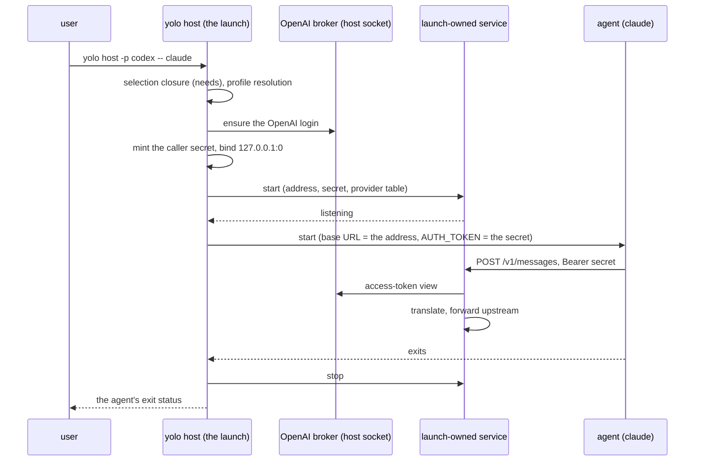

# A pack's service runs wherever its agent runs

**Status:** 2026-10-07 — [OQ-HS5](#OQ-HS5) still needs the maintainer's ruling;
the implemented admission boundary and the evidence below do not settle it.
2026-09-28: the mechanism, pinned by `TestStartWaitsForReadinessAndStopEndsTheService`
and `TestTheHostHalfServesFromItsInputAndPublishesNoFile`; the host launch,
`TestHostCodexClaudeRunsThroughALaunchOwnedBridge`; macos-user,
`TestTheMacosUserArmStartsTheServiceAndStopsItAfterTheCommand`; and the disclosure's address
list, `launchservice.Plan.PointedAt`
([§11](#11-decision-ledger), HS-D6 to HS-D14, [HS-D24](#HS-D24)). MEASURED by unit tests through `hostMain`, where
a real host half, run by the test binary standing in for `yolo`, serves a fake agent against a
stubbed upstream and a fake host broker, and through the macos-user arm of `run.Run`, where
`TestTheMacosUserArmServesClaudeOnCerebrasThroughARealHostHalf` runs a real host half the same way
against a stubbed upstream. No agent CLI has run it, and the macos-user arm has not run on a Mac:
its case there, `TestMacosUserRunsTheWireBridgeHostHalfForABridgedProfile`, has no recorded run.
The pre-build evidence was verified at `1baf1fd4` ([Appendix A](#appendix-a--the-measured-runs)). **The doorway rule ([HS-D15](#HS-D15))
is built 2026-09-29 for macos-user** (`1b35ed10`, `1a276996`, `d7e17341`, `fea3b6c7`, `824cb859`;
HS-D16 to HS-D20, and the fixes `5b1059a1`, `6e8dce61`, `f8529a43`): the Codex and AWS
credential doorways open outside the sandbox through the same mechanism. MEASURED on Linux by
unit tests through `run.Run`, one against a real Codex doorway process and one against a real
aws-auth host service. On a Mac, read from the scheduled `macos-user.yml` run 36719581090
(`8f7468dd`, 2026-09-30): `TestMacosUserOpensTheCodexDoorwayOutsideTheSandbox` passed, so the
Codex doorway is MEASURED there; `TestMacosUserOpensTheAWSDoorwayOutsideTheSandbox` failed before
its probe ran, because its config named no AWS region and the launch's Bedrock region refusal
stopped it, so the AWS doorway is still UNMEASURED on a Mac. Since 2026-09-30 that test's
config is the container aws-auth tests' own (`awsAuthUserConfig`), which names the provider
`region` the refusal asks for; it has not run since, so whether it now reaches the doorway is
unobserved. **At `yolo host` the AWS
doorway is built 2026-09-29** ([HS-D21](#HS-D21), [HS-D22](#HS-D22),
[§4.8](#48-yolo-host)): for an agent whose profile selects a Bedrock provider, with aws-auth
enabled, `yolo host --` opens the adapter as its own listener and hands that agent the pointer.
MEASURED by unit tests through `hostMain` against a real aws-auth host service and a real doorway
process, a fake `aws` and a fake agent, and by an integration test running the built `yolo`
(`TestAWSAuthServesAYoloHostAgentThroughItsDoorway`). No agent CLI has fetched a credential through it; what
each agent's client does with the pointer was read from its published code
([§4.8](#48-yolo-host)). **Built 2026-10-04**, at both notches: a LOCAL pack's host half and
doorway run as a shipped pack's do, named argv and all before they start, while a fetched pack's
are still refused ([HS-D27](#HS-D27), [OQ-HS5](#OQ-HS5)); a service or doorway that dies while its
agent runs is named and restarted on the same address ([HS-D28](#HS-D28)); and a pure worker's
host half runs beside the command ([HS-D29](#HS-D29)). MEASURED by unit tests on Linux only, real
processes standing in for the host halves; none has run on a Mac. **Built 2026-10-05**, at both
notches: a profile whose `via`, or whose carrier, routes an agent through a pack service starts
that service's host half too, at a port the launch picked for the service's via address
([HS-D30](#HS-D30)); `yolo host --` serves such an agent only when its environment carries the
route, never a route its own config file carries ([HS-D31](#HS-D31)); and the service is handed
the AWS doorway's pointer for the agent it carries ([HS-D32](#HS-D32)). An agent counts only when
the via actually re-points its config, so a via that changes nothing for its agent starts nothing,
and `yolo host env` and `yolo host apply` name the launch that serves a via they cannot
([HS-D33](#HS-D33)). MEASURED by
unit tests on Linux; the macos-user case, `TestMacosUserBridgesPiThroughTheHostHalfViaRoute`, has no
recorded run.

> **In short.** A service a selected pack needs is part of the environment description, not
> part of the jail. So if the host runs pack services at all
> ([OQ-NC1](../plans/notch-convergence.md#OQ-NC1)), `yolo host -- <agent>` starts each needed
> service that declares a host half as a child of that one launch: on a port the launch picks,
> answering only callers that carry the launch's caller secret, and gone when the agent exits.

**Why it matters.** At `1baf1fd4`, `yolo host -p codex -- claude` exited 0 and ran claude on the
Claude login while its status line said `codex (bridge) · host` ([§2](#2-what-the-host-does-today-measured)).
Then it refused. It now runs claude on the ChatGPT subscription through a bridge that lives for
that one command.

**The shape.** The jail's one selection function at the host, one **launch-owned service**
([§1.2](#12-terms)) per bridged launch, and one address and caller secret the launch hands to both.

**Cost.** A bridged host launch stays resident. `yolo host env` and `yolo host apply` cannot carry
a bridged profile.

**Start at [§4](#4-the-proposed-shape)**, the shape. The questions fall out of it.

**Needs your ruling:** [OQ-HS5](#OQ-HS5), whether a fetched pack's host half runs.
**Rulings:** [OQ-HS3](#OQ-HS3), per launch (the maintainer, 2026-09-28), [OQ-HS4](#OQ-HS4), decided as leaned and widened to a local pack by [HS-D27](#HS-D27), and [HS-D15](#HS-D15), the doorway rule (the maintainer, 2026-09-29). All three are built, HS-D15 for macos-user and, for the AWS doorway, at `yolo host`. One question awaits the maintainer: [OQ-HS5](#OQ-HS5), whether a fetched pack's host half runs.

**Reads with:** [`notch-convergence.md`](../plans/notch-convergence.md) (the plan this doc is
item 3 of: it owns whether the host runs services, the caller-secret ruling, and the selection
and served-address items this design sits on), and [§12](#12-the-neighbors) (the other siblings,
one line each). The code is `internal/launchservice` (admission, plan, start, stop, the agent's run),
`internal/wirebridged/hosthalf.go` (the bridge's host half), `internal/cli/host.go` (the host
launch), `internal/cli/run/macosuserservices.go` (the macos-user arm), and the doorways in
`internal/cli/run/macosuserdoorways.go` and `internal/cli/run/hostdoorways.go`.

---

## 1. The verdict, and the words it uses

**Run the services at the host.** That is [OQ-NC1](../plans/notch-convergence.md#OQ-NC1)'s
option A, which notch-convergence leans toward; this doc draws that option in full for the host
notch. Three principles carry the design, numbered so the questions can cite them:

- <a id="HS-P1"></a>**HS-P1. The notch changes how a declaration is delivered, never
  whether.** A selected pack's declarations are honored at every notch or refused there by
  name. This is [`declaration-parity.md` P1](declaration-parity.md#1-the-principle-and-what-it-does-not-say)
  applied to services: *"The one state that is never legal is accepting a declaration and doing
  nothing."* The measured host runs in [§2](#2-what-the-host-does-today-measured) are that state.
- <a id="HS-P2"></a>**HS-P2. A service lives as long as the launch that needed it.** No
  singleton, no reaper, no version skew between a service and its caller. This is
  [HD-R1](host-daemon-ownership.md#HD-R1), the maintainer's call of 2026-09-20 (*"A host-side
  daemon is spawned by the launch that wants it, serves that jail, and ends with it."*), read
  for a launch that has no jail.
- <a id="HS-P3"></a>**HS-P3. A loopback listener answers only its own launch, at every notch.**
  The bridge's trust model was *"The jail is the trust boundary. If that ever stops being true,
  the bridge grows auth before it grows anything else"*
  ([`wire-bridge.md`](../reference/wire-bridge.md#what-this-does-not-license)). The maintainer
  ruled on 2026-09-27 that it is not true in a jail either
  ([NC-D2](../plans/notch-convergence.md#7-decision-ledger)), so the auth is owed everywhere,
  not only here.

### 1.1 Why now

The maintainer, 2026-09-27, quoted as typed (line breaks dropped): *"1. we don't support wire
bridge on the host? that seems wrong 2. we don't support one agent profile selection on the host?
that seems wrong host is supposed to act like everywher [sic] else."* I read the second as the
per-CLI grammar, `-p <cli>=<name>` (row 6 of the table in [§2](#2-what-the-host-does-today-measured)).

The same question was asked once before, about env: *"I don't get it, why would we NOT support
env on the host too?"* (2026-09-01, the withdrawal of [OQ-CS10](../reference/providers.md#oq-cs10),
commit `368b798f`). The charter points the same way: *"Confinement is one attribute of that
description"*, and *"Everything inside is the product"*, with host-capability bridges named in
that product ([`what-yolo-is.md`](../reference/what-yolo-is.md)). The same day the maintainer
ruled the notches onto one code path per concern
([NC-D1](../plans/notch-convergence.md#7-decision-ledger)).

### 1.2 Terms

- **Notch**: one setting of the confinement dial (`jail`, `guest`, `host`), defined in
  [`yolo-as-environment-manager.md` §4](yolo-as-environment-manager.md#4-confinement-a-dial-with-three-notches).
- **Service**, and its **host half**: a service is a daemon a pack contributes, *"a jail daemon,
  a host daemon, or both"*, with *"No grants, no boundary, no host state"*
  ([`wire-bridge.md`](../reference/wire-bridge.md#kind-service--the-vocabulary-it-landed-as)).
  The host half is the manifest's `host_daemon` slot on a `kind: "service"` contribution, read
  into `packdecl.ServiceHostDaemon`. It is not a loophole's `host_daemon`, which carries a scope
  and boundary grants ([WB-D16](../reference/wire-bridge.md#wb-d16)).
- **Launch-owned service** *(coined here; the adjective is [OQ-OA6](../reference/agent-credentials.md#oq-oa6)'s
  "a launch-owned adapter")*: a service process that one launch starts as its own child, for the
  one agent that launch runs, on an address the launch chose, and stops when that agent exits.
  It is not a singleton, since no other process is handed its address or secret. It is not a jail
  daemon: its own launch, not `yolo-jaild supervise`, starts it, and restarts it on the address
  it started on when it dies while its agent runs ([HS-D28](#HS-D28)). It is not a loophole, since
  it carries no grants.
- **Pure worker** *(this doc's term, after `packdecl`'s "a service that publishes nothing (a pure
  worker)")*: a held service, the declaration of its name the later-wins rule keeps
  (`packload.HeldServices`), that no adaptation names: it has no `packload.ServiceAdaptations`
  entry, so no agent's pairing starts it under [§4.2](#42-the-trigger), whether or not it
  publishes an endpoint. [HS-D29](#HS-D29) says where its host half runs.
- **Bridged profile** *(coined here)*: a profile whose resolved pairing for the launched agent is
  an adaptation that a pack's own service serves. Claude on `openai-codex`, through wire-bridge's
  `openai-responses → anthropic` adapter, is one. It is not a via profile, which starts the
  service by a trigger of its own ([HS-D30](#HS-D30)), and not a profile whose adapter is a
  gateway or a proxy the user runs, which the host already composes
  ([`protocol-resolution.md`](../reference/protocol-resolution.md#the-three-declarations)).
- **Caller secret**: notch-convergence's per-launch caller secret
  ([§2.3 there](../plans/notch-convergence.md#23-the-fix-every-service-authenticates-its-caller-at-every-notch)),
  256 random bits minted once per launch, which every loopback service requires on every request.

## 2. What the host does today, measured

Every run used a fresh home whose only file was the config shown, a throwaway workspace, and a
fake `claude` that prints the `ANTHROPIC_*`, `CLAUDE_CODE_*` and `AWS_*` variables it was given
([Appendix A](#appendix-a--the-measured-runs) has the output). **Rows 1 to 4 and 6 to 8 describe
`1baf1fd4`**, before ES-D25 to ES-D27 landed; the column on the right says what those
changed. Row 9 and the codex row are unchanged by them.

| # | Command | `packs` | Exit at `1baf1fd4` | What claude got | After ES-D25 to ES-D27 |
| :--- | :--- | :--- | :--- | :--- | :--- |
| 1 | `yolo host -p codex -- claude` | `["claude"]` | 0 | `CLAUDE_CODE_AUTO_COMPACT_WINDOW`, `CLAUDE_CODE_DISABLE_NONESSENTIAL_TRAFFIC`, `CLAUDE_CODE_MAX_CONTEXT_TOKENS`, and nothing else: no base URL, no model | refuses: the provider is missing (ES-D25) |
| 2 | `yolo -p codex host -- claude`, and `yolo --at host -p codex -- claude` | `["claude"]` | 0 | the same three | refuses (ES-D25) |
| 3 | `yolo host -- claude` with `use_profiles: {claude: codex}` | `["claude"]` | 0 | the same three, while claude's own status line prints `Opus · yolo: codex (bridge) · host` | refuses (ES-D25) |
| 4 | `yolo host env --agent claude -p codex` | `["claude"]` | 0 | exports the same three | refuses (ES-D25) |
| 5 | `yolo host -- claude`, no profile | `["claude"]` | 0 | none of them: the three are the codex branch's | unchanged |
| 6 | `yolo host -p claude=codex -- claude` | `["claude"]` | 1 | `no profile named "claude=codex" is declared` | the pair is parsed (ES-D27), then refuses as row 1 does |
| 7 | `yolo host -p codex -- claude` | `["claude", "openai-auth"]` | 1 | ES-D18's refusal, whose remedy is the jail launch `yolo -p claude=codex -- claude` | the remedy says it is a jail launch (ES-D26) |
| 8 | `yolo -p claude=codex host -- claude` | `["claude", "openai-auth"]` | 1 | row 6's refusal again, so following row 7's remedy to the host loops | row 7's refusal, so the loop is gone (ES-D26, ES-D27) |
| 9 | `yolo host -p bedrock -- claude` | `["claude", "aws-auth"]` | 0 | `CLAUDE_CODE_USE_BEDROCK=1` and `AWS_CONTAINER_CREDENTIALS_FULL_URI=http://127.0.0.1:1461/credentials`, an address only a jail daemon serves | unchanged |

A second jail-daemon pointer already reaches the host, and not through claude. With
`"packs": ["codex"]`, `yolo host env --agent codex` exits 0 and exports
`CODEX_REFRESH_TOKEN_URL_OVERRIDE='http://127.0.0.1:1460/oauth/token'` (MEASURED on `e5150a03`,
[Appendix A](#appendix-a--the-measured-runs)). That port belongs to `openai-auth`'s jail daemon
(`openai-auth-adapter`, declared in
[`packs/openai-auth/loopholes/openai-auth-broker/manifest.jsonc`](../../packs/openai-auth/loopholes/openai-auth-broker/manifest.jsonc)),
and the pointer is an ungated env var of the codex pack
([`packs/codex/pack.json`](../../packs/codex/pack.json)). `yolo host -- codex` does not hand it
on: `openaiauthhost.Prepare` replaces it with the address of the adapter it serves itself.

With no base URL, claude runs on whatever login it holds. Rows 1 to 4 are
[HS-P1](#HS-P1)'s forbidden state. Rows 6 to 8 are the maintainer's two questions. Row 9 and the
codex pointer are the trap in [HS-D1](#HS-D1): row 9 is what every host claude launch on
`bedrock` would get once the host applies `needs`, because claude needs `aws-auth`
unconditionally.

### 2.1 The five causes

1. **The host applies no `needs`.** `loadedHostPacks` in [`host.go`](../../internal/cli/host.go)
   resolves each configured entry alone. The selection closure, `packload.Selection.Close`
   ([`viaclosure.go`](../../internal/packload/viaclosure.go)), is called by the launch, `yolo
   check` and config validation, and not by `yolo host` ([WG-I8](wire-bridge-gateway.md#WG-I8):
   *"`yolo host` runs neither closure"*). The claude pack needs `aws-auth`, `openai-auth` and
   `wire-bridge` unconditionally ([`packs/claude/pack.json`](../../packs/claude/pack.json)), and
   `openai-auth` is the only pack that declares the `openai-codex` provider. The host test file
   says so itself: *"bridgeConfig lists wire-bridge explicitly: the one way it reaches the host
   notch, which runs no pack's `needs`"*
   ([`hostbridgeadapter_test.go`](../../internal/cli/hostbridgeadapter_test.go)). The one test
   that composes claude on `codex` at the host lists `openai-auth` by hand
   (`TestHostNeverTellsTheUserToListTheBridge`). The other host `-p codex` tests check the argv
   parse only (`TestHostArgumentsAcceptLeadingProfile`). ES-D24 kept the host off
   the closure on purpose ([ledger](credential-sources-separation.md#10-decision-ledger)),
   because applying it adds row 9's pointer. **Closed 2026-09-28** by
   [notch convergence item 6](../plans/notch-convergence.md#tier-2--one-selection-p1-p2) as
   [HS-D1](#HS-D1) specifies: every host verb selects through the one selection function, closure
   included, and row 9's pointer is withheld and named because its daemon does not run at the host.
2. **The protocol gate is silent about a provider the table lacks.** At `1baf1fd4`,
   `refuseUnspeakableProvider` ([`protocolresolution.go`](../../internal/packload/protocolresolution.go))
   is *"TOTAL over the ways there is nothing to ask"*, *"a provider name the composed table does
   not hold"* among them. ES-D25 made that case a refusal
   (`packload.MissingProviderError`).
3. **Claude's derive returns its constants anyway.** The `openai-codex` branch of
   [`packs/claude/derive.lua`](../../packs/claude/derive.lua) reads the base URL and the model
   list from the provider entry, finds neither, and still returns its three constants.
4. **Host `-p` is name-only** at `1baf1fd4`: `parseHostExecFlags` in
   [`host.go`](../../internal/cli/host.go) keeps the value whole. ES-D27 reads it in
   the run path's grammar (`parseProfileValue`).
5. **The refusal's remedy is a jail launch.** ES-D18 to ES-D20 name
   `yolo -p <agent>=<profile> -- <agent>` on a container backend. Adding `host` to it hits
   cause 4 at `1baf1fd4`; ES-D26 labels it a jail launch.

### 2.2 Where "no host-side bridge" and "name-only" came from

Neither is a ruling, so reopening them overturns nothing.

| Claim | Source | What kind of source |
| :--- | :--- | :--- |
| No host-side bridge | `a7860398` (2026-09-04): *"`yolo host -- claude` gets no bridged routing in v1 (the notch can adopt it later by running the same subcommand — the code having no jail dependencies is what keeps that door open, not a promise to walk through it)"*. The graduation to [`wire-bridge.md`](../reference/wire-bridge.md#what-this-does-not-license) in `cba833c3` (2026-09-09) dropped "in v1" | a non-goal of a v1 design |
| Host `-p` stays name-only | `582ae850`'s body: *"yolo host's own -p stays name-only: host launches one agent, so there is no command-dependence to remove there."* `ba1763ab` graduated the plan's trap into [`providers.md`](../reference/providers.md)'s warning | an implementer's note, about the timing meaning of `-p`, not the pair grammar. ES-D27 deleted the warning |
| The host refuses a bridged profile | ES-D18, ES-D19, ES-D20 | *Implementation decision* rows |

> [!NOTE]
> **Resolved 2026-09-28 by [HS-D7](#HS-D7).** The warning below held until the host half was
> built: the host half now takes every input from the launch's input file.
>
> **"The code has no jail dependencies" is no longer true of the bridge.** `internal/wirebridged`
> publishes `EndpointFile` under `paths.JailHostServicesDir`, reads its upstream key from the
> jail's env files (`entrypoint.AgentEnvFile`), and reaches the OpenAI broker through the jail's
> endpoint variable (`openauthclient.EndpointEnv`) ([`boot.go`](../../internal/wirebridged/boot.go),
> [`keyfile.go`](../../internal/wirebridged/keyfile.go)). A host half is not `yolo-jaild
> wire-bridge` run on the host unchanged; its inputs have to be handed in by the launch.

## 3. The constraint: the bridge trusts every caller

Running today's bridge at the host the way it runs in a jail would be worse than the silent
no-op. Six facts, each from the tree:

1. **The bridge authenticated no caller, until [WB-D18](../reference/wire-bridge.md#wb-d18).** [WB-D4](../reference/wire-bridge.md#wb-d4): inbound
   auth none, because *"The jail is the boundary"*. The handler ignores the inbound
   `Authorization` header ([`handler.go`](../../internal/wirebridged/handler.go)). NC-D2 retires
   that premise, and the bridge's caller auth is built
   ([notch-convergence §5](../plans/notch-convergence.md#5-already-merged-and-in-flight)): since
   [WB-D18](../reference/wire-bridge.md#wb-d18) a request without the launch's caller token is
   refused `401` (`TestTheBridgeRefusesEveryCallerWithoutThisLaunchsToken`).
2. **Claude sends its subscription bearer to any base URL** when neither
   `ANTHROPIC_AUTH_TOKEN` nor `ANTHROPIC_API_KEY` is set (measured 2026-09-02,
   [`agent-auth-modes.md` §8.1](agent-auth-modes.md#81-measured-2026-09-02-the-subscription-bearer-follows-anthropic_base_url)).
3. **The codex branch sets no `ANTHROPIC_AUTH_TOKEN`.** The `"local"` dummy exists *"so Claude
   does not fail or leak the private claude.ai subscription OAuth token"*, and it sits below the
   codex branch's early return in [`derive.lua`](../../packs/claude/derive.lua).
   `TestAssembleEmitsCodexBridgeProfileEnv` asks for `ANTHROPIC_AUTH_TOKEN` and expects none
   ([`agentprofileenv_test.go`](../../internal/cli/run/agentprofileenv_test.go)). So in a jail
   today claude sends its Claude login to the bridge, which discards it (read from code).
4. **The host's loopback is shared.** Other local accounts reach it. So does every jail whose
   launch asked the runtime to forward the host's loopback
   ([`hostloopback.go`](../../internal/cli/run/hostloopback.go)), and every `macos-user`
   sandbox, which runs on the launcher's own network stack (`run.sharesLauncherNetns` answers
   true for the native runtimes).
5. **The address is one per machine.** 8214 and 8215 are manifest-borne
   ([`packs/wire-bridge/pack.json`](../../packs/wire-bridge/pack.json)), and
   [WB-D13](../reference/wire-bridge.md#wb-d13)'s one user-scope override moves the address,
   not its count: *"One writer and a boot-fatal collision are what the ruling buys"*. Two
   concurrent host launches would collide.
6. **The precedent has half the answer.** The managed host Codex adapter binds `127.0.0.1:0` per
   launch and closes it when codex exits (`openaiauthhost.Prepare`, `Launch.Run` in
   [`host.go`](../../internal/openaiauthhost/host.go)). It authenticated no caller, and
   notch-convergence MEASURED a stranger getting both tokens from it on 2026-09-27
   ([§2.1 there](../plans/notch-convergence.md#21-what-trusts-the-network-namespace-today)). Its
   caller auth is built too: since [NC-D13](../plans/notch-convergence.md#NC-D13) a refresh
   marker without the launch's caller token is refused `401` before the broker is asked
   (`TestTheHostCodexAdapterServesOnlyTheMarkerItWrote`).

So a host bridge on 8215 would hand the ChatGPT subscription to anything that reaches the host's
loopback, and a process that bound 8215 first would receive claude's Claude login bearer.

**The threat model, stated so the design is checkable:**

| Who | Reaches the host loopback | Stopped today by | Under this design |
| :--- | :--- | :--- | :--- |
| A jail with loopback forwarding | yes | nothing of yolo's listening on 8214 or 8215 at the host | the caller secret |
| A `macos-user` sandbox | yes, same stack | as above | the caller secret |
| Another local account | yes | as above | the caller secret |
| A process that binds the port first | yes | nothing | a kernel-assigned port, and a secret claude sends in place of its login |
| A process of the same account on the host | yes | **out of scope**: it can already read claude's saved login and the broker's socket, whose *"filesystem mode is the authorization boundary"* (`openauthclient.RequestUnix`) | out of scope |

> [!WARNING]
> **`macos-user` already has this shape** (read from code, UNMEASURED). The one caller of
> `packload.WithoutServiceAdaptations` was `composedHostProviders`, so every jail launch composed
> the bridge's address, and a `macos-user` launch starts no jail daemon
> ([`wire-bridge.md`](../reference/wire-bridge.md#no-macos-user-bridge)). Claude on `codex`
> there is pointed at `127.0.0.1:8215` on the host's own loopback, where nothing of yolo's
> listens, with no `ANTHROPIC_AUTH_TOKEN` (fact 3). That backend is inside
> [OQ-NC1](../plans/notch-convergence.md#OQ-NC1) too ([§4.7](#47-macos-user)).
> **Closed 2026-09-28** by [notch convergence item 2](../plans/notch-convergence.md#tier-1--the-loopback-services-p3):
> macos-user now composes with nothing served, as the host does, so it composes no bridge
> address and refuses a profile that needs one. [OQ-NC1](../plans/notch-convergence.md#OQ-NC1) still decides whether it should run the
> bridge instead.

## 4. The proposed shape



### 4.1 Selection: the jail's closure, at the host

- The host runs the one selection function notch-convergence's item 6 builds for every host
  verb ([§4 there](../plans/notch-convergence.md#4-the-ordered-build-list)), with the launched
  agent's selection table: its `profile` entry (the key was `use_profiles` until
  [PP-D10](providers-and-profiles-redesign.md#PP-D10)), with a typed `-p` folded in. Added packs
  print the cause lines a jail launch prints ([WB-D12](../reference/wire-bridge.md#wb-d12)).
- **It lands after notch-convergence item 2**, which drops an address nothing serves at this
  notch and names it ([NC-D4](../plans/notch-convergence.md#7-decision-ledger)). That is what
  removes ES-D24's reason for keeping the host off the closure.
- The addresses item 2 drops at the host are **every pointer at any jail daemon**, whichever pack
  declares the pointer and whichever pack's daemon serves it. Two exist: `aws-auth`'s
  `AWS_CONTAINER_CREDENTIALS_FULL_URI` at `1461` (row 9 of [§2](#2-what-the-host-does-today-measured)),
  and the codex pack's `CODEX_REFRESH_TOKEN_URL_OVERRIDE` at `1460`, which `openai-auth`'s jail
  daemon serves. The second reaches the host today with no closure at all, through
  `yolo host env --agent codex`.
- **A pointer the host itself serves is not dropped, and nothing is printed.** At
  `yolo host -- codex` the managed adapter (`openaiauthhost.Prepare`) serves the refresh URL on
  its own port and replaces the pointer, so every such launch goes on without a stderr notice.
  `yolo host env --agent codex` starts no adapter, so there the pointer is dropped and named.
- Via stays inert at `yolo host env`, `yolo host apply` and the footer: `packload.ViaServedAt`
  with nothing served still clears every via address there
  ([WG-I12](wire-bridge-gateway.md#WG-I12), as [WG-I46](wire-bridge-gateway.md#WG-I46) narrowed
  it). `yolo host --` serves a via the agent's environment carries ([HS-D30](#HS-D30),
  [HS-D31](#HS-D31)).
- With `"packs": ["claude"]`, `openai-auth` and `wire-bridge` join. Until a host half exists,
  `-p codex -- claude` refuses in ES-D18's words, **with the joined pack worded as joined**
  ([HS-D1](#HS-D1)).

### 4.2 The trigger

A launch starts a service **only when the resolved pairing for the one agent it runs is an
adaptation whose pack's service declares a host half** that [OQ-HS4](#OQ-HS4)'s gate admits.
Nothing else starts one:

- not a profile that pairs directly (copilot on cerebras stays on cerebras's own endpoint, which
  `TestHostComposesNoBridgeAddressForAnyAgent` pins);
- not a pack that is merely selected (unless it holds a pure worker, below), `yolo host env` or
  `yolo host apply`;
- not an unprofiled launch, which resolves no pairing.

One agent resolves one pairing, so a launch starts **zero or one** service for it.

**A via or a carrier** ([HS-D30](#HS-D30), amending this section's "not a via profile", which it
said until 2026-10-05) starts the service by a trigger beside the pairing's. A via refuses nothing
while its service is unserved: `packload.ViaServedAt` clears it, and the adapter address a via
profile rides composes no `for_via` mark at all until the service is served, so the carrier
([WG-I44](wire-bridge-gateway.md#WG-I44)) exists only then. So the launch asks a what-if
(`packload.ViaRoutedServices`): for each selected service with a `via_address` that admission
admits, compose the provider table and resolve the profiles as if that service were served, and
start it when the agent's resolved profile then routes it through the service, by its own `via` or
by its carrier (`ResolvedProfile.ViaFor`). An agent counts only when the via RE-POINTS it: its
derived config carries its via URL, or its environment names an address of the service, as claude's
and copilot's name the `for_via` adapter address; an agent whose config ignores the via (agy) starts
nothing, and the launch says the via has no effect on it ([HS-D33](#HS-D33)). `yolo host --` asks it
for the one agent it runs, and serves it only when the agent's environment carries the route
([HS-D31](#HS-D31)); `yolo host env` and `yolo host apply` ask it too, only to name the launch that
serves the route ([HS-D33](#HS-D33)); macos-user asks it for every profiled agent. `yolo check` predicts it
on macos-user.

**A pure worker** ([§1.2](#12-terms)) has no pairing, so [HS-D29](#HS-D29) gives it a rule of its
own: `yolo host -- <command>` starts the host half of every pure worker the selection holds that
declares one, that [OQ-HS4](#OQ-HS4)'s gate admits, and that the selection's gate asks for (a
worker every pointer at which is gated on a profile or a platform starts only when one of those
gates is delivered, as the jail's payload decides it), beside the command, with no address of the
launch's and with a caller token of its own. A pack env pointer at a worker it starts reaches the
command as its pack declares it, carrying that token where it names `{caller_token}`, as a jail
composes one at the worker's jail daemon; a pointer at a worker it does not start is withheld,
named with that worker's reason. Every worker it does not start is named on stderr. `yolo host
env` and `yolo host apply` start none and name each one. On macos-user a worker that declares
only a host half starts the same way; one that also declares a jail daemon runs that, confined,
in the guest ([JD-9](jail-daemon-on-macos-user-plan.md#JD-9)).

### 4.3 The address and the caller secret

- **The address is `127.0.0.1` on a kernel-assigned port, chosen per launch.** Never a fixed
  port, never a non-loopback address. At the host, neither the manifest's `address` nor a
  user's `adapters` override applies to a service-served adaptation ([OQ-HS4](#OQ-HS4)). The
  launch holds the port from the pick and hands the service the bound socket, so no other
  listener can be given it first ([HS-D26](#HS-D26)).
- **The secret is notch-convergence's caller secret, under its rules**
  ([NC-D3](../plans/notch-convergence.md#7-decision-ledger)): 256 random bits minted once per
  launch, held in a `0600` file and in the agent's own environment, never in a shared env file,
  never logged, never in a briefing. This design adds only what the host needs: the secret is
  never on an argv and never in `yolo host env`'s output. The service reads the file, and a
  service that cannot read it does not start. Where the file lives is the implementer's choice.
- **The service answers a request without the secret with `401`**, in the protocol's own error
  shape with a body naming yolo, before reading the body, using a constant-time compare. On the
  `anthropic` wire it accepts `Authorization: Bearer` (what claude sends for
  `ANTHROPIC_AUTH_TOKEN`) and `x-api-key`.
- **The agent gets the secret as the address's credential**, through the same resolution that
  hands it the address, so claude's derive puts it in `ANTHROPIC_AUTH_TOKEN` on the codex branch
  too. That also retires fact 3 of [§3](#3-the-constraint-the-bridge-trusts-every-caller):
  claude sends the secret, never its login. This is the same slot notch-convergence's bridge row
  uses in a jail, so the jail and the host share one derive.
- **The upstream credential comes from the launch**, never from a jail path: a provider key from
  the credential gate's composition, and for `openai-codex` access-token views from the host
  broker's private socket ([HS-D3](#HS-D3)). The service never holds a refresh token
  ([the OpenAI service's one-writer rule](../reference/agent-credentials.md#openai-one-writer)).

### 4.4 Lifetime

The launch-owned service follows the managed Codex shape: `yolo host` stays resident as the
parent of both processes (`launchservice.RunAgent`). This is [OQ-HS3](#OQ-HS3)'s ruling, and
[HS-D11](#HS-D11) records how each step below is met.

1. **Order.** Pre-flights, then resolving the agent on `PATH`, then the service, then the agent.
   A missing agent exits 127 as it does today and never starts a service.
2. **Readiness.** The agent starts only once the service is listening. The launch waits at most
   **5 seconds**, then refuses, naming the service, its argv, and its log.
3. **The agent exits**, by any route: the service gets `SIGTERM`, then `SIGKILL` after
   **2 seconds**. `yolo` exits with the agent's status, and with 128 plus the signal number for
   a signal death, as `Launch.Run` does.
4. **The launch dies without cleanup** (SIGKILL, OOM): the service exits within **5 seconds** of
   its parent disappearing, on Linux and on macOS. How it notices is the implementer's choice.
5. **The service dies mid-session:** one stderr line naming it, how it exited and its log, then
   a restart under its declared `restart` policy, on the SAME address ([HS-D28](#HS-D28)). The
   agent's base URL was fixed when it started, and the launch keeps the socket it reserved for
   that address for the service's whole life ([HS-D26](#HS-D26)), so the new process listens on
   the address the agent was pointed at, and a request the agent makes in between waits in the
   socket's queue rather than failing. One more line says it is back. A policy of `no`, and the
   default `on-failure` after a clean exit, leave it down: the line says so, and that launching
   the agent again starts it. A doorway is restarted the same way. This revised "no restart" on
   2026-10-04: its premise, that *"a restart on another port could not reach it"*, expired once
   the launch held the port for the service. The agent's own retry, the bridge's stated policy
   (*"its retry loop IS the retry policy"*, [`handler.go`](../../internal/wirebridged/handler.go)),
   still covers the moment between.
6. **Concurrency:** two host launches get two services, two ports and two secrets, and share
   the OpenAI broker, which already serializes refreshes
   ([`agent-credentials.md`'s OpenAI service](../reference/agent-credentials.md#the-openai-subscription-credential-service)). The managed Codex refresh adapter is the
   exception to "two secrets": every `yolo host -- codex` on the machine runs on one managed Codex
   home, so its live launches share one caller token, counted by a lock of the home's own
   ([NC-D18](../plans/notch-convergence.md#NC-D18)). Under
   [OQ-JL5](jail-lifetime-last-session-wins.md#OQ-JL5)'s ruling, what a workspace's host sessions
   share moves to a keeper, and [OQ-JL9](jail-lifetime-last-session-wins.md#OQ-JL9) ruled
   (2026-10-10) that these per-launch services stay each launch's own.

### 4.5 Failure paths

| Step | Fails how | What happens |
| :--- | :--- | :--- |
| Selection closure | a need names a non-embedded pack, or a cycle | refuse, with the closure's own message, as a jail launch does |
| Admission | no host half declared, or [OQ-HS4](#OQ-HS4)'s gate refuses the pack (a fetched one, [HS-D27](#HS-D27)) | ES-D18's refusal, narrowed ([HS-D5](#HS-D5)), naming a local checkout as the next step |
| Start | spawn fails, or not listening within 5 s | refuse before the agent starts |
| Secret | the service cannot read its secret file | the service does not start, so the start row applies |
| Upstream key | the provider's key is missing | the existing credential pre-flight refusal |
| OpenAI login | never logged in | log in first on a terminal, else say so and continue ([HS-D4](#HS-D4)) |
| Mid-session | the service exits | one stderr line, then a restart on the same address under its policy, and a line when it is back ([HS-D28](#HS-D28)) |

### 4.6 Every front door

| Front door | Under this design |
| :--- | :--- |
| `yolo host -- <agent>`, `yolo -p <p> host -- <agent>`, `yolo --at host …` | starts the service |
| the host wrappers (`exec yolo host -- <bin>`, [`hostwrap.go`](../../internal/hostwrap/hostwrap.go)) | the same front door, so the same result |
| `yolo host env` | refuses a bridged profile, naming the `yolo host -p <p> -- <agent>` spelling: an env script cannot own a service's lifetime ([OQ-HS3](#OQ-HS3)). For the same reason it opens no credential doorway: it exports no pointer at one and names the launch that opens it ([HS-D21](#HS-D21)), and it starts no pure worker, naming each one ([HS-D29](#HS-D29)) |
| `yolo host apply` | renders no bridged address, since a per-launch address cannot sit in a file, and says a bridged `profile` selection takes effect only through `yolo host --` or the wrappers ([OQ-HS3](#OQ-HS3), [OQ-HC3](../reference/host-agent-environment.md#oq-hc3)), and names each pure worker, which only `yolo host --` starts ([HS-D29](#HS-D29)). The key was `use_profiles` until [PP-D10](providers-and-profiles-redesign.md#PP-D10) |
| a direct launch (an IDE, cron, a shell with no wrappers) | gets only the rendered files, so it runs on the login. claude's host status line reads the config's selection ([OQ-FT6](agent-footer.md#OQ-FT6)). At `1baf1fd4` it says `codex (bridge) · host` there (row 3 of [§2](#2-what-the-host-does-today-measured)); FT-D1 leaves a selection the host refuses out of it, so it names the login. Once the host composes a bridged selection, the line would name the bridge again while a direct launch runs on its login. That is [`agent-footer.md`](agent-footer.md)'s to settle |
| a container jail | the caller secret, by NC-D2 (the bridge part is built, [WB-D18](../reference/wire-bridge.md#wb-d18)) |
| a `macos-user` jail | [§4.7](#47-macos-user) |

### 4.7 macos-user

That backend starts no jail daemons and has no network namespace. Whether it runs services is
[OQ-NC1](../plans/notch-convergence.md#OQ-NC1)'s, which also answers
[OQ-OA6](../reference/agent-credentials.md#oq-oa6) for the Codex refresh adapter. Under option A the
`macos-user` launch starts the host half as a launch-owned child exactly as [§4.1](#41-selection-the-jails-closure-at-the-host) to [§4.5](#45-failure-paths) say,
beside the host services in the session's own dir ([HD-D1](host-daemon-ownership.md#HD-D1)).
Two facts go with that choice:

- It takes the bridge out of [OQ-DP8](declaration-parity.md#OQ-DP8)'s argv question and
  [OQ-DP9](declaration-parity.md#OQ-DP9)'s confinement question, since it runs outside Seatbelt
  as a host half, and [OQ-HS4](#OQ-HS4)'s gate makes it yolo's own code.
- Every workspace shares one account home there, so a concurrent session may read the secret
  from the agent's environment (UNMEASURED). One service also gets two delivery mechanisms, a
  jail daemon on containers and a host half here, which is the cost [OQ-OA6](../reference/agent-credentials.md#oq-oa6) names.
- **A via there is served whichever file carries it** ([HS-D30](#HS-D30)): the darwin bootstrap
  renders the files that carry one (pi's `~/.pi/agent/models.json`, opencode's
  `~/.config/opencode/opencode.json`, oh-omp's `~/.oh-omp/agent/models.yml`, codex's
  `~/.codex/config.toml`) per launch, from the launch's tables. Those files sit in the one account home every workspace's session shares, so a
  second concurrent session of the same agent rewrites the file with its own launch's port, and the
  first session's agent reads that port at its next start, where its own launch's bridge does not
  answer and the other launch's refuses its caller token (INFERRED from the render path, not
  measured; [HS-D31](#HS-D31)).

**The credential doorways, since [HS-D15](#HS-D15).** A loophole's jail daemon that declares
`jail_daemon.host_cmd` is a **doorway** (HS-D15's word: the thin adapter an agent's client talks
to, which checks the launch's caller token and forwards to the loophole's host daemon). The two
shipped ones are the Codex refresh adapter (`openai-auth`) and the AWS container-credentials
adapter (`aws-auth`). On macos-user the guest declines their jail daemons, and the launch opens
each doorway outside Seatbelt through this doc's mechanism, at the port it settled for the
loophole's `listen` and behind the caller token it minted for it, so the pointers already
composed for the sandbox name the listener it starts ([HS-D16](#HS-D16) to [HS-D20](#HS-D20)).
Unlike a service's host half, a doorway has no trigger of its own: it opens whenever its jail
daemon is in the payload, which for `aws-auth` means some agent's profile selects `bedrock`.

**Under the keeper.** [OQ-JL5](jail-lifetime-last-session-wins.md#OQ-JL5) was ruled on 2026-09-29:
a keeper at every notch that starts a long-lived host service. At macos-user the doorways, like
everything else the launch starts outside the sandbox, then belong to the workspace's macos-user
keeper, and every session of the workspace there uses one set
([JL-D38](jail-lifetime-last-session-wins.md#JL-D38)). They still open on the machine's loopback,
outside Seatbelt, as [HS-D15](#HS-D15) rules; only the process that owns them changes
([JL-D43](jail-lifetime-last-session-wins.md#JL-D43)). Designed, not built.

### 4.8 `yolo host`

**The AWS doorway, since [HS-D21](#HS-D21).** An agent `yolo host` runs is this machine's own
process on the machine's own loopback, so under [HS-D15](#HS-D15) the host launch opens the
doorway outside too, through the mechanism macos-user uses. It opens aws-auth's doorway for the
one agent it runs when that agent's profile selects a provider of platform `aws-bedrock` and the
`aws-auth` loophole is enabled: the condition on which a jail starts the adapter
([OQ-CN7](../reference/providers.md#oq-cn7) (b)). In order (`hostExec`):

1. **The composition** plans the doorway (`run.PlanHostDoorways`): a loopback port it picked by
   binding `127.0.0.1:0`, never the declared `1461`, and a caller token it minted. The served set
   it hands the credential gate serves `aws-auth` at that address, so the gate composes
   `AWS_CONTAINER_CREDENTIALS_FULL_URI` and the scoped `AWS_CONTAINER_AUTHORIZATION_TOKEN` for
   that agent alone, as a jail's gate does for its jail daemon.
2. **The pre-flights** read that served set, so the [OQ-SSO8](sso-backed-bedrock.md#OQ-SSO8)
   check sees the pointer it delivers: a Bedrock bearer beside it refuses the launch here as in a
   jail, before anything opens.
3. **The start** discloses the host code it runs, then ensures the host-wide aws-auth singleton
   and a front over it for this launch, in a host-services dir of the launch's own (the
   macos-user session mechanism, `servicessession.go`), then opens the doorway
   (`launchservice.Start`) with that front's endpoint file. That is [HS-D19](#HS-D19)'s route.
4. **The agent** runs as the launch's child (`launchservice.RunAgent`). When it exits the doorway
   stops, then the front closes and the session dir goes.

What stays closed says why, on the `Not set at this notch` line: a disabled loophole names the
config key that enables it, a refused host argv names the refusal, and `yolo host env`, which runs
no process, names the launch that opens it. Codex's refresh doorway is not opened here
([HS-D22](#HS-D22)), and neither is the AWS doorway for an agent with no Bedrock client of its
own, such as copilot under `-p bedrock`, which the profile line warns about ([HS-D23](#HS-D23)),
unless the launch's wire bridge carries that agent: then the doorway opens for the bridge, and its
pointer reaches the bridge's input alone ([HS-D32](#HS-D32)).
For codex itself that doorway stays closed because the managed launch serves the refresh URL
([HS-D20](#HS-D20)). When that launch does not start, because there is no OpenAI login and no
terminal to log in at, the line says so and gives the login lines' remedy in place of HS-D22's
clause ([HS-D25](#HS-D25)).

**What each agent does with the pointer.** Read on 2026-09-29 from the published packages,
fetched with `npm view` and `curl` into a scratch directory; nothing was installed or run, and no
request was made.

| Agent | Artifact read | Does it count the pointer as a credential? | What its client then signs with | Grade |
| :--- | :--- | :--- | :--- | :--- |
| pi | `@earendil-works/pi-ai@0.99.1`, the AI package `@earendil-works/pi-coding-agent@0.99.1` depends on (`^0.99.1`; 0.99.1 is the latest) | **Yes.** `dist/env-api-keys.js` lines 139–155: `getEnvApiKey("amazon-bedrock")` answers `"<authenticated>"` when `AWS_CONTAINER_CREDENTIALS_FULL_URI` is set, beside `AWS_PROFILE`, the key pair, the bearer, the relative URI and a web-identity file. `dist/providers/amazon-bedrock.js` lines 53–82: the provider's `resolve` returns `source: "ECS task role"` for it | `dist/api/bedrock-converse-stream.js` lines 45–99: `profile` is `AWS_PROFILE` when set, `credentials` only for a static pair, otherwise the SDK's default chain, whose last link is the container provider; the region is `options.region`, `AWS_REGION` or `AWS_DEFAULT_REGION` (lines 948–953) | READ |
| opencode | `opencode-linux-x64@1.18.33`, `bin/opencode` (a Bun bundle), its `amazon-bedrock` loader | **Yes.** Autoload is refused only when none of `AWS_PROFILE` (or `options.profile`), `AWS_ACCESS_KEY_ID`, a bearer, `options.apiKey`, `AWS_WEB_IDENTITY_TOKEN_FILE` and `AWS_CONTAINER_CREDENTIALS_RELATIVE_URI \|\| AWS_CONTAINER_CREDENTIALS_FULL_URI` is set | `credentialProvider = fromNodeProviderChain(AWS_PROFILE ? {profile} : {})` unless a bearer is set; the region is `options.region ?? AWS_REGION ?? "us-east-1"` | READ |
| codex | `@openai/codex@0.159.2-linux-x64`, `vendor/x86_64-unknown-linux-musl/bin/codex` (Rust) | **INFERRED yes.** Its Bedrock sign-in flow prints "Checking for existing AWS credentials..." and "No AWS credentials found.", beside the strings `AWS_BEARER_TOKEN_BEDROCK`, `AWS_ACCESS_KEY_ID` and `AWS_SECRET_ACCESS_KEY`; which sources that check reads is not readable from strings | aws-config 1.8.12's default chain, `EnvironmentProfileEcsContainerEc2InstanceMetadata` in its strings; its `ecs.rs` reads `AWS_CONTAINER_CREDENTIALS_FULL_URI` and `AWS_CONTAINER_AUTHORIZATION_TOKEN` and accepts only an address that resolves to an allowed IP, which loopback is | INFERRED |
| claude | the chain order in [`sso-backed-bedrock.md` §11](sso-backed-bedrock.md#11-evidence-and-how-to-re-check-it) (2.1.282) | No check of its own: `CLAUDE_CODE_USE_BEDROCK` and the default chain | env, SSO, ini, process, token file, then the container provider | MEASURED (the chain) |

So yolo renders nothing more for pi: pi's own check accepts the pointer, and the models and
default model its Bedrock row carries are the derive's already
([`bedrock-plumbing.md` §6.2](bedrock-plumbing.md#62-what-each-derive-emits)). At the host that
derive output reaches pi's own `~/.pi/agent` only through the host render: `yolo host apply`, or
the [host launch gate](../reference/host-apply-staleness.md) when it is on. With the gate off,
`yolo host -- pi` hands pi the pointer and writes none of pi's config.

**The profile the agent's SDK resolves still wins.** Every client above puts the container
provider after the profile providers, which read the user's own `~/.aws` at the host. So an agent
the user already points at an AWS profile of their own (an `AWS_PROFILE` in the shell, or in
claude's own `~/.claude/settings.json` `env` block, which Claude Code applies before its first
request, [`providers.md` OQ-4](../reference/providers.md#pv-oq-4)) signs with that profile
whenever the profile resolves, and the doorway is not asked. The launch passes that
`AWS_PROFILE` through untouched and refuses nothing over it: the override declaration names no
`AWS_PROFILE`, and lets a static pair through beside one
(`TestHostClaudeKeepsItsOwnAWSProfileBesideTheDoorway`). So the doorway takes no credential away
from claude on its own settings, with aws-auth on or off. What decides whether that launch starts
at all is the region pre-flight below, not the doorway.

⚠ **With no `AWS_PROFILE`, the SDK resolves the `default` profile**, and the same order applies:
a `[default]` in `~/.aws/config` or `~/.aws/credentials` that holds credentials, an SSO session
or a credential process is used before the pointer, with its whole permission set rather than
aws-auth's narrowed one. If that SSO session has lapsed, the chain stops at it and the agent fails
with an SSO error rather than falling back to the pointer (pi's SDK,
`@aws-sdk/credential-provider-sso` 3.973.14 in pi 0.99.1's install: `tryNextLink` is `false` for
an expired or invalid session, READ 2026-09-30). The launch cannot tell: the host's
[OQ-SSO8](sso-backed-bedrock.md#OQ-SSO8) check passes no host files, since aws-auth's `.aws`
entry would then warn on every host launch (every aws-auth user has a `~/.aws`), against that
ruling's no-false-positive condition, and reading which profile holds what is AWS knowledge the
same ruling keeps out of core. So the launch says it opened the doorway, which is true, and does
not say the agent uses it. For the doorway to serve, the profile the agent resolves must hold no
credentials: no `[default]` credentials, or an `AWS_PROFILE` naming a region-only profile.

**The region at the host is the jail's.** The derives compose it the same way at both notches:
pi's and claude's env derives set `AWS_REGION` from the provider's `region` (pinned: pi receives
the provider's region at the host), and codex's and opencode's config derives write it into their
own config. The region pre-flight asks the same question of the environment the exec hands the
agent, which at the host includes the shell
([BR-D2](bedrock-plumbing.md#BR-D2)), and before it asks, the region file fills a region the
agent otherwise lacks from the credential profile's `region` in `~/.aws/config`: aws-auth's
configured `profile` when aws-auth serves, else the `AWS_PROFILE` the agent receives, else
`default` ([BR-DIR1](bedrock-plumbing.md#BR-DIR1),
[the region file](../reference/providers.md#the-region-file)). So the doorway brings its region
with it: `yolo host -- claude` or `-- pi` on a Bedrock profile, with aws-auth on and no region
anywhere else, is given its SSO profile's region and prints the `Region:` line saying where it
came from. ⚠ **What neither counts is a region only the agent's own config holds**: an
`AWS_REGION` in claude's `~/.claude/settings.json` `env` block, or the region of an `AWS_PROFILE`
set only there. With aws-auth off and no region in the shell or the config, such a launch reads
`default`'s region, and is refused when `default` has none, until the provider's `region`, an
exported `AWS_REGION` or `AWS_PROFILE`, or `[default]`'s `region` names one, or the launch sets
`YOLO_ALLOW_MISSING_PROVIDERS=1`. That refusal is the region pre-flight's
([OQ-BR6](bedrock-plumbing.md#OQ-BR6)), independent of the doorway.

> [!NOTE]
> **What the tests prove, and what they do not.** There is no network namespace at the host, so
> the doorway binds the machine's own loopback and there is no forwarding hop to get wrong: the
> nested-jail blindness [`AGENTS.md`](../../AGENTS.md) warns about has nothing to hide here. The
> unit tests run a real aws-auth host service and a real doorway process, with the test binary
> standing in for `yolo`, against a fake `aws`, and a fake agent that fetches the pointer the way
> an SDK's container provider does; `TestAWSAuthServesAYoloHostAgentThroughItsDoorway` runs the
> same chain with the built `yolo` and a shell stand-in for pi. They settle the wiring, the token
> check and the teardown.
> They do not show which credential a real agent's SDK picks, which the table above reads from
> code.

## 5. Alternatives considered

| Alternative | Verdict |
| :--- | :--- |
| Keep "no host-side bridge" and fix only the silence | **The floor, not the design.** It is [OQ-NC1](../plans/notch-convergence.md#OQ-NC1)'s option B, and ES-D25 already builds the refusal half |
| A long-lived host bridge on the manifest's ports | **Rejected.** It is the singleton [HD-R1](host-daemon-ownership.md#HD-R1) retires, it collides across launches, and its secret would have to outlive a launch ([OQ-HS3](#OQ-HS3)) |
| Point a host agent at a running jail's bridge | **Rejected.** It needs a jail to be running, and it routes a host process's traffic through a jail |
| Special-case the bridge in `yolo host`, the way `openaiauthhost.Prepare` special-cased `codex` and `pi` by name until notch-convergence item 15 made it read the pack's declared prelaunch | **Rejected.** Core does not know what an agent is, and pack surfaces render with *"no switch on any tool name"* ([`AGENTS.md`](../../AGENTS.md)). The `host_daemon` slot already exists ([OQ-HS4](#OQ-HS4)) |
| A per-launch port with no secret | **Rejected.** A loopback port can be scanned, forwarded jails reach it ([§3](#3-the-constraint-the-bridge-trusts-every-caller)), and NC-D2 rules the secret |
| A Unix socket | **Rejected.** Every consumer is pointed at the bridge by an HTTP base URL |

## 6. Costs and risks

**Costs:**

- A bridged `yolo host` launch is a resident parent, not an `exec`. The managed Codex path is
  the precedent.
- A network listener runs on the host's loopback, outside every sandbox, as the user.
- `yolo host env` and `yolo host apply` cannot carry a bridged profile
  ([§4.6](#46-every-front-door)).
- The bridge's inputs move off jail paths (the warning in
  [§2.2](#22-where-no-host-side-bridge-and-name-only-came-from)).

| Risk | Mitigation |
| :--- | :--- |
| The secret leaks through the agent's environment | the same-account threat is out of scope ([§3](#3-the-constraint-the-bridge-trusts-every-caller)). On `macos-user` every workspace shares one account home ([§4.7](#47-macos-user)) |
| A resident parent changes Ctrl-Z and signal behavior | the managed Codex path is the baseline. Its behavior with a bridged claude is UNMEASURED |
| The service outlives a crashed launch | the 5-second bound in [§4.4](#44-lifetime) |
| A fetched pack uses `host_daemon` to run code on the host at every launch | [OQ-HS4](#OQ-HS4)'s gate refuses it, pending [OQ-HS5](#OQ-HS5). A local pack's runs, and every launch names its argv before it starts ([HS-D27](#HS-D27)) |
| Applying `needs` at the host changes launches that work today (row 9 of [§2](#2-what-the-host-does-today-measured)) | the closure lands after notch-convergence item 2, which drops every unserved jail-daemon pointer by name ([§4.1](#41-selection-the-jails-closure-at-the-host)) |

## 7. What this does not cover

- **Whether the host and `macos-user` run services at all.** That is
  [OQ-NC1](../plans/notch-convergence.md#OQ-NC1).
- **The caller secret's mechanism for the other services** (both OpenAI adapter halves, the AWS
  adapter, the Claude terminator). That is notch-convergence item 1, and it closes the managed
  host Codex adapter's missing caller check (fact 6 of
  [§3](#3-the-constraint-the-bridge-trusts-every-caller)).
- **Via routes the agent's own config file carries, at `yolo host --`.** They stay cleared
  ([HS-D31](#HS-D31)): a per-launch address cannot reach a file a host launch does not render. A
  via the agent's environment carries, or one it rides only through the adapter address composed
  for it (claude, copilot), is served since 2026-10-05 ([HS-D30](#HS-D30)), and macos-user serves
  every via that re-points its agent ([HS-D33](#HS-D33)). `yolo host env`, `yolo host apply` and
  the footer start nothing ([WG-I46](wire-bridge-gateway.md#WG-I46)); `yolo host env` and
  `yolo host apply` name the launch that serves the route ([HS-D33](#HS-D33)).
- **A launch-owned child for a loophole's jail daemon at the host** (the `aws-auth` adapter on
  1461, the Codex refresh adapter on 1460). Notch-convergence item 2 drops their pointers where
  nothing serves them ([§4.1](#41-selection-the-jails-closure-at-the-host)); serving them is the
  same shape, and [OQ-NC1](../plans/notch-convergence.md#OQ-NC1)'s option A covers it.
  **Built for macos-user** by the doorway rule ([HS-D15](#HS-D15), [§4.7](#47-macos-user)). At
  `yolo host`, Codex's doorway was already launch-owned (the managed adapter, for `yolo host --
  codex`), and the AWS doorway is built too ([HS-D21](#HS-D21), [§4.8](#48-yolo-host)).
- **The host status line's truth for direct launches** ([`agent-footer.md`](agent-footer.md)).
- **Loophole host daemons**, which are [HD-R1](host-daemon-ownership.md#HD-R1)'s own work.
- **The `guest` notch**, which has no launch path yet.
- **A service that serves no adaptation** (a pure worker). No trigger in
  [§4.2](#42-the-trigger) starts one. **Built 2026-10-04** by a rule of its own
  ([HS-D29](#HS-D29)): `yolo host --` starts its host half beside the command, and so does
  macos-user for a worker with no jail daemon.

## 8. What was built, in order

Built before step 1, and on `main`: the `-p` grammar ([HS-D2](#HS-D2), as ES-D27,
`parseProfileValue`), the refusal for a provider the launch does not hold (ES-D25,
`packload.MissingProviderError`), the jail half of [HS-D4](#HS-D4) (ES-D28), and an integration
test of the bridge's Codex route against a stub upstream
(`TestWireBridgeTranslatesClaudeCodexToResponses`, ES-D29). Before it, unit tests covered that route (`TestResponsesNonStreamRoundTrip` in
[`handler_test.go`](../../internal/wirebridged/handler_test.go)) and no integration test did.

1. **The caller secret in the jail's bridge**, notch-convergence item 1. Ruled (NC-D2) and built
   ([WB-D18](../reference/wire-bridge.md#wb-d18)). ✅
   `TestTheBridgeRefusesEveryCallerWithoutThisLaunchsToken` and
   `TestTheCallerTokenIsNeverForwardedUpstream`.
2. **Served addresses**, notch-convergence item 2, so no notch hands on a pointer nothing serves.
   ✅ `TestAListenPointerComposesItsDaemonsServedAddress` and
   `TestASharedNamespaceLaunchMovesEveryServedAddressTogether`.
3. **[HS-D1](#HS-D1), the selection closure at the host**, notch-convergence item 6, after
   step 2. ✅ `config.SelectPacks`, `TestEveryHostVerbSelectsThroughTheOneFunction` and
   `TestNoHostLaunchOfClaudeExportsAnUnservedPointer`.
4. **The host half**, with [HS-D3](#HS-D3), the host half of [HS-D4](#HS-D4), and
   [HS-D5](#HS-D5). ✅ the mechanism, `TestStartWaitsForReadinessAndStopEndsTheService` and
   `TestTheHostHalfServesFromItsInputAndPublishesNoFile`; the host launch,
   `TestHostCodexClaudeRunsThroughALaunchOwnedBridge`.
5. **`macos-user`**, as [§4.7](#47-macos-user) says. ✅
   `TestTheMacosUserArmStartsTheServiceAndStopsItAfterTheCommand`.
6. **The credential doorways on `macos-user`**, by [HS-D15](#HS-D15). ✅ `1b35ed10`, `1a276996`,
   `d7e17341`, `fea3b6c7`.
7. **The AWS doorway at `yolo host`**, by [HS-D15](#HS-D15), as [§4.8](#48-yolo-host) says
   ([HS-D21](#HS-D21), [HS-D22](#HS-D22), [HS-D23](#HS-D23)). ✅
8. **A local pack's host code, supervision, and pure workers**, at both notches
   ([HS-D27](#HS-D27), [HS-D28](#HS-D28), [HS-D29](#HS-D29)). ✅ Unit tests on Linux; the macos-user
   arm is unmeasured on a Mac.
9. **Via and carrier routes**, at both notches ([HS-D30](#HS-D30), [HS-D31](#HS-D31),
   [HS-D32](#HS-D32)). ✅ Unit tests on Linux; the macos-user case on a Mac,
   `TestMacosUserBridgesPiThroughTheHostHalfViaRoute`, is unmeasured.

## 9. What done looks like

Each item is pinned by a named test, in-process, with a fake agent (none is an agent CLI), except
where the item says otherwise.

- ✅ With `"packs": ["claude"]`, `yolo host -p codex -- claude` hands claude
  `ANTHROPIC_BASE_URL=http://127.0.0.1:<port>`, an `ANTHROPIC_AUTH_TOKEN`, and the codex model
  variables. A bridge process exists while claude runs and is gone after it exits
  (`TestHostCodexClaudeRunsThroughALaunchOwnedBridge`; the signal route,
  `TestHostServiceStopsWhenTheAgentDiesOfASignal`).
- ✅ `yolo -p codex host -- claude`, `yolo --at host -p codex -- claude`, `use_profiles`, and
  `yolo host -p claude=codex -- claude` all do the same
  (`TestEveryHostSpellingOfClaudeOnCodexStartsTheBridge`, `TestHostPairStartsTheBridgeInBothOrders`).
- ✅ A request to that port without the secret gets `401`. With it, the request is forwarded.
- ✅ On a machine never logged in to OpenAI, the launch runs the login before claude starts: the
  claude pack's `codex` profile declares the login prelaunch, which runs before the service
  starts ([HS-D4](#HS-D4)). Pinned by the prelaunch's own tests, not by this launch's, which stub it.
- ✅ `yolo host env --agent claude -p codex` refuses and names the `yolo host -p codex -- claude`
  spelling (`TestHostEnvRefusesABridgedProfile`).
- Two concurrent `yolo host -p codex -- claude` launches both work. By construction (two plans,
  two picked ports, two tokens, [HS-D9](#HS-D9)); UNMEASURED end to end.
- ✅ `yolo host -p bedrock -- claude` with `"packs": ["claude"]` and aws-auth off hands claude no
  `AWS_CONTAINER_CREDENTIALS_FULL_URI`, and says so on stderr, naming the config key that turns
  the loophole on (`TestHostOpensNoDoorwayWhenTheLoopholeIsDisabled`).
- ✅ With aws-auth on, `yolo host -- pi` on `"profile": {"pi": "bedrock"}` hands pi the pointer
  and its token for a doorway this launch opened, which serves the host service's credential with
  the token and refuses `401` without it, and is gone after pi exits; so do claude, codex and
  opencode, and `-p bedrock` (`TestHostPiOnBedrockGetsCredentialsThroughALaunchOwnedDoorway`,
  `TestHostOpensTheAWSDoorwayForEveryBedrockAgent`). A doorway that cannot start refuses the
  launch (`TestHostRefusesWhenTheDoorwayCannotStart`).
- `yolo host env --agent codex` with `"packs": ["codex"]` exports no
  `CODEX_REFRESH_TOKEN_URL_OVERRIDE` and says so on stderr, while `yolo host -- codex` prints no
  such line.
- ✅ `yolo host -p bedrock-bridge -- copilot` and `yolo host -p bedrock -- copilot`, with
  `"packs": ["copilot", "bedrock", "wire-bridge"]`, start the bridge, point copilot at a port the
  launch picked with the caller token as its key, and the bridge answers it and refuses `401`
  without the token (`TestHostCopilotOnABedrockBridgeProfileRunsThroughALaunchOwnedBridge`); with
  aws-auth on, the AWS doorway opens for the bridge and copilot is not handed its pointer
  (`TestHostOpensTheAWSDoorwayForTheBridgeCarryingCopilot`). `yolo host -p bedrock-bridge -- pi`
  starts nothing and says pi's route is file-carried
  (`TestHostPiOnABedrockBridgeProfileStartsNoBridgeAndSaysItIsFileCarried`).

## 10. Open Questions

Whether the host runs pack services at all, and what `macos-user` does, are
[OQ-NC1](../plans/notch-convergence.md#OQ-NC1)'s. How a loopback service knows its caller is
ruled ([NC-D2](../plans/notch-convergence.md#7-decision-ledger), 2026-09-27: *"solve it in both
places"*), with notch-convergence's mechanism (NC-D3). The two questions below refine [OQ-NC1](../plans/notch-convergence.md#OQ-NC1)'s
option A and are moot under its option B.

1. ✅ <a id="OQ-HS3"></a>**[OQ-HS3](#OQ-HS3): Does a host service live for one launch, or
   outlive it?** [OQ-NC1](../plans/notch-convergence.md#OQ-NC1)'s option A says a service runs *"as a child for its own lifetime"*, so
   ruling that option as written answers this per launch. It is asked separately because the
   answer decides whether `yolo host apply`, `yolo host env` and a direct IDE or cron launch can
   ever carry a bridged profile.

      _Leaning:_ **Per launch.** It is [HD-R1](host-daemon-ownership.md#HD-R1) read for a host
   launch, [OQ-NC1](../plans/notch-convergence.md#OQ-NC1)'s option A as worded, and the managed Codex adapter's shipped shape.
   Concurrency and version skew cannot arise. **What follows:** `yolo host apply` renders no
   bridged address and says a bridged `use_profiles` selection needs `yolo host --` or the
   wrappers. If [OQ-HC3](../reference/host-agent-environment.md#oq-hc3) renders the rest of that variant, such as
   the model list, the address still stays out. `yolo host env` refuses a bridged profile. A
   direct launch runs on its login. **Cost:** an IDE that starts claude itself cannot be bridged
   unless its `PATH` carries the wrappers. **The alternative,** a long-lived host service, could
   be rendered into files, but it brings back the singleton HD-R1 retired, needs a lifecycle
   owner ([OQ-HD9](host-daemon-ownership.md#OQ-HD9)'s question), and needs a caller secret that
   outlives every launch, which NC-D3's per-launch secret is not.

   <!-- vantage: question id=OQ-HS3 -->

   **Answer:**
   > **Ruled 2026-09-28, as leaned: per launch.** The maintainer: *"how or why would a host
   > service be long lived? sounds like the answer has to be no?"* and then *"I'm totally fine
   > with agents either being broken or not having features (same as broken) if not launched
   > correctly once host management is on."* A host service lives for the launch that starts it.
   > `yolo host apply` renders no bridged address and says a bridged `use_profiles` selection
   > needs `yolo host --` or the wrappers; `yolo host env` refuses a bridged profile; an agent
   > started without yolo (an IDE running the binary by path, a cron job without the wrappers on
   > `PATH`) runs without the bridged feature, and that is accepted, not a defect.

2. ✅ <a id="OQ-HS4"></a>**[OQ-HS4](#OQ-HS4): How does a pack declare a service's host half,
   and whose host half runs?** This decides whether the host starts services through one generic
   path or one per service, and what a fetched pack can make the host run. [OQ-NC1](../plans/notch-convergence.md#OQ-NC1)'s option A
   names the cost "a second supervisor beside `yolo-jaild supervise`, unless both call one"; this
   is where that is decided.

      _Leaning:_ **The existing `host_daemon` slot, run generically, for embedded packs only.**
   `packdecl.ServiceHostDaemon` is *"declared and carried, NOT executed by this build"*, and its
   `Cmd` is *"RAW — token substitution … is the host pipeline's business and arrives with the
   consumer"* ([`contributes.go`](../../internal/packdecl/contributes.go)); `yolo pack
   footprint` already reports it as *"(declared, not yet executed)"*. The host launch runs it
   the way `yolo-jaild supervise` runs a `jail_daemon`. Its argv names `yolo`, because the host
   ships only `yolo` and host daemons are `yolo internal daemon <name>`. The launch hands it the
   address and the caller secret, never on argv. At the host the launch-chosen address overrides
   [WB-D13](../reference/wire-bridge.md#wb-d13)'s 8214 and 8215 and any `adapters` override.
   Only an embedded official pack's host half runs, as [WB-D9](../reference/wire-bridge.md#wb-d9)
   limits `needs`, and a fetched pack's is refused by name. `packs/wire-bridge` declares no
   `host_daemon` today, so building this adds one. **Cost:** the bridge's inputs move off jail
   paths, and a third-party service cannot run at the host until someone rules on trust for it.
   **A tension to rule through:** [`wire-bridge.md`](../reference/wire-bridge.md#kind-service--the-vocabulary-it-landed-as)'s
   decomposition table files *"a daemon on the host side of the boundary"* under the loophole
   half, while the same section's definition gives a service *"a host daemon"*. My read is that
   the table means a daemon holding host state for a jail, which a launch-owned bridge is not
   (it holds nothing past its launch), but the ruling should say so. **Rejected:** a per-service
   special case ([§5](#5-alternatives-considered)), and the loophole `host_daemon` machinery,
   since a daemon with no grants is not a loophole ([WB-D16](../reference/wire-bridge.md#wb-d16)).

   <!-- vantage: question id=OQ-HS4 -->

   **Answer:**
   > **Decided 2026-09-28 by the orchestrator, as leaned**, as the mechanism [OQ-HS3](#OQ-HS3)'s
   > ruling leaves: the existing `host_daemon` slot, run generically by the host launch the way
   > `yolo-jaild supervise` runs a `jail_daemon`, its argv naming `yolo`, handed its address and
   > caller secret off argv, the launch-chosen address overriding WB-D13's ports. Only an
   > embedded official pack's host half runs; a fetched pack's is refused by name, which fails
   > closed until a trust ruling exists for third-party host code. The decomposition table's
   > "daemon on the host side" is read as a daemon holding host state for a jail, which a
   > launch-owned bridge is not. The maintainer may revisit the fetched-pack refusal.
   >
   > **Revised 2026-10-04 by [HS-D27](#HS-D27)**, an implementation decision under the
   > maintainer's delegation of that day: a LOCAL pack's host half runs too (a `file://` entry,
   > the conventional local pack included), on [OQ-EW1](agent-event-watchers.md#OQ-EW1)'s
   > precedent that only the user's own word may declare host-side code. A FETCHED pack's is still
   > refused by name, and whether it should run is [OQ-HS5](#OQ-HS5).

3. 💬 <a id="OQ-HS5"></a>**[OQ-HS5](#OQ-HS5): Does a fetched pack's host half run at `yolo host`
   and on macos-user?** Since [HS-D27](#HS-D27) a shipped or local pack's service host half and
   doorway run there, and a fetched one (a `git+` source) is refused by name.

   - **(a) Keep refusing it.** You pay: a fetched pack's bridge or worker needs a local clone.
   - **(b) Admit it after a one-time approval at `yolo pack install`.** You pay: the approval
     gate [OQ-TP9](trust-paths.md#decision-ledger) deleted returns for one kind.
   - **(c) Admit it as a local pack is admitted**, its argv named before it starts. You pay:
     someone else's code runs on the host, outside every sandbox, at each launch that needs it.

   <!-- vantage: question id=OQ-HS5 leaning="(a): the maintainer's OQ-EW1 ruling refuses a fetched pack's host-side sidecar, the sibling kind of launch-run host code, and the two kinds should answer alike." -->

   _Leaning:_ **(a).** The maintainer ruled the sibling question for host-side sidecars
   ([OQ-EW1](agent-event-watchers.md#OQ-EW1), 2026-09-29: *"Yes A."*): only the user's own word
   may declare host-side code, and a fetched pack's is refused by name. A service host half is the
   same kind of code, run by the launch outside every sandbox, so the two should answer alike.
   The approval option would revive a gate [OQ-TP9](trust-paths.md#decision-ledger) deleted.
   **The tension the ruling should weigh:** a
   fetched pack's LOOPHOLE host daemon already runs on the host, unconfined and with no approval,
   at a container launch (`TestFetchedPackLoopholeSpawnsAndCrossesWithNoApproval`), so this
   refusal guards a boundary another path already crosses. If that path is meant to stay open,
   admitting it as a local pack is the consistent answer, and [OQ-EW1](agent-event-watchers.md#OQ-EW1)'s refusal
   would want the same second look.

   **Answer:**
   > _(empty — fill in when decided)_

## 11. Decision Ledger

The rulings are the maintainer's [OQ-HS3](#OQ-HS3) and [HS-D15](#HS-D15), and notch-convergence's
([NC-D1, NC-D2](../plans/notch-convergence.md#7-decision-ledger), [OQ-NC1](../plans/notch-convergence.md#OQ-NC1)).
The rest are mechanism choices under the design. HS-D6 to HS-D14 were made while building it,
HS-D16 to HS-D20 while building HS-D15 for macos-user, HS-D21 to HS-D23 while building it at
`yolo host`, HS-D24 fixing a disclosure that two separately built changes broke together, and
HS-D25 fixing one that named the wrong cause. HS-D27 to HS-D29 were made on 2026-10-04 under the
maintainer's delegation of that day (*"make them and build it … adjust later"*), each reversible,
and HS-D30 to HS-D33 under the same delegation on 2026-10-05, HS-D33 from the review of HS-D30.

| ID | Ruling / Decision | Date | Settled in | Built |
| :--- | :--- | :--- | :--- | :--- |
| [OQ-HS3](#OQ-HS3) | **Maintainer ruling:** a host service lives for one launch; an agent launched without yolo lacking the bridged feature is accepted | 2026-09-28 | [§10](#10-open-questions) | ✅ `TestHostCodexClaudeRunsThroughALaunchOwnedBridge`, `TestHostApplyWritesNoBridgedAddressAndSaysWhy` |
| [OQ-HS4](#OQ-HS4) | *Implementation decision under HS3*, as leaned: the `host_daemon` slot run generically by the launch; embedded official packs only, a fetched pack's host half refused by name. Widened to a local pack by [HS-D27](#HS-D27) (2026-10-04) | 2026-09-28 | [§10](#10-open-questions) | ✅ `launchservice.Admit`, pinned by `TestAdmitRefusesAFetchedPacksHostHalfByName` |
| <a id="HS-D1"></a>[`HS-D1`](#11-decision-ledger) | *Implementation decision, on [NC-D4](../plans/notch-convergence.md#7-decision-ledger).* The host runs the jail's selection closure through notch-convergence item 6's one selection function, after item 2. That revises ES-D24, whose reason item 2 removes, and [WG-I8](wire-bridge-gateway.md#WG-I8)'s *"`yolo host` runs neither closure"*. Two requirements on those items come from here. First, every pointer at **any** jail daemon is dropped at the host and named on stderr, whichever pack declares it: `aws-auth`'s `1461` and the codex pack's `1460`, which `openai-auth`'s daemon serves (MEASURED reaching `yolo host env --agent codex`), while a pointer the host itself serves, as `openaiauthhost.Prepare` serves `1460` at `yolo host -- codex`, is kept with no notice. Second, ES-D18's refusal words a pack that joined through `needs` as joined, for example *"wire-bridge, which claude needs"*, and never says it is in `packs`: today its `Selected` branch prints *"though %q is in `packs`"* for any selected pack (`unservedAdapterRefusal` in [`host.go`](../../internal/cli/host.go)), which a closure-added pack would make false | 2026-09-28 | [§4.1](#41-selection-the-jails-closure-at-the-host) | ✅ `config.SelectPacks`, pinned by `TestEveryHostVerbSelectsThroughTheOneFunction` and `TestNoHostLaunchOfClaudeExportsAnUnservedPointer`; the joined wording in `unservedAdapterRefusal` (notch-convergence item 6) |
| <a id="HS-D2"></a>[`HS-D2`](#11-decision-ledger) | *Implementation decision.* `yolo host` and `yolo host env` read `-p` in the run path's grammar. This is ES-D27 ([ledger](credential-sources-separation.md#10-decision-ledger)), and that row is the authority: one parser (`parseProfileValue`), a pair naming the composed command means the bare name, a pair naming another CLI refuses by name, and `providers.md`'s "do not unify" warning is deleted | 2026-09-28 | [§2.1](#21-the-five-causes) | ✅ `parseProfileValue`, pinned by `TestHostProfileForReadsTheRunGrammar` and `TestHostPairNamingAnotherCLIRefuses` |
| <a id="HS-D3"></a>[`HS-D3`](#11-decision-ledger) | *Implementation decision.* A host half's OpenAI credential comes from the host broker's private socket, through `openauthclient.RequestUnix` on `openaiauthdaemon.HostSocketPath`, the path managed host Codex and pi already use (`openaiauthhost`), and never through a jail endpoint file. The service receives access-token views only, never a refresh token ([the OpenAI service's one-writer rule](../reference/agent-credentials.md#openai-one-writer)). Contingent on [OQ-NC1](../plans/notch-convergence.md#OQ-NC1)'s option A, ruled | 2026-09-28 | [§4.3](#43-the-address-and-the-caller-secret) | ✅ `TestTheHostHalfCodexRouteTakesItsViewFromTheHostSocket` |
| <a id="HS-D4"></a>[`HS-D4`](#11-decision-ledger) | *Implementation decision,* in two halves. **The jail half needs no ruling and is built:** a claude jail on `codex` ensures the OpenAI login before claude starts (ES-D28, [ledger](credential-sources-separation.md#10-decision-ledger)). **The host half is contingent on [OQ-NC1](../plans/notch-convergence.md#OQ-NC1)'s option A**, since without a host bridge a bridged claude refuses before any login matters: a bridged host launch makes sure of the login before it starts the agent, through notch-convergence item 15's declarative prelaunch reading ES-D28's gate, logging in only at a terminal and otherwise saying the login is required and continuing | 2026-09-28 | [§4.5](#45-failure-paths) | jail half ✅ `TestClaudeCodexProfileOptsIntoTheOpenAILogin`, `TestClaudeLauncherEnsuresTheOpenAILoginOnCodex`; host half ✅ in `hostExec`: the prelaunch (item 15, `openaiauthhost.Prepare`, pinned by `TestPrepareLoginOnlyServesNoView` and `TestPrepareNeverLogsInWithoutATerminal`) runs before the service starts |
| <a id="HS-D5"></a>[`HS-D5`](#11-decision-ledger) | *Implementation decision.* ES-D18's refusal narrows to four cases: an adaptation whose service declares no host half, one whose pack [OQ-HS4](#OQ-HS4)'s gate refuses, a host half that fails to start, and `yolo host env`, which owns no lifetime. ES-D19's rule stands: never tell the user to list a pack when listing it resolves nothing, and [HS-D1](#HS-D1) adds its converse. ES-D18 to ES-D20 are implementation decisions, so this revises no ruling. Contingent on [OQ-NC1](../plans/notch-convergence.md#OQ-NC1)'s option A, ruled | 2026-09-28 | [§4.5](#45-failure-paths) | ✅ `TestHostRefusesWhenTheServiceCannotStart`, `TestHostEnvRefusesABridgedProfile`, `TestTheMacosUserArmRefusesWhenTheServiceCannotStart` |
| <a id="HS-D6"></a>[`HS-D6`](#11-decision-ledger) | *Implementation decision.* **The trigger is the credential gate's own refusal**, not a second predicate. A launch composes with nothing served; a pairing only a service's adaptation resolves refuses as `packload.UnservedAdapterError`; a launch that owns its command then admits the service (`launchservice.Admit`), plans it and composes again with it served (`launchservice.Served`, `packload.ServedByLaunch`). The retry is bounded by the selected packs. A pairing through an unselected pack or a provider no selected pack ships keeps its refusal. Chosen over asking the bridge's `WillServe` at the host, which is one service's predicate where the launch must know none | 2026-09-28 | [§4.2](#42-the-trigger) | ✅ `hostComposition.planHostService`, pinned by `TestHostCodexClaudeRunsThroughALaunchOwnedBridge` and `TestHostStartsNoServiceWhenNoProfileNeedsOne` |
| <a id="HS-D7"></a>[`HS-D7`](#11-decision-ledger) | *Implementation decision.* **One input contract for every host half** (`launchservice.Input`): a JSON file, `0600` in a `0700` temp dir, named by `YOLO_HOST_SERVICE_INPUT`, read once and removed by the service. It carries the three wire tables for the agents it serves, its caller token, the host broker's private socket, and the `env_sources` the credential gate delivers to those agents for their providers (`AgentDelivery.EnvSources`), so a service reaches exactly the credential of the provider it serves. The service also inherits the launch's own environment, the fallback for a key the user's shell holds. `launchservice.HalfEnv` marks the host half, which then reads no jail key file, publishes no endpoint file and dials the broker over `openauthclient.RequestAccessTokenUnix` | 2026-09-28 | [§4.3](#43-the-address-and-the-caller-secret) | ✅ `TestTheHostHalfServesFromItsInputAndPublishesNoFile`, `TestTheHostHalfReadsNoKeyFile` |
| <a id="HS-D8"></a>[`HS-D8`](#11-decision-ledger) | *Implementation decision.* **Not the jail's supervisor.** `yolo-jaild supervise` restarts under a policy, inherits its readiness pipe from the entrypoint and logs under the jail home; a launch-owned service is never restarted ([§4.4](#44-lifetime) item 5), its launch owns the readiness pipe, and it must die with a launch killed without cleanup. **Revised 2026-10-04 by [HS-D28](#HS-D28):** the launch now restarts a service that dies while its agent runs, under the restart policy the supervisor reads and on the supervisor's backoff, so what still sets the two apart is the readiness pipe, the log and the lifetime. What the two share is the daemon's side: the readiness line on `paths.JailDaemonReadyFDEnv`, which the bridge writes identically under both. One launch-side runner serves the host and macos-user (`internal/launchservice`), so there is one host supervisor, not one per notch | 2026-09-28 | [§4.4](#44-lifetime) | ✅ `TestStartWaitsForReadinessAndStopEndsTheService`, `TestAServiceEndsWhenItsLaunchIsGone` |
| <a id="HS-D9"></a>[`HS-D9`](#11-decision-ledger) | *Implementation decision.* **Ports are picked by the launch**: every adapter address the service's adaptations declare moves to a port the launch got by binding `127.0.0.1:0` (`launchservice.NewPlan`), and a user's `adapters` override of those conversions is dropped for that launch (`launchservice.WithoutOverrides`). The pick used to release the port at once, so a process binding it in between made the service's own bind fail and refused the launch. [HS-D26](#HS-D26) revises that half: the launch holds the port and hands the service the bound socket | 2026-09-28 | [§4.3](#43-the-address-and-the-caller-secret) | ✅ `TestNewPlanMovesEveryDeclaredAddress` |
| <a id="HS-D10"></a>[`HS-D10`](#11-decision-ledger) | *Implementation decision.* **The host footer names a bridged selection** a host launch serves: `hostFooterTables` keeps claude on `codex` and composes the table with the service at its declared addresses, since a footer has no launch and reads only the route. This revises [FT-D1](agent-footer.md) for this one case, which it made on the premise that the host refuses the selection. A direct launch's footer now names the bridge while that claude runs on its login, the case [§4.6](#46-every-front-door) leaves to [`agent-footer.md`](agent-footer.md) | 2026-09-28 | [§4.6](#46-every-front-door) | ✅ `TestHostFooterNamesABridgedSelectionTheHostServes` |
| <a id="HS-D11"></a>[`HS-D11`](#11-decision-ledger) | *Implementation decision,* [§4.4](#44-lifetime)'s steps. The service starts after the agent resolves on `PATH` and after the prelaunch; the launch waits 5 seconds for its readiness line (`launchservice.ReadyTimeout`). It runs in its own process group, so a terminal's SIGINT reaches the agent alone. The launch absorbs SIGINT and SIGQUIT and forwards SIGTERM and SIGHUP to the agent (`launchservice.RunAgent`). When the agent exits, the service gets SIGTERM, then SIGKILL after 2 seconds (`StopGrace`). A launch killed without cleanup closes the service's **lifeline**, a pipe whose read end is its descriptor 4 (`YOLO_HOST_SERVICE_LIFELINE_FD`), and the service exits at once, the same way on Linux and macOS. A service that dies mid-session is named on stderr once (`WatchDeath`). **Revised 2026-10-04 by [HS-D28](#HS-D28):** `WatchDeath` is gone; `Running.Supervise` names the death and restarts the service on its address under its policy | 2026-09-28 | [§4.4](#44-lifetime) | ✅ `TestRunAgentForwardsTermToTheAgent`, `TestStopKillsAServiceThatIgnoresTerm`, `TestAServiceEndsWhenItsLaunchIsGone` |
| <a id="HS-D12"></a>[`HS-D12`](#11-decision-ledger) | *Implementation decision,* [OQ-HS4](#OQ-HS4)'s gate. "Official" is the pack's origin, `packload.Pack.Official`: set by the embedded loader and by `config.ResolvePack` for an embedded entry, staged copies included, and never for a fetched or local pack whatever its name. The pack holding the service under the later-wins rule decides. The argv must start with `yolo`, which the launch resolves to its own binary (`execx.SelfExecArgv`). Validation does not refuse another argv, since a fetched pack's is refused at the launch by name either way. **Widened 2026-10-04 by [HS-D27](#HS-D27):** a local pack's origin admits it too, `packload.Pack.Local` set by `config.ResolvePack` beside `Official` | 2026-09-28 | [§10](#10-open-questions) | ✅ `TestResolvePackMarksOnlyAnEmbeddedEntryOfficial`, `TestAdmitRefusesAnArgvThatIsNotYoloAndAMissingHalf` |
| <a id="HS-D13"></a>[`HS-D13`](#11-decision-ledger) | *Implementation decision.* **The host half serves its adapter route only**: a via stays inert outside a jail ([WG-I12](wire-bridge-gateway.md#WG-I12)), so `wirebridged.runHostHalf` drops the via plan, and a plan with nothing to serve answers `failed` on the readiness pipe and exits rather than idling, since a launch that started it asked for a route. **Superseded 2026-10-05 by [HS-D30](#HS-D30)** in its first half: the host half serves the via routes its tables select too. The second half stands | 2026-09-28 | [§4.2](#42-the-trigger) | ✅ `TestAHostHalfWithNothingToServeFailsItsReadiness` |
| <a id="HS-D14"></a>[`HS-D14`](#11-decision-ledger) | *Implementation decision,* [§4.7](#47-macos-user). On macos-user **every profiled agent's pairing counts**, not only the launched command's: that arm writes each profiled agent's env file for a shell that starts one later. The service starts after the host services and before the sandboxed command, and stops when the command returns. The jail-daemon decline names the bridge's jail daemon with "(its host half runs for this launch)", and a dry run says what it would start. The macos-user arm is pinned by unit tests, one with the start stubbed and one through a real host half (the test binary standing in for `yolo`) against a stub upstream. The Mac test, `TestMacosUserRunsTheWireBridgeHostHalfForABridgedProfile`, has not yet run | 2026-09-28 | [§4.7](#47-macos-user) | ✅ `TestTheMacosUserArmStartsTheServiceAndStopsItAfterTheCommand`, `TestMacosUserComposesABridgedPairingAgainstALaunchOwnedService`, `TestTheMacosUserArmServesClaudeOnCerebrasThroughARealHostHalf` |
| <a id="HS-D15"></a>[`HS-D15`](#11-decision-ledger) | **Maintainer ruling (2026-09-29), the doorway rule:** a credential service's host half is the same on every backend, and its **doorway** (the thin adapter an agent's client talks to, which checks the launch's caller token and forwards to the host half) opens on whichever loopback the agent sees. A container has its own loopback, so the doorway is a jail daemon inside it; `macos-user` and `yolo host` share the machine's, so the launch opens the doorway outside as a launch-owned listener ([§4.7](#47-macos-user)). An in-jail doorway was a consequence of the container's network namespace (the AWS SDK speaks plain http only to `127.0.0.0/8`, and Codex's refresh override wants a local URL), never a principle, so this is not an exception to [OQ-DP8](declaration-parity.md#OQ-DP8), which governs processes that must run inside. It releases the macos-user doorways for `openai-auth` ([OQ-OA6](../reference/agent-credentials.md#oq-oa6)) and `aws-auth` | 2026-09-29 | [§4.7](#47-macos-user) | ✅ macos-user: `1b35ed10`, `1a276996`, `d7e17341`, `fea3b6c7`, `824cb859` (HS-D16 to HS-D20). `yolo host`: Codex's was already launch-owned (the managed adapter); aws-auth's ✅ ([HS-D21](#HS-D21), [HS-D22](#HS-D22), [§4.8](#48-yolo-host)) |
| <a id="HS-D16"></a>[`HS-D16`](#11-decision-ledger) | *Implementation decision,* [HS-D15](#HS-D15). **A doorway's host argv is declared, as `jail_daemon.host_cmd`**, beside the jail daemon's `cmd`: a loophole's `host_daemon` slot is its host service's, and a doorway outside is the jail daemon's other placement, not a second service. `{listen}` is its one token, resolved to the address the launch settled, and it needs `caller_token` and `listen` (`loopholedecl.parseJailDaemonHostCmd`). The footprint names it in the loophole's host-execution claim for a pack yolo ships, and leaves it out for any other, whose host argv no launch admits (`packload.moduleClaims`); since [HS-D27](#HS-D27) a local pack's is claimed too, and only a fetched pack's is left out. Chosen over rewriting `yolo-jaild <name>` into a `yolo` argv, which [OQ-DP8](declaration-parity.md#OQ-DP8) rules out: a declared `cmd` runs exactly as declared. The shipped two are `yolo internal daemon openai-auth-adapter` and `yolo internal daemon aws-credential-adapter` | 2026-09-29 | [§4.7](#47-macos-user) | ✅ `1b35ed10`, `d7e17341`, `fea3b6c7`, `f8529a43` |
| <a id="HS-D17"></a>[`HS-D17`](#11-decision-ledger) | *Implementation decision.* **One mechanism, under [HS-D12](#HS-D12)'s rule.** A doorway runs through `internal/launchservice` as a service's host half does: `AdmitDoorway` (the loophole's pack must be one yolo ships, or since [HS-D27](#HS-D27) a local one; the argv must name `yolo`), `PlanAt`, `Start` and `Stop`, with a daemon side of its own, `ServeListener` (read the input file, bind, answer `ready`, serve until SIGTERM or the lifeline's EOF). Admission over a payload is one function, `launchservice.AdmitDoorways`, which both of its readers call before anything reads it: the launch, where the payload is composed (`run.admitDoorways`, in `jailDaemonsFor`), and `yolo check`'s prediction (`check.predictedServed`). A refused host argv is cleared, so its jail daemon is judged like any other: the guest runs it ([OQ-DP9](declaration-parity.md#OQ-DP9)) or declines it by name. The launch names the refusal on a `Not opened outside the sandbox` line, which says whether that jail daemon runs in the sandbox or, declined there too, nowhere. A pack service's daemon and an intercepting loophole's are never doorways, so admission skips them | 2026-09-29 | [§4.7](#47-macos-user) | ✅ `1a276996`, `fea3b6c7`, `5b1059a1`, `6e8dce61` |
| <a id="HS-D18"></a>[`HS-D18`](#11-decision-ledger) | *Implementation decision.* **The doorway answers where, and to whom, its clients were composed, with no second composition.** On macos-user the guest declines a doorway's jail daemon (`loopholes.JailDaemonsRunIn`) and the served set still counts it (`loopholes.ServedJailDaemons`, which `yolo check` predicts through too), so the launch settles a picked port for it and mints its caller token as it did for the guest's copy, and `PlanAt` hands both to the doorway. So packs/codex's `CODEX_REFRESH_TOKEN_URL_OVERRIDE`, the token the Codex launcher binds into the refresh marker, and aws-auth's pointer and scoped `AWS_CONTAINER_AUTHORIZATION_TOKEN` all name the listener the launch starts. The AWS doorway opens only when some agent's profile selects `bedrock`, since it comes from the same payload ([OQ-CN7](../reference/providers.md#oq-cn7) (b)) | 2026-09-29 | [§4.7](#47-macos-user) | ✅ `1b35ed10`, `fea3b6c7` |
| <a id="HS-D19"></a>[`HS-D19`](#11-decision-ledger) | *Implementation decision.* **Each doorway forwards by a route the host already has.** The Codex doorway is `openaiauthhost.serveAdapter`, the one adapter body `yolo host -- codex` serves in-process, asking the broker's private socket ([HS-D3](#HS-D3)). The AWS doorway is the jail adapter's handler, asking through the session's aws-auth front by the endpoint file the launch published; with no endpoint (the host service refused at spawn) it still serves and answers each request `ServiceUnreachable`, as the jail's copy does. Doorways start after the host services and before the sandboxed command, and stop when it returns. One that does not start refuses the launch ([§4.5](#45-failure-paths)) and stops the doorways already open, and a doorway whose launch dies ends on its lifeline's EOF, as a service's host half does. The decline line adds "(its doorway runs for this launch, outside the sandbox)", and a dry run prints `Would open …` with the argv | 2026-09-29 | [§4.7](#47-macos-user) | ✅ `d7e17341`, `fea3b6c7`; pinned by `77c9a6ef`, `4912461e`, `c7bcef10` |
| <a id="HS-D20"></a>[`HS-D20`](#11-decision-ledger) | *Implementation decision, scope.* **`yolo host` is unchanged.** Its Codex doorway was already launch-owned (the managed adapter, now the same `serveAdapter` body), so it is not moved onto `launchservice`. `yolo host -p bedrock` still withholds the AWS pointer and names it, because the host notch starts no aws-auth host service or front for a doorway to forward to; opening that doorway at the host is the same shape and is not built. With both shipped doorways outside the guest, no shipped pack hands the guest's jail-daemon supervisor anything; a pack that declares a loophole jail daemon without `host_cmd` still runs it there. **Revised 2026-09-29 by [HS-D21](#HS-D21):** the host's AWS doorway is built, with its host service and front, the same shape; the Codex half of this row stands ([HS-D22](#HS-D22)) | 2026-09-29 | [§7](#7-what-this-does-not-cover) | ✅ as scoped; the host's AWS doorway ✅ ([HS-D21](#HS-D21)) |
| <a id="HS-D21"></a>[`HS-D21`](#11-decision-ledger) | *Implementation decision,* [HS-D15](#HS-D15) at `yolo host`. **The host opens aws-auth's doorway through the macos-user mechanism, with no second one.** The composition plans it (`run.PlanHostDoorways`): the loophole set of the packs the host's own selection function chose (a documented convergence exemption, since the host stages no tree to record), their jail daemons filtered as a jail's are (enabled, the gate delivered, `launchservice.AdmitDoorways`), a port picked on `127.0.0.1`, a minted token, `launchservice.PlanAt`. The gate composes against that served set (`HostDoorways.Served`, marked `ServedDaemons.AtHost`), and so does the [OQ-SSO8](sso-backed-bedrock.md#OQ-SSO8) check, so a bearer beside the served pointer refuses at the host as in a jail; that meets notch-convergence item 13's done-when, which [NC-D34](../plans/notch-convergence.md#NC-D34) recorded as unmeetable while the host served no pointer. The start is the macos-user order ([HS-D19](#HS-D19)): the exec disclosure for the doorway's pack, the host singleton ensured and fronted in a host-services dir of the launch's own (`startLoopholesMatching` with the host's runtime name takes the session arm and a `127.0.0.1` advertise), then `launchservice.Start`; the agent runs under `launchservice.RunAgent`, and on its exit the doorway stops, the front closes and the dir goes. A doorway left closed carries its reason onto the `Not set at this notch` line (`ServedDaemons.WithNotServedWhy`): the loophole is disabled, naming the key; its host argv is refused; or the front door runs no process, naming the launch that opens it. The host's default clause no longer says a jail daemon never runs at the host | 2026-09-29 | [§4.8](#48-yolo-host) | ✅ pinned by `TestHostPiOnBedrockGetsCredentialsThroughALaunchOwnedDoorway`, the built binary's `TestAWSAuthServesAYoloHostAgentThroughItsDoorway` (integration), `TestHostOpensTheAWSDoorwayForEveryBedrockAgent`, `TestHostRefusesABearerBesideTheDoorwaysPointer`, `TestHostOpensNoDoorwayWhenTheLoopholeIsDisabled`, `TestHostEnvNamesTheLaunchThatOpensTheDoorway`, `TestHostRefusesWhenTheDoorwayCannotStart` |
| <a id="HS-D22"></a>[`HS-D22`](#11-decision-ledger) | *Implementation decision, scope.* **At the host a doorway opens only for a PROFILE-SERVED daemon** (packload's term: every pointer naming it is gated on a profile or a platform) **whose gate the launched agent's selection satisfies.** One launch runs one agent, so a doorway whose pointer is ungated would open for an agent that is not its client: codex's `CODEX_REFRESH_TOKEN_URL_OVERRIDE` reaches every agent the host composes and serves only codex, and `yolo host -- codex` already serves that URL from the managed adapter ([HS-D20](#HS-D20)). So the Codex doorway stays unopened here and its pointer stays named as withheld for any other agent, in a clause saying `yolo host --` opens it for no selection (revised 2026-09-30 from the review: it said "nothing this launch selects asks for this one", as if a selection could). Chosen over opening every admitted doorway as macos-user does, where one sandbox holds every agent | 2026-09-29 | [§4.8](#48-yolo-host) | ✅ pinned by `TestHostOpensTheAWSDoorwayForEveryBedrockAgent` (codex's refresh pointer still named), `TestHostOpensNoDoorwayForAnAgentOffBedrock` and `TestHostSaysNoSelectionOpensAnUngatedDoorway` |
| <a id="HS-D23"></a>[`HS-D23`](#11-decision-ledger) | *Implementation decision, from the review.* **At the host a platform-gated doorway opens only for an agent with a client of that platform.** A platform gate fires on the provider's platform alone, so under `-p bedrock` copilot, which has no Bedrock client (its pack binds no `aws-bedrock` provider, `packload.AgentBindsPlatform`, the test the profile line's "reaches nothing" warning applies), satisfied aws-auth's gate: the launch ran aws-auth's host code, opened the doorway and handed copilot a live credential for whatever AWS tool it runs, while the warning said copilot started as if no profile were selected. `run.PlanHostDoorways` now plans over the selection less such an agent's platform, and a doorway only that platform asked for stays closed with its reason on the `Not set at this notch` line. The warning now says only that nothing the profile configures reaches the agent's own client, which holds whatever else a notch delivers it. The gate itself is unchanged, so a jail's delivery is too: withholding the pointer from a clientless agent there would move a jail's delivery for a finding about the host . **Narrowed 2026-10-05 by [HS-D32](#HS-D32):** an agent the launch's own wire bridge carries is that doorway's client through the bridge, so the doorway opens for the bridge, and its pointer reaches the bridge's input and not the agent | 2026-09-30 | [§4.8](#48-yolo-host) | ✅ pinned by `TestHostOpensNoDoorwayForAnAgentWithNoClientOfThePlatform` |
| <a id="HS-D24"></a>[`HS-D24`](#11-decision-ledger) | *Implementation decision, fixing a fault.* **A launch-owned service's start line names the addresses its agents' provider environment points them at, and nothing else.** That environment is each agent's `AgentDelivery.Shape`, the output of its pack's env derive. At every notch the line is read through `launchservice.Plan.PointedAt`: `yolo host --`, the macos-user start, and that arm's dry run, which used to name every address the plan moved. The host used to match the addresses against the agent's whole environment. Once [FT-D2](agent-footer.md#FT-D2) put the three wire tables there, the composed provider table named every moved address, including the one packs/wire-bridge's Bedrock adapter composes onto `bedrock` for a via profile ([WG-I39](wire-bridge-gateway.md#WG-I39)). So `yolo host -p codex -- claude` named `127.0.0.1:8214`'s picked port as well as claude's. The bridge itself opened only claude's route. It serves by the same selection the derives compose from ([HS-D13](#HS-D13) at the host, `wirebridged.planFor` in a jail), so the line and the listeners agree. A port that only prefixes another is not counted as named. The plan still moves every declared address ([HS-D9](#HS-D9)), and the agent's environment still carries the tables ([FT-D2](agent-footer.md#FT-D2)) | 2026-09-30 | [§4.3](#43-the-address-and-the-caller-secret) | ✅ pinned by `TestHostCodexClaudeRunsThroughALaunchOwnedBridge` (the line, and a dial of every moved address after the start), `TestPointedAtNamesOnlyTheAddressesTheAgentsShapeNames`, `TestTheMacosUserArmStartsTheServiceAndStopsItAfterTheCommand`, `TestTheMacosUserDryRunNamesOnlyTheRouteItsCommandIsPointedAt` and, for a jail's boot, `TestAJailBridgeOnCodexPlansOnlyClaudesRoute` |
| <a id="HS-D25"></a>[`HS-D25`](#11-decision-ledger) | *Implementation decision, fixing a fault.* **A managed launch that did not start gives its own reason for the variable it would have served.** `yolo host -p codex -- codex` with no OpenAI login and no terminal starts no managed launch, so codex runs without `CODEX_REFRESH_TOKEN_URL_OVERRIDE`, on its own Codex home. The `Not set at this notch` line then gave [HS-D22](#HS-D22)'s clause, which is the reason for an agent other than codex: for codex the doorway is closed because the managed launch serves the URL ([HS-D20](#HS-D20)), and what was missing was that launch, for want of a login. Now the prelaunch, which decides not to start, returns a launch that sets nothing and names the URL with that reason and the login lines' own remedy (`openaiauthhost`'s `notStarted`, `Launch.NotServed`). The host hands that to the line per variable (`managedHostVars`, `packload.LaunchServes`), so packload still names no agent. Every other agent's line keeps HS-D22's clause, pi's under the same conditions included | 2026-10-01 | [§4.8](#48-yolo-host) | ✅ pinned by `TestAHostLaunchWhoseManagedLaunchDidNotStartSaysWhy` (through `hostMain` against a real OpenAI credential service holding no login, codex and pi), `TestPrepareNeverLogsInWithoutATerminal` and `TestAPointerIsDeliveredOnlyWhereItsDaemonIsServed` |
| <a id="HS-D26"></a>[`HS-D26`](#11-decision-ledger) | *Implementation decision, fixing a fault in [HS-D9](#HS-D9).* **A launch-owned listener is handed the port its launch picked, as a bound socket.** The pick released the port at once, and every launch that opens a doorway fronts the host service it forwards to, on a port-0 listener, between the pick and the doorway's start. So the kernel could hand the doorway's port to that front, the doorway's bind failed with "address already in use", and the launch was refused. Seen as unit-test flakes; the one recorded ([test-suite-speed.md](../plans/test-suite-speed.md)) is a macos-user launch under test whose Codex doorway lost its port to the claude broker's front. Each pick is now a **reserved port**, a term coined in `internal/launchservice`'s `reserve.go`: a socket bound to the port and never listened on, so nothing else can bind it and a connection to it is refused. `NewPlan` holds one per moved address, `PlanAt` takes the one the launch settled for a doorway, and `Start` hands each to the child as a descriptor from fd 5, named in `YOLO_HOST_SERVICE_LISTEN_FDS`, then closes the launch's copies. Both host-half bodies listen on the handed socket through `launchservice.Listen`: `ServeListener`, which every doorway runs, and the wire bridge's host half. HS-D9 had rejected this because every host half would need to accept a descriptor; there are two host-half bodies, and both now do. Chosen over retrying the pick when the bind fails: the agent's address is composed before the service starts, so a retry would mean composing it again. A moved address the service does not listen on stays reserved for the service's life, so it refuses connections and stays on no other process's port. The jail's half is [NC-D69](../plans/notch-convergence.md#NC-D69) | 2026-10-01 | [§4.3](#43-the-address-and-the-caller-secret) | ✅ `TestAPlannedPortStaysTheServicesWhenAnotherListenerAsksFirst`, `TestHostBridgesPickedPortsAreStillItsOwnWhenAnotherListenerAsksFirst`, `TestHostAWSDoorwaysPickedPortIsStillItsOwnWhenAnotherListenerAsksFirst`, `TestAMacosUserDoorwaysPickedPortIsStillItsOwnWhenAnotherListenerAsksFirst`, `TestReservePortsHoldsDistinctPortsThatRefuseConnectionsUntilReleased`, `TestListenServesTheReservedSocketItWasHandedForTheAddress` |
| <a id="HS-D27"></a>[`HS-D27`](#11-decision-ledger) | *Implementation decision, taken under the maintainer's 2026-10-04 delegation ("make them and build it … adjust later"); reversible.* **A local pack's host code runs as a shipped pack's does; a fetched pack's is still refused.** A local pack is content at a path on this machine, a `file://` entry or the conventional local pack (`packload.Pack.Local`, set by `config.ResolvePack` from `entry.IsLocal()` beside `Official`, staged and filtered copies included; a `git+file://` entry is fetched). One predicate answers whether a launch runs a pack's host code, `packload.Pack.MayRunHostHalf` (`Official` or `Local`), read by both gates (`launchservice.Admit`, `AdmitDoorway`, over the later-wins holder of the name) and by the footprint's doorway claim (`moduleClaims`), so a footprint claims exactly what the launch runs, `yolo pack footprint <path>` included, which marks the pack it loads `Local` (`TestPackFootprintOfAPathNamesALocalDoorwaysHostArgv`). The argv must still start with `yolo`. **Why:** [OQ-EW1](agent-event-watchers.md#OQ-EW1)'s precedent that only the user's own word may declare host-side code: a local pack is selectable only from the user's own config, by path. **Disclosed before it starts**, at both notches and never suppressible ([OQ-RO3](../reference/report-tiers.md#why-its-this-way)): `yolo host --` prints the host half's argv as pack code it runs on the machine (`noteHostHalfFromALocalPack`), macos-user prints a service's host half and a doorway's argv the same way (`noteMacosUserLocalHostCode`), and the host's doorway banner names a local doorway's argv through the footprint claim. The fetched refusal names the next step, a local checkout selected by its `file://` path. **No placement check:** a local pack whose source sits inside an agent-writable tree (the workspace, or the jail-home tree) is admitted like any other. Considered and rejected, because a local pack's loophole host daemons, the sibling kind of launch-run host code, have none either: the [placement rule](../reference/loophole-system.md#the-placement-rule) judges a pack loophole's module dir, which is the launch's STAGED copy outside every workspace, and an argv's path elements, so a `file://` source under the workspace trips neither; and [OQ-TP9](trust-paths.md#decision-ledger) ruled that selecting a pack, which only user-scope config can do, is the user's own act and wants no further gate. **Residual, for the maintainer's eye:** an agent can edit such a pack between launches, a macos-user agent in its sandbox and a container agent through the read-write workspace alike, and rewrite its host argv to `yolo host -- <anything>`, which the next `yolo host --` or macos-user launch then runs outside every sandbox; the argv printed before it starts is the only guard. Reversible: a refusal of a local pack whose source is inside one of those trees, beside the loophole rule's. This revises [OQ-HS4](#OQ-HS4)'s answer and [HS-D12](#HS-D12); whether a fetched pack's runs is [OQ-HS5](#OQ-HS5) | 2026-10-04 | [§10](#10-open-questions) | ✅ `TestAdmitRefusesAFetchedPacksHostHalfByName`, `TestAdmitDoorwayAppliesTheHostHalfRule`, `TestResolvePackMarksAFileEntryLocalAndAFetchedOneNot`, `TestADoorwayHostArgvJoinsTheHostExecutionClaimOnlyForAPackYoloShips`, `TestHostRunsALocalPacksBridgeHostHalfAndNamesItBeforeItStarts`, `TestHostRefusesAFetchedPacksHostHalfByName`, `TestMacosUserOpensALocalPacksDoorwayOutsideTheSandbox`, `TestMacosUserRefusesAPairingThroughAServiceItCannotStart`, `TestPackFootprintOfAPathNamesALocalDoorwaysHostArgv` |
| <a id="HS-D28"></a>[`HS-D28`](#11-decision-ledger) | *Implementation decision, taken under the maintainer's 2026-10-04 delegation ("make them and build it … adjust later"); reversible.* **A launch-owned service or doorway that dies while its agent runs is restarted on the same address, under its declared policy.** Revises [HS-D8](#HS-D8) and [HS-D11](#HS-D11), whose "never restarted" rested on [§4.4](#44-lifetime) item 5's premise that *"a restart on another port could not reach it"*; [HS-D26](#HS-D26)'s reserved ports retired that premise. The `Running` takes the plan's reservations over at `Start` and keeps its own copies open for the service's whole life, so each new process is handed the same sockets from fd 5, and a request made while it is down waits in the socket's queue (MEASURED on Linux in a scratch program first: a parent holding the socket lets a SIGKILLed child's replacement listen again on the same port, the queued request answered). The policy is the declaration's own (`Declared.Restart`): a service's `jail_daemon.restart` (`launchservice.Admit`; none for a host-only worker) and a doorway's loophole `jail_daemon.restart` (`AdmitDoorway`), "" meaning `on-failure`, the supervisor's default; the waits are the supervisor's 1 s doubling to 30 s (`RestartBackoff`, `RestartBackoffMax`). Each restart writes the marshaled input again, `0600`, and gets a readiness pipe and lifeline of its own, then waits `ReadyTimeout` for its readiness line; one that does not come back is named and tried again. `no`, and `on-failure` after a clean exit, leave the service down and release its sockets, so the port refuses rather than queues. One line per death (the service, how it exited, the wait, the address, the log) and one when it is back; a `Stop`, the launch's own teardown, is silent and cuts a wait short. **Where it runs:** `(*Running).Supervise`, called by `RunAgent` at `yolo host --`, and on macos-user inside `startMacosUserServices` and `startMacosUserDoorways` right after each start, on the arm's stderr with the command's name. A service that died before it was supervised is named and not restarted. **Darwin:** listening again on an already-listening socket is INFERRED to work there; `check-macos` compiles it, and only a Mac run of a restart settles it | 2026-10-04 | [§4.4](#44-lifetime) | ✅ `TestASupervisedDoorwayKilledMidSessionComesBackOnTheSameAddress`, `TestARestartPolicyOfNoLeavesTheServiceDownAndFreesItsPort`, `TestACleanExitIsNotRestartedUnderOnFailure`, `TestAStopDuringTheRestartWaitIsSilent`, `TestARestartWritesTheInputAgainPrivately`, `TestTheRestartWaitDoublesToItsBound`, `TestRunAgentRestartsAServiceThatDiesWhileTheAgentRuns`, `TestTheMacosUserArmSupervisesEachServiceAndDoorwayItStarts`, `TestTheRealCodexDoorwayComesBackOnItsAddressWhenKilled`, `TestACleanExitIsRestartedUnderAlways`, `TestPlanHostDoorwaysCarriesTheDoorwaysDeclaredRestartPolicy`, `TestMacosUserHandsADoorwayItsDeclaredRestartPolicy` |
| <a id="HS-D29"></a>[`HS-D29`](#11-decision-ledger) | *Implementation decision, taken under the maintainer's 2026-10-04 delegation ("make them and build it … adjust later"); reversible.* **A pure worker's host half runs beside the command**, under [OQ-NC1](../plans/notch-convergence.md#OQ-NC1) A (every notch runs the selected packs' services) and [OQ-DP8](declaration-parity.md#OQ-DP8). A pure worker ([§1.2](#12-terms)) is a held service no adaptation names, so no pairing starts it; [§7](#7-what-this-does-not-cover) left it unstarted. At `yolo host --` the composition plans every worker that declares a host half, that `launchservice.Admit` admits and that the selection's gate asks for (`packload.UnselectedProfileServedDaemons`, the jail payload's own filter, so a worker every pointer at which is gated starts only for a selection that delivers one), with `NewPlan`: no reserved port, since the launch picks no address for it, and a caller token all the same (`hostPureWorkers`). **The workers are planned before the credential gate** and join its served set and caller tokens (`hostComposition.servedSet`, `callerTokens`), over the selection the doorways are planned over, which a pairing does not move, so a pack env pointer `served_by` a worker the launch starts reaches the agent as its pack declares it, with the worker's token where it names `{caller_token}`, as a jail composes one at the worker's jail daemon, and the apply's report that such a pointer is delivered at launch is true; a pointer at a worker the launch does not start is withheld with that worker's own reason (it runs only in a jail, its host half is refused, or, at `yolo host env`, only a launch that runs a command starts it), never the doorway clause. The launch starts each after the pre-flights, beside the bridge's host half, through the same `Start`, with the wire tables and the host broker's socket and no provider credential (`workerInput`), stays the command's resident parent, and stops it when the command exits; its start line names the pointers at it, or says no agent is pointed at it. Every worker it does not start is named on stderr: one declaring only a jail daemon runs only in a jail, a refused host half names why, an ungated one names the profile that starts it. `yolo host env` and `yolo host apply` start none and name each one with the launch that does ([OQ-HS3](#OQ-HS3)). On macos-user a worker that declares only a host half is planned by the channel's composition once it succeeds, off the selection it resolved, and the channel is composed once more against it (`planMacosUserWorkers`, from `composePackChannel`; a worker serves no adaptation, so the selection does not move), so it is in the served set and the caller tokens the agents' pointers are composed with, the dry run lists it, and the line for each one not started is printed where the arm reports what runs outside the sandbox (`noteMacosUserWorkers`, from `planMacosUserDoorways`); one that also declares a jail daemon runs that in the guest ([JD-9](jail-daemon-on-macos-user-plan.md#JD-9), confinement preferred). **Revised the same day** after review: as first built, both notches planned the workers after the gate, so a launch started a worker and withheld the pointer at it as one "nothing would answer" | 2026-10-04 | [§4.2](#42-the-trigger) | ✅ `TestHostStartsAPureWorkerBesideTheCommandAndStopsItAfter`, `TestHostStopsAPureWorkerWhenTheCommandDiesOfASignal`, `TestHostEnvNamesAPureWorkerItDoesNotStart`, `TestHostApplyNamesAPureWorkerItDoesNotStart`, `TestHostStartsALocalPacksWorkerAndNamesItFirst`, `TestHostNamesAFetchedPacksWorkerItDoesNotStart`, `TestHostNamesAJailOnlyWorkerAndAnUngatedOne`, `TestHostPointsTheCommandAtAWorkerItStarts`, `TestHostEnvSaysWhichLaunchStartsTheWorkerAPointerNames`, `TestHostApplyCountsAPointerAtAWorkerAsDeliveredAtLaunch`, `TestHostHandsAWorkerNoProviderCredentialTheBridgeGets`, `TestMacosUserStartsAHostOnlyWorkerOutsideTheSandbox`, `TestMacosUserNamesAFetchedHostOnlyWorkerItDoesNotStart`, `TestMacosUserPointsTheCommandAtAHostOnlyWorkerItStarts`, `TestMacosUserNamesAHostOnlyWorkerNoSelectionAsksFor` |
| <a id="HS-D30"></a>[`HS-D30`](#11-decision-ledger) | *Implementation decision, taken under the maintainer's 2026-10-04 delegation ("make them and build it … adjust later"); reversible.* **A via or a carrier starts the service's host half too, at a port picked for its via address**, under [OQ-NC1](../plans/notch-convergence.md#OQ-NC1) A, which runs a selected pack's services at every notch. Supersedes [HS-D13](#HS-D13)'s "adapter route only" and amends [§4.2](#42-the-trigger)'s "not a via profile". Three parts. **The reservation:** `launchservice.NewPlan` reserves the service's `via_address` (`packload.ViaServiceAddress`) beside its adaptations, so the served set rebinds a via or carrier base to the picked port (`ServedDaemons.ServedURL`, which `ViaServedAt` applies) and the host half listens on the socket the launch handed it; that alone fixed a fault on macos-user, where a bridge planned for claude's cerebras pairing left pi's `bedrock-bridge` via at `127.0.0.1:8216`, which nothing reserved or served (MEASURED 2026-10-05 at `b9de20f1a`: `TestMacosUserPointsAViaAtThePortThePlannedBridgeServes` failed there before the fix). **The host half** serves its via routes (`wirebridged.runHostHalf` no longer drops them), each signing with the credential its input carries for the agent (`keyFor`, [HS-D3](#HS-D3)'s channel), never a jail key file. **The trigger,** beside [HS-D6](#HS-D6)'s and not through it, since a via refuses nothing while its service is unserved: `packload.ViaRoutedServices` composes the provider table and resolves the profiles as if each admitted service with a via address were served, and the launch plans the service when an agent's profile then routes it through it (`ResolvedProfile.ViaFor`). macos-user asks it for every profiled agent, before the channel composes, and then asks the via gate of what it serves (`checkServedViaRoutes`, since `stagePacks`' pre-flight runs before the plan); `yolo host --` asks it for its one agent ([HS-D31](#HS-D31)); `yolo check` predicts it on macos-user. A start line names a via URL the agent's config carries as a route the service opens (`launchservice.Plan.RoutedAt`, [HS-D24](#HS-D24) widened) | 2026-10-05 | [§4.2](#42-the-trigger) | ✅ `TestMacosUserPointsAViaAtThePortThePlannedBridgeServes`, `TestMacosUserPlansTheBridgeForAViaProfile`, `TestMacosUserPlansTheBridgeForACarriedAgent`, `TestTheMacosUserArmStartsTheBridgeForAViaOrCarrierAndStopsIt`, `TestMacosUserRefusesAViaTheBridgeServesNoRouteFor`, `TestTheMacosUserBridgeServingAViaAndAnAdapterPairingNamesBothAndCarriesBothCredentials` (the start line and the input read every agent the bridge carries, `serviceAgents`, whichever trigger planned it: a bridge the via trigger planned for pi on `bedrock-bridge` also serves claude's cerebras pairing, and the line named pi's route alone until the review), `TestNewPlanReservesTheServicesViaAddress`, `TestTheHostHalfServesAViaRouteFromItsInput`, `TestTheHostHalfViaRouteSignsWithTheInputsCredential`, `TestHostCopilotOnABedrockBridgeProfileRunsThroughALaunchOwnedBridge`, `TestSectionPacksPredictsTheViaRouteRefusalOnMacosUser`; on a Mac, `TestMacosUserBridgesPiThroughTheHostHalfViaRoute`, unrun |
| <a id="HS-D31"></a>[`HS-D31`](#11-decision-ledger) | *Implementation decision, taken under the maintainer's 2026-10-04 delegation ("make them and build it … adjust later"); reversible.* **At `yolo host --` a via is served only for an agent whose environment carries the route, or none of whose config does.** The launch runs the agent's derives over the what-if tables (`packload.FileCarriedVia` over `DerivedViaPointers`): a pointer in a config FILE keeps the via cleared (MEASURED 2026-10-05 over the shipped packs on `bedrock-bridge`: pi's `~/.pi/agent/models.json`, opencode's `~/.config/opencode/opencode.json`, oh-omp's `~/.oh-omp/agent/models.yml` and codex's `~/.codex/config.toml`; claude's and copilot's derives carry the via URL nowhere), starts no service, and is named on the `Not set at this notch` line with the file and the jail or macos-user spelling that serves it, because a host launch renders no per-launch file ([OQ-HS3](#OQ-HS3)) and a URL at this launch's port written into the user's own config would outlive the launch. claude and copilot, whose derives ride the adapter address composed for the via and read `ctx.via_url` only as a gate, are served. macos-user serves every agent, since its bootstrap renders those files per launch; the cost is the shared account home: a concurrent session of the same agent rewrites its file with another launch's port (INFERRED, [§4.7](#47-macos-user)). `yolo host env`, `yolo host apply` and the footer stay inert ([WG-I46](wire-bridge-gateway.md#WG-I46)) | 2026-10-05 | [§4.2](#42-the-trigger) | ✅ `TestHostPiOnABedrockBridgeProfileStartsNoBridgeAndSaysItIsFileCarried`, `TestFileCarriedViaNamesTheConfigFileThatCarriesIt`, `TestHostApplyWritesNoViaAddressForAViaProfile`, `TestHostEnvDeriveGetsNoViaURL`, `TestHostFooterTablesCarryNoViaAddress` |
| <a id="HS-D32"></a>[`HS-D32`](#11-decision-ledger) | *Implementation decision, taken under the maintainer's 2026-10-04 delegation ("make them and build it … adjust later"); reversible.* **The bridge is handed the credential the agent it carries signs with, and the agent is not handed what it cannot use.** A launch-owned service's input carries, beside the agent's `env_sources`, every pointer of the agent's fold at a daemon this notch serves and every region variable a selected pack declares for its provider's platform (`packload.ServiceCredentialVars`): what a jail's bridge reads from the agent's own env file. Narrows [HS-D23](#HS-D23): at `yolo host --` an agent with no client of its provider's platform that the launch's bridge carries is the AWS doorway's client through the bridge, so the doorway opens (`run.PlanHostDoorwaysFor`), its pointer and caller token go to the bridge's input alone and are removed from the agent's environment, and the launch says so. On macos-user the doorway opens on the jail's condition and the agent's environment is the gate's, unchanged | 2026-10-05 | [§4.8](#48-yolo-host) | ✅ `TestHostOpensTheAWSDoorwayForTheBridgeCarryingCopilot`, `TestTheMacosUserBridgeIsHandedTheAWSDoorwaysPointerForTheAgentItCarries`; real Bedrock turns through it are a human's to run |
| <a id="HS-D33"></a>[`HS-D33`](#11-decision-ledger) | *Implementation decision, from the review of [HS-D30](#HS-D30), taken under the maintainer's 2026-10-04 delegation ("make them and build it … adjust later"); reversible.* Two parts. **A via starts its service only for an agent it re-points.** `packload.ViaRoutedServices` counted every agent whose profile's via or carrier named the service, so agy on `bedrock-bridge`, whose derive reads no via URL and whose environment names no address of the bridge, started the bridge's host half outside every sandbox, on three addresses nothing pointed at, at `yolo host --` and on macos-user (MEASURED 2026-10-05 at `04f204142` by the review's probe). An agent now counts only when its derived config carries its via URL (`DerivedViaPointers`) or its env derive's output, the `Shape` a launch composes for it, names an address of the service (`packload.ViaRePoints`: claude and copilot, which ride the `for_via` adapter address); the rest are `NoEffect`, no launch plans the service for them alone, and `yolo host --`, macos-user and `yolo check` on macos-user say the via has no effect on the agent (`packload.ViaNoEffect`). A derive that cannot run still counts, as before, the via gate and the boot naming it. **`yolo host env` names the launch that serves a via.** It runs no process, so it still starts nothing ([OQ-HS3](#OQ-HS3)), but for a via or carrier `yolo host --` would serve (copilot on `bedrock-bridge` or plain `bedrock`) its `Not set at this notch` line says the service carries the agent's route and names `yolo host -p <profile> -- <agent>`, where the notch's line named no command; a file-carried via gets [HS-D31](#HS-D31)'s line there too. **`yolo host apply` says where a via takes effect,** as it says of a bridged selection (`bridgedSelectionNote`): it still renders the via inert and starts nothing, and names `yolo host -- <agent>` and the host wrappers for a route the agent's environment carries, or the jail or macos-user launch for one its own config file carries (`viaSelectionNote`, over the same what-if, `hostViaWhatIf`) | 2026-10-05 | [§4.2](#42-the-trigger) | ✅ `TestViaRoutedServicesCountsOnlyAnAgentTheViaRePoints`, `TestHostAgyOnABedrockBridgeProfileStartsNoBridge`, `TestTheMacosUserArmStartsNoBridgeForAViaThatRePointsNothing`, `TestSectionPacksPredictsAViaWithNoEffectOnMacosUser`, `TestHostEnvNamesTheLaunchThatServesAViaOrCarrier`, `TestHostApplySaysWhereAViaOrCarrierTakesEffect`, `TestHostApplyWritesNoViaAddressForAViaProfile` |

## 12. The neighbors

| Doc | Why it reads with this one |
| :--- | :--- |
| [`notch-convergence.md`](../plans/notch-convergence.md) | the plan this is item 3 of: [OQ-NC1](../plans/notch-convergence.md#OQ-NC1), the NC-D2 caller-secret ruling, and items 1, 2, 6 and 15, which this design sits on |
| [`wire-bridge.md`](../reference/wire-bridge.md#what-this-does-not-license) | the service this reopens: "No host-side bridge", [WB-D4](../reference/wire-bridge.md#wb-d4)'s inbound auth, [WB-D13](../reference/wire-bridge.md#wb-d13)'s ports |
| [`credential-sources-separation.md`](credential-sources-separation.md#10-decision-ledger) | ES-D18 to ES-D20, the host refusal [HS-D5](#HS-D5) narrows, and ES-D24 to ES-D29 |
| [`host-daemon-ownership.md`](host-daemon-ownership.md#HD-R1) | [HD-R1](host-daemon-ownership.md#HD-R1), the no-singleton ruling [HS-P2](#HS-P2) reads for the host, and [HD-D1](host-daemon-ownership.md#HD-D1)'s per-session dir on `macos-user` |
| [`agent-credentials.md`'s OpenAI service](../reference/agent-credentials.md#oq-oa6) | [OQ-OA6](../reference/agent-credentials.md#oq-oa6), which [OQ-NC1](../plans/notch-convergence.md#OQ-NC1)'s option A answers with its route (b) |
| [`declaration-parity.md`](declaration-parity.md#1-the-principle-and-what-it-does-not-say) | P1, which [HS-P1](#HS-P1) applies, and [OQ-DP8](declaration-parity.md#OQ-DP8) and [OQ-DP9](declaration-parity.md#OQ-DP9), which [§4.7](#47-macos-user) narrows |
| [`host-agent-environment.md`'s computed layer at the host](../reference/host-agent-environment.md#oq-hc3) | [OQ-HC3](../reference/host-agent-environment.md#oq-hc3), what host apply renders for a `profile` selection (then spelled `use_profiles`) |
| [`wire-bridge-gateway.md`](wire-bridge-gateway.md#WG-I8) | [WG-I8](wire-bridge-gateway.md#WG-I8), which [HS-D1](#HS-D1) revises, and [WG-I12](wire-bridge-gateway.md#WG-I12), which it keeps |

## Appendix A — the measured runs

Built from `1baf1fd4` with `go build ./cmd/yolo` on 2026-09-28, run under `env -i` with a fresh
`HOME` holding only `~/.config/yolo-jail/config.jsonc`, a throwaway working directory, and
`PATH` beginning with a directory whose `claude` prints the `ANTHROPIC_*`, `CLAUDE_CODE_*` and
`AWS_*` variables it was given, then exits 0. No agent CLI and no network were involved. The
first line of each run is yolo's version banner; `EXIT=` is the harness printing the status.

`{"packs": ["claude"]}`. The same output, byte for byte, for `yolo host -p codex -- claude`,
`yolo -p codex host -- claude`, `yolo --at host -p codex -- claude`, and `yolo host -- claude`
with `"use_profiles": {"claude": "codex"}` added:

```console
$ yolo host -p codex -- claude
yolo-jail unknown | linux/x86_64 | host
FAKE-CLAUDE args=
CLAUDE_CODE_AUTO_COMPACT_WINDOW=1000000
CLAUDE_CODE_DISABLE_NONESSENTIAL_TRAFFIC=1
CLAUDE_CODE_MAX_CONTEXT_TOKENS=1050000
EXIT=0
$ yolo host env --agent claude -p codex
yolo-jail unknown | linux/x86_64 | host
export CLAUDE_CODE_AUTO_COMPACT_WINDOW='1000000'
export CLAUDE_CODE_DISABLE_NONESSENTIAL_TRAFFIC='1'
export CLAUDE_CODE_MAX_CONTEXT_TOKENS='1050000'
EXIT=0
$ yolo host -- claude
yolo-jail unknown | linux/x86_64 | host
FAKE-CLAUDE args=
EXIT=0
```

claude's own status-line command, taken verbatim from the claude pack's `statusLine` and fed
`{"model":{"display_name":"Opus"}}` at the host, with `"use_profiles": {"claude": "codex"}` and
then with no `use_profiles`:

```console
Opus · yolo: codex (bridge) · host
Opus · yolo: Claude subscription · host
```

The per-CLI grammar, with `{"packs": ["claude"]}`:

```console
$ yolo host -p claude=codex -- claude
yolo-jail unknown | linux/x86_64 | host
yolo host: refusing to launch: packs: profile "claude=codex" selected for claude: no profile named "claude=codex" is declared — a profile name must be declared by a selected pack's manifest or by your config's `profiles` key (declared: bedrock, codex)
EXIT=1
```

With `{"packs": ["claude", "openai-auth"]}`, the refusal, then its remedy with `host` added:

```console
$ yolo host -p codex -- claude
yolo-jail unknown | linux/x86_64 | host
yolo host: refusing to launch: profile "codex" would point claude at http://127.0.0.1:8215, where pack "wire-bridge" adapts "openai-responses" → "anthropic" for provider "openai-codex" — and that address is served by the pack's own "wire-bridge" service, a daemon yolo runs only in a container jail. No host process serves it, so `yolo host` will not run claude pointed at it, and adding "wire-bridge" to `packs` does not change that here.
  The profile works in a container jail (podman or Apple Container), where that service runs: `yolo -p claude=codex -- claude`. The macos-user backend starts no jail daemons, so the service does not run there either; `YOLO_RUNTIME=podman` or `YOLO_RUNTIME=container` picks a container backend for one launch.
  At the host, choose a profile whose provider claude speaks to directly
EXIT=1
$ yolo -p claude=codex host -- claude
yolo-jail unknown | linux/x86_64 | host
yolo host: refusing to launch: packs: profile "claude=codex" selected for claude: no profile named "claude=codex" is declared — a profile name must be declared by a selected pack's manifest or by your config's `profiles` key (declared: bedrock, codex)
EXIT=1
```

Bedrock, with `{"packs": ["claude"]}` and then `{"packs": ["claude", "aws-auth"]}`:

```console
$ yolo host -p bedrock -- claude
yolo-jail unknown | linux/x86_64 | host
FAKE-CLAUDE args=
CLAUDE_CODE_USE_BEDROCK=1
EXIT=0
$ yolo host -p bedrock -- claude
yolo-jail unknown | linux/x86_64 | host
FAKE-CLAUDE args=
AWS_CONTAINER_CREDENTIALS_FULL_URI=http://127.0.0.1:1461/credentials
CLAUDE_CODE_USE_BEDROCK=1
EXIT=0
```

Codex's refresh pointer, built from `e5150a03` the same way, with `{"packs": ["codex"]}`:

```console
$ yolo host env --agent codex
yolo-jail unknown | linux/x86_64 | host
export CODEX_NON_INTERACTIVE='1'
export CODEX_REFRESH_TOKEN_URL_OVERRIDE='http://127.0.0.1:1460/oauth/token'
export YOLO_AUTH_PRELAUNCH_CODEX_FLAG='--codex-auth'
export YOLO_AUTH_PRELAUNCH_CODEX_PATH='.codex/auth.json'
EXIT=0
```

**The jail side, for contrast, from unit tests only.** `TestAssembleEmitsCodexBridgeProfileEnv`
passes at `1baf1fd4`: with `use_profiles: {claude: codex}` over `claude`, `openai-auth` and
`wire-bridge`, it pins `ANTHROPIC_BASE_URL=http://127.0.0.1:8215` and the model variables, and
no `ANTHROPIC_AUTH_TOKEN`. No nested jail was run for this doc. The `-p codex` and
`-p claude=codex` spellings fold into the same table (`run.Options.effectiveUseProfiles`), but
that is UNMEASURED end to end.
