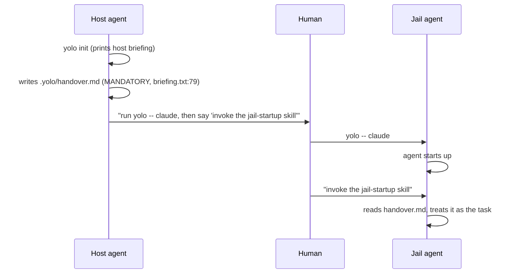

# Host→jail handoff — why the jail-startup skill is the wrong shape

**Status:** IMPLEMENTED, 2026-08-23 (`dbfb4cc8`, `415d353b`, `8f01278c`, `994ff3ce`,
`459937ca`). Decided 2026-08-22.

> **2026-08-23.** Shipped, with two divergences from what §4 and §8 specify — one the
> design asked for and the code could not have (the standing briefing line), one the
> design missed outright (a consume that must be gated on delivery). Both are in
> **§9**, which is the section to read against the code. §1–§8 are preserved in their
> original tense, describing the design as it was decided the day before, so §4's
> "plus the standing line" is a record of the decision, not of the system.

**The short version.** "Start a project, get into a jail" is really two events that got fused into one: a **one-time transition** (the host agent sets up the jail and gets in) and a **recurring startup** (every session the agent orients itself and finds its task). The built-in `jail-startup` skill enforces the fusion by making "read `.yolo/handover.md`" a ritual that runs on *every* session — which is exactly right for neither half. It's wrong for the recurring half (it re-reads a stale file as the task on every session) and it buries the transition half's real job: the host agent gathers context the jail can't see, provisions the access it needs, and has to carry that context *and the task* across the boundary fluidly, without a ritual. My recommendation: keep the transition on the host (`yolo init` + its briefing), keep the orientation passive (the environment briefing already in `CLAUDE.md`), **delete the skill** (the ritual), keep the handoff file (the carrier), and make the carry-in fluid and one-time. The open question is how the jail agent tells a *fresh* handoff — work it — from a *stale* one — ignore it.

**Reads with:**

- [`agent-briefings.md`](agent-briefings.md) — the environment briefing this proposal leans on; where "you're in a jail" orientation already lives.
- [`jail-home.md`](jail-home.md) — the `.yolo/` dir, where `handover.md` lives and what is per-workspace vs. shared.
- [`self-documenting-cli.md`](self-documenting-cli.md) — why the transition belongs in `yolo init`'s own output rather than in a skill.

---

## 1. The diagnosis

A handoff is a **one-time** event. A startup ritual is a **recurring** one. The `jail-startup`
skill treats a one-time event as if it were recurring, and that is the whole problem.

Concretely: the host→jail handoff happens *once*, when a fresh jail is first entered. But a
skill is something the agent may invoke on *any* session. So on the one session the handoff was
meant for, the skill does its job (there's a `handover.md`, the agent reads it). On every
session after that, the skill does the same thing to a file that is now stale or gone — and the
agent's actual task is not in that file at all, it's what the user is about to say.

This session is the evidence. A `handover.md` dated ~four weeks earlier, describing a bug whose
whole architecture had since been refactored away, was read as *my* task list, and it took a
human interrupting to notice that the file and the task had nothing to do with each other. That
is not a stale-file bug; a stale file is the *expected* state of a recurring ritual pointed at
a one-time artifact.

## 2. What exists today

Three separate artifacts, all of which read as "startup," plus one data file that connects two
of them.

| Artifact | Where | Role |
|---|---|---|
| **Host briefing** | `internal/cli/briefing.txt`, printed by `yolo init` (`init.go:114` via `printBriefing`) | "How to transition into the jail" — instructions for the *host* agent. |
| **Jail environment briefing** | `internal/jailcontent/briefing.go`, `BriefingContent` (`:200`) | The `# YOLO Jail Environment` block already in this repo's `CLAUDE.md`. Passive, always present. |
| **`jail-startup` skill** | `internal/jailcontent/builtinskills/jail-startup/SKILL.md` | The jail-side ritual: "read `.yolo/handover.md`, it's REQUIRED, it's your task." |
| **`.yolo/handover.md`** | per-workspace, gitignored (`.yolo/` added by `init.go:79`) | The data file: the host agent writes it, the jail agent reads it. |

The flow the current design wires up is a **passive relay** — the human is a dumb pipe:



Three things load on the human in this picture, and all three are friction that buys nothing:
they run the entry command, they type a **magic phrase** ("invoke the jail-startup skill",
`briefing.txt:95`), and they trust a file the host agent wrote that they themselves have not
read.

## 3. Why the skill is the wrong mechanism

The skill does four things, and each is either redundant or actively wrong for the flow you want.

1. **It makes `handover.md` authoritative on every session, not just the transition.** "The outer
   agent was REQUIRED to write a handover document... Read it now" (`SKILL.md:13`). Treating the
   file as the task is *right* at the transition — that's the point of the handoff, §4. What is
   wrong is doing it on the 40th session too, when the file is stale and its work is long done.
   This session went sideways on exactly that: a four-week-old handoff, read as the current task.

2. **It re-derives orientation it already has.** Step 2 says "the `# YOLO Jail Environment`
   briefing you already loaded covers the environment" (`SKILL.md:30`). That briefing is
   `BriefingContent` in `briefing.go`, injected into `CLAUDE.md` on every boot. The skill's
   orientation step is a pointer to something that's *already in context*. Delete the skill and
   the orientation is untouched.

3. **It needs a trigger that may not fire.** The human has to say "invoke the jail-startup
   skill." A skill is model-invoked; nothing guarantees the model does it, and nothing guarantees
   the human remembers the phrase. A startup behavior that depends on an unguaranteed invocation
   on both ends is a startup behavior that will intermittently not happen.

4. **It runs on every session, for a one-time event.** This is the structural point from §1.
   The skill has no way to know whether it's the handoff session or the 40th session after, and
   so it behaves identically in both.

The net of this: the skill's only non-redundant, non-wrong contribution is the file read in
Step 1. Everything else is either already done by `BriefingContent` or is the friction above.
That is a small thing to be deleting a built-in for, and it's the thing that's broken.

## 4. The proposed shape

The fix is to **unfuse** the two events and give each the mechanism that fits it.

**P1 — The transition is host-side and one-time.** `yolo init` and its host briefing own it.
The host agent's job, end to end, is: scaffold the jail, set the config, **gather the context
the jail won't have access to, provision the access it needs, and write the handoff** — that
gathered context plus the task, carried forward for the jail. The human is *not* a relay of the
task or the context; they just enter. That is the flow you described (steps 1–3), and the
handoff is what carries the host agent's work across the boundary.

**P2 — The startup is passive.** The jail agent is oriented by the environment briefing, which
is already in `CLAUDE.md` and already correct. There is no startup *ritual*. The agent comes up
and waits for the user.

**P3 — The task comes from the handoff at the transition, and from the user after.** A *fresh*
handoff is the task; a *stale* one (a later session, the work already started) is at most
context and is never re-read as the task. This is the whole of the fix: the handoff is a
one-time transition artifact, not a recurring source of truth.

The flow becomes:

```mermaid
sequenceDiagram
    participant H as Host agent
    participant U as Human
    participant J as Jail agent
    H->>H: yolo init (prints host briefing)
    H->>H: gather context the jail can't see; provision access
    H->>H: write .yolo/handover.md (context + task)
    H->>U: "enter with yolo -- claude"
    U->>J: yolo -- claude
    J->>J: agent starts up; reads the fresh handoff, works the task
```

Two concrete changes follow from P1–P3:

- **Repoint the host briefing** (`briefing.txt`). Today its "WHAT TO DO NOW" block
  (`:61`–`102`) is organized around the handoff ritual: review config, `yolo check`, write a
  **mandatory** `handover.md`, ask the human to restart, tell them the magic phrase. That becomes:
  review config, `yolo check`, **gather the context the jail can't see and provision the access it
  needs, write the handoff (context + task), then tell the human to enter with `yolo -- claude`**.
  The handoff stays mandatory — it is now the *deliverable* — but the **magic phrase** and the
  "the human relays the task" framing go away: the human just enters.
- **Delete the `jail-startup` skill.** Its content is either redundant (the orientation, P2) or
  the recurring-ritual prior (§3) — the mandatory, magic-phrase, every-session shape that re-reads
  a stale handoff as the task. The on-demand skills (`configuring-the-jail`,
  `diagnosing-the-jail`) stay — those are user-requested, not startup, and are what the
  environment briefing already points at.

**The handoff's shape: durable content + a minimal pointer, consumed by the run pipeline.** The
handoff content — gathered context, provisioned access, the task — is long-term important, so the
host agent *files it in a durable, committed spot* in the workspace rather than holding it in a
transient file that gets erased. `.yolo/handover.md` is then a *minimal pointer* to that durable
content, and it is the fresh-vs-stale signal. On every launch, the **run pipeline**
(`refreshJailBriefings`, host-side — not the agent, which is unreliable at self-erasure) does three
things if a pointer is present: it reads the pointer, renders the handoff into the environment
briefing as a **Handoff section**, and **consumes the pointer** (renames it to
`handover.md.consumed`, leaving a visible "already got its handoff" state). The section itself
says "this is the task — work it." With no handoff there is no section, and the agent's default —
wait for the user — is the whole story, so no standing line is added: an always-present line would
move the pinned jail-header bytes (`TestBriefingJailHeaderIsUnchanged`). So the first launch shows
the handoff and consumes the pointer; later launches find no pointer and the task comes from the
user. The durable content stays committed for the long term. This is what turns the file from
"always the task" (the recurring ritual, §3) into "the task at the transition, context after."

## 5. What it deletes, and what it forecloses

**Deletes**

- The skill: `builtinskills/jail-startup/` and its entry in the embed
  (`builtinskills/embed.go:19`).
- The magic-phrase and human-relays-the-task framing from the host briefing
  (`briefing.txt:79`–`98`). The handover-writing itself is NOT deleted — it stays, and becomes
  the explicit final step.
- The references in `AGENTS.md` and the design docs that point agents at the skill.

**Touches, in service of the deletion**

- The built-in-suite test sentinel. `jail-startup` is currently the *probe* the tests use to
  assert "the built-in suite staged at all" (`skills_test.go:56`, and the per-target loop at
  `:209`–`248` uses `jail-startup/SKILL.md` as the existence check). Deleting the skill means the
  suite still has members (`configuring-the-jail`, `diagnosing-the-jail`, and the gated
  `developing-yolo-jail`), so the sentinel moves to one of those — the test keeps asserting the
  same invariant, against a different name.

**Forecloses**

- Nothing the handoff is for. The host-agent-carries-work-in case is *the* case, not a foreclosed
  one (OQ-2, resolved). What this design forecloses is the **ritual** — the mandatory-file +
  magic-phrase + every-session shape — not the carry-in. The file stays; the ritual goes. The only
  thing genuinely foreclosed is the alternative of dropping the file entirely (§6), which would
  break the carry-in and is now rejected.

**Does not change**

- The `yolo init` → config → `yolo -- <agent>` flow itself. That is the new-project/new-jail
  flow you said you still need, and it survives intact — only the *handoff* half of it changes
  shape. The environment briefing, the config scaffolder, the entry command, all untouched.

## 6. Alternatives considered

| Alternative | Verdict |
|---|---|
| **Keep the skill, make it passive/conditional** (fire only on a fresh `handover.md`, else defer to the user) | Rejected. Still a skill — the thing you're skeptical of — and it needs a freshness or consumption heuristic to know "fresh," which is exactly the first-vs-later-session distinction §1 says the design shouldn't have to make. The orientation it would add is already in the briefing. |
| **Keep the skill as-is** | Rejected. It is the mechanism causing the confusion; this is the status quo that produced this session. |
| **Consume the handover on first read** (rename/delete `.yolo/handover.md` once the first session reads it, so later sessions find nothing) | Now the leading candidate for the one-time mechanism (OQ-4). It encodes "one-time transition" exactly: a present handoff is fresh, a consumed one is stale. The cost is a consumed-marker and a write the agent — or, better, the entrypoint — must make. This is the mechanism to decide in OQ-4. |
| **Delete the skill + keep the handoff as the one-time carrier** | **Recommended.** §4. The file carries the host agent's context + task; the carry-in is fluid and one-time (OQ-4). |
| **Delete the skill + the file mechanism entirely** | Rejected now. It forecloses the host-agent-carries-work-in case, which OQ-2 confirms is real. A user-as-relay model can't carry gathered context or provisioned-access notes across the boundary. |
| **A host-side skill for the new-project/new-jail flow** | Rejected. The host agent already gets the whole flow from `yolo init`'s printed briefing (the self-documenting-CLI principle); a host-side skill would duplicate the CLI's own output. |

## 7. Risks

| Risk | Mitigation |
|---|---|
| Deleting the skill changes the built-in suite; the test uses `jail-startup` as its sentinel | Move the sentinel to a surviving member (`configuring-the-jail`). The invariant ("the built-in suite reached every declared target") is unchanged; only the name probed changes. |
| An existing user on the passive-relay model sees a behavior change | That is the intended simplification, and it's a one-paragraph note in the host briefing (the new "write the handoff, then tell the human to enter" step) rather than a silent removal. |
| A fresh jail agent reads a STALE handoff as the task (this session's bug) | The one-time mechanism (OQ-4) is what prevents it: a consumed/marked handoff is not re-read as the task. Until OQ-4 is settled, the environment-briefing line ("a stale handoff is context, never the task") is the guard. |
| The host agent gathers context and provisions access but forgets to write the handoff, so the jail agent starts blind | The host briefing's final step is now explicitly "write the handoff (context + task), then tell the human to enter." The carry-in only works if the host agent does its part; the briefing makes that part explicit and last. |

## 8. Sequencing

The work lands in this order, each a coherent commit:

1. Delete the `jail-startup` skill (dir + embed entry) and move the built-in-suite test sentinel
   to a surviving member.
2. Repoint the host briefing (`briefing.txt`): drop the magic phrase and the human-relays-the-task
   framing; make the final step "gather context + provision access, **file the handoff content in
   a durable committed spot, write a minimal `.yolo/handover.md` pointer to it**, then tell the
   human to enter with `yolo -- claude`."
3. Add the handoff's shape to the environment briefing (`briefing.go`): a **Handoff section**
   rendered from a fresh pointer, plus the standing "a Handoff is the task; otherwise the user is
   the source" line.
4. Wire the run pipeline (`refreshJailBriefings`) to read a fresh pointer when building the
   briefing, render the Handoff section, and **consume the pointer** (deterministic, not agent
   self-erasure).
5. Sweep the references (`AGENTS.md`, the design docs) and any stale `.yolo/handover.md` handling
   that still assumes the file is mandatory or is the whole content.

## 9. Follow-up: what shipped, and where it diverges from §4

Implemented 2026-08-23. §1–§8 above are the design as decided; this section is the system.
Two things came out different, and both are worth knowing before reading the code.

### 9a. There is no standing "where your task comes from" line

§4 and §8-step-3 call for a line that is *always* in the briefing, so an agent with no
handoff knows to wait for the user. It does not exist, and cannot cheaply: the jail's
config-independent header bytes are pinned by `TestBriefingJailHeaderIsUnchanged`, and an
always-present line moves that surface for every existing user. Weighed against what the
line buys — restating a default the agent already follows — the pinned bytes won.

The one-time-ness the line was really carrying moved *inside* the conditional section,
where it costs the pinned header nothing: a rendered Handoff now says the section appears
once and its pointer has been consumed. §7's risk row ("until OQ-4 is settled, the
environment-briefing line is the guard") is moot — OQ-4 settled, and the consume is the
guard.

> [!WARNING]
> This divergence shipped with three comments and one design section still asserting the
> standing line, including a test whose prose claimed a behavior the same test's code
> denied. If you are about to add the line back, the veto is a pinned-bytes test, not an
> oversight — read `TestBriefingJailHeaderIsUnchanged` first.

### 9b. Consuming is gated on a briefing actually being written

§4 says the run pipeline "reads the pointer, renders the handoff, and consumes the
pointer," and the first implementation did those three in that order, unconditionally. That
loses handoffs. The briefing-write loop is driven by pack *declarations* — a jail whose
packs declare no briefing destination writes nothing at all (the zero-pack jail
`run.go`'s `warnIfNoPacks` describes) — so an unconditional consume burned the pointer on
exactly the launch that could not deliver it.

The rule is therefore **read before the render, consume after the write, only if a briefing
was written**. The two failure directions are deliberately asymmetric: a consume that fails
means the handoff resurfaces next launch (noisy, never lost), while a consume that succeeds
without delivery loses the task outright, so the gate protects the second.

### 9c. The residual: core cannot tell an agent from a shell

What the gate does *not* fix, and cannot: **core has no agent concept** (`AGENTS.md`), so
`yolo -- bash` writes the same briefing files as `yolo -- claude` and consumes the handoff
just as thoroughly. Gating on "is the target an agent" would reintroduce the registry the
pack system exists to have deleted, so the design does not.

The mitigation is visibility rather than prevention: the launch that consumes a handoff
prints, on stderr, which file it took and the `mv` that puts it back. A burn stays
recoverable, and the human sees it at the moment it happens instead of an agent discovering
it by never getting a task. `handover.md.consumed` is the recovery artifact, which is why
the mechanism renames rather than deletes.

### 9d. Where the behavior is pinned

| Fact | Test |
| :--- | :--- |
| A filed pointer reaches the briefing the jail reads, and is then consumed | `internal/cli/run/consumehandoff_test.go` — `TestRefreshJailBriefingsCarriesHandoff` |
| A launch that writes no briefing leaves the pointer fresh | `TestRefreshJailBriefingsKeepsHandoffWhenNothingCarriesIt` |
| No pointer ⇒ no section, no marker, no notice | `TestRefreshJailBriefingsHandoffSurfacesOnce` |
| The section's own content | `internal/jailcontent/briefing_test.go` — `TestBriefingContentHandoff` |

> [!NOTE]
> The wire tests drive `refreshJailBriefings`, not the helpers, on purpose. The first
> version of this feature was tested at the helper level only and stayed green with the
> call site deleted — measured, not hypothesized. `AGENTS.md` names that shape; this is the
> sixth instance found in the repo. There is still **no integration coverage**: nothing in
> `integration/` runs a real launch against a filed pointer.

## Decision Ledger

OQ-1 through OQ-4 resolved 2026-08-22 (design). OQ-5 and OQ-6 are implementation-time
rulings from the 2026-08-23 review; both are divergences from §4, documented in §9.

| ID | Ruling / Decision | Date | Settled in |
| :--- | :--- | :--- | :--- |
| OQ-1 | Keep `.yolo/handover.md` as the transition carrier — the file stays. | 2026-08-22 | §4 |
| OQ-2 | The host-agent-carries-work-in case is real; the file is the carrier for real work, not garnish. | 2026-08-22 | §4, P1 |
| OQ-3 | Keep the enter-instructions in `yolo init`'s host briefing. | 2026-08-22 | §4 |
| OQ-4 | Consume-on-first-read, done by the **run pipeline** when it builds the briefing; the content is filed + committed and the pointer is minimal. | 2026-08-22 | §4 (handoff's shape) |
| OQ-5 | **No** standing "where your task comes from" line — the pinned jail header vetoes it. One-time-ness is stated inside the conditional section instead. | 2026-08-23 | §9a |
| OQ-6 | Consume is gated on a briefing having been written this launch; read before the render, consume after the write. The agent-vs-shell residual is mitigated by a stderr notice, not by an agent test. | 2026-08-23 | §9b, §9c |
