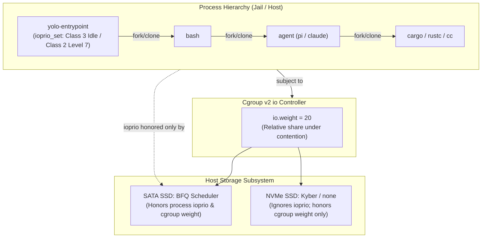

# Yielding the disk — process I/O priority, cgroup io.weight, and what each scheduler enforces

**Status:** DESIGN, 2026-09-27. Nothing built. Evidence verified at `302b0abb`.

> **In short.** Linux disk isolation requires coordinating two distinct mechanisms:
> process I/O priority (`ioprio_set`), which is unprivileged and inherited by child
> compilers but only enforced by schedulers like BFQ; and cgroup v2 `io.weight`, which
> governs all block devices but requires host systemd controller delegation. Yolo should
> expose a declarative `resources.io` configuration that sets process-level idle/low
> priority unconditionally inside the jail, applies cgroup `io.weight` when the host
> delegates it, and diagnostically discloses scheduler and delegation gaps in `yolo check`
> rather than silently accepting dead configuration.

**Why it matters.** A multi-threaded compiler run (such as `cargo build` in a Rust jail)
can drive disk utilization to 95–99% on SATA or NVMe storage. Even with `CPUWeight`
limiting CPU consumption, uncapped disk operations stall host desktop environments,
window managers, browser IPC, and editor responsiveness.

**The shape.** A new `resources.io` configuration block with `priority` (process-level
`ioprio`) and `weight` (cgroup v2 `io.weight`), enforced in `yolo-entrypoint` via
`SYS_IOPRIO_SET` and in `podman` via `--cgroup-conf`, with diagnostic visibility in
`yolo check` and the launch briefing.

**Cost.** Low process I/O priority increases compile and build times inside the jail
whenever the host disk is under contention. Kyber-scheduled NVMe drives remain immune
to process I/O priority without host cgroup delegation.

**Start at [§3](#3-the-two-kernel-mechanisms-and-their-reach)** — the split between
BFQ process priority and cgroup controller delegation. Everything else falls out of it.

**Needs your ruling:** [OQ-1](#OQ-1), [OQ-2](#OQ-2), [OQ-3](#OQ-3), [OQ-4](#OQ-4), [OQ-5](#OQ-5).

**Reads with:** [`io-priority-plan.md`](io-priority-plan.md) (the companion implementation
sketch — incomplete while OQs are open),
[`../../scratch/yolo-io-priority-feature-request.md`](../../scratch/yolo-io-priority-feature-request.md)
(the motivating incident report).

---

## 1. Context and Incident Diagnosis

On September 27, 2026, a Rust build inside the `juce-projects` jail ran alongside host
desktop applications. The host SATA SSD (`sdb`) was driven to 95–99% utilization,
stalling interactive applications across the desktop.

An inspection of the system state revealed four critical facts:
1. **CPU throttling was insufficient:** While `CPUWeight=20` successfully throttled CPU
   cycles under contention, disk I/O remained completely unrestricted.
2. **Scheduler divergence:** The affected SATA SSD (`sdb`) was configured with the **BFQ**
   scheduler (`cat /sys/block/sdb/queue/scheduler` $\to$ `[bfq]`), which actively honors
   process I/O priority. However, the host NVMe drive ran **Kyber**, which ignores process
   I/O priority.
3. **Missing cgroup delegation:** The host's systemd user manager did not delegate the `io`
   controller to rootless user slices. `/sys/fs/cgroup/user.slice/.../cgroup.controllers`
   held `cpu memory pids`, but **not** `io`.
4. **Child process fan-out:** The build spawned nested compilers (`rustc`), build scripts,
   and test harnesses. Manually wrapping build commands with `ionice` in the terminal was
   unreliable and ergonomically unacceptable for agent workflows.

---

## 2. Non-Goals

1. **Absolute disk bandwidth caps by default:** We do not propose hard rate-limiting (e.g.
   `io.max` rbps/wbps) by default. When the host disk is otherwise idle, the jail should
   utilize 100% of available storage bandwidth. We configure *proportional yield* under
   contention, not artificial bottlenecks.
2. **Automated host systemd reconfiguration:** Yolo runs as an unprivileged tool and will
   never run `sudo` or modify host `/etc/systemd/` files directly. If cgroup delegation is
   missing, yolo instructs the human operator on the exact host commands required.
3. **Resolving external host watchers:** Host-side indexing tools (such as Vantage or IDE
   watchers descending into jail build directories) are host configuration concerns,
   addressed in those respective tools.

---

## 3. The Two Kernel Mechanisms and Their Reach

Linux provides two completely distinct mechanisms for controlling storage I/O bandwidth.
Understanding their boundaries is essential to avoiding affirmative lies in configuration.



### 3.1 Mechanism 1: Process I/O Priority (`ioprio_set`)

Linux provides the `ioprio_set(2)` system call (`SYS_IOPRIO_SET`), allowing a process to
set its scheduling class and priority:
- `IOPRIO_CLASS_RT` (1): Real-time. Requires `CAP_SYS_ADMIN`.
- `IOPRIO_CLASS_BE` (2): Best-effort. Priority levels 0 (highest) to 7 (lowest, yielding).
- `IOPRIO_CLASS_IDLE` (3): Idle. The process only receives disk time when no other process
  on the system requests I/O.

#### Strengths
- **Completely unprivileged:** Calling `ioprio_set(IOPRIO_WHO_PROCESS, 0, ...)` for the
  calling process requires zero capabilities and succeeds in any unprivileged container.
- **Inherited across process trees:** Children spawned via `fork(2)` and `clone(2)` inherit
  the parent's I/O priority. Setting it once in `yolo-entrypoint` before `execBash`
  automatically protects all descendant shells, compilers, and tools.
- **Backend-neutral:** Works identically inside a Podman container, inside an Apple
  Container Linux VM, or on the bare host during `yolo host`.

#### Weaknesses
- **Scheduler-dependent:** Process I/O priority is only enforced by multiqueue schedulers
  that explicitly support scheduling classes, primarily **BFQ**. Schedulers common on NVMe
  devices (**Kyber**, **none**, **mq-deadline**) ignore process I/O priorities entirely.

### 3.2 Mechanism 2: Cgroup v2 I/O Controller (`io.weight`)

Cgroup v2 provides the `io` controller, regulating block I/O at the control group level:
- `io.weight`: Proportional I/O weight from 1 to 10000 (default: 100). When multiple cgroups
  compete for disk bandwidth, bandwidth is allocated proportionally ($W_{cg} / \sum W$).
- `io.max`: Max limits on IOPS and bytes per second (`rbps`, `wbps`, `riops`, `wiops`).

#### Strengths
- **Device-agnostic:** Cgroup I/O weights operate at the kernel block layer via `blk-cgroup`
  and `blk-iocost`, providing proportional contention management across NVMe and SATA drives.
- **Group-wide protection:** Protects the host from every process in the container slice,
  even if a process manages to reset its own I/O priority.

#### Weaknesses
- **Host delegation requirement:** Rootless Podman cannot manage `io.weight` unless the
  host systemd daemon delegates the `io` controller down to `user@<uid>.service`.
- **Hard failure on unconfigured hosts:** If `io` is not present in the parent cgroup's
  `cgroup.subtree_control`, passing `--cgroup-conf io.weight=...` causes container runtime
  failures (`crun: write to io.weight: No such file or directory`).

---

## 4. Proposed Configuration Surface

We propose extending the existing `resources` section in `yolo-jail.jsonc`:

```jsonc
{
  "resources": {
    "memory": "8g",
    "cpus": 4,
    "pids_limit": 4096,
    // Storage I/O priority and weight configuration
    "io": {
      // Process scheduling class: "idle" (Class 3), "low" (BE Level 7), or "normal" (BE Level 4)
      "priority": "low",

      // Cgroup v2 proportional weight (1..10000, default 100 under systemd)
      // Applied only when the host delegates the cgroup v2 io controller.
      "weight": 20
    }
  }
}
```

A shorthand syntax is also supported for common configurations:
```jsonc
{
  "resources": {
    // Shorthand: sets priority: "low" and weight: 20
    "io": "low"
  }
}
```

### 4.1 Values and Defaults

| Field | Type | Valid Values | Default | What it affects |
| :--- | :--- | :--- | :--- | :--- |
| `resources.io.priority` | string | `"idle"`, `"low"`, `"normal"` | `"normal"` | Linux `ioprio_set`, macOS `IOPOL_THROTTLE` |
| `resources.io.weight` | integer | `1` .. `10000` | Unset (100) | Cgroup v2 `io.weight` |

- `"idle"`: Sets `IOPRIO_CLASS_IDLE`. Process only does I/O when disk is otherwise silent.
- `"low"`: Sets `IOPRIO_CLASS_BE` with priority level `7`. Process yields to default level `4`.
- `"normal"`: Inherits ambient system default (typically `IOPRIO_CLASS_BE` level `4`).

---

## 5. Architectural Implementation Across Layers

The implementation spans three execution points: container runtime assembly, in-jail
entrypoint initialization, and host diagnostic checks.

### 5.1 Layer 1: In-Jail Entrypoint (`yolo-entrypoint`)

The container entrypoint sets process I/O priority before handing execution to the shell
or agent:

1. `Main()` reads the configured `io.priority` from `YOLO_IO_PRIORITY` (injected by the
   launcher).
2. If `priority` is `"low"` or `"idle"`, `yolo-entrypoint` calls `SYS_IOPRIO_SET` on PID 0
   (`self`):
   ```go
   // IOPRIO_CLASS_BE = 2, level 7
   prioVal := (2 << 13) | 7
   if priority == "idle" {
       // IOPRIO_CLASS_IDLE = 3
       prioVal = (3 << 13) | 0
   }
   syscall.Syscall(syscall.SYS_IOPRIO_SET, 1 /* IOPRIO_WHO_PROCESS */, 0, uintptr(prioVal))
   ```
3. Because process I/O priorities are inherited, all subsequently exec'd processes (`bash`,
   `mise`, `pi`, `claude`, `cargo`, `rustc`) run under the designated I/O priority.
4. If `ioprio_set` fails (e.g. unexpected kernel restriction), the failure is logged to
   `boot.log` as a non-fatal warning; the jail never refuses to boot over process I/O priority.

### 5.2 Layer 2: Container Runtime Options (`podman`)

During container argument assembly (`internal/cli/run/assemble_parts.go`):

1. The launcher checks if `resources.io.weight` is configured.
2. If configured, the launcher verifies whether the host cgroup allows `io` control:
   - It reads `/sys/fs/cgroup/user.slice/user-<uid>.slice/cgroup.controllers`.
   - If `io` is present: emit `--cgroup-conf io.weight=<val>` (or `--io-weight=<val>`).
   - If `io` is **not** present: the launcher **drops** the flag and registers a diagnostic
     notice for the launch briefing and `yolo check`, preventing container creation failure.

### 5.3 Layer 3: Cross-Platform Parity (`macos-user` and `yolo host`)

Following the parity principles of [`backend-parity.md`](backend-parity.md):
- **On macOS (`macos-user`):** Cgroups and Linux `ioprio` do not exist. Instead, the launcher
  applies Darwin process I/O throttling to child processes:
  ```c
  setiopolicy_np(IOPOL_TYPE_DISK, IOPOL_SCOPE_PROCESS, IOPOL_THROTTLE);
  ```
  This deprioritizes APFS tier operations for the process and its descendants.
- **On `yolo host`:** `yolo host -- <cmd>` sets process I/O priority on Linux (or
  `setiopolicy_np` on macOS) before executing the target binary, ensuring commands run at
  the host notch respect the configured priority.

### 5.4 Layer 4: Diagnostic Truth in `yolo check`

`yolo check` must actively audit storage configuration and report mismatches:
- **Scheduler Audit:** For all mounted block devices backing the workspace and container
  storage, check `/sys/block/<dev>/queue/scheduler`. If `io.priority` is configured but the
  active device scheduler is `kyber` or `none`, report:
  ```text
  [WARN] Storage device nvme0n1 uses scheduler 'kyber', which ignores process I/O priority.
         Process I/O yielding will only take effect on BFQ-scheduled devices (e.g. sdb).
  ```
- **Cgroup Delegation Audit:** If `resources.io.weight` is configured but `io` is absent
  from the user cgroup controllers, report:
  ```text
  [WARN] Cgroup v2 'io' controller is not delegated to rootless user session.
         cgroup io.weight cannot be enforced.
         Remedy: Add 'Delegate=yes' to ~/.config/systemd/user/podman.service.d/override.conf
                 or /etc/systemd/system/user@.service.d/delegate.conf.
  ```

---

## 6. Completeness Audit: The Nine Invariants

Applying the completeness checklist from the `design-doc` framework:

1. **Degenerate inputs:** An empty `io` object, missing fields, or unrecognized strings are
   caught at validation (`validateResources`). Weight outside `1..10000` is rejected with
   actionable error messages.
2. **Failure path for every happy path:**
   - `ioprio_set` returns error $\to$ Log to `boot.log`, continue boot unthrottled.
   - Host lacks cgroup delegation $\to$ Drop `--cgroup-conf` flag, print notice in briefing,
     do not abort container creation.
   - Non-BFQ storage scheduler $\to$ Documented in `yolo check`, process priority applied
     anyway (in case requests hit other BFQ devices).
3. **Concurrency and ordering:** Priority is set in `yolo-entrypoint` before any child
   process, daemon, or shell is spawned. No race conditions exist between process creation
   and priority assignment.
4. **Defaults with units:** Default priority is `"normal"` (standard Linux BE level 4).
   Default weight is unset (inherited system default 100).
5. **The trigger, precisely:** Applied once at container creation (for cgroup parameters)
   and once during container init before `execBash` (for process priority).
6. **State that already exists:** Stateless across boots. Existing containers adopt the new
   priority on next restart.
7. **One writer, named:** Host launcher writes cgroup parameters via Podman; container
   entrypoint writes process I/O priority via `syscall.Syscall`.
8. **Forbidden behavior:** Never abort container launch because the host kernel lacks
   controller delegation or runs Kyber. Never attempt `sudo` to alter host cgroup controllers.
9. **What done looks like:** Under a simulated `fio` or `cargo build` load, host desktop
   frame drops and interactive input latency remain flat while the jail build is running;
   `ionice -p <jail_pid>` reports `idle` or `best-effort: prio 7`.

---

## 7. Open Questions

1. 💬 **OQ-1: Scope of process I/O priority inside the jail.** Should process I/O priority
   apply to the entire jail (including background daemons like `yolo-jaild` and `wire-bridge`),
   or only to the interactive agent shell (`execBash`) and its child build tools?

   <!-- vantage: oq id=OQ-1 leaning="Entire jail — daemons perform minimal I/O (sockets and small logs); keeping the whole container in the low I/O class ensures cache flushes and background tools never stall the host." -->

   _Leaning:_ Entire jail — daemons perform minimal I/O (sockets and small logs); keeping the
   whole container in the low I/O class ensures cache flushes and background tools never
   stall the host.

   **Answer:**
   > _(empty — fill in when decided)_

2. 💬 **OQ-2: Cgroup delegation failure behavior.** If a user explicitly configures
   `resources.io.weight` but the host does not have the `io` controller delegated, should
   yolo issue a warning and continue, or should it refuse launch?

   <!-- vantage: oq id=OQ-2 leaning="Warn and continue — refusing to launch when a user adds io.weight on an un-delegated host breaks existing developer workflows for a secondary resource knob. Emit a loud [WARN] with the exact systemd delegation fix." -->

   _Leaning:_ Warn and continue — refusing to launch breaks existing developer workflows for
   a secondary resource knob. Emit a loud `[WARN]` with the exact systemd delegation fix.

   **Answer:**
   > _(empty — fill in when decided)_

3. 💬 **OQ-3: Default priority for all jails.** Should Yolo set `resources.io.priority: "low"`
   by default for *all* jails, or should it remain strictly opt-in?

   <!-- vantage: oq id=OQ-3 leaning="Keep opt-in (default 'normal') in v1, then consider flipping after real-world measurement across workloads. An unexpected slowdown on build benchmarks without user configuration would cause developer confusion." -->

   _Leaning:_ Keep opt-in (default `"normal"`) in v1, then consider flipping after
   real-world measurement across workloads.

   **Answer:**
   > _(empty — fill in when decided)_

4. 💬 **OQ-4: Granular command-level override.** Should `yolo-cglimit` support an
   `--io-priority` flag to allow agents to run specific sub-commands at idle priority even
   when the jail itself is configured at normal priority?

   <!-- vantage: oq id=OQ-4 leaning="Yes — adding --io-priority idle to yolo-cglimit is a small in-jail change (calling ioprio_set before exec) that gives agents a self-throttling lever for background indexing tasks." -->

   _Leaning:_ Yes — adding `--io-priority idle` to `yolo-cglimit` is a small in-jail change
   (calling `ioprio_set` before exec) that gives agents a self-throttling lever for
   background indexing tasks.

   **Answer:**
   > _(empty — fill in when decided)_

5. 💬 **OQ-5: Sub-scheduler warning severity.** When `resources.io.priority` is configured
   but the underlying block device uses Kyber or none, should `yolo check` flag this as an
   `[INFO]` note or a `[WARN]` finding?

   <!-- vantage: oq id=OQ-5 leaning="[INFO] note — Kyber is the standard default for high-performance NVMe drives. Users on modern NVMe drives cannot easily switch to BFQ without kernel reconfiguration. Informing them that process ioprio is inactive on that drive without treating it as a misconfiguration is the honest posture." -->

   _Leaning:_ `[INFO]` note — Kyber is the standard default for high-performance NVMe drives.
   Informing users that process `ioprio` is inactive on that drive without treating it as a
   misconfiguration is the honest posture.

   **Answer:**
   > _(empty — fill in when decided)_
