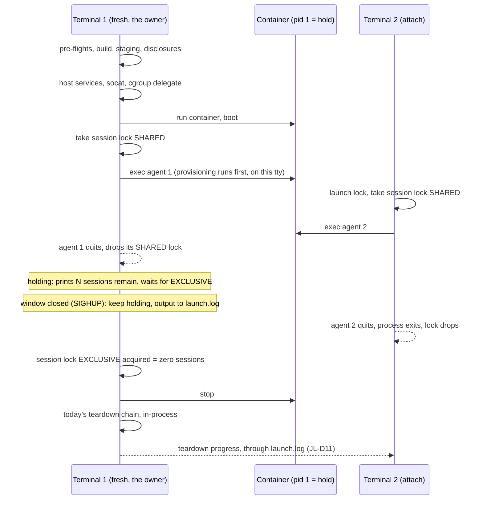
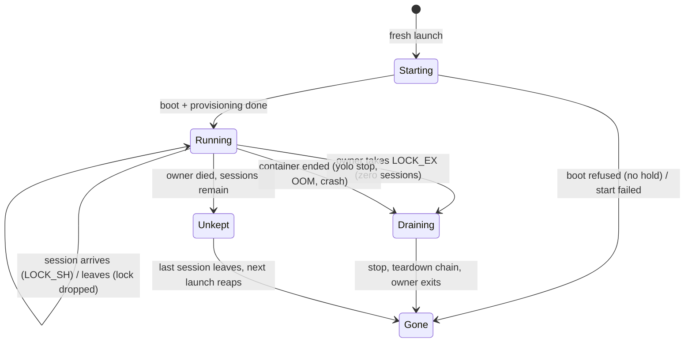

# A shared jail should end with its last session, not its first

**Status:** DESIGN, 2026-09-29. Nothing is built. Evidence was verified against `e0dc759c`, and
the review pass re-checked the citations it corrected against `322cd671`.

> **In short.** "Last one out turns off the lights" is buildable without a central watcher. The
> container half is cheap. The expensive half is that the first terminal's `yolo` process *is*
> the jail's host services. The cheapest answer keeps it that way: after its own agent quits,
> the first launcher **holds** the jail for the others, and a closed window no longer ends it.
> Getting the first terminal's prompt back while others run is what would need a new process,
> one **keeper** per running jail.

**Why it matters.** Today two agents in one workspace share one container. When the first
agent quits, the second one dies mid-task, with no message
([§2](#2-what-ties-a-jail-to-its-first-terminal-today)).

**The shape.** Four parts:

- a hold process as the container's pid 1;
- every session, the first included, entering by `exec`;
- a host-side session lock that each session holds and the kernel releases;
- one **owner** per jail that holds the jail's host services and runs its teardown when that
  lock comes free. Which process that is, is [OQ-JL1](#OQ-JL1).

**Cost.** The container half and the count are small to medium. If the owner stays the first
launcher (the leaning), nothing else moves. If it is a keeper, the fresh-launch arm splits at the
service boundary, and the first session's exit code, boot output and quit-time instrumentation
come from new places.

**Start at [§4](#4-the-proposed-shape)**, the shape. [§5](#5-how-terrible-is-it) answers "how
terrible is this".

**Needs your ruling:** [OQ-JL1](#OQ-JL1). The last quit, an arrival during teardown and a dead
owner were drafted as questions and turned out to be forced by rules already in force; they are
in the ledger as [JL-D11](#JL-D11), [JL-D12](#JL-D12) and [JL-D13](#JL-D13).

**Reads with:** [`jail-lifetime-last-session-wins-plan.md`](jail-lifetime-last-session-wins-plan.md)
(the implementation sketch, incomplete while the question is open) and
[`docs/research/central-yolo-watcher.md`](../research/central-yolo-watcher.md) (the sibling exploration of a machine-wide watcher, being
written alongside this doc). [§11](#11-the-neighbors) lists the other docs, one line each.

---

## 1. The verdict, and the words it uses

**Yes, and without a central watcher.** How big it is depends on [OQ-JL1](#OQ-JL1):

- **If the first launcher stays the owner (the leaning): small to medium.** The container half,
  the count, and a launcher that holds the jail after its own agent quits and survives its
  window closing. No new process kind.
- **If a keeper owns the jail: medium-large, not terrible.** Every piece has a precedent in the
  tree, but the keeper is a new host lifecycle, and it splits the fresh-launch arm.

Either way:

- **Nothing new has to exist while no jail runs.**
- **Nothing in the jail's transport changes.** The host services keep their current code.
- **The pieces have precedents:**
  - a kernel-flock liveness registry (the macos-user session dirs);
  - a pid-1 hold (the refused-boot hold);
  - a descriptor whose EOF means "the launch is gone" (`launchservice.Lifeline`,
    [`launchservice.go`](../../internal/launchservice/launchservice.go));
  - for the keeper only, a detached self-exec helper that outlives its launcher (`yolo internal
    scratch-rm`), a weak precedent because losing that helper costs nothing.

What makes the keeper more than a weekend is that the first launcher's process currently *is*
the jail's host services. Go cannot fork, so a process that hands the prompt back cannot keep
goroutine-hosted services alive: the shell waits on the launcher's pid, and only its exit returns
the prompt. Some other process then has to own them. A launcher that does **not** hand the
prompt back has no such problem, and a closed window is not a returned prompt: nothing waits on
the dead terminal, so the launcher may simply keep running.

### 1.1 Terms

- **Session.** One `yolo` invocation that runs a command in a container jail: its launcher
  process on the host, plus the process tree it started inside the jail. This extends the
  word's macos-user meaning (`paths.HostServicesSessionPrefix`, *"one macos-user invocation of
  yolo"*) to the container backends. There, several sessions can share one container.
- **Owner** *(this doc's use)*. The one host process that holds a running jail's host services
  (the credential fronts, fronted daemons, cgroup delegate and port forwards) and runs its
  teardown. Today it is always the fresh launch's `yolo` process, and the owner-PID file
  (`writeOwnerPID`) names it. Under the leaning it stays that process; under option A of
  [OQ-JL1](#OQ-JL1) it is the keeper.
- **Holding** *(coined here)*. A fresh launcher whose own session has ended while other sessions
  remain, and which keeps running as the owner until the count reaches zero.
- **Keeper** *(coined here)*. A host process per running container jail, started by the fresh
  launch, that is the owner instead of the launcher. It exits once the jail is known gone.
  - **It is not a supervisor.** It restarts nothing and watches no other jail.
  - **It is not a central watcher.** There are as many keepers as running jails, and none when
    none are running.
- **Hold process.** The container's main process, which does nothing but keep the container
  running. It has the shape of `internal/entrypoint/hold.go`'s `holdContext`, which today is
  used only to keep a refused boot open for inspection.
- **Draining** *(coined here)*. The interval between the last session ending and the container
  being known gone.
- **Unkept jail** *(coined here)*. A running container whose owner is known dead. Its sessions
  still run, but its host services died with the owner.

### 1.2 Principles

- **JL-P1. A shared jail lives while any session does.** The maintainer's
  "last one wins", 2026-09-29: *"make it the last one win so that you don't need to have the
  original one open."* That the jail then ends with its last session, and not some time after,
  is my reading rather than the maintainer's words. It is not a principle here: [JL-D12](#JL-D12)
  derives it from the E3 config capture instead.
- **JL-P2. The count is the host's, and the kernel keeps it.** Nothing inside
  the jail can hold the jail open. A jail-visible counter would let a jail process keep the
  jail's host credential services alive after every human has left.
- **JL-P3. "Could not count" is never zero.** If the owner cannot tell
  whether sessions remain, it leaves the jail running and says so. This is the polarity the
  orphan reaper already takes (`pidAlive`: *"never reap a jail we can't prove is orphaned"*,
  [`lifecycle.go`](../../internal/cli/run/lifecycle.go)).
- **JL-P4. One owner per jail, for the jail's whole life.** No handoff between
  processes. This is [HD-R1](host-daemon-ownership.md#HD-R1)'s ledger text, *"spawned by the
  launch that wants it and ends with that jail"*, and its failure-mode section, *"ends with its jail"* ([mode 7](host-daemon-ownership.md#mode-7-it-runs-settings-the-config-no-longer-says)). Both name
  the jail, not the launch process, as the unit. SOURCED. The ruling whose wording is in tension
  with a *keeper* is a different one, [OQ-HS3](host-notch-services.md#OQ-HS3), and
  [OQ-JL1](#OQ-JL1) asks about it.

---

## 2. What ties a jail to its first terminal today

Six rows. Rows 1, 2 and 3 are independent causes: each on its own ties the other sessions to
the first terminal. Row 5 becomes one the moment the first launcher is gone, which is what any
fix that lets that terminal leave produces. Rows 4 and 6 are not causes but constraints on a
fix, and row 6 follows from row 3.

| # | Coupling | Evidence | Kind |
|---|---|---|---|
| 1 | **The first agent is the container's main process.** The run flags are `--rm -i --init --read-only --name <cname>`. The command tail is `bash -c '<provision>; <mise activate>; <banner>; <target>'`, entered through `yolo-entrypoint`, which execs bash. When the agent exits, bash exits, the init's child exits, and the container stops | [`assemble.go:345`](../../internal/cli/run/assemble.go), [`run.go:1560`](../../internal/cli/run/run.go), `buildFinalInternalCmd` in [`command.go:151`](../../internal/cli/run/command.go), `execBash` in [`boot.go`](../../internal/entrypoint/boot.go) | SOURCED |
| 2 | **When pid 1 exits, every exec session dies.** An `exec -d sleep 61` was gone from the container and the host once pid 1 exited. This is the kernel's rule: when a pid namespace's init dies, every other process in it gets SIGKILL | Research lens, 2026-09-29: nested podman 5.8.7, a probe container from `localhost/yolo-jail:latest` with its entrypoint overridden. [pid_namespaces(7)](https://man7.org/linux/man-pages/man7/pid_namespaces.7.html) | MEASURED |
| 3 | **The first launcher's process hosts the jail's host services.** Each loophole's front is a goroutine in it (`ServeFrontWithOptions`), and so is the cgroup delegate. Fronted daemons are Setsid children whose stop handles only it holds. The socat port forwards are its plain children, with no Setsid | [`loopholesruntime.go:427`](../../internal/cli/run/loopholesruntime.go) (*"a goroutine in THIS process"*), `:1082` (Setsid), `:1423` (the front); [`cgddaemon_linux.go:16`](../../internal/cli/run/cgddaemon_linux.go); [`network.go:43`](../../internal/cli/run/network.go) | SOURCED |
| 4 | **An attach will not heal them.** *"A jail whose launcher is gone is relaunched, not attached-and-repaired"* | [`run.go:2132`](../../internal/cli/run/run.go) | SOURCED |
| 5 | **The owner-PID reaper.** Every launch runs `reapOrphanedJails` before its attach decision. That call stops any live `yolo-*` container whose recorded owner PID is dead. So a first launcher that simply left would have its jail stopped by the next `yolo` in *any* workspace. It is a no-op on Apple Container | [`run.go:1002`](../../internal/cli/run/run.go), [`lifecycle.go:181`](../../internal/cli/run/lifecycle.go), `writeOwnerPID` at [`run.go:1511`](../../internal/cli/run/run.go) (fresh path only) | SOURCED |
| 6 | **Teardown runs only in that process.** The chain (`teardownAfterExit`, and the signal arm `onTerminate`) needs values only that launch holds: the socat handles, the daemon stop functions, the scratch-volume launch id, the home skeleton's name and the pack tree | [`run.go:1591`](../../internal/cli/run/run.go), [`run.go:1722`](../../internal/cli/run/run.go); [`trackingcleanup.go:54`](../../internal/cli/run/trackingcleanup.go) (*"this launch is the only one that knows its name"*) | SOURCED |

Rows 1 and 2 are the container coupling. Rows 3 to 6 are the host coupling, and they are where
the cost is if the owner moves.

> [!NOTE]
> **Pressing Ctrl-C in the first agent does not run the launcher's teardown.** Since the
> 2026-09-19 ruling, the TTY proxy forwards `0x03` into the jail as a byte
> ([`ttyproxy.go`](../../internal/ttyproxy/ttyproxy.go), `proxyLoop`). So "I Ctrl-C'd the first
> agent" means the agent chose to exit, which is coupling 1. Only a real SIGINT, SIGHUP or
> SIGTERM delivered to the launcher runs `onTerminate`: a window close, or `kill`. That arm
> runs `stopJail` (`podman stop -t 5`) first, on purpose, and so ends every session a second
> way ([`run.go:1599`](../../internal/cli/run/run.go)). SOURCED.

### 2.1 What already works for any process

Parts of the teardown already key on evidence rather than on which process runs them. Any owner,
a holding launcher or a keeper, can call these unchanged:

- **`stopLoopholes`' directory removal and `forgetGoneContainer`'s tracking-file removal.** Each
  takes the workspace launch lock non-blocking, then asks the tri-state `ps -a` probe whether
  the container still exists. `reapOrphanedJails` already calls `stopLoopholes(nil, …)` from a
  *different* process ([`lifecycle.go`](../../internal/cli/run/lifecycle.go),
  [`loopholesruntime.go:430`](../../internal/cli/run/loopholesruntime.go)). SOURCED.
- **The E3 config capture.** It is idempotent and takes only the workspace and the runtime
  (`captureConfigOnTerminate`, [`runcmd.go`](../../internal/cli/run/runcmd.go)). SOURCED.
- **The scratch-volume remover.** It is detached, and it waits until podman says no container
  references the volumes, so it does not depend on who started it
  ([`scratchremoval.go:170`](../../internal/cli/run/scratchremoval.go), `startDetached` at
  `:234`). SOURCED.
- **The endpoint file.** In-jail clients re-read it on every dial. The code calls this *"the ONLY
  channel that can update an already-running container"*
  ([`svcendpoint/dial.go`](../../internal/svcendpoint/dial.go)). So even a front re-published by
  another process would be found. SOURCED.
- **The in-jail daemon supervisor.** It already has container lifetime. A later exec's
  `yolo-entrypoint` reuses the live supervisor rather than stacking a second one
  (`startJailDaemonSupervisor`, `anyJailDaemonSupervisorAlive` in
  [`entrypoint/runtime.go`](../../internal/entrypoint/runtime.go)). SOURCED.

### 2.2 Which backends have the problem

| Backend | Shared jail? | Has the defect? | Why |
|---|---|---|---|
| podman on Linux | yes | **yes** | rows 1, 2, 3 and 5 |
| podman on macOS (machine) | yes | **yes** | the same causes. The launcher also has **no signal arm at all**: [`proxy_other.go`](../../internal/cli/run/proxy_other.go) ignores `onTerminate`, so a window close skips teardown entirely |
| Apple Container | yes | **yes** | rows 1 to 3, and no signal arm. The owner-PID reaper is a no-op here (row 5 does not apply), so an orphan is never reaped |
| macos-user | **no** | no | *"This backend has no attach — every macos-user invocation is a fresh sandbox"* ([`run.go:379`](../../internal/cli/run/run.go)). Since [HD-D1](host-daemon-ownership.md#HD-D1), each session also has its own host-services dir ([`servicessession.go`](../../internal/cli/run/servicessession.go)) |
| `yolo host` | no | no | each launch owns its services as its own children ([OQ-HS3](host-notch-services.md#OQ-HS3)) |

So "last one wins" means making the container backends behave the way the other two notches
already do.

### 2.3 Four defects found on the way

These exist today, independent of this design. Each should be fixed whichever option is chosen.

1. **Closing an attach terminal probably leaves its agent running headless.** Killing a
   `podman exec` client does not end the process it started. This held for SIGKILL, SIGHUP,
   SIGTERM and SIGINT to an `exec -it` client: conmon keeps the session and its pty, and
   `ExecIDs` kept listing it. The attach passes no `onTerminate`
   ([`run.go:2165`](../../internal/cli/run/run.go)), so after a window close the proxy SIGKILLs
   only its client.
   - The client behavior was MEASURED by the research lens on 2026-09-29, with `sleep` under a
     pty harness.
   - That the same happens to a real agent is INFERRED.
2. **podman's default detach sequence is live wherever the host's `containers.conf` leaves it
   at the default.** yolo sets no `--detach-keys` (`rg detach-keys internal/` finds nothing,
   SOURCED). podman's built-in default for `run -it` and `exec -it` is `ctrl-p,ctrl-q`
   (`podman run --help` and `podman exec --help`, podman 5.8.7 in this jail, MEASURED), and a
   host may override it in `containers.conf`
   ([podman-exec](https://docs.podman.io/en/latest/markdown/podman-exec.1.html), SOURCED).
   Typing that sequence in the first session detaches its client. The launcher would then tear
   down the host services under a container that keeps running. INFERRED from
   `teardownAfterExit`'s order. Passing `--detach-keys=""`, documented as disabling the
   feature, fixes it whatever the host's setting.
3. **An attached session is never told why its jail ended.** After the exec returns, the attach
   prints only the broken-prefix post-mortem and the macOS OOM hint
   ([`run.go:2177`](../../internal/cli/run/run.go)). SOURCED.
4. **The orphan reaper already kills live sessions.** It exists because an uncatchable kill
   leaves the container running (*"Sweep jails orphaned by an uncatchable kill"*,
   [`run.go:1000`](../../internal/cli/run/run.go)). When the first launcher is SIGKILLed, its
   `podman run` client dies but the container does not, so the first agent keeps running
   headless and any attached sessions keep running too. The next `yolo` in *any* workspace then
   stops all of them: `reapOrphanedJails` checks only the owner PID, and no session
   ([`lifecycle.go:181`](../../internal/cli/run/lifecycle.go)). The code is SOURCED; that the
   container outlives its client is INFERRED from the reaper's own premise. The fix is
   [JL-D13](#JL-D13)'s reaper rule, and it applies whichever owner [OQ-JL1](#OQ-JL1) picks.

---

## 3. The options

One more fact is needed to read the table. The design needs **a container that outlives the
first session**. The simplest way is that pid 1 is something other than an agent, and every
agent session enters by `exec`, the first included (coupling 2).

- **One variant was considered and rejected.** pid 1 could be a subreaper that runs the *first*
  agent as its own child and outlives it, with later sessions entering by exec. The first
  terminal would keep `podman run -it`'s attach, and its client would be detached
  programmatically when its agent exits, by sending the detach sequence. That keeps today's
  first-session exit code path, but it makes the first session different from every other one
  (two exit-code paths, two argvs), and it depends on the very detach sequence
  [§2.3](#23-four-defects-found-on-the-way) item 2 wants disabled. INFERRED.
- **What an exec costs is not yet measured.** An exec round trip of `/bin/true` on an idle
  container costs **56 to 71 ms** (research lens, 3 × `podman exec /bin/true`, MEASURED). A
  session's exec does more than that: it runs `/opt/yolo-jail/bin/yolo-entrypoint <target>`
  ([`run.go:2157`](../../internal/cli/run/run.go)), and `entrypoint.Main` runs the whole boot
  step table before `execBash` (`runBootSteps`,
  [`boot.go`](../../internal/entrypoint/boot.go)). *"The entrypoint re-runs every generator on
  each attach"* ([`../reference/composed-file-permissions.md`](../reference/composed-file-permissions.md)).
  SOURCED. So under this design the first session pays a second generator pass after pid 1's
  boot, as every attach already does. The number owed is `podman exec <cname>
  /opt/yolo-jail/bin/yolo-entrypoint true` on a booted jail ([§8](#8-what-done-looks-like)).
  Skipping the table for an exec into a booted jail would be an entrypoint contract change, and
  is not proposed here.

So the options below differ only in **who owns the host services and who runs the teardown**.

| | Option | How | Cost | What breaks or stays broken | Verdict |
|---|---|---|---|---|---|
| **O0** | **Legibility only** | Keep "the jail lives with the first terminal". When sessions remain, the quitting terminal says *"ending this jail ended N other sessions"*. Record a stop reason that an attach reads after its exec ends | Small | Not what was asked. The first terminal still owns every session | **Take its pieces into every option** ([§2.3](#23-four-defects-found-on-the-way)), not as the answer |
| **O1** | **Hold the door, and survive the hangup** | Hold process as pid 1, and every session is an exec. When the first launcher's own agent exits with sessions remaining, it hands the terminal back to cooked mode, prints that it is **holding** the jail for N sessions, waits on the session lock, then runs today's teardown. If its window closes while it holds (SIGHUP), it does not call `stopJail`: it stops writing to the dead terminal, sends its output to `launch.log`, and keeps owning the services until the count reaches zero, which is `nohup` behavior | Small to medium. No new process kind, no relay, no handoff | The first terminal's *prompt* stays occupied while others run. Closing that window, which is the literal ask, no longer ends anyone. A launcher killed outright (SIGKILL, OOM, or its terminal's cgroup scope killed) still leaves an unkept jail, as a keeper's death would | **Leaning** ([OQ-JL1](#OQ-JL1) D), and the first build slice either way ([§7](#7-what-i-would-build-in-order)) |
| **O2** | **Successor at quit** (the maintainer's "orphan ourselves") | O1's container. When the first launcher quits with sessions remaining, it spawns a detached per-jail successor from a written ownership record. The successor re-fronts the running daemons on fresh ports, re-publishes their endpoint files, respawns socat and rebinds the cgroup delegate. The launcher waits for the successor's ready signal (about 1 to 2 s), then exits. The successor tears down when the count reaches zero | Medium-large. A single-session launch costs nothing extra. The handoff code runs only in the multi-session case | **Skew, on macOS only:** the successor is started hours after launch through `os.Executable`, which resolves a *path* ([`execx.go`](../../internal/execx/execx.go)), so it can run a binary `just install` replaced. On Linux the launcher can pin its own inode by opening `/proc/self/exe` at start, so this is a choice rather than a cost there. **Gap:** in-flight connections drop at the handoff. **Blind spot:** re-published fronts are never checked by the boot-time reachability witness, and a nested jail cannot check them either (the `--net=host` carve-out). **Rarity:** the path runs rarely, so it rots | Rejected ([OQ-JL1](#OQ-JL1) B). What decides it is rarity: the multi-session path is the one that seldom runs, so it rots. The reachability blind spot is the second reason |
| **O3** | **Keeper from the start** | The fresh launch does its pre-flights, approvals, build, staging and disclosures in the terminal as today, then starts the keeper. The keeper starts the host services and the container, relays boot progress to the terminal until the jail is ready, and runs the teardown chain in-process when the count reaches zero. The foreground then becomes an ordinary session | Medium-large. A heavy-track change to the fresh arm | Every launch pays one process spawn and a pipe. The fresh arm's output stream, exit code and Window A accounting move ([§5](#5-how-terrible-is-it)). A keeper that dies leaves an **unkept jail** ([JL-D13](#JL-D13)). It is a new host lifecycle, one per jail, which [OQ-JL1](#OQ-JL1) puts to the rulings it strains | [OQ-JL1](#OQ-JL1) A: the answer if the first terminal must get its prompt back |
| **O4** | **Migrate among live launchers** | O1's container, plus an owner election over a kernel flock. When the owner leaves, one attached launcher wins and rebuilds the host services from the running jail's records | Medium-large. No detached process at all | **Attach skew becomes ownership skew:** the winner's binary and config may differ from the jail's. The fronted daemons are Setsid children ([`loopholesruntime.go:1082`](../../internal/cli/run/loopholesruntime.go)) that outlive the old owner, so a takeover that only re-creates the goroutine fronts spawns nothing and owes no new disclosure. What it does need is a record of the caller tokens and the daemons' process-group ids, and a guarantee that only one front exists at a time, which the attach arm's comment forbids breaking (*"starting a second front over the same endpoint file would hand the jail a credential its terminator never asked for"*, [`run.go:2132`](../../internal/cli/run/run.go)). The gap is total on SIGKILL. Most concurrency to test | Rejected. It spreads one jail's ownership across whichever terminals happen to be open |
| **O5** | **Per-session host services** | Each session owns the services its own agent uses, as macos-user already does | Large | The genuinely jail-wide services remain: port forwards bound at fixed mounted socket paths, the cgroup delegate, and in-jail daemons that serve every session. Those still need O2, O3 or O4 | Rejected as a replacement. Worth revisiting later to shrink what the owner holds |
| **O6** | **podman's own lifetime features** | `podman pod create --exit-policy=stop` stops a pod *"when the last container exits"* ([podman-pod-create](https://docs.podman.io/en/latest/markdown/podman-pod-create.1.html), SOURCED). That would mean one container per session sharing a pod's namespaces. `--restart` conflicts with `--rm` (research lens, MEASURED). Quadlet and healthcheck timers are systemd | Large, and backend-specific | Pods count containers, not exec sessions. Apple Container has no pods. None of these owns the host services, so an owner of them would still be needed | Rejected |
| **O7** | **The container counts its own sessions** | pid 1 exits after the last session, counting either per-session `--preserve-fd` death pipes or locks in a jail-visible directory. Whichever launcher sees the exit tears down | Medium | It solves nothing on the host: the services still live in the first launcher. `podman exec --preserve-fds=N` passes descriptors with no runtime restriction in its documentation (the list form `--preserve-fd` is documented as crun-only), and neither is available with the remote Podman client, which is every Mac ([podman-exec](https://docs.podman.io/en/latest/markdown/podman-exec.1.html), SOURCED; both flags in `podman exec --help`, 5.8.7, MEASURED). A jail-visible count breaks [JL-P2](#JL-P2) | Rejected as the count. The death pipe is kept as an optional refinement on local Linux podman ([JL-D4](#JL-D4)) |

---

## 4. The proposed shape

O1, the first launcher holding the jail, subject to [OQ-JL1](#OQ-JL1). The container half
([§4.1](#41-the-container-a-hold-process-as-pid-1-and-every-session-an-exec)) and the count
([§4.2](#42-the-count-a-host-side-session-lock)) are the same under every option but O0.
[§4.3](#43-the-owner) describes the owner under the leaning, and what a keeper would change
under option A.

### 4.1 The container: a hold process as pid 1, and every session an exec

- **pid 1 is the entrypoint's boot followed by a hold.** It runs today's boot, then blocks until
  it is signalled. It never runs an agent.
- **Only `provisionScript` leaves the command tail, and it goes to the first session, not to
  pid 1.** Today `buildFinalInternalCmd` puts three things before the target
  ([`command.go:151`](../../internal/cli/run/command.go)): `provisionScript`, `miseActivate` and
  the executing banner. SOURCED.
  - `miseActivate` and the banner are per-shell. `execBash` already redoes both for every exec
    (it sources `yolo-user-env.sh`, evals `mise env` and prints `executingLine`,
    [`boot.go`](../../internal/entrypoint/boot.go)), so they stay per session. SOURCED.
  - `provisionScript` runs once per container, and its failure branch asks *"Provisioning failed
    — continue anyway? [Y/n]"* only when `[ -t 0 ]`
    ([`provision.go`](../../internal/provision/provision.go)). SOURCED. A pid 1 has no tty (and
    under a keeper its stdio is a pipe), so provisioning there would silently continue where a
    user at a terminal is asked today. So it runs inside the **first session's** exec, which has
    the first terminal's tty. Any other session that arrives before it finishes waits on a done
    marker the provisioning writes.
- **Every session enters by exec.** This is today's attach argv, `<rt> exec -i [-t] <cname>
  /opt/yolo-jail/bin/yolo-entrypoint <target>` ([`run.go:2157`](../../internal/cli/run/run.go)),
  for the first session too.
- **A session's exit code is its command's.** `yolo -- make` returns `make`'s code, as it does
  today. The macOS OOM hint (`maybeWarnAboutOOMKiller`, keyed on exit 137) has to be re-derived
  from the exec's code, since the container's own code is no longer the first session's.
- **No exec starts before provisioning finishes.** This includes an attach that races the
  first launch. Today such an attach can enter once the container is merely running
  (`onStarted` releases the lock after `awaitRunningContainer`, [`run.go:1577`](../../internal/cli/run/run.go)).
  The done marker closes that gap.
- **The refused-boot hold keeps working.** A boot that refuses under the hold opt-in
  (`hold.go`) is ended by its release file or by `yolo stop`. It is never ended by the session
  count ([§4.5](#45-failure-paths)).

### 4.2 The count: a host-side session lock

- **Each session holds a shared lock for its whole life.** Its launcher holds `LOCK_SH` on a
  host-only file keyed by the container name, in host state that no jail mounts. The kernel
  drops the lock however the launcher dies, SIGKILL included.
- **It is taken under the launch lock, before that lock is released.** There is therefore no
  instant at which a session is inside the jail but not counted. The first session takes it
  before its exec.
- **The owner waits for the exclusive lock.** It blocks on `LOCK_EX` on the same file.
  Acquiring it means zero sessions, and at that moment **the jail is draining**: every later
  `LOCK_SH|LOCK_NB` fails. The owner's *own* session drops its shared lock before it waits.
  flock(2) warns that converting a held lock *"is not guaranteed to be atomic: the existing lock
  is first removed"*, so the session's shared lock and the owner's exclusive wait are two
  separate open file descriptions, never one lock upgraded.
- **One shared file hides the count, and that is a choice of layout.** With one file, a session
  learns it was last only after the fact: its lock is gone before the owner's exclusive take
  succeeds. The alternative is `servicessession.go`'s registry shape: one file per session,
  each held `LOCK_EX` by its session
  ([`servicessession.go`](../../internal/cli/run/servicessession.go)). A quitting session can
  then probe its siblings with `LOCK_SH|LOCK_NB` before it releases its own, and know it is
  last. The registry costs a directory scan per count, and two sessions quitting at once can
  each see the other alive, so the owner still has to be the one that decides. The implementer
  picks; [JL-D11](#JL-D11) does not need a session to know beforehand.
- **An arrival that fails its shared take is arriving during a drain.** It **releases the launch
  lock**, prints that the jail is shutting down, waits for the owner's liveness lock, then takes
  the launch lock again and launches fresh ([JL-D12](#JL-D12)). It must not wait while holding
  the launch lock. The teardown's guards take that lock non-blocking and back off, so a waiting
  arrival that held it would make `stopLoopholes` leave the sockets dir (*"Another yolo
  invocation is launching …"*, [`loopholesruntime.go`](../../internal/cli/run/loopholesruntime.go))
  and `forgetGoneContainer` leave the tracking file, skeleton and pack tree
  ([`trackingcleanup.go`](../../internal/cli/run/trackingcleanup.go)). SOURCED. That would turn
  the common "quit, then relaunch" into a leak, left for a reaper meant only for launches that
  *"died with no teardown at all"*.
- **Lock ordering, stated so it cannot deadlock.** An arrival takes the launch lock and then
  the session lock, and never waits on the owner while holding the launch lock. The owner
  **never blocks on the launch lock**. A relaunch that does hold it (the attach-skew restart,
  which holds it throughout on purpose: `restartJailForAttach` in
  [`contracttags.go`](../../internal/cli/run/contracttags.go)) keeps its own host-services dir,
  exactly as today.
- **`ExecIDs` is for display only.** `jailSessionCount` stays the number shown to a human
  ([`contracttags.go`](../../internal/cli/run/contracttags.go)). Its `+1` for "the main
  process" goes, because the main process is no longer a session. It is never the count that
  decides anything, because it also counts headless orphans
  ([§2.3](#23-four-defects-found-on-the-way) item 1), and Apple Container's value is
  unmeasured.

### 4.3 The owner

#### Under the leaning: the first launcher holds

- **Nothing moves.** The fresh launch owns the host services and the teardown, with today's
  code, as today. The owner-PID file keeps naming it.
- **When its own agent exits with sessions remaining, it holds.** It restores cooked mode, prints
  one line (suggested: *"holding jail `<cname>` for N other sessions; closing this window leaves
  them running; `yolo stop` ends them all"*), and waits for the exclusive lock. When that
  succeeds, it runs today's teardown.
- **A hangup while holding is survived.** Its SIGHUP arm, finding the session lock held by
  others, skips `stopJail`, stops writing to the dead terminal (a write to a hung-up tty fails
  rather than killing the process), appends its output to `launch.log`, and goes on holding.
  INFERRED from standard SIGHUP and orphaned-process behavior; not measured here.
- **A deliberate Ctrl-C while holding is the user's.** In cooked mode it reaches the launcher as
  SIGINT. Whether that acts as `yolo stop` once the line above has said so, or asks first, is
  the implementer's. Either way it is never silent.
- **What it cannot do** is give the first terminal its prompt back while others run. The shell
  waits on the launcher's pid.

#### Under option A: a keeper

- **Started once, at the fresh launch, from the launch's own binary.** It is detached in the
  `startDetached` shape: its own session, never awaited. Its version is the launch's only if the
  binary cannot change between the launch's start and the spawn. That window runs from process
  start to after the pre-flights, approvals, nix build and staging, and a build can take
  minutes. `execx.SelfExecArgv` re-resolves `os.Executable()`, a path, at spawn time
  ([`execx.go`](../../internal/execx/execx.go)). SOURCED. On Linux the launch closes the window
  by opening `/proc/self/exe` at start and spawning from that. On macOS there is no such file,
  and the window stays. After start, the keeper's code is in memory, so a later `just install`
  does not change what it runs.
- **It is a host daemon, and is named like one:** `yolo internal daemon jail-keeper`. AGENTS.md
  puts long-lived host processes under `yolo internal daemon <name>`; `scratch-rm` is a one-shot
  helper, not a model for it. It would be the first member of that group that serves no
  loophole ([OQ-JL1](#OQ-JL1)).
- **It moves out of the first terminal's cgroup.** `Setsid` changes the session and process
  group, not the cgroup, so on a systemd host a detached keeper still lives in the first
  terminal's scope. systemd-oomd acts on whole cgroups
  ([systemd-oomd.service(8)](https://www.freedesktop.org/software/systemd/man/latest/systemd-oomd.service.html)),
  and `KillUserProcesses=` ends a session's processes at logout
  ([logind.conf(5)](https://www.freedesktop.org/software/systemd/man/latest/logind.conf.html)).
  SOURCED. So losing the first terminal's scope would still leave every session unkept, which is
  the coupling a keeper exists to remove. podman avoids this for conmon by giving it its own
  scope. Where systemd is present, the keeper does the same (`systemd-run --user --scope`, or
  `StartTransientUnit` over D-Bus), and falls back to `Setsid`. INFERRED; owed on a real host
  ([§8](#8-what-done-looks-like)). The holding launcher under the leaning has the same exposure
  and no such remedy.
- **It owns what the launcher owns today, with today's code:** `startLoopholesDisclosed`'s
  daemons and fronts, the cgroup delegate, the socat forwards, the credential-view registration,
  the owner-PID file (which then names it), and `teardownAfterExit`, run in-process where the
  handles, the skeleton name, the pack tree and the scratch-volume names already are. The
  in-jail daemons bound their ports at boot, and the launch-owned caller tokens stay the
  keeper's.
- **It learns of the container's end, whatever ends it,** without polling: `yolo stop`, an OOM
  kill, or a crash. How (an attached client over pipes, or `podman wait`) is the implementer's.
- **It holds its own exclusive liveness lock for its life.** Until the jail is ready, the fresh
  launch also hands it a lifeline in `launchservice.Lifeline`'s shape, so a launch killed before
  then takes the keeper's half-started services with it.
- **Its output** goes to the pipe the fresh launch relays until the jail is ready, then to
  `launch.log`.
- **The housekeeping slot stays in the foreground launch.** It is *"a post-attach slot inside
  the launch process, which dies with the launch and needs no daemon"*
  ([`minimal-disk-footprint.md`](minimal-disk-footprint.md), its A6;
  [OQ-BF5](disk-levers-and-backfill.md#OQ-BF5) moved the image reap into it).

> [!WARNING]
> **The disclosure still precedes the spawn.** The host-execution disclosure *"has to precede the
> spawn"* ([`run.go:1534`](../../internal/cli/run/run.go)), because a pack-shipped daemon's
> disclosure is the whole trust boundary today ([`packhostgrants.go`](../../internal/cli/run/packhostgrants.go):
> *"the boundary today is DISCLOSURE, not consent"*). Under option A it is printed by the fresh
> launch, in the terminal, **before** it starts the keeper, and the keeper spawns no daemon that
> disclosure did not name. A keeper that printed its own disclosures would print them to a pipe
> after the fact, which is a notification rather than a disclosure. Under the leaning nothing
> changes.

### 4.4 Lifecycle

### 4.5 Failure paths

| Event | What happens | Who finds out |
|---|---|---|
| A non-owner session's launcher gets SIGHUP, SIGTERM or SIGINT (window close, `kill`) | **Only that session ends.** Its signal arm never calls `stopJail`. It sends SIGHUP to its own in-jail process tree ([JL-D4](#JL-D4)), restores the terminal and exits. Its lock drops | nobody else. That is the fix |
| The owner's window closes (SIGHUP) | Under the leaning, if others hold the session lock, it ends its own in-jail session the same way and then holds, writing to `launch.log`. Alone, it tears down as today | `launch.log` |
| A session's launcher is SIGKILLed | Its lock drops, so the count is right. Its in-jail agent may keep running headless until the jail stops. On local Linux podman, the optional death pipe closes this gap | the next quit's display count may include it |
| The last session's launcher dies by any means | The owner drains within one scheduling tick of the lock dropping | [JL-D11](#JL-D11): the teardown goes to `launch.log`, and a last session still alive streams it |
| The owner cannot open the session lock | [JL-P3](#JL-P3): it never drains on the count. It waits only for the container's own end, and logs why | `yolo ps` and the next arrival, which says the jail will end only by `yolo stop` |
| The owner fails before the jail is ready | The fresh launch prints the error and exits non-zero, stopping anything it started, as today | the launching terminal |
| The owner is SIGKILLed or OOM-killed, or its terminal's cgroup scope is killed (systemd-oomd, logout under `KillUserProcesses=yes`) | **Unkept jail.** The fronts and the cgroup delegate die with it. The Setsid daemons and socat are orphaned, as with a SIGKILLed launcher today. A keeper in its own scope ([§4.3](#43-the-owner)) survives the scope case; a holding launcher does not | [JL-D13](#JL-D13) |
| A session arrives during a drain | Its `LOCK_SH|NB` fails. It releases the launch lock, prints that the jail is shutting down, waits for the owner's liveness lock, then launches fresh | that terminal |
| `--rm` fails to remove the container because a headless exec was live at stop | Removal was MEASURED to fail in nested podman (`openByHandleAt: operation not permitted`), leaving a stopped container. After its stop, the owner confirms the container is gone and removes a stopped leftover. It never removes a running one | `launch.log`. A real rootless host is owed a measurement ([§8](#8-what-done-looks-like)) |
| A refused boot under the hold opt-in | The owner does not drain on the count. It waits for the hold's release or `yolo stop`, then tears down | the launching terminal, as today |

### 4.6 What the user sees

- **A fresh launch looks as it does today, up to the agent.** Under the leaning nothing about it
  changes. Under option A the boot lines are relayed from the keeper. A launch has no quiet mode
  ([OQ-RO3](../reference/report-tiers.md#why-its-this-way)), so a relayed line is still printed,
  and the relay only changes which process wrote it.
- **A non-last quit** of an attached session prints one line and returns at once. Suggested
  wording: *"jail `<cname>` stays up for N other sessions; it stops when the last one leaves."*
- **The owner's own agent quitting with others left** prints the holding line of [§4.3](#43-the-owner).
- **The last quit** prints the teardown lines ([JL-D11](#JL-D11)).
- **Every session whose jail ended under it** prints the recorded stop reason (`yolo stop`, OOM,
  the owner gone, an attach-skew restart from another terminal). The owner writes the reason
  record, and it is also printed when a session is refused during a drain.
- **`yolo stop` keeps its effect:** it ends every session and names the count
  (`jailSessionsPhrase`). Its help text changes. Today it says *"a jail lives in the terminal
  that launched it, and exiting (or Ctrl-C-ing) that session tears the jail down with you"*
  ([`stop.go:5`](../../internal/cli/stop.go)). That becomes: a jail lives while any session in
  it does.

### 4.7 Backends

| Backend | What changes | What is owed |
|---|---|---|
| podman on Linux | everything above | a rootless-host run for the `--rm` removal behavior, and under option A for the keeper's fronts and its scope move. The loopback carve-out does not move: the same kind of process binds the same loopback, but a nested jail still cannot check it |
| podman on macOS | the same design. The session lock is a flock on the Mac, so it works with the remote client. The launcher has no signal arm today ([`proxy_other.go`](../../internal/cli/run/proxy_other.go)), so holding through a hangup needs one there; a keeper would not | a Mac run |
| Apple Container | the same design, through `container run` and `container exec` | whether `container exec` behaves as podman's does when its client dies, and whether its detach keys exist (unmeasured) |
| macos-user | **nothing.** Each invocation is already its own sandbox, with services owned by the launch as children ([`macosuserservices.go`](../../internal/cli/run/macosuserservices.go), through `launchservice`) | under option A, the parity question in [OQ-JL1](#OQ-JL1) |

---

## 5. How terrible is it

Plainly: **not terrible.** Under the leaning it is small to medium, with no new process kind,
no new transport, and no change to what the host services are or who runs them. Option A adds a
medium-large, heavy-track change on top.

| Area | Size | Under | Why |
|---|---|---|---|
| pid 1 hold, first session by exec, provisioning on the first session's tty, readiness | small to medium | every option | the hold shape exists (`hold.go`), and the exec argv exists (the attach arm) |
| The session lock, and the reaper honoring it | small | every option | `servicessession.go` is the pattern, and the reaper gains one more tri-state input ([JL-D13](#JL-D13)) |
| Holding, and surviving the hangup | small | the leaning | a new branch in the fresh launcher's quit and in its SIGHUP arm. macOS podman and Apple Container need a signal arm first ([`proxy_other.go`](../../internal/cli/run/proxy_other.go)) |
| Moving services and teardown into the keeper | **medium-large** | A | `runContainer` splits at the service boundary. The code moves; it is not rewritten |
| The fresh arm's output stream | **medium** | A | the relay must keep every progress line and disclosure the terminal shows today, in order ([OQ-RO3](../reference/report-tiers.md#why-its-this-way)) |
| Window A, the linger probe, the timing report | medium | A | these instrument the `podman run` client's exit in the foreground, and that client moves to the keeper. They re-home to the keeper's log or are retired by name |
| The keeper's own cgroup scope | small to medium | A | `systemd-run --user --scope` or D-Bus, with a `Setsid` fallback ([§4.3](#43-the-owner)) |
| Verification | **the real cost** | every option | a nested jail verifies the lifecycle. The two carve-outs (loopback reachability and rootless paths) and both Mac backends need CI or a real host |

What is **not** on the list:

- **Rewriting the fronts.** Whoever owns them runs today's code.
- **Changing the in-jail transport.** In-jail consumers re-read endpoint files per dial and
  bound their own ports at boot. One in-jail change is owed either way: `provisionScript` leaves
  the container's command tail for the first session's exec ([§4.1](#41-the-container-a-hold-process-as-pid-1-and-every-session-an-exec)). Skipping the boot table for
  an exec into a booted jail would be a second, and is not proposed.
- **A central process.**

**Why no central watcher is needed.** Under the leaning the owner is the launch that started the
jail, exactly as today; it only stays alive longer. Under option A the keeper is a watcher of
exactly one jail, spawned by the launch, gone with the jail. That matches
[HD-R1](host-daemon-ownership.md#HD-R1)'s *"ends with that jail"*. It strains two other rulings,
and [OQ-JL1](#OQ-JL1) puts both to the maintainer rather than claiming a fit:

- [OQ-HS3](host-notch-services.md#OQ-HS3): *"A host service lives for the launch that starts
  it"*, leaning *"Concurrency and version skew cannot arise"*. A keeper lets a container jail's
  services outlive the process of the launch that started them.
- [`minimal-disk-footprint.md`](minimal-disk-footprint.md)'s A6 rejected a daemon because *"It
  adds a lifecycle yolo does not have — every host daemon is a hidden `yolo internal daemon`
  subcommand serving a loophole, not a housekeeper"*. A keeper sweeps nothing, but it is a new
  long-lived host lifecycle, one per jail, whose job includes housekeeping: the skeleton, the
  pack tree, the tracking file and the scratch volumes (`teardownAfterExit`,
  `forgetGoneContainer`).

A machine-wide watcher would add, for this feature, only recovery from an owner crash, and it
would bring back a singleton that HD-R1 retired. What a watcher *would* buy elsewhere is the
sibling doc's subject ([`docs/research/central-yolo-watcher.md`](../research/central-yolo-watcher.md)).

| Risk | Mitigation |
|---|---|
| An owner crash leaves live sessions without credentials | A dead owner PID beside a held session lock makes the state known rather than guessed. [JL-D13](#JL-D13) says what an arrival does. The owner holds no state a relaunch needs |
| A single-session launch gets slower | Its session enters by exec, and that exec runs the boot table a second time after pid 1's ([§3](#3-the-options)). The `/bin/true` round trip is 56 to 71 ms (MEASURED); the entrypoint exec is owed a measurement ([§8](#8-what-done-looks-like)). Under A, add one spawn and a pipe |
| Two yolo versions on one machine | An older `yolo` attaching to a held jail takes no session lock, so it is uncounted and ends when the counted sessions do. A newer `yolo` meeting a pre-feature jail finds no session lock and falls back to today's owner-PID rule ([JL-D7](#JL-D7)) |
| The owner's teardown output is lost after its terminal is gone | It is appended to `launch.log`, and the stop-reason record carries the outcome to the next session |

---

## 6. What this does not cover

- **A jail with zero sessions that stays up on purpose,** like a `tmux detach`.
  [JL-D12](#JL-D12) rules out a jail with no sessions staying up, because the last quit waits for
  the teardown ([JL-D11](#JL-D11)). A deliberately detached jail is the sibling watcher doc's
  territory.
- **A grace period** in which a jail with no sessions waits for a quick return. Rejected in
  [JL-D12](#JL-D12).
- **Sharing one jail across different pack sets.** Attach semantics for a different pack set
  are [OQ-ACP1](../plans/agent-config-packs.md#-oq-acp1--what-happens-when-two-people-attach-to-the-same-jail-with-different-pack-sets).
  An attach reads the running jail's pack tree, as today.
- **Retiring the host-scoped singletons.** That is [HD-R1](host-daemon-ownership.md#HD-R1)'s
  build, with its own [OQ-HD10](host-daemon-ownership.md#OQ-HD10). This design keeps each
  launch's front and per-jail daemons with the owner under either state of that retirement.
- **macos-user and `yolo host`,** which have no shared jail ([§2.2](#22-which-backends-have-the-problem)).
  Under option A they are the parity question inside [OQ-JL1](#OQ-JL1).
- **An agent started with a raw `podman exec`** outside yolo. It is not counted and may be
  stopped under its user. That is [OQ-HS3](host-notch-services.md#OQ-HS3)'s *"may lack features
  if not launched correctly"*, applied here.

---

## 7. What I would build, in order

1. **The four defects** ([§2.3](#23-four-defects-found-on-the-way)): an attach's signal arm
   ends its own in-jail process tree; `--detach-keys` is emptied on run and exec; an attach
   whose jail ended prints why; and the reaper declines a jail whose session lock is held
   (which needs the session lock, so it lands with step 2). Each is useful today.
2. **The first build slice: the container half, the count, and holding (O1).** It covers the
   hold process as pid 1, every session by exec, provisioning on the first session's tty,
   readiness, the session lock, the reaper honoring it, and the fresh launcher holding the jail
   after its own agent quits, through a hangup. **Why it comes first:**
   - Everything but the holding is shared by every option except O0, and the holding is small,
     so it is buildable before [OQ-JL1](#OQ-JL1) is ruled.
   - It fixes the reported symptom: quitting the first agent no longer ends the others, and
     closing the first window does not either.
   - It leaves one gap, and says so at the moment it matters: the first terminal's prompt stays
     occupied while others run, and a SIGKILL or scope kill of its launcher leaves an unkept
     jail.
3. **The keeper (O3), only if [OQ-JL1](#OQ-JL1) rules A.** Extract the service half and the
   teardown chain into `yolo internal daemon jail-keeper`, a hidden subcommand as AGENTS.md
   requires, not a binary. Build the relay and the scope move, and move the owner-PID file onto
   the keeper.
4. **The Mac backends.** Add the signal arm the holding needs, measure `container exec`'s
   client-death behavior and the detach keys on Apple Container, and run the lifecycle on both
   Mac runners.

---

## 8. What done looks like

Each of these is observable by a human:

1. **Two sessions, quit the first.** Two terminals in one workspace run agents. Quitting the
   first agent leaves the second working. The second's credential refresh (a broker front
   request) still succeeds after the first agent has quit.
2. **Close the first window.** After step 2 of [§7](#7-what-i-would-build-in-order), closing the
   first terminal's window, holding or not, leaves the second session unaffected. Under option
   A, after step 3, the first terminal also gets its prompt back at once.
3. **Quit the last.** The last quit shows the teardown ([JL-D11](#JL-D11)). Afterwards `podman
   ps -a` lists no container of the name, `yolo config diff` reflects that session's edits, and
   no owner process remains.
4. **Scripts and single sessions.**
   - `yolo -- true` exits 0 and leaves no process and no container behind.
   - `yolo -- false` exits 1.
   - A single-session launch's quit time is within noise of today's, by the Window A records.
   - `podman exec <cname> /opt/yolo-jail/bin/yolo-entrypoint true` on a booted jail is measured,
     so the second generator pass a first session now pays has a number ([§3](#3-the-options)).
5. **`kill -9` the last session's launcher.** The jail drains within a second, and `launch.log`
   records it.
6. **`kill -9` the owner while another session runs.** The next arrival is refused as
   [JL-D13](#JL-D13) says, and no launch in any workspace reaps the jail. Once the surviving
   sessions leave, the next launch reaps the container.
7. **The upgrade day.** On a machine with a jail started by the previous yolo, a new `yolo`
   attaches exactly as today, and that jail's first launcher still owns it.
8. **The real-host measurements.** On a real rootless systemd host: the `--rm` removal with a
   headless exec live at stop is measured, and the owner's leftover removal is seen to act or
   not be needed; and whether closing the first terminal's window, or logging out, kills a
   holding launcher (or, under A, a keeper) through its cgroup scope.

---

## 9. Open Questions

1. 💬 **[OQ-JL1](#OQ-JL1): Who owns a shared jail's host services once the
   first terminal may leave?** This is the architecture question. It decides whether a new
   long-lived host process kind exists, and whether the first terminal can get its prompt back
   while other sessions run.

   - **A. A keeper per jail, started with the jail (O3).** The first terminal gets its prompt
     back. The keeper holds today's handles, so teardown is unchanged. Every launch pays a
     spawn and a relayed boot stream, and the keeper needs its own cgroup scope. It strains two
     rulings ([§5](#5-how-terrible-is-it)): [OQ-HS3](host-notch-services.md#OQ-HS3)'s *"A host service lives for the
     launch that starts it"*, and A6's *"a lifecycle yolo does not have"*. It also forces a
     parity choice, since `yolo host` and macos-user own services as children of the launch
     (`launchservice.RunAgent`):
     - **A1.** A keeper at every notch, degenerating to one session at `yolo host` and
       macos-user. One code path, and those notches gain a process they do not need today.
     - **A2.** A keeper on the container backends only. A declared fork of one concern, which
       the host-parity rule forbids unless you allow it.
   - **B. A successor, spawned only when the first launcher quits with sessions left (O2).**
     A single-session launch costs nothing extra. The handoff runs rarely, so it rots, and its
     re-created fronts are never checked by the reachability witness. Its skew is a real cost
     only on macOS; Linux can pin the inode.
   - **C. Ownership migrates to a surviving terminal (O4).** No detached process, and no new
     disclosure is owed, since only goroutine fronts are re-created. It needs a record of caller
     tokens and daemon process groups and a single-front guarantee, and attach skew becomes
     ownership skew.
   - **D. Hold, and survive the hangup (O1).** The first launcher stays the owner. After its own
     agent quits it holds the jail for the others, and a closed window no longer ends anyone.
     No new process kind, and no strain on HS3, A6 or parity. The first terminal's prompt stays
     occupied while others run, and a SIGKILL or scope kill of that launcher still leaves an
     unkept jail.

   <!-- vantage: oq id=OQ-JL1 leaning="D, hold and survive the hangup: it meets the literal ask (the first window can close) with no new process kind and no strain on the rulings; A buys only the first terminal's prompt back." -->

   _Leaning:_ **D.** It meets the literal ask, *"you don't need to have the original one
   open"*: the first window can close. It adds no process kind, and it keeps HS3's per-launch
   lifetime and the parity rule literally true. A buys one thing more, the first terminal's
   prompt while others run, at the price of a new lifecycle and two rulings reread. D is the
   first slice under every option, so choosing it now loses nothing. **The trap:** if "not
   needing the original one open" means *using that terminal again*, D does not deliver it.
   Then the answer is A, and A1 or A2 has to be ruled with it, along with whether HS3's
   "lives for the launch that starts it" was about the host notch only.

   **Answer:**
   > _(empty — fill in when decided)_

---

## 10. Decision Ledger

Implementation decisions, mine to make under the ruled principles. Each one names what it
rests on.

| ID | Decision | Date | Settled in | Built |
|---|---|---|---|---|
| JL-D1 | *Implementation decision.* **pid 1 is a hold process, and every session enters by exec.** Forced by coupling 2 (MEASURED). The subreaper-plus-detach variant was weighed and rejected ([§3](#3-the-options)). The remaining design space is who owns the host half | 2026-09-29 | [§4.1](#41-the-container-a-hold-process-as-pid-1-and-every-session-an-exec) | — |
| JL-D2 | *Implementation decision.* **The count is a host-only kernel lock**, taken under the launch lock. `ExecIDs` is for display only. Follows [JL-P2](#JL-P2): a lock is SIGKILL-safe and needs no runtime call, which also sidesteps Apple Container's unmeasured `ExecIDs`. One shared file or a per-session registry is the implementer's ([§4.2](#42-the-count-a-host-side-session-lock)) | 2026-09-29 | [§4.2](#42-the-count-a-host-side-session-lock) | — |
| JL-D3 | *Implementation decision.* **An unopenable lock means "sessions remain".** The owner then waits only for the container's own end. Follows [JL-P3](#JL-P3) | 2026-09-29 | [§4.5](#45-failure-paths) | — |
| JL-D4 | *Implementation decision.* **A session's signal arm ends only its own session.** It never calls `stopJail`, and it sends SIGHUP to its in-jail process tree. On local Linux podman, an optional death pipe passed with `podman exec --preserve-fds` also covers a SIGKILLed launcher; on the remote client (every Mac) and elsewhere, a SIGKILLed session's agent runs until the jail stops. `yolo stop` stays the way to end every session | 2026-09-29 | [§4.5](#45-failure-paths) | — |
| JL-D5 | *Implementation decision, if [OQ-JL1](#OQ-JL1) rules A.* **The keeper is started at the fresh launch, from the inode the launch started from** (`/proc/self/exe` opened at start, on Linux), detached, in its own cgroup scope where systemd is present, and never after the fact. It is `yolo internal daemon jail-keeper`. On macOS the skew window runs from launch start to the spawn, and is stated | 2026-09-29 | [§4.3](#43-the-owner) | — |
| JL-D6 | *Implementation decision.* **Disclosures stay in the fresh launch, in the terminal, before any spawn.** Under option A, boot progress is relayed until ready and later output is appended to `launch.log`. Follows the disclosure-before-spawn rule ([`run.go:1534`](../../internal/cli/run/run.go)) and [OQ-RO3](../reference/report-tiers.md#why-its-this-way) | 2026-09-29 | [§4.3](#43-the-owner), [§4.6](#46-what-the-user-sees) | — |
| JL-D7 | *Implementation decision.* **The reaper reaps a jail only when its owner is dead and it takes that jail's session lock `LOCK_EX|LOCK_NB` itself, holding it across `stopJail` and `stopLoopholes`.** Reading the two facts in some order and then stopping is a check-then-act race whichever order is used; holding the lock is what makes an arrival's `LOCK_SH|LOCK_NB` fail and route to the drain path. A jail with no session-lock file (started before this ships) falls back to today's owner-PID rule. Follows the reaper's own polarity: a jail with live sessions is provably not orphaned (`pidAlive`, [`lifecycle.go`](../../internal/cli/run/lifecycle.go)) | 2026-09-29 | [§2.3](#23-four-defects-found-on-the-way) item 4 | — |
| JL-D8 | *Withdrawn.* It declared "the keeper and the count exist only where sessions share a jail" to be parity-neutral. Whether host-service ownership may take two paths is a ruling, not mine, so it is now [OQ-JL1](#OQ-JL1)'s A1/A2 | 2026-09-29 | [OQ-JL1](#OQ-JL1) | — |
| JL-D9 | *Implementation decision.* **After its stop, the owner confirms the container is gone and removes a stopped leftover,** and never a running one. The trigger is the `--rm` removal failure MEASURED in nested podman when a headless exec was live | 2026-09-29 | [§4.5](#45-failure-paths) | — |
| JL-D10 | *Implementation decision, if [OQ-JL1](#OQ-JL1) rules A.* **The housekeeping slot stays in the foreground launch.** [OQ-BF5](disk-levers-and-backfill.md#OQ-BF5) placed it in a process that dies with the launch, and the keeper is not that process | 2026-09-29 | [§4.3](#43-the-owner) | — |
| JL-D11 | *Implementation decision* (drafted as the second open question). **The session that ends a jail waits for the owner's teardown and streams it** (from `launch.log`, until the owner's liveness lock frees). A session that was not last returns at once, and one that cannot tell says the jail may be draining and returns rather than hang. Forced twice: returning before the teardown reopens the race E3 closes (*"before anyone can ask `yolo config diff` and get last session's answer"*, [`run.go`](../../internal/cli/run/run.go) `teardownAfterExit`), and it would take the teardown's progress off the terminal, against [OQ-RO3](../reference/report-tiers.md#why-its-this-way). Waiting only for "container gone and E3 done" is a later optimization, once the chain is measured. Whether a session knows it was last *before* its lock drops depends on JL-D2's layout ([§4.2](#42-the-count-a-host-side-session-lock)) | 2026-09-29 | [§4.6](#46-what-the-user-sees) | — |
| JL-D12 | *Implementation decision* (drafted as the third open question). **An arrival during a drain releases the launch lock, waits for the drain, then launches fresh. There is no grace window.** A window of N seconds would make every last quit wait N seconds longer under JL-D11, or else return while the jail still runs, and reopen E3's race. It would also be the one timer-based rule in the lifecycle. The arrival says why it waits | 2026-09-29 | [§4.2](#42-the-count-a-host-side-session-lock) | — |
| JL-D13 | *Implementation decision* (drafted as the fourth open question). **An arrival at an unkept jail is refused.** It names the jail and its live session count, and offers `yolo stop` followed by a launch. The alternatives were each already ruled out: reaping it kills sessions the reaper's polarity says are not orphaned (JL-D7), and attaching with a warning contradicts *"A jail whose launcher is gone is relaunched, not attached-and-repaired"* ([`run.go:2132`](../../internal/cli/run/run.go)) | 2026-09-29 | [§4.5](#45-failure-paths) | — |

---

## 11. The neighbors

- [`docs/research/central-yolo-watcher.md`](../research/central-yolo-watcher.md), the sibling exploration. It covers what a
  machine-wide watcher would fix beyond this feature, and why this feature does not need one.
- [`host-daemon-ownership.md`](host-daemon-ownership.md): [HD-R1](host-daemon-ownership.md#HD-R1),
  whose ledger text makes the jail the unit of a daemon's life ([JL-P4](#JL-P4)).
- [`host-notch-services.md`](host-notch-services.md): [OQ-HS3](host-notch-services.md#OQ-HS3),
  per-launch services at the host notch, the "launched outside yolo" ruling, and the wording a
  keeper would strain ([OQ-JL1](#OQ-JL1)).
- [`durable-scratch-space.md`](durable-scratch-space.md): the per-launch scratch volumes, which
  the owner's teardown still hands to the detached remover. Its step 3 (*"When the owning
  launch's command exits, the container stops, its attached sessions end"*) changes with this
  design.
- [`attach-skew-and-contract-guardrails.md`](attach-skew-and-contract-guardrails.md): the attach
  contract gate, unchanged here, and `jailSessionCount` (SK-D7).
