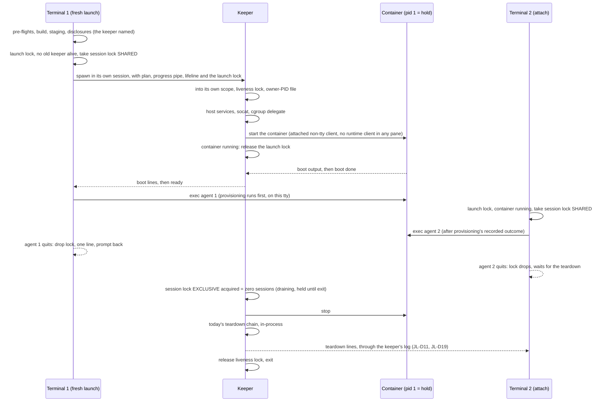
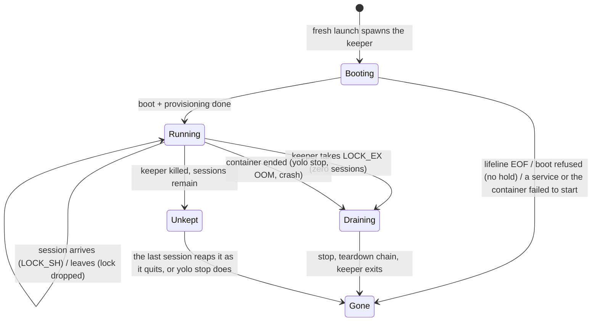

# A shared jail should end with its last session, not its first

**Status:** DESIGN, 2026-09-29. Nothing is built. [OQ-JL1](#OQ-JL1) was directed by the
maintainer on 2026-09-29, and the design it produced is [§9](#9-the-keeper-design-2026-09-29);
four questions remain. Every citation, and the keeper research with its measurements, was
verified against `232e4dcd`. The citations the review of 2026-09-29 added (JL-D28 to JL-D35)
were verified against `d3c6970a`.

> **In short.** "Last one out turns off the lights" needs one small background process per
> running container jail, and no central watcher. The **keeper** owns the jail's host services
> from the jail's first moment, so no terminal is ever the owner: the first terminal gets its
> prompt back when its agent quits, re-entering from it is an ordinary attach, and the keeper
> ends itself when the kernel says the last session is gone or the runtime says the container is.

**Why it matters.** Today two agents in one workspace share one container. When the first
agent quits, the second one dies mid-task, with no message
([§2](#2-what-ties-a-jail-to-its-first-terminal-today)).

**The shape.** A hold process as the container's pid 1; every session, the first included,
entering by `exec`; a host-side session lock the kernel keeps; and a keeper per running jail
that holds the jail's host services and tears the jail down when that lock comes free.

**Cost.** Medium-large, not terrible. The fresh-launch arm splits at the service boundary: the
code that starts and stops the host services moves into the keeper unchanged, and the first
session's boot output, exit code and quit-time instrumentation come from new places.

**Start at [§9](#9-the-keeper-design-2026-09-29)**, the keeper: what starts it, what it owns,
how the first terminal gets its prompt back, how re-entering works, how it ends itself, what it
discloses, its signals, and each notch. [§2.4](#24-everything-the-first-terminals-process-owns-today)
is what it takes over, and [§5](#5-how-terrible-is-it) answers "how terrible is this".

**Needs your ruling** ([OQ-JL5](#OQ-JL5) was ruled A, a keeper at every notch if supportable, and
[OQ-JL6](#OQ-JL6) A, both 2026-09-29):

- [OQ-JL7](#OQ-JL7): what the running sessions see when the keeper is killed;
- [OQ-JL8](#OQ-JL8): does closing a pane end that pane's agent, or leave it running.

**Reads with:** [`jail-lifetime-last-session-wins-plan.md`](jail-lifetime-last-session-wins-plan.md)
(the implementation sketch, written for the keeper),
[`herdr-integration.md` §3.4](../research/herdr-integration.md#34-closing-a-pane-is-a-kill)
(what closing a pane does), and
[`central-yolo-watcher.md`](../research/central-yolo-watcher.md) (the sibling exploration of a
machine-wide watcher). [§12](#12-the-neighbors) lists the rest.

---

## 1. The verdict, and the words it uses

**Yes, without a central watcher, at medium-large cost.** The maintainer directed who owns the
jail on 2026-09-29 ([OQ-JL1](#OQ-JL1)): *"I don't want a solution where the first terminal
waits. The idea is to get my terminal back and reuse it. … I think it is going to have to be
some sort of small background process. But then it needs to know how to end itself as well."*
That process is the keeper, started with the jail rather than handed the jail later
([JL-D14](#JL-D14)).

- **Nothing new exists while no jail runs.** There is one keeper per running container jail,
  and none otherwise.
- **Nothing in the jail's transport changes.** The host services run today's code, in a
  different process.
- **The pieces have precedents:**
  - a kernel-flock liveness registry (the macos-user session dirs,
    [`servicessession.go`](../../internal/cli/run/servicessession.go));
  - a pid-1 hold (the refused-boot hold, [`hold.go`](../../internal/entrypoint/hold.go));
  - a descriptor whose EOF means "the launch is gone" (`launchservice.Lifeline`,
    [`launchservice.go`](../../internal/launchservice/launchservice.go));
  - a detached self-exec helper that outlives its launcher (`startDetached`, which starts
    `yolo internal scratch-rm`, [`scratchremoval.go`](../../internal/cli/run/scratchremoval.go)),
    a weak precedent, because losing that helper costs nothing.

**Why the keeper must be born before the services, not handed them.** The first launcher's
process *is* the jail's host services today ([§2.4](#24-everything-the-first-terminals-process-owns-today)).
Go cannot fork, so nothing already running in that process can be moved into another one: a
front is a goroutine in the process that started it, and a fronted daemon can be reaped and
stopped only through the `exec.Cmd` its parent holds (`killServiceGroup`,
[`loopholesruntime.go`](../../internal/cli/run/loopholesruntime.go)). A process that should own
them for the jail's life has to start them itself.

### 1.1 Terms

- **Session.** One `yolo` invocation that runs a command in a container jail: its launcher
  process on the host, plus the process tree it started inside the jail. This extends the
  word's macos-user meaning (`paths.HostServicesSessionPrefix`, *"one macos-user invocation of
  yolo"*) to the container backends. There, several sessions can share one container.
- **Owner** *(this doc's use)*. The one host process that holds a running jail's host services
  (the credential fronts, fronted daemons, cgroup delegate and port forwards) and runs its
  teardown. Today it is always the fresh launch's `yolo` process, and the owner-PID file
  (`writeOwnerPID`, [`lifecycle.go`](../../internal/cli/run/lifecycle.go)) names it. Under this
  design it is the keeper.
- **Keeper** *(coined here)*. A host process per running container jail, spawned once by the
  fresh launch before any host service or the container exists, that is the jail's owner for
  the jail's whole life and exits once the jail is known gone
  ([§9](#9-the-keeper-design-2026-09-29)). Its verb is `yolo internal daemon jail-keeper`, a
  hidden self-exec subcommand of `yolo`, as every host daemon is.
  - **It is not a supervisor.** It restarts nothing, and nothing restarts it.
  - **It is not a central watcher.** It serves one jail and holds nothing machine-wide.
  - **It is not a housekeeper.** It cleans up only what its own jail made
    ([JL-D23](#JL-D23)).
- **Hold process.** The container's main process, which does nothing but keep the container
  running. It has the shape of `hold.go`'s `holdContext`, which today is used only to keep a
  refused boot open for inspection.
- **Draining** *(coined here)*. The interval between the last session ending and the container
  being known gone.
- **Liveness lock** *(coined here)*. An exclusive kernel flock the keeper holds for its whole
  life, in host state no jail mounts. A free one means the keeper is gone, however it died. It is
  one file per container name that is never unlinked ([JL-D28](#JL-D28)). It is not the session
  lock ([§4.2](#42-the-count-a-host-side-session-lock)), which counts sessions.
- **E3 config capture.** The step at a jail's end that captures the edits made to the jail's
  composed config files, so that `yolo config diff` on the host shows them. "E3" is the tree's
  name for it; it lives in `captureConfigOnTerminate`
  ([`runcmd.go`](../../internal/cli/run/runcmd.go)). It records edits and applies none.
- **Window A.** The stretch of a shutdown after the container's pid 1 dies and before the
  `podman run` client exits, when podman tears down (conmon's exit file, the network, the
  unmounts) and no yolo code runs. The tree's name, from
  [`perf-logging.md`](../reference/perf-logging.md#window-a-attribution).
- **Unkept jail** *(coined here)*. A running container whose keeper is known dead. Its sessions
  still run, but its host services died with the keeper. What they then see is
  [OQ-JL7](#OQ-JL7).
- **Notch.** The confinement level a launch runs at: `jail` (a container backend), `guest` (on
  a Mac, the macos-user account) or `host` (`yolo host`, no confinement). Coined in
  [`yolo-as-environment-manager.md` §4](yolo-as-environment-manager.md#4-confinement-a-dial-with-three-notches).
  It is not the backend: podman and Apple Container are two backends of one notch.
- **Pane close.** A terminal multiplexer closing one of its terminals. herdr, the one this doc
  measured against, signals every process in that terminal's session: SIGHUP, SIGTERM about
  250 ms later, and SIGKILL about 250 ms after that
  ([`herdr-integration.md` §2.6](../research/herdr-integration.md#26-restore-worktrees-automation-notifications-plugins-and-remotes)).
  An ordinary window close hangs up the same session, without the SIGKILL.
- **Lifeline.** A pipe whose write end only the launch holds, so the child reading it sees EOF
  the moment the launch dies, however it dies. It is `launchservice.Lifeline`'s mechanism,
  introduced by [HS-D11](host-notch-services.md#HS-D11).

### 1.2 Principles

- <a id="JL-P1"></a>**JL-P1. A shared jail lives while any session does.** The maintainer's
  "last one wins", 2026-09-29: *"make it the last one win so that you don't need to have the
  original one open."* That the jail then ends with its last session, and not some time after,
  is my reading rather than the maintainer's words. It is not a principle here: [JL-D12](#JL-D12)
  derives it from the E3 config capture, and [OQ-JL6](#OQ-JL6) asks whether it still holds for a
  tab that was the jail's only session.
- <a id="JL-P2"></a>**JL-P2. The count is the host's, and the kernel keeps it.** Nothing inside
  the jail can hold the jail open. A jail-visible counter would let a jail process keep the
  jail's host credential services alive after every human has left.
- <a id="JL-P3"></a>**JL-P3. "Could not count" is never zero.** If the keeper cannot tell
  whether sessions remain, it leaves the jail running and says so. This is the polarity the
  orphan reaper already takes (`pidAlive`: *"never reap a jail we can't prove is orphaned"*,
  [`lifecycle.go`](../../internal/cli/run/lifecycle.go)).
- <a id="JL-P4"></a>**JL-P4. One owner per jail, for the jail's whole life.** No handoff between
  processes. This is [HD-R1](host-daemon-ownership.md#HD-R1)'s ledger text, *"spawned by the
  launch that wants it and ends with that jail"*, and its failure-mode section, *"ends with its
  jail"* ([mode 7](host-daemon-ownership.md#mode-7-it-runs-settings-the-config-no-longer-says)).
  Both name the jail, not the launch process, as the unit. SOURCED. A keeper started with the
  jail satisfies it literally; a successor handed the jail later does not ([JL-D14](#JL-D14)).

---

## 2. What ties a jail to its first terminal today

Six rows. Rows 1, 2 and 3 are independent causes: each on its own ties the other sessions to
the first terminal. Row 5 becomes one the moment the first launcher is gone, which is what any
fix that lets that terminal leave produces. Rows 4 and 6 are not causes but constraints on a
fix, and row 6 follows from row 3.

| # | Coupling | Evidence | Kind |
|---|---|---|---|
| 1 | **The first agent is the container's main process.** The run flags are `--rm -i --init --read-only --name <cname>`. The command tail is `bash -c '<provision>; <mise activate>; <banner>; <target>'`, entered through `yolo-entrypoint`, which execs bash. When the agent exits, bash exits, the init's child exits, and the container stops | `runFlags` in `assembleRunCmd` ([`assemble.go`](../../internal/cli/run/assemble.go)), the `finalInternalCmd` append in `runContainer` ([`run.go`](../../internal/cli/run/run.go)), `buildFinalInternalCmd` ([`command.go`](../../internal/cli/run/command.go)), `execBash` ([`boot.go`](../../internal/entrypoint/boot.go)) | SOURCED |
| 2 | **When pid 1 exits, every exec session dies.** An `exec -d sleep 61` was gone from the container and the host once pid 1 exited. This is the kernel's rule: when a pid namespace's init dies, every other process in it gets SIGKILL | Research lens, 2026-09-29: nested podman 5.8.7, a probe container from `localhost/yolo-jail:latest` with its entrypoint overridden. [pid_namespaces(7)](https://man7.org/linux/man-pages/man7/pid_namespaces.7.html) | MEASURED |
| 3 | **The first launcher's process hosts the jail's host services.** Each loophole's front is a goroutine in it, and so is the cgroup delegate. Fronted daemons are Setsid children whose stop handles only it holds. The socat port forwards are its plain children, with no Setsid | the comment above `stopLoopholes` (*"a goroutine in THIS process"*), `startExternalService`'s Setsid and `frontRun` ([`loopholesruntime.go`](../../internal/cli/run/loopholesruntime.go)); `startCgroupDelegateInProc` ([`cgddaemon_linux.go`](../../internal/cli/run/cgddaemon_linux.go)); `startHostPortForwarding` ([`network.go`](../../internal/cli/run/network.go)) | SOURCED |
| 4 | **An attach will not heal them.** *"A jail whose launcher is gone is relaunched, not attached-and-repaired"* | the *"nothing to heal here"* comment in `attachExisting`, above its exec ([`run.go`](../../internal/cli/run/run.go)) | SOURCED |
| 5 | **The owner-PID reaper.** Every launch runs `reapOrphanedJails` before its attach decision. That call stops any live `yolo-*` container whose recorded owner PID is dead. So a first launcher that simply left would have its jail stopped by the next `yolo` in *any* workspace. It is a no-op on Apple Container | `runContainer`'s reap and its `writeOwnerPID` (fresh path only) ([`run.go`](../../internal/cli/run/run.go)), `reapOrphanedJails` ([`lifecycle.go`](../../internal/cli/run/lifecycle.go)) | SOURCED |
| 6 | **Teardown runs only in that process.** The chain (`teardownAfterExit`, and the signal arm `onTerminate`) needs values only that launch holds: the socat handles, the daemon stop functions, the scratch-volume launch id, the home skeleton's name and the pack tree | `onTerminate` and `teardownAfterExit` ([`run.go`](../../internal/cli/run/run.go)); [`trackingcleanup.go`](../../internal/cli/run/trackingcleanup.go) (*"this launch is the only one that knows its name"*) | SOURCED |

Rows 1 and 2 are the container coupling. Rows 3 to 6 are the host coupling, and they are what
the keeper takes over.

> [!NOTE]
> **Pressing Ctrl-C in the first agent does not run the launcher's teardown.** Since the
> 2026-09-19 ruling, the TTY proxy forwards `0x03` into the jail as a byte
> ([`ttyproxy.go`](../../internal/ttyproxy/ttyproxy.go), `proxyLoop`). So "I Ctrl-C'd the first
> agent" means the agent chose to exit, which is coupling 1. Only a real SIGINT, SIGHUP or
> SIGTERM delivered to the launcher runs `onTerminate`: a window close, a pane close, or `kill`.
> That arm runs `stopJail` (`podman stop -t 5`) first, on purpose, and so ends every session a
> second way. SOURCED.

### 2.1 What already works for any process

Parts of the teardown already key on evidence rather than on which process runs them. The
keeper can call these unchanged:

- **`stopLoopholes`' directory removal and `forgetGoneContainer`'s tracking-file removal.** Each
  takes the workspace launch lock non-blocking, then asks the tri-state `ps -a` probe whether
  the container still exists. `reapOrphanedJails` already calls `stopLoopholes(nil, …)` from a
  *different* process ([`lifecycle.go`](../../internal/cli/run/lifecycle.go),
  [`loopholesruntime.go`](../../internal/cli/run/loopholesruntime.go)). SOURCED.
- **The E3 config capture.** It is idempotent and takes only the workspace and the runtime
  (`captureConfigOnTerminate`, [`runcmd.go`](../../internal/cli/run/runcmd.go)). SOURCED.
- **The scratch-volume remover.** It is detached, and it waits until podman says no container
  references the volumes, so it does not depend on who started it (`startScratchRemoval` and
  `startDetached`, [`scratchremoval.go`](../../internal/cli/run/scratchremoval.go)). SOURCED.
- **The endpoint file.** In-jail clients re-read it on every dial. The code calls this *"the ONLY
  channel that can update an already-running container"*
  ([`svcendpoint/dial.go`](../../internal/svcendpoint/dial.go)). SOURCED.
- **The in-jail daemon supervisor.** It already has container lifetime. A later exec's
  `yolo-entrypoint` reuses the live supervisor rather than stacking a second one
  (`startJailDaemonSupervisor`, `anyJailDaemonSupervisorAlive` in
  [`entrypoint/runtime.go`](../../internal/entrypoint/runtime.go)). SOURCED.

### 2.2 Which backends have the problem

| Backend | Shared jail? | Has the defect? | Why |
|---|---|---|---|
| podman on Linux | yes | **yes** | rows 1, 2, 3 and 5 |
| podman on macOS (machine) | yes | **yes** | the same causes. The launcher also has **no signal arm at all**: [`proxy_other.go`](../../internal/cli/run/proxy_other.go) ignores `onTerminate`, so a window close skips teardown entirely |
| Apple Container | yes | **yes** | rows 1 to 3, and no signal arm. The owner-PID reaper is a no-op here (row 5 does not apply), so an orphan is never reaped |
| macos-user | **no** | no | *"This backend has no attach — every macos-user invocation is a fresh sandbox"* (the macos-user arm of `Run`, [`run.go`](../../internal/cli/run/run.go)). Since [HD-D1](host-daemon-ownership.md#HD-D1), each session also has its own host-services dir ([`servicessession.go`](../../internal/cli/run/servicessession.go)) |
| `yolo host` | no | no | each launch owns its services as its own children ([OQ-HS3](host-notch-services.md#OQ-HS3)) |

So "last one wins" means making the container backends behave the way the other two notches
already do: no session's end takes another session's services with it.

### 2.3 Four defects found on the way

These exist today, independent of this design. Each should be fixed whatever else lands.

1. **Closing an attach terminal probably leaves its agent running headless.** Killing a
   `podman exec` client does not end the process it started. This held for SIGKILL, SIGHUP,
   SIGTERM and SIGINT to an `exec -it` client: conmon keeps the session and its pty, and
   `ExecIDs` kept listing it. The attach passes no `onTerminate` (`attachExisting`'s
   `runWithProxy(runCmd, nil, nil, o)`, [`run.go`](../../internal/cli/run/run.go)), so after a
   window close the proxy SIGKILLs only its client.
   - The client behavior was MEASURED by the research lens on 2026-09-29, with `sleep` under a
     pty harness, and again under a pane-close sequence this revision ran
     ([§3.1](#31-what-a-pane-close-does-measured)).
   - That the same happens to a real agent is INFERRED.
2. **podman's default detach sequence is live wherever the host's `containers.conf` leaves it
   at the default.** yolo sets no `--detach-keys` (`rg detach-keys internal/` finds nothing,
   SOURCED). podman's built-in default for `run -it` and `exec -it` is `ctrl-p,ctrl-q`
   (`podman run --help` and `podman exec --help`, podman 5.8.7 in this jail, MEASURED), and a
   host may override it in `containers.conf`
   ([podman-exec](https://docs.podman.io/en/latest/markdown/podman-exec.1.html), SOURCED).
   Typing that sequence in the first session detaches its client. The launcher would then tear
   down the host services under a container that keeps running. INFERRED from
   `teardownAfterExit`'s order. Passing `--detach-keys=""`, documented as disabling the
   feature, fixes it whatever the host's setting.
3. **An attached session is never told why its jail ended.** After the exec returns, the attach
   prints only the broken-prefix post-mortem and the macOS OOM hint (`diagnoseBrokenPrefix` and
   `maybeWarnAboutOOMKiller` at the end of `attachExisting`). SOURCED.
4. **The orphan reaper already kills live sessions.** It exists because an uncatchable kill
   leaves the container running (*"Sweep jails orphaned by an uncatchable kill"*, above the reap
   in `runContainer`). When the first launcher is SIGKILLed, its `podman run` client dies but the
   container does not, so the first agent keeps running headless and any attached sessions keep
   running too. The next `yolo` in *any* workspace then stops all of them: `reapOrphanedJails`
   checks only the owner PID, and no session ([`lifecycle.go`](../../internal/cli/run/lifecycle.go)).
   The code is SOURCED; that the container outlives its client is INFERRED from the reaper's own
   premise. The fix is [JL-D7](#JL-D7)'s reaper rule.

### 2.4 Everything the first terminal's process owns today

Read from the code at `232e4dcd`. "Owns" means the thing exists in that process, is its child,
or is a record only it removes. The last three columns say what happens to it at each way the
launch ends. They are SOURCED, except the SIGKILL column, which is INFERRED from the same code,
and the cells marked MEASURED.

**A container jail** (the fresh arm, `runContainer` in [`run.go`](../../internal/cli/run/run.go)):

| What | How the process holds it | Its agent quits | Window or pane close | The launcher is SIGKILLed |
|---|---|---|---|---|
| The container's main process | the first agent is pid 1's child (row 1 of [§2](#2-what-ties-a-jail-to-its-first-terminal-today)) | exits, and every session dies with it | `stopJail` first, so every session dies | the container keeps running, headless |
| The `podman run -it` client | its child on the TTY proxy's pty, left in the launcher's process group on the host terminal (*"NO Setsid"*, [`ttyproxy.go`](../../internal/ttyproxy/ttyproxy.go)) | exits with the container; Window A is its lingering exit, recorded by the tree | gets the hangup itself and forwards it into pid 1 (MEASURED, [§3.1](#31-what-a-pane-close-does-measured)); the arm then SIGKILLs it | orphaned; the container stays |
| The TTY proxy | in-process: raw mode, the pty, `^Z`, SIGWINCH, the signal arm | restores the terminal | runs `onTerminate`, then `os.Exit(128+n)` | the terminal is left raw |
| The workspace launch lock | a flock (`holdLaunchLock`), released once the container is seen running (`onStarted`) | long released | long released | the kernel drops it |
| Port forwards | socat processes, plain children in its process group (`startHostPortForwarding`) | `cleanupPortForwarding` | hung up with the group (a plain child died in [§3.1](#31-what-a-pane-close-does-measured)), then cleaned up | orphaned, INFERRED |
| The cgroup delegate | a goroutine (`startCgroupDelegateInProc`) | stopped | stopped | dies with the process |
| Loophole fronts | goroutines (`frontRun`), each publishing an endpoint file into the host-services dir | closed, and the dir removed by `stopLoopholes`' guards | the same | die; their endpoint files name dead ports until a reaper's `stopLoopholes(nil, …)` |
| Fronted per-jail daemons | Setsid children whose stop handle only it holds (`startExternalService`, `killServiceGroup`) | group SIGTERM, 5 s, SIGKILL | the same | orphaned: the reaper removes their dir, not them, INFERRED from `stopLoopholes(nil, …)` |
| Host-wide singletons (the Claude broker and the other `scope: "host"` daemons) | ensured, not owned (`brokerEnsure`, `startHostSingleton`) | outlive it by design, until [HD-R1](host-daemon-ownership.md#HD-R1) is built | the same | the same |
| The credential-view registration | a record the broker keeps (`registerClaudeCredentialView`) | outlives it | outlives it | outlives it |
| Tracking file, owner-PID file, home skeleton, pack tree and its live-tree record | files only this launch knows the names of | removed once the container is known gone (`forgetGoneContainer`, `clearOwnerPID`) | the same | left for the reaper and `yolo prune` |
| Scratch volumes | their names, minted per launch (`newScratchLaunchID`) | handed to the detached remover | the same | left for the housekeeping slot's reap |
| The E3 config capture | a teardown step (`captureConfigOnTerminate`) | runs | runs | skipped |
| The launch log, the timing collector and the linger probe | in-process: the `launch.log` tee (`attachLaunchLog`), `host-perf.log`, Window A (`startLingerProbe`, `recordWindowA`) | recorded | recorded by the arm | cut off |
| The housekeeping slot | a goroutine started from `onStarted` (`runHousekeeping`) | dies at exit, restartable by design ([`housekeeping.go`](../../internal/cli/run/housekeeping.go)) | the same | the same |
| The terminal's jail indicator | the tmux border or kitty tab set by the front door, restored by `RestoreTerminal` | restored | restored inside the arm | left wearing the jail's colors |
| The embedded pack tree lease | a process-lifetime lease (`packload.ReleaseEmbedded`) | released | released by the arm | its fallback tree is left for a later sweep |

**macos-user** (the macos-user arm of `Run`, and `RunMacosUser` in
[`orchestrator.go`](../../internal/macosuser/orchestrator.go)) owns the same kinds of thing, but
**only its own session's**: the session's host-services dir and the flock on its `.session.lock`
(`openServicesSession`), the fronts and fronted daemons through the same `startLoopholesDisclosed`,
the doorways and launch-owned services as `launchservice` children (Setpgid, with a lifeline),
the sandbox's jail-daemon supervisor (`startJailDaemons`, Setpgid, stopped when the agent
exits), the sandboxed command itself (a plain child through `proxy_other.go`, with no signal
arm), and the launch log. When it ends, by any route, nothing another session uses goes with
it: the `launchservice` children end on their lifeline's EOF even after a SIGKILL, and the next
session's sweep collects a dead session's dir ([HD-D1](host-daemon-ownership.md#HD-D1)). The
Setsid fronted daemons are orphaned by a SIGKILL there too, INFERRED. SOURCED otherwise.

**`yolo host`** execs the agent when nothing needs owning (`hostSyscallExec`,
[`host.go`](../../internal/cli/host.go)), so no yolo process remains. When a launch-owned service
or the managed Codex adapter is needed, it stays resident as their parent
(`launchservice.RunAgent`, [`agent.go`](../../internal/launchservice/agent.go)): Setpgid
children with a lifeline, stopped when the agent exits. Two host launches share nothing but
the host-wide brokers ([`host-notch-services.md` §4.4](host-notch-services.md#44-lifetime),
item 6). SOURCED.

---

## 3. The options

One more fact is needed to read the table. The design needs **a container that outlives the
first session**. The simplest way is that pid 1 is something other than an agent, and every
agent session enters by `exec`, the first included (coupling 2).

- **One variant was considered and rejected.** pid 1 could be a subreaper that runs the *first*
  agent as its own child and outlives it, with later sessions entering by exec. The first
  terminal would keep `podman run -it`'s attach, and its client would be detached
  programmatically when its agent exits, by sending the detach sequence. That keeps today's
  first-session exit code path, but it makes the first session different from every other one
  (two exit-code paths, two argvs), it depends on the very detach sequence
  [§2.3](#23-four-defects-found-on-the-way) item 2 wants disabled, and it leaves a `podman run`
  client in the first terminal's pane, which a pane close turns into a stopped jail
  ([§3.1](#31-what-a-pane-close-does-measured)). INFERRED, and MEASURED for the last part.
- **What an exec costs is not yet measured.** An exec round trip of `/bin/true` on an idle
  container costs **56 to 71 ms** (research lens, 3 × `podman exec /bin/true`, MEASURED). A
  session's exec does more than that: it runs `/opt/yolo-jail/bin/yolo-entrypoint <target>`
  (`attachExisting`'s argv), and `entrypoint.Main` runs the whole boot step table before
  `execBash` (`runBootSteps`, [`bootsteps.go`](../../internal/entrypoint/bootsteps.go)). *"The entrypoint
  re-runs every generator on each attach"*
  ([`../reference/composed-file-permissions.md`](../reference/composed-file-permissions.md)).
  SOURCED. So under this design the first session pays a second generator pass after pid 1's
  boot, as every attach already does. The number owed is `podman exec <cname>
  /opt/yolo-jail/bin/yolo-entrypoint true` on a booted jail ([§8](#8-what-done-looks-like)).
  Skipping the table for an exec into a booted jail would be an entrypoint contract change, and
  is not proposed here.

So the options below differ only in **who owns the host services and who runs the teardown**.

| | Option | How | Cost | What breaks or stays broken | Verdict |
|---|---|---|---|---|---|
| **O0** | **Legibility only** | Keep "the jail lives with the first terminal". When sessions remain, the quitting terminal says *"ending this jail ended N other sessions"*. Record a stop reason that an attach reads after its exec ends | Small | Not what was asked. The first terminal still owns every session | **Its pieces go into the design** ([§2.3](#23-four-defects-found-on-the-way)), not as the answer |
| **O1** | **Hold the door, and survive the hangup** | The first launcher stays the owner. When its own agent exits with sessions remaining, it **holds** the jail: it hands the terminal back to cooked mode, says so, and waits for the session count to reach zero, surviving a window close the way `nohup` does | Small to medium. No new process kind | The first terminal's prompt stays occupied while others run. Its launcher cannot outlive a pane close: it leads its own process group, so it cannot leave the pane's session ([setsid(2)](https://man7.org/linux/man-pages/man2/setsid.2.html) fails with `EPERM` for a group leader), and herdr SIGKILLs it within 0.5 s | **Rejected by the ruling** ([OQ-JL1](#OQ-JL1)): *"I don't want a solution where the first terminal waits"* |
| **O2** | **Successor at quit** | The first launcher spawns a detached successor only when it quits with sessions remaining. The successor re-fronts the running daemons, re-publishes their endpoint files, respawns socat and rebinds the cgroup delegate, then tears down when the count reaches zero | Medium-large. A single-session launch costs nothing extra | A **handoff**, which [JL-P4](#JL-P4) forbids. The path runs only in the multi-session case, so it rots. In-flight connections drop at the handoff. Re-published fronts are never checked by the boot-time reachability witness. Under a pane close the handoff must finish inside herdr's 0.5 s budget with no launcher left to wait on it | **Rejected** ([JL-D14](#JL-D14)) |
| **O3** | **Keeper from the start** | The fresh launch does its pre-flights, approvals, build, staging and disclosures in the terminal as today, then spawns the keeper. The keeper starts the host services and the container, relays boot progress until the jail is ready, and runs the teardown chain in-process when the count reaches zero or the container ends. The first terminal is then an ordinary session | Medium-large. A heavy-track change to the fresh arm | Every container launch pays one process spawn and a pipe. The fresh arm's output stream, exit code and Window A accounting move ([§5](#5-how-terrible-is-it)). A keeper that dies leaves an **unkept jail** ([JL-D13](#JL-D13)) | **Chosen** ([OQ-JL1](#OQ-JL1), [JL-D14](#JL-D14)) |
| **O4** | **Migrate among live launchers** | O1's container, plus an owner election over a kernel flock. When the owner leaves, one attached launcher wins and rebuilds the host services from the running jail's records | Medium-large. No detached process at all | A handoff again, with attach skew becoming ownership skew: the winner's binary and config may differ from the jail's. It needs a record of caller tokens and daemon process groups and a guarantee that only one front exists at a time, which the attach arm's comment forbids breaking (*"starting a second front over the same endpoint file would hand the jail a credential its terminator never asked for"*). The gap is total on SIGKILL | Rejected. It spreads one jail's ownership across whichever terminals happen to be open |
| **O5** | **Per-session host services** | Each session owns the services its own agent uses, as macos-user already does | Large | The genuinely jail-wide services remain: port forwards bound at fixed mounted socket paths, the cgroup delegate, and in-jail daemons that serve every session. Those still need an owner | Rejected as a replacement. Worth revisiting later to shrink what the keeper holds |
| **O6** | **podman's own lifetime features** | `podman pod create --exit-policy=stop` stops a pod *"when the last container exits"* ([podman-pod-create](https://docs.podman.io/en/latest/markdown/podman-pod-create.1.html), SOURCED). That would mean one container per session sharing a pod's namespaces. `--restart` conflicts with `--rm` (research lens, MEASURED). Quadlet and healthcheck timers are systemd | Large, and backend-specific | Pods count containers, not exec sessions. Apple Container has no pods. None of these owns the host services | Rejected |
| **O7** | **The container counts its own sessions** | pid 1 exits after the last session, counting either per-session `--preserve-fd` death pipes or locks in a jail-visible directory | Medium | It solves nothing on the host: the services still need an owner. `podman exec --preserve-fds=N` passes descriptors with no runtime restriction in its documentation (the list form `--preserve-fd` is documented as crun-only), and neither is available with the remote Podman client, which is every Mac ([podman-exec](https://docs.podman.io/en/latest/markdown/podman-exec.1.html), SOURCED; both flags in `podman exec --help`, 5.8.7, MEASURED). A jail-visible count breaks [JL-P2](#JL-P2) | Rejected as the count. The death pipe is kept as an optional refinement on local Linux podman ([JL-D4](#JL-D4)) |

### 3.1 What a pane close does, measured

MEASURED 2026-09-29, in this jail's nested rootful podman 5.8.7, with a Python pty standing in
for a pane. A "launcher" shell in the pane started a setsid'd child (the keeper's stand-in), a
plain child (socat's stand-in), and a runtime client in the foreground. The probe then did what
herdr does: it listed the pane session's processes once, sent them SIGHUP, SIGTERM 250 ms later
and SIGKILL 250 ms after that, and closed the pty master. Every container ran
`localhost/yolo-jail:latest` with its entrypoint replaced by a bash that logs each HUP, INT or
TERM it receives and exits on TERM.

| Shape in the pane | The setsid'd child | The plain child | The container | What pid 1 logged |
|---|---|---|---|---|
| **The keeper's shape:** the container started outside the pane (`run -d --rm --init`); the pane runs `podman exec -it` | survived | died | **kept running**; the exec'd process ran on headless | nothing |
| **Today's fresh launch:** the pane runs an attached `podman run -it --rm --init` | survived | died | **stopped and removed** | (gone with the container) |
| The same, with `--sig-proxy=false` | survived | died | **kept running** | nothing |

What that settles:

- **A process in its own session survives a pane close,** and it is the only kind that does.
  A plain child of the launcher, which is what the socat forwards are today, is signalled with
  the pane. SOURCED for herdr's side (`shutdown_pane_processes` takes its list once, and a
  process that called `setsid` is in another session,
  [`herdr-integration.md` §2.6](../research/herdr-integration.md#26-restore-worktrees-automation-notifications-plugins-and-remotes)).
- **podman's signal proxy alone stops a jail whose run client sits in the pane.** The probe had
  no launcher signal arm, so no `stopJail` ran: the attached client forwarded what it received
  into pid 1 (`--sig-proxy`, *"Proxy received signals to the process (default true)"*,
  `podman run --help`), and that was enough. `--sig-proxy=false` stops it, and a container with
  no attached client in the pane receives nothing. `podman exec` has no signal proxy to disable.
- **`-d` and `--sig-proxy=false` combine without error:** `podman run -d --rm --sig-proxy=false`
  reached the OCI runtime (MEASURED).
- **The hold must not die of a stray hangup anyway.** Today's `holdContext` cancels on SIGINT
  and SIGTERM only, and a Go program with no handler for SIGHUP exits on it
  ([os/signal](https://pkg.go.dev/os/signal#hdr-Default_behavior_of_signals_in_Go_programs)).
  With `--init`, catatonit is pid 1 and the entrypoint its child (`hold.go`'s comment on
  `holdReleaseFile`), and a signal podman forwards reaches that child: the forwarded HUP in
  [`herdr-integration.md` §3.4](../research/herdr-integration.md#34-closing-a-pane-is-a-kill)
  did. SOURCED and MEASURED there.

What it does not settle: a rootless host, where the pane's processes, conmon and the keeper sit
in systemd cgroup scopes that a nested jail does not reproduce ([§8](#8-what-done-looks-like)).

---

## 4. The proposed shape

The container half ([§4.1](#41-the-container-a-hold-process-as-pid-1-and-every-session-an-exec))
and the count ([§4.2](#42-the-count-a-host-side-session-lock)) make a jail that can outlive any
one session. The keeper makes its host services outlive any one session too; everything about
it is [§9](#9-the-keeper-design-2026-09-29). This section is the container, the count, and what
a user sees.



### 4.1 The container: a hold process as pid 1, and every session an exec

- **pid 1 is the entrypoint's boot followed by a hold.** It runs today's boot, then blocks. It
  never runs an agent.
- **The boot stays in pid 1, not in the first session.** The jail-daemon supervisor stays in
  the process group of the entrypoint that starts it (`startJailDaemonSupervisor`: *"stay in the
  same process group as PID 1"*, [`entrypoint/runtime.go`](../../internal/entrypoint/runtime.go)),
  and a session's hangup ends that session's own process tree ([JL-D4](#JL-D4), under
  [OQ-JL8](#OQ-JL8)'s leaning). A supervisor started from the first session's exec would die
  with that session. SOURCED for the process
  group, INFERRED for the consequence.
- **The keeper starts it with an attached, non-tty client, and no runtime client ever sits in a
  pane** ([JL-D15](#JL-D15)). The keeper keeps `<rt> run --sig-proxy=false` attached and reads
  pid 1's output from that client's pipes, in order, so the boot lines, a refusal's text and the
  hold notice reach the terminal as they do today
  ([OQ-RO3](../reference/report-tiers.md#why-its-this-way)). A detached start would lose that
  output. Every podman run passes `--log-driver none` (`assembleRunCmd`,
  [`assemble.go`](../../internal/cli/run/assemble.go), SOURCED), so with `-d` pid 1's stdout and
  stderr go nowhere, and the keeper would have to relay them from the jail-writable
  `.yolo/boot.log` or change the log driver. Both shapes were MEASURED to leave pid 1 untouched
  by a pane close ([§3.1](#31-what-a-pane-close-does-measured),
  [§9.7](#97-signal-handling-sig-proxy-and-a-pane-close)).
- **The keeper builds its container argv without `-t`.** The plan's argv is computed in the
  fresh launch, where `IsTTYStdout` adds `-t` (`assembleRunCmd`, SOURCED), and the keeper's client
  has no terminal.
- **The hold ignores SIGHUP and SIGINT, and ends on SIGTERM**, which is what `podman stop`
  sends. Nothing in a session's lifecycle signals it; the keeper's drain and `yolo stop` end it
  through `podman stop` ([JL-D15](#JL-D15)). It ignores them through `signal.Notify` handlers that
  do nothing, never `signal.Ignore`: that sets `SIG_IGN`, which every process it starts afterward
  inherits across exec.
- **Only `provisionScript` leaves the command tail, and it goes to the first session, not to
  pid 1.** Today `buildFinalInternalCmd` puts three things before the target
  ([`command.go`](../../internal/cli/run/command.go)): `provisionScript`, `miseActivate` and
  the executing banner. SOURCED.
  - `miseActivate` and the banner are per-shell. `execBash` already redoes both for every exec
    (it sources `yolo-user-env.sh`, evals `mise env` and prints `executingLine`,
    [`boot.go`](../../internal/entrypoint/boot.go)), so they stay per session. SOURCED.
  - `provisionScript` runs once per container, and its failure branch asks *"Provisioning failed
    — continue anyway? [Y/n]"* only when `[ -t 0 ]`
    ([`provision.go`](../../internal/provision/provision.go)). SOURCED. pid 1 has no tty, so
    provisioning there would silently continue where a user at a terminal is asked today. So it
    runs inside the **first session's** exec, which has the first terminal's tty.
  - **Every other session waits for provisioning's recorded outcome, not for a done marker**
    ([JL-D33](#JL-D33)). A marker that only success writes leaves a waiter hanging whenever
    provisioning ends another way: `RefusedStatus` or an `n` answer, on both of which the script
    exits the shell (`provision.go`, SOURCED); the first pane closed mid-run, which JL-D4's hangup
    ends; or the first launcher SIGKILLed. The waiter holds its shared session lock, so the
    keeper never drains while it waits. And a waiter that got in after a refusal would enter the
    jail the refusal closed: the *"continue anyway"* that
    [OQ-AR3](../reference/agent-program-runtimes.md#oq-ar3) ruled out (the comment above the
    refusal test in [`provision.go`](../../internal/provision/provision.go)).
    - Provisioning runs under an in-jail flock and records one outcome: **done**, which includes
      a failure the first terminal chose to continue past, or **refused**, which is
      `RefusedStatus` or a failure the first terminal declined.
    - A free flock with no recorded outcome means provisioning was **abandoned**.
    - A waiter that reads *refused* is refused with the same reason, and the count then ends the
      jail. On *abandoned*, a waiter with a tty reruns provisioning on its own tty, and one
      without a tty is refused, since it would otherwise continue where a person is asked.
    - A waiter never waits while holding the launch lock, and its wait is bounded
      ([JL-D34](#JL-D34)).
- **Every session enters by exec.** This is today's attach argv, `<rt> exec -i [-t] <cname>
  /opt/yolo-jail/bin/yolo-entrypoint <target>` (`attachExisting`), for the first session too.
- **A session's exit code is its command's.** `yolo -- make` returns `make`'s code, as it does
  today. The macOS OOM hint (`maybeWarnAboutOOMKiller`, keyed on exit 137) is re-derived from
  the exec's code, since the container's own code is no longer the first session's.
- **No exec starts before pid 1's boot and the first session's provisioning are done.** This
  includes an attach that races the first launch. Today such an attach can enter once the
  container is merely running (`onStarted` releases the lock after `awaitRunningContainer`). How
  pid 1 reports that its boot finished is the implementer's; the recorded outcome covers
  provisioning.
- **The refused-boot hold keeps working, and keeps its signals.** A boot that refuses under the
  hold opt-in (`hold.go`) is ended by its release file, by `yolo stop`, or by a SIGINT or SIGTERM
  sent to the entrypoint, which is what its notice tells the user (`holdNotice`: *"Sending
  SIGINT or SIGTERM to this entrypoint ends it too"*, SOURCED). So the pid-1 hold's rule of
  ignoring SIGINT does not reach the refused-boot hold; a change that let it would have to change
  that notice in the same commit. It is never ended by the session count
  ([§4.4](#44-failure-paths)).

### 4.2 The count: a host-side session lock

- **Each session holds a shared lock for its whole life.** Its launcher holds `LOCK_SH` on a
  host-only file keyed by the container name, in host state that no jail mounts. The kernel
  drops the lock however the launcher dies, SIGKILL included.
- **It is taken under the launch lock, before that lock is released.** There is therefore no
  instant at which a session is inside the jail but not counted. The fresh launch takes its
  lock before it spawns the keeper ([JL-D16](#JL-D16)), so the keeper can never see zero before
  the first session has begun. At a fresh launch the launch lock then passes to the keeper,
  which releases it once the container is seen running ([JL-D31](#JL-D31)).
- **The keeper waits for the exclusive lock.** It blocks on `LOCK_EX` on the same file.
  Acquiring it means zero sessions, and at that moment **the jail is draining**: every later
  `LOCK_SH|LOCK_NB` fails. flock(2) warns that converting a held lock *"is not guaranteed to be
  atomic: the existing lock is first removed"*, so no process ever upgrades a lock it holds.
- **The keeper holds `LOCK_EX` from the moment it drains until it exits** ([JL-D28](#JL-D28)).
  On observation 2 of [§9.5](#95-how-it-ends-itself) that take is the drain. On observation 3
  and on a SIGTERM it takes the lock after its chain, once each session whose exec ended has
  dropped its shared lock. A session always drops its own lock before it waits on the keeper. A
  session still holding on after [JL-D34](#JL-D34)'s bound is logged and left, and its stale
  lock can then only keep the next jail up longer, never end it sooner ([JL-P3](#JL-P3)).
- **Neither lock file is ever unlinked or renamed over** ([JL-D28](#JL-D28)). Each is one file
  per container name, so every process that opens it locks the same inode. A keeper that removed
  the session-lock file as one of its records would hand the next keeper a fresh inode, whose
  `LOCK_EX` succeeds at once under live sessions.
- **One shared file hides the count, and that is the layout.** With one file, a session learns
  it was last only after the fact. The alternative was `servicessession.go`'s registry shape:
  one file per session, each held `LOCK_EX` by its session. A quitting session could then probe
  its siblings with `LOCK_SH|LOCK_NB` before it releases its own, and know it is last. The
  registry costs a directory scan per count, and two sessions quitting at once can each see the
  other alive, so the keeper still decides. It also has no one file the keeper can hold
  exclusively from its drain to its exit, which [JL-D28](#JL-D28) needs. So the layout is one
  shared file; [JL-D11](#JL-D11) does not need a session to know beforehand.
- **An arrival checks for a keeper still ending the jail before it counts itself**
  ([JL-D28](#JL-D28)). After it takes the launch lock, an arrival that finds no running container
  probes the name's liveness lock. One that finds the container running but fails its
  `LOCK_SH|LOCK_NB` is arriving during a drain. In either case, while a keeper holds the liveness
  lock, the arrival **releases the launch lock**, prints that the previous jail is still shutting
  down, waits for the liveness lock, then takes the launch lock again and starts over
  ([JL-D12](#JL-D12)).
  - **Why the probe comes first.** On observation 3 of [§9.5](#95-how-it-ends-itself), the
    container is already gone while the keeper's chain still runs. An arrival that skipped the
    probe would take a shared lock nobody opposes and spawn a second keeper for the same name.
    The old chain would then run its path-keyed cleanup over the new jail and count the dying
    jail's sessions toward it.
  - **It must not wait while holding the launch lock.** The teardown's guards take that lock
    non-blocking and back off, so a waiting arrival that held it would make `stopLoopholes`
    leave the sockets dir (*"Another yolo invocation is launching …"*,
    [`loopholesruntime.go`](../../internal/cli/run/loopholesruntime.go)) and
    `forgetGoneContainer` leave the tracking file, skeleton and pack tree
    ([`trackingcleanup.go`](../../internal/cli/run/trackingcleanup.go)). SOURCED. That would
    turn the common "quit, then relaunch" into a leak, left for a reaper meant only for
    launches that *"died with no teardown at all"*.
- **Lock ordering, stated so it cannot deadlock.** An arrival takes the launch lock and then
  the session lock, and never waits on the keeper while holding the launch lock. The keeper
  **never blocks on the launch lock**: it holds it only as the fresh launch's handoff, from the
  spawn until the container is seen running or its start fails ([JL-D31](#JL-D31)), and its
  teardown's guards take it non-blocking. A relaunch that does hold it (the attach-skew restart,
  which holds it throughout on purpose: `restartJailForAttach` in
  [`contracttags.go`](../../internal/cli/run/contracttags.go)) keeps its own host-services dir,
  exactly as today.
- **`ExecIDs` is for display only.** `jailSessionCount` stays the number shown to a human
  ([`contracttags.go`](../../internal/cli/run/contracttags.go)). Its `+1` for "the main
  process" goes, because the main process is no longer a session. It never decides anything,
  because it also counts headless orphans ([§2.3](#23-four-defects-found-on-the-way) item 1),
  and Apple Container's value is unmeasured.

### 4.3 Lifecycle



### 4.4 Failure paths

| Event | What happens | Who finds out |
|---|---|---|
| Any session's launcher gets SIGHUP, SIGTERM or SIGINT (window close, pane close, `kill`), the first session's included | **Only that session ends.** Its signal arm never calls `stopJail`. It sends SIGHUP to its own in-jail process tree ([JL-D4](#JL-D4); whether it should is [OQ-JL8](#OQ-JL8)), restores the terminal and exits. Its lock drops. Under herdr the arm has about 500 ms before the SIGKILL, and one exec round trip is 56 to 71 ms (MEASURED), so the hangup fits, INFERRED | nobody else. That is the fix |
| A session's launcher is SIGKILLed | Its lock drops, so the count is right. Its in-jail agent may keep running headless until the jail stops. On local Linux podman, the optional death pipe closes this gap | the next quit's display count may include it |
| The last session's launcher dies by any means | The keeper drains within one scheduling tick of the lock dropping | [JL-D11](#JL-D11): the teardown goes to the keeper's log and `launch.log`, and a last session still alive streams it |
| A herdr server restart | Every pane's launcher is signalled at once, every lock drops, and the keeper drains: no session is left, so the jail ends | the keeper's log. herdr brings the panes back as shells, and each `yolo` there launches fresh |
| The fresh launch dies before the jail is ready | The keeper sees the lifeline's EOF, releases the launch lock it was handed, stops what it started, removes its records and exits. Its writes to the progress pipe fail with `EPIPE` rather than killing it ([JL-D29](#JL-D29)) | the keeper's log |
| A host service or the container fails to start | The keeper releases the launch lock it was handed ([JL-D31](#JL-D31)), then stops what it started and removes its records, reports it over the progress pipe, and exits non-zero; the fresh launch prints it and exits non-zero, as today. The fresh launch learns of a keeper that died without reporting from its child's exit, not from the pipe's EOF ([JL-D29](#JL-D29)) | the launching terminal |
| Provisioning is refused, declined or abandoned | Its recorded outcome, or a free provisioning lock with none, tells every waiting session ([JL-D33](#JL-D33)): a refusal refuses them, and an abandoned run is rerun on a waiter's own tty or refused | each waiting terminal |
| The keeper cannot open the session lock | [JL-P3](#JL-P3): it never drains on the count. It waits only for the container's own end, and logs why | `yolo ps` and the next arrival, which says the jail will end only by `yolo stop` |
| The keeper cannot ask the runtime | Every runtime call it makes is bounded. It keeps holding and retries; it never treats the silence as "gone". Whoever is waiting on it gives up after a bound and says so, naming its pid, its log and what it is doing ([JL-D34](#JL-D34)) | the keeper's log, then the next session's quit or arrival ([JL-D19](#JL-D19)) |
| The keeper gets SIGTERM or SIGINT (a shutdown, a logout, `kill`) | It ends the jail in order: it records the reason, stops the container, runs the chain and exits ([JL-D24](#JL-D24)) | every session, which sees its exec end and prints the reason |
| The keeper is SIGKILLed or OOM-killed, or its scope is killed | **Unkept jail** ([§9.5](#95-how-it-ends-itself)). Its children end with it ([JL-D32](#JL-D32)). What the sessions and the next arrival see is [OQ-JL7](#OQ-JL7), and under its leaning the last session reaps the jail as it quits ([JL-D30](#JL-D30)) | [JL-D13](#JL-D13), under [OQ-JL7](#OQ-JL7)'s leaning |
| An attach-skew restart from another terminal | It stops the jail holding the launch lock, as today, and spawns its own keeper only once the old keeper's liveness lock is free, as every fresh launch does ([JL-D26](#JL-D26), [JL-D28](#JL-D28)) | every session, which prints the recorded reason |
| A session arrives during a drain, or while the keeper runs its chain after the container ended | It finds no running container and a held liveness lock, or its `LOCK_SH\|LOCK_NB` fails. It releases the launch lock, prints that the jail is shutting down, waits for the keeper's liveness lock, then takes the launch lock again and starts over ([JL-D28](#JL-D28)) | that terminal |
| `--rm` fails to remove the container because a headless exec was live at stop | Removal was MEASURED to fail in nested podman (`openByHandleAt: operation not permitted`), leaving a stopped container. After its stop, the keeper confirms the container is gone and removes a stopped leftover. It never removes a running one | the keeper's log. A real rootless host is owed a measurement ([§8](#8-what-done-looks-like)) |
| A refused boot under the hold opt-in | The keeper does not drain on the count. It waits for the hold's release or `yolo stop`, then tears down | the launching terminal, as today |

### 4.5 What the user sees

- **A fresh launch looks as it does today, up to the agent,** with one more line naming the
  keeper ([JL-D21](#JL-D21)). The boot lines are relayed from the keeper and printed by the
  launch.
- **The first agent quitting while others run returns the prompt at once,** with one line.
  Suggested wording: *"jail `<cname>` stays up for N other sessions; `yolo -- <agent>` re-enters
  it, `yolo stop` ends them all."* Any non-last quit prints the same line.
- **The last quit** prints the teardown lines ([JL-D11](#JL-D11)).
- **Every session whose jail ended under it** prints the recorded stop reason (`yolo stop`, OOM,
  the keeper gone, an attach-skew restart from another terminal). The keeper writes the record,
  and it is also printed when a session is refused during a drain.
- **A session's quit also prints what the keeper recorded while that session was in**, when
  there is anything ([JL-D19](#JL-D19)).
- **`ps` shows one `yolo internal daemon jail-keeper` per running container jail,** and nothing
  once none runs.
- **`yolo stop` keeps its effect:** it ends every session and names the count
  (`jailSessionsPhrase`), and it returns once the keeper's teardown has finished, streaming it
  ([JL-D25](#JL-D25)). When no keeper holds the liveness lock and the recorded owner is dead, it
  runs the keeper's chain itself ([JL-D30](#JL-D30)), and its wait is bounded ([JL-D34](#JL-D34)). Its help text changes. Today `stopUsage` says *"a jail lives in the
  terminal that launched it, and exiting (or Ctrl-C) that session tears the jail down with you"*
  ([`stop.go`](../../internal/cli/stop.go)). That becomes: a jail lives while any session in it
  does.
- **`yolo config diff` in the first terminal while others still run shows the last capture,**
  because E3 runs at the jail's end. That is what a second terminal sees today while the jail
  runs.

---

## 5. How terrible is it

Plainly: **not terrible, and not small.** Medium-large, heavy-track, with no new transport and
no change to what the host services are.

| Area | Size | Why |
|---|---|---|
| pid 1 hold, first session by exec, provisioning on the first session's tty, readiness | small to medium | the hold shape exists (`hold.go`), and the exec argv exists (the attach arm) |
| The session lock, and the reaper honoring it | small | `servicessession.go` is the pattern, and the reaper gains one more tri-state input ([JL-D7](#JL-D7)) |
| Moving services and teardown into the keeper | **medium-large** | `runContainer` splits at the service boundary into a plan the launch computes and discloses, and a keeper that executes it. The code moves; it is not rewritten |
| The fresh arm's output stream | **medium** | the relay must keep every progress line the terminal shows today, in order ([OQ-RO3](../reference/report-tiers.md#why-its-this-way)) |
| Window A, the linger probe, the timing report | medium | they instrument the `podman run` client's exit, and that client moves to the keeper. They re-home to the keeper's log, or are retired by name |
| The keeper's own cgroup scope | small to medium | a direct spawn moved into a scope with `StartTransientUnit` over D-Bus, with a Setsid-only fallback ([JL-D5](#JL-D5)) |
| The keeper's descriptors, locks and bounds | small to medium | the launch-lock handoff, close-on-exec on every inherited descriptor, the progress writer, and a bound on every wait ([JL-D29](#JL-D29), [JL-D31](#JL-D31), [JL-D34](#JL-D34)) |
| Verification | **the real cost** | a nested jail verifies the lifecycle and the pane-close behavior ([§3.1](#31-what-a-pane-close-does-measured)). The two carve-outs (loopback reachability and rootless paths), the scope move, and both Mac backends need CI or a real host |

What is **not** on the list:

- **Rewriting the fronts.** The keeper runs today's code.
- **Changing the in-jail transport.** In-jail consumers re-read endpoint files per dial and
  bound their own ports at boot. One in-jail change is owed: `provisionScript` leaves the
  container's command tail for the first session's exec
  ([§4.1](#41-the-container-a-hold-process-as-pid-1-and-every-session-an-exec)).
- **A central process.**

### 5.1 How a keeper squares with the rulings

| Ruling | How the keeper meets it |
|---|---|
| [HD-R1](host-daemon-ownership.md#HD-R1): *"A host-side daemon is spawned by the launch that wants it and ends with that jail"* | Literally. The keeper is spawned by the launch that starts the jail, holds only that jail's services, and ends with the jail. It is one per jail, never machine-wide, so it is not the singleton HD-R1 retired |
| [YW-P3](../research/central-yolo-watcher.md#YW-P3): *"Every jail-facing listener, credential and grant stays owned by something whose life is bounded by a jail: a launch or a keeper"*, and [YW-D7](../research/central-yolo-watcher.md#YW-D7): HD-R1 already covers any resident host process | Named as an allowed owner by the sibling exploration. It holds only because the keeper's children end with it ([JL-D32](#JL-D32)): a socat or fronted daemon left behind by a SIGKILLed keeper would be a jail-facing listener with no owner |
| [OQ-HS3](host-notch-services.md#OQ-HS3): *"A host service lives for the launch that starts it"*; the alternative it rejected was a service that outlives launches, rendered into files, with a secret that outlives every launch | A keeper's services outlive the first terminal but not the jail, are never rendered into files, and use secrets minted for that jail. My reading is that HS3's "launch" is the jail at a container backend, where one launch starts a jail several sessions share, and the launch itself at the host notch. [OQ-JL5](#OQ-JL5) asks to confirm that split |
| [`minimal-disk-footprint.md`](minimal-disk-footprint.md)'s A6: a daemon *"adds a lifecycle yolo does not have"* | The ruling accepts one new lifecycle, per jail. The keeper sweeps nothing: it cleans up only its own jail's records ([JL-D23](#JL-D23)), and the housekeeping slot stays in the foreground launch ([JL-D10](#JL-D10)) |
| A launch has no quiet mode, and a disclosure is never suppressible ([OQ-RO3](../reference/report-tiers.md#why-its-this-way)) | Disclosures stay in the terminal before the spawn, the keeper is itself disclosed, and nothing it records after ready is only in a file ([JL-D19](#JL-D19), [JL-D21](#JL-D21)) |
| One code path per concern ([NC-D1](../plans/notch-convergence.md#7-decision-ledger)) | One start, disclosure and teardown path for host services at every notch. Which process runs it is [OQ-JL5](#OQ-JL5) |

A machine-wide watcher would add, for this feature, only recovery from a keeper crash, and it
would bring back a singleton that HD-R1 retired. What a watcher would buy elsewhere is the
sibling doc's subject ([`central-yolo-watcher.md`](../research/central-yolo-watcher.md)).

| Risk | Mitigation |
|---|---|
| A keeper crash leaves live sessions without credentials | A free liveness lock beside a held session lock makes the state known rather than guessed. What the sessions and an arrival then see is [OQ-JL7](#OQ-JL7). The keeper holds no state a relaunch needs, and it sits in its own session and scope, where nothing a terminal does reaches it ([§9.7](#97-signal-handling-sig-proxy-and-a-pane-close)) |
| A single-session launch gets slower | Its session enters by exec, and that exec runs the boot table a second time after pid 1's ([§3](#3-the-options)). The `/bin/true` round trip is 56 to 71 ms (MEASURED); the entrypoint exec is owed a measurement ([§8](#8-what-done-looks-like)). Add one spawn and a pipe. Window A leaves the terminal, which may more than pay for it |
| Two yolo versions on one machine | An older `yolo` attaching to a kept jail takes no session lock, so it is uncounted and ends when the counted sessions do. A newer `yolo` meeting a pre-feature jail falls back to today's owner-PID rule ([JL-D7](#JL-D7)). The lock files outlive their keepers ([JL-D28](#JL-D28)), so a pre-feature jail is recognized not by a missing file but by a free liveness lock beside an owner-PID file whose process is alive, an older yolo's launcher; it is attached to as today, and never treated as unkept. The owner-PID file names the keeper, so an older reaper sees a live owner ([JL-D18](#JL-D18)) |
| The keeper's output is lost after its terminal is gone | Its own log, mirrored into `launch.log`, and the next session's quit or arrival prints what it recorded ([JL-D19](#JL-D19)) |
| The keeper runs a binary `just install` replaced | Linux spawns from the inode the launch started from; elsewhere the plan's build stamp refuses a mismatched keeper ([JL-D20](#JL-D20)) |

---

## 6. What this does not cover

- **A jail with zero sessions that stays up on purpose,** like a `tmux detach`.
  [JL-D12](#JL-D12) rules out a jail with no sessions staying up, because the last quit waits for
  the teardown ([JL-D11](#JL-D11)). A deliberately detached jail is the sibling watcher doc's
  territory. [OQ-JL6](#OQ-JL6) asks only about a short linger for switching agents.
- **Detaching from a running agent and coming back to it.** podman cannot re-attach to an exec
  session ([§9.4](#94-how-re-entering-works-and-changing-agents)); a terminal
  multiplexer is the tool for that.
- **Sharing one jail across different pack sets.** Attach semantics for a different pack set
  are [OQ-ACP1](../plans/agent-config-packs.md#-oq-acp1--what-happens-when-two-people-attach-to-the-same-jail-with-different-pack-sets).
  An attach reads the running jail's pack tree, as today.
- **Retiring the host-scoped singletons.** That is [HD-R1](host-daemon-ownership.md#HD-R1)'s
  build, with its own [OQ-HD10](host-daemon-ownership.md#OQ-HD10). The keeper holds each
  launch's front and per-jail daemons under either state of that retirement.
- **An agent started with a raw `podman exec`** outside yolo. It is not counted and may be
  stopped under its user. That is [OQ-HS3](host-notch-services.md#OQ-HS3)'s *"may lack features
  if not launched correctly"*, applied here.

---

## 7. What I would build, in order

1. **The four defects** ([§2.3](#23-four-defects-found-on-the-way)): an attach's signal arm
   ends its own in-jail process tree (the shape [OQ-JL8](#OQ-JL8) rules);
   `--detach-keys` is emptied on podman's run and exec ([JL-D27](#JL-D27)); an attach
   whose jail ended prints why; and the reaper declines a jail whose session lock is held
   (which needs the session lock, so it lands with step 2). Each is useful today.
2. **The container half and the count.** The hold process as pid 1, every session by exec,
   provisioning on the first session's tty with its recorded outcome ([JL-D33](#JL-D33)),
   readiness, the hold's signal rules, and the session lock with the reaper honoring it. **It changes nothing a user can see on its own:** the first
   launcher is still the owner and still tears the jail down when its own session ends. That is
   why it can land first and be verified in a nested jail by itself.
3. **The keeper.** Split `runContainer` into the plan the launch computes and discloses and the
   keeper that executes it, as `yolo internal daemon jail-keeper`, a hidden subcommand as
   AGENTS.md requires, not a binary. Build the progress relay, the lifeline, the liveness lock,
   the launch-lock handoff ([JL-D31](#JL-D31)), the descriptor rules ([JL-D29](#JL-D29)), the
   scope move, the keeper's log, its disclosure line ([JL-D21](#JL-D21)) and its signal rules
   ([JL-D24](#JL-D24)). Give its children an end of their own ([JL-D32](#JL-D32)), make every
   fresh launch wait for an old keeper ([JL-D28](#JL-D28)), bound every wait on it
   ([JL-D34](#JL-D34)), make `yolo stop` wait for its teardown or run it
   ([JL-D25](#JL-D25), [JL-D30](#JL-D30)), and move the owner-PID file onto the keeper. **This is
   the step that fixes the symptom:** quitting the first agent no longer ends the others, and
   the first terminal gets its prompt back.
4. **The Mac backends.** Add the session signal arm [`proxy_other.go`](../../internal/cli/run/proxy_other.go)
   lacks, measure `container exec`'s client-death behavior and the detach keys on Apple
   Container, and run the lifecycle on both Mac runners.

---

## 8. What done looks like

Each of these is observable by a human:

1. **Two sessions, quit the first.** Two terminals in one workspace run agents. Quitting the
   first agent returns its prompt at once, with the one line of [§4.5](#45-what-the-user-sees),
   and the second keeps working. The second's credential refresh (a broker front request) still
   succeeds afterwards.
2. **Re-enter from the first terminal.** In that same terminal, `yolo -- <another agent>`
   attaches to the running jail beside the second session.
3. **Close the first window, and close a herdr pane.** Either leaves every other session
   unaffected, and `ps` still shows the keeper. Under [OQ-JL8](#OQ-JL8)'s leaning, the closed
   pane's agent is gone from the jail's own `ps` too.
4. **Quit the last.** The last quit shows the teardown ([JL-D11](#JL-D11)). Afterwards `podman
   ps -a` lists no container of the name, `yolo config diff` reflects that session's edits, and
   no keeper process remains.
5. **Scripts and single sessions.**
   - `yolo -- true` exits 0 and leaves no process and no container behind.
   - `yolo -- false` exits 1.
   - A single-session launch's quit time is within noise of today's, by the records.
   - `podman exec <cname> /opt/yolo-jail/bin/yolo-entrypoint true` on a booted jail is measured,
     so the second generator pass a first session now pays has a number ([§3](#3-the-options)).
6. **`kill -9` the last session's launcher.** The jail drains within a second, and the keeper's
   log records it.
7. **`kill -9` the keeper while a session runs.** Under [OQ-JL7](#OQ-JL7)'s leaning, the
   session keeps running, the next arrival is refused as [JL-D13](#JL-D13) says, and no launch in
   any workspace reaps the jail. No socat or fronted daemon of that jail outlives the keeper
   ([JL-D32](#JL-D32)). When the surviving session quits, it reaps the jail itself
   ([JL-D30](#JL-D30)), on Apple Container too: no container, keeper child or
   `/tmp/yolo-fwd-<cname>` remains, and `yolo config diff` reflects its edits.
8. **`kill` the keeper (SIGTERM) while sessions run.** The jail ends in order, every session
   prints the recorded reason, and no container or keeper remains ([JL-D24](#JL-D24)).
9. **`kill -9` the fresh launch during boot.** The keeper stops what it started and exits; no
   container of the name remains.
10. **The upgrade day.** On a machine with a jail started by the previous yolo, a new `yolo`
   attaches exactly as today, and that jail's first launcher still owns it.
11. **The real-host measurements.** On a real rootless systemd host: the `--rm` removal with a
    headless exec live at stop; whether the keeper's scope survives closing the terminal
    application, and ends the jail in order at a logout; and a pane close there, repeating
    [§3.1](#31-what-a-pane-close-does-measured).
12. **Relaunch during a teardown.** Quit the last session, then type `yolo -- <agent>` in another
    tab of the workspace at once, and again after `yolo stop`. Each waits with a message, then
    launches fresh. `ps` never shows two keepers for one container name, and the new jail's
    owner-PID file names the new keeper ([JL-D28](#JL-D28)).
13. **A keeper that does not answer.** `kill -STOP` the keeper, then run `yolo stop`, then
    `yolo -- <agent>` in the workspace. `yolo stop` returns after the bound, and the launch is
    refused after it, each naming the keeper's pid and log ([JL-D34](#JL-D34)). `kill -CONT` lets
    the teardown finish.

---

## 9. The keeper (design, 2026-09-29)

This is the design the maintainer's direction on [OQ-JL1](#OQ-JL1) produced: *"some sort of
small background process. But then it needs to know how to end itself as well."* The **keeper**
*(coined here, defined in [§1.1](#11-terms))* is that process. There is one per running
container jail. The fresh launch spawns it, and it is the jail's owner for the jail's whole life,
so no terminal ever is.

| Question | Short answer | Where |
|---|---|---|
| What starts it | the fresh launch, once, after everything that needs the terminal and before any host service or the container exists | [§9.1](#91-what-starts-it) |
| What it owns | the jail's host services, the container, the jail's records and its teardown, and no terminal | [§9.2](#92-what-it-owns) |
| How the first terminal gets its prompt back | the first session is an exec like every other, and its launcher exits with its agent | [§9.3](#93-how-the-first-terminal-gets-its-prompt-back) |
| How re-entering works | it is an ordinary attach | [§9.4](#94-how-re-entering-works-and-changing-agents) |
| How it ends itself | on three observations, never on a timer | [§9.5](#95-how-it-ends-itself) |
| What it discloses at launch | itself, and the plan it will run, in the terminal, before the spawn | [§9.6](#96-what-it-discloses-at-launch-and-where-its-output-goes) |
| Signals | nothing a pane close sends reaches it or pid 1 | [§9.7](#97-signal-handling-sig-proxy-and-a-pane-close) |
| Which notches have one | the container backends, pending [OQ-JL5](#OQ-JL5) | [§9.8](#98-per-notch-podman-apple-container-macos-user-yolo-host) |

### 9.1 What starts it

- **The fresh launch, once, after everything that needs the terminal and before anything the
  keeper will own.** The pre-flights, the config-change approval, the build, the staging and
  every disclosure run in the terminal as today. The launch then takes its own session lock
  ([JL-D16](#JL-D16)) and spawns the keeper, and the keeper starts the host services and the
  container. An attach never spawns one.
- **Every fresh launch waits for an old keeper first, the attach-skew restart included**
  ([JL-D28](#JL-D28)). A fresh launch that finds a keeper still holding the name's liveness lock
  releases the launch lock, says the previous jail is still shutting down, waits, and takes the
  lock again ([§4.2](#42-the-count-a-host-side-session-lock)). The restart
  (`restartJailForAttach`, [`contracttags.go`](../../internal/cli/run/contracttags.go)) stops
  the jail while holding the launch lock, as today, and waits holding it ([JL-D26](#JL-D26)). So
  one container name never has two keepers.
- **In its own session.** The spawn sets Setsid, as `startDetached` does
  ([`scratchremoval.go`](../../internal/cli/run/scratchremoval.go)). That is legal because the
  keeper is a child and not a group leader, and it takes the keeper out of a pane close's reach
  and out of the terminal's hangup ([§3.1](#31-what-a-pane-close-does-measured)).
- **In its own cgroup scope where systemd is present.** Setsid changes the session and process
  group, not the cgroup, so on a systemd host a detached keeper still lives in the first
  terminal's scope. systemd-oomd acts on whole cgroups
  ([systemd-oomd.service(8)](https://www.freedesktop.org/software/systemd/man/latest/systemd-oomd.service.html)),
  and `KillUserProcesses=` ends a session's processes at logout
  ([logind.conf(5)](https://www.freedesktop.org/software/systemd/man/latest/logind.conf.html)).
  SOURCED. podman runs conmon in a scope of its own, for what I read as the same reason
  (INFERRED, not checked on a host here).
  - **The keeper moves itself into a transient scope before it starts anything**, with
    `StartTransientUnit` over the user's D-Bus and its own pid in the unit's `PIDs`. That is how
    podman moves conmon, as I read podman's source (INFERRED, not read here). Every child it
    starts afterward lands in that scope too.
  - **It is not started through `systemd-run --user --scope`.** That command registers the
    scope and then execs the command in its own process. A `/proc/self/exe` handed to it would
    name `systemd-run`, and the keeper would stop being the launch's child, which the launch's
    `cmd.Wait` needs ([JL-D29](#JL-D29)).
  - Where there is no systemd user bus it falls back to Setsid alone, and records which in its
    log. INFERRED; owed on a real host ([§8](#8-what-done-looks-like)).
- **From the binary the launch started from** ([JL-D5](#JL-D5)). On Linux the launch spawns the
  keeper by exec of `/proc/self/exe`, which names the running binary's inode even after
  `just install` has replaced the file at its path, so nothing has to be opened early.
  `execx.SelfExecArgv` would not do: it re-resolves `os.Executable()`, and the spawn comes after
  the nix build, which is long enough for a replacement
  ([`execx.go`](../../internal/execx/execx.go)). The keeper builds its own later self-execs the
  same way, from its own `/proc/self/exe` and never through `SelfExecArgv`; otherwise the scratch
  remover it starts at a teardown days later would run the replaced binary. macOS has no such
  file, so there a keeper of another build refuses the launch's plan by its build stamp rather
  than running it ([JL-D20](#JL-D20)).
- **With four things handed to it:**
  - one **plan**, everything the launch computed for the services and the container, which is
    the value its disclosure was printed from ([JL-D20](#JL-D20)). It names packs by identity,
    never by a path into the launch's own per-process trees ([JL-D35](#JL-D35));
  - a **progress pipe** back to the launch;
  - a **lifeline**, whose EOF before the jail is ready means the launch died during boot;
  - the workspace **launch lock**, which the keeper releases once the container is seen running
    or before any unwind ([JL-D31](#JL-D31)).
- **Its descriptors are set, not inherited by accident** ([JL-D29](#JL-D29)).
  - Its stdin, stdout and stderr are `/dev/null`, as `startDetached` gives its child.
  - The progress pipe, the lifeline and the launch lock arrive as `ExtraFiles`, and the keeper
    marks each close-on-exec first thing. A Go child receives them without that flag, by
    convention: *"Programs that know they inherit fds >= 3 will need to set them
    close-on-exec"* (`syscall/exec_linux.go`, SOURCED). Without it every long-lived child the
    keeper starts would hold them: socat, the fronted daemons, the runtime client, the scratch
    remover. A keeper that died before ready would then leave the pipe open, and a leaked lock
    would keep a jail or a keeper looking alive.
  - No session-lock or liveness-lock descriptor is ever passed to a child or left inheritable.
    The launch lock to the keeper and the scratch remover's own in-flight lock are the only
    deliberate handoffs.
- **Its first acts** are to move into its scope, to mark its inherited descriptors
  close-on-exec, to take its **liveness lock** ([§1.1](#11-terms)), and to write the owner-PID
  file naming itself.
  - The liveness-lock file is one per container name, and is never renamed over or unlinked
    ([JL-D28](#JL-D28)).
  - The gap before the keeper locks it needs none of `servicessession.go`'s pending-name trick.
    The fresh launch already holds its shared session lock and the launch lock it handed over.
    Nothing acts on a free liveness lock without also holding the session lock exclusively
    ([JL-D7](#JL-D7), [JL-D30](#JL-D30)), and no arrival probes it without the launch lock
    ([JL-D28](#JL-D28)). So no reaper can act on the gap ([JL-D18](#JL-D18)).

### 9.2 What it owns

**It takes over the host half of [§2.4](#24-everything-the-first-terminals-process-owns-today)'s
container table:**

- the port forwards (the socat processes);
- the cgroup delegate;
- the loophole fronts and the fronted per-jail daemons, which is `startLoopholesDisclosed`'s set
  ([`packloopholes.go`](../../internal/cli/run/packloopholes.go));
- the credential-view registration step (`registerClaudeCredentialView`,
  [`claudecredentialview.go`](../../internal/cli/run/claudecredentialview.go));
- the container, and its attached runtime client ([JL-D15](#JL-D15));
- the tracking, owner-PID, home-skeleton and pack-tree records, and the scratch-volume names;
- the E3 config capture, and the Window A instrumentation;
- its own embedded pack tree lease and its own pack resolution ([JL-D35](#JL-D35)). It never
  reads a `Pack.Root` inside the fresh launch's per-process trees. Those are the fallback tree, a
  private copy of the shipped packs a process takes when the shared per-build copy is unusable,
  and the **process pack tree**, the name `processtree.go` coins for the one leased directory per
  process that holds the configured packs a command staged for its own lifetime
  (`packload.ProcessPackDir`). `ReleaseEmbedded` deletes both when the first terminal quits,
  while the keeper still runs daemons from them and reads them at teardown
  (`runWithProxy`'s comment in [`proxy_linux.go`](../../internal/cli/run/proxy_linux.go): *"that
  teardown can still read an embedded Pack.Root"*). That is the failure
  [`processtree.go`](../../internal/packload/processtree.go) names: a copy that *"would die with
  a process that a host-scope daemon spawned from it outlives"*. SOURCED.

**Each session's own launcher keeps what is about its terminal:**

- its session lock ([§4.2](#42-the-count-a-host-side-session-lock));
- the TTY proxy and its signal arm ([§9.7](#97-signal-handling-sig-proxy-and-a-pane-close));
- the workspace launch lock while it decides to attach;
- the terminal's jail indicator, and its own lines of `launch.log`;
- its own embedded pack tree lease, released when it exits, as today;
- for the fresh launch only, the housekeeping slot ([JL-D10](#JL-D10)).

Each piece runs today's code. The code moves; it is not rewritten, and
[§1](#1-the-verdict-and-the-words-it-uses) says why the keeper must start them rather than be
handed them. The in-jail daemons, the doorways of [HS-D15](host-notch-services.md#HS-D15)
included, are started by the in-jail supervisor at pid 1's boot, and the caller tokens the
launch minted travel in the plan.

It sweeps nothing: it cleans up only what its own jail made ([JL-D23](#JL-D23)). When
[`agent-event-watchers.md`](agent-event-watchers.md)'s host-side sidecars land, they are the
keeper's too. That doc already says they move with the jail's host services.

### 9.3 How the first terminal gets its prompt back

- **The first session is an exec, like every attach** ([JL-D16](#JL-D16)), under the TTY proxy.
- **When its agent exits, its launcher drops its session lock and exits with the agent's code.**
  If other sessions remain it prints one line ([§4.5](#45-what-the-user-sees)) and returns at
  once. Nothing in it waits on the keeper, the container, or a `podman run` client.
- **Window A leaves the terminal.** Window A ([§1.1](#11-terms)) is recorded by the tree today
  because the terminal waits through it. This workspace's own `host-perf.log` holds values from 0.03 s to 32 s (the 30 most recent
  runs, 2026-09-18 to 2026-09-29, MEASURED from the records). Under the keeper that client, if
  there is one, is the keeper's.
- **If it was the last session, it waits for the teardown and streams it** ([JL-D11](#JL-D11)).
  That is today's quit. The records put the host-side chain after the client's exit at 0.10 to
  0.62 s, and stopping a detached hold took 0.19 to 0.40 s in nested podman, with the `--rm`
  removal done about 15 ms later (3 runs, MEASURED).

### 9.4 How re-entering works, and changing agents

**Re-entering is an attach, and it needs nothing new** ([JL-D22](#JL-D22)). Once the keeper owns
the jail, the first terminal is an ordinary session, so typing `yolo -- codex` where
`yolo -- claude` just quit runs `attachExisting`, which already:

- composes this entry's channel over the running jail's own packs (`runningJailPackView`,
  [`packtree.go`](../../internal/cli/run/packtree.go));
- injects that jail's launch flags for the new command;
- delivers this entry's profile environment into the running jail before its exec
  (`deliverChannelOnAttach`, [`run.go`](../../internal/cli/run/run.go)).

**"Hand ownership over" needs no mechanism,** because no terminal ever owned the jail. The
keeper was the owner from the jail's first moment, which is what makes [JL-P4](#JL-P4)'s "no
handoff" and the maintainer's "hand ownership over" the same wish.

**What an attach already refuses stays refused.** A running jail keeps the packs it booted
with ([OQ-PK2](../reference/pack-system.md#oq-pk2)). An agent whose pack was added to the config
since the launch, or a profile whose served daemon the jail's launch did not start, takes the
attach-skew disposition: a restart prompt that says it ends every session
(`askToRestartJail`, `jailSessionsPhrase`), a refusal, or the acknowledgment hatch
([`contracttags.go`](../../internal/cli/run/contracttags.go)). SOURCED. Nothing here changes
that, and under last-session-wins that prompt matters more, because the sessions it ends were
expected to outlive this tab.

**Two cases are not an attach:**

- **The tab was the jail's only session.** The jail ended with it ([JL-D12](#JL-D12)), so the
  next `yolo -- <agent>` launches fresh. That is [OQ-JL6](#OQ-JL6). The records put an attach at
  0.12 to 0.20 s of host-side time before its exec, and a warm fresh launch at 2.15 to 2.55 s
  before its runtime client starts, plus the in-jail boot (MEASURED from this workspace's
  `host-perf.log`: 5 attaches and 14 of 21 fresh launches; the other 7 fresh ones took 3.1 to
  64 s).
- **Switching agents without leaving the jail at all.** A bare `yolo` opens the jail's shell,
  and that shell is the session. Agents started from it come and go with no teardown and no
  host round trip. That works today.

**Re-attaching to an agent whose terminal is gone is not possible.** podman's CLI has no command
that re-attaches to a running exec session: `podman attach` attaches to the container's main
process (`podman --help`, `podman attach --help`, 5.8.7, MEASURED). A multiplexer such as herdr
is where an agent outlives its window, and whether a closed pane's agent should outlive the pane
is [OQ-JL8](#OQ-JL8).

### 9.5 How it ends itself

The keeper ends on exactly three observations, and never on a timer ([JL-D17](#JL-D17)):

1. **Before the jail is ready, the launch died or a start failed:** EOF on the lifeline, or a
   host service or the container that did not start. It releases the launch lock it was
   handed ([JL-D31](#JL-D31)), stops what it started, removes its records, and exits, non-zero
   for a failed start. After ready it stops reading the lifeline, because from then on the
   first launch's death is one session ending, which the lock counts.
2. **Zero sessions:** its exclusive take of the session lock succeeds. It records the stop
   reason, stops the container, confirms through the tri-state `ps -a` probe that it is gone,
   removes a stopped leftover ([JL-D9](#JL-D9)), runs the teardown chain, releases its liveness
   lock, and exits.
3. **The container ended some other way:** `yolo stop`, an OOM kill, a crash, or a `podman stop`
   by hand. It learns this from the runtime (`podman wait`, or its attached client's exit,
   whichever comes first), without polling. In nested podman `podman wait` returned within 5 ms
   of a `podman stop` (MEASURED). It confirms with the same probe, records the reason and runs
   the chain. It then takes the session lock exclusively, once the sessions whose exec ended have
   dropped theirs, and exits ([§4.2](#42-the-count-a-host-side-session-lock), [JL-D28](#JL-D28)).
   Sessions still attached see their exec end and print the reason. `yolo stop` itself waits
   for the liveness lock and streams the teardown, as a last session does ([JL-D25](#JL-D25)).
   An arrival during this chain finds no running container but a held liveness lock, and waits
   ([JL-D28](#JL-D28)).

A SIGTERM or SIGINT sent to the keeper is a fourth way in, not a fourth observation: it ends
the jail in order, through observation 3's path ([JL-D24](#JL-D24),
[§9.7](#97-signal-handling-sig-proxy-and-a-pane-close)).

Everything else keeps it holding:

- **It cannot open the session lock:** it never drains on the count and waits only for the
  container's end ([JL-D3](#JL-D3)).
- **The runtime does not answer:** "could not ask" is never "gone". It keeps the services up,
  retries, and logs each failure. Every runtime call it makes is bounded, like
  `trackingProbeTimeout`, rather than today's unbounded probe: `stopLoopholes` runs its `ps` with
  timeout 0 (*"if the runtime hangs here this mark is the last line"*,
  [`loopholesruntime.go`](../../internal/cli/run/loopholesruntime.go), SOURCED). Whoever waits on
  a keeper stuck like this gives up after a bound and says what it is waiting on
  ([JL-D34](#JL-D34)).
- **After it has stopped the container, it never waits on its own runtime client's exit** once
  the probe answers that the container is gone. Otherwise the last session would wait through
  Window A again.

**If it is killed without ending itself** (SIGKILL, an OOM kill, or a kill of its cgroup scope),
the jail is **unkept**:

- **Everything it held ends with it.** The fronts and the cgroup delegate are goroutines in it.
  The port forwards and the fronted daemons end because each has an end that does not depend on
  the keeper ([JL-D32](#JL-D32)).
  - Without that rule they would not end. socat is the keeper's plain child in the keeper's own
    session, so no pane close or hangup reaches it, and the fronted daemons lead sessions of
    their own. After a SIGKILL each would go on serving the unkept jail with no owner, which
    breaks [YW-P3](../research/central-yolo-watcher.md#YW-P3). Each would also run on after the
    jail was reaped, since neither the reaper nor `stopLoopholes(nil, …)` kills them. INFERRED
    from `startHostPortForwarding` and `startExternalService`.
  - The forwards' socket dir, `/tmp/yolo-fwd-<cname>`, is bind-mounted read-write into the
    workspace's next jail (`fwdSocketDir` and its `-v`,
    [`assemble_parts.go`](../../internal/cli/run/assemble_parts.go)), and
    `startHostPortForwarding` removes only the sockets it is about to forward
    ([`network.go`](../../internal/cli/run/network.go)). SOURCED. So an orphaned socat for a
    forward the config has since dropped would stay reachable from the new jail. That function
    therefore removes the whole dir before it spawns anything ([JL-D32](#JL-D32)).
- The kernel frees its liveness lock, and that, not its PID, is the evidence ([JL-D18](#JL-D18)).
- What the running sessions and the next arrival then see is [OQ-JL7](#OQ-JL7). Its leaning: the
  sessions run on without host services and are told when they quit, and the next arrival is
  refused and offered `yolo stop` ([JL-D13](#JL-D13)). The **last session to quit reaps the
  jail itself**, on every backend, and `yolo stop` does the same ([JL-D30](#JL-D30)). The next
  launch's reaper stays as a backstop, and waits until the sessions are gone
  ([JL-D7](#JL-D7)). Nothing restarts the keeper.
- **Why the reaper alone is not enough.** `reapOrphanedJails` returns at once on Apple Container
  (*"Apple Container has no owner-PID lifecycle yet, so it's a no-op there"*,
  [`lifecycle.go`](../../internal/cli/run/lifecycle.go)). On podman it runs only when some `yolo`
  runs in some workspace. Today an orphan still ends when its headless first agent exits,
  because that agent is pid 1; with a hold as pid 1 it would not end at all. The reaper also does
  only part of the teardown: `stopJail` and `stopLoopholes(nil, …)`, with no E3 capture, no
  `forgetGoneContainer`, no scratch removal and no socat cleanup. And `yolo stop` runs only
  `<rt> stop` ([`stop.go`](../../internal/cli/stop.go)), so under [JL-D25](#JL-D25) alone it would
  wait on a liveness lock that is already free while nobody tore down the host side. SOURCED.
- **How the last session reaps it** ([JL-D30](#JL-D30)). After dropping its shared lock, a
  quitting session takes the liveness lock with `LOCK_EX|LOCK_NB`, then the session lock the
  same way. If it wins both while the owner-PID file names a dead process, the jail is unkept
  and it was last. Holding both, it runs the keeper's chain in-process: `stopJail`,
  `stopLoopholes(nil, …)`, `forgetGoneContainer`, E3 and the scratch removal. Holding the
  liveness lock makes an arrival wait for it as for a draining keeper. If it wins only the
  liveness lock, other sessions remain. If the owner is alive, it is an older yolo's launcher,
  and the jail stays its own. Either way the session lets its locks go and returns.
  - The names only the keeper knew, the home skeleton and the scratch-volume launch id, come
    from a record the keeper writes at its start, in host state no jail mounts, beside its
    liveness lock. Whatever that record does not name is left for `yolo prune`, as a reaped
    orphan's is today.

### 9.6 What it discloses at launch, and where its output goes

**The keeper is disclosed at every fresh launch, in the terminal, before the spawn**
([JL-D21](#JL-D21)). A process that outlives the terminal it was started from is exactly what a
launch's disclosures exist to name, and a launch has no quiet mode
([OQ-RO3](../reference/report-tiers.md#why-its-this-way)). One line, then its pid once started.
Suggested wording:

```text
keeper: yolo internal daemon jail-keeper will hold this jail's host services (the claude-oauth-broker front, 2 port forwards, the cgroup delegate) until its last session leaves; log: <host state>/jail-keeper-<cname>.log
keeper: started, pid 48213
```

The services named and the log's place are illustrative; the line lists what the plan holds, and
the log lives in host state no jail mounts ([JL-D19](#JL-D19)).

> [!WARNING]
> **The service disclosures still precede the spawn.** The host-execution disclosure *"has to
> precede the spawn"* (the comment above `startLoopholesDisclosed`'s call in `runContainer`,
> [`run.go`](../../internal/cli/run/run.go)), because a pack-shipped daemon's disclosure is the
> whole trust boundary today ([`packhostgrants.go`](../../internal/cli/run/packhostgrants.go):
> *"the boundary today is DISCLOSURE, not consent"*). So the fresh launch prints it in the
> terminal, from the plan, **before** it spawns the keeper, and the keeper runs exactly that
> plan and refuses any daemon it did not name ([JL-D6](#JL-D6), [JL-D20](#JL-D20)). A keeper that
> printed its own disclosures after the spawn would print a notification rather than a
> disclosure.

**Its output is never only in a file** ([JL-D19](#JL-D19)):

- **Until ready,** everything it prints goes over the progress pipe to the fresh launch, which
  prints it through its own writers, so the terminal and `launch.log` both have it. Relaying
  changes only which process wrote a line.
- **After ready,** it writes to its own log in host state no jail mounts, and mirrors each line
  into `launch.log`.
- **What it records reaches a terminal.** A service that died, a scope fallback, a stop reason:
  each session's quit prints what the keeper recorded while that session was in, and an arrival
  prints any service the keeper recorded as down.
- **One switchable writer carries all of it** ([JL-D29](#JL-D29)). The keeper's `o.Stdout` and
  `o.Stderr` both sit behind it: it writes to the progress pipe until ready, and to the
  host-only log always. Reused code captures its writer when it starts a service:
  `startExternalService` takes `out := o.pr(o.Stdout)` and hands it to the stop closure that
  calls `killServiceGroup` ([`loopholesruntime.go`](../../internal/cli/run/loopholesruntime.go),
  SOURCED). So pointing `o.Stdout` somewhere else after ready would not move the teardown's
  lines. Only a writer that switches underneath does.
- **A closed pipe never kills it.** The fresh launch stops reading when it exits: after ready
  once the first terminal quits, and before ready when a pane closes during boot. Go exits on
  `SIGPIPE` for a write to a broken pipe on descriptor 1 or 2 unless the program calls `Notify`
  for it ([os/signal](https://pkg.go.dev/os/signal#hdr-SIGPIPE), SOURCED). That would kill the
  keeper before it unwinds and leave its services and container behind. So the keeper's stdio is
  `/dev/null`, the pipe is an `ExtraFiles` descriptor, where a failed write is only `EPIPE`, and
  the keeper still calls `signal.Notify` for `SIGPIPE`. It never calls `signal.Ignore`, whose
  `SIG_IGN` its children would inherit.

### 9.7 Signal handling: sig-proxy and a pane close

The rule is that **nothing a pane close or a window close sends can reach the keeper or pid 1**,
and each session's launcher ends only its own session. [§3.1](#31-what-a-pane-close-does-measured)
measured the three shapes this rests on.

| Process | Where it sits | A pane close or window close | A SIGTERM sent to it | A SIGKILL sent to it |
|---|---|---|---|---|
| A session's launcher, the first included | in the pane's session, under the TTY proxy | its signal arm ends only its own session: never `stopJail`, and, under [OQ-JL8](#OQ-JL8)'s leaning, a hangup to its own in-jail process tree ([JL-D4](#JL-D4)); then it restores the terminal and exits, and its session lock drops | the same | its lock drops; its agent may run on headless ([§4.4](#44-failure-paths)) |
| That session's `podman exec -it` client | in the pane | dies with the pane. conmon keeps the exec session, so without the arm's hangup its process runs on (MEASURED, [§3.1](#31-what-a-pane-close-does-measured)). `podman exec` has no signal proxy | — | — |
| The keeper | its own session and cgroup scope | not reached: a process in its own session survived every pane close measured | ends the jail in order ([JL-D24](#JL-D24)) | unkept jail ([§9.5](#95-how-it-ends-itself), [OQ-JL7](#OQ-JL7)) |
| The runtime client for pid 1: attached, with no tty | the keeper's child, in no pane | not reached | it exits without forwarding the signal, because it runs with `--sig-proxy=false` ([JL-D15](#JL-D15)); the container runs on | the same |
| pid 1's hold (the entrypoint, under catatonit) | the container | receives nothing: no client in any pane forwards to it | ends, which is what `podman stop` sends | the container ends |

What each row rests on:

- **`--sig-proxy` matters only for a client that stays attached.** Today's attached
  `podman run -it` forwards what the pane receives into pid 1, and that alone stopped the jail
  in the measurement. The keeper keeps an attached, non-tty client with `--sig-proxy=false`,
  which left pid 1 untouched, and reads pid 1's output from it ([JL-D15](#JL-D15),
  [§4.1](#41-the-container-a-hold-process-as-pid-1-and-every-session-an-exec)). A detached
  start also left pid 1 untouched, but would send its output nowhere under `--log-driver none`.
- **The hold ignores SIGHUP and SIGINT anyway.** Today's `holdContext` cancels on SIGINT and
  SIGTERM only ([`hold.go`](../../internal/entrypoint/hold.go)), and a Go program with no handler
  for SIGHUP exits on it
  ([os/signal](https://pkg.go.dev/os/signal#hdr-Default_behavior_of_signals_in_Go_programs)).
  SOURCED. So the hold installs SIGHUP and SIGINT handlers that do nothing, through
  `signal.Notify` and never `signal.Ignore`, and ends only on SIGTERM. The refused-boot hold keeps
  ending on SIGINT, as its notice says ([§4.1](#41-the-container-a-hold-process-as-pid-1-and-every-session-an-exec)).
- **The keeper ignores SIGHUP and ends the jail in order on SIGTERM or SIGINT** ([JL-D24](#JL-D24)).
  It ignores SIGHUP and SIGPIPE through `signal.Notify`, never `signal.Ignore`, whose `SIG_IGN`
  socat and the fronted daemons would inherit ([JL-D29](#JL-D29)).
  A process in a session of its own has no controlling terminal, so a hangup reaches it only
  from `kill` ([setsid(2)](https://man7.org/linux/man-pages/man2/setsid.2.html)). A SIGTERM is
  what a shutdown, a logout or `systemctl --user stop` sends to its scope, and an orderly end
  there beats an unkept jail the shutdown ends anyway.
- **The arm's hangup fits herdr's budget.** herdr sends SIGKILL about 500 ms after its SIGHUP,
  and one exec round trip is 56 to 71 ms (MEASURED), so the hangup fits. INFERRED. A launcher
  SIGKILLed before it runs leaves its agent headless; on local Linux podman the optional death
  pipe of [JL-D4](#JL-D4) closes that gap.
- **Ctrl-C is still a byte.** The TTY proxy forwards `0x03` into the jail
  ([`ttyproxy.go`](../../internal/ttyproxy/ttyproxy.go)), so Ctrl-C reaches the agent, as today,
  and never the arm.
- **The detach sequence is off on podman.** Every podman `run` and `exec` yolo issues passes
  `--detach-keys=""` ([§2.3](#23-four-defects-found-on-the-way) item 2, [JL-D27](#JL-D27)), so
  typing `ctrl-p,ctrl-q` cannot leave a session's client detached from its agent. Apple
  Container gets the same rule only once `container run --help` or a probe shows it has a flag or
  a detach sequence ([§9.8](#98-per-notch-podman-apple-container-macos-user-yolo-host)).
- **A pane closed during boot** ends the fresh launch before the jail is ready; the keeper sees
  its lifeline's EOF and unwinds everything ([§9.5](#95-how-it-ends-itself) item 1). Its writes
  to the progress pipe then fail with `EPIPE`, and never kill it
  ([§9.6](#96-what-it-discloses-at-launch-and-where-its-output-goes)).
- **A herdr server restart** closes every pane at once: every session's lock drops, the keeper
  drains, and the jail ends ([§4.4](#44-failure-paths)).

### 9.8 Per notch: podman, Apple Container, macos-user, yolo host

A **notch** is the confinement level a launch runs at ([§1.1](#11-terms)). The keeper exists
where sessions can share a jail, which today is the jail notch's backends; whether the other two
notches get one too is [OQ-JL5](#OQ-JL5).

| Notch or backend | Keeper? | What changes | What is owed |
|---|---|---|---|
| podman on Linux | yes | everything above | a rootless-host run for the `--rm` removal behavior, the keeper's scope move, and a pane close and a logout with the keeper in its own scope. The loopback carve-out does not move: the keeper binds the same loopback the launcher did, and a nested jail still cannot check it |
| podman on macOS | yes | the same design. The session and liveness locks are flocks on the Mac, so they work with the remote client. There is no `/proc/self/exe`, so a keeper of another build refuses the plan ([JL-D20](#JL-D20)); there is no systemd, so the keeper has Setsid alone. Each session needs a signal arm for [JL-D4](#JL-D4), which [`proxy_other.go`](../../internal/cli/run/proxy_other.go) lacks today | a Mac run, including a pane close and a logout |
| Apple Container | yes | the same design, through `container run` and `container exec`. Today it has an owner, the first launcher, but no orphan reaper (row 5 of [§2](#2-what-ties-a-jail-to-its-first-terminal-today)). Under this design the keeper owns it, an unkept jail's last session reaps it ([JL-D30](#JL-D30)), and the next-launch reaper is extended to its keeper-era jails, whose liveness lock is the evidence it lacked ([JL-D7](#JL-D7)). The same missing signal arm. It gets no `--detach-keys` until one is shown to exist ([JL-D27](#JL-D27)) | whether its attached client can be kept from forwarding signals, as `--sig-proxy=false` does on podman; whether `container exec`'s process survives its client's death; and whether it has detach keys at all (all unmeasured) |
| macos-user | no, pending [OQ-JL5](#OQ-JL5) | nothing. Each invocation is already its own sandbox with its services owned by the launch ([§2.4](#24-everything-the-first-terminals-process-owns-today)), and its prompt already returns when its agent exits | — |
| `yolo host` | no, pending [OQ-JL5](#OQ-JL5) | nothing. It execs the agent, or stays resident as its services' parent, and two launches share nothing | — |

---

## 10. Open Questions

1. ✅ <a id="OQ-JL1"></a>**[OQ-JL1](#OQ-JL1): Who owns a shared jail's host services once the
   first terminal may leave?** Directed 2026-09-29.

   **The setup, as it was asked.** Matt has two terminals in one workspace's jail. The first
   terminal's `yolo` process *is* the jail's host services
   ([§2.4](#24-everything-the-first-terminals-process-owns-today)), so when its agent quits every
   other session dies. The question was which process holds those services instead:

   - **A.** A keeper per jail, started with the jail (O3 in [§3](#3-the-options)).
   - **B.** A successor, spawned only when the first launcher quits with sessions left (O2).
   - **C.** Ownership migrates to a surviving terminal (O4).
   - **D.** The first launcher holds the jail after its own agent quits, and survives its window
     closing (O1). This was the leaning.

   **Answer:**
   > **Directed 2026-09-29: a small background process, and never a first terminal that
   > waits.** The maintainer: *"I don't want a solution where the first terminal waits. The idea
   > is to get my terminal back and reuse it. I would even like to be able to reenter the jail
   > with that first one, like change agents in that tab or something like that, so you could
   > hand ownership over. I don't know if that's possible. I think it is going to have to be some
   > sort of small background process. But then it needs to know how to end itself as well."*
   > D, the leaning, is the waiting terminal, and he rejected it in those words. C has no
   > background process, so it goes with it.

   What the direction produced is [§9](#9-the-keeper-design-2026-09-29):

   - **Which background process:** a keeper started with the jail (A), not B's successor handed
     the jail at quit ([JL-D14](#JL-D14)).
   - **Getting the terminal back and reusing it:** the first session is an exec like every other,
     and its launcher exits with its agent ([§9.3](#93-how-the-first-terminal-gets-its-prompt-back)).
   - **Re-entering from that tab and changing agents:** an ordinary attach. "Hand ownership over"
     needs no mechanism, because no terminal is ever the owner
     ([§9.4](#94-how-re-entering-works-and-changing-agents), [JL-D22](#JL-D22)).
   - **Ending itself:** three observations, never a timer
     ([§9.5](#95-how-it-ends-itself), [JL-D17](#JL-D17)).

   What it left for a ruling is [OQ-JL5](#OQ-JL5) to [OQ-JL8](#OQ-JL8).

2. ✅ <a id="OQ-JL5"></a>**[OQ-JL5](#OQ-JL5): Do `yolo host` and macos-user get a keeper too,
   or only the backends where sessions share a jail?**

   **The setup.** Matt runs two container-jail tabs in one workspace on his Linux box, and on his
   Mac he runs `yolo host -- claude` in one tab and a macos-user `yolo -- codex` in another. On
   the Linux box, quitting the first agent leaves the keeper holding the jail for the second tab.
   On the Mac nothing needs keeping. A host launch owns its services as its own children and
   shares them with no other launch, and macos-user has no attach, so every invocation is its own
   sandbox with its own services ([§2.4](#24-everything-the-first-terminals-process-owns-today)).
   Both already hand the prompt back when their agent exits. **Why it is a question:** the
   notches were put on one code path per concern
   ([NC-D1](../plans/notch-convergence.md#7-decision-ledger)), and a second shape of host-service
   ownership is a ruling, not an implementation choice (the reason [JL-D8](#JL-D8) was
   withdrawn). It also decides how [OQ-HS3](host-notch-services.md#OQ-HS3)'s *"a host service
   lives for the launch that starts it"* reads from now on.

   - **A. A keeper at every notch.** Every `yolo host` launch that starts a service, and every
     macos-user launch, also spawns `yolo internal daemon jail-keeper`. Matt sees one more process
     in `ps` and one more disclosure line per launch, and nothing else changes: the agent behaves
     the same and the prompt returns the same. The keeper there keeps nothing alive that the
     launch would not, because no second session can join.
   - **B. A keeper wherever sessions share a jail, which today means the container backends.**
     The rule is written once: a jail's host services are owned by one process that lives as long
     as the sessions sharing that jail. At `yolo host` and on macos-user that set is always one
     session, so the launch is that process, and Matt sees no change there. HS3 then reads "per
     launch" at those notches and "per jail" at the container backends, which is HD-R1's unit.

   <!-- vantage: oq id=OQ-JL5 leaning="B: the code that starts, discloses and stops the services is one path at every notch; whether sessions can share a jail decides which process runs it, the way the notch decides the confinement, and a keeper where nothing can share would be a process with nothing to outlive." -->

   _Leaning:_ **B.** The code that starts, discloses and stops host services stays one path at
   every notch. What differs is which process runs it, and that is decided by whether sessions
   can share a jail, the same way the notch decides the confinement. A keeper at `yolo host`
   would be a process with nothing to outlive. **The trap:**
   [`agent-event-watchers.md`](agent-event-watchers.md)'s
   [EW-D19](agent-event-watchers.md#EW-D19) (designed, not built) would give the host notch and
   macos-user one shared sidecar per workspace, passed from launch to launch by a kernel lock.
   That is sharing, so under B's own rule it would want a keeper there, and the lock handoff is
   the migration shape [JL-D14](#JL-D14) rejected for container jails. If EW-D19 lands as
   written, B must be applied to it rather than grow a second rule.

   **Answer:** **A, a keeper at every notch, if supportable** (maintainer, 2026-09-29). The set the
   maintainer answered from lettered these two options the other way round, so the "B" said
   there is this A; the words are the ruling:
   > "I think they have to get a keeper if that's something that we can support because otherwise we're just going to be right back at the same issue right like we have some long-lived daemons the brokers that need to be launched and if you can re-enter i mean tell me if this is wrong like if you can re-enter like you're just gonna have all the same problems i don't see how uh it changes jail or not container not container"

   Read as: one ownership model for a workspace's long-lived host services (the brokers' doorways,
   aws-auth, sidecars) at every notch, with no backend carved out; a concrete feasibility problem is
   to be named, never silently turned into an exception. The workhorse's feasibility read: nothing
   found blocks it. At `yolo host`, where the launch execs the agent, a session's liveness can be a
   lock descriptor the agent inherits across that exec; macos-user's launch-owned listeners move to
   the keeper the same way. [EW-D19](agent-event-watchers.md#EW-D19)'s lock handoff is then
   replaced by the keeper, as this question's trap asked, not kept as a second rule. How the keeper
   runs at those two notches is being designed, and its questions come back.

3. ✅ <a id="OQ-JL6"></a>**[OQ-JL6](#OQ-JL6): When the tab you quit was the jail's only
   session, does switching agents in that tab reuse the jail?**

   **The setup.** Matt has one tab open in a workspace and runs `yolo -- claude`. Nothing else is
   in the jail. He quits Claude and types `yolo -- codex` in the same tab. Under
   [JL-D12](#JL-D12) the quit was the jail's last session, so the keeper tore the jail down while
   Claude's tab waited for it ([JL-D11](#JL-D11)), and the Codex launch boots a new jail. Had a
   second tab been open, the same switch would have been an attach into the running jail
   ([§9.4](#94-how-re-entering-works-and-changing-agents)). **Why it is a question:** the
   maintainer asked to *"reenter the jail with that first one, like change agents in that tab"*,
   and JL-D12, which rules out a grace window, was ledgered before that request. A fresh jail also
   starts with empty per-launch scratch: `/tmp`, `/var/tmp` and the nested podman store
   (`ScratchMountArgs`, [`runmount.go`](../../internal/cli/run/runmount.go)), and every in-jail
   process restarts.

   - **A. As ledgered: the switch is a fresh launch.** Matt sees Claude's quit print the
     teardown, then Codex's launch print a boot: about 2.2 to 2.6 s of host-side work plus the
     in-jail boot, against 0.12 to 0.20 s for an attach (this workspace's records,
     [§9.4](#94-how-re-entering-works-and-changing-agents)). `/tmp` and the nested podman store
     start empty. To switch agents without any of that, he opens the jail's shell with a bare
     `yolo` and starts agents from it; the shell is the session, so the jail lives across
     switches.
   - **B. A short linger after the last session, about 10 s.** Claude's quit returns the prompt
     at once, and a `yolo --` in the workspace within the linger attaches. Matt sees an instant
     switch that keeps `/tmp`. The cost: every last quit leaves the jail up for the linger;
     `yolo config diff` and any launch have to wait for the drain after it, or E3's race reopens;
     the last quit no longer shows the teardown; and the lifecycle gets its one timer.

   <!-- vantage: oq id=OQ-JL6 leaning="A: the jail's own shell already switches agents with no teardown, and B buys a few seconds and /tmp for a timer in the lifecycle and a capture that runs after the prompt returns." -->

   _Leaning:_ **A.** The jail's own shell already switches agents with no teardown and no new
   machinery. B buys a few seconds and a warm `/tmp`, and pays with the lifecycle's only timer
   and a config capture that runs after the prompt has returned. **The trap:** if switching
   agents in a lone tab is how Matt normally works, A charges a boot on every switch, and B's
   linger is cheap in wall time by comparison. Then B is the better answer, and JL-D11 and
   JL-D12 are reopened with it.

   **Answer:** **A** (maintainer, 2026-09-29):
   > "I think this is your leaning. As soon as the last one exits, the jail shuts down. So no, with one tab there is no way to re-enter the same jail."

   As ledgered: [JL-D11](#JL-D11) and [JL-D12](#JL-D12) stand, with no linger. A lone tab's switch is
   a fresh launch; the jail's own shell switches agents with no teardown.

4. 💬 <a id="OQ-JL7"></a>**[OQ-JL7](#OQ-JL7): When the keeper is killed while sessions run,
   what do those sessions and the next arrival see?**

   **The setup.** Matt has Claude in one tab and Codex in another, both in one workspace's jail.
   The keeper is killed outright: the kernel's OOM killer picks it during a memory spike, or a
   `kill -9` meant for something else hits it. Both agents keep running, because nothing in a
   session needs the keeper to be alive. What the keeper held died with it
   ([§9.5](#95-how-it-ends-itself)): the credential fronts, so Claude's next login refresh through
   the broker fails; the port forwards and the fronted daemons, which the design gives an end of
   their own so that none outlives the keeper unowned ([JL-D32](#JL-D32)); and the cgroup
   delegate. A third tab's `yolo -- claude` would enter a jail with none of them. **Why it is a
   question:** every answer gives up something. Letting the agents run on leaves them degraded,
   stopping the jail throws away their work to be honest sooner, and repairing the jail puts a
   second owner on it, which [JL-P4](#JL-P4) forbids. What [JL-D13](#JL-D13), [JL-D18](#JL-D18)
   and [JL-D30](#JL-D30) record today is A; the first two were written before this was filed as
   a question.

   - **A. The sessions run on without host services, and are told when they end.** Matt sees
     both agents keep working until one needs a host service, and then that agent's own error (a
     failed refresh, a dropped port). Each tab's quit prints *"the jail's keeper died at 14:02;
     its host services were down from then"*. The third tab's `yolo` is refused, naming the two
     live sessions and offering `yolo stop`, which tears the whole jail down. Whichever of the
     two tabs quits last reaps the jail itself on the way out, on every backend
     ([JL-D30](#JL-D30)).
   - **B. The jail stops at once.** Each session's launcher waits on the keeper's liveness lock,
     so the first to see it come free runs the `yolo stop` path. Matt sees both agents end within
     a second, each tab printing why; `yolo -- <agent>` then launches fresh.
   - **C. The jail is repaired.** The third tab's `yolo`, or a surviving tab's launcher, starts a
     replacement keeper. It restarts the host services from the launch's plan and re-publishes
     their endpoint files, which in-jail clients re-read on their next dial, so the agents
     recover. Matt sees one line saying the keeper was replaced, and the third tab attaches. The
     costs are out of sight: the plan, which carries the jail's per-launch caller tokens, stays on
     disk for the jail's life instead of being read once and removed ([JL-D20](#JL-D20)); the
     repair runs only after a crash, so it is the path that rots; a replacement from a newer build
     (after `just install`) runs an older launch's plan; and JL-P4 is reopened.

   <!-- vantage: oq id=OQ-JL7 leaning="A: a keeper death is rare, since nothing a terminal does reaches it; A loses nobody's work and makes the state known rather than guessed, B trades every agent's work for an earlier message, and C reopens JL-P4 and keeps the jail's secrets on disk for a crash path." -->

   _Leaning:_ **A.** Nothing a terminal does reaches the keeper
   ([§9.7](#97-signal-handling-sig-proxy-and-a-pane-close)), and an orderly signal ends the jail
   in order ([JL-D24](#JL-D24)), so only an outright kill leaves an unkept jail. A loses nobody's
   work and makes the state known rather than guessed. B trades every agent's work for an earlier
   message, and C reopens JL-P4 and keeps the jail's secrets on disk for a path that runs only
   after a crash. **The trap:** if keeper deaths are not rare where it matters (a Mac, where it
   has no scope of its own, or a host whose systemd-oomd picks it), A's degraded agents fail
   mid-task in confusing ways, and B's plain stop would be kinder.

   **Answer:**
   > _(empty — fill in when decided)_

5. 💬 <a id="OQ-JL8"></a>**[OQ-JL8](#OQ-JL8): When a pane or window closes, does that
   session's agent end, or keep running?**

   **The setup.** Matt works in herdr with two panes on one workspace: Claude in pane 1, halfway
   through a long refactor, and Codex in pane 2. He closes pane 1. herdr hangs up everything in
   that pane and SIGKILLs what is left within half a second, so pane 1's `yolo` is gone. Claude's
   process is not in the pane: conmon holds its exec session, and in the measurement the process
   an exec started ran on after its client died ([§3.1](#31-what-a-pane-close-does-measured)). So
   Claude ends only if yolo ends it. Today an attached pane's agent runs on headless
   ([§2.3](#23-four-defects-found-on-the-way) item 1), and closing the first pane stops the whole
   jail. **Why it is a question:** closing a terminal ends the program in it on a host, while a
   tmux user expects work to go on. And yolo cannot bring a headless agent back to a terminal:
   podman has no way to re-attach to an exec session
   ([§9.4](#94-how-re-entering-works-and-changing-agents)).

   - **A. The agent ends with its pane.** The session's launcher hangs up its own in-jail
     process tree before it exits ([JL-D4](#JL-D4)). Matt sees pane 1's Claude gone and pane 2
     carrying on, and the jail stays up for pane 2. A new pane's `yolo -- claude` attaches, and
     whatever Claude keeps on disk is there. A window close that only detaches a herdr client
     changes nothing, since the pane stays.
   - **B. The agent keeps running headless, and keeps the jail up until it exits.** Matt sees
     nothing of it: no pane shows its output, which is lost, while files in the workspace keep
     changing. The jail's shell (`yolo`, then `ps`) shows it, and `yolo stop` ends it with
     everything else. The jail stays up after the last pane closes, for as long as that agent
     runs. For that, the count must include a process no terminal holds, which
     [JL-P2](#JL-P2) rules out: an in-jail process would keep the jail's credential services
     alive after every human has left.
   - **C. The agent keeps running headless, but uncounted.** This is what an attached pane does
     today. Claude works on until it finishes or until the last counted session leaves, and then
     dies with the jail, mid-edit if it was editing.

   <!-- vantage: oq id=OQ-JL8 leaning="A: closing a terminal ends its program, as on the host; herdr already keeps panes alive across a window close, so a pane close is deliberate, and B needs an in-jail process to hold the jail open, which JL-P2 rules out, while C is today's defect." -->

   _Leaning:_ **A.** It is what closing a terminal does on the host. herdr already keeps an agent
   alive across a window close, because closing herdr's window only detaches its client
   ([`herdr-integration.md` §3.4](../research/herdr-integration.md#34-closing-a-pane-is-a-kill)),
   so a pane close is a deliberate act. B needs an in-jail process to hold the jail open, which
   [JL-P2](#JL-P2) forbids, and C is defect 1 of [§2.3](#23-four-defects-found-on-the-way). A
   hangup can miss: a launcher SIGKILLed before its arm runs leaves its agent headless, and on
   local Linux podman the death pipe of JL-D4 closes that gap. **The trap:** if Matt closes panes
   to tidy up while he expects agents to keep working (a tmux habit), A ends work he meant to
   keep. Then B is what he wants, and JL-P2 needs a count the host can still bound, for example a
   headless session counted only until its agent exits and listed by `yolo ps`.

   **Answer:**
   > _(empty — fill in when decided)_

---

## 11. Decision Ledger

The first row is the maintainer's direction on [OQ-JL1](#OQ-JL1), whose answer quotes him in
full. The rest are implementation decisions, mine to make under the ruled principles; each names
what it rests on. A row that depends on a question still open says so.

| ID | Decision | Date | Settled in | Built |
|---|---|---|---|---|
| [OQ-JL1](#OQ-JL1) | **Directed by the maintainer: a small background process owns a shared jail, and the first terminal never waits for the others.** *"I don't want a solution where the first terminal waits. The idea is to get my terminal back and reuse it. … I think it is going to have to be some sort of small background process. But then it needs to know how to end itself as well."* That rejects D, the leaning, which was the first launcher holding the jail after its own agent quits; C, ownership migrating to a surviving terminal, has no background process and goes with it. Which background process is [JL-D14](#JL-D14); how it ends itself is [JL-D17](#JL-D17); re-entry and "hand ownership over" are [JL-D22](#JL-D22) | 2026-09-29 | [§9](#9-the-keeper-design-2026-09-29) | — |
| [OQ-JL5](#OQ-JL5) | **Maintainer ruling:** A, if supportable: a keeper at every notch that starts a long-lived host service or sidecar, `yolo host` and macos-user included, with no backend carved out and any feasibility problem named rather than turned into an exception. Presented with the letters swapped; ruled by its words | 2026-09-29 | [§10](#10-open-questions) | designing |
| [OQ-JL6](#OQ-JL6) | **Maintainer ruling:** A; no linger. The jail tears down when its last session exits, so a lone tab's agent switch is a fresh launch ([JL-D11](#JL-D11), [JL-D12](#JL-D12) stand) | 2026-09-29 | [§10](#10-open-questions) | as ledgered |
| <a id="JL-D1"></a>JL-D1 | *Implementation decision.* **pid 1 is a hold process, and every session enters by exec.** Forced by coupling 2 (MEASURED). The subreaper-plus-detach variant was weighed and rejected ([§3](#3-the-options)). The remaining design space is who owns the host half | 2026-09-29 | [§4.1](#41-the-container-a-hold-process-as-pid-1-and-every-session-an-exec) | — |
| <a id="JL-D2"></a>JL-D2 | *Implementation decision.* **The count is a host-only kernel lock**, taken under the launch lock. `ExecIDs` is for display only. Follows [JL-P2](#JL-P2): a lock is SIGKILL-safe and needs no runtime call, which also sidesteps Apple Container's unmeasured `ExecIDs`. The layout is one shared file per container name, because [JL-D28](#JL-D28) needs one file the keeper can hold exclusively from its drain to its exit; a per-session registry has none ([§4.2](#42-the-count-a-host-side-session-lock)) | 2026-09-29 | [§4.2](#42-the-count-a-host-side-session-lock) | — |
| <a id="JL-D3"></a>JL-D3 | *Implementation decision.* **An unopenable lock means "sessions remain".** The keeper then waits only for the container's own end. Follows [JL-P3](#JL-P3) | 2026-09-29 | [§4.4](#44-failure-paths) | — |
| <a id="JL-D4"></a>JL-D4 | *Implementation decision.* **A session's signal arm ends only its own session.** It never calls `stopJail`. It also sends SIGHUP to its in-jail process tree, which is [OQ-JL8](#OQ-JL8)'s leaning A and waits on that ruling. On local Linux podman, an optional death pipe passed with `podman exec --preserve-fds` also covers a SIGKILLed launcher; on the remote client (every Mac) and elsewhere, a SIGKILLed session's agent runs until the jail stops. `yolo stop` stays the way to end every session. The first session is no exception | 2026-09-29 | [§4.4](#44-failure-paths) | — |
| <a id="JL-D5"></a>JL-D5 | *Implementation decision, under the [OQ-JL1](#OQ-JL1) ruling.* **The keeper is started at the fresh launch, from the inode the launch started from**, detached, in its own cgroup scope where systemd is present, and never after the fact. It is `yolo internal daemon jail-keeper`. On Linux the launch spawns it directly by exec of `/proc/self/exe`, which names the running inode even after `just install` replaced the path, so nothing is opened early; the keeper then moves itself into a transient scope with `StartTransientUnit` over D-Bus, passing its own pid, before it starts anything. Not `systemd-run --user --scope`, which execs its command in its own process, so a `/proc/self/exe` handed to it names `systemd-run`, and the keeper would stop being the launch's child. The keeper's own later self-execs, the scratch remover included, are built from its own `/proc/self/exe`, never `execx.SelfExecArgv`, which re-resolves `os.Executable()` to the replaced binary. Elsewhere the build-stamp refusal of [JL-D20](#JL-D20) closes the skew window | 2026-09-29 | [§9.1](#91-what-starts-it) | — |
| <a id="JL-D6"></a>JL-D6 | *Implementation decision.* **Disclosures stay in the fresh launch, in the terminal, before any spawn.** Boot progress is relayed until ready, and later output goes to the keeper's log ([JL-D19](#JL-D19)). Follows the disclosure-before-spawn rule (the comment above `startLoopholesDisclosed`'s call in `runContainer`) and [OQ-RO3](../reference/report-tiers.md#why-its-this-way). [JL-D20](#JL-D20) makes the disclosed plan and the executed plan one value | 2026-09-29 | [§9.6](#96-what-it-discloses-at-launch-and-where-its-output-goes), [§4.5](#45-what-the-user-sees) | — |
| <a id="JL-D7"></a>JL-D7 | *Implementation decision.* **The reaper reaps a jail only when its owner is dead and it takes that jail's liveness lock and session lock `LOCK_EX\|LOCK_NB` itself, holding both across `stopJail` and `stopLoopholes`.** Holding the liveness lock makes an arrival wait for the reap as for a draining keeper ([JL-D28](#JL-D28)). Because a free liveness lock is evidence, the reaper now covers Apple Container's keeper-era jails, where `reapOrphanedJails` returns at once today; a pre-feature Apple Container jail has no liveness lock and stays unreaped, as today. It stays a backstop: an unkept jail's last session reaps it first ([JL-D30](#JL-D30)). Reading the two facts in some order and then stopping is a check-then-act race whichever order is used; holding the lock is what makes an arrival's `LOCK_SH\|LOCK_NB` fail and route to the drain path. A jail started before this ships falls back to today's owner-PID rule; it is recognized by a free liveness lock beside a live owner, since the lock files outlive their keepers ([JL-D28](#JL-D28)). Follows the reaper's own polarity: a jail with live sessions is provably not orphaned (`pidAlive`, [`lifecycle.go`](../../internal/cli/run/lifecycle.go)). "Owner dead" is the keeper's free liveness lock where one exists ([JL-D18](#JL-D18)) | 2026-09-29 | [§2.3](#23-four-defects-found-on-the-way) item 4 | — |
| <a id="JL-D8"></a>JL-D8 | *Withdrawn.* It declared "the keeper and the count exist only where sessions share a jail" to be parity-neutral. Whether host-service ownership may take two shapes is a ruling, not mine, so it is now [OQ-JL5](#OQ-JL5) | 2026-09-29 | [OQ-JL5](#OQ-JL5) | — |
| <a id="JL-D9"></a>JL-D9 | *Implementation decision.* **After its stop, the keeper confirms the container is gone and removes a stopped leftover,** and never a running one. The trigger is the `--rm` removal failure MEASURED in nested podman when a headless exec was live | 2026-09-29 | [§4.4](#44-failure-paths) | — |
| <a id="JL-D10"></a>JL-D10 | *Implementation decision.* **The housekeeping slot stays in the foreground launch.** [OQ-BF5](disk-levers-and-backfill.md#OQ-BF5) placed it in a process that dies with the launch, and the keeper is not that process | 2026-09-29 | [§9.2](#92-what-it-owns) | — |
| <a id="JL-D11"></a>JL-D11 | *Implementation decision* (drafted as the second open question). **The session that ends a jail waits for the keeper's teardown and streams it** (from the keeper's log, [JL-D19](#JL-D19), until the keeper's liveness lock frees, within [JL-D34](#JL-D34)'s bound). It drops its own shared lock before it waits, as every session does. A session that was not last returns at once, and one that cannot tell says the jail may be draining and returns rather than hang. Forced twice: returning before the teardown reopens the race E3 closes (*"before anyone can ask `yolo config diff` and get last session's answer"*, `teardownAfterExit` in [`run.go`](../../internal/cli/run/run.go)), and it would take the teardown's progress off the terminal, against [OQ-RO3](../reference/report-tiers.md#why-its-this-way). Waiting only for "container gone and E3 done" is a later optimization, once the chain is measured. [OQ-JL6](#OQ-JL6) B would reopen this | 2026-09-29 | [§4.5](#45-what-the-user-sees) | — |
| <a id="JL-D12"></a>JL-D12 | *Implementation decision* (drafted as the third open question). **An arrival during a drain releases the launch lock, waits for the drain, then launches fresh. There is no grace window.** A window of N seconds would make every last quit wait N seconds longer under JL-D11, or else return while the jail still runs, and reopen E3's race. It would also be the one timer-based rule in the lifecycle. The arrival says why it waits. [OQ-JL6](#OQ-JL6) asks whether this holds for switching agents in a lone tab | 2026-09-29 | [§4.2](#42-the-count-a-host-side-session-lock) | — |
| <a id="JL-D13"></a>JL-D13 | *Implementation decision* (drafted as the fourth open question), **held under [OQ-JL7](#OQ-JL7)'s leaning A until that is ruled.** **An arrival at an unkept jail is refused.** It names the jail and its live session count, and offers `yolo stop` followed by a launch; `yolo stop` then tears the jail down itself, since no keeper is left to ([JL-D30](#JL-D30)). The alternatives were each already ruled out: reaping it kills sessions the reaper's polarity says are not orphaned (JL-D7), and attaching with a warning contradicts *"A jail whose launcher is gone is relaunched, not attached-and-repaired"* (`attachExisting`) | 2026-09-29 | [§9.5](#95-how-it-ends-itself), [§4.4](#44-failure-paths) | — |
| <a id="JL-D14"></a>JL-D14 | *Implementation decision, under the [OQ-JL1](#OQ-JL1) ruling.* **The background process is a keeper started with the jail (O3), not a successor spawned at quit (O2).** O2 is a handoff, which [JL-P4](#JL-P4) forbids; its path runs only when several sessions share a jail, so it is the rarely run path that rots; the fronts it re-creates are never checked by the boot-time reachability witness, while the keeper's exist before the container boots; and under a pane close it would have to finish inside herdr's 0.5 s with no launcher left to wait. What O3 costs a single session is one spawn and a pipe | 2026-09-29 | [§3](#3-the-options), [§9](#9-the-keeper-design-2026-09-29) | — |
| <a id="JL-D15"></a>JL-D15 | *Implementation decision.* **No runtime client ever sits in a pane, and the hold does not die of a stray signal.** The keeper keeps an attached, non-tty client with `--sig-proxy=false`, and reads pid 1's output from it. It builds that argv without `-t`, which the fresh launch's `IsTTYStdout` would add. A detached start is not used: podman runs are `--log-driver none` (`assembleRunCmd`), so with `-d` the boot lines, a refusal's text and the hold notice would go nowhere, and would have to be relayed from the jail-writable `.yolo/boot.log` ([OQ-RO3](../reference/report-tiers.md#why-its-this-way)). The hold ignores SIGHUP and SIGINT and ends on SIGTERM, which `podman stop` sends; it installs those handlers with `signal.Notify`, never `signal.Ignore`, whose `SIG_IGN` its later children would inherit. The refused-boot hold keeps ending on SIGINT or SIGTERM, which its notice (`holdNotice`) tells the user. Rests on the pane-close measurement: an attached client in the pane stopped the jail, and both a detached start and `--sig-proxy=false` left pid 1 untouched ([§3.1](#31-what-a-pane-close-does-measured)) | 2026-09-29 | [§4.1](#41-the-container-a-hold-process-as-pid-1-and-every-session-an-exec), [§9.7](#97-signal-handling-sig-proxy-and-a-pane-close) | — |
| <a id="JL-D16"></a>JL-D16 | *Implementation decision.* **The first session is an exec, like every attach, and it is counted before the keeper exists.** The fresh launch takes its shared session lock before it spawns the keeper and holds it through its exec, so the keeper cannot see zero sessions before the first one has begun. When its agent exits, it drops the lock and exits with the agent's code, printing one line if others remain | 2026-09-29 | [§9.3](#93-how-the-first-terminal-gets-its-prompt-back) | — |
| <a id="JL-D17"></a>JL-D17 | *Implementation decision*, answering the ruling's *"it needs to know how to end itself"*. **The keeper ends on three observations only:** before the jail is ready, its lifeline's EOF or a start that failed; its exclusive take of the session lock; or the runtime reporting the container ended, confirmed by the tri-state existence probe. It never ends on a timer, and "could not ask" never ends it ([JL-P3](#JL-P3)). Once the probe answers that the container is gone, its teardown never waits on its own runtime client's exit, so Window A stays off every terminal | 2026-09-29 | [§9.5](#95-how-it-ends-itself) | — |
| <a id="JL-D18"></a>JL-D18 | *Implementation decision.* **A keeper's liveness lock is the evidence that it is dead, and a dead keeper is never restarted, respawned or replaced.** The second half is [OQ-JL7](#OQ-JL7)'s A and B, and its C would reverse it. It holds an exclusive lock for its whole life on one file per container name, which nothing renames over or unlinks ([JL-D28](#JL-D28)); the kernel frees it however the keeper dies. No pending-name rename is needed: until the keeper locks it, the fresh launch holds its shared session lock and the launch lock it handed over, and nothing acts on a free liveness lock without the session lock held exclusively or the launch lock held. The owner-PID file still names the keeper, so an older yolo's PID-only reaper sees a live owner. The first half stands whatever [OQ-JL7](#OQ-JL7) rules; the second rests on [JL-P4](#JL-P4) and *"relaunched, not attached-and-repaired"* | 2026-09-29 | [§9.5](#95-how-it-ends-itself) | — |
| <a id="JL-D19"></a>JL-D19 | *Implementation decision.* **The keeper's output is never only in a file.** Until ready, it goes over the progress pipe and the fresh launch prints it, so the terminal and `launch.log` have it. Both go through one switchable writer ([JL-D29](#JL-D29)). After ready, it goes to the keeper's own log in host state no jail mounts (never under `cache/`, never in the jail-writable workspace), mirrored into `launch.log` through the workspace-state opener that refuses a planted link (`paths.OpenWorkspaceStateFile`, as the housekeeping notes use). Each session's quit prints what the keeper recorded while that session was in, and an arrival prints any service the keeper recorded as down. The last session streams its teardown from the host-only log | 2026-09-29 | [§9.6](#96-what-it-discloses-at-launch-and-where-its-output-goes) | — |
| <a id="JL-D20"></a>JL-D20 | *Implementation decision.* **The launch hands the keeper one plan, and the keeper runs exactly that plan.** The plan is everything the launch computed for the services and the container, the value its disclosure was printed from. It travels in `launchservice.Input`'s shape: a `0600` file in a `0700` directory, read once and removed, never on an argv. It carries the launch's build stamp, and a keeper of another build refuses it, as does a keeper asked to start a daemon the plan does not name. It names packs by identity and carries the launch's staged pack-tree path, never a path into the launch's own per-process trees ([JL-D35](#JL-D35)) | 2026-09-29 | [§9.1](#91-what-starts-it) | — |
| <a id="JL-D21"></a>JL-D21 | *Implementation decision.* **The keeper is disclosed at every fresh launch,** by one line printed before the spawn, saying what it will hold, that it ends when the last session leaves, and where it logs, followed by its pid once it has started ([§9.6](#96-what-it-discloses-at-launch-and-where-its-output-goes) has suggested wording). Follows the no-quiet-mode rule: a process that outlives the terminal is exactly what a reader must be told about | 2026-09-29 | [§9.6](#96-what-it-discloses-at-launch-and-where-its-output-goes) | — |
| <a id="JL-D22"></a>JL-D22 | *Implementation decision.* **Re-entering, and changing agents, is an ordinary attach, with no new verb.** Once the keeper owns the jail, no terminal is special. The attach-skew disposition for a pack or profile daemon the jail lacks is unchanged | 2026-09-29 | [§9.4](#94-how-re-entering-works-and-changing-agents) | — |
| <a id="JL-D23"></a>JL-D23 | *Implementation decision.* **The keeper cleans up only what its own jail made:** its skeleton, pack tree, tracking and owner-PID files, host-services dir and scratch volumes, through today's guarded functions. It never sweeps another jail's leftovers; that stays with the reapers and the housekeeping slot. Keeps A6's "not a housekeeper" true of it | 2026-09-29 | [§9.2](#92-what-it-owns), [§5.1](#51-how-a-keeper-squares-with-the-rulings) | — |
| <a id="JL-D24"></a>JL-D24 | *Implementation decision.* **The keeper ignores SIGHUP, and a SIGTERM or SIGINT makes it end the jail in order:** it records the reason, stops the container, confirms it gone, runs the chain and exits, as for observation 3 of [§9.5](#95-how-it-ends-itself). A process in a session of its own has no controlling terminal, so a hangup reaches it only from `kill`; a SIGTERM is what a shutdown, a logout or `systemctl --user stop` sends to its scope, and an orderly end there beats an unkept jail the shutdown ends anyway. SIGKILL cannot be handled and leaves an unkept jail ([OQ-JL7](#OQ-JL7)) | 2026-09-29 | [§9.7](#97-signal-handling-sig-proxy-and-a-pane-close) | — |
| <a id="JL-D25"></a>JL-D25 | *Implementation decision.* **`yolo stop` returns only once the keeper's teardown has finished, and streams it**, by waiting for the keeper's liveness lock after its `podman stop`, as a last session does under [JL-D11](#JL-D11). Forced by the same two reasons: returning earlier reopens E3's race for a `yolo config diff` typed next, and would take the teardown's lines off the terminal. When it finds the liveness lock free, no keeper is left to tear down, so it runs the chain itself ([JL-D30](#JL-D30)). Its wait is bounded ([JL-D34](#JL-D34)). A jail started before this ships, whose free liveness lock sits beside a live owner, keeps today's `yolo stop` | 2026-09-29 | [§9.5](#95-how-it-ends-itself) | — |
| <a id="JL-D26"></a>JL-D26 | *Implementation decision.* **An attach-skew restart spawns its own keeper only once the old keeper's liveness lock is free.** It holds the launch lock throughout, as `restartJailForAttach` does today, so the old keeper's guarded teardown leaves the host-services dir to it. Waiting while holding the launch lock cannot deadlock, because a keeper never blocks on that lock ([§4.2](#42-the-count-a-host-side-session-lock)). It keeps one keeper per container name at every instant, which the liveness lock's name assumes. [JL-D28](#JL-D28) makes the same wait universal: every fresh launch makes it, and only this one makes it holding the launch lock | 2026-09-29 | [§9.1](#91-what-starts-it) | — |
| <a id="JL-D27"></a>JL-D27 | *Implementation decision.* **Every podman `run` and `exec` yolo issues, from the local or the remote client, passes `--detach-keys=""`.** Forced by [§2.3](#23-four-defects-found-on-the-way) item 2: a host's `containers.conf` may leave podman's `ctrl-p,ctrl-q` live, and a detached session client would leave its agent running headless and uncounted. The only evidence is podman's help text, so the rule is podman's. Apple Container's `container run` and `container exec` get a half only once `container run --help` or a probe shows a flag or a detach sequence; passing podman's flag there unmeasured could fail every launch and attach on an unknown flag | 2026-09-29 | [§9.7](#97-signal-handling-sig-proxy-and-a-pane-close) | — |
| <a id="JL-D28"></a>JL-D28 | *Implementation decision.* **One keeper per container name at every instant, on every path.** (1) Every fresh launch, meaning an arrival that found no running container, probes the name's liveness lock after taking the launch lock and before its `LOCK_SH`. If a keeper holds it, the launch releases the launch lock, says the previous jail is still shutting down, waits, and takes the lock again ([JL-D12](#JL-D12)'s path); only the attach-skew restart waits holding it ([JL-D26](#JL-D26)). (2) The keeper holds `LOCK_EX` on the session lock from its drain until it exits; on observation 3 and on a SIGTERM it takes it after its chain. (3) The session-lock and liveness-lock files are one per name and are never unlinked or renamed over, so a pre-feature jail is recognized by its live owner, never by a missing file ([JL-D7](#JL-D7)). (4) A path-keyed record is removed only while it still names this keeper: the owner-PID file only while it holds the keeper's pid, as `forgetGoneContainer` removes the live-tree record only while it names this launch's tree. `teardownAfterExit` and `stopJail` call `clearOwnerPID` unconditionally today, so each becomes that comparison. Forced by observation 3 of [§9.5](#95-how-it-ends-itself), which covers `yolo stop`, an OOM, a crash and [JL-D24](#JL-D24)'s SIGTERM. There, the container is gone while the chain runs, so an arrival without (1) finds no container, takes an unopposed `LOCK_SH` and spawns a second keeper. The old chain's path-keyed cleanup then runs over the new jail, including the removal of its owner-PID file. The dying jail's sessions are counted toward the new one. A fresh lock inode lets the next keeper drain under live sessions. That is the race [JL-D11](#JL-D11) and [JL-D25](#JL-D25) exist to close | 2026-09-29 | [§4.2](#42-the-count-a-host-side-session-lock), [§9.1](#91-what-starts-it) | — |
| <a id="JL-D29"></a>JL-D29 | *Implementation decision.* **The keeper's descriptors and output writers are set, never inherited by accident.** Its stdio is `/dev/null`, as `startDetached` gives its child. The progress pipe, the lifeline and the handed launch lock are `ExtraFiles`, which a Go child receives without close-on-exec (`syscall/exec_linux.go`), so the keeper marks each close-on-exec first thing; otherwise socat, the fronted daemons, the runtime client and the scratch remover would hold them, a keeper dead before ready would leave the pipe open, and a leaked lock would keep a jail or a keeper looking alive. No session-lock or liveness-lock descriptor ever reaches a child. The keeper calls `signal.Notify` for SIGPIPE and SIGHUP and never `signal.Ignore`, whose `SIG_IGN` its children would inherit. Its `o.Stdout` and `o.Stderr` sit behind one switchable writer, the pipe until ready and the host-only log always, because reused code captures its writer at start (`startExternalService`'s `out`, which its stop closure keeps). The fresh launch detects a keeper that died by its child's exit (`cmd.Wait`), not by the pipe's EOF. Forced by Go's defaults: a program with no `Notify` for SIGPIPE exits on a broken-pipe write to descriptor 1 or 2 ([os/signal](https://pkg.go.dev/os/signal#hdr-SIGPIPE)), and the reader exits at [§9.7](#97-signal-handling-sig-proxy-and-a-pane-close)'s pane close during boot and whenever the first terminal quits | 2026-09-29 | [§9.1](#91-what-starts-it), [§9.6](#96-what-it-discloses-at-launch-and-where-its-output-goes) | — |
| <a id="JL-D30"></a>JL-D30 | *Implementation decision*, **held under [OQ-JL7](#OQ-JL7)'s leaning A until that is ruled.** **An unkept jail is reaped by its last session as it quits, and by `yolo stop`, on every backend.** After dropping its shared lock, a quitting session takes the liveness lock and then the session lock, each `LOCK_EX\|LOCK_NB`. Winning both, while the owner-PID file names a dead process, means no keeper and no other session; a live owner there is an older yolo's launcher, and the jail is left to it. Holding both, it runs the keeper's chain in-process: `stopJail`, `stopLoopholes(nil, …)`, `forgetGoneContainer`, E3 and the scratch removal. The names only the keeper knew come from a record it wrote at its start in host state no jail mounts. `yolo stop` runs the same chain when it finds the liveness lock free and the owner dead. The next-launch reaper stays as the backstop ([JL-D7](#JL-D7)). Forced because the reaper alone never ends an unkept jail on Apple Container (`reapOrphanedJails` returns at once there), ends one on podman only when some `yolo` runs, and does only part of the teardown. And with a hold as pid 1, an orphan no longer ends when its first agent exits | 2026-09-29 | [§9.5](#95-how-it-ends-itself) | — |
| <a id="JL-D31"></a>JL-D31 | *Implementation decision.* **The fresh launch hands its workspace launch lock to the keeper.** It passes the lock's descriptor in `ExtraFiles`, as the scratch remover receives its lock, and closes its own copy without `LOCK_UN`, because `workspaceLock.Close` unlocks every duplicate ([`flock.go`](../../internal/cli/run/flock.go)). The keeper calls `LOCK_UN` at today's `onStarted` point, once the container is seen running, or before any unwind. That keeps today's order inside one process: release the lock, then clean up. The attach-skew restart hands its lock over the same way. Forced by both alternatives. A launch that released the lock at the spawn would let a racing arrival find no container and spawn a second keeper into the same cname-keyed endpoint files and socket paths. A launch that held it until the container ran, as `onStarted` does today, would make a failed start's unwind back off: `forgetGoneContainer` and `stopLoopholes` take it non-blocking (*"Each calls it AFTER the launch's own workspace lock is released"*, [`trackingcleanup.go`](../../internal/cli/run/trackingcleanup.go)), which is why `runContainer`'s `runErr` branch releases it first | 2026-09-29 | [§4.2](#42-the-count-a-host-side-session-lock), [§9.1](#91-what-starts-it) | — |
| <a id="JL-D32"></a>JL-D32 | *Implementation decision.* **Every child the keeper starts ends without it.** The port forwards become in-process Go forwarding, whose goroutines die with the keeper as the fronts do, or each socat gets a lifeline; each fronted daemon gets a lifeline ([YW-D1](../research/central-yolo-watcher.md#YW-D1)'s fix). Which mechanism serves the forwards is the implementer's, and one of them is required. The keeper also records its systemd scope, so the reap of an unkept jail ([JL-D30](#JL-D30)) can stop the whole scope. `startHostPortForwarding` removes the whole `/tmp/yolo-fwd-<cname>` dir before it spawns anything. Forced because socat, the keeper's plain child in the keeper's own session, and the Setsid fronted daemons are reached by no pane close. After a keeper SIGKILL they would serve the unkept jail unowned, breaking [YW-P3](../research/central-yolo-watcher.md#YW-P3), and run forever, since no reaper kills them. And that dir is bind-mounted read-write into the workspace's next jail while the function removes only the sockets it now forwards, so an orphan's forward the config has since dropped would stay reachable from it | 2026-09-29 | [§9.5](#95-how-it-ends-itself) | — |
| <a id="JL-D33"></a>JL-D33 | *Implementation decision.* **Provisioning records its outcome, and every other session waits for that outcome, never for a done marker.** It runs under an in-jail flock and records *done*, including a failure the first terminal chose to continue past, or *refused*, meaning `RefusedStatus` or a failure the first terminal declined. A free flock with no outcome reads as *abandoned*. A waiter that reads *refused* is refused, and the count then ends the jail. On *abandoned*, a waiter with a tty reruns provisioning on its own tty, and one without is refused. A waiter never waits holding the launch lock, and its wait is bounded ([JL-D34](#JL-D34)). Forced because a marker only success writes leaves a waiter, which holds its shared lock, hanging after a refusal, an `n`, a pane closed mid-run or a SIGKILLed first launcher. And a waiter that entered anyway would be the *"continue anyway"* [OQ-AR3](../reference/agent-program-runtimes.md#oq-ar3) ruled out | 2026-09-29 | [§4.1](#41-the-container-a-hold-process-as-pid-1-and-every-session-an-exec) | — |
| <a id="JL-D34"></a>JL-D34 | *Implementation decision.* **Nothing waits on a keeper without a bound, and the keeper waits on no runtime call without one.** Each runtime call the keeper makes has a timeout, like `trackingProbeTimeout`, never `stopLoopholes`' timeout 0. The waiters are the last session, `yolo stop`, an arrival during a drain, a provisioning waiter and the attach-skew restart. After its bound, each prints the keeper's pid, its log and what it is doing. A quit or `yolo stop` then returns; an arrival or a restart is refused with that remedy. Ctrl-C during a streamed teardown stops the stream and leaves the keeper running. Forced because a hung teardown held one closable terminal until now, while a wedged keeper would hold every later `yolo` in the workspace, and `yolo stop` too, which today returns once `podman stop` does. [JL-P3](#JL-P3) has the keeper retry while the runtime is silent, for example on a Mac whose podman machine is stopped | 2026-09-29 | [§9.5](#95-how-it-ends-itself), [§4.4](#44-failure-paths) | — |
| <a id="JL-D35"></a>JL-D35 | *Implementation decision.* **The keeper takes its own embedded pack tree lease and resolves its packs itself.** The plan names packs by identity and carries the launch's staged pack-tree path. It never carries a `Pack.Root` inside the fresh launch's per-process fallback tree or its process pack tree (`packload.ProcessPackDir`). `ReleaseEmbedded` deletes those when the first terminal quits, while the keeper runs daemons from them and reads them at teardown. [`processtree.go`](../../internal/packload/processtree.go) names that failure: a copy that *"would die with a process that a host-scope daemon spawned from it outlives"*. A keeper whose resolution disagrees with the plan's identities refuses the plan, as for a daemon the plan does not name ([JL-D20](#JL-D20)) | 2026-09-29 | [§9.2](#92-what-it-owns) | — |

---

## 12. The neighbors

- [`docs/research/central-yolo-watcher.md`](../research/central-yolo-watcher.md), the sibling
  exploration. It covers what a machine-wide watcher would fix beyond this feature, why this
  feature does not need one, and names a per-jail keeper as an allowed owner (YW-P3).
- [`docs/research/herdr-integration.md`](../research/herdr-integration.md): what a pane close does
  ([§3.4](../research/herdr-integration.md#34-closing-a-pane-is-a-kill)), carried here as
  [§3.1](#31-what-a-pane-close-does-measured) by its [HR-D6](../research/herdr-integration.md#HR-D6),
  and what the keeper design does about it, [§9.7](#97-signal-handling-sig-proxy-and-a-pane-close).
  Whether a pane close should end its agent is [OQ-JL8](#OQ-JL8).
- [`host-daemon-ownership.md`](host-daemon-ownership.md): [HD-R1](host-daemon-ownership.md#HD-R1),
  whose ledger text makes the jail the unit of a daemon's life ([JL-P4](#JL-P4)).
- [`host-notch-services.md`](host-notch-services.md): [OQ-HS3](host-notch-services.md#OQ-HS3),
  per-launch services at the host notch and the "launched outside yolo" ruling, and
  [HS-D15](host-notch-services.md#HS-D15), the doorways, which at the container backends are
  jail daemons bound at pid 1's boot and so need nothing from the keeper beyond the fronts they
  forward to.
- [`agent-event-watchers.md`](agent-event-watchers.md): host-side sidecars follow a shared jail's
  host services, so they become the keeper's; its EW-D19 is [OQ-JL5](#OQ-JL5)'s trap.
- [`durable-scratch-space.md`](durable-scratch-space.md): the per-launch scratch volumes, which
  the keeper's teardown still hands to the detached remover. Its step 3 (*"When the owning
  launch's command exits, the container stops, its attached sessions end"*) changes with this
  design.
- [`attach-skew-and-contract-guardrails.md`](attach-skew-and-contract-guardrails.md): the attach
  contract gate, unchanged here, and `jailSessionCount` (SK-D7).
