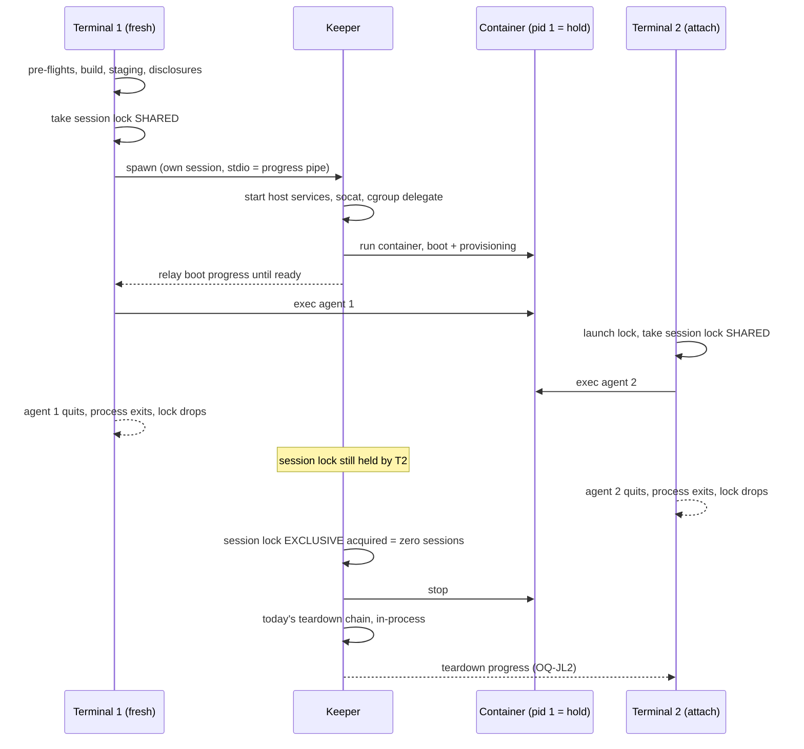
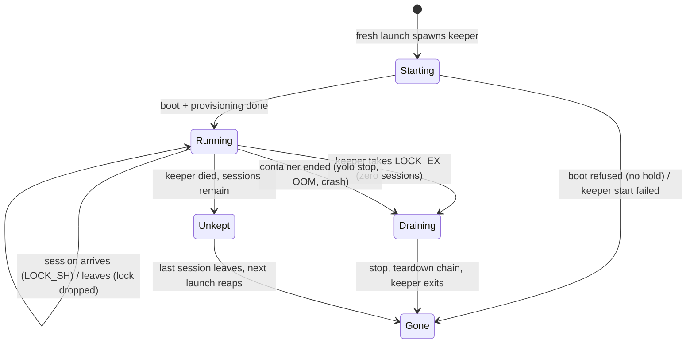

# A shared jail should end with its last session, not its first

**Status:** DESIGN, 2026-09-29. Nothing is built. Evidence is verified against `e0dc759c`.

> **In short.** "Last one out turns off the lights" is buildable without a central watcher. The
> container half is cheap. The expensive half is that the first terminal's `yolo` process *is*
> the jail's host services. So the design starts one **keeper** per running jail: a process
> started by the launch and gone when the jail is gone.

**Why it matters.** Today two agents in one workspace share one container. When the first
agent quits, the second one dies mid-task, with no message
([§2](#2-what-ties-a-jail-to-its-first-terminal-today)).

**The shape.** Four parts:

- a hold process as the container's pid 1;
- every session, the first included, entering by `exec`;
- a host-side session lock that each session holds and the kernel releases;
- one keeper per jail that owns the jail's host services and runs its teardown when that lock
  comes free.

**Cost.** The fresh-launch arm splits at the service boundary. The first session's exit code,
boot output and quit-time instrumentation come from new places.

**Start at [§4](#4-the-proposed-shape)**, the shape. [§5](#5-how-terrible-is-it) answers "how
terrible is this".

**Needs your ruling:** [OQ-JL1](#OQ-JL1), [OQ-JL2](#OQ-JL2), [OQ-JL3](#OQ-JL3), [OQ-JL4](#OQ-JL4).

**Reads with:** [`jail-lifetime-last-session-wins-plan.md`](jail-lifetime-last-session-wins-plan.md)
(the implementation sketch, incomplete while the questions are open) and
`docs/research/central-yolo-watcher.md` (the sibling exploration of a machine-wide watcher, being
written alongside this doc). [§11](#11-the-neighbors) lists the other docs, one line each.

---

## 1. The verdict, and the words it uses

**Yes, and without a central watcher.** My read is that it is a medium-large change, not a
terrible one:

- **Nothing new has to exist while no jail runs.**
- **Nothing in the jail's transport or in-jail contracts changes.** The host services keep
  their current code. They only change which process runs them.
- **Every piece has a precedent in the tree:**
  - a detached self-exec helper that outlives its launcher (`yolo internal scratch-rm`);
  - a kernel-flock liveness registry (the macos-user session dirs);
  - a pid-1 hold (the refused-boot hold).

What makes it more than a weekend is that the first launcher's process currently *is* the
jail's host services. Go cannot fork, so a process that hands the prompt back cannot keep
goroutine-hosted services alive. Some other process has to own them, and the design is mostly
about which one.

### 1.1 Terms

- **Session.** One `yolo` invocation that runs a command in a container jail: its launcher
  process on the host, plus the process tree it started inside the jail. This extends the
  word's macos-user meaning (`paths.HostServicesSessionPrefix`, *"one macos-user invocation of
  yolo"*) to the container backends. There, several sessions can share one container.
- **Keeper** *(coined here)*. One host process per running container jail. It owns that jail's
  host services (the credential fronts, fronted daemons, cgroup delegate and port forwards) and
  its teardown. The fresh launch starts it, and it exits once the jail is known gone.
  - **It is not a supervisor.** It restarts nothing and watches no other jail.
  - **It is not a central watcher.** There are as many keepers as running jails, and none when
    none are running.
- **Hold process.** The container's main process, which does nothing but keep the container
  running. It has the shape of `internal/entrypoint/hold.go`'s `holdContext`, which today is
  used only to keep a refused boot open for inspection.
- **Draining** *(coined here)*. The interval between the last session ending and the container
  being known gone.
- **Unkept jail** *(coined here)*. A running container whose keeper is known dead. Its sessions
  still run, but its host services died with the keeper.

### 1.2 Principles

- **JL-P1. A shared jail lives while any session does, and no longer.** The
  maintainer's "last one wins", 2026-09-29: *"make it the last one win so that you don't need to
  have the original one open."*
- **JL-P2. The count is the host's, and the kernel keeps it.** Nothing inside
  the jail can hold the jail open. A jail-visible counter would let a jail process keep the
  jail's host credential services alive after every human has left.
- **JL-P3. "Could not count" is never zero.** If the keeper cannot tell
  whether sessions remain, it leaves the jail running and says so. This is the polarity the
  orphan reaper already takes (`pidAlive`: *"never reap a jail we can't prove is orphaned"*,
  [`lifecycle.go`](../../internal/cli/run/lifecycle.go)).
- **JL-P4. One owner per jail, for the jail's whole life.** The keeper is
  [HD-R1](host-daemon-ownership.md#HD-R1) (*"spawned by the launch that wants it, serves that
  jail, and ends with it"*) read with "it" as the jail. [OQ-JL1](#OQ-JL1) asks whether that
  reading holds.

---

## 2. What ties a jail to its first terminal today

Four couplings, each sufficient on its own. A fix has to cut all four.

| # | Coupling | Evidence | Kind |
|---|---|---|---|
| 1 | **The first agent is the container's main process.** The run flags are `--rm -i --init --read-only --name <cname>`. The command tail is `bash -c '<provision>; <mise activate>; <banner>; <target>'`, entered through `yolo-entrypoint`, which execs bash. When the agent exits, bash exits, the init's child exits, and the container stops | [`assemble.go:345`](../../internal/cli/run/assemble.go), [`run.go:1560`](../../internal/cli/run/run.go), `buildFinalInternalCmd` in [`command.go:151`](../../internal/cli/run/command.go), `execBash` in [`boot.go`](../../internal/entrypoint/boot.go) | SOURCED |
| 2 | **When pid 1 exits, every exec session dies.** An `exec -d sleep 61` was gone from the container and the host once pid 1 exited. This is the kernel's rule: when a pid namespace's init dies, every other process in it gets SIGKILL | Research lens, 2026-09-29: nested podman 5.8.7, a probe container from `localhost/yolo-jail:latest` with its entrypoint overridden. [pid_namespaces(7)](https://man7.org/linux/man-pages/man7/pid_namespaces.7.html) | MEASURED |
| 3 | **The first launcher's process hosts the jail's host services.** Each loophole's front is a goroutine in it (`ServeFrontWithOptions`), and so is the cgroup delegate. Fronted daemons are Setsid children whose stop handles only it holds. The socat port forwards are its plain children, with no Setsid | [`loopholesruntime.go:427`](../../internal/cli/run/loopholesruntime.go) (*"a goroutine in THIS process"*), `:1082` (Setsid), `:1423` (the front); [`cgddaemon_linux.go:16`](../../internal/cli/run/cgddaemon_linux.go); [`network.go:43`](../../internal/cli/run/network.go) | SOURCED |
| 4 | **An attach will not heal them.** *"A jail whose launcher is gone is relaunched, not attached-and-repaired"* | [`run.go:2132`](../../internal/cli/run/run.go) | SOURCED |
| 5 | **The owner-PID reaper.** Every launch runs `reapOrphanedJails` before its attach decision. That call stops any live `yolo-*` container whose recorded owner PID is dead. So a first launcher that simply left would have its jail stopped by the next `yolo` in *any* workspace. It is a no-op on Apple Container | [`run.go:1002`](../../internal/cli/run/run.go), [`lifecycle.go:181`](../../internal/cli/run/lifecycle.go), `writeOwnerPID` at [`run.go:1511`](../../internal/cli/run/run.go) (fresh path only) | SOURCED |
| 6 | **Teardown runs only in that process.** The chain (`teardownAfterExit`, and the signal arm `onTerminate`) needs values only that launch holds: the socat handles, the daemon stop functions, the scratch-volume launch id, the home skeleton's name and the pack tree | [`run.go:1591`](../../internal/cli/run/run.go), [`run.go:1722`](../../internal/cli/run/run.go); [`trackingcleanup.go:54`](../../internal/cli/run/trackingcleanup.go) (*"this launch is the only one that knows its name"*) | SOURCED |

Rows 1 and 2 are the container coupling. Rows 3 to 6 are the host coupling, and they are where
the cost is.

> [!NOTE]
> **Pressing Ctrl-C in the first agent does not run the launcher's teardown.** Since the
> 2026-09-19 ruling, the TTY proxy forwards `0x03` into the jail as a byte
> ([`ttyproxy.go`](../../internal/ttyproxy/ttyproxy.go), `proxyLoop`). So "I Ctrl-C'd the first
> agent" means the agent chose to exit, which is coupling 1. Only a real SIGINT, SIGHUP or
> SIGTERM delivered to the launcher runs `onTerminate`: a window close, or `kill`. That arm
> runs `stopJail` (`podman stop -t 5`) first, on purpose, and so ends every session a second
> way ([`run.go:1599`](../../internal/cli/run/run.go)). SOURCED.

### 2.1 What already works for any process

Parts of the teardown already key on evidence rather than on which process runs them. A keeper
can call these unchanged:

- **`stopLoopholes`' directory removal and `forgetGoneContainer`'s tracking-file removal.** Each
  takes the workspace launch lock non-blocking, then asks the tri-state `ps -a` probe whether
  the container still exists. `reapOrphanedJails` already calls `stopLoopholes(nil, …)` from a
  *different* process ([`lifecycle.go`](../../internal/cli/run/lifecycle.go),
  [`loopholesruntime.go:430`](../../internal/cli/run/loopholesruntime.go)). SOURCED.
- **The E3 config capture.** It is idempotent and takes only the workspace and the runtime
  (`captureConfigOnTerminate`, [`runcmd.go`](../../internal/cli/run/runcmd.go)). SOURCED.
- **The scratch-volume remover.** It is detached, and it waits until podman says no container
  references the volumes, so it does not depend on who started it
  ([`scratchremoval.go:170`](../../internal/cli/run/scratchremoval.go), `startDetached` at
  `:234`). SOURCED.
- **The endpoint file.** In-jail clients re-read it on every dial. The code calls this *"the ONLY
  channel that can update an already-running container"*
  ([`svcendpoint/dial.go`](../../internal/svcendpoint/dial.go)). So even a front re-published by
  another process would be found. SOURCED.
- **The in-jail daemon supervisor.** It already has container lifetime. A later exec's
  `yolo-entrypoint` reuses the live supervisor rather than stacking a second one
  (`startJailDaemonSupervisor`, `anyJailDaemonSupervisorAlive` in
  [`entrypoint/runtime.go`](../../internal/entrypoint/runtime.go)). SOURCED.

### 2.2 Which backends have the problem

| Backend | Shared jail? | Has the defect? | Why |
|---|---|---|---|
| podman on Linux | yes | **yes** | all four couplings |
| podman on macOS (machine) | yes | **yes** | the same couplings. The launcher also has **no signal arm at all**: [`proxy_other.go`](../../internal/cli/run/proxy_other.go) ignores `onTerminate`, so a window close skips teardown entirely |
| Apple Container | yes | **yes** | the same couplings, and no signal arm. The owner-PID reaper is a no-op here, so an orphan is never reaped |
| macos-user | **no** | no | *"This backend has no attach — every macos-user invocation is a fresh sandbox"* ([`run.go:379`](../../internal/cli/run/run.go)). Since [HD-D1](host-daemon-ownership.md#HD-D1), each session also has its own host-services dir ([`servicessession.go`](../../internal/cli/run/servicessession.go)) |
| `yolo host` | no | no | each launch owns its services as its own children ([OQ-HS3](host-notch-services.md#OQ-HS3)) |

So "last one wins" means making the container backends behave the way the other two notches
already do.

### 2.3 Three defects found on the way

These exist today, independent of this design. Each should be fixed whichever option is chosen.

1. **Closing an attach terminal probably leaves its agent running headless.** Killing a
   `podman exec` client does not end the process it started. This held for SIGKILL, SIGHUP,
   SIGTERM and SIGINT to an `exec -it` client: conmon keeps the session and its pty, and
   `ExecIDs` kept listing it. The attach passes no `onTerminate`
   ([`run.go:2165`](../../internal/cli/run/run.go)), so after a window close the proxy SIGKILLs
   only its client.
   - The client behavior was MEASURED by the research lens on 2026-09-29, with `sleep` under a
     pty harness.
   - That the same happens to a real agent is INFERRED.
2. **podman's default detach sequence is live.** yolo sets no `--detach-keys` (`rg detach-keys
   internal/` finds nothing, SOURCED), and podman's default for `run -it` and `exec -it` is
   `ctrl-p,ctrl-q` (`podman run --help`, podman 5.8.7, MEASURED). Typing that sequence in the
   first session detaches its client. The launcher would then tear down the host services under
   a container that keeps running. INFERRED from `teardownAfterExit`'s order.
3. **An attached session is never told why its jail ended.** After the exec returns, the attach
   prints only the broken-prefix post-mortem and the macOS OOM hint
   ([`run.go:2177`](../../internal/cli/run/run.go)). SOURCED.

---

## 3. The options

One more fact is needed to read the table. The design needs **a container that outlives the
first session**, and there is exactly one way to get one. pid 1 must be something other than an
agent, and every agent session must enter by `exec`, the first included (coupling 2). An exec
round trip on an idle container costs **56 to 71 ms** (research lens, 3 × `podman exec
/bin/true`, MEASURED). So the options below differ only in **who owns the host services and
who runs the teardown**.

| | Option | How | Cost | What breaks or stays broken | Verdict |
|---|---|---|---|---|---|
| **O0** | **Legibility only** | Keep "the jail lives with the first terminal". When sessions remain, the quitting terminal says *"ending this jail ended N other sessions"*. Record a stop reason that an attach reads after its exec ends | Small | Not what was asked. The first terminal still owns every session | **Take its pieces into every option** ([§2.3](#23-three-defects-found-on-the-way)), not as the answer |
| **O1** | **Hold the door** | Hold process as pid 1, and every session is an exec. When the first launcher's own agent exits with sessions remaining, it hands the terminal back to cooked mode, prints that it is holding the jail for N sessions, waits on the session lock, then runs today's teardown | Small to medium. No new process kind | The first terminal stays occupied, and closing its window still ends everyone. Half the ask | **The first build slice** ([§7](#7-what-i-would-build-in-order)), not the end state |
| **O2** | **Successor at quit** (the maintainer's "orphan ourselves") | O1's container. When the first launcher quits with sessions remaining, it spawns a detached per-jail successor from a written ownership record. The successor re-fronts the running daemons on fresh ports, re-publishes their endpoint files, respawns socat and rebinds the cgroup delegate. The launcher waits for the successor's ready signal (about 1 to 2 s), then exits. The successor tears down when the count reaches zero | Medium-large. A single-session launch costs nothing extra. The handoff code runs only in the multi-session case | **Skew:** the successor is started hours after launch through `os.Executable`, which resolves a *path* ([`execx.go`](../../internal/execx/execx.go)), so it can run a binary `just install` replaced. **Gap:** in-flight connections drop at the handoff. **Blind spot:** re-published fronts are never checked by the boot-time reachability witness, and a nested jail cannot check them either (the `--net=host` carve-out). **Rarity:** the path runs rarely, so it rots | Rejected in favor of O3. Same end state, with a rarely-run handoff in place of a common path |
| **O3** | **Keeper from the start** | The fresh launch does its pre-flights, approvals, build, staging and disclosures in the terminal as today, then starts the keeper. The keeper starts the host services and the container, relays boot progress to the terminal until the jail is ready, and runs the teardown chain in-process when the count reaches zero. The foreground then becomes an ordinary session | Medium-large. A heavy-track change to the fresh arm | Every launch pays one process spawn and a pipe. The fresh arm's output stream, exit code and Window A accounting move ([§5](#5-how-terrible-is-it)). A keeper that dies leaves an **unkept jail** ([OQ-JL4](#OQ-JL4)) | **Leaning** ([OQ-JL1](#OQ-JL1)) |
| **O4** | **Migrate among live launchers** | O1's container, plus an owner election over a kernel flock. When the owner leaves, one attached launcher wins and rebuilds the host services from the running jail's records | Medium-large. No detached process at all | **Attach skew becomes ownership skew:** the winner's binary and config may differ from the jail's. The takeover happens inside a raw-mode agent terminal that cannot print, yet the host-execution disclosure has to precede any spawn ([`run.go:1534`](../../internal/cli/run/run.go)). The gap is total on SIGKILL. Most concurrency to test | Rejected. It spreads one jail's ownership across whichever terminals happen to be open |
| **O5** | **Per-session host services** | Each session owns the services its own agent uses, as macos-user already does | Large | The genuinely jail-wide services remain: port forwards bound at fixed mounted socket paths, the cgroup delegate, and in-jail daemons that serve every session. Those still need O2, O3 or O4 | Rejected as a replacement. Worth revisiting later to shrink what the keeper owns |
| **O6** | **podman's own lifetime features** | `podman pod create --exit-policy=stop` stops a pod *"when the last container exits"* ([podman-pod-create](https://docs.podman.io/en/latest/markdown/podman-pod-create.1.html), SOURCED). That would mean one container per session sharing a pod's namespaces. `--restart` conflicts with `--rm` (research lens, MEASURED). Quadlet and healthcheck timers are systemd | Large, and backend-specific | Pods count containers, not exec sessions. Apple Container has no pods. None of these owns the host services, so O3's keeper would still be needed | Rejected |
| **O7** | **The container counts its own sessions** | pid 1 exits after the last session, counting either per-session `--preserve-fd` death pipes or locks in a jail-visible directory. Whichever launcher sees the exit tears down | Medium | It solves nothing on the host: the services still live in the first launcher. `--preserve-fd` is crun-only and *"not available with the remote Podman client, including Mac"* ([podman-exec](https://docs.podman.io/en/latest/markdown/podman-exec.1.html), SOURCED). A jail-visible count breaks [JL-P2](#JL-P2) | Rejected as the count. The death pipe is kept as an optional Linux refinement ([JL-D4](#JL-D4)) |

---

## 4. The proposed shape

O3, the keeper from the start, subject to [OQ-JL1](#OQ-JL1).

### 4.1 The container: a hold process as pid 1, and every session an exec

- **pid 1 is the entrypoint's boot followed by a hold.** It runs today's boot and the run-once
  provisioning (what `buildFinalInternalCmd` puts before the target today), then blocks until
  it is signalled. It never runs an agent.
- **Every session enters by exec.** This is today's attach argv, `<rt> exec -i [-t] <cname>
  /opt/yolo-jail/bin/yolo-entrypoint <target>` ([`run.go:2157`](../../internal/cli/run/run.go)),
  for the first session too.
- **A session's exit code is its command's.** `yolo -- make` returns `make`'s code, as it does
  today.
- **No exec starts before provisioning finishes.** This includes an attach that races the
  first launch. Today such an attach can enter once the container is merely running
  (`onStarted` releases the lock after `awaitRunningContainer`, [`run.go:1577`](../../internal/cli/run/run.go)).
  The new rule closes that gap.
- **The refused-boot hold keeps working.** A boot that refuses under the hold opt-in
  (`hold.go`) is ended by its release file or by `yolo stop`. It is never ended by the session
  count ([§4.5](#45-failure-paths)).

### 4.2 The count: a host-side session lock

- **Each session holds a shared lock for its whole life.** Its launcher holds `LOCK_SH` on a
  host-only file keyed by the container name, in host state that no jail mounts. Mechanically
  this is `servicessession.go`'s pattern, shared instead of exclusive. The kernel drops the lock
  however the launcher dies, SIGKILL included.
- **It is taken under the launch lock, before that lock is released.** There is therefore no
  instant at which a session is inside the jail but not counted. The first session takes it
  *before* it spawns the keeper, so the keeper can never observe zero before the first session
  exists.
- **The keeper waits for the exclusive lock.** It blocks on `LOCK_EX` on the same file.
  Acquiring it means zero sessions, and at that moment **the jail is draining**: every later
  `LOCK_SH|LOCK_NB` fails.
- **An arrival that fails its shared take is arriving during a drain.** It waits for the keeper
  to exit, then launches fresh ([OQ-JL3](#OQ-JL3)).
- **Lock ordering, stated so it cannot deadlock.** An arrival takes the launch lock and then
  the session lock. The keeper **never blocks on the launch lock**. The guards it inherits from
  today's teardown take the launch lock non-blocking and back off, so a relaunch holding it
  keeps its own host-services dir, exactly as today
  ([`loopholesruntime.go:430`](../../internal/cli/run/loopholesruntime.go)).
- **`ExecIDs` is for display only.** `jailSessionCount` stays the number shown to a human
  ([`contracttags.go:430`](../../internal/cli/run/contracttags.go)). Its `+1` for "the main
  process" goes, because the main process is no longer a session. It is never the count that
  decides anything, because it also counts headless orphans
  ([§2.3](#23-three-defects-found-on-the-way) item 1), and Apple Container's value is
  unmeasured.

### 4.3 The keeper

- **Started once, at the fresh launch, from the launch's own binary.** It is detached in the
  `startDetached` shape: its own session, never awaited. Its version is therefore the launch's.
  The skew window is the few seconds of the spawn, not the jail's lifetime. After start, its
  code is in memory, so a later `just install` does not change what it runs.
- **Owns what the launcher owns today, with today's code.** That covers:
  - `startLoopholesDisclosed`'s daemons and fronts;
  - the cgroup delegate;
  - the socat forwards;
  - the credential-view registration;
  - the owner-PID file, which now names the keeper;
  - `teardownAfterExit`, run in-process where the handles, the skeleton name, the pack tree and
    the scratch-volume names already are.

  No in-jail contract changes. The in-jail daemons bound their ports at boot, and the
  launch-owned caller tokens stay the keeper's.
- **Learns of the container's end, whatever ends it**, without polling: `yolo stop`, an OOM
  kill, or a crash. It then runs the same teardown. How it learns (an attached client over
  pipes, or `podman wait`) is the implementer's choice.
- **Holds its own exclusive liveness lock for its life.** A free keeper lock beside a running
  container is how the next launch knows the jail is unkept ([OQ-JL4](#OQ-JL4)).
- **Writes its post-ready output to the workspace's `.yolo/launch.log`,** appended, beside
  `boot.log`. Before the jail is ready it writes to the pipe the fresh launch relays
  ([§4.6](#46-what-the-user-sees)).
- **Leaves the housekeeping slot in the foreground launch.** It is *"a post-attach slot inside
  the launch process, which dies with the launch and needs no daemon"*
  ([`minimal-disk-footprint.md`](minimal-disk-footprint.md), its A6;
  [OQ-BF5](disk-levers-and-backfill.md#OQ-BF5) moved the image reap into it). It still runs
  there, after the container is visible.

> [!WARNING]
> **The disclosure still precedes the spawn.** The host-execution disclosure *"has to precede the
> spawn"* ([`run.go:1534`](../../internal/cli/run/run.go)), because a pack-shipped daemon's
> disclosure is the whole trust boundary today ([`packhostgrants.go`](../../internal/cli/run/packhostgrants.go):
> *"the boundary today is DISCLOSURE, not consent"*). It is printed by
> the fresh launch, in the terminal, **before** it starts the keeper, and the keeper spawns no
> daemon that disclosure did not name. A keeper that printed its own disclosures would print
> them to a pipe after the fact, which is a notification rather than a disclosure.

### 4.4 Lifecycle

### 4.5 Failure paths

| Event | What happens | Who finds out |
|---|---|---|
| A session's launcher gets SIGHUP, SIGTERM or SIGINT (window close, `kill`) | **Only that session ends.** Its signal arm no longer calls `stopJail`. It sends SIGHUP to its own in-jail process tree ([JL-D4](#JL-D4)), restores the terminal and exits. Its lock drops | nobody else. That is the fix |
| A session's launcher is SIGKILLed | Its lock drops, so the count is right. Its in-jail agent may keep running headless until the jail stops. On Linux with local podman, the optional death pipe closes this gap | the next quit's display count may include it |
| The last session's launcher dies by any means | The keeper drains within one scheduling tick of the lock dropping | [OQ-JL2](#OQ-JL2) decides whether a terminal shows it |
| The keeper cannot open the session lock | [JL-P3](#JL-P3): it never drains on the count. It waits only for the container's own end, and logs why | `yolo ps` and the next arrival, which says the jail will end only by `yolo stop` |
| The keeper fails before the jail is ready | The fresh launch prints the keeper's error, which was relayed, and exits non-zero. Anything the keeper started is stopped by the keeper on its way out | the launching terminal |
| The keeper is SIGKILLed or OOM-killed | **Unkept jail.** The fronts and the cgroup delegate die with it. The Setsid daemons and socat are orphaned, as with a SIGKILLed launcher today | [OQ-JL4](#OQ-JL4) |
| A session arrives during a drain | Its `LOCK_SH|NB` fails. It prints that the jail is shutting down, waits for the keeper's liveness lock, then launches fresh | that terminal |
| `--rm` fails to remove the container because a headless exec was live at stop | Removal was MEASURED to fail in nested podman (`openByHandleAt: operation not permitted`), leaving a stopped container. After its stop, the keeper confirms the container is gone and removes a stopped leftover. It never removes a running one | `launch.log`. A real rootless host is owed a measurement ([§8](#8-what-done-looks-like)) |
| A refused boot under the hold opt-in | The keeper does not drain on the count. It waits for the hold's release or `yolo stop`, then tears down | the launching terminal, as today |

### 4.6 What the user sees

- **A fresh launch looks as it does today, up to the agent.** The same pre-flight lines and
  disclosures, then the keeper's relayed boot and provisioning lines. A launch has no quiet mode
  ([OQ-RO3](../reference/report-tiers.md#why-its-this-way)), so a relayed line is still
  printed. The relay only changes which process wrote it.
- **A non-last quit** prints one line and returns at once. Suggested wording: *"jail
  `<cname>` stays up for N other sessions; it stops when the last one leaves."*
- **The last quit** prints today's teardown lines, subject to [OQ-JL2](#OQ-JL2).
- **Every session whose jail ended under it** prints the recorded stop reason (`yolo stop`, OOM,
  the keeper gone, an attach-skew restart from another terminal). The keeper writes the reason
  record, and it is also printed when a session is refused during a drain.
- **`yolo stop` keeps its effect:** it ends every session and names the count
  (`jailSessionsPhrase`). Its help text changes. Today it says *"a jail lives in the terminal
  that launched it, and exiting (or Ctrl-C-ing) that session tears the jail down with you"*
  ([`stop.go:5`](../../internal/cli/stop.go)). That becomes: a jail lives while any session in
  it does.

### 4.7 Backends

| Backend | What changes | What is owed |
|---|---|---|
| podman on Linux | everything above | a rootless-host run for the `--rm` removal behavior and for the keeper's fronts. The loopback carve-out does not move: the same kind of process binds the same loopback, but a nested jail still cannot check it |
| podman on macOS | the same design. The session lock is a flock on the Mac, so it works with the remote client | a Mac run. This design also gives darwin its first working quit-by-signal path, because the keeper's teardown does not depend on the foreground's missing signal arm |
| Apple Container | the same design, through `container run` and `container exec` | whether `container exec` behaves as podman's does when its client dies, and whether its detach keys exist (unmeasured) |
| macos-user | **nothing.** Each invocation is already its own sandbox with its own services | the parity statement in [JL-D8](#JL-D8), so this is a declared difference rather than a silent fork |

---

## 5. How terrible is it

Plainly: **not terrible, and not small.** It is one heavy-track change, with no new daemon
class, no new transport, and no in-jail contract change.

| Area | Size | Why |
|---|---|---|
| pid 1 hold, first session by exec, readiness | small to medium | the hold shape exists (`hold.go`), and the exec argv exists (the attach arm) |
| The session lock, and the reaper reading it | small | `servicessession.go` is the pattern, and the reaper gains one more tri-state input |
| Moving services and teardown into the keeper | **medium-large** | `runContainer` splits at the service boundary. The code moves; it is not rewritten |
| The fresh arm's output stream | **medium** | the relay must keep every progress line and disclosure the terminal shows today, in order ([OQ-RO3](../reference/report-tiers.md#why-its-this-way)) |
| Window A, the linger probe, the timing report | medium | these instrument the `podman run` client's exit in the foreground, and that client moves to the keeper. They re-home to the keeper's log or are retired by name |
| Verification | **the real cost** | a nested jail verifies the lifecycle. The two carve-outs (loopback reachability and rootless paths) and both Mac backends need CI or a real host |

What is **not** on the list, because the evidence rules it out:

- **Rewriting the fronts.** The keeper runs them with today's code.
- **Changing the in-jail consumers.** They re-read endpoint files per dial and bound their own
  ports at boot. Neither changes, since the keeper *is* the launch for the jail's life.
- **A central process.**

**Why no central watcher is needed.** The keeper is a watcher of exactly one jail, spawned by
the launch, gone with the jail. That fits [HD-R1](host-daemon-ownership.md#HD-R1)'s wording and
[OQ-HS3](host-notch-services.md#OQ-HS3)'s per-launch lifetime, read with the jail as the unit.
It is not the background sweep rejected in
[`minimal-disk-footprint.md`](minimal-disk-footprint.md) (its A6: *"a lifecycle yolo does not
have"*). It sweeps nothing, and runs only while its jail does. A machine-wide watcher would add,
for this feature, only recovery from a keeper crash, and it would bring back a singleton that
HD-R1 retired. What a watcher *would* buy elsewhere is the sibling doc's subject
(`docs/research/central-yolo-watcher.md`).

| Risk | Mitigation |
|---|---|
| A keeper crash leaves live sessions without credentials | The free keeper lock makes the state known rather than guessed. [OQ-JL4](#OQ-JL4) decides what an arrival does. The keeper holds no state a relaunch needs |
| A single-session launch gets slower | One spawn plus one exec, tens of milliseconds (MEASURED for the exec). Its quit costs what today's quit costs if [OQ-JL2](#OQ-JL2) leans as it does |
| Two yolo versions on one machine | An older `yolo` attaching to a kept jail takes no session lock, so it is uncounted and ends when the counted sessions do. A newer `yolo` meeting a pre-feature jail finds no keeper record and falls back to today's owner-PID rule ([JL-D7](#JL-D7)) |
| The keeper's teardown output is lost | It is appended to `launch.log`, and the stop-reason record carries the outcome to the next session |

---

## 6. What this does not cover

- **A jail with zero sessions that stays up on purpose,** like a `tmux detach`. JL-P1 rules it
  out. A deliberately detached jail is the sibling watcher doc's territory.
- **A grace period** in which a jail with no sessions waits for a quick return. That is
  [OQ-JL3](#OQ-JL3)'s option B, and the leaning is no.
- **Sharing one jail across different pack sets.** Attach semantics for a different pack set
  are [OQ-ACP1](../plans/agent-config-packs.md#-oq-acp1--what-happens-when-two-people-attach-to-the-same-jail-with-different-pack-sets).
  An attach reads the running jail's pack tree, as today.
- **Retiring the host-scoped singletons.** That is [HD-R1](host-daemon-ownership.md#HD-R1)'s
  build, with its own [OQ-HD10](host-daemon-ownership.md#OQ-HD10). This design moves each
  launch's front and per-jail daemons into the keeper under either state of that retirement.
- **macos-user and `yolo host`,** which have no shared jail ([§2.2](#22-which-backends-have-the-problem)).
- **An agent started with a raw `podman exec`** outside yolo. It is not counted and may be
  stopped under its user. That is [OQ-HS3](host-notch-services.md#OQ-HS3)'s *"may lack features
  if not launched correctly"*, applied here.

---

## 7. What I would build, in order

1. **The three defects** ([§2.3](#23-three-defects-found-on-the-way)): an attach's signal arm
   ends its own in-jail process tree; `--detach-keys` is emptied on run and exec; and an attach
   whose jail ended prints why. Each is independent and useful today.
2. **The first build slice: the container half plus the count, with the fresh launcher still
   the owner (O1).** It covers the hold process as pid 1, every session by exec, readiness, the
   session lock, the reaper reading it, and the hold-the-door behavior at the first launcher's
   quit. **Why it comes first:**
   - It is shared by every option except O0, so it is buildable before [OQ-JL1](#OQ-JL1) is
     ruled.
   - It fixes the reported symptom: quitting the first agent no longer ends the others.
   - It leaves exactly one gap, and says so at the moment it matters. Closing the first
     window, or `kill`ing its launcher, still ends every session, and the held terminal's line
     says that.
3. **The keeper (O3), once [OQ-JL1](#OQ-JL1) is ruled.** Extract the service half and the
   teardown chain into `yolo internal jail-keeper`, a hidden subcommand as AGENTS.md requires,
   not a binary. Build the relay, and move the owner-PID file onto the keeper.
4. **The Mac backends.** Measure `container exec`'s client-death behavior and the detach keys on
   Apple Container. Run the lifecycle on both Mac runners.

---

## 8. What done looks like

Each of these is observable by a human:

1. **Two sessions, quit the first.** Two terminals in one workspace run agents. Quitting the
   first agent leaves the second working. The second's credential refresh (a broker front
   request) still succeeds after the first terminal has returned to its shell prompt.
2. **Close the first window.** After step 3 of [§7](#7-what-i-would-build-in-order), closing the
   first terminal's window leaves the second session unaffected.
3. **Quit the last.** The last quit shows the teardown ([OQ-JL2](#OQ-JL2)). Afterwards `podman
   ps -a` lists no container of the name, `yolo config diff` reflects that session's edits, and
   no keeper process remains.
4. **Scripts and single sessions.**
   - `yolo -- true` exits 0 and leaves no process and no container behind.
   - `yolo -- false` exits 1.
   - A single-session launch's quit time is within noise of today's, by the Window A records.
5. **`kill -9` the last session's launcher.** The jail drains within a second, and `launch.log`
   records it.
6. **`kill -9` the keeper.** The next arrival does what [OQ-JL4](#OQ-JL4) rules. Once the
   surviving sessions leave, the next launch reaps the container.
7. **The upgrade day.** On a machine with a jail started by the previous yolo, a new `yolo`
   attaches exactly as today, and that jail's first launcher still owns it.
8. **The removal measurement.** On a real rootless host, the `--rm` removal with a headless exec
   live at stop is measured, and the keeper's leftover removal is seen to act or not be needed.

---

## 9. Open Questions

1. 💬 **[OQ-JL1](#OQ-JL1): Who owns a shared jail's host services once the
   first terminal may leave?** This is the architecture question. It decides whether there is a
   new long-lived process kind at all, and whether [HD-R1](host-daemon-ownership.md#HD-R1)'s
   *"ends with it"* is read as the jail or as the first launch.

   - **A. A keeper per jail, started with the jail (O3).** One code path for every launch. The
     keeper holds today's handles, so teardown is unchanged. The skew window is only the
     spawn's. Every launch pays a spawn, and the fresh arm's output is relayed.
   - **B. A successor, spawned only when the first launcher quits with sessions left (O2).**
     A single-session launch costs nothing extra. The rarely-run handoff re-creates the fronts
     hours later, from a record, possibly with a newer binary, and outside the reachability
     witness.
   - **C. Ownership migrates to a surviving terminal (O4).** No detached process. Attach skew
     becomes ownership skew, and the takeover cannot print its disclosure.
   - **D. Stop at hold-the-door (O1).** The first terminal stays occupied until the others leave.
     This is half the ask, and cheap.

   <!-- vantage: oq id=OQ-JL1 leaning="A, a keeper per jail started with the jail: one path for every launch, today's teardown code unchanged, and the only skew window is the spawn's." -->

   _Leaning:_ **A.** It is the only option where the process that tears down is the one that set
   up, with the same binary, which is what makes teardown trustworthy. B buys a
   zero-cost single session by making the multi-session path the rarely-run one, and a
   rarely-run handoff is the kind of path that rots. D is the first slice either way. **The
   trap:** A reads HD-R1 as "ends with the jail". If the ruling meant "ends with the launch
   process", A contradicts it and only D survives.

   **Answer:**
   > _(empty — fill in when decided)_

2. 💬 **[OQ-JL2](#OQ-JL2): Does the last session's quit wait for the
   teardown and show it?** Today the terminal that ends a jail shows the teardown and returns
   only after it. With a keeper, the teardown runs in another process.

   - **A. Wait and stream.** The last session waits on the keeper's liveness lock and prints its
     teardown lines, as today. `yolo -- true && yolo config diff` stays correct. The last quit
     is no faster than today's.
   - **B. Return at once.** Print one line pointing at `launch.log`. Every quit is instant. A
     script's next command can see the jail still draining, and `yolo config diff` can return
     the previous session's answer. That is the race E3 exists to prevent
     ([`runcmd.go`](../../internal/cli/run/runcmd.go)).
   - **C. Wait only for what a next command reads.** That is the container gone and the E3
     capture done. Stream those, and leave daemon stops and socat to the background.

   <!-- vantage: oq id=OQ-JL2 leaning="A, wait and stream: the quit a user sees today stays the quit they see, and scripts that run yolo twice stay correct." -->

   _Leaning:_ **A.** It preserves today's observable quit exactly. C is the natural optimization
   once the chain is measured. **The trap:** "last" is known only after the fact. A session
   that finds it was not last must not wait, and one that cannot tell ([JL-P3](#JL-P3)) must not
   wait forever. It prints that the jail is draining in the background.

   **Answer:**
   > _(empty — fill in when decided)_

3. 💬 **[OQ-JL3](#OQ-JL3): What does a session arriving during a drain
   do?** The last agent has just quit, and a new `yolo` in the same workspace starts while the
   keeper is tearing down.

   - **A. Wait for the drain, then launch fresh.** No timer. The arrival pays the teardown plus a
     fresh boot, and says why it waits.
   - **B. A grace window of N seconds.** A jail with no sessions waits N seconds, and an arrival
     inside the window attaches. A quick relaunch is instant. But every script's last `yolo`
     leaves a jail up for N seconds, and a timer is a new lifecycle rule.

   <!-- vantage: oq id=OQ-JL3 leaning="A, wait then launch fresh: no timer, and no jail left running with nobody in it." -->

   _Leaning:_ **A.** B's benefit is a single relaunch. Its cost lands on every run, and it is a
   step toward the watcher this design avoids. **The trap:** under B, [OQ-JL2](#OQ-JL2)'s wait
   would be N seconds longer, or the quit would lie about the jail being gone.

   **Answer:**
   > _(empty — fill in when decided)_

4. 💬 **[OQ-JL4](#OQ-JL4): When the keeper has died but sessions are still
   running, what does the next `yolo` do?** Today the reaper stops a jail whose owner is dead.
   That was harmless when only the owner's session was in it. Now it would kill surviving
   agents mid-task.

   - **A. Refuse to attach, and say why.** Name the unkept jail and the live session count, and
     offer `yolo stop`, then a launch. The survivors keep working until their user decides.
     This is today's *"relaunched, not attached-and-repaired"* rule
     ([`run.go:2132`](../../internal/cli/run/run.go)).
   - **B. Reap it as today.** The survivors die, the arrival gets a working jail, and nobody is
     asked.
   - **C. Attach with a warning.** The session works without host services: agents fail on
     credentials, and cgroup delegation and port forwards are gone.

   <!-- vantage: oq id=OQ-JL4 leaning="A, refuse and offer yolo stop: survivors' work is not ours to kill, and a session without host services is broken in ways the user would not see coming." -->

   _Leaning:_ **A.** The rarity of a keeper crash does not justify killing work unasked. The
   reaper then acts only when both locks are free. **The trap:** the reaper runs in *every*
   workspace's launch, so its check has to read the session lock before the owner PID. Read in
   the other order, a reaper in an unrelated workspace kills the survivors, and no message about
   it reaches the workspace that lost them.

   **Answer:**
   > _(empty — fill in when decided)_

---

## 10. Decision Ledger

Implementation decisions, mine to make under the ruled principles. Each one names what it
rests on.

| ID | Decision | Date | Settled in | Built |
|---|---|---|---|---|
| JL-D1 | *Implementation decision.* **pid 1 is a hold process, and every session enters by exec.** Forced by coupling 2 (MEASURED). The only design space is who owns the host half | 2026-09-29 | [§4.1](#41-the-container-a-hold-process-as-pid-1-and-every-session-an-exec) | — |
| JL-D2 | *Implementation decision.* **The count is a host-only kernel lock** (`LOCK_SH` per session, `LOCK_EX` by the keeper), taken under the launch lock. `ExecIDs` is for display only. Follows [JL-P2](#JL-P2): a lock is SIGKILL-safe and needs no runtime call, which also sidesteps Apple Container's unmeasured `ExecIDs` | 2026-09-29 | [§4.2](#42-the-count-a-host-side-session-lock) | — |
| JL-D3 | *Implementation decision.* **An unopenable lock means "sessions remain".** The keeper then waits only for the container's own end. Follows [JL-P3](#JL-P3) | 2026-09-29 | [§4.5](#45-failure-paths) | — |
| JL-D4 | *Implementation decision.* **A session's signal arm ends only its own session.** It never calls `stopJail`, and it sends SIGHUP to its in-jail process tree. On Linux with local podman, an optional `--preserve-fd` death pipe also covers a SIGKILLed launcher; elsewhere a SIGKILLed session's agent runs until the jail stops. `yolo stop` stays the way to end every session | 2026-09-29 | [§4.5](#45-failure-paths) | — |
| JL-D5 | *Implementation decision.* **The keeper is started at the fresh launch from the launch's own binary,** detached like the scratch remover, and never after the fact. This keeps the skew window to the spawn's. It runs as a hidden `yolo internal` subcommand | 2026-09-29 | [§4.3](#43-the-keeper) | — |
| JL-D6 | *Implementation decision.* **Disclosures stay in the fresh launch, before the keeper's spawn. Boot progress is relayed until ready, and later output is appended to `launch.log`.** Follows the disclosure-before-spawn rule ([`run.go:1534`](../../internal/cli/run/run.go)) and [OQ-RO3](../reference/report-tiers.md#why-its-this-way) | 2026-09-29 | [§4.3](#43-the-keeper), [§4.6](#46-what-the-user-sees) | — |
| JL-D7 | *Implementation decision.* **The reaper reaps only a jail whose keeper lock AND session lock are both free.** It falls back to today's owner-PID rule for a jail with no keeper record, which covers jails started before this ships | 2026-09-29 | [§5](#5-how-terrible-is-it) | — |
| JL-D8 | *Implementation decision.* **Parity: the keeper and the count exist only where sessions share a jail.** On macos-user and `yolo host`, each invocation already owns its own sandbox and services, so the concern does not arise there. That is stated, not forked silently | 2026-09-29 | [§4.7](#47-backends) | — |
| JL-D9 | *Implementation decision.* **After its stop, the keeper confirms the container is gone and removes a stopped leftover,** and never a running one. The trigger is the `--rm` removal failure MEASURED in nested podman when a headless exec was live | 2026-09-29 | [§4.5](#45-failure-paths) | — |
| JL-D10 | *Implementation decision.* **The housekeeping slot stays in the foreground launch.** [OQ-BF5](disk-levers-and-backfill.md#OQ-BF5) placed it in a process that dies with the launch, and the keeper is not that process | 2026-09-29 | [§4.3](#43-the-keeper) | — |

---

## 11. The neighbors

- `docs/research/central-yolo-watcher.md`, the sibling exploration. It covers what a
  machine-wide watcher would fix beyond this feature, and why this feature does not need one.
- [`host-daemon-ownership.md`](host-daemon-ownership.md): [HD-R1](host-daemon-ownership.md#HD-R1),
  which the keeper reads with the jail as the unit ([OQ-JL1](#OQ-JL1)).
- [`host-notch-services.md`](host-notch-services.md): [OQ-HS3](host-notch-services.md#OQ-HS3),
  per-launch services at the host notch, and the "launched outside yolo" ruling.
- [`durable-scratch-space.md`](durable-scratch-space.md): the per-launch scratch volumes, which
  the keeper's teardown still hands to the detached remover. Its step 3 (*"When the owning
  launch's command exits, the container stops, its attached sessions end"*) changes with this
  design.
- [`attach-skew-and-contract-guardrails.md`](attach-skew-and-contract-guardrails.md): the attach
  contract gate, unchanged here, and `jailSessionCount` (SK-D7).
