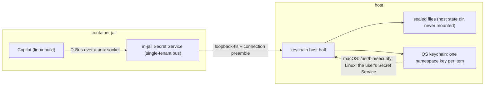

# Copilot's keychain, from a jail: a Secret Service inside, the real keychain outside

**Status:** 2026-09-29. Nothing is built, and four rulings are owed. The repository
evidence was verified at `232e4dcd`. The Copilot evidence comes from the published 1.0.89 packages
([Appendix A](#appendix-a--evidence)). No agent CLI was run.

> **In short.** Copilot already stores its login the responsible way. It asks the operating
> system's password store first and writes plain text only with consent. So yolo should not route
> around that path. It should give the jail a password store whose entries live in sealed files on
> this machine, locked by a key in the user's login keychain (or desktop keyring), and scope it so
> a jail can reach only the entries yolo made for it.

**Why it matters.** Today every workspace asks for its own `copilot login` and then for consent to
keep the token in plain text. Each login also mints another GitHub OAuth token, and GitHub keeps
only ten per user, app and scope, so an eleventh login revokes one of the others (INFERRED for
Copilot's app, [E14](#E14)).

**The shape.** An in-jail Secret Service that is its own small D-Bus bus, a keychain host half
reached over `loopback-tls`, and on the host one sealed file per namespace, whose key lives in the
OS keychain ([§3.1](#31-the-components)).

**Cost.** One new loophole pack. A D-Bus server and a Secret Service written in Go's standard
library. Two host keychain adapters. Plain-text copies of Copilot's login where no keychain can be
reached ([§5](#5-the-fallback-copy-only-copilottokens-and-say-so)). And seven changes to yolo
itself ([§3.14](#314-what-yolo-itself-must-change)): a readiness budget and a reason line from a
loophole's host daemon to its launch, a launcher-side value in the
credential gate for an agent with no profile selected, a startup input naming the container and
the opted-in agents, a machine-list field in the pack manifest, a written-out footprint claim, a
rule for an attach, and a host-side step when a jail ends.

**Start at [§3](#3-the-design).** The per-backend answer in [§1](#1-the-short-answer) falls out of
it.

**Needs your ruling:** [OQ-KC1](#OQ-KC1), [OQ-KC2](#OQ-KC2), [OQ-KC3](#OQ-KC3), [OQ-KC4](#OQ-KC4).
Accepting this design also answers
[OQ-CT1](../research/copilot-token-storage.md#OQ-CT1). That question stays open in its own document
until the ruling is recorded there.

**Reads with:** [`copilot-token-storage.md`](../research/copilot-token-storage.md) (the
measurement this answers, and the maintainer's direction on
[OQ-CT1](../research/copilot-token-storage.md#OQ-CT1)),
[`host-notch-services.md`](host-notch-services.md#HS-D15) (HS-D15, the doorway rule this design
follows), [`loophole-transport.md`](../reference/loophole-transport.md) (the jail-to-host hop),
[`agent-credentials.md`](../reference/agent-credentials.md#the-credential-boundary) (the boundary
[OQ-KC1](#OQ-KC1) is about), and [`boundary-broker.md`](boundary-broker.md#61-linux) (BB-D11, the
other planned D-Bus client, which sets the no-fallback rule for the host bus). There is no plan
sketch yet. One opens once the questions are ruled.

---

## 1. The short answer

- **Yes, Copilot's own keychain path can work from a container jail.** On Linux, Copilot's store
  talks to the [Secret Service](https://specifications.freedesktop.org/secret-service/latest/), the
  freedesktop.org password-store API, over [D-Bus](https://www.freedesktop.org/wiki/Software/dbus/),
  the Linux inter-process message bus ([E1](#E1)). That is a protocol boundary yolo can serve.
  Copilot needs only a bus address in its environment and something on that bus that answers as
  the Secret Service ([E7](#E7)).
- **Nothing off the shelf does the job.** Every existing Secret Service keeps its secrets in a
  store of its own (a local encrypted file, or for bitw a Bitwarden vault), unlocked by a password
  or login that would also have to live in the jail. None stores into the host's keychain. Run in a
  jail, one protects no better than today's `config.json` against any process in the jail, and it
  shares nothing between workspaces (INFERRED from [E9](#E9)). So yolo writes its own: a small
  bus inside the jail that forwards to a host half. The host half keeps the entries in sealed
  files on this machine, locked by a key in the user's login keychain or desktop keyring
  ([§3](#3-the-design)).
- **On macOS the Copilot binary has no such seam.** It calls Apple's Security framework directly
  ([E12](#E12)). The seam exists wherever Linux Copilot runs, which includes every container jail
  on a Mac. It does not exist for macos-user or `yolo host`
  ([§4](#4-macos-user-and-yolo-host)).

### 1.1 Per backend

| Setup | Copilot build that runs | Keychain route | Where a login lands |
| :--- | :--- | :--- | :--- |
| `podman` on a Linux host with a desktop keyring | linux | **on** | A sealed file on the host, whose key sits in the user's Secret Service (GNOME Keyring, KWallet, KeePassXC). Once per machine |
| `podman` on a Linux host with no Secret Service on the launch's session bus (headless, or SSH with no session) | linux | **off** for that launch | Plain text in `config.json` after Copilot's own consent prompt, then the login copy ([§5](#5-the-fallback-copy-only-copilottokens-and-say-so)) |
| `podman` on macOS (the podman machine VM) | linux | **on** | A sealed file on the Mac, whose key sits in the user's login keychain. Once per machine |
| `container` (Apple Container) | linux | **off** until the jail can reach the host ([G6](../plans/setup-support-gaps.md#2-ranked-gap-backlog)) | Plain text after consent, then the login copy |
| `macos-user` | darwin | **no seam**: [OQ-KC4](#OQ-KC4) | Today, most likely plain text after consent (INFERRED, [E17](#E17)), then the login copy. With [OQ-KC4](#OQ-KC4) option B, the sandbox account's own keychain |
| `yolo host` | the host's | **not needed** | The user's own keychain, exactly as a Copilot launched without yolo would use it ([§4.2](#42-yolo-host-already-right)) |

Apple Container is off because its launch starts no pack host daemon except the OpenAI credential
service, and the jail-to-host TCP hop is measured dead there
([per-backend differences](../reference/agent-credentials.md#per-backend-differences), [E23](#E23)).
Nested jails are also off by default, because the "host" of a nested jail is the outer jail, and
that has no keychain. [§6](#6-build-order) says how a developer turns the route on there for
testing.

### 1.2 Terms

| Term | Meaning | Origin |
| :--- | :--- | :--- |
| **keychain** | The operating system's password store: Apple's [Keychain Services](https://developer.apple.com/documentation/security/keychain_services) on macOS, and whatever owns the Secret Service on Linux. Not a file yolo writes | Standard |
| **Secret Service item, collection, alias** | An *item* is one secret plus a set of string *attributes* and a label. A *collection* is a group of items. An *alias* is a name for a collection, and `default` is the one clients use | [Secret Service spec](https://specifications.freedesktop.org/secret-service/latest/) |
| **session (`plain`, `dh`)** | How secrets travel between client and service. `plain` sends them as they are. `dh` agrees a key by Diffie-Hellman and sends them AES-encrypted. Not a login session | [Spec, transferring secrets](https://specifications.freedesktop.org/secret-service/latest/transfer-secrets.html) |
| **prompt** | The spec's object for "a human must act", for example an unlock dialog | [Spec, prompts](https://specifications.freedesktop.org/secret-service/latest/prompts.html) |
| **host half** | The part of a credential service that runs on the host | [HS-D15](host-notch-services.md#HS-D15) |
| **doorway** | The thin adapter an agent's client talks to, which checks the caller and forwards to the host half | [HS-D15](host-notch-services.md#HS-D15) |
| **`loopback-tls`** | yolo's jail-to-host transport: TLS over loopback TCP with a pinned certificate and a per-(jail, service) bearer token | [`loophole-transport.md`](../reference/loophole-transport.md#what-loopback-tls-is-in-five-steps) |
| **agent env file** | The per-agent file the credential gate writes, which that agent's launcher sources just before the exec | [`providers.md`](../reference/providers.md#the-credential-gate) |
| **notch** | One setting of yolo's confinement dial. `yolo host` is the host notch | [`config-target-resolution.md`](../reference/config-target-resolution.md) |
| **machine tier, workspace tier** | State shared by every workspace on the machine, versus state kept per workspace | [The three tiers](../reference/macos-user-home-tiers.md#the-three-tiers-and-where-each-one-lives) |
| **single-tenant bus** | A D-Bus server that owns one service name itself and routes nothing between clients. Not `dbus-daemon`, which routes between any clients | *(coined here)* |
| **namespace** | The set of jail keychain entries that one host key protects: one per (agent, tier), where the tier is the machine or one workspace | *(coined here)* |
| **namespace key, sealed file** | A namespace's random 256-bit key, kept as one item in the host keychain, and the file on the host holding that namespace's entries encrypted under it | *(coined here)* |
| **key id, entry id** | A key id is a random identifier stored beside a namespace key in its keychain item and written into the header of every sealed file sealed under that key. An entry id is a random identifier an entry gets when it is created, stored with it in the sealed file | *(coined here)* |
| **readiness line** | The one line a yolo daemon writes to an inherited descriptor when it starts: `ready <name>`, or `failed <name> <reason>`. The jail's daemon supervisor and the host notch's launch-owned services already read it; a loophole's host daemon does not today | [wire-bridge.md, current values](../reference/wire-bridge.md#current-values) |
| **machine list** | The Secret Service `service` attribute values an agent pack declares as machine-wide. Every other entry is per workspace | *(coined here)* |
| **login copy** | Route D of [OQ-CT1](../research/copilot-token-storage.md#OQ-CT1): copying only Copilot's `copilotTokens` entries between workspaces, in plain text | *(coined here)* |

## 2. How Copilot and the other agents use a keychain

### 2.1 Copilot on Linux

Copilot 1.0.89's native module reaches the keychain through four Rust crates. `keyring-core` is
the store abstraction, `zbus-secret-service-keyring-store` is the Linux store, `secret-service`
implements the protocol, and `zbus` is the D-Bus client. The darwin build contains none of the
last three (MEASURED, [E1](#E1)).

- **It always asks for a `dh` session and never falls back to `plain`.** The algorithm is
  `dh-ietf1024-sha256-aes128-cbc-pkcs7` (SOURCED, re-read 2026-09-29, [E2](#E2)). So any service
  that yolo supplies must implement `dh`.
- **It finds the bus the standard way.** It reads `DBUS_SESSION_BUS_ADDRESS`, then tries
  `$XDG_RUNTIME_DIR/bus`, then `/run/user/<euid>/bus`. It connects over unix sockets, TCP or
  `unixexec`, authenticates with `EXTERNAL` or `ANONYMOUS`, and sends `Hello` first (SOURCED,
  [E7](#E7)).
- **A jail has none of this today.** There are no D-Bus variables in the environment, no D-Bus
  binary in the image, and no `dbus` package in [`flake.nix`](../../flake.nix) (MEASURED,
  [E8](#E8)). The store's message for that case is "no secret service provider or dbus session
  found" (MEASURED), and a failed keychain write leads to the plain-text consent prompt (SOURCED
  for 1.0.48, INFERRED for 1.0.89,
  [research §3.2](../research/copilot-token-storage.md#32-when-the-keychain-fails-a-prompt-then-plain-text)).

These are the calls its store makes (SOURCED, with its string table MEASURED, [E3](#E3)):

| Operation | Calls, in order |
| :--- | :--- |
| Open | `OpenSession("dh", …)`, once per store |
| Save | `SearchItems({service, username})`. With exactly one match, `Item.SetSecret`. With none, `ReadAlias("default")`, then the collection's `Locked` property, then `Unlock` only if it is locked, then `Collection.CreateItem(label, attributes, secret, replace=true, "application/octet-stream")` |
| Read | `SearchItems`, then `Unlock` on any locked results (running a prompt only if `Unlock` returns one), then `Item.GetSecret(session)` |
| Delete | `SearchItems`, then the item's `Locked` property, then `Item.Delete` |
| Properties | Read through `org.freedesktop.DBus.Properties.Get` every time, with no cache. The crate can also set an item's `Attributes` |

It never calls `GetSecrets` or `SetAlias`, and never uses the alias object path. The default label
is `keyring:<username>@<service>`.

### 2.2 Copilot on macOS

The darwin build calls `SecKeychainAddGenericPassword`, `SecKeychainFindGenericPassword`,
`SecKeychainItemModifyAttributesAndData` and `SecKeychainCopyDomainDefault` from Apple's legacy
keychain API. It searches only the user's default keychain (MEASURED and SOURCED, [E12](#E12),
[E17](#E17)). These are library calls to the system keychain daemon, with no protocol in between
that yolo could serve.

### 2.3 What Copilot keeps there

- **Its login.** In 1.0.48 the service was `copilot-cli` and the account `<host>:<login>`. "Any
  token" meant a search by service alone (SOURCED). In 1.0.89 the literal `copilot-cli` appears
  nine times, always inside a longer string, so **the 1.0.89 service name is unverified**
  (MEASURED, [E15](#E15)).
- **MCP secrets.** When an MCP server needs secret header values, Copilot offers "Secret storage":
  keychain (the default) or a private file, and says *"A failure never switches storage."* The
  native module also carries an MCP OAuth store and an API secret store (MEASURED, [E15](#E15)).
- **A timeout of unknown length.** Keychain calls are bounded ("Keytar operation timed out"). The
  bound was not found (MEASURED, [E15](#E15)).

The login is a GitHub OAuth App token whose requested scopes include `repo` and `codespace`
(MEASURED, the full string is in [E13](#E13)). It is long-lived and has no refresh token (INFERRED
from the client id, the scope string and the token-prefix checks, [E13](#E13)). Two things follow.
Sharing it has none of Claude's single-use refresh race, so no broker is needed. But one shared
login gives every jail that selects Copilot read and write access to every repository the user can
reach, and lets it create and manage the user's Codespaces, which is why [OQ-KC1](#OQ-KC1) is a
real decision.

### 2.4 The other programs a jail runs

| Program | How it uses a keychain | What it would need from yolo's service |
| :--- | :--- | :--- |
| `gh`, through go-keyring v0.2.8 | A `plain` session only. It reads the `Collections` property, uses `/org/freedesktop/secrets/collection/login` if that is listed and otherwise the alias path as a collection, then calls `SearchItems`, `CreateItem`, `Unlock`, `GetSecret` and `Session.Close`. Its service is `gh:<hostname>`. Each call gets 60 s, and a failed `Set` writes the token in plain text to `hosts.yml` (SOURCED, [E5](#E5)) | `plain`, the `Collections` property, and collection methods at the alias path |
| libsecret clients (`secret-tool`, Python `keyring`, `git-credential-libsecret`) | `dh` first, then `plain` on `NotSupported` (SOURCED, [E6](#E6)) | `plain` or `dh` |
| Codex | Its login store defaults to `File`. Its MCP OAuth store defaults to `Auto`, which uses the keyring when one can be reached (SOURCED, [E16](#E16)) | Moves its MCP logins only if it can see a bus |
| Claude | A file on Linux. On macOS the keychain comes first and the file is the fallback ([`claudeview.go`](../../internal/claudeview/claudeview.go#L59-L62)) | Nothing on Linux. Relevant to [OQ-KC4](#OQ-KC4) |

## 3. The design

### 3.1 The components



| Component | Runs where | Owns (the one writer) | Talks to |
| :--- | :--- | :--- | :--- |
| **In-jail Secret Service**, a `yolo-jaild` daemon | Inside the container | The bus, its sessions and object paths. No secret outlives a request | Jail clients over a unix socket, and the host half over `loopback-tls` |
| **Keychain host half**, a loophole host daemon, one per jail under [HD-R1](host-daemon-ownership.md#HD-R1) | Host | The sealed files, under a per-namespace lock ([KC-D5](#KC-D5)) | The OS keychain, to read namespace keys, or create one under the namespace lock ([KC-D15](#KC-D15)) |
| **OS keychain** | Host | The namespace key items, created by the host half and removable by the user | Nothing in yolo but the host half |
| **Launch** | Host | Whether the route is on for this launch, the bus address in the agent env file, and the disclosure | The host half's readiness line ([KC-D13](#KC-D13)) |

A new `keychain` pack ships the loophole, which declares both halves. An agent pack opts in with
`needs` and declares its machine list ([KC-D12](#KC-D12)). Every loophole yolo ships belongs to a
pack, and this one follows the same shape as `openai-auth`, which three agent packs `need`.

### 3.2 The jail side: a single-tenant bus that is also the Secret Service

**The bus.**

- **It listens on a unix socket in an owner-only (0700) directory**, created by the entrypoint
  under the jail's per-launch runtime directory. **It never listens on TCP.** Under
  podman-in-podman's forced `--net=host`, a jail's TCP port is a port on the host's loopback. And a
  D-Bus client cannot present yolo's caller token ([E20](#E20)).
- **It admits one peer uid, its own.** The check uses the kernel's peer credentials
  (`SO_PEERCRED`), and the SASL `EXTERNAL` identity the client sends must match them. `ANONYMOUS`
  is refused, and passing file descriptors is declined.
- **It answers the `org.freedesktop.DBus` methods clients call when they connect.** That starts
  with `Hello`, which assigns a unique name. The exact set is closed by the reference clients of
  [§6](#6-build-order), not by guesswork. Any method outside it answers `UnknownMethod`.
- **It owns `org.freedesktop.secrets` itself.** A message for any other destination answers
  `ServiceUnknown`, exactly as a real bus without that service would. So `notify-send` or
  `systemctl --user` run in the jail behave as they do today.
- **It emits no signals in v1.** None of the reference clients need
  `ItemCreated`/`ItemChanged`/`ItemDeleted`. `AddMatch` and `RemoveMatch` are accepted and
  otherwise ignored.

**The Secret Service surface** (SOURCED against the spec, [E4](#E4)):

| Object | Implemented | Refused |
| :--- | :--- | :--- |
| Service, at `/org/freedesktop/secrets` | `OpenSession` for `plain` and `dh`. `SearchItems`. `Unlock`, which returns every path given plus the prompt path `/`. `Lock`, which locks nothing. `GetSecrets`. `ReadAlias("default")`. The `Collections` property | `OpenSession` for any other algorithm answers `NotSupported`. `CreateCollection` and `SetAlias` also answer `NotSupported` |
| Collection `default`, at both `/org/freedesktop/secrets/collection/default` and `/org/freedesktop/secrets/aliases/default` | `SearchItems`. `CreateItem`, which honors `replace`. The properties `Items`, `Label`, `Locked` (always false), `Created` and `Modified` | `Delete` |
| Item | `GetSecret`, `SetSecret` and `Delete`. The properties `Attributes` and `Label` (both writable), `Locked` (always false), `Created` and `Modified` | none |
| Session | `Close` | none |

- **Sessions belong to a connection.** Each one is bound to the bus connection that opened it and
  closed when that connection drops, as the spec requires. That is why this has to be a bus rather
  than a bare socket.
- **Nothing is ever locked, and no prompt object is ever created.** The spec lets a service unlock
  for one client only ([E4](#E4)). The only human step, unlocking the host keychain, happens at
  launch ([§3.3](#33-the-host-side-the-doorway-into-the-real-keychain)), not during a call.
- **Search follows the spec.** An entry matches when its attributes include every pair searched
  for, and results always come back in the `unlocked` list.
- **Object paths are stable.** Each entry gets a random entry id when it is created, stored with
  it in the sealed file, and its path is a function of its namespace and that id. So a path a
  client holds stays valid across requests and across a `SetAttributes`, which changes an entry's
  attributes but never its path. Two entries may carry identical attributes, as `CreateItem` with
  `replace=false` requires. The encoding is the implementer's choice.
- **Which entries a client sees.** It sees its agent's machine namespace and this workspace's
  namespace ([§3.4](#34-scoping-which-items-a-jail-may-read-or-write)). `CreateItem` places an
  entry by its `service` attribute. If one attribute set exists in both tiers, which happens after
  a machine list changes, the tier the current list assigns wins. The other is hidden, never
  deleted.
- **The cryptography is Go's standard library.** `dh` uses the 1024-bit IETF Second Oakley Group
  (`math/big`), HKDF-SHA256 with a NULL salt and empty info giving a 128-bit key (`crypto/hkdf`),
  and AES-128-CBC with PKCS7 padding and a 16-byte IV carried in the secret's parameters. Public
  keys travel as big-endian unsigned bytes ([E4](#E4)). **The shared secret is left-padded to 128
  bytes, the prime's width, before HKDF,** as Copilot's client does (SOURCED, [E2](#E2)). Go's
  `big.Int.Bytes()` strips leading zeros, so a server that feeds it to HKDF directly derives a
  different key in about one session in 256, and that session fails to decrypt. The step-1 tests
  of [§6](#6-build-order) force a shared secret whose first byte is zero. The build is
  `CGO_ENABLED=0`, and `vendor/` holds four modules ([E21](#E21)). This design adds none.

### 3.3 The host side: the doorway into the real keychain

**Storage is sealed files under keys held in the keychain.** A secret is never an item of its own
in the keychain.

- **The keychain holds one key per namespace.** It is a random 256-bit key and its key id, in one
  keychain item that yolo creates:
  - On macOS it is a generic password with service `yolo-jail keychain` and the namespace id as the
    account, labeled for a human, for example *"yolo-jail: copilot, all workspaces"*.
  - On Linux it is one item in the user's default collection with attributes
    `{xdg:schema: dev.yolo-jail.NamespaceKey, yolo-jail-namespace: <id>}` and the same kind of
    label.
- **The entries live in a sealed file on the host.** Each namespace's entries are one file under
  `~/.local/share/yolo-jail/keychain/`, encrypted with authenticated encryption (AES-256-GCM,
  standard library), 0600 in a 0700 directory, and written by atomic rename. Its header carries
  the key id of the key that sealed it.

> [!WARNING]
> **That directory must never be mounted into any jail, and must never move under `cache/`,**
> which every jail mounts read-write. A jail that can read its sealed file still cannot open it,
> but a jail that can write it can delete every workspace's entries.

**Why a sealed file rather than one keychain item per secret** ([KC-D4](#KC-D4)). On macOS, two
constraints push this way:

- With cgo off, the only way to write a macOS keychain item without putting the secret on a
  command line is `/usr/bin/security -i` with the command on stdin, and both programs read here
  keep that command under about 4 KB. go-keyring refuses one over 4096 bytes, and Claude Code sends
  one through `security -i` only up to 4032 bytes, passing a longer one on the argv instead
  (SOURCED and MEASURED, [E10](#E10)). That leaves room for about 3 KB of secret per item. One
  MCP credential could exceed it.
- Finding "every item of namespace N" among the user's own items would mean listing the whole
  keychain.

**Neither constraint holds on Linux.** `SearchItems({yolo-jail-namespace: N})` returns exactly one
namespace's items, and the Secret Service has no such size cap, so one item per secret would let
Seahorse show and remove each entry. The design keeps sealed files on Linux too, for two reasons:

- **No request touches the host keychain.** With one item per secret, every Copilot call would be
  a call into the desktop keyring. A keyring set to lock itself after idle time (KeePassXC and
  KWallet both offer that setting; not measured here) would then raise its unlock dialog in the
  middle of a Copilot call and race Copilot's unknown timeout ([§2.3](#23-what-copilot-keeps-there)).
  A key held in memory keeps every dialog at launch.
- **One code path.** The tier-hiding rule of [§3.2](#32-the-jail-side-a-single-tenant-bus-that-is-also-the-secret-service),
  the entry ids, the key ids and the reset rule below are written and tested once, not once per
  OS.

The cost is what the user sees: on Linux, as on macOS, the keyring app shows one item per
namespace, which the user can delete but not open. [§3.11](#311-alternatives-considered) records
one item per secret on Linux as the alternative.

With sealed files, the OS adapter does two things per OS, read a key and create a key, and the
keychain stays the thing whose unlock the user controls. Delete the key item and the next launch
in that namespace starts it empty, which is a logout of every entry in it.

**When the host half touches the keychain.** It reads or creates its namespace keys **once, when it
starts, before it writes its readiness line** ([KC-D5](#KC-D5)). For Copilot that means the machine
namespace and this workspace's namespace.

- **A locked keychain shows the OS's own unlock dialog at launch,** while the user is at the
  terminal: macOS's SecurityAgent, or the desktop's keyring prompter. The launch waits for the
  host half's readiness line rather than for today's fixed 5 s deadline
  ([KC-D13](#KC-D13), [§3.14](#314-what-yolo-itself-must-change)). When the key fetch has not
  returned after 2 s, the host half writes a `waiting` line, and the launch prints it as the
  waiting line of [§3.6](#36-disclosure-at-launch). After 120 s with no answer, the host half
  gives up itself: it withdraws its request, writes `failed keychain <reason>`, and exits. The
  route is off for that launch, and the launch line gives the reason.
- **A dialog still open when the host half gives up.** The host half withdraws its request before
  it exits: on Linux it dismisses the Secret Service prompt, and on macOS it ends its `security`
  child. Whether the OS then closes the dialog is not measured ([§6](#6-build-order) step 4
  measures it). If the dialog stays, a late answer unlocks the keychain and does nothing else. No
  key is fetched, and the next launch finds the keychain unlocked. The launch's own deadline for
  this host half is 10 s past the host half's wait. It is a backstop for a host half that hangs,
  and at that deadline the launch kills the host half's whole process group, as it does today.
- **Keys stay in the host half's memory for its lifetime.** Requests never touch the keychain
  again, so no dialog can open halfway through a Copilot call and race its unknown timeout
  ([§2.3](#23-what-copilot-keeps-there)).
- **The sealed file is re-read on every request,** under a per-namespace lock, because another
  jail may have written it. Nothing about it is cached.

**Creating a key, and resetting a namespace.** Every running jail has its own host half, and
each holds the keys of the namespaces it uses in memory, so several host halves hold one machine
namespace's key at once. A key is therefore created, and a namespace reset, only under these
rules:

- **A key is created only under the namespace lock.** The host half takes the per-namespace host
  lock, reads the keychain again, and creates the key only if the item is still absent. Two
  launches that start together end with one key.
- **Only a starting host half resets a namespace.** When it finds no key item, it creates a new
  key under the lock, renames the old sealed file aside with a timestamp (never deleting it), and
  starts an empty file. When the key it finds cannot open the file, whatever key id the header
  names, it renames the file aside the same way and keeps the key.
- **A running host half never renames a file or creates a key.** A file sealed under a key id it
  does not hold, or one that fails to open, fails that request. So a reset by one launch is a
  logout for every running jail of that namespace, never a chain of new keys.
- **Deleting a key item takes effect at the next launch in that namespace.** Until then, every
  running host half keeps its key in memory and keeps reading and writing the file. Once a launch
  has reset the namespace, their requests fail.

**Each OS is reached one way only** ([KC-D6](#KC-D6)):

- **macOS:** `/usr/bin/security`, with every secret on stdin and never on an argv. The item is
  created by `security`, so reading it back raises no access-control dialog (INFERRED from
  Apple's rule that the creating app is trusted, [E11](#E11)).
- **Linux:** the user's Secret Service, **through the launch's own `DBUS_SESSION_BUS_ADDRESS`
  only.** It never falls back to `/run/user/<uid>/bus` or `dbus-launch`. That is the rule BB-D11
  set for the same reason: a launch over SSH must not pop a dialog on an unattended desktop
  ([`boundary-broker.md` §6.1](boundary-broker.md#61-linux)). The host daemon inherits the
  launch's environment ([E19](#E19)). It opens a `dh` session and falls back to `plain` on
  `NotSupported`, as libsecret does. Whether it uses the in-tree D-Bus code or BB-D11's vendored
  `godbus` is the implementer's choice.

**What the host half never does:**

- It never reads, writes, lists or deletes a keychain item that lacks yolo's marker: the
  `yolo-jail keychain` service on macOS, or the `yolo-jail-namespace` attribute on Linux.
- It never answers a jail's search from the host keychain. Every search is answered from sealed
  files.
- It never passes a secret on an argv.
- It never falls back to another bus.

### 3.4 Scoping: which items a jail may read or write

**The limit is enforced on the host side, by namespace, and never by trusting what the jail
sends** ([KC-D7](#KC-D7)).

- **The workspace part of an id comes from the host.** An id is `<agent>/machine` or
  `<agent>/workspace/<container name>`. The host half is one per jail, so its workspace is fixed
  when it starts, and the launch hands it the container name as a startup input
  ([§3.14](#314-what-yolo-itself-must-change)). The container name is already yolo's workspace
  identity, derived from the workspace's resolved host path
  ([`naming.go`](../../internal/runtime/naming.go#L61-L73)), so a collision there would already
  have made two workspaces one jail. The jail identity in the `loopback-tls` connection preamble
  is not the key (MEASURED): it is `yolo-host-services-` plus the first 8 hex digits of the SHA-1
  of the container name ([`paths.go`](../../internal/paths/paths.go#L326-L341),
  [`crossing.go`](../../internal/svcendpoint/crossing.go#L115-L117)). That is a 32-bit key, and a
  collision in it would silently merge two workspaces' secrets in a namespace that persists. The
  preamble is not needed for scoping anyway: the host half's bearer token is per (jail, service),
  so no other jail reaches it
  ([the endpoint file](../reference/loophole-transport.md#the-endpoint-file-is-a-credential)).
- **The agent part comes from the client, so the host half checks it.** One in-jail daemon serves
  every opted-in agent's socket and names the agent on each request by the socket the connection
  arrived on ([§3.5](#35-who-gets-the-bus-address)). A jail holds its own endpoint token by design
  ([the threat model](../reference/loophole-transport.md#threat-model)), so any process in it can
  reach the host half directly and name any agent. So the launch hands the host half the set of
  agents this launch opted in, as a startup input and never over the connection, and the host
  half refuses a request that names any other agent. Once a second pack opts in
  ([OQ-KC3](#OQ-KC3)), a jail that selects only Codex still cannot read Copilot's machine
  namespace.
- **Tier assignment is a rule inside that boundary, not the boundary itself.** An entry is
  machine-tier when its `service` attribute is on the agent's machine list, and workspace-tier
  otherwise. A jail that sends any attributes it likes can still only land in the machine and
  workspace namespaces of the agents this launch opted in.

| Who | Can read | Can write |
| :--- | :--- | :--- |
| Any process of the jail's uid, in this workspace | For each agent this launch opted in, every entry in that agent's machine namespace and in this workspace's namespace. This matches today's exposure: `config.json` is readable by the same processes | The same namespaces |
| A jail in another workspace | The machine namespace of each agent that launch opted in, and never this workspace's namespace | The same |
| Any jail, for the user's other keychain items | **Nothing**, by any request ([§3.3](#33-the-host-side-the-doorway-into-the-real-keychain)) | Nothing |
| The user on the host | The namespace keys, in Keychain Access or Seahorse, each labeled with its agent and tier. Not the entries: those are in the sealed files, and no app of the OS opens them | Can delete a namespace key, which logs out that namespace at its next launch ([§3.3](#33-the-host-side-the-doorway-into-the-real-keychain)) |

> [!NOTE]
> **The socket is not an identity check within the jail.** Every process in the jail runs as one
> uid, so any of them can connect to the socket whether or not its environment names it
> ([§3.5](#35-who-gets-the-bus-address)). The boundaries that hold are the jail and the
> namespace. The threat model is the same one the credential gate already accepts for agent env
> files ([`providers.md`](../reference/providers.md#L414-L416)).

**This follows HS-D15 with one deliberate difference** ([KC-D8](#KC-D8)). The in-jail Secret
Service is the doorway. It runs as a jail daemon because its socket must sit in the container's own
filesystem: on podman on macOS and on Apple Container, a host socket shared into the jail over
virtiofs keeps its inode but not its connection
([why a Unix socket is not enough](../reference/loophole-transport.md#why-a-unix-socket-is-not-enough)),
and a D-Bus client cannot speak `loopback-tls` itself. The doorway reaches the host half over
`loopback-tls`. Where HS-D15's doorways check the launch's caller token, this one checks the
socket's owner-only mode and the peer uid, because D-Bus clients carry no token.

### 3.5 Who gets the bus address

**The address reaches the opted-in agent only, through its agent env file** ([KC-D9](#KC-D9)). That
is my leaning in [OQ-KC3](#OQ-KC3).

- **Each opted-in agent gets its own socket,** for example `copilot.sock`, and its own value
  `DBUS_SESSION_BUS_ADDRESS=unix:path=<dir>/copilot.sock`. The in-jail daemon names the agent to
  the host half by the socket a connection arrives on. That is a routing key, not a security
  check (the note in [§3.4](#34-scoping-which-items-a-jail-may-read-or-write)), and the host half
  refuses any agent this launch did not opt in.
- **The launch writes it only when the route is on** for that launch
  ([§3.7](#37-failure-paths)). It is a new kind of value for the credential gate, which today
  writes an agent env file only for an agent with a profile selected
  ([`providers.md`](../reference/providers.md#the-credential-gate)). Copilot usually has none
  ([§3.14](#314-what-yolo-itself-must-change)).
- **An attach takes the route from the running jail.** An attach rewrites every agent env file
  ([`providers.md`](../reference/providers.md#the-credential-gate)) but starts no host half, so it
  cannot decide the route itself. It probes the endpoint the running jail's host half published.
  If the endpoint answers, the attach writes the address. If not, it writes none and prints the
  "not available" line of [§3.6](#36-disclosure-at-launch). A host half publishes only after it
  has its keys ([§3.14](#314-what-yolo-itself-must-change)), so an endpoint that answers means
  the route is on.
- **Never as an ungated pack `env` value.** An ungated value reaches every process in the jail
  ([`tokens.go`](../../internal/loopholedecl/tokens.go#L42-L43)), and it would move Codex's MCP OAuth
  logins and `gh` along with Copilot ([§2.4](#24-the-other-programs-a-jail-runs)).
- **Never at `yolo host`.** The host notch already withholds a pack pointer at a jail daemon
  ([`host.go`](../../internal/cli/host.go#L1628-L1631)), and no loophole host daemon starts there
  ([HS-D20](host-notch-services.md#HS-D20)).
  The same concern made `CLAUDE_SECURESTORAGE_CONFIG_DIR` a launcher-side value
  ([`claudesecurestorage.go`](../../internal/cli/run/claudesecurestorage.go#L18-L21)).
- **`XDG_RUNTIME_DIR` is not set.** Setting it would change where unrelated programs look for
  their runtime files.
- **Copilot's child processes inherit it.** Its shell tool can reach the bus, so a `gh auth login`
  run from inside Copilot stores its token in Copilot's workspace namespace, and `gh` then removes
  `oauth_token` from `hosts.yml` (SOURCED, [E5](#E5)). A `gh` the user runs from their own jail
  shell has no bus address, finds no token, and reports that it is not logged in. **So a login
  made from inside Copilot is invisible to `gh` everywhere else.** The exposure is the same as
  `config.json`'s today, and it is disclosed ([§3.6](#36-disclosure-at-launch)).
  [OQ-KC3](#OQ-KC3) is where this is ruled.

### 3.6 Disclosure at launch

A launch has no quiet mode ([OQ-RO3](../reference/report-tiers.md#why-its-this-way)), so every
launch that selects an opted-in agent prints one line naming where that agent's secrets go.
**Never a value.** Login names such as `github.com:<login>` are not credentials and may appear.

```text
Keychain: copilot's secrets are sealed in ~/.local/share/yolo-jail/keychain, locked by keys in your login keychain
  (items "yolo-jail: copilot, all workspaces" and "yolo-jail: copilot, workspace ~/code/app").
  Machine-wide: entries with service copilot-cli; logins held: github.com:<login>. Everything else: this workspace only.
```

On Linux the first line says "your desktop keyring". While the launch waits on an unlock dialog
([§3.3](#33-the-host-side-the-doorway-into-the-real-keychain)):

```text
Keychain: waiting for your login keychain to be unlocked (up to 120 s; without it, copilot's keychain is off for this launch).
```

```text
Keychain: not available for this launch (no Secret Service on this session's D-Bus bus).
  Copilot will ask before storing its login in plain text; see the login copy below.
```

- `yolo pack footprint` names the loophole's host claim: *"reads and creates yolo's own items in
  your keychain; stores sealed files under ~/.local/share/yolo-jail/keychain"*. Today's footprint
  derives every loophole claim from what the manifest declares, such as a host daemon's argv, so
  a claim written out in words is a new manifest field ([§3.14](#314-what-yolo-itself-must-change)).
- The line names the machine list as declared, so a wrong list is visible at the first launch.
  With a wrong list, the login stays per workspace, which is the safe direction to fail.
- The line names each login the machine namespace holds, so a second GitHub account arriving from
  another workspace is visible ([OQ-KC2](#OQ-KC2)).

### 3.7 Failure paths

| Step | Failure | What happens | Who finds out |
| :--- | :--- | :--- | :--- |
| Launch probe (Linux host) | No `DBUS_SESSION_BUS_ADDRESS`, or `org.freedesktop.secrets` neither owned nor activatable | The route is off for this launch, no address is written, and the login copy applies | The launch line gives the reason |
| Key fetch (either OS) | Locked keychain and no answer within 120 s, a session that cannot show a dialog (macOS over SSH: "User interaction is not allowed"), or the item was refused | The same | The same |
| Host half start | The host half crashes, or neither writes its readiness line nor exits within the launch's backstop ([§3.8](#38-defaults-and-limits)) | The same. At the backstop, the launch kills the host half's process group | The same, naming the host half's log |
| Apple Container | No host half starts ([E23](#E23)) | The same | The line names Apple Container |
| A request, mid-session | The host half is gone, or its sealed file cannot be written | The in-jail service answers that request with `org.freedesktop.DBus.Error.Failed` and **never reports success for a write it did not make**. For the login, Copilot then does what it does today and asks for plain-text consent. For an MCP secret, Copilot's own rule is *"A failure never switches storage"* ([E15](#E15)), so the failure is visible and final: saving or using that MCP server's secret fails, and nothing falls back | The jail's boot log records it, and the client sees an error |
| A request, mid-session | The in-jail daemon dies | The jail's daemon supervisor restarts it. **A running Copilot does not reconnect.** Its store opens one D-Bus connection and one `dh` session when it is created and has no reconnect path (SOURCED for the crate, INFERRED for Copilot, [E3](#E3)), so its keychain calls fail until Copilot itself restarts. A login write in that window leads to the plain-text consent prompt | The supervisor's log records the restart, with a line saying a running Copilot must be restarted to reach the keychain again. Nothing reaches the terminal, whose launch output ended long before. Otherwise the user finds out from Copilot's own prompt or error |
| Opening a sealed file, at host half start | No key item (the user deleted it), or the key found cannot open the file | Under the namespace lock, the file is renamed aside with a timestamp, never deleted, and the namespace starts empty. A new key is created only when none was found ([§3.3](#33-the-host-side-the-doorway-into-the-real-keychain)) | Host half log, and this launch's line names the namespace that was reset |
| Opening a sealed file, mid-session | The file is sealed under a key id this host half does not hold (another launch reset the namespace), or it fails to open | That request fails as above. The host half renames nothing and creates no key | Host half log, and the client sees an error |
| Two launches start together | Both find no key item | The key is created only under the namespace lock, after reading the keychain again, so both use one key | Nobody needs to |
| Two jails write one namespace | Concurrency | Serialized by a host lock per namespace. Each write re-reads under the lock, and the last writer wins per entry | Nobody needs to |

### 3.8 Defaults and limits

| Knob | Default | Unit | Over the limit |
| :--- | :--- | :--- | :--- |
| Wait for a host unlock dialog at launch | 120 | seconds | The host half withdraws its request and writes `failed`. The route is off for this launch |
| The launch's backstop for the host half's readiness line | 130 | seconds | The launch kills the host half's process group. The route is off for this launch |
| Delay before the "waiting on the keychain" line | 2 | seconds | — |
| Entries per namespace | 256 | entries | `CreateItem` fails ([§3.7](#37-failure-paths)): Copilot's login falls back to its plain-text prompt, and an MCP secret fails outright |
| One secret | 64 | KiB | The same |
| One sealed file | 1 | MiB | The same |
| Lock wait per request | 10 | seconds | The request fails, as in [§3.7](#37-failure-paths) |

None of these is a config key in v1.

### 3.9 State that already exists

- **A plain-text login that yolo did not place is left alone.** On a keychain miss, Copilot falls
  back to `copilotTokens` in `config.json` ([E15](#E15)), so a workspace that logged in before
  this ships keeps working. Its next `copilot login` lands in the keychain (1.0.48's order,
  INFERRED for 1.0.89). yolo neither migrates nor deletes that entry.
- **An entry the login copy placed is removed on a launch with the route on.** Copilot 1.0.48's
  logout deletes from `copilotTokens` only when the keychain call throws (SOURCED, [E15](#E15)).
  So on a keychain launch, a logout would delete only the keychain entry, and at the next start
  Copilot's fallback read would find the copy and log the user back in. A launch that switches
  between SSH (route off) and the desktop (route on) would hit this routinely. The rule is in
  [§5](#5-the-fallback-copy-only-copilottokens-and-say-so).
- **The user's other keychain items,** including the host Copilot's own, are never read
  ([OQ-KC1](#OQ-KC1) is the one question that would change this).
- **Sealed files and key items are never reaped by yolo in v1.** A workspace that is deleted
  leaves a labeled key item that the user can remove. Reaping by `yolo prune` is a follow-up.

### 3.10 Non-goals

- **Not an interposer on macOS Security.framework.** Nothing here reaches darwin Copilot
  ([§4](#4-macos-user-and-yolo-host)).
- **Not a keychain for every program by default.** That is [OQ-KC3](#OQ-KC3), and the leaning is
  no.
- **Not a GitHub credential channel for the jail.** The jail's Copilot logs in itself.
  [OQ-KC1](#OQ-KC1) option B is the only form of this design that would move a host credential in.
- **Not a migration of plain-text logins** ([§3.9](#39-state-that-already-exists)).
- **Not a management verb.** The key items carry human labels, so the OS's own keychain app lists
  and removes them.

### 3.11 Alternatives considered

| Alternative | Verdict |
| :--- | :--- |
| Run nixpkgs `dbus-daemon` in the image, with yolo's Secret Service as a client on it | **Rejected.** It changes the image, adds a second process and a policy file, and buys nothing a single-tenant bus lacks |
| Serve only Copilot over `unixexec`, where the client spawns a helper and talks D-Bus over its stdin and stdout | **Rejected.** Only Copilot's bus library has that transport. `godbus` v5.2.2, which `gh` uses, does not ([E7](#E7), [E20](#E20)) |
| Run an existing Secret Service (oo7-daemon, gnome-keyring, pass_secret_service) in the jail | **Rejected.** Its unlock password would live in the jail too, so it is no stronger than `config.json` against any process in the jail, and it shares nothing between workspaces ([E9](#E9)) |
| Listen on loopback TCP in the jail | **Rejected.** Under the forced `--net=host`, the port is on the host's loopback, and a D-Bus client cannot carry a caller token ([E20](#E20)) |
| Bind the host's D-Bus session socket into the jail | **Rejected.** It would hand the jail the user's whole session: every secret, `systemd --user` and notifications. It crosses the credential boundary wholesale, and it cannot exist on macOS |
| One keychain item per secret | **Rejected on macOS** for the 4 KB `security -i` limit and the listing problem. **Rejected on Linux**, where neither applies, because every request would reach the desktop keyring and could raise a dialog mid-call, and because it would be a second storage design to write and test ([§3.3](#33-the-host-side-the-doorway-into-the-real-keychain)). What it would buy there: Seahorse would show and remove each entry, not only each namespace key |
| The host half publishes at once, and the launch waits on a separate key-fetch outcome | **Rejected.** The launch still has to wait before it writes the agent env file, so this adds a second channel from host half to launch rather than removing one. And a published endpoint would no longer mean the route is on, which the attach rule relies on ([§3.5](#35-who-gets-the-bus-address)) |
| Model the host lock with Secret Service prompts during a call | **Rejected for v1.** Fetching keys at launch leaves no mid-call dialog to model. Revisit if keys ever have to be fetched lazily |
| Route A of [OQ-CT1](../research/copilot-token-storage.md#OQ-CT1): force plain text and share `config.json` | **Rejected** in the research ([§5 there](../research/copilot-token-storage.md#5-why-the-hook-was-not-shipped)) |
| Route B of [OQ-CT1](../research/copilot-token-storage.md#OQ-CT1): a fine-grained token in `env_sources` | **Still available**, and it needs nothing from yolo, for someone who wants no stored login at all. No user-guide recipe for it exists yet: the guide's `env_sources` token advice names `GH_TOKEN` for `gh`, and nothing under `userguide/` names `COPILOT_GITHUB_TOKEN` |

### 3.12 Risks

| Risk | Mitigation |
| :--- | :--- |
| Copilot 1.0.89's service name is not `copilot-cli`, so the machine list misses | The login stays per workspace, which fails safe. The launch line names the list. A human login in [§6](#6-build-order) settles it |
| Copilot moves to another keyring backend or a new call | Implement `plain` as well as `dh`, and implement the collection surface that `gh` needs even though `gh` is not pointed at the service by default. A new call answers `UnknownMethod`. For the login, Copilot falls back to its plain-text prompt; for an MCP secret the call fails visibly ([§3.7](#37-failure-paths)). Neither is a silent loss |
| A compromised jail writes an attacker's token into the machine namespace, and every jail's Copilot then acts as that account | The same exposure Claude's shared credential file has today ([`agent-credentials.md`](../reference/agent-credentials.md#where-each-agents-credentials-live)). It is limited to the agent's machine namespace, and the launch line names that namespace |
| A jail floods the host half with writes | The limits in [§3.8](#38-defaults-and-limits) |
| A developer verifies in a nested jail and sees the route off | Expected: the outer jail has no keychain. [§6](#6-build-order) says how to turn it on there |

### 3.13 What done looks like

1. With `podman` on a Linux desktop, `copilot login` in workspace A never shows the plain-text
   prompt. Seahorse lists "yolo-jail: copilot, all workspaces", and workspace B's Copilot starts
   logged in.
2. With `podman` on a Mac, the same, with Keychain Access listing the item and no access dialog on
   any later launch.
3. In a jail shell with the address exported, `secret-tool store` and `secret-tool lookup` round
   trip over both `dh` and `plain`.
4. A host keychain item that another app created, with the same attributes a jail searches for, is
   never returned to the jail.
5. Over SSH into a Mac with a locked keychain, the launch prints the "not available" line with its
   reason, and the login copy runs.
6. `yolo host -- copilot` gets no yolo bus address, and Copilot uses the user's own keychain.
7. No TCP port is opened for this in the jail, and a process of another uid cannot connect to the
   socket.
8. A request that names an agent this launch did not opt in is refused by the host half.
9. With two jails running, deleting the machine key item and starting a third launch resets the
   namespace once. The two running jails' requests then fail, and no further key is created.
10. An attach to a jail whose route is on writes the bus address. An attach after that jail's host
    half has died writes none and prints the "not available" line.

### 3.14 What yolo itself must change

This design needs seven changes outside the new pack. Each touches a shared part of yolo, so each
is listed here for its size rather than left to the build ([§6](#6-build-order) step 3).

| Change | Why this design needs it | What yolo does today |
| :--- | :--- | :--- |
| **A readiness budget and a reason line for a loophole's host daemon** ([KC-D13](#KC-D13)). A manifest may declare that its host daemon writes the readiness line, with a budget above the default. The launch then waits for that line instead of probing the endpoint. It prints a `waiting <name> <what>` line when the daemon writes one, a third line kind added for this, and reports the reason from `failed <name> <reason>` | The key fetch can wait up to 120 s on an unlock dialog ([§3.3](#33-the-host-side-the-doorway-into-the-real-keychain)), and the route-off line must give its reason ([§3.7](#37-failure-paths)) | Every loophole host daemon gets a fixed 5 s, and no manifest setting changes it. Past that, the launch SIGKILLs the daemon's whole process group, which would include a `security` child showing a dialog, and prints only "did not become reachable within 5s" (MEASURED, [E24](#E24)). The readiness line exists, but only the jail's daemon supervisor and the host notch's launch-owned services read it |
| **A launcher-side value for an agent with no profile selected** | The bus address goes to the opted-in agent's own env file ([KC-D9](#KC-D9)) | The credential gate writes an agent env file only for an agent with a profile selected ([`providers.md`](../reference/providers.md#the-credential-gate)) |
| **A startup input for the host half**, naming the container and the agents this launch opted in | The workspace key and the agent check of [§3.4](#34-scoping-which-items-a-jail-may-read-or-write) | A host daemon's argv can carry its endpoint, the loophole's own module directory, its state directory and a settings file of the user's values, and the last two are keyed by the loophole's name, not by a jail. Nothing tells it which container it serves or which packs selected it (MEASURED, [E25](#E25)) |
| **A machine-list field** in an agent pack's manifest ([KC-D12](#KC-D12)) | Tier assignment ([§3.4](#34-scoping-which-items-a-jail-may-read-or-write)) and the disclosure line | No such field |
| **A footprint claim written out in words** | The keychain crossing ([§3.6](#36-disclosure-at-launch)) is not any argv, bind or file a manifest declares | Every loophole claim is derived from the manifest's declarations |
| **An attach rule** ([KC-D14](#KC-D14)) | An attach rewrites every agent env file but starts no host half ([§3.5](#35-who-gets-the-bus-address)), and must not merge into a `config.json` a running Copilot may write ([§5](#5-the-fallback-copy-only-copilottokens-and-say-so)) | An attach rewrites every agent env file ([`agentenvfiles.go`](../../internal/cli/run/agentenvfiles.go#L7-L20)) and starts no loophole host daemon: it returns before the launch reaches that step ([`run.go`](../../internal/cli/run/run.go#L1448-L1455), [`run.go`](../../internal/cli/run/run.go#L1584)) |
| **A host-side step when a jail ends**, for the login copy's harvest | [§5](#5-the-fallback-copy-only-copilottokens-and-say-so) step 3 | A pack's hooks come from a closed set and run in the jail at boot ([`packhooks.go`](../../internal/entrypoint/packhooks.go#L1-L37)). At a jail's end, the host only stops its loophole daemons |

## 4. macos-user and yolo host

### 4.1 macos-user: no seam, and probably no keychain

- **There is no D-Bus seam.** darwin Copilot calls Security.framework directly
  ([§2.2](#22-copilot-on-macos)).
- **The user's own keychain is not reached from the sandbox.** The Seatbelt profile denies reads
  under `/Users`, re-allowing only the workspace, the path to it and the sandbox account's own
  home (MEASURED, [E22](#E22)), so the user's `~/Library/Keychains` is not readable there. And
  Copilot asks only for the calling account's default keychain
  ([§2.2](#22-copilot-on-macos)), which for `_yolojail` is not the user's. Whether
  Security.framework would open another account's keychain file by path on a caller's behalf is
  not measured (INFERRED no).
- **The sandbox account most likely has no keychain at all** (INFERRED, not tried on a Mac). The
  account `_yolojail` is created with `dscl` and `createhomedir`. It gets a random password that
  yolo never stores, and it never logs in at the login window. A macOS account that has never
  logged in has no keychain, because the login keychain is created at first login
  ([E17](#E17), [E22](#E22)).
- **So Copilot falls back to plain text.** Copilot asks for the User domain's default keychain.
  The store's error table has no entry for "no default keychain", so that error becomes a generic
  platform failure, and Copilot shows its plain-text consent prompt ([E17](#E17)).
- **If the account had a keychain, it would already be machine-wide.** Every workspace runs as that
  one account, and nothing under `~/Library` is linked per workspace
  ([the three tiers](../reference/macos-user-home-tiers.md#the-three-tiers-and-where-each-one-lives)).
  The Seatbelt profile is `(allow default)` with no Mach-lookup deny. Of the keychain
  directories, it denies reads of only `/Library/Keychains` and `/System/Library/Keychains`, and
  the sandbox account's own home, where its keychain would live, stays readable. Copilot searches
  only the keychain it names, so nothing in the profile should block it (INFERRED, [E22](#E22)).

Giving the account a keychain would move more than Copilot. Claude on macOS keeps its login in the
keychain first and uses a file only as a fallback. That would take Claude's login on this backend
out of the machine-tier shared file that CL-D22's bridge manages
([`claude-login-without-interception.md`](claude-login-without-interception.md#CL-D22)). It would
also move `gh` and Codex's MCP logins. This is [OQ-KC4](#OQ-KC4). Until it is ruled, the login copy
covers this backend ([§5](#5-the-fallback-copy-only-copilottokens-and-say-so)).

### 4.2 yolo host: already right

`yolo host` needs no change. Copilot there builds its environment from the user's own shell
environment ([`host.go`](../../internal/cli/host.go#L1279-L1281),
[`host.go`](../../internal/cli/host.go#L1319)), so `DBUS_SESSION_BUS_ADDRESS`, `XDG_RUNTIME_DIR`
and `HOME` pass through unchanged, and Copilot uses the user's real keychain (MEASURED by reading,
[E18](#E18); no Copilot was run). The copilot pack
declares no env and no storage setting. It renders `~/.copilot/config.json` read-modify-write,
adding only `yolo` and `statusLine`, so `copilotTokens` and `storeTokenPlaintext` stay as the user
left them ([`pack.json`](../../packs/copilot/pack.json)). The one requirement on the new work:
**nothing it adds may reach this notch** ([§3.5](#35-who-gets-the-bus-address)).

## 5. The fallback: copy only `copilotTokens`, and say so

This is route D. On 2026-09-29 the maintainer called it reasonable, *"although we should maybe
disclose this somehow"*, and then asked whether yolo could work with the system keychain instead
([OQ-CT1](../research/copilot-token-storage.md#OQ-CT1)). In this design **it runs only where the
keychain route is off** ([KC-D1](#KC-D1)), and it is disclosed on every launch that copies.

**When it applies:** exactly the launches [§3.7](#37-failure-paths) turns the route off for. That
means Apple Container, a Linux host with no Secret Service on the launch's bus, a Mac session that
cannot unlock its keychain, a host half that failed to start, a nested jail by default, and
macos-user unless [OQ-KC4](#OQ-KC4) gives the account a keychain.

**What it copies:** only the entries of the `copilotTokens` map. It never copies
`storeTokenPlaintext` or any other key. Copilot reads `copilotTokens` when the keychain read fails
or finds nothing, so nothing else has to be set (SOURCED for 1.0.48 and INFERRED for 1.0.89,
[E15](#E15)).

**The mechanics** ([KC-D11](#KC-D11)):

1. **The machine copy** is one file in the host state directory, 0600 and never mounted into a
   jail. It records, per entry, the workspace it was harvested from. Only `config.json` carries its
   entries into a jail.
2. **Merge.** At every fresh launch where the login copy applies, before Copilot can start and after
   that launch's harvest (step 3), the workspace's `config.json` gains every machine-copy entry it
   lacks, and takes the machine value for every entry still at the value yolo placed there. Every
   other key is preserved, read-modify-write, as the pack's config surface already renders the
   file.
3. **Harvest.** When that workspace's jail ends, and again at the start of its next launch (which
   covers a jail that was killed), an entry the user changed in this workspace is copied into the
   machine copy.
4. **Change detection.** yolo records, per workspace, a SHA-256 of each value it placed there, and
   never the value itself. An entry whose current value still matches its record was not changed
   here, so it is neither harvested nor protected from a newer machine value.
5. **Removals are carried.** An entry yolo placed and the user then removed is a logout. It is
   removed from the machine copy, unless the machine value has changed since, and at each other
   workspace's next launch it is removed from their `config.json` too, if their copy still matches
   the record.
6. **Concurrency.** A host lock on the machine copy serializes harvests, and the last harvest wins
   per entry.
7. **An attach neither merges nor harvests** ([KC-D14](#KC-D14)). Copilot may already be running in
   the jail, and Copilot 1.0.48 writes `config.json` with no lock across processes
   ([research §5](../research/copilot-token-storage.md#5-why-the-hook-was-not-shipped) item 3), so
   a read-modify-write by yolo could lose one of Copilot's own writes. The fresh launch has already
   merged, and the jail's end harvests.

**Disclosure,** on every launch that merges or harvests (never a value):

```text
Copied Copilot's login for github.com:<login> into this workspace's ~/.copilot/config.json, in plain text
  (the keychain is not available for this launch: <reason>). You agreed to plain text in <other workspace>.
```

**What it costs:**

- There are N plain-text copies, one under each `<workspace>/.yolo/home`.
- One consent, given in one workspace, is reused in every other. The disclosure is what stands in
  for asking again.
- A login or logout reaches another workspace at that workspace's next launch, not while it is
  running.
- **Every workspace's login reaches every other.** The first harvests take each workspace's
  existing login, and the merge spreads the union. A user with a work account in one repository
  and a personal account in another ends with both in every workspace's `config.json`, readable
  by every jail, where today each stays in its own workspace. The disclosure names each login it
  copies. [OQ-KC2](#OQ-KC2) weighs the same cost for the keychain route, and its option C would
  limit this copy the same way.

**A launch with the route on harvests, then removes, and never merges.** At its start, before
Copilot can start, it harvests the workspace as step 3 does. Then it removes from `config.json`
every `copilotTokens` entry yolo placed whose value still matches its record. Without that removal,
a logout on a keychain launch would delete only the keychain entry. Copilot 1.0.48's logout
deletes from `copilotTokens` only when the keychain call throws, so its next start would fall back
to the copy and log the user back in (SOURCED, [E15](#E15)). An entry yolo did not place, or one
the user changed, stays ([§3.9](#39-state-that-already-exists)). The machine copy is kept, and the
next launch with the route off merges again.

## 6. Build order

What I would build, in order:

1. **The protocol core, with no host.** The single-tenant bus and the Secret Service over an
   in-memory store. It is tested by libsecret's `secret-tool` (from nixpkgs, `dh` then `plain`) and
   by a Go client in the test suite that replays Copilot's store sequence from
   [§2.1](#21-copilot-on-linux) and go-keyring's from [§2.4](#24-the-other-programs-a-jail-runs).
   Vendoring go-keyring itself as a test dependency is the implementer's call. One test forces a
   `dh` shared secret whose first byte is zero. This step closes the bus method set
   ([§3.2](#32-the-jail-side-a-single-tenant-bus-that-is-also-the-secret-service)).
2. **The host half.** Namespaces, sealed files, the lock, key ids and the reset rule, the agent
   check, and the two OS adapters. The Linux adapter is tested against step 1's own service,
   standing in for a desktop keyring on a private bus, and the macOS adapter by the macOS CI job.
   Tests plant a foreign item and assert it is never returned, refuse an agent outside the
   opted-in set, and delete a key under two running host halves
   ([§3.13](#313-what-done-looks-like) items 4, 8 and 9).
3. **Wiring.** First the changes to yolo itself in
   [§3.14](#314-what-yolo-itself-must-change). Then the `keychain` pack with both halves, the
   copilot pack's `needs` and provisional machine list, the launch probe and readiness outcome,
   per-agent address delivery, the attach rule, the disclosure lines and the footprint claim. The
   `-short` suite pins the call sites: deleting the probe, the readiness wait, the address write,
   the attach probe or the disclosure must fail a test.
4. **A human login.** A person runs `copilot login` from a throwaway workspace in a real jail on
   a rootless host, once on a Linux desktop and once on a Mac. That records Copilot 1.0.89's
   service name and attributes and confirms the machine list for [OQ-KC2](#OQ-KC2). The same
   person measures two things no test can: whether a withdrawn request closes the OS's unlock
   dialog ([§3.3](#33-the-host-side-the-doorway-into-the-real-keychain)), and whether a running
   Copilot recovers when the in-jail daemon restarts ([§3.7](#37-failure-paths)). Automated
   tests never start Copilot. A nested jail is not enough on its own: the jail-to-host hop is one
   of the classes it cannot verify ([the carve-outs](../../AGENTS.md#testing)), and its host is the
   outer jail, which has no keychain. Once the outer jail itself runs a build with the route, a
   developer can export a bus address in the outer shell pointing at the outer jail's own
   service, and the nested launch's host half then uses that as its keychain.
5. **The login copy** ([§5](#5-the-fallback-copy-only-copilottokens-and-say-so)), unit-tested on
   fixture `config.json` files: merge, harvest, a removal, two workspaces changing the same entry,
   the removal on a launch with the route on, and an attach that merges nothing.
6. **macos-user,** after [OQ-KC4](#OQ-KC4)'s measurement.

## 7. Open questions

1. 💬 **OQ-KC1: Should a jail's Copilot share the host's own Copilot login?**

   The rule so far is that no host credential crosses into a jail
   ([the credential boundary](../reference/agent-credentials.md#the-credential-boundary)), and this
   decides whether one does. The setup story and what each option does on macOS, Linux and
   macos-user: [background](#background-to-oq-kc1).

   - **A: A yolo-owned login, shared only by jails.** One `copilot login` serves every jail, and
     the host's own login never enters one.
   - **B: The host Copilot's own item.** No jail ever asks for a login, and the host's login
     becomes a jail credential.

   <!-- vantage: question id=OQ-KC1 leaning="A, a yolo-owned login shared only by jails: the token carries the repo and codespace scopes, and B would make the host's own login a jail credential and add security to its access list." -->

   _Leaning:_ A. The token carries the `repo` and `codespace` scopes
   ([§2.3](#23-what-copilot-keeps-there)), so it can write to every repository the user can reach
   and create and manage their Codespaces. B makes the host's login a jail credential.

   **Answer:**
   > _(empty — fill in when decided)_

2. 💬 **OQ-KC2: Which of Copilot's keychain entries are machine-wide?**

   With the keychain route on, a login and an MCP server's API key stored in workspace A both sit
   in yolo's namespaces. This decides whether workspace B sees the MCP key as well as the login.
   The setup story and each option's cost: [background](#background-to-oq-kc2).

   - **A: Everything Copilot stores is machine-wide.**
   - **B: Only the login is machine-wide,** meaning the service names on the copilot pack's machine
     list. Every GitHub account then shares that one namespace.
   - **C: Only one login is machine-wide,** the first account logged in on the machine.

   <!-- vantage: question id=OQ-KC2 leaning="B, only the login entries on the pack's machine list are machine-wide and every other Copilot secret stays per workspace; the list must be confirmed against a real 1.0.89 login. Its cost falls on a user with two GitHub accounts, whose logins then share one namespace; the launch line names every login held there, and C is the answer if that user is expected." -->

   _Leaning:_ B, with the list confirmed against a real 1.0.89 login
   ([§6](#6-build-order) step 4), since that version's service name is unverified. Its cost falls
   on a user with two GitHub accounts, and it is visible: the launch line names every login the
   machine namespace holds ([§3.6](#36-disclosure-at-launch)). If that user is expected, C.

   **Answer:**
   > _(empty — fill in when decided)_

3. 💬 **OQ-KC3: Which programs in a jail get the keychain: Copilot only, or every program?**

   Today `gh` and Codex's MCP logins find no keychain in a jail and fall back to plain-text files.
   With the route on, yolo decides whether the bus address is Copilot's or the jail's. The setup
   story and each option's consequences: [background](#background-to-oq-kc3).

   - **A: Copilot only, and other agent packs opt in one at a time.** A `gh auth login` that
     Copilot runs is then invisible to `gh` everywhere else.
   - **B: Every program in the jail.**

   <!-- vantage: question id=OQ-KC3 leaning="A, Copilot only with other packs opting in one at a time: each opt-in is where that program's machine list is declared and checked against a real login, while a jail-wide address would move gh's and Codex's secrets with nobody having checked what they store." -->

   _Leaning:_ A. Each opt-in is where that program's machine list is declared and checked against
   a real login. A jail-wide address would move `gh`'s and Codex's secrets with nobody having
   checked what they store. The service implements what `gh` needs either way
   ([§3.12](#312-risks)), so B later is a delivery change, not a rebuild.

   **Answer:**
   > _(empty — fill in when decided)_

4. 💬 **OQ-KC4: On macos-user, should yolo give the sandbox account a keychain?**

   The account `_yolojail` has probably never had a keychain (not measured), and macos-user has no
   D-Bus seam, so the only keychain Copilot can use is the account's own. The setup story and each
   option's consequences: [background](#background-to-oq-kc4).

   - **A: Leave the account without a keychain.**
   - **B: yolo creates and unlocks a keychain for `_yolojail` at every launch.** Claude, `gh` and
     Codex's MCP logins move into it too.

   <!-- vantage: question id=OQ-KC4 leaning="Measure first: run security default-keychain as _yolojail, then create, unlock and add a test item as that account from a Terminal launch. If the account can hold an unlocked keychain without a login session, choose B and settle Claude's store on this backend in the same change; otherwise A." -->

   _Leaning:_ Measure first. Run `sudo -u _yolojail security default-keychain`, then create,
   unlock and add a test item as that account from a Terminal launch. If the account can hold an
   unlocked keychain without a login session, choose B and settle Claude's store on this backend in
   the same change. Otherwise, A.

   **Answer:**
   > _(empty — fill in when decided)_

### 7.1 Background to the open questions

#### Background to [OQ-KC1](#OQ-KC1)

**Setup story.** Matt uses Copilot on his Mac directly, so his login keychain already holds
Copilot's item. He opens a podman jail with `"packs": ["copilot"]`. Today Copilot in the jail
asks him to log in again, then asks whether it may store the token in plain text. Once the
keychain route exists, yolo has to decide which host item the jail's machine-wide Copilot login
is. That decides whether a host credential crosses into jails, and the rule so far is that none
does ([the credential boundary](../reference/agent-credentials.md#the-credential-boundary)).

- **A: A yolo-owned login, shared only by jails.** The first jail asks for one `copilot login`.
  After that every jail on the machine is logged in. The host's own login never enters a jail,
  and a logout in a jail logs out only the jails. That makes two GitHub tokens in all: the
  host's and the jails'.
- **B: The host Copilot's own item.** No jail ever asks for a login, and a logout in any jail
  also logs out the host's Copilot. On macOS the first read shows the OS dialog *"security wants
  to use … in your keychain"* (Deny / Allow / Always Allow, [E11](#E11)). "Always Allow" then
  lets any program that runs `/usr/bin/security` read that token with no dialog (INFERRED). On
  Linux there is no dialog at all, since the Secret Service has no per-application access rules
  ([E4](#E4)). It does not reach macos-user either way ([§4.1](#41-macos-user-no-seam-and-probably-no-keychain)).

#### Background to [OQ-KC2](#OQ-KC2)

**Setup story.** A user logs Copilot in inside workspace A, then installs an MCP server there
whose API-key header Copilot stores in its default "keychain" storage
([§2.3](#23-what-copilot-keeps-there)). Then they open workspace B. With the route on, both
entries are in yolo's namespaces. The question is whether B sees the MCP key as well as the
login.

- **A: Everything Copilot stores is machine-wide.** B already has the MCP key. Two projects that
  store a key under the same attributes overwrite each other's.
- **B: Only the login is machine-wide,** meaning the service names on the copilot pack's machine
  list. Everything else stays per workspace, so B is logged in but asks for its own MCP key.
  **The cost is that every GitHub account shares that one namespace.** All of Copilot's logins
  use one service, `copilot-cli`, with the account `<host>:<login>` (SOURCED for 1.0.48,
  [E15](#E15)). So a work account logged in from one repository and a personal account logged
  in from another both land in the machine namespace, and every jail that selects Copilot can
  read both. Today each stays in its own workspace. The login copy spreads them the same way
  ([§5](#5-the-fallback-copy-only-copilottokens-and-say-so)).
- **C: Only one login is machine-wide,** the first account logged in on the machine. The machine
  tier holds that one (service, account) pair, and a login as any other account stays in the
  workspace where it was made. A workspace can opt out of the machine login. A one-account user
  sees what B gives. A two-account user keeps today's separation, at the price of a rule to
  learn: after a logout of the machine account, the next login, as whichever account, becomes
  the machine login.

#### Background to [OQ-KC3](#OQ-KC3)

**Setup story.** A developer's jail selects `copilot` and `codex`, and the image carries `gh`.
They run `gh auth login` in a jail shell. Today `gh` finds no keychain and writes its token in
plain text to `hosts.yml` ([E5](#E5)). Codex keeps its MCP OAuth logins in a file for the same
reason ([E16](#E16)). With the route on, yolo decides whether the bus address is Copilot's or the
jail's.

- **A: Copilot only, and other agent packs opt in one at a time.** `gh` and Codex keep the
  files they use today. A program started from Copilot's own shell tool inherits the address and
  stores into Copilot's workspace namespace. **So a `gh auth login` that Copilot runs is
  invisible to `gh` everywhere else:** `gh` stores the token in Copilot's namespace and removes
  `oauth_token` from `hosts.yml`, and a `gh` run from the user's own jail shell then has no bus
  address, finds no token, and reports that it is not logged in
  ([§3.5](#35-who-gets-the-bus-address), [E5](#E5)).
- **B: Every program in the jail.** `gh` keeps its jail login in the keychain rather than
  `hosts.yml`, and Codex's MCP logins, Python `keyring` and `git-credential-libsecret` move
  too. All of it is per workspace unless a pack declares it machine-wide, and the launch line
  says the whole jail has a keychain.

#### Background to [OQ-KC4](#OQ-KC4)

**Setup story.** A Mac user runs `yolo` with the macos-user backend and logs Copilot in. The
account `_yolojail` has probably never had a keychain (not measured), so Copilot's keychain
write fails and it asks for plain-text storage. There is no D-Bus seam on this backend, so the
only keychain Copilot can use is the account's own ([§4.1](#41-macos-user-no-seam-and-probably-no-keychain)).

- **A: Leave the account without a keychain.** Copilot asks for plain text, and the login copy
  shares that one plain-text login across workspaces
  ([§5](#5-the-fallback-copy-only-copilottokens-and-say-so)).
- **B: yolo creates and unlocks a keychain for `_yolojail` at every launch,** keeping its
  password in the user's own keychain and feeding it through `security -i` on stdin. Copilot
  logs in once per machine, stored encrypted. But Claude, `gh` and Codex's MCP logins move into
  that keychain too, so Claude's login on this backend stops living in the shared file that
  CL-D22's bridge manages.

## 8. Decision Ledger

These are implementation decisions within the maintainer's direction on
[OQ-CT1](../research/copilot-token-storage.md#OQ-CT1). None is built.

| ID | Decision | Date | Settled in | Built |
| :--- | :--- | :--- | :--- | :--- |
| <a id="KC-D1"></a>[`KC-D1`](#8-decision-ledger) | *From the maintainer's direction on [OQ-CT1](../research/copilot-token-storage.md#OQ-CT1).* The keychain route first. The login copy (route D) only where the route is off for a launch, disclosed on every launch that copies | 2026-09-29 | [§5](#5-the-fallback-copy-only-copilottokens-and-say-so) | — |
| <a id="KC-D2"></a>[`KC-D2`](#8-decision-ledger) | *Implementation decision.* The jail side is one `yolo-jaild` daemon that is both a single-tenant bus and the Secret Service, on a unix socket in a 0700 directory. `EXTERNAL` is checked against `SO_PEERCRED`. No TCP, no `dbus-daemon`, no `unixexec` | 2026-09-29 | [§3.2](#32-the-jail-side-a-single-tenant-bus-that-is-also-the-secret-service) | — |
| <a id="KC-D3"></a>[`KC-D3`](#8-decision-ledger) | *Implementation decision.* `plain` and `dh` sessions, and `NotSupported` for anything else, with the `dh` shared secret left-padded to 128 bytes before HKDF. One `default` collection at both paths. An entry's object path comes from its namespace and a random entry id, never its attributes. Never locked, never a prompt. No signals in v1 | 2026-09-29 | [§3.2](#32-the-jail-side-a-single-tenant-bus-that-is-also-the-secret-service) | — |
| <a id="KC-D4"></a>[`KC-D4`](#8-decision-ledger) | *Implementation decision.* Host storage is one AES-256-GCM sealed file per namespace, under a 256-bit key kept as one OS keychain item, on both OSes. On macOS it is chosen over one keychain item per secret because the `security -i` command is kept under about 4 KB (go-keyring's 4096-byte cap, Claude Code's 4032-byte threshold), capping a secret at about 3 KB, and because a namespace cannot be listed without listing the whole keychain. Neither applies on Linux. There it is chosen so that no request reaches the desktop keyring mid-call, and so that one storage design is written and tested, at the cost of Seahorse showing namespace keys rather than entries | 2026-09-29 | [§3.3](#33-the-host-side-the-doorway-into-the-real-keychain) | — |
| <a id="KC-D5"></a>[`KC-D5`](#8-decision-ledger) | *Implementation decision.* Keys are fetched once, when the host half starts and before it writes its readiness line, waiting up to 120 s for an OS unlock dialog. On giving up, the host half withdraws its request and writes `failed` with the reason. The launch's backstop is 130 s. After that, keys are held in memory. Sealed files are re-read under a per-namespace host lock on every request. A deleted key item takes effect at the next launch in its namespace | 2026-09-29 | [§3.3](#33-the-host-side-the-doorway-into-the-real-keychain) | — |
| <a id="KC-D6"></a>[`KC-D6`](#8-decision-ledger) | *Implementation decision.* On macOS, `/usr/bin/security` with secrets on stdin only. On Linux, the user's Secret Service through the launch's own `DBUS_SESSION_BUS_ADDRESS` only, with BB-D11's no-fallback rule | 2026-09-29 | [§3.3](#33-the-host-side-the-doorway-into-the-real-keychain) | — |
| <a id="KC-D7"></a>[`KC-D7`](#8-decision-ledger) | *Implementation decision.* Namespaces are per (agent, tier). The workspace tier is keyed by the container name, which the launch hands the per-jail host half at startup, not by the preamble's 32-bit jail identity. The agent is named by the in-jail daemon, and the host half accepts only the agents this launch opted in, a set also handed over at startup. Tier assignment is the pack's machine list on the `service` attribute. The host half never touches a keychain item without yolo's marker | 2026-09-29 | [§3.4](#34-scoping-which-items-a-jail-may-read-or-write) | — |
| <a id="KC-D8"></a>[`KC-D8`](#8-decision-ledger) | *Implementation decision, under [HS-D15](host-notch-services.md#HS-D15).* The in-jail service is the doorway, as a jail daemon, because its socket must sit in the container's own filesystem: virtiofs does not carry a host socket's connection. The hop is `loopback-tls`. The one difference: the check is the socket's mode plus the peer uid, since D-Bus carries no caller token | 2026-09-29 | [§3.4](#34-scoping-which-items-a-jail-may-read-or-write) | — |
| <a id="KC-D9"></a>[`KC-D9`](#8-decision-ledger) | *Implementation decision.* The bus address is a launcher-side value in the opted-in agent's env file, one socket per agent, written only when the route is on. Never an ungated pack `env` value, never at `yolo host`, and `XDG_RUNTIME_DIR` is never set. Who opts in is [OQ-KC3](#OQ-KC3) | 2026-09-29 | [§3.5](#35-who-gets-the-bus-address) | — |
| <a id="KC-D10"></a>[`KC-D10`](#8-decision-ledger) | *Implementation decision.* The limits and waits in [§3.8](#38-defaults-and-limits). None is configurable in v1 | 2026-09-29 | [§3.8](#38-defaults-and-limits) | — |
| <a id="KC-D11"></a>[`KC-D11`](#8-decision-ledger) | *Implementation decision.* Login-copy mechanics: a host-only machine copy, a merge at a fresh launch, a harvest at the jail's end and at the next start, per-workspace SHA-256 records, removals carried, and a host lock. A launch with the route on harvests and then removes the entries yolo placed that are still unchanged, and never merges | 2026-09-29 | [§5](#5-the-fallback-copy-only-copilottokens-and-say-so) | — |
| <a id="KC-D12"></a>[`KC-D12`](#8-decision-ledger) | *Implementation decision.* A `keychain` pack ships the loophole. The copilot pack `needs` it and declares a provisional machine list of `copilot-cli`, pending [OQ-KC2](#OQ-KC2)'s measurement | 2026-09-29 | [§3.1](#31-the-components) | — |
| <a id="KC-D13"></a>[`KC-D13`](#8-decision-ledger) | *Implementation decision.* The launch learns the key fetch's outcome from the host half's readiness line, not from a second channel. A loophole manifest may declare that its host daemon writes that line, with a budget above the default 5 s, and the line gains a third kind, `waiting <name> <what>`, which the launch prints. The host half publishes its endpoint only once it has its keys, so an endpoint that answers means the route is on | 2026-09-29 | [§3.14](#314-what-yolo-itself-must-change) | — |
| <a id="KC-D14"></a>[`KC-D14`](#8-decision-ledger) | *Implementation decision.* An attach probes the running jail's keychain endpoint and writes the bus address only when it answers. An attach never merges or harvests the login copy | 2026-09-29 | [§3.5](#35-who-gets-the-bus-address) | — |
| <a id="KC-D15"></a>[`KC-D15`](#8-decision-ledger) | *Implementation decision.* A key is created only under the namespace lock, after reading the keychain again. Each sealed file's header names its key id. Only a starting host half that finds no key item, or a key that cannot open the file, sets the file aside. A running host half fails the request instead, and never renames a file or creates a key | 2026-09-29 | [§3.3](#33-the-host-side-the-doorway-into-the-real-keychain) | — |

## Appendix A — Evidence

Copilot artifacts, with the SHA-256 of each tarball, `app.js` and `runtime.node`, are listed in
[the research doc's §2](../research/copilot-token-storage.md#2-what-was-read). Offsets are byte
offsets into the named file. MEASURED means read from bytes or the tree here. SOURCED means read
from a published source or specification. INFERRED means reasoned from those.

| Id | Kind | Claim | Source |
| :--- | :--- | :--- | :--- |
| <a id="E1"></a>E1 | MEASURED | The Linux `runtime.node` vendors zbus 5.19.0, secret-service 5.2.0, zbus-secret-service-keyring-store 1.0.1 and keyring-core 1.0.0. The darwin one has no `zbus` or `secret-service` string | linux-x64 `runtime.node` (sha256 `b2c71820…`): `vendor__zbus-5.19.0/src/connection/socket/unix.rs` at 6612832, `vendor__secret-service-5.2.0/src/session.rs` at 6666345, `vendor__zbus-secret-service-keyring-store-1.0.1/src/store.rs` at 6692430. darwin-arm64 (sha256 `19a6664b…`) contains neither |
| <a id="E2"></a>E2 | SOURCED, MEASURED | `dh` only, with no `plain` fallback, and the shared secret left-padded to 128 bytes before HKDF | zbus-secret-service-keyring-store 1.0.1 `src/service.rs:26` `SecretService::connect(EncryptionType::Dh)` and secret-service 5.2.0 `src/ss.rs:12` `ALGORITHM_DH`, both re-read from the crates.io archives 2026-09-29. `src/session.rs:173-181`. The padding is secret-service 5.2.0 `src/session.rs:85-87`, re-read 2026-09-29. The algorithm name is at linux offset 10428163 |
| <a id="E3"></a>E3 | SOURCED, MEASURED | The store's call sequence, and one connection and one session per store with no reconnect | `cred.rs:102-110, 115-126, 129-132, 155-158`; `service.rs:30-50, 52-78, 206-220`; secret-service `lib.rs:223-243, 336-345`, `item.rs:21-36, 105-125`, `collection.rs:27-40`. The string table at linux 10427842 lists exactly `Label`, `Attributes`, `Collections`, `OpenSession`, `ReadAlias`, `SearchItems`, `Unlock`, `CreateItem`, `GetSecret`, `SetSecret`, `Delete` and `Completed`, and has no `GetSecrets` or `SetAlias`. The store builds its one `Service` at `store.rs:60` (`Arc::new(Service::new()?)`), which connects once with `dh` at `service.rs:24-28`, and neither crate has a reconnect path (re-read 2026-09-29). Whether Copilot builds a new store after a failure cannot be read from the compiled module |
| <a id="E4"></a>E4 | SOURCED | The spec: negotiation and `NotSupported`, the `dh` parameters, sessions bound to the client's connection, unlock per client, prompts, object paths | [Secret Service 0.2 DRAFT](https://specifications.freedesktop.org/secret-service/latest/) (published 2026-09-23): [transfer-secrets](https://specifications.freedesktop.org/secret-service/latest/transfer-secrets.html) (negotiation), [ch07s02](https://specifications.freedesktop.org/secret-service/latest/ch07s02.html) (plain), [ch07s03](https://specifications.freedesktop.org/secret-service/latest/ch07s03.html) (dh), [sessions](https://specifications.freedesktop.org/secret-service/latest/sessions.html), [unlocking](https://specifications.freedesktop.org/secret-service/latest/unlocking.html), [prompts](https://specifications.freedesktop.org/secret-service/latest/prompts.html), [object paths](https://specifications.freedesktop.org/secret-service/latest/object-paths.html) |
| <a id="E5"></a>E5 | SOURCED | `gh` and go-keyring's Secret Service use, the 60 s timeout, and the plain-text fallback | go-keyring v0.2.8 `keyring_unix.go`; `secret_service/secret_service.go:21, 66, 97-104`. cli/cli `internal/config/config.go` at `e316a01d` `:419-434` and `:577-579`; `internal/keyring/keyring.go:31` |
| <a id="E6"></a>E6 | SOURCED | libsecret tries `dh`, then `plain` on `NotSupported` | libsecret main, `libsecret/secret-session.c:42-43, 302-305` |
| <a id="E7"></a>E7 | SOURCED, MEASURED | zbus's address lookup, auth mechanisms, `Hello`, and transports. godbus v5.2.2 has no `unixexec` | zbus 5.19.0 `src/address/mod.rs:64-80`, `src/connection/handshake/auth_mechanism.rs:18-27`, `src/connection/handshake/client.rs:226`. Transport paths in linux `runtime.node` at 6628162, 6658756, 6706558, and the literal `unixexec` at 6717838. godbus/dbus@v5.2.2 file list via the GitHub API |
| <a id="E8"></a>E8 | MEASURED | No D-Bus in a jail today | In this jail, `DBUS_SESSION_BUS_ADDRESS` and `XDG_RUNTIME_DIR` are unset and `/bin` has no `dbus-*`. [`flake.nix`](../../flake.nix) names no dbus package (rg at `232e4dcd`, 2026-09-29) |
| <a id="E9"></a>E9 | SOURCED | The existing implementations, and where they store | [superuser 536433](https://superuser.com/questions/536433); [Arch wiki, oo7](https://wiki.archlinux.org/title/Oo7); linux-credentials/oo7 `server/README.md` ("Unlocking the session keyring"). GitHub API 2026-09-29: oo7 MIT, pass_secret_service GPL-3.0, yousefvand/secret-service archived |
| <a id="E10"></a>E10 | SOURCED, MEASURED | `security -i` with the command on stdin, go-keyring's 4096-byte cap, and Claude Code's 4032-byte threshold | go-keyring v0.2.8 `keyring_darwin.go:74-88` (base64 encoding, `security -i`, `ErrSetDataTooBig` over 4096), re-read from the module proxy 2026-09-29. Claude Code 2.1.285 bundle (sha256 `33dad1ec…`): `U=4032` at 215656347, used at 215658571 to send an `add-generic-password` command through `security -i` when it is at most that long and on the argv otherwise; `security -i` also at 198613506, and `find-generic-password` at 197940801 |
| <a id="E11"></a>E11 | SOURCED | Reading another app's item raises Deny / Allow / Always Allow | [Apple: access control lists](https://developer.apple.com/documentation/security/access-control-lists) |
| <a id="E12"></a>E12 | MEASURED | darwin Copilot calls the legacy keychain API directly | darwin `runtime.node`: `SecKeychainAddGenericPassword` 78108182, `SecKeychainCopyDomainDefault` 78108220, `SecKeychainFindGenericPassword` 78108257, `SecKeychainItemModifyAttributesAndData` 78108364, from `apple-native-keyring-store-1.0.2/src/keychain.rs` |
| <a id="E13"></a>E13 | MEASURED, INFERRED | The login is an OAuth App token whose scopes include `repo` and `codespace`, with no refresh token | linux 10089080, re-read 2026-09-29: an `Ov23` client id, then `read:user,read:org,repo,gist,codespace,write:plugin_gateway_connections`, `/login/device/code` and `/login/oauth/access_token`. The client id and scope string also at darwin 65522677 (not re-read). Prefix checks `ghp_`, `ghs_`, `gho_`, `ghu_`, `github_pat_` at linux 80395020, and no `ghr_` anywhere |
| <a id="E14"></a>E14 | SOURCED, INFERRED | GitHub keeps ten tokens per user, app and scope, and revokes one beyond that | [Authorizing OAuth apps, "Creating multiple tokens for OAuth apps"](https://docs.github.com/en/apps/oauth-apps/building-oauth-apps/authorizing-oauth-apps). That it applies to Copilot's logins is INFERRED from [E13](#E13) |
| <a id="E15"></a>E15 | MEASURED, SOURCED | MCP secret storage and its "A failure never switches storage", the other stores, the timeout, the 1.0.48 service and account names, the `config.json` fallback read, and the logout that leaves the copy | 1.0.89 `app.js` (sha256 `7b87966e…`) 5247776-5249049, the sentence at 5248993. `runtime.node` near 6691818 (`mcp/oauth_store.rs`, `api_secret_store.rs`, `auth/token_store.rs`). "Keytar operation timed out" at linux 10221189 and darwin 65655278. 1.0.48 `app.js` (sha256 `4643c8fe…`) at 7185930: service `copilot-cli` and account `<host>:<login>`; the fallback reads of `copilotTokens` at about 7186200; and `removeToken`, which deletes from `copilotTokens` only in the `catch` of the keychain `deletePassword`, at about 7186900. `tryLoginToken` then `getAnyToken` at 7194395 |
| <a id="E16"></a>E16 | SOURCED | Codex's store defaults | openai/codex at `4994306e` (2026-09-29): `codex-rs/config/src/types.rs` (`AuthCredentialsStoreMode` default `File`, `OAuthCredentialsStoreMode` default `Auto`); `codex-rs/login/src/auth/storage.rs:235, 238-249` |
| <a id="E17"></a>E17 | SOURCED, INFERRED | A never-logged-in account has no keychain, and Copilot's store maps "no default keychain" to a generic failure | [Ask Different 365101](https://apple.stackexchange.com/questions/365101); [openillumi](https://openillumi.com/en/en-security-default-keychain-fix); apple-native-keyring-store 1.0.2 `src/keychain.rs:350-360, 366-376`. Not tried on a Mac ([`settings-per-setup.md`](../../userguide/reference/settings-per-setup.md)) |
| <a id="E18"></a>E18 | MEASURED | `yolo host` passes the user's environment through, and withholds jail-daemon pointers | [`host.go`](../../internal/cli/host.go#L1279-L1281), [`host.go`](../../internal/cli/host.go#L1319), [`host.go`](../../internal/cli/host.go#L1628-L1631) at `232e4dcd` |
| <a id="E19"></a>E19 | MEASURED | A loophole host daemon inherits the launch's environment | [`loopholesruntime.go`](../../internal/cli/run/loopholesruntime.go#L1084) at `232e4dcd` |
| <a id="E20"></a>E20 | MEASURED | A jail daemon's `listen` is a loopback IP and port, bound in the jail and dialed over plain HTTP. Podman-in-podman forces `--net=host` | [`tokens.go`](../../internal/loopholedecl/tokens.go#L48-L52), [AGENTS.md, Testing](../../AGENTS.md#testing) |
| <a id="E21"></a>E21 | MEASURED | Four vendored modules, and cgo off. BB-D11 plans godbus but has not built it | [`modules.txt`](../../vendor/modules.txt), [`flake.nix`](../../flake.nix#L243), [`flake.nix`](../../flake.nix#L1170), [BB-D11](boundary-broker.md#BB-D11) |
| <a id="E22"></a>E22 | MEASURED | The macos-user account and its sandbox, including the read deny under `/Users` | [`macosuser.go`](../../internal/macosuser/macosuser.go#L29), [`macosuser.go`](../../internal/macosuser/macosuser.go#L99-L117), [`macosuser.go`](../../internal/macosuser/macosuser.go#L140), [`real.go`](../../internal/macosuser/real.go#L144-L162), [`seatbelt.go`](../../internal/macosuser/seatbelt.go#L94), [`seatbelt.go`](../../internal/macosuser/seatbelt.go#L124-L138), [`seatbelt.go`](../../internal/macosuser/seatbelt.go#L140-L147), [`claudeview.go`](../../internal/claudeview/claudeview.go#L105-L111) |
| <a id="E23"></a>E23 | MEASURED | Apple Container starts no pack host daemon but OpenAI's, and its TCP hop is dead | [per-backend differences](../reference/agent-credentials.md#per-backend-differences); [G6](../plans/setup-support-gaps.md#2-ranked-gap-backlog) |
| <a id="E24"></a>E24 | MEASURED | A loophole host daemon's readiness: a fixed 5 s, a group SIGKILL, and a reason-free warning; the readiness line elsewhere | [`loopholesruntime.go`](../../internal/cli/run/loopholesruntime.go#L688-L691) (`serviceReadyTimeoutDefault`, overridden only by tests), [`loopholesruntime.go`](../../internal/cli/run/loopholesruntime.go#L736) ("did not become reachable within"), [`loopholesruntime.go`](../../internal/cli/run/loopholesruntime.go#L1082) (`Setsid`), [`loopholesruntime.go`](../../internal/cli/run/loopholesruntime.go#L1147) (the group SIGKILL). The readiness line: [`launchservice.go`](../../internal/launchservice/launchservice.go#L13-L19), [`listener.go`](../../internal/launchservice/listener.go#L36-L38), [wire-bridge.md, current values](../reference/wire-bridge.md#current-values). All at `232e4dcd` |
| <a id="E25"></a>E25 | MEASURED | What a loophole host daemon's argv can carry | [`tokens.go`](../../internal/loopholedecl/tokens.go#L9-L20) (`{loophole_dir}`, the host-side module directory), [`tokens.go`](../../internal/loopholedecl/tokens.go#L104) (`{state}`), [`tokens.go`](../../internal/loopholedecl/tokens.go#L106-L130) (`{settings}`, a file of the user's validated values), [`loopholesruntime.go`](../../internal/cli/run/loopholesruntime.go#L801-L810) (`{endpoint}`, `{socket}`), and [`load.go`](../../internal/loopholes/load.go#L197-L207) and [`load.go`](../../internal/loopholes/load.go#L230-L233), where the settings file and the state directory are functions of the loophole's name alone, never of a jail. At `232e4dcd` |
