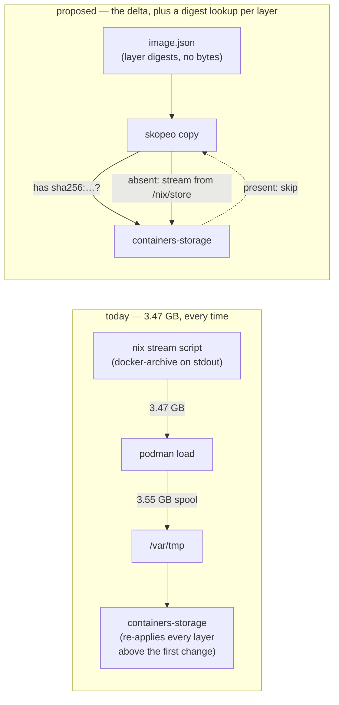

# The image ships 3.47 GB to move 27 MB — layer-aware delivery

**Status:** DESIGN SKETCH, 2026-09-08. Nothing built.

**The short version.** Every launch that sees a new nix store path re-ships the whole
3.47 GB image into podman, and I measured why: the customisation layer — the only layer a
`flake.nix` edit is guaranteed to move — is **27.2 MB, 0.78% of the archive**, but a
docker-archive is a sequential tar with no protocol for asking the destination which blobs
it already holds. My verdict is **nix2container plus an explicit layer plan**: build a
manifest whose layer digests are known before any byte moves, let `skopeo copy` negotiate
per-blob with `containers-storage`, and pin yolo's own content into the top two layers so
"already present" covers everything below it. The transport alone is worth about a quarter
of the bytes; the transport *and* the layer order together are worth an order of magnitude,
and neither half works without the other.

**The most important section is [§2.3](#23-why-unchanged-bytes-move-anyway)** — three
independent reasons the bytes move, only one of which is the transport. If you disagree with
that section the rest of the design does not follow.

**Reads with:** [`image-staging-vs-baking.md`](./image-staging-vs-baking.md) — this doc is the
successor to its candidate C6 and an answer to its
[OQ-6](./image-staging-vs-baking.md#102-open-questions), and it owns the bake-vs-deliver cost
model I am extending rather than restating;
[`minimal-disk-footprint.md`](./minimal-disk-footprint.md) (the "zero retained tars" ruling
this must not reopen); [`nix-across-backends.md`](../reference/nix-across-backends.md) (what
each backend can actually reach).

> [!NOTE]
> **On numbers.** Every measurement below is labelled MEASURED with its date and where it was
> taken, or NOT MEASURED with the recipe for taking it. The layer sizes in
> [§2.2](#22-the-layer-sizes) are mine, taken in this jail on 2026-09-08 by building
> `.#ociImage` and reading the stream through a tar reader. Every `file:line` was re-derived
> the same day.

---

## 1. The verdict

**Adopt nix2container.** Concretely, three changes that only work as one:

- **P1. The image derivation stops producing a tar and starts producing a manifest.**
  `nix build` yields an `image.json` naming per-layer digests and the store paths behind them.
  No archive is generated, at build time or at load time.
- **P2. The layer assignment becomes a written plan, not an emergent property.** Today
  nixpkgs' popularity contest decides which store path lands in which layer
  (`flake.nix:1084`, `maxLayers = 100`), and yolo's own content lands wherever the contest
  puts it. Under P2 the nixpkgs closure is one pinned base and yolo's own content is the top
  layers, by construction.
- **P3. Delivery becomes a copy that negotiates.** `skopeo copy` asks
  `containers-storage` for each blob before sending it, so a layer already present costs one
  digest lookup instead of ~35 MB of I/O.

The three alternatives, priced:

| Mechanism | What it costs | Verdict |
| :--- | :--- | :--- |
| **nix2container + layer plan** | one flake input; a patched skopeo that is a source build (not in `cache.nixos.org`); a second delivery mechanism for one release | **Adopt.** The only option that can express P2 at all. |
| OCI layout in the nix store, then `skopeo copy oci:… containers-storage:…` | a second full copy of every image *in the nix store* — 3.2 GB per distinct image | **Reject.** Re-opens the ruling that cached image copies are a bug ([`OQ-5`](./image-staging-vs-baking.md#101-decision-ledger) in [`image-staging-vs-baking.md`](./image-staging-vs-baking.md)). |
| Keep `streamLayeredImage` | nothing new; the 81 s stays | **Reject as the endpoint.** It cannot express P2 — see [§6](#6-alternatives-considered). |

**What I am NOT claiming.** This does not make a `flake.lock` bump cheap; a new nixpkgs is
new bytes and they have to move. It makes *everything that is not a nixpkgs bump* cheap, and
after C8 that is almost everything the image still moves for.

---

## 2. What ships today, measured

### 2.1 The pipeline, as built

`flake.nix:1080` builds the image with `ociTools.streamLayeredImage` — an alias for
`pkgs.dockerTools` (`flake.nix:63`) — at `maxLayers = 100` (`flake.nix:1084`) with
`created = "now"` (`flake.nix:1083`), in three variants: `ociImage`, `ociImageMinimal`,
`ociImageLean` (`flake.nix:1153-1155`). The nix out-link is not a tar; it is an executable
whose stdout is a docker-archive tar.

On podman the CLI joins that stdout to `podman load`'s stdin and writes no file
(`internal/image/streamload.go`; the seam is `StreamLoad`, declared at
`internal/image/autoload.go:120` and called at `internal/image/autoload.go:529`). The image
is named on the way in, inside the archive's `RepoTags`
(`StreamRepoTag`, `internal/image/image.go:152`), so the load creates it directly under the
content-addressed ref `localhost/yolo-jail:<sha16-of-store-path>` (`JailImageRef`,
`internal/image/image.go:126`). The load happens only when
`podman image inspect <content ref>` fails (`internal/image/autoload.go:470`).

**MEASURED, 2026-09-08, the maintainer's host**, from the `--timing` span log at
`<workspace>/.yolo/host-perf.log`:

```text
image.nix_build        dur=14.906s
image.stream_load      dur=81.000s     <-- 84% of the image load
launch.auto_load_image dur=96.106s
```

An earlier launch on the same host measured `launch.auto_load_image` at **175 s**.
**MEASURED, 2026-09-08, this jail**, the same spans from its own `.yolo/host-perf.log`
(session `18:06:52`): `image.nix_build 6.835s`, `image.stream_load 45.039s`,
`launch.auto_load_image 52.247s` — 86% in the same span. Two machines, two absolute
numbers, one ratio. **The nix build is not the problem.**

### 2.2 The layer sizes

**MEASURED, 2026-09-08, this jail.** `nix build .#ociImage`, then the stream read through a
tar reader that sums each member:

| | |
| :--- | :--- |
| Layers | **99** (the stream log's last line is `Creating layer 99 with customisation...`) |
| Archive total | **3,470,403,313 B** (3.23 GiB) |
| Layer 99, the customisation layer | **27,238,400 B** (26.0 MiB) — **0.78%** |
| Layer 98, the trailing leftovers layer | **172,584,960 B** (164.6 MiB) |
| Layers 98 + 99 together | **199,823,360 B** (190.6 MiB) — **5.8%** |
| Layer 97, chromium | **743,208,960 B** (708.8 MiB) |

Layer 98 is the one that matters most for this design: its store-path list carries
`bin-path-links` **and** `yolo-jail-image-identity` — the derivation over `flake.nix` plus
`flake.lock` that the integration suite's skew check reads. So the two layers that a
`flake.nix` edit is *certain* to move are already the top two, and they are 5.8% of the
archive. The other 94.2% is nixpkgs, and it moves when nixpkgs moves.

> [!IMPORTANT]
> **That 5.8% is the ceiling on what layer order can buy, not a promise.** Nothing pins those
> two layers to the top: the popularity contest put them there for this closure, and
> [`image-staging-vs-baking.md` §1.9](./image-staging-vs-baking.md#19-re-measured-2026-09-06--what-a-go-only-rebuild-costs-podman-and-what-chooses-the-flake)
> measured the first differing layer at **position 78 or 79 of 99** across real image pairs,
> because adding one store path re-partitions the contest. P2 is what turns an accident into
> a property.

### 2.3 Why unchanged bytes move anyway

Three reasons, and they stack. A design that fixes fewer than all three fixes a fraction.

1. **The archive has no negotiation.** `docker-archive` is a sequential tar: the sender
   cannot ask "do you have `sha256:…`?" and the receiver cannot answer before the bytes
   arrive. Every layer is transmitted, then discarded if redundant.
2. **`podman load` spools stdin before parsing.** MEASURED 2026-08-25 and recorded at
   `internal/image/streamload.go:64-67`: `/var/tmp/podman*` grew to **3,554,600,960 B** during
   a streamed load and was then unlinked. So the "no tar" property C3 won is true of *yolo's*
   disk, not of podman's — one full-size write and one full-size read happen inside the
   loader on every load.
3. **Overlay keys a layer by its parent chain, not by its diff digest.** This is
   [`image-staging-vs-baking.md` §1.9](./image-staging-vs-baking.md#19-re-measured-2026-09-06--what-a-go-only-rebuild-costs-podman-and-what-chooses-the-flake)'s
   finding, and it is the one people re-derive wrongly: 97 of 99 digests can be identical and
   podman still writes everything from the first moved layer upward, because each of those
   layers now has a different parent. Reuse covers the chain *prefix* and nothing above it.

Reason 1 is a transport property. Reason 2 is a transport property. Reason 3 is an **ordering**
property, and no transport fixes it. That is why the verdict is two changes, not one.



---

## 3. The design

### 3.1 The layer plan

**Layer plan** *(coined here)* — the explicit, written assignment of the image's store paths
to layers, in a fixed bottom-to-top order chosen for how often each group changes. It is not
nixpkgs' popularity contest, which optimises for *sharing between unrelated images* and has
no notion of which paths belong to us; and it is not a base image, which is a second artifact
with its own identity ([§6](#6-alternatives-considered) says why that distinction matters).

Three tiers, bottom to top:

| Tier | Contents | Moves when |
| :--- | :--- | :--- |
| **Base** | `corePackages` and `fullPackages` — the nixpkgs closure | `flake.lock` moves, or a package is added to the flake |
| **Extras** | the launch's `packages:` closure (`YOLO_EXTRA_PACKAGES`) | that workspace's `packages:` list changes |
| **Top** | `binPathLinks`, the `/lib` farm, `imageIdentity`, `fakeRootCommands`' directories, `/etc/passwd` | any `flake.nix` edit |

The base tier keeps a popularity split *within itself* so one nixpkgs bump does not
invalidate a single 3 GB blob; the budget is **90 layers for the base, 1 for extras, 1 for
the top tier**, a ceiling of 100 total to stay where the current image already sits.

**Why the extras tier is separate, and why it is the tier that pays today.** After C8
([`image-staging-vs-baking.md` §4](./image-staging-vs-baking.md#4-candidates-ranked)) the
image no longer moves for a Go change at all — it moves for `flake.nix`, `flake.lock` and
`packages:`. Of those three, `packages:` is the one that varies *per workspace*: each distinct
list is its own image ([§1.5](./image-staging-vs-baking.md#15-the-multiplication-factor-packages-and---impure)),
and today the second workspace on a machine pays a full 3.47 GB load for a list that differs
by one package. With the extras tier pinned, it pays that package's closure and the top tier.

> [!NOTE]
> **This does not compete with C4/C5.** A launch that sets `YOLO_STORE_PACKAGES=1` builds the
> stock image with `packages:` deleted from the derivation entirely, so its extras tier is
> empty and the whole class of churn is already gone. The layer plan is what the *other*
> launches get — every macOS launch, every Apple Container launch, and every Linux launch
> that has not opted in — and those are the majority today.

**Why extras is not the top tier, since by churn alone it should be.** The question is the right
one: `packages:` varies **per workspace**, while the top tier moves only when `flake.nix` is
edited — which for a user is "when yolo is upgraded". Podman's overlay store chains layers (a
layer's stored identity depends on every layer beneath it, which is why
[`image-staging-vs-baking.md` §1.9](./image-staging-vs-baking.md#19-re-measured-2026-09-06--what-a-go-only-rebuild-costs-podman-and-what-chooses-the-flake)
measured a deep first-differing layer re-storing everything behind it), so the most volatile tier
belongs **on top**. By that rule alone extras should be above the top tier.

**It is below because of path precedence, which is a correctness constraint and outranks the churn
one.** Both tiers put names in the FHS view: the top tier is `binPathLinks`, whose whole job is to
provide `/bin/bash`, `/bin/sh`, `/bin/grep`, `/bin/sed`, `/usr/bin/env` and the `/lib` farm
(`flake.nix:566-600`), and a `packages:` entry contributes its own `bin/` names to the image — which
is exactly why a baked `fzf` is at `/bin/fzf` and beats a pack's declared copy
([`AGENTS.md`](../../AGENTS.md)). When two layers claim one path, the **higher** layer wins. Put
extras on top and a workspace can shadow `/bin/bash` — the shim the boot itself runs through — by
naming a package. The curated set has to be last.

The cost of choosing correctness here is exactly **one small layer re-stored per `packages:`
change**: the top tier is symlinks and directories, not content, and the budget gives it one slot.

> [!IMPORTANT]
> **VERIFIED 2026-09-08, and it is the reason the ordering is a constraint rather than a preference:
> today's resolution rule and the split's resolution rule have OPPOSITE polarity.**
>
> Today every entry in `contents` lands in **one** layer, and nixpkgs builds it with
> `symlinkJoin` (`streamLayeredImage`'s `customisationLayer`, nixpkgs
> `pkgs/build-support/docker/default.nix:1075-1079`), which is a loop of
> `lndir -silent <path> $out`. **`lndir` keeps the FIRST link and skips the rest**, non-fatally —
> measured directly on 2026-09-08 with two trees each carrying `bin/bash`:
>
> ```console
> $ lndir -silent $A $out && lndir -silent $B $out
> bash: Keeping existing link to …/a/bin/bash
> $ cat $out/bin/bash
> FIRST
> ```
>
> `contents` is `[ binPathLinks ] ++ corePackages ++ fullPackages ++ extraPackages`
> (`flake.nix:1086-1090`), so **`binPathLinks` wins today because it is FIRST** — which is also how
> a baked `packages:` entry gets `/bin/fzf` while never being able to take `/bin/bash`.
>
> Split into three layers and that rule is gone: there is no `symlinkJoin` spanning the tiers any
> more, so the union filesystem decides, and the union rule is **the HIGHEST layer wins**. First
> becomes last. Keeping the curated set authoritative therefore requires putting the top tier
> **above** extras — the exact inversion of its position in `contents`.
>
> **What the layer plan owes this**: a test that reads `/bin/bash`'s target in a built image whose
> `packages:` ships a colliding `bin/` name, asserted equal before and after the split. A silent
> flip here does not lose a convenience — it replaces the shell the boot runs through.

### 3.2 The copy

The build produces a manifest; the launch copies it. `skopeo copy nix:<image.json>
containers-storage:localhost/yolo-jail:<key>` where `<key>` is unchanged from today —
`image.ImageStoreKey` of the store path (`internal/image/gcroot.go:27`), the same 16 hex
chars that name the GC root and the content ref.

Four properties of that one command, each of which is a requirement rather than an
observation:

- **The destination ref is an argument, so the image is still named on the way in.** C2's
  race — a post-load `podman tag` reading a shared mutable name while a concurrent launch
  moves it — cannot arise, for exactly the reason `StreamRepoTag`
  (`internal/image/image.go:130-152`) gives today. Nothing is retagged afterwards. The
  best-effort `:latest` alias (`pointLatestAt`, `internal/image/autoload.go:589`) is
  unchanged and stays best-effort.
- **No archive exists at any point**, on either side. This is strictly stronger than C3,
  which removed yolo's tar and left podman's spool; the `nix:` transport reads store paths
  directly and streams only the blobs the destination said it lacks.
- **The digests are computed at build time and cached in the store.** nix2container's
  `buildLayer` runs a tar-and-sha256 pass per layer once (`nix/layers.go`, `TarPathsSum`) and
  the result is a store path; an unchanged layer is never re-hashed. Layers are uncompressed,
  so digest and diffID are the same value and there is no gzip cost on either side.
- **The copier is resolved by store path, never by `PATH`.** The `nix:` transport is a patch
  on skopeo, so an unpatched `skopeo` on `PATH` would fail in a confusing way. The launch
  runs the copier the flake built. How it gets the path — a passthru script taking the
  destination as argv, or a second attribute — is the implementer's choice; the requirement is
  that a `PATH` lookup is never the answer.

### 3.3 What does not change

Naming this explicitly because the surrounding machinery has three independent consumers that
all key off the same store path, and a reader's first instinct is that a delivery change
disturbs them. It does not:

- **The content ref and the load decision.** `podman image inspect <content ref>` is still the
  question, and the answer is still authoritative (`internal/image/autoload.go:470`). "Loaded"
  keeps meaning "an image exists under this ref", because skopeo commits the image record last
  — a killed copy leaves orphan layers and no image, so the next launch asks the same question,
  gets the same answer, and re-copies over the layers already written.
- **The load sentinel and its ten-entry LRU.** `AddLoadedPath` still records the store path on
  every successful launch, capped at 10 (`internal/image/image.go:270-287`), and
  `ProtectedImageTags` still derives the protected tag set from it
  (`internal/prune/imageroots_probe.go:79-86`). Layer-aware delivery changes what a copy
  *costs*, not what a store path *is*.
- **The durable GC root.** `RegisterRoot` roots the store path
  (`internal/image/autoload.go:583`), and the manifest's closure still references every layer's
  store paths, so the closure the running jail depends on stays reachable from one root.
- **`imageIdentity` and the suite's skew check.** It is a derivation over `flake.nix` +
  `flake.lock` and is unaffected; the layer plan must keep it in the top tier, where it is
  already (measured, [§2.2](#22-the-layer-sizes)).

> [!WARNING]
> **One thing genuinely does change, and it is in another package.** nix2container's
> `--created` takes an RFC3339 timestamp and **rejects `"now"`** (`cmd/image.go:28-31`,
> `time.Parse(time.RFC3339, …)`), while `flake.nix:1083` passes exactly that. A build-time
> timestamp would make the derivation vary per build and destroy content addressing, so the
> `created` field becomes a **constant** — and then every yolo-jail image reports the same
> `CreatedAt`, which is the sort key `PruneOldImages` orders its keep-window by
> (`internal/prune/probes.go:215-289`). The keep-window must order by the load sentinel's
> recency instead; that file's own comment already says CreatedAt is the wrong key
> ("an image that has been running for a week carries a week-old timestamp and sorts old",
> `internal/prune/probes.go:240-243`). This is a **prerequisite**, not a follow-up:
> shipping the copy without it leaves the reaper's keep-window ordering on a tie.
> It is *not* the separate liveness defect being fixed in `internal/prune` — that one is about
> the LRU meaning load-recency rather than liveness, and this design neither helps nor hinders
> it. Do not fold them together. See [OQ-LI4](#OQ-LI4).

### 3.4 Which backends get it

| Backend | Delivery | Why |
| :--- | :--- | :--- |
| **podman, Linux** | layer-aware copy | The nix store and `containers-storage` are both local and both reachable by one process. |
| **podman, macOS** | unchanged (stream into `podman load`) | The storage lives inside the Podman Machine VM, which shares the user's home and `/private` and **not** `/nix` — the same fact C8 measured on 2026-09-07 and now guards with `prefixUnreachableFromVM` (`internal/cli/run/jailprefix.go`). A local `skopeo copy` would write a `containers-storage` the VM never reads. |
| **Apple Container** | undecided — see [OQ-LI2](#OQ-LI2) | It has no `podman load` and converts through `skopeo copy docker-archive:… oci:…` today (`internal/image/autoload.go:1032`), writing *two* full-size files. A `nix:` source would delete both, and nobody here has the hardware to measure it. |
| **macos-user** | not applicable | No container, no image. |

**Two mechanisms, deliberately, and I own the cost.** This is the same shape
[`image-staging-vs-baking.md` §9](./image-staging-vs-baking.md#9-risks) R1 accepted for C4/C5
and the same one [`happy-path-principle.md`](./happy-path-principle.md) warns about. The
mitigation is the same too: the unit is the **launch**, exactly one mechanism is live in any
launch, and the launch says which one it took on stdout.

### 3.5 One mechanism, no way back

**There is no legacy knob, and `streamLayeredImage` is deleted in the same change** — ruled
2026-09-08, see [OQ-LI5](#OQ-LI5). The maintainer's rule for what an escape hatch is for:

> Escape hatches are for broken configs or whatever so you can get back in and fix the config
> with an old image, not for yolo bugs.

`YOLO_LEGACY_IMAGE_STREAM` would have been the second kind. It measures nothing, and its only
use is "the new delivery mechanism is broken" — which is a bug to fix, not a configuration to
recover from.

- **Default: on**, for podman on Linux, with no config key and no env var. A config key would be
  a fourth thing to keep true about a decision the launcher can make correctly from facts it
  already reads.
- **The `streamLayeredImage` attributes are removed, not retained.** Keeping them is R3's
  "two delivery mechanisms indefinitely" with no end condition — and a second path that nothing
  exercises is a path that is broken by the time anyone needs it.
- **A failed copy never falls back to streaming.** It never could, now that there is nothing to
  fall back to; it was already forbidden, because that is C1's silent-fallback defect one layer
  down — a fallback that hides a broken new mechanism produces confident wrong results, which is
  exactly what made a nix build failure fatal in the first place.
- **What remains for a genuinely broken machine** is the hatch that already exists and does match
  the rule: `YOLO_ALLOW_STALE_IMAGE=1`, which launches from the image already loaded. That is
  "get back in with an old image", and it is orthogonal to how the next image is delivered.

> [!IMPORTANT]
> **This puts the whole weight on the pre-flip evidence, which is the trade being made.** With no
> fallback, a delivery bug that reaches a release is a machine that cannot start a jail until a fix
> ships. The precondition is therefore not optional: one measured `nix:`-source copy that loads and
> boots on **every** backend that gets the new path — podman/Linux, and Apple Container on the
> maintainer's hardware per [OQ-LI2](#OQ-LI2) — before the default is on for anyone.

### 3.6 Failure paths

Every step that can fail, what happens, and who finds out. The user-facing rule throughout:
**the launch refuses and names the remedy; it does not degrade quietly.**

| Failure | Behaviour |
| :--- | :--- |
| The copier cannot be built (nix build of the copier attr fails) | Same as any failed image build: fatal, nix's own stderr printed with the classification (`internal/image/autoload.go:355-366`). `YOLO_ALLOW_STALE_IMAGE=1` still lets an already-loaded image run. |
| An unpatched `skopeo` on `PATH` | Cannot arise — the copier is a store path ([§3.2](#32-the-copy)). If the resolved binary rejects the `nix:` transport, that is a build/packaging bug and the copy fails as itself. |
| Copy interrupted (SIGINT, crash, disk full mid-blob) | No image record is committed, so the ref stays absent and the next launch re-copies. Layers already written are reused by that retry. **Nothing is left half-named.** |
| Copy fails and exits nonzero | Retried **exactly once**, immediately, no backoff — the same bound and the same reasoning as `loadAppleContainerFromCache`'s two passes (`internal/image/autoload.go:648-700`): one recovery from a transient loss, never a loop that re-copies gigabytes forever. A second failure abandons the launch with skopeo's stderr and **no remedy to name**, which is the honest consequence of [§3.5](#35-one-mechanism-no-way-back): a copy that cannot complete leaves no image under the content ref, so there is nothing to start from. Priced as R8. |
| A blob's bytes do not match its digest | skopeo verifies on read and c/storage verifies the diffID; a mismatch is a hard error, **not** retried — a second read of the same store path produces the same bytes. Abandon and report; the honest diagnosis is a corrupt nix store, and the remedy names `nix store verify`. |
| `containers-storage` locked by a concurrent launch | The copy blocks on c/storage's own lock and proceeds. **No timeout of ours** — c/storage's locks are held per operation, and a timeout would convert a slow neighbour into a failed launch. |
| Storage full | skopeo fails, the retry fails, the launch is abandoned naming the disk. No partial image is ever runnable. |
| An image present but with layers missing under it (a storage reset that left the record) | `podman image inspect` succeeds, the launch runs, and the container start fails — **unchanged from today** and out of scope. |

### 3.7 Concurrency, and who writes what

**Two jails launching at once is the normal case on this machine, not an edge case.**

- **One writer, named: the launch's copy.** Nothing else writes `containers-storage` on the
  yolo path; `internal/prune` only reads and removes.
- **Two copies of *different* images that share layers** both attempt to write the shared
  blobs. c/storage serialises under its own lock and the second write is a no-op on an
  existing digest. The operation is idempotent by content, so no ordering rule is needed.
- **Two copies of the *same* image** (two workspaces on one config) race to create the same
  ref. Last writer wins and both are correct — the ref names one content hash, and both
  copies produced that content. This is strictly safer than today's `:latest` retag race,
  which C2 removed for the same reason.
- **The load sentinel** is per-runtime and appended by whichever launch succeeds; concurrent
  appends can lose an entry, which is pre-existing and already fail-safe in the direction that
  matters (a lost entry under-protects nothing that `RegisterRoot` did not already root).

### 3.8 Degenerate inputs, defaults, triggers

- **The trigger is unchanged and exact:** the copy runs when, and only when,
  `podman image inspect <content ref>` fails (`internal/image/autoload.go:470`). Not on a
  timer, not on every launch.
- **An empty `packages:` list** yields an empty extras tier, and an empty layer is **omitted**
  — never emitted as a zero-path layer, which would consume a layer slot and change every
  digest above it for no content.
- **One package** in `packages:` yields one extras layer. There is no per-package layer: the
  extras tier is one layer regardless of list length, because the list changes as a unit.
- **A duplicate store path across tiers** (a package that is also in `corePackages`) is placed
  in the lowest tier that claims it and skipped above — nix2container's `layers` argument has
  exactly this semantics, and the alternative (the same path in two layers) is a silent
  size doubling.
- **Defaults, with units:** base layer budget **90 layers**; extras **1 layer**; top tier
  **1 layer**; total ceiling **100 layers**. Copy retries: **1**. Copy timeout: **none**.
  `created`: a **constant** RFC3339 timestamp ([§3.3](#33-what-does-not-change)).
- **Error text is the implementer's to word**, subject to one requirement: an abandoned copy
  prints skopeo's own stderr and says that no image was written, so the reader is never left
  guessing whether a partial image is now runnable. It names **no fallback**, because there is
  none ([§3.5](#35-one-mechanism-no-way-back)) — and an error that suggests a knob that does not
  exist is worse than one that admits the launch is over.

### 3.9 The day it ships

**Everyone pays one full copy, once, and then never again for that base.** Images already in
`containers-storage` on the day this lands were built by `streamLayeredImage`, whose layer
digests differ from nix2container's for the same content — different tar generator, different
bytes. So the first post-switch launch shares nothing with them and copies the whole image.

Those pre-existing images are **not migrated and not deleted**: they keep their content refs,
they stay protected by the same sentinel while they are recent, and they age out through the
normal keep-window. The store paths they were built from are different store paths (the image
derivation changed), so no ref collides and no reaper decision changes shape.

The `.yolo/host-perf.log` line for that one launch will look like today's. That is expected,
and the done-condition below is about the launch *after* it.

### 3.10 What done looks like

The instrument already exists: the `--timing` spans in `<workspace>/.yolo/host-perf.log`.
`image.nix_build` stays; `image.stream_load` is replaced on the copy path by
**`image.layer_copy`**, and the launch prints bytes copied *and* bytes skipped, because that
ratio is the whole claim.

A human checks four things, in order:

1. **A `flake.nix`-only edit, on a machine that already holds the previous image:**
   `image.layer_copy` **≤ 15 s** and **≤ 250 MB copied**, against 81 s and 3.47 GB today. The
   250 MB is [§2.2](#22-the-layer-sizes)'s measured top-two-layer size plus slack.
2. **A second workspace whose `packages:` differs by one package:** the copy is that package's
   closure plus the top tier — not the whole image. Today it is the whole image.
3. **A `flake.lock` bump:** a full copy, and **no target**. If this one gets faster, something
   is wrong.
4. **A cold machine** (empty `containers-storage`): `image.layer_copy` **no slower than**
   today's `image.stream_load` on the same host. NOT MEASURED — see below.

**The cold case, honestly.** I have not measured it and I will not guess a number. The
argument that it should be *faster*, not slower, is that today's cold path moves the bytes
four times — read 3.47 GB from the store, write a 3.55 GB spool, read it back, write ~3 GB of
layers — while the copy moves them twice, read and write, with the digest pass already paid at
build time and cached. The recipe, on a scratch machine, and it has to be an A/B across **commits** rather than across
an env var, since [§3.5](#35-one-mechanism-no-way-back) leaves no knob to flip: check out the
commit **before** this change, `podman rmi -a`, launch, record `image.stream_load`; then check out
the commit **after**, `podman rmi -a`, launch, record `image.layer_copy`. Report both with
`podman info --format '{{.Store.GraphDriverName}}'`, because the answer is a storage-driver
property as much as a transport one. **Take the baseline before the change lands** — after it, the
legacy number is no longer measurable on that host.

> [!NOTE]
> **A nested jail CAN see this class**, unlike the reachability class that gets a structural
> free green ([`loopback-tls-reachability.md`](./loopback-tls-reachability.md)). Podman-in-podman
> has its own `containers-storage`, so a nested launch exercises the real copy against a real
> destination. What a nested jail *cannot* tell you is the absolute number on the maintainer's
> host, which is the one in [§2.1](#21-the-pipeline-as-built).

---

## 4. What it costs

- **A flake input.** `nix2container` gains a lock entry and its `nixpkgs` must `follows` ours,
  or a second nixpkgs closure is evaluated and fetched on every eval. The Go side is
  untouched: nix2container is a nix-level dependency and adds nothing to `vendor/`, so
  `go mod vendor`, `-mod=vendor` and the hermetic Go build are exactly as they were, and the
  `goSrc` fileset does not grow.
- **A source build that is not in `cache.nixos.org`.** The `nix:` transport is a patch applied
  to nixpkgs' skopeo (`default.nix:22-65` in the nix2container source: `overrideAttrs` with a
  `fetchpatch2` of a container-libs commit and a hand-built vendor tree). Every `flake.lock`
  nixpkgs bump rebuilds it — once per bump, not once per launch, because it is part of the
  image's closure and a launch whose image is already loaded builds nothing.
  [OQ-LI1](#OQ-LI1) rules that this build is simply **paid**: the project's cachix may make it
  fast but may never be what makes it work, and no cache miss selects a degraded path.
- **A prerequisite in another package.** The `created` constant forces prune's keep-window
  ordering to change before this ships ([§3.3](#33-what-does-not-change)).
- **Reaping frees less, and the retention policy inverts because of it.** Today each image is
  ~2.7 GB of unique layers, so `rmi` of one reclaims ~2.7 GB. Under a layer plan, images share
  their base, so reaping one frees only its delta. This is the *good* direction — N images cost
  base + N×delta instead of N×2.7 GB — and it has a consequence for retention that is easy to get
  backwards: **every kept image is a reference that holds the shared base in place**, since `rmi`
  removes only layers no remaining image references. A too-small keep-window becomes a way to
  *lose* the base and pay a full re-copy, which is why
  [`the-load-sentinel-is-not-a-liveness-oracle.md`](./the-load-sentinel-is-not-a-liveness-oracle.md)
  [OQ-LS3](./the-load-sentinel-is-not-a-liveness-oracle.md#OQ-LS3) rules that the count rises with
  this change and its unit becomes the configuration rather than the machine. But
  anyone reading `yolo prune`'s reclaim figure will see it drop, and should not read that as
  the reaper breaking.
- **`just load` and any other host recipe that pipes `./result`** stops being meaningful; the
  contract it encodes moves with the mechanism.

---

## 5. Non-Goals

- **Not a registry.** No pushing, no pulling, no daemon. The destination is the local
  `containers-storage` and nothing else.
- **Not the binary-cache question.** That is
  [`image-staging-vs-baking.md` §6](./image-staging-vs-baking.md#6-the-binary-cache-alternative-argued-fairly),
  it is about the *nix* side, and it is orthogonal — a substituted closure still has to reach
  podman.
- **Not a re-decision of `packages:` scope.** It stays workspace-scope
  ([`OQ-4`](./image-staging-vs-baking.md#101-decision-ledger) in
  [`image-staging-vs-baking.md`](./image-staging-vs-baking.md)). This fixes the cost, never
  the scope.
- **Not C4/C5.** The store-package fast path keeps its dial and its semantics; this changes
  what the *other* launches pay.
- **Not the prune liveness defect.** The auto-reap that force-removed live jails' images on
  2026-09-08 is being fixed separately; [§3.3](#33-what-does-not-change) states the
  interaction and stops there.
- **Not `zstd:chunked`, composefs, or any deduplicating storage driver.** Those are
  destination-side and would compose with this, not replace it.
- **Not macos-user.** No image exists there.
- **Not a change to what the image contains.** Every candidate in this doc is about how the
  same bytes are laid out and moved.

---

## 6. Alternatives considered

**A. Keep `streamLayeredImage` and reorder the layers.** The cheapest imaginable fix: no new
dependency, one flake edit. It fails on availability — `streamLayeredImage` has no `layers`
argument (nixpkgs `pkgs/build-support/docker/default.nix:1004-1036`), so layer assignment
cannot be pinned. The only lever it exposes is `layeringPipeline`, whose own comment calls the
interface "highly experimental and subject to change" (`default.nix:1026-1033`). And even a
perfect reordering leaves reasons 1 and 2 of [§2.3](#23-why-unchanged-bytes-move-anyway)
untouched: podman still reads and spools every byte.
**Verdict: rejected as the endpoint.** If nix2container is refused, this is the fallback — it
buys the write half and none of the transfer half.

**B. `streamLayeredImage` with a stable `fromImage` base.** Expresses ordering with no new
dependency. It makes the stream *bigger*: nixpkgs' generator re-emits the base image's layers
into the archive, so the write side gains rather than loses — the prescription in
[`image-staging-vs-baking.md` §1.9](./image-staging-vs-baking.md#19-re-measured-2026-09-06--what-a-go-only-rebuild-costs-podman-and-what-chooses-the-flake)
says exactly this, and I agree with it.
**Verdict: rejected.**

**C. Materialise an OCI layout in the nix store, then `skopeo copy oci:… containers-storage:…`.**
Layer-aware with a stock skopeo and no flake input — genuinely attractive for about a minute.
Then the second copy shows up: the layout *is* the image, in blobs, in the store, ~3.2 GB per
distinct image, retained until a GC. That is the artifact
[`minimal-disk-footprint.md`](./minimal-disk-footprint.md) and
[`OQ-5`](./image-staging-vs-baking.md#101-decision-ledger) ruled a bug after one machine
accumulated 404 GiB of it.
**Verdict: rejected.**

**D. Pipe the existing stream into `skopeo copy docker-archive:/dev/stdin …`.** Would be the
zero-cost version of C. `docker-archive` is a seekable-file source — nixpkgs' generator writes
`manifest.json` last (`internal/image/streamload.go:41-45` records podman's own error when it
is truncated), so a reader must seek back. A pipe cannot.
**Verdict: rejected — not implementable.**

**E. Do nothing; wait for C4/C5 adoption to make the image stop moving.** The honest
do-nothing. `YOLO_STORE_PACKAGES=1` deletes the `packages:` churn for launches that opt in,
and C8 already deleted the Go churn. What is left is `flake.nix` edits — which, for anyone
developing this repo, is the common case — on every backend that cannot opt in.
**Verdict: rejected, but it is why this is a performance improvement and not an outage fix.**

---

## 7. Risks

| Risk | Mitigation |
| :--- | :--- |
| **R1. A third-party flake input on the critical path of every launch.** nix2container is one maintainer's project; an abandoned input strands the image pipeline. | The input is pinned in `flake.lock` and nothing auto-updates it, so abandonment upstream changes nothing until someone bumps it — the failure is not "it disappears", it is "it stops evaluating against a newer nixpkgs". **The escape is no longer a retained legacy attribute** ([OQ-LI5](#OQ-LI5) deleted it): it is that the dependency is small and forkable — a `fetchpatch2` over nixpkgs' skopeo plus a nix library — and that [§6](#6-alternatives-considered)'s option C (an OCI layout in the store) remains a known, costed way to keep layer-aware delivery with a stock skopeo. Both are work; neither is a rewrite of this design. |
| **R2. The patched skopeo is a source build not in `cache.nixos.org`.** A `flake.lock` bump now also rebuilds skopeo, on a machine that may be offline or slow. | Measure it once and decide the substituter question ([OQ-LI1](#OQ-LI1)). The failure mode is a slow build, and C1 already makes a failed build fatal-and-explained rather than silent. |
| **R3. Two delivery mechanisms indefinitely**, which is the "fill the matrix" failure [`happy-path-principle.md`](./happy-path-principle.md) warns about. | **Retired 2026-09-08 — the risk is removed rather than accepted** ([OQ-LI5](#OQ-LI5)): `streamLayeredImage` is deleted in the same change and there is no legacy knob, so there is never more than one delivery mechanism to keep true. The residual risk moves to R8. |
| **R8. No way back if a delivery bug ships**, the cost of retiring R3. A machine that cannot copy cannot start a jail until a fix ships. | Bounded by evidence rather than by a fallback: the default does not flip until a `nix:`-source copy has been measured loading and booting on every backend that gets it ([§3.5](#35-one-mechanism-no-way-back), [OQ-LI2](#OQ-LI2)). `YOLO_ALLOW_STALE_IMAGE=1` still launches an already-loaded image, which is the hatch for "get back in", and a failed build is already fatal with nix's own stderr. |
| **R4. The layer plan is a new thing to keep true.** A package added to `flake.nix` in the wrong tier silently costs a full copy per build, and nothing fails. | The done-condition ([§3.10](#310-what-done-looks-like)) is a measurement, so make it a test: assert that a `flake.nix`-only change copies under a byte budget. A budget test fails loudly when a tier assignment drifts; a comment does not. |
| **R5. Only two machines are measured**, both of them mine, one of them nested. Absolute numbers are illustrative; the ratios are not. | Same standing caveat as [`image-staging-vs-baking.md` §9](./image-staging-vs-baking.md#9-risks) R7. The two hosts agree on the ratio (84% and 86%) and disagree on the absolutes by 1.8×, which is exactly what that caveat predicts. |
| **R6. Apple Container is unverified on hardware**, and a delivery change that assumes its converters behave is a guess. | [OQ-LI2](#OQ-LI2) keeps it explicitly undecided rather than silently included. Leaving it on the current path costs nothing it is not already paying. |
| **R7. Rootless `containers-storage` writes can trip on ID mapping** when a copy runs outside the user namespace podman uses. | Our layers are entirely root-owned (`fakeRootCommands` writes `root:x:0:0`, `flake.nix:1120-1122`), which is the case that works. If a real host disagrees, the copy runs under `podman unshare` — a change to how the copier is invoked, not to the design. Verify on the first real host, not in a nested jail. |

---

## 8. What I would build, in order

**First, settle the prune ordering key**, because it is a prerequisite and it is small: move
the keep-window's sort from `CreatedAt` to the load sentinel's recency. It is an improvement on
its own terms — the code already says CreatedAt is the wrong key — and it is the one change
that must land *before* a constant `created` reaches anyone's machine.

**Second, add the input and build the manifest, without touching delivery.** A new flake
attribute that produces the nix2container image alongside the existing `streamLayeredImage`
attributes, with the layer plan written out. Nothing consumes it yet. The payoff of stopping
here is that the layer plan is inspectable — the manifest names its layers and their sizes, so
the tier assignment can be checked against [§2.2](#22-the-layer-sizes)'s numbers before any
launch depends on it. Measure the patched-skopeo build here, once, and answer
[OQ-LI1](#OQ-LI1) with a number.

**Third, wire the copy behind the env var, defaulting off.** The copy path exists, the legacy
path is the default, and both are exercised. This is where the `image.layer_copy` span and the
copied/skipped byte counts land, because the next step needs them to be believable.

**Fourth — and this step now carries what the deleted fallback used to** ([OQ-LI5](#OQ-LI5)):
**gather the evidence, THEN flip the default for podman on Linux.** Take the four measurements
in [§3.10](#310-what-done-looks-like) on a real host — not a nested jail, which can prove the
plumbing and not the number — and take the legacy baseline **before** step three lands, since
after it there is no way to produce that number on the same host. Land the byte-budget test from
R7's neighbour, R4, in the same change; a performance property with no test is a property that
regresses silently. **The default does not flip on a machine whose backend has not been measured
booting from a `nix:` copy** — with no fallback, that measurement is the safety property (R8).

**Fifth, Apple Container is part of this pass, not a later decision** ([OQ-LI2](#OQ-LI2)): the
maintainer has the hardware, so its measurement is a precondition of the flip rather than a
follow-up. A backend that cannot be measured does not get the default.

**There is no "close the window" step.** `streamLayeredImage`, the env var and the second
mechanism are deleted in the change that adds the new path ([§3.5](#35-one-mechanism-no-way-back)),
so R3 is never a live cost and this doc never has to say it is.

---

## 9. Open Questions

1. ✅ **[OQ-LI1](#OQ-LI1) — ANSWERED 2026-09-08, after correcting a premise the question got wrong:
   is a third-party flake input acceptable on the launch path — and does its cachix come with it?** nix2container is not in nixpkgs (verified 2026-09-08 against the
   pinned rev `c043004d…`: `pkgs ? nix2container` is false, while `pkgs.skopeo` is 1.24.0), so
   this is a new input plus a patched-skopeo source build that `cache.nixos.org` will never
   have. Adding the project's own cachix as a substituter fixes the build cost and adds a
   third-party binary cache to every developer's trusted substituters. This is the go/no-go:
   nothing else in the design matters if the answer is no.

   <!-- vantage: oq id=OQ-LI1 leaning="Take the input, refuse the cachix. Pin it, keep the legacy attribute as the escape, and pay the skopeo rebuild once per flake.lock bump — after measuring it." -->

   _Leaning:_ Take the input; refuse the cachix. The input is pinned and has a working
   fallback; a trusted binary cache is a supply-chain surface with no fallback. Pay the skopeo
   rebuild once per `flake.lock` bump — but measure it first, because if it is ten minutes
   rather than two this leaning is wrong.

   **Answer (2026-09-08):**
   > **First, the premise correction the maintainer's question forced** — *"do we currently get
   > caches from nixos.org? I thought it was just our cachix?"* **Both, and the framing above was
   > wrong about which is new.** MEASURED in this jail 2026-09-08 (nix 2.34.8):
   >
   > ```console
   > $ nix config show | grep '^substituters'
   > substituters = https://cache.nixos.org/
   > ```
   >
   > `cache.nixos.org` is nix's **built-in default** and is where everything in the closure that is
   > plain nixpkgs already comes from. yolo's own cache is **added on top**, by the flake itself —
   > `nixConfig.extra-substituters = [ "https://yolo-jail.cachix.org" ]` (`flake.nix:13-16`), with
   > its public key beside it. `extra-` is the operative word: it appends, it does not replace. And
   > nix ignores a flake's `nixConfig` unless the caller passes `--accept-flake-config` or is a
   > trusted user, which is why `nightly-macos.yml` passes that flag explicitly and says in a comment
   > what happens without it (*"nix discards it with a warning and this job builds the whole closure
   > from source"*).
   >
   > **So the trade this question named does not exist.** "Adding a third-party binary cache to every
   > developer's trusted substituters" is not a step this design would take — the project has shipped
   > that substituter since 2026-07-20, opt-in per invocation. There is nothing to refuse.
   >
   > **The real trade, restated.** Today the cachix is an **optimization**: a miss costs download
   > time, and every path has `cache.nixos.org` or a local build behind it. A patched skopeo that
   > `cache.nixos.org` can never have would make the same cache **load-bearing for the launch path**
   > — on a miss, a source build of skopeo lands in front of a jail start. That is the actual
   > question, and it is a different and smaller one than a supply-chain ruling.
   >
   > **The ruling: take the input, build the copier when it is needed, and never let the cache be
   > the difference between working and not.** The maintainer stated the invariant —
   > *"our cachix should never be load bearing, only ever an optimization"* — and then the
   > consequence I had got wrong: *"I don't want the legacy path taken, I want the same
   > functionality."*
   >
   > **The correction, because the first version of this answer was a degrade dressed as a
   > fallback.** It said a missing copier makes the launch take the legacy stream rather than
   > compile. That is not a fallback, it is a silent loss of the feature on precisely the machines
   > that need it most — a fresh machine with a cold cache — and it makes R3's two-mechanisms cost
   > permanent, contradicting [OQ-LI5](#OQ-LI5)'s ruling that the legacy path ends on evidence.
   >
   > **Building it when it is needed is the answer, and four facts make it cheap enough:**
   >
   > 1. **It is a build-time dependency, not a per-launch one.** The copier is part of the image's
   >    closure, so it is realized on the occasions the image is already being built — a `flake.lock`
   >    nixpkgs bump — and not on the occasions a jail merely starts. A launch that finds its image
   >    already loaded builds nothing, copier included.
   > 2. **Only the Go link is local.** skopeo's C dependencies (gpgme, libassuan, btrfs-progs, lvm2,
   >    glibc) are stock nixpkgs and come from `cache.nixos.org`; the patch is an `overrideAttrs`
   >    over nixpkgs' skopeo, so the marginal cost is compiling one Go program, not bootstrapping a
   >    toolchain.
   > 3. **The failure mode already exists and is correct.** A build that runs and fails is FATAL
   >    ([`image-staging-vs-baking.md`](./image-staging-vs-baking.md) [OQ-2](./image-staging-vs-baking.md#101-decision-ledger)):
   >    nix's own stderr is printed and the launch refuses. "Build it when we need it" therefore
   >    inherits an honest error rather than needing a new degrade path.
   > 4. **It is GC-rooted with the image it belongs to.** Nothing collects it out from under a
   >    machine that is using it, which is the same question [OQ-BF4](./disk-levers-and-backfill.md#OQ-BF4)
   >    settles for the install prefix.
   >
   > **So the cachix's whole job is latency**, and the invariant is three testable constraints:
   >
   > - **No path may require `--accept-flake-config`.** The flake's `nixConfig` is discarded for any
   >   caller who does not pass it (and for any non-trusted user), so a design that only works with
   >   the substituter honoured is a design that fails the default invocation.
   > - **Losing the cache entirely** — expired, renamed, unreachable, account gone — must cost
   >   **time only, never function.** That is the test for "optimization": remove the substituter and
   >   everything still builds from `cache.nixos.org` plus source.
   > - **No functional fallback is wired to a cache miss** — and, since [OQ-LI5](#OQ-LI5),
   >   no functional fallback exists at all. A miss means the copier is built; that is the whole
   >   consequence.
   >
   > **MEASURED 2026-09-08, in this jail, and it is smaller than the argument around it: 34
   > seconds, cold, with nothing in any yolo cache.**
   >
   > ```console
   > $ time nix build --no-link 'github:nlewo/nix2container#skopeo-nix2container'
   > building '…-21b053ac62f3137de42585611953e923577d0e10.patch.drv'...
   > building '…-skopeo-1.21.0.drv'...
   > ELAPSED_SECONDS=34
   > ```
   >
   > The `--dry-run` before it is the part that generalises: of ~90 store paths in the closure,
   > **exactly two are built** — the `fetchpatch2` derivation and skopeo itself. Everything else
   > (gpgme, libassuan, glib, btrfs-progs, lvm2, systemd-minimal-libs, the whole stdenv) is
   > *substituted from `cache.nixos.org`*, because the patch is an `overrideAttrs` over stock
   > nixpkgs skopeo and changes nothing beneath it.
   >
   > So "build it when we need it" costs **one Go compile per `flake.lock` nixpkgs bump**, on the
   > same occasion the image is already being rebuilt — against a load this design exists to cut by
   > ~81 s. There is nothing here worth a cache dependency, and the earlier framing of this question
   > (a *"go/no-go"* where *"nothing else in the design matters if the answer is no"*) was
   > out of proportion to a 34-second build.
   >
   > > [!NOTE]
   > > **What the number does not cover**, stated so it is not over-read: this machine's CPU, a warm
   > > `cache.nixos.org`, and nix2container's own nixpkgs rather than the `follows`-ed one this
   > > design would use. A slower machine pays more and a cold nixpkgs closure pays much more — but
   > > the *marginal* item is one Go program either way, which is the fact the ruling rests on.
   > > Re-measure on the maintainer's host with the real `follows` before the default flips.

2. ✅ **[OQ-LI2](#OQ-LI2) — RULED 2026-09-08, AGAINST the leaning, because the premise under it went away: does Apple Container move to the `nix:` source in the same pass?** Today it
   writes two full-size files per load — `materializeImage` produces a docker-archive and
   `convertViaSkopeo` (`internal/image/autoload.go:1032`) writes an OCI layout from it. A
   `nix:` source deletes both and needs no new dependency it does not already have. Nobody
   here has the hardware, and [`image-staging-vs-baking.md` §4](./image-staging-vs-baking.md#4-candidates-ranked)
   has called this path "unproven" twice. This decides whether the second-largest disk consumer
   on macOS is fixed now or waits.

   <!-- vantage: oq id=OQ-LI2 leaning="Not in the same pass — build it Linux-first, and let Apple Container follow once someone can measure it on hardware." -->

   _Leaning:_ Not in the same pass. Linux-first, Apple Container follows on hardware evidence.
   Shipping an unmeasured change to the one backend nobody can test is how the macOS
   install-prefix regression happened.

   **Answer (2026-09-08): ship it in the same pass.**
   > *"yes, ship it now. I have a mac to test this if needed."* — and that retires the leaning
   > rather than overruling it. The objection was never "Apple Container is risky"; it was **"nobody
   > can measure it"**, which is a fact about the project, not about the backend. With hardware
   > available the fact is false and the objection has nothing left to stand on.
   >
   > What the leaning was right about, and what therefore becomes a **precondition rather than a
   > reason to wait**: the macOS install-prefix regression happened because an unmeasured change to
   > an untestable backend shipped and the only signal was a nightly nobody read. So the same pass
   > includes Apple Container **and** one measured run on the maintainer's Mac before the default
   > flips — a `nix:`-source copy that loads and boots a jail, reported with the `container`
   > version. Not a review of the diff: a launch.
   >
   > The bytes justify the ordering. Apple Container today writes **two full-size files per load** —
   > `materializeImage`'s docker-archive plus `convertViaSkopeo`'s OCI layout
   > (`internal/image/autoload.go:1032`) — so it is the backend where the `nix:` source deletes the
   > most, and it needs no dependency it does not already have. Deferring it would have left the
   > largest win for the release after the one that built the mechanism.

3. ✅ **[OQ-LI3](#OQ-LI3) — RULED 2026-09-08: is the extras tier worth its complexity, given C4
   already deletes that churn for opt-in launches?** The extras tier is the layer plan's only *variable* tier, and it
   exists for launches that do not set `YOLO_STORE_PACKAGES=1`. If the intent is that every
   Linux launch eventually opts in, the tier is scaffolding for a transition; if opting in
   stays opt-in, it is the tier that pays for every second workspace on a machine. This decides
   whether the layer plan has two tiers or three.

   <!-- vantage: oq id=OQ-LI3 leaning="Keep it — three tiers. C4 is opt-in and podman-Linux-only, so the majority of launches today have no other answer for packages: churn." -->

   _Leaning:_ Keep it, three tiers. C4 is opt-in *and* podman-on-Linux-only, so every macOS and
   Apple Container launch has no other answer, and the tier costs one layer slot.

   **Answer (2026-09-08): keep it — three tiers.**
   > *"yes extras seems worth it."* Ruled as leaned.
   >
   > **And the confusion is the question's fault, so here is the answer to "what is store packages
   > and do I need to know".** `YOLO_STORE_PACKAGES=1` is a launch-time opt-in from
   > [`image-staging-vs-baking.md`](./image-staging-vs-baking.md) C4/C5: instead of BAKING a
   > workspace's `packages:` into its own image, the launch builds the stock image with `packages:`
   > removed and delivers those tools from a symlink farm over the mounted nix store. One image per
   > machine instead of one per distinct package list.
   >
   > **You do not need to know it to rule this, and here is why** — it was raised only as a possible
   > reason to DROP the tier, and that reason does not hold. It would hold only if every launch got
   > that treatment, and it cannot: C4 is **opt-in**, and it is **podman-on-Linux only** (macOS
   > podman and Apple Container keep baking, deliberately). So every macOS launch, every Apple
   > Container launch and every Linux launch that has not opted in still bakes `packages:` and still
   > has this churn. The two mechanisms do not overlap — an opt-in launch simply has an empty extras
   > tier — so the tier is not scaffolding for a transition, and it costs one layer slot out of a
   > hundred.

4. ✅ **[OQ-LI4](#OQ-LI4) — RULED 2026-09-08, and a sibling doc supplies the reason: `created`
   becomes a constant — is reordering prune's keep-window the right answer, or should the image
   carry a build timestamp anyway?** nix2container rejects `"now"`
   ([§3.3](#33-what-does-not-change)), so either the keep-window stops sorting by `CreatedAt`
   or the image derivation varies per build and content addressing dies. There is a third
   option I like less: keep `CreatedAt` and accept an arbitrary tie-break, which makes the
   reaper's choice unpredictable rather than wrong. This decides how much of `internal/prune`
   is a prerequisite for this work.

   <!-- vantage: oq id=OQ-LI4 leaning="Reorder the keep-window by the load sentinel's recency. It is the key the code already says it wants, and a per-build timestamp would destroy content addressing." -->

   _Leaning:_ Reorder by the load sentinel's recency. `internal/prune/probes.go:240-243`
   already argues CreatedAt is the wrong key; a per-build timestamp is not a trade, it is
   giving up C2.

   **Answer (2026-09-08): reorder the keep-window by the sentinel's recency — and the sibling doc
   makes that the sentinel's PROPER use rather than a reuse of a discredited one.**
   > The maintainer pointed at the newer work: *"I think we have thoughts on this in a recent doc.
   > check there. LRU is changing."*
   > [`the-load-sentinel-is-not-a-liveness-oracle.md`](./the-load-sentinel-is-not-a-liveness-oracle.md)
   > is that doc, and reading it settles this question in the leaning's favour for a reason the
   > leaning did not have.
   >
   > **What is changing is the sentinel's AUTHORITY, not its existence.** That doc's P1 is
   > *"recency is a cache policy, not a liveness proof"*: the ledger stops being cited as liveness
   > anywhere (that moves to `podman ps`), and it **keeps** its most-recently-used role for nix
   > GC-root retention and the load diagnosis — its
   > [§7](./the-load-sentinel-is-not-a-liveness-oracle.md#7-what-this-does-not-propose) says so
   > outright.
   >
   > **Which is exactly the key this question needs.** "Which images would I rather not have to
   > pull again" is a **cache** question, and retention is a cache policy — so ordering the
   > keep-window by sentinel recency uses the instrument for the thing it is good at. Ordering by
   > `CreatedAt` never did: after C2 every distinct store path gets its own permanent tag, so
   > "newest 2 by CreatedAt" already meant "every config but the most recently built one", and
   > nix2container's constant `created` only removes a key that was wrong before it became
   > useless.
   >
   > **A per-build timestamp is refused, for the reason leaned:** it makes the image derivation vary
   > per build, which is giving up content addressing — C2 — to feed a sort. And the third option
   > (keep `CreatedAt`, accept an arbitrary tie-break) is refused because "unpredictable" is worse
   > than "wrong" for a destructive pass: a reaper whose choice cannot be predicted cannot be
   > reviewed.
   >
   > **Two constraints this inherits, and they are what makes it a prerequisite rather than a
   > cleanup.** (1) Retention must read the sentinel, and **liveness must not** — mixing them back
   > together is the defect that doc exists to remove, and this change touches the same file. (2) The
   > ledger is capped at ten entries, so a keep-window ordered by it can only rank what the cap
   > holds; an image absent from the sentinel has no recency, and the pass must treat that as "no
   > opinion", never as "least recent". [OQ-BF8](./disk-levers-and-backfill.md#OQ-BF8) records why
   > the cap itself needs no derivation once safety is elsewhere.

5. ✅ **[OQ-LI5](#OQ-LI5) — DISSOLVED 2026-09-08: there is no window, because there is no fallback.
   How long does the rollback window last?** `YOLO_LEGACY_IMAGE_STREAM` and the
   `streamLayeredImage` attributes are a real fallback while they exist and dead weight
   afterwards, and R3's "two mechanisms" cost is live for exactly as long as the window is.
   The technical answer is the same at one release or three; this is a judgement about how much
   evidence is enough.

   <!-- vantage: oq id=OQ-LI5 leaning="One release, ending at the first flake.lock bump after the default flips — by then every machine has taken a full copy through the new path at least once." -->

   _Leaning:_ One release, closing at the first `flake.lock` bump after the default flips — by
   then every machine has been through a full copy on the new path at least once, which is the
   evidence the window exists to gather.

   **Answer (2026-09-08): delete the legacy path in the same change. There is no window to size.**
   > Two rounds got this wrong, and the maintainer's rule is what settles it:
   >
   > > *"The escape hatch for the legacy stream is just if we have bugs? I'd rather delete the path
   > > and fix the bugs. I don't want to maintain legacy stuff for no reason. Escape hatches are for
   > > broken configs or whatever so you can get back in and fix the config with an old image, not
   > > for yolo bugs."*
   >
   > **That is a criterion, not a preference, and `YOLO_LEGACY_IMAGE_STREAM` fails it.** Sort the
   > hatches this repo already has by what they let a user recover from:
   >
   > | Hatch | Recovers from | Fits the rule? |
   > | :--- | :--- | :--- |
   > | `YOLO_ALLOW_STALE_IMAGE=1` | a flake **you** broke — launch an old image and go fix it | **Yes** — user's own state |
   > | `YOLO_BYPASS_SHIMS=1` | a config that blocks a tool your installer needs | **Yes** — user's own config |
   > | `YOLO_ALLOW_LIVE_WORKSPACE=1` | a rule that is right by default and wrong for your case | **Yes** — user's own intent |
   > | `YOLO_LEGACY_IMAGE_STREAM` | **yolo's delivery mechanism being broken** | **No** — that is a bug |
   >
   > My previous answer defended it as "the difference between export one variable and wait for a
   > release". That argument proves too much: it would justify keeping every mechanism yolo has ever
   > shipped, since any of them could have a bug. And it is self-defeating in this case — a second
   > path that no launch exercises is a path that is broken by the time someone reaches for it, so
   > the reassurance is worth less than the maintenance.
   >
   > **So: no knob, and `streamLayeredImage` is deleted in the same change** ([§3.5](#35-one-mechanism-no-way-back)).
   > R3 — "two delivery mechanisms indefinitely" — stops being an accepted cost and becomes a risk
   > that does not exist.
   >
   > **The honest cost, recorded as R8 rather than waved off.** With nothing to fall back to, a
   > delivery bug that reaches a release is a machine that cannot start a jail until a fix ships. The
   > answer is evidence instead of a fallback, and it makes [OQ-LI2](#OQ-LI2)'s hardware precondition
   > load-bearing rather than nice-to-have: **the default does not flip until a `nix:`-source copy
   > has been measured loading and booting on every backend that gets it.** If that evidence cannot
   > be gathered, the design is not ready — which is the same standard the C8 macOS regression was
   > judged by after the fact, applied before the fact this time.

   **Answer:**
   > _(empty — fill in when decided)_
