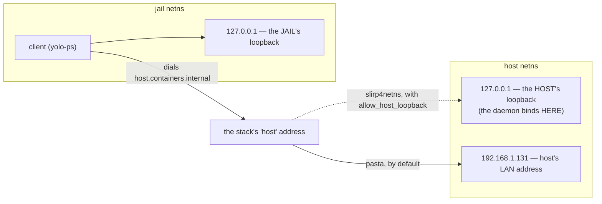

# Loopback-TLS reachability — how a jail reaches a host daemon, and why it currently cannot

**Status:** DECIDED, 2026-08-17. Nothing built; all four open questions answered — ready to implement. Absorbs and replaces the operational handoff that
originally reported this (`docs/plans/handoff-loopback-tls-pasta.md`, deleted in the same commit —
its evidence is folded into §2 and §3).

**The short version.** yolo's host daemons bind `127.0.0.1` and tell the jail to dial
`host.containers.internal`, on the assumption that a container runtime forwards that name to the
host's **loopback**. Whether it does is a property of *which rootless networking stack is in use* —
true for slirp4netns, **false for pasta**, which podman has defaulted to since 5.0. So on a pasta
host every loopback-TLS service has been unreachable from every jail since `58ce9ee` (2026-08-13).
The fix is to make the runtime forward loopback rather than to change what yolo binds.

> [!NOTE]
> **"Why can't we know how routing works ahead of time?"** — we can, and that is the real
> indictment. `podman info` reports `rootlessNetworkCmd` on every host. Nothing here was
> unknowable; the design hardcoded one stack's behaviour as if it were the only one, and never
> asked. See [§4](#4-what-yolo-does-today-and-exactly-where-the-premise-fails).

**Start with [§2](#2-the-mental-model-two-namespaces-two-loopbacks)** if the networking is the
unclear part — everything else depends on it.

**Reads with:** [`loophole-transport.md`](./loophole-transport.md) — §3.0 is the loopback-bind
security model this preserves, §7.4 the decision that retired `unix-socket`, which OQ-R3 would
reopen.

---

## 1. The symptom

| | |
| :--- | :--- |
| **What fails** | `yolo-ps`, `yolo-journalctl`, and the Claude OAuth broker — everything on loopback-TLS |
| **How** | `dial tcp 169.254.1.2:<port>: connect: connection refused` |
| **Since** | `58ce9ee`, 2026-08-13. First real failure logged `2026/08/13 21:10:02`; 24 broker refresh failures on record |
| **Where** | any host whose podman reports `rootlessNetworkCmd: pasta` — the default since podman 5.0 |
| **Not the cause** | the preamble/pack sprint. `git log -L` on the bind line returns `58ce9ee` plus two commits that cancel out, and `ECONNREFUSED` at `connect(2)` means no byte above TCP is ever written |

> [!IMPORTANT]
> **It fails closed.** `/etc/hosts` pins `platform.claude.com` to `127.0.0.1`, and the in-jail
> terminator's only route out is the relay — so a jail **cannot** silently mint its own OAuth
> refresh instead. The single-use-refresh-token race stays prevented. What is lost is availability,
> not safety.

---

## 2. The mental model: two namespaces, two loopbacks

This is what makes the rest obvious, and it is why *"just bind the right place and connect to the
right place"* is harder than it sounds.

A jail runs in its own **network namespace**: its own interfaces, its own routing table, and —
critically — **its own loopback**. When a daemon on the host binds `127.0.0.1` and a process in the
jail dials `127.0.0.1`, those are two different addresses on two different stacks. The jail is not
failing to reach the host; it is successfully reaching *itself*.

So the jail needs some *other* address that means "the host". Every rootless stack invents one, and
**they disagree about what it forwards to**:



**The trap: the two ends of that arrow are chosen by different parties.** yolo picks the bind
address; the *container runtime* picks what the forwarding address maps to. yolo has been choosing
one end and assuming the other.

**Pasta makes this especially confusing, and this jail is a live example.** Pasta copies the host's
interfaces, addresses and routes into the namespace, so the jail looks almost exactly like the host.
Measured here, right now:

```console
$ ip -brief addr
lo         UNKNOWN  127.0.0.1/8 ::1/128
enp191s0   UNKNOWN  192.168.1.131/24 …      # the HOST's interface name and LAN address

$ ip route
default via 192.168.1.1 dev enp191s0 …      # the HOST's real gateway

$ cat /etc/hosts
169.254.1.2  host.containers.internal host.docker.internal
```

The jail believes it is `192.168.1.131` on `enp191s0`. It is not — it holds a **copy** of that
identity in a separate namespace. Dialling `192.168.1.131` from inside reaches the jail's own copy,
which is why that probe comes back *refused* rather than answered.

---

## 3. The networking modes, spelled out

Every row answers one question: **when a process inside the jail dials the "host" address, where does
the packet actually arrive?**

| Mode | Jail resolves `host.containers.internal` to | That forwards to | Can yolo *bind* what the jail dials? | Loopback-TLS today |
| :--- | :--- | :--- | :--- | :--- |
| **pasta** (rootless; podman ≥ 5.0 default) | `169.254.1.2`, a synthetic tunnel address | the host's **global** address ⚠️ | **No** — not an interface on the host; `bind()` returns `EADDRNOTAVAIL` | ❌ **broken** |
| **pasta** + `--map-host-loopback` | `169.254.1.2` | the host's **loopback** | No — and it does not need to | ✅ the proposed fix |
| **slirp4netns** (rootless; older default) | `10.0.2.2`, a userspace gateway | host loopback **only if** `allow_host_loopback=true` | No | ⚠️ works *if* that option is set |
| **netavark bridge** (rootful) | the bridge gateway, e.g. `10.88.0.1` | the host, via a real bridge interface | **Yes** — a genuine host interface | ✅ works |
| **`--net=host`** (no namespace) | n/a — the jail *shares* the host's stack | itself | Yes, trivially | ✅ works |
| **nested jail** (podman-in-podman) | forced to `--net=host` | itself | Yes | ✅ works — **and this is why nobody caught it** (§7) |
| **Apple Container / `macos-user`** | a VM hop, not pasta | out of scope | — | not affected |

> [!WARNING]
> Read the fourth column downward. **In every rootless mode, yolo cannot bind the address the jail
> dials.** That is not an inconvenience to route around — it is the shape of the whole problem, and
> §5 is what falls out of it.

**Verification status, stated honestly.** The pasta rows are measured on this host (§2 and §3.1).
The slirp4netns and netavark rows come from documented behaviour and from `46d5417`'s findings,
**not** re-measured — there is no slirp host here to test on. The `--map-host-loopback` row is the
proposal; whether the flag exists on a given passt build is OQ-R3.

### 3.1 Where pasta actually forwards — measured

The original report left this open. A differential probe from inside a jail settled it:

| probe | result | what it establishes |
| :--- | :--- | :--- |
| `169.254.1.2:22` | connects, `SSH-2.0-OpenSSH_10.4` | the mapping is real and reaches the host |
| `169.254.1.3:22` | times out | control — the mapping is specific, not a catch-all |
| the two yolo ports | **refused**, not timed out | the packet reached a host stack and got an RST |
| `192.168.1.131:22` | refused | the jail's own copy of the host's address, per §2 |

**Pasta forwards `169.254.1.2` to the host's global address, not its loopback.**

---

## 4. What yolo does today, and exactly where the premise fails

Two lines, both from `58ce9ee`:

```go
// internal/svcendpoint/listen.go
raw, err := net.Listen("tcp", "127.0.0.1:0")             // bind: the HOST's loopback
const DefaultAdvertiseHost = "host.containers.internal"  // advertise: "wherever the host is"
```

The daemon writes the advertised host and port into an endpoint file the jail reads, and the jail
dials it. Correct **if and only if** the runtime forwards `host.containers.internal` to the host's
loopback — which [`loophole-transport.md`](./loophole-transport.md) §3.0 states as an assumption
rather than something checked.

**The premise was never universally true, and the counter-evidence predated the design by four
months.** `46d5417` (2026-04-17) fixed this same class of bug on this same host, concluding that
`169.254.1.2` *"is a container-side pasta tunnel, not a real interface on the host, so bind(2)
returns EADDRNOTAVAIL."* The knowledge was in the tree; the design contradicted it.

**And none of it was unknowable at launch.** `podman info` reports `rootlessNetworkCmd`, so the mode
is a fact yolo can read before starting anything. It simply never asks: today `network.mode:
"bridge"` — the default — emits **no** `--network` flag at all and defers entirely to podman
([`assemble.go`](../../internal/cli/run/assemble.go#L252-L259)).

---

## 5. Why "bind somewhere else" has nowhere to go

> [!NOTE]
> **First, the thing to be unambiguous about: binding `0.0.0.0` or the host's global address WOULD
> work.** This section rejects it on security grounds, not because it fails. An earlier draft said
> "there is no third address", which read as though nothing else could function — that was about a
> third address which is *both* reachable *and* off the LAN, and it caused exactly the confusion it
> was trying to prevent.
>
> **The §3.1 probe already proves it works.** `169.254.1.2:22` connected and returned the host's SSH
> banner. That succeeds for one reason: `sshd` does not bind loopback-only. Pasta's tunnel delivers
> to the host's global address, so **anything listening there is reachable from a jail** — same
> mechanism, same ports. Our daemons are unreachable purely because of the address they chose.

The instinct — *pick a better bind address* — is right, and it runs out. The launcher's network
namespace contains **only** loopback and the host's real interfaces, so there are exactly two
candidates, and each fails a different test:

| candidate | reachable from a jail? | acceptable? |
| :--- | :--- | :--- |
| **`127.0.0.1`** (today) | ❌ no — it is the *host's* loopback, and the jail has its own | ✅ safe by construction |
| **`0.0.0.0` / the host's LAN address** | ✅ **yes, this works** | ❌ puts the port on the LAN |

There is no candidate that passes both. That is the whole reason the fix has to move to the runtime
rather than the bind.

### 5.1 What binding globally would actually cost

Not "it is less tidy" — three concrete changes, worth reading before rejecting the option, because if
[OQ-R3](#-oq-r3--if-the-hosts-passt-predates---map-host-loopback-what-then) lands badly this becomes
the fallback's rival:

- **The port becomes visible to the network.** TLS with a pinned cert and a per-jail bearer token
  still gate *access*, so this is not an open door. What is lost is that today a loopback-bound
  socket is unreachable from the network **by construction** — no auth bug can be exploited
  remotely, because no packet can arrive. Binding globally converts that structural guarantee into a
  dependency on the auth path being correct. §3.0 exists for precisely that distinction.
- **Every jail could reach every other jail's port.** Under pasta all jails resolve
  `host.containers.internal` to the same tunnel, so a globally-bound daemon is visible to all of
  them. Each per-jail relay would still reject a foreign token, so it is reachable-but-rejected
  rather than open — but it is a move from *unreachable* to *rejected*, and those are different
  security properties.
- **A specific LAN address is not stable.** DHCP renewal or a laptop changing networks moves it, so
  the daemon would need to re-bind or be bound to `0.0.0.0` anyway. That makes `0.0.0.0` the only
  practical form of this option, which is also its widest form.

> [!CAUTION]
> `a1003b9` (reverted by `c49051c`) hit **both** failure modes at once by binding `10.88.0.1`, the
> **rootful** netavark gateway: unbindable from a rootless launcher (`EADDRNOTAVAIL`, so the daemon
> died at startup) *and* an address a pasta jail never dials. Do not retry a variant of it.

That leaves three real options, and only one keeps both the security model and the single transport:

| Option | Verdict |
| :--- | :--- |
| **Make the runtime forward loopback** (`--map-host-loopback`) | ✅ **Take this.** Bind, cert pinning, per-jail token and the one-transport decision all survive untouched |
| **Bind `0.0.0.0` / the LAN address** | ❌ Rejected — **it works** (§5), but trades a structural guarantee for permanent LAN exposure that §3.0 exists to prevent. Kept in view as the fallback's rival if OQ-R3 lands badly |
| **Bind-mounted AF_UNIX socket on Linux** | ⚠️ Works and is LAN-free, but reopens a decision `loophole-transport.md` §7.4 retired *on purpose*. Fallback only — OQ-R3 |

---

## 6. The fix

Ask the runtime what it is, then tell it to forward loopback:

```bash
# rootlessNetworkCmd = pasta
--network=pasta:--map-host-loopback,<addr>
# rootlessNetworkCmd = slirp4netns
--network=slirp4netns:allow_host_loopback=true
# anything else (rootful bridge, --net=host, Apple Container)
#   → emit nothing, exactly as today
```

`internal/svcendpoint` is **not touched**: the `127.0.0.1` bind, cert pinning, the per-jail bearer
token and the single-transport decision all survive verbatim, and
`TestAdvertiseHostDiffersFromBindHost` keeps passing unmodified — real signal that nothing
security-shaped moved.

**One implementation note:** podman already passes `--map-guest-addr 169.254.1.2`. If passt rejects
the same address for both options, use a distinct one and advertise that literal — `svcendpoint`
supports it, because the cert's ServerName is a fixed label rather than a hostname.

---

## 7. Companion work — non-optional, whichever way the fix goes

**`yolo check` reports PASS during a total outage.** Its probe uses `DialLocal`, which substitutes
`127.0.0.1` for the advertised host ([`dial.go`](../../internal/svcendpoint/dial.go#L64), called at
[`sections_loopholes.go`](../../internal/cli/check/sections_loopholes.go#L143)) — so it dials the one
address a jail cannot use, and stays green while everything is down. A probe that cannot fail when
its subject is down is worse than no probe. The honest probe is **in-jail**, because the advertised
address is only meaningful from inside — and per OQ-R2 it is **fatal**, not advisory: an enabled
service the jail cannot reach fails the launch. That raises the bar on the probe itself, since a
false positive now costs a jail rather than a log line.

**Nested-jail verification is structurally blind to this.** Row 6 of §3 explains the whole incident:
a nested podman is forced onto `--net=host`, the one mode where the bug **cannot** reproduce. So
`AGENTS.md`'s "verify in a nested jail" instruction is not merely insufficient here, it is
*misleading*, and needs an explicit carve-out. There is currently no integration coverage of in-jail
reachability at all.

---

## 8. Non-goals

- **Not** a change to `internal/svcendpoint`. A patch touching the bind or the advertise host is the
  wrong patch.
- **Not** a change to the §3.0 security model. Loopback-bind stands; this makes it *reachable*.
- **Not** a revival of `unix-socket` as a second transport — unless OQ-R3 forces it, in which case it
  is an amendment to a retired decision and must be written as one.
- **Not** macOS work. Apple Container and `macos-user` do not use pasta.

---

## 9. Risks

| Risk | Mitigation |
| :--- | :--- |
| yolo starts dictating a network option and a future podman default shifts under it | Detect from `podman info` rather than assuming; emit nothing for unrecognised backends, which is exactly today's behaviour |
| A user with an explicit `network.mode` keeps the bug and we cannot fix it for them | Warn on that path naming the reachability risk, rather than overriding a setting they chose deliberately |
| The fix is unverifiable in a nested jail (§7), so it could land untested | Verification is a real launch on an affected host plus new integration coverage — do not accept a nested-jail green as evidence |
| `podman info` per launch adds startup latency | One host-side subprocess; measure before caching, and cache into the boot baseline only if it matters |
| The slirp4netns and netavark rows in §3 are unverified | They do not gate the fix — the pasta path is measured, and unrecognised backends keep today's behaviour |
| **A flaky in-jail probe now bricks launches**, because OQ-R2 made it fatal | Build and prove the probe BEFORE wiring the fatal (§10). Give it a budget generous enough that scheduling starvation cannot read as unreachable — the journald readiness poll flaked at ~1-in-85 for exactly that reason and needed 5s→30s. Mirror the `YOLO_ALLOW_STALE_IMAGE` escape hatch |
| Old-passt hosts cannot launch at all once both rulings land | Intended (OQ-R2 + OQ-R3), but it must be in the release note rather than discovered. The refusal names the required version and the check command |

---

## 10. Sequencing

**First, the in-jail probe (§7) — and prove it before wiring it.** Independent of the fix, it makes
the outage visible, and it is what will prove the fix worked. It is also **fatal** by OQ-R2, so a
probe that misfires costs a jail rather than a log line: land it in warn mode, confirm it is quiet on
a healthy host and loud on this broken one, and only then make it fail the launch.

**Second, the network option (§6)**, gated on `podman info`, on the default path only.

**Third, integration coverage** asserting a jail can actually reach a published endpoint — the gap
that let this ship.

**Fourth, the `AGENTS.md` carve-out**, so the next agent does not trust a nested jail here.

---

## Open Questions

**All four resolved, 2026-08-17. Nothing about this bug is open anywhere.** The design is settled and
the work is implementable; what remains is building it (§10). Answered questions stay here as the
decision record — two of them overruled my leaning, and both leanings are kept above their answers so
the consequences stay visible.

### ✅ OQ-R0 — what does pasta forward `169.254.1.2` to? — RESOLVED (2026-08-17)

The original report's blocking question.

**Answer:**
> **The host's GLOBAL address, not its loopback**, established by the differential probe in §3.1.
> This is what kills the "bind somewhere else" family in §5 and rules out three of the four options
> the original report listed.

### ✅ OQ-R1 — may yolo emit a network option on the default path? — RESOLVED (2026-08-17)

Today `network.mode: "bridge"` means *"emit nothing, let podman decide"*
([`assemble.go`](../../internal/cli/run/assemble.go#L252-L259)). The fix makes it mean *"emit
`--network=pasta:--map-host-loopback,…` when podman reports pasta"* — yolo taking ownership of
something it deliberately left alone.

**What it decides:** whether the fix can live in the launcher at all. If not, the only remaining
lever is the transport, and §5 says that lever has nowhere to go.

Knock-on worth naming: a user who sets `network.mode` explicitly keeps full control and therefore
**keeps the bug**, and we cannot fix it for them.

_Leaning:_ **Yes, and warn on the custom path.** A transport that works only by luck of the host's
network stack is not a transport. Emitting nothing for unrecognised backends preserves today's
behaviour exactly, so the blast radius is confined to hosts we can positively identify.

**Answer:**
> **Yes.** The fix lives in the launcher: detect `rootlessNetworkCmd` from `podman info` and emit the
> matching option on the default `bridge` path. Unrecognised backends emit nothing, exactly as today.
> A user with an explicit `network.mode` keeps control and keeps the bug, and gets warned about it.

### ✅ OQ-R2 — when a jail-facing service is unreachable at boot: warn, or fail the launch? — RESOLVED (2026-08-17)

§7's in-jail probe needs a severity, and it cannot be deferred to `yolo check`, because a host-side
check structurally cannot test jail reachability.

**What it decides:** whether a pasta host with an old passt can launch a jail at all.

_Leaning:_ **Loud warning naming the service, not a fatal.** A jail with no journal bridge is still a
working jail. But the broker's case is *"your Claude auth is down"*, which is closer to fatal than
the others — so if any service earns its own severity it is that one, which may argue for a
per-service level rather than one global rule.

**Answer:**
> **Fail the launch. If it is broken, do not move on.** *(This overrules the leaning above, which is
> kept because the decision has consequences to plan for — see below.)* One rule, no per-service
> severity: an enabled jail-facing service that the jail cannot reach is a failed launch.

**What this ruling changes, and it is more than a log level:**

- **The probe becomes load-bearing.** A warning that misfires is noise; a *fatal* that misfires means
  no jail at all. So the probe must be correct before it is wired in — §10 already builds it first,
  and that ordering is now mandatory rather than merely tidy. Its budget and retry behaviour matter:
  a probe that is merely slow under load must not read as "unreachable".
- **It composes with the activation rulings, and that is what makes it tolerable.** Under
  [`loophole-activation.md`](./loophole-activation.md) nothing is enabled unless you asked for it, so
  the fatal only ever fires for a service the user deliberately turned on. "Enabled but unreachable"
  is a genuine contradiction; "present but unused" no longer exists as a state.
- **With [OQ-R3](#-oq-r3--if-the-hosts-passt-predates---map-host-loopback-what-then) also ruled
  refuse, an old-passt host cannot launch a jail at all** while any jail-facing service is enabled.
  That is the intended reading of both rulings together, and it should be stated in the release note
  rather than discovered.

> [!WARNING]
> **One implementation question this raises, which is not a re-litigation of the ruling:** a hard
> fatal with no override means a broken host daemon leaves the user unable to open a shell to fix it.
> The repo already has exactly this shape and answered it once — a failed nix build is fatal, with
> `YOLO_ALLOW_STALE_IMAGE=1` as a documented, loud opt-out for the case the fatal is wrong about
> (an offline machine with a good cached image). Recommend mirroring that precedent with an
> equivalent escape hatch that says what it is suppressing. Confirm or reject when the probe is
> built.

### ✅ OQ-R3 — if the host's passt predates `--map-host-loopback`, what then? — RESOLVED (2026-08-17)

Two options, not equivalent: **AF_UNIX on Linux**, which reopens
[`loophole-transport.md`](./loophole-transport.md) §7.4 — retired *on purpose*, so it needs an
amendment rather than a quiet workaround — or **refuse to launch** with a message naming the passt
version required.

**What it decides:** whether this fix stays contained to the launcher, or reopens the transport
question.

> [!TIP]
> **This collapses to a fact, and it cannot be obtained from inside a jail** (no pasta here, and
> `yolo-ps` is down because of this very bug). One command on the host settles it:
> ```bash
> pasta --version
> ```

_Leaning:_ **Refuse to launch, and say what is needed.** Reviving a retired transport to serve one
old passt build is a large permanent cost for a shrinking population; a clear refusal names an
upgrade the user can actually perform. If the affected population turns out to be large, the
amendment is the honest path — but that is evidence we do not have yet.

**Answer:**
> **Refuse. A passt supporting `--map-host-loopback` is a hard requirement.** AF_UNIX is not
> revived, so `loophole-transport.md` §7.4 stands and needs no amendment. The refusal must name the
> passt version required and the command to check it, because "refuse" is only acceptable if the
> user can act on it.
