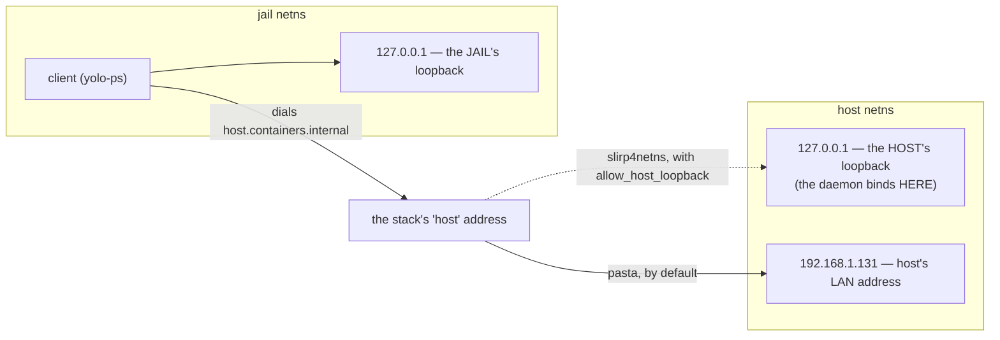

# Loopback-TLS reachability — how a jail reaches a host daemon

**yolo's host daemons bind `127.0.0.1` and tell the jail to dial `host.containers.internal`**, on the
assumption that a container runtime forwards that name to the host's **loopback**. It does not. That
is a property of *which rootless networking stack is in use* and of *where podman aims that name* —
false for **pasta**, podman's default since 5.0, and false for **slirp4netns** too until something
pins the name at slirp's gateway. So on a rootless host every loopback-TLS service was unreachable
from every jail from `58ce9ee` (2026-08-13) until the fix landed.

**The fix makes the runtime forward loopback rather than changing what yolo binds.**
`internal/svcendpoint` is untouched.

> [!NOTE]
> **None of this was unknowable.** `podman info` reports `rootlessNetworkCmd` on every host. The
> design hardcoded one stack's behaviour as if it were the only one and never asked — see [§4](#4-where-the-premise-fails).

**Start with [§2](#2-the-mental-model-two-namespaces-two-loopbacks)** if the networking is the unclear
part; everything else depends on it. **Reads with**
[`loophole-transport.md`](./loophole-transport.md) — §3.0 is the loopback-bind security model this
preserves, §7.4 the decision that retired `unix-socket`.

## Decisions

Settled and folded into the body. IDs are load-bearing — code comments cite them.

| ID | Ruling | Lives in |
| :--- | :--- | :--- |
| **OQ-R0** | pasta forwards `169.254.1.2` to the host's **global** address, not its loopback | [§3.1](#31-where-pasta-actually-forwards) |
| **OQ-R1** | yolo may emit a network option on the default `bridge` path; unrecognised backends emit nothing | [§6](#6-the-fix) |
| **OQ-R2** | an enabled jail-facing service the jail cannot reach is a **failed launch**, not a warning | [§7.1](#71-the-severity-rule) |
| **OQ-R3** | a host yolo cannot fix **degrades and launches**; it is never refused for what it cannot help | [§6.1](#61-the-ladder), [§7.2](#72-what-may-escalate) |
| **OQ-R5** | a jail sharing the launcher's netns **is** escalatable — no host-stack excuse exists there | [§7.2](#72-what-may-escalate) |
| **OQ-R6** | the launcher's decision rides on the wire with **every state spelled**; only positive facts escalate | [§7.2](#72-what-may-escalate) |

One question is open: [**OQ-R4**](#open-question), which fault classes may refuse a launch.

---

## 1. The symptom

| | |
| :--- | :--- |
| **What failed** | `yolo-ps`, `yolo-journalctl`, and the Claude OAuth broker — everything on loopback-TLS |
| **How** | `dial tcp 169.254.1.2:<port>: connect: connection refused` |
| **Since** | `58ce9ee`, 2026-08-13. First failure logged `2026/08/13 21:10:02`; 24 broker refresh failures on record |
| **Where** | any host whose podman reports `rootlessNetworkCmd: pasta` |
| **Not the cause** | the preamble/pack sprint. `git log -L` on the bind line returns `58ce9ee` plus two commits that cancel out, and `ECONNREFUSED` at `connect(2)` means no byte above TCP is ever written |

> [!IMPORTANT]
> **It fails closed.** `/etc/hosts` pins `platform.claude.com` to `127.0.0.1`, and the in-jail
> terminator's only route out is the relay — so a jail **cannot** silently mint its own OAuth refresh
> instead. The single-use-refresh-token race stays prevented. What is lost is availability, not
> safety.

---

## 2. The mental model: two namespaces, two loopbacks

This is what makes the rest obvious, and why *"just bind the right place and connect to the right
place"* is harder than it sounds.

A jail runs in its own **network namespace**: its own interfaces, its own routing table, and —
critically — **its own loopback**. When a daemon on the host binds `127.0.0.1` and a process in the
jail dials `127.0.0.1`, those are two different addresses on two different stacks. The jail is not
failing to reach the host; it is successfully reaching *itself*.

So the jail needs some *other* address that means "the host". Every rootless stack invents one, and
**they disagree about what it forwards to**:



**The trap: the two ends of that arrow are chosen by different parties.** yolo picks the bind
address; the *container runtime* picks what the forwarding address maps to. yolo was choosing one end
and assuming the other.

**Pasta makes this especially confusing.** It copies the host's interfaces, addresses and routes into
the namespace, so the jail looks almost exactly like the host. Measured in a development jail:

```console
$ ip -brief addr
lo         UNKNOWN  127.0.0.1/8 ::1/128
enp191s0   UNKNOWN  192.168.1.131/24 …      # the HOST's interface name and LAN address

$ ip route
default via 192.168.1.1 dev enp191s0 …      # the HOST's real gateway

$ cat /etc/hosts
169.254.1.2  host.containers.internal host.docker.internal
```

The jail believes it is `192.168.1.131` on `enp191s0`. It is not — it holds a **copy** of that
identity in a separate namespace. Dialling `192.168.1.131` from inside reaches the jail's own copy,
which is why that probe comes back *refused* rather than answered.

---

## 3. The networking modes, spelled out

Every row answers one question: **when a process inside the jail dials the "host" address, where does
the packet actually arrive?**

| Mode | Jail resolves `host.containers.internal` to | That forwards to | Can yolo *bind* what the jail dials? | Loopback-TLS |
| :--- | :--- | :--- | :--- | :--- |
| **pasta** (rootless; podman ≥ 5.0 default) | `169.254.1.2`, a synthetic tunnel address | the host's **global** address ⚠️ | **No** — not an interface on the host; `bind()` returns `EADDRNOTAVAIL` | ❌ broken |
| **pasta** + `--map-host-loopback` | `169.254.1.2` | the host's **loopback** | No — and it does not need to | ✅ **the fix** |
| **slirp4netns** (rootless; older default) | the host's **global** address ⚠️ — *not* the `10.0.2.2` gateway | the host's global address | **No** | ❌ broken, the same way |
| **slirp4netns** + `allow_host_loopback` **+ a pinned hosts entry** | `10.0.2.2`, its userspace gateway | the host's **loopback** | No — and it does not need to | ✅ the old-passt fallback |
| **netavark bridge** (rootful) | the bridge gateway, e.g. `10.88.0.1` | the host, via a real bridge interface | **Yes** — a genuine host interface | ✅ works |
| **`--net=host`** (no namespace) | n/a — the jail *shares* the host's stack | itself | Yes, trivially | ✅ works |
| **nested jail** (podman-in-podman) | forced to `--net=host` | itself | Yes | ✅ works — **and this is why nobody caught it** ([§7.4](#74-a-nested-jail-is-structurally-blind-to-this)) |
| **Apple Container / `macos-user`** | a VM hop, not pasta | out of scope | — | not affected |

> [!WARNING]
> Read the fourth column downward. **In every rootless mode, yolo cannot bind the address the jail
> dials.** That is not an inconvenience to route around — it is the shape of the whole problem, and
> [§5](#5-why-bind-somewhere-else-has-nowhere-to-go) is what falls out of it.
>
> Note the third and fourth rows: for slirp4netns the option alone is **not** sufficient, because it
> forwards a loopback nothing in the jail dials. Both flags are load-bearing —
> [§3.2.1](#321-dial-the-name-not-the-gateway).

**Verification status, stated honestly.** The pasta rows and both slirp4netns rows are **measured**
(§3.1, §3.2, 2026-08-17). The netavark row comes from documented behaviour and from `46d5417`'s
findings, **not** re-measured. Whether `--map-host-loopback` exists on a given *user's* passt build is
a host fact yolo probes for rather than assumes ([§6.1](#61-the-ladder)).

### 3.1 Where pasta actually forwards

A differential probe from inside a jail:

| probe | result | what it establishes |
| :--- | :--- | :--- |
| `169.254.1.2:22` | connects, `SSH-2.0-OpenSSH_10.4` | the mapping is real and reaches the host |
| `169.254.1.3:22` | times out | control — the mapping is specific, not a catch-all |
| the two yolo ports | **refused**, not timed out | the packet reached a host stack and got an RST |
| `192.168.1.131:22` | refused | the jail's own copy of the host's address, per §2 |

**Pasta forwards `169.254.1.2` to the host's global address, not its loopback.** That single fact
kills the "bind somewhere else" family in §5.

### 3.2 Both fixes, measured from a development jail

> [!NOTE]
> **A nested *yolo* jail cannot measure this** — `yolo` forces `--net=host` under podman-in-podman,
> the one mode where the bug cannot reproduce. **Bare `podman run` is not so constrained:** the
> development jail is a perfectly good "host" for a container it starts, and podman ships its own
> pasta, so the outage and its remedy both reproduce in one command each. See
> [§7.4](#74-a-nested-jail-is-structurally-blind-to-this).

Bind a listener on the jail's own loopback — the same shape as a yolo host daemon — and dial it from
a container using the stack under test:

```console
$ python3 -m http.server 18080 --bind 127.0.0.1 &
$ probe='(exec 3<>/dev/tcp/169.254.1.2/18080) 2>/dev/null && echo CONNECT || echo FAIL'
$ podman run --rm --network=pasta localhost/yolo-jail:latest bash -c "$probe"
FAIL
$ podman run --rm --network=pasta:--map-host-loopback,169.254.1.2 localhost/yolo-jail:latest bash -c "$probe"
CONNECT
```

| probe | result | what it establishes |
| :--- | :--- | :--- |
| `--network=pasta`, dial `169.254.1.2` | **FAIL** | the outage of §1, reproduced on demand |
| `--network=pasta:--map-host-loopback,169.254.1.2` | **CONNECT** | §6's fix works, with the exact argv the launcher emits |
| `--network=slirp4netns`, dial `10.0.2.2` | **FAIL** | podman passes `--disable-host-loopback` by default |
| `--network=slirp4netns:allow_host_loopback=true`, dial `10.0.2.2` | **CONNECT** | the option forwards the host's loopback — **to that address**, which is the catch: §3.2.1 |
| `--network=pasta:--bogus-flag` | `Error: pasta failed with exit code 1` (rc 126) | **a wrong option is a failed launch, not a degraded one** — why §6 detects positively and emits nothing when unsure |

Measured 2026-08-17 on podman 5.8.4 with the bundled pasta 2026_07_16 and slirp4netns 1.3.4. Two
implementation notes settled along the way: passt accepts the same address for `--map-host-loopback`
and podman's own `--map-guest-addr`, so no distinct address is needed; and `podman create` accepts a
bogus option happily — the rejection comes at **start**, which is exactly where it costs a jail.

#### 3.2.1 Dial the NAME, not the gateway

Every probe above dials an **address**. yolo's daemons advertise a **name**
(`svcendpoint.DefaultAdvertiseHost`), so the address is only half the question: podman also decides
what that name resolves to inside the jail, and for slirp4netns it does not decide what the table
above would imply.

```console
$ probe='grep -i containers.internal /etc/hosts
         (exec 3<>/dev/tcp/host.containers.internal/18081) 2>/dev/null && echo CONNECT || echo FAIL'
$ podman run --rm --network=slirp4netns:allow_host_loopback=true localhost/yolo-jail:latest bash -c "$probe"
192.168.1.131   host.containers.internal host.docker.internal
FAIL
$ podman run --rm --network=slirp4netns:allow_host_loopback=true \
    --add-host=host.containers.internal:10.0.2.2 localhost/yolo-jail:latest bash -c "$probe"
10.0.2.2        host.containers.internal
CONNECT
```

| probe | `host.containers.internal` | result | what it establishes |
| :--- | :--- | :--- | :--- |
| `allow_host_loopback=true` alone | `192.168.1.131` (host's global address) | **FAIL** | the option alone forwards a loopback **nothing in the jail dials** |
| … + `--add-host=host.containers.internal:10.0.2.2` | `10.0.2.2` | **CONNECT** | the fallback the launcher emits, measured end to end |
| `--add-host=…` *without* `allow_host_loopback` | `10.0.2.2` | **FAIL** | the entry is not the fix either — **both flags are load-bearing** |
| `--network=pasta:--map-host-loopback,…` | `169.254.1.2` | **CONNECT** | pasta needs no entry: podman already aims the name at the mapped address |

**Why podman does that**, since a measurement without a mechanism invites "it must be the jail":
`etchosts.GetHostContainersInternalIP` prefers a mapped address only when **pasta** reported one
(`PreferIP`, fed from `pastaResult.MapGuestAddrIPs` and nothing else); rootless otherwise falls
through to `GetLocalIPExcluding` — the host's global address. Read in containers/common
`libnetwork/etchosts/ip.go` and podman `libpod/container_internal_common.go`. It also explains why
`--add-host` wins: user entries are written first and podman skips its own entry for a name already
present (`writeHostFile` → `addEntriesIfNotExists`), so the pin displaces `host.containers.internal`
and leaves `host.docker.internal` alone.

> [!WARNING]
> **Re-measuring this from a jail needs one precaution, or every stack answers the same.** Podman
> seeds a container's `/etc/hosts` from the **host's** (`base_hosts_file`), and a jail's own
> `/etc/hosts` already carries a `169.254.1.2 host.containers.internal` line from the boundary above
> it — which podman treats as a user entry and does not override. The first run of this experiment
> showed `169.254.1.2` under netavark, pasta *and* slirp4netns alike, which is not a podman behaviour
> at all. Point `CONTAINERS_CONF` at a copy with `base_hosts_file = "/dev/null"` to see podman's own
> computation. With the stock config the pin still works, so this is a hazard for the **measurement**,
> not for the fix.

---

## 4. Where the premise fails

Two lines, both from `58ce9ee`:

```go
// internal/svcendpoint/listen.go
raw, err := net.Listen("tcp", "127.0.0.1:0")             // bind: the HOST's loopback
const DefaultAdvertiseHost = "host.containers.internal"  // advertise: "wherever the host is"
```

The daemon writes the advertised host and port into an endpoint file the jail reads, and the jail
dials it. Correct **if and only if** the runtime forwards `host.containers.internal` to the host's
loopback — which [`loophole-transport.md`](./loophole-transport.md) §3.0 states as an assumption
rather than something checked.

**The premise was never universally true, and the counter-evidence predated the design by four
months.** `46d5417` (2026-04-17) fixed this same class of bug on this same host, concluding that
`169.254.1.2` *"is a container-side pasta tunnel, not a real interface on the host, so bind(2)
returns EADDRNOTAVAIL."* The knowledge was in the tree; the design contradicted it.

---

## 5. Why "bind somewhere else" has nowhere to go

> [!NOTE]
> **Binding `0.0.0.0` or the host's global address WOULD work.** This section rejects it on security
> grounds, not because it fails — and the §3.1 probe proves it: `169.254.1.2:22` connected and
> returned the host's SSH banner, because `sshd` does not bind loopback-only. Pasta's tunnel delivers
> to the host's global address, so **anything listening there is reachable from a jail**. Our daemons
> were unreachable purely because of the address they chose.

The instinct — *pick a better bind address* — is right, and it runs out. The launcher's network
namespace contains **only** loopback and the host's real interfaces, so there are exactly two
candidates, and each fails a different test:

| candidate | reachable from a jail? | acceptable? |
| :--- | :--- | :--- |
| **`127.0.0.1`** (today) | ❌ no — it is the *host's* loopback, and the jail has its own | ✅ safe by construction |
| **`0.0.0.0` / the host's LAN address** | ✅ **yes, this works** | ❌ puts the port on the LAN |

There is no candidate that passes both. That is why the fix moves to the runtime rather than the
bind.

### 5.1 What binding globally would cost

Three concrete changes, worth knowing because this stays the rival if the fallback ladder ever runs
out on a host:

- **The port becomes visible to the network.** TLS with a pinned cert and a per-jail bearer token
  still gate *access*, so this is not an open door. What is lost is that a loopback-bound socket is
  unreachable from the network **by construction** — no auth bug can be exploited remotely, because
  no packet can arrive. Binding globally converts that structural guarantee into a dependency on the
  auth path being correct. §3.0 exists for precisely that distinction.
- **Every jail could reach every other jail's port.** Under pasta all jails resolve
  `host.containers.internal` to the same tunnel, so a globally-bound daemon is visible to all of them.
  Each per-jail relay would still reject a foreign token — but that is a move from *unreachable* to
  *rejected*, and those are different security properties.
- **A specific LAN address is not stable.** DHCP renewal or a laptop changing networks moves it, so
  the daemon would need to re-bind or be bound to `0.0.0.0` anyway. That makes `0.0.0.0` the only
  practical form, which is also its widest form.

> [!CAUTION]
> `a1003b9` (reverted by `c49051c`) hit **both** failure modes at once by binding `10.88.0.1`, the
> **rootful** netavark gateway: unbindable from a rootless launcher (`EADDRNOTAVAIL`, so the daemon
> died at startup) *and* an address a pasta jail never dials. Do not retry a variant of it.

**The rejected alternatives**, kept because each is tempting:

| Option | Verdict |
| :--- | :--- |
| **Make the runtime forward loopback** | ✅ **Taken.** Bind, cert pinning, per-jail token and the one-transport decision all survive untouched |
| **Bind `0.0.0.0` / the LAN address** | ❌ It *works*, but trades a structural guarantee for permanent LAN exposure that §3.0 exists to prevent |
| **Bind-mounted AF_UNIX socket on Linux** | ❌ Works and is LAN-free, but reopens a decision `loophole-transport.md` §7.4 retired *on purpose*. Only if the ladder in §6.1 runs out entirely, and then as a written amendment |

---

## 6. The fix

**Ask the runtime what it is, then tell it to forward loopback.** The decision lives in the
**launcher** (`internal/cli/run/hostloopback.go`), on the default `network.mode: bridge` path only.
`internal/svcendpoint` is **not touched**: the `127.0.0.1` bind, cert pinning, the per-jail bearer
token and the single-transport decision all survive verbatim, and
`TestAdvertiseHostDiffersFromBindHost` keeps passing unmodified — real signal that nothing
security-shaped moved.

**OQ-R1 — yolo may take ownership of the default path.** `bridge` used to mean *"emit nothing, let
podman decide"*. It now means *"emit the option that makes this host work, when we can positively
identify it."* A transport that works only by luck of the host's network stack is not a transport.

**A user who sets `network.mode` explicitly keeps full control and therefore keeps the bug**, and is
warned about it. We do not override a setting someone chose deliberately.

### 6.1 The ladder

Every rung requires a **positive fact**. Anything unproven emits nothing and keeps today's argv
byte-for-byte, because a wrong network option is a container that fails to *start* (§3.2) — the one
outcome this area may never produce.

1. **pasta that advertises `--map-host-loopback`** → `--network=pasta:--map-host-loopback,169.254.1.2`
2. **else slirp4netns, if podman itself reports the binary** →
   `--network=slirp4netns:allow_host_loopback=true` **and**
   `--add-host=host.containers.internal:10.0.2.2` — both flags, per §3.2.1
3. **else** warn and launch

Availability at rung 2 is **podman's own answer, never a PATH lookup**: podman is the process that
execs the helper, so a binary yolo can see and podman cannot is a container that fails to start.
Podman reports `host.slirp4netns.executable` as `""` when it has none, which makes the empty string a
positive fact.

**OQ-R3 — an old passt degrades; it is never refused.** yolo runs on the host it is given. The
requirement that survives is on the *message*: it names what breaks, the passt version that fixes it,
and the command that checks — and it must not read as an error, because launching is correct and the
user has done nothing wrong.

---

## 7. The in-jail witness

**A host-side check structurally cannot answer this.** `yolo check` dials with
`svcendpoint.DialLocal`, which keeps the published port and substitutes `127.0.0.1`
([`dial.go`](../../internal/svcendpoint/dial.go#L55)) — the one address a jail cannot use. Everything
is reachable on the host's loopback by construction, because that is where the daemons bind, so a
host-side prober reports PASS during a total outage. A probe that cannot fail when its subject is
down is worse than no probe.

The advertised name is only meaningful inside a namespace the runtime built, so the only honest place
to evaluate it is **at boot, from inside the jail** (`internal/entrypoint/reachability.go`).

### 7.1 The severity rule

**OQ-R2 — an enabled jail-facing service the jail cannot reach is a failed launch.** One rule, no
per-service severity. It composes with [`loophole-activation.md`](./loophole-activation.md): nothing
is enabled unless it was asked for, so the fatal only ever fires for a service the user deliberately
turned on. *"Enabled but unreachable"* is a genuine contradiction; *"present but unused"* is not a
state that exists.

That makes the probe **load-bearing**: a warning that misfires is noise, a fatal that misfires is no
jail at all. Two things follow, and both are built:

- **A budget generous enough that scheduling starvation cannot read as unreachable.** The journald
  readiness poll flaked at ~1-in-85 for exactly that reason and needed 5s → 30s.
- **An escape hatch**, `YOLO_ALLOW_UNREACHABLE_SERVICES=1`, mirroring `YOLO_ALLOW_STALE_IMAGE`: any
  non-empty value keeps the jail launching, it says what it is suppressing and that nothing was
  repaired, and the refusal names it so the reader is told the way past it. It is honoured only where
  it suppresses something, so it stays silent in warn mode rather than training people to skip it.
  The launcher forwards it into the container, because the witness runs in-jail and the user types it
  on the host.

### 7.2 What may escalate

**"Broken" means yolo tried and failed — not "this host cannot."** Without that split, R2 and R3
collide: *fail when a service is unreachable* plus *an old passt cannot reach any service* would mean
an old-passt host cannot launch at all, reintroducing the refusal R3 rejected.

From inside, the two cases are the same observation — a service that does not answer — and the facts
that separate them are all host facts. So **OQ-R6 — the launcher's decision rides in on the wire**, as
`YOLO_HOST_LOOPBACK` (`paths.HostLoopbackEnvVar`), with every state spelled:

| Value | Means | May escalate |
| :--- | :--- | :--- |
| `requested` | the forwarding option reached the argv | ✅ |
| `shared` | the jail shares the launcher's netns — nothing to forward | ✅ (**OQ-R5**) |
| `unsupported` | yolo identified the stack and could not make it forward | ❌ — a known limitation (R3) |
| `unknown` | no conclusion: rootful, unrecognised backend, explicit `network.mode`, opt-out | ❌ |
| *absent* | the launcher predates this variable | ❌ — same default as `unknown` |

**Only positive facts escalate** — the discipline that governs the argv, applied to severity. An
unrecognised value must never be read as permission to fail a launch, so escalating values are
matched exactly and everything else falls through to safe.

**OQ-R5 — a shared namespace is the strongest case, not the weakest.** `--net=host` and a nested jail
share the launcher's stack, so `advertiseHostFor` publishes `127.0.0.1` for them, which *"is not
merely correct, it is the ONLY thing that works."* No gateway name, no forwarding hop, no rootless
stack in the path: a service unreachable there has no ambiguity to hide in.

> [!NOTE]
> **Build status:** `requested` / `unsupported` / absent are shipped. `shared` and `unknown` are
> **not yet spelled** — both are absent today — so R5's severity cannot ship until they are. Shipping
> it first would escalate genuine ignorance.

### 7.3 Current mode, and the flip

The witness ships in **warn mode**. `reachabilityFatal = false` is the whole of it, isolated to one
boolean whose flip is one line, with both modes already under test and a guard test that fails if the
flip lands while anything below is still owed.

**Observed at real boots, 2026-08-18** — the gate the flip was waiting on:

- **Healthy host, silent.** `YOLO_HOST_LOOPBACK=requested`, both endpoints published, both answered
  through the witness's own path (TLS, cert-pinned, token-authenticated) in 1–2 ms.
- **Broken host, loud.** A service pointed at a dead port produced the warning, the address, the
  `requested` diagnosis — which correctly points *away* from the network stack — and the FAULT
  verdict, with the jail still starting because warn mode.

What remains before the flip is **OQ-R4** below, plus the `shared`/`unknown` spellings for OQ-R5.

Boot output is persisted to `<workspace>/.yolo/boot.log` (previous boot kept beside it). That
directory is bind-mounted from the host, so the log survives a boot that refused — the state the flip
makes reachable, where there is no jail left to ask. A healthy witness records its verdict there and
stays silent on the terminal, because "ran and found nothing" and "never ran" are otherwise the same
bytes.

### 7.4 A nested jail is structurally blind to this

A nested podman is forced onto `--net=host`, the one mode where the bug **cannot** reproduce. So
`AGENTS.md`'s "verify in a nested jail" instruction is not merely insufficient here, it is
*misleading*, and carries an explicit carve-out.

**Blind is not the same as impossible.** `yolo`'s forced `--net=host` is what blinds the nested path;
a bare `podman run --network=pasta …` from the same jail reproduces the outage and demonstrates the
fix in one command each (§3.2). The carve-out carries that recipe, because "you cannot test this
here" is the belief that let the option ship unmeasured for a day longer than it needed to.

`yolo check`'s output now labels each green *"host-side, says nothing about in-jail reachability"*,
with one footnote per run pointing at the boot-time witness as the only thing that can answer. The
underlying asymmetry is not closed and cannot be: `yolo check` still cannot fail on this.

---

## 8. Non-goals

- **Not** a change to `internal/svcendpoint`. A patch touching the bind or the advertise host is the
  wrong patch.
- **Not** a change to the §3.0 security model. Loopback-bind stands; this makes it *reachable*.
- **Not** a revival of `unix-socket` as a second transport (§5.1).
- **Not** macOS work. Apple Container and `macos-user` do not use pasta.

---

## 9. Risks

| Risk | Mitigation |
| :--- | :--- |
| yolo now dictates a network option and a future podman default shifts under it | Detect from `podman info` rather than assuming; emit nothing for unrecognised backends, which is exactly the old behaviour |
| A user with an explicit `network.mode` keeps the bug | Warn on that path naming the reachability risk, rather than overriding a setting they chose |
| A flaky witness bricks launches once R2's fatal is wired | Warn mode first, proven at real boots both ways (§7.3); a 30s budget; the escape hatch |
| The netavark row (§3) is unverified | It does not gate the fix — the pasta path is measured and unrecognised backends keep the old behaviour |
| The slirp4netns fallback is unverified on a real old-passt host | Nobody has one. The flags are measured (§3.2.1); what is unproven is a host yolo has never seen accepting `--network=slirp4netns` at all |
| A host running slirp with a non-default CIDR | The `10.0.2.2` pin misses and services stay unreachable — but the jail is told `requested`, which R4/R2 would escalate. Bounded and known, not eliminated |

---

## 10. Status

**Built:** the launcher fix and its ladder (§6), the in-jail witness in warn mode (§7), the escape
hatch, the `requested`/`unsupported` spellings, the boot log, `yolo check`'s honesty labels, and the
`AGENTS.md` carve-out.

**Not built:** the `shared` and `unknown` spellings (§7.2), and the flip itself (§7.3).

**Blocked on a ruling:** R4, below.

---

## Open question

### 💬 OQ-R4 — which fault classes may refuse a launch?

[§7.1](#71-the-severity-rule) rules *that* an unreachable service fails the launch. It does not say
which **kind** of failure counts, and the witness distinguishes three
([`reachability.go#L155-L169`](../../internal/entrypoint/reachability.go#L155-L169)). Only the first
escalates today:

| Fault | What it is | Escalates today |
| :--- | :--- | :--- |
| `faultUnreachable` | the endpoint file is good and the advertised address does not answer | ✅ |
| `faultUnpublished` | no endpoint file, one that does not parse, or one that is not a readable regular file | ❌ |
| `faultRejected` | the endpoint parsed and the listener refused this jail's token — a stale file | ❌ |

**What it decides:** whether "enabled and unusable" means the *network* specifically, or the outcome.
A stale token and a missing endpoint are both services the user asked for and cannot have.

**Two things that are NOT arguments against escalating, because they were checked:**

- **There is no slow-to-publish race.** `waitServiceReady`
  ([`loopholesruntime.go#L453`](../../internal/cli/run/loopholesruntime.go#L453)) polls
  `svcendpoint.Probe` for 5s *before* the container starts; a daemon that misses is SIGKILLed as a
  group and its env var is never wired. At boot, a missing or stale endpoint means it was healthy
  five seconds ago and is not now.
- **There is no permanent lockout.** Every respawn path unlinks the stale artifact before spawning
  ([`loopholesruntime.go#L550`](../../internal/cli/run/loopholesruntime.go#L550), and
  `retireStaleRelayFiles`), and `Publish` renames a temp file onto the target. `unlink(2)` and
  `rename(2)` both work on a fifo, and the host never *opens* the path, so it cannot be wedged the way
  the in-jail probe could. The only shape that survives is a non-empty directory, which cannot reach
  the escalation set anyway: publish fails, readiness fails, and the variable is then never wired.

**The one real consequence.** The broker's variable is wired on `brokerLoopholeActive(cfg)` alone
([`assemble_parts.go#L408`](../../internal/cli/run/assemble_parts.go#L408)) with no publish gate,
because it is a host-wide singleton rather than a per-jail daemon. So *"broker configured, singleton
down"* reaches the jail as `faultUnpublished` **by design**, and escalating that class refuses every
jail on the host. Arguably correct — §1 calls a jail with no Claude auth the case closest to fatal —
but it is the largest behaviour change in the ruling, and it is the thing to decide on.

_Leaning:_ **escalate all three.** Each means "this service is enabled and this jail cannot use it",
the launcher has already proven the endpoint was healthy moments before, and the distinctions that
remain are about *where to look* rather than *how bad it is* — which is what the three diagnosis
paragraphs are for and what severity should not duplicate.

**Answer:**
> _(unanswered)_
