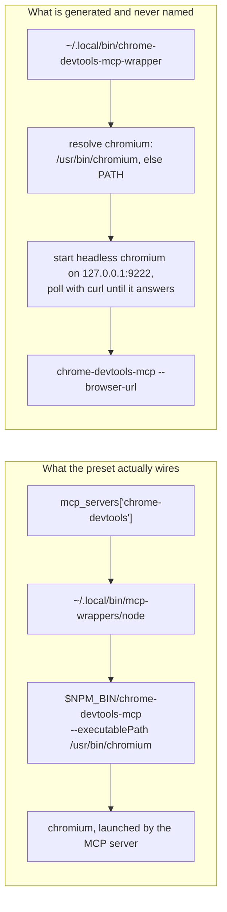

# Two presets, seven hardcodings, and a backend that can have neither

**Status:** DECIDED, 2026-09-20 — every question settled, nothing built. ⚠ One ruling
([`OQ-MP7`](#OQ-MP7)) rejected its own leaning and its consequence is NOT contained here: it
redraws the `packs` workspace-scope boundary, so this doc cannot be built against without that
being ruled too.

> **In short.** `mcp_presets` is the last place core states *which MCP servers exist*, and that
> is a content claim, not a domain one — so it dissolves rather than moves. `sequential-thinking`
> is deleted; `chrome-devtools` becomes a builtin pack. The design's real content is that no
> contribution kind can express an MCP server today, and the browser's configuration is hairy
> enough that inventing one is cheaper than handing the config to users.

**Why it matters.** The hardcoding already costs a whole backend the feature — macos-user refuses
presets outright ([§7](#7-macos-user-the-backend-that-can-have-neither)) — and one delivery mode
besides: the `chrome-devtools` server entry pins `/usr/bin/chromium`, a path a
`YOLO_STORE_PACKAGES=1` launch does not have ([§3](#3-the-two-scripts-and-the-one-that-is-never-spawned)).

**The shape.** `mcp_servers` stays core's domain table, unmoved. A pack contributes *entries* into
it the way a `kind: "provider"` pack contributes entries into `providers` — pack facts under user
overrides, `null` removes — and `chrome-devtools` becomes the first such pack.

**Cost.** One config key retires. One preset disappears with no replacement. The feature's scope
demotes from workspace-expressible to user-scope-only, because `packs` is user-scope by
construction ([§8](#8-the-scope-demotion-nobody-asked-for)).

**Start at [§5](#5-the-chrome-devtools-inventory--what-the-pack-carries-what-the-image-keeps)** —
the dependency inventory. It is the whole reason `chrome-devtools` is a pack and not a deletion,
and [§6](#6-there-is-no-mcp-contribution-kind)'s question falls out of it.

**Needs your ruling:** **None** — all six were settled 2026-09-20 ([§Decision
Ledger](#decision-ledger)). Five were ruled; [`OQ-MP4`](#OQ-MP4) was **dissolved** against the
tree, its premise being false. ⚠ One ruling ([`OQ-MP7`](#OQ-MP7)) reversed its leaning and opened
a larger question that lives elsewhere: the `packs` workspace-scope rule should be redrawn on
host-reach rather than on install, which bears on
[`workspace-skills.md`](workspace-skills.md)'s [`OQ-WS1`](workspace-skills.md#OQ-WS1) and on
[`loophole-system.md`](../reference/loophole-system.md#principles)'s `R5`.
**reversed its leaning and opened a larger question**: the `packs` workspace-scope rule should be
redrawn on host-reach rather than on install, which also bears on
[`workspace-skills.md`](workspace-skills.md)'s [`OQ-WS1`](workspace-skills.md#OQ-WS1).

**Reads with:** [`mcp-configuration.md`](../reference/mcp-configuration.md) (the pipeline as built,
and the ruling this doc must not undo), [`pack-system.md`](../reference/pack-system.md) (the kind
registry a new kind joins), [`providers.md`](../reference/providers.md) (the composition shape this
copies), [`macos-user-provisioning.md`](macos-user-provisioning.md) (the backend this unblocks),
[`image-staging-vs-baking.md`](../reference/image-staging-vs-baking.md) (why `/usr/bin/chromium` is
not a constant), [`mcp-presets-removal-plan.md`](mcp-presets-removal-plan.md) (the implementation
sketch — incomplete, and unstable while questions are open).

---

## 1. Verdict up front

**Dissolve the mechanism; ship the browser as a pack; delete the other one.** Three claims, each
argued below.

- **P1. `mcp_presets` is a content claim wearing a config key.** Core owns the *domain* —
  `manifest.SourceMCPServers` is a yolo concept and stays one — but core has no business holding
  an opinion about which two servers a person might want. That opinion is exactly what a pack is
  for, and it is the last one core still holds.
- **P2. The two presets share nothing but the allowlist.** `sequential-thinking` is one npm
  package and a `command`/`args` pair. `chrome-devtools` is an npm package, a browser binary, a
  font stack, five sandbox flags, a resolved executable path and a readiness poll. Treating them
  as instances of one mechanism is what produced seven hardcodings across two packages
  ([§2](#2-what-mcp_presets-is-today--seven-places-two-packages)).
- **P3. The hardcoding is not hypothetical debt — it is shipped breakage.** macos-user warns and
  delivers nothing; a store-packages launch gets a server entry pointing at an absent path; and
  the one generated script that resolves chromium correctly has no producer that spawns it.

**What I would not do:** treat this as a chance to re-open where `mcp_servers` lives. That ruling
is in [`sources.go`](../../internal/agentcfg/manifest/sources.go) — *"an MCP server and an LSP
server are yolo config concepts, not agent concepts"* — and it is what makes one table serve every agent pack's own
dialect. Nothing here touches it.

---

## 2. What `mcp_presets` is today — seven places, two packages

The key accepts a closed set of exactly two names. Those names, and their direct consequences, are
spelled **seven** times:

| # | Where | What is hardcoded |
| :-- | :--- | :--- |
| 1 | `validMCPPresets`, `internal/config` | the two names, as the host-side allowlist |
| 2 | `Env.LoadMCPServers`'s `presets` map, `internal/entrypoint` | the two names → their `{command, args}` entries |
| 3 | `Env.chromeDevtoolsArgs`, `internal/entrypoint` | chrome's whole argv, including the `/usr/bin/chromium` pin |
| 4 | `mcpPresetNpmPackages`' `switch preset`, `internal/entrypoint` | the two names → their npm packages |
| 5 | `bootstrapTemplate`'s `case "$pkg" in`, `internal/entrypoint` | the two npm packages → their binary names |
| 6 | `chromeWrapper`, `internal/entrypoint` | the `chrome-devtools-mcp-wrapper` script body |
| 7 | `catalogLocalBinOrphans`' `declared` map, `internal/entrypoint` | `chrome-devtools-mcp-wrapper`, so the boot catalog does not report it as an orphan |

> [!NOTE]
> **#5 is the one that is easy to miss**, and it is the one that decides whether the install
> happens at all. It lives in the generated bootstrap script rather than in Go, it keys on the
> *package* name rather than the preset name, and it is the "is this already installed?" probe —
> a package whose `bin=` line is missing simply never registers as missing, so the install is
> skipped forever. It sits in the same file as #4 and is a second, independent map.

Beside those, the **key** `mcp_presets` is plumbed everywhere a config key goes, and none of
those sites names a preset: the schema census, the inheritance table, the two copies of
`checkPresetNullConflicts` (the run preflight and `yolo check`), the `YOLO_MCP_PRESETS` env var
the launcher emits, the macos-user run plan, `Env.SkipMCPPresets`, `RunDarwinBootstrap`'s warning, `macosuser.ProvisionNeeded`'s
carve-out, the store-packages inert-feature note, and `config_ref.txt`. Those are mechanical and
follow the key; they are the sketch's problem, not this doc's.

### 2.1 What the preset mechanism actually buys, stated fairly

Three things, and the third is the only one that is hard:

1. **A name instead of a config block.** `["chrome-devtools"]` instead of a hand-written
   `mcp_servers` entry.
2. **A gated install.** `mcpPresetNpmPackages` feeds three consumers — the bootstrap's npm
   install, the boot catalog's declared set, and `serverRefreshSet`'s evergreen refresh — so a
   preset's package is installed, accounted for, and kept fresh. Before it was gated, the install
   was unconditional: **112 npm packages in a jail with zero agents and zero presets**, measured
   and recorded at `mcpPresetNpmPackages`.
3. **A `command` that survives a sanitized environment.** MCP clients spawn servers with scrubbed
   environments, which is why every preset's `command` is an absolute path to a self-contained
   wrapper rather than a PATH lookup. A pack that ships an MCP server has to solve this too, and
   it is the hard half of [OQ-MP4](#OQ-MP4).

---

## 3. The two scripts, and the one that is never spawned

`GenerateMCPWrappers` writes three executables every boot. Two are thin (`mcp-wrappers/node`,
`mcp-wrappers/npx`: export fontconfig, `exec` the nix binary). The third, `chrome-devtools-mcp-wrapper`,
is fat — and **nothing yolo generates ever spawns it.**



Verified 2026-09-12: the only references to `chrome-devtools-mcp-wrapper` in the tree are its
generator, the boot catalog's declared-orphan entry that stops it being reported, and three test
files.
No `command` names it, and no user-facing doc mentions it.

**The two differ in exactly the way that matters.** The orphan resolves chromium at run time —
`/usr/bin/chromium` first, `command -v chromium` as a fallback — with a comment explaining that a
store-packages launch has no `/usr/bin/chromium` and a `chromium` on PATH instead. The wired path
pins the absolute path with no fallback.

> [!WARNING]
> **So the `chrome-devtools` preset is already broken on a `YOLO_STORE_PACKAGES=1` launch**, and
> the fix has been sitting in the same package, written and unreachable. The lean image is built
> with `mkBinPathLinks { withChromium = false; }`, and the `/usr/bin/chromium` symlink is created
> only inside that `withChromium` block (`flake.nix`). Whatever shape the pack takes, it must
> **resolve** rather than pin — see [OQ-MP5](#OQ-MP5).

---

## 4. `sequential-thinking` is deleted — what that costs, and what a user does instead

Ruled ([OQ-MP1](#decision-ledger)): dropped, not migrated, not re-homed.

**What a user does instead**, in the workspace config, today, with no new mechanism:

```jsonc
{
  "mcp_servers": {
    "sequential-thinking": {
      "command": "npx",
      "args": ["-y", "@modelcontextprotocol/server-sequential-thinking"]
    }
  }
}
```

Three honest costs, stated rather than softened:

- **The install is theirs now.** `mcp_servers` has no install channel — a custom entry is stored
  verbatim, and nothing installs a package for it. `npx -y` covers it at the price of a cold-start
  fetch; a `packages:` entry does not, because this is npm, not nix.
- **The wrapper is bypassed.** A bare `npx` resolves to the mise shim rather than
  `~/.local/bin/mcp-wrappers/npx`, so the entry misses the fontconfig export and pays mise's
  per-directory resolution on every cold start. This is the pre-existing gap already documented at
  [`mcp-configuration.md`](../reference/mcp-configuration.md#the-gap-a-custom-server-bypasses-the-wrapper);
  it does not matter for a server that never drives chromium.
- **It stops being evergreen and stops being accounted for.** It leaves `serverRefreshSet` and the
  boot catalog's declared set, so nothing refreshes it and — if a stale copy is still in the npm
  prefix from a previous jail — the boot catalog will now report it as an orphan.

That last line is the one a user will actually notice, and it is the right outcome: an unmanaged
server *is* unmanaged, and the catalog saying so is the catalog working.

**The replacement snippet must land in [`USER_GUIDE.md`](../guides/USER_GUIDE.md) in the same
commit as the removal.** A key that refuses a name with no worked alternative is how a removal
reads as a regression.

---

## 5. The `chrome-devtools` inventory — what the pack carries, what the image keeps

This is the section the design exists for. Twelve dependencies, split by who must own them.

| # | Dependency | Supplied today by | Pack-declarable? |
| :-- | :--- | :--- | :--- |
| 1 | npm package `chrome-devtools-mcp` | bootstrap install, gated on `mcpPresetNpmPackages` | **Yes** — `kind: "program"`, `via: "npm"` |
| 2 | evergreen refresh of that package | `serverRefreshSet`, fed by the same gate | **Yes** — falls out of #1: the launcher in `~/.yolo/bin/launch/` mediates every invocation |
| 3 | boot-catalog accounting (npm + `~/.local/bin`) | `catalogNpmOrphans`, `catalogLocalBinOrphans` | **Yes** — pack installs are read off `HonoredInstalls` automatically |
| 4 | the server entry itself (`command` + `args`) | `Env.LoadMCPServers`'s preset map | **No kind exists** — [§6](#6-there-is-no-mcp-contribution-kind) |
| 5 | `--headless`, `--isolated` | `Env.chromeDevtoolsArgs` | **Yes** — inert data in the manifest |
| 6 | three `--chrome-arg=` sandbox flags | `Env.chromeDevtoolsArgs` | **Yes** — same; see the callout below |
| 7 | the chromium **binary** | image: `fullPackages`, or `yoloImageExtras` on a lean launch | **No** — image content, and it must stay so |
| 8 | the path to that binary | pinned `/usr/bin/chromium` (wired) / resolved (orphan script) | **Must be resolved, not declared** — [OQ-MP5](#OQ-MP5) |
| 9 | fonts: `/etc/fonts`, `/usr/share/fonts`, `FONTCONFIG_*` | image `withChromium` block; `configureStoreFontconfig` on a lean launch | **No** — image and boot |
| 10 | `/bin/node` (what the thin wrapper execs) | image core floor (`nodejs_24`) | Declarable as `kind: "requires"`, delivered by the image |
| 11 | `curl` (the orphan script's readiness poll) | image core floor | Declarable as `kind: "requires"`, delivered by the image |
| 12 | the wrapper script itself | `GenerateMCPWrappers` | **Yes** — `kind: "files"`, with caveats below |

### 5.1 The three sandbox flags are the pack's, and they are not tuning

```text
--chrome-arg=--no-sandbox                    --chrome-arg=--disable-gpu
--chrome-arg=--disable-setuid-sandbox
```

Each corresponds to something a jail structurally does not have — a usable user namespace for
chromium's own sandbox, a setuid helper, a GPU. They are facts about running chromium inside
a container, which is exactly the kind of fact a pack is supposed to carry so nobody has to
rediscover it. **Any design that makes the user write these has failed**, and that is the whole
of [OQ-MP2](#decision-ledger)'s reasoning.

`--disable-dev-shm-usage` is deliberately absent. yolo-jail mounts a 2 GB tmpfs at `/dev/shm`,
and modern Linux Chromium uses `memfd_create` for anonymous shared memory without touching
the filesystem. Passing `--disable-dev-shm-usage` forces Chromium to write temporary shared-memory
files into `/tmp`, which fails whenever `/tmp` is read-only for capability-dropped child processes.

`--disable-software-rasterizer` is deliberately absent. Headless Chromium still needs its
software renderer when the hardware GPU is disabled; disabling both lets navigation and DOM
inspection work while `Page.captureScreenshot` fails with an internal protocol error.

### 5.2 What the image must keep providing, and why the pack cannot take it

Rows 7 and 9 are image content, and the reason is not inertia. A pack has no channel that
installs a nix package: `via` is a closed set of two — `npm` and `installer` — and neither can
put chromium, fontconfig and a font tree where a container's read-only root filesystem needs
them. A pack asking for chromium says so with `kind: "requires"`, which asserts presence, reports
a missing binary by name, and generates nothing that could shadow anything.

> [!NOTE]
> **The `/lib` farm looks like it belongs on this list, and does not** — it is the natural wrong
> answer, so it is recorded here rather than left to be re-derived. `chromiumLibPackages` is linked into `/lib` only under the same `withChromium` gate,
> but its own comment says it exists for *"a non-nix chromium (playwright's downloaded build, and
> anything else without an RPATH into the store)"*. The **baked nix chromium is
> RPATH-self-contained** and does not need the farm. The farm and the browser move together
> because one `withChromium` flag gates both — not because this preset depends on it.

### 5.3 `kind: "files"` will carry a script, with two sharp edges

A `files` contribution is bind-mounted `:ro` into the jail at `/home/agent/<into>`, one mount per
contribution, and Apple Container is handed a COPY rather than a single-file bind, so a one-file contribution
lands in the workspace state dir instead. (That was attributed to apple/container#1089;
refuted on `container` 1.1.0, measured 2026-09-14 — the copy is retained because it needs no
version floor.) Two consequences for a wrapper script: the executable bit
has to survive staging, and the script must resolve `$HOME`, `$NPM_CONFIG_PREFIX` and the chromium
path **at run time**, because a read-only file cannot be rendered per jail. The existing wrapper
already resolves all three that way, which is evidence the shape works — it is written in terms of
`$HOME`-relative constants and `command -v`, deliberately, because agents sanitize child
environments.

---

## 6. There is no MCP contribution kind

The kind registry is **closed and has nineteen entries** (`footprints`,
`internal/packdecl/kinds.go`, counted 2026-09-12): `program`, `requires`, `skills`, `briefing`,
`files`, `config`, `config-overlay`, `state`, `reads-host`, `mount`, `env`, `launch`, `hook`,
`autonomy`, `profile`, `provider`, `loophole`, `service`, `blocked-tool`. None of them can express
*"here is an MCP server, put it in the canonical table."*

The closed hook set does not rescue this either: `KnownHooks` is
`{shared_credentials, per_jail_history}` — there is no general "run this at boot" escape hatch, by
design. That set has since got *smaller*, not larger: `claude_plugins` was a third member until it
was retired ([`pi-pack-extensions.md`](./pi-pack-extensions.md)
[`OQ-2`](./pi-pack-extensions.md#10-decision-ledger), 2026-09-19 — retire it and add nothing like
it, no agent-named hook). So an MCP kind cannot expect to arrive as a hook by precedent; the
precedent runs the other way.

### 6.1 The three candidate shapes

| Shape | What it is | Verdict |
| :--- | :--- | :--- |
| **A. A new `kind: "mcp"`** | A named server entry — `name`, `command`, `args`, `env`, `requires_env`, `provides` — composed into `mcp_servers` exactly as `kind: "provider"` composes into `providers`: pack facts first, user entries merged over per field, `null` removes | **Leaning.** It is the shape the tree already has a worked precedent for, and exclusivity-by-name falls straight out |
| **B. `config-overlay` per agent surface** | Each agent pack owns an MCP surface; a chrome-devtools pack overlays `claude/config`, `copilot/mcp`, `codex/config`… | **Rejected.** It is [`pack-system.md`](../reference/pack-system.md#principles)'s principle 2 violated from the pack side: the contributing pack would have to know every agent's dialect, which is precisely what one canonical table exists to prevent. It also works *today* at the host notch — [`handoff-host-mcp-servers.md`](../plans/handoff-host-mcp-servers.md) shows a `config-overlay` carrying `mcpServers` into `claude/config` and rendering — which makes it tempting and no less wrong |
| **C. An `mcp` block on `kind: "program"`** | The server rides along with the npm install that provides it | **Rejected.** It welds two independent claims: a server whose binary the image already bakes (or which is reached by `npx`) has no `program` to hang off, and a `program` that happens to be an MCP server is not one claim on the environment but two, with different combine rules |

**The precedent, spelled out.** `ComposeProviders` walks the selected packs, sets each declared
entry under its name, then folds the user's `providers` table over it: a `null` entry deletes —
*"the user's config is the override layer, and 'override' has always included 'no'"* — and a map
entry merges field by field. Every clause of that has an MCP counterpart, including the one that
matters most: `mcp_servers` **already** treats `null` as a removal, so *"disable the pack's
server"* needs no new vocabulary at all. It is the same sentence users write today to disable a
preset.

### 6.2 What the kind must be able to carry, at minimum

Not negotiable, because each already exists in the table it composes into:

- `command` and `args` — with a path vocabulary, per [OQ-MP4](#OQ-MP4);
- `env` — literal strings only, `${VAR}` written verbatim and never interpolated;
- `requires_env` — the gate that drops a server (with a notice) when a variable is unset, and is
  then **stripped** from the entry before any agent sees it;
- `provides` — the capability tag `packs/claude`'s derive already reads, to suppress a
  `web_search` MCP when Claude has native search. A pack-shipped entry that could not carry it
  would be second-class.

**Combine rule:** exclusive by server **name**, for `provider`'s reason exactly — the name is the
key the entry lands under, two packs shipping one name are each claiming to be "the" one, and a
single pack shipping several servers is ordinary. **Review-worthiness:** none. A server entry is
data in a config file; it crosses no boundary, reads no host state and installs nothing. The
install, where there is one, is the `program` contribution beside it, and that kind already
carries its own review.

---

## 7. macos-user: the backend that can have neither

Today the backend refuses presets in four coordinated places, and the refusal is honest: the
wrappers hardcode `/usr/bin/chromium`, `/bin/node` and `/etc/fonts` with no GOOS guard, and this
backend bakes no image, so on macOS all three paths are simply absent (verified on macOS 26.5).

| Where | What it does today | After |
| :--- | :--- | :--- |
| `RunDarwinBootstrap` | warns *"mcp_presets are not delivered on macos-user"* and skips wrapper generation | **Gone with the key** |
| `Env.SkipMCPPresets` | empties the npm arm of the generated bootstrap script | **Gone** — a pack's `program` install is the backend's ordinary path |
| `macosuser.ProvisionNeeded` | excludes `mcp_presets` from the two keys that start a stage | **Gone** — the carve-out's whole comment is about presets |
| the store-packages inert-feature note | records `mcp_presets` as the one thing genuinely still undelivered here | **Gone** |

**This is the strongest argument for the pack**, and it is an argument about capability, not
tidiness. The refusal exists because *core* pinned Linux paths in a Go string. A pack that
declares `kind: "requires"` for its browser and resolves the executable at run time is refused
for a reason a user can act on — *install a browser* — on a machine that may well already have
one. Nothing here promises chrome-devtools works on macOS; it promises the reason it does not is
no longer "yolo hardcoded a Linux path".

> [!IMPORTANT]
> The macos-user floor shipped on 2026-09-12 and bakes `nodejs_24` and `curl`, so one of the
> three absent paths — `/bin/node` — has an answer on that backend for the first time, and so
> does the readiness poll's `curl`. **Neither chromium nor fontconfig is in that floor**, and no
> pack channel can supply either, so the browser half stays genuinely missing until somebody
> rules on it. See
> [`macos-user-provisioning.md`](macos-user-provisioning.md#9-what-shipped-half-one).

---

## 8. The scope demotion nobody asked for

`mcp_presets` is read from the **merged** config, so a workspace `yolo-jail.jsonc` can commit
*"this project needs a browser"* and every collaborator gets it.

`packs` cannot. It is **user-scope only by construction** — read from the user config path
directly, so workspace scope is inexpressible rather than merely validated against. The reason is
the security model: a workspace config travels with the repo and is agent-editable, and a pack can
carry skills and briefing prose an agent then follows.

**So this change silently demotes the scope of the feature**, and the demotion is a real loss for
the one case presets were best at. Three responses, and I recommend the first:

1. **Accept it.** The workspace half survives as `mcp_servers` — a workspace can still write the
   server entry; what it cannot do is cause an install. Users who want the install write one line
   in their user config, once, per machine.
2. Give the pack a workspace-expressible *enable* separate from selection. **Rejected**: that is
   `packs` with a second name, and it re-opens a ruling that is load-bearing.
3. Keep `mcp_presets` alive as a thin alias for "select this pack". **Rejected**: it preserves
   every one of the seven hardcodings this change exists to delete, and adds a scope laundering
   path from workspace config into pack selection — the exact crossing the `packs` rule forbids.

This is [OQ-MP7](#OQ-MP7).

---

## 9. The day this ships — pre-existing state

Four populations exist on disk when the key retires. All four must be answered, and only the
first is obvious.

1. **A host config saying `["sequential-thinking"]`.** The name leaves the allowlist. Today an
   unknown preset is an *error* from `validateMCPPresets`, so this refuses the launch with
   *"unknown preset"* and a list of the valid ones — which would be an empty list, or a list of
   one. That message is wrong for a retirement, which is why the key should retire whole rather
   than shed a name.
2. **A host config saying `["chrome-devtools"]`.** Same, and the remedy is one line:
   `"packs": ["chrome-devtools"]` in the user config.
3. **An in-jail config snapshot written by an older host.** In the jail, `LoadConfig` returns the
   host-written assembled snapshot **verbatim** — that is the fix for the config-diff ping-pong —
   so a running jail's own config *will* carry the retired key, through no fault of the user's.
   The established answer is `validateJournalRetired`'s: **error on the host, warn in-jail**,
   with the in-jail text saying *"ignored here: this is the host-generated config snapshot, so
   remove the key from the HOST config."* Anything else refuses a jail for a file the user cannot
   edit from inside it.
4. **A frozen boot baseline at `.yolo/config-boot.json` carrying the key.** Removing it from the
   workspace config is a config change like any other: one `config drift` entry and the launch's
   y/N diff prompt. That is correct behaviour and needs no special handling — it is named here
   only so nobody treats the drift report as a bug.

**The recommended disposition** ([OQ-MP6](#OQ-MP6)): `mcp_presets` joins
`retiredTopLevelConfigKeys` — the same list as `agents`, `journal`, `host_processes`,
`repo_path` and `agent_profiles` — which keeps the key in the accepted set solely so it earns a
targeted message instead of a generic *unknown key*. Its message names both outcomes: `packs`
for the browser, an `mcp_servers` snippet for the other.

### 9.1 The degenerate cases, named

| Input | Behaviour |
| :--- | :--- |
| `"mcp_presets": []` | Retired like any other spelling — an empty array is still the key being present. Refusing it looks pedantic and is right: leaving it accepted means a config that "works" while the key means nothing |
| `"mcp_presets": ["chrome-devtools"]` **plus** `"packs": ["chrome-devtools"]` | The retirement message fires anyway. It is a refusal to carry the key, not a check for whether the user got what they wanted |
| `"mcp_servers": {"chrome-devtools": null}` with the pack selected | Works, unchanged, and is the documented way to disable it — the composer's `null` removes a pack-shipped entry exactly as it removes a preset today |
| Two packs both shipping a server named `chrome-devtools` | A collision, refused at load, by the generic exclusive loop — no dedicated pass |
| The pack selected but its npm package not yet installed | The `program` launcher installs on first spawn. A failed install is **reported, not fatal**: the agent starts with one server missing, which is the rule `serverRefreshSet` already states for absent servers |
| The pack selected on a jail with no browser | `kind: "requires"` reports the missing binary by name at boot. **Not fatal** — a missing MCP server is not a reason to refuse a jail |

---

## 10. What this does not license

- **Not** moving `mcp_servers` out of core. It is a domain noun and it stays one.
- **Not** a per-tool branch anywhere — in core *or* in the contributing pack. Shape B of
  [§6.1](#61-the-three-candidate-shapes) is that branch relocated, and it is still the thing the
  canonical table exists to prevent.
- **Not** `${VAR}` interpolation, in any notch, in any field. Removed 2026-08-03 by ruling; a pack
  shipping a server writes the literal and the consumer resolves it.
- **Not** a second preset mechanism under a new name. If the answer to *"how do I get a curated
  server list?"* is a new closed set in core, nothing was learned.
- **Not** a workspace-scoped `packs`, in any form, including one restricted to "safe" packs.
- **Not** re-homing `sequential-thinking` as a pack, a skill, or a default `mcp_servers` entry. It
  is deleted.
- **Not** a nix-package install channel for packs. Rows 7 and 9 of
  [§5](#5-the-chrome-devtools-inventory--what-the-pack-carries-what-the-image-keeps) stay image
  content; wanting otherwise is a different design.

---

## 11. Alternatives considered

| Alternative | Verdict |
| :--- | :--- |
| **Keep both presets; fix the hardcoding by putting the table in one place** | **Rejected.** It is the cheapest change and it fixes the least: core still holds an opinion about which servers exist, macos-user still gets nothing, and the `/usr/bin/chromium` pin still has to be fixed separately. The seven places become one place that is still in core |
| **Delete both presets; document `mcp_servers` recipes for each** | **Rejected by [OQ-MP2](#decision-ledger)**, and the evidence supports the ruling: chrome-devtools needs five sandbox flags, a resolved executable path, a readiness poll and a fontconfig export. A recipe in a guide rots; a pack is tested |
| **Ship chrome-devtools as `kind: "service"`** — a supervised headless chromium with an endpoint file, and an MCP entry that dials `--browser-url` | **Rejected for v1, deliberately named.** It is genuinely the right shape for a long-lived browser: the orphan wrapper already starts chromium on `127.0.0.1:9222` and polls it, which is a supervised daemon written by hand. Two things block it. A service's `cmd` is *"the argv, run as-is in the jail. No tokens are substituted"*, and the endpoint file at `/run/yolo-services/<name>.endpoint` is written by the daemon — so a bare `chromium` argv publishes nothing and a `yolo-jaild` subcommand means core ships a chromium supervisor, which is the coupling this change removes. And it still needs the MCP kind for the entry that dials it. One new kind at a time; see [OQ-MP8](#OQ-MP8) |
| **Make `mcp_presets` a thin alias that selects packs** | **Rejected** — [§8](#8-the-scope-demotion-nobody-asked-for), response 3 |

---

## 12. Risks

| Risk | Mitigation |
| :--- | :--- |
| **R1. A user's jail stops having a browser and they do not know why.** The key errors, the pack is not selected, and the failure is at launch rather than at use | The retirement message names `"packs": ["chrome-devtools"]` verbatim. This is the whole reason for the targeted-message treatment over a generic unknown-key error |
| **R2. The new kind is built for one pack and fits nothing else.** A kind invented around chrome-devtools' needs is a kind shaped by an npm binary and a browser | [§6.2](#62-what-the-kind-must-be-able-to-carry-at-minimum) derives the field set from the **table it composes into**, not from chrome-devtools. If a field is in `knownMCPServerKeys` the kind carries it; if it is not, the kind does not invent it |
| **R3. Composition-site skew.** Presets compose in-jail and providers compose host-side. Getting [OQ-MP4](#OQ-MP4) wrong means one launch composes twice, or the CLI reports a table the jail does not build | Whichever site wins, it is **one** composition, and the other side reads the result — the rule `composePackChannel` already states for the profile/provider channel |
| **R4. The lean-launch fix is bundled with a migration and lands untested.** [§3](#3-the-two-scripts-and-the-one-that-is-never-spawned)'s pinned path is a live defect | Resolve it first, as its own change against the existing preset, so the fix is verifiable before the mechanism moves under it. See [§13](#13-what-i-would-build-in-order) step 0 |
| **R5. A stale `config_ref.txt`.** It documents both preset names and, separately, still claims `mcp_servers.env` expands `${VAR}` — which was removed 2026-08-03 | Both are text edits in one file, and the second is a pre-existing defect this work should not inherit silently |

---

## 13. What I would build, in order

**Step 0 — fix the pin, before anything moves.** Make the wired `chrome-devtools` entry resolve
chromium the way the orphan script does. This is a bug fix against today's mechanism, it is
verifiable on a `YOLO_STORE_PACKAGES=1` launch, and it means the migration inherits working
behaviour rather than carrying a defect across.

**Step 1 — the kind.** Register it, give it its footprint row and combine rule, teach the composer
to fold pack entries under user entries, and wire the composed table into whichever loader
[OQ-MP4](#OQ-MP4) names. No pack uses it yet, and nothing observable changes.

**Step 2 — the pack.** `packs/chrome-devtools`, added to `packs/embed.go`'s explicit `go:embed`
list — `packs/` is already a `goSrc` fileset entry, so the directory needs no flake change, only
the embed one. It carries the `program`, the `requires`, the MCP entry, the wrapper, and prose
saying what a jail needs for it to work.

**Step 3 — the retirement.** Delete the seven hardcodings, retire the key, delete
`Env.SkipMCPPresets` and the three macos-user carve-outs, and land the docs in the same commit.

**Steps 1–3 do not ship separately.** A kind with no pack is dead code; a pack with the key still
live is two mechanisms for one thing; and a retirement without the pack is a feature deletion.

---

## 14. What done looks like

Observable outcomes a human can check, not test names:

- `yolo check` on a config carrying `mcp_presets` names `packs` and exits non-zero on the host;
  the same jail, entered with an older snapshot, warns and boots.
- With `"packs": ["chrome-devtools"]` and nothing else, a fresh jail's `~/.claude.json`,
  `~/.copilot/mcp-config.json` and `~/.codex/config.toml` each carry a `chrome-devtools` entry —
  **through their own derives, with no core branch naming any of the three.**
- The same jail launched with `YOLO_STORE_PACKAGES=1` also carries a working entry: the browser
  resolves from PATH and the MCP server connects.
- `"mcp_servers": {"chrome-devtools": null}` with the pack selected yields no entry in any of the
  three files.
- On macos-user, selecting the pack produces a named missing-binary report rather than a blanket
  *"not delivered on this backend"*.
- No non-test source under `internal/` names `sequential-thinking`.
- The boot catalog reports no orphan in a jail where the pack is the only thing installing
  anything.

---

## 15. Open Questions

1. ✅ **OQ-MP3: The contribution shape.** A new `kind: "mcp"`, a `config-overlay` per agent
   surface, or an `mcp` block on `kind: "program"`? This is the doc's closure question: every
   other answer here is downstream of it, and it is the one that adds a twentieth entry to a
   deliberately closed registry.

   <!-- vantage: oq id=OQ-MP3 leaning="A new mcp kind — a named server entry composed into mcp_servers the way the provider kind composes into providers. Exclusive by server name, never review-worthy." -->

   _Leaning:_ **A new `kind: "mcp"`.** The `provider` precedent gives the composition rule, the
   exclusivity rule and the review posture for free, and shape B is principle 2 violated from the
   other side. See [§6.1](#61-the-three-candidate-shapes).

   **Answer (2026-09-20):**
   > **A new `mcp` kind** — a named server entry composed into `mcp_servers` the way the
   > `provider` kind composes into `providers`. **Exclusive by server name**, and **never
   > review-worthy**: an MCP server declaration reaches only the jail, so it does not enter the
   > host-grant banner.

2. ✅ <a id="OQ-MP4"></a> **OQ-MP4: Does an `mcp` declaration compose on the HOST or inside the JAIL? — DISSOLVED 2026-09-20.**

   **The question rested on a false premise and is withdrawn.** It asserted that *"a preset's
   `command` is a jail path that the host does not know."* **The host does know it**, and the
   mechanism has been in `internal/paths` the whole time.

   **Answer (2026-09-20): compose HOST-SIDE, exactly like `providers`. There is no second option
   and no new placeholder vocabulary.**

   Three facts settle it, each verified in the tree rather than reasoned:

   - **[`paths.JailPathHomeDirs`](../../internal/paths/paths.go) is a HOST-side constant** naming
     the jail's PATH directories — `.local/bin`, `.npm-global/bin`, the two `.yolo/bin` script
     dirs, `go/bin` — each relative to the home. The jail's layout is not discovered at boot; it
     is **decided by yolo**, so the side that decides it can obviously state it.
   - **It cannot silently rot.** `TestJailPathHomeDirsCoversBootPath` pins that list to
     `entrypoint.BootPath`, so a PATH that gains a home directory cannot leave the host's copy
     short. That test is the reason this is a real mechanism and not a duplicated constant.
   - **Manifests already name home-relative paths.** `appendPathProblems` refuses an absolute
     destination outright, so every existing declaration is already in the only form this needs.

   So the "closed placeholder vocabulary" the old leaning asked for **already exists, is already
   closed, and is already tested** — it is that list. The composer joins the notch's home to a
   home-relative entry and produces the absolute `command` an MCP client needs (absolute because a
   client spawns servers with a sanitized environment, so no PATH lookup happens — that constraint
   is real, it just does not require the jail to do the joining).

   **The host notch takes the same mechanism, which was the other half of the question.** It is
   already ruled, in that same constant's comment: `yolo host apply` renders into a real home
   whose PATH yolo does not control, so it **gets only the overlap — `.local/bin` — and no
   pretence of completeness.** One list, one composer, two homes; the host notch narrows rather
   than diverging. That is the "as close as possible in both situations" property, and it is
   already the design rather than something this doc has to invent.

   ⚠ **Why the old framing was tempting, recorded so it is not re-derived.** `mcp_presets`
   composes in-jail TODAY, and it is easy to read the status quo as a constraint. It is not one:
   the presets mechanism predates `JailPathHomeDirs` and never used it. Being the incumbent is not
   an argument.


3. ✅ **OQ-MP5: How the pack names an executable it did not install.** `/usr/bin/chromium` is
   already wrong on a lean launch and absent on macOS. Options: the pack declares
   `kind: "requires"` and its wrapper resolves at run time; or the manifest carries a candidate
   list core resolves at boot; or the entry names a bare binary and something else guarantees
   PATH.

   <!-- vantage: oq id=OQ-MP5 leaning="requires + run-time resolution in the pack's own wrapper. Core resolving a candidate list would put browser-finding logic back in core, which is what this change removes." -->

   _Leaning:_ **`requires` plus run-time resolution in the pack's own wrapper.** A candidate list
   core resolves puts browser-finding back in core; a bare binary name loses to environment
   sanitization. The existing orphan script is a working implementation of exactly this.

   **Answer (2026-09-20):**
   > **`requires` plus run-time resolution in the pack's own wrapper.** Core resolving a
   > candidate list would put browser-finding logic back in core, which is the thing this change
   > removes. A bare binary name loses to environment sanitization, so the wrapper resolves at
   > run time and hands back an absolute path.

4. ✅ **OQ-MP6: What `mcp_presets` does on the day this ships.** Full retirement — host error,
   in-jail warning, per the `retiredTopLevelConfigKeys` precedent — or one release of
   warn-and-ignore on both notches? This decides whether an unmigrated user's next launch fails
   or degrades.

   <!-- vantage: oq id=OQ-MP6 leaning="Full retirement, both names, with a targeted message naming packs and an mcp_servers snippet. A warn-and-ignore release means the browser is silently gone, which is worse than a refusal that says what to type." -->

   _Leaning:_ **Full retirement.** Warn-and-ignore means the browser silently disappears from a
   jail that still says it wants one — worse than a refusal that names the replacement. The
   in-jail warning half is not optional either way: see [§9](#9-the-day-this-ships--pre-existing-state)
   case 3.

   **Answer (2026-09-20):**
   > **Full retirement, both names**, with a targeted message naming the packs to add and an
   > `mcp_servers` snippet to paste. A warn-and-ignore release means the browser is **silently
   > gone** from a jail whose config still asks for one, which is strictly worse than a refusal
   > that says what to type.

5. ✅ <a id="OQ-MP7"></a> **OQ-MP7: Is the scope demotion acceptable? — RULED NO, 2026-09-20, and it reopened a bigger question.**

   *The leaning was "accept it: what a workspace loses is the power to cause an install, which is
   exactly the power the `packs` scope rule withholds on purpose." That was REJECTED.*

   **Answer (2026-09-20):**
   > **No — do not just lose it.** The right move is to reconsider "no packs in workspaces" by
   > defining a **safe subset** of packs a workspace MAY declare. The point of the rule was never
   > to stop a workspace configuring the jail; it was to stop a workspace controlling **what runs
   > on the host**. An MCP server for an agent inside the jail is not that.

   **Why the current rule does not say what it means.**
   [`loophole-system.md`](../reference/loophole-system.md#principles)'s **R5** is *"install is
   user-scope; enable is either scope"*, justified as *"a workspace may switch on only what the
   user already installed."* So today's axis is **install vs enable**. The ruling says the axis
   should be **host reach vs jail-only** — which is the axis the rest of this codebase already
   uses everywhere else (host grants, the read/exec banners, `host_files` being user-scope).

   Read that way, most of `packs` is still rightly refused from a workspace — `host_files`,
   `mounts`, `env_sources`, a `host_daemon` loophole, anything with a host-side hook — because
   each reaches the machine. But an `mcp` entry, and content kinds generally, do not.

   ⚠ **AND THIS IS PROBABLY THE ANSWER TO A SECOND DOC.**
   [`workspace-skills.md`](workspace-skills.md)'s [`OQ-WS1`](workspace-skills.md#OQ-WS1) — *may a
   workspace contribute skills at all?* — is the same question one kind over, and the ruling's
   reasoning applies to it more strongly than to MCP: a repo that commits skills is shipping
   **inert content the agent reads**, and you already trusted that repo's code by launching a jail
   on it. Skills in a repository are just more code in a repo you are running.

   ⚠ **THE HARD CASE THE SAFE-SUBSET RULE MUST SURVIVE, and it is not skills.** Skills are inert;
   an MCP server is **code that executes unconditionally at jail start**, inside a jail whose home
   holds real credentials (`.claude/.credentials.json` and the shared-credential symlinks). The
   obvious objection — *"the agent could exfiltrate those anyway, it has a shell"* — is not quite
   an answer: the agent might choose not to, whereas a declared server runs whether or not any
   agent does anything. So the marginal grant is **unconditional execution**, not **execution**.
   A safe-subset rule that admits `mcp` has to say why that is acceptable, or admit content kinds
   first and leave executable kinds for a second ruling. That distinction is the design work this
   answer creates, and it is deliberately NOT settled here.

   **What this obliges, beyond this doc:** R5's wording in
   [`loophole-system.md`](../reference/loophole-system.md#principles) is the rule being amended,
   so it cannot stay as written; and [`workspace-skills.md`](workspace-skills.md) should be ruled
   in the same sitting rather than separately, because two docs deciding one boundary from
   opposite sides is how this corpus grew its asymmetries in the first place.

6. ✅ **OQ-MP8: One script or two — and does the browser outlive the MCP server?** Today two
   shapes exist and only the thin one is wired: `--executablePath` (the MCP server launches its
   own chromium, one per spawn) versus `--browser-url` (a chromium already running on the jail's
   loopback, shared across spawns and surviving a server restart). The second is what the orphan
   script implements and what a future `kind: "service"` would supervise.

   <!-- vantage: oq id=OQ-MP8 leaning="Ship ONE script with the orphan's resolution behaviour and the browser-url shape, but as a plain wrapper rather than a service — so the service conversion is later and free, and this change adds one kind, not two." -->

   _Leaning:_ **One script, the `--browser-url` shape, not yet a service.** It keeps the resolution
   behaviour that is currently unreachable, deletes the pinned path, and leaves the `service`
   conversion as a later, free move. Shipping two new kinds in one change is how neither gets
   reviewed properly.

   **Answer (2026-09-20): keep it simple and unchanged.**
   > **An executable path — one plain wrapper script, not a service and not a daemon.** It must
   > not be always-running and must not be orphaned. The `service` conversion is explicitly NOT
   > taken now; if it is ever wanted it is a later, separate change.

---

## Decision Ledger

Both rows were ruled by the maintainer **before this document was drafted**, and are recorded here
so they can be cited and so nobody re-opens them. They are premises of the design, not conclusions
of it.

| ID | Ruling / Decision | Date | Settled in |
| :--- | :--- | :--- | :--- |
| OQ-MP1 | `sequential-thinking` is **dropped with no replacement** — not migrated, not re-homed | 2026-09-12 | [§4](#4-sequential-thinking-is-deleted--what-that-costs-and-what-a-user-does-instead) |
| OQ-MP2 | `chrome-devtools` becomes a **builtin pack**, *"because that has hairy config to get right"* | 2026-09-12 | [§5](#5-the-chrome-devtools-inventory--what-the-pack-carries-what-the-image-keeps) |
