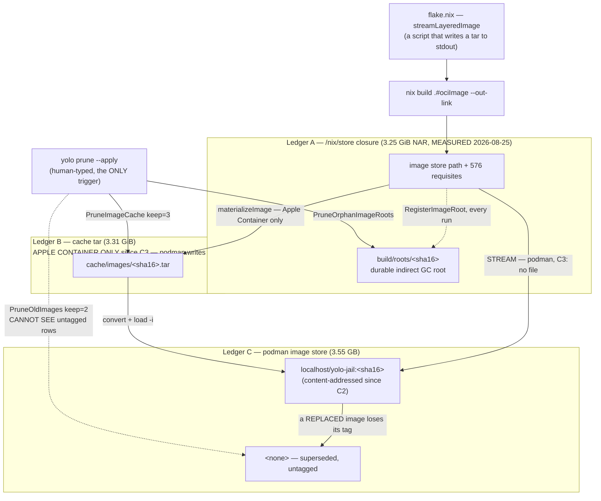

# Minimal disk footprint — reclamation that waits for a human is not reclamation

**Status:** DESIGN, 2026-08-25 — **with two questions ruled and one half of [§10](#10-sequencing--what-i-would-build-in-order) step 3 shipped the same day (`be7b8591`); a third question's NUMBER half, plus step 1 of [§10](#10-sequencing--what-i-would-build-in-order), shipped 2026-09-06.** [OQ-DF1](#112-open-questions) was ruled *"stream, keep zero tars"* and [`image-staging-vs-baking.md`](../reference/image-staging-vs-baking.md)'s **C3** implements it: on podman the load path writes no tar at all, so Ledger B's growth term is zero going forward. **[OQ-DF3](#OQ-DF3)'s NUMBER half is now RULED, 2026-09-06:** `--keep-images` (`DefaultKeepImages`, `internal/prune/autoreap.go`) stays 2, unchanged, reasoned as a small undo-buffer margin on top of the sentinel-derived liveness veto rather than the sole safety mechanism — and its TRIGGER half ships alongside it: the launch path now calls the exact same veto-protected `PruneOldImages` `yolo prune --apply` always could, debounced to at most once every 24h (`AutoReapOldImages`, `internal/prune/autoreap.go`; wired at `internal/cli/run/run.go` right after the image load succeeds; escape hatch `YOLO_NO_AUTO_IMAGE_REAP=1`). **[OQ-DF3](#OQ-DF3)'s REACH half SHIPPED 2026-09-08**, the last of its three: `mkOciImage` bakes an owner label into the image config (`flake.nix`, `config.Labels`) and `PruneOldImages` now lists candidates as a UNION of the repository-name probe it always had and a `--filter label=` probe — two queries because podman refuses both in one (`cannot specify an image and a filter(s)`, MEASURED) — so an image that has lost its tag is still provably yolo's and is reaped like any other. Rows that predate the label carry no such evidence and are left alone permanently. Everything else here is still design — nothing else built beyond the above and what [`../plans/storage-lifecycle.md`](../plans/storage-lifecycle.md) [§1](../plans/storage-lifecycle.md#1-root-the-running-images-closure--first-everything-depends-on-it)–[§4](../plans/storage-lifecycle.md#4-log--overlay--cache-lifecycle--independent-lower-priority) already shipped, and what *it* shipped made a GC *safe* without making one *happen*. **The pre-C3 tar backlog is untouched**, [OQ-DF2](#OQ-DF2)/DF4 are open (DF2 for Ledger B/Apple Container; see the note under it for why Ledger C did not wait on it), and Apple Container still writes a tar per store path. C2 armed `PruneOldImages` for the first time, so a dedup and a liveness veto shipped with it and `4064f720` made that veto fail SAFE — which retired the *safety* half of [OQ-DF3](#OQ-DF3) in advance of the NUMBER/TRIGGER halves above ([§11.2](#112-open-questions) [OQ-DF3](#OQ-DF3)). The re-measurement both docs were waiting on has also been taken: [`image-staging-vs-baking.md`](../reference/image-staging-vs-baking.md) [the cost model](../reference/image-staging-vs-baking.md#cost-model).

**The short version.** Every reclaimer yolo owns works; nearly none of them ever run on their own, because all seventeen — every exported `Prune*`/`Purge*`/`Sweep*`/`Reap*` in `internal/prune` (fourteen), plus `RunNixStoreGC`, `HardlinkDuplicateFiles`, and `capture.PruneSupersededCaptures` — were, as of 2026-08-25, reachable only from a human typing `yolo prune` (verified that day — one non-test call site, `internal/prune/prunecmd.go`, reached only from the CLI dispatch table at `internal/cli/dispatch.go:30`; the seventeenth was added there 2026-09-04 by [`install-capture.md`](../plans/install-capture.md) slice 5, under the same single trigger, and it is the first that does not live in `internal/prune`). **One of the seventeen stopped being human-only on 2026-09-06**: `PruneOldImages` (Ledger C) now also runs from the launch path itself, debounced — see below and [§11.2](#112-open-questions) [OQ-DF3](#OQ-DF3). So the fix is not a better sweeper — it is moving the delete to the process that made the bytes: **the load path should never leave behind what it does not need**, with `yolo prune` demoted from primary mechanism to crash-recovery backstop for everything it has not yet taken over. The three ledgers a loaded image occupies are the store closure (rooted, bounded, correct); the cache tar (**zero-growth on podman since C3** — nothing writes one — but still **unbounded on Apple Container**, whose converters need a real file, and with the ~485 GiB pre-C3 backlog untouched on disk); and podman's own image store (**a reclaimer that now fires ON ITS OWN, debounced to once a day, and since 2026-09-08 sees a nameless row too — provided the image carries the owner label** — C2 armed the pass, [OQ-DF3](#OQ-DF3)'s trigger half is what actually calls it now, and the `<none>` class the repo-name filter structurally misses is the residual reach question [OQ-DF3](#OQ-DF3) still has open). **All three of those sentences were rewritten** — twice: on 2026-08-25 when C2 and C3 shipped, and on 2026-09-06 for Ledger C's own trigger; [§3.2](#32-ledger-b--the-cache-tar-bounded-to-zero-on-podman-since-c3-unbounded-on-apple-container) and [§3.3](#33-ledger-c--podmans-own-image-store-and-the-nameless-row) are the bodies they now agree with.

**The most important section is [§5](#5-invariants--what-must-not-break)** (the invariants). Automating a sweep is what turns storage-lifecycle's "safe at an arbitrary moment" from an aspiration into a load-bearing requirement, and [§5](#5-invariants--what-must-not-break) is where that bill comes due.

**Scope note.** This doc owns the *mechanism* — what gets deleted, when, by whom, and what the offline fallback becomes. The *measurement and the verdict* are [`image-staging-vs-baking.md`](../reference/image-staging-vs-baking.md) [the tar history](../reference/image-staging-vs-baking.md#the-tars-that-are-no-longer-written)'s, and that doc's [OQ-5](../reference/image-staging-vs-baking.md#why-its-this-way) ruling is what this one executes. **Split 2026-09-06:** the cross-store lever ranking, the *backfill* disposition (automatic vs. offered, one-time vs. recurring — the bytes each fix stopped producing but did not remove), and the stores [§8](#8-what-this-does-not-cover) declines — yolo's own never-collected `/nix/store` outputs, the cache purge's trigger, the vendors' version dirs — are [`disk-levers-and-backfill.md`](disk-levers-and-backfill.md)'s — including [`yolo stores`](disk-levers-and-backfill.md#55-yolo-stores--the-inventory-including-what-nothing-reclaims), the machine-wide inventory of every store and its size, which covers the ones no reclaimer here owns. This doc keeps Ledgers A–C and [OQ-DF2](#OQ-DF2)–[OQ-DF4](#OQ-DF4); where that doc reaches one of this doc's knobs it defers here by ID.

> [!NOTE]
> **Citations into [`image-staging-vs-baking.md`](../reference/image-staging-vs-baking.md) are by named section and ruling ID (OQ-N), never by line number.** That doc is now a system reference: its numbered sections and its risk table are gone. This doc's `C2`, `C3` and `C5` mean its [content-addressed image ref](../reference/image-staging-vs-baking.md#the-content-addressed-image-ref), its [streaming load](../reference/image-staging-vs-baking.md#streaming-into-the-runtime) and its lean image ([store-delivered packages](../reference/image-staging-vs-baking.md#store-delivered-packages)); its `R3`/`R4`/`R7` are resolved in the next note.
>
> **Its risk IDs are always spelled `image-staging` R3/R4/R7,** because [§9](#9-risks) below mints its own R1–R8 and the two sets do not agree. That doc's risk table no longer exists; what the IDs meant survives in its body. **R3** is the caution that per-config tags make `--keep-images 2` the wrong retention rule ([the content-addressed image ref](../reference/image-staging-vs-baking.md#the-content-addressed-image-ref)); **R4** the caution that streaming removes the offline safety net ([a failed build is fatal](../reference/image-staging-vs-baking.md#a-failed-build-is-fatal), whose fallback still reads whatever tars exist); **R7** the one-machine caveat over its [cost model](../reference/image-staging-vs-baking.md#cost-model). A bare `R5` in this file is always [§9](#9-risks)'s.

**Reads with:**

- [`image-staging-vs-baking.md`](../reference/image-staging-vs-baking.md) — the [OQ-5](../reference/image-staging-vs-baking.md#why-its-this-way) ruling this doc executes, its [the tar history](../reference/image-staging-vs-baking.md#the-tars-that-are-no-longer-written) measurement, and the C2/C3 cost model this doc's sequencing has to interleave with.
- [`../plans/storage-lifecycle.md`](../plans/storage-lifecycle.md) — the shipped GC work ([§1](#1-the-ruling-and-what-the-bug-actually-is)–[§4](#4-a-budget-not-a-retention-count)) that the ruling calls "nowhere near enough"; [§3](#3-the-three-ledgers) below says exactly where it stops.
- [`../plans/cache-relocation.md`](../plans/cache-relocation.md) — the settled threat model (yolo does not manage host symlinks/mounts) that bounds anything proposed here, and the icebox questions this ruling partly moots.
- [`storage-and-config.md`](storage-and-config.md) — where these bytes live, and the state/config separation the budget has to respect.
- [`../plans/handoff-cachix-cache.md`](../plans/handoff-cachix-cache.md) — the binary cache that makes *deletion cheaper to undo*, which is a complement to this doc, not an alternative to it.
- [`disk-levers-and-backfill.md`](disk-levers-and-backfill.md) — the sibling split out 2026-09-06: every store ranked by measured bytes, the automatic-vs-offered rule for the backlogs this doc's fixes left on disk, and the finding that nothing on the machine ever runs `nix store gc` against yolo's own outputs.

---

## 1. The ruling, and what the bug actually is

The maintainer ruled on 2026-08-25, on [`image-staging-vs-baking.md`](../reference/image-staging-vs-baking.md) [OQ-5](../reference/image-staging-vs-baking.md#why-its-this-way):

> "bug, for sure. I see no reason to keep any of this around. I will be addressing this issue soon. we need to use minimal disk space. put an item on the roadmap for this and write a design doc using the skill. we've done some GC work, but it's nowhere near enough."

The interesting word is **"bug"**, because the obvious reading — "disk filled up" — is not a bug, it is a consequence. Disk fills up on a machine that builds container images sixty percent of commits ([`image-staging-vs-baking.md`](../reference/image-staging-vs-baking.md) [what moves the image](../reference/image-staging-vs-baking.md#what-moves-the-image) — restated here from the 2026-08-15 measurement, not re-measured; since the binaries left the image the rate is far lower). The bug is structural, and it is this:

**Reclamation exists, is correct, is tested, and has no trigger.**

Verified 2026-08-25 against `486a13bb`, by grepping every exported reclaimer in `internal/prune` for non-test callers outside `prunecmd.go`: **there are none.** Every reclaimer's only production entry point is `internal/prune/prunecmd.go` (`PruneHostArchive` is the one indirection, reached from `PruneHostArchiveBuckets` at `internal/prune/hostarchive.go:57` — still only from `prunecmd.go`). That file's `Run` has exactly one caller, `internal/cli/commands.go:240`, reached only from `internal/cli/dispatch.go:30` (`"prune": runPrune`). There is no timer, no hook, no launch-path call, and no `just` recipe — `rg -n "prune" Justfile scripts/ integration/` returns nothing at all, which also means the whole surface has **zero integration coverage**.

> [!NOTE]
> **This is now stale for exactly ONE reclaimer, since [OQ-DF3](#OQ-DF3)'s trigger half shipped 2026-09-06.** `PruneOldImages` and `ProtectedImageTags` (Ledger C, [§3.3](#33-ledger-c--podmans-own-image-store-and-the-nameless-row)) now have a SECOND production caller: `internal/prune/autoreap.go`'s `AutoReapOldImages`, invoked from the launch path itself (`internal/cli/run/autoreapimages.go`'s `autoReapOldImages`, called at `internal/cli/run/run.go` right after the image load succeeds). That is the one exception to "reachable only from a human typing `yolo prune`" this doc now has; see [§11.2](#112-open-questions) [OQ-DF3](#OQ-DF3) for the ruling and the debounce that keeps it from re-probing podman on every launch. Every OTHER reclaimer named in this paragraph is unchanged — still gated on `yolo prune` alone.

So the entire disk-reclamation capability of this project is gated on a human noticing.

### 1.1 What "a human noticing" is worth, measured

This is not a hypothetical failure mode; the repo has been running the experiment for a month and the result is unusually clean.

`yolo prune` prints a hint whenever `cache/images` exceeds 20 GiB (`imagesHintThreshold = 20 * (1 << 30)`, `internal/prune/prunecmd.go:209`, emitted at `:274-304`). It appears on a plain dry-run, needs no flag, and survives redirection. It has been true continuously since **2026-07-23 09:12**, the moment the cache crossed the threshold at 22.01 GiB (MEASURED 2026-08-25, by accumulating the tars in mtime order).

The sharpest available evidence is not "the hint was ignored" — it is that **the exact artifacts the hint was about are still on disk, byte for byte.** [`image-staging-vs-baking.md`](../reference/image-staging-vs-baking.md) [the tar history](../reference/image-staging-vs-baking.md#the-tars-that-are-no-longer-written) measured 125 tars totalling 404.4 GiB on 2026-08-15. Measured today in the same directory:

```console
$ stat -c '%Y %s' *.tar | awk -v cut=$(date -d '2026-08-16' +%s) '$1<cut{s+=$2;n++} END{printf "n=%d GiB=%.2f\n",n,s/1073741824}'
n=125 GiB=404.45
```

Same 125 files, same 404 GiB, ten days later. Not one was reclaimed. A keep-3 retention rule that never runs is indistinguishable from no retention rule, and that is the defect: **a mechanism whose only trigger is a human noticing is not a mechanism, it is a suggestion.**

### 1.2 Where the shipped GC work stops — the precise referent for "nowhere near enough"

"Nowhere near enough" needs a referent or it is just agreement. Here it is.

[`../plans/storage-lifecycle.md`](../plans/storage-lifecycle.md) was written after a real incident: a host `nix-collect-garbage` reclaiming ~2.5 TiB swept a **running jail image's own store closure**, leaving 235 of 467 `/bin` symlinks dangling (`storage-lifecycle.md:3-9`). Its [§1](#1-the-ruling-and-what-the-bug-actually-is)–[§4](#4-a-budget-not-a-retention-count) shipped 2026-07-22 and delivered exactly four things:

| § | What shipped | Evidence, checked 2026-08-25 |
| :--- | :--- | :--- |
| [§1](#1-the-ruling-and-what-the-bug-actually-is) | A durable per-image nix GC root, `build/roots/<sha16>`, re-asserted every run | `internal/image/gcroot.go:38-77`; called at `internal/image/autoload.go:549` |
| [§2](#2-measured-2026-08-25) | `yolo check` **warns** when the host daemon's `min-free == 0` — yolo never edits `nix.conf` | `internal/cli/check/section_autogc.go` |
| [§3](#3-the-three-ledgers) | Opt-in, bounded, rooting-aware `yolo prune --nix-gc`; refuses in-jail | `internal/prune/nixgc.go:15-41`; gating at `internal/prune/prunecmd.go:647-685` |
| [§4](#4-a-budget-not-a-retention-count) | Lifecycle sweeps for derived junk: dangling out-links, orphaned agent staging, age-purged agent logs | `internal/prune/{staleoutlinks,agentstaging,agentlogs}.go` |

Read that column again with the ruling in hand. **Every one of those four made a GC *safe*. None of them made a GC *happen*.** [§1](#1-the-ruling-and-what-the-bug-actually-is) creates roots (it adds a protection, not a reclaim). [§2](#2-measured-2026-08-25) is explicitly detect-and-warn. [§3](#3-the-three-ledgers) is opt-in and default-OFF. [§4](#4-a-budget-not-a-retention-count) sweeps classes that were never the bulk.

And storage-lifecycle knew this: its own consumer map already labels the tars `PruneImageCache(keep=3)` via `yolo prune` **(manual)** (`storage-lifecycle.md:134`). It recorded the exposure rather than closing it.

> [!IMPORTANT]
> **The gap between "safe to run" and "runs" is the whole of the new work.** Everything in [§4](#4-a-budget-not-a-retention-count)–[§10](#10-sequencing--what-i-would-build-in-order) below is an attempt to close that one gap without spending the safety that [§1](#1-the-ruling-and-what-the-bug-actually-is)–[§4](#4-a-budget-not-a-retention-count) bought.

---

## 2. Measured, 2026-08-25

All measurements below were taken by me in this development jail on 2026-08-25 against `486a13bb`, labelled **MEASURED** / **NOT MEASURED** in the manner of [`image-staging-vs-baking.md`](../reference/image-staging-vs-baking.md) [the tar history](../reference/image-staging-vs-baking.md#the-tars-that-are-no-longer-written). Every figure it restates from that doc I re-took rather than copied.

> [!IMPORTANT]
> **This is the PRE-C3 series, and it is retained as dated evidence rather than as a forecast.** C3
> shipped later the same day (2026-08-25) under the [OQ-DF1](#112-open-questions) ruling, so **the podman growth term
> — the `cache/images` rows below — goes to zero from that change forward**: nothing writes a tar on
> the podman happy path any more. The 480.71 GiB level and the +7.63 GiB/day rate are what the
> defect cost up to the fix; they are exactly the numbers that argued for it. The **backlog** those
> rows measure is still on disk (C3 stopped creating, it did not sweep — [§10](#10-sequencing--what-i-would-build-in-order)), and the `/nix/store`
> and device rows are unaffected by C3 entirely.
>
> **The podman row is superseded by a different change — C2, not C3 — and by a larger factor.** C3
> zeroed the tar rows; C2 replaced the single mutable `:latest` with a permanent per-config content
> tag, so superseded images are now *retained* rather than orphaned and the store holds seven images
> where this table recorded two. Read the `podman image store` row as **PRE-C2**, and
> [`image-staging-vs-baking.md`](../reference/image-staging-vs-baking.md) [the cost model](../reference/image-staging-vs-baking.md#cost-model) as the post-C2 state. The two
> supersessions run in opposite directions — C3 removed a growth term, C2 added one — which is
> exactly the trade [OQ-DF3](#OQ-DF3)'s retention number has to price.

> [!WARNING]
> **There are two image tar caches on this device and [`image-staging-vs-baking.md`](../reference/image-staging-vs-baking.md) [the tar history](../reference/image-staging-vs-baking.md#the-tars-that-are-no-longer-written) measured one of them.** Inside this jail `~/.local/share/yolo-jail` is a bind of `<ws>/.yolo/home/local/share/yolo-jail` — the **nested jail's** state dir, inside the repo working tree. The **host's** cache is mounted separately at `~/.cache`. [the tar history](../reference/image-staging-vs-baking.md#the-tars-that-are-no-longer-written)'s numbers are the nested one. Both are measured below; the true total is **606 GiB, not 404 GiB**.

### 2.1 Levels

| Thing | 2026-07-22 | 2026-08-15 | **2026-08-25** | Label |
| :--- | :--- | :--- | :--- | :--- |
| Nested `cache/images` (the path [the tar history](../reference/image-staging-vs-baking.md#the-tars-that-are-no-longer-written) measured) | 3 tars, 9.5 GiB | 125 tars, 404.4 GiB | **148 tars, 480.71 GiB**, mean **3.248 GiB** | MEASURED |
| ↳ oldest / newest tar | — | — | **2026-07-22 15:00** / **2026-08-25 11:39** | MEASURED |
| ↳ orphan `.tmp` from crashed materialize | — | — | **0** (148 of 148 are `*.tar`) | MEASURED |
| ↳ *reconciliation:* [`image-staging-vs-baking.md`](../reference/image-staging-vs-baking.md) [the cost model](../reference/image-staging-vs-baking.md#cost-model) counts **149** | — | — | the 149th is `de22e97910302cee.tar`, written 19:17:21 by the last pre-C3 load, between this pass and that one | MEASURED |
| **Host** `cache/images` (at `~/.cache/images`) | — | not distinguished | **36 tars, 125.41 GiB**, mean **3.484 GiB** | MEASURED (new) |
| **Both caches on this device** | — | — | **184 tars, 606.12 GiB** | MEASURED (new) |
| `/nix/store` | — | 209 GB | **659 GiB**, **38 441** entries | MEASURED |
| Root device `/dev/mapper/root` (btrfs; carries store, home, `/tmp`, `/workspace`) | 3.7 T, 45 % | 3.7 T, 2.5 T, 69 % | **3.7 T, 3.1 T used, 84 %, 608 G free** | MEASURED |
| Realized `*-stream-yolo-jail` store paths | — | 212 | **265** | MEASURED |
| Loaded image's `/nix/store` closure (`nix path-info -S`) | ~3.09 GiB (`storage-lifecycle.md:55`) | — | **3 491 272 560 B = 3.25 GiB** NAR, **577** paths | MEASURED |
| Loaded-image cache tar (`build/last-load-size`) | ~3.14 GiB | 3.28 GiB | **3 554 560 000 B = 3.31 GiB** | MEASURED |
| Load sentinel `build/last-load-podman` | — | — | **10 entries** (the LRU cap) | MEASURED |
| **podman image store** | — | **NOT MEASURED** | **PRE-C2: 2 images, 6.391 GB**; 0 containers, 0 volumes. Superseded the same day — after C2 the same command returns **eight rows over seven images** ([`image-staging-vs-baking.md`](../reference/image-staging-vs-baking.md) [the cost model](../reference/image-staging-vs-baking.md#cost-model)) | MEASURED (first time), then PRE-C2 |
| Apple Container image store | — | — | **NOT MEASURED** — no `container` runtime in this jail | NOT MEASURED |
| Durable image GC roots on the host, and the union closure they pin | — | — | **NOT MEASURED** — `build/roots` is host-side only and does not exist in this jail ([§3.1](#31-ledger-a--the-nixstore-closure-correct-leave-it-alone)); only an upper bound on the closure is derivable | NOT MEASURED |

### 2.2 Rates — the numbers to argue from

| Series | Window | Δ | Rate |
| :--- | :--- | :--- | :--- |
| Nested `cache/images` | 08-15 → 08-25 (10 d) | +23 tars, **+76.26 GiB** | **+7.63 GiB/day** |
| Nested `cache/images` | 07-22 → 08-25 (34 d) | +145 tars, +471.2 GiB | +13.86 GiB/day |
| ↳ same, **excluding the two spike days** | 34 d | +68 tars, +220.4 GiB | **+6.48 GiB/day** |
| `/nix/store` | 08-15 → 08-25 (10 d) | +450 GiB | **+45.0 GiB/day** |
| Root device used | 08-15 → 08-25 (10 d) | 69 % → 84 % ≈ +550 GiB | **≈+55 GiB/day** |
| **Headroom at the 10-day device rate** | — | 608 GiB free | **≈11 days to 100 %** |

Three things the rates say that the levels do not:

1. **The tar growth did not decelerate.** 16.5 → 7.6 GiB/day looks like a slowdown, but 2026-07-27 (40 tars) and 2026-08-02 (37 tars) alone account for **77 tars / 250.8 GiB — 52 % of the entire cache in two days**. Strip them from the 34-day Δ (145 − 77 tars, 471.2 − 250.8 GiB) and the rate is 6.48 GiB/day, within 18 % of the recent 7.63. The honest model is a **~7 GiB/day floor plus ~125 GiB per spike day**, not a decaying curve. A design that only handles the floor will be defeated by one bad afternoon.
2. **The store, not the tars, is now the larger line item.** `/nix/store` grew 450 GiB in ten days — six times the nested tar cache's 76 GiB. [§8](#8-what-this-does-not-cover) says why this doc nonetheless does not claim it.
3. **Two unrelated instruments agree, so 659 GiB is real.** Store +45.0 and nested tars +7.63 sum to 52.6 GiB/day against a separately-measured device growth of ≈55 GiB/day. That the residual is small is the cross-check that the store figure is not a `du` artifact.

### 2.3 Caveats, stated rather than buried

- **Every number is from one machine — this jail.** This is the same limitation [`image-staging-vs-baking.md`](../reference/image-staging-vs-baking.md#cost-model) states over its cost model, and it applies unchanged. It is enough to establish that the defect is real and roughly how fast it bites; it is not a population estimate.
- **The 2026-08-15 `/nix/store` "209 GB" does not record its unit or command.** I read it as `du -sh` (GiB), because the device cross-check in [§2.2](#22-rates--the-numbers-to-argue-from) closes to ~5 % that way and does not otherwise.
- **The 08-15 device figure is a `df -h` rounding** ("2.5 T", "69 %"). The ≈+550 GiB is derived from the percentage against the precise total; from the rounded "2.5 T" it is ≈+600 GiB. The runway is 11–12 days either way, which is the only thing the number is load-bearing for.
- **"100 % reclaimable" in `podman system df` is measured on a nested podman with zero running containers.** It correctly reports that nothing holds these images *right now*; it is not a claim that a real host's running jail image is reclaimable. The orphaned `<none>` rows in [§3.3](#33-ledger-c--podmans-own-image-store-and-the-nameless-row) — **three** of them as of the post-C2 pass, not the one this console block shows — are orphaned regardless.

### 2.4 Re-measured 2026-09-02 — the backlog is gone here, and the device kept filling anyway

Same jail, eight days later; three facts that move the questions below.

- **The nested `cache/images` backlog was reclaimed: 3 tars, 10 GiB** (was 148 / 480.71 GiB),
  newest tar mtime 2026-08-25 19:17 and nothing since — C3 doing its job. Three is exactly
  `ImageCacheKeep`'s default, which is the fingerprint of a **manual `yolo prune --apply`** having
  run. That is **field evidence for [OQ-DF2](#OQ-DF2)'s leaning (iii)**: the recovery tool works when a human
  reaches for it — and it is exactly the "reclamation that waits for a human" the title objects
  to, so it argues *for* this doc, not against it. [§10](#10-sequencing--what-i-would-build-in-order)'s "pre-C3 backlog untouched" is discharged
  for this machine's nested cache; the host-side 125.41 GiB cache was **NOT observable** from this
  jail today (`~/.cache/yolo-jail` holds 164 KiB of loophole remnants; the mount [§2](#2-measured-2026-08-25)'s warning
  described is not present in this session), so that backlog's fate is unknown.
- **The device lost ~92 GiB of free space in those same eight days** — 87 % full, 516 GiB free,
  vs. 84 % / 608 GiB on 08-25 — **despite** the ~470 GiB reclaim, and `/nix/store` grew only
  +6 GiB (659 → 665). So the current growth driver is in **none of the three ledgers**: something
  else on the shared block device ([`storage-lifecycle.md`](../plans/storage-lifecycle.md)'s
  scope does not cover it either). **That is a new input to [OQ-DF4](#OQ-DF4)**: a budget scoped to yolo's
  ledgers can be met while the device fills at ~11.5 GiB/day, which is roughly the pre-C3 rate —
  the doc that reaches "minimal disk space" needs at least a named pointer at the untracked
  remainder, even if the mechanism stays out of scope.
- **Ledger C observations do not survive a jail restart**: this container instance's podman store
  is empty (`GraphRoot=/var/lib/containers/storage`, outside the persistent home), so [§3.3](#33-ledger-c--podmans-own-image-store-and-the-nameless-row)'s
  eight-row/three-nameless snapshot cannot be re-taken from here. Ledgers B and C have now been
  *observed* drifting fully independently on one machine — 480 GiB in B while C was empty — which
  is the separateness [OQ-DF2](#OQ-DF2)/[OQ-DF3](#OQ-DF3) already assume, measured rather than argued.

---

## 3. The three ledgers

A single loaded image is stored three times, in three places, with three different owners and three different reclaim stories. This is the structural map everything below argues from.



> [!NOTE]
> **Two edges in that diagram changed on 2026-08-25 and the map is drawn as it is NOW.** C3 shipped:
> on podman the closure streams straight into `podman load` and Ledger B is never written, so its
> growth term is **zero** going forward — the accumulated tars are the pre-C3 backlog, which C3
> deliberately did not sweep (that is [§10](#10-sequencing--what-i-would-build-in-order)'s work). C2 shipped: the tag is content-addressed, so a
> *superseded* image is no longer orphaned every time another workspace launches — it goes `<none>`
> only when the tag it owns moves to a newer image, which is either a rebuilt store path or a
> re-stream of the same one ([§3.3](#33-ledger-c--podmans-own-image-store-and-the-nameless-row)'s correction). [§2](#2-measured-2026-08-25)'s measured series is the PRE-C3 series and is
> retained as dated evidence.

### 3.1 Ledger A — the `/nix/store` closure. Correct; leave it alone.

**Writer:** `nix build .#ociImage` via the host daemon. **Pinned by:** an indirect GC root at `build/roots/<sha16>`, where `sha16` is the first 16 hex of `sha256(storePath)` — the *same key* as the cache tar, deliberately, so the two can never drift (`internal/image/image.go:286-293`, `internal/image/gcroot.go:22-29`). Re-asserted on **every** run, including when the image was already loaded, so a reaped root self-heals (`internal/image/autoload.go:540-549`). **Deleter:** `nix store gc` only, and only via the opt-in `yolo prune --nix-gc`.

This ledger is the one part of the system that already works the way the whole system should. The ordering is right — `RegisterRoot` at `autoload.go:549` runs *before* `os.Remove(outLink)` at `:550`, so there is no unrooted window — and reclamation is triple-guarded (tri-state liveness, an LRU-10 protected set, a 3600 s age floor, `internal/prune/imageroots.go`).

> [!NOTE]
> **The store's growth is not a leak here.** A durable root per distinct loaded image closure is roots doing their job, and how many of them exist on the host is **NOT MEASURED** ([§2.1](#21-levels)): `build/roots` is host-side only, and `RegisterRoot` is a no-op in-jail (`internal/image/autoload.go:117-121`), so this jail's own `build/` holds no `roots/` directory at all to count. The store grows because nothing collects *unrooted* paths, which is the host's `min-free` setting — [§8](#8-what-this-does-not-cover).

### 3.2 Ledger B — the cache tar. **Bounded to zero on podman since C3; unbounded on Apple Container.**

**Writer:** `materializeImage` (`internal/image/autoload.go:691`), streaming the store path (which on Linux *is* the executable) into `cache/images/<sha16>.tar`. **Deleter:** `PruneImageCache(dir, keep, apply)` — sorts tars by mtime newest-first, drops the tail beyond `keep`, and always sweeps `*.tmp` regardless of `keep` (`internal/prune/imagecache.go:15`). Default `keep=3` (`internal/prune/prunecmd.go:138`).

**Since C3 (2026-08-25) there is exactly ONE caller left**, the Apple Container arm at
`internal/image/autoload.go:494-521`, reached only when `ImageLoadStdinCmd` says the runtime cannot
take a pipe (`internal/image/image.go:55-60`). **On podman nothing writes this ledger at all** —
asserted on disk, not on which function ran (`internal/image/streamload_test.go:60`).

**Bounded by the write path? On podman, yes — by not writing.** Elsewhere, no: `AutoLoadImage` still
never *deletes* an old tar. Verified 2026-08-25: `rg -n "os.Remove|RemoveAll" internal/image/autoload.go internal/image/image.go` returns removals of `outLink`, `tmpFile`, and the Apple Container `ociDir`/`ociTar` only — **never a cache tar**. So one multi-GB tar still accumulates per distinct nix store path on Apple Container, forever, until a human types `yolo prune --apply` — and the ~485 GiB already on the maintainer's machine is untouched, because C3 stopped the *creation* and deliberately left the sweep to [§10](#10-sequencing--what-i-would-build-in-order).

Two facts about this ledger matter enormously for [§4](#4-a-budget-not-a-retention-count) and [§6](#6-the-offline-safety-net-honestly), and they pull in opposite directions:

- Deleting a tar is **always safe for a running jail** — the tar is a one-shot load artifact, and the runner depends on Ledger A's closure. The code says so at `internal/prune/prunecmd.go:294-303`. This is what licenses aggression.
- The tar is also the **offline fallback** when a build fails and no image is loaded (`newestTars`, the loop at `internal/image/autoload.go:361-375`). C3 kept that consumer working on whatever tars exist — it removed the writer, not the reader (`TestBuildFailureFallbackStillLoadsAnExistingTar`). This is what [`image-staging-vs-baking.md`](../reference/image-staging-vs-baking.md#a-failed-build-is-fatal) R4 defends. [§6](#6-the-offline-safety-net-honestly) resolves it.

> [!WARNING]
> **`PruneImageCache`'s keep-N eviction branch (`internal/prune/imagecache.go:59-69`) is not executed by any test.** Checked 2026-08-25: there is no `imagecache_test.go`, and the two `Run`-level tests that touch tars each stage one tar against `keep=3`, so the tail-drop never fires. The `.tmp` sweep is covered; the eviction is not. This is the untested branch guarding the largest artifact class, and any design that makes it *automatic* is promoting untested code to the launch path.

### 3.3 Ledger C — podman's own image store, and the nameless row

> [!IMPORTANT]
> **The heading used to read "The one with no reclaimer for a nameless row", and that is no longer
> true** — [OQ-DF3](#OQ-DF3)'s REACH ruling gave nameless rows a reclaimer by baking an OWNER LABEL
> into the image, which survives the loss of the tag. Renamed rather than annotated, because a
> heading that states a fact is the place a reader stops checking.
>
> **What the section below still describes correctly is the SHAPE of the blind spot**, and one live
> remnant of it: a label marks only images built AFTER it shipped, so every `<none>` row already on
> a machine is still unattributable and is left alone permanently. That remnant is real, is
> surfaced by `yolo stores` as a class nothing reclaims, and is why the repository-name probe had
> to survive beside the label probe rather than being replaced by it.

This is the answer to "which of the three does yolo have no reclaimer for", and it is worse than "no reclaimer" — there is a reclaimer that could not see its targets, and (since C2) can now see rather more than it used to.

**The pre-C2 mechanism, in the past tense — because it is the evidence the WARNING below rests on.** `PruneOldImages` runs `podman images --format "{{.ID}} {{.Repository}}:{{.Tag}} {{.CreatedAt}}" yolo-jail` (`internal/prune/probes.go:265`). That trailing `yolo-jail` is a **repository-name filter**, and it still is. Before C2 there was exactly one tag on this machine, `localhost/yolo-jail:latest`, so a superseded load was *untagged*: the next `podman load` retagged `:latest` onto the new image and orphaned the old one as `<none>`, which never matched the filter. **MEASURED PRE-C2**, live in this jail earlier on 2026-08-25:

```console
$ podman images
REPOSITORY           TAG       IMAGE ID      CREATED       SIZE
localhost/yolo-jail  latest    226a6fd81f36  5 hours ago   3.55 GB
<none>               <none>    f3f0380b0645  17 hours ago  3.55 GB

$ podman images --format "{{.ID}} {{.Repository}}:{{.Tag}}" yolo-jail
226a6fd81f36 localhost/yolo-jail:latest          # the <none> row is invisible

$ podman system df
TYPE     TOTAL  ACTIVE  SIZE      RECLAIMABLE
Images   2      0       6.391GB   6.391GB (100%)
```

`PruneOldImages` could only ever see **one** row there, so `keep=2` never triggered and the dangling 3.55 GB was never reclaimed by yolo. Both of those image IDs are `<none>` today — but only one of them was orphaned by the pre-C2 mechanism this paragraph describes. `f3f0380b0645` is the genuine pre-C2 orphan: `podman image inspect … --format '{{.NamesHistory}}'` returns `[localhost/yolo-jail:latest]`, the only name it ever held. `226a6fd81f36` still held `:latest` in the console block above and lost it *afterwards*, to a C2-era load; its history is `[localhost/yolo-jail:latest localhost/yolo-jail:c2probe000000001 localhost/yolo-jail:d00dfeedcafe1234]`. The distinction matters because the mechanism that orphaned `226a` — `pointLatestAt` moving the legacy alias, `internal/image/autoload.go:493` and `:581-589` — is **still live**. See [`image-staging-vs-baking.md`](../reference/image-staging-vs-baking.md#the-content-addressed-image-ref) for how the `:latest` alias moves. There was also no other path, and there still is not: `rg` over `internal/` excluding tests finds no `podman image prune`, no `system prune`, and no `rmi` of a dangling ID — the only `rmi` in the tree is `probes.go:299`, *inside the function whose filter hid the target*.

**The post-C2 shape, in the present tense.** Every config now keeps a **permanent** content tag (`image.JailImageRef`), so the repo-name filter returns **one row per NAME** rather than one row in total — the newest image appears twice (content tag + `:latest`), and each additional config adds a row of its own. **`keep=2` can therefore fire**, which is precisely why C2 had to ship a dedup by image ID and a liveness veto alongside it, and why `4064f720` then had to make that veto fail SAFE (`internal/prune/probes.go:211-263`; `ProtectedImageTags` returns `(tags, known)` and `PruneOldImages` declines when `known` is false). Measured after C2 in [`image-staging-vs-baking.md`](../reference/image-staging-vs-baking.md) [the cost model](../reference/image-staging-vs-baking.md#cost-model): four content tags coexisting, five named rows over four images.

**What is still unreclaimable is a smaller class, and it has not gone away.** The general rule is simply: **an image goes `<none>` when the last name it held moves to another image.** **Three** things still do that, and the third was missing from this list until 2026-08-25.

- **(1) The pre-C2 residue above** — a pre-C2 load's only name was `:latest`, so when `:latest` moved it lost everything. Only `f3f0380b0645` is this case; `226a6fd81f36` belongs to (1b).
- **(1b) A `:latest` move on a machine that is already post-C2** — the same *event*, a different *era*. `pointLatestAt` (`internal/image/autoload.go:493`, the function at `:581-589`) still runs `podman tag` on every load, which strips the alias from whatever held it; that is what finally orphaned `226a6fd81f36`, **after** C2 shipped. The mechanism is not extinct. What C2 removed is narrower: a normally-loaded image now always holds a content tag as well, so losing `:latest` no longer leaves it nameless.
- **(2) Post-C2, re-streaming the same store path** — mints a new image ID because the flake bakes `created = "now"` (`flake.nix:982`), and hands the content tag to the newer build.
- **(3) The degraded build-failure fallback — still a live producer of `:latest`-only images, and the one place (1b) still bites.** When the build fails or is skipped and no image is in the runtime, `AutoLoadImage` loads the newest cached tar with `ImageLoadCmd` (`internal/image/autoload.go:370`); the code notes that the tar's own RepoTags name the loaded image and that the flake bakes `tag = "latest"` (`internal/image/autoload.go:358-360`, `flake.nix:1103`), so what lands has **exactly one name**. The next normal load moves `:latest` off it and the row goes `<none>` — the pre-C2 shape, reproduced on a current machine. Rare by construction (it needs a failed build **and** an empty runtime store, [§6](#6-the-offline-safety-net-honestly)), but not extinct, and the row it leaves is invisible to the repo-name filter like the other two. **[OQ-DF3](#OQ-DF3)'s reach question has to price this class too**, since it is the only path by which a post-C2 machine still manufactures the very orphan C2 is credited with ending.

**Only (2) is cheap.** [`image-staging-vs-baking.md`](../reference/image-staging-vs-baking.md) [the cost model](../reference/image-staging-vs-baking.md#cost-model) measures such a re-stream pair at **91.36 kB unique** against 3.554 GB shared — the same closure with a different timestamp — while the two older orphans on this machine, one from (1) and one from (1b), cost **2.836 GB unique** each. That split is the point: the price is not set by *which mechanism* made the orphan, but by whether its closure differs from every surviving image's. (1), (1b) and (3) are expensive because they orphan a distinct build; (2) is cheap because it orphans a duplicate. Either way the row is nameless, and a nameless row is the class [OQ-DF3](#OQ-DF3) has to rule on, because the repository name was the only evidence it was yolo's.

The leaking case is still the common one, but it leaks a different amount. 60 % of commits forced a rebuild when this was written ([`image-staging-vs-baking.md`](../reference/image-staging-vs-baking.md) [what moves the image](../reference/image-staging-vs-baking.md#what-moves-the-image) — restated from the 2026-08-15 measurement, not re-measured here, and far lower since the binaries left the image); before C2 each of those orphaned its predecessor outright, and after C2 each mints a permanent tag that is retained rather than orphaned — which trades an invisible `<none>` for a visible row that `keep=N` will eventually have to have a number for.

> [!WARNING]
> **A global tag plus a global sentinel made concurrent jails thrash — FIXED by C2, 2026-08-25.** `localhost/yolo-jail:latest` was one name per machine and `build/last-load-<runtime>` is one sentinel per runtime (`internal/image/autoload.go:256`) — neither per-workspace. Jail B loading a different image retagged `:latest` away from jail A's. A kept running (podman resolved the tag to an ID at create time), but A's image was then `<none>` and invisible to the reclaimer; A's *next* launch saw `lastLoaded != currentPath` and reloaded. Two jails with different configs orphaned each other's image on every launch.
>
> **C2 shipped:** the ref is `<repo>:<sha16-of-store-path>` (`image.JailImageRef`), so each config keeps its own permanent name and neither jail can orphan the other's image. **This leak source is closed; the `<none>` rows above are not** — an image is still left nameless when the tag it owns moves to a newer image, which is the residue A8 and [OQ-DF3](#OQ-DF3) are about. It also had a consequence in the other direction that C2 had to fix in the same change: a pass that could never fire suddenly could. See [`image-staging-vs-baking.md`](../reference/image-staging-vs-baking.md#the-content-addressed-image-ref) R3.
>
> **Correction, MEASURED 2026-08-25:** an earlier version of this warning said an image is untagged only "when *its own* store path is rebuilt". That is too narrow. **Re-streaming the SAME store path also mints a new image ID** — the flake sets `created = "now"` (`flake.nix:982`), so the build timestamp is image content — and the new image takes the content tag, leaving the previous one `<none>`. It is nearly free: [`image-staging-vs-baking.md`](../reference/image-staging-vs-baking.md) [the cost model](../reference/image-staging-vs-baking.md#cost-model) measures such a pair at **91.36 kB unique each** against 3.554 GB shared, because every layer but the metadata is identical. Cheap, but it is a `<none>` row all the same, so it is in [OQ-DF3](#OQ-DF3)'s class.

---

## 4. A budget, not a retention count

The current design is **keep-N-by-mtime**. That is a *count*, and the maintainer stated a goal in *bytes*: "we need to use minimal disk space." The mismatch is not pedantry; it is why the policy drifts without anyone changing it.

**Why a count is the wrong unit for this class.** A count says nothing about bytes. `keep=3` was 9.5 GiB in July when a tar was 3.14 GiB; the same policy is ~10.5 GiB today against a 3.48 GiB host-side mean, and will be more tomorrow — the cost of the retention rule rises with no change to the rule. Worse, a count cannot express "minimal": there is no N that means *zero unless needed*.

**But keep-N is not wrong everywhere,** and the distinction is the useful one. yolo's artifact classes divide cleanly by *why* they are retained:

| Retention rationale | Classes | Right unit |
| :--- | :--- | :--- |
| **Undo buffer** — "I applied, noticed, applied again, then looked" | host-render archive, retired loophole state (both `hostArchiveKeep = 3`, `internal/prune/prunecmd.go:208`) | **a count.** Correct as-is; bytes are trivial and one generation can hold a CA private key, which is why keep-N beats an age cutoff (`internal/prune/loopholestate.go:30-33`) |
| **Regenerable bulk** — reproducible from a nix build | image tars, podman's superseded images | **bytes, or better: nothing at all** |
| **Regenerable-but-expensive** — a re-download | `cache/{npm,go-build,uv,pip,…}` | age (already correct, `PurgeCacheByAge`) |

Applying one knob shape across all three is a category error. The proposal below therefore does *not* touch the undo-buffer classes.

### 4.1 Candidate invariants, weighed

**(a) Delete-on-successful-load.** Once the load that consumed a tar returns 0, the tar's only remaining job is the offline fallback ([§6](#6-the-offline-safety-net-honestly)). Delete it in the same process that just used it. **Read this on the backend it now applies to:** since C3 the podman path writes no tar to delete, so (a)'s live scope is Apple Container's converter path (`internal/image/autoload.go:494-521`) plus the pre-C3 backlog — not `podman load -i <tar>`, which the happy path no longer runs.
**Verdict: proposed as the default shape for backends that must write a file — NOT yet adopted. This is [OQ-DF2](#OQ-DF2) option (i) and waits on that ruling.** It is the smallest change that converts an unbounded ledger into a bounded one, and — importantly — it *narrows* rather than widens the prune-versus-launch race, because the deleter is the process that owns the artifact ([§5](#5-invariants--what-must-not-break), P4).

**(b) Never write the tar at all.** The flake builds `streamLayeredImage`, not `buildLayeredImage` (`flake.nix:978-983`), whose output *is* a script that writes the tar to stdout — the code already said so (`internal/image/autoload.go:845-847`). And `podman load` reads stdin by default (verified on podman 5.8.4: `-i, --input string   Read from specified archive file (default: stdin)`). `ImageLoadCmd` unconditionally emits `-i <tarPath>` (`internal/image/image.go:28-33`), so **the file was a choice, not a constraint**.
**Verdict: SHIPPED for podman in `be7b8591`, 2026-08-25**, and strictly better than (a) where it applies — it saves the 3.31 GiB *write* as well as the retention. This is [`image-staging-vs-baking.md`](../reference/image-staging-vs-baking.md#streaming-into-the-runtime)'s C3. The live decision point is `ImageLoadStdinCmd` (`internal/image/image.go:55-60`), which returns `(nil, false)` for Apple Container so the caller branches on the ANSWER rather than re-deriving the runtime name; `ImageLoadCmd` survives for its **one remaining call**, the build-failure fallback at `internal/image/autoload.go:370`. (Its own doc comment says "the two places that genuinely hold a file"; the second — Apple Container's conversion cluster — holds a file but does not route through `ImageLoadCmd`, building its own argv in `convertViaSkopeo`/`convertViaDaemon` at `autoload.go:891-940`. Two file-holding *paths*, one *call site*.) It does not generalise: Apple Container needs a file for its format conversion ([§8](#8-what-this-does-not-cover)), so (a) remains the shape there — and [OQ-DF1](#112-open-questions) below is what ruled the retention that goes with it.

**(c) A hard byte ceiling on the state dir.**
**Verdict: adopted as the *reported contract*, rejected as the *only mechanism*.** A ceiling that evicts what the next launch immediately rebuilds trades 3.31 GiB of disk for 3.31 GiB of work ([§9](#9-risks) R5). A ceiling is the right thing to *state and measure against*; it is the wrong thing to make the primary trigger.

**(d) A floor tied to free space rather than a count.**
**Verdict: right for the store, rejected for yolo's own artifacts.** This is precisely what nix's `min-free`/`max-free` does, and [§8](#8-what-this-does-not-cover) leaves that lever where it belongs — with the host. For yolo's artifacts it reintroduces the current failure mode with extra steps: you clean up only once it already hurts, and on a device shared with the host that threshold arrives as someone else's outage.

### 4.2 The shape this lands on

**The write path owns its own bytes.** Not a sweeper that runs later, but a load path that never leaves behind what it does not need. `yolo prune` stays — demoted from primary mechanism to **recovery tool** for what crashed mid-write, what predates the change, and what a different backend left behind.

That is the structural inversion, and it is the whole design: today the write path creates and `prune` deletes, with an unbounded interval between them that is measured in months. The proposal collapses the interval to zero by making one component do both — stated as the shape this doc argues for, since **which** component is [OQ-DF2](#OQ-DF2)'s to decide.

It also explains why "improve the hint" ([§7](#7-alternatives-considered), A1) cannot work. The hint is a message to the human who is the missing trigger. The fix is to stop needing one.

---

## 5. Invariants — what must not break

Numbered so sibling docs and code comments can cite them.

**P1. A running jail's image closure is reachable from a durable GC root at every instant.** This is storage-lifecycle [§1](#1-the-ruling-and-what-the-bug-actually-is)'s thesis and the incident's actual lesson. Held today by re-asserting the root on every run *before* dropping the ephemeral out-link (`internal/image/autoload.go:549-550`), so there is no unrooted window. Nothing in this doc may introduce one.

**P2. Reclamation is fail-safe on unknown liveness.** Tri-state: if yolo cannot enumerate running jails, it reaps nothing. Already the polarity of every liveness-gated sweep.

**P3. Deleting a cache tar never strands a running jail.** The tar is a one-shot load artifact; the runner depends on Ledger A (`internal/prune/prunecmd.go:294-303`). **This is the invariant that licenses the entire aggressive posture** — and it is therefore the one to guard hardest. If a future design ever makes the tar load-bearing at run time (a lazy re-load, a restore path, a rollback that reads it), P3 breaks and this proposal breaks with it.

**P4. No reclaimer may delete an artifact an in-flight launch is between steps on.** Stated as an invariant because **it is still violated, now on one backend**: nothing locks or liveness-gates the cache tar, and the window between `fileExists(cacheFile)` (`internal/image/autoload.go:506`) and the converter that reads it (`:515`) is unguarded. **Since C3 that pair exists only on the Apple Container arm** — podman has no file between the two steps to race for, so P4's launch-side exposure is now Apple-Container-only. The `newestTars` fallback still reads tars on every backend, so the invariant does not go away. A concurrent `yolo prune --apply` that evicts a *reused* tar in that window causes `loadOK == false` and the launch exits 1. Note the polarity this creates: [§4.2](#42-the-shape-this-lands-on)'s delete-on-success **improves** P4, because the process doing the deleting is the one that just finished with the file.

**P5. yolo never carelessly GCs the host store.** Bounded, rooting-aware, host-only, opt-in, never a blanket collect (`internal/prune/nixgc.go:15-31`). The ruling is about yolo's own artifacts and does not license relaxing this.

**P6. yolo does not manage host symlinks or mounts as a general primitive.** The `cache-relocation.md` threat model, restated as settled law at `storage-lifecycle.md:185-188`: a *human*-declared layout yolo merely consumes is the only acceptable shape. An aggressive reclaimer must not become a backdoor to it.

**P7. A reclaimer must be safe to run at an arbitrary moment — and automation is what makes this expensive.** Storage-lifecycle already asserts this, but as an aspiration about a command a human runs, and a human can time. Move the trigger to the launch path and "arbitrary moment" becomes literal: the sweep now runs whenever *any* jail starts, including while three others are mid-build on the same machine.

> [!IMPORTANT]
> **P7 is the bill this design comes with.** Automating a safe-in-principle sweep converts every unguarded race in [§3](#3-the-three-ledgers) from "a thing a careful human avoids" into "a thing that happens on a schedule set by other people's jails." P4's existing violation is the concrete instance. Anything built here must close P4 before, or in the same step as, it closes the trigger gap — not after.

---

## 6. The offline safety net, honestly

This is the sharpest tension in the design and it deserves to be stated as a conflict rather than resolved by assertion.

[`image-staging-vs-baking.md`](../reference/image-staging-vs-baking.md#a-failed-build-is-fatal) R4 says C3 removes the offline safety net if taken to "never write a tar", and its mitigation is explicit: **"Keep-N, not zero."** The maintainer's ruling says *"I see no reason to keep any of this around."* Those are not the same instruction.

**What the fallback actually is.** On a launch where the build failed (with `YOLO_ALLOW_STALE_IMAGE=1` set) or was skipped entirely, `AutoLoadImage` walks `newestTars(cacheDir)` and loads the newest one that works (`internal/image/autoload.go:361-375`).

**What is actually lost at zero — and the precondition changes the answer.** The fallback is only *reached* when `podman image inspect localhost/yolo-jail:latest` has already **failed** (`internal/image/autoload.go:353-357`); if an image is present in the runtime, that branch returns "Using existing image" and never touches a tar. (That branch keeps the LEGACY tag deliberately, and C2 says why: with no store path there is nothing to hash, so "is *an* image present under the name the flake bakes" is the only honest question left.) So the tar cache helps exactly one user: someone whose build cannot run **and** whose runtime image store has *also* been emptied — a `podman system reset`, a storage reset, a fresh machine, a corrupted graphroot.

Concretely, on this machine today, the fallback would not fire no matter how many tars exist, because podman holds a loaded image ([§2.1](#21-levels)). **148 tars are insuring against a scenario that additionally requires Ledger C to be gone.**

**And the insurance is bought twice.** Ledger C stores the same image in 3.55 GB and is consulted *first*. Keeping a tar as well is paying 3.31 GiB for a second copy of a fallback you already have, differing only in the narrow case where the runtime store is what broke.

**The cheap substitute.** Keep exactly one tar — the one for the currently-loaded image — or keep none and let Ledger C be the fallback it already is. The marginal value of tars 2 through 148 is indistinguishable from zero: `newestTars` tries them in order, and if the newest tar cannot load, the 147 older ones are older builds of a tree the user is no longer on.

**My verdict was:** keep-zero by default, with an explicit opt-in for the disconnected case, because the measured fallback is nearly always Ledger C and never tars 2–148. It traded **the maintainer's** risk on **his** machine — a jail that will not start is a much worse day than 400 GiB of disk — and [`image-staging-vs-baking.md`](../reference/image-staging-vs-baking.md#a-failed-build-is-fatal) R4's caution was written for a good reason, so it went to Open Questions rather than into an assertion.

> [!IMPORTANT]
> **RULED 2026-08-25 ([OQ-DF1](#112-open-questions)): *"stream, keep zero tars."*** The maintainer ruled expressly for the
> C3 implementation, and it went further than the leaning: no opt-in retention flag either. On
> podman the happy path writes **no tar at all** — the nix stream is piped straight into `podman
> load` — so `cache/images` stays empty on success and there is no retention number to pick. The
> fallback survives as a *reader*: `newestTars` still loads any tar that exists, which is what keeps
> an offline start working against the pre-C3 backlog and against Apple Container's tars.
> **What the ruling did NOT cover, and the code respects the boundary:** pre-existing tars are not
> swept (still [§10](#10-sequencing--what-i-would-build-in-order)'s work), and Apple Container still writes and retains one tar per store path
> because its converters need a real path. See [§11.2](#112-open-questions) [OQ-DF1](#112-open-questions) for the full answer block.

> [!NOTE]
> **The cachix work is what makes zero cheap.** A populated binary cache ([`../plans/handoff-cachix-cache.md`](../plans/handoff-cachix-cache.md)) does not reduce *retention* cost at all — it reduces the cost of having deleted something, by making the rebuild a download. It is a complement to keep-zero, not an alternative to it, and it is the surface [OQ-3](../reference/image-staging-vs-baking.md#why-its-this-way)'s *"we have plans on making cachix useful"* clause is about — the **nix binary cache**, not the podman image tag.

---

## 7. Alternatives considered

| # | Alternative | Verdict |
| :--- | :--- | :--- |
| A1 | **Leave it manual, improve the hint.** | **Rejected — measured.** The hint has been true for 33 days and 459 GiB of growth on top of the 22 GiB that first tripped it, and the 125 tars it named are byte-for-byte still present ([§1.1](#11-what-a-human-noticing-is-worth-measured)). Better wording does not fix a missing trigger — and the hint's *wording* has since been fixed without moving the number one byte: `4064f720` retired the relocate advice in favour of delete (A7), and the 480 GiB is still there. That is the cleanest available demonstration of this row's verdict. |
| A2 | **Automatic keep-N at materialize time.** | **Rejected as the primary mechanism; accepted as the backstop.** This was the pre-ruling leaning, and the ruling goes past it: a count is the wrong unit ([§4](#4-a-budget-not-a-retention-count)) and keep-N leaves N × 3.3 GiB permanently resident for a fallback that almost never fires ([§6](#6-the-offline-safety-net-honestly)). It survives as `yolo prune`'s recovery behaviour. |
| A3 | **Delete-on-successful-load.** | **Proposed, pending [OQ-DF2](#OQ-DF2) (option i)** — the leaning of [§4.1](#41-candidate-invariants-weighed)a, not a ruling. Bounds the ledger and improves P4. Do not build ahead of the ruling. **Narrowed by C3:** podman no longer writes a tar to delete, so A3's remaining scope is Apple Container and the pre-C3 backlog. |
| A4 | **Never materialize — stream the derivation into `podman load`.** | **SHIPPED for podman in `be7b8591`, 2026-08-25** ([§4.1](#41-candidate-invariants-weighed)b; [OQ-DF1](#112-open-questions) ruled the retention that goes with it). Strictly better than A3 where it applies: saves the write as well as the retention. This is [`image-staging-vs-baking.md`](../reference/image-staging-vs-baking.md#streaming-into-the-runtime) C3, and [§10](#10-sequencing--what-i-would-build-in-order) sequences the two together. Podman only — Apple Container keeps the file. |
| A5 | **A byte budget with LRU eviction.** | **Rejected as the trigger; adopted as the contract.** Evicting what the next launch rebuilds trades 3.31 GiB of disk for 3.31 GiB of work ([§9](#9-risks) R5). Useful as the thing yolo *reports and measures against*; harmful as the thing that fires. |
| A6 | **A background or periodic sweep (timer, daemon, cron).** | **Rejected.** It adds a lifecycle yolo does not have — every host daemon today is a hidden `yolo internal daemon` subcommand serving a loophole, not a housekeeper — and it maximises P7 exposure by running at moments no user action bounds. The launch path already fires at least as often as the artifacts are created, which is the natural trigger. |
| A7 | **Relocate the cache to a cheaper device** (`cache-relocation.md` CR1/CR2). | **Moot for `cache/images` specifically; CR1/CR2 stay alive for their real consumer.** Relocation is the right lever for a *cold, write-once, keep-forever* class where deleting is not an option — CR1's motivating prize is a 185 GiB `huggingface` cache. The ruling's class is *regenerable, write-once, read-once*, and it says delete, not move. **Consequence — DISCHARGED in `4064f720`, 2026-08-25, not pending.** The hint used to recommend the rejected strategy (*"worth moving to HDD storage if you have it"*); that sentence no longer exists anywhere in the tree. What the hint prints now is *delete*: `internal/prune/prunecmd.go:281-284` says these tars are a legacy backlog the podman load path no longer writes and that `yolo prune --apply` reclaims all but the newest few, and the comment recording the retirement — and why the advice, not merely the wording, had to change — is `:275-280`. **Still standing:** the argument built on the old advice at [`../plans/cache-relocation.md`](../plans/cache-relocation.md)`:53` and [`../guides/USER_GUIDE.md`](../guides/USER_GUIDE.md)`:1073` (*"symlinking that subdir is safe"*), which remains accurate on its own terms — a symlink *is* safe for this one subdir (`prunecmd.go:291-293` says so, and names `cache_relocations` as the supported mechanism for the others). The icebox row does not close; it loses one of its two motivating consumers. |
| A8 | **Podman-store reclamation.** | **Adopted, and SHIPPED** — it was the best bytes-per-unit-effort in this doc while no reclaimer could see a `<none>` row ([§3.3](#33-ledger-c--podmans-own-image-store-and-the-nameless-row)) and the leak is the *common* case. The 3.55 GB measured here pre-C2 is now three nameless rows, and C2 additionally left four permanently-tagged images coexisting ([`image-staging-vs-baking.md`](../reference/image-staging-vs-baking.md) [the cost model](../reference/image-staging-vs-baking.md#cost-model)), which is a second class the retention rule has to price. Independent of A3/A4, so it can go first. **The safety half is no longer open** — a liveness veto ships and fails safe (`4064f720`); the blast radius and the retention number are what remain. See [OQ-DF3](#OQ-DF3). |
| A9 | **A populated binary cache as a substitute for local retention.** | **Complement, not alternative.** It reduces the cost of having deleted, never the cost of keeping ([§6](#6-the-offline-safety-net-honestly)). It does materially strengthen the case for keep-zero, which is why the two are worth landing near each other. |

---

## 8. What this does NOT cover

- **Image *content* policy.** What nixpkgs ships into the image, and whether `fullPackages` belongs on the run path, is [`image-staging-vs-baking.md`](../reference/image-staging-vs-baking.md#store-delivered-packages) C5 — gated on its [OQ-1](../reference/image-staging-vs-baking.md#why-its-this-way), whose ruling preserved the re-measurement gate. This doc reclaims copies of the image; it does not argue about what is in one.
- **The host's own `/nix/store` beyond yolo's roots.** This is the *larger* line item today — 659 GiB, +45 GiB/day ([§2.2](#22-rates--the-numbers-to-argue-from)), and `storage-lifecycle.md:132` already marks it **UNBOUNDED** — and this doc deliberately does not claim it. The lever is the host daemon's `min-free`/`max-free`, which yolo detects and warns about but **must not edit** (P5, `internal/cli/check/section_autogc.go`). It is storage-lifecycle [§2](#2-measured-2026-08-25)'s host-gated residual and stays there. Saying otherwise would be this doc taking credit for someone else's `nix.conf`.
- **Agent logs and Claude transcripts.** Deliberately excluded from purging as durable, non-regenerable user data (`internal/prune/agentlogs.go:13-19`). The ruling is about regenerable artifacts and does not reopen this.
- **Browser and tool-profile caches.** `chromium`, `firefox`, `copilot` and friends are hard-refused even when explicitly named (`internal/prune/cachepurge.go:22-25`) because they carry live profile state. Unchanged.
- **`macos-user`.** It has no image and no tar — the backend is dispatched before any image work happens. Its own artifacts (a `buildEnv` closure under a single retargeted GC root, a staged binary, SBPL profiles) have a different and mostly better lifetime story, and belong in [`macos-user-nix-and-features.md`](macos-user-nix-and-features.md).
- **Apple Container's image store.** It has no reclaimer either — `PruneOldImages` and `PruneStoppedContainers` emit podman `--format` templates that the `container` CLI does not implement. I **could not measure it** (no `container` runtime in this jail, [§2.1](#21-levels)), and I decline to design a reclaimer against an unmeasured cost. Named here so it is not mistaken for covered.
- **`packages:` scope.** Ruled workspace-scope, emphatically, by [`image-staging-vs-baking.md`](../reference/image-staging-vs-baking.md) [OQ-4](../reference/image-staging-vs-baking.md#why-its-this-way): *fix the cost, not the scope.* This doc fixes cost. It does not reopen scope.
- **Per-workspace overlay growth and the `nce`/`staticcheck` cache subdirs** that no reaper covers today. Real, small relative to the image ledgers, and orthogonal to the mechanism argued here.
- **The backfill, and every store that is not one of the three ledgers.** What happens to the bytes already on disk when a fix ships — the 52.73 GB podman backlog the shipped reap has not yet been allowed to run against, the ~49 GiB of cache older than the 30-day rule, the ~20.6 GB of tars a `keep=3` default retains, the ≥ 28.8 GB of yolo's own unrooted `/nix/store` outputs that nothing collects (all MEASURED 2026-09-06) — and whether each is reclaimed automatically or *offered*, is [`disk-levers-and-backfill.md`](disk-levers-and-backfill.md)'s. Where it touches a knob of this doc's (`ImageCacheKeep`, the component that deletes Ledger B) it defers to [OQ-DF2](#OQ-DF2)/[OQ-DF3](#OQ-DF3) by ID.

---

## 9. Risks

| # | Risk | Mitigation |
| :--- | :--- | :--- |
| R1 | **Deleting a store closure a live jail needs** — the original 2026-07-22 incident, 235 of 467 `/bin` symlinks dangling. | P1 + P5. Ledger A is out of scope for aggression; nothing here touches `nix store gc`'s gating, which already refuses in-jail and declines unless every loaded closure has a durable root. |
| R2 | **A prune racing a concurrent launch** — evicting a reused tar between `fileExists` and the converter that reads it kills the launch (P4, unguarded today). **Since C3 that pair is Apple-Container-only** (`internal/image/autoload.go:494-521`): podman streams and has no file between the two steps to race for. The cross-backend half survives — `newestTars` still reads tars on *every* backend for the offline fallback. | Delete-on-success *narrows* this by making the user the deleter. The residual — a second jail's launch — needs P4 closed explicitly, and this is the one place where the automation must not ship ahead of the guard. Target the converter path, not `podman load`. |
| R3 | **Losing the offline fallback** — a user with no network and a failed build and an empty runtime store cannot start a jail. | [§6](#6-the-offline-safety-net-honestly) shows the window is narrower than [`image-staging-vs-baking.md`](../reference/image-staging-vs-baking.md#a-failed-build-is-fatal) R4 assumed (Ledger C is consulted first, and is the fallback in every case where it exists). **RULED 2026-08-25 ([OQ-DF1](#112-open-questions)): keep zero, no opt-in.** The residual risk is accepted and narrow — it needs a failed build *and* an empty runtime image store *and* no usable tar from the pre-C3 backlog. `newestTars` still reads whatever is on disk, so the net change for a disconnected user is that no NEW insurance is written. |
| R4 | **A late safety net for a fast leak.** The growth model is a ~7 GiB/day floor **plus ~125 GiB spike days** ([§2.2](#22-rates--the-numbers-to-argue-from)). Anything triggered on a threshold can be overrun inside a single afternoon. | Bound at the write path, where the artifact is created, rather than at a threshold the spike outruns. This is an argument *for* A3/A4 over A5. |
| R5 | **A byte budget that thrashes.** Evicting an image the next launch rebuilds costs 3.31 GiB of write plus a nix build to save 3.31 GiB of disk. The trade is wrong whenever the evicted image is one a live workspace is still on. | Never evict the current image (Ledger A's LRU-10 protected set is the existing precedent). Prefer delete-on-success, which is thrash-free by construction: it deletes only what has *already* been consumed. |
| R6 | **Backend asymmetry.** Ledger C reclamation is podman-only; streaming is podman-only; Apple Container needs a file and has no reclaimer at all. | Accept it, and say so. This mirrors the shape [OQ-1](../reference/image-staging-vs-baking.md#why-its-this-way) already ruled for C4/C5 — an opt-in fast path with the general path retained — so the asymmetry is a precedent, not a novelty. |
| R7 | **Promoting untested code to the launch path.** `PruneImageCache`'s eviction branch has no test ([§3.2](#32-ledger-b--the-cache-tar-bounded-to-zero-on-podman-since-c3-unbounded-on-apple-container)) and the whole prune surface has zero integration coverage. | Whatever becomes automatic gets a test that fails when its *call site* is deleted, not merely when its callee is — the failure mode AGENTS.md names and that this surface already exhibits in at least three places. **Partially honored, not fully closed, by 2026-09-06's Ledger C reap:** `autoreap_test.go` and `autoreapimages_test.go` both fail if the debounce, the veto, or the `o.Exec`-to-`prune.RunFunc` adapter break — but the ONE line inside `runContainer` that actually calls `o.autoReapOldImages` has no test that fails if it is deleted, because `runContainer` itself has no unit test at all (same gap `reapOrphanedJails` already had before this). Verified instead by a real nested-jail launch, 2026-09-06 (see [OQ-DF3](#OQ-DF3)'s Answer) — a real, not merely mocked, run. |
| R8 | **One-machine measurement.** Every number in [§2](#2-measured-2026-08-25) is from this jail. | Stated, not hidden ([§2.3](#23-caveats-stated-rather-than-buried)). The design does not depend on the magnitude — a mechanism with no trigger is a defect at 40 GiB as much as at 606 GiB. |

---

## 10. Sequencing — what I would build, in order

**First, Ledger C — SHIPPED, in two steps: NUMBER/TRIGGER 2026-09-06, REACH 2026-09-08.** Reclaiming superseded, TAGGED podman images needed nothing *else* from this doc: no change to the tar path, no change to rooting, no new invariant — it is simply `PruneOldImages`, already-shipped and veto-protected, now called from the launch path itself (debounced) instead of only from a human's `yolo prune --apply`. See [§11.2](#112-open-questions) [OQ-DF3](#OQ-DF3) for the ruling and `internal/prune/autoreap.go` / `internal/cli/run/autoreapimages.go` for the code. **What that first step did NOT do, and what the second one did**: the 2026-09-06 change left the repo-name filter untouched, so an untagged (`<none>`) image stayed invisible — the widening was **[OQ-DF3](#OQ-DF3)'s REACH sub-question**, and it was ruled and built on 2026-09-08. The reach is now the UNION of that repo-name probe and an owner-label probe, which is as far as the ruling goes: an image yolo can PROVE it built. Rows older than the label, and every image that is not yolo's, stay out of reach permanently — `dangling=true` and `podman image prune` remain refused.

**Second, close P4, before anything becomes automatic.** The tar eviction race is survivable today because the racer is a human who is not running `yolo prune` (which is, uncomfortably, the same defect keeping disk full). The moment reclamation moves to the launch path, that accidental protection disappears. P4 is cheap to close and must not trail the trigger. **Aim it at the right backend:** since C3 the launch-side window — `fileExists(cacheFile)` and then the converter that reads it — exists only on Apple Container (`internal/image/autoload.go:494-521`), so this step is work on the converter path, not on `podman load`. The fallback *reader* (`newestTars`, `:361-375`) is cross-backend and needs the guard on every backend.

**Third, the write path — HALF DONE, 2026-08-25.** Streaming (A4) shipped as [`image-staging-vs-baking.md`](../reference/image-staging-vs-baking.md#streaming-into-the-runtime)'s **C3**, under the [OQ-DF1](#112-open-questions) ruling: on podman the tar is never written. What remains of this step is the OTHER half — delete-on-success (A3) for the backend that must still write a file, and the sweep of the pre-C3 backlog, neither of which C3 touched. A3 is still gated on [OQ-DF2](#OQ-DF2). The split held: C3 owned "stop writing the tar on podman", and this doc owns "and what happens to the tars that do get written, on every backend."

**Fourth, share one retention decision with C2 — and note what C2 already had to do.** [`image-staging-vs-baking.md`](../reference/image-staging-vs-baking.md#the-content-addressed-image-ref)'s R3 observed that `--keep-images 2` is the wrong retention rule for per-config tags; [OQ-3](../reference/image-staging-vs-baking.md#why-its-this-way) ruled content-addressed tags in and C2 shipped them. **C2 did not mint a retention rule** — the default is untouched — but it could not ship without making the pass SAFE, because per-config tags armed a query that had returned one row for years: entries are now deduped by image ID and vetoed by a liveness gate reading the load sentinel (`internal/prune/probes.go:211-263`), which `4064f720` then hardened to fail safe on an unreadable ledger. **The NUMBER was this decision, made once — RULED 2026-09-06 in [OQ-DF3](#OQ-DF3): kept at 2, unchanged, now with a trigger that actually calls it.** C2 also closed the `:latest` thrash in [§3.3](#33-ledger-c--podmans-own-image-store-and-the-nameless-row)'s warning, which was a Ledger C leak source — so C2 and A8 were partly the same fix arriving from different directions.

**Fifth, re-measure — TAKEN 2026-08-25, and it is [`image-staging-vs-baking.md`](../reference/image-staging-vs-baking.md) [the cost model](../reference/image-staging-vs-baking.md#cost-model).** That doc's [§11.2](#112-open-questions) step 5 called for a re-measurement after C2+C3 land, and [OQ-1](../reference/image-staging-vs-baking.md#why-its-this-way)'s ruling explicitly preserved that gate even while ruling the *shape* of C4/C5. Both landed 2026-08-25 and the pass ran the same day. **What it found that this doc has to carry:** the podman tar term is zero (149 files and an unmoved directory mtime across a cold rebuild-and-load), a cold launch is 52 s against a warm 4 s, and a coexisting content-tagged image costs **2.836 GB unique** unless it is a same-store-path re-stream, which costs 91.36 kB. That last figure is a direct input to [OQ-DF3](#OQ-DF3)'s retention number. This doc's remaining work lands inside the same window, so its effect should be measured by the same pass rather than a separate one. **Deliberate consequence: nothing here — and nothing in [the cost model](../reference/image-staging-vs-baking.md#cost-model) — should be read as pre-approving C4/C5. Both are still unbuilt and gated on the maintainer's call.**

**Not sequenced here:** a byte-budget config surface. It is worth stating as a contract ([§4.1](#41-candidate-invariants-weighed)c) but it is downstream of [OQ-DF4](#OQ-DF4), and building a config key before the policy it parameterises is the wrong order.

---

## 11. Decisions

The maintainer ruled the **premise** (it is a bug) and the **goal** (minimal disk, delete without
`--apply`). What follows is what has been settled since, and what is genuinely still open.

### 11.1 Decision Ledger

| ID | Ruling / Decision | Date | Settled in |
| :--- | :--- | :--- | :--- |
| [OQ-DF1](#112-open-questions) | **Stream, keep ZERO tars** — the maintainer's own words, ruling expressly for the C3 implementation, and past the leaning: no keep-N and **no opt-in retention knob**. On podman the nix stream is piped straight into `podman load` and `cache/images` stays empty on success. Three boundaries the ruling deliberately left standing: pre-existing tars are not swept, Apple Container still writes and retains one per store path (a backend constraint, not an exemption), and the fallback's READER is untouched — the ruling removed the writer, not the reader | 2026-08-25 | [§6](#6-the-offline-safety-net-honestly), C3 in [`image-staging-vs-baking.md`](../reference/image-staging-vs-baking.md#streaming-into-the-runtime) |
| [OQ-DF2](#OQ-DF2) | **All three components, split by ledger — and the leaning's objection to the launch path is upheld by PAYING it off, not by refusing it.** (i) the write path shipped for Ledger B in its strongest form (C3 stopped writing the tar at all, so there is nothing to delete on success); (ii) the launch path shipped for Ledger C under [OQ-DF3](#OQ-DF3)'s TRIGGER, which the entry below explains is a Ledger-C-scoped exception rather than a reversal; (iii) `yolo prune` remains the recovery tool for backlog and crash residue. A **fourth** placement now exists that this question could not have named: the post-launch **housekeeping slot** of [`disk-levers-and-backfill.md`](./disk-levers-and-backfill.md) [§5.1](./disk-levers-and-backfill.md#51-the-housekeeping-slot), which keeps (ii)'s reach without the P7 exposure that was this leaning's whole objection to it | 2026-09-08 | [§11.2](#112-open-questions) [OQ-DF2](#OQ-DF2), [`disk-levers-and-backfill.md`](./disk-levers-and-backfill.md) [§5.1](./disk-levers-and-backfill.md#51-the-housekeeping-slot), [OQ-BF5](./disk-levers-and-backfill.md#OQ-BF5) |
| [OQ-DF3](#OQ-DF3) (NUMBER) | **`--keep-images` stays 2 — the count was never the defect.** The liveness veto, not the count, is what protects a live workspace's image | 2026-09-06 | [§11.2](#112-open-questions) [OQ-DF3](#OQ-DF3) |
| [OQ-DF3](#OQ-DF3) (REACH) | **NARROW — yolo never removes an image it cannot prove is its own.** The evidence gap is closed by a **label in the image config**, not by a ledger: MEASURED 2026-09-08, a label survives untagging and `podman images -a --filter label=…` still finds the `<none>` row, so provenance becomes intrinsic to the image and needs no cap, no side-file and no record of who loaded it. Carry the identity as the value so a nameless row is fully attributable. Rows that predate the label are **left alone permanently** and surfaced by `yolo stores` as a class nothing reclaims — never on the launch path, which has no action to offer. **BUILT 2026-09-08**: `flake.nix`'s `mkOciImage` bakes `org.yolo-jail.owner`, and `PruneOldImages` (`internal/prune/probes.go`) unions the repo-name probe with a label probe — TWO queries, because `podman images <repo> --filter …` is a hard error. Two corrections the build measured: the probe carries **no `-a`** (a plain listing already returns the untagged row; `-a` additionally surfaces build intermediates this ruling does not authorize removing), and the label value cannot be a per-image key — nix cannot reference a derivation's own output path, so `imageIdentity` (one value per `flake.nix`+`flake.lock`) is the finest identity spellable and the label proves OWNERSHIP only | 2026-09-08 | [§11.2](#112-open-questions) [OQ-DF3](#OQ-DF3), [`disk-levers-and-backfill.md`](./disk-levers-and-backfill.md) [§5.5](./disk-levers-and-backfill.md#55-yolo-stores--the-inventory-including-what-nothing-reclaims) |
| [OQ-DF3](#OQ-DF3) (TRIGGER) | **The launch path, debounced 24 h** — `prune.AutoReapOldImages`, called from `runContainer` immediately after the image load succeeds so this launch's own image is already sentinel-protected (`internal/cli/run/run.go:803`). Opt out with `YOLO_NO_AUTO_IMAGE_REAP=1`. **Its placement is now under revision**, not its existence: [OQ-BF5](./disk-levers-and-backfill.md#OQ-BF5) would move it into the housekeeping slot | 2026-09-06 | [§11.2](#112-open-questions) [OQ-DF3](#OQ-DF3) |

### 11.2 Open Questions

**[OQ-DF4](#OQ-DF4) is what is left**, and it is BLOCKED rather than undecided — the entry below
names the instrument it waits on. [OQ-DF3](#OQ-DF3)'s REACH half was ruled on 2026-09-08 after the
maintainer's *"record better"* turned out to have an answer the question had not considered; its
entry keeps the argument because the label-versus-ledger distinction is reusable.

1. ✅ **[OQ-DF1](#112-open-questions) — RULED 2026-08-25, and COMPACTED: does the offline tar fallback
   survive at all?** The ruling and the three boundaries it left standing are [§11.1](#111-decision-ledger)'s
   row; the argument it settled is [§6](#6-the-offline-safety-net-honestly), which is where the
   tension with [`image-staging-vs-baking.md`](../reference/image-staging-vs-baking.md#a-failed-build-is-fatal) R4 is recorded.

   > [!WARNING]
   > **Do not read "keep zero" as "the reader is gone".** `newestTars` still loads any tar that
   > exists, which is what keeps an offline start working, and Apple Container still writes one per
   > store path because `skopeo copy docker-archive:` and `podman save -o` both interpolate a real
   > path and cannot consume a stream. A change that "finishes" DF1 by deleting the reader breaks
   > the safety net the ruling deliberately kept.

2. ✅ **[OQ-DF2](#OQ-DF2) — ANSWERED 2026-09-08, by composition rather than by a choice: where does the automatic reclamation live — the write path, the launch path, or `yolo prune`'s default?**

   [OQ-5](../reference/image-staging-vs-baking.md#why-its-this-way) settled that yolo *may* delete without `--apply`; it did not say which component does the deleting, and the three are materially different work with different P7 exposure. **(i) Write path** (delete-on-success inside `AutoLoadImage`): narrowest blast radius, improves P4, but only ever cleans up after *itself* — it never reclaims the 148 tars already on disk or another backend's leavings. **(ii) Launch path** (a sweep at jail start, independent of what this launch wrote): reclaims the existing backlog, but fires during other jails' builds and maximises P7. **(iii) `yolo prune` inverts its dry-run default**: simplest, fully explicit, but leaves the trigger gap that [§1](#1-the-ruling-and-what-the-bug-actually-is) identifies as the actual bug.

   _Leaning:_ **(i) as the mechanism plus (iii) as the recovery tool — and explicitly not (ii).** The write path is the only option that is thrash-free by construction and that improves rather than worsens P4; `prune` with an inverted default then handles the backlog and the crash residue on demand. (ii) buys backlog reclamation at the cost of the worst P7 exposure of the three, and (i)+(iii) gets the same bytes with a human bounding the risky half.

   <!-- vantage: oq id=OQ-DF2 leaning="(i) the write path as the mechanism plus (iii) yolo prune with an inverted dry-run default as the recovery tool - and explicitly not (ii) the launch path. The write path is the only option that is thrash-free by construction and that improves rather than worsens P4; prune with an inverted default then handles the backlog and the crash residue on demand. (ii) buys backlog reclamation at the cost of the worst P7 exposure of the three, and (i)+(iii) gets the same bytes with a human bounding the risky half." -->

   > [!NOTE]
   > **This leaning was written for Ledger B (the tar cache) and does not transfer to Ledger C — read [OQ-DF3](#OQ-DF3)'s answer before assuming 2026-09-06's launch-path reap contradicts it.** "(i) the write path" only exists as an option because Ledger B has a 1:1 writer-to-artifact relationship: the process that streams a tar is also the only process that could delete it on success. Ledger C has no equivalent moment. C2 deliberately gives every distinct store path its OWN PERMANENT tag, so a launch that mints tag N never overwrites or supersedes tag N-1 — there is nothing for a "write path" rule to clean up after itself, because the writer never touches what came before it. The only two shapes left for Ledger C were (ii) a launch-triggered sweep of the whole tagged set, or (iii) `yolo prune` alone — and (iii) alone is exactly the mechanism [§1](#1-the-ruling-and-what-the-bug-actually-is) measured failing for 24+ days. [OQ-DF3](#OQ-DF3)'s answer picks (ii), debounced, as a Ledger-C-scoped exception to this leaning, not a reversal of it: this OQ's own reasoning (thrash risk, P7 exposure) is exactly why the debounce and the unchanged veto are load-bearing there. This OQ otherwise stays open — Ledger B's own automatic trigger (the pre-C3 tar backlog, Apple Container) is unresolved and unbuilt.

   **Answer (2026-09-08):**
   > **All three, split by ledger — and a fourth placement this question could not have named.**
   > Compacted into [§11.1](#111-decision-ledger); what follows is why the leaning reads as
   > contradicted when it is not.
   >
   > **(i) the write path shipped for Ledger B in the strongest available form.** The leaning called
   > it "delete-on-success inside `AutoLoadImage`"; [OQ-DF1](#112-open-questions) went further and
   > removed the write, so on podman there is no tar to delete on success. A rule that cleans up
   > after itself is strictly worse than not making the artifact.
   >
   > **(ii) the launch path shipped for Ledger C**, and the NOTE above is the reason that is not a
   > reversal: Ledger C has no writer-to-artifact moment for (i) to attach to, because C2 gives every
   > store path its own permanent tag, so no launch ever supersedes what a previous one wrote.
   >
   > **(iii) `yolo prune` remains the recovery tool** for the pre-C3 backlog and crash residue,
   > exactly as the leaning proposed.
   >
   > **(iv) is new, and it is where the leaning's objection gets paid.** The objection to (ii) was
   > never "it cannot work" — it was P7: a sweep that fires during another jail's build. That is a
   > property of the MOMENT, not of the component, and
   > [`disk-levers-and-backfill.md`](./disk-levers-and-backfill.md) [§5.1](./disk-levers-and-backfill.md#51-the-housekeeping-slot)
   > proposes a post-launch **housekeeping slot** that keeps (ii)'s reach and drops its exposure.
   > [OQ-BF5](./disk-levers-and-backfill.md#OQ-BF5) is the ruling that would move today's pre-start
   > placement into it. So this question closes with its own reasoning intact: the debounce and the
   > unchanged veto are load-bearing precisely because (ii) was the riskiest option.
   >
   > **What this does NOT settle:** Apple Container's Ledger B, which still writes and retains a tar
   > per store path and has no automatic trigger of its own. That is
   > [OQ-BF6](./disk-levers-and-backfill.md#OQ-BF6)'s subject, and it is why the ledger row says
   > "split by ledger" rather than "settled everywhere".

3. ✅ **[OQ-DF3](#OQ-DF3) — NUMBER and TRIGGER shipped 2026-09-06; REACH ruled AND SHIPPED 2026-09-08. How much of podman's image store may yolo reclaim — only images it can prove are its own, or dangling images generally?**

   Blocked [§10](#10-sequencing--what-i-would-build-in-order)'s first step (the NUMBER/TRIGGER half is now unblocked and shipped — see the Answer below); the REACH half below is otherwise unblocked and is the best bytes-per-effort left in the doc. It was also **the question that gated the rule alongside `--keep-images 2`** (`internal/prune/prunecmd.go:50`, the flag's own doc comment). Note the seam: DF3 settles the *reach* — which rows yolo may reclaim at all — while `--keep-images` acts on the repo-name-filtered **tagged** rows (`internal/prune/probes.go:272`), which is the class [`image-staging-vs-baking.md`](../reference/image-staging-vs-baking.md#the-content-addressed-image-ref) R3 complains about once C2 makes tags per-config. Neither option below touches a tagged row, so **the tagged-row number was written down together with this answer rather than falling out of it** ([§10](#10-sequencing--what-i-would-build-in-order) step 4) — see the Answer. The REACH problem below is that the leak is precisely the class yolo can no longer identify: an orphaned `<none>` row has lost the repository name that was the only evidence it was yolo's ([§3.3](#33-ledger-c--podmans-own-image-store-and-the-nameless-row)). **Narrow:** reclaim only untagged images whose ID appears in yolo's own load history — safe, but the sentinel is capped at 10 entries and records store paths, not image IDs, so it may not be sufficient evidence. *(C2 supplied that evidence for **tagged** rows and only for them: a store path now maps to a tag, `image.ImageStoreKey`, which is what `ProtectedImageTags` compares — see `internal/prune/imageroots_probe.go`. An untagged row has no tag left to match, so DF3's evidence problem is untouched.)* **Broad:** `podman image prune` for dangling images — reclaims everything, but on a podman shared with the user's non-yolo work that is someone else's images.

   > [!IMPORTANT]
   > **What `4064f720` settled, and what it deliberately did not — read this before re-litigating the safety half.** C2 armed a pass that had never fired, so a **liveness veto exists and is shipped** (`internal/prune/probes.go:211-263`, sourced from the load sentinel via `ProtectedImageTags` in `internal/prune/imageroots_probe.go`), together with a dedup by image ID. `4064f720` then made that veto **fail SAFE rather than open**: `ProtectedImageTags` returns `(tags, known)` and `PruneOldImages` declines the sweep entirely when `known` is false. Measured 2026-08-25 — with `$HOME` pointed at an empty directory, the pre-fix build selected `8297369f734d`, an image the real ledger vouches for; the post-fix build reports *"skipped — could not read the image load ledger; declining to sweep"*.
   >
   > **So "does a veto need to exist" and "does it fail safe" were ANSWERED before this and were never part of DF3.** Two things were unruled at the time this note was written: **(1) the RETENTION RULE** — what to do about `--keep-images 2` now that the query returns a row per config and "newest 2 by CreatedAt" means "every config but the most recently BUILT one" ([`image-staging-vs-baking.md`](../reference/image-staging-vs-baking.md#the-content-addressed-image-ref) R3), which [§10](#10-sequencing--what-i-would-build-in-order) step 4 said must be written down with this answer rather than falling out of it — **RULED 2026-09-06, below: kept at 2, unchanged**, because the veto (not the count) is what actually protects a live workspace's image regardless of how it sorts by CreatedAt; and **(2) the REACH** — how far into a podman store shared with the user's non-yolo work yolo may go, which is the `<none>` class the veto does not help with because a nameless row has no tag to match, and which **stays unruled**. A veto stops yolo removing a LIVE image; it says nothing about how many DEAD ones it may keep or whose they are.
   >
   > **The number is not free**, which sharpens the retention half: [`image-staging-vs-baking.md`](../reference/image-staging-vs-baking.md) [the cost model](../reference/image-staging-vs-baking.md#cost-model) measures a coexisting image built from a different store path at **2.836 GB unique** (718.5 MB shared). Only the same-store-path re-stream case is cheap, at 91.36 kB.

   _Leaning:_ **Narrow, and if the evidence turns out to be insufficient, record the image ID at load time so that it becomes sufficient.** Broad pruning of a shared runtime is exactly the kind of "reaches beyond its own artifacts" move `cache-relocation.md`'s threat model exists to refuse (P6, by analogy). Adding the evidence yolo needs is a smaller price than widening the blast radius.

   > [!IMPORTANT]
   > **What the 2026-09-08 wave changed here, and what it did NOT — checked, because the near miss
   > is close enough to read as an answer.** Two things landed that touch this: `feddc5e0` stopped
   > the reaper force-removing an image and gave it a running-container veto, and
   > [`the-load-sentinel-is-not-a-liveness-oracle.md`](./the-load-sentinel-is-not-a-liveness-oracle.md)
   > argues that liveness must come from `podman ps` rather than from the load ledger.
   >
   > Together those **lower the cost of being wrong** for the broad option, which is real progress:
   > a plain `rmi` fails on an image a container is using, so safety survives a wrong answer instead
   > of depending on a right one. But this question is not about liveness — it is about
   > **OWNERSHIP**, and neither change supplies that. A `<none>` row has lost the repository name
   > that was the only evidence it was yolo's, and `podman ps` cannot tell you whose a stopped image
   > was. Both options are therefore exactly where they were: NARROW still needs the image ID
   > recorded at load time to become sufficient, and BROAD still means removing rows on a podman
   > shared with the user's non-yolo work.
   >
   > That last sentence is why this stays with the maintainer rather than being ruled here. The
   > bytes are now priced — [`disk-levers-and-backfill.md`](./disk-levers-and-backfill.md)
   > [§2.2](./disk-levers-and-backfill.md#22-the-image-reap-priced-against-this-store) measures the
   > four nameless rows on this machine at 91.3 kB unique each **today** and as the last holders of
   > a 3.565 GB chain **once their tagged twins go** — so the REACH half is worth ~3.5 GB, and worth
   > it only after the tagged pass, which is the opposite of how it looks before one.

   **Answer (REACH, 2026-09-08): NARROW — never remove an image yolo cannot prove is its own. And
   the "record better" instruction has a better answer than the one this question proposed.**
   **BUILT the same day** — `flake.nix` `mkOciImage`'s `config.Labels`, and the two-probe
   union in `PruneOldImages` (`internal/prune/probes.go`), pinned across the two languages by
   `TestOwnerLabelSpellingMatchesTheFlake` and against a real image by
   `integration/imagelabel_test.go`.
   > *"yes, I don't want to delete podman images we don't own. if our recording is insufficient,
   > record better. is there no other way to identify our images? name? metadata?"*
   >
   > **There is: a LABEL, and it is intrinsic to the image rather than to a side-file.** MEASURED in
   > this jail 2026-09-08 with podman 5.8.4 — build an image carrying
   > `LABEL org.yolo-jail.owner="yolo"`, then untag it so it becomes exactly the `<none>` row this
   > question is about:
   >
   > ```console
   > $ podman untag labeltest:probe
   > $ podman images -a --filter label=org.yolo-jail.owner=yolo --format '{{.ID}} {{.Repository}}:{{.Tag}}'
   > 6c8421f2a1d6 <none>:<none>
   > ```
   >
   > **The label survives the loss of the tag and stays filterable.** That is strictly better than
   > this question's own suggestion of recording image IDs at load time, on three counts: it needs no
   > ledger (so no ten-entry cap and no dependence on which yolo did the loading), it identifies
   > images this machine never loaded through yolo at all, and it cannot drift out of sync with the
   > thing it describes because it *is* part of the thing. `streamLayeredImage` takes it as one entry
   > in the image `config` (`flake.nix:1125`, where `Cmd`/`Env` already live).
   >
   > **Carry the provenance, not just the flag.** A label whose value is the image's identity — the
   > store path or `imageIdentity`'s hash — makes a nameless row *fully attributable*, which is what
   > lets the reap treat it exactly like a tagged row instead of as a special case. Cost: adding the
   > label edits `flake.nix`, so it mints one new image on every machine, once.
   >
   > **Carry a CONFIG identity beside it, because a sibling ruling needs exactly that and has no
   > other source for it** (added 2026-09-09).
   > [`the-load-sentinel-is-not-a-liveness-oracle.md`](./the-load-sentinel-is-not-a-liveness-oracle.md)
   > [OQ-LS3](./the-load-sentinel-is-not-a-liveness-oracle.md#OQ-LS3) rules that image retention be
   > keyed by CONFIGURATION rather than by a global count, and its first draft assumed C2's tag was
   > that key. It is not: `ImageStoreKey` is `sha256(storePath)[:16]`
   > (`internal/image/gcroot.go:22-27`), per image and moving on every `flake.lock` bump, so
   > grouping by it keeps everything. Nothing else in the tree records a config identity — no
   > `--label` is set anywhere in `internal/cli/run`.
   >
   > So this label carries **two** values, and the distinction is the point: one that is unique per
   > image (provenance — "which build was this") and one that is equal across images of the same
   > workspace configuration and differs across configurations (grouping — "which of my configs is
   > this"). One label, one image rebuild, two rulings served. **This ruling ships first**; LS3's
   > regrouping is downstream of it.
   >
   > **What it cannot fix, and this is where the maintainer's fallback is the right answer.** A label
   > identifies images built *after* it ships. Every `<none>` row already on a machine — the four
   > measured here, holding a 3.565 GB chain once their tagged twins go — has no such marker and
   > never will. Those are **left alone, permanently**: *"we'll have to live with this and just let
   > the user prune the old images if they care."* Ruled. `yolo` never removes them.
   >
   > **Where the warning goes** — the open half of *"not sure where we'd even warn them"*:
   > [`disk-levers-and-backfill.md`](./disk-levers-and-backfill.md)
   > [§5.5](./disk-levers-and-backfill.md#55-yolo-stores--the-inventory-including-what-nothing-reclaims)'s
   > `yolo stores`, whose stated subject is *"the inventory, including what nothing reclaims"*. This
   > is that category's first real inhabitant: one row naming the count and the bytes, why yolo
   > declines (no ownership evidence), and that `podman image prune` is the user's to run. **Not the
   > launch path** — an unactionable line in front of every jail start is the thing
   > [`disk-levers-and-backfill.md`](./disk-levers-and-backfill.md) [OQ-BF1](./disk-levers-and-backfill.md#OQ-BF1)
   > ruled against, and this class has no action yolo may take on the user's behalf.
   >
   > **Unchanged by all of this:** the label is evidence of PROVENANCE, never of liveness. The
   > `podman ps` veto ([`the-load-sentinel-is-not-a-liveness-oracle.md`](./the-load-sentinel-is-not-a-liveness-oracle.md))
   > still gates every removal, because "ours" and "not in use" are different questions.
   >
   > **NOT MEASURED:** the same probe on Apple Container. `--filter label=` is podman's spelling;
   > that backend's reaper does not exist yet ([OQ-BF6](./disk-levers-and-backfill.md#OQ-BF6)).

   <!-- vantage: oq id=OQ-DF3 leaning="Narrow, and if the evidence turns out to be insufficient, record the image ID at load time so that it becomes sufficient. Broad pruning of a shared runtime is exactly the kind of 'reaches beyond its own artifacts' move cache-relocation.md's threat model exists to refuse (P6, by analogy). Adding the evidence yolo needs is a smaller price than widening the blast radius." -->

   **Answer (NUMBER + TRIGGER, 2026-09-06):**
   > **The number: `--keep-images` stays 2 — unchanged, and that was never the defect.** A concurrent
   > audit measured this jail's own podman store at **~24 `localhost/yolo-jail` images, 38.68 GB, 23
   > minted in three days**, and priced a Go-only rebuild at **~2.7 GB unique** (the first differing
   > layer sits deep in the chain, so overlay storage re-stores everything behind it —
   > [`image-staging-vs-baking.md`](../reference/image-staging-vs-baking.md) [the cost model](../reference/image-staging-vs-baking.md#cost-model)). Applying today's unchanged `keep=2` against that
   > store — confirmed live in this jail with a real `yolo prune` dry-run, 2026-09-06: 9 of 18 tagged
   > images selected for removal — takes it to roughly the same order of magnitude the audit priced
   > (~6 GB kept net of the veto's protected set). **The count was already sound**; every image the
   > count would otherwise evict but shouldn't is caught by the SAME liveness veto `4064f720` already
   > shipped (`ProtectedImageTags`, reading `image.ReadLoadedPaths`' LRU-10 "recently used" sentinel) —
   > which is precisely the keep-by-USE evidence the `PruneOldImages` doc comment already flagged as
   > "the ready-made input . . . [OQ-DF3](#OQ-DF3) will eventually pick." `keep=2` is therefore kept as a SMALL
   > undo-buffer margin on top of that veto (the same shape as `hostArchiveKeep`/loophole-state's
   > keep-3, "applied, noticed, applied again, then looked") — not re-derived as a byte budget, because
   > the veto is what actually protects every image an active workspace is on, regardless of count.
   > Constant: `DefaultKeepImages` (`internal/prune/autoreap.go`), which `NewDefaultOptions` (the manual
   > `yolo prune`) now also reads, so the two can never silently diverge.
   >
   > **The trigger: the launch path itself, debounced to once every 24h, via the EXISTING veto —
   > never a new one.** `yolo prune --apply`'s "Old yolo-jail images" section (`PruneOldImages`) has
   > been safe since `4064f720`; the defect this doc opened with ([§1](#1-the-ruling-and-what-the-bug-actually-is)) is that nothing ever CALLED it outside a
   > human typing the command, and the same hint sat true for **24+ days while 404+ GiB accrued**
   > untouched. `AutoReapOldImages` (`internal/prune/autoreap.go`) now calls the identical
   > `ProtectedImageTags` + `PruneOldImages` pair — same query, same dedup-by-ID, same fail-safe
   > liveness decline — from `internal/cli/run/autoreapimages.go`'s `autoReapOldImages`, wired into
   > `internal/cli/run/run.go` immediately after `autoLoadImage` succeeds. That placement matters: THIS
   > launch's own image is already recorded in the load sentinel `AddLoadedPath` just wrote, and
   > therefore already protected, before the reap's own liveness read runs — the current workspace can
   > never evict its own just-loaded image. A day-long debounce (`DueForAutoImageReap` /
   > `RecordAutoImageReap`, a plain timestamp file at `BuildDir()/last-image-reap`) is what keeps this
   > from re-probing podman — and from narrowing another workspace's grace window before its image ages
   > out of the load sentinel's 10-entry LRU — on every single launch on a busy multi-workspace machine,
   > which is [§5](#5-invariants--what-must-not-break) P7's bill for automating anything at all. An
   > unreadable liveness ledger declines the WHOLE pass and deliberately does **not** stamp the
   > debounce, so the very next launch — which may be the one whose own `AddLoadedPath` call finally
   > makes the ledger readable — retries immediately rather than waiting out a full day unprotected.
   > `YOLO_NO_AUTO_IMAGE_REAP=1` is the escape hatch, in the same style as `YOLO_ALLOW_STALE_IMAGE` /
   > `YOLO_NO_HOST_LOOPBACK`.
   >
   > **Read this against [OQ-DF2](#OQ-DF2)'s leaning, which this does not overturn.** [OQ-DF2](#OQ-DF2) leaned
   > "(i) the write path, explicitly not (ii) the launch path" — but that leaning is Ledger-B-shaped
   > (one writer, one artifact, a real delete-on-success moment). Ledger C has no such moment: C2 gives
   > every distinct store path a PERMANENT tag by design, so a launch that mints tag N never touches
   > tag N-1 — there is nothing for a write-path rule to clean up after itself. (ii) was the only shape
   > left once (iii) alone was measured failing for 24+ days ([§1](#1-the-ruling-and-what-the-bug-actually-is)); the debounce and the unchanged veto are what keep [OQ-DF2](#OQ-DF2)'s own P7/thrash
   > concerns from applying here the way they would to an undebounced sweep. See the note under
   > [OQ-DF2](#OQ-DF2) for the fuller argument. [OQ-DF2](#OQ-DF2) itself remains open for Ledger B (the pre-C3 tar
   > backlog, Apple Container) — this ruling does not close it.
   >
   > **What is deliberately NOT touched by THIS ruling, and became [OQ-DF3](#OQ-DF3)'s REACH half (ruled and built 2026-09-08):** whether yolo
   > may reclaim an untagged (`<none>`) image at all. `PruneOldImages`' query is still the same
   > repository-name filter [§3.3](#33-ledger-c--podmans-own-image-store-and-the-nameless-row) describes, which structurally cannot see a nameless row (and which is why the label probe was added BESIDE it, not instead of it) —
   > this ruling makes the EXISTING tagged-row pass run on its own; it does not widen what that pass can
   > see. The narrow/broad choice above, and the sentinel's evidence gap for untagged rows, are
   > unchanged and unruled.
   >
   > **Verification.** `internal/prune/autoreap_test.go` pins the debounce (a second call inside the
   > interval issues no `images`/`rmi` calls) and the veto (a live jail's image, even the OLDEST by
   > CreatedAt, is never among the removed; an unreadable ledger declines the whole pass and does not
   > stamp the debounce). `internal/cli/run/autoreapimages_test.go` pins the same two properties through
   > the actual `o.Exec`-to-`prune.RunFunc` adapter the launch path uses, plus the opt-out env var.
   > Verified live in this jail 2026-09-06: a real nested-jail launch (`YOLO_NO_AUTO_IMAGE_REAP=1`,
   > required — this jail's own podman store carries ~18 real, multi-GB images no fixture should touch)
   > completed end to end and left the store's 18 pre-existing `yolo-jail` rows byte-for-byte
   > untouched; a real `yolo prune` dry-run (no `--apply`) against the same store, taken immediately
   > after, confirms the unchanged manual pass would select 9 of them for removal — the number this
   > ruling's math above is priced against, not a hypothetical.

4. 🔒 **[OQ-DF4](#OQ-DF4) — BLOCKED on a measurement that now has a named instrument: does yolo owe the machine a stated number, or only a policy?**

   [§4.1](#41-candidate-invariants-weighed)c adopts a byte ceiling as a *contract* but not as a trigger, which leaves open whether the number is ever written down. **A number** means a user-settable budget (a config key, with validation and an entry in the nested-inheritance table) that `yolo check` and `yolo prune` both report against. **A policy** means no configurable number at all: the write path keeps its own bytes bounded and there is nothing to tune. Worth noting how thin the current surface is — `prune.warn_threshold_gb` is the **only** disk-budgeting config key that exists, and `prune.Run` never reads config at all, so `yolo check` is its sole consumer (verified 2026-08-25: `rg -n "warn_threshold_gb" -g '!*.md'` returns exactly two hits, both in `internal/cli/check/sections_misc.go`).

   > [!NOTE]
   > **Still blocked, and now blocked on something buildable.** The leaning held itself open "until
   > after [§10](#10-sequencing--what-i-would-build-in-order)'s re-measurement", and that
   > re-measurement has not happened: [`disk-levers-and-backfill.md`](./disk-levers-and-backfill.md)
   > [§2.1](./disk-levers-and-backfill.md#21-every-store-one-table) re-measured the LEVELS on
   > 2026-09-06 and reports **NOT MEASURED** for almost every growth cell, for one reason — a rate
   > needs two dated samples and nothing has ever taken the first. So the condition that would flip
   > this answer ("a residual that only a ceiling catches") remains unobservable.
   >
   > What changed is that the instrument is now designed rather than wished for:
   > [§5.5](./disk-levers-and-backfill.md#55-yolo-stores--the-inventory-including-what-nothing-reclaims)'s
   > `yolo stores` plus [OQ-BF9](./disk-levers-and-backfill.md#OQ-BF9)'s bounded sample ledger is
   > exactly the two-samples-over-time mechanism this question waits on. **Rule BF9 first**; this one
   > is answerable the run after a second sample exists, and guessing it earlier would write a config
   > key that has to be validated, inherited, documented and defended forever.

   _Leaning:_ **Policy, not a number — at least until after [§10](#10-sequencing--what-i-would-build-in-order)'s re-measurement.** If the write path bounds itself, the budget is a property of the design rather than a dial, and a dial nobody needs is a config key that has to be validated, inherited, documented and defended forever. "Minimal" is also not a number the user should have to discover. I hold this loosely: if the measurement after C2/C3 shows a residual that only a ceiling catches, the answer flips.

   <!-- vantage: oq id=OQ-DF4 leaning="Policy, not a number - at least until after the re-measurement in section 10. If the write path bounds itself, the budget is a property of the design rather than a dial, and a dial nobody needs is a config key that has to be validated, inherited, documented and defended forever. 'Minimal' is also not a number the user should have to discover. Held loosely: if the measurement after C2/C3 shows a residual that only a ceiling catches, the answer flips." -->

   **Answer:**
   > _(empty — fill in when decided)_

---

## 12. Inherited rulings

These are **not this doc's decisions** — they are [`image-staging-vs-baking.md`](../reference/image-staging-vs-baking.md#why-its-this-way)'s, recorded here because this doc's shape depends on them. That doc's [Why it's this way](../reference/image-staging-vs-baking.md#why-its-this-way) ledger is authoritative; this table is a pointer.

| ID | Ruling, 2026-08-25 | What it fixes here |
| :--- | :--- | :--- |
| `image-staging` [OQ-5](../reference/image-staging-vs-baking.md#why-its-this-way) | 404 GiB of cached tars is a **bug**. No reason to keep any of it. Minimal disk is the goal. yolo **may** delete cached tars without `--apply`. The shipped GC work is nowhere near enough. | The premise of this entire doc ([§1](#1-the-ruling-and-what-the-bug-actually-is)); licenses [§4.2](#42-the-shape-this-lands-on)'s aggression and rules out A1/A2 as primary. |
| `image-staging` [OQ-3](../reference/image-staging-vs-baking.md#why-its-this-way) | **Content-addressed tags win.** `localhost/yolo-jail:latest` is **not** a public surface and nothing may depend on it by name. The cachix caveat concerns the **nix binary cache**, a different surface from the podman image tag. | Licenses fixing the `:latest` thrash in [§3.3](#33-ledger-c--podmans-own-image-store-and-the-nameless-row) and makes C2 and this doc's Ledger C work share one retention decision ([§10](#10-sequencing--what-i-would-build-in-order)). |
| `image-staging` [OQ-1](../reference/image-staging-vs-baking.md#why-its-this-way) | If C4/C5 ship, they ship as an **opt-in fast path with the baked path retained**. The gate's *step* — `image-staging` [§11.2](#112-open-questions) step 5's re-measurement after C2+C3 — **was taken 2026-08-25** and is that doc's [the cost model](../reference/image-staging-vs-baking.md#cost-model); **that discharges the step, not the gate.** The go/no-go itself is unmade and remains the maintainer's. | Sets the precedent for R6's accepted backend asymmetry, and fixes [§10](#10-sequencing--what-i-would-build-in-order)'s fifth step as the shared measurement gate. **Not** an approval of C4/C5, which are both still unbuilt. |
| `image-staging` [OQ-4](../reference/image-staging-vs-baking.md#why-its-this-way) | `packages:` **stays workspace-scope** — "yes, has to be." Fix the cost, not the scope. | Puts scope out of bounds ([§8](#8-what-this-does-not-cover)) and makes cost the only available lever, which is what this doc pulls. |
