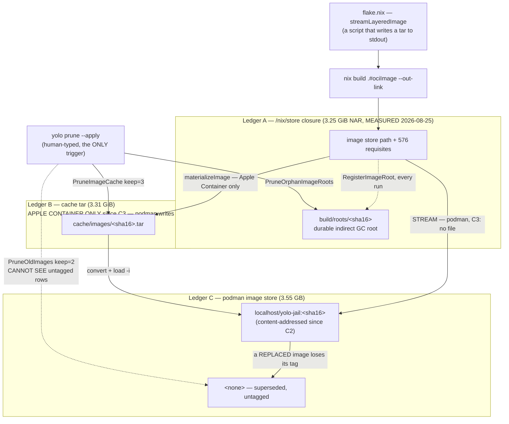

# Minimal disk footprint — reclamation that waits for a human is not reclamation

**Status:** DESIGN, 2026-08-25 — **with one question ruled and one half of §10 step 3 shipped the same day.** OQ-DF1 was ruled *"stream, keep zero tars"* and [`image-staging-vs-baking.md`](image-staging-vs-baking.md)'s **C3** implements it: on podman the load path writes no tar at all, so Ledger B's growth term is zero going forward. Everything else here is still design — nothing built beyond that and what [`../plans/storage-lifecycle.md`](../plans/storage-lifecycle.md) §1–§4 already shipped, and what *it* shipped made a GC *safe* without making one *happen*. **The pre-C3 backlog is untouched**, OQ-DF2/DF3/DF4 are open, and Apple Container still writes a tar per store path.

**The short version.** Every reclaimer yolo owns works; none of them ever runs, because all sixteen — every exported `Prune*`/`Purge*`/`Sweep*`/`Reap*` in `internal/prune`, plus `RunNixStoreGC` and `HardlinkDuplicateFiles` — are reachable only from a human typing `yolo prune` (verified 2026-08-25 — one non-test call site, `internal/prune/prunecmd.go`, reached only from the CLI dispatch table at `internal/cli/dispatch.go:30`). So the fix is not a better sweeper — it is moving the delete to the process that made the bytes: **the load path should never leave behind what it does not need**, with `yolo prune` demoted from primary mechanism to crash-recovery backstop. The three ledgers a loaded image occupies are the store closure (rooted, bounded, correct), the cache tar (unbounded, and the tar's only job after a successful load is an offline fallback that almost never fires), and podman's own image store (**no working reclaimer at all** — yolo's filter cannot see the untagged images it is meant to collect).

**The most important section is §5** (the invariants). Automating a sweep is what turns storage-lifecycle's "safe at an arbitrary moment" from an aspiration into a load-bearing requirement, and §5 is where that bill comes due.

**Scope note.** This doc owns the *mechanism* — what gets deleted, when, by whom, and what the offline fallback becomes. The *measurement and the verdict* are [`image-staging-vs-baking.md`](image-staging-vs-baking.md) §1.6's, and that doc's OQ-5 ruling is what this one executes.

> [!NOTE]
> **Citations into `image-staging-vs-baking.md` are by section and item ID (§1.6, C2, C3, OQ-N), never by line number.** That file was under concurrent edit on 2026-08-25 and its line numbers moved twice while this doc was being written. Section and item IDs are its stable surface.
>
> **Its risk rows are always spelled `image-staging-vs-baking.md` R4,** because §9 below mints its own R1–R8 and the two tables do not agree: that doc's R4 is the offline safety net and its R5 is scrubbed-`LD_LIBRARY_PATH` breakage, while this doc's R4 is a late safety net for a fast leak and its R5 is budget thrash. A bare `R5` in this file is always §9's.

**Reads with:**

- [`image-staging-vs-baking.md`](image-staging-vs-baking.md) — the OQ-5 ruling this doc executes, its §1.6 measurement, and the C2/C3 cost model this doc's sequencing has to interleave with.
- [`../plans/storage-lifecycle.md`](../plans/storage-lifecycle.md) — the shipped GC work (§1–§4) that the ruling calls "nowhere near enough"; §3 below says exactly where it stops.
- [`../plans/cache-relocation.md`](../plans/cache-relocation.md) — the settled threat model (yolo does not manage host symlinks/mounts) that bounds anything proposed here, and the icebox questions this ruling partly moots.
- [`storage-and-config.md`](storage-and-config.md) — where these bytes live, and the state/config separation the budget has to respect.
- [`../plans/handoff-cachix-cache.md`](../plans/handoff-cachix-cache.md) — the binary cache that makes *deletion cheaper to undo*, which is a complement to this doc, not an alternative to it.

---

## 1. The ruling, and what the bug actually is

The maintainer ruled on 2026-08-25, on `image-staging-vs-baking.md` OQ-5:

> "bug, for sure. I see no reason to keep any of this around. I will be addressing this issue soon. we need to use minimal disk space. put an item on the roadmap for this and write a design doc using the skill. we've done some GC work, but it's nowhere near enough."

The interesting word is **"bug"**, because the obvious reading — "disk filled up" — is not a bug, it is a consequence. Disk fills up on a machine that builds container images sixty percent of commits (`image-staging-vs-baking.md` §1.1 — restated here, not re-measured). The bug is structural, and it is this:

**Reclamation exists, is correct, is tested, and has no trigger.**

Verified 2026-08-25 against `486a13bb`, by grepping every exported reclaimer in `internal/prune` for non-test callers outside `prunecmd.go`: **there are none.** Every reclaimer's only production entry point is `internal/prune/prunecmd.go` (`PruneHostArchive` is the one indirection, reached from `PruneHostArchiveBuckets` at `internal/prune/hostarchive.go:57` — still only from `prunecmd.go`). That file's `Run` has exactly one caller, `internal/cli/commands.go:240`, reached only from `internal/cli/dispatch.go:30` (`"prune": runPrune`). There is no timer, no hook, no launch-path call, and no `just` recipe — `rg -n "prune" Justfile scripts/ integration/` returns nothing at all, which also means the whole surface has **zero integration coverage**.

So the entire disk-reclamation capability of this project is gated on a human noticing.

### 1.1 What "a human noticing" is worth, measured

This is not a hypothetical failure mode; the repo has been running the experiment for a month and the result is unusually clean.

`yolo prune` prints a hint whenever `cache/images` exceeds 20 GiB (`imagesHintThreshold = 20 * (1 << 30)`, `internal/prune/prunecmd.go:209`, emitted at `:274-296`). It appears on a plain dry-run, needs no flag, and survives redirection. It has been true continuously since **2026-07-23 09:12**, the moment the cache crossed the threshold at 22.01 GiB (MEASURED 2026-08-25, by accumulating the tars in mtime order).

The sharpest available evidence is not "the hint was ignored" — it is that **the exact artifacts the hint was about are still on disk, byte for byte.** `image-staging-vs-baking.md` §1.6 measured 125 tars totalling 404.4 GiB on 2026-08-15. Measured today in the same directory:

```console
$ stat -c '%Y %s' *.tar | awk -v cut=$(date -d '2026-08-16' +%s) '$1<cut{s+=$2;n++} END{printf "n=%d GiB=%.2f\n",n,s/1073741824}'
n=125 GiB=404.45
```

Same 125 files, same 404 GiB, ten days later. Not one was reclaimed. A keep-3 retention rule that never runs is indistinguishable from no retention rule, and that is the defect: **a mechanism whose only trigger is a human noticing is not a mechanism, it is a suggestion.**

### 1.2 Where the shipped GC work stops — the precise referent for "nowhere near enough"

"Nowhere near enough" needs a referent or it is just agreement. Here it is.

`../plans/storage-lifecycle.md` was written after a real incident: a host `nix-collect-garbage` reclaiming ~2.5 TiB swept a **running jail image's own store closure**, leaving 235 of 467 `/bin` symlinks dangling (`storage-lifecycle.md:3-9`). Its §1–§4 shipped 2026-07-22 and delivered exactly four things:

| § | What shipped | Evidence, checked 2026-08-25 |
| :--- | :--- | :--- |
| §1 | A durable per-image nix GC root, `build/roots/<sha16>`, re-asserted every run | `internal/image/gcroot.go:38-77`; called at `internal/image/autoload.go:547` |
| §2 | `yolo check` **warns** when the host daemon's `min-free == 0` — yolo never edits `nix.conf` | `internal/cli/check/section_autogc.go` |
| §3 | Opt-in, bounded, rooting-aware `yolo prune --nix-gc`; refuses in-jail | `internal/prune/nixgc.go:15-41`; gating at `internal/prune/prunecmd.go:632-670` |
| §4 | Lifecycle sweeps for derived junk: dangling out-links, orphaned agent staging, age-purged agent logs | `internal/prune/{staleoutlinks,agentstaging,agentlogs}.go` |

Read that column again with the ruling in hand. **Every one of those four made a GC *safe*. None of them made a GC *happen*.** §1 creates roots (it adds a protection, not a reclaim). §2 is explicitly detect-and-warn. §3 is opt-in and default-OFF. §4 sweeps classes that were never the bulk.

And storage-lifecycle knew this: its own consumer map already labels the tars `PruneImageCache(keep=3)` via `yolo prune` **(manual)** (`storage-lifecycle.md:134`). It recorded the exposure rather than closing it.

> [!IMPORTANT]
> **The gap between "safe to run" and "runs" is the whole of the new work.** Everything in §4–§10 below is an attempt to close that one gap without spending the safety that §1–§4 bought.

---

## 2. Measured, 2026-08-25

All measurements below were taken by me in this development jail on 2026-08-25 against `486a13bb`, labelled **MEASURED** / **NOT MEASURED** in the manner of `image-staging-vs-baking.md` §1.6. Every figure it restates from that doc I re-took rather than copied.

> [!IMPORTANT]
> **This is the PRE-C3 series, and it is retained as dated evidence rather than as a forecast.** C3
> shipped later the same day (2026-08-25) under the OQ-DF1 ruling, so **the podman growth term
> — the `cache/images` rows below — goes to zero from that change forward**: nothing writes a tar on
> the podman happy path any more. The 480.71 GiB level and the +7.63 GiB/day rate are what the
> defect cost up to the fix; they are exactly the numbers that argued for it. The **backlog** those
> rows measure is still on disk (C3 stopped creating, it did not sweep — §10), and the `/nix/store`
> and device rows are unaffected by C3 entirely.

> [!WARNING]
> **There are two image tar caches on this device and `image-staging-vs-baking.md` §1.6 measured one of them.** Inside this jail `~/.local/share/yolo-jail` is a bind of `<ws>/.yolo/home/local/share/yolo-jail` — the **nested jail's** state dir, inside the repo working tree. The **host's** cache is mounted separately at `~/.cache`. §1.6's numbers are the nested one. Both are measured below; the true total is **606 GiB, not 404 GiB**.

### 2.1 Levels

| Thing | 2026-07-22 | 2026-08-15 | **2026-08-25** | Label |
| :--- | :--- | :--- | :--- | :--- |
| Nested `cache/images` (the path §1.6 measured) | 3 tars, 9.5 GiB | 125 tars, 404.4 GiB | **148 tars, 480.71 GiB**, mean **3.248 GiB** | MEASURED |
| ↳ oldest / newest tar | — | — | **2026-07-22 15:00** / **2026-08-25 11:39** | MEASURED |
| ↳ orphan `.tmp` from crashed materialize | — | — | **0** (148 of 148 are `*.tar`) | MEASURED |
| **Host** `cache/images` (at `~/.cache/images`) | — | not distinguished | **36 tars, 125.41 GiB**, mean **3.484 GiB** | MEASURED (new) |
| **Both caches on this device** | — | — | **184 tars, 606.12 GiB** | MEASURED (new) |
| `/nix/store` | — | 209 GB | **659 GiB**, **38 441** entries | MEASURED |
| Root device `/dev/mapper/root` (btrfs; carries store, home, `/tmp`, `/workspace`) | 3.7 T, 45 % | 3.7 T, 2.5 T, 69 % | **3.7 T, 3.1 T used, 84 %, 608 G free** | MEASURED |
| Realized `*-stream-yolo-jail` store paths | — | 212 | **265** | MEASURED |
| Loaded image's `/nix/store` closure (`nix path-info -S`) | ~3.09 GiB (`storage-lifecycle.md:55`) | — | **3 491 272 560 B = 3.25 GiB** NAR, **577** paths | MEASURED |
| Loaded-image cache tar (`build/last-load-size`) | ~3.14 GiB | 3.28 GiB | **3 554 560 000 B = 3.31 GiB** | MEASURED |
| Load sentinel `build/last-load-podman` | — | — | **10 entries** (the LRU cap) | MEASURED |
| **podman image store** | — | **NOT MEASURED** | **2 images, 6.391 GB**; 0 containers, 0 volumes | MEASURED (first time) |
| Apple Container image store | — | — | **NOT MEASURED** — no `container` runtime in this jail | NOT MEASURED |
| Durable image GC roots on the host, and the union closure they pin | — | — | **NOT MEASURED** — `build/roots` is host-side only and does not exist in this jail (§3.1); only an upper bound on the closure is derivable | NOT MEASURED |

### 2.2 Rates — the numbers to argue from

| Series | Window | Δ | Rate |
| :--- | :--- | :--- | :--- |
| Nested `cache/images` | 08-15 → 08-25 (10 d) | +23 tars, **+76.26 GiB** | **+7.63 GiB/day** |
| Nested `cache/images` | 07-22 → 08-25 (34 d) | +145 tars, +471.2 GiB | +13.86 GiB/day |
| ↳ same, **excluding the two spike days** | 34 d | +68 tars, +220.4 GiB | **+6.48 GiB/day** |
| `/nix/store` | 08-15 → 08-25 (10 d) | +450 GiB | **+45.0 GiB/day** |
| Root device used | 08-15 → 08-25 (10 d) | 69 % → 84 % ≈ +550 GiB | **≈+55 GiB/day** |
| **Headroom at the 10-day device rate** | — | 608 GiB free | **≈11 days to 100 %** |

Three things the rates say that the levels do not:

1. **The tar growth did not decelerate.** 16.5 → 7.6 GiB/day looks like a slowdown, but 2026-07-27 (40 tars) and 2026-08-02 (37 tars) alone account for **77 tars / 250.8 GiB — 52 % of the entire cache in two days**. Strip them from the 34-day Δ (145 − 77 tars, 471.2 − 250.8 GiB) and the rate is 6.48 GiB/day, within 18 % of the recent 7.63. The honest model is a **~7 GiB/day floor plus ~125 GiB per spike day**, not a decaying curve. A design that only handles the floor will be defeated by one bad afternoon.
2. **The store, not the tars, is now the larger line item.** `/nix/store` grew 450 GiB in ten days — six times the nested tar cache's 76 GiB. §8 says why this doc nonetheless does not claim it.
3. **Two unrelated instruments agree, so 659 GiB is real.** Store +45.0 and nested tars +7.63 sum to 52.6 GiB/day against a separately-measured device growth of ≈55 GiB/day. That the residual is small is the cross-check that the store figure is not a `du` artifact.

### 2.3 Caveats, stated rather than buried

- **Every number is from one machine — this jail.** This is the same limitation `image-staging-vs-baking.md` records as its R7, and it applies unchanged. It is enough to establish that the defect is real and roughly how fast it bites; it is not a population estimate.
- **The 2026-08-15 `/nix/store` "209 GB" does not record its unit or command.** I read it as `du -sh` (GiB), because the device cross-check in §2.2 closes to ~5 % that way and does not otherwise.
- **The 08-15 device figure is a `df -h` rounding** ("2.5 T", "69 %"). The ≈+550 GiB is derived from the percentage against the precise total; from the rounded "2.5 T" it is ≈+600 GiB. The runway is 11–12 days either way, which is the only thing the number is load-bearing for.
- **"100 % reclaimable" in `podman system df` is measured on a nested podman with zero running containers.** It correctly reports that nothing holds these images *right now*; it is not a claim that a real host's running jail image is reclaimable. The orphaned `<none>` row in §3.3 is orphaned regardless.

---

## 3. The three ledgers

A single loaded image is stored three times, in three places, with three different owners and three different reclaim stories. This is the structural map everything below argues from.



> [!NOTE]
> **Two edges in that diagram changed on 2026-08-25 and the map is drawn as it is NOW.** C3 shipped:
> on podman the closure streams straight into `podman load` and Ledger B is never written, so its
> growth term is **zero** going forward — the accumulated tars are the pre-C3 backlog, which C3
> deliberately did not sweep (that is §10's work). C2 shipped: the tag is content-addressed, so a
> *superseded* image only becomes `<none>` when its own store path is rebuilt, not every time
> another workspace launches. §2's measured series is the PRE-C3 series and is retained as dated
> evidence.

### 3.1 Ledger A — the `/nix/store` closure. Correct; leave it alone.

**Writer:** `nix build .#ociImage` via the host daemon. **Pinned by:** an indirect GC root at `build/roots/<sha16>`, where `sha16` is the first 16 hex of `sha256(storePath)` — the *same key* as the cache tar, deliberately, so the two can never drift (`internal/image/image.go:286-293`, `internal/image/gcroot.go:22-29`). Re-asserted on **every** run, including when the image was already loaded, so a reaped root self-heals (`internal/image/autoload.go:538-547`). **Deleter:** `nix store gc` only, and only via the opt-in `yolo prune --nix-gc`.

This ledger is the one part of the system that already works the way the whole system should. The ordering is right — `RegisterRoot` at `autoload.go:547` runs *before* `os.Remove(outLink)` at `:548`, so there is no unrooted window — and reclamation is triple-guarded (tri-state liveness, an LRU-10 protected set, a 3600 s age floor, `internal/prune/imageroots.go`).

> [!NOTE]
> **The store's growth is not a leak here.** A durable root per distinct loaded image closure is roots doing their job, and how many of them exist on the host is **NOT MEASURED** (§2.1): `build/roots` is host-side only, and `RegisterRoot` is a no-op in-jail (`internal/image/autoload.go:117-121`), so this jail's own `build/` holds no `roots/` directory at all to count. The store grows because nothing collects *unrooted* paths, which is the host's `min-free` setting — §8.

### 3.2 Ledger B — the cache tar. **Bounded to zero on podman since C3; unbounded on Apple Container.**

**Writer:** `materializeImage` (`internal/image/autoload.go:689`), streaming the store path (which on Linux *is* the executable) into `cache/images/<sha16>.tar`. **Deleter:** `PruneImageCache(dir, keep, apply)` — sorts tars by mtime newest-first, drops the tail beyond `keep`, and always sweeps `*.tmp` regardless of `keep` (`internal/prune/imagecache.go:15`). Default `keep=3` (`internal/prune/prunecmd.go:138`).

**Since C3 (2026-08-25) there is exactly ONE caller left**, the Apple Container arm at
`internal/image/autoload.go:492-513`, reached only when `ImageLoadStdinCmd` says the runtime cannot
take a pipe (`internal/image/image.go:55-60`). **On podman nothing writes this ledger at all** —
asserted on disk, not on which function ran (`internal/image/streamload_test.go:60`).

**Bounded by the write path? On podman, yes — by not writing.** Elsewhere, no: `AutoLoadImage` still
never *deletes* an old tar. Verified 2026-08-25: `rg -n "os.Remove|RemoveAll" internal/image/autoload.go internal/image/image.go` returns removals of `outLink`, `tmpFile`, and the Apple Container `ociDir`/`ociTar` only — **never a cache tar**. So one multi-GB tar still accumulates per distinct nix store path on Apple Container, forever, until a human types `yolo prune --apply` — and the ~485 GiB already on the maintainer's machine is untouched, because C3 stopped the *creation* and deliberately left the sweep to §10.

Two facts about this ledger matter enormously for §4 and §6, and they pull in opposite directions:

- Deleting a tar is **always safe for a running jail** — the tar is a one-shot load artifact, and the runner depends on Ledger A's closure. The code says so at `internal/prune/prunecmd.go:287-296`. This is what licenses aggression.
- The tar is also the **offline fallback** when a build fails and no image is loaded (`newestTars`, the loop at `internal/image/autoload.go:359-373`). C3 kept that consumer working on whatever tars exist — it removed the writer, not the reader (`TestBuildFailureFallbackStillLoadsAnExistingTar`). This is what `image-staging-vs-baking.md` R4 defends. §6 resolves it.

> [!WARNING]
> **`PruneImageCache`'s keep-N eviction branch (`internal/prune/imagecache.go:59-69`) is not executed by any test.** Checked 2026-08-25: there is no `imagecache_test.go`, and the two `Run`-level tests that touch tars each stage one tar against `keep=3`, so the tail-drop never fires. The `.tmp` sweep is covered; the eviction is not. This is the untested branch guarding the largest artifact class, and any design that makes it *automatic* is promoting untested code to the launch path.

### 3.3 Ledger C — podman's own image store. **The one with no working reclaimer.**

This is the answer to "which of the three does yolo have no reclaimer for", and it is worse than "no reclaimer" — there is a reclaimer that cannot see its targets.

`PruneOldImages` runs `podman images --format "{{.ID}} {{.Repository}}:{{.Tag}} {{.CreatedAt}}" yolo-jail` (`internal/prune/probes.go:255`). That trailing `yolo-jail` is a **repository-name filter**. A superseded load is *untagged* — the next `podman load` retags `:latest` onto the new image and orphans the old one as `<none>` — so it never matches the filter. Reproduced live in this jail, 2026-08-25:

```console
$ podman images
REPOSITORY           TAG       IMAGE ID      CREATED       SIZE
localhost/yolo-jail  latest    226a6fd81f36  5 hours ago   3.55 GB
<none>               <none>    f3f0380b0645  17 hours ago  3.55 GB

$ podman images --format "{{.ID}} {{.Repository}}:{{.Tag}}" yolo-jail
226a6fd81f36 localhost/yolo-jail:latest          # the <none> row is invisible

$ podman system df
TYPE     TOTAL  ACTIVE  SIZE      RECLAIMABLE
Images   2      0       6.391GB   6.391GB (100%)
```

`PruneOldImages` can only ever see **one** row here, so `keep=2` never triggers and the dangling 3.55 GB is never reclaimed by yolo. And there is no other path: `rg` over `internal/` excluding tests finds no `podman image prune`, no `system prune`, and no `rmi` of a dangling ID — the only `rmi` in the tree is `probes.go:289`, *inside the function whose filter hides the target*.

The common case is the leaking case. Every content-changing rebuild retags `:latest` and orphans its predecessor, and 60 % of commits force a rebuild (`image-staging-vs-baking.md` §1.1 — restated, not re-measured here).

> [!WARNING]
> **A global tag plus a global sentinel made concurrent jails thrash — FIXED by C2, 2026-08-25.** `localhost/yolo-jail:latest` was one name per machine and `build/last-load-<runtime>` is one sentinel per runtime (`internal/image/autoload.go:256`) — neither per-workspace. Jail B loading a different image retagged `:latest` away from jail A's. A kept running (podman resolved the tag to an ID at create time), but A's image was then `<none>` and invisible to the reclaimer; A's *next* launch saw `lastLoaded != currentPath` and reloaded. Two jails with different configs orphaned each other's image on every launch.
>
> **C2 shipped:** the ref is `<repo>:<sha16-of-store-path>` (`image.JailImageRef`), so each config keeps its own permanent name and neither jail can orphan the other's image. **This leak source is closed; the `<none>` rows below are not** — an image is still untagged when *its own* store path is rebuilt, which is the residue A8 and OQ-DF3 are about. It also had a consequence in the other direction that C2 had to fix in the same change: a pass that could never fire suddenly could. See `image-staging-vs-baking.md` R3.

---

## 4. A budget, not a retention count

The current design is **keep-N-by-mtime**. That is a *count*, and the maintainer stated a goal in *bytes*: "we need to use minimal disk space." The mismatch is not pedantry; it is why the policy drifts without anyone changing it.

**Why a count is the wrong unit for this class.** A count says nothing about bytes. `keep=3` was 9.5 GiB in July when a tar was 3.14 GiB; the same policy is ~10.5 GiB today against a 3.48 GiB host-side mean, and will be more tomorrow — the cost of the retention rule rises with no change to the rule. Worse, a count cannot express "minimal": there is no N that means *zero unless needed*.

**But keep-N is not wrong everywhere,** and the distinction is the useful one. yolo's artifact classes divide cleanly by *why* they are retained:

| Retention rationale | Classes | Right unit |
| :--- | :--- | :--- |
| **Undo buffer** — "I applied, noticed, applied again, then looked" | host-render archive, retired loophole state (both `hostArchiveKeep = 3`, `internal/prune/prunecmd.go:208`) | **a count.** Correct as-is; bytes are trivial and one generation can hold a CA private key, which is why keep-N beats an age cutoff (`internal/prune/loopholestate.go:30-33`) |
| **Regenerable bulk** — reproducible from a nix build | image tars, podman's superseded images | **bytes, or better: nothing at all** |
| **Regenerable-but-expensive** — a re-download | `cache/{npm,go-build,uv,pip,…}` | age (already correct, `PurgeCacheByAge`) |

Applying one knob shape across all three is a category error. The proposal below therefore does *not* touch the undo-buffer classes.

### 4.1 Candidate invariants, weighed

**(a) Delete-on-successful-load.** Once `podman load -i <tar>` returns 0, the tar's only remaining job is the offline fallback (§6). Delete it in the same process that just used it.
**Verdict: proposed as the default shape for backends that must write a file — NOT yet adopted. This is OQ-DF2 option (i) and waits on that ruling.** It is the smallest change that converts an unbounded ledger into a bounded one, and — importantly — it *narrows* rather than widens the prune-versus-launch race, because the deleter is the process that owns the artifact (§5, P4).

**(b) Never write the tar at all.** The flake builds `streamLayeredImage`, not `buildLayeredImage` (`flake.nix:978-983`), whose output *is* a script that writes the tar to stdout — the code already said so (`internal/image/autoload.go:843-844`). And `podman load` reads stdin by default (verified on podman 5.8.4: `-i, --input string   Read from specified archive file (default: stdin)`). `ImageLoadCmd` unconditionally emits `-i <tarPath>` (`internal/image/image.go:28-33`), so **the file was a choice, not a constraint**.
**Verdict: SHIPPED for podman, 2026-08-25**, and strictly better than (a) where it applies — it saves the 3.31 GiB *write* as well as the retention. This is `image-staging-vs-baking.md`'s C3. The live decision point is `ImageLoadStdinCmd` (`internal/image/image.go:55-60`), which returns `(nil, false)` for Apple Container so the caller branches on the ANSWER rather than re-deriving the runtime name; `ImageLoadCmd` survives for the two places that genuinely hold a file. It does not generalise: Apple Container needs a file for its format conversion (§8), so (a) remains the shape there — and OQ-DF1 below is what ruled the retention that goes with it.

**(c) A hard byte ceiling on the state dir.**
**Verdict: adopted as the *reported contract*, rejected as the *only mechanism*.** A ceiling that evicts what the next launch immediately rebuilds trades 3.31 GiB of disk for 3.31 GiB of work (§9 R5). A ceiling is the right thing to *state and measure against*; it is the wrong thing to make the primary trigger.

**(d) A floor tied to free space rather than a count.**
**Verdict: right for the store, rejected for yolo's own artifacts.** This is precisely what nix's `min-free`/`max-free` does, and §8 leaves that lever where it belongs — with the host. For yolo's artifacts it reintroduces the current failure mode with extra steps: you clean up only once it already hurts, and on a device shared with the host that threshold arrives as someone else's outage.

### 4.2 The shape this lands on

**The write path owns its own bytes.** Not a sweeper that runs later, but a load path that never leaves behind what it does not need. `yolo prune` stays — demoted from primary mechanism to **recovery tool** for what crashed mid-write, what predates the change, and what a different backend left behind.

That is the structural inversion, and it is the whole design: today the write path creates and `prune` deletes, with an unbounded interval between them that is measured in months. The proposal collapses the interval to zero by making one component do both — stated as the shape this doc argues for, since **which** component is OQ-DF2's to decide.

It also explains why "improve the hint" (§7, A1) cannot work. The hint is a message to the human who is the missing trigger. The fix is to stop needing one.

---

## 5. Invariants — what must not break

Numbered so sibling docs and code comments can cite them.

**P1. A running jail's image closure is reachable from a durable GC root at every instant.** This is storage-lifecycle §1's thesis and the incident's actual lesson. Held today by re-asserting the root on every run *before* dropping the ephemeral out-link (`internal/image/autoload.go:547-548`), so there is no unrooted window. Nothing in this doc may introduce one.

**P2. Reclamation is fail-safe on unknown liveness.** Tri-state: if yolo cannot enumerate running jails, it reaps nothing. Already the polarity of every liveness-gated sweep.

**P3. Deleting a cache tar never strands a running jail.** The tar is a one-shot load artifact; the runner depends on Ledger A (`internal/prune/prunecmd.go:287-296`). **This is the invariant that licenses the entire aggressive posture** — and it is therefore the one to guard hardest. If a future design ever makes the tar load-bearing at run time (a lazy re-load, a restore path, a rollback that reads it), P3 breaks and this proposal breaks with it.

**P4. No reclaimer may delete an artifact an in-flight launch is between steps on.** Stated as an invariant because **it is still violated, now on one backend**: nothing locks or liveness-gates the cache tar, and the window between `fileExists(cacheFile)` (`internal/image/autoload.go:504`) and the converter that reads it (`:513`) is unguarded. **Since C3 that pair exists only on the Apple Container arm** — podman has no file between the two steps to race for, so P4's launch-side exposure is now Apple-Container-only. The `newestTars` fallback still reads tars on every backend, so the invariant does not go away. A concurrent `yolo prune --apply` that evicts a *reused* tar in that window causes `loadOK == false` and the launch exits 1. Note the polarity this creates: §4.2's delete-on-success **improves** P4, because the process doing the deleting is the one that just finished with the file.

**P5. yolo never carelessly GCs the host store.** Bounded, rooting-aware, host-only, opt-in, never a blanket collect (`internal/prune/nixgc.go:15-31`). The ruling is about yolo's own artifacts and does not license relaxing this.

**P6. yolo does not manage host symlinks or mounts as a general primitive.** The `cache-relocation.md` threat model, restated as settled law at `storage-lifecycle.md:185-188`: a *human*-declared layout yolo merely consumes is the only acceptable shape. An aggressive reclaimer must not become a backdoor to it.

**P7. A reclaimer must be safe to run at an arbitrary moment — and automation is what makes this expensive.** Storage-lifecycle already asserts this, but as an aspiration about a command a human runs, and a human can time. Move the trigger to the launch path and "arbitrary moment" becomes literal: the sweep now runs whenever *any* jail starts, including while three others are mid-build on the same machine.

> [!IMPORTANT]
> **P7 is the bill this design comes with.** Automating a safe-in-principle sweep converts every unguarded race in §3 from "a thing a careful human avoids" into "a thing that happens on a schedule set by other people's jails." P4's existing violation is the concrete instance. Anything built here must close P4 before, or in the same step as, it closes the trigger gap — not after.

---

## 6. The offline safety net, honestly

This is the sharpest tension in the design and it deserves to be stated as a conflict rather than resolved by assertion.

`image-staging-vs-baking.md` R4 says C3 removes the offline safety net if taken to "never write a tar", and its mitigation is explicit: **"Keep-N, not zero."** The maintainer's ruling says *"I see no reason to keep any of this around."* Those are not the same instruction.

**What the fallback actually is.** On a launch where the build failed (with `YOLO_ALLOW_STALE_IMAGE=1` set) or was skipped entirely, `AutoLoadImage` walks `newestTars(cacheDir)` and loads the newest one that works (`internal/image/autoload.go:359-373`).

**What is actually lost at zero — and the precondition changes the answer.** The fallback is only *reached* when `podman image inspect localhost/yolo-jail:latest` has already **failed** (`internal/image/autoload.go:351-355`); if an image is present in the runtime, that branch returns "Using existing image" and never touches a tar. (That branch keeps the LEGACY tag deliberately, and C2 says why: with no store path there is nothing to hash, so "is *an* image present under the name the flake bakes" is the only honest question left.) So the tar cache helps exactly one user: someone whose build cannot run **and** whose runtime image store has *also* been emptied — a `podman system reset`, a storage reset, a fresh machine, a corrupted graphroot.

Concretely, on this machine today, the fallback would not fire no matter how many tars exist, because podman holds a loaded image (§2.1). **148 tars are insuring against a scenario that additionally requires Ledger C to be gone.**

**And the insurance is bought twice.** Ledger C stores the same image in 3.55 GB and is consulted *first*. Keeping a tar as well is paying 3.31 GiB for a second copy of a fallback you already have, differing only in the narrow case where the runtime store is what broke.

**The cheap substitute.** Keep exactly one tar — the one for the currently-loaded image — or keep none and let Ledger C be the fallback it already is. The marginal value of tars 2 through 148 is indistinguishable from zero: `newestTars` tries them in order, and if the newest tar cannot load, the 147 older ones are older builds of a tree the user is no longer on.

**My verdict was:** keep-zero by default, with an explicit opt-in for the disconnected case, because the measured fallback is nearly always Ledger C and never tars 2–148. It traded **the maintainer's** risk on **his** machine — a jail that will not start is a much worse day than 400 GiB of disk — and `image-staging-vs-baking.md` R4's caution was written for a good reason, so it went to Open Questions rather than into an assertion.

> [!IMPORTANT]
> **RULED 2026-08-25 (OQ-DF1): *"stream, keep zero tars."*** The maintainer ruled expressly for the
> C3 implementation, and it went further than the leaning: no opt-in retention flag either. On
> podman the happy path writes **no tar at all** — the nix stream is piped straight into `podman
> load` — so `cache/images` stays empty on success and there is no retention number to pick. The
> fallback survives as a *reader*: `newestTars` still loads any tar that exists, which is what keeps
> an offline start working against the pre-C3 backlog and against Apple Container's tars.
> **What the ruling did NOT cover, and the code respects the boundary:** pre-existing tars are not
> swept (still §10's work), and Apple Container still writes and retains one tar per store path
> because its converters need a real path. See §11 OQ-DF1 for the full answer block.

> [!NOTE]
> **The cachix work is what makes zero cheap.** A populated binary cache ([`../plans/handoff-cachix-cache.md`](../plans/handoff-cachix-cache.md)) does not reduce *retention* cost at all — it reduces the cost of having deleted something, by making the rebuild a download. It is a complement to keep-zero, not an alternative to it, and it is the surface OQ-3's *"we have plans on making cachix useful"* clause is about — the **nix binary cache**, not the podman image tag.

---

## 7. Alternatives considered

| # | Alternative | Verdict |
| :--- | :--- | :--- |
| A1 | **Leave it manual, improve the hint.** | **Rejected — measured.** The hint has been true for 33 days and 459 GiB of growth on top of the 22 GiB that first tripped it, and the 125 tars it named are byte-for-byte still present (§1.1). Better wording does not fix a missing trigger. It is also now advising the *wrong action* (A7). |
| A2 | **Automatic keep-N at materialize time.** | **Rejected as the primary mechanism; accepted as the backstop.** This was the pre-ruling leaning, and the ruling goes past it: a count is the wrong unit (§4) and keep-N leaves N × 3.3 GiB permanently resident for a fallback that almost never fires (§6). It survives as `yolo prune`'s recovery behaviour. |
| A3 | **Delete-on-successful-load.** | **Proposed, pending OQ-DF2 (option i)** — the leaning of §4.1a, not a ruling. Bounds the ledger and improves P4. Do not build ahead of the ruling. **Narrowed by C3:** podman no longer writes a tar to delete, so A3's remaining scope is Apple Container and the pre-C3 backlog. |
| A4 | **Never materialize — stream the derivation into `podman load`.** | **SHIPPED for podman, 2026-08-25** (§4.1b; OQ-DF1 ruled the retention that goes with it). Strictly better than A3 where it applies: saves the write as well as the retention. This is `image-staging-vs-baking.md` C3, and §10 sequences the two together. Podman only — Apple Container keeps the file. |
| A5 | **A byte budget with LRU eviction.** | **Rejected as the trigger; adopted as the contract.** Evicting what the next launch rebuilds trades 3.31 GiB of disk for 3.31 GiB of work (§9 R5). Useful as the thing yolo *reports and measures against*; harmful as the thing that fires. |
| A6 | **A background or periodic sweep (timer, daemon, cron).** | **Rejected.** It adds a lifecycle yolo does not have — every host daemon today is a hidden `yolo internal daemon` subcommand serving a loophole, not a housekeeper — and it maximises P7 exposure by running at moments no user action bounds. The launch path already fires at least as often as the artifacts are created, which is the natural trigger. |
| A7 | **Relocate the cache to a cheaper device** (`cache-relocation.md` CR1/CR2). | **Moot for `cache/images` specifically; CR1/CR2 stay alive for their real consumer.** Relocation is the right lever for a *cold, write-once, keep-forever* class where deleting is not an option — CR1's motivating prize is a 185 GiB `huggingface` cache. The ruling's class is *regenerable, write-once, read-once*, and it says delete, not move. **Consequence to act on:** the shipped hint currently recommends the rejected strategy — `internal/prune/prunecmd.go:275-277` prints *"worth moving to HDD storage if you have it"* — as does the argument built on it at [`../plans/cache-relocation.md`](../plans/cache-relocation.md)`:53` and [`../guides/USER_GUIDE.md`](../guides/USER_GUIDE.md)`:1073` (*"symlinking that subdir is safe"*). Under this ruling the correct advice is *delete*. The icebox row does not close; it loses one of its two motivating consumers. |
| A8 | **Podman-store reclamation.** | **Adopted, and it is the best bytes-per-unit-effort in this doc** — because today there is no working reclaimer at all (§3.3), the leak is the *common* case, and 3.55 GB of it is sitting in this jail right now. Independent of A3/A4, so it can go first. Blast radius is the open part — see OQ-DF3. |
| A9 | **A populated binary cache as a substitute for local retention.** | **Complement, not alternative.** It reduces the cost of having deleted, never the cost of keeping (§6). It does materially strengthen the case for keep-zero, which is why the two are worth landing near each other. |

---

## 8. What this does NOT cover

- **Image *content* policy.** What nixpkgs ships into the image, and whether `fullPackages` belongs on the run path, is `image-staging-vs-baking.md` C5 — gated on its OQ-1, whose ruling preserved the re-measurement gate. This doc reclaims copies of the image; it does not argue about what is in one.
- **The host's own `/nix/store` beyond yolo's roots.** This is the *larger* line item today — 659 GiB, +45 GiB/day (§2.2), and `storage-lifecycle.md:132` already marks it **UNBOUNDED** — and this doc deliberately does not claim it. The lever is the host daemon's `min-free`/`max-free`, which yolo detects and warns about but **must not edit** (P5, `internal/cli/check/section_autogc.go`). It is storage-lifecycle §2's host-gated residual and stays there. Saying otherwise would be this doc taking credit for someone else's `nix.conf`.
- **Agent logs and Claude transcripts.** Deliberately excluded from purging as durable, non-regenerable user data (`internal/prune/agentlogs.go:13-19`). The ruling is about regenerable artifacts and does not reopen this.
- **Browser and tool-profile caches.** `chromium`, `firefox`, `copilot` and friends are hard-refused even when explicitly named (`internal/prune/cachepurge.go:22-25`) because they carry live profile state. Unchanged.
- **`macos-user`.** It has no image and no tar — the backend is dispatched before any image work happens. Its own artifacts (a `buildEnv` closure under a single retargeted GC root, a staged binary, SBPL profiles) have a different and mostly better lifetime story, and belong in [`macos-user-nix-and-features.md`](macos-user-nix-and-features.md).
- **Apple Container's image store.** It has no reclaimer either — `PruneOldImages` and `PruneStoppedContainers` emit podman `--format` templates that the `container` CLI does not implement. I **could not measure it** (no `container` runtime in this jail, §2.1), and I decline to design a reclaimer against an unmeasured cost. Named here so it is not mistaken for covered.
- **`packages:` scope.** Ruled workspace-scope, emphatically, by `image-staging-vs-baking.md` OQ-4: *fix the cost, not the scope.* This doc fixes cost. It does not reopen scope.
- **Per-workspace overlay growth and the `nce`/`staticcheck` cache subdirs** that no reaper covers today. Real, small relative to the image ledgers, and orthogonal to the mechanism argued here.

---

## 9. Risks

| # | Risk | Mitigation |
| :--- | :--- | :--- |
| R1 | **Deleting a store closure a live jail needs** — the original 2026-07-22 incident, 235 of 467 `/bin` symlinks dangling. | P1 + P5. Ledger A is out of scope for aggression; nothing here touches `nix store gc`'s gating, which already refuses in-jail and declines unless every loaded closure has a durable root. |
| R2 | **A prune racing a concurrent launch** — evicting a reused tar between `fileExists` and `podman load` kills the launch (P4, unguarded today). | Delete-on-success *narrows* this by making the user the deleter. The residual — a second jail's launch — needs P4 closed explicitly, and this is the one place where the automation must not ship ahead of the guard. |
| R3 | **Losing the offline fallback** — a user with no network and a failed build and an empty runtime store cannot start a jail. | §6 shows the window is narrower than `image-staging-vs-baking.md` R4 assumed (Ledger C is consulted first, and is the fallback in every case where it exists). **RULED 2026-08-25 (OQ-DF1): keep zero, no opt-in.** The residual risk is accepted and narrow — it needs a failed build *and* an empty runtime image store *and* no usable tar from the pre-C3 backlog. `newestTars` still reads whatever is on disk, so the net change for a disconnected user is that no NEW insurance is written. |
| R4 | **A late safety net for a fast leak.** The growth model is a ~7 GiB/day floor **plus ~125 GiB spike days** (§2.2). Anything triggered on a threshold can be overrun inside a single afternoon. | Bound at the write path, where the artifact is created, rather than at a threshold the spike outruns. This is an argument *for* A3/A4 over A5. |
| R5 | **A byte budget that thrashes.** Evicting an image the next launch rebuilds costs 3.31 GiB of write plus a nix build to save 3.31 GiB of disk. The trade is wrong whenever the evicted image is one a live workspace is still on. | Never evict the current image (Ledger A's LRU-10 protected set is the existing precedent). Prefer delete-on-success, which is thrash-free by construction: it deletes only what has *already* been consumed. |
| R6 | **Backend asymmetry.** Ledger C reclamation is podman-only; streaming is podman-only; Apple Container needs a file and has no reclaimer at all. | Accept it, and say so. This mirrors the shape OQ-1 already ruled for C4/C5 — an opt-in fast path with the general path retained — so the asymmetry is a precedent, not a novelty. |
| R7 | **Promoting untested code to the launch path.** `PruneImageCache`'s eviction branch has no test (§3.2) and the whole prune surface has zero integration coverage. | Whatever becomes automatic gets a test that fails when its *call site* is deleted, not merely when its callee is — the failure mode AGENTS.md names and that this surface already exhibits in at least three places. |
| R8 | **One-machine measurement.** Every number in §2 is from this jail. | Stated, not hidden (§2.3). The design does not depend on the magnitude — a mechanism with no trigger is a defect at 40 GiB as much as at 606 GiB. |

---

## 10. Sequencing — what I would build, in order

**First, Ledger C — but not until OQ-DF3 is ruled.** Reclaiming superseded podman images needs nothing *else* from this doc: no change to the tar path, no change to rooting, no new invariant. It is also the clearest defect — a filter that structurally cannot see its target (§3.3) — and the measured prize is immediate. Doing it first also produces the missing measurement: once untagged images are visible to yolo, the podman ledger stops being a blind spot in every future disk argument. That is exactly why **OQ-DF3 is the sharpest of the four** — how far into a shared podman store yolo may reach is the only thing standing between this step and code. Do not start here before it is ruled.

**Second, close P4, before anything becomes automatic.** The tar eviction race is survivable today because the racer is a human who is not running `yolo prune` (which is, uncomfortably, the same defect keeping disk full). The moment reclamation moves to the launch path, that accidental protection disappears. P4 is cheap to close and must not trail the trigger.

**Third, the write path — HALF DONE, 2026-08-25.** Streaming (A4) shipped as `image-staging-vs-baking.md`'s **C3**, under the OQ-DF1 ruling: on podman the tar is never written. What remains of this step is the OTHER half — delete-on-success (A3) for the backend that must still write a file, and the sweep of the pre-C3 backlog, neither of which C3 touched. A3 is still gated on OQ-DF2. The split held: C3 owned "stop writing the tar on podman", and this doc owns "and what happens to the tars that do get written, on every backend."

**Fourth, share one retention decision with C2 — and note what C2 already had to do.** `image-staging-vs-baking.md`'s R3 observed that `--keep-images 2` is the wrong retention rule for per-config tags; OQ-3 ruled content-addressed tags in and C2 shipped them. **C2 did not mint a retention rule** — the default is untouched — but it could not ship without making the pass SAFE, because per-config tags armed a query that had returned one row for years: entries are now deduped by image ID and vetoed by a liveness gate reading the load sentinel (`internal/prune/probes.go:211-254`). **The NUMBER is still this decision, and it should be made once.** C2 also closed the `:latest` thrash in §3.3's warning, which was a Ledger C leak source — so C2 and A8 were partly the same fix arriving from different directions.

**Fifth, re-measure — the gate is now OPEN rather than blocked.** `image-staging-vs-baking.md` §11 step 5 calls for a re-measurement after C2+C3 land, and OQ-1's ruling explicitly preserved that gate even while ruling the *shape* of C4/C5. **Both landed 2026-08-25, so the measurement is possible for the first time.** This doc's remaining work lands inside the same window, so its effect should be measured by the same pass rather than a separate one. **Deliberate consequence: nothing here should be read as pre-approving C4/C5.**

**Not sequenced here:** a byte-budget config surface. It is worth stating as a contract (§4.1c) but it is downstream of OQ-DF4, and building a config key before the policy it parameterises is the wrong order.

---

## 11. Open Questions

The maintainer ruled the **premise** (it is a bug) and the **goal** (minimal disk, delete without `--apply`). He did not rule the whole **mechanism** — but he ruled **OQ-DF1** on 2026-08-25, expressly for the C3 implementation, and that one is now closed. Three remain.

1. ✅ **OQ-DF1 — RULED 2026-08-25: Does the offline tar fallback survive at all — keep-zero, keep-one, or keep-N-opt-in?**

   This was the sharpest tension in the doc (§6) and the only place where the ruling and `image-staging-vs-baking.md` R4 pointed in opposite directions. It blocked the default value of every retention knob, and it decided whether A3/A4 shipped as "delete" or "delete all but one". The measured facts: the fallback is only reached when the runtime image store has *also* been emptied (`internal/image/autoload.go:351-373`), Ledger C is consulted first and holds the same image, and tars 2–148 are older builds of a tree nobody is on.

   _Leaning was:_ **Keep zero by default, with an explicit opt-in flag or config key for the disconnected case.** The measured fallback is nearly always Ledger C, and keeping a tar is paying 3.31 GiB for a second copy of insurance already held. But it traded your risk on your machine — a jail that will not start is a far worse day than 400 GiB of disk — so I was not willing to assert it.

   **Answer:**
   > **STREAM, KEEP ZERO TARS.** — the maintainer, 2026-08-25, ruling expressly for this
   > implementation. On podman the happy path writes **no tar at all**: the nix stream is piped
   > straight into `podman load`, `cache/images` stays empty on success, and the image lives in
   > podman's own store under the content-addressed tag — which is why the tar was a redundant third
   > copy. There is no keep-N, and **no opt-in retention knob either**: the ruling went past the
   > leaning.

   **What it settles, and what it deliberately does not.** SETTLED: the write path (C3, shipped the
   same day — `internal/image/streamload.go`, the decision point at `internal/image/image.go:55-60`,
   the disk claim asserted at `internal/image/streamload_test.go:60`), and the default value of the
   retention knob for podman, which is that there is no knob. NOT SETTLED, and the code respects the
   boundary in both directions:

   - **Pre-existing tars are not swept.** C3 stopped *creating* them; the ~485 GiB already on disk is
     §10's work, and the code says so at `internal/image/autoload.go:471-473`.
   - **Apple Container still writes and retains one tar per store path**, because `skopeo copy
     docker-archive:<path>` and `podman save -o <path>` both interpolate a real path and cannot
     consume a stream (`internal/image/autoload.go:492-513`). That is a constraint of the backend,
     not an exemption from the ruling, and this doc still owes it a retention answer.
   - **The fallback's READER survives untouched.** `newestTars` still loads any tar that exists
     (`internal/image/autoload.go:359-373`), which is what keeps an offline start working. The
     ruling removed the writer, not the reader.
   - **OQ-DF2 and OQ-DF3 are untouched by it.** Where automatic reclamation lives, and how far into
     podman's store yolo may reach, are still open.

2. 💬 **OQ-DF2: Where does the automatic reclamation live — the write path, the launch path, or `yolo prune`'s default?**

   OQ-5 settled that yolo *may* delete without `--apply`; it did not say which component does the deleting, and the three are materially different work with different P7 exposure. **(i) Write path** (delete-on-success inside `AutoLoadImage`): narrowest blast radius, improves P4, but only ever cleans up after *itself* — it never reclaims the 148 tars already on disk or another backend's leavings. **(ii) Launch path** (a sweep at jail start, independent of what this launch wrote): reclaims the existing backlog, but fires during other jails' builds and maximises P7. **(iii) `yolo prune` inverts its dry-run default**: simplest, fully explicit, but leaves the trigger gap that §1 identifies as the actual bug.

   _Leaning:_ **(i) as the mechanism plus (iii) as the recovery tool — and explicitly not (ii).** The write path is the only option that is thrash-free by construction and that improves rather than worsens P4; `prune` with an inverted default then handles the backlog and the crash residue on demand. (ii) buys backlog reclamation at the cost of the worst P7 exposure of the three, and (i)+(iii) gets the same bytes with a human bounding the risky half.

   **Answer:**
   > _(empty — fill in when decided)_

3. 💬 **OQ-DF3: How much of podman's image store may yolo reclaim — only images it can prove are its own, or dangling images generally?**

   Blocks §10's first step, which is otherwise unblocked and is the best bytes-per-effort in the doc. It is also **the question that gates the rule replacing `--keep-images 2`** (`internal/prune/prunecmd.go:49`, `:138`). Note the seam: DF3 settles the *reach* — which rows yolo may reclaim at all — while `--keep-images` acts on the repo-name-filtered **tagged** rows (`internal/prune/probes.go:255`), which is the class [`image-staging-vs-baking.md`](image-staging-vs-baking.md) R3 complains about once C2 makes tags per-config. Neither option below touches a tagged row, so the replacement rule has to be written down *together with* this answer rather than falling out of it (§10 step 4). The problem is that the leak is precisely the class yolo can no longer identify: an orphaned `<none>` row has lost the repository name that was the only evidence it was yolo's (§3.3). **Narrow:** reclaim only untagged images whose ID appears in yolo's own load history — safe, but the sentinel is capped at 10 entries and records store paths, not image IDs, so it may not be sufficient evidence. *(C2 supplied that evidence for **tagged** rows and only for them: a store path now maps to a tag, `image.ImageStoreKey`, which is what `ProtectedImageTags` compares — see `internal/prune/imageroots_probe.go`. An untagged row has no tag left to match, so DF3's evidence problem is untouched.)* **Broad:** `podman image prune` for dangling images — reclaims everything, but on a podman shared with the user's non-yolo work that is someone else's images.

   _Leaning:_ **Narrow, and if the evidence turns out to be insufficient, record the image ID at load time so that it becomes sufficient.** Broad pruning of a shared runtime is exactly the kind of "reaches beyond its own artifacts" move `cache-relocation.md`'s threat model exists to refuse (P6, by analogy). Adding the evidence yolo needs is a smaller price than widening the blast radius.

   **Answer:**
   > _(empty — fill in when decided)_

4. 💬 **OQ-DF4: Does yolo owe the machine a stated number, or only a policy?**

   §4.1c adopts a byte ceiling as a *contract* but not as a trigger, which leaves open whether the number is ever written down. **A number** means a user-settable budget (a config key, with validation and an entry in the nested-inheritance table) that `yolo check` and `yolo prune` both report against. **A policy** means no configurable number at all: the write path keeps its own bytes bounded and there is nothing to tune. Worth noting how thin the current surface is — `prune.warn_threshold_gb` is the **only** disk-budgeting config key that exists, and `prune.Run` never reads config at all, so `yolo check` is its sole consumer (verified 2026-08-25: `rg -n "warn_threshold_gb" -g '!*.md'` returns exactly two hits, both in `internal/cli/check/sections_misc.go`).

   _Leaning:_ **Policy, not a number — at least until after §10's re-measurement.** If the write path bounds itself, the budget is a property of the design rather than a dial, and a dial nobody needs is a config key that has to be validated, inherited, documented and defended forever. "Minimal" is also not a number the user should have to discover. I hold this loosely: if the measurement after C2/C3 shows a residual that only a ceiling catches, the answer flips.

   **Answer:**
   > _(empty — fill in when decided)_

---

## 12. Inherited rulings

These are **not this doc's decisions** — they are `image-staging-vs-baking.md`'s, recorded here because this doc's shape depends on them. That doc's Decision Ledger is authoritative; this table is a pointer.

| ID | Ruling, 2026-08-25 | What it fixes here |
| :--- | :--- | :--- |
| `image-staging` OQ-5 | 404 GiB of cached tars is a **bug**. No reason to keep any of it. Minimal disk is the goal. yolo **may** delete cached tars without `--apply`. The shipped GC work is nowhere near enough. | The premise of this entire doc (§1); licenses §4.2's aggression and rules out A1/A2 as primary. |
| `image-staging` OQ-3 | **Content-addressed tags win.** `localhost/yolo-jail:latest` is **not** a public surface and nothing may depend on it by name. The cachix caveat concerns the **nix binary cache**, a different surface from the podman image tag. | Licenses fixing the `:latest` thrash in §3.3 and makes C2 and this doc's Ledger C work share one retention decision (§10). |
| `image-staging` OQ-1 | If C4/C5 ship, they ship as an **opt-in fast path with the baked path retained**. The go/no-go remains **gated** on the re-measurement after C2+C3. | Sets the precedent for R6's accepted backend asymmetry, and fixes §10's fifth step as the shared measurement gate. **Not** an approval of C4/C5. |
| `image-staging` OQ-4 | `packages:` **stays workspace-scope** — "yes, has to be." Fix the cost, not the scope. | Puts scope out of bounds (§8) and makes cost the only available lever, which is what this doc pulls. |
