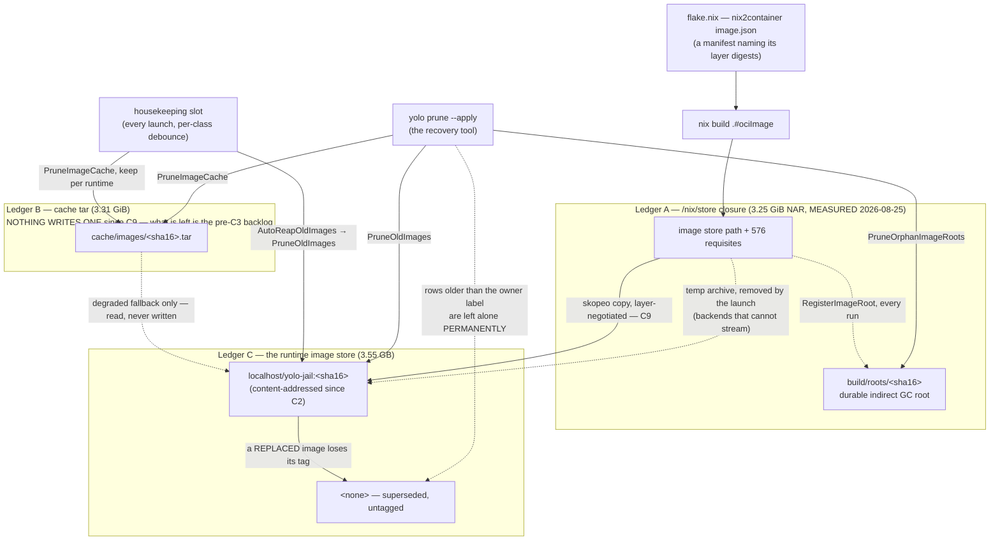

# Minimal disk footprint — reclamation that waits for a human is not reclamation

**Status:** DESIGN, 2026-08-25 — one ruling owed; audited and compacted 2026-09-18.
[OQ-DF4](#OQ-DF4) is the last live question and is no longer blocked — its measurement was
taken 2026-09-15 ([§2.6](#26-the-second-sample-2026-09-15--oq-df4-is-unblocked-and-the-residual-has-a-name)).
Every other ruling is made and built; [§11.1](#111-decision-ledger) has the dates and the commits.

> **In short.** A reclaimer whose only trigger is a human noticing is not a mechanism,
> it is a suggestion — so the fix is not a better sweeper but moving the delete into the
> process that made the bytes, with `yolo prune` demoted to a crash-recovery backstop.

**Why it matters.** The retention rules were correct and never ran. A hint had been true since
2026-07-23; the 125 tars it named, 404 GiB of them, were still on disk byte for byte when they were
re-counted ten days later ([§1.1](#11-what-a-human-noticing-is-worth-measured)).

**The shape.** One loaded image is stored three times — the `/nix/store` closure (rooted,
bounded, left alone), the cache tar, and the runtime's own image store — and each ledger gets
the deleter that owns its bytes ([§3](#3-the-three-ledgers)).

**Cost.** Deleting at the write path spends the offline safety net, and automating a
safe-in-principle sweep makes "safe at an arbitrary moment" a requirement rather than an
aspiration ([§5](#5-invariants--what-must-not-break) P7).

**Start at [§5](#5-invariants--what-must-not-break)** — the invariants are where that bill comes due.

**Needs your ruling:** [OQ-DF4](#OQ-DF4).

**Scope note.** This doc owns the *mechanism*; the measurement and the verdict are
[`image-staging-vs-baking.md`](../reference/image-staging-vs-baking.md)'s, whose
[OQ-5](../reference/image-staging-vs-baking.md#why-its-this-way) ruling this one executes.
**Split 2026-09-06** — everything that is not Ledgers A–C or [OQ-DF2](#OQ-DF2)–[OQ-DF4](#OQ-DF4)
went to [`disk-levers-and-backfill.md`](disk-levers-and-backfill.md) ([§8](#8-what-this-does-not-cover)).

**Reads with:**

- [`image-staging-vs-baking.md`](../reference/image-staging-vs-baking.md) — the ruling this doc executes, and the cost model every figure here interleaves with.
- [`disk-levers-and-backfill.md`](disk-levers-and-backfill.md) — the sibling split out 2026-09-06 (every store ranked by measured bytes; the automatic-vs-offered rule for the backlogs these fixes left behind).
- [`layer-aware-image-delivery.md`](layer-aware-image-delivery.md) — C9, which replaced this doc's shipped delivery mechanism and made Ledger B zero on every backend ([§3.2](#32-ledger-b--the-cache-tar-now-bounded-to-zero-on-every-backend)).
- [`../reference/image-retention.md`](../reference/image-retention.md) — the as-built account of image retention, where [`OQ-LS3`](../reference/image-retention.md#why-its-this-way) superseded this doc's retention count.
- [`../plans/storage-lifecycle.md`](../plans/storage-lifecycle.md) — the shipped GC work the ruling calls "nowhere near enough"; [§1.2](#12-where-the-shipped-gc-work-stops--the-precise-referent-for-nowhere-near-enough) says exactly where it stops.
- [`../plans/cache-relocation.md`](../plans/cache-relocation.md) — the settled threat model (yolo does not manage host symlinks or mounts) that bounds anything proposed here.
- [`../reference/storage-and-config.md`](../reference/storage-and-config.md) — where these bytes live, and the state/config separation a budget has to respect.
- [`../plans/handoff-cachix-cache.md`](../plans/handoff-cachix-cache.md) — the binary cache that makes *deletion cheaper to undo*: a complement to keep-zero, never an alternative.

---

## 1. The ruling, and what the bug actually is

The maintainer ruled on 2026-08-25, on [`image-staging-vs-baking.md`](../reference/image-staging-vs-baking.md) [OQ-5](../reference/image-staging-vs-baking.md#why-its-this-way):

> "bug, for sure. I see no reason to keep any of this around. I will be addressing this issue soon. we need to use minimal disk space. put an item on the roadmap for this and write a design doc using the skill. we've done some GC work, but it's nowhere near enough."

The interesting word is **"bug"**, because the obvious reading — "disk filled up" — is not a bug, it is a consequence. Disk fills up on a machine that builds container images sixty percent of commits ([`image-staging-vs-baking.md`](../reference/image-staging-vs-baking.md) [what moves the image](../reference/image-staging-vs-baking.md#what-moves-the-image) — restated here from the 2026-08-15 measurement, not re-measured; since the binaries left the image the rate is far lower). The bug is structural, and it is this:

**Reclamation exists, is correct, is tested, and has no trigger.**

Verified 2026-08-25 against `486a13bb`, by grepping every exported reclaimer in `internal/prune` for non-test callers outside `prunecmd.go`: **there were none.** Every reclaimer's only production entry point was `internal/prune/prunecmd.go` (`PruneHostArchive` the one indirection, reached from `PruneHostArchiveBuckets` in `internal/prune/hostarchive.go` — still only from `prunecmd.go`). That file's `Run` had exactly one caller, `internal/cli/commands.go`, reached only from the CLI dispatch table (`"prune": runPrune`). No timer, no hook, no launch-path call, no `just` recipe — and `rg -n "prune" Justfile scripts/ integration/` returned nothing at all, so the whole surface also had **zero integration coverage**.

**Seventeen reclaimers sat under that one trigger:** every exported `Prune*`/`Purge*`/`Sweep*`/`Reap*` in `internal/prune` (fourteen of them), plus `RunNixStoreGC`, `HardlinkDuplicateFiles`, and `capture.PruneSupersededCaptures` — the last of those added 2026-09-04 by [`../plans/install-capture.md`](../plans/install-capture.md) slice 5, under the same single trigger, and the first that does not live in `internal/prune` at all.

> [!NOTE]
> **The trigger gap is closed for six classes, so read the paragraph above as the dated evidence that opened this doc rather than as a description of the tree.** A launch now runs a post-attach **housekeeping slot** (`internal/cli/run/housekeeping.go`, [`disk-levers-and-backfill.md`](disk-levers-and-backfill.md) [§5.1](disk-levers-and-backfill.md#51-the-housekeeping-slot) [OQ-BF5](disk-levers-and-backfill.md#OQ-BF5)) under one lock, and each class carries its own debounce stamp: the superseded-image reap ([OQ-DF3](#OQ-DF3)), the image-tar reap (Ledger B, [§3.2](#32-ledger-b--the-cache-tar-now-bounded-to-zero-on-every-backend)), yolo's own superseded `/nix/store` outputs, the age-purge of the shared cache, orphaned agent staging plus retired loophole state, and superseded flake-bundle generations. `yolo prune` remains the only trigger for every OTHER reclaimer — and remains the recovery tool for all of them.

So the entire disk-reclamation capability of this project was gated on a human noticing.

### 1.1 What "a human noticing" is worth, measured

This is not a hypothetical failure mode; the repo has been running the experiment for a month and the result is unusually clean.

`yolo prune` prints a hint whenever `cache/images` exceeds 20 GiB (`imagesHintThreshold = 20 * (1 << 30)`, `internal/prune/prunecmd.go`). It appears on a plain dry-run, needs no flag, and survives redirection. It has been true continuously since **2026-07-23 09:12**, the moment the cache crossed the threshold at 22.01 GiB (MEASURED 2026-08-25, by accumulating the tars in mtime order).

The sharpest available evidence is not "the hint was ignored" — it is that **the exact artifacts the hint was about are still on disk, byte for byte.** [`image-staging-vs-baking.md`](../reference/image-staging-vs-baking.md) [the tar history](../reference/image-staging-vs-baking.md#the-tars-that-are-no-longer-written) measured 125 tars totalling 404.4 GiB on 2026-08-15. Measured today in the same directory:

```console
$ stat -c '%Y %s' *.tar | awk -v cut=$(date -d '2026-08-16' +%s) '$1<cut{s+=$2;n++} END{printf "n=%d GiB=%.2f\n",n,s/1073741824}'
n=125 GiB=404.45
```

Same 125 files, same 404 GiB, ten days later. Not one was reclaimed. A keep-3 retention rule that never runs is indistinguishable from no retention rule, and that is the defect: **a mechanism whose only trigger is a human noticing is not a mechanism, it is a suggestion.**

### 1.2 Where the shipped GC work stops — the precise referent for "nowhere near enough"

"Nowhere near enough" needs a referent or it is just agreement. Here it is.

[`../plans/storage-lifecycle.md`](../plans/storage-lifecycle.md) was written after a real incident: a host `nix-collect-garbage` reclaiming ~2.5 TiB swept a **running jail image's own store closure**, leaving 235 of 467 `/bin` symlinks dangling (`storage-lifecycle.md`). Its [§1](#1-the-ruling-and-what-the-bug-actually-is)–[§4](#4-a-budget-not-a-retention-count) shipped 2026-07-22 and delivered exactly four things:

| § | What shipped | Evidence, checked 2026-08-25 |
| :--- | :--- | :--- |
| [§1](#1-the-ruling-and-what-the-bug-actually-is) | A durable per-image nix GC root, `build/roots/<sha16>`, re-asserted every run | `internal/image/gcroot.go`; called from `AutoLoadImage`, `internal/image/autoload.go` |
| [§2](#2-measured-2026-08-25) | `yolo check` **warns** when the host daemon's `min-free == 0` — yolo never edits `nix.conf` | `internal/cli/check/section_autogc.go` |
| [§3](#3-the-three-ledgers) | Opt-in, bounded, rooting-aware `yolo prune --nix-gc`; refuses in-jail | `internal/prune/nixgc.go`; gating at `internal/prune/prunecmd.go` |
| [§4](#4-a-budget-not-a-retention-count) | Lifecycle sweeps for derived junk: dangling out-links, orphaned agent staging, age-purged agent logs | `internal/prune/{staleoutlinks,agentstaging,agentlogs}.go` |

Read that column again with the ruling in hand. **Every one of those four made a GC *safe*. None of them made a GC *happen*.** [§1](#1-the-ruling-and-what-the-bug-actually-is) creates roots (it adds a protection, not a reclaim). [§2](#2-measured-2026-08-25) is explicitly detect-and-warn. [§3](#3-the-three-ledgers) is opt-in and default-OFF. [§4](#4-a-budget-not-a-retention-count) sweeps classes that were never the bulk.

And storage-lifecycle knew this: its own consumer map already labels the tars `PruneImageCache(keep=3)` via `yolo prune` **(manual)** (`storage-lifecycle.md`). It recorded the exposure rather than closing it.

> [!IMPORTANT]
> **The gap between "safe to run" and "runs" is the whole of the new work.** Everything in [§4](#4-a-budget-not-a-retention-count)–[§10](#10-sequencing--what-i-would-build-in-order) below is an attempt to close that one gap without spending the safety that [§1](#1-the-ruling-and-what-the-bug-actually-is)–[§4](#4-a-budget-not-a-retention-count) bought.

---

## 2. Measured, 2026-08-25

All measurements below were taken by me in this development jail on 2026-08-25 against `486a13bb`, labelled **MEASURED** / **NOT MEASURED** in the manner of [`image-staging-vs-baking.md`](../reference/image-staging-vs-baking.md) [the tar history](../reference/image-staging-vs-baking.md#the-tars-that-are-no-longer-written). Every figure it restates from that doc I re-took rather than copied.

> [!IMPORTANT]
> **This is the PRE-C3 series, and it is retained as dated evidence rather than as a forecast.** C3
> shipped later the same day (2026-08-25) under the [OQ-DF1](#112-open-questions) ruling, so **the podman growth term
> — the `cache/images` rows below — goes to zero from that change forward**: nothing writes a tar on
> the podman happy path any more. The 480.71 GiB level and the +7.63 GiB/day rate are what the
> defect cost up to the fix; they are exactly the numbers that argued for it. The **backlog** those
> rows measure is still on disk (C3 stopped creating, it did not sweep — [§10](#10-sequencing--what-i-would-build-in-order)), and the `/nix/store`
> and device rows are unaffected by C3 entirely.
>
> **The podman row is superseded by a different change — C2, not C3 — and by a larger factor.** C3
> zeroed the tar rows; C2 replaced the single mutable `:latest` with a permanent per-config content
> tag, so superseded images are now *retained* rather than orphaned and the store holds seven images
> where this table recorded two. Read the `podman image store` row as **PRE-C2**, and
> [`image-staging-vs-baking.md`](../reference/image-staging-vs-baking.md) [the cost model](../reference/image-staging-vs-baking.md#cost-model) as the post-C2 state. The two
> supersessions run in opposite directions — C3 removed a growth term, C2 added one — which is
> exactly the trade [OQ-DF3](#OQ-DF3)'s retention number has to price.

> [!WARNING]
> **There are two image tar caches on this device and [`image-staging-vs-baking.md`](../reference/image-staging-vs-baking.md) [the tar history](../reference/image-staging-vs-baking.md#the-tars-that-are-no-longer-written) measured one of them.** Inside this jail `~/.local/share/yolo-jail` is a bind of `<ws>/.yolo/home/local/share/yolo-jail` — the **nested jail's** state dir, inside the repo working tree. The **host's** cache is mounted separately at `~/.cache`. [the tar history](../reference/image-staging-vs-baking.md#the-tars-that-are-no-longer-written)'s numbers are the nested one. Both are measured below; the true total is **606 GiB, not 404 GiB**.

### 2.1 Levels

| Thing | 2026-07-22 | 2026-08-15 | **2026-08-25** | Label |
| :--- | :--- | :--- | :--- | :--- |
| Nested `cache/images` (the path [the tar history](../reference/image-staging-vs-baking.md#the-tars-that-are-no-longer-written) measured) | 3 tars, 9.5 GiB | 125 tars, 404.4 GiB | **148 tars, 480.71 GiB**, mean **3.248 GiB** | MEASURED |
| ↳ oldest / newest tar | — | — | **2026-07-22 15:00** / **2026-08-25 11:39** | MEASURED |
| ↳ orphan `.tmp` from crashed materialize | — | — | **0** (148 of 148 are `*.tar`) | MEASURED |
| ↳ *reconciliation:* [`image-staging-vs-baking.md`](../reference/image-staging-vs-baking.md) [the cost model](../reference/image-staging-vs-baking.md#cost-model) counts **149** | — | — | the 149th is `de22e97910302cee.tar`, written 19:17:21 by the last pre-C3 load, between this pass and that one | MEASURED |
| **Host** `cache/images` (at `~/.cache/images`) | — | not distinguished | **36 tars, 125.41 GiB**, mean **3.484 GiB** | MEASURED (new) |
| **Both caches on this device** | — | — | **184 tars, 606.12 GiB** | MEASURED (new) |
| `/nix/store` | — | 209 GB | **659 GiB**, **38 441** entries | MEASURED |
| Root device `/dev/mapper/root` (btrfs; carries store, home, `/tmp`, `/workspace`) | 3.7 T, 45 % | 3.7 T, 2.5 T, 69 % | **3.7 T, 3.1 T used, 84 %, 608 G free** | MEASURED |
| Realized `*-stream-yolo-jail` store paths | — | 212 | **265** | MEASURED |
| Loaded image's `/nix/store` closure (`nix path-info -S`) | ~3.09 GiB (`storage-lifecycle.md`) | — | **3 491 272 560 B = 3.25 GiB** NAR, **577** paths | MEASURED |
| Loaded-image cache tar (`build/last-load-size`) | ~3.14 GiB | 3.28 GiB | **3 554 560 000 B = 3.31 GiB** | MEASURED |
| Load sentinel `build/last-load-podman` | — | — | **10 entries** (the LRU cap) | MEASURED |
| **podman image store** | — | **NOT MEASURED** | **PRE-C2: 2 images, 6.391 GB**; 0 containers, 0 volumes. Superseded the same day — after C2 the same command returns **eight rows over seven images** ([`image-staging-vs-baking.md`](../reference/image-staging-vs-baking.md) [the cost model](../reference/image-staging-vs-baking.md#cost-model)) | MEASURED (first time), then PRE-C2 |
| Apple Container image store | — | — | **NOT MEASURED** — no `container` runtime in this jail | NOT MEASURED |
| Durable image GC roots on the host, and the union closure they pin | — | — | **NOT MEASURED** — `build/roots` is host-side only and does not exist in this jail ([§3.1](#31-ledger-a--the-nixstore-closure-correct-leave-it-alone)); only an upper bound on the closure is derivable | NOT MEASURED |

### 2.2 Rates — the numbers to argue from

| Series | Window | Δ | Rate |
| :--- | :--- | :--- | :--- |
| Nested `cache/images` | 08-15 → 08-25 (10 d) | +23 tars, **+76.26 GiB** | **+7.63 GiB/day** |
| Nested `cache/images` | 07-22 → 08-25 (34 d) | +145 tars, +471.2 GiB | +13.86 GiB/day |
| ↳ same, **excluding the two spike days** | 34 d | +68 tars, +220.4 GiB | **+6.48 GiB/day** |
| `/nix/store` | 08-15 → 08-25 (10 d) | +450 GiB | **+45.0 GiB/day** |
| Root device used | 08-15 → 08-25 (10 d) | 69 % → 84 % ≈ +550 GiB | **≈+55 GiB/day** |
| **Headroom at the 10-day device rate** | — | 608 GiB free | **≈11 days to 100 %** |

Three things the rates say that the levels do not:

1. **The tar growth did not decelerate.** 16.5 → 7.6 GiB/day looks like a slowdown, but 2026-07-27 (40 tars) and 2026-08-02 (37 tars) alone account for **77 tars / 250.8 GiB — 52 % of the entire cache in two days**. Strip them from the 34-day Δ (145 − 77 tars, 471.2 − 250.8 GiB) and the rate is 6.48 GiB/day, within 18 % of the recent 7.63. The honest model is a **~7 GiB/day floor plus ~125 GiB per spike day**, not a decaying curve. A design that only handles the floor will be defeated by one bad afternoon.
2. **The store, not the tars, is now the larger line item.** `/nix/store` grew 450 GiB in ten days — six times the nested tar cache's 76 GiB. [§8](#8-what-this-does-not-cover) says why this doc nonetheless does not claim it.
3. **Two unrelated instruments agree, so 659 GiB is real.** Store +45.0 and nested tars +7.63 sum to 52.6 GiB/day against a separately-measured device growth of ≈55 GiB/day. That the residual is small is the cross-check that the store figure is not a `du` artifact.

### 2.3 Caveats, stated rather than buried

- **Every number is from one machine — this jail.** This is the same limitation [`image-staging-vs-baking.md`](../reference/image-staging-vs-baking.md#cost-model) states over its cost model, and it applies unchanged. It is enough to establish that the defect is real and roughly how fast it bites; it is not a population estimate.
- **The 2026-08-15 `/nix/store` "209 GB" does not record its unit or command.** I read it as `du -sh` (GiB), because the device cross-check in [§2.2](#22-rates--the-numbers-to-argue-from) closes to ~5 % that way and does not otherwise.
- **The 08-15 device figure is a `df -h` rounding** ("2.5 T", "69 %"). The ≈+550 GiB is derived from the percentage against the precise total; from the rounded "2.5 T" it is ≈+600 GiB. The runway is 11–12 days either way, which is the only thing the number is load-bearing for.
- **"100 % reclaimable" in `podman system df` is measured on a nested podman with zero running containers.** It correctly reports that nothing holds these images *right now*; it is not a claim that a real host's running jail image is reclaimable. The orphaned `<none>` rows in [§3.3](#33-ledger-c--the-runtime-image-store-and-the-nameless-row) — **three** of them as of the post-C2 pass, not the one this console block shows — are orphaned regardless.

### 2.4 Re-measured 2026-09-02 — the backlog is gone here, and the device kept filling anyway

Same jail, eight days later; three facts that move the questions below.

- **The nested `cache/images` backlog was reclaimed: 3 tars, 10 GiB** (was 148 / 480.71 GiB),
  newest tar mtime 2026-08-25 19:17 and nothing since — C3 doing its job. Three is exactly
  `ImageCacheKeep`'s default, which is the fingerprint of a **manual `yolo prune --apply`** having
  run. That is **field evidence for [OQ-DF2](#OQ-DF2)'s leaning (iii)**: the recovery tool works when a human
  reaches for it — and it is exactly the "reclamation that waits for a human" the title objects
  to, so it argues *for* this doc, not against it. [§10](#10-sequencing--what-i-would-build-in-order)'s "pre-C3 backlog untouched" is discharged
  for this machine's nested cache; the host-side 125.41 GiB cache was **NOT observable** from this
  jail today (`~/.cache/yolo-jail` holds 164 KiB of loophole remnants; the mount [§2](#2-measured-2026-08-25)'s warning
  described is not present in this session), so that backlog's fate is unknown.
- **The device lost ~92 GiB of free space in those same eight days** — 87 % full, 516 GiB free,
  vs. 84 % / 608 GiB on 08-25 — **despite** the ~470 GiB reclaim, and `/nix/store` grew only
  +6 GiB (659 → 665). So the current growth driver is in **none of the three ledgers**: something
  else on the shared block device ([`storage-lifecycle.md`](../plans/storage-lifecycle.md)'s
  scope does not cover it either). **That is a new input to [OQ-DF4](#OQ-DF4)**: a budget scoped to yolo's
  ledgers can be met while the device fills at ~11.5 GiB/day, which is roughly the pre-C3 rate —
  the doc that reaches "minimal disk space" needs at least a named pointer at the untracked
  remainder, even if the mechanism stays out of scope.
- **Ledger C observations do not survive a jail restart**: this container instance's podman store
  is empty (`GraphRoot=/var/lib/containers/storage`, outside the persistent home), so [§3.3](#33-ledger-c--the-runtime-image-store-and-the-nameless-row)'s
  eight-row/three-nameless snapshot cannot be re-taken from here. Ledgers B and C have now been
  *observed* drifting fully independently on one machine — 480 GiB in B while C was empty — which
  is the separateness [OQ-DF2](#OQ-DF2)/[OQ-DF3](#OQ-DF3) already assume, measured rather than argued.

---

### 2.5 Re-measured 2026-09-14 — the first `yolo stores` sample, and a FOURTH ledger

The instrument [OQ-BF9](./disk-levers-and-backfill.md#OQ-BF9) shipped on 2026-09-08 took its first
sample on the maintainer's host on 2026-09-14, and `yolo prune --apply` ran minutes later. Three
findings, and the third is the one that matters.

**The pre-C3 backlog is discharged, on the host this time.** `cache/images` measured **0 B**. [§2.4](#24-re-measured-2026-09-02--the-backlog-is-gone-here-and-the-device-kept-filling-anyway)
could only report the nested cache and said the host-side 125.41 GiB was NOT observable; it is now
observable and it is empty. Ledger B is closed on podman in fact, not just in design.

**The three ledgers are no longer where the bytes are.** Total state dir 78.6 GiB, of which
`cache/` is 73.7 GiB — and the two largest subdirs are `go-build` (37.9 GiB) and `uv` (30.5 GiB),
both age-purgeable and both reclaiming **0 B** because nothing in them is older than the 30-day
rule. So the cache is large, covered, and not yet due.

**A FOURTH LEDGER, and it is the best candidate for [§2.4](#24-re-measured-2026-09-02--the-backlog-is-gone-here-and-the-device-kept-filling-anyway)'s unexplained growth.** `yolo stores`
measures what the three-ledger model never counted — yolo's own `/nix/store` outputs:

| Row | Size | Paths |
| :--- | ---: | ---: |
| install prefixes | 24.1 GiB | 277 |
| Go builds | 12.3 GiB | 295 |

**36.4 GiB across 572 store paths.** [§2.4](#24-re-measured-2026-09-02--the-backlog-is-gone-here-and-the-device-kept-filling-anyway) measured the device losing ~92 GiB in eight days with
`/nix/store` up only 6 GiB and concluded the driver was "in none of the three ledgers". This is a
fourth one, it is yolo's own, and [§8](#8-what-this-does-not-cover) hands it to
[`disk-levers-and-backfill.md`](disk-levers-and-backfill.md) precisely because nothing here counts
it. Every launch with `YOLO_REPO_ROOT` set builds a prefix, which is what developing this repo
does all day.

> [!IMPORTANT]
> **It is never reclaimed on that machine, and the reason is a probe rather than a policy.** Both
> store-output reapers SKIPPED in the same `yolo prune --apply` run:
>
> ```
> yolo's own superseded store outputs
>   skipped — could not ask podman which prefix each running jail executes from
> Orphaned prefix GC roots  (the jail's own binaries)
>   skipped — same
> ```
>
> That is the tri-state rule working as designed — a reaper that cannot ask declines rather than
> sweeping — and the decline was CORRECT. What was wrong is that the ask failed at all: podman was
> plainly reachable in that run, which removed 1 image and 18 orphaned image GC roots.
>
> **FIXED since** (`00b85850`, *"a container with no prefix mount is an ANSWER, not a failure to
> ask"*). `LivePrefixSources` (`internal/prune/prefixroots.go`) had conflated "I could not ask" with
> "I asked and this container mounts no prefix", so one ordinary container disabled the whole pass;
> it now distinguishes them through `inspectMountSourceKnown`, still declines wholesale when any
> single container genuinely cannot be inspected, and **names the container in the decline** so the
> next failure is diagnosable rather than anonymous. The reaper also has a trigger now
> (`reapSupersededStoreOutputs` in the housekeeping slot), so the largest growing ledger is swept on
> the same footing as the rest. **The lesson is the durable part:** a two-valued answer to a
> three-valued question does not look broken — it looks like a reaper that keeps declining.

**A number worth stating once:** 45.7 GiB sits in 13 untagged podman rows that yolo declines
**permanently** — an untagged row has lost the repository name that was the only evidence it was
yolo's, and these predate the provenance label. `podman image prune` is the human's to run, by
design ([§3.3](#33-ledger-c--the-runtime-image-store-and-the-nameless-row)).

**One sample is not a rate.** Every `GROWTH` cell still reads `—`, because a rate needs two dated
samples and this is the first. [OQ-DF4](#OQ-DF4) is one sample closer and still blocked; the second
run is what unblocks it.


### 2.6 The second sample, 2026-09-15 — [OQ-DF4](#OQ-DF4) is unblocked, and the residual has a NAME

Taken 2026-09-15 03:13 UTC on the same host, ~1 day after [§2.5](#25-re-measured-2026-09-14--the-first-yolo-stores-sample-and-a-fourth-ledger). Every `GROWTH` cell is populated, so
[OQ-DF4](#OQ-DF4)'s blocker is discharged: its own note said *"Rule BF9 first … answerable the run
after a second sample exists"*, and [OQ-BF9](./disk-levers-and-backfill.md#OQ-BF9) was ruled AND
built on 2026-09-08 — its ledger is what recorded these samples (`stores/`, 50 recorded, last 30
kept, self-bounded exactly as ruled).

⚠ **Read the negative cells as PRUNE ARTIFACTS, not trends.** `yolo prune --apply` ran between the
two samples, so `untagged rows` −6.5 GiB/d, `install prefixes` −5.5 GiB/d, `Go builds` −11.2 GiB/d
and `flake-bundles` −650 MiB/d record one human act rather than a rate. A one-day delta spanning a
reclaim is the weakest thing this ledger can produce; the 30-sample bound is what fixes that over
time. **The positive cells on stores with NO reclaimer are the signal**, because nothing acted on
them in either direction.

| Store | Size | Growth | Reclaimer |
| :--- | ---: | ---: | :--- |
| `mise/` | 2.6 GiB | **+108.2 MiB/d** | none |
| `cache/staticcheck` | 965.7 MiB | **+85.9 MiB/d** | none |
| `cache/gh` | 14.9 MiB | +2.1 MiB/d | none |
| `logs/` | 1.1 MiB | +24.4 KiB/d | none |
| **total** | **3.6 GiB** | **≈196 MiB/d ≈ 70 GiB/yr** | |

**This is the condition [OQ-DF4](#OQ-DF4)'s leaning held itself open for** — *"a residual that only a
ceiling catches"* — now observable for the first time. The write path does **not** bound itself.

> [!IMPORTANT]
> **And the measurement argues AGAINST a ceiling anyway, which is the useful part.** The residual is
> not diffuse: it is **two named stores**, `mise/` and `cache/staticcheck`, carrying 99% of the
> unreclaimed growth between them. A byte ceiling is the instrument for residue you cannot attribute;
> residue with a name and a path wants a **reclaimer**. So the data strengthens *policy, not a
> number* rather than flipping it — and it converts the open question from "what ceiling?" into
> "sweep these two, or declare them the human's", which is a smaller decision with a testable answer.

**A second finding, and it is a possible DEFECT rather than a policy input.** `cache/uv` holds
**30.8 GiB** and grew **+270 MiB/d** across a window in which a purge ran — but its reclaimer is
`PurgeCacheByAge (older than 30d)`, and 30.8 GiB at that rate is ~114 days of accumulation, roughly
3.8× what a 30-day cutoff should leave standing. `purgeOldFilesUnder` removes regular files *"whose
mtime is before"* the cutoff (`internal/prune/cachepurge.go`), so the candidates are: the one-day
rate is atypical; uv refreshes mtimes on cache hits, so nothing ever ages out; or that subdir is not
in the purge's list. `cache/go-build` is the control and it is consistent — 40.6 GiB at +2.5 GiB/d is
~16 days, inside the cutoff. **Not diagnosed here:** it needs an mtime histogram of that subdir on
the host, which no frame in the jail can take.

⚠ **A coverage gap this inventory cannot see.** Agent worktrees under
`<workspace>/.claude/worktrees/` measured **985 MB across 20 stale trees** on 2026-09-14, on the same
device as the state dir — and they appear in no row above, because every frame here is rooted at
yolo's state dir, the shared cache, the image store or `/nix/store`. Workspace-local bytes are
outside all four. Whether that belongs to this doc, to [`disk-levers-and-backfill.md`](disk-levers-and-backfill.md), or to nothing is undecided.


## 3. The three ledgers

A single loaded image is stored three times, in three places, with three different owners and three different reclaim stories. This is the structural map everything below argues from.



> [!NOTE]
> **The map is drawn as it is NOW, and three of its edges are younger than [§2](#2-measured-2026-08-25)'s measurements.** C3 (2026-08-25) stopped podman writing a tar and C9 (2026-09-09) stopped every other backend, so Ledger B's growth term is **zero** and what remains on a machine is the pre-C3 backlog. C2 made the tag content-addressed, so a *superseded* image is no longer orphaned every time another workspace launches — it goes `<none>` only when the tag it owns moves to a newer image, which is either a rebuilt store path or a re-delivery of the same one ([§3.3](#33-ledger-c--the-runtime-image-store-and-the-nameless-row)). And the deleters are no longer one human-typed command: the launch's housekeeping slot drives both reclaiming edges, with `yolo prune` kept as the recovery tool ([§1](#1-the-ruling-and-what-the-bug-actually-is)). [§2](#2-measured-2026-08-25)'s measured series is the PRE-C3 series and is retained as dated evidence.

### 3.1 Ledger A — the `/nix/store` closure. Correct; leave it alone.

**Writer:** `nix build .#ociImage` via the host daemon. **Pinned by:** an indirect GC root at `build/roots/<sha16>`, where `sha16` is the first 16 hex of `sha256(storePath)` — the *same key* as the cache tar, deliberately, so the two can never drift (`image.ImageStoreKey`, `internal/image/gcroot.go`). Re-asserted on **every** run, including when the image was already loaded, so a reaped root self-heals (`internal/image/autoload.go`). **Deleter:** `nix store gc` only, and only via the opt-in `yolo prune --nix-gc`.

This ledger is the one part of the system that already works the way the whole system should. The ordering is right — `RegisterRoot` runs *before* `os.Remove(outLink)` (`autoload.go`), so there is no unrooted window — and reclamation is triple-guarded (tri-state liveness, an LRU-10 protected set, a 3600 s age floor, `internal/prune/imageroots.go`).

> [!NOTE]
> **The store's growth is not a leak here.** A durable root per distinct loaded image closure is roots doing their job, and how many of them exist on the host is **NOT MEASURED** ([§2.1](#21-levels)): `build/roots` is host-side only, and `RegisterRoot` is a no-op in-jail (`internal/image/autoload.go`), so this jail's own `build/` holds no `roots/` directory at all to count. The store grows because nothing collects *unrooted* paths, which is the host's `min-free` setting — [§8](#8-what-this-does-not-cover).

### 3.2 Ledger B — the cache tar, now bounded to zero on every backend

**Writer: none, on any backend.** C3 removed podman's on 2026-08-25, and C9 removed the last one on 2026-09-09 ([`layer-aware-image-delivery.md`](layer-aware-image-delivery.md)). A backend that cannot take a stream — Apple Container, and podman on macOS — gets a **temporary** archive at `cache/images/<key>.oci-archive.tmp` or `.docker-archive.tmp`, which the launch removes itself (`deliverViaArchive`, `internal/image/autoload.go`). Nothing writes a *retained* tar any more, so "unbounded on Apple Container" stopped being true with C9.

**Deleter:** `PruneImageCache(dir, keep, apply)` — sorts tars by mtime newest-first, drops the tail beyond `keep`, and always sweeps `*.tmp` (`internal/prune/imagecache.go`). `keep` is per-runtime rather than a fixed 3: `ResolveImageCacheKeep` is **0 on podman** and 3 on Apple Container (`internal/prune/prunecmd.go`), which is [OQ-DF1](#112-open-questions)'s ruling applied to the reaper by [`disk-levers-and-backfill.md`](disk-levers-and-backfill.md) [OQ-BF6](disk-levers-and-backfill.md#OQ-BF6) rather than a new decision.

**Trigger:** the launch's housekeeping slot (`reapImageTars`, `internal/cli/run/housekeeping.go`), on its own per-class debounce. So this ledger is bounded at the write path *and* swept automatically; what a machine still holds is the pre-C3 backlog of legacy docker-archives — ~485 GiB of it on the maintainer's machine when this was written, measured **0 B** by 2026-09-14 ([§2.5](#25-re-measured-2026-09-14--the-first-yolo-stores-sample-and-a-fourth-ledger)).

> [!WARNING]
> **ZERO RETAINED IS NOT ZERO READABLE**, and a change that "finishes" this by deleting the reader breaks the safety net [OQ-DF1](#112-open-questions) deliberately kept. `newestTars` still loads any `*.tar` on disk ([§6](#6-the-offline-safety-net-honestly)). C9's temp archives are named so that reader **cannot** match them, and that is load-bearing rather than tidy: an archive written into the cache as a `.tar` would be loaded by the degraded branch, which then claims `:latest` for an image named by its content ref — a launch that fails at `podman run`, on the path that exists to rescue a launch.

Two facts about this ledger matter enormously for [§4](#4-a-budget-not-a-retention-count) and [§6](#6-the-offline-safety-net-honestly), and they pull in opposite directions:

- Deleting a tar is **always safe for a running jail** — the tar is a one-shot load artifact, and the runner depends on Ledger A's closure. The code says so in `internal/prune/prunecmd.go`. This is what licenses aggression.
- The tar is also the **offline fallback** when a build fails and no image is loaded (`newestTars`, `internal/image/autoload.go`). C3 and C9 both kept that consumer working on whatever tars exist — they removed the writer, not the reader (`TestBuildFailureFallbackStillLoadsAnExistingTar`, `internal/image/layercopy_test.go`). This is what [`image-staging-vs-baking.md`](../reference/image-staging-vs-baking.md#a-failed-build-is-fatal) R4 defends. [§6](#6-the-offline-safety-net-honestly) resolves it.

> [!WARNING]
> **`PruneImageCache`'s keep-N eviction branch is still not executed by any test, and it is now on the launch path** — which is exactly the promotion R7 warned about. Checked 2026-09-18: there is no `imagecache_test.go`, and `internal/cli/run/housekeeping_test.go` pins that `reapImageTars` is *called* rather than what it evicts. The `.tmp` sweep is covered; the tail-drop is not. This is the untested branch guarding the largest artifact class.

### 3.3 Ledger C — the runtime image store, and the nameless row

> [!IMPORTANT]
> **The heading used to read "The one with no reclaimer for a nameless row", and that is no longer
> true** — [OQ-DF3](#OQ-DF3)'s REACH ruling gave nameless rows a reclaimer by baking an OWNER LABEL
> into the image, which survives the loss of the tag. Renamed rather than annotated, because a
> heading that states a fact is the place a reader stops checking.
>
> **What the section below still describes correctly is the SHAPE of the blind spot**, and one live
> remnant of it: a label marks only images built AFTER it shipped, so every `<none>` row already on
> a machine is still unattributable and is left alone permanently. That remnant is real, is
> surfaced by `yolo stores` as a class nothing reclaims, and is why the repository-name probe had
> to survive beside the label probe rather than being replaced by it.

This is the answer to "which of the three does yolo have no reclaimer for", and it is worse than "no reclaimer" — there is a reclaimer that could not see its targets, and (since C2) can now see rather more than it used to.

**The pre-C2 mechanism, in the past tense — because it is the evidence the WARNING below rests on.** `PruneOldImages` runs `podman images --format "{{.ID}} {{.Repository}}:{{.Tag}} {{.CreatedAt}}" yolo-jail` (`imageListFormat`, `internal/prune/probes.go`). That trailing `yolo-jail` is a **repository-name filter**, and it still is. Before C2 there was exactly one tag on this machine, `localhost/yolo-jail:latest`, so a superseded load was *untagged*: the next `podman load` retagged `:latest` onto the new image and orphaned the old one as `<none>`, which never matched the filter. **MEASURED PRE-C2**, live in this jail earlier on 2026-08-25:

```console
$ podman images
REPOSITORY           TAG       IMAGE ID      CREATED       SIZE
localhost/yolo-jail  latest    226a6fd81f36  5 hours ago   3.55 GB
<none>               <none>    f3f0380b0645  17 hours ago  3.55 GB

$ podman images --format "{{.ID}} {{.Repository}}:{{.Tag}}" yolo-jail
226a6fd81f36 localhost/yolo-jail:latest          # the <none> row is invisible

$ podman system df
TYPE     TOTAL  ACTIVE  SIZE      RECLAIMABLE
Images   2      0       6.391GB   6.391GB (100%)
```

`PruneOldImages` could only ever see **one** row there, so `keep=2` never triggered and the dangling 3.55 GB was never reclaimed by yolo. Both of those image IDs are `<none>` today — but only one of them was orphaned by the pre-C2 mechanism this paragraph describes. `f3f0380b0645` is the genuine pre-C2 orphan: `podman image inspect … --format '{{.NamesHistory}}'` returns `[localhost/yolo-jail:latest]`, the only name it ever held. `226a6fd81f36` still held `:latest` in the console block above and lost it *afterwards*, to a C2-era load; its history is `[localhost/yolo-jail:latest localhost/yolo-jail:c2probe000000001 localhost/yolo-jail:d00dfeedcafe1234]`. The distinction matters because the mechanism that orphaned `226a` — `pointLatestAt` moving the legacy alias (`internal/image/autoload.go`) — is **still live**. See [`image-staging-vs-baking.md`](../reference/image-staging-vs-baking.md#the-content-addressed-image-ref) for how the `:latest` alias moves. There was also no other path, and there still is not: `rg` over `internal/` excluding tests finds no `podman image prune`, no `system prune`, and no `rmi` of a dangling ID — the only `rmi` in the tree is `probes.go`, *inside the function whose filter hid the target*.

**The post-C2 shape, in the present tense.** Every config now keeps a **permanent** content tag (`image.JailImageRef`), so the repo-name filter returns **one row per NAME** rather than one row in total — the newest image appears twice (content tag + `:latest`), and each additional config adds a row of its own. **`keep=2` can therefore fire**, which is precisely why C2 had to ship a dedup by image ID and a liveness veto alongside it, and why `4064f720` then had to make that veto fail SAFE (`internal/prune/probes.go`; `ProtectedImageTags` returns `(tags, known)` and `PruneOldImages` declines when `known` is false). Measured after C2 in [`image-staging-vs-baking.md`](../reference/image-staging-vs-baking.md) [the cost model](../reference/image-staging-vs-baking.md#cost-model): four content tags coexisting, five named rows over four images.

**What is still unreclaimable is a smaller class, and it has not gone away.** The general rule is simply: **an image goes `<none>` when the last name it held moves to another image.** **Three** things still do that, and the third was missing from this list until 2026-08-25.

- **(1) The pre-C2 residue above** — a pre-C2 load's only name was `:latest`, so when `:latest` moved it lost everything. Only `f3f0380b0645` is this case; `226a6fd81f36` belongs to (1b).
- **(1b) A `:latest` move on a machine that is already post-C2** — the same *event*, a different *era*. `pointLatestAt` (`internal/image/autoload.go`) still runs `podman tag` on every load, which strips the alias from whatever held it; that is what finally orphaned `226a6fd81f36`, **after** C2 shipped. The mechanism is not extinct. What C2 removed is narrower: a normally-loaded image now always holds a content tag as well, so losing `:latest` no longer leaves it nameless.
- **(2) Post-C2, re-streaming the same store path** — mints a new image ID because the flake bakes `created = "now"` (`flake.nix`), and hands the content tag to the newer build.
- **(3) The degraded build-failure fallback — still a live producer of `:latest`-only images, and the one place (1b) still bites.** When the build fails or is skipped and no image is in the runtime, `AutoLoadImage` loads the newest cached tar with `ImageLoadCmd` (`internal/image/autoload.go`); the code notes that the tar's own RepoTags name the loaded image and that the flake bakes `tag = "latest"` (`internal/image/autoload.go`, `flake.nix`), so what lands has **exactly one name**. The next normal load moves `:latest` off it and the row goes `<none>` — the pre-C2 shape, reproduced on a current machine. Rare by construction (it needs a failed build **and** an empty runtime store, [§6](#6-the-offline-safety-net-honestly)), but not extinct, and the row it leaves is invisible to the repo-name filter like the other two. **[OQ-DF3](#OQ-DF3)'s reach question has to price this class too**, since it is the only path by which a post-C2 machine still manufactures the very orphan C2 is credited with ending.

**Only (2) is cheap.** [`image-staging-vs-baking.md`](../reference/image-staging-vs-baking.md) [the cost model](../reference/image-staging-vs-baking.md#cost-model) measures such a re-stream pair at **91.36 kB unique** against 3.554 GB shared — the same closure with a different timestamp — while the two older orphans on this machine, one from (1) and one from (1b), cost **2.836 GB unique** each. That split is the point: the price is not set by *which mechanism* made the orphan, but by whether its closure differs from every surviving image's. (1), (1b) and (3) are expensive because they orphan a distinct build; (2) is cheap because it orphans a duplicate. Either way the row is nameless, and a nameless row is the class [OQ-DF3](#OQ-DF3) has to rule on, because the repository name was the only evidence it was yolo's.

The leaking case is still the common one, but it leaks a different amount. 60 % of commits forced a rebuild when this was written ([`image-staging-vs-baking.md`](../reference/image-staging-vs-baking.md) [what moves the image](../reference/image-staging-vs-baking.md#what-moves-the-image) — restated from the 2026-08-15 measurement, not re-measured here, and far lower since the binaries left the image); before C2 each of those orphaned its predecessor outright, and after C2 each mints a permanent tag that is retained rather than orphaned — which trades an invisible `<none>` for a visible row that `keep=N` will eventually have to have a number for.

> [!WARNING]
> **A global tag plus a global sentinel made concurrent jails thrash — FIXED by C2, 2026-08-25.** `localhost/yolo-jail:latest` was one name per machine and `build/last-load-<runtime>` is one sentinel per runtime (`internal/image/autoload.go`) — neither per-workspace. Jail B loading a different image retagged `:latest` away from jail A's. A kept running (podman resolved the tag to an ID at create time), but A's image was then `<none>` and invisible to the reclaimer; A's *next* launch saw `lastLoaded != currentPath` and reloaded. Two jails with different configs orphaned each other's image on every launch.
>
> **C2 shipped:** the ref is `<repo>:<sha16-of-store-path>` (`image.JailImageRef`), so each config keeps its own permanent name and neither jail can orphan the other's image. **This leak source is closed; the `<none>` rows above are not** — an image is still left nameless when the tag it owns moves to a newer image, which is the residue A8 and [OQ-DF3](#OQ-DF3) are about. It also had a consequence in the other direction that C2 had to fix in the same change: a pass that could never fire suddenly could. See [`image-staging-vs-baking.md`](../reference/image-staging-vs-baking.md#the-content-addressed-image-ref) R3.
>
> **Correction, MEASURED 2026-08-25:** an earlier version of this warning said an image is untagged only "when *its own* store path is rebuilt". That is too narrow. **Re-streaming the SAME store path also mints a new image ID** — the flake sets `created = "now"` (`flake.nix`), so the build timestamp is image content — and the new image takes the content tag, leaving the previous one `<none>`. It is nearly free: [`image-staging-vs-baking.md`](../reference/image-staging-vs-baking.md) [the cost model](../reference/image-staging-vs-baking.md#cost-model) measures such a pair at **91.36 kB unique each** against 3.554 GB shared, because every layer but the metadata is identical. Cheap, but it is a `<none>` row all the same, so it is in [OQ-DF3](#OQ-DF3)'s class.

---

### 3.4 What made a nameless row reclaimable — the label, and the veto beside it

Two mechanisms landed on top of [§3.3](#33-ledger-c--the-runtime-image-store-and-the-nameless-row)'s blind spot, and they answer different questions. Confusing them is how a reaper ends up removing someone else's image, or refusing to remove its own.

**Provenance: a LABEL, intrinsic to the image.** MEASURED in this jail 2026-09-08 on podman 5.8.4 — build an image carrying `LABEL org.yolo-jail.owner="yolo"`, then untag it so it becomes exactly the `<none>` row the problem is about:

```console
$ podman untag labeltest:probe
$ podman images -a --filter label=org.yolo-jail.owner=yolo --format '{{.ID}} {{.Repository}}:{{.Tag}}'
6c8421f2a1d6 <none>:<none>
```

**The label survives the loss of the tag and stays filterable**, which is strictly better than recording image IDs at load time on three counts: it needs no ledger (so no ten-entry cap, and no dependence on which yolo did the loading), it identifies images this machine never loaded through yolo at all, and it cannot drift out of sync with the thing it describes because it **is** part of the thing. It is one entry in the image `config`, where `Cmd` and `Env` already live.

**The label carries TWO values, and the distinction is the point.** One is unique per image — provenance, *"which build was this"*. One is equal across images of the same workspace configuration and differs across configurations — grouping, *"which of my configs is this"*. The second exists because [`OQ-LS3`](../reference/image-retention.md#why-its-this-way) keys retention by CONFIGURATION and has no other source for it: `ImageStoreKey` is `sha256(storePath)[:16]` (`internal/image/gcroot.go`), per image and moving on every `flake.lock` bump, so grouping by it keeps everything. One label, one image rebuild, two rulings served.

Two corrections the build measured, both of which a reimplementation would otherwise re-derive:

- **The probe carries no `-a`.** A plain listing already returns the untagged row; `-a` additionally surfaces build intermediates the ruling does not authorize removing.
- **The label value cannot be a per-image key.** Nix cannot reference a derivation's own output path, so `imageIdentity` — one value per `flake.nix` + `flake.lock` — is the finest identity spellable, and the label therefore proves OWNERSHIP rather than identity.

> [!WARNING]
> **A label says "ours". It never says "not in use", and the reap needs both answers.** The liveness veto is the other half: it shipped with C2 (which armed a pass that had never fired), and `4064f720` then made it fail SAFE rather than open — `ProtectedImageTags` returns `(tags, known)` and `PruneOldImages` declines the sweep entirely when `known` is false. MEASURED 2026-08-25: with `$HOME` pointed at an empty directory the pre-fix build selected `8297369f734d`, an image the real ledger vouches for, while the post-fix build reports *"skipped — could not read the image load ledger; declining to sweep"*. `feddc5e0` then stopped the reaper force-removing an image at all, so a plain `rmi` fails on an image a container is using and safety survives a wrong answer rather than depending on a right one.

**The broad option was refused, and the price of refusing it is small and back-loaded.** `podman image prune` over dangling images reclaims everything, including rows on a podman shared with the user's non-yolo work — someone else's images, which is the move [`../plans/cache-relocation.md`](../plans/cache-relocation.md)'s threat model exists to refuse (P6, by analogy). What that costs is measured: [`disk-levers-and-backfill.md`](disk-levers-and-backfill.md) [§2.2](disk-levers-and-backfill.md#22-the-image-reap-priced-against-this-store) prices the four nameless rows on this machine at **91.3 kB unique each today**, and as the last holders of a **3.565 GB** chain once their tagged twins go. **So the reach question is worth ~3.5 GB, and worth it only AFTER the tagged pass — which is the opposite of how it looks before one.**

> [!NOTE]
> **Ledger C has no write-path moment for a delete-on-success rule to attach to, and that is by construction.** C2 gives every distinct store path its **own permanent tag**, so a launch that mints tag N never overwrites or supersedes tag N−1 — there is nothing for a writer to clean up after itself. Ledger B has a 1:1 writer-to-artifact relationship and Ledger C does not, which is why the two ledgers ended up with different placements under one ruling ([§11.1](#111-decision-ledger), [OQ-DF2](#OQ-DF2)).

---

## 4. A budget, not a retention count

Every retention rule here was **keep-N-by-mtime**. That is a *count*, and the maintainer stated a goal in *bytes*: "we need to use minimal disk space." The mismatch is not pedantry; it is why the policy drifts without anyone changing it — **and this argument won on both bulk classes**: the tar count is 0 on a runtime that streams, and the image count was deleted outright rather than retuned ([§11.1](#111-decision-ledger)).

**Why a count is the wrong unit for this class.** A count says nothing about bytes. `keep=3` was 9.5 GiB in July when a tar was 3.14 GiB, and ~10.5 GiB a month later against a 3.48 GiB host-side mean — the cost of the retention rule rises with no change to the rule. Worse, a count cannot express "minimal": there is no N that means *zero unless needed*.

**But keep-N is not wrong everywhere,** and the distinction is the useful one. yolo's artifact classes divide cleanly by *why* they are retained:

| Retention rationale | Classes | Right unit |
| :--- | :--- | :--- |
| **Undo buffer** — "I applied, noticed, applied again, then looked" | host-render archive, retired loophole state (both `hostArchiveKeep = 3`, `internal/prune/prunecmd.go`) | **a count.** Correct as-is; bytes are trivial and one generation can hold a CA private key, which is why keep-N beats an age cutoff (`internal/prune/loopholestate.go`) |
| **Regenerable bulk** — reproducible from a nix build | image tars, podman's superseded images | **bytes, or better: nothing at all** |
| **Regenerable-but-expensive** — a re-download | `cache/{npm,go-build,uv,pip,…}` | age (already correct, `PurgeCacheByAge`) |

Applying one knob shape across all three is a category error. The proposal below therefore does *not* touch the undo-buffer classes.

### 4.1 Candidate invariants, weighed

**(a) Delete-on-successful-load.** Once the load that consumed a tar returns 0, the tar's only remaining job is the offline fallback ([§6](#6-the-offline-safety-net-honestly)). Delete it in the same process that just used it. **Read this on the backend it now applies to:** since C3 the podman path writes no tar to delete, so (a)'s live scope is Apple Container's converter path (`internal/image/autoload.go`) plus the pre-C3 backlog — not `podman load -i <tar>`, which the happy path no longer runs.
**Verdict: never adopted as a rule, and its outcome reached anyway.** [OQ-DF2](#OQ-DF2) answered by composition, and C9 then made the remaining backend's archive temporary and self-removing — which is this candidate's effect without this candidate's rule, and strictly better, because an artifact that is never retained needs no rule about when to delete it. The reasoning still holds and is why the outcome was worth reaching: it converts an unbounded ledger into a bounded one, and it *narrows* rather than widens the prune-versus-launch race, because the deleter is the process that owns the artifact ([§5](#5-invariants--what-must-not-break), P4).

**(b) Never write the tar at all.** The flake builds `streamLayeredImage`, not `buildLayeredImage` (`flake.nix`), whose output *is* a script that writes the tar to stdout — the code already said so (`internal/image/autoload.go`). And `podman load` reads stdin by default (verified on podman 5.8.4: `-i, --input string   Read from specified archive file (default: stdin)`). `ImageLoadCmd` unconditionally emits `-i <tarPath>` (`internal/image/image.go`), so **the file was a choice, not a constraint**.
**Verdict: SHIPPED for podman in `be7b8591`, 2026-08-25**, and strictly better than (a) where it applies — it saves the 3.31 GiB *write* as well as the retention. That was [`image-staging-vs-baking.md`](../reference/image-staging-vs-baking.md#delivering-into-the-runtime)'s C3.

> [!IMPORTANT]
> **The verdict stands; the MECHANISM under it is C9's, not C3's** (2026-09-09, [`layer-aware-image-delivery.md`](layer-aware-image-delivery.md)). "Stream the derivation into `podman load`" is gone: `.#ociImage` is a nix2container manifest and the launch delivers it with a layer-negotiating `skopeo copy`, so there is no stream script, no `ImageLoadStdinCmd` and no pipe — all three are deleted from the tree. **The ruling is *more* satisfied than it was**, because the one backend (b) could not generalise to now writes a temporary archive it removes itself, so no backend retains a tar ([§3.2](#32-ledger-b--the-cache-tar-now-bounded-to-zero-on-every-backend)). What is stale in this doc is every `internal/image` mechanism description that named the stream. Do not re-derive the current pipeline from here — read [Delivering into the runtime](../reference/image-staging-vs-baking.md#delivering-into-the-runtime).

`ImageLoadCmd` survives, and only for the degraded fallback that loads a legacy tar (`internal/image/autoload.go`) — one argv, per runtime, with nothing left to convert.

**(c) A hard byte ceiling on the state dir.**
**Verdict: adopted as the *reported contract*, rejected as the *only mechanism*.** A ceiling that evicts what the next launch immediately rebuilds trades 3.31 GiB of disk for 3.31 GiB of work ([§9](#9-risks) R5). A ceiling is the right thing to *state and measure against*; it is the wrong thing to make the primary trigger.

**(d) A floor tied to free space rather than a count.**
**Verdict: right for the store, rejected for yolo's own artifacts.** This is precisely what nix's `min-free`/`max-free` does, and [§8](#8-what-this-does-not-cover) leaves that lever where it belongs — with the host. For yolo's artifacts it reintroduces the current failure mode with extra steps: you clean up only once it already hurts, and on a device shared with the host that threshold arrives as someone else's outage.

### 4.2 The shape this lands on

**The write path owns its own bytes.** Not a sweeper that runs later, but a load path that never leaves behind what it does not need. `yolo prune` stays — demoted from primary mechanism to **recovery tool** for what crashed mid-write, what predates the change, and what a different backend left behind.

That is the structural inversion, and it is the whole design: at the time of writing the write path created and `prune` deleted, with an unbounded interval between them measured in months. The fix collapses the interval — in the strongest form, to zero, by not writing the artifact at all. **Which** component owns each ledger is [OQ-DF2](#OQ-DF2)'s answer, and it is one per ledger rather than one for the doc.

It also explains why "improve the hint" ([§7](#7-alternatives-considered), A1) cannot work. The hint is a message to the human who is the missing trigger. The fix is to stop needing one.

---

## 5. Invariants — what must not break

Numbered so sibling docs and code comments can cite them.

**P1. A running jail's image closure is reachable from a durable GC root at every instant.** This is storage-lifecycle [§1](#1-the-ruling-and-what-the-bug-actually-is)'s thesis and the incident's actual lesson. Held today by re-asserting the root on every run *before* dropping the ephemeral out-link (`internal/image/autoload.go`), so there is no unrooted window. Nothing in this doc may introduce one.

**P2. Reclamation is fail-safe on unknown liveness.** Tri-state: if yolo cannot enumerate running jails, it reaps nothing. Already the polarity of every liveness-gated sweep.

**P3. Deleting a cache tar never strands a running jail.** The tar is a one-shot load artifact; the runner depends on Ledger A (`internal/prune/prunecmd.go`). **This is the invariant that licenses the entire aggressive posture** — and it is therefore the one to guard hardest. If a future design ever makes the tar load-bearing at run time (a lazy re-load, a restore path, a rollback that reads it), P3 breaks and this proposal breaks with it.

**P4. No reclaimer may delete an artifact an in-flight launch is between steps on.** **It was VIOLATED when this invariant was written, which is why it is stated as one**, and closed 2026-09-02 in `cc53b591`. The violation, for the record: nothing locked or liveness-gated the cache tar, and the window between the `fileExists` check and the converter that read it was unguarded, so a concurrent `yolo prune --apply` evicting a *reused* tar inside it made the launch exit 1. C9 then deleted that pair outright, which is the strongest available form of the fix — an artifact no reclaimer can see cannot be raced for. What remains guarded rather than removed is the `newestTars` fallback, which lists tars on every backend. [§10](#10-sequencing--what-i-would-build-in-order) step 2 has the shapes and the pin.

> [!WARNING]
> **P4 is honored by RECOVERY, not by mutual exclusion, and a future reclaimer must not read it as a lock.** Nothing locks the cache or asks a deleter's permission. So the invariant binds the *reclaimer* exactly as before: a new deleter that assumes the launch path will notice its eviction is relying on a recovery whose second miss is fatal by design (a cache directory that cannot keep a file is not a race). Note the polarity this creates: a delete-on-success rule **improves** P4, because the process doing the deleting is the one that just finished with the file.

> [!WARNING]
> **There is a live P4 exposure today, and it is the one an automated sweep was always going to find** (verified 2026-09-18, not yet fixed). `PruneImageCache` sweeps **every** `*.tmp` under `cache/images` unconditionally, on the reasoning that a `.tmp` there is a leftover from a crashed materialization (`internal/prune/imagecache.go`). Since C9, an in-flight delivery on a backend that cannot stream writes exactly such a file — `cache/images/<key>.oci-archive.tmp` or `.docker-archive.tmp` (`archiveTempPath`, `internal/image/autoload.go`) — and the two locks that exist do not close it: the housekeeping lock is held only across the load path's inspect-and-record, and the image-copy lock is deliberately a **different** file (`internal/image/copylock.go`). So another launch's housekeeping slot can delete the archive this one is copying from. It is macOS-only in practice, because that is where `deliverViaArchive` runs, and it is a defect rather than a decision: the fix is a name the sweep does not claim, or the copy lock taken around the sweep.

> [!NOTE]
> **The 2026-09-02 guard and the exposure above are the same lesson twice.** A reclaimer's reach is defined by a filename pattern, and the write path is free to start matching that pattern without anyone editing the reclaimer. Naming an in-flight artifact so no sweep can match it is the durable half of P4; the guard on the reader is what is left when the name cannot be changed.

**P5. yolo never carelessly GCs the host store.** Bounded, rooting-aware, host-only, opt-in, never a blanket collect (`internal/prune/nixgc.go`). The ruling is about yolo's own artifacts and does not license relaxing this.

**P6. yolo does not manage host symlinks or mounts as a general primitive.** The `cache-relocation.md` threat model, restated as settled law at `storage-lifecycle.md`: a *human*-declared layout yolo merely consumes is the only acceptable shape. An aggressive reclaimer must not become a backdoor to it.

**P7. A reclaimer must be safe to run at an arbitrary moment — and automation is what makes this expensive.** Storage-lifecycle already asserts this, but as an aspiration about a command a human runs, and a human can time. Move the trigger to the launch path and "arbitrary moment" becomes literal: the sweep now runs whenever *any* jail starts, including while three others are mid-build on the same machine.

> [!IMPORTANT]
> **P7 is the bill this design comes with, and it has now come due twice.** Automating a safe-in-principle sweep converts every unguarded race in [§3](#3-the-three-ledgers) from "a thing a careful human avoids" into "a thing that happens on a schedule set by other people's jails." P4's original violation was the first instance and **the requirement was met**: P4 closed 2026-09-02, four days before the automatic trigger shipped. The `.tmp` exposure above is the second, and it arrived without anyone editing a reclaimer — which is the version of this bill that is easy to miss. So the requirement is not spent: anything built here closes its race before, or in the same step as, it closes a trigger gap, never after.

---

## 6. The offline safety net, honestly

This is the sharpest tension in the design and it deserves to be stated as a conflict rather than resolved by assertion.

[`image-staging-vs-baking.md`](../reference/image-staging-vs-baking.md#a-failed-build-is-fatal) R4 says C3 removes the offline safety net if taken to "never write a tar", and its mitigation is explicit: **"Keep-N, not zero."** The maintainer's ruling says *"I see no reason to keep any of this around."* Those are not the same instruction.

**What the fallback actually is.** On a launch where the build failed (with `YOLO_ALLOW_STALE_IMAGE=1` set) or was skipped entirely, `AutoLoadImage` walks `newestTars(cacheDir)` and loads the newest one that works (`newestTars`, `internal/image/autoload.go`).

**What is actually lost at zero — and the precondition changes the answer.** The fallback is only *reached* when an image inspect of the expected ref has already **failed** (`internal/image/autoload.go`); if an image is present in the runtime, that branch returns "Using existing image" and never touches a tar. (That branch keeps the LEGACY tag deliberately, and C2 says why: with no store path there is nothing to hash, so "is *an* image present under the name the flake bakes" is the only honest question left.) So the tar cache helps exactly one user: someone whose build cannot run **and** whose runtime image store has *also* been emptied — a `podman system reset`, a storage reset, a fresh machine, a corrupted graphroot.

Concretely, on this machine on 2026-08-25, the fallback would not have fired no matter how many tars existed, because podman held a loaded image ([§2.1](#21-levels)). **148 tars were insuring against a scenario that additionally requires Ledger C to be gone.**

**And the insurance is bought twice.** Ledger C stores the same image in 3.55 GB and is consulted *first*. Keeping a tar as well is paying 3.31 GiB for a second copy of a fallback you already have, differing only in the narrow case where the runtime store is what broke.

**The cheap substitute.** Keep exactly one tar — the one for the currently-loaded image — or keep none and let Ledger C be the fallback it already is. The marginal value of tars 2 through 148 is indistinguishable from zero: `newestTars` tries them in order, and if the newest tar cannot load, the 147 older ones are older builds of a tree the user is no longer on.

**My verdict was:** keep-zero by default, with an explicit opt-in for the disconnected case, because the measured fallback is nearly always Ledger C and never tars 2–148. It traded **the maintainer's** risk on **his** machine — a jail that will not start is a much worse day than 400 GiB of disk — and [`image-staging-vs-baking.md`](../reference/image-staging-vs-baking.md#a-failed-build-is-fatal) R4's caution was written for a good reason, so it went to Open Questions rather than into an assertion.

> [!IMPORTANT]
> **RULED 2026-08-25 ([OQ-DF1](#112-open-questions)): *"stream, keep zero tars."*** The maintainer ruled expressly for the
> C3 implementation, and it went further than the leaning: no opt-in retention flag either. The
> happy path writes **no retained tar at all** — C3 removed podman's write and C9 removed the last
> one, so `cache/images` stays empty on success on every backend and there is no retention number to
> pick. The fallback survives as a *reader*: `newestTars` still loads any tar that exists, which is
> what keeps an offline start working against the pre-C3 backlog.
> **What the ruling did NOT cover, and the code respects the boundary:** pre-existing tars are not
> swept (still [§10](#10-sequencing--what-i-would-build-in-order)'s work). ⚠ This sentence also said
> *“and Apple Container still writes and retains one tar per store path because its converters need a
> real path”* until 2026-09-18, contradicting its own paragraph two lines up: C9 gave the backends
> that cannot stream a **temporary** archive the launch removes itself, so the retained write it
> named is gone on every backend. See [§11.2](#112-open-questions) [OQ-DF1](#112-open-questions) for
> the full answer block.

> [!NOTE]
> **The cachix work is what makes zero cheap.** A populated binary cache ([`../plans/handoff-cachix-cache.md`](../plans/handoff-cachix-cache.md)) does not reduce *retention* cost at all — it reduces the cost of having deleted something, by making the rebuild a download. It is a complement to keep-zero, not an alternative to it, and it is the surface [OQ-3](../reference/image-staging-vs-baking.md#why-its-this-way)'s *"we have plans on making cachix useful"* clause is about — the **nix binary cache**, not the podman image tag.

---

## 7. Alternatives considered

| # | Alternative | Verdict |
| :--- | :--- | :--- |
| A1 | **Leave it manual, improve the hint.** | **Rejected — measured.** The hint has been true for 33 days and 459 GiB of growth on top of the 22 GiB that first tripped it, and the 125 tars it named are byte-for-byte still present ([§1.1](#11-what-a-human-noticing-is-worth-measured)). Better wording does not fix a missing trigger — and the hint's *wording* has since been fixed without moving the number one byte: `4064f720` retired the relocate advice in favour of delete (A7), and the 480 GiB is still there. That is the cleanest available demonstration of this row's verdict. |
| A2 | **Automatic keep-N at materialize time.** | **Rejected as the primary mechanism; accepted as the backstop.** This was the pre-ruling leaning, and the ruling goes past it: a count is the wrong unit ([§4](#4-a-budget-not-a-retention-count)) and keep-N leaves N × 3.3 GiB permanently resident for a fallback that almost never fires ([§6](#6-the-offline-safety-net-honestly)). It survives as `yolo prune`'s recovery behaviour. |
| A3 | **Delete-on-successful-load.** | **Never built, and superseded by a better shape.** C3 narrowed it to Apple Container and the pre-C3 backlog; C9 then removed the retained write there too, so the deleter it proposed has nothing left to delete ([§4.1](#41-candidate-invariants-weighed)a). The backlog went to the housekeeping slot instead. The principle it carried — the process that made the bytes owns them — is [§4.2](#42-the-shape-this-lands-on)'s and survives. |
| A4 | **Never materialize — deliver the image without writing a file.** | **SHIPPED for podman in `be7b8591`, 2026-08-25**, as a stream into `podman load`; C9 replaced the stream with a layer-negotiating `skopeo copy` on 2026-09-09 and extended the verdict to every backend ([§4.1](#41-candidate-invariants-weighed)b). ([§4.1](#41-candidate-invariants-weighed)b; [OQ-DF1](#112-open-questions) ruled the retention that goes with it). Strictly better than A3 where it applies: saves the write as well as the retention. This is [`image-staging-vs-baking.md`](../reference/image-staging-vs-baking.md#delivering-into-the-runtime) C3, and [§10](#10-sequencing--what-i-would-build-in-order) sequences the two together. Podman only — Apple Container keeps the file. |
| A5 | **A byte budget with LRU eviction.** | **Rejected as the trigger; adopted as the contract.** Evicting what the next launch rebuilds trades 3.31 GiB of disk for 3.31 GiB of work ([§9](#9-risks) R5). Useful as the thing yolo *reports and measures against*; harmful as the thing that fires. |
| A6 | **A background or periodic sweep (timer, daemon, cron).** | **Rejected, and the rejection held.** It adds a lifecycle yolo does not have — every host daemon is a hidden `yolo internal daemon` subcommand serving a loophole, not a housekeeper — and it maximises P7 exposure by running at moments no user action bounds. The launch path fires at least as often as the artifacts are created, which is the natural trigger. What shipped is the narrower form of exactly that: a **post-attach slot inside the launch process**, which dies with the launch and needs no daemon ([`disk-levers-and-backfill.md`](disk-levers-and-backfill.md) [§5.1](disk-levers-and-backfill.md#51-the-housekeeping-slot)). |
| A7 | **Relocate the cache to a cheaper device** (`cache-relocation.md` CR1/CR2). | **Moot for `cache/images` specifically; CR1/CR2 stay alive for their real consumer.** Relocation is the right lever for a *cold, write-once, keep-forever* class where deleting is not an option — CR1's motivating prize is a 185 GiB `huggingface` cache. The ruling's class is *regenerable, write-once, read-once*, and it says delete, not move. **Consequence — DISCHARGED in `4064f720`, 2026-08-25, not pending.** The hint used to recommend the rejected strategy (*"worth moving to HDD storage if you have it"*); that sentence no longer exists anywhere in the tree. What the hint prints now is *delete*: `internal/prune/prunecmd.go` says these tars are a legacy backlog the podman load path no longer writes and that `yolo prune --apply` reclaims all but the newest few, and the comment beside it records the retirement, and why the advice rather than merely the wording had to change. **Still standing:** the argument built on the old advice at [`../plans/cache-relocation.md`](../plans/cache-relocation.md) and [`../guides/USER_GUIDE.md`](../guides/USER_GUIDE.md) (*"symlinking that subdir is safe"*), which remains accurate on its own terms — a symlink *is* safe for this one subdir (`prunecmd.go` says so, and names `cache_relocations` as the supported mechanism for the others). The icebox row does not close; it loses one of its two motivating consumers. |
| A8 | **Podman-store reclamation.** | **Adopted, SHIPPED, and fully ruled** — it was the best bytes-per-unit-effort in this doc while no reclaimer could see a `<none>` row ([§3.3](#33-ledger-c--the-runtime-image-store-and-the-nameless-row)) and the leak is the *common* case. The 3.55 GB measured here pre-C2 is now three nameless rows, and C2 additionally left four permanently-tagged images coexisting ([`image-staging-vs-baking.md`](../reference/image-staging-vs-baking.md) [the cost model](../reference/image-staging-vs-baking.md#cost-model)), which is a second class the retention rule has to price. Independent of A3/A4, so it went first. **All three halves are now closed:** the liveness veto ships and fails safe (`4064f720`), the retention number was ruled unchanged and later deleted outright, and the blast radius was ruled NARROW and bought with an owner label ([§3.4](#34-what-made-a-nameless-row-reclaimable--the-label-and-the-veto-beside-it)). See [OQ-DF3](#OQ-DF3). |
| A9 | **A populated binary cache as a substitute for local retention.** | **Complement, not alternative.** It reduces the cost of having deleted, never the cost of keeping ([§6](#6-the-offline-safety-net-honestly)). It does materially strengthen the case for keep-zero, which is why the two are worth landing near each other. |

---

## 8. What this does NOT cover

- **Image *content* policy.** What nixpkgs ships into the image, and whether `fullPackages` belongs on the run path, is [`image-staging-vs-baking.md`](../reference/image-staging-vs-baking.md#store-delivered-packages) C5 — gated on its [OQ-1](../reference/image-staging-vs-baking.md#why-its-this-way), whose ruling preserved the re-measurement gate. This doc reclaims copies of the image; it does not argue about what is in one.
- **The host's own `/nix/store` beyond yolo's roots.** This is the *larger* line item today — 659 GiB, +45 GiB/day ([§2.2](#22-rates--the-numbers-to-argue-from)), and `storage-lifecycle.md` already marks it **UNBOUNDED** — and this doc deliberately does not claim it. The lever is the host daemon's `min-free`/`max-free`, which yolo detects and warns about but **must not edit** (P5, `internal/cli/check/section_autogc.go`). It is storage-lifecycle [§2](#2-measured-2026-08-25)'s host-gated residual and stays there. Saying otherwise would be this doc taking credit for someone else's `nix.conf`.
- **Agent logs and Claude transcripts.** Deliberately excluded from purging as durable, non-regenerable user data (`internal/prune/agentlogs.go`). The ruling is about regenerable artifacts and does not reopen this.
- **Browser and tool-profile caches.** `chromium`, `firefox`, `copilot` and friends are hard-refused even when explicitly named (`internal/prune/cachepurge.go`) because they carry live profile state. Unchanged.
- **`macos-user`.** It has no image and no tar — the backend is dispatched before any image work happens. Its own artifacts (a `buildEnv` closure under a single retargeted GC root, a staged binary, SBPL profiles) have a different and mostly better lifetime story, and belong in [`macos-user-nix-and-features.md`](../reference/macos-user-nix-and-features.md).
- **Apple Container's image store.** It has no reclaimer either — `PruneOldImages` and `PruneStoppedContainers` emit podman `--format` templates that the `container` CLI does not implement. I **could not measure it** (no `container` runtime in this jail, [§2.1](#21-levels)), and I decline to design a reclaimer against an unmeasured cost. Named here so it is not mistaken for covered.
- **`packages:` scope.** Ruled workspace-scope, emphatically, by [`image-staging-vs-baking.md`](../reference/image-staging-vs-baking.md) [OQ-4](../reference/image-staging-vs-baking.md#why-its-this-way): *fix the cost, not the scope.* This doc fixes cost. It does not reopen scope.
- **Per-workspace overlay growth and the `nce`/`staticcheck` cache subdirs** that no reaper covers today. Real, small relative to the image ledgers, and orthogonal to the mechanism argued here.
- **The backfill, and every store that is not one of the three ledgers.** What happens to the bytes already on disk when a fix ships — the 52.73 GB podman backlog the shipped reap had never been allowed to run against, the ~49 GiB of cache older than the 30-day rule, the ~20.6 GB of tars a `keep=3` default retains, the ≥ 28.8 GB of yolo's own unrooted `/nix/store` outputs that nothing collects (all MEASURED 2026-09-06) — and whether each is reclaimed automatically or *offered*, is [`disk-levers-and-backfill.md`](disk-levers-and-backfill.md)'s. Where it touches a knob of this doc's (`ImageCacheKeep`, the component that deletes Ledger B) it defers to [OQ-DF2](#OQ-DF2)/[OQ-DF3](#OQ-DF3) by ID.

---

## 9. Risks

| # | Risk | Mitigation |
| :--- | :--- | :--- |
| R1 | **Deleting a store closure a live jail needs** — the original 2026-07-22 incident, 235 of 467 `/bin` symlinks dangling. | P1 + P5. Ledger A is out of scope for aggression; nothing here touches `nix store gc`'s gating, which already refuses in-jail and declines unless every loaded closure has a durable root. |
| R2 | **A prune racing a concurrent launch** — evicting a reused tar between the existence check and the converter that read it killed the launch (P4). | **Guarded 2026-09-02 (`cc53b591`), and the original pair was deleted outright by C9** — an artifact no reclaimer can see cannot be raced for. It landed before the automation, which is what this row demanded. **Not retired, though: the same shape reappeared with C9's temp archive** and is live today — see [§5](#5-invariants--what-must-not-break) P4's second warning. Treat this row as standing. |
| R3 | **Losing the offline fallback** — a user with no network and a failed build and an empty runtime store cannot start a jail. | [§6](#6-the-offline-safety-net-honestly) shows the window is narrower than [`image-staging-vs-baking.md`](../reference/image-staging-vs-baking.md#a-failed-build-is-fatal) R4 assumed (Ledger C is consulted first, and is the fallback in every case where it exists). **RULED 2026-08-25 ([OQ-DF1](#112-open-questions)): keep zero, no opt-in.** The residual risk is accepted and narrow — it needs a failed build *and* an empty runtime image store *and* no usable tar from the pre-C3 backlog. `newestTars` still reads whatever is on disk, so the net change for a disconnected user is that no NEW insurance is written. |
| R4 | **A late safety net for a fast leak.** The growth model is a ~7 GiB/day floor **plus ~125 GiB spike days** ([§2.2](#22-rates--the-numbers-to-argue-from)). Anything triggered on a threshold can be overrun inside a single afternoon. | Bound at the write path, where the artifact is created, rather than at a threshold the spike outruns. This is an argument *for* A3/A4 over A5. |
| R5 | **A byte budget that thrashes.** Evicting an image the next launch rebuilds costs 3.31 GiB of write plus a nix build to save 3.31 GiB of disk. The trade is wrong whenever the evicted image is one a live workspace is still on. | Never evict the current image (Ledger A's LRU-10 protected set is the existing precedent). Prefer delete-on-success, which is thrash-free by construction: it deletes only what has *already* been consumed. |
| R6 | **Backend asymmetry.** Ledger C reclamation is podman-only — its probes are podman `--format` templates and its owner-label filter is podman's spelling — so Apple Container's image store still has no reclaimer at all. (The Ledger B half of this row is closed: C9 made every backend's archive temporary.) | Accept it, and say so. This mirrors the shape [OQ-1](../reference/image-staging-vs-baking.md#why-its-this-way) already ruled for C4/C5 — an opt-in fast path with the general path retained — so the asymmetry is a precedent, not a novelty. |
| R7 | **Promoting untested code to the launch path.** `PruneImageCache`'s keep-N eviction branch has no test of its own ([§3.2](#32-ledger-b--the-cache-tar-now-bounded-to-zero-on-every-backend)), and it now runs on every launch. | Whatever becomes automatic gets a test that fails when its *call site* is deleted, not merely when its callee is — the failure mode AGENTS.md names and that this surface exhibited in at least three places. **The call-site half is now honored** (checked 2026-09-18): `internal/cli/run/housekeeping_test.go` pins both that `runContainer` calls the slot and that the slot calls every automatic class, so a dropped call fails rather than silently stopping a sweep; `autoreap_test.go` and `autoreapimages_test.go` pin the debounce, the veto and the `o.Exec`-to-`prune.RunFunc` adapter; and the surface has integration coverage at last, in `integration/imagelabel_test.go`. **The callee half is not:** nothing exercises the eviction branch itself. The 2026-09-06 Ledger C reap was verified instead by a real nested-jail launch (see [OQ-DF3](#OQ-DF3)'s Answer) — a real, not merely mocked, run. |
| R8 | **One-machine measurement.** Every number in [§2](#2-measured-2026-08-25) is from this jail. | Stated, not hidden ([§2.3](#23-caveats-stated-rather-than-buried)). The design does not depend on the magnitude — a mechanism with no trigger is a defect at 40 GiB as much as at 606 GiB. |

---

## 10. Sequencing — what I would build, in order

**First, Ledger C — SHIPPED, in two steps: NUMBER/TRIGGER 2026-09-06, REACH 2026-09-08.** Reclaiming superseded, TAGGED podman images needed nothing *else* from this doc: no change to the tar path, no change to rooting, no new invariant — it is simply `PruneOldImages`, already-shipped and veto-protected, now called from the launch itself — debounced to a day, and since [OQ-BF5](disk-levers-and-backfill.md#OQ-BF5) from the post-attach housekeeping slot — instead of only from a human's `yolo prune --apply`. See [§11.2](#112-open-questions) [OQ-DF3](#OQ-DF3) for the ruling and `internal/prune/autoreap.go` / `internal/cli/run/autoreapimages.go` for the code. **What that first step did NOT do, and what the second one did**: the 2026-09-06 change left the repo-name filter untouched, so an untagged (`<none>`) image stayed invisible — the widening was **[OQ-DF3](#OQ-DF3)'s REACH sub-question**, and it was ruled and built on 2026-09-08. The reach is now the UNION of that repo-name probe and an owner-label probe, which is as far as the ruling goes: an image yolo can PROVE it built. Rows older than the label, and every image that is not yolo's, stay out of reach permanently — `dangling=true` and `podman image prune` remain refused.

**Second, close P4, before anything becomes automatic — BUILT 2026-09-02 in `cc53b591`.** The reasoning this step recorded still stands and is why it was sequenced here: the tar eviction race was survivable *only* because the racer was a human who was not running `yolo prune` (which is, uncomfortably, the same defect keeping disk full), and the moment reclamation moved to the launch path that accidental protection would disappear. P4 was cheap to close and must not trail the trigger. **The ordering held with four days to spare:** P4 closed 2026-09-02; [OQ-DF3](#OQ-DF3)'s automatic trigger shipped 2026-09-06.

**What shipped, and what it is NOT.** Both check-then-use windows were closed, each with the guard its own failure mode wants, and **no deletion of any kind was added** — the materializer stayed the only writer, and [OQ-DF2](#OQ-DF2) option (i) was deliberately left unbuilt so closing P4 did not front-run the ruling that makes reclamation automatic.

- **The converter path (Apple Container only, and RETIRED WITH ITS EXPOSURE by C9).** It treated a tar that was *missing at use time* as a **recoverable condition** rather than a failure: the tar is regenerable from the store path by construction, so a lost race cost one re-materialization instead of a failed launch. Bounded at **two passes** — the one the launch planned, plus one recovery — because an unbounded retry turns a cache directory that cannot keep a file (a full disk, a reclaimer in a tight loop) into a hang that re-writes a multi-GB tar forever. It kept a **discriminator that matters**: a tar still on disk after the converter fails is a genuine conversion failure, not an eviction, so it stayed fatal rather than duplicating a multi-GB write to hide the real fault. C9 deleted the materialize-then-convert pair outright, so there is no longer a two-step window here to guard; the reasoning survives because the next reclaimer that adds one will need all three parts of it.
- **The fallback reader (`newestTars`, cross-backend).** `newestTars` is a *listing*, so a candidate can be taken before its turn comes; the loop now re-verifies at the point of use and skips a vanished candidate with a message naming the likely cause. That does not make the window empty, and it does not need to: the loop simply tries the next candidate, which is what a vanished tar deserves.
- **Two guards, not one, and the asymmetry is the design.** Re-verification was rejected as *insufficient* on the converter path — it narrows the window without closing it, which is the shape a guard must never have — and a lock over `cache/images` was rejected as a new cross-process protocol that would prejudge [OQ-DF2](#OQ-DF2) by requiring every future deleter to take it, while still not helping an eviction that already happened before the launch reached the branch.
- **Pinned from inside the seam**, originally by four tests: the mid-launch eviction survives, a converter failure over a tar that is *still there* stays fatal, the retry is bounded (that one **hung rather than failing** when the bound was removed, exactly as its comment predicted), and the fallback skips a tar evicted after listing. **Three of the four are gone with the exposure they covered, not dropped:** C9 deleted the materialize-then-convert pair, so the two-step window they drove cannot be represented any more. What remains is `internal/image/tarfallback_test.go`, pinning the one reader a reclaimer can still race — the degraded fallback's *listing* of legacy tars, which is one instruction behind the directory by construction.

**Third, the write path — DONE, in three changes rather than the two this step planned.** Streaming (A4) shipped as [`image-staging-vs-baking.md`](../reference/image-staging-vs-baking.md#delivering-into-the-runtime)'s **C3** on 2026-08-25 under the [OQ-DF1](#112-open-questions) ruling, so podman stopped writing a tar. The other half was going to be delete-on-success (A3) for the backend that still wrote a file, plus a sweep of the pre-C3 backlog; **neither was built in that shape, and both outcomes were reached anyway.** C9 made the remaining backend's archive temporary and self-removing, which is A3's outcome without A3's rule ([§3.2](#32-ledger-b--the-cache-tar-now-bounded-to-zero-on-every-backend)); the backlog sweep became `reapImageTars` in the housekeeping slot, on the per-runtime default [OQ-BF6](disk-levers-and-backfill.md#OQ-BF6) ruled. The split held either way: C3 owned "stop writing the tar", and this doc owned "and what happens to the tars that do get written, on every backend."

**Fourth, share one retention decision with C2 — and note what C2 already had to do.** [`image-staging-vs-baking.md`](../reference/image-staging-vs-baking.md#the-content-addressed-image-ref)'s R3 observed that `--keep-images 2` is the wrong retention rule for per-config tags; [OQ-3](../reference/image-staging-vs-baking.md#why-its-this-way) ruled content-addressed tags in and C2 shipped them. **C2 did not mint a retention rule** — the default is untouched — but it could not ship without making the pass SAFE, because per-config tags armed a query that had returned one row for years: entries are now deduped by image ID and vetoed by a liveness gate reading the load sentinel (`internal/prune/probes.go`), which `4064f720` then hardened to fail safe on an unreadable ledger. **The NUMBER was this decision, made once — RULED 2026-09-06 in [OQ-DF3](#OQ-DF3): kept at 2, unchanged, now with a trigger that actually calls it; [`OQ-LS3`](../reference/image-retention.md#why-its-this-way) has since deleted the count altogether rather than retuning it.** C2 also closed the `:latest` thrash in [§3.3](#33-ledger-c--the-runtime-image-store-and-the-nameless-row)'s warning, which was a Ledger C leak source — so C2 and A8 were partly the same fix arriving from different directions.

**Fifth, re-measure — TAKEN 2026-08-25, and it is [`image-staging-vs-baking.md`](../reference/image-staging-vs-baking.md) [the cost model](../reference/image-staging-vs-baking.md#cost-model).** That doc's [§11.2](#112-open-questions) step 5 called for a re-measurement after C2+C3 land, and [OQ-1](../reference/image-staging-vs-baking.md#why-its-this-way)'s ruling explicitly preserved that gate even while ruling the *shape* of C4/C5. Both landed 2026-08-25 and the pass ran the same day. **What it found that this doc has to carry:** the podman tar term is zero (149 files and an unmoved directory mtime across a cold rebuild-and-load), a cold launch is 52 s against a warm 4 s, and a coexisting content-tagged image costs **2.836 GB unique** unless it is a same-store-path re-stream, which costs 91.36 kB. That last figure is a direct input to [OQ-DF3](#OQ-DF3)'s retention number. This doc's remaining work lands inside the same window, so its effect should be measured by the same pass rather than a separate one. **Deliberate consequence: nothing here — and nothing in [the cost model](../reference/image-staging-vs-baking.md#cost-model) — should be read as pre-approving C4/C5. Both are still unbuilt and gated on the maintainer's call.**

**Not sequenced here:** a byte-budget config surface. It is worth stating as a contract ([§4.1](#41-candidate-invariants-weighed)c) but it is downstream of [OQ-DF4](#OQ-DF4), and building a config key before the policy it parameterises is the wrong order.

---

## 11. Decisions

The maintainer ruled the **premise** (it is a bug) and the **goal** (minimal disk, delete without
`--apply`). What follows is what has been settled since, and what is genuinely still open.

### 11.1 Decision Ledger

| ID | Ruling / Decision | Date | Settled in | Built |
| :--- | :--- | :--- | :--- | :--- |
| [OQ-DF1](#112-open-questions) | **Stream, keep ZERO tars** — the maintainer's own words, ruling expressly for the C3 implementation, and past the leaning: no keep-N and **no opt-in retention knob**. On podman the nix stream is piped straight into `podman load` and `cache/images` stays empty on success. Three boundaries the ruling deliberately left standing: pre-existing tars are not swept, Apple Container still writes and retains one per store path (a backend constraint, not an exemption), and the fallback's READER is untouched — the ruling removed the writer, not the reader | 2026-08-25 | [§6](#6-the-offline-safety-net-honestly), C3 in [`image-staging-vs-baking.md`](../reference/image-staging-vs-baking.md#delivering-into-the-runtime) | ✅ `be7b8591` |
| [OQ-DF2](#OQ-DF2) | **All three components, split by ledger — and the leaning's objection to the launch path is upheld by PAYING it off, not by refusing it.** (i) the write path shipped for Ledger B in its strongest form (C3 stopped writing the tar at all, so there is nothing to delete on success); (ii) the launch path shipped for Ledger C under [OQ-DF3](#OQ-DF3)'s TRIGGER, which the entry below explains is a Ledger-C-scoped exception rather than a reversal; (iii) `yolo prune` remains the recovery tool for backlog and crash residue. A **fourth** placement now exists that this question could not have named: the post-launch **housekeeping slot** of [`disk-levers-and-backfill.md`](./disk-levers-and-backfill.md) [§5.1](./disk-levers-and-backfill.md#51-the-housekeeping-slot), which keeps (ii)'s reach without the P7 exposure that was this leaning's whole objection to it | 2026-09-08 | [§11.2](#112-open-questions) [OQ-DF2](#OQ-DF2), [`disk-levers-and-backfill.md`](./disk-levers-and-backfill.md) [§5.1](./disk-levers-and-backfill.md#51-the-housekeeping-slot), [OQ-BF5](./disk-levers-and-backfill.md#OQ-BF5) | ✅ composed; the slot in `65ae67c6` |
| [OQ-DF3](#OQ-DF3) (NUMBER) | **`--keep-images` stayed 2 — the count was never the defect.** The liveness veto, not the count, is what protects a live workspace's image. ⚠ **SUPERSEDED IN MECHANISM 2026-09-09** by [`OQ-LS3`](../reference/image-retention.md#why-its-this-way): the count was the wrong *unit*, so the flag is deleted rather than retuned and retention is the union of one current-image pointer per workspace with the `podman ps` veto. This row's reasoning is why the number was never worth arguing about; it is no longer a description of the code | 2026-09-06, superseded 2026-09-09 | [§11.2](#112-open-questions) [OQ-DF3](#OQ-DF3) | ✅ then DELETED by [`OQ-LS3`](../reference/image-retention.md#why-its-this-way) |
| [OQ-DF3](#OQ-DF3) (REACH) | **NARROW — yolo never removes an image it cannot prove is its own.** The evidence gap is closed by a **label in the image config**, not by a ledger: MEASURED 2026-09-08, a label survives untagging and `podman images -a --filter label=…` still finds the `<none>` row, so provenance becomes intrinsic to the image and needs no cap, no side-file and no record of who loaded it. Carry the identity as the value so a nameless row is fully attributable. Rows that predate the label are **left alone permanently** and surfaced by `yolo stores` as a class nothing reclaims — never on the launch path, which has no action to offer. **BUILT 2026-09-08**: `flake.nix`'s `mkOciImage` bakes `org.yolo-jail.owner`, and `PruneOldImages` (`internal/prune/probes.go`) unions the repo-name probe with a label probe — TWO queries, because podman refuses both in one (`cannot specify an image and a filter(s)`, MEASURED). Two corrections the build measured: the probe carries **no `-a`** (a plain listing already returns the untagged row; `-a` additionally surfaces build intermediates this ruling does not authorize removing), and the label value cannot be a per-image key — nix cannot reference a derivation's own output path, so `imageIdentity` (one value per `flake.nix`+`flake.lock`) is the finest identity spellable and the label proves OWNERSHIP only | 2026-09-08 | [§11.2](#112-open-questions) [OQ-DF3](#OQ-DF3), [`disk-levers-and-backfill.md`](./disk-levers-and-backfill.md) [§5.5](./disk-levers-and-backfill.md#55-yolo-stores--the-inventory-including-what-nothing-reclaims) | ✅ `flake.nix` + `internal/prune/probes.go` |
| [OQ-DF3](#OQ-DF3) (TRIGGER) | **The launch path, debounced 24 h** — `prune.AutoReapOldImages`, never a new veto. Opt out with `YOLO_NO_AUTO_IMAGE_REAP=1`. **Its placement moved once and is settled:** it shipped in front of the container on 2026-09-06 and [OQ-BF5](./disk-levers-and-backfill.md#OQ-BF5) moved it into the post-attach **housekeeping slot** (`internal/cli/run/housekeeping.go`, `65ae67c6`), which keeps the reach and drops the P7 exposure — so the reap can no longer delay a launch or race its own image | 2026-09-06, placement 2026-09-08 | [§11.2](#112-open-questions) [OQ-DF3](#OQ-DF3), [`disk-levers-and-backfill.md`](./disk-levers-and-backfill.md) [§5.1](./disk-levers-and-backfill.md#51-the-housekeeping-slot) | ✅ `65ae67c6` |

### 11.2 Open Questions

**[OQ-DF4](#OQ-DF4) is what is left, and it is no longer blocked** — the measurement its leaning
held itself open for was taken on 2026-09-15 ([§2.6](#26-the-second-sample-2026-09-15--oq-df4-is-unblocked-and-the-residual-has-a-name)),
and it argues for the leaning rather than against it. The three settled questions keep a short entry
here because their ids are cited from sibling docs and from source comments; the rulings themselves
are [§11.1](#111-decision-ledger) rows.

1. ✅ **[OQ-DF1](#112-open-questions) — RULED 2026-08-25, and COMPACTED: does the offline tar fallback
   survive at all?** The ruling and the three boundaries it left standing are [§11.1](#111-decision-ledger)'s
   row; the argument it settled is [§6](#6-the-offline-safety-net-honestly), which is where the
   tension with [`image-staging-vs-baking.md`](../reference/image-staging-vs-baking.md#a-failed-build-is-fatal) R4 is recorded.

   > [!WARNING]
   > **Do not read "keep zero" as "the reader is gone".** `newestTars` still loads any tar that
   > exists, which is what keeps an offline start working, and Apple Container still writes one per
   > store path because `skopeo copy docker-archive:` and `podman save -o` both interpolate a real
   > path and cannot consume a stream. A change that "finishes" DF1 by deleting the reader breaks
   > the safety net the ruling deliberately kept.

2. ✅ **[OQ-DF2](#OQ-DF2) — ANSWERED 2026-09-08, and COMPACTED: where does the automatic reclamation live — the write path, the launch path, or `yolo prune`'s default?** The ruling and the fourth placement it could not have named are [§11.1](#111-decision-ledger)'s row; the argument it settled runs through [§4.2](#42-the-shape-this-lands-on) and [§3.3](#33-ledger-c--the-runtime-image-store-and-the-nameless-row).

   <!-- vantage: oq id=OQ-DF2 leaning="ANSWERED 2026-09-08. All three components, split by ledger, plus a fourth placement the question could not have named: the post-launch housekeeping slot, which keeps the launch path's reach without its P7 exposure." -->

   > [!WARNING]
   > **Do not read the launch-path reap as a reversal of this ruling's objection to the launch path.** The objection was P7 — a sweep that fires during another jail's build — and that is a property of the MOMENT, not of the component. The housekeeping slot pays it off rather than refusing it ([`disk-levers-and-backfill.md`](./disk-levers-and-backfill.md) [§5.1](./disk-levers-and-backfill.md#51-the-housekeeping-slot)). The debounce and the unchanged veto are load-bearing precisely because a launch-triggered sweep was the riskiest of the three options.

3. ✅ **[OQ-DF3](#OQ-DF3) — RULED IN THREE HALVES and COMPACTED: how much of the runtime's image store may yolo reclaim, on what trigger, and how many images does it keep?** NUMBER and TRIGGER 2026-09-06, REACH 2026-09-08; all three are [§11.1](#111-decision-ledger) rows. The reach argument is [§3.3](#33-ledger-c--the-runtime-image-store-and-the-nameless-row), the retention argument [§10](#10-sequencing--what-i-would-build-in-order) step 4.

   <!-- vantage: oq id=OQ-DF3 leaning="RULED. NARROW: yolo never removes an image it cannot prove is its own, and provenance is carried by a label baked into the image config rather than by a side-file ledger. The count stayed 2 and has since been deleted outright by OQ-LS3. The trigger is the launch, debounced to a day, in the housekeeping slot." -->

   **The maintainer's words, because both halves of the ruling are in them:**

   > *"yes, I don't want to delete podman images we don't own. if our recording is insufficient, record better. is there no other way to identify our images? name? metadata?"*
   >
   > *"we'll have to live with this and just let the user prune the old images if they care."*

   The first sentence ruled NARROW and asked for better evidence; the answer turned out to be better than the question's own suggestion of recording image IDs at load time ([§3.3](#33-ledger-c--the-runtime-image-store-and-the-nameless-row)). The second ruled the pre-label residue **left alone, permanently** — `yolo` never removes those rows, and the warning about them goes in [`yolo stores`](./disk-levers-and-backfill.md#55-yolo-stores--the-inventory-including-what-nothing-reclaims), never on the launch path, because an unactionable line in front of every jail start is what [OQ-BF1](./disk-levers-and-backfill.md#OQ-BF1) ruled against and this class has no action yolo may take on the user's behalf.

   > [!IMPORTANT]
   > **The number was ruled unchanged and has since been deleted, and the reasoning is why that cost nothing.** A concurrent audit measured this jail's podman store at **~24 `localhost/yolo-jail` images, 38.68 GB, 23 minted in three days**, and priced a Go-only rebuild at **~2.7 GB unique** (the first differing layer sits deep in the chain, so overlay storage re-stores everything behind it). A real `yolo prune` dry-run against that store on 2026-09-06 selected **9 of 18 tagged images**, landing near the audit's price (~6 GB kept, net of the veto's protected set). **The count was never what protected a live workspace's image — the liveness veto was**, which is exactly why [`OQ-LS3`](../reference/image-retention.md#why-its-this-way) could delete the flag rather than retune it.

   > [!WARNING]
   > **A veto answers "is this in use", never "is this ours" — and the reap needs both.** That distinction is what kept the REACH half open after the safety half was closed: `4064f720`'s veto stops yolo removing a LIVE image and says nothing about how many DEAD ones it may keep or whose they are. It is also why the owner label is evidence of PROVENANCE only, and why the `podman ps` veto still gates every removal on top of it.

   **The debounce, and the one case that deliberately does not stamp it.** A day-long debounce (`DueForAutoImageReap` / `RecordAutoImageReap`, a plain timestamp file under `BuildDir()`) keeps the reap from re-probing the runtime on every launch — and from narrowing another workspace's grace window — on a busy multi-workspace machine, which is [§5](#5-invariants--what-must-not-break) P7's bill for automating anything at all. **An unreadable liveness ledger declines the whole pass and does NOT stamp**, so the very next launch retries immediately rather than waiting out a day unprotected. `YOLO_NO_AUTO_IMAGE_REAP=1` is the escape hatch, in the same style as `YOLO_ALLOW_STALE_IMAGE` / `YOLO_NO_HOST_LOOPBACK`.

   **Verification.** `internal/prune/autoreap_test.go` pins the debounce (a second call inside the interval issues no `images`/`rmi` calls) and the veto (a live jail's image, even the OLDEST by CreatedAt, is never among the removed; an unreadable ledger declines the pass and does not stamp). `internal/cli/run/autoreapimages_test.go` pins the same two properties through the real `o.Exec`-to-`prune.RunFunc` adapter, plus the opt-out. Verified live 2026-09-06 by a real nested-jail launch (with `YOLO_NO_AUTO_IMAGE_REAP=1` set, because this jail's own store carried ~18 real multi-GB images no fixture should touch), which left all 18 rows byte-for-byte untouched. **NOT MEASURED:** the label probe on Apple Container — `--filter label=` is podman's spelling, and that backend's reaper does not exist yet ([OQ-BF6](./disk-levers-and-backfill.md#OQ-BF6)).

4. 💬 **[OQ-DF4](#OQ-DF4) — does yolo owe the machine a stated number, or only a policy?** UNBLOCKED 2026-09-15: the measurement this question waited on was taken ([§2.6](#26-the-second-sample-2026-09-15--oq-df4-is-unblocked-and-the-residual-has-a-name)).

   [§4.1](#41-candidate-invariants-weighed)c adopts a byte ceiling as a *contract* but not as a trigger, which leaves open whether the number is ever written down. **A number** means a user-settable budget — a config key, with validation, an entry in the nested-inheritance table, and a lifetime of being defended — that `yolo check` and `yolo prune` both report against. **A policy** means no configurable number at all: the write path keeps its own bytes bounded and there is nothing to tune. Worth noting how thin the current surface is — `prune.warn_threshold_gb` is the **only** disk-budgeting config key there is, and `internal/prune` does not import `internal/config` at all, deliberately, so `yolo check` is that key's sole consumer and `yolo prune` reads no config whatever (re-verified 2026-09-18).

   **What the measurement says, and why it narrows the question rather than answering it.** Two dated `yolo stores` samples now exist ([OQ-BF9](./disk-levers-and-backfill.md#OQ-BF9)'s bounded ledger recorded them). The unreclaimed residual is **≈196 MiB/day ≈ 70 GiB/yr** and it is **not diffuse**: `mise/` and `cache/staticcheck` carry 99 % of it between them. A byte ceiling is the instrument for residue you cannot attribute; residue with a name and a path wants a **reclaimer**. So the live decision has become the smaller one — **sweep those two, or declare them the human's** — and neither answer needs a number.

   _Leaning:_ **Policy, not a number.** If the write path bounds itself, the budget is a property of the design rather than a dial, and "minimal" is not a number a user should have to discover. The condition I held this open for — *"a residual that only a ceiling catches"* — is now observable and it turns out to be two named stores, which is the case a ceiling is worst at. I hold it more firmly than I did.

   <!-- vantage: oq id=OQ-DF4 leaning="Policy, not a number. If the write path bounds itself the budget is a property of the design rather than a dial, and 'minimal' is not a number a user should have to discover. The condition this was held open for - a residual that only a ceiling catches - is now measured and turns out to be two NAMED stores (mise/ and cache/staticcheck, 99% of the ~70 GiB/yr), which is the case a ceiling is worst at. The real decision is smaller: sweep those two, or declare them the human's." -->

   **Answer:**
   > _(empty — fill in when decided)_

---

## 12. Inherited rulings

These are **not this doc's decisions** — they are [`image-staging-vs-baking.md`](../reference/image-staging-vs-baking.md#why-its-this-way)'s, recorded here because this doc's shape depends on them. That doc's [Why it's this way](../reference/image-staging-vs-baking.md#why-its-this-way) ledger is authoritative; this table is a pointer.

> [!NOTE]
> **How this doc cites that one, and the two ID spaces that do not agree.** Citations are by named section and ruling ID, **never by line number** — that doc is a system reference now, and its numbered sections and its risk table are gone. This doc's `C2`, `C3` and `C5` mean its [content-addressed image ref](../reference/image-staging-vs-baking.md#the-content-addressed-image-ref), its [streaming load](../reference/image-staging-vs-baking.md#delivering-into-the-runtime) and its lean image ([store-delivered packages](../reference/image-staging-vs-baking.md#store-delivered-packages)); `C9` is a third doc's, [`layer-aware-image-delivery.md`](layer-aware-image-delivery.md).
>
> **Its risk IDs are always spelled `image-staging` R3/R4/R7,** because [§9](#9-risks) mints its own R1–R8 and the two sets do not agree — a bare `R5` in this file is always [§9](#9-risks)'s. That doc's risk table no longer exists, but what the IDs meant survives in its body: **R3** is the caution that per-config tags make a keep-N image count the wrong retention rule ([the content-addressed image ref](../reference/image-staging-vs-baking.md#the-content-addressed-image-ref)); **R4** the caution that streaming removes the offline safety net ([a failed build is fatal](../reference/image-staging-vs-baking.md#a-failed-build-is-fatal), whose fallback still reads whatever tars exist); **R7** the one-machine caveat over its [cost model](../reference/image-staging-vs-baking.md#cost-model).

| ID | Ruling, 2026-08-25 | What it fixes here |
| :--- | :--- | :--- |
| `image-staging` [OQ-5](../reference/image-staging-vs-baking.md#why-its-this-way) | 404 GiB of cached tars is a **bug**. No reason to keep any of it. Minimal disk is the goal. yolo **may** delete cached tars without `--apply`. The shipped GC work is nowhere near enough. | The premise of this entire doc ([§1](#1-the-ruling-and-what-the-bug-actually-is)); licenses [§4.2](#42-the-shape-this-lands-on)'s aggression and rules out A1/A2 as primary. |
| `image-staging` [OQ-3](../reference/image-staging-vs-baking.md#why-its-this-way) | **Content-addressed tags win.** `localhost/yolo-jail:latest` is **not** a public surface and nothing may depend on it by name. The cachix caveat concerns the **nix binary cache**, a different surface from the podman image tag. | Licenses fixing the `:latest` thrash in [§3.3](#33-ledger-c--the-runtime-image-store-and-the-nameless-row) and makes C2 and this doc's Ledger C work share one retention decision ([§10](#10-sequencing--what-i-would-build-in-order)). |
| `image-staging` [OQ-1](../reference/image-staging-vs-baking.md#why-its-this-way) | If C4/C5 ship, they ship as an **opt-in fast path with the baked path retained**. The gate's *step* — `image-staging` [§11.2](#112-open-questions) step 5's re-measurement after C2+C3 — **was taken 2026-08-25** and is that doc's [the cost model](../reference/image-staging-vs-baking.md#cost-model); **that discharges the step, not the gate.** The go/no-go itself is unmade and remains the maintainer's. | Sets the precedent for R6's accepted backend asymmetry, and fixes [§10](#10-sequencing--what-i-would-build-in-order)'s fifth step as the shared measurement gate. **Not** an approval of C4/C5, which are both still unbuilt. |
| `image-staging` [OQ-4](../reference/image-staging-vs-baking.md#why-its-this-way) | `packages:` **stays workspace-scope** — "yes, has to be." Fix the cost, not the scope. | Puts scope out of bounds ([§8](#8-what-this-does-not-cover)) and makes cost the only available lever, which is what this doc pulls. |
