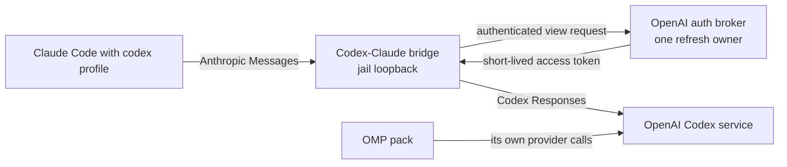

# One OMP pack, and a Codex subscription behind a Claude profile

**Status:** DECIDED, 2026-09-15. Nothing built. Existing-pack and credential
claims verified against the tree today; OMP behaviour checked against its upstream
documentation today.

> **In short.** OMP should arrive as an ordinary pack with its own state and
> provider configuration. A separate, opt-in Claude profile should route only
> Claude's model requests through a local Anthropic-to-Codex-Responses bridge,
> so a Codex subscription can power Claude Code without pretending the two
> clients share a native protocol or credential format.

**Why it matters.** OMP is useful as a multi-provider coding harness, while a
user with a Codex subscription can otherwise only use it through Codex or Pi. A
global endpoint override or copied refresh token would instead change normal
Claude launches and reintroduce the single-use-refresh race the OpenAI broker
exists to prevent.

**The shape.** An `omp` program pack; one `claude=codex` profile; the existing
OpenAI refresh owner; and a second wire-bridge route that speaks Anthropic
Messages inbound and OpenAI Codex Responses outbound.

**Cost.** The bridge must track both clients' protocol evolution and expand with
Claude Code rather than excluding known features for a smaller first release. The
selected profile consumes Codex subscription quota rather than Claude quota.

**Start at [§3](#3-the-profile-is-the-boundary)** — profile ownership prevents
an accidental global reroute.

**Needs your ruling:** **None.**

**Reads with:** [`openai-auth-broker.md`](openai-auth-broker.md) (the canonical
> credential owner), [`../reference/wire-bridge.md`](../reference/wire-bridge.md)
> (the existing in-jail translation service),
> [`profiles-as-pack-variants.md`](profiles-as-pack-variants.md) (profiles select
> a pack's own variant), and
> [`omp-and-codex-claude-profile-plan.md`](omp-and-codex-claude-profile-plan.md)
> (the implementation sketch, not yet a build hand-off).

---

## 1. Terms and verdict

- **OMP** — [Oh My Pi](https://github.com/open-horizon-labs/oh-omp), the
  terminal-first coding-agent distribution based on Pi. It is a program, not a
  provider or a yolo protocol.
- **Codex subscription** *(coined here; shorthand for the user's “Codex sub”)*
  — the ChatGPT-backed OAuth grant owned by yolo's OpenAI credential service.
  It is not an API key, nor a credential that another process may copy.
- **Codex-Claude bridge** *(coined here)* — the profile-specific wire-bridge
  route that accepts the Anthropic Messages dialect Claude Code emits and calls
  the Codex Responses service using a broker-issued access-token view. It is
  not a general OpenAI gateway and it does not run the Codex CLI as a subprocess.

My verdict is to add both capabilities, but to keep their ownership separate:

1. `packs/omp` owns OMP's executable, generated configuration, state declaration,
   and normal provider projection.
2. `packs/claude` owns the `codex` profile because a profile is a variant of the
   consuming pack's configuration, not a mutation contributed by another pack.
3. `packs/wire-bridge` owns protocol translation. `packs/openai-auth` remains
   the sole credential and refresh-token owner.

OMP is installed from its official package-manager distribution at a pinned
package version. Yolo does not vendor OMP or silently float to a new upstream
release; the supported version is recorded in the pack's diagnostics.

This follows the existing split: the pack system keeps core unaware of individual
agents; the wire bridge manufactures an endpoint rather than changing derives;
and the OpenAI service gives Codex and Pi credential *views*, never its canonical
refresh token. See [`pack-system.md`](../reference/pack-system.md),
[`wire-bridge.md`](../reference/wire-bridge.md), and
[`openai-auth-broker.md`](openai-auth-broker.md).

## 2. What already fits, and what does not

The selected-pack model already supports program packs, per-workspace state, config
surfaces, and profile-gated environment/config contributions. The Claude pack's
`bedrock` profile is the existing example. Its profile gate is the correct
extension point for `claude=codex`; no top-level agent registry or cross-pack
configuration writer is warranted.

The existing wire bridge translates Anthropic Messages to OpenAI
chat-completions, starts only when a selected profile needs it, and keeps its
endpoint on jail loopback. Codex subscription traffic instead uses OpenAI's
Responses dialect and needs an access token that only the OpenAI service may
refresh. Therefore this is a new bridge route and broker adapter, not a new
provider declaration containing a token.

OMP already has a multi-provider configuration model, native Codex OAuth support,
and its own task/subagent system according to its
[upstream documentation](https://github.com/open-horizon-labs/oh-omp). That makes
it a normal first-class agent pack; it does not make OMP the translator for Claude.

## 3. The profile is the boundary

The persistent spelling is `"use_profiles": {"claude": "codex"}` and the
one-launch spelling is `yolo -p claude=codex -- claude`. Selecting neither keeps
Claude's normal endpoint and authentication unchanged. Selecting a misspelled or
undeclared profile refuses before a jail starts.

The profile selects a provider fact with an Anthropic endpoint pointing to the
bridge. The endpoint is emitted only when the bridge's serve decision is true;
otherwise launch refuses with the missing service named. This preserves the
wire-bridge rule that a derived loopback URL is never written merely because a
provider exists.

The `codex` profile is permitted only when the OpenAI-auth pack is selected (or
added through a declared conditional dependency) and its credential preflight is
healthy. It must never fall back to `OPENAI_API_KEY`, a user's ordinary
`~/.codex/auth.json`, or Claude OAuth: those are distinct authorities whose
quota, revocation, and lifecycle differ.

The profile's default model alias is `terra`. The bridge resolves `terra` from
the selected Codex provider's declared model map; launch refuses if that alias is
absent or unreachable. A user may override the profile's `model` option with
another declared alias, but an omitted option always means `terra`.

## 4. Translation contract and failure behaviour

The bridge is a compatibility shim, not a claim that Claude Code and Codex
Responses are intrinsically identical. Its first release nevertheless targets
**maximal fidelity for the current Claude Code surface**: it must map every
known feature for which Codex Responses offers an equivalent, rather than
excluding thinking, caching, or beta features to reduce initial scope. Its
contract is:

| Claude-facing input | Bridge result | Rule |
| :--- | :--- | :--- |
| Messages, system prompt, text, images, tool definitions/results | Convert to an equivalent Codex Responses request | Preserve order and tool-call identity. |
| Streaming text and tool calls | Convert response events to Anthropic SSE | Do not buffer the full completion. |
| Model selection | Map the active profile alias to one declared Codex model | No hidden model fallback. |
| Usage, stop reason, and token counting | Translate where semantics match | Never substitute invented values. |
| Thinking and reasoning controls | Map to the equivalent Codex Responses reasoning mechanism | Preserve the visible stream shape that Claude Code relies on. |
| Prompt caching and recognized beta fields | Map to the corresponding Responses capability | Retain the request semantics and cache/accounting metadata where exposed. |
| A field with no Codex Responses equivalent | Refuse with a clear local 4xx response | The refusal identifies the feature; it is never silently stripped. |

Each request obtains an access-token view from the broker. The bridge holds that
view only in memory until expiry and retries an unauthorized upstream response
once after obtaining a newer view. It never persists the token, serializes
refreshes itself, or logs a request body, authorization header, tool arguments,
or token value.

Failures are explicit and bounded:

- **No broker grant / login required:** fail before Claude starts, with the
  broker's login instruction.
- **No equivalent upstream feature:** return a stable local 4xx response without
  contacting OpenAI, after the bridge has exhausted documented equivalent forms.
- **Transient upstream failure:** pass a retryable error through once; the bridge
  makes no second completion request because tool execution may be non-idempotent.
- **Bridge crash:** the supervised service restarts; an in-flight Claude request
  fails, and the next request starts cleanly.
- **Concurrent launches:** every bridge asks the one broker; no bridge may write
  credential state, so exactly one refresh can consume a rotation.

## 5. OMP as a pack

`packs/omp` exposes `omp` as a selectable program and declares an OMP-private
state root. The Prism renders OMP's provider catalog from yolo's provider facts,
using OMP's documented current configuration format. It also renders only the
base configuration when no OMP profile is selected: selecting a provider is the
same launch-time concern already used by Pi, Codex, and Claude.

OMP receives yolo's common briefing, workspace, autonomy posture, and MCP
configuration through its own declared surfaces. It may discover compatible
Claude/Codex project material as OMP's upstream feature does, but yolo does not
merge agent state directories or let OMP write another pack's generated files.
In particular, OMP's Codex provider must use the existing broker view rather
than independently logging in or reading Codex's workspace `auth.json`.

The pack's first implementation is limited to `jail`; host and `macos-user`
delivery follow only after OMP's binary distribution, generated-config path, and
broker adapter work on those notches. A selected but uninstalled executable uses
the standard program-pack install diagnosis.

## 6. What this does not license

- No generic “translate any provider to any provider” gateway.
- No global `ANTHROPIC_BASE_URL` or replacement of ordinary Claude authentication.
- No access to a canonical refresh token by OMP, the bridge, or Claude.
- No support for undocumented or semantically impossible Claude features; known
  documented features are implemented where Codex Responses has an equivalent.
- No coupling between OMP's subagent scheduler and Claude Code's own subagents.
- No claim that OpenAI subscription use is interchangeable with API-key use;
  availability, model access, quotas, and applicable terms remain upstream policy.

## 7. Alternatives considered

| Alternative | Verdict | Reason |
| :--- | :--- | :--- |
| Add OMP only | Rejected | It does not make the Codex subscription available to Claude Code. |
| Change Claude's default endpoint to Codex | Rejected | It is surprising, breaks normal Claude auth, and turns an opt-in quota choice into ambient state. |
| Copy `auth.json` or expose a refresh token to the bridge | Rejected | It violates the broker's single-writer design and reopens refresh-token rotation races. |
| Teach Claude's derive to call Codex Responses directly | Rejected | A derive emits configuration; it cannot speak, stream, or translate a wire protocol. |
| Run the Codex CLI for every Claude request | Rejected | It changes the interaction model, loses streaming/tool semantics, and makes a process harness a fragile protocol adapter. |
| Extend the existing wire bridge with a named Codex route | Adopt | It preserves one daemon lifecycle and endpoint discipline while keeping protocol routes explicit. |

## 8. Risks and observable completion

| Risk | Mitigation |
| :--- | :--- |
| Upstream protocol drift | Contract tests replay recorded redacted request/event fixtures for every supported Claude feature; unmappable new fields fail closed until implemented. |
| A token leaks through diagnostics | Token-redaction tests cover broker and bridge logs; only expiry, generation fingerprints, route, and status are observable. |
| Profile selection changes a normal Claude launch | Test the no-profile path and launch disclosure; only `claude=codex` may inject the bridge endpoint. |
| OMP's upstream config format changes | Pin and test the supported OMP release; its pack exposes the installed version in diagnostics. |
| Confusing quota attribution | Launch disclosure states `Claude profile: codex subscription via bridge` before the agent starts. |

Done is observable when:

1. `yolo -- omp` starts OMP with a rendered provider catalog and a private state
   directory, without writing Claude or Codex generated configuration.
2. `yolo -p claude=codex -- claude` streams an ordinary tool-using task through
   the bridge, while `yolo -- claude` retains its normal endpoint.
3. OMP, Codex, and two concurrent Claude-profile launches cross one expiry
   boundary with one upstream refresh and no credential file copied between them.
4. A known Claude Code feature with a Codex Responses equivalent has a contract
   fixture and works through the selected profile; a feature with no equivalent
   fails locally without an upstream request.

## Decision Ledger

| ID | Ruling / Decision | Date | Settled in | Built |
| :--- | :--- | :--- | :--- | :--- |
| OQ-OMP1 | Use OMP's official package-manager distribution, pinned by package version; do not vendor OMP. | 2026-09-15 | [§1](#1-terms-and-verdict) | — |
| OQ-OMP2 | Support every current Claude Code feature for which Codex Responses has an equivalent; do not deliberately narrow v1. Refuse only semantically impossible features. | 2026-09-15 | [§4](#4-translation-contract-and-failure-behaviour) | — |
| OQ-OMP3 | `terra` is the `claude=codex` default model alias; it is resolved through the declared provider model map. | 2026-09-15 | [§3](#3-the-profile-is-the-boundary) | — |
